# gson d84e26

https://github.com/google/gson.git/commit/d84e26

| Index | EnergyV1 | EnergyV2 | DeltaEnergy |
| --- | --- | --- | --- |
| 0 | 51127.74637182796 | 76454.55407707696 | 25326.807705248997 |
| 1 | 347647.0664848713 | 347255.44539927534 | -391.6210855959798 |
| 2 | 139059.38120219976 | 111734.34564539554 | -27325.035556804214 |
| 3 | 252163.28481867717 | 302587.847068856 | 50424.56225017883 |
| 4 | 3497735.783124692 | 3134838.054639311 | -362897.72848538077 |
| 5 | 647395.1032880782 | 646448.7748362758 | -946.328451802372 |
| 6 | 210904.11801278294 | 187606.62533751834 | -23297.4926752646 |
| 7 | 290751.7918502673 | 256021.81602537533 | -34729.975824892 |
| 8 | 729144.4253478708 | 785476.8535549107 | 56332.42820703995 |
| 9 | 750755.5881800747 | 766089.3668866691 | 15333.77870659437 |
| 10 | 575923.11679389 | 738238.9436870464 | 162315.8268931564 |
| 11 | 1244441.3577547332 | 1559249.5084674193 | 314808.1507126861 |
| 12 | 366072.52669434476 | 336634.2396594519 | -29438.287034892885 |
| 13 | 243026.6295734028 | 212085.1120357896 | -30941.517537613196 |
| 14 | 299647.74175576103 | 298160.60709839885 | -1487.134657362185 |
| 15 | 125173.62764803598 | 130515.1002106677 | 5341.472562631723 |
| 16 | 814689.3480841109 | 819381.5598672114 | 4692.211783100502 |
| 17 | 463532.091411093 | 449605.6770678601 | -13926.41434323293 |
| 18 | 97179.84522380467 | 104523.97110130596 | 7344.125877501283 |
| 19 | 642095.1270838826 | 336932.4080999578 | -305162.7189839248 |
| 20 | 420403.68783360696 | 433637.4294474252 | 13233.741613818216 |
| 21 | 1607534.9639894043 | 1505217.9062770405 | -102317.05771236378 |
| 22 | 235677.46815634106 | 264894.1985543728 | 29216.730398031767 |
| 23 | 888364.3595684939 | 1380617.3912219023 | 492253.0316534084 |
| 24 | 568205.31301022 | 544090.0470974132 | -24115.26591280673 |
| 25 | 547674.6996559271 | 855830.5321459965 | 308155.8324900693 |
| 26 | 94876.67484226951 | 43096.60188347208 | -51780.07295879743 |
| 27 | 163764.8522282758 | 156252.4467450155 | -7512.405483260285 |
| 28 | 197564.78073198814 | 86777.64585304144 | -110787.1348789467 |
| 29 | 307910.049378487 | 288618.7969067462 | -19291.252471740765 |
| 30 | 299366.3696394316 | 304277.65369316505 | 4911.284053733456 |
| 31 | 100461.21201209098 | 129276.26668791848 | 28815.0546758275 |
| 32 | 88036.12290791344 | 88896.81002058089 | 860.6871126674523 |
| 33 | 175373.74593902956 | 237998.2988949516 | 62624.55295592203 |
| 34 | 433835.6619378428 | 588351.3138390859 | 154515.65190124308 |
| 35 | 225887.03704573103 | 264946.3102685681 | 39059.27322283707 |
| 36 | 204344.86520847402 | 211326.32545753004 | 6981.460249056021 |
| 37 | 952731.125778224 | 301925.07262907736 | -650806.0531491466 |
| 38 | 276008.34177550755 | 160028.43642788933 | -115979.90534761822 |
| 39 | 363538.6164124084 | 410493.56050426635 | 46954.944091857935 |
| 40 | 223554.41214454907 | 216372.94169295457 | -7181.470451594505 |
| 41 | 181639.55625588982 | 198870.1840076956 | 17230.62775180579 |
| 42 | 266484.0313324499 | 312523.6034962783 | 46039.572163828416 |
| 43 | 130591.15897644457 | 127247.5982341781 | -3343.5607422664616 |
| 44 | 91022.5855528099 | 93145.00511319759 | 2122.419560387687 |
| 45 | 129229.09406421502 | 179662.92534575445 | 50433.83128153943 |
| 46 | 97643.23502078876 | 86910.47895811166 | -10732.756062677101 |
| 47 | 264459.06393302145 | 177315.64878442802 | -87143.41514859343 |
| 48 | 44077.83511483669 | 42690.99745899439 | -1386.8376558423042 |
| 49 | 45594.258597184664 | 73951.17733049573 | 28356.918733311068 |
| 50 | 59623.198675099076 | 43552.46294358146 | -16070.73573151762 |
| 51 | 49206.95209224513 | 41903.44403770901 | -7303.50805453612 |
| 52 | 132349.10472078313 | 132144.0071764261 | -205.09754435703508 |
| 53 | 381798.6345227957 | 401297.94009399414 | 19499.305571198463 |
| 54 | 148311.88609479868 | 149766.85061109124 | 1454.964516292559 |
| 55 | 43464.6674350745 | 44792.13858808066 | 1327.4711530061613 |
| 56 | 125110.25797279477 | 131125.83234228753 | 6015.574369492751 |
| 57 | 91264.4829439855 | 100028.26263705616 | 8763.779693070668 |
| 58 | 86212.1798081398 | 628874.6868707836 | 542662.5070626438 |

| Index | DurationV1 | DurationsV2 | DeltaDuration |
| --- | --- | --- | --- |
| 0 | 1511814.4594100548 | 2160076.8442528304 | 648262.3848427755 |
| 1 | 7411730.678151161 | 6530936.727494411 | -880793.9506567502 |
| 2 | 3169044.9555175435 | 2302482.539554637 | -866562.4159629066 |
| 3 | 4738035.424961772 | 6254099.156485446 | 1516063.731523674 |
| 4 | 76081268.31056693 | 61356266.485875495 | -14725001.824691437 |
| 5 | 7767455.019751575 | 7066367.262707244 | -701087.7570443312 |
| 6 | 5648976.394648953 | 4679199.2951568905 | -969777.0994920628 |
| 7 | 7688156.009795828 | 6132336.967870383 | -1555819.0419254452 |
| 8 | 17555114.82341906 | 20075283.22934787 | 2520168.405928809 |
| 9 | 18633392.124729455 | 16741493.245621469 | -1891898.8791079856 |
| 10 | 10944299.29643336 | 18611987.114412114 | 7667687.817978755 |
| 11 | 25795118.406174704 | 36046653.91127781 | 10251535.505103104 |
| 12 | 6171669.24790933 | 5089877.941264367 | -1081791.306644963 |
| 13 | 4043342.8983908696 | 3724339.2626338955 | -319003.6357569741 |
| 14 | 6418049.24888208 | 6689671.623237354 | 271622.3743552733 |
| 15 | 2024008.8891981356 | 2041495.71581801 | 17486.826619874453 |
| 16 | 15341529.866819657 | 15880572.717609862 | 539042.8507902045 |
| 17 | 9480765.194178248 | 9440348.802258657 | -40416.39191959053 |
| 18 | 1778591.3682604989 | 1725481.5856824024 | -53109.78257809649 |
| 19 | 13407507.00172295 | 4538651.505911641 | -8868855.49581131 |
| 20 | 7774215.362093592 | 7173541.120680736 | -600674.2414128557 |
| 21 | 25130387.118110858 | 16267627.130012687 | -8862759.98809817 |
| 22 | 3850620.1551222154 | 4773707.887350664 | 923087.7322284481 |
| 23 | 15457766.84288732 | 29472378.216075733 | 14014611.373188414 |
| 24 | 11931920.249156162 | 10296236.943431046 | -1635683.3057251163 |
| 25 | 13404816.58524498 | 24588768.3408034 | 11183951.75555842 |
| 26 | 1951085.0589205357 | 895348.2703721463 | -1055736.7885483894 |
| 27 | 3849823.5590474056 | 3310560.732467344 | -539262.8265800616 |
| 28 | 4165191.6208077134 | 1012359.1490886579 | -3152832.4717190554 |
| 29 | 7176667.0395328505 | 6949170.773063961 | -227496.26646888908 |
| 30 | 4786909.300302779 | 5045693.189361173 | 258783.88905839343 |
| 31 | 2685970.4858901845 | 2890437.403004504 | 204466.91711431928 |
| 32 | 908510.9375457824 | 817125.9257390648 | -91385.01180671761 |
| 33 | 4127909.801419665 | 5964096.05614449 | 1836186.2547248248 |
| 34 | 6627615.970439514 | 12082240.686775923 | 5454624.716336409 |
| 35 | 3734559.8003260605 | 4883013.37242399 | 1148453.5720979292 |
| 36 | 4865222.768228862 | 4653080.52711355 | -212142.2411153121 |
| 37 | 26081677.90064036 | 4423060.455470063 | -21658617.4451703 |
| 38 | 7041441.24516852 | 3980595.984102471 | -3060845.2610660493 |
| 39 | 9228989.73261348 | 9593338.650822133 | 364348.9182086531 |
| 40 | 5010831.700597277 | 3061162.889303762 | -1949668.811293515 |
| 41 | 2569923.226751394 | 4339109.766175306 | 1769186.5394239123 |
| 42 | 5818262.500204774 | 6887076.5655576335 | 1068814.06535286 |
| 43 | 1780396.373364008 | 2398770.7195977047 | 618374.3462336967 |
| 44 | 1780431.6923253993 | 2177312.5610359083 | 396880.86871050904 |
| 45 | 2763827.6864699605 | 4167757.1382981134 | 1403929.4518281529 |
| 46 | 3027384.018067384 | 2125412.6475087716 | -901971.3705586125 |
| 47 | 7972280.394250646 | 3038094.9694518186 | -4934185.424798828 |
| 48 | 633939.0998925213 | 466211.5475189388 | -167727.5523735825 |
| 49 | 1310778.2187836433 | 2398752.9677950884 | 1087974.749011445 |
| 50 | 1261599.982973509 | 1083628.7960908257 | -177971.1868826833 |
| 51 | 892445.6874079705 | 942405.407346264 | 49959.71993829345 |
| 52 | 1637187.55771367 | 1443651.4736098954 | -193536.0841037745 |
| 53 | 5636114.076739997 | 4086067.3068062067 | -1550046.76993379 |
| 54 | 2145922.6689655012 | 2111614.359084608 | -34308.30988089321 |
| 55 | 751554.2666734369 | 713231.5234871025 | -38322.74318633438 |
| 56 | 1428343.6671970515 | 1950748.3200941104 | 522404.652897059 |
| 57 | 1584327.558336338 | 1961593.1003920278 | 377265.54205568973 |
| 58 | 862895.7956023216 | 18037326.46864581 | 17174430.67304349 |

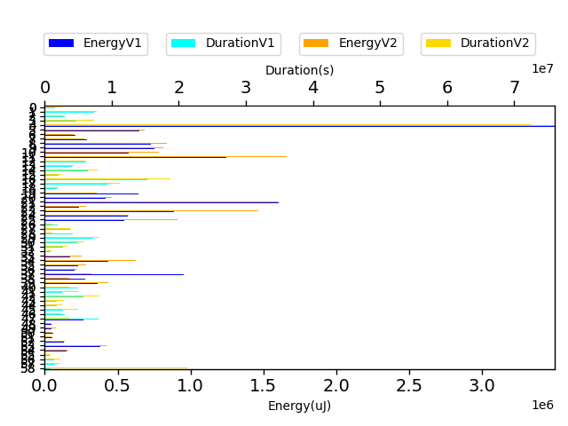

| Index | TestClassName | #Tests |
| --- | --- | --- |
| 0 | com.google.gson.functional.StreamingTypeAdaptersTest | 1 |
| 1 | com.google.gson.functional.JsonAdapterAnnotationOnClassesTest | 7 |
| 2 | com.google.gson.functional.CustomDeserializerTest | 2 |
| 3 | com.google.gson.functional.ExclusionStrategyFunctionalTest | 5 |
| 4 | com.google.gson.functional.DefaultTypeAdaptersTest | 39 |
| 5 | com.google.gson.functional.ArrayTest | 15 |
| 6 | com.google.gson.functional.JsonAdapterSerializerDeserializerTest | 3 |
| 7 | com.google.gson.functional.ThrowableFunctionalTest | 5 |
| 8 | com.google.gson.functional.ParameterizedTypesTest | 12 |
| 9 | com.google.gson.functional.CircularReferenceTest | 5 |
| 10 | com.google.gson.functional.InheritanceTest | 11 |
| 11 | com.google.gson.functional.MapTest | 26 |
| 12 | com.google.gson.functional.PrettyPrintingTest | 8 |
| 13 | com.google.gson.functional.ReadersWritersTest | 5 |
| 14 | com.google.gson.functional.ExposeFieldsTest | 5 |
| 15 | com.google.gson.functional.FieldExclusionTest | 3 |
| 16 | com.google.gson.functional.CollectionTest | 18 |
| 17 | com.google.gson.functional.EnumTest | 9 |
| 18 | com.google.gson.functional.DelegateTypeAdapterTest | 2 |
| 19 | com.google.gson.functional.TypeAdapterPrecedenceTest | 8 |
| 20 | com.google.gson.functional.NamingPolicyTest | 9 |
| 21 | com.google.gson.functional.PrimitiveTest | 35 |
| 22 | com.google.gson.functional.CustomSerializerTest | 5 |
| 23 | com.google.gson.functional.ObjectTest | 20 |
| 24 | com.google.gson.functional.CustomTypeAdaptersTest | 12 |
| 25 | com.google.gson.functional.JsonAdapterAnnotationOnFieldsTest | 9 |
| 26 | com.google.gson.functional.SerializedNameTest | 1 |
| 27 | com.google.gson.functional.TypeHierarchyAdapterTest | 2 |
| 28 | com.google.gson.functional.SecurityTest | 2 |
| 29 | com.google.gson.functional.VersioningTest | 5 |
| 30 | com.google.gson.functional.JavaUtilConcurrentAtomicTest | 7 |
| 31 | com.google.gson.functional.RuntimeTypeAdapterFactoryFunctionalTest | 1 |
| 32 | com.google.gson.LongSerializationPolicyTest | 2 |
| 33 | com.google.gson.functional.TypeVariableTest | 3 |
| 34 | com.google.gson.functional.NullObjectAndFieldTest | 10 |
| 35 | com.google.gson.functional.FieldNamingTest | 5 |
| 36 | com.google.gson.functional.RawSerializationTest | 5 |
| 37 | com.google.gson.MixedStreamTest | 7 |
| 38 | com.google.gson.functional.MapAsArrayTypeAdapterTest | 3 |
| 39 | com.google.gson.functional.ConcurrencyTest | 2 |
| 40 | com.google.gson.functional.EscapingTest | 5 |
| 41 | com.google.gson.functional.JsonTreeTest | 4 |
| 42 | com.google.gson.functional.MoreSpecificTypeSerializationTest | 6 |
| 43 | com.google.gson.DefaultMapJsonSerializerTest | 3 |
| 44 | com.google.gson.functional.InterfaceTest | 2 |
| 45 | com.google.gson.functional.JavaUtilTest | 2 |
| 46 | com.google.gson.DefaultInetAddressTypeAdapterTest | 1 |
| 47 | com.google.gson.GsonTypeAdapterTest | 4 |
| 48 | com.google.gson.functional.PrimitiveCharacterTest | 1 |
| 49 | com.google.gson.regression.JsonAdapterNullSafeTest | 1 |
| 50 | com.google.gson.functional.TreeTypeAdaptersTest | 1 |
| 51 | com.google.gson.JsonParserTest | 1 |
| 52 | com.google.gson.OverrideCoreTypeAdaptersTest | 3 |
| 53 | com.google.gson.functional.StringTest | 9 |
| 54 | com.google.gson.functional.PrintFormattingTest | 3 |
| 55 | com.google.gson.functional.InternationalizationTest | 1 |
| 56 | com.google.gson.functional.UncategorizedTest | 3 |
| 57 | com.google.gson.GsonBuilderTest | 2 |
| 58 | com.google.gson.JsonObjectTest | 2 |

| Time Label | Time (s) |
| --- | --- |
| Selection | 35.66436457633972 |
| Injection | 21.651169061660767 |
| Total | 1660.688430070877 |
## com.google.gson.functional.StreamingTypeAdaptersTest

| Test | IterationV1 | IterationV2 | DeltaIteration |
| --- | --- | --- | --- |
| com.google.gson.functional.StreamingTypeAdaptersTest-testNullSafe | 99 | 99 | 0 |

| Test | EnergyV1 | EnergyV2 | DeltaEnergy |
| --- | --- | --- | --- |
| com.google.gson.functional.StreamingTypeAdaptersTest-testNullSafe | 51127.74637182796 | 76454.55407707696 | 25326.807705248997 |

| Test | DurationV1 | DurationsV2 | DeltaDuration |
| --- | --- | --- | --- |
| com.google.gson.functional.StreamingTypeAdaptersTest-testNullSafe | 1511814.4594100548 | 2160076.8442528304 | 648262.3848427755 |

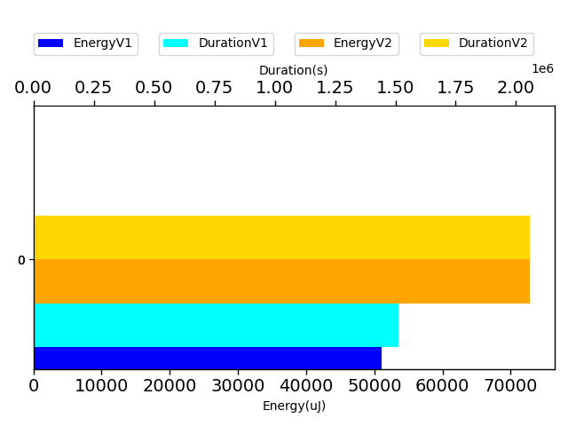

## com.google.gson.functional.JsonAdapterAnnotationOnClassesTest

| Test | IterationV1 | IterationV2 | DeltaIteration |
| --- | --- | --- | --- |
| com.google.gson.functional.JsonAdapterAnnotationOnClassesTest-testJsonAdapterInvoked | 99 | 99 | 0 |
| com.google.gson.functional.JsonAdapterAnnotationOnClassesTest-testRegisteredDeserializerOverridesJsonAdapter | 93 | 56 | -37 |
| com.google.gson.functional.JsonAdapterAnnotationOnClassesTest-testIncorrectTypeAdapterFails | 43 | 47 | 4 |
| com.google.gson.functional.JsonAdapterAnnotationOnClassesTest-testJsonAdapterFactoryInvoked | 80 | 78 | -2 |
| com.google.gson.functional.JsonAdapterAnnotationOnClassesTest-testRegisteredAdapterOverridesJsonAdapter | 40 | 50 | 10 |
| com.google.gson.functional.JsonAdapterAnnotationOnClassesTest-testRegisteredSerializerOverridesJsonAdapter | 60 | 42 | -18 |
| com.google.gson.functional.JsonAdapterAnnotationOnClassesTest-testSuperclassTypeAdapterNotInvoked | 59 | 42 | -17 |

| Test | EnergyV1 | EnergyV2 | DeltaEnergy |
| --- | --- | --- | --- |
| com.google.gson.functional.JsonAdapterAnnotationOnClassesTest-testJsonAdapterInvoked | 73997.96956180061 | 87660.0562261666 | 13662.086664365997 |
| com.google.gson.functional.JsonAdapterAnnotationOnClassesTest-testRegisteredDeserializerOverridesJsonAdapter | 52410.37566773483 | 43934.881664435816 | -8475.494003299013 |
| com.google.gson.functional.JsonAdapterAnnotationOnClassesTest-testIncorrectTypeAdapterFails | 42291.42046348883 | 42822.676237722495 | 531.2557742336649 |
| com.google.gson.functional.JsonAdapterAnnotationOnClassesTest-testJsonAdapterFactoryInvoked | 45841.15074854407 | 43412.800591200845 | -2428.3501573432222 |
| com.google.gson.functional.JsonAdapterAnnotationOnClassesTest-testRegisteredAdapterOverridesJsonAdapter | 41629.77027123313 | 43007.00166688304 | 1377.2313956499129 |
| com.google.gson.functional.JsonAdapterAnnotationOnClassesTest-testRegisteredSerializerOverridesJsonAdapter | 45849.646995586096 | 44646.97903947519 | -1202.667956110905 |
| com.google.gson.functional.JsonAdapterAnnotationOnClassesTest-testSuperclassTypeAdapterNotInvoked | 45626.73277648376 | 41771.04997339136 | -3855.6828030924007 |

| Test | DurationV1 | DurationsV2 | DeltaDuration |
| --- | --- | --- | --- |
| com.google.gson.functional.JsonAdapterAnnotationOnClassesTest-testJsonAdapterInvoked | 1716173.038159246 | 2227971.577904868 | 511798.53974562185 |
| com.google.gson.functional.JsonAdapterAnnotationOnClassesTest-testRegisteredDeserializerOverridesJsonAdapter | 1418013.3161803847 | 657671.5907455091 | -760341.7254348756 |
| com.google.gson.functional.JsonAdapterAnnotationOnClassesTest-testIncorrectTypeAdapterFails | 867969.723222798 | 694206.2241592889 | -173763.49906350905 |
| com.google.gson.functional.JsonAdapterAnnotationOnClassesTest-testJsonAdapterFactoryInvoked | 1046311.66312836 | 1014375.8777050127 | -31935.785423347377 |
| com.google.gson.functional.JsonAdapterAnnotationOnClassesTest-testRegisteredAdapterOverridesJsonAdapter | 622250.4865712561 | 609685.4188426727 | -12565.067728583352 |
| com.google.gson.functional.JsonAdapterAnnotationOnClassesTest-testRegisteredSerializerOverridesJsonAdapter | 960547.0778460943 | 657035.226987554 | -303511.8508585403 |
| com.google.gson.functional.JsonAdapterAnnotationOnClassesTest-testSuperclassTypeAdapterNotInvoked | 780465.373043022 | 669990.8111495071 | -110474.56189351494 |

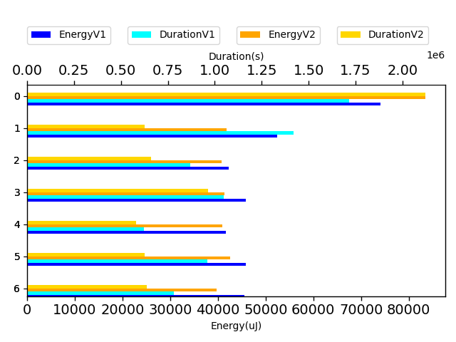

## com.google.gson.functional.CustomDeserializerTest

| Test | IterationV1 | IterationV2 | DeltaIteration |
| --- | --- | --- | --- |
| com.google.gson.functional.CustomDeserializerTest-testDefaultConstructorNotCalledOnObject | 45 | 51 | 6 |
| com.google.gson.functional.CustomDeserializerTest-testDefaultConstructorNotCalledOnField | 58 | 55 | -3 |

| Test | EnergyV1 | EnergyV2 | DeltaEnergy |
| --- | --- | --- | --- |
| com.google.gson.functional.CustomDeserializerTest-testDefaultConstructorNotCalledOnObject | 85279.61415472536 | 70426.06200110483 | -14853.552153620534 |
| com.google.gson.functional.CustomDeserializerTest-testDefaultConstructorNotCalledOnField | 53779.7670474744 | 41308.28364429071 | -12471.483403183694 |

| Test | DurationV1 | DurationsV2 | DeltaDuration |
| --- | --- | --- | --- |
| com.google.gson.functional.CustomDeserializerTest-testDefaultConstructorNotCalledOnObject | 2244918.2890546247 | 1573779.92144833 | -671138.3676062948 |
| com.google.gson.functional.CustomDeserializerTest-testDefaultConstructorNotCalledOnField | 924126.6664629189 | 728702.6181063072 | -195424.04835661163 |

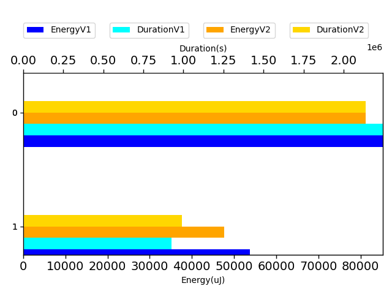

## com.google.gson.functional.ExclusionStrategyFunctionalTest

| Test | IterationV1 | IterationV2 | DeltaIteration |
| --- | --- | --- | --- |
| com.google.gson.functional.ExclusionStrategyFunctionalTest-testExclusionStrategySerializationDoesNotImpactSerialization | 41 | 36 | -5 |
| com.google.gson.functional.ExclusionStrategyFunctionalTest-testExclusionStrategySerialization | 99 | 99 | 0 |
| com.google.gson.functional.ExclusionStrategyFunctionalTest-testExclusionStrategyWithMode | 51 | 67 | 16 |
| com.google.gson.functional.ExclusionStrategyFunctionalTest-testExcludeTopLevelClassDeserializationDoesNotImpactSerialization | 31 | 27 | -4 |
| com.google.gson.functional.ExclusionStrategyFunctionalTest-testExcludeTopLevelClassSerialization | 18 | 15 | -3 |

| Test | EnergyV1 | EnergyV2 | DeltaEnergy |
| --- | --- | --- | --- |
| com.google.gson.functional.ExclusionStrategyFunctionalTest-testExclusionStrategySerializationDoesNotImpactSerialization | 43590.76543933995 | 42683.635165777785 | -907.1302735621648 |
| com.google.gson.functional.ExclusionStrategyFunctionalTest-testExclusionStrategySerialization | 75645.50396470219 | 114717.56317682519 | 39072.059212123 |
| com.google.gson.functional.ExclusionStrategyFunctionalTest-testExclusionStrategyWithMode | 46305.3369369752 | 62908.85465358031 | 16603.517716605107 |
| com.google.gson.functional.ExclusionStrategyFunctionalTest-testExcludeTopLevelClassDeserializationDoesNotImpactSerialization | 41837.615260496736 | 43544.655217692256 | 1707.0399571955204 |
| com.google.gson.functional.ExclusionStrategyFunctionalTest-testExcludeTopLevelClassSerialization | 44784.063217163086 | 38733.13885498047 | -6050.924362182617 |

| Test | DurationV1 | DurationsV2 | DeltaDuration |
| --- | --- | --- | --- |
| com.google.gson.functional.ExclusionStrategyFunctionalTest-testExclusionStrategySerializationDoesNotImpactSerialization | 612332.6264601339 | 1008166.4028435266 | 395833.77638339263 |
| com.google.gson.functional.ExclusionStrategyFunctionalTest-testExclusionStrategySerialization | 2204966.2710269885 | 2990652.446781194 | 785686.1757542053 |
| com.google.gson.functional.ExclusionStrategyFunctionalTest-testExclusionStrategyWithMode | 1040645.3690057655 | 1237770.7173678684 | 197125.34836210287 |
| com.google.gson.functional.ExclusionStrategyFunctionalTest-testExcludeTopLevelClassDeserializationDoesNotImpactSerialization | 523664.75730768964 | 519324.5471954942 | -4340.210112195462 |
| com.google.gson.functional.ExclusionStrategyFunctionalTest-testExcludeTopLevelClassSerialization | 356426.40116119385 | 498185.0422973633 | 141758.64113616943 |

## com.google.gson.functional.DefaultTypeAdaptersTest

| Test | IterationV1 | IterationV2 | DeltaIteration |
| --- | --- | --- | --- |
| com.google.gson.functional.DefaultTypeAdaptersTest-testDateSerializationWithPatternNotOverridenByTypeAdapter | 62 | 64 | 2 |
| com.google.gson.functional.DefaultTypeAdaptersTest-testDateSerializationWithPattern | 75 | 70 | -5 |
| com.google.gson.functional.DefaultTypeAdaptersTest-testDefaultJavaSqlTimestampSerialization | 63 | 67 | 4 |
| com.google.gson.functional.DefaultTypeAdaptersTest-testLocaleSerializationWithLanguageCountryVariant | 24 | 21 | -3 |
| com.google.gson.functional.DefaultTypeAdaptersTest-testUrlSerialization | 99 | 99 | 0 |
| com.google.gson.functional.DefaultTypeAdaptersTest-testClassSerialization | 59 | 53 | -6 |
| com.google.gson.functional.DefaultTypeAdaptersTest-testTimestampSerialization | 53 | 58 | 5 |
| com.google.gson.functional.DefaultTypeAdaptersTest-testDefaultDateDeserializationUsingBuilder | 99 | 99 | 0 |
| com.google.gson.functional.DefaultTypeAdaptersTest-testUrlNullSerialization | 65 | 64 | -1 |
| com.google.gson.functional.DefaultTypeAdaptersTest-testNullSerialization | 99 | 99 | 0 |
| com.google.gson.functional.DefaultTypeAdaptersTest-testDateDeserializationWithPattern | 63 | 67 | 4 |
| com.google.gson.functional.DefaultTypeAdaptersTest-testDateSerializationInCollection | 97 | 96 | -1 |
| com.google.gson.functional.DefaultTypeAdaptersTest-testBigIntegerFieldSerialization | 79 | 75 | -4 |
| com.google.gson.functional.DefaultTypeAdaptersTest-testStringBufferSerialization | 13 | 14 | 1 |
| com.google.gson.functional.DefaultTypeAdaptersTest-testDefaultGregorianCalendarSerialization | 20 | 20 | 0 |
| com.google.gson.functional.DefaultTypeAdaptersTest-testBigDecimalFieldSerialization | 80 | 85 | 5 |
| com.google.gson.functional.DefaultTypeAdaptersTest-testDefaultDateSerializationUsingBuilder | 46 | 54 | 8 |
| com.google.gson.functional.DefaultTypeAdaptersTest-testBitSetDeserialization | 34 | 33 | -1 |
| com.google.gson.functional.DefaultTypeAdaptersTest-testOverrideBigIntegerTypeAdapter | 69 | 62 | -7 |
| com.google.gson.functional.DefaultTypeAdaptersTest-testSqlDateSerialization | 63 | 50 | -13 |
| com.google.gson.functional.DefaultTypeAdaptersTest-testUuidSerialization | 19 | 26 | 7 |
| com.google.gson.functional.DefaultTypeAdaptersTest-testUriSerialization | 21 | 21 | 0 |
| com.google.gson.functional.DefaultTypeAdaptersTest-testLocaleSerializationWithLanguage | 16 | 18 | 2 |
| com.google.gson.functional.DefaultTypeAdaptersTest-testDefaultCalendarSerialization | 23 | 21 | -2 |
| com.google.gson.functional.DefaultTypeAdaptersTest-testTreeSetSerialization | 47 | 32 | -15 |
| com.google.gson.functional.DefaultTypeAdaptersTest-testDefaultJavaSqlTimeSerialization | 42 | 35 | -7 |
| com.google.gson.functional.DefaultTypeAdaptersTest-testJsonPrimitiveSerialization | 26 | 22 | -4 |
| com.google.gson.functional.DefaultTypeAdaptersTest-testBitSetSerialization | 28 | 23 | -5 |
| com.google.gson.functional.DefaultTypeAdaptersTest-testDefaultDateSerialization | 76 | 73 | -3 |
| com.google.gson.functional.DefaultTypeAdaptersTest-testDefaultJavaSqlDateSerialization | 31 | 42 | 11 |
| com.google.gson.functional.DefaultTypeAdaptersTest-testSetSerialization | 35 | 35 | 0 |
| com.google.gson.functional.DefaultTypeAdaptersTest-testJsonArraySerialization | 17 | 14 | -3 |
| com.google.gson.functional.DefaultTypeAdaptersTest-testJsonNullSerialization | 10 | 9 | -1 |
| com.google.gson.functional.DefaultTypeAdaptersTest-testPropertiesSerialization | 19 | 15 | -4 |
| com.google.gson.functional.DefaultTypeAdaptersTest-testJsonObjectSerialization | 21 | 22 | 1 |
| com.google.gson.functional.DefaultTypeAdaptersTest-testLocaleSerializationWithLanguageCountry | 14 | 14 | 0 |
| com.google.gson.functional.DefaultTypeAdaptersTest-testNullJsonElementSerialization | 13 | 14 | 1 |
| com.google.gson.functional.DefaultTypeAdaptersTest-testOverrideBigDecimalTypeAdapter | 25 | 32 | 7 |
| com.google.gson.functional.DefaultTypeAdaptersTest-testStringBuilderSerialization | 11 | 17 | 6 |

| Test | EnergyV1 | EnergyV2 | DeltaEnergy |
| --- | --- | --- | --- |
| com.google.gson.functional.DefaultTypeAdaptersTest-testDateSerializationWithPatternNotOverridenByTypeAdapter | 42713.05021536454 | 41913.14993557839 | -799.900279786154 |
| com.google.gson.functional.DefaultTypeAdaptersTest-testDateSerializationWithPattern | 42869.81927948671 | 43994.18642513679 | 1124.3671456500815 |
| com.google.gson.functional.DefaultTypeAdaptersTest-testDefaultJavaSqlTimestampSerialization | 40082.300298586706 | 42147.83635384793 | 2065.5360552612256 |
| com.google.gson.functional.DefaultTypeAdaptersTest-testLocaleSerializationWithLanguageCountryVariant | 41247.87427097559 | 42718.13025188446 | 1470.2559809088707 |
| com.google.gson.functional.DefaultTypeAdaptersTest-testUrlSerialization | 255470.4221998955 | 262367.25394333154 | 6896.831743436051 |
| com.google.gson.functional.DefaultTypeAdaptersTest-testClassSerialization | 41085.68848417234 | 43017.19539038742 | 1931.5069062150797 |
| com.google.gson.functional.DefaultTypeAdaptersTest-testTimestampSerialization | 43086.25907009047 | 41381.00197588718 | -1705.2570942032908 |
| com.google.gson.functional.DefaultTypeAdaptersTest-testDefaultDateDeserializationUsingBuilder | 351036.1186385553 | 313199.2782869485 | -37836.84035160678 |
| com.google.gson.functional.DefaultTypeAdaptersTest-testUrlNullSerialization | 38390.69005784856 | 43876.517056442724 | 5485.826998594166 |
| com.google.gson.functional.DefaultTypeAdaptersTest-testNullSerialization | 1009611.8808763246 | 1005668.6037294888 | -3943.2771468358114 |
| com.google.gson.functional.DefaultTypeAdaptersTest-testDateDeserializationWithPattern | 41295.26776222897 | 40493.00877968612 | -802.2589825428513 |
| com.google.gson.functional.DefaultTypeAdaptersTest-testDateSerializationInCollection | 48919.20421016855 | 41804.134470988996 | -7115.069739179555 |
| com.google.gson.functional.DefaultTypeAdaptersTest-testBigIntegerFieldSerialization | 40875.270397812565 | 43860.4683031225 | 2985.197905309935 |
| com.google.gson.functional.DefaultTypeAdaptersTest-testStringBufferSerialization | 43693.18322753906 | 41260.65856933594 | -2432.524658203125 |
| com.google.gson.functional.DefaultTypeAdaptersTest-testDefaultGregorianCalendarSerialization | 43456.37633419037 | 41455.933671951294 | -2000.4426622390747 |
| com.google.gson.functional.DefaultTypeAdaptersTest-testBigDecimalFieldSerialization | 68661.3832076337 | 61687.35779959756 | -6974.025408036141 |
| com.google.gson.functional.DefaultTypeAdaptersTest-testDefaultDateSerializationUsingBuilder | 42658.34585489752 | 43918.485014568796 | 1260.1391596712783 |
| com.google.gson.functional.DefaultTypeAdaptersTest-testBitSetDeserialization | 40999.34890112013 | 43107.03800240066 | 2107.689101280528 |
| com.google.gson.functional.DefaultTypeAdaptersTest-testOverrideBigIntegerTypeAdapter | 42679.661477558155 | 42933.47699448708 | 253.8155169289239 |
| com.google.gson.functional.DefaultTypeAdaptersTest-testSqlDateSerialization | 41797.618044611154 | 41714.42988772539 | -83.18815688576433 |
| com.google.gson.functional.DefaultTypeAdaptersTest-testUuidSerialization | 42651.91946411133 | 41708.08949834108 | -943.8299657702446 |
| com.google.gson.functional.DefaultTypeAdaptersTest-testUriSerialization | 38136.45830631256 | 43789.416467666626 | 5652.958161354065 |
| com.google.gson.functional.DefaultTypeAdaptersTest-testLocaleSerializationWithLanguage | 41943.454681396484 | 42502.10479736328 | 558.6501159667969 |
| com.google.gson.functional.DefaultTypeAdaptersTest-testDefaultCalendarSerialization | 42729.77067780495 | 43100.189613342285 | 370.41893553733826 |
| com.google.gson.functional.DefaultTypeAdaptersTest-testTreeSetSerialization | 42317.5220199732 | 42985.36167743616 | 667.8396574629587 |
| com.google.gson.functional.DefaultTypeAdaptersTest-testDefaultJavaSqlTimeSerialization | 43747.30341060602 | 43188.563487367646 | -558.7399232383759 |
| com.google.gson.functional.DefaultTypeAdaptersTest-testJsonPrimitiveSerialization | 41801.59660485387 | 40683.2765083313 | -1118.3200965225697 |
| com.google.gson.functional.DefaultTypeAdaptersTest-testBitSetSerialization | 41769.41001714021 | 42396.17844891548 | 626.7684317752719 |
| com.google.gson.functional.DefaultTypeAdaptersTest-testDefaultDateSerialization | 369105.1447349213 | 41767.82792055413 | -327337.31681436714 |
| com.google.gson.functional.DefaultTypeAdaptersTest-testDefaultJavaSqlDateSerialization | 41024.94075743761 | 41212.67976801071 | 187.73901057310286 |
| com.google.gson.functional.DefaultTypeAdaptersTest-testSetSerialization | 40290.93182255165 | 41118.06892783998 | 827.1371052883333 |
| com.google.gson.functional.DefaultTypeAdaptersTest-testJsonArraySerialization | 43286.69692993164 | 42637.1513671875 | -649.5455627441406 |
| com.google.gson.functional.DefaultTypeAdaptersTest-testJsonNullSerialization | 43386.439453125 | 42663.578125 | -722.861328125 |
| com.google.gson.functional.DefaultTypeAdaptersTest-testPropertiesSerialization | 42354.74722671509 | 42825.197509765625 | 470.4502830505371 |
| com.google.gson.functional.DefaultTypeAdaptersTest-testJsonObjectSerialization | 55270.76116275787 | 50042.548153162 | -5228.213009595871 |
| com.google.gson.functional.DefaultTypeAdaptersTest-testLocaleSerializationWithLanguageCountry | 40856.581298828125 | 44026.988037109375 | 3170.40673828125 |
| com.google.gson.functional.DefaultTypeAdaptersTest-testNullJsonElementSerialization | 43567.203857421875 | 41421.783203125 | -2145.420654296875 |
| com.google.gson.functional.DefaultTypeAdaptersTest-testOverrideBigDecimalTypeAdapter | 40008.13691318035 | 42166.118398421444 | 2157.9814852410927 |
| com.google.gson.functional.DefaultTypeAdaptersTest-testStringBuilderSerialization | 42857.0009765625 | 42084.78788757324 | -772.2130889892578 |

| Test | DurationV1 | DurationsV2 | DeltaDuration |
| --- | --- | --- | --- |
| com.google.gson.functional.DefaultTypeAdaptersTest-testDateSerializationWithPatternNotOverridenByTypeAdapter | 1216886.270225034 | 821918.7382254407 | -394967.53199959337 |
| com.google.gson.functional.DefaultTypeAdaptersTest-testDateSerializationWithPattern | 950696.6055482451 | 904783.1211959978 | -45913.484352247324 |
| com.google.gson.functional.DefaultTypeAdaptersTest-testDefaultJavaSqlTimestampSerialization | 1048423.267685222 | 920022.8762447678 | -128400.39144045417 |
| com.google.gson.functional.DefaultTypeAdaptersTest-testLocaleSerializationWithLanguageCountryVariant | 492144.2799913883 | 403893.7496738434 | -88250.53031754494 |
| com.google.gson.functional.DefaultTypeAdaptersTest-testUrlSerialization | 7109191.365962171 | 6644749.017356511 | -464442.3486056598 |
| com.google.gson.functional.DefaultTypeAdaptersTest-testClassSerialization | 968534.9058235053 | 771791.7202538041 | -196743.18556970113 |
| com.google.gson.functional.DefaultTypeAdaptersTest-testTimestampSerialization | 733924.011066102 | 757487.7300705475 | 23563.719004445593 |
| com.google.gson.functional.DefaultTypeAdaptersTest-testDefaultDateDeserializationUsingBuilder | 8871446.38058607 | 7691088.383669417 | -1180357.9969166517 |
| com.google.gson.functional.DefaultTypeAdaptersTest-testUrlNullSerialization | 1001958.9270599505 | 887025.3253296508 | -114933.60173029976 |
| com.google.gson.functional.DefaultTypeAdaptersTest-testNullSerialization | 25753554.3184745 | 23552605.71905604 | -2200948.5994184613 |
| com.google.gson.functional.DefaultTypeAdaptersTest-testDateDeserializationWithPattern | 873338.9498350936 | 839257.5260822556 | -34081.42375283793 |
| com.google.gson.functional.DefaultTypeAdaptersTest-testDateSerializationInCollection | 1312719.6076889557 | 1198882.1546535767 | -113837.45303537906 |
| com.google.gson.functional.DefaultTypeAdaptersTest-testBigIntegerFieldSerialization | 1141894.5633996283 | 1108751.3638846525 | -33143.19951497577 |
| com.google.gson.functional.DefaultTypeAdaptersTest-testStringBufferSerialization | 335183.3420410156 | 345426.5343017578 | 10243.192260742188 |
| com.google.gson.functional.DefaultTypeAdaptersTest-testDefaultGregorianCalendarSerialization | 376539.8490123749 | 439966.5099811554 | 63426.66096878052 |
| com.google.gson.functional.DefaultTypeAdaptersTest-testBigDecimalFieldSerialization | 1474533.6800076002 | 1392685.8851811737 | -81847.79482642654 |
| com.google.gson.functional.DefaultTypeAdaptersTest-testDefaultDateSerializationUsingBuilder | 675307.0516322822 | 693093.3948131405 | 17786.343180858297 |
| com.google.gson.functional.DefaultTypeAdaptersTest-testBitSetDeserialization | 558864.539921463 | 585611.5044080741 | 26746.964486611076 |
| com.google.gson.functional.DefaultTypeAdaptersTest-testOverrideBigIntegerTypeAdapter | 854205.2820051822 | 886060.7547652049 | 31855.472760022618 |
| com.google.gson.functional.DefaultTypeAdaptersTest-testSqlDateSerialization | 747315.7404210939 | 738523.7795399595 | -8791.960881134379 |
| com.google.gson.functional.DefaultTypeAdaptersTest-testUuidSerialization | 476342.2085380554 | 459870.2981078923 | -16471.910430163145 |
| com.google.gson.functional.DefaultTypeAdaptersTest-testUriSerialization | 533620.3538389206 | 351982.25777721405 | -181638.09606170654 |
| com.google.gson.functional.DefaultTypeAdaptersTest-testLocaleSerializationWithLanguage | 365476.9682922363 | 345485.1438140869 | -19991.824478149414 |
| com.google.gson.functional.DefaultTypeAdaptersTest-testDefaultCalendarSerialization | 477485.77537441254 | 477475.72375011444 | -10.051624298095703 |
| com.google.gson.functional.DefaultTypeAdaptersTest-testTreeSetSerialization | 704884.5578990531 | 602202.8847929258 | -102681.6731061273 |
| com.google.gson.functional.DefaultTypeAdaptersTest-testDefaultJavaSqlTimeSerialization | 513387.410875777 | 549733.2146779292 | 36345.803802152164 |
| com.google.gson.functional.DefaultTypeAdaptersTest-testJsonPrimitiveSerialization | 532251.4719915092 | 497019.3392186165 | -35232.13277289271 |
| com.google.gson.functional.DefaultTypeAdaptersTest-testBitSetSerialization | 562205.0103099421 | 421778.26012802124 | -140426.75018192083 |
| com.google.gson.functional.DefaultTypeAdaptersTest-testDefaultDateSerialization | 9488957.81195427 | 1142134.57707412 | -8346823.234880149 |
| com.google.gson.functional.DefaultTypeAdaptersTest-testDefaultJavaSqlDateSerialization | 666252.6896092799 | 627850.6437551265 | -38402.045854153344 |
| com.google.gson.functional.DefaultTypeAdaptersTest-testSetSerialization | 754875.6630520772 | 672175.0264472076 | -82700.63660486962 |
| com.google.gson.functional.DefaultTypeAdaptersTest-testJsonArraySerialization | 452494.4687652588 | 395971.34033203125 | -56523.12843322754 |
| com.google.gson.functional.DefaultTypeAdaptersTest-testJsonNullSerialization | 311739.4921875 | 321595.8828125 | 9856.390625 |
| com.google.gson.functional.DefaultTypeAdaptersTest-testPropertiesSerialization | 415338.32959747314 | 406083.24005126953 | -9255.089546203613 |
| com.google.gson.functional.DefaultTypeAdaptersTest-testJsonObjectSerialization | 1591852.8572940826 | 1051247.5205261707 | -540605.3367679119 |
| com.google.gson.functional.DefaultTypeAdaptersTest-testLocaleSerializationWithLanguageCountry | 446039.2840576172 | 348305.4382324219 | -97733.84582519531 |
| com.google.gson.functional.DefaultTypeAdaptersTest-testNullJsonElementSerialization | 343303.208984375 | 282889.0574951172 | -60414.15148925781 |
| com.google.gson.functional.DefaultTypeAdaptersTest-testOverrideBigDecimalTypeAdapter | 614846.8456910253 | 484347.65453121206 | -130499.1911598132 |
| com.google.gson.functional.DefaultTypeAdaptersTest-testStringBuilderSerialization | 333250.9638671875 | 334493.1936645508 | 1242.2297973632812 |

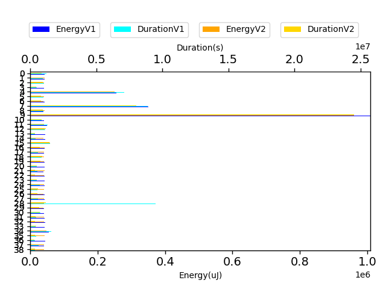

## com.google.gson.functional.ArrayTest

| Test | IterationV1 | IterationV2 | DeltaIteration |
| --- | --- | --- | --- |
| com.google.gson.functional.ArrayTest-testSingleStringArraySerialization | 15 | 14 | -1 |
| com.google.gson.functional.ArrayTest-testSingleNullInArraySerialization | 25 | 31 | 6 |
| com.google.gson.functional.ArrayTest-testObjectArrayWithNonPrimitivesSerialization | 56 | 46 | -10 |
| com.google.gson.functional.ArrayTest-testArrayOfCollectionSerialization | 75 | 77 | 2 |
| com.google.gson.functional.ArrayTest-testArrayOfPrimitivesAsObjectsSerialization | 29 | 25 | -4 |
| com.google.gson.functional.ArrayTest-testArrayElementsAreArrays | 13 | 15 | 2 |
| com.google.gson.functional.ArrayTest-testArrayOfStringsSerialization | 12 | 12 | 0 |
| com.google.gson.functional.ArrayTest-testNullsInArrayWithSerializeNullPropertySetSerialization | 25 | 22 | -3 |
| com.google.gson.functional.ArrayTest-testMultiDimenstionalObjectArraysSerialization | 14 | 12 | -2 |
| com.google.gson.functional.ArrayTest-testTopLevelArrayOfIntsSerialization | 16 | 23 | 7 |
| com.google.gson.functional.ArrayTest-testMultidimenstionalArraysSerialization | 19 | 17 | -2 |
| com.google.gson.functional.ArrayTest-testMixingTypesInObjectArraySerialization | 20 | 16 | -4 |
| com.google.gson.functional.ArrayTest-testArrayOfNullSerialization | 16 | 12 | -4 |
| com.google.gson.functional.ArrayTest-testEmptyArraySerialization | 13 | 18 | 5 |
| com.google.gson.functional.ArrayTest-testNullsInArraySerialization | 14 | 14 | 0 |

| Test | EnergyV1 | EnergyV2 | DeltaEnergy |
| --- | --- | --- | --- |
| com.google.gson.functional.ArrayTest-testSingleStringArraySerialization | 42944.455169677734 | 40740.41485595703 | -2204.040313720703 |
| com.google.gson.functional.ArrayTest-testSingleNullInArraySerialization | 39120.690662413836 | 40985.401767028496 | 1864.7111046146601 |
| com.google.gson.functional.ArrayTest-testObjectArrayWithNonPrimitivesSerialization | 41816.16629920302 | 43609.53069002471 | 1793.364390821691 |
| com.google.gson.functional.ArrayTest-testArrayOfCollectionSerialization | 41708.9410022236 | 43052.80373073653 | 1343.8627285129332 |
| com.google.gson.functional.ArrayTest-testArrayOfPrimitivesAsObjectsSerialization | 41235.89271513745 | 43008.284345030785 | 1772.3916298933327 |
| com.google.gson.functional.ArrayTest-testArrayElementsAreArrays | 42732.397705078125 | 44044.248779296875 | 1311.85107421875 |
| com.google.gson.functional.ArrayTest-testArrayOfStringsSerialization | 46875.6962890625 | 40889.677734375 | -5986.0185546875 |
| com.google.gson.functional.ArrayTest-testNullsInArrayWithSerializeNullPropertySetSerialization | 52552.7923412323 | 44972.61597633362 | -7580.176364898682 |
| com.google.gson.functional.ArrayTest-testMultiDimenstionalObjectArraysSerialization | 41993.11364746094 | 42763.494873046875 | 770.3812255859375 |
| com.google.gson.functional.ArrayTest-testTopLevelArrayOfIntsSerialization | 42119.41833496094 | 45824.0637421608 | 3704.6454071998596 |
| com.google.gson.functional.ArrayTest-testMultidimenstionalArraysSerialization | 39398.66979598999 | 42730.546478271484 | 3331.876682281494 |
| com.google.gson.functional.ArrayTest-testMixingTypesInObjectArraySerialization | 46178.82922554016 | 42773.50942993164 | -3405.3197956085205 |
| com.google.gson.functional.ArrayTest-testArrayOfNullSerialization | 44371.744689941406 | 45078.7197265625 | 706.9750366210938 |
| com.google.gson.functional.ArrayTest-testEmptyArraySerialization | 41401.67626953125 | 44371.65057373047 | 2969.9743041992188 |
| com.google.gson.functional.ArrayTest-testNullsInArraySerialization | 42944.619140625 | 41603.81213378906 | -1340.8070068359375 |

| Test | DurationV1 | DurationsV2 | DeltaDuration |
| --- | --- | --- | --- |
| com.google.gson.functional.ArrayTest-testSingleStringArraySerialization | 420236.9213256836 | 373968.5903930664 | -46268.33093261719 |
| com.google.gson.functional.ArrayTest-testSingleNullInArraySerialization | 476520.2918345034 | 655925.3955884087 | 179405.10375390528 |
| com.google.gson.functional.ArrayTest-testObjectArrayWithNonPrimitivesSerialization | 896549.5698839752 | 609880.7708701775 | -286668.79901379766 |
| com.google.gson.functional.ArrayTest-testArrayOfCollectionSerialization | 1085613.1711625145 | 849042.2786779712 | -236570.89248454326 |
| com.google.gson.functional.ArrayTest-testArrayOfPrimitivesAsObjectsSerialization | 453776.7643812243 | 522909.75897574425 | 69132.99459451996 |
| com.google.gson.functional.ArrayTest-testArrayElementsAreArrays | 388796.36779785156 | 374823.4167480469 | -13972.951049804688 |
| com.google.gson.functional.ArrayTest-testArrayOfStringsSerialization | 408796.54150390625 | 336213.52734375 | -72583.01416015625 |
| com.google.gson.functional.ArrayTest-testNullsInArrayWithSerializeNullPropertySetSerialization | 909860.6816339493 | 430151.2075562477 | -479709.47407770157 |
| com.google.gson.functional.ArrayTest-testMultiDimenstionalObjectArraysSerialization | 374566.0627441406 | 366530.095703125 | -8035.967041015625 |
| com.google.gson.functional.ArrayTest-testTopLevelArrayOfIntsSerialization | 373078.2716369629 | 539032.6338374615 | 165954.36220049858 |
| com.google.gson.functional.ArrayTest-testMultidimenstionalArraysSerialization | 480958.43824768066 | 413148.8586883545 | -67809.57955932617 |
| com.google.gson.functional.ArrayTest-testMixingTypesInObjectArraySerialization | 391185.83280181885 | 402937.2546386719 | 11751.421836853027 |
| com.google.gson.functional.ArrayTest-testArrayOfNullSerialization | 344937.39471435547 | 399950.1689453125 | 55012.77423095703 |
| com.google.gson.functional.ArrayTest-testEmptyArraySerialization | 436752.01708984375 | 422489.7199020386 | -14262.297187805176 |
| com.google.gson.functional.ArrayTest-testNullsInArraySerialization | 325826.69299316406 | 369363.5848388672 | 43536.891845703125 |

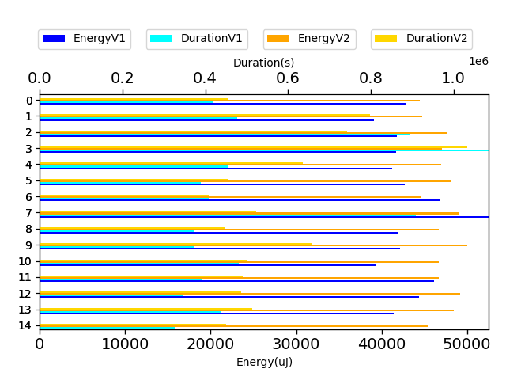

## com.google.gson.functional.JsonAdapterSerializerDeserializerTest

| Test | IterationV1 | IterationV2 | DeltaIteration |
| --- | --- | --- | --- |
| com.google.gson.functional.JsonAdapterSerializerDeserializerTest-testJsonSerializerDeserializerBasedJsonAdapterOnFields | 99 | 99 | 0 |
| com.google.gson.functional.JsonAdapterSerializerDeserializerTest-testDifferentJsonAdaptersForGenericFieldsOfSameRawType | 99 | 99 | 0 |
| com.google.gson.functional.JsonAdapterSerializerDeserializerTest-testJsonSerializerDeserializerBasedJsonAdapterOnClass | 94 | 92 | -2 |

| Test | EnergyV1 | EnergyV2 | DeltaEnergy |
| --- | --- | --- | --- |
| com.google.gson.functional.JsonAdapterSerializerDeserializerTest-testJsonSerializerDeserializerBasedJsonAdapterOnFields | 114455.70908220808 | 88363.05594868059 | -26092.653133527492 |
| com.google.gson.functional.JsonAdapterSerializerDeserializerTest-testDifferentJsonAdaptersForGenericFieldsOfSameRawType | 54272.48985110085 | 55886.28272687776 | 1613.7928757769114 |
| com.google.gson.functional.JsonAdapterSerializerDeserializerTest-testJsonSerializerDeserializerBasedJsonAdapterOnClass | 42175.91907947401 | 43357.286661960025 | 1181.367582486011 |

| Test | DurationV1 | DurationsV2 | DeltaDuration |
| --- | --- | --- | --- |
| com.google.gson.functional.JsonAdapterSerializerDeserializerTest-testJsonSerializerDeserializerBasedJsonAdapterOnFields | 2722600.290400579 | 2087838.76031176 | -634761.5300888191 |
| com.google.gson.functional.JsonAdapterSerializerDeserializerTest-testDifferentJsonAdaptersForGenericFieldsOfSameRawType | 1548508.3464885275 | 1442349.3398724513 | -106159.00661607622 |
| com.google.gson.functional.JsonAdapterSerializerDeserializerTest-testJsonSerializerDeserializerBasedJsonAdapterOnClass | 1377867.7577598465 | 1149011.194972679 | -228856.5627871675 |

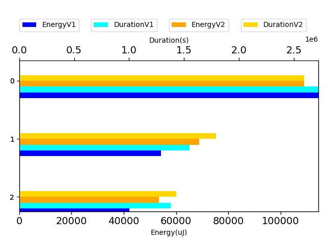

## com.google.gson.functional.ThrowableFunctionalTest

| Test | IterationV1 | IterationV2 | DeltaIteration |
| --- | --- | --- | --- |
| com.google.gson.functional.ThrowableFunctionalTest-testExceptionWithoutCause | 89 | 87 | -2 |
| com.google.gson.functional.ThrowableFunctionalTest-testErrornWithCause | 75 | 73 | -2 |
| com.google.gson.functional.ThrowableFunctionalTest-testSerializedNameOnExceptionFields | 93 | 92 | -1 |
| com.google.gson.functional.ThrowableFunctionalTest-testErrorWithoutCause | 71 | 67 | -4 |
| com.google.gson.functional.ThrowableFunctionalTest-testExceptionWithCause | 78 | 81 | 3 |

| Test | EnergyV1 | EnergyV2 | DeltaEnergy |
| --- | --- | --- | --- |
| com.google.gson.functional.ThrowableFunctionalTest-testExceptionWithoutCause | 70296.25658681398 | 59735.29414578593 | -10560.962441028052 |
| com.google.gson.functional.ThrowableFunctionalTest-testErrornWithCause | 46108.37505155093 | 47689.38997263786 | 1581.0149210869276 |
| com.google.gson.functional.ThrowableFunctionalTest-testSerializedNameOnExceptionFields | 66375.22784313968 | 58357.44671333825 | -8017.781129801435 |
| com.google.gson.functional.ThrowableFunctionalTest-testErrorWithoutCause | 41918.03155687441 | 42974.457547092046 | 1056.4259902176345 |
| com.google.gson.functional.ThrowableFunctionalTest-testExceptionWithCause | 66053.9008118883 | 47265.227646521234 | -18788.673165367072 |

| Test | DurationV1 | DurationsV2 | DeltaDuration |
| --- | --- | --- | --- |
| com.google.gson.functional.ThrowableFunctionalTest-testExceptionWithoutCause | 1592133.296017328 | 1256124.148294869 | -336009.14772245893 |
| com.google.gson.functional.ThrowableFunctionalTest-testErrornWithCause | 1527188.9699111404 | 1170985.860013727 | -356203.1098974133 |
| com.google.gson.functional.ThrowableFunctionalTest-testSerializedNameOnExceptionFields | 1726681.516497285 | 1563071.8072449798 | -163609.70925230533 |
| com.google.gson.functional.ThrowableFunctionalTest-testErrorWithoutCause | 1233532.6758758998 | 998645.7680241507 | -234886.9078517491 |
| com.google.gson.functional.ThrowableFunctionalTest-testExceptionWithCause | 1608619.5514941737 | 1143509.384292657 | -465110.1672015167 |

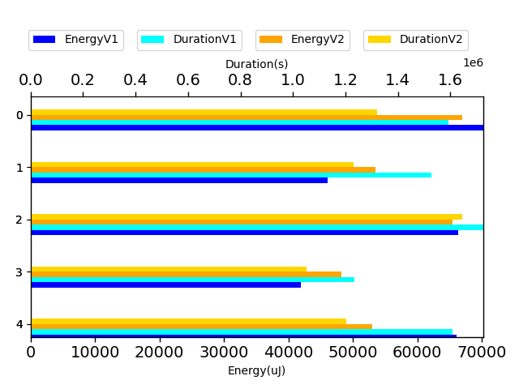

## com.google.gson.functional.ParameterizedTypesTest

| Test | IterationV1 | IterationV2 | DeltaIteration |
| --- | --- | --- | --- |
| com.google.gson.functional.ParameterizedTypesTest-testParameterizedTypeGenericArraysSerialization | 80 | 80 | 0 |
| com.google.gson.functional.ParameterizedTypesTest-testParameterizedTypesWithWriterSerialization | 53 | 55 | 2 |
| com.google.gson.functional.ParameterizedTypesTest-testParameterizedTypesSerialization | 99 | 99 | 0 |
| com.google.gson.functional.ParameterizedTypesTest-testVariableTypeFieldsAndGenericArraysSerialization | 99 | 99 | 0 |
| com.google.gson.functional.ParameterizedTypesTest-testParameterizedTypeGenericArraysDeserialization | 84 | 89 | 5 |
| com.google.gson.functional.ParameterizedTypesTest-testVariableTypeFieldsAndGenericArraysDeserialization | 94 | 93 | -1 |
| com.google.gson.functional.ParameterizedTypesTest-testTypesWithMultipleParametersSerialization | 99 | 99 | 0 |
| com.google.gson.functional.ParameterizedTypesTest-testParameterizedTypeWithVariableTypeDeserialization | 86 | 80 | -6 |
| com.google.gson.functional.ParameterizedTypesTest-testVariableTypeArrayDeserialization | 88 | 81 | -7 |
| com.google.gson.functional.ParameterizedTypesTest-testParameterizedTypeWithCustomSerializer | 84 | 83 | -1 |
| com.google.gson.functional.ParameterizedTypesTest-testVariableTypeDeserialization | 84 | 86 | 2 |
| com.google.gson.functional.ParameterizedTypesTest-testDeepParameterizedTypeSerialization | 33 | 26 | -7 |

| Test | EnergyV1 | EnergyV2 | DeltaEnergy |
| --- | --- | --- | --- |
| com.google.gson.functional.ParameterizedTypesTest-testParameterizedTypeGenericArraysSerialization | 50828.71732345447 | 40952.44473239463 | -9876.272591059838 |
| com.google.gson.functional.ParameterizedTypesTest-testParameterizedTypesWithWriterSerialization | 38373.238891199275 | 44547.862880582165 | 6174.62398938289 |
| com.google.gson.functional.ParameterizedTypesTest-testParameterizedTypesSerialization | 92356.75344276548 | 73462.11857472686 | -18894.634868038615 |
| com.google.gson.functional.ParameterizedTypesTest-testVariableTypeFieldsAndGenericArraysSerialization | 97539.70400495609 | 112366.94259527023 | 14827.23859031414 |
| com.google.gson.functional.ParameterizedTypesTest-testParameterizedTypeGenericArraysDeserialization | 40888.529669228024 | 63114.98524850385 | 22226.455579275826 |
| com.google.gson.functional.ParameterizedTypesTest-testVariableTypeFieldsAndGenericArraysDeserialization | 50881.53450491287 | 64053.119442120296 | 13171.58493720743 |
| com.google.gson.functional.ParameterizedTypesTest-testTypesWithMultipleParametersSerialization | 131676.3629114795 | 141489.2652528531 | 9812.902341373614 |
| com.google.gson.functional.ParameterizedTypesTest-testParameterizedTypeWithVariableTypeDeserialization | 39064.72736503051 | 47255.000243784554 | 8190.272878754047 |
| com.google.gson.functional.ParameterizedTypesTest-testVariableTypeArrayDeserialization | 49393.52700988075 | 45330.00660999834 | -4063.5203998824145 |
| com.google.gson.functional.ParameterizedTypesTest-testParameterizedTypeWithCustomSerializer | 58963.76411090944 | 45719.11736653633 | -13244.646744373109 |
| com.google.gson.functional.ParameterizedTypesTest-testVariableTypeDeserialization | 37874.14565611297 | 67022.78940150121 | 29148.643745388246 |
| com.google.gson.functional.ParameterizedTypesTest-testDeepParameterizedTypeSerialization | 41303.42045794148 | 40163.20120663941 | -1140.219251302071 |

| Test | DurationV1 | DurationsV2 | DeltaDuration |
| --- | --- | --- | --- |
| com.google.gson.functional.ParameterizedTypesTest-testParameterizedTypeGenericArraysSerialization | 1054430.8324997914 | 1364153.1382874171 | 309722.3057876257 |
| com.google.gson.functional.ParameterizedTypesTest-testParameterizedTypesWithWriterSerialization | 839276.014545809 | 775941.161797785 | -63334.852748024045 |
| com.google.gson.functional.ParameterizedTypesTest-testParameterizedTypesSerialization | 2206425.4679699126 | 1717803.4402808603 | -488622.0276890523 |
| com.google.gson.functional.ParameterizedTypesTest-testVariableTypeFieldsAndGenericArraysSerialization | 2101920.484146623 | 2408868.5710333595 | 306948.08688673656 |
| com.google.gson.functional.ParameterizedTypesTest-testParameterizedTypeGenericArraysDeserialization | 1346696.7092165612 | 1651051.1424228854 | 304354.43320632423 |
| com.google.gson.functional.ParameterizedTypesTest-testVariableTypeFieldsAndGenericArraysDeserialization | 1394632.6536587493 | 1703435.2758674023 | 308802.622208653 |
| com.google.gson.functional.ParameterizedTypesTest-testTypesWithMultipleParametersSerialization | 2889335.8618999054 | 3836816.063233072 | 947480.2013331666 |
| com.google.gson.functional.ParameterizedTypesTest-testParameterizedTypeWithVariableTypeDeserialization | 1078982.0020483113 | 1331589.9721853046 | 252607.97013699333 |
| com.google.gson.functional.ParameterizedTypesTest-testVariableTypeArrayDeserialization | 1086196.888012169 | 1573326.7374090075 | 487129.8493968386 |
| com.google.gson.functional.ParameterizedTypesTest-testParameterizedTypeWithCustomSerializer | 1629492.1618065555 | 1404922.1984685534 | -224569.9633380021 |
| com.google.gson.functional.ParameterizedTypesTest-testVariableTypeDeserialization | 1297265.2735560797 | 1548673.908693127 | 251408.6351370474 |
| com.google.gson.functional.ParameterizedTypesTest-testDeepParameterizedTypeSerialization | 630460.4740585953 | 758701.6196690947 | 128241.14561049943 |

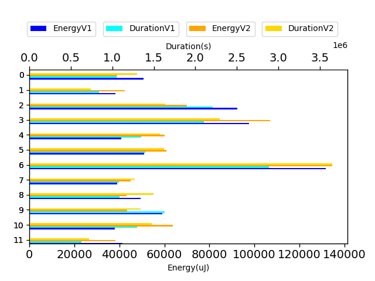

## com.google.gson.functional.CircularReferenceTest

| Test | IterationV1 | IterationV2 | DeltaIteration |
| --- | --- | --- | --- |
| com.google.gson.functional.CircularReferenceTest-testCircularSerialization | 99 | 99 | 0 |
| com.google.gson.functional.CircularReferenceTest-testSelfReferenceArrayFieldSerialization | 99 | 99 | 0 |
| com.google.gson.functional.CircularReferenceTest-testSelfReferenceCustomHandlerSerialization | 99 | 99 | 0 |
| com.google.gson.functional.CircularReferenceTest-testSelfReferenceIgnoredInSerialization | 35 | 31 | -4 |
| com.google.gson.functional.CircularReferenceTest-testDirectedAcyclicGraphSerialization | 33 | 33 | 0 |

| Test | EnergyV1 | EnergyV2 | DeltaEnergy |
| --- | --- | --- | --- |
| com.google.gson.functional.CircularReferenceTest-testCircularSerialization | 220210.90760345376 | 252916.92084024567 | 32706.013236791914 |
| com.google.gson.functional.CircularReferenceTest-testSelfReferenceArrayFieldSerialization | 200008.13544573684 | 195574.34873825038 | -4433.786707486463 |
| com.google.gson.functional.CircularReferenceTest-testSelfReferenceCustomHandlerSerialization | 235055.52085386452 | 235071.0532719869 | 15.532418122369563 |
| com.google.gson.functional.CircularReferenceTest-testSelfReferenceIgnoredInSerialization | 52017.876636910194 | 39281.89251608867 | -12735.984120821522 |
| com.google.gson.functional.CircularReferenceTest-testDirectedAcyclicGraphSerialization | 43463.147640109295 | 43245.151520097395 | -217.99612001189962 |

| Test | DurationV1 | DurationsV2 | DeltaDuration |
| --- | --- | --- | --- |
| com.google.gson.functional.CircularReferenceTest-testCircularSerialization | 5301524.643389047 | 5880214.680040814 | 578690.0366517669 |
| com.google.gson.functional.CircularReferenceTest-testSelfReferenceArrayFieldSerialization | 4669128.053270915 | 4539805.605563239 | -129322.4477076754 |
| com.google.gson.functional.CircularReferenceTest-testSelfReferenceCustomHandlerSerialization | 5975848.981346741 | 5263260.508603314 | -712588.4727434274 |
| com.google.gson.functional.CircularReferenceTest-testSelfReferenceIgnoredInSerialization | 2168773.0839960743 | 500126.252546255 | -1668646.8314498193 |
| com.google.gson.functional.CircularReferenceTest-testDirectedAcyclicGraphSerialization | 518117.3627266756 | 558086.1988678483 | 39968.83614117268 |

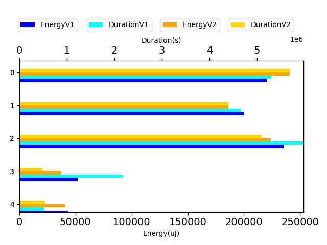

## com.google.gson.functional.InheritanceTest

| Test | IterationV1 | IterationV2 | DeltaIteration |
| --- | --- | --- | --- |
| com.google.gson.functional.InheritanceTest-testBaseSerializedAsSubWhenSpecifiedWithExplicitType | 22 | 20 | -2 |
| com.google.gson.functional.InheritanceTest-testSubInterfacesOfCollectionSerialization | 99 | 99 | 0 |
| com.google.gson.functional.InheritanceTest-testBaseSerializedAsBaseWhenSpecifiedWithExplicitTypeForToJsonMethod | 50 | 54 | 4 |
| com.google.gson.functional.InheritanceTest-testClassWithBaseCollectionFieldSerialization | 63 | 64 | 1 |
| com.google.gson.functional.InheritanceTest-testSubClassSerialization | 83 | 78 | -5 |
| com.google.gson.functional.InheritanceTest-testBaseSerializedAsBaseWhenSpecifiedWithExplicitType | 27 | 24 | -3 |
| com.google.gson.functional.InheritanceTest-testClassWithBaseArrayFieldSerialization | 55 | 52 | -3 |
| com.google.gson.functional.InheritanceTest-testBaseSerializedAsSub | 21 | 29 | 8 |
| com.google.gson.functional.InheritanceTest-testBaseSerializedAsSubWhenSpecifiedWithExplicitTypeForToJsonMethod | 21 | 20 | -1 |
| com.google.gson.functional.InheritanceTest-testClassWithBaseFieldSerialization | 55 | 43 | -12 |
| com.google.gson.functional.InheritanceTest-testBaseSerializedAsSubForToJsonMethod | 30 | 23 | -7 |

| Test | EnergyV1 | EnergyV2 | DeltaEnergy |
| --- | --- | --- | --- |
| com.google.gson.functional.InheritanceTest-testBaseSerializedAsSubWhenSpecifiedWithExplicitType | 41594.5142390728 | 41415.26384925842 | -179.25038981437683 |
| com.google.gson.functional.InheritanceTest-testSubInterfacesOfCollectionSerialization | 69403.78272127037 | 98467.26509495918 | 29063.482373688807 |
| com.google.gson.functional.InheritanceTest-testBaseSerializedAsBaseWhenSpecifiedWithExplicitTypeForToJsonMethod | 112982.98458129427 | 204641.31351684735 | 91658.32893555309 |
| com.google.gson.functional.InheritanceTest-testClassWithBaseCollectionFieldSerialization | 47700.517868663825 | 49206.516728430324 | 1505.9988597664997 |
| com.google.gson.functional.InheritanceTest-testSubClassSerialization | 44046.8935757117 | 56348.96149529171 | 12302.067919580011 |
| com.google.gson.functional.InheritanceTest-testBaseSerializedAsBaseWhenSpecifiedWithExplicitType | 42208.35688021779 | 41835.147445201874 | -373.2094350159168 |
| com.google.gson.functional.InheritanceTest-testClassWithBaseArrayFieldSerialization | 39703.18136341067 | 49386.84193092923 | 9683.660567518556 |
| com.google.gson.functional.InheritanceTest-testBaseSerializedAsSub | 41503.37769985199 | 38567.45800694078 | -2935.9196929112077 |
| com.google.gson.functional.InheritanceTest-testBaseSerializedAsSubWhenSpecifiedWithExplicitTypeForToJsonMethod | 40971.92215156555 | 38885.585987091064 | -2086.3361644744873 |
| com.google.gson.functional.InheritanceTest-testClassWithBaseFieldSerialization | 53863.84361051918 | 81503.55509370819 | 27639.711483189007 |
| com.google.gson.functional.InheritanceTest-testBaseSerializedAsSubForToJsonMethod | 41943.742102311924 | 37981.03453838825 | -3962.707563923672 |

| Test | DurationV1 | DurationsV2 | DeltaDuration |
| --- | --- | --- | --- |
| com.google.gson.functional.InheritanceTest-testBaseSerializedAsSubWhenSpecifiedWithExplicitType | 416139.2086162567 | 732172.745306015 | 316033.5366897583 |
| com.google.gson.functional.InheritanceTest-testSubInterfacesOfCollectionSerialization | 2228656.490279783 | 2939250.602705355 | 710594.1124255718 |
| com.google.gson.functional.InheritanceTest-testBaseSerializedAsBaseWhenSpecifiedWithExplicitTypeForToJsonMethod | 2414062.686357162 | 5962574.546114875 | 3548511.859757713 |
| com.google.gson.functional.InheritanceTest-testClassWithBaseCollectionFieldSerialization | 1112911.5050776042 | 1102017.6129562373 | -10893.892121366924 |
| com.google.gson.functional.InheritanceTest-testSubClassSerialization | 967390.1181975983 | 1400575.2540185316 | 433185.1358209334 |
| com.google.gson.functional.InheritanceTest-testBaseSerializedAsBaseWhenSpecifiedWithExplicitType | 522666.6913943589 | 701218.273142457 | 178551.58174809813 |
| com.google.gson.functional.InheritanceTest-testClassWithBaseArrayFieldSerialization | 949303.8359841306 | 1288918.9407530376 | 339615.10476890695 |
| com.google.gson.functional.InheritanceTest-testBaseSerializedAsSub | 364563.81068992615 | 880331.3911593929 | 515767.58046946675 |
| com.google.gson.functional.InheritanceTest-testBaseSerializedAsSubWhenSpecifiedWithExplicitTypeForToJsonMethod | 426368.9621973038 | 598774.5656471252 | 172405.60344982147 |
| com.google.gson.functional.InheritanceTest-testClassWithBaseFieldSerialization | 1115644.3965847269 | 2169449.957101828 | 1053805.560517101 |
| com.google.gson.functional.InheritanceTest-testBaseSerializedAsSubForToJsonMethod | 426591.59105450846 | 836703.2255072594 | 410111.6344527509 |

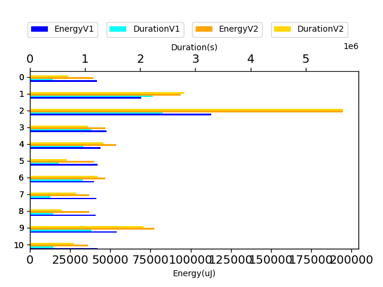

## com.google.gson.functional.MapTest

| Test | IterationV1 | IterationV2 | DeltaIteration |
| --- | --- | --- | --- |
| com.google.gson.functional.MapTest-testSerializeMaps | 64 | 60 | -4 |
| com.google.gson.functional.MapTest-testMapSerializationWithNullValues | 54 | 67 | 13 |
| com.google.gson.functional.MapTest-testInterfaceTypeMapWithSerializer | 98 | 96 | -2 |
| com.google.gson.functional.MapTest-testComplexKeysSerialization | 71 | 73 | 2 |
| com.google.gson.functional.MapTest-testCustomSerializerForSpecificMapType | 60 | 54 | -6 |
| com.google.gson.functional.MapTest-testGeneralMapField | 66 | 58 | -8 |
| com.google.gson.functional.MapTest-testMapSerializationWithNullValueButSerializeNulls | 42 | 43 | 1 |
| com.google.gson.functional.MapTest-testInterfaceTypeMap | 98 | 95 | -3 |
| com.google.gson.functional.MapTest-testMapSerializationWithWildcardValues | 71 | 71 | 0 |
| com.google.gson.functional.MapTest-testSerializeMapOfMaps | 47 | 51 | 4 |
| com.google.gson.functional.MapTest-testParameterizedMapSubclassSerialization | 99 | 99 | 0 |
| com.google.gson.functional.MapTest-testConcurrentHashMap | 68 | 61 | -7 |
| com.google.gson.functional.MapTest-testConcurrentMap | 96 | 90 | -6 |
| com.google.gson.functional.MapTest-testConcurrentNavigableMap | 99 | 99 | 0 |
| com.google.gson.functional.MapTest-testRawMapSerialization | 35 | 26 | -9 |
| com.google.gson.functional.MapTest-testConcurrentSkipListMap | 64 | 66 | 2 |
| com.google.gson.functional.MapTest-testMapSerializationEmpty | 45 | 42 | -3 |
| com.google.gson.functional.MapTest-testMapSerializationWithIntegerKeys | 56 | 56 | 0 |
| com.google.gson.functional.MapTest-testMapSerialization | 60 | 54 | -6 |
| com.google.gson.functional.MapTest-testMapOfMapSerialization | 24 | 20 | -4 |
| com.google.gson.functional.MapTest-testMapSubclassSerialization | 31 | 37 | 6 |
| com.google.gson.functional.MapTest-testMapSerializationWithNullValue | 40 | 45 | 5 |
| com.google.gson.functional.MapTest-testMapWithQuotes | 14 | 16 | 2 |
| com.google.gson.functional.MapTest-testMapSerializationWithNullKey | 43 | 47 | 4 |
| com.google.gson.functional.MapTest-testWriteMapsWithEmptyStringKey | 17 | 19 | 2 |
| com.google.gson.functional.MapTest-testMapSerializationWithNullValuesSerialized | 31 | 33 | 2 |

| Test | EnergyV1 | EnergyV2 | DeltaEnergy |
| --- | --- | --- | --- |
| com.google.gson.functional.MapTest-testSerializeMaps | 41179.95403892275 | 64581.968264920855 | 23402.014225998108 |
| com.google.gson.functional.MapTest-testMapSerializationWithNullValues | 41793.609904681085 | 57447.2748806679 | 15653.664975986816 |
| com.google.gson.functional.MapTest-testInterfaceTypeMapWithSerializer | 45279.904894510815 | 102550.13337110713 | 57270.22847659632 |
| com.google.gson.functional.MapTest-testComplexKeysSerialization | 41655.329131815684 | 63522.80118551577 | 21867.472053700083 |
| com.google.gson.functional.MapTest-testCustomSerializerForSpecificMapType | 40065.03325437165 | 60265.718706384585 | 20200.685452012935 |
| com.google.gson.functional.MapTest-testGeneralMapField | 40766.45359252489 | 43729.623770845574 | 2963.170178320681 |
| com.google.gson.functional.MapTest-testMapSerializationWithNullValueButSerializeNulls | 42465.37539256013 | 41514.0964451173 | -951.2789474428282 |
| com.google.gson.functional.MapTest-testInterfaceTypeMap | 92628.20250397228 | 122514.14595035721 | 29885.943446384932 |
| com.google.gson.functional.MapTest-testMapSerializationWithWildcardValues | 45484.58204741527 | 67411.6120324584 | 21927.029985043133 |
| com.google.gson.functional.MapTest-testSerializeMapOfMaps | 41051.4167779015 | 43463.53344658642 | 2412.1166686849247 |
| com.google.gson.functional.MapTest-testParameterizedMapSubclassSerialization | 43872.996355975076 | 63238.689650790795 | 19365.69329481572 |
| com.google.gson.functional.MapTest-testConcurrentHashMap | 42497.67433752931 | 42714.64936115777 | 216.9750236284599 |
| com.google.gson.functional.MapTest-testConcurrentMap | 39611.22153651021 | 59781.07189343666 | 20169.85035692645 |
| com.google.gson.functional.MapTest-testConcurrentNavigableMap | 134770.716712469 | 146981.8133009121 | 12211.096588443092 |
| com.google.gson.functional.MapTest-testRawMapSerialization | 45388.553317298065 | 40532.07453468442 | -4856.478782613645 |
| com.google.gson.functional.MapTest-testConcurrentSkipListMap | 42096.37935005447 | 61991.96836276266 | 19895.589012708188 |
| com.google.gson.functional.MapTest-testMapSerializationEmpty | 43080.47956994393 | 41023.31416622925 | -2057.16540371468 |
| com.google.gson.functional.MapTest-testMapSerializationWithIntegerKeys | 41398.869119977186 | 40680.44739153265 | -718.4217284445331 |
| com.google.gson.functional.MapTest-testMapSerialization | 43296.229272427285 | 99400.4279104521 | 56104.19863802481 |
| com.google.gson.functional.MapTest-testMapOfMapSerialization | 39359.29611968994 | 43222.229248046875 | 3862.9331283569336 |
| com.google.gson.functional.MapTest-testMapSubclassSerialization | 40237.214051509276 | 42844.83931483836 | 2607.625263329086 |
| com.google.gson.functional.MapTest-testMapSerializationWithNullValue | 44025.764926120566 | 42959.98084527583 | -1065.7840808447363 |
| com.google.gson.functional.MapTest-testMapWithQuotes | 44998.633544921875 | 42483.4065246582 | -2515.227020263672 |
| com.google.gson.functional.MapTest-testMapSerializationWithNullKey | 44546.005567685526 | 41247.264873722495 | -3298.740693963031 |
| com.google.gson.functional.MapTest-testWriteMapsWithEmptyStringKey | 41330.46432495117 | 41872.80862426758 | 542.3442993164062 |
| com.google.gson.functional.MapTest-testMapSerializationWithNullValuesSerialized | 41560.998108994216 | 41273.6144106905 | -287.3836983037181 |

| Test | DurationV1 | DurationsV2 | DeltaDuration |
| --- | --- | --- | --- |
| com.google.gson.functional.MapTest-testSerializeMaps | 838964.4485576841 | 1309251.8009047224 | 470287.35234703834 |
| com.google.gson.functional.MapTest-testMapSerializationWithNullValues | 1135701.9992931825 | 1698163.1765481 | 562461.1772549176 |
| com.google.gson.functional.MapTest-testInterfaceTypeMapWithSerializer | 1491415.6054567038 | 2694308.371686659 | 1202892.766229955 |
| com.google.gson.functional.MapTest-testComplexKeysSerialization | 949613.0443740102 | 1673908.32729649 | 724295.2829224799 |
| com.google.gson.functional.MapTest-testCustomSerializerForSpecificMapType | 750332.4662961653 | 1513361.8184106979 | 763029.3521145326 |
| com.google.gson.functional.MapTest-testGeneralMapField | 974531.5715385932 | 948378.9047410638 | -26152.666797529324 |
| com.google.gson.functional.MapTest-testMapSerializationWithNullValueButSerializeNulls | 739083.2737655957 | 761153.3453697882 | 22070.07160419249 |
| com.google.gson.functional.MapTest-testInterfaceTypeMap | 2279580.2502490245 | 3462877.9403342158 | 1183297.6900851913 |
| com.google.gson.functional.MapTest-testMapSerializationWithWildcardValues | 1242276.5074032212 | 1602251.556345802 | 359975.0489425808 |
| com.google.gson.functional.MapTest-testSerializeMapOfMaps | 741854.9158447653 | 635911.6771855738 | -105943.23865919141 |
| com.google.gson.functional.MapTest-testParameterizedMapSubclassSerialization | 1557996.4074794718 | 1615626.1293937229 | 57629.7219142511 |
| com.google.gson.functional.MapTest-testConcurrentHashMap | 803523.5553915278 | 756914.898771791 | -46608.65661973681 |
| com.google.gson.functional.MapTest-testConcurrentMap | 1149246.4545006035 | 1854033.2807154104 | 704786.8262148069 |
| com.google.gson.functional.MapTest-testConcurrentNavigableMap | 3191040.916677059 | 3988069.426222381 | 797028.509545322 |
| com.google.gson.functional.MapTest-testRawMapSerialization | 475649.53704924375 | 648369.5647392571 | 172720.02769001335 |
| com.google.gson.functional.MapTest-testConcurrentSkipListMap | 937957.4442292408 | 1558307.1635983812 | 620349.7193691405 |
| com.google.gson.functional.MapTest-testMapSerializationEmpty | 741549.7270268583 | 884148.1637709348 | 142598.43674407655 |
| com.google.gson.functional.MapTest-testMapSerializationWithIntegerKeys | 847549.7165151075 | 1017168.912342101 | 169619.19582699344 |
| com.google.gson.functional.MapTest-testMapSerialization | 971852.4692614254 | 3295646.6651611542 | 2323794.1958997287 |
| com.google.gson.functional.MapTest-testMapOfMapSerialization | 425084.43618810177 | 578883.1268863678 | 153798.69069826603 |
| com.google.gson.functional.MapTest-testMapSubclassSerialization | 538849.4849714031 | 470050.23924440355 | -68799.2457269996 |
| com.google.gson.functional.MapTest-testMapSerializationWithNullValue | 729658.8177836612 | 732031.9089794438 | 2373.0911957826465 |
| com.google.gson.functional.MapTest-testMapWithQuotes | 600039.2178955078 | 441423.1123352051 | -158616.10556030273 |
| com.google.gson.functional.MapTest-testMapSerializationWithNullKey | 764277.2650581825 | 771829.4295518999 | 7552.16449371737 |
| com.google.gson.functional.MapTest-testWriteMapsWithEmptyStringKey | 394577.8590698242 | 475835.3558540344 | 81257.4967842102 |
| com.google.gson.functional.MapTest-testMapSerializationWithNullValuesSerialized | 522911.0142985359 | 658749.6148882082 | 135838.60058967234 |

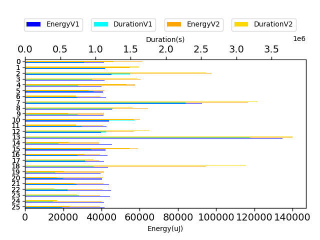

## com.google.gson.functional.PrettyPrintingTest

| Test | IterationV1 | IterationV2 | DeltaIteration |
| --- | --- | --- | --- |
| com.google.gson.functional.PrettyPrintingTest-testEmptyMapField | 64 | 71 | 7 |
| com.google.gson.functional.PrettyPrintingTest-testPrettyPrintArrayOfPrimitiveArrays | 20 | 22 | 2 |
| com.google.gson.functional.PrettyPrintingTest-testPrettyPrintArrayOfObjects | 57 | 46 | -11 |
| com.google.gson.functional.PrettyPrintingTest-testPrettyPrintList | 83 | 81 | -2 |
| com.google.gson.functional.PrettyPrintingTest-testPrettyPrintListOfPrimitiveArrays | 37 | 32 | -5 |
| com.google.gson.functional.PrettyPrintingTest-testMultipleArrays | 24 | 20 | -4 |
| com.google.gson.functional.PrettyPrintingTest-testPrettyPrintArrayOfPrimitives | 13 | 18 | 5 |
| com.google.gson.functional.PrettyPrintingTest-testMap | 28 | 25 | -3 |

| Test | EnergyV1 | EnergyV2 | DeltaEnergy |
| --- | --- | --- | --- |
| com.google.gson.functional.PrettyPrintingTest-testEmptyMapField | 46503.5391154642 | 42450.28246474557 | -4053.2566507186275 |
| com.google.gson.functional.PrettyPrintingTest-testPrettyPrintArrayOfPrimitiveArrays | 41131.95147895813 | 42020.56937789917 | 888.61789894104 |
| com.google.gson.functional.PrettyPrintingTest-testPrettyPrintArrayOfObjects | 45381.12068830333 | 43148.174431556276 | -2232.9462567470546 |
| com.google.gson.functional.PrettyPrintingTest-testPrettyPrintList | 62052.64441296313 | 46152.37005010292 | -15900.274362860204 |
| com.google.gson.functional.PrettyPrintingTest-testPrettyPrintListOfPrimitiveArrays | 41687.027724071566 | 39229.6818911992 | -2457.3458328723646 |
| com.google.gson.functional.PrettyPrintingTest-testMultipleArrays | 42928.57402765751 | 42277.536975860596 | -651.0370517969131 |
| com.google.gson.functional.PrettyPrintingTest-testPrettyPrintArrayOfPrimitives | 44980.91796875 | 41744.62590789795 | -3236.292060852051 |
| com.google.gson.functional.PrettyPrintingTest-testMap | 41406.751278176904 | 39610.9985601902 | -1795.752717986703 |

| Test | DurationV1 | DurationsV2 | DeltaDuration |
| --- | --- | --- | --- |
| com.google.gson.functional.PrettyPrintingTest-testEmptyMapField | 934554.4541390169 | 883691.636146022 | -50862.81799299491 |
| com.google.gson.functional.PrettyPrintingTest-testPrettyPrintArrayOfPrimitiveArrays | 535968.6021261215 | 407174.8497748375 | -128793.75235128403 |
| com.google.gson.functional.PrettyPrintingTest-testPrettyPrintArrayOfObjects | 932994.3979055216 | 612802.8201977178 | -320191.5777078038 |
| com.google.gson.functional.PrettyPrintingTest-testPrettyPrintList | 1821919.866170453 | 954549.8976474828 | -867369.9685229701 |
| com.google.gson.functional.PrettyPrintingTest-testPrettyPrintListOfPrimitiveArrays | 578276.7647344512 | 706220.1396359443 | 127943.37490149308 |
| com.google.gson.functional.PrettyPrintingTest-testMultipleArrays | 416960.79378819466 | 424141.92847156525 | 7181.13468337059 |
| com.google.gson.functional.PrettyPrintingTest-testPrettyPrintArrayOfPrimitives | 355144.3176269531 | 383178.57093811035 | 28034.253311157227 |
| com.google.gson.functional.PrettyPrintingTest-testMap | 595850.0514186174 | 718118.0984526873 | 122268.0470340699 |

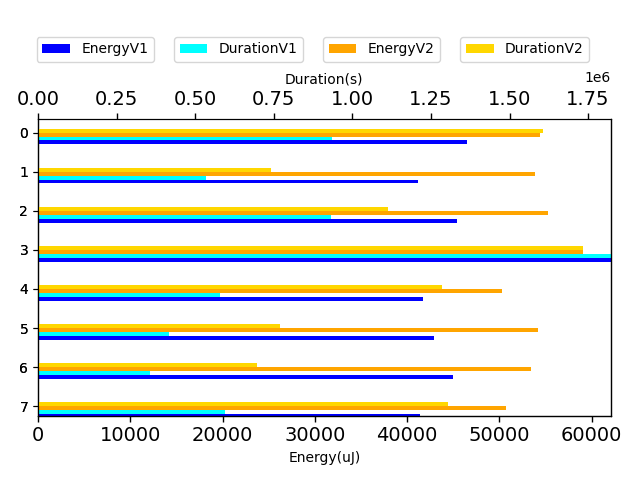

## com.google.gson.functional.ReadersWritersTest

| Test | IterationV1 | IterationV2 | DeltaIteration |
| --- | --- | --- | --- |
| com.google.gson.functional.ReadersWritersTest-testReadWriteTwoObjects | 61 | 58 | -3 |
| com.google.gson.functional.ReadersWritersTest-testReadWriteTwoStrings | 73 | 75 | 2 |
| com.google.gson.functional.ReadersWritersTest-testTopLevelNullObjectSerializationWithWriterAndSerializeNulls | 15 | 9 | -6 |
| com.google.gson.functional.ReadersWritersTest-testWriterForSerialization | 39 | 38 | -1 |
| com.google.gson.functional.ReadersWritersTest-testTopLevelNullObjectSerializationWithWriter | 15 | 5 | -10 |

| Test | EnergyV1 | EnergyV2 | DeltaEnergy |
| --- | --- | --- | --- |
| com.google.gson.functional.ReadersWritersTest-testReadWriteTwoObjects | 47588.428121390636 | 43792.27396558646 | -3796.154155804179 |
| com.google.gson.functional.ReadersWritersTest-testReadWriteTwoStrings | 61035.73477744995 | 44119.8123861132 | -16915.922391336753 |
| com.google.gson.functional.ReadersWritersTest-testTopLevelNullObjectSerializationWithWriterAndSerializeNulls | 42377.00311279297 | 38916.70703125 | -3460.2960815429688 |
| com.google.gson.functional.ReadersWritersTest-testWriterForSerialization | 48916.17901587082 | 42752.81865283995 | -6163.360363030864 |
| com.google.gson.functional.ReadersWritersTest-testTopLevelNullObjectSerializationWithWriter | 43109.28454589844 | 42503.5 | -605.7845458984375 |

| Test | DurationV1 | DurationsV2 | DeltaDuration |
| --- | --- | --- | --- |
| com.google.gson.functional.ReadersWritersTest-testReadWriteTwoObjects | 1042624.5212191883 | 945885.9777306144 | -96738.54348857398 |
| com.google.gson.functional.ReadersWritersTest-testReadWriteTwoStrings | 1134887.5767959314 | 1143536.4753768113 | 8648.898580879904 |
| com.google.gson.functional.ReadersWritersTest-testTopLevelNullObjectSerializationWithWriterAndSerializeNulls | 378786.5693359375 | 374773.62109375 | -4012.9482421875 |
| com.google.gson.functional.ReadersWritersTest-testWriterForSerialization | 1171330.484457781 | 843298.8759327193 | -328031.60852506175 |
| com.google.gson.functional.ReadersWritersTest-testTopLevelNullObjectSerializationWithWriter | 315713.74658203125 | 416844.3125 | 101130.56591796875 |

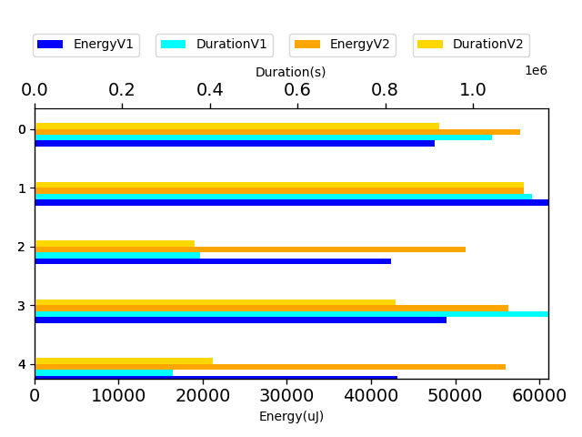

## com.google.gson.functional.ExposeFieldsTest

| Test | IterationV1 | IterationV2 | DeltaIteration |
| --- | --- | --- | --- |
| com.google.gson.functional.ExposeFieldsTest-testNullExposeFieldSerialization | 99 | 99 | 0 |
| com.google.gson.functional.ExposeFieldsTest-testNoExposedFieldSerialization | 52 | 49 | -3 |
| com.google.gson.functional.ExposeFieldsTest-testExposedInterfaceFieldSerialization | 91 | 88 | -3 |
| com.google.gson.functional.ExposeFieldsTest-testExposeAnnotationSerialization | 32 | 34 | 2 |
| com.google.gson.functional.ExposeFieldsTest-testArrayWithOneNullExposeFieldObjectSerialization | 41 | 45 | 4 |

| Test | EnergyV1 | EnergyV2 | DeltaEnergy |
| --- | --- | --- | --- |
| com.google.gson.functional.ExposeFieldsTest-testNullExposeFieldSerialization | 119166.1694934894 | 125802.00808487022 | 6635.838591380816 |
| com.google.gson.functional.ExposeFieldsTest-testNoExposedFieldSerialization | 42344.85142955359 | 45370.27099399667 | 3025.41956444308 |
| com.google.gson.functional.ExposeFieldsTest-testExposedInterfaceFieldSerialization | 51606.854628281006 | 40993.05535811631 | -10613.799270164694 |
| com.google.gson.functional.ExposeFieldsTest-testExposeAnnotationSerialization | 42770.04182759253 | 41333.20039765129 | -1436.8414299412398 |
| com.google.gson.functional.ExposeFieldsTest-testArrayWithOneNullExposeFieldObjectSerialization | 43759.82437684452 | 44662.07226376438 | 902.2478869198603 |

| Test | DurationV1 | DurationsV2 | DeltaDuration |
| --- | --- | --- | --- |
| com.google.gson.functional.ExposeFieldsTest-testNullExposeFieldSerialization | 3177404.626563397 | 3359283.4332264597 | 181878.8066630629 |
| com.google.gson.functional.ExposeFieldsTest-testNoExposedFieldSerialization | 749680.089934078 | 706322.8610802119 | -43357.22885386611 |
| com.google.gson.functional.ExposeFieldsTest-testExposedInterfaceFieldSerialization | 1293392.5477229655 | 1378012.436680297 | 84619.88895733142 |
| com.google.gson.functional.ExposeFieldsTest-testExposeAnnotationSerialization | 549403.551360325 | 501377.19203134207 | -48026.359328982886 |
| com.google.gson.functional.ExposeFieldsTest-testArrayWithOneNullExposeFieldObjectSerialization | 648168.4333013145 | 744675.7002190438 | 96507.26691772928 |

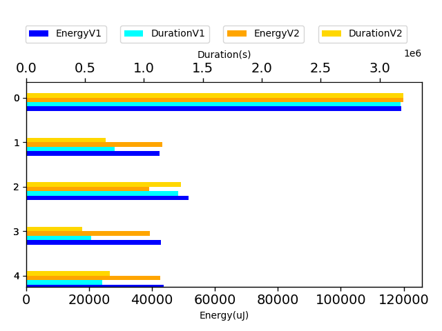

## com.google.gson.functional.FieldExclusionTest

| Test | IterationV1 | IterationV2 | DeltaIteration |
| --- | --- | --- | --- |
| com.google.gson.functional.FieldExclusionTest-testDefaultNestedStaticClassIncluded | 29 | 39 | 10 |
| com.google.gson.functional.FieldExclusionTest-testDefaultInnerClassExclusion | 83 | 77 | -6 |
| com.google.gson.functional.FieldExclusionTest-testInnerClassExclusion | 17 | 21 | 4 |

| Test | EnergyV1 | EnergyV2 | DeltaEnergy |
| --- | --- | --- | --- |
| com.google.gson.functional.FieldExclusionTest-testDefaultNestedStaticClassIncluded | 42562.24274882488 | 43718.55237839802 | 1156.3096295731375 |
| com.google.gson.functional.FieldExclusionTest-testDefaultInnerClassExclusion | 39178.705486369305 | 43086.10958840372 | 3907.4041020344157 |
| com.google.gson.functional.FieldExclusionTest-testInnerClassExclusion | 43432.6794128418 | 43710.43824386597 | 277.7588310241699 |

| Test | DurationV1 | DurationsV2 | DeltaDuration |
| --- | --- | --- | --- |
| com.google.gson.functional.FieldExclusionTest-testDefaultNestedStaticClassIncluded | 536908.7253702953 | 563702.959187736 | 26794.23381744069 |
| com.google.gson.functional.FieldExclusionTest-testDefaultInnerClassExclusion | 1014715.7880496421 | 1109438.3912919485 | 94722.60324230639 |
| com.google.gson.functional.FieldExclusionTest-testInnerClassExclusion | 472384.37577819824 | 368354.3653383255 | -104030.01043987274 |

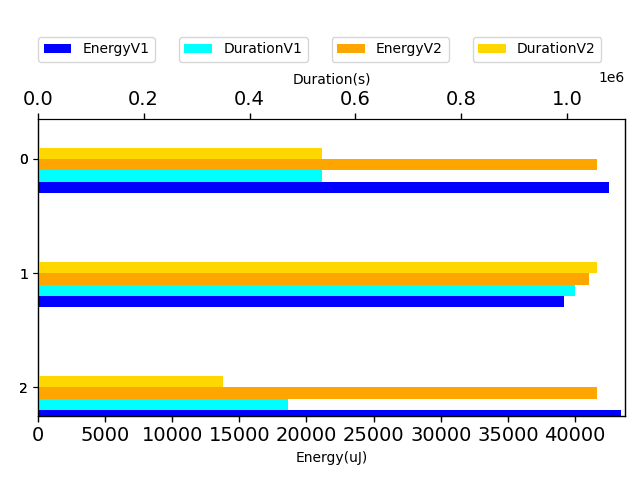

## com.google.gson.functional.CollectionTest

| Test | IterationV1 | IterationV2 | DeltaIteration |
| --- | --- | --- | --- |
| com.google.gson.functional.CollectionTest-testStack | 99 | 97 | -2 |
| com.google.gson.functional.CollectionTest-testPriorityQueue | 99 | 99 | 0 |
| com.google.gson.functional.CollectionTest-testFieldIsArrayList | 73 | 78 | 5 |
| com.google.gson.functional.CollectionTest-testWildcardPrimitiveCollectionSerilaization | 66 | 67 | 1 |
| com.google.gson.functional.CollectionTest-testCollectionOfBagOfPrimitivesSerialization | 48 | 46 | -2 |
| com.google.gson.functional.CollectionTest-testQueueSerialization | 60 | 60 | 0 |
| com.google.gson.functional.CollectionTest-testWildcardCollectionField | 87 | 87 | 0 |
| com.google.gson.functional.CollectionTest-testSetSerialization | 61 | 65 | 4 |
| com.google.gson.functional.CollectionTest-testCollectionOfObjectWithNullSerialization | 51 | 55 | 4 |
| com.google.gson.functional.CollectionTest-testCollectionOfObjectSerialization | 46 | 53 | 7 |
| com.google.gson.functional.CollectionTest-testNullsInListSerialization | 43 | 38 | -5 |
| com.google.gson.functional.CollectionTest-testUserCollectionTypeAdapter | 71 | 61 | -10 |
| com.google.gson.functional.CollectionTest-testVector | 62 | 65 | 3 |
| com.google.gson.functional.CollectionTest-testCollectionOfStringsSerialization | 20 | 14 | -6 |
| com.google.gson.functional.CollectionTest-testLinkedListSerialization | 64 | 63 | -1 |
| com.google.gson.functional.CollectionTest-testRawCollectionSerialization | 41 | 33 | -8 |
| com.google.gson.functional.CollectionTest-testTopLevelCollectionOfIntegersSerialization | 44 | 55 | 11 |
| com.google.gson.functional.CollectionTest-testRawCollectionOfIntegersSerialization | 16 | 24 | 8 |

| Test | EnergyV1 | EnergyV2 | DeltaEnergy |
| --- | --- | --- | --- |
| com.google.gson.functional.CollectionTest-testStack | 45084.04397942524 | 44553.7007849047 | -530.3431945205375 |
| com.google.gson.functional.CollectionTest-testPriorityQueue | 43094.763967714156 | 44073.354494379455 | 978.590526665299 |
| com.google.gson.functional.CollectionTest-testFieldIsArrayList | 63987.68075095229 | 68215.32639728197 | 4227.645646329678 |
| com.google.gson.functional.CollectionTest-testWildcardPrimitiveCollectionSerilaization | 53158.86319885035 | 46798.27309467168 | -6360.590104178671 |
| com.google.gson.functional.CollectionTest-testCollectionOfBagOfPrimitivesSerialization | 43990.49146508651 | 46549.27679943952 | 2558.785334353008 |
| com.google.gson.functional.CollectionTest-testQueueSerialization | 41631.79150724554 | 43375.94713647416 | 1744.1556292286186 |
| com.google.gson.functional.CollectionTest-testWildcardCollectionField | 51010.6493288081 | 43269.742155417815 | -7740.907173390282 |
| com.google.gson.functional.CollectionTest-testSetSerialization | 44767.18966583797 | 43494.60452290115 | -1272.5851429368195 |
| com.google.gson.functional.CollectionTest-testCollectionOfObjectWithNullSerialization | 42544.20659772359 | 44077.638780754874 | 1533.4321830312838 |
| com.google.gson.functional.CollectionTest-testCollectionOfObjectSerialization | 41051.7604037817 | 44200.39064412538 | 3148.6302403436785 |
| com.google.gson.functional.CollectionTest-testNullsInListSerialization | 43507.87749987592 | 43950.31937977807 | 442.4418799021514 |
| com.google.gson.functional.CollectionTest-testUserCollectionTypeAdapter | 42236.73834108923 | 42801.20949798901 | 564.4711568997809 |
| com.google.gson.functional.CollectionTest-testVector | 44107.41300715302 | 43560.44643885443 | -546.9665682985942 |
| com.google.gson.functional.CollectionTest-testCollectionOfStringsSerialization | 43100.310371398926 | 43257.013671875 | 156.70330047607422 |
| com.google.gson.functional.CollectionTest-testLinkedListSerialization | 41775.350717342706 | 43197.527294338506 | 1422.1765769958001 |
| com.google.gson.functional.CollectionTest-testRawCollectionSerialization | 44987.40609858016 | 45232.81302732951 | 245.40692874934757 |
| com.google.gson.functional.CollectionTest-testTopLevelCollectionOfIntegersSerialization | 41453.00084999328 | 44975.03992385166 | 3522.039073858381 |
| com.google.gson.functional.CollectionTest-testRawCollectionOfIntegersSerialization | 43199.81033325195 | 43798.935822844505 | 599.1254895925522 |

| Test | DurationV1 | DurationsV2 | DeltaDuration |
| --- | --- | --- | --- |
| com.google.gson.functional.CollectionTest-testStack | 1203788.7860070427 | 1283268.110689923 | 79479.3246828802 |
| com.google.gson.functional.CollectionTest-testPriorityQueue | 1228591.9633534127 | 1340541.4790916166 | 111949.51573820389 |
| com.google.gson.functional.CollectionTest-testFieldIsArrayList | 1214923.8282346241 | 1343367.5583589836 | 128443.73012435948 |
| com.google.gson.functional.CollectionTest-testWildcardPrimitiveCollectionSerilaization | 971771.0407285573 | 1141439.894984639 | 169668.85425608174 |
| com.google.gson.functional.CollectionTest-testCollectionOfBagOfPrimitivesSerialization | 759630.2859242824 | 755084.4362718723 | -4545.849652410136 |
| com.google.gson.functional.CollectionTest-testQueueSerialization | 760932.0417977909 | 829884.7458686396 | 68952.70407084865 |
| com.google.gson.functional.CollectionTest-testWildcardCollectionField | 1254425.7799545329 | 1153944.5382249064 | -100481.24172962643 |
| com.google.gson.functional.CollectionTest-testSetSerialization | 1201791.2901848282 | 981187.3093959743 | -220603.98078885395 |
| com.google.gson.functional.CollectionTest-testCollectionOfObjectWithNullSerialization | 629653.6662561817 | 774900.9073320883 | 145247.24107590667 |
| com.google.gson.functional.CollectionTest-testCollectionOfObjectSerialization | 862519.867825025 | 640661.2641432816 | -221858.60368174338 |
| com.google.gson.functional.CollectionTest-testNullsInListSerialization | 592112.3927758398 | 648610.8120695109 | 56498.41929367115 |
| com.google.gson.functional.CollectionTest-testUserCollectionTypeAdapter | 851545.0016081429 | 1025077.6110277862 | 173532.6094196433 |
| com.google.gson.functional.CollectionTest-testVector | 737793.5534446258 | 834950.0761578679 | 97156.5227132421 |
| com.google.gson.functional.CollectionTest-testCollectionOfStringsSerialization | 391175.3399028778 | 380229.34716796875 | -10945.992734909058 |
| com.google.gson.functional.CollectionTest-testLinkedListSerialization | 833649.5770627816 | 760641.5819498571 | -73007.99511292449 |
| com.google.gson.functional.CollectionTest-testRawCollectionSerialization | 529107.8138988357 | 600061.453687775 | 70953.63978893927 |
| com.google.gson.functional.CollectionTest-testTopLevelCollectionOfIntegersSerialization | 732819.0402955785 | 905171.7326926491 | 172352.69239707058 |
| com.google.gson.functional.CollectionTest-testRawCollectionOfIntegersSerialization | 585298.5975646973 | 481549.8584945202 | -103748.73907017708 |

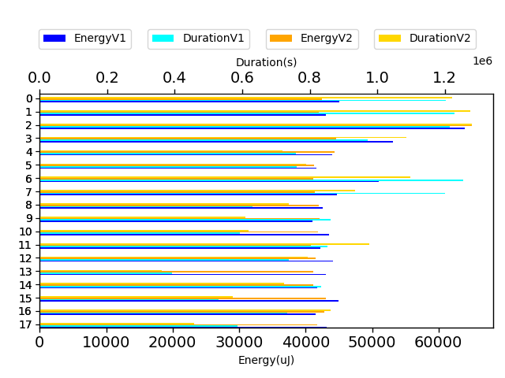

## com.google.gson.functional.EnumTest

| Test | IterationV1 | IterationV2 | DeltaIteration |
| --- | --- | --- | --- |
| com.google.gson.functional.EnumTest-testEnumSubclassAsParameterizedType | 74 | 75 | 1 |
| com.google.gson.functional.EnumTest-testEnumCaseMapping | 58 | 63 | 5 |
| com.google.gson.functional.EnumTest-testEnumSubclass | 99 | 99 | 0 |
| com.google.gson.functional.EnumTest-testEnumSubclassWithRegisteredTypeAdapter | 87 | 84 | -3 |
| com.google.gson.functional.EnumTest-testClassWithEnumFieldSerialization | 51 | 52 | 1 |
| com.google.gson.functional.EnumTest-testEnumClassWithFields | 46 | 47 | 1 |
| com.google.gson.functional.EnumTest-testEnumSet | 62 | 66 | 4 |
| com.google.gson.functional.EnumTest-testCollectionOfEnumsSerialization | 62 | 52 | -10 |
| com.google.gson.functional.EnumTest-testTopLevelEnumSerialization | 45 | 51 | 6 |

| Test | EnergyV1 | EnergyV2 | DeltaEnergy |
| --- | --- | --- | --- |
| com.google.gson.functional.EnumTest-testEnumSubclassAsParameterizedType | 44054.38340989146 | 42096.70932600171 | -1957.6740838897458 |
| com.google.gson.functional.EnumTest-testEnumCaseMapping | 52865.063435304255 | 45927.26133746129 | -6937.802097842963 |
| com.google.gson.functional.EnumTest-testEnumSubclass | 106612.5957226574 | 108031.98452603133 | 1419.388803373935 |
| com.google.gson.functional.EnumTest-testEnumSubclassWithRegisteredTypeAdapter | 43350.54176203988 | 42672.847601006186 | -677.6941610336944 |
| com.google.gson.functional.EnumTest-testClassWithEnumFieldSerialization | 42025.14468760351 | 40696.267573873156 | -1328.8771137303556 |
| com.google.gson.functional.EnumTest-testEnumClassWithFields | 42969.826062150365 | 39853.72705200316 | -3116.0990101472053 |
| com.google.gson.functional.EnumTest-testEnumSet | 44296.859971899 | 41011.30251753243 | -3285.5574543665716 |
| com.google.gson.functional.EnumTest-testCollectionOfEnumsSerialization | 42584.92320951681 | 44005.91596705721 | 1420.9927575404 |
| com.google.gson.functional.EnumTest-testTopLevelEnumSerialization | 44772.75315003036 | 45309.661166893624 | 536.9080168632645 |

| Test | DurationV1 | DurationsV2 | DeltaDuration |
| --- | --- | --- | --- |
| com.google.gson.functional.EnumTest-testEnumSubclassAsParameterizedType | 916574.9511256438 | 907058.2756550427 | -9516.675470601069 |
| com.google.gson.functional.EnumTest-testEnumCaseMapping | 1057466.1565843332 | 881717.3701067755 | -175748.78647755762 |
| com.google.gson.functional.EnumTest-testEnumSubclass | 2598317.767279219 | 2706916.6778926393 | 108598.91061342042 |
| com.google.gson.functional.EnumTest-testEnumSubclassWithRegisteredTypeAdapter | 1124475.2946745022 | 1297445.1404703425 | 172969.84579584026 |
| com.google.gson.functional.EnumTest-testClassWithEnumFieldSerialization | 686715.9299843744 | 706585.1905014433 | 19869.260517068906 |
| com.google.gson.functional.EnumTest-testEnumClassWithFields | 724828.7811719173 | 678760.9227510483 | -46067.858420868986 |
| com.google.gson.functional.EnumTest-testEnumSet | 860947.291540849 | 861926.3537278262 | 979.0621869771276 |
| com.google.gson.functional.EnumTest-testCollectionOfEnumsSerialization | 717393.2024860866 | 687871.4853623874 | -29521.717123699258 |
| com.google.gson.functional.EnumTest-testTopLevelEnumSerialization | 794045.8193313235 | 712067.3857911513 | -81978.43354017218 |

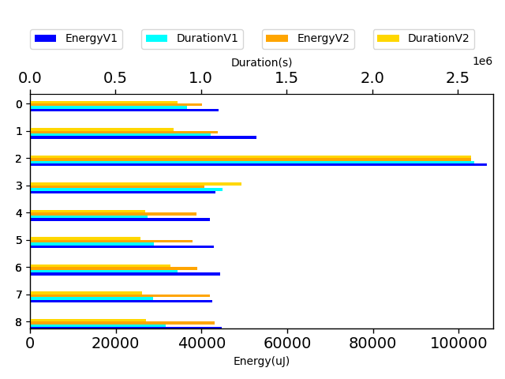

## com.google.gson.functional.DelegateTypeAdapterTest

| Test | IterationV1 | IterationV2 | DeltaIteration |
| --- | --- | --- | --- |
| com.google.gson.functional.DelegateTypeAdapterTest-testDelegateInvokedOnStrings | 25 | 26 | 1 |
| com.google.gson.functional.DelegateTypeAdapterTest-testDelegateInvoked | 99 | 97 | -2 |

| Test | EnergyV1 | EnergyV2 | DeltaEnergy |
| --- | --- | --- | --- |
| com.google.gson.functional.DelegateTypeAdapterTest-testDelegateInvokedOnStrings | 43912.193878769875 | 44677.322054728866 | 765.128175958991 |
| com.google.gson.functional.DelegateTypeAdapterTest-testDelegateInvoked | 53267.65134503481 | 59846.64904657709 | 6578.997701542285 |

| Test | DurationV1 | DurationsV2 | DeltaDuration |
| --- | --- | --- | --- |
| com.google.gson.functional.DelegateTypeAdapterTest-testDelegateInvokedOnStrings | 412219.87064135075 | 382700.7781060636 | -29519.09253528714 |
| com.google.gson.functional.DelegateTypeAdapterTest-testDelegateInvoked | 1366371.497619148 | 1342780.8075763388 | -23590.69004280935 |

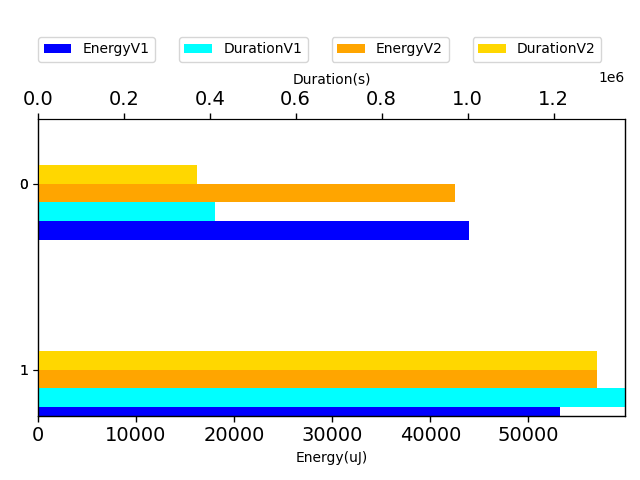

## com.google.gson.functional.TypeAdapterPrecedenceTest

| Test | IterationV1 | IterationV2 | DeltaIteration |
| --- | --- | --- | --- |
| com.google.gson.functional.TypeAdapterPrecedenceTest-testStreamingHierarchicalFollowedByNonstreaming | 17 | 18 | 1 |
| com.google.gson.functional.TypeAdapterPrecedenceTest-testSerializeNonstreamingTypeAdapterFollowedByStreamingTypeAdapter | 27 | 15 | -12 |
| com.google.gson.functional.TypeAdapterPrecedenceTest-testStreamingHierarchicalFollowedByNonstreamingHierarchical | 16 | 19 | 3 |
| com.google.gson.functional.TypeAdapterPrecedenceTest-testNonstreamingFollowedByNonstreaming | 85 | 81 | -4 |
| com.google.gson.functional.TypeAdapterPrecedenceTest-testNonstreamingHierarchicalFollowedByNonstreaming | 17 | 16 | -1 |
| com.google.gson.functional.TypeAdapterPrecedenceTest-testStreamingFollowedByStreaming | 35 | 31 | -4 |
| com.google.gson.functional.TypeAdapterPrecedenceTest-testStreamingFollowedByNonstreaming | 11 | 22 | 11 |
| com.google.gson.functional.TypeAdapterPrecedenceTest-testStreamingFollowedByNonstreamingHierarchical | 29 | 21 | -8 |

| Test | EnergyV1 | EnergyV2 | DeltaEnergy |
| --- | --- | --- | --- |
| com.google.gson.functional.TypeAdapterPrecedenceTest-testStreamingHierarchicalFollowedByNonstreaming | 40138.18824005127 | 42135.098236083984 | 1996.9099960327148 |
| com.google.gson.functional.TypeAdapterPrecedenceTest-testSerializeNonstreamingTypeAdapterFollowedByStreamingTypeAdapter | 43372.065398298204 | 43752.927673339844 | 380.8622750416398 |
| com.google.gson.functional.TypeAdapterPrecedenceTest-testStreamingHierarchicalFollowedByNonstreamingHierarchical | 45700.54852294922 | 39564.517738342285 | -6136.030784606934 |
| com.google.gson.functional.TypeAdapterPrecedenceTest-testNonstreamingFollowedByNonstreaming | 343097.2185497595 | 46802.95041896595 | -296294.2681307935 |
| com.google.gson.functional.TypeAdapterPrecedenceTest-testNonstreamingHierarchicalFollowedByNonstreaming | 42508.55387878418 | 42796.1858215332 | 287.63194274902344 |
| com.google.gson.functional.TypeAdapterPrecedenceTest-testStreamingFollowedByStreaming | 40954.886187239084 | 41142.631651214324 | 187.74546397523955 |
| com.google.gson.functional.TypeAdapterPrecedenceTest-testStreamingFollowedByNonstreaming | 45020.275390625 | 40194.440247535706 | -4825.835143089294 |
| com.google.gson.functional.TypeAdapterPrecedenceTest-testStreamingFollowedByNonstreamingHierarchical | 41303.39091617614 | 40543.656312942505 | -759.7346032336354 |

| Test | DurationV1 | DurationsV2 | DeltaDuration |
| --- | --- | --- | --- |
| com.google.gson.functional.TypeAdapterPrecedenceTest-testStreamingHierarchicalFollowedByNonstreaming | 407259.3912200928 | 418353.9460220337 | 11094.554801940918 |
| com.google.gson.functional.TypeAdapterPrecedenceTest-testSerializeNonstreamingTypeAdapterFollowedByStreamingTypeAdapter | 407754.5132103935 | 390603.21014404297 | -17151.30306635052 |
| com.google.gson.functional.TypeAdapterPrecedenceTest-testStreamingHierarchicalFollowedByNonstreamingHierarchical | 383391.95234680176 | 596300.754398346 | 212908.8020515442 |
| com.google.gson.functional.TypeAdapterPrecedenceTest-testNonstreamingFollowedByNonstreaming | 10227811.150824677 | 1206531.2730659968 | -9021279.87775868 |
| com.google.gson.functional.TypeAdapterPrecedenceTest-testNonstreamingHierarchicalFollowedByNonstreaming | 427025.4976654053 | 442705.7867126465 | 15680.289047241211 |
| com.google.gson.functional.TypeAdapterPrecedenceTest-testStreamingFollowedByStreaming | 634996.1729139396 | 489504.1198333306 | -145492.05308060895 |
| com.google.gson.functional.TypeAdapterPrecedenceTest-testStreamingFollowedByNonstreaming | 509646.7548828125 | 533496.9992809296 | 23850.244398117065 |
| com.google.gson.functional.TypeAdapterPrecedenceTest-testStreamingFollowedByNonstreamingHierarchical | 409621.56865882874 | 461155.4164543152 | 51533.84779548645 |

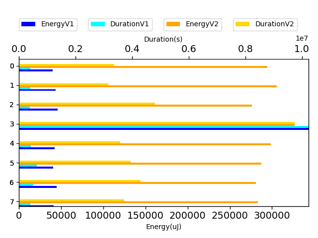

## com.google.gson.functional.NamingPolicyTest

| Test | IterationV1 | IterationV2 | DeltaIteration |
| --- | --- | --- | --- |
| com.google.gson.functional.NamingPolicyTest-testGsonWithNonDefaultFieldNamingPolicySerialization | 52 | 40 | -12 |
| com.google.gson.functional.NamingPolicyTest-testGsonWithLowerCaseDotPolicySerialization | 29 | 31 | 2 |
| com.google.gson.functional.NamingPolicyTest-testComplexFieldNameStrategy | 69 | 60 | -9 |
| com.google.gson.functional.NamingPolicyTest-testDeprecatedNamingStrategy | 78 | 82 | 4 |
| com.google.gson.functional.NamingPolicyTest-testGsonWithSerializedNameFieldNamingPolicySerialization | 59 | 57 | -2 |
| com.google.gson.functional.NamingPolicyTest-testGsonWithLowerCaseDashPolicySerialization | 21 | 35 | 14 |
| com.google.gson.functional.NamingPolicyTest-testGsonWithLowerCaseUnderscorePolicySerialization | 37 | 35 | -2 |
| com.google.gson.functional.NamingPolicyTest-testAtSignInSerializedName | 53 | 50 | -3 |
| com.google.gson.functional.NamingPolicyTest-testGsonWithUpperCamelCaseSpacesPolicySerialiation | 26 | 31 | 5 |

| Test | EnergyV1 | EnergyV2 | DeltaEnergy |
| --- | --- | --- | --- |
| com.google.gson.functional.NamingPolicyTest-testGsonWithNonDefaultFieldNamingPolicySerialization | 47027.3081412093 | 46035.841736452094 | -991.4664047572078 |
| com.google.gson.functional.NamingPolicyTest-testGsonWithLowerCaseDotPolicySerialization | 41078.72729527205 | 44692.14591442142 | 3613.4186191493645 |
| com.google.gson.functional.NamingPolicyTest-testComplexFieldNameStrategy | 45757.41489951723 | 42251.547552081865 | -3505.8673474353636 |
| com.google.gson.functional.NamingPolicyTest-testDeprecatedNamingStrategy | 44430.90167633795 | 47359.0869756541 | 2928.185299316152 |
| com.google.gson.functional.NamingPolicyTest-testGsonWithSerializedNameFieldNamingPolicySerialization | 61523.030890834496 | 81182.57569668847 | 19659.54480585397 |
| com.google.gson.functional.NamingPolicyTest-testGsonWithLowerCaseDashPolicySerialization | 44252.106048583984 | 41639.98492943833 | -2612.121119145653 |
| com.google.gson.functional.NamingPolicyTest-testGsonWithLowerCaseUnderscorePolicySerialization | 44398.22817363076 | 44313.816247819166 | -84.41192581159703 |
| com.google.gson.functional.NamingPolicyTest-testAtSignInSerializedName | 47456.657596081495 | 41477.8892712085 | -5978.768324872995 |
| com.google.gson.functional.NamingPolicyTest-testGsonWithUpperCamelCaseSpacesPolicySerialiation | 44479.3131121397 | 44684.54112366121 | 205.22801152151078 |

| Test | DurationV1 | DurationsV2 | DeltaDuration |
| --- | --- | --- | --- |
| com.google.gson.functional.NamingPolicyTest-testGsonWithNonDefaultFieldNamingPolicySerialization | 804391.9776386902 | 607516.3604371818 | -196875.61720150837 |
| com.google.gson.functional.NamingPolicyTest-testGsonWithLowerCaseDotPolicySerialization | 500924.4094951283 | 491064.8699462442 | -9859.539548884146 |
| com.google.gson.functional.NamingPolicyTest-testComplexFieldNameStrategy | 1201458.5199092226 | 916865.703399177 | -284592.81651004567 |
| com.google.gson.functional.NamingPolicyTest-testDeprecatedNamingStrategy | 1157190.0092804 | 1059804.029253833 | -97385.98002656689 |
| com.google.gson.functional.NamingPolicyTest-testGsonWithSerializedNameFieldNamingPolicySerialization | 1556446.1383194844 | 2008232.6878259662 | 451786.54950648174 |
| com.google.gson.functional.NamingPolicyTest-testGsonWithLowerCaseDashPolicySerialization | 497773.79625606537 | 485709.4735319239 | -12064.322724141472 |
| com.google.gson.functional.NamingPolicyTest-testGsonWithLowerCaseUnderscorePolicySerialization | 633422.8869579185 | 466544.28979726584 | -166878.5971606527 |
| com.google.gson.functional.NamingPolicyTest-testAtSignInSerializedName | 790817.83581088 | 679735.8673944338 | -111081.96841644612 |
| com.google.gson.functional.NamingPolicyTest-testGsonWithUpperCamelCaseSpacesPolicySerialiation | 631789.7884258032 | 458067.83909471147 | -173721.94933109172 |

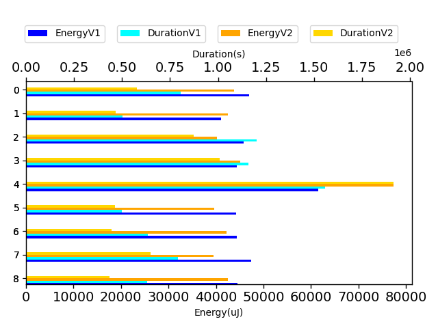

## com.google.gson.functional.PrimitiveTest

| Test | IterationV1 | IterationV2 | DeltaIteration |
| --- | --- | --- | --- |
| com.google.gson.functional.PrimitiveTest-testFloatInfinitySerializationNotSupportedByDefault | 14 | 14 | 0 |
| com.google.gson.functional.PrimitiveTest-testPrimitiveBooleanAutoboxedSerialization | 14 | 13 | -1 |
| com.google.gson.functional.PrimitiveTest-testQuotedStringSerializationAndDeserialization | 16 | 15 | -1 |
| com.google.gson.functional.PrimitiveTest-testSmallValueForBigDecimalSerialization | 14 | 17 | 3 |
| com.google.gson.functional.PrimitiveTest-testDoubleNaNSerialization | 12 | 18 | 6 |
| com.google.gson.functional.PrimitiveTest-testDoubleInfinitySerialization | 16 | 15 | -1 |
| com.google.gson.functional.PrimitiveTest-testPrimitiveDoubleAutoboxedInASingleElementArraySerialization | 22 | 28 | 6 |
| com.google.gson.functional.PrimitiveTest-testBigDecimalSerialization | 55 | 62 | 7 |
| com.google.gson.functional.PrimitiveTest-testBigIntegerInASingleElementArraySerialization | 30 | 32 | 2 |
| com.google.gson.functional.PrimitiveTest-testBigDecimalInASingleElementArraySerialization | 23 | 16 | -7 |
| com.google.gson.functional.PrimitiveTest-testNegativeInfinitySerialization | 15 | 8 | -7 |
| com.google.gson.functional.PrimitiveTest-testLongAsStringSerialization | 25 | 21 | -4 |
| com.google.gson.functional.PrimitiveTest-testFloatInfinitySerialization | 10 | 12 | 2 |
| com.google.gson.functional.PrimitiveTest-testPrimitiveLongAutoboxedInASingleElementArraySerialization | 13 | 16 | 3 |
| com.google.gson.functional.PrimitiveTest-testNegativeInfinityFloatSerializationNotSupportedByDefault | 17 | 16 | -1 |
| com.google.gson.functional.PrimitiveTest-testShortSerialization | 13 | 19 | 6 |
| com.google.gson.functional.PrimitiveTest-testNegativeInfinitySerializationNotSupportedByDefault | 18 | 19 | 1 |
| com.google.gson.functional.PrimitiveTest-testPrimitiveBooleanAutoboxedInASingleElementArraySerialization | 21 | 24 | 3 |
| com.google.gson.functional.PrimitiveTest-testReallyLongValuesSerialization | 8 | 14 | 6 |
| com.google.gson.functional.PrimitiveTest-testFloatNaNSerializationNotSupportedByDefault | 19 | 17 | -2 |
| com.google.gson.functional.PrimitiveTest-testDoubleInfinitySerializationNotSupportedByDefault | 16 | 22 | 6 |
| com.google.gson.functional.PrimitiveTest-testFloatNaNSerialization | 16 | 17 | 1 |
| com.google.gson.functional.PrimitiveTest-testNegativeInfinityFloatSerialization | 10 | 9 | -1 |
| com.google.gson.functional.PrimitiveTest-testPrimitiveIntegerAutoboxedSerialization | 12 | 15 | 3 |
| com.google.gson.functional.PrimitiveTest-testBigDecimalPreservePrecisionSerialization | 8 | 14 | 6 |
| com.google.gson.functional.PrimitiveTest-testBigIntegerSerialization | 53 | 50 | -3 |
| com.google.gson.functional.PrimitiveTest-testPrimitiveIntegerAutoboxedInASingleElementArraySerialization | 27 | 19 | -8 |
| com.google.gson.functional.PrimitiveTest-testPrimitiveLongAutoboxedSerialization | 13 | 5 | -8 |
| com.google.gson.functional.PrimitiveTest-testMoreSpecificSerialization | 29 | 30 | 1 |
| com.google.gson.functional.PrimitiveTest-testPrimitiveDoubleAutoboxedSerialization | 21 | 25 | 4 |
| com.google.gson.functional.PrimitiveTest-testByteSerialization | 18 | 15 | -3 |
| com.google.gson.functional.PrimitiveTest-testSmallValueForBigIntegerSerialization | 16 | 11 | -5 |
| com.google.gson.functional.PrimitiveTest-testNumberSerialization | 15 | 12 | -3 |
| com.google.gson.functional.PrimitiveTest-testHtmlCharacterSerialization | 15 | 23 | 8 |
| com.google.gson.functional.PrimitiveTest-testDoubleNaNSerializationNotSupportedByDefault | 12 | 19 | 7 |

| Test | EnergyV1 | EnergyV2 | DeltaEnergy |
| --- | --- | --- | --- |
| com.google.gson.functional.PrimitiveTest-testFloatInfinitySerializationNotSupportedByDefault | 43398.04071044922 | 41770.811279296875 | -1627.2294311523438 |
| com.google.gson.functional.PrimitiveTest-testPrimitiveBooleanAutoboxedSerialization | 43211.948791503906 | 42543.950439453125 | -667.9983520507812 |
| com.google.gson.functional.PrimitiveTest-testQuotedStringSerializationAndDeserialization | 42193.67208862305 | 47359.2451171875 | 5165.573028564453 |
| com.google.gson.functional.PrimitiveTest-testSmallValueForBigDecimalSerialization | 40757.70428466797 | 39466.28349304199 | -1291.4207916259766 |
| com.google.gson.functional.PrimitiveTest-testDoubleNaNSerialization | 43391.724609375 | 42080.23779296875 | -1311.48681640625 |
| com.google.gson.functional.PrimitiveTest-testDoubleInfinitySerialization | 42916.081634521484 | 44098.753845214844 | 1182.6722106933594 |
| com.google.gson.functional.PrimitiveTest-testPrimitiveDoubleAutoboxedInASingleElementArraySerialization | 41697.37875699997 | 40413.93533633649 | -1283.443420663476 |
| com.google.gson.functional.PrimitiveTest-testBigDecimalSerialization | 62553.78991817193 | 41129.58764840282 | -21424.202269769114 |
| com.google.gson.functional.PrimitiveTest-testBigIntegerInASingleElementArraySerialization | 41702.39122842811 | 42986.26067587314 | 1283.8694474450313 |
| com.google.gson.functional.PrimitiveTest-testBigDecimalInASingleElementArraySerialization | 41930.54001951218 | 41615.12188720703 | -315.41813230514526 |
| com.google.gson.functional.PrimitiveTest-testNegativeInfinitySerialization | 44179.765686035156 | 42360.171875 | -1819.5938110351562 |
| com.google.gson.functional.PrimitiveTest-testLongAsStringSerialization | 41386.84249061346 | 43468.73457813263 | 2081.892087519169 |
| com.google.gson.functional.PrimitiveTest-testFloatInfinitySerialization | 40936.12109375 | 40669.88232421875 | -266.23876953125 |
| com.google.gson.functional.PrimitiveTest-testPrimitiveLongAutoboxedInASingleElementArraySerialization | 41513.273681640625 | 41293.95184326172 | -219.32183837890625 |
| com.google.gson.functional.PrimitiveTest-testNegativeInfinityFloatSerializationNotSupportedByDefault | 43077.39228820801 | 40479.81866455078 | -2597.5736236572266 |
| com.google.gson.functional.PrimitiveTest-testShortSerialization | 43549.515869140625 | 43773.27389907837 | 223.75802993774414 |
| com.google.gson.functional.PrimitiveTest-testNegativeInfinitySerializationNotSupportedByDefault | 43111.460021972656 | 42523.03276824951 | -588.4272537231445 |
| com.google.gson.functional.PrimitiveTest-testPrimitiveBooleanAutoboxedInASingleElementArraySerialization | 43321.89174079895 | 42386.34415400028 | -935.5475867986679 |
| com.google.gson.functional.PrimitiveTest-testReallyLongValuesSerialization | 43411.984375 | 40549.06628417969 | -2862.9180908203125 |
| com.google.gson.functional.PrimitiveTest-testFloatNaNSerializationNotSupportedByDefault | 42640.30168533325 | 44150.78436279297 | 1510.4826774597168 |
| com.google.gson.functional.PrimitiveTest-testDoubleInfinitySerializationNotSupportedByDefault | 44345.48159790039 | 43956.75421285629 | -388.7273850440979 |
| com.google.gson.functional.PrimitiveTest-testFloatNaNSerialization | 42635.150329589844 | 42418.4432220459 | -216.7071075439453 |
| com.google.gson.functional.PrimitiveTest-testNegativeInfinityFloatSerialization | 39939.033203125 | 41248.734375 | 1309.701171875 |
| com.google.gson.functional.PrimitiveTest-testPrimitiveIntegerAutoboxedSerialization | 39769.63720703125 | 42857.849182128906 | 3088.2119750976562 |
| com.google.gson.functional.PrimitiveTest-testBigDecimalPreservePrecisionSerialization | 41797.859375 | 63449.84631347656 | 21651.986938476562 |
| com.google.gson.functional.PrimitiveTest-testBigIntegerSerialization | 39384.27526541097 | 40177.28851197008 | 793.0132465591087 |
| com.google.gson.functional.PrimitiveTest-testPrimitiveIntegerAutoboxedInASingleElementArraySerialization | 40835.06739641726 | 43216.57974815369 | 2381.5123517364264 |
| com.google.gson.functional.PrimitiveTest-testPrimitiveLongAutoboxedSerialization | 42749.112548828125 | 42637.0 | -112.112548828125 |
| com.google.gson.functional.PrimitiveTest-testMoreSpecificSerialization | 67344.09648968652 | 41449.85277197696 | -25894.243717709556 |
| com.google.gson.functional.PrimitiveTest-testPrimitiveDoubleAutoboxedSerialization | 78136.74947929382 | 43961.72402459383 | -34175.02545469999 |
| com.google.gson.functional.PrimitiveTest-testByteSerialization | 41942.085121154785 | 42839.976806640625 | 897.8916854858398 |
| com.google.gson.functional.PrimitiveTest-testSmallValueForBigIntegerSerialization | 90545.09909057617 | 43941.1572265625 | -46603.94186401367 |
| com.google.gson.functional.PrimitiveTest-testNumberSerialization | 45947.39111328125 | 42284.14599609375 | -3663.2451171875 |
| com.google.gson.functional.PrimitiveTest-testHtmlCharacterSerialization | 43633.88897705078 | 42933.258356809616 | -700.6306202411652 |
| com.google.gson.functional.PrimitiveTest-testDoubleNaNSerializationNotSupportedByDefault | 37648.2158203125 | 42726.047260284424 | 5077.831439971924 |

| Test | DurationV1 | DurationsV2 | DeltaDuration |
| --- | --- | --- | --- |
| com.google.gson.functional.PrimitiveTest-testFloatInfinitySerializationNotSupportedByDefault | 351376.04345703125 | 350549.35412597656 | -826.6893310546875 |
| com.google.gson.functional.PrimitiveTest-testPrimitiveBooleanAutoboxedSerialization | 356332.1432495117 | 459859.501953125 | 103527.35870361328 |
| com.google.gson.functional.PrimitiveTest-testQuotedStringSerializationAndDeserialization | 820719.4812927246 | 509690.16189575195 | -311029.31939697266 |
| com.google.gson.functional.PrimitiveTest-testSmallValueForBigDecimalSerialization | 532028.7468261719 | 403786.125869751 | -128242.6209564209 |
| com.google.gson.functional.PrimitiveTest-testDoubleNaNSerialization | 321098.60009765625 | 370166.94689178467 | 49068.34679412842 |
| com.google.gson.functional.PrimitiveTest-testDoubleInfinitySerialization | 522996.44384765625 | 322808.36834716797 | -200188.07550048828 |
| com.google.gson.functional.PrimitiveTest-testPrimitiveDoubleAutoboxedInASingleElementArraySerialization | 408455.1334414482 | 409659.1174780205 | 1203.9840365722775 |
| com.google.gson.functional.PrimitiveTest-testBigDecimalSerialization | 1332696.8213293818 | 1173367.272850034 | -159329.54847934772 |
| com.google.gson.functional.PrimitiveTest-testBigIntegerInASingleElementArraySerialization | 564944.676287096 | 807147.8381428628 | 242203.16185576678 |
| com.google.gson.functional.PrimitiveTest-testBigDecimalInASingleElementArraySerialization | 3135182.872005224 | 397471.34799194336 | -2737711.524013281 |
| com.google.gson.functional.PrimitiveTest-testNegativeInfinitySerialization | 420616.11151123047 | 307674.6875 | -112941.42401123047 |
| com.google.gson.functional.PrimitiveTest-testLongAsStringSerialization | 396042.7518077493 | 438047.76826763153 | 42005.01645988226 |
| com.google.gson.functional.PrimitiveTest-testFloatInfinitySerialization | 318041.55859375 | 323133.66748046875 | 5092.10888671875 |
| com.google.gson.functional.PrimitiveTest-testPrimitiveLongAutoboxedInASingleElementArraySerialization | 422829.88525390625 | 368991.38510131836 | -53838.50015258789 |
| com.google.gson.functional.PrimitiveTest-testNegativeInfinityFloatSerializationNotSupportedByDefault | 362133.13903808594 | 358608.37048339844 | -3524.7685546875 |
| com.google.gson.functional.PrimitiveTest-testShortSerialization | 364945.6955566406 | 343893.86044311523 | -21051.83511352539 |
| com.google.gson.functional.PrimitiveTest-testNegativeInfinitySerializationNotSupportedByDefault | 352285.3404083252 | 344787.4660873413 | -7497.874320983887 |
| com.google.gson.functional.PrimitiveTest-testPrimitiveBooleanAutoboxedInASingleElementArraySerialization | 438149.87645339966 | 414248.436065197 | -23901.440388202667 |
| com.google.gson.functional.PrimitiveTest-testReallyLongValuesSerialization | 391665.7109375 | 330391.6726074219 | -61274.038330078125 |
| com.google.gson.functional.PrimitiveTest-testFloatNaNSerializationNotSupportedByDefault | 496295.0274810791 | 334865.9097442627 | -161429.1177368164 |
| com.google.gson.functional.PrimitiveTest-testDoubleInfinitySerializationNotSupportedByDefault | 366239.4888305664 | 338178.42311763763 | -28061.065712928772 |
| com.google.gson.functional.PrimitiveTest-testFloatNaNSerialization | 485630.5959777832 | 318452.06842041016 | -167178.52755737305 |
| com.google.gson.functional.PrimitiveTest-testNegativeInfinityFloatSerialization | 406416.755859375 | 309743.75 | -96673.005859375 |
| com.google.gson.functional.PrimitiveTest-testPrimitiveIntegerAutoboxedSerialization | 540694.3500976562 | 525475.2330932617 | -15219.117004394531 |
| com.google.gson.functional.PrimitiveTest-testBigDecimalPreservePrecisionSerialization | 336194.078125 | 974970.8525390625 | 638776.7744140625 |
| com.google.gson.functional.PrimitiveTest-testBigIntegerSerialization | 1039653.2844601399 | 1213148.3518456514 | 173495.06738551147 |
| com.google.gson.functional.PrimitiveTest-testPrimitiveIntegerAutoboxedInASingleElementArraySerialization | 748404.4420688301 | 471479.52616882324 | -276924.9159000069 |
| com.google.gson.functional.PrimitiveTest-testPrimitiveLongAutoboxedSerialization | 552603.2133789062 | 312966.5625 | -239636.65087890625 |
| com.google.gson.functional.PrimitiveTest-testMoreSpecificSerialization | 1859916.267375812 | 462557.1433531642 | -1397359.1240226477 |
| com.google.gson.functional.PrimitiveTest-testPrimitiveDoubleAutoboxedSerialization | 2102953.2827911377 | 602415.593737334 | -1500537.6890538037 |
| com.google.gson.functional.PrimitiveTest-testByteSerialization | 408651.0004043579 | 339670.39001464844 | -68980.61038970947 |
| com.google.gson.functional.PrimitiveTest-testSmallValueForBigIntegerSerialization | 2202181.0740966797 | 416415.1416015625 | -1785765.9324951172 |
| com.google.gson.functional.PrimitiveTest-testNumberSerialization | 491774.89489746094 | 322649.6005859375 | -169125.29431152344 |
| com.google.gson.functional.PrimitiveTest-testHtmlCharacterSerialization | 407699.5881958008 | 481274.00159192085 | 73574.41339612007 |
| com.google.gson.functional.PrimitiveTest-testDoubleNaNSerializationNotSupportedByDefault | 872538.7426757812 | 409081.2321166992 | -463457.51055908203 |

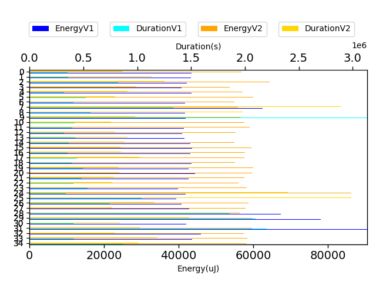

## com.google.gson.functional.CustomSerializerTest

| Test | IterationV1 | IterationV2 | DeltaIteration |
| --- | --- | --- | --- |
| com.google.gson.functional.CustomSerializerTest-testSerializerReturnsNull | 43 | 45 | 2 |
| com.google.gson.functional.CustomSerializerTest-testBaseClassSerializerInvokedForBaseClassFields | 30 | 32 | 2 |
| com.google.gson.functional.CustomSerializerTest-testSubClassSerializerInvokedForBaseClassFieldsHoldingSubClassInstances | 70 | 66 | -4 |
| com.google.gson.functional.CustomSerializerTest-testBaseClassSerializerInvokedForBaseClassFieldsHoldingSubClassInstances | 36 | 34 | -2 |
| com.google.gson.functional.CustomSerializerTest-testSubClassSerializerInvokedForBaseClassFieldsHoldingArrayOfSubClassInstances | 40 | 38 | -2 |

| Test | EnergyV1 | EnergyV2 | DeltaEnergy |
| --- | --- | --- | --- |
| com.google.gson.functional.CustomSerializerTest-testSerializerReturnsNull | 44325.31317975 | 42577.2651191146 | -1748.048060635403 |
| com.google.gson.functional.CustomSerializerTest-testBaseClassSerializerInvokedForBaseClassFields | 43540.20770710334 | 42699.973577869125 | -840.2341292342171 |
| com.google.gson.functional.CustomSerializerTest-testSubClassSerializerInvokedForBaseClassFieldsHoldingSubClassInstances | 65307.83782489585 | 91664.05139430624 | 26356.213569410393 |
| com.google.gson.functional.CustomSerializerTest-testBaseClassSerializerInvokedForBaseClassFieldsHoldingSubClassInstances | 40775.089631229 | 43324.25599239976 | 2549.1663611707627 |
| com.google.gson.functional.CustomSerializerTest-testSubClassSerializerInvokedForBaseClassFieldsHoldingArrayOfSubClassInstances | 41729.01981336285 | 44628.652470683075 | 2899.632657320224 |

| Test | DurationV1 | DurationsV2 | DeltaDuration |
| --- | --- | --- | --- |
| com.google.gson.functional.CustomSerializerTest-testSerializerReturnsNull | 664379.9137726459 | 807212.585544831 | 142832.67177218513 |
| com.google.gson.functional.CustomSerializerTest-testBaseClassSerializerInvokedForBaseClassFields | 545521.2124553993 | 521966.2967405501 | -23554.915714849252 |
| com.google.gson.functional.CustomSerializerTest-testSubClassSerializerInvokedForBaseClassFieldsHoldingSubClassInstances | 1381462.4002006673 | 2168479.9713315517 | 787017.5711308843 |
| com.google.gson.functional.CustomSerializerTest-testBaseClassSerializerInvokedForBaseClassFieldsHoldingSubClassInstances | 631108.9688224521 | 601261.157678627 | -29847.81114382518 |
| com.google.gson.functional.CustomSerializerTest-testSubClassSerializerInvokedForBaseClassFieldsHoldingArrayOfSubClassInstances | 628147.6598710507 | 674787.8760551036 | 46640.21618405287 |

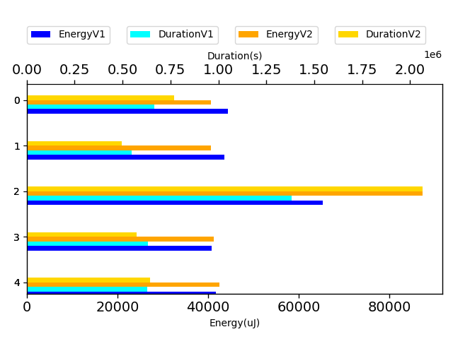

## com.google.gson.functional.ObjectTest

| Test | IterationV1 | IterationV2 | DeltaIteration |
| --- | --- | --- | --- |
| com.google.gson.functional.ObjectTest-testSingletonLists | 95 | 98 | 3 |
| com.google.gson.functional.ObjectTest-testArrayOfObjectsAsFields | 57 | 54 | -3 |
| com.google.gson.functional.ObjectTest-testAnonymousLocalClassesCustomSerialization | 52 | 47 | -5 |
| com.google.gson.functional.ObjectTest-testDateAsMapObjectField | 91 | 96 | 5 |
| com.google.gson.functional.ObjectTest-testClassWithNoFieldsSerialization | 23 | 31 | 8 |
| com.google.gson.functional.ObjectTest-testStringFieldWithEmptyValueSerialization | 46 | 55 | 9 |
| com.google.gson.functional.ObjectTest-testInnerClassSerialization | 69 | 64 | -5 |
| com.google.gson.functional.ObjectTest-testEmptyCollectionInAnObjectSerialization | 77 | 63 | -14 |
| com.google.gson.functional.ObjectTest-testBagOfPrimitiveWrappersSerialization | 46 | 47 | 1 |
| com.google.gson.functional.ObjectTest-testArrayOfArraysSerialization | 71 | 80 | 9 |
| com.google.gson.functional.ObjectTest-testAnonymousLocalClassesSerialization | 31 | 42 | 11 |
| com.google.gson.functional.ObjectTest-testBagOfPrimitivesSerialization | 44 | 33 | -11 |
| com.google.gson.functional.ObjectTest-testArrayOfObjectsSerialization | 44 | 54 | 10 |
| com.google.gson.functional.ObjectTest-testClassWithTransientFieldsSerialization | 29 | 36 | 7 |
| com.google.gson.functional.ObjectTest-testNullFieldsSerialization | 37 | 32 | -5 |
| com.google.gson.functional.ObjectTest-testNestedSerialization | 39 | 49 | 10 |
| com.google.gson.functional.ObjectTest-testClassWithObjectFieldSerialization | 44 | 41 | -3 |
| com.google.gson.functional.ObjectTest-testPrimitiveArrayFieldSerialization | 31 | 31 | 0 |
| com.google.gson.functional.ObjectTest-testNullSerialization | 10 | 13 | 3 |
| com.google.gson.functional.ObjectTest-testJsonObjectSerialization | 8 | 19 | 11 |

| Test | EnergyV1 | EnergyV2 | DeltaEnergy |
| --- | --- | --- | --- |
| com.google.gson.functional.ObjectTest-testSingletonLists | 42195.415040458465 | 56201.25487501094 | 14005.839834552477 |
| com.google.gson.functional.ObjectTest-testArrayOfObjectsAsFields | 41245.67422336666 | 62827.2234604039 | 21581.549237037238 |
| com.google.gson.functional.ObjectTest-testAnonymousLocalClassesCustomSerialization | 44060.2258400444 | 43798.16367203965 | -262.06216800474795 |
| com.google.gson.functional.ObjectTest-testDateAsMapObjectField | 81966.5254864334 | 465466.44726239576 | 383499.92177596234 |
| com.google.gson.functional.ObjectTest-testClassWithNoFieldsSerialization | 45283.07670235634 | 41026.87423831597 | -4256.202464040369 |
| com.google.gson.functional.ObjectTest-testStringFieldWithEmptyValueSerialization | 41793.58229139962 | 43862.04805026841 | 2068.465758868784 |
| com.google.gson.functional.ObjectTest-testInnerClassSerialization | 42147.269088375004 | 42536.930457778595 | 389.6613694035914 |
| com.google.gson.functional.ObjectTest-testEmptyCollectionInAnObjectSerialization | 42815.95263403447 | 58389.619316922064 | 15573.666682887597 |
| com.google.gson.functional.ObjectTest-testBagOfPrimitiveWrappersSerialization | 41924.140252071535 | 43106.6553971165 | 1182.515145044963 |
| com.google.gson.functional.ObjectTest-testArrayOfArraysSerialization | 39506.18968012584 | 62741.150263791445 | 23234.960583665605 |
| com.google.gson.functional.ObjectTest-testAnonymousLocalClassesSerialization | 44013.937886950094 | 41385.21340085253 | -2628.7244860975625 |
| com.google.gson.functional.ObjectTest-testBagOfPrimitivesSerialization | 43754.07579886193 | 42171.325698929606 | -1582.7500999323238 |
| com.google.gson.functional.ObjectTest-testArrayOfObjectsSerialization | 39013.857809273206 | 43411.14653712952 | 4397.288727856314 |
| com.google.gson.functional.ObjectTest-testClassWithTransientFieldsSerialization | 41555.87974615209 | 37950.24410444638 | -3605.6356417057104 |
| com.google.gson.functional.ObjectTest-testNullFieldsSerialization | 40265.08393534167 | 42110.50522669009 | 1845.4212913484225 |
| com.google.gson.functional.ObjectTest-testNestedSerialization | 42055.13284993551 | 37226.37697062016 | -4828.755879315351 |
| com.google.gson.functional.ObjectTest-testClassWithObjectFieldSerialization | 43560.74548758258 | 43034.844295246934 | -525.9011923356447 |
| com.google.gson.functional.ObjectTest-testPrimitiveArrayFieldSerialization | 43078.94637823105 | 43113.580527894665 | 34.63414966361597 |
| com.google.gson.functional.ObjectTest-testNullSerialization | 47592.5 | 44422.3232421875 | -3170.1767578125 |
| com.google.gson.functional.ObjectTest-testJsonObjectSerialization | 40536.1484375 | 85835.4642238617 | 45299.315786361694 |

| Test | DurationV1 | DurationsV2 | DeltaDuration |
| --- | --- | --- | --- |
| com.google.gson.functional.ObjectTest-testSingletonLists | 1231192.219408718 | 1413699.5160714863 | 182507.29666276835 |
| com.google.gson.functional.ObjectTest-testArrayOfObjectsAsFields | 805823.7178268784 | 1247452.6564772553 | 441628.93865037686 |
| com.google.gson.functional.ObjectTest-testAnonymousLocalClassesCustomSerialization | 713594.0255986127 | 1109955.6354111056 | 396361.60981249285 |
| com.google.gson.functional.ObjectTest-testDateAsMapObjectField | 2157831.574883917 | 10763874.66940035 | 8606043.094516432 |
| com.google.gson.functional.ObjectTest-testClassWithNoFieldsSerialization | 396199.6026905775 | 807203.1673118966 | 411003.56462131906 |
| com.google.gson.functional.ObjectTest-testStringFieldWithEmptyValueSerialization | 650630.5554100133 | 756633.2231493783 | 106002.66773936502 |
| com.google.gson.functional.ObjectTest-testInnerClassSerialization | 777466.2197565483 | 931218.8372599164 | 153752.61750336806 |
| com.google.gson.functional.ObjectTest-testEmptyCollectionInAnObjectSerialization | 902934.8293467367 | 1629203.7043974865 | 726268.8750507499 |
| com.google.gson.functional.ObjectTest-testBagOfPrimitiveWrappersSerialization | 635246.9770549216 | 804568.532427551 | 169321.55537262943 |
| com.google.gson.functional.ObjectTest-testArrayOfArraysSerialization | 1028885.2920132481 | 1340656.0149913626 | 311770.7229781145 |
| com.google.gson.functional.ObjectTest-testAnonymousLocalClassesSerialization | 709640.7102773814 | 597448.5511091622 | -112192.1591682192 |
| com.google.gson.functional.ObjectTest-testBagOfPrimitivesSerialization | 501901.8825705223 | 932521.9960881241 | 430620.1135176018 |
| com.google.gson.functional.ObjectTest-testArrayOfObjectsSerialization | 742509.9127183231 | 1134748.171177803 | 392238.25845948 |
| com.google.gson.functional.ObjectTest-testClassWithTransientFieldsSerialization | 493042.66090941615 | 1015602.4642426437 | 522559.8033332275 |
| com.google.gson.functional.ObjectTest-testNullFieldsSerialization | 461279.6907453784 | 945122.4990176549 | 483842.80827227654 |
| com.google.gson.functional.ObjectTest-testNestedSerialization | 598696.9272239888 | 911927.0666226128 | 313230.13939862396 |
| com.google.gson.functional.ObjectTest-testClassWithObjectFieldSerialization | 639681.7243181985 | 767995.7366301069 | 128314.01231190842 |
| com.google.gson.functional.ObjectTest-testPrimitiveArrayFieldSerialization | 904873.0232589385 | 537270.9454934513 | -367602.07776548713 |
| com.google.gson.functional.ObjectTest-testNullSerialization | 754388.625 | 282867.8779296875 | -471520.7470703125 |
| com.google.gson.functional.ObjectTest-testJsonObjectSerialization | 351946.671875 | 1542406.9508666992 | 1190460.2789916992 |

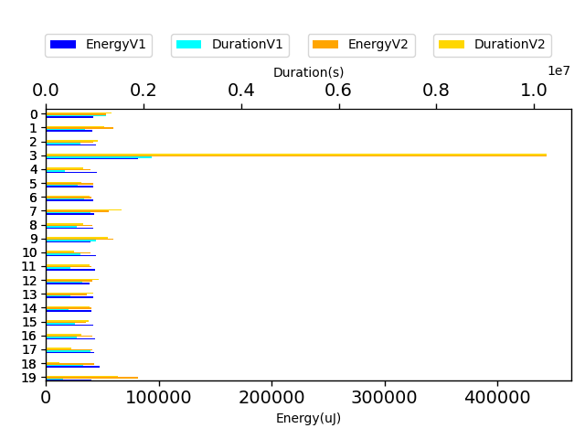

## com.google.gson.functional.CustomTypeAdaptersTest

| Test | IterationV1 | IterationV2 | DeltaIteration |
| --- | --- | --- | --- |
| com.google.gson.functional.CustomTypeAdaptersTest-testCustomAdapterInvokedForMapElementSerializationWithType | 60 | 58 | -2 |
| com.google.gson.functional.CustomTypeAdaptersTest-testCustomNestedSerializers | 70 | 58 | -12 |
| com.google.gson.functional.CustomTypeAdaptersTest-testCustomAdapterInvokedForMapElementSerialization | 23 | 18 | -5 |
| com.google.gson.functional.CustomTypeAdaptersTest-testCustomSerializers | 50 | 62 | 12 |
| com.google.gson.functional.CustomTypeAdaptersTest-testCustomTypeAdapterDoesNotAppliesToSubClasses | 83 | 80 | -3 |
| com.google.gson.functional.CustomTypeAdaptersTest-testCustomAdapterInvokedForCollectionElementSerialization | 25 | 21 | -4 |
| com.google.gson.functional.CustomTypeAdaptersTest-testRegisterHierarchyAdapterForDate | 74 | 66 | -8 |
| com.google.gson.functional.CustomTypeAdaptersTest-testCustomAdapterInvokedForCollectionElementSerializationWithType | 87 | 91 | 4 |
| com.google.gson.functional.CustomTypeAdaptersTest-testCustomByteArraySerializer | 50 | 42 | -8 |
| com.google.gson.functional.CustomTypeAdaptersTest-testEnsureCustomSerializerNotInvokedForNullValues | 87 | 83 | -4 |
| com.google.gson.functional.CustomTypeAdaptersTest-testCustomSerializerInvokedForPrimitives | 51 | 41 | -10 |
| com.google.gson.functional.CustomTypeAdaptersTest-testCustomTypeAdapterAppliesToSubClassesSerializedAsBaseClass | 40 | 42 | 2 |

| Test | EnergyV1 | EnergyV2 | DeltaEnergy |
| --- | --- | --- | --- |
| com.google.gson.functional.CustomTypeAdaptersTest-testCustomAdapterInvokedForMapElementSerializationWithType | 42734.37266638449 | 42896.8678283454 | 162.4951619609128 |
| com.google.gson.functional.CustomTypeAdaptersTest-testCustomNestedSerializers | 74423.12637761582 | 41327.53194591683 | -33095.594431698984 |
| com.google.gson.functional.CustomTypeAdaptersTest-testCustomAdapterInvokedForMapElementSerialization | 42657.26294231415 | 41912.73106384277 | -744.5318784713745 |
| com.google.gson.functional.CustomTypeAdaptersTest-testCustomSerializers | 55921.102186160046 | 47558.149463711234 | -8362.952722448812 |
| com.google.gson.functional.CustomTypeAdaptersTest-testCustomTypeAdapterDoesNotAppliesToSubClasses | 45621.22792648243 | 43495.76649813687 | -2125.4614283455594 |
| com.google.gson.functional.CustomTypeAdaptersTest-testCustomAdapterInvokedForCollectionElementSerialization | 42975.93840172887 | 45871.110387802124 | 2895.1719860732555 |
| com.google.gson.functional.CustomTypeAdaptersTest-testRegisterHierarchyAdapterForDate | 50665.54413261176 | 63010.518565214086 | 12344.974432602328 |
| com.google.gson.functional.CustomTypeAdaptersTest-testCustomAdapterInvokedForCollectionElementSerializationWithType | 45377.7974293372 | 43817.26680596811 | -1560.5306233690935 |
| com.google.gson.functional.CustomTypeAdaptersTest-testCustomByteArraySerializer | 37864.063396542064 | 43697.98650276316 | 5833.9231062210965 |
| com.google.gson.functional.CustomTypeAdaptersTest-testEnsureCustomSerializerNotInvokedForNullValues | 44203.8751412916 | 43555.01927948295 | -648.8558618086536 |
| com.google.gson.functional.CustomTypeAdaptersTest-testCustomSerializerInvokedForPrimitives | 42123.252748603205 | 44185.84527388138 | 2062.5925252781744 |
| com.google.gson.functional.CustomTypeAdaptersTest-testCustomTypeAdapterAppliesToSubClassesSerializedAsBaseClass | 43637.74966114834 | 42761.25348234831 | -876.4961788000292 |

| Test | DurationV1 | DurationsV2 | DeltaDuration |
| --- | --- | --- | --- |
| com.google.gson.functional.CustomTypeAdaptersTest-testCustomAdapterInvokedForMapElementSerializationWithType | 747637.1459718572 | 729159.9381665869 | -18477.20780527033 |
| com.google.gson.functional.CustomTypeAdaptersTest-testCustomNestedSerializers | 1849640.9053223208 | 927592.1723459403 | -922048.7329763805 |
| com.google.gson.functional.CustomTypeAdaptersTest-testCustomAdapterInvokedForMapElementSerialization | 424524.4262818098 | 558840.6529693604 | 134316.22668755054 |
| com.google.gson.functional.CustomTypeAdaptersTest-testCustomSerializers | 1954833.2956330366 | 916922.3982061071 | -1037910.8974269296 |
| com.google.gson.functional.CustomTypeAdaptersTest-testCustomTypeAdapterDoesNotAppliesToSubClasses | 1082803.7003726903 | 1006059.2048106121 | -76744.4955620782 |
| com.google.gson.functional.CustomTypeAdaptersTest-testCustomAdapterInvokedForCollectionElementSerialization | 736106.5484685302 | 459661.3149089813 | -276445.23355954885 |
| com.google.gson.functional.CustomTypeAdaptersTest-testRegisterHierarchyAdapterForDate | 934828.3675843887 | 1404302.2388578 | 469473.8712734112 |
| com.google.gson.functional.CustomTypeAdaptersTest-testCustomAdapterInvokedForCollectionElementSerializationWithType | 1112159.716639739 | 1154597.5816278958 | 42437.86498815683 |
| com.google.gson.functional.CustomTypeAdaptersTest-testCustomByteArraySerializer | 754724.5122295782 | 669716.7527504608 | -85007.75947911746 |
| com.google.gson.functional.CustomTypeAdaptersTest-testEnsureCustomSerializerNotInvokedForNullValues | 1072067.8332493003 | 1003648.0513001793 | -68419.78194912092 |
| com.google.gson.functional.CustomTypeAdaptersTest-testCustomSerializerInvokedForPrimitives | 595543.6628580086 | 775390.6376246717 | 179846.97476666304 |
| com.google.gson.functional.CustomTypeAdaptersTest-testCustomTypeAdapterAppliesToSubClassesSerializedAsBaseClass | 667050.1345449011 | 690345.9998624485 | 23295.86531754746 |

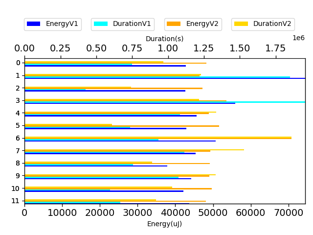

## com.google.gson.functional.JsonAdapterAnnotationOnFieldsTest

| Test | IterationV1 | IterationV2 | DeltaIteration |
| --- | --- | --- | --- |
| com.google.gson.functional.JsonAdapterAnnotationOnFieldsTest-testPrimitiveFieldAnnotationTakesPrecedenceOverDefault | 96 | 98 | 2 |
| com.google.gson.functional.JsonAdapterAnnotationOnFieldsTest-testClassAnnotationAdapterFactoryTakesPrecedenceOverDefault | 98 | 97 | -1 |
| com.google.gson.functional.JsonAdapterAnnotationOnFieldsTest-testJsonAdapterWrappedInNullSafeAsRequested | 63 | 67 | 4 |
| com.google.gson.functional.JsonAdapterAnnotationOnFieldsTest-testFieldAnnotationWorksForParameterizedType | 93 | 96 | 3 |
| com.google.gson.functional.JsonAdapterAnnotationOnFieldsTest-testFieldAnnotationTakesPrecedenceOverClassAnnotation | 75 | 85 | 10 |
| com.google.gson.functional.JsonAdapterAnnotationOnFieldsTest-testFieldAnnotationTakesPrecedenceOverRegisteredTypeAdapter | 96 | 95 | -1 |
| com.google.gson.functional.JsonAdapterAnnotationOnFieldsTest-testClassAnnotationAdapterTakesPrecedenceOverDefault | 93 | 95 | 2 |
| com.google.gson.functional.JsonAdapterAnnotationOnFieldsTest-testRegisteredTypeAdapterTakesPrecedenceOverClassAnnotationAdapter | 62 | 69 | 7 |
| com.google.gson.functional.JsonAdapterAnnotationOnFieldsTest-testNonPrimitiveFieldAnnotationTakesPrecedenceOverDefault | 25 | 34 | 9 |

| Test | EnergyV1 | EnergyV2 | DeltaEnergy |
| --- | --- | --- | --- |
| com.google.gson.functional.JsonAdapterAnnotationOnFieldsTest-testPrimitiveFieldAnnotationTakesPrecedenceOverDefault | 68923.87716534284 | 42581.44656465967 | -26342.43060068317 |
| com.google.gson.functional.JsonAdapterAnnotationOnFieldsTest-testClassAnnotationAdapterFactoryTakesPrecedenceOverDefault | 66767.18624247241 | 49039.15552514151 | -17728.030717330897 |
| com.google.gson.functional.JsonAdapterAnnotationOnFieldsTest-testJsonAdapterWrappedInNullSafeAsRequested | 45560.112108399066 | 58861.82448999993 | 13301.712381600868 |
| com.google.gson.functional.JsonAdapterAnnotationOnFieldsTest-testFieldAnnotationWorksForParameterizedType | 67567.3792359553 | 50718.76016411632 | -16848.619071838984 |
| com.google.gson.functional.JsonAdapterAnnotationOnFieldsTest-testFieldAnnotationTakesPrecedenceOverClassAnnotation | 44271.388063525155 | 37599.94105726026 | -6671.447006264898 |
| com.google.gson.functional.JsonAdapterAnnotationOnFieldsTest-testFieldAnnotationTakesPrecedenceOverRegisteredTypeAdapter | 43750.25139209397 | 38543.39960019662 | -5206.851791897345 |
| com.google.gson.functional.JsonAdapterAnnotationOnFieldsTest-testClassAnnotationAdapterTakesPrecedenceOverDefault | 123069.76462934288 | 489083.96740440227 | 366014.2027750594 |
| com.google.gson.functional.JsonAdapterAnnotationOnFieldsTest-testRegisteredTypeAdapterTakesPrecedenceOverClassAnnotationAdapter | 43991.39331447777 | 47813.36604507018 | 3821.97273059241 |
| com.google.gson.functional.JsonAdapterAnnotationOnFieldsTest-testNonPrimitiveFieldAnnotationTakesPrecedenceOverDefault | 43773.34750431776 | 41588.6712951496 | -2184.6762091681594 |

| Test | DurationV1 | DurationsV2 | DeltaDuration |
| --- | --- | --- | --- |
| com.google.gson.functional.JsonAdapterAnnotationOnFieldsTest-testPrimitiveFieldAnnotationTakesPrecedenceOverDefault | 1686067.7078990806 | 1397740.7726474411 | -288326.93525163946 |
| com.google.gson.functional.JsonAdapterAnnotationOnFieldsTest-testClassAnnotationAdapterFactoryTakesPrecedenceOverDefault | 1741376.5334693876 | 1500821.3994116168 | -240555.13405777072 |
| com.google.gson.functional.JsonAdapterAnnotationOnFieldsTest-testJsonAdapterWrappedInNullSafeAsRequested | 1095551.588292406 | 1576483.1896114142 | 480931.6013190083 |
| com.google.gson.functional.JsonAdapterAnnotationOnFieldsTest-testFieldAnnotationWorksForParameterizedType | 1532337.5964497752 | 1735211.5123855912 | 202873.915935816 |
| com.google.gson.functional.JsonAdapterAnnotationOnFieldsTest-testFieldAnnotationTakesPrecedenceOverClassAnnotation | 1372800.1834689903 | 1186907.6084207464 | -185892.57504824386 |
| com.google.gson.functional.JsonAdapterAnnotationOnFieldsTest-testFieldAnnotationTakesPrecedenceOverRegisteredTypeAdapter | 1263046.394568867 | 1398626.5749536739 | 135580.18038480682 |
| com.google.gson.functional.JsonAdapterAnnotationOnFieldsTest-testClassAnnotationAdapterTakesPrecedenceOverDefault | 3083051.370720686 | 14180188.914878802 | 11097137.544158116 |
| com.google.gson.functional.JsonAdapterAnnotationOnFieldsTest-testRegisteredTypeAdapterTakesPrecedenceOverClassAnnotationAdapter | 961053.6815685641 | 1005944.8867861032 | 44891.2052175391 |
| com.google.gson.functional.JsonAdapterAnnotationOnFieldsTest-testNonPrimitiveFieldAnnotationTakesPrecedenceOverDefault | 669531.5288072228 | 606843.481708012 | -62688.04709921079 |

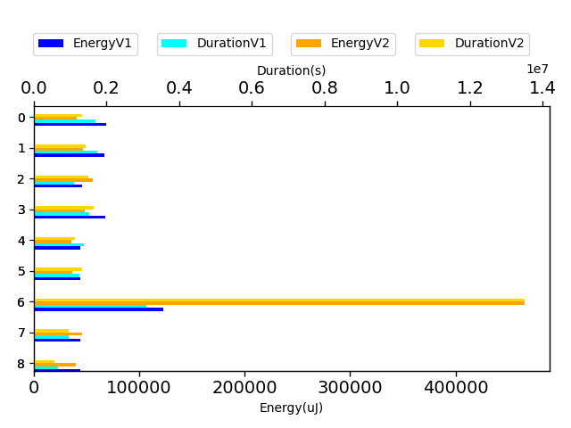

## com.google.gson.functional.SerializedNameTest

| Test | IterationV1 | IterationV2 | DeltaIteration |
| --- | --- | --- | --- |
| com.google.gson.functional.SerializedNameTest-testFirstNameIsChosenForSerialization | 85 | 81 | -4 |

| Test | EnergyV1 | EnergyV2 | DeltaEnergy |
| --- | --- | --- | --- |
| com.google.gson.functional.SerializedNameTest-testFirstNameIsChosenForSerialization | 94876.67484226951 | 43096.60188347208 | -51780.07295879743 |

| Test | DurationV1 | DurationsV2 | DeltaDuration |
| --- | --- | --- | --- |
| com.google.gson.functional.SerializedNameTest-testFirstNameIsChosenForSerialization | 1951085.0589205357 | 895348.2703721463 | -1055736.7885483894 |

## com.google.gson.functional.TypeHierarchyAdapterTest

| Test | IterationV1 | IterationV2 | DeltaIteration |
| --- | --- | --- | --- |
| com.google.gson.functional.TypeHierarchyAdapterTest-testRegisterSuperTypeFirst | 52 | 50 | -2 |
| com.google.gson.functional.TypeHierarchyAdapterTest-testTypeHierarchy | 99 | 99 | 0 |

| Test | EnergyV1 | EnergyV2 | DeltaEnergy |
| --- | --- | --- | --- |
| com.google.gson.functional.TypeHierarchyAdapterTest-testRegisterSuperTypeFirst | 41498.80103308678 | 42928.7753272681 | 1429.9742941813238 |
| com.google.gson.functional.TypeHierarchyAdapterTest-testTypeHierarchy | 122266.05119518902 | 113323.67141774742 | -8942.379777441602 |

| Test | DurationV1 | DurationsV2 | DeltaDuration |
| --- | --- | --- | --- |
| com.google.gson.functional.TypeHierarchyAdapterTest-testRegisterSuperTypeFirst | 789873.2623572533 | 639161.5937621178 | -150711.66859513556 |
| com.google.gson.functional.TypeHierarchyAdapterTest-testTypeHierarchy | 3059950.296690152 | 2671399.138705226 | -388551.1579849259 |

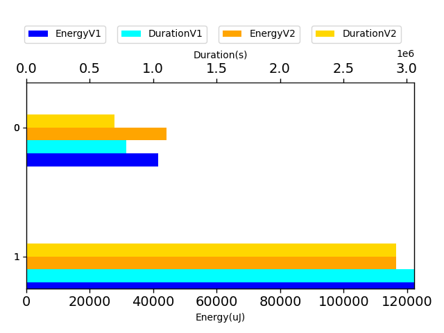

## com.google.gson.functional.SecurityTest

| Test | IterationV1 | IterationV2 | DeltaIteration |
| --- | --- | --- | --- |
| com.google.gson.functional.SecurityTest-testJsonWithNonExectuableTokenSerialization | 21 | 24 | 3 |
| com.google.gson.functional.SecurityTest-testNonExecutableJsonSerialization | 32 | 35 | 3 |

| Test | EnergyV1 | EnergyV2 | DeltaEnergy |
| --- | --- | --- | --- |
| com.google.gson.functional.SecurityTest-testJsonWithNonExectuableTokenSerialization | 43349.211978435516 | 44403.64562213421 | 1054.4336436986923 |
| com.google.gson.functional.SecurityTest-testNonExecutableJsonSerialization | 154215.56875355262 | 42374.00023090723 | -111841.5685226454 |

| Test | DurationV1 | DurationsV2 | DeltaDuration |
| --- | --- | --- | --- |
| com.google.gson.functional.SecurityTest-testJsonWithNonExectuableTokenSerialization | 372623.44108581543 | 485379.0897628069 | 112755.64867699146 |
| com.google.gson.functional.SecurityTest-testNonExecutableJsonSerialization | 3792568.179721898 | 526980.059325851 | -3265588.120396047 |

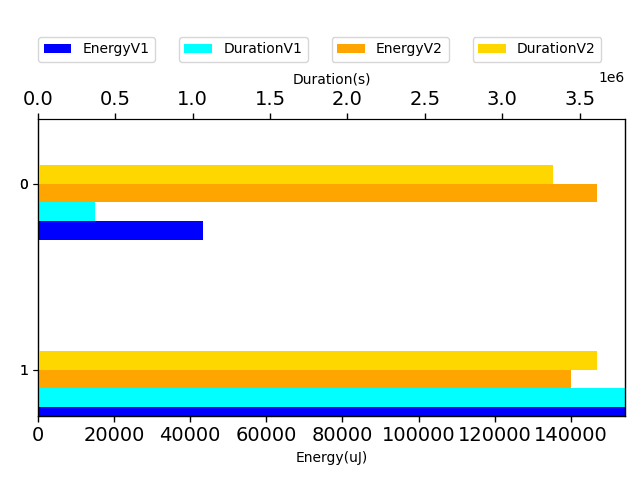

## com.google.gson.functional.VersioningTest

| Test | IterationV1 | IterationV2 | DeltaIteration |
| --- | --- | --- | --- |
| com.google.gson.functional.VersioningTest-testVersionedUntilSerialization | 99 | 97 | -2 |
| com.google.gson.functional.VersioningTest-testVersionedGsonWithUnversionedClassesSerialization | 42 | 35 | -7 |
| com.google.gson.functional.VersioningTest-testVersionedGsonMixingSinceAndUntilSerialization | 81 | 72 | -9 |
| com.google.gson.functional.VersioningTest-testIgnoreLaterVersionClassSerialization | 45 | 46 | 1 |
| com.google.gson.functional.VersioningTest-testVersionedClassesSerialization | 62 | 64 | 2 |

| Test | EnergyV1 | EnergyV2 | DeltaEnergy |
| --- | --- | --- | --- |
| com.google.gson.functional.VersioningTest-testVersionedUntilSerialization | 136779.55339068203 | 118264.86815151446 | -18514.68523916758 |
| com.google.gson.functional.VersioningTest-testVersionedGsonWithUnversionedClassesSerialization | 45387.552032404215 | 40791.927848505264 | -4595.624183898952 |
| com.google.gson.functional.VersioningTest-testVersionedGsonMixingSinceAndUntilSerialization | 40382.31322062737 | 44860.525391732794 | 4478.212171105421 |
| com.google.gson.functional.VersioningTest-testIgnoreLaterVersionClassSerialization | 43302.194220443605 | 43940.56874296239 | 638.3745225187813 |
| com.google.gson.functional.VersioningTest-testVersionedClassesSerialization | 42058.43651432977 | 40760.90677203132 | -1297.5297422984513 |

| Test | DurationV1 | DurationsV2 | DeltaDuration |
| --- | --- | --- | --- |
| com.google.gson.functional.VersioningTest-testVersionedUntilSerialization | 3553209.8754463457 | 3141792.0309017138 | -411417.8445446319 |
| com.google.gson.functional.VersioningTest-testVersionedGsonWithUnversionedClassesSerialization | 1109421.475589427 | 1092917.1774297743 | -16504.298159652622 |
| com.google.gson.functional.VersioningTest-testVersionedGsonMixingSinceAndUntilSerialization | 956021.9891357829 | 1014801.8059110492 | 58779.816775266314 |
| com.google.gson.functional.VersioningTest-testIgnoreLaterVersionClassSerialization | 684362.2558333435 | 831308.7524830498 | 146946.49664970627 |
| com.google.gson.functional.VersioningTest-testVersionedClassesSerialization | 873651.4435279511 | 868351.0063383748 | -5300.4371895763325 |

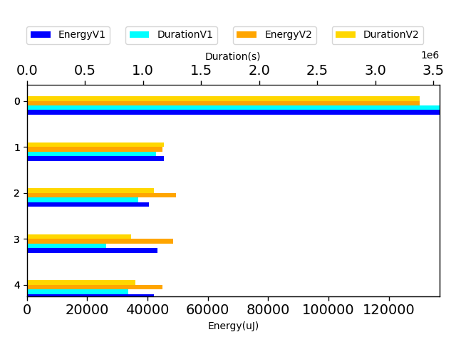

## com.google.gson.functional.JavaUtilConcurrentAtomicTest

| Test | IterationV1 | IterationV2 | DeltaIteration |
| --- | --- | --- | --- |
| com.google.gson.functional.JavaUtilConcurrentAtomicTest-testAtomicLongArray | 86 | 88 | 2 |
| com.google.gson.functional.JavaUtilConcurrentAtomicTest-testAtomicIntegerArray | 91 | 91 | 0 |
| com.google.gson.functional.JavaUtilConcurrentAtomicTest-testAtomicLongWithStringSerializationPolicy | 59 | 60 | 1 |
| com.google.gson.functional.JavaUtilConcurrentAtomicTest-testAtomicLong | 15 | 15 | 0 |
| com.google.gson.functional.JavaUtilConcurrentAtomicTest-testAtomicBoolean | 19 | 16 | -3 |
| com.google.gson.functional.JavaUtilConcurrentAtomicTest-testAtomicLongArrayWithStringSerializationPolicy | 14 | 28 | 14 |
| com.google.gson.functional.JavaUtilConcurrentAtomicTest-testAtomicInteger | 15 | 23 | 8 |

| Test | EnergyV1 | EnergyV2 | DeltaEnergy |
| --- | --- | --- | --- |
| com.google.gson.functional.JavaUtilConcurrentAtomicTest-testAtomicLongArray | 42699.92762213352 | 41870.37392175539 | -829.5537003781283 |
| com.google.gson.functional.JavaUtilConcurrentAtomicTest-testAtomicIntegerArray | 42085.27777837445 | 39797.17616515956 | -2288.1016132148943 |
| com.google.gson.functional.JavaUtilConcurrentAtomicTest-testAtomicLongWithStringSerializationPolicy | 42785.50101947171 | 42296.8213590793 | -488.67966039240855 |
| com.google.gson.functional.JavaUtilConcurrentAtomicTest-testAtomicLong | 42664.50451660156 | 40741.267639160156 | -1923.2368774414062 |
| com.google.gson.functional.JavaUtilConcurrentAtomicTest-testAtomicBoolean | 42391.88947677612 | 49433.24530029297 | 7041.355823516846 |
| com.google.gson.functional.JavaUtilConcurrentAtomicTest-testAtomicLongArrayWithStringSerializationPolicy | 44399.773681640625 | 45291.49670110643 | 891.7230194658041 |
| com.google.gson.functional.JavaUtilConcurrentAtomicTest-testAtomicInteger | 42339.495544433594 | 44847.27260661125 | 2507.777062177658 |

| Test | DurationV1 | DurationsV2 | DeltaDuration |
| --- | --- | --- | --- |
| com.google.gson.functional.JavaUtilConcurrentAtomicTest-testAtomicLongArray | 1120128.2869206457 | 1103850.5135968088 | -16277.77332383697 |
| com.google.gson.functional.JavaUtilConcurrentAtomicTest-testAtomicIntegerArray | 1133689.5541012937 | 1076187.2684488185 | -57502.2856524752 |
| com.google.gson.functional.JavaUtilConcurrentAtomicTest-testAtomicLongWithStringSerializationPolicy | 914460.5731877002 | 826420.6495689235 | -88039.92361877672 |
| com.google.gson.functional.JavaUtilConcurrentAtomicTest-testAtomicLong | 388218.7225341797 | 368213.8139038086 | -20004.908630371094 |
| com.google.gson.functional.JavaUtilConcurrentAtomicTest-testAtomicBoolean | 484086.96659851074 | 867009.7742919922 | 382922.80769348145 |
| com.google.gson.functional.JavaUtilConcurrentAtomicTest-testAtomicLongArrayWithStringSerializationPolicy | 387596.3928222656 | 428346.3871909827 | 40749.994368717074 |
| com.google.gson.functional.JavaUtilConcurrentAtomicTest-testAtomicInteger | 358728.8041381836 | 375664.7823598385 | 16935.978221654892 |

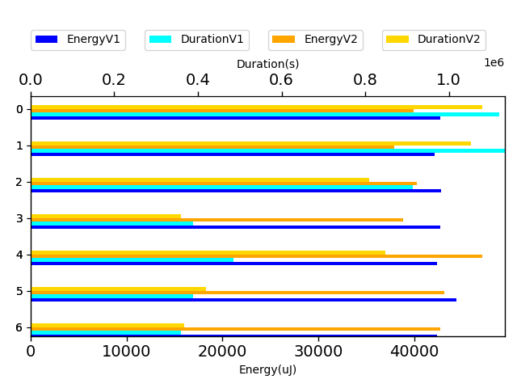

## com.google.gson.functional.RuntimeTypeAdapterFactoryFunctionalTest

| Test | IterationV1 | IterationV2 | DeltaIteration |
| --- | --- | --- | --- |
| com.google.gson.functional.RuntimeTypeAdapterFactoryFunctionalTest-testSubclassesAutomaticallySerialized | 99 | 99 | 0 |

| Test | EnergyV1 | EnergyV2 | DeltaEnergy |
| --- | --- | --- | --- |
| com.google.gson.functional.RuntimeTypeAdapterFactoryFunctionalTest-testSubclassesAutomaticallySerialized | 100461.21201209098 | 129276.26668791848 | 28815.0546758275 |

| Test | DurationV1 | DurationsV2 | DeltaDuration |
| --- | --- | --- | --- |
| com.google.gson.functional.RuntimeTypeAdapterFactoryFunctionalTest-testSubclassesAutomaticallySerialized | 2685970.4858901845 | 2890437.403004504 | 204466.91711431928 |

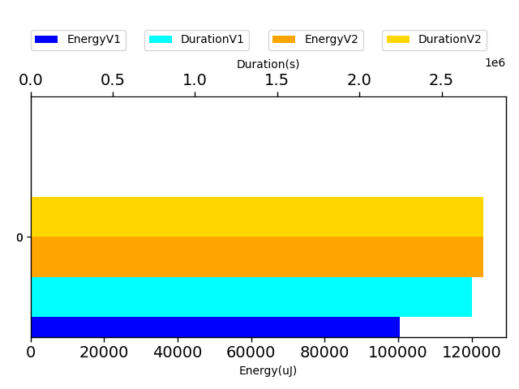

## com.google.gson.LongSerializationPolicyTest

| Test | IterationV1 | IterationV2 | DeltaIteration |
| --- | --- | --- | --- |
| com.google.gson.LongSerializationPolicyTest-testStringLongSerializationIntegration | 33 | 27 | -6 |
| com.google.gson.LongSerializationPolicyTest-testDefaultLongSerializationIntegration | 37 | 22 | -15 |

| Test | EnergyV1 | EnergyV2 | DeltaEnergy |
| --- | --- | --- | --- |
| com.google.gson.LongSerializationPolicyTest-testStringLongSerializationIntegration | 43836.63641780859 | 42660.44959439337 | -1176.1868234152207 |
| com.google.gson.LongSerializationPolicyTest-testDefaultLongSerializationIntegration | 44199.48649010484 | 46236.360426187515 | 2036.873936082673 |

| Test | DurationV1 | DurationsV2 | DeltaDuration |
| --- | --- | --- | --- |
| com.google.gson.LongSerializationPolicyTest-testStringLongSerializationIntegration | 465813.5541730502 | 379593.9749021679 | -86219.5792708823 |
| com.google.gson.LongSerializationPolicyTest-testDefaultLongSerializationIntegration | 442697.38337273226 | 437531.9508368969 | -5165.432535835367 |

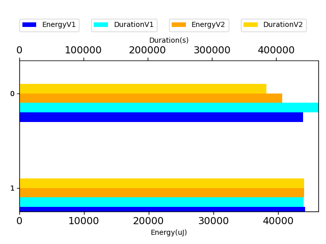

## com.google.gson.functional.TypeVariableTest

| Test | IterationV1 | IterationV2 | DeltaIteration |
| --- | --- | --- | --- |
| com.google.gson.functional.TypeVariableTest-testAdvancedTypeVariables | 99 | 99 | 0 |
| com.google.gson.functional.TypeVariableTest-testTypeVariablesViaTypeParameter | 89 | 82 | -7 |
| com.google.gson.functional.TypeVariableTest-testBasicTypeVariables | 58 | 57 | -1 |

| Test | EnergyV1 | EnergyV2 | DeltaEnergy |
| --- | --- | --- | --- |
| com.google.gson.functional.TypeVariableTest-testAdvancedTypeVariables | 61335.99345483287 | 93683.6820599831 | 32347.68860515023 |
| com.google.gson.functional.TypeVariableTest-testTypeVariablesViaTypeParameter | 73633.07861363537 | 103458.31913074557 | 29825.2405171102 |
| com.google.gson.functional.TypeVariableTest-testBasicTypeVariables | 40404.67387056131 | 40856.29770422289 | 451.62383366157883 |

| Test | DurationV1 | DurationsV2 | DeltaDuration |
| --- | --- | --- | --- |
| com.google.gson.functional.TypeVariableTest-testAdvancedTypeVariables | 1734785.303562515 | 2701112.177071617 | 966326.873509102 |
| com.google.gson.functional.TypeVariableTest-testTypeVariablesViaTypeParameter | 1612465.7258792194 | 2233766.7171409503 | 621300.9912617309 |
| com.google.gson.functional.TypeVariableTest-testBasicTypeVariables | 780658.771977931 | 1029217.161931923 | 248558.38995399198 |

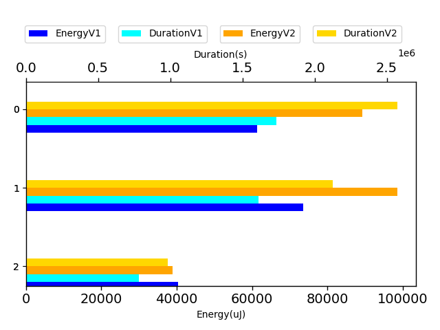

## com.google.gson.functional.NullObjectAndFieldTest

| Test | IterationV1 | IterationV2 | DeltaIteration |
| --- | --- | --- | --- |
| com.google.gson.functional.NullObjectAndFieldTest-testCustomSerializationOfNulls | 54 | 47 | -7 |
| com.google.gson.functional.NullObjectAndFieldTest-testNullWrappedPrimitiveMemberSerialization | 40 | 47 | 7 |
| com.google.gson.functional.NullObjectAndFieldTest-testExplicitSerializationOfNullArrayMembers | 76 | 78 | 2 |
| com.google.gson.functional.NullObjectAndFieldTest-testExplicitSerializationOfNullCollectionMembers | 37 | 38 | 1 |
| com.google.gson.functional.NullObjectAndFieldTest-testPrintPrintingObjectWithNulls | 54 | 56 | 2 |
| com.google.gson.functional.NullObjectAndFieldTest-testExplicitSerializationOfNullStringMembers | 36 | 37 | 1 |
| com.google.gson.functional.NullObjectAndFieldTest-testTopLevelNullObjectSerialization | 23 | 21 | -2 |
| com.google.gson.functional.NullObjectAndFieldTest-testExplicitSerializationOfNulls | 40 | 31 | -9 |
| com.google.gson.functional.NullObjectAndFieldTest-testPrintPrintingArraysWithNulls | 22 | 21 | -1 |
| com.google.gson.functional.NullObjectAndFieldTest-testCustomTypeAdapterPassesNullSerialization | 41 | 42 | 1 |

| Test | EnergyV1 | EnergyV2 | DeltaEnergy |
| --- | --- | --- | --- |
| com.google.gson.functional.NullObjectAndFieldTest-testCustomSerializationOfNulls | 46822.66607041119 | 47083.62843037356 | 260.96235996236646 |
| com.google.gson.functional.NullObjectAndFieldTest-testNullWrappedPrimitiveMemberSerialization | 41483.426896123114 | 44737.23645547907 | 3253.8095593559556 |
| com.google.gson.functional.NullObjectAndFieldTest-testExplicitSerializationOfNullArrayMembers | 42044.15844784835 | 45138.87194068048 | 3094.713492832132 |
| com.google.gson.functional.NullObjectAndFieldTest-testExplicitSerializationOfNullCollectionMembers | 41102.104778071196 | 42899.121929601024 | 1797.017151529828 |
| com.google.gson.functional.NullObjectAndFieldTest-testPrintPrintingObjectWithNulls | 41774.436849186604 | 43498.40325346709 | 1723.966404280487 |
| com.google.gson.functional.NullObjectAndFieldTest-testExplicitSerializationOfNullStringMembers | 41728.335806459305 | 42416.854635577634 | 688.5188291183294 |
| com.google.gson.functional.NullObjectAndFieldTest-testTopLevelNullObjectSerialization | 44876.02527451515 | 149636.1731891632 | 104760.14791464806 |
| com.google.gson.functional.NullObjectAndFieldTest-testExplicitSerializationOfNulls | 49722.865923168996 | 53607.739843798336 | 3884.8739206293394 |
| com.google.gson.functional.NullObjectAndFieldTest-testPrintPrintingArraysWithNulls | 42063.79899406433 | 43404.80639076233 | 1341.007396697998 |
| com.google.gson.functional.NullObjectAndFieldTest-testCustomTypeAdapterPassesNullSerialization | 42217.84289799455 | 75928.47777018318 | 33710.634872188624 |

| Test | DurationV1 | DurationsV2 | DeltaDuration |
| --- | --- | --- | --- |
| com.google.gson.functional.NullObjectAndFieldTest-testCustomSerializationOfNulls | 867142.6535739432 | 878582.8891466262 | 11440.235572683043 |
| com.google.gson.functional.NullObjectAndFieldTest-testNullWrappedPrimitiveMemberSerialization | 598557.775909486 | 706308.626083653 | 107750.85017416696 |
| com.google.gson.functional.NullObjectAndFieldTest-testExplicitSerializationOfNullArrayMembers | 883115.5223563743 | 1145279.7434933218 | 262164.2211369475 |
| com.google.gson.functional.NullObjectAndFieldTest-testExplicitSerializationOfNullCollectionMembers | 508054.76539419946 | 708949.5799053975 | 200894.81451119803 |
| com.google.gson.functional.NullObjectAndFieldTest-testPrintPrintingObjectWithNulls | 629286.7520411877 | 736480.5413473265 | 107193.78930613876 |
| com.google.gson.functional.NullObjectAndFieldTest-testExplicitSerializationOfNullStringMembers | 604875.2708572611 | 670435.3665808404 | 65560.09572357929 |
| com.google.gson.functional.NullObjectAndFieldTest-testTopLevelNullObjectSerialization | 565778.0448822975 | 3916295.2221632004 | 3350517.177280903 |
| com.google.gson.functional.NullObjectAndFieldTest-testExplicitSerializationOfNulls | 943855.807167137 | 1111635.944424699 | 167780.13725756202 |
| com.google.gson.functional.NullObjectAndFieldTest-testPrintPrintingArraysWithNulls | 350607.80175447464 | 646975.5558891296 | 296367.754134655 |
| com.google.gson.functional.NullObjectAndFieldTest-testCustomTypeAdapterPassesNullSerialization | 676341.5765031539 | 1561297.2177417274 | 884955.6412385735 |

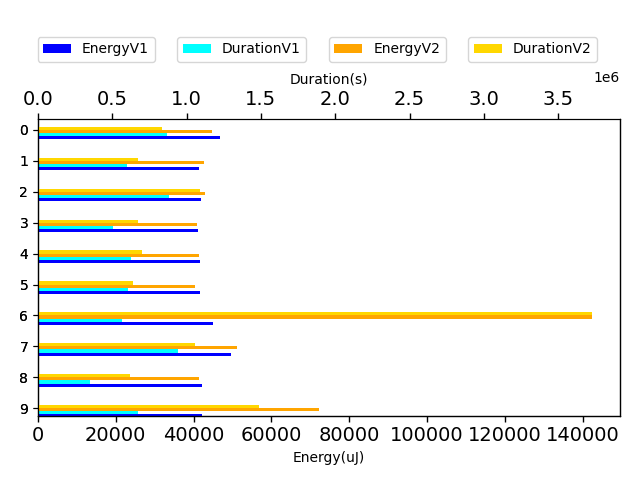

## com.google.gson.functional.FieldNamingTest

| Test | IterationV1 | IterationV2 | DeltaIteration |
| --- | --- | --- | --- |
| com.google.gson.functional.FieldNamingTest-testIdentity | 86 | 94 | 8 |
| com.google.gson.functional.FieldNamingTest-testLowerCaseWithUnderscores | 39 | 41 | 2 |
| com.google.gson.functional.FieldNamingTest-testUpperCamelCase | 51 | 42 | -9 |
| com.google.gson.functional.FieldNamingTest-testUpperCamelCaseWithSpaces | 36 | 48 | 12 |
| com.google.gson.functional.FieldNamingTest-testLowerCaseWithDashes | 45 | 38 | -7 |

| Test | EnergyV1 | EnergyV2 | DeltaEnergy |
| --- | --- | --- | --- |
| com.google.gson.functional.FieldNamingTest-testIdentity | 51520.30199554376 | 88851.58639489982 | 37331.28439935605 |
| com.google.gson.functional.FieldNamingTest-testLowerCaseWithUnderscores | 43905.79548454475 | 42120.30066063488 | -1785.494823909874 |
| com.google.gson.functional.FieldNamingTest-testUpperCamelCase | 42229.415671550596 | 44787.570199026064 | 2558.154527475468 |
| com.google.gson.functional.FieldNamingTest-testUpperCamelCaseWithSpaces | 44144.04764478814 | 44628.358419411 | 484.3107746228634 |
| com.google.gson.functional.FieldNamingTest-testLowerCaseWithDashes | 44087.476249303785 | 44558.494594596355 | 471.0183452925703 |

| Test | DurationV1 | DurationsV2 | DeltaDuration |
| --- | --- | --- | --- |
| com.google.gson.functional.FieldNamingTest-testIdentity | 1281604.1969018315 | 2138624.674114419 | 857020.4772125876 |
| com.google.gson.functional.FieldNamingTest-testLowerCaseWithUnderscores | 596617.1421563858 | 663891.296894744 | 67274.15473835822 |
| com.google.gson.functional.FieldNamingTest-testUpperCamelCase | 562071.9126425369 | 754103.4994139697 | 192031.58677143278 |
| com.google.gson.functional.FieldNamingTest-testUpperCamelCaseWithSpaces | 634853.6692985699 | 561982.5154354876 | -72871.15386308229 |
| com.google.gson.functional.FieldNamingTest-testLowerCaseWithDashes | 659412.8793267364 | 764411.3865653686 | 104998.50723863218 |

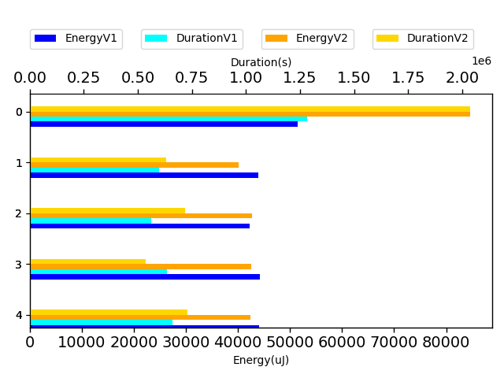

## com.google.gson.functional.RawSerializationTest

| Test | IterationV1 | IterationV2 | DeltaIteration |
| --- | --- | --- | --- |
| com.google.gson.functional.RawSerializationTest-testThreeLevelParameterizedObject | 78 | 74 | -4 |
| com.google.gson.functional.RawSerializationTest-testParameterizedObject | 87 | 94 | 7 |
| com.google.gson.functional.RawSerializationTest-testCollectionOfPrimitives | 39 | 25 | -14 |
| com.google.gson.functional.RawSerializationTest-testCollectionOfObjects | 59 | 54 | -5 |
| com.google.gson.functional.RawSerializationTest-testTwoLevelParameterizedObject | 69 | 82 | 13 |

| Test | EnergyV1 | EnergyV2 | DeltaEnergy |
| --- | --- | --- | --- |
| com.google.gson.functional.RawSerializationTest-testThreeLevelParameterizedObject | 40389.62425978066 | 43292.55195526753 | 2902.927695486869 |
| com.google.gson.functional.RawSerializationTest-testParameterizedObject | 40658.74168196308 | 43942.80129205625 | 3284.0596100931652 |
| com.google.gson.functional.RawSerializationTest-testCollectionOfPrimitives | 40348.45258275373 | 43417.56399446726 | 3069.1114117135294 |
| com.google.gson.functional.RawSerializationTest-testCollectionOfObjects | 40252.103607451754 | 40359.72423534322 | 107.62062789146876 |
| com.google.gson.functional.RawSerializationTest-testTwoLevelParameterizedObject | 42695.9430765248 | 40313.68398039577 | -2382.2590961290334 |

| Test | DurationV1 | DurationsV2 | DeltaDuration |
| --- | --- | --- | --- |
| com.google.gson.functional.RawSerializationTest-testThreeLevelParameterizedObject | 1108617.3156033854 | 1166884.2571691936 | 58266.94156580814 |
| com.google.gson.functional.RawSerializationTest-testParameterizedObject | 1060047.626777539 | 1098925.6281853113 | 38878.0014077723 |
| com.google.gson.functional.RawSerializationTest-testCollectionOfPrimitives | 821487.3134501085 | 597737.3765311837 | -223749.9369189248 |
| com.google.gson.functional.RawSerializationTest-testCollectionOfObjects | 977925.8167364013 | 737579.5217557708 | -240346.2949806305 |
| com.google.gson.functional.RawSerializationTest-testTwoLevelParameterizedObject | 897144.6956614284 | 1051953.7434720907 | 154809.0478106623 |

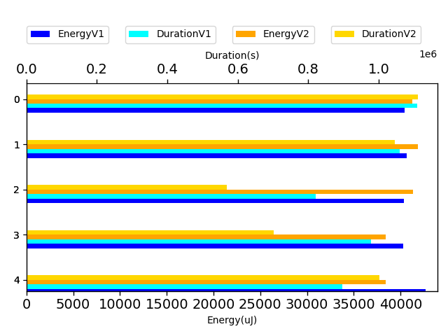

## com.google.gson.MixedStreamTest

| Test | IterationV1 | IterationV2 | DeltaIteration |
| --- | --- | --- | --- |
| com.google.gson.MixedStreamTest-testWriteClosed | 23 | 26 | 3 |
| com.google.gson.MixedStreamTest-testWriteInvalidState | 26 | 33 | 7 |
| com.google.gson.MixedStreamTest-testWriteLenient | 60 | 67 | 7 |
| com.google.gson.MixedStreamTest-testWriteDoesNotMutateState | 32 | 37 | 5 |
| com.google.gson.MixedStreamTest-testWriteHtmlSafe | 64 | 74 | 10 |
| com.google.gson.MixedStreamTest-testWriteMixedStreamed | 41 | 44 | 3 |
| com.google.gson.MixedStreamTest-testWriteNulls | 23 | 22 | -1 |

| Test | EnergyV1 | EnergyV2 | DeltaEnergy |
| --- | --- | --- | --- |
| com.google.gson.MixedStreamTest-testWriteClosed | 40557.86521470547 | 43373.35970637202 | 2815.4944916665554 |
| com.google.gson.MixedStreamTest-testWriteInvalidState | 42856.12271724641 | 41476.31855310267 | -1379.8041641437449 |
| com.google.gson.MixedStreamTest-testWriteLenient | 68180.5006915941 | 45295.18682868041 | -22885.313862913696 |
| com.google.gson.MixedStreamTest-testWriteDoesNotMutateState | 42440.380348585546 | 42392.15644725306 | -48.223901332487 |
| com.google.gson.MixedStreamTest-testWriteHtmlSafe | 89674.17552665944 | 42411.659823010246 | -47262.515703649195 |
| com.google.gson.MixedStreamTest-testWriteMixedStreamed | 627432.6082479121 | 44381.756771585926 | -583050.8514763262 |
| com.google.gson.MixedStreamTest-testWriteNulls | 41589.47303152084 | 42594.63449907303 | 1005.1614675521851 |

| Test | DurationV1 | DurationsV2 | DeltaDuration |
| --- | --- | --- | --- |
| com.google.gson.MixedStreamTest-testWriteClosed | 542843.3970370293 | 491612.7483417988 | -51230.648695230484 |
| com.google.gson.MixedStreamTest-testWriteInvalidState | 585160.2222750038 | 567795.2851026944 | -17364.93717230938 |
| com.google.gson.MixedStreamTest-testWriteLenient | 1620677.2659006848 | 956644.0960756661 | -664033.1698250186 |
| com.google.gson.MixedStreamTest-testWriteDoesNotMutateState | 824215.064445226 | 469715.4091142679 | -354499.6553309581 |
| com.google.gson.MixedStreamTest-testWriteHtmlSafe | 2166354.913802286 | 996372.1739783738 | -1169982.7398239123 |
| com.google.gson.MixedStreamTest-testWriteMixedStreamed | 19929111.922070213 | 532824.1987970315 | -19396287.72327318 |
| com.google.gson.MixedStreamTest-testWriteNulls | 413315.1151099205 | 408096.54406023026 | -5218.571049690247 |

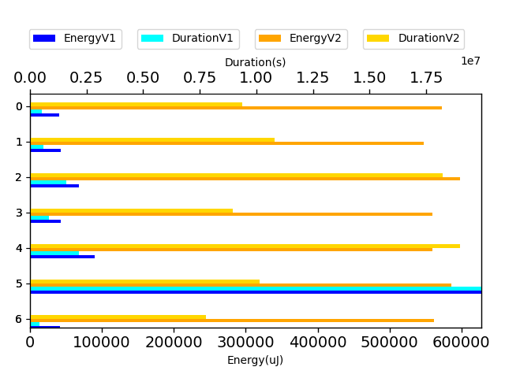

## com.google.gson.functional.MapAsArrayTypeAdapterTest

| Test | IterationV1 | IterationV2 | DeltaIteration |
| --- | --- | --- | --- |
| com.google.gson.functional.MapAsArrayTypeAdapterTest-testSerializeComplexMapWithTypeAdapter | 99 | 99 | 0 |
| com.google.gson.functional.MapAsArrayTypeAdapterTest-testMapWithTypeVariableSerialization | 90 | 84 | -6 |
| com.google.gson.functional.MapAsArrayTypeAdapterTest-testMultipleEnableComplexKeyRegistrationHasNoEffect | 63 | 71 | 8 |

| Test | EnergyV1 | EnergyV2 | DeltaEnergy |
| --- | --- | --- | --- |
| com.google.gson.functional.MapAsArrayTypeAdapterTest-testSerializeComplexMapWithTypeAdapter | 188475.15872544085 | 73211.04462682432 | -115264.11409861653 |
| com.google.gson.functional.MapAsArrayTypeAdapterTest-testMapWithTypeVariableSerialization | 43736.96493581646 | 44657.00812831643 | 920.0431924999721 |
| com.google.gson.functional.MapAsArrayTypeAdapterTest-testMultipleEnableComplexKeyRegistrationHasNoEffect | 43796.21811425022 | 42160.38367274859 | -1635.8344415016327 |

| Test | DurationV1 | DurationsV2 | DeltaDuration |
| --- | --- | --- | --- |
| com.google.gson.functional.MapAsArrayTypeAdapterTest-testSerializeComplexMapWithTypeAdapter | 4697023.521888297 | 2072743.247575608 | -2624280.274312689 |
| com.google.gson.functional.MapAsArrayTypeAdapterTest-testMapWithTypeVariableSerialization | 1219945.005884624 | 1142408.8033122127 | -77536.20257241139 |
| com.google.gson.functional.MapAsArrayTypeAdapterTest-testMultipleEnableComplexKeyRegistrationHasNoEffect | 1124472.7173955995 | 765443.9332146501 | -359028.7841809493 |

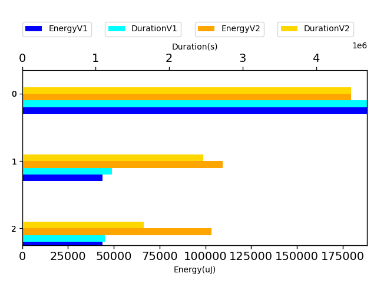

## com.google.gson.functional.ConcurrencyTest

| Test | IterationV1 | IterationV2 | DeltaIteration |
| --- | --- | --- | --- |
| com.google.gson.functional.ConcurrencyTest-testMultiThreadSerialization | 99 | 99 | 0 |
| com.google.gson.functional.ConcurrencyTest-testSingleThreadSerialization | 64 | 61 | -3 |

| Test | EnergyV1 | EnergyV2 | DeltaEnergy |
| --- | --- | --- | --- |
| com.google.gson.functional.ConcurrencyTest-testMultiThreadSerialization | 318462.9295563263 | 364818.0253595382 | 46355.09580321191 |
| com.google.gson.functional.ConcurrencyTest-testSingleThreadSerialization | 45075.68685608211 | 45675.535144728135 | 599.848288646026 |

| Test | DurationV1 | DurationsV2 | DeltaDuration |
| --- | --- | --- | --- |
| com.google.gson.functional.ConcurrencyTest-testMultiThreadSerialization | 8094903.224264983 | 8452332.52592415 | 357429.3016591668 |
| com.google.gson.functional.ConcurrencyTest-testSingleThreadSerialization | 1134086.508348497 | 1141006.1248979822 | 6919.61654948513 |

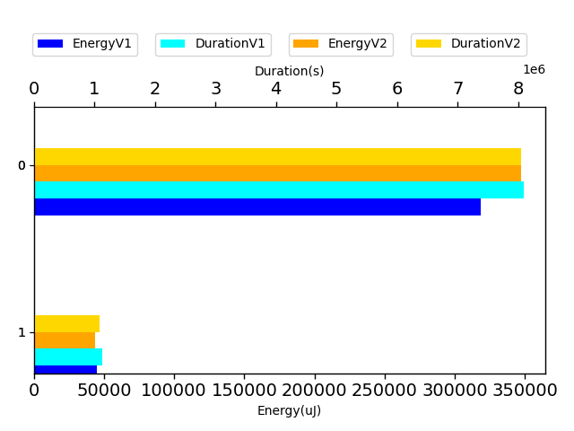

## com.google.gson.functional.EscapingTest

| Test | IterationV1 | IterationV2 | DeltaIteration |
| --- | --- | --- | --- |
| com.google.gson.functional.EscapingTest-testGsonAcceptsEscapedAndNonEscapedJsonDeserialization | 66 | 60 | -6 |
| com.google.gson.functional.EscapingTest-testEscapingQuotesInStringArray | 37 | 27 | -10 |
| com.google.gson.functional.EscapingTest-testEscapingObjectFields | 51 | 44 | -7 |
| com.google.gson.functional.EscapingTest-testGsonDoubleDeserialization | 32 | 35 | 3 |
| com.google.gson.functional.EscapingTest-testEscapeAllHtmlCharacters | 22 | 22 | 0 |

| Test | EnergyV1 | EnergyV2 | DeltaEnergy |
| --- | --- | --- | --- |
| com.google.gson.functional.EscapingTest-testGsonAcceptsEscapedAndNonEscapedJsonDeserialization | 46774.19449791612 | 46237.92971054705 | -536.264787369073 |
| com.google.gson.functional.EscapingTest-testEscapingQuotesInStringArray | 54049.500610321724 | 41497.281976789236 | -12552.218633532488 |
| com.google.gson.functional.EscapingTest-testEscapingObjectFields | 45542.682977602526 | 42903.508801486576 | -2639.17417611595 |
| com.google.gson.functional.EscapingTest-testGsonDoubleDeserialization | 38946.850903172046 | 40762.63409504283 | 1815.7831918707816 |
| com.google.gson.functional.EscapingTest-testEscapeAllHtmlCharacters | 38241.18315553665 | 44971.5871090889 | 6730.403953552246 |

| Test | DurationV1 | DurationsV2 | DeltaDuration |
| --- | --- | --- | --- |
| com.google.gson.functional.EscapingTest-testGsonAcceptsEscapedAndNonEscapedJsonDeserialization | 1056586.3335329476 | 908315.7663763994 | -148270.56715654815 |
| com.google.gson.functional.EscapingTest-testEscapingQuotesInStringArray | 1126062.4545406634 | 551773.5073407292 | -574288.9471999342 |
| com.google.gson.functional.EscapingTest-testEscapingObjectFields | 740430.9895990295 | 559620.4859365753 | -180810.5036624542 |
| com.google.gson.functional.EscapingTest-testGsonDoubleDeserialization | 844883.157902359 | 524082.238483371 | -320800.91941898805 |
| com.google.gson.functional.EscapingTest-testEscapeAllHtmlCharacters | 1242868.7650222778 | 517370.891166687 | -725497.8738555908 |

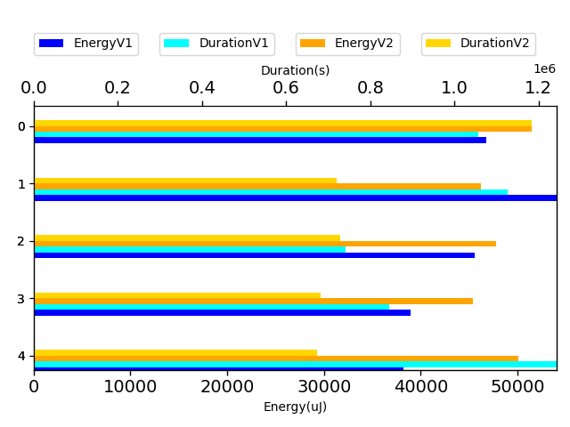

## com.google.gson.functional.JsonTreeTest

| Test | IterationV1 | IterationV2 | DeltaIteration |
| --- | --- | --- | --- |
| com.google.gson.functional.JsonTreeTest-testJsonTreeToString | 69 | 74 | 5 |
| com.google.gson.functional.JsonTreeTest-testToJsonTree | 48 | 50 | 2 |
| com.google.gson.functional.JsonTreeTest-testToJsonTreeObjectType | 53 | 58 | 5 |
| com.google.gson.functional.JsonTreeTest-testJsonTreeNull | 32 | 37 | 5 |

| Test | EnergyV1 | EnergyV2 | DeltaEnergy |
| --- | --- | --- | --- |
| com.google.gson.functional.JsonTreeTest-testJsonTreeToString | 46978.32185558825 | 65854.91781763495 | 18876.595962046704 |
| com.google.gson.functional.JsonTreeTest-testToJsonTree | 46619.3883773072 | 46092.790179009724 | -526.5981982974772 |
| com.google.gson.functional.JsonTreeTest-testToJsonTreeObjectType | 43663.926292397184 | 42798.378952801286 | -865.5473395958979 |
| com.google.gson.functional.JsonTreeTest-testJsonTreeNull | 44377.919730597176 | 44124.09705824966 | -253.82267234751635 |

| Test | DurationV1 | DurationsV2 | DeltaDuration |
| --- | --- | --- | --- |
| com.google.gson.functional.JsonTreeTest-testJsonTreeToString | 809967.8293832669 | 1887276.3079744028 | 1077308.478591136 |
| com.google.gson.functional.JsonTreeTest-testToJsonTree | 604368.4714345902 | 993841.7878224729 | 389473.3163878827 |
| com.google.gson.functional.JsonTreeTest-testToJsonTreeObjectType | 663384.6942049976 | 844407.2920155535 | 181022.59781055583 |
| com.google.gson.functional.JsonTreeTest-testJsonTreeNull | 492202.23172853934 | 613584.3783628772 | 121382.14663433784 |

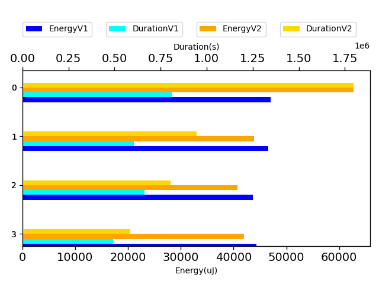

## com.google.gson.functional.MoreSpecificTypeSerializationTest

| Test | IterationV1 | IterationV2 | DeltaIteration |
| --- | --- | --- | --- |
| com.google.gson.functional.MoreSpecificTypeSerializationTest-testParameterizedSubclassFields | 84 | 86 | 2 |
| com.google.gson.functional.MoreSpecificTypeSerializationTest-testListOfParameterizedSubclassFields | 65 | 59 | -6 |
| com.google.gson.functional.MoreSpecificTypeSerializationTest-testListOfSubclassFields | 87 | 77 | -10 |
| com.google.gson.functional.MoreSpecificTypeSerializationTest-testMapOfSubclassFields | 65 | 73 | 8 |
| com.google.gson.functional.MoreSpecificTypeSerializationTest-testSubclassFields | 68 | 64 | -4 |
| com.google.gson.functional.MoreSpecificTypeSerializationTest-testMapOfParameterizedSubclassFields | 43 | 54 | 11 |

| Test | EnergyV1 | EnergyV2 | DeltaEnergy |
| --- | --- | --- | --- |
| com.google.gson.functional.MoreSpecificTypeSerializationTest-testParameterizedSubclassFields | 47745.81742283377 | 62531.272359032475 | 14785.454936198708 |
| com.google.gson.functional.MoreSpecificTypeSerializationTest-testListOfParameterizedSubclassFields | 41345.52441402383 | 42927.54629641827 | 1582.0218823944451 |
| com.google.gson.functional.MoreSpecificTypeSerializationTest-testListOfSubclassFields | 43126.33673159027 | 61526.784131504544 | 18400.447399914272 |
| com.google.gson.functional.MoreSpecificTypeSerializationTest-testMapOfSubclassFields | 44624.07603621368 | 53935.08606985626 | 9311.010033642582 |
| com.google.gson.functional.MoreSpecificTypeSerializationTest-testSubclassFields | 43979.45014839904 | 48790.65730726621 | 4811.207158867168 |
| com.google.gson.functional.MoreSpecificTypeSerializationTest-testMapOfParameterizedSubclassFields | 45662.82657938925 | 42812.257332200534 | -2850.569247188716 |

| Test | DurationV1 | DurationsV2 | DeltaDuration |
| --- | --- | --- | --- |
| com.google.gson.functional.MoreSpecificTypeSerializationTest-testParameterizedSubclassFields | 1013745.7210631686 | 1291808.028502232 | 278062.3074390633 |
| com.google.gson.functional.MoreSpecificTypeSerializationTest-testListOfParameterizedSubclassFields | 751549.0355751181 | 890254.4588883049 | 138705.42331318674 |
| com.google.gson.functional.MoreSpecificTypeSerializationTest-testListOfSubclassFields | 1086012.297327084 | 1763671.4337209167 | 677659.1363938327 |
| com.google.gson.functional.MoreSpecificTypeSerializationTest-testMapOfSubclassFields | 1126754.4036321933 | 1229573.1445146552 | 102818.74088246189 |
| com.google.gson.functional.MoreSpecificTypeSerializationTest-testSubclassFields | 969369.0415649002 | 987110.92314335 | 17741.88157844986 |
| com.google.gson.functional.MoreSpecificTypeSerializationTest-testMapOfParameterizedSubclassFields | 870832.001042309 | 724658.5767881752 | -146173.42425413383 |

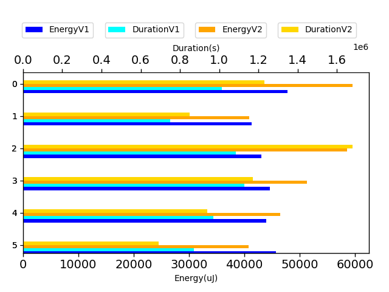

## com.google.gson.DefaultMapJsonSerializerTest

| Test | IterationV1 | IterationV2 | DeltaIteration |
| --- | --- | --- | --- |
| com.google.gson.DefaultMapJsonSerializerTest-testNonEmptyMapSerialization | 39 | 33 | -6 |
| com.google.gson.DefaultMapJsonSerializerTest-testEmptyMapSerialization | 55 | 57 | 2 |
| com.google.gson.DefaultMapJsonSerializerTest-testEmptyMapNoTypeSerialization | 25 | 27 | 2 |

| Test | EnergyV1 | EnergyV2 | DeltaEnergy |
| --- | --- | --- | --- |
| com.google.gson.DefaultMapJsonSerializerTest-testNonEmptyMapSerialization | 43587.77925626042 | 42134.70728447335 | -1453.0719717870743 |
| com.google.gson.DefaultMapJsonSerializerTest-testEmptyMapSerialization | 43512.032598170576 | 41160.31112919103 | -2351.7214689795437 |
| com.google.gson.DefaultMapJsonSerializerTest-testEmptyMapNoTypeSerialization | 43491.34712201357 | 43952.579820513725 | 461.2326985001564 |

| Test | DurationV1 | DurationsV2 | DeltaDuration |
| --- | --- | --- | --- |
| com.google.gson.DefaultMapJsonSerializerTest-testNonEmptyMapSerialization | 654182.2166583542 | 664913.5200998411 | 10731.303441486903 |
| com.google.gson.DefaultMapJsonSerializerTest-testEmptyMapSerialization | 681280.7058743597 | 741366.6501294372 | 60085.94425507751 |
| com.google.gson.DefaultMapJsonSerializerTest-testEmptyMapNoTypeSerialization | 444933.45083129406 | 992490.5493684262 | 547557.0985371321 |

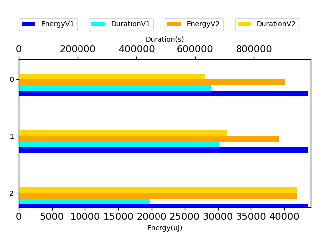

## com.google.gson.functional.InterfaceTest

| Test | IterationV1 | IterationV2 | DeltaIteration |
| --- | --- | --- | --- |
| com.google.gson.functional.InterfaceTest-testSerializingInterfaceObjectField | 64 | 61 | -3 |
| com.google.gson.functional.InterfaceTest-testSerializingObjectImplementingInterface | 39 | 49 | 10 |

| Test | EnergyV1 | EnergyV2 | DeltaEnergy |
| --- | --- | --- | --- |
| com.google.gson.functional.InterfaceTest-testSerializingInterfaceObjectField | 43962.89773869955 | 42516.65716459499 | -1446.2405741045586 |
| com.google.gson.functional.InterfaceTest-testSerializingObjectImplementingInterface | 47059.68781411035 | 50628.347948602604 | 3568.660134492253 |

| Test | DurationV1 | DurationsV2 | DeltaDuration |
| --- | --- | --- | --- |
| com.google.gson.functional.InterfaceTest-testSerializingInterfaceObjectField | 785762.4089019173 | 1065711.4964329195 | 279949.08753100224 |
| com.google.gson.functional.InterfaceTest-testSerializingObjectImplementingInterface | 994669.283423482 | 1111601.0646029888 | 116931.7811795068 |

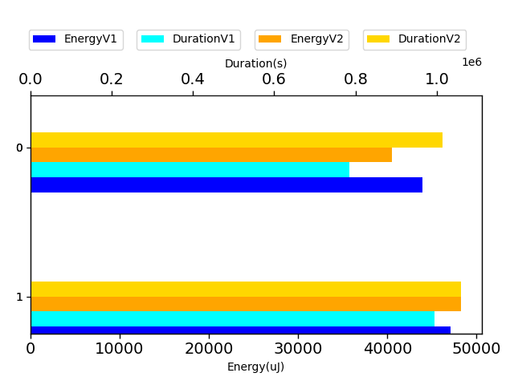

## com.google.gson.functional.JavaUtilTest

| Test | IterationV1 | IterationV2 | DeltaIteration |
| --- | --- | --- | --- |
| com.google.gson.functional.JavaUtilTest-testProperties | 33 | 36 | 3 |
| com.google.gson.functional.JavaUtilTest-testCurrency | 99 | 99 | 0 |

| Test | EnergyV1 | EnergyV2 | DeltaEnergy |
| --- | --- | --- | --- |
| com.google.gson.functional.JavaUtilTest-testProperties | 41914.72036970081 | 44236.88708626895 | 2322.166716568143 |
| com.google.gson.functional.JavaUtilTest-testCurrency | 87314.37369451422 | 135426.0382594855 | 48111.66456497129 |

| Test | DurationV1 | DurationsV2 | DeltaDuration |
| --- | --- | --- | --- |
| com.google.gson.functional.JavaUtilTest-testProperties | 564355.0678849017 | 546187.0499960571 | -18168.017888844595 |
| com.google.gson.functional.JavaUtilTest-testCurrency | 2199472.618585059 | 3621570.0883020563 | 1422097.4697169974 |

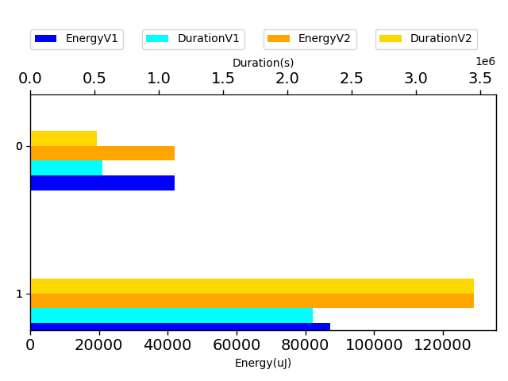

## com.google.gson.DefaultInetAddressTypeAdapterTest

| Test | IterationV1 | IterationV2 | DeltaIteration |
| --- | --- | --- | --- |
| com.google.gson.DefaultInetAddressTypeAdapterTest-testInetAddressSerializationAndDeserialization | 99 | 99 | 0 |

| Test | EnergyV1 | EnergyV2 | DeltaEnergy |
| --- | --- | --- | --- |
| com.google.gson.DefaultInetAddressTypeAdapterTest-testInetAddressSerializationAndDeserialization | 97643.23502078876 | 86910.47895811166 | -10732.756062677101 |

| Test | DurationV1 | DurationsV2 | DeltaDuration |
| --- | --- | --- | --- |
| com.google.gson.DefaultInetAddressTypeAdapterTest-testInetAddressSerializationAndDeserialization | 3027384.018067384 | 2125412.6475087716 | -901971.3705586125 |

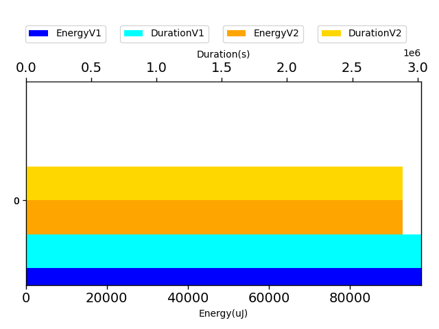

## com.google.gson.GsonTypeAdapterTest

| Test | IterationV1 | IterationV2 | DeltaIteration |
| --- | --- | --- | --- |
| com.google.gson.GsonTypeAdapterTest-testDeserializerForAbstractClass | 97 | 99 | 2 |
| com.google.gson.GsonTypeAdapterTest-testTypeAdapterDoesNotAffectNonAdaptedTypes | 25 | 21 | -4 |
| com.google.gson.GsonTypeAdapterTest-testTypeAdapterThrowsException | 33 | 31 | -2 |
| com.google.gson.GsonTypeAdapterTest-testTypeAdapterProperlyConvertsTypes | 21 | 20 | -1 |

| Test | EnergyV1 | EnergyV2 | DeltaEnergy |
| --- | --- | --- | --- |
| com.google.gson.GsonTypeAdapterTest-testDeserializerForAbstractClass | 91947.6116932247 | 51827.93429950729 | -40119.67739371741 |
| com.google.gson.GsonTypeAdapterTest-testTypeAdapterDoesNotAffectNonAdaptedTypes | 87839.77330470085 | 39363.004605293274 | -48476.76869940758 |
| com.google.gson.GsonTypeAdapterTest-testTypeAdapterThrowsException | 48330.69380478584 | 44811.389635792 | -3519.30416899384 |
| com.google.gson.GsonTypeAdapterTest-testTypeAdapterProperlyConvertsTypes | 36340.98513031006 | 41313.32024383545 | 4972.335113525391 |

| Test | DurationV1 | DurationsV2 | DeltaDuration |
| --- | --- | --- | --- |
| com.google.gson.GsonTypeAdapterTest-testDeserializerForAbstractClass | 3085101.275743042 | 1407710.707656582 | -1677390.5680864602 |
| com.google.gson.GsonTypeAdapterTest-testTypeAdapterDoesNotAffectNonAdaptedTypes | 2826129.636821866 | 432212.62472867966 | -2393917.0120931864 |
| com.google.gson.GsonTypeAdapterTest-testTypeAdapterThrowsException | 816856.9431296387 | 750289.495229437 | -66567.44790020166 |
| com.google.gson.GsonTypeAdapterTest-testTypeAdapterProperlyConvertsTypes | 1244192.538556099 | 447882.14183712006 | -796310.3967189789 |

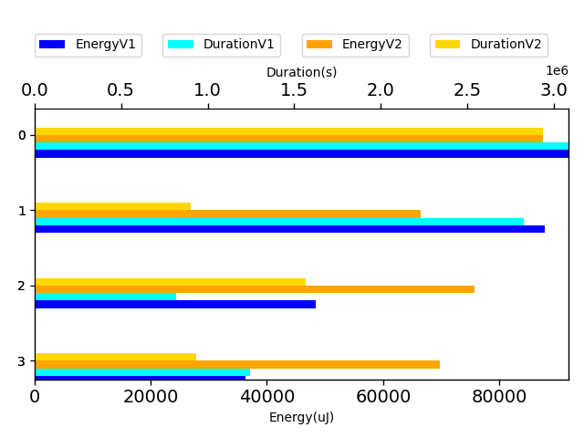

## com.google.gson.functional.PrimitiveCharacterTest

| Test | IterationV1 | IterationV2 | DeltaIteration |
| --- | --- | --- | --- |
| com.google.gson.functional.PrimitiveCharacterTest-testPrimitiveCharacterAutoboxedSerialization | 29 | 25 | -4 |

| Test | EnergyV1 | EnergyV2 | DeltaEnergy |
| --- | --- | --- | --- |
| com.google.gson.functional.PrimitiveCharacterTest-testPrimitiveCharacterAutoboxedSerialization | 44077.83511483669 | 42690.99745899439 | -1386.8376558423042 |

| Test | DurationV1 | DurationsV2 | DeltaDuration |
| --- | --- | --- | --- |
| com.google.gson.functional.PrimitiveCharacterTest-testPrimitiveCharacterAutoboxedSerialization | 633939.0998925213 | 466211.5475189388 | -167727.5523735825 |

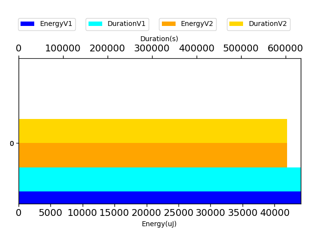

## com.google.gson.regression.JsonAdapterNullSafeTest

| Test | IterationV1 | IterationV2 | DeltaIteration |
| --- | --- | --- | --- |
| com.google.gson.regression.JsonAdapterNullSafeTest-testNullSafeBugSerialize | 88 | 92 | 4 |

| Test | EnergyV1 | EnergyV2 | DeltaEnergy |
| --- | --- | --- | --- |
| com.google.gson.regression.JsonAdapterNullSafeTest-testNullSafeBugSerialize | 45594.258597184664 | 73951.17733049573 | 28356.918733311068 |

| Test | DurationV1 | DurationsV2 | DeltaDuration |
| --- | --- | --- | --- |
| com.google.gson.regression.JsonAdapterNullSafeTest-testNullSafeBugSerialize | 1310778.2187836433 | 2398752.9677950884 | 1087974.749011445 |

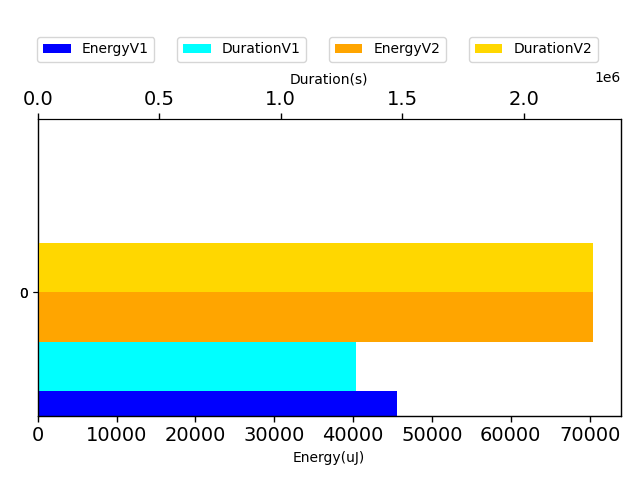

## com.google.gson.functional.TreeTypeAdaptersTest

| Test | IterationV1 | IterationV2 | DeltaIteration |
| --- | --- | --- | --- |
| com.google.gson.functional.TreeTypeAdaptersTest-testSerializeId | 90 | 86 | -4 |

| Test | EnergyV1 | EnergyV2 | DeltaEnergy |
| --- | --- | --- | --- |
| com.google.gson.functional.TreeTypeAdaptersTest-testSerializeId | 59623.198675099076 | 43552.46294358146 | -16070.73573151762 |

| Test | DurationV1 | DurationsV2 | DeltaDuration |
| --- | --- | --- | --- |
| com.google.gson.functional.TreeTypeAdaptersTest-testSerializeId | 1261599.982973509 | 1083628.7960908257 | -177971.1868826833 |

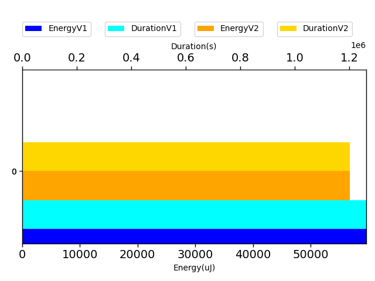

## com.google.gson.JsonParserTest

| Test | IterationV1 | IterationV2 | DeltaIteration |
| --- | --- | --- | --- |
| com.google.gson.JsonParserTest-testReadWriteTwoObjects | 75 | 70 | -5 |

| Test | EnergyV1 | EnergyV2 | DeltaEnergy |
| --- | --- | --- | --- |
| com.google.gson.JsonParserTest-testReadWriteTwoObjects | 49206.95209224513 | 41903.44403770901 | -7303.50805453612 |

| Test | DurationV1 | DurationsV2 | DeltaDuration |
| --- | --- | --- | --- |
| com.google.gson.JsonParserTest-testReadWriteTwoObjects | 892445.6874079705 | 942405.407346264 | 49959.71993829345 |

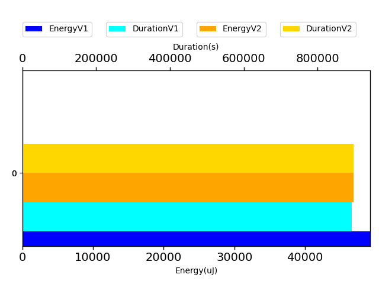

## com.google.gson.OverrideCoreTypeAdaptersTest

| Test | IterationV1 | IterationV2 | DeltaIteration |
| --- | --- | --- | --- |
| com.google.gson.OverrideCoreTypeAdaptersTest-testOverridePrimitiveBooleanAdapter | 30 | 17 | -13 |
| com.google.gson.OverrideCoreTypeAdaptersTest-testOverrideStringAdapter | 22 | 29 | 7 |
| com.google.gson.OverrideCoreTypeAdaptersTest-testOverrideWrapperBooleanAdapter | 36 | 36 | 0 |

| Test | EnergyV1 | EnergyV2 | DeltaEnergy |
| --- | --- | --- | --- |
| com.google.gson.OverrideCoreTypeAdaptersTest-testOverridePrimitiveBooleanAdapter | 42960.38177346066 | 45007.573303222656 | 2047.1915297619998 |
| com.google.gson.OverrideCoreTypeAdaptersTest-testOverrideStringAdapter | 41723.61447811127 | 43804.549542885274 | 2080.9350647740066 |
| com.google.gson.OverrideCoreTypeAdaptersTest-testOverrideWrapperBooleanAdapter | 47665.108469211205 | 43331.884330318164 | -4333.2241388930415 |

| Test | DurationV1 | DurationsV2 | DeltaDuration |
| --- | --- | --- | --- |
| com.google.gson.OverrideCoreTypeAdaptersTest-testOverridePrimitiveBooleanAdapter | 538831.0710712299 | 507620.3946685791 | -31210.676402650774 |
| com.google.gson.OverrideCoreTypeAdaptersTest-testOverrideStringAdapter | 416182.31725406647 | 407908.27735940367 | -8274.039894662797 |
| com.google.gson.OverrideCoreTypeAdaptersTest-testOverrideWrapperBooleanAdapter | 682174.1693883736 | 528122.8015819128 | -154051.36780646082 |

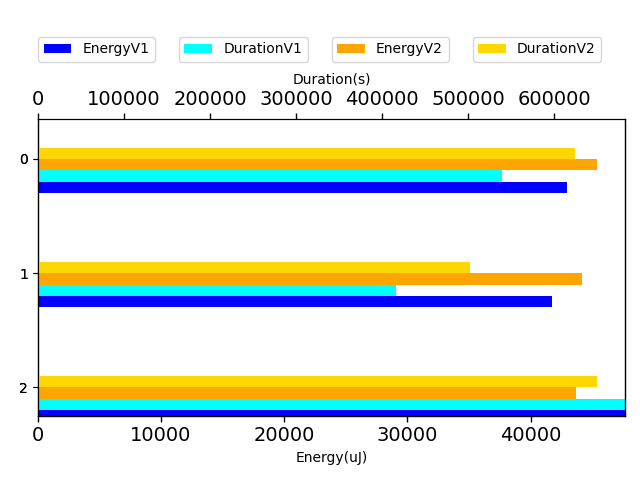

## com.google.gson.functional.StringTest

| Test | IterationV1 | IterationV2 | DeltaIteration |
| --- | --- | --- | --- |
| com.google.gson.functional.StringTest-testJavascriptKeywordsInStringSerialization | 13 | 18 | 5 |
| com.google.gson.functional.StringTest-testStringValueSerialization | 15 | 17 | 2 |
| com.google.gson.functional.StringTest-testAssignmentCharSerialization | 9 | 12 | 3 |
| com.google.gson.functional.StringTest-testStringValueAsSingleElementArraySerialization | 26 | 24 | -2 |
| com.google.gson.functional.StringTest-testEscapedCtrlNInStringSerialization | 16 | 16 | 0 |
| com.google.gson.functional.StringTest-testSingleQuoteInStringSerialization | 25 | 25 | 0 |
| com.google.gson.functional.StringTest-testEscapingQuotesInStringSerialization | 16 | 16 | 0 |
| com.google.gson.functional.StringTest-testEscapedCtrlRInStringSerialization | 6 | 11 | 5 |
| com.google.gson.functional.StringTest-testEscapedBackslashInStringSerialization | 8 | 8 | 0 |

| Test | EnergyV1 | EnergyV2 | DeltaEnergy |
| --- | --- | --- | --- |
| com.google.gson.functional.StringTest-testJavascriptKeywordsInStringSerialization | 41595.372314453125 | 43380.19565200806 | 1784.8233375549316 |
| com.google.gson.functional.StringTest-testStringValueSerialization | 40478.812744140625 | 44475.4581451416 | 3996.6454010009766 |
| com.google.gson.functional.StringTest-testAssignmentCharSerialization | 43195.44921875 | 42860.1240234375 | -335.3251953125 |
| com.google.gson.functional.StringTest-testStringValueAsSingleElementArraySerialization | 44126.502716481686 | 41524.48226964474 | -2602.0204468369484 |
| com.google.gson.functional.StringTest-testEscapedCtrlNInStringSerialization | 42056.440185546875 | 45422.108642578125 | 3365.66845703125 |
| com.google.gson.functional.StringTest-testSingleQuoteInStringSerialization | 42624.89389127493 | 53551.33971750736 | 10926.445826232433 |
| com.google.gson.functional.StringTest-testEscapingQuotesInStringSerialization | 42310.05407714844 | 45428.89179992676 | 3118.8377227783203 |
| com.google.gson.functional.StringTest-testEscapedCtrlRInStringSerialization | 42202.21875 | 43156.45703125 | 954.23828125 |
| com.google.gson.functional.StringTest-testEscapedBackslashInStringSerialization | 43208.890625 | 41498.8828125 | -1710.0078125 |

| Test | DurationV1 | DurationsV2 | DeltaDuration |
| --- | --- | --- | --- |
| com.google.gson.functional.StringTest-testJavascriptKeywordsInStringSerialization | 411194.4436035156 | 333421.5111656189 | -77772.93243789673 |
| com.google.gson.functional.StringTest-testStringValueSerialization | 408125.91796875 | 351764.4963989258 | -56361.42156982422 |
| com.google.gson.functional.StringTest-testAssignmentCharSerialization | 315449.80078125 | 298614.97509765625 | -16834.82568359375 |
| com.google.gson.functional.StringTest-testStringValueAsSingleElementArraySerialization | 814715.1278208792 | 505744.8877341747 | -308970.2400867045 |
| com.google.gson.functional.StringTest-testEscapedCtrlNInStringSerialization | 348328.6809082031 | 319404.9277648926 | -28923.753143310547 |
| com.google.gson.functional.StringTest-testSingleQuoteInStringSerialization | 409439.0975702405 | 1113983.397560954 | 704544.2999907136 |
| com.google.gson.functional.StringTest-testEscapingQuotesInStringSerialization | 329348.4690246582 | 364645.2194824219 | 35296.75045776367 |
| com.google.gson.functional.StringTest-testEscapedCtrlRInStringSerialization | 294586.25 | 363481.2197265625 | 68894.9697265625 |
| com.google.gson.functional.StringTest-testEscapedBackslashInStringSerialization | 2304926.2890625 | 435006.671875 | -1869919.6171875 |

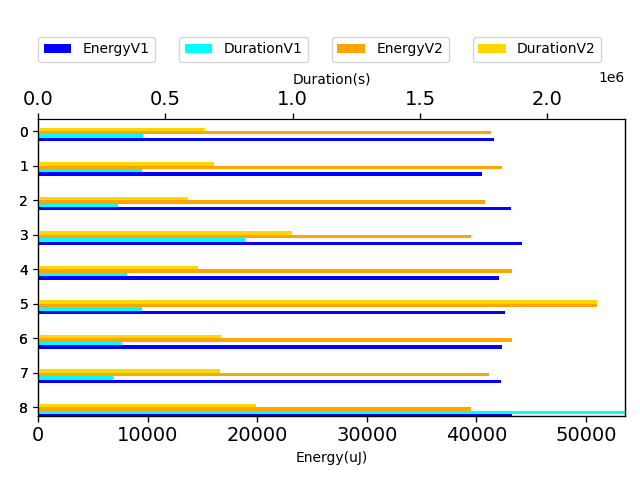

## com.google.gson.functional.PrintFormattingTest

| Test | IterationV1 | IterationV2 | DeltaIteration |
| --- | --- | --- | --- |
| com.google.gson.functional.PrintFormattingTest-testJsonObjectWithNullValues | 26 | 26 | 0 |
| com.google.gson.functional.PrintFormattingTest-testCompactFormattingLeavesNoWhiteSpace | 71 | 71 | 0 |
| com.google.gson.functional.PrintFormattingTest-testJsonObjectWithNullValuesSerialized | 20 | 14 | -6 |

| Test | EnergyV1 | EnergyV2 | DeltaEnergy |
| --- | --- | --- | --- |
| com.google.gson.functional.PrintFormattingTest-testJsonObjectWithNullValues | 47156.509475916624 | 44683.84613735974 | -2472.6633385568857 |
| com.google.gson.functional.PrintFormattingTest-testCompactFormattingLeavesNoWhiteSpace | 60449.826867600306 | 65093.44856552837 | 4643.621697928065 |
| com.google.gson.functional.PrintFormattingTest-testJsonObjectWithNullValuesSerialized | 40705.54975128174 | 39989.555908203125 | -715.9938430786133 |

| Test | DurationV1 | DurationsV2 | DeltaDuration |
| --- | --- | --- | --- |
| com.google.gson.functional.PrintFormattingTest-testJsonObjectWithNullValues | 512676.3052460253 | 387425.8619890362 | -125250.44325698912 |
| com.google.gson.functional.PrintFormattingTest-testCompactFormattingLeavesNoWhiteSpace | 1246992.276742471 | 1248811.2915291656 | 1819.0147866946645 |
| com.google.gson.functional.PrintFormattingTest-testJsonObjectWithNullValuesSerialized | 386254.086977005 | 475377.20556640625 | 89123.11858940125 |

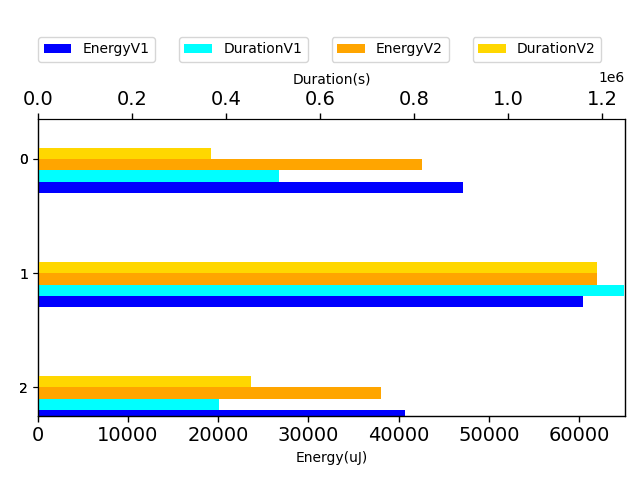

## com.google.gson.functional.InternationalizationTest

| Test | IterationV1 | IterationV2 | DeltaIteration |
| --- | --- | --- | --- |
| com.google.gson.functional.InternationalizationTest-testStringsWithUnicodeChineseCharactersSerialization | 64 | 56 | -8 |

| Test | EnergyV1 | EnergyV2 | DeltaEnergy |
| --- | --- | --- | --- |
| com.google.gson.functional.InternationalizationTest-testStringsWithUnicodeChineseCharactersSerialization | 43464.6674350745 | 44792.13858808066 | 1327.4711530061613 |

| Test | DurationV1 | DurationsV2 | DeltaDuration |
| --- | --- | --- | --- |
| com.google.gson.functional.InternationalizationTest-testStringsWithUnicodeChineseCharactersSerialization | 751554.2666734369 | 713231.5234871025 | -38322.74318633438 |

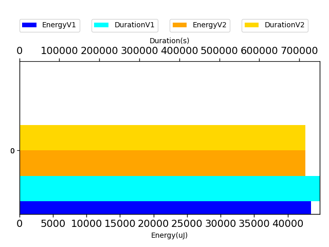

## com.google.gson.functional.UncategorizedTest

| Test | IterationV1 | IterationV2 | DeltaIteration |
| --- | --- | --- | --- |
| com.google.gson.functional.UncategorizedTest-testGsonInstanceReusableForSerializationAndDeserialization | 49 | 42 | -7 |
| com.google.gson.functional.UncategorizedTest-testObjectEqualButNotSameSerialization | 33 | 37 | 4 |
| com.google.gson.functional.UncategorizedTest-testStaticFieldsAreNotSerialized | 38 | 31 | -7 |

| Test | EnergyV1 | EnergyV2 | DeltaEnergy |
| --- | --- | --- | --- |
| com.google.gson.functional.UncategorizedTest-testGsonInstanceReusableForSerializationAndDeserialization | 42513.12453308922 | 40555.923381381464 | -1957.2011517077553 |
| com.google.gson.functional.UncategorizedTest-testObjectEqualButNotSameSerialization | 41844.660303299315 | 44878.78701580243 | 3034.1267125031154 |
| com.google.gson.functional.UncategorizedTest-testStaticFieldsAreNotSerialized | 40752.47313640623 | 45691.12194510363 | 4938.648808697399 |

| Test | DurationV1 | DurationsV2 | DeltaDuration |
| --- | --- | --- | --- |
| com.google.gson.functional.UncategorizedTest-testGsonInstanceReusableForSerializationAndDeserialization | 525040.4228051013 | 639471.133072203 | 114430.71026710176 |
| com.google.gson.functional.UncategorizedTest-testObjectEqualButNotSameSerialization | 500202.4536207379 | 620007.9756611893 | 119805.52204045141 |
| com.google.gson.functional.UncategorizedTest-testStaticFieldsAreNotSerialized | 403100.7907712122 | 691269.2113607181 | 288168.4205895059 |

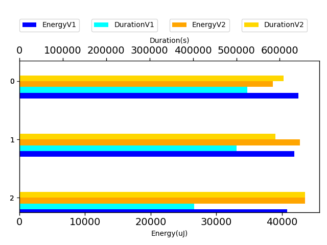

## com.google.gson.GsonBuilderTest

| Test | IterationV1 | IterationV2 | DeltaIteration |
| --- | --- | --- | --- |
| com.google.gson.GsonBuilderTest-testTransientFieldExclusion | 47 | 50 | 3 |
| com.google.gson.GsonBuilderTest-testExcludeFieldsWithModifiers | 36 | 40 | 4 |

| Test | EnergyV1 | EnergyV2 | DeltaEnergy |
| --- | --- | --- | --- |
| com.google.gson.GsonBuilderTest-testTransientFieldExclusion | 46246.21621636301 | 41032.91726567077 | -5213.298950692246 |
| com.google.gson.GsonBuilderTest-testExcludeFieldsWithModifiers | 45018.26672762248 | 58995.345371385396 | 13977.078643762914 |

| Test | DurationV1 | DurationsV2 | DeltaDuration |
| --- | --- | --- | --- |
| com.google.gson.GsonBuilderTest-testTransientFieldExclusion | 833900.1162740658 | 595169.8416755894 | -238730.27459847636 |
| com.google.gson.GsonBuilderTest-testExcludeFieldsWithModifiers | 750427.4420622722 | 1366423.2587164384 | 615995.8166541662 |

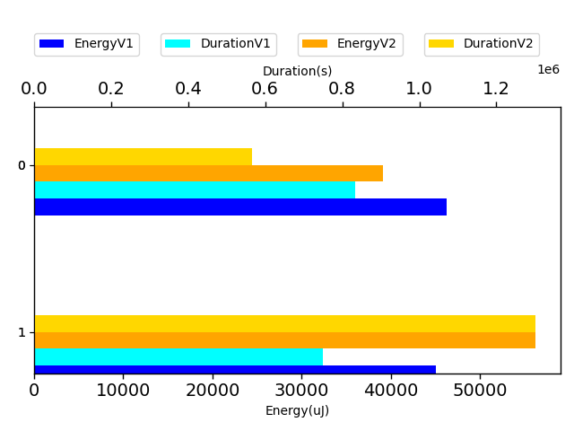

## com.google.gson.JsonObjectTest

| Test | IterationV1 | IterationV2 | DeltaIteration |
| --- | --- | --- | --- |
| com.google.gson.JsonObjectTest-testWritePropertyWithEmptyStringName | 18 | 24 | 6 |
| com.google.gson.JsonObjectTest-testPropertyWithQuotes | 22 | 27 | 5 |

| Test | EnergyV1 | EnergyV2 | DeltaEnergy |
| --- | --- | --- | --- |
| com.google.gson.JsonObjectTest-testWritePropertyWithEmptyStringName | 42203.09583282471 | 42727.77212905884 | 524.6762962341309 |
| com.google.gson.JsonObjectTest-testPropertyWithQuotes | 44009.083975315094 | 586146.9147417247 | 542137.8307664096 |

| Test | DurationV1 | DurationsV2 | DeltaDuration |
| --- | --- | --- | --- |
| com.google.gson.JsonObjectTest-testWritePropertyWithEmptyStringName | 414106.23837280273 | 515979.2449474335 | 101873.00657463074 |
| com.google.gson.JsonObjectTest-testPropertyWithQuotes | 448789.5572295189 | 17521347.223698378 | 17072557.66646886 |

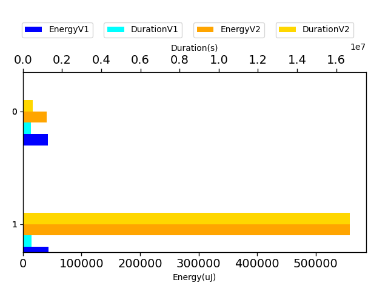

