# gson 049bf8

https://github.com/google/gson.git/commit/049bf8

## Delta Energy per test method

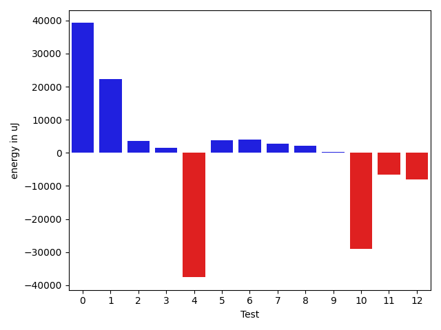

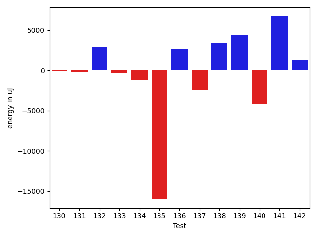

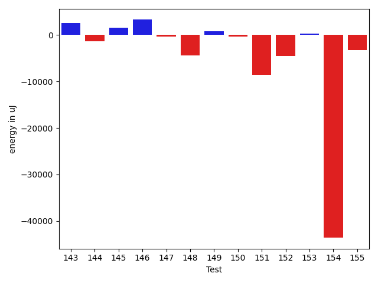

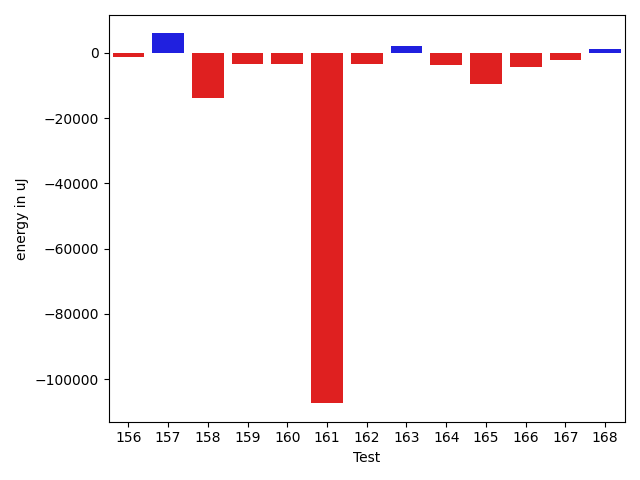

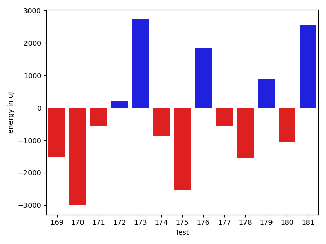

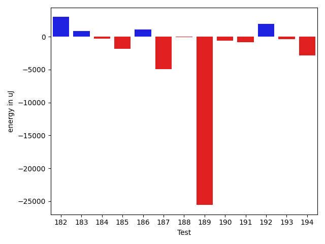

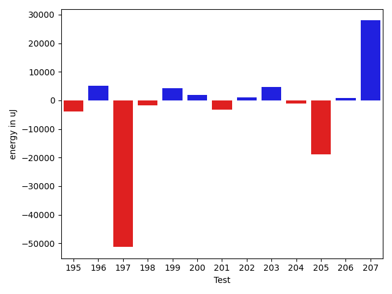

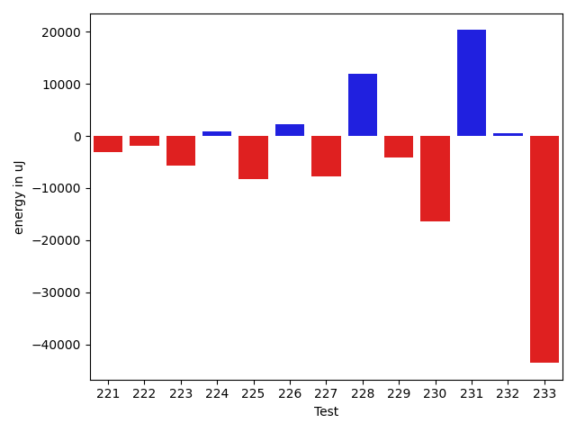

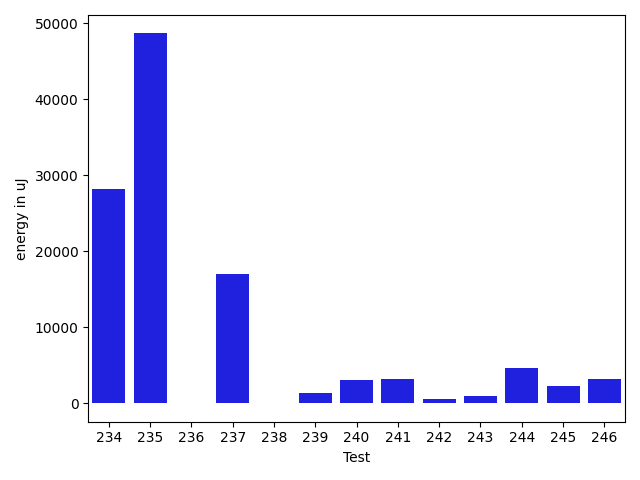

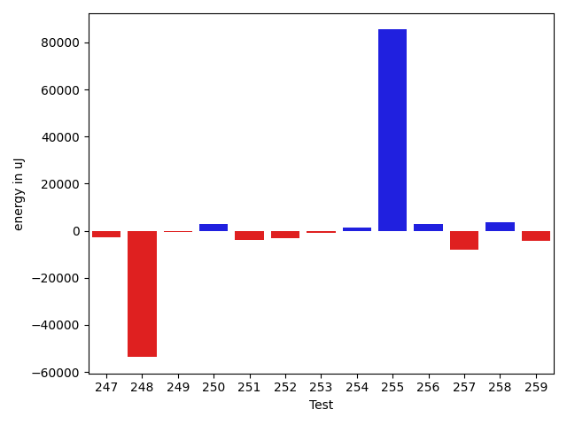

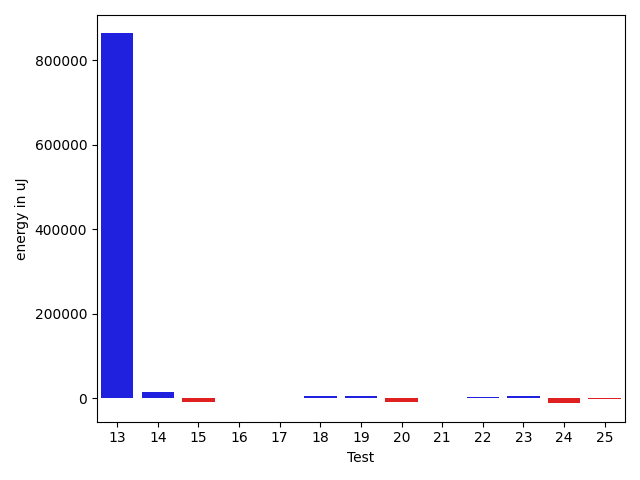

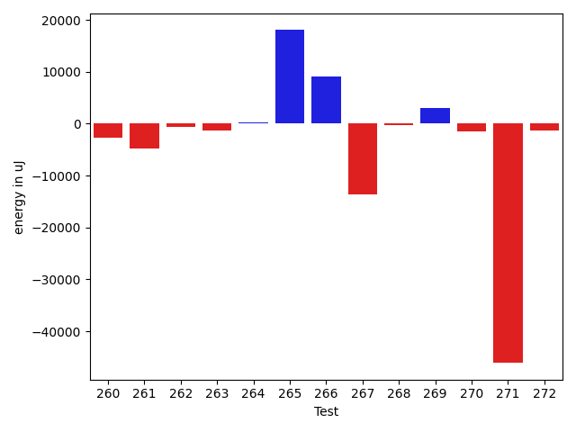

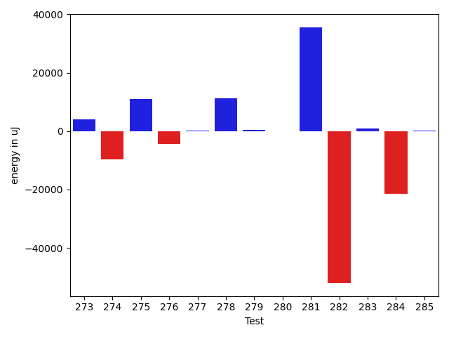

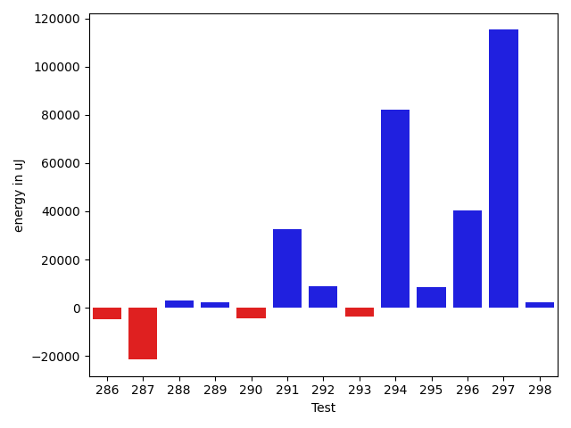

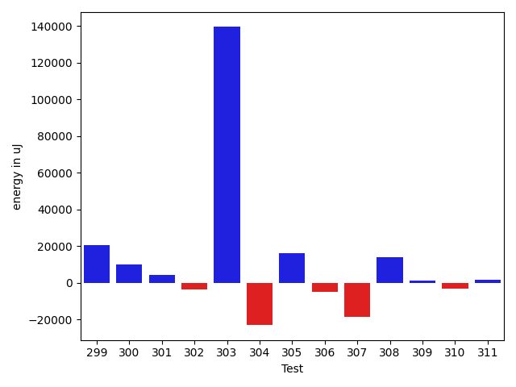

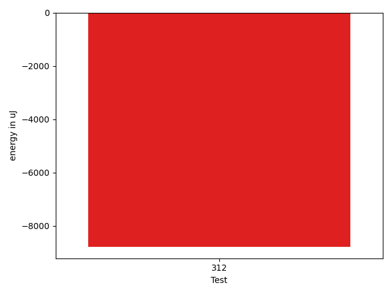

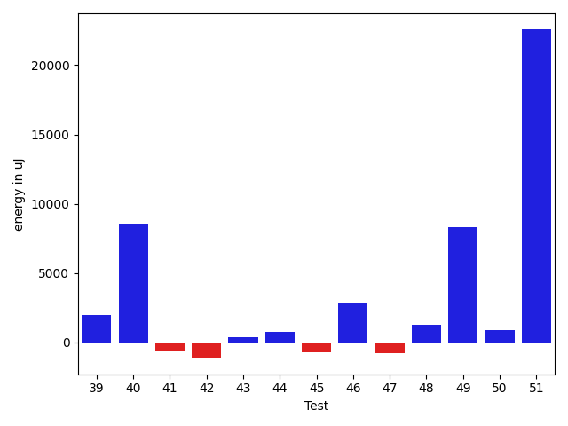

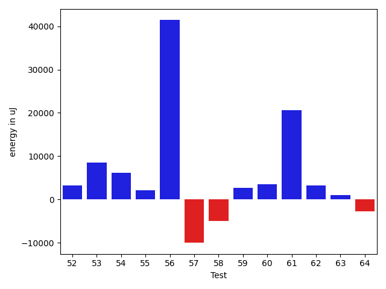

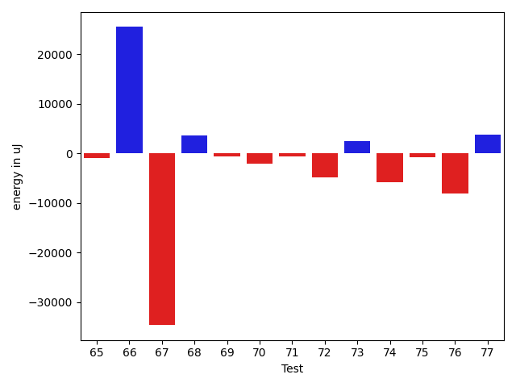

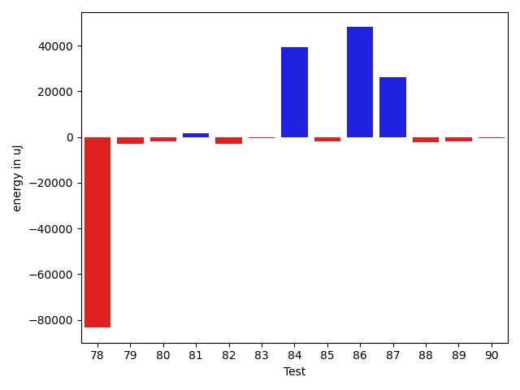

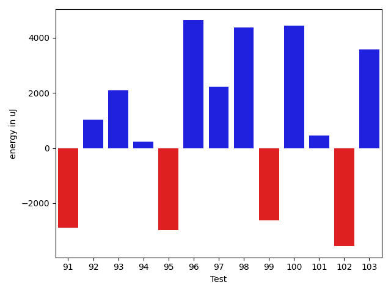

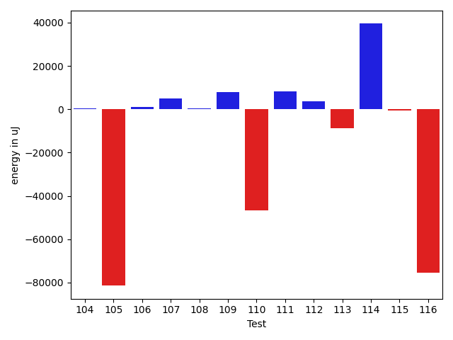

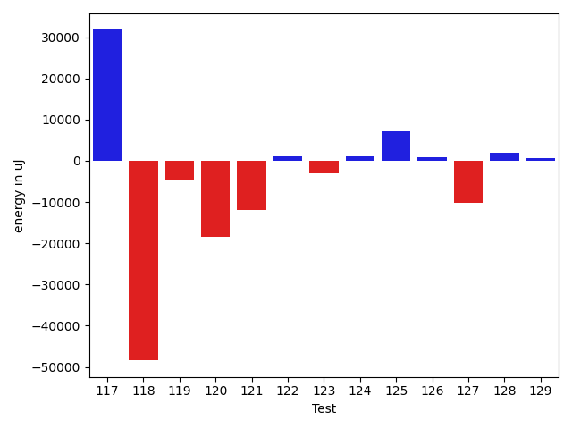

| ID | EnergyV1 | EnergyV2 | DeltaEnergy |
| --- | --- | --- | --- |
| 0 | 40958.443290551935 | 80199.40054236847 | 39240.95725181654 |
| 1 | 42208.59614293995 | 64419.60342341905 | 22211.007280479105 |
| 2 | 41503.60287643179 | 45132.22380524347 | 3628.6209288116806 |
| 3 | 42839.72567289094 | 44361.38666944684 | 1521.6609965558964 |
| 4 | 134442.55978286304 | 96840.32642932641 | -37602.233353536634 |
| 5 | 42406.41344268738 | 46136.425438326405 | 3730.0119956390263 |
| 6 | 40462.664386732846 | 44448.47410891406 | 3985.809722181213 |
| 7 | 42603.63805062135 | 45391.9669018781 | 2788.328851256745 |
| 8 | 43487.43608191516 | 45664.42157604937 | 2176.9854941342055 |
| 9 | 44089.30639929297 | 44314.05112526167 | 224.74472596870328 |
| 10 | 74399.7730639008 | 45447.030376231705 | -28952.742687669088 |
| 11 | 46321.9373293519 | 39807.30580479372 | -6514.631524558179 |
| 12 | 42727.0899887979 | 34722.048055648804 | -8005.041933149099 |
| 13 | 61039.05286830664 | 924315.270611327 | 863276.2177430204 |
| 14 | 42235.415470023174 | 56789.29943621624 | 14553.883966193069 |
| 15 | 47548.14859247208 | 38125.338342925534 | -9422.810249546543 |
| 16 | 42794.83094716072 | 43915.56026953459 | 1120.729322373867 |
| 17 | 41982.12198563732 | 41847.844567482985 | -134.27741815433546 |
| 18 | 38050.67889988814 | 43591.547167022 | 5540.868267133861 |
| 19 | 38732.425566738064 | 43024.77840593367 | 4292.352839195606 |
| 20 | 62704.85806083967 | 53090.69948086694 | -9614.158579972733 |
| 21 | 42322.90880728621 | 41344.89288003743 | -978.0159272487799 |
| 22 | 41450.276563896645 | 45128.81341968123 | 3678.536855784587 |
| 23 | 42267.127133339985 | 47370.07890768356 | 5102.951774343572 |
| 24 | 55596.89433359283 | 43382.33454059914 | -12214.559792993685 |
| 25 | 46312.53825943627 | 43556.710477528584 | -2755.827781907683 |
| 26 | 55471.43796066598 | 43486.32792563579 | -11985.110035030186 |
| 27 | 45986.71817456074 | 43147.463459483566 | -2839.2547150771716 |
| 28 | 50501.52440382031 | 44527.69477653874 | -5973.829627281571 |
| 29 | 42855.64571051289 | 47139.780071280926 | 4284.134360768039 |
| 30 | 42979.10718598344 | 42389.37503866013 | -589.7321473233096 |
| 31 | 42647.30633306644 | 41590.14781513507 | -1057.1585179313697 |
| 32 | 43292.42307110643 | 42288.4388176483 | -1003.984253458133 |
| 33 | 42601.801152409986 | 46274.73561905838 | 3672.9344666483958 |
| 34 | 41376.59385298922 | 43180.67635608921 | 1804.082503099984 |
| 35 | 42032.13003942827 | 43993.130195866615 | 1961.000156438342 |
| 36 | 43004.82922363281 | 43923.19594883919 | 918.3667252063751 |
| 37 | 217989.0483592391 | 99898.51410380952 | -118090.53425542958 |
| 38 | 49299.13410057817 | 56026.53711425157 | 6727.4030136734 |
| 39 | 41320.79201602378 | 43284.72190086918 | 1963.9298848454055 |
| 40 | 42715.281898921545 | 51272.413826248485 | 8557.13192732694 |
| 41 | 43075.63260464263 | 42389.39823539626 | -686.2343692463764 |
| 42 | 41904.5754244927 | 40781.37421284075 | -1123.2012116519545 |
| 43 | 42868.48705737274 | 43206.13715055804 | 337.65009318530065 |
| 44 | 42568.06960754971 | 43336.46455266744 | 768.3949451177323 |
| 45 | 40303.11015563527 | 39562.76033914834 | -740.3498164869306 |
| 46 | 38055.89351496281 | 40927.865599201024 | 2871.9720842382158 |
| 47 | 41192.43923827945 | 40392.01043917631 | -800.4287991031379 |
| 48 | 40817.89890026894 | 42111.65263715092 | 1293.7537368819758 |
| 49 | 61139.67011953005 | 69464.49228185635 | 8324.822162326302 |
| 50 | 39748.44128701063 | 40621.037716379964 | 872.5964293693323 |
| 51 | 75139.45098322764 | 97701.14841444277 | 22561.69743121513 |
| 52 | 41374.16753527774 | 44587.793862605315 | 3213.6263273275763 |
| 53 | 38533.934263078314 | 47129.07141301957 | 8595.137149941256 |
| 54 | 37899.313972592696 | 44058.0628259222 | 6158.748853329504 |
| 55 | 41045.71402504241 | 43158.446551315275 | 2112.7325262728627 |
| 56 | 65287.000661199716 | 106683.47862219105 | 41396.47796099133 |
| 57 | 50411.38055535122 | 40432.22712552676 | -9979.153429824459 |
| 58 | 46335.459329156205 | 41406.15451895865 | -4929.304810197558 |
| 59 | 40245.20764074329 | 42893.97608206338 | 2648.7684413200914 |
| 60 | 46145.22484052805 | 49619.65230602048 | 3474.42746549243 |
| 61 | 49428.093322212604 | 70055.14135852749 | 20627.04803631488 |
| 62 | 177626.92376676586 | 180834.88365308061 | 3207.959886314755 |
| 63 | 43266.97058694839 | 44351.845047803836 | 1084.874460855448 |
| 64 | 45638.281109159136 | 42899.46901247724 | -2738.812096681897 |
| 65 | 43630.893936395485 | 42739.73661674362 | -891.1573196518657 |
| 66 | 685475.0344647306 | 710924.2157301079 | 25449.181265377207 |
| 67 | 78383.72880331358 | 43795.33205234974 | -34588.396750963846 |
| 68 | 89138.16198510193 | 92678.63688738263 | 3540.4749022806936 |
| 69 | 41910.24219082676 | 41258.643209993665 | -651.5989808330924 |
| 70 | 43879.26514834288 | 41821.307073455304 | -2057.958074887574 |
| 71 | 41858.16740911454 | 41234.99973297119 | -623.1676761433482 |
| 72 | 43653.19556072412 | 38850.82340501463 | -4802.3721557094905 |
| 73 | 40605.364077944745 | 43074.817500710065 | 2469.4534227653203 |
| 74 | 44313.77478600293 | 38538.973434925334 | -5774.801351077593 |
| 75 | 43263.945127010345 | 42536.70566248894 | -727.2394645214081 |
| 76 | 67846.88281668966 | 59686.30403441191 | -8160.578782277749 |
| 77 | 36353.72314929962 | 40046.95475696027 | 3693.231607660651 |
| 78 | 330894.4317875638 | 247481.12397245524 | -83413.30781510854 |
| 79 | 189276.29061595481 | 186384.26921355288 | -2892.021402401937 |
| 80 | 45042.34498132486 | 42931.634898513556 | -2110.7100828113034 |
| 81 | 42895.78862286545 | 44587.705949740746 | 1691.917326875293 |
| 82 | 43433.459061872214 | 40436.47732650768 | -2996.981735364534 |
| 83 | 44167.41933070224 | 43631.12228586085 | -536.2970448413907 |
| 84 | 45319.96300822981 | 84463.33149609319 | 39143.36848786338 |
| 85 | 44036.372911605984 | 42090.060473459744 | -1946.3124381462403 |
| 86 | 47431.496056812226 | 95440.88808654044 | 48009.39202972821 |
| 87 | 143924.26716805992 | 170119.49152847021 | 26195.2243604103 |
| 88 | 43434.989634852725 | 41092.096362326294 | -2342.8932725264312 |
| 89 | 41560.243326803924 | 39759.6886952763 | -1800.5546315276224 |
| 90 | 43526.94973524102 | 42843.048751620154 | -683.9009836208643 |
| 91 | 44595.46573879202 | 41719.2415371966 | -2876.2242015954253 |
| 92 | 41570.430476112095 | 42593.700657193185 | 1023.2701810810904 |
| 93 | 42642.67274679085 | 44747.65563707112 | 2104.982890280269 |
| 94 | 42974.40471320846 | 43216.97199822552 | 242.56728501705948 |
| 95 | 44547.536180496216 | 41562.16820526123 | -2985.3679752349854 |
| 96 | 40271.783264160156 | 44900.733306884766 | 4628.950042724609 |
| 97 | 44170.9841633051 | 46392.87922885477 | 2221.8950655496737 |
| 98 | 40556.82820018953 | 44922.12933922722 | 4365.301139037692 |
| 99 | 41600.99652147293 | 38984.0740862824 | -2616.9224351905286 |
| 100 | 40719.798988342285 | 45161.48093187809 | 4441.681943535805 |
| 101 | 43657.03165492747 | 44121.37847625815 | 464.3468213306769 |
| 102 | 46648.876422444664 | 43093.276880933605 | -3555.599541511059 |
| 103 | 38875.44959728047 | 42462.376789108304 | 3586.927191827832 |
| 104 | 43257.403248906136 | 43762.668184258044 | 505.2649353519082 |
| 105 | 197625.5662479425 | 116168.38197156286 | -81457.18427637964 |
| 106 | 40906.363900998585 | 42091.112760550175 | 1184.7488595515897 |
| 107 | 38655.315133769065 | 43530.004892766476 | 4874.6897589974105 |
| 108 | 44790.38676083088 | 45066.52178545296 | 276.1350246220827 |
| 109 | 41337.599311968734 | 49169.54811965799 | 7831.948807689259 |
| 110 | 84453.32629001755 | 37740.28571351177 | -46713.04057650578 |
| 111 | 39178.02651105949 | 47512.247026408906 | 8334.220515349414 |
| 112 | 43009.70310354233 | 46802.94347381592 | 3793.24037027359 |
| 113 | 47822.4231451986 | 39072.77109569837 | -8749.652049500226 |
| 114 | 46495.474545798694 | 86001.65002855816 | 39506.17548275946 |
| 115 | 76838.89195683229 | 76113.74069941844 | -725.1512574138469 |
| 116 | 115888.02762541009 | 40313.0152859292 | -75575.01233948089 |
| 117 | 36641.486640930176 | 68404.63108474141 | 31763.144443811238 |
| 118 | 90743.63848376567 | 42343.27688567588 | -48400.36159808979 |
| 119 | 53460.88757430733 | 48867.591424073325 | -4593.296150234004 |
| 120 | 58324.136500092995 | 39799.08075927751 | -18525.055740815485 |
| 121 | 52741.67277182244 | 40735.71884417677 | -12005.95392764567 |
| 122 | 38509.20489584055 | 39897.0305027053 | 1387.825606864746 |
| 123 | 46176.97091674805 | 43216.68406036496 | -2960.2868563830853 |
| 124 | 41596.99790449813 | 42992.52327078581 | 1395.5253662876785 |
| 125 | 39663.948614094814 | 46804.3803815546 | 7140.431767459784 |
| 126 | 43341.29493366059 | 44149.67738750386 | 808.3824538432746 |
| 127 | 52398.06121826172 | 42130.39320373535 | -10267.668014526367 |
| 128 | 42930.71114676146 | 44901.427652239225 | 1970.7165054777652 |
| 129 | 41423.2411880074 | 42091.833783844384 | 668.5925958369844 |
| 130 | 42623.21076555086 | 42566.252427176165 | -56.958338374693994 |
| 131 | 42044.38360631194 | 41876.538228362195 | -167.84537794974312 |
| 132 | 41424.74241296289 | 44261.57478841501 | 2836.832375452119 |
| 133 | 45806.35260287569 | 45547.80591559387 | -258.5466872818215 |
| 134 | 43878.96834796481 | 42677.82171730045 | -1201.146630664356 |
| 135 | 91710.09552918299 | 75705.7308546076 | -16004.364674575394 |
| 136 | 41920.43295074335 | 44544.827101385104 | 2624.394150641754 |
| 137 | 44728.85102583468 | 42228.34980496764 | -2500.501220867038 |
| 138 | 41553.38525566202 | 44869.91130420559 | 3316.526048543572 |
| 139 | 41848.61812934652 | 46300.742827415466 | 4452.124698068947 |
| 140 | 44590.001459121704 | 40433.20921440795 | -4156.7922447137535 |
| 141 | 38574.49560638912 | 45253.17762858469 | 6678.682022195571 |
| 142 | 41774.21077974141 | 43053.28909397125 | 1279.078314229846 |
| 143 | 40018.131706338376 | 42645.25259977413 | 2627.1208934357564 |
| 144 | 45638.58693078533 | 44339.3083621487 | -1299.278568636626 |
| 145 | 43110.83153008054 | 44718.03325908026 | 1607.2017289997166 |
| 146 | 41685.18599086868 | 44954.12725296651 | 3268.9412620978255 |
| 147 | 42605.90850807543 | 42268.89786869645 | -337.0106393789829 |
| 148 | 46588.27578353882 | 42181.06403169781 | -4407.211751841009 |
| 149 | 43480.48122950643 | 44307.1741744503 | 826.6929449438685 |
| 150 | 42155.39825167093 | 41802.21099784063 | -353.1872538302996 |
| 151 | 53444.877399582096 | 44916.419603149545 | -8528.45779643255 |
| 152 | 43651.2076695744 | 39126.24637226704 | -4524.96129730736 |
| 153 | 43657.27670970173 | 43907.979055948235 | 250.70234624650766 |
| 154 | 86402.6933114015 | 42793.526918997915 | -43609.16639240358 |
| 155 | 79261.21889615466 | 76021.151059214 | -3240.067836940667 |
| 156 | 41335.73088976915 | 40202.32676461803 | -1133.4041251511153 |
| 157 | 37228.36117506027 | 43148.60780815093 | 5920.246633090661 |
| 158 | 55891.51035238421 | 41926.41460391389 | -13965.095748470325 |
| 159 | 69580.9040259832 | 66280.92270063888 | -3299.9813253443135 |
| 160 | 45157.45671492815 | 41651.55258430075 | -3505.904130627401 |
| 161 | 853126.1609318407 | 745730.6071781628 | -107395.55375367787 |
| 162 | 44100.783793881536 | 40537.6114540929 | -3563.172339788638 |
| 163 | 41357.10173468514 | 43509.10244171299 | 2152.0007070278516 |
| 164 | 44364.73861670494 | 40588.96113371942 | -3775.777482985519 |
| 165 | 53918.34420406443 | 44245.80272319088 | -9672.541480873551 |
| 166 | 46262.31426673203 | 42015.324573977996 | -4246.989692754032 |
| 167 | 45736.32413965464 | 43490.798083901405 | -2245.526055753231 |
| 168 | 41349.29080200195 | 42476.66859728098 | 1127.377795279026 |
| 169 | 45599.91498780779 | 44087.76653639117 | -1512.148451416615 |
| 170 | 43439.87251119323 | 40446.31791839665 | -2993.5545927965795 |
| 171 | 43430.671273757805 | 42889.18352144752 | -541.4877523102841 |
| 172 | 42193.680915534496 | 42414.1140588765 | 220.43314334200113 |
| 173 | 40552.36561656743 | 43292.07727921009 | 2739.7116626426578 |
| 174 | 42488.305684825646 | 41606.56660246255 | -881.7390823630922 |
| 175 | 45322.31516480541 | 42783.72588609133 | -2538.589278714084 |
| 176 | 43351.85015401244 | 45197.40758002922 | 1845.5574260167778 |
| 177 | 44744.31801421325 | 44182.69788877478 | -561.620125438465 |
| 178 | 43657.862246155164 | 42106.83232071083 | -1551.0299254443307 |
| 179 | 41010.907781472466 | 41896.145150513825 | 885.2373690413588 |
| 180 | 42063.396243050694 | 41008.3905210495 | -1055.005722001195 |
| 181 | 43946.82902145386 | 46481.07094251923 | 2534.241921065375 |
| 182 | 39737.0144344741 | 42735.529156222234 | 2998.5147217481353 |
| 183 | 44084.41402232647 | 44992.78976070689 | 908.3757383804186 |
| 184 | 43803.77922359854 | 43533.50273997197 | -270.27648362657055 |
| 185 | 42803.59627159912 | 40933.74811187066 | -1869.8481597284626 |
| 186 | 41693.74650030419 | 42772.00503124251 | 1078.2585309383212 |
| 187 | 47229.58665552454 | 42267.89981761543 | -4961.68683790911 |
| 188 | 42514.61321634847 | 42496.21188491739 | -18.401331431079598 |
| 189 | 70808.39545511827 | 45225.689695166504 | -25582.705759951765 |
| 190 | 45244.73977857828 | 44642.60789489746 | -602.1318836808205 |
| 191 | 43637.900966838 | 42771.56611100661 | -866.3348558313955 |
| 192 | 41392.33666229248 | 43312.549146175385 | 1920.212483882904 |
| 193 | 42632.456062316895 | 42248.888231784105 | -383.56783053278923 |
| 194 | 44321.10155582428 | 41445.52495634556 | -2875.5765994787216 |
| 195 | 44584.35986328125 | 40621.50785255432 | -3962.8520107269287 |
| 196 | 37677.31672777518 | 42782.537733399586 | 5105.221005624408 |
| 197 | 178034.06454553013 | 126746.55498988087 | -51287.50955564926 |
| 198 | 41864.53097519169 | 40107.574036305814 | -1756.9569388858727 |
| 199 | 39384.50484137982 | 43675.95101530363 | 4291.44617392381 |
| 200 | 41731.822307438 | 43668.29296575296 | 1936.47065831496 |
| 201 | 44988.043196293525 | 41828.959428008646 | -3159.0837682848796 |
| 202 | 40149.94057165616 | 41086.52577137204 | 936.5851997158825 |
| 203 | 39131.87944513559 | 43883.39590302223 | 4751.516457886639 |
| 204 | 44877.467969566525 | 43812.97069713896 | -1064.497272427565 |
| 205 | 62309.71899010559 | 43336.5904271804 | -18973.128562925187 |
| 206 | 47484.24187012181 | 48302.56127982387 | 818.3194097020605 |
| 207 | 41554.9947644232 | 69486.4079411896 | 27931.413176766393 |
| 208 | 43569.900123068306 | 45781.455622931855 | 2211.555499863549 |
| 209 | 42372.31404816762 | 44304.66364175739 | 1932.3495935897736 |
| 210 | 42008.95312455153 | 41933.31813687623 | -75.63498767530109 |
| 211 | 41004.25571148182 | 44139.59788063415 | 3135.3421691523326 |
| 212 | 40609.40124303056 | 42181.11597948961 | 1571.7147364590492 |
| 213 | 48369.66338303685 | 44015.8015544042 | -4353.861828632653 |
| 214 | 52645.97930335935 | 42321.728042075985 | -10324.251261283367 |
| 215 | 47040.70684505999 | 43169.077336674556 | -3871.6295083854347 |
| 216 | 44693.47791185927 | 43409.26688745029 | -1284.2110244089781 |
| 217 | 42449.57305793901 | 42225.67781610515 | -223.89524183385947 |
| 218 | 45928.56894965121 | 40439.39337848555 | -5489.175571165666 |
| 219 | 44637.874334141714 | 42648.60672173537 | -1989.2676124063437 |
| 220 | 42951.155344122686 | 42705.1525573512 | -246.0027867714889 |
| 221 | 42846.17881990151 | 39743.970851196966 | -3102.207968704548 |
| 222 | 43297.84269692929 | 41387.47398821074 | -1910.3687087185535 |
| 223 | 45748.80431014672 | 40093.02233417332 | -5655.7819759733975 |
| 224 | 41630.06820869041 | 42514.50926678404 | 884.441058093631 |
| 225 | 74934.52741395583 | 66621.33299237228 | -8313.194421583554 |
| 226 | 42841.06580885859 | 45152.07870601242 | 2311.012897153829 |
| 227 | 48007.25660496391 | 40286.31871653162 | -7720.937888432294 |
| 228 | 43830.93469155346 | 55796.277759896606 | 11965.343068343143 |
| 229 | 43194.00325030024 | 39055.04796087771 | -4138.955289422527 |
| 230 | 57406.47382329777 | 41047.76281732321 | -16358.711005974561 |
| 231 | 143519.58713750308 | 163808.30414685066 | 20288.717009347572 |
| 232 | 43340.5905063135 | 43928.0606399979 | 587.4701336844009 |
| 233 | 86783.25426648711 | 43241.212060977356 | -43542.04220550976 |
| 234 | 39361.213587179314 | 67516.19863155484 | 28154.985044375528 |
| 235 | 41356.38988670865 | 89983.01968692524 | 48626.62980021659 |
| 236 | 43860.40165308304 | 43949.07368933056 | 88.6720362475171 |
| 237 | 42840.07819604874 | 59871.51750858873 | 17031.439312539995 |
| 238 | 43819.85269095097 | 43815.3465258989 | -4.506165052065626 |
| 239 | 44861.45729487173 | 46258.38973325567 | 1396.9324383839412 |
| 240 | 40843.06305837887 | 43839.18179420382 | 2996.1187358249445 |
| 241 | 40471.0079827063 | 43678.819167131674 | 3207.8111844253726 |
| 242 | 40887.05817768967 | 41445.537987378004 | 558.4798096883314 |
| 243 | 39838.575061747004 | 40767.59179784636 | 929.0167360993582 |
| 244 | 44391.32438695413 | 49031.7783385816 | 4640.453951627467 |
| 245 | 39642.65415032369 | 41848.82468098036 | 2206.170530656673 |
| 246 | 38992.49890383326 | 42162.11087955964 | 3169.6119757263805 |
| 247 | 44152.32208280172 | 41350.818503456656 | -2801.503579345066 |
| 248 | 98575.27873937925 | 44944.70820751799 | -53630.57053186126 |
| 249 | 41700.13751220703 | 41349.692361816764 | -350.4451503902674 |
| 250 | 42171.08945187507 | 44961.224595389096 | 2790.135143514024 |
| 251 | 45295.17409348488 | 41562.32901342958 | -3732.8450800552964 |
| 252 | 46359.619489199176 | 43160.03024852858 | -3199.589240670597 |
| 253 | 44357.5677616559 | 43325.1810696068 | -1032.3866920490982 |
| 254 | 40130.36134081673 | 41450.20942298065 | 1319.8480821639241 |
| 255 | 260388.48338961005 | 345802.3158316857 | 85413.83244207563 |
| 256 | 309274.73357562756 | 312155.044176742 | 2880.31060111447 |
| 257 | 43668.36630083693 | 35441.28092927187 | -8227.085371565066 |
| 258 | 41270.35968211293 | 44972.19768054606 | 3701.837998433126 |
| 259 | 45161.51738959705 | 40875.43053367427 | -4286.086855922782 |
| 260 | 46988.527420256985 | 44340.8684850312 | -2647.658935225787 |
| 261 | 49666.808406548575 | 44814.27071881294 | -4852.537687735632 |
| 262 | 54807.44258557841 | 54225.10962179277 | -582.3329637856368 |
| 263 | 44523.91096730041 | 43294.50146268713 | -1229.4095046132861 |
| 264 | 42562.6795709359 | 42819.78414305428 | 257.10457211838366 |
| 265 | 44982.32793862553 | 63017.67305038782 | 18035.34511176229 |
| 266 | 41594.40695673129 | 50700.7065992182 | 9106.299642486912 |
| 267 | 101706.3397747328 | 88069.04694839047 | -13637.292826342324 |
| 268 | 43097.63880388455 | 42862.82807895205 | -234.81072493249667 |
| 269 | 40790.42224569429 | 43907.50427804487 | 3117.082032350583 |
| 270 | 45580.531687015035 | 44180.88510336903 | -1399.6465836460047 |
| 271 | 124950.9864319091 | 78866.69822525498 | -46084.28820665412 |
| 272 | 44774.15579914929 | 43535.72962410058 | -1238.4261750487058 |
| 273 | 42628.27271970989 | 46707.308011835376 | 4079.035292125489 |
| 274 | 54130.86104186315 | 44474.49033510792 | -9656.370706755231 |
| 275 | 46478.078544699376 | 57424.129588112635 | 10946.05104341326 |
| 276 | 46857.782020064325 | 42486.23887270548 | -4371.543147358847 |
| 277 | 43310.664053566805 | 43529.3277952899 | 218.66374172309588 |
| 278 | 44424.86482481971 | 55794.059533035506 | 11369.194708215793 |
| 279 | 42667.34411813404 | 43117.788938300684 | 450.4448201666455 |
| 280 | 42825.31011186007 | 42860.28008318438 | 34.96997132430988 |
| 281 | 50755.77686023619 | 86398.36403046548 | 35642.58717022929 |
| 282 | 92472.78631859946 | 40332.139056773194 | -52140.64726182627 |
| 283 | 40270.70069599048 | 41108.10175086205 | 837.4010548715669 |
| 284 | 63884.590417999716 | 42320.171453701114 | -21564.418964298602 |
| 285 | 44282.94486927986 | 44546.453379675746 | 263.5085103958845 |
| 286 | 46971.64426663041 | 42087.26846749708 | -4884.375799133326 |
| 287 | 63830.09503654577 | 42333.10337398923 | -21496.99166255654 |
| 288 | 41996.84997133911 | 44861.52619397268 | 2864.6762226335704 |
| 289 | 42859.392926216125 | 45029.482612724765 | 2170.0896865086397 |
| 290 | 44424.677834885944 | 39868.55937297006 | -4556.118461915881 |
| 291 | 45031.45524112445 | 77777.17813081876 | 32745.722889694312 |
| 292 | 45967.09065469634 | 54848.174258380095 | 8881.083603683757 |
| 293 | 43326.22443526238 | 39583.8099061735 | -3742.4145290888846 |
| 294 | 100957.37657095029 | 183029.4474564834 | 82072.07088553312 |
| 295 | 45369.22277547887 | 53917.63021920994 | 8548.40744373107 |
| 296 | 44923.09845996903 | 85186.57730396435 | 40263.478843995326 |
| 297 | 42681.6342151165 | 157914.38292805105 | 115232.74871293455 |
| 298 | 40277.98368131369 | 42666.99307048321 | 2389.009389169514 |
| 299 | 100493.08324761134 | 121238.89321701997 | 20745.809969408627 |
| 300 | 63155.21303100776 | 73416.79348940199 | 10261.580458394223 |
| 301 | 40475.01144495634 | 44900.69101407063 | 4425.679569114291 |
| 302 | 44872.75183661119 | 41172.034429477615 | -3700.7174071335758 |
| 303 | 47749.917873066195 | 187162.6347352192 | 139412.71686215303 |
| 304 | 67915.57651917769 | 44924.15323324649 | -22991.423285931196 |
| 305 | 45488.14453627371 | 61910.604779129775 | 16422.46024285607 |
| 306 | 44815.428508758545 | 39767.33711425215 | -5048.091394506395 |
| 307 | 83449.22458208415 | 65145.5697715708 | -18303.654810513348 |
| 308 | 49988.778396647285 | 63911.6186212576 | 13922.840224610314 |
| 309 | 41337.379863246926 | 42478.961861600874 | 1141.5819983539477 |
| 310 | 42992.14165561001 | 40017.56485883478 | -2974.5767967752254 |
| 311 | 44734.383068007475 | 46626.66427322014 | 1892.2812052126683 |
| 312 | 49780.61676134993 | 40998.16630096961 | -8782.450460380314 |

## Delta Duration per test method

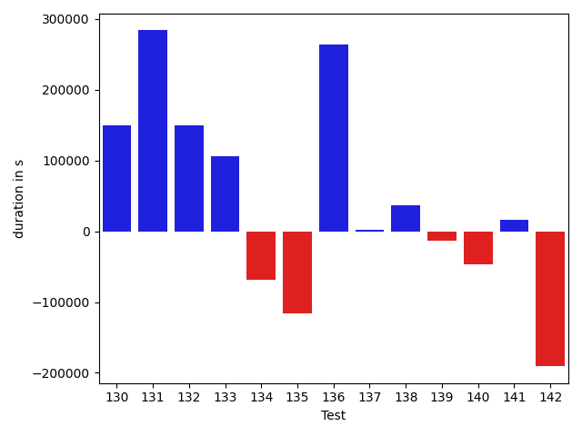

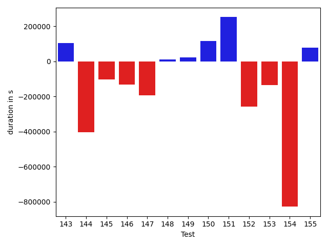

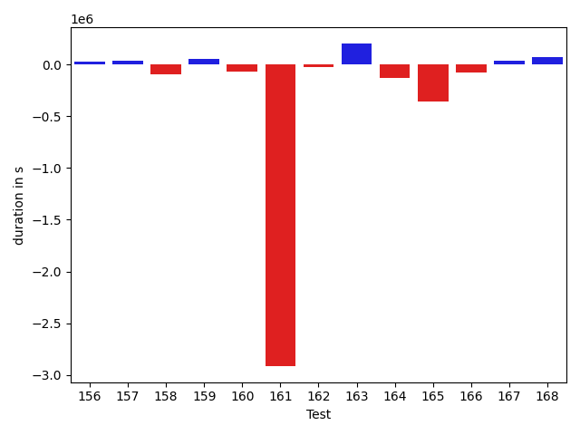

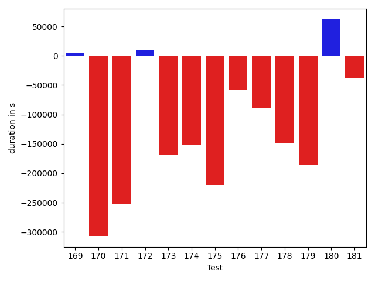

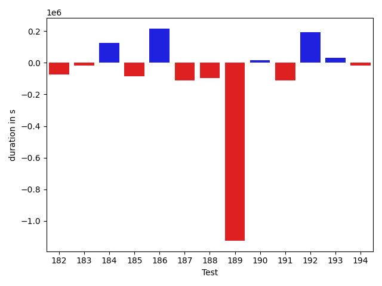

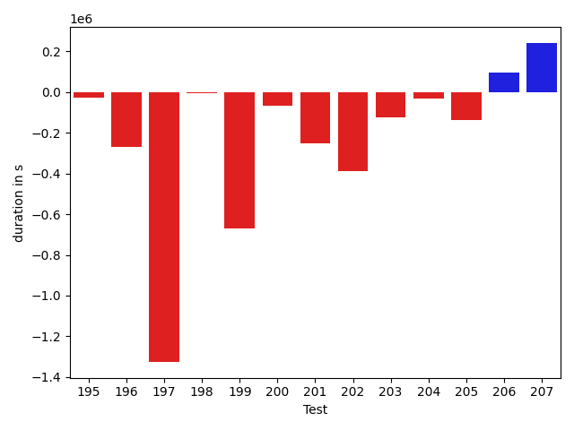

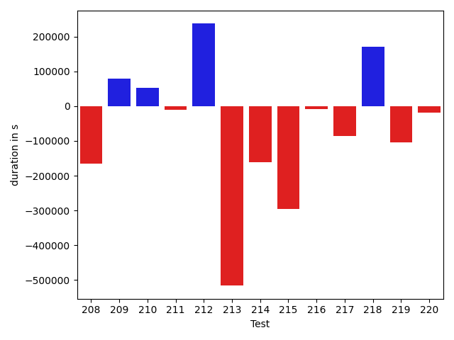

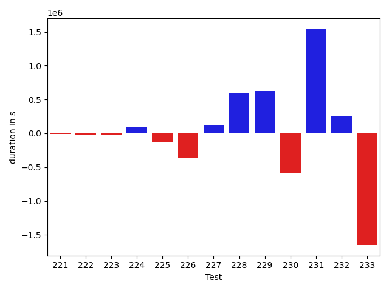

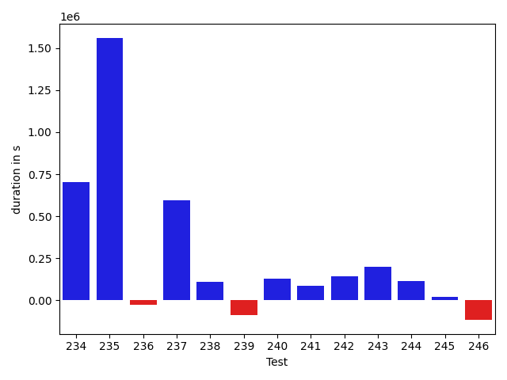

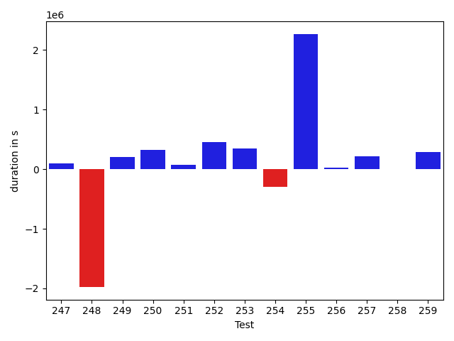

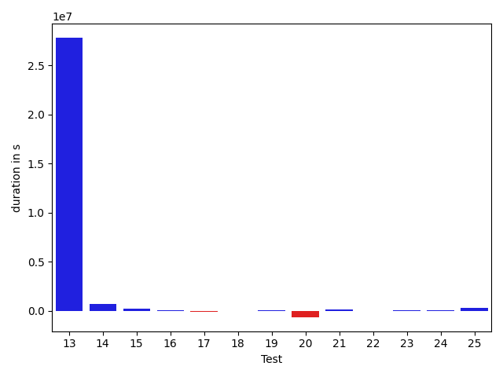

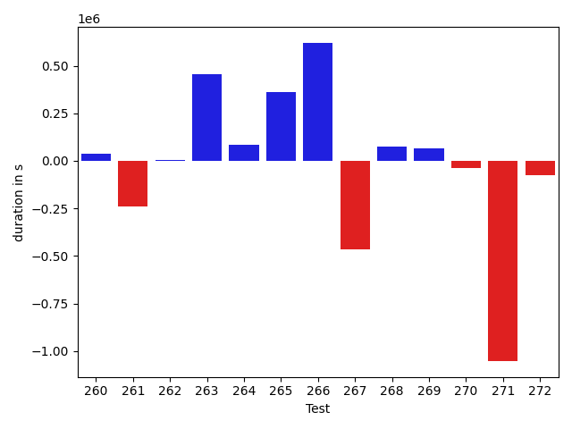

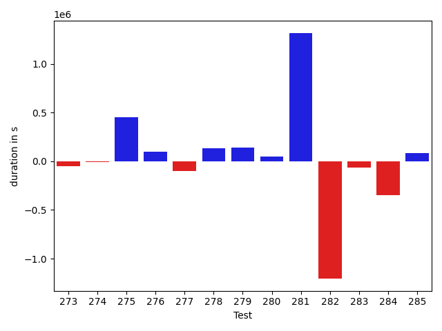

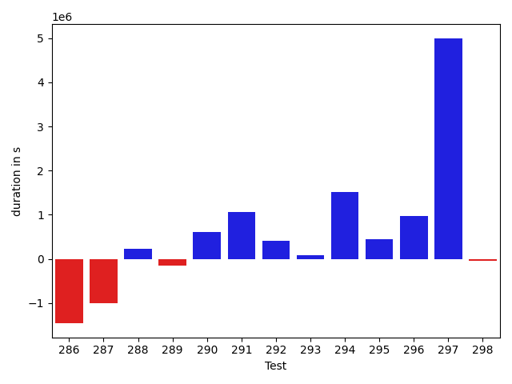

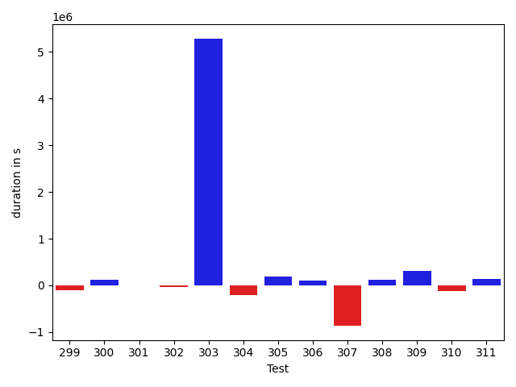

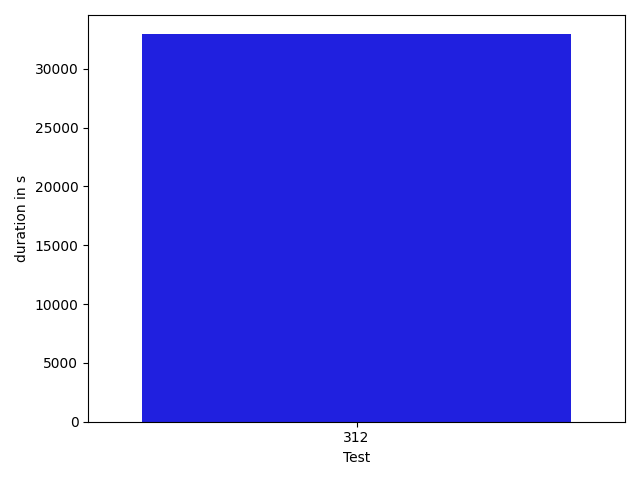

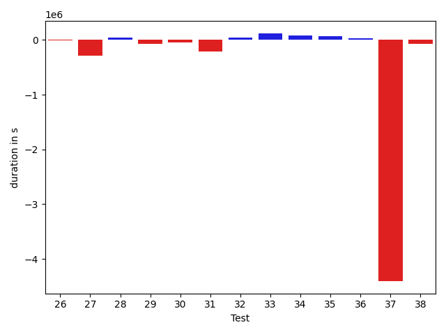

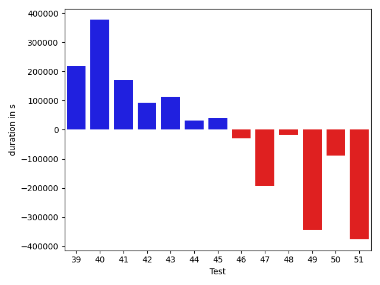

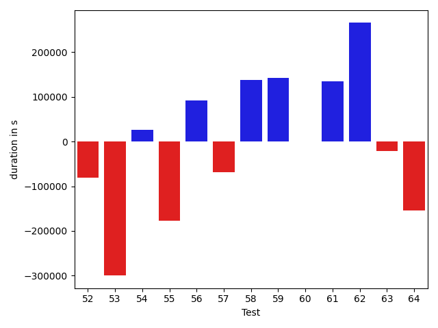

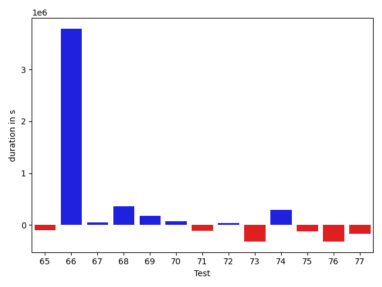

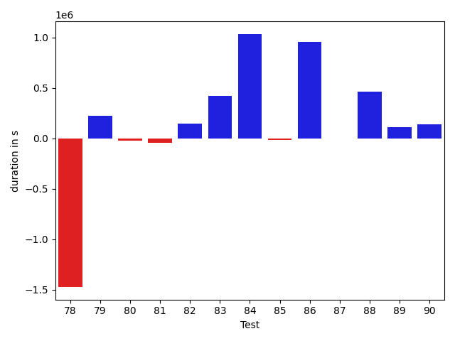

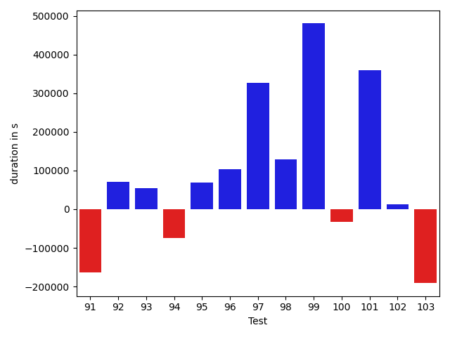

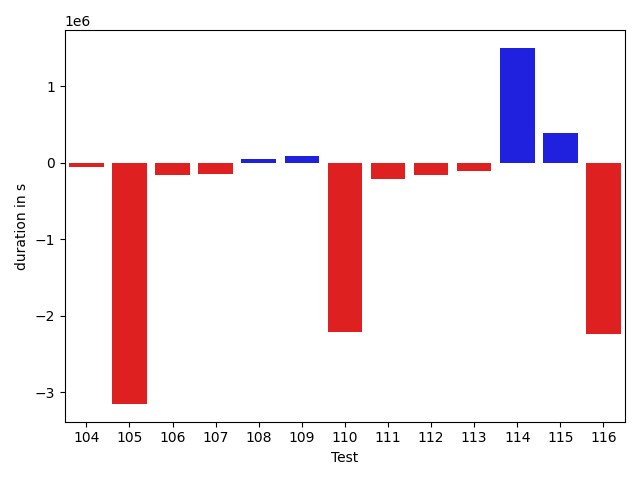

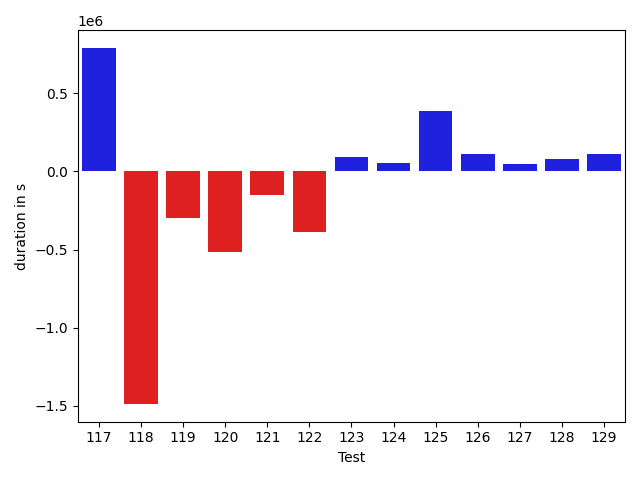

| ID | DurationV1 | DurationsV2 | DeltaDuration |
| --- | --- | --- | --- |
| 0 | 1086068.1521628604 | 2015070.181031941 | 929002.0288690806 |
| 1 | 1154058.8938264675 | 1505989.8505796625 | 351930.95675319503 |
| 2 | 643624.8753063479 | 1282441.5783477854 | 638816.7030414375 |
| 3 | 764767.1837211838 | 835842.2720660863 | 71075.0883449025 |
| 4 | 3177671.085024391 | 2758372.606150303 | -419298.4788740878 |
| 5 | 1089831.7693449408 | 1078326.3691745177 | -11505.40017042309 |
| 6 | 850574.3175379722 | 1060876.1661927477 | 210301.84865477541 |
| 7 | 646758.218292405 | 742006.3226516128 | 95248.10435920779 |
| 8 | 997859.1520557887 | 794606.4733480738 | -203252.6787077149 |
| 9 | 833508.057512506 | 776127.8488692753 | -57380.208643230726 |
| 10 | 4233607.757953901 | 871754.7203703484 | -3361853.0375835523 |
| 11 | 441820.41240448505 | 567536.3864172874 | 125715.97401280235 |
| 12 | 460492.4119038582 | 869823.8856284618 | 409331.47372460365 |
| 13 | 1167880.083264649 | 29005921.583644174 | 27838041.500379525 |
| 14 | 635057.949113824 | 1381989.4612529117 | 746931.5121390877 |
| 15 | 528739.4384322166 | 773602.7403380163 | 244863.30190579966 |
| 16 | 394610.4074707031 | 459243.8764728308 | 64633.46900212765 |
| 17 | 761228.587449966 | 690132.3588541615 | -71096.22859580454 |
| 18 | 961420.717586535 | 913871.8534270088 | -47548.86415952619 |
| 19 | 956036.5381121628 | 1053024.98443597 | 96988.44632380712 |
| 20 | 1429227.3288302268 | 782968.5700931599 | -646258.7587370669 |
| 21 | 568236.4043767918 | 701676.0630102307 | 133439.65863343887 |
| 22 | 816347.5762325191 | 779512.5931727601 | -36834.98305975902 |
| 23 | 1248488.6209897792 | 1314167.1254809303 | 65678.50449115108 |
| 24 | 1293499.4082213296 | 1340061.0563878745 | 46561.64816654497 |
| 25 | 891760.6372880505 | 1196981.7831240378 | 305221.1458359873 |
| 26 | 1302748.3645718326 | 1298345.3793922998 | -4402.985179532785 |
| 27 | 1285863.7540895995 | 1002572.8661557046 | -283290.8879338949 |
| 28 | 1178460.2215456467 | 1221882.268025041 | 43422.04647939443 |
| 29 | 864343.4268233378 | 795928.9513467771 | -68414.47547656065 |
| 30 | 906491.5593953806 | 856677.8508866061 | -49813.708508774405 |
| 31 | 999771.6797868881 | 791664.4924548169 | -208107.18733207113 |
| 32 | 762739.9794814587 | 810225.1812242607 | 47485.20174280205 |
| 33 | 595325.1602103901 | 714878.2284650054 | 119553.0682546153 |
| 34 | 753150.1295807415 | 832039.8811431639 | 78889.75156242237 |
| 35 | 633525.4114783294 | 704716.1760279522 | 71190.76454962278 |
| 36 | 330097.59020996094 | 362960.8404865265 | 32863.25027656555 |
| 37 | 7310839.532235869 | 2906950.7229375523 | -4403888.809298317 |
| 38 | 1556116.2631026492 | 1486954.102008914 | -69162.16109373514 |
| 39 | 1167277.3732914221 | 1386050.4541226542 | 218773.08083123202 |
| 40 | 759116.9827763273 | 1136641.4171730552 | 377524.43439672794 |
| 41 | 1050567.6553435444 | 1221201.9755917839 | 170634.32024823944 |
| 42 | 635290.5485775485 | 729014.4360448958 | 93723.88746734732 |
| 43 | 752209.0751208725 | 865612.6776073135 | 113403.60248644103 |
| 44 | 857511.1174238649 | 889652.129624577 | 32141.01220071211 |
| 45 | 1055620.7861651112 | 1095484.71467489 | 39863.92850977881 |
| 46 | 886438.6099177962 | 857573.1733162014 | -28865.43660159479 |
| 47 | 1204038.287364011 | 1011882.8985400038 | -192155.38882400712 |
| 48 | 1033034.2156913378 | 1015253.7361364928 | -17780.47955484502 |
| 49 | 1989277.587684513 | 1644757.6196464938 | -344519.96803801926 |
| 50 | 1098597.9071472664 | 1009241.015891497 | -89356.89125576941 |
| 51 | 2515234.5872446336 | 2138259.5464841723 | -376975.04076046124 |
| 52 | 1206500.82346073 | 1125459.165204096 | -81041.65825663414 |
| 53 | 1415596.7128603763 | 1115714.0822053722 | -299882.6306550042 |
| 54 | 1337361.4698603817 | 1364204.3757433705 | 26842.905882988824 |
| 55 | 1400329.7922409605 | 1223711.0821627416 | -176618.71007821895 |
| 56 | 2252759.82519892 | 2344360.8640871746 | 91601.03888825467 |
| 57 | 1159208.7683065673 | 1091348.985205588 | -67859.7831009794 |
| 58 | 511503.70087504014 | 649681.6045610874 | 138177.9036860473 |
| 59 | 729956.4008636394 | 872660.2668220433 | 142703.8659584039 |
| 60 | 1222014.6914139674 | 1222974.5954439065 | 959.9040299390908 |
| 61 | 1637465.6908994503 | 1771683.003362713 | 134217.31246326258 |
| 62 | 4178995.538039269 | 4444573.286395176 | 265577.7483559074 |
| 63 | 690396.9627896274 | 668799.7013477553 | -21597.261441872106 |
| 64 | 889282.6356154475 | 735544.9290957982 | -153737.70651964936 |
| 65 | 804407.466479154 | 699386.5598396638 | -105020.90663949016 |
| 66 | 16237368.067035716 | 20024440.11364611 | 3787072.0466103926 |
| 67 | 1376436.7814695828 | 1425675.9524100057 | 49239.17094042292 |
| 68 | 2240588.451355003 | 2603382.7903596354 | 362794.33900463255 |
| 69 | 848379.0992583102 | 1020499.6822891178 | 172120.58303080767 |
| 70 | 619173.0949050707 | 694455.0453060865 | 75281.95040101581 |
| 71 | 568340.752906628 | 456868.153383255 | -111472.59952337295 |
| 72 | 914299.4157063119 | 956388.000011625 | 42088.58430531307 |
| 73 | 1303951.7265429227 | 986294.7636680523 | -317656.9628748704 |
| 74 | 607185.4986859236 | 898503.5799609546 | 291318.08127503097 |
| 75 | 546475.4433012009 | 427780.71322107315 | -118694.73008012772 |
| 76 | 1559279.3429515432 | 1242865.45993061 | -316413.88302093325 |
| 77 | 606055.2596001625 | 432599.07465270534 | -173456.18494745716 |
| 78 | 7548113.060722453 | 6074758.854264018 | -1473354.2064584345 |
| 79 | 4376200.077752544 | 4598439.822513707 | 222239.74476116337 |
| 80 | 609529.836866043 | 583371.538659513 | -26158.298206530046 |
| 81 | 613846.4463658845 | 567242.6753549012 | -46603.77101098327 |
| 82 | 536296.8434520774 | 679412.4600277399 | 143115.6165756625 |
| 83 | 982018.5826814206 | 1402816.2128791544 | 420797.63019773376 |
| 84 | 1126760.234016943 | 2158685.009324337 | 1031924.7753073939 |
| 85 | 618003.1147050485 | 598112.3935331928 | -19890.721171855694 |
| 86 | 1298250.0594930523 | 2255927.7119138753 | 957677.652420823 |
| 87 | 3963199.866920196 | 3962228.311329019 | -971.5555911771953 |
| 88 | 673854.4937384097 | 1136112.7823442032 | 462258.2886057935 |
| 89 | 960107.1511395206 | 1069776.42694781 | 109669.27580828941 |
| 90 | 873829.713857055 | 1013202.3852520008 | 139372.67139494582 |
| 91 | 1003294.6666018768 | 840614.0919605364 | -162680.5746413404 |
| 92 | 760000.6242113572 | 830184.4484863939 | 70183.82427503669 |
| 93 | 791598.7762029814 | 845385.102887952 | 53786.32668497064 |
| 94 | 706642.7473086743 | 632770.4598178377 | -73872.28749083658 |
| 95 | 381605.32889556885 | 450651.34996032715 | 69046.0210647583 |
| 96 | 376524.3353881836 | 479721.8355407715 | 103197.50015258789 |
| 97 | 970533.886928496 | 1296512.7427285 | 325978.855800004 |
| 98 | 882041.6255783926 | 1010282.3272897598 | 128240.70171136712 |
| 99 | 390091.73094797134 | 870214.1872905567 | 480122.4563425854 |
| 100 | 393572.4402694702 | 360393.67567050457 | -33178.764598965645 |
| 101 | 625125.0699512924 | 983886.4595420253 | 358761.389590733 |
| 102 | 1332639.396146434 | 1345863.7243891968 | 13224.328242762946 |
| 103 | 774446.835025996 | 583407.985957372 | -191038.84906862397 |
| 104 | 669074.2130477875 | 620214.7862529904 | -48859.42679479718 |
| 105 | 6350892.218289284 | 3199956.609316945 | -3150935.608972339 |
| 106 | 854837.5683553477 | 694955.5897002458 | -159881.97865510196 |
| 107 | 639414.765589688 | 486877.4137482047 | -152537.35184148327 |
| 108 | 468061.0048298836 | 514443.1135641411 | 46382.10873425752 |
| 109 | 1043348.0185716702 | 1127039.8741814722 | 83691.85560980206 |
| 110 | 3056331.711633067 | 844054.1489009105 | -2212277.5627321564 |
| 111 | 1215214.9477968346 | 1002656.9437127393 | -212558.00408409536 |
| 112 | 552832.8912835121 | 393908.55200862885 | -158924.33927488327 |
| 113 | 973676.9935051955 | 865193.1500631035 | -108483.84344209195 |
| 114 | 967655.278695443 | 2468168.9734663256 | 1500513.6947708826 |
| 115 | 2007421.2346424074 | 2396426.443630531 | 389005.2089881236 |
| 116 | 2792153.3332770765 | 557581.7617872665 | -2234571.57148981 |
| 117 | 534335.320640564 | 1325479.265771018 | 791143.9451304541 |
| 118 | 2151798.069079055 | 663098.7647968307 | -1488699.3042822243 |
| 119 | 1381473.4255427304 | 1080880.3688613835 | -300593.05668134685 |
| 120 | 1168323.7639792669 | 653709.3970061173 | -514614.3669731496 |
| 121 | 1263604.4730945104 | 1112598.953439198 | -151005.5196553124 |
| 122 | 1164895.8218652797 | 776977.327770254 | -387918.4940950257 |
| 123 | 465884.1911315918 | 561269.9118189514 | 95385.72068735957 |
| 124 | 414715.302943185 | 468335.1562036276 | 53619.853260442615 |
| 125 | 441507.7450517854 | 829189.1318046624 | 387681.38675287704 |
| 126 | 735682.6614045068 | 847177.4111784417 | 111494.74977393495 |
| 127 | 575979.3767700195 | 623383.3224029541 | 47403.94563293457 |
| 128 | 1016220.1986872965 | 1098655.1550964648 | 82434.95640916831 |
| 129 | 935780.331428359 | 1050064.841366248 | 114284.50993788894 |
| 130 | 712234.5938348065 | 862175.9265957855 | 149941.33276097907 |
| 131 | 637847.6753615435 | 921747.986565912 | 283900.3112043685 |
| 132 | 1013606.6262943409 | 1163049.1542416527 | 149442.52794731176 |
| 133 | 782763.9254727585 | 888935.7844094818 | 106171.85893672332 |
| 134 | 613061.9406057117 | 545211.4096475197 | -67850.53095819196 |
| 135 | 2144887.417365655 | 2029527.4861841216 | -115359.93118153326 |
| 136 | 843764.1127225654 | 1108072.8614267292 | 264308.7487041638 |
| 137 | 467895.3242069818 | 469828.7436109334 | 1933.419403951615 |
| 138 | 809744.47375338 | 846986.33833399 | 37241.86458060995 |
| 139 | 489852.1778583862 | 476281.36900019646 | -13570.808858189732 |
| 140 | 665410.8384885788 | 619280.0018823855 | -46130.836606193334 |
| 141 | 741650.6742901149 | 758070.4011540487 | 16419.726863933844 |
| 142 | 644475.6532572471 | 453736.7670331001 | -190738.88622414693 |
| 143 | 470037.5824134294 | 573487.0887197868 | 103449.50630635745 |
| 144 | 928584.7804337963 | 525769.6438709423 | -402815.13656285405 |
| 145 | 556872.4950455264 | 455232.6717291833 | -101639.82331634313 |
| 146 | 1001824.751599641 | 868821.3648204128 | -133003.38677922823 |
| 147 | 891428.1875604313 | 698777.6002382275 | -192650.5873222038 |
| 148 | 504841.4557991028 | 514260.76394161955 | 9419.308142516762 |
| 149 | 470408.1688560955 | 492032.55852071114 | 21624.38966461562 |
| 150 | 950290.3529716567 | 1065483.7184628965 | 115193.36549123982 |
| 151 | 1397857.5472603776 | 1649662.0484282412 | 251804.5011678636 |
| 152 | 1129880.8938392529 | 871633.4271181717 | -258247.46672108117 |
| 153 | 732982.1557736952 | 597421.2327611059 | -135560.92301258934 |
| 154 | 1755184.632683588 | 927210.5504806805 | -827974.0822029074 |
| 155 | 1600741.7933906987 | 1679193.1715223996 | 78451.37813170091 |
| 156 | 738610.1263867397 | 767278.9863325501 | 28668.8599458104 |
| 157 | 501229.6188880801 | 534113.2481830671 | 32883.62929498695 |
| 158 | 1275676.8805004116 | 1177656.4873000165 | -98020.39320039516 |
| 159 | 1422006.7540847412 | 1471069.4312278454 | 49062.67714310414 |
| 160 | 536254.9199420214 | 467740.125429566 | -68514.79451245535 |
| 161 | 20320031.52366943 | 17407814.57924195 | -2912216.944427479 |
| 162 | 596435.0629491671 | 569000.6001844872 | -27434.46276467992 |
| 163 | 659060.1798379803 | 860603.9292684435 | 201543.74943046318 |
| 164 | 614082.3036594987 | 483590.38598803245 | -130491.91767146625 |
| 165 | 1279466.1851039822 | 921494.7214134556 | -357971.46369052667 |
| 166 | 1175411.1768070462 | 1094794.0866344725 | -80617.09017257369 |
| 167 | 519559.79764586687 | 550726.5232815295 | 31166.725635662675 |
| 168 | 432218.3428039551 | 499773.28516995907 | 67554.94236600399 |
| 169 | 1024158.3316139155 | 1028524.7054380701 | 4366.373824154609 |
| 170 | 934250.8008657339 | 627325.1532843634 | -306925.64758137043 |
| 171 | 1006344.9695039638 | 754310.0673896044 | -252034.90211435943 |
| 172 | 702801.7576797009 | 712481.601257624 | 9679.843577923137 |
| 173 | 629888.8073170707 | 461473.3193029165 | -168415.48801415414 |
| 174 | 809790.588254855 | 658938.9996055188 | -150851.58864933625 |
| 175 | 1115216.635384531 | 895364.8921201837 | -219851.74326434731 |
| 176 | 540331.0399261117 | 481809.6098552458 | -58521.4300708659 |
| 177 | 806640.9658508886 | 718351.8354774589 | -88289.13037342974 |
| 178 | 1007992.636944643 | 859880.4432254493 | -148112.1937191937 |
| 179 | 826577.3015547891 | 640783.8866349594 | -185793.4149198297 |
| 180 | 455405.09465156496 | 517014.8536359668 | 61609.75898440182 |
| 181 | 605640.2272186279 | 567946.9734248682 | -37693.25379375974 |
| 182 | 679654.6170578301 | 604679.8022217306 | -74974.81483609951 |
| 183 | 569329.0623471737 | 553842.5764308339 | -15486.485916339792 |
| 184 | 682006.7351370007 | 808180.2836199858 | 126173.54848298512 |
| 185 | 789398.7644828872 | 704758.814579462 | -84639.94990342518 |
| 186 | 798668.8927376011 | 1015196.0500954589 | 216527.1573578578 |
| 187 | 911759.6514307818 | 801599.6199150274 | -110160.03151575441 |
| 188 | 789254.0632113024 | 693666.0833251311 | -95587.97988617129 |
| 189 | 1688716.5004660971 | 563742.6052161752 | -1124973.8952499218 |
| 190 | 419204.0625426769 | 437514.6773071289 | 18310.61476445198 |
| 191 | 841928.3815532327 | 729073.5654600665 | -112854.81609316613 |
| 192 | 547994.8221740723 | 743397.8651065826 | 195403.04293251038 |
| 193 | 468568.03118515015 | 499089.318462193 | 30521.287277042866 |
| 194 | 443482.4584722519 | 424738.9757336378 | -18743.482738614082 |
| 195 | 450756.34228515625 | 422825.76225852966 | -27930.580026626587 |
| 196 | 886022.9512893308 | 616263.1812830522 | -269759.77000627865 |
| 197 | 4762172.059559955 | 3436736.869571636 | -1325435.1899883193 |
| 198 | 638733.7210192312 | 633169.3505538444 | -5564.370465386892 |
| 199 | 1204302.0703659728 | 535811.281007254 | -668490.7893587188 |
| 200 | 932987.4792105828 | 864032.6393619943 | -68954.83984858845 |
| 201 | 706204.2354074474 | 456224.7424905412 | -249979.49291690625 |
| 202 | 1228832.8121044673 | 840704.6513720065 | -388128.1607324608 |
| 203 | 647788.7317050695 | 522977.7413980061 | -124810.99030706345 |
| 204 | 1254485.330202095 | 1222293.0229688801 | -32192.307233214844 |
| 205 | 1473925.8300425597 | 1338586.2141960382 | -135339.61584652145 |
| 206 | 1223483.6990165964 | 1317763.407393477 | 94279.7083768805 |
| 207 | 1200780.803200419 | 1442298.8597887293 | 241518.05658831028 |
| 208 | 1030084.0575666394 | 865061.9867736632 | -165022.07079297618 |
| 209 | 967264.0261313277 | 1046918.0376906934 | 79654.01155936567 |
| 210 | 915374.0422227561 | 968572.3199400657 | 53198.277717309655 |
| 211 | 1172366.5397250368 | 1161189.9437272474 | -11176.595997789409 |
| 212 | 748371.5252980471 | 985069.3237557634 | 236697.79845771624 |
| 213 | 999777.6171286488 | 483865.75039544236 | -515911.86673320644 |
| 214 | 1185627.5132849547 | 1024106.3865899099 | -161521.1266950448 |
| 215 | 757773.3768606186 | 461458.1981476303 | -296315.1787129883 |
| 216 | 553283.600519889 | 544830.2459722501 | -8453.354547638912 |
| 217 | 927743.0007262222 | 842294.369663018 | -85448.63106320414 |
| 218 | 742652.7258030516 | 913939.8686382759 | 171287.14283522428 |
| 219 | 1237901.8185701491 | 1132734.9103405434 | -105166.90822960576 |
| 220 | 1013881.9715464985 | 995105.5383852606 | -18776.43316123786 |
| 221 | 730724.0611880611 | 721484.8753909306 | -9239.185797130573 |
| 222 | 995333.8082874039 | 976943.380905018 | -18390.42738238594 |
| 223 | 413835.5006134473 | 393622.88180556893 | -20212.618807878345 |
| 224 | 762821.8717075672 | 853596.2741902546 | 90774.40248268738 |
| 225 | 1959855.9477295643 | 1835824.1705614366 | -124031.77716812771 |
| 226 | 1502281.0957528232 | 1147632.4885840756 | -354648.6071687476 |
| 227 | 876374.9507812877 | 1002578.4059779271 | 126203.4551966394 |
| 228 | 989774.4621629975 | 1577822.8485603172 | 588048.3863973197 |
| 229 | 696751.3237741111 | 1319755.6271755258 | 623004.3034014147 |
| 230 | 1320593.208462704 | 739658.8227398992 | -580934.3857228048 |
| 231 | 3244377.931666134 | 4786226.498245159 | 1541848.5665790252 |
| 232 | 586025.7317878669 | 832973.4011382653 | 246947.66935039836 |
| 233 | 2123239.1086842697 | 474075.68130040576 | -1649163.4273838638 |
| 234 | 500030.8017272102 | 1203347.810360998 | 703317.0086337877 |
| 235 | 668468.6700638924 | 2229311.842207495 | 1560843.1721436027 |
| 236 | 605920.3965619942 | 576312.8670748838 | -29607.52948711044 |
| 237 | 659323.6524863243 | 1255872.8696271917 | 596549.2171408674 |
| 238 | 417372.58765867166 | 525443.8933732314 | 108071.30571455974 |
| 239 | 947461.096679223 | 857681.9186629618 | -89779.1780162612 |
| 240 | 608843.9009232689 | 736077.8485051878 | 127233.94758191891 |
| 241 | 769748.667832626 | 856966.2682686629 | 87217.60043603682 |
| 242 | 1206412.7852783217 | 1347985.6034294157 | 141572.81815109402 |
| 243 | 603351.4116604393 | 800789.3571267494 | 197437.94546631002 |
| 244 | 694001.1220448962 | 808487.1434097828 | 114486.02136488655 |
| 245 | 757253.2790300299 | 777330.3500392159 | 20077.07100918598 |
| 246 | 1094536.515255439 | 978007.9947725029 | -116528.52048293618 |
| 247 | 514753.6619312153 | 610617.6750110744 | 95864.01307985908 |
| 248 | 2979310.479897824 | 1003999.1589800345 | -1975311.3209177896 |
| 249 | 445783.80346262455 | 651999.6606812701 | 206215.8572186455 |
| 250 | 501230.65251100296 | 822112.8861149268 | 320882.2336039238 |
| 251 | 566258.8473376036 | 639935.2812999536 | 73676.43396235001 |
| 252 | 619844.9340040134 | 1069413.1517169634 | 449568.21771294996 |
| 253 | 455328.9322678894 | 802289.0703097638 | 346960.1380418744 |
| 254 | 1256646.4254330767 | 956045.90355838 | -300600.5218746967 |
| 255 | 6930160.959857304 | 9197609.996006941 | 2267449.036149638 |
| 256 | 8301798.915006275 | 8331264.960192552 | 29466.045186276548 |
| 257 | 674474.5337449962 | 890058.7547882408 | 215584.2210432446 |
| 258 | 755889.6809888631 | 757788.2201014338 | 1898.5391125706956 |
| 259 | 676476.8901143752 | 965272.060033007 | 288795.1699186318 |
| 260 | 777438.2011033543 | 815539.4849742664 | 38101.28387091204 |
| 261 | 788615.8791390685 | 548440.1549064368 | -240175.72423263174 |
| 262 | 1379087.4936568472 | 1385833.1766205842 | 6745.682963737054 |
| 263 | 509569.1655569575 | 966497.6802592652 | 456928.51470230776 |
| 264 | 540325.2408133737 | 622822.9314375573 | 82497.69062418363 |
| 265 | 752009.2313671873 | 1111700.3886741723 | 359691.157306985 |
| 266 | 505532.627240099 | 1125525.4276567553 | 619992.8004166563 |
| 267 | 2674893.2245209976 | 2207335.4494472016 | -467557.77507379605 |
| 268 | 842591.973034784 | 919211.2207372522 | 76619.24770246819 |
| 269 | 902372.4941959167 | 967521.2480045026 | 65148.75380858593 |
| 270 | 998851.232801267 | 962056.5107656014 | -36794.72203566553 |
| 271 | 3163052.1619067686 | 2110886.9533817926 | -1052165.208524976 |
| 272 | 1143381.129118621 | 1065856.3341589079 | -77524.794959713 |
| 273 | 884999.9881120188 | 835037.3515869947 | -49962.63652502408 |
| 274 | 1186246.5614264375 | 1178212.8263910809 | -8033.7350353566 |
| 275 | 781099.9123173418 | 1235120.7779689524 | 454020.86565161066 |
| 276 | 980443.0118081149 | 1081960.7173229367 | 101517.7055148218 |
| 277 | 956969.4374663734 | 860620.5748710181 | -96348.86259535537 |
| 278 | 1004146.2027587688 | 1141199.440475091 | 137053.2377163223 |
| 279 | 589731.6043461632 | 728506.7858704654 | 138775.18152430223 |
| 280 | 738482.9442545397 | 788678.2554308714 | 50195.311176331714 |
| 281 | 714132.4168745596 | 2031706.0742666088 | 1317573.6573920492 |
| 282 | 2268945.82070304 | 1064344.198617844 | -1204601.622085196 |
| 283 | 827760.0020754386 | 760006.8795180628 | -67753.12255737581 |
| 284 | 1466364.1334283268 | 1120907.5811870822 | -345456.5522412446 |
| 285 | 500514.2819158435 | 587842.090340972 | 87327.80842512846 |
| 286 | 1929285.8270968944 | 471980.4699857482 | -1457305.3571111462 |
| 287 | 1576528.7771199327 | 568118.9157552335 | -1008409.8613646992 |
| 288 | 534282.5550562441 | 752902.8073046505 | 218620.2522484064 |
| 289 | 728131.632794857 | 583451.9122967806 | -144679.7204980764 |
| 290 | 626028.7631790715 | 1234488.308382152 | 608459.5452030806 |
| 291 | 1382373.754559528 | 2444063.692994777 | 1061689.938435249 |
| 292 | 999221.34170415 | 1408396.5520678507 | 409175.21036370075 |
| 293 | 597961.0952548906 | 685096.9784125909 | 87135.8831577003 |
| 294 | 2883286.3404742386 | 4403127.174808295 | 1519840.8343340568 |
| 295 | 550335.2293621388 | 992407.1930343583 | 442071.96367221954 |
| 296 | 1354870.674927222 | 2325865.5771831563 | 970994.9022559342 |
| 297 | 415900.1627986431 | 5410279.6140525 | 4994379.4512538565 |
| 298 | 589218.880586639 | 552644.1093651652 | -36574.77122147381 |
| 299 | 2753114.581541582 | 2646333.3195176283 | -106781.26202395372 |
| 300 | 1603385.5345019612 | 1720037.4749440956 | 116651.9404421344 |
| 301 | 861710.084468342 | 859419.5442413493 | -2290.5402269926853 |
| 302 | 704293.6081231791 | 661328.2857912793 | -42965.32233189978 |
| 303 | 728640.3822708984 | 6013369.52553526 | 5284729.143264362 |
| 304 | 1403081.926305062 | 1187262.1971445791 | -215819.72916048276 |
| 305 | 1260263.8469286463 | 1450950.111559662 | 190686.2646310157 |
| 306 | 438406.7725162506 | 543384.8708594535 | 104978.09834320284 |
| 307 | 2799969.113641781 | 1937356.8010714012 | -862612.3125703796 |
| 308 | 1429472.2576440317 | 1543277.853917457 | 113805.59627342527 |
| 309 | 688020.3083074293 | 1001515.8275314837 | 313495.5192240544 |
| 310 | 825608.1425075438 | 710094.1824411056 | -115513.96006643819 |
| 311 | 679166.559772477 | 812706.1036889248 | 133539.5439164478 |
| 312 | 1103239.8400373557 | 1136164.1243812344 | 32924.28434387874 |

## Misc.

| ID | Test Class | Test Method |
| --- | --- | --- |
| 0 | com.google.gson.functional.StreamingTypeAdaptersTest | testNullSafe |
| 1 | com.google.gson.functional.StreamingTypeAdaptersTest | testSerializeWithCustomTypeAdapter |
| 2 | com.google.gson.functional.StreamingTypeAdaptersTest | testDeserializeWithCustomTypeAdapter |
| 3 | com.google.gson.functional.StreamingTypeAdaptersTest | testSerializeRecursive |
| 4 | com.google.gson.functional.JsonAdapterAnnotationOnClassesTest | testJsonAdapterInvoked |
| 5 | com.google.gson.functional.JsonAdapterAnnotationOnClassesTest | testJsonAdapterFactoryInvoked |
| 6 | com.google.gson.functional.JsonAdapterAnnotationOnClassesTest | testNullSafeObjectFromJson |
| 7 | com.google.gson.functional.JsonAdapterAnnotationOnClassesTest | testIncorrectTypeAdapterFails |
| 8 | com.google.gson.functional.JsonAdapterAnnotationOnClassesTest | testRegisteredSerializerOverridesJsonAdapter |
| 9 | com.google.gson.functional.JsonAdapterAnnotationOnClassesTest | testRegisteredDeserializerOverridesJsonAdapter |
| 10 | com.google.gson.functional.JsonAdapterAnnotationOnClassesTest | testSuperclassTypeAdapterNotInvoked |
| 11 | com.google.gson.MixedStreamTest | testReaderDoesNotMutateState |
| 12 | com.google.gson.MixedStreamTest | testWriteInvalidState |
| 13 | com.google.gson.MixedStreamTest | testWriteMixedStreamed |
| 14 | com.google.gson.MixedStreamTest | testReadMixedStreamed |
| 15 | com.google.gson.MixedStreamTest | testWriteDoesNotMutateState |
| 16 | com.google.gson.MixedStreamTest | testWriteClosed |
| 17 | com.google.gson.functional.JsonParserTest | testBadTypeForDeserializingCustomTree |
| 18 | com.google.gson.functional.JsonParserTest | testChangingCustomTreeAndDeserializing |
| 19 | com.google.gson.functional.JsonParserTest | testBadFieldTypeForDeserializingCustomTree |
| 20 | com.google.gson.functional.JsonParserTest | testDeserializingCustomTree |
| 21 | com.google.gson.functional.JsonParserTest | testBadFieldTypeForCustomDeserializerCustomTree |
| 22 | com.google.gson.functional.CollectionTest | testCollectionOfObjectSerialization |
| 23 | com.google.gson.functional.CollectionTest | testStack |
| 24 | com.google.gson.functional.CollectionTest | testPriorityQueue |
| 25 | com.google.gson.functional.CollectionTest | testFieldIsArrayList |
| 26 | com.google.gson.functional.CollectionTest | testIssue1107 |
| 27 | com.google.gson.functional.CollectionTest | testSetDeserialization |
| 28 | com.google.gson.functional.CollectionTest | testWildcardCollectionField |
| 29 | com.google.gson.functional.CollectionTest | testSetSerialization |
| 30 | com.google.gson.functional.CollectionTest | testLinkedListSerialization |
| 31 | com.google.gson.functional.CollectionTest | testVector |
| 32 | com.google.gson.functional.CollectionTest | testRawCollectionSerialization |
| 33 | com.google.gson.functional.CollectionTest | testCollectionOfBagOfPrimitivesSerialization |
| 34 | com.google.gson.functional.CollectionTest | testLinkedListDeserialization |
| 35 | com.google.gson.functional.CollectionTest | testCollectionOfObjectWithNullSerialization |
| 36 | com.google.gson.functional.CollectionTest | testCollectionOfStringsSerialization |
| 37 | com.google.gson.functional.JsonAdapterSerializerDeserializerTest | testJsonSerializerDeserializerBasedJsonAdapterOnFields |
| 38 | com.google.gson.functional.JsonAdapterSerializerDeserializerTest | testDifferentJsonAdaptersForGenericFieldsOfSameRawType |
| 39 | com.google.gson.functional.JsonAdapterSerializerDeserializerTest | testJsonSerializerDeserializerBasedJsonAdapterOnClass |
| 40 | com.google.gson.functional.ThrowableFunctionalTest | testExceptionWithoutCause |
| 41 | com.google.gson.functional.ThrowableFunctionalTest | testSerializedNameOnExceptionFields |
| 42 | com.google.gson.functional.ThrowableFunctionalTest | testErrorWithoutCause |
| 43 | com.google.gson.functional.ThrowableFunctionalTest | testErrornWithCause |
| 44 | com.google.gson.functional.ThrowableFunctionalTest | testExceptionWithCause |
| 45 | com.google.gson.functional.ParameterizedTypesTest | testParameterizedTypeGenericArraysSerialization |
| 46 | com.google.gson.functional.ParameterizedTypesTest | testParameterizedTypesWithWriterSerialization |
| 47 | com.google.gson.functional.ParameterizedTypesTest | testVariableTypeArrayDeserialization |
| 48 | com.google.gson.functional.ParameterizedTypesTest | testParameterizedTypeWithReaderDeserialization |
| 49 | com.google.gson.functional.ParameterizedTypesTest | testParameterizedTypesSerialization |
| 50 | com.google.gson.functional.ParameterizedTypesTest | testVariableTypeDeserialization |
| 51 | com.google.gson.functional.ParameterizedTypesTest | testVariableTypeFieldsAndGenericArraysSerialization |
| 52 | com.google.gson.functional.ParameterizedTypesTest | testParameterizedTypeGenericArraysDeserialization |
| 53 | com.google.gson.functional.ParameterizedTypesTest | testParameterizedTypeDeserialization |
| 54 | com.google.gson.functional.ParameterizedTypesTest | testVariableTypeFieldsAndGenericArraysDeserialization |
| 55 | com.google.gson.functional.ParameterizedTypesTest | testTypesWithMultipleParametersDeserialization |
| 56 | com.google.gson.functional.ParameterizedTypesTest | testTypesWithMultipleParametersSerialization |
| 57 | com.google.gson.functional.ParameterizedTypesTest | testParameterizedTypeWithVariableTypeDeserialization |
| 58 | com.google.gson.functional.ParameterizedTypesTest | testDeepParameterizedTypeSerialization |
| 59 | com.google.gson.functional.ParameterizedTypesTest | testDeepParameterizedTypeDeserialization |
| 60 | com.google.gson.internal.bind.RecursiveTypesResolveTest | testIssue440WeakReference |
| 61 | com.google.gson.internal.bind.RecursiveTypesResolveTest | testRecursiveResolveSimple |
| 62 | com.google.gson.internal.bind.RecursiveTypesResolveTest | testIssue603PrintStream |
| 63 | com.google.gson.internal.bind.RecursiveTypesResolveTest | testRecursiveTypeVariablesResolve12 |
| 64 | com.google.gson.internal.bind.RecursiveTypesResolveTest | testRecursiveTypeVariablesResolve1 |
| 65 | com.google.gson.functional.DefaultTypeAdaptersTest | testBadValueForBigDecimalDeserialization |
| 66 | com.google.gson.functional.DefaultTypeAdaptersTest | testNullSerialization |
| 67 | com.google.gson.functional.DefaultTypeAdaptersTest | testBigIntegerFieldSerialization |
| 68 | com.google.gson.functional.DefaultTypeAdaptersTest | testBigDecimalFieldSerialization |
| 69 | com.google.gson.functional.DefaultTypeAdaptersTest | testTreeSetDeserialization |
| 70 | com.google.gson.functional.DefaultTypeAdaptersTest | testBigIntegerFieldDeserialization |
| 71 | com.google.gson.functional.DefaultTypeAdaptersTest | testPropertiesDeserialization |
| 72 | com.google.gson.functional.DefaultTypeAdaptersTest | testUrlNullSerialization |
| 73 | com.google.gson.functional.DefaultTypeAdaptersTest | testTreeSetSerialization |
| 74 | com.google.gson.functional.DefaultTypeAdaptersTest | testSetSerialization |
| 75 | com.google.gson.functional.DefaultTypeAdaptersTest | testPropertiesSerialization |
| 76 | com.google.gson.functional.DefaultTypeAdaptersTest | testBigDecimalFieldDeserialization |
| 77 | com.google.gson.functional.DefaultTypeAdaptersTest | testUrlNullDeserialization |
| 78 | com.google.gson.functional.CircularReferenceTest | testCircularSerialization |
| 79 | com.google.gson.functional.CircularReferenceTest | testSelfReferenceArrayFieldSerialization |
| 80 | com.google.gson.functional.CircularReferenceTest | testSelfReferenceIgnoredInSerialization |
| 81 | com.google.gson.functional.CircularReferenceTest | testDirectedAcyclicGraphSerialization |
| 82 | com.google.gson.functional.CircularReferenceTest | testDirectedAcyclicGraphDeserialization |
| 83 | com.google.gson.functional.MapTest | testMapSerializationWithNullValues |
| 84 | com.google.gson.functional.MapTest | testInterfaceTypeMapWithSerializer |
| 85 | com.google.gson.functional.MapTest | testMapSerializationWithNullValuesSerialized |
| 86 | com.google.gson.functional.MapTest | testInterfaceTypeMap |
| 87 | com.google.gson.functional.MapTest | testConcurrentNavigableMap |
| 88 | com.google.gson.functional.MapTest | testSerializeMaps |
| 89 | com.google.gson.functional.MapTest | testComplexKeysSerialization |
| 90 | com.google.gson.functional.MapTest | testGeneralMapField |
| 91 | com.google.gson.functional.MapTest | testConcurrentHashMap |
| 92 | com.google.gson.functional.MapTest | testComplexKeysDeserialization |
| 93 | com.google.gson.functional.MapTest | testConcurrentSkipListMap |
| 94 | com.google.gson.functional.MapTest | testMapStandardSubclassDeserialization |
| 95 | com.google.gson.functional.MapTest | testMapOfMapSerialization |
| 96 | com.google.gson.functional.MapTest | testMapWithQuotes |
| 97 | com.google.gson.functional.MapTest | testConcurrentMap |
| 98 | com.google.gson.functional.MapTest | testMapSubclassSerialization |
| 99 | com.google.gson.functional.MapTest | testRawMapSerialization |
| 100 | com.google.gson.functional.MapTest | testWriteMapsWithEmptyStringKey |
| 101 | com.google.gson.functional.MapTest | testHashMapDeserialization |
| 102 | com.google.gson.functional.ReadersWritersTest | testReadWriteTwoObjects |
| 103 | com.google.gson.functional.ReadersWritersTest | testWriterForSerialization |
| 104 | com.google.gson.functional.ReadersWritersTest | testReaderForDeserialization |
| 105 | com.google.gson.functional.ExposeFieldsTest | testNullExposeFieldSerialization |
| 106 | com.google.gson.functional.ExposeFieldsTest | testNoExposedFieldSerialization |
| 107 | com.google.gson.functional.ExposeFieldsTest | testExposeAnnotationSerialization |
| 108 | com.google.gson.functional.ExposeFieldsTest | testExposedInterfaceFieldDeserialization |
| 109 | com.google.gson.functional.ExposeFieldsTest | testArrayWithOneNullExposeFieldObjectSerialization |
| 110 | com.google.gson.functional.ExposeFieldsTest | testExposeAnnotationDeserialization |
| 111 | com.google.gson.functional.ExposeFieldsTest | testExposedInterfaceFieldSerialization |
| 112 | com.google.gson.functional.ExposeFieldsTest | testNoExposedFieldDeserialization |
| 113 | com.google.gson.functional.FieldExclusionTest | testDefaultNestedStaticClassIncluded |
| 114 | com.google.gson.functional.FieldExclusionTest | testDefaultInnerClassExclusion |
| 115 | com.google.gson.functional.InheritanceTest | testSubInterfacesOfCollectionSerialization |
| 116 | com.google.gson.functional.InheritanceTest | testBaseSerializedAsBaseWhenSpecifiedWithExplicitTypeForToJsonMethod |
| 117 | com.google.gson.functional.InheritanceTest | testBaseSerializedAsSubForToJsonMethod |
| 118 | com.google.gson.functional.InheritanceTest | testSubClassDeserialization |
| 119 | com.google.gson.functional.InheritanceTest | testSubInterfacesOfCollectionDeserialization |
| 120 | com.google.gson.functional.InheritanceTest | testClassWithBaseFieldSerialization |
| 121 | com.google.gson.functional.InheritanceTest | testSubClassSerialization |
| 122 | com.google.gson.functional.InheritanceTest | testClassWithBaseArrayFieldSerialization |
| 123 | com.google.gson.functional.InheritanceTest | testBaseSerializedAsSub |
| 124 | com.google.gson.functional.InheritanceTest | testBaseSerializedAsSubWhenSpecifiedWithExplicitType |
| 125 | com.google.gson.functional.InheritanceTest | testBaseSerializedAsBaseWhenSpecifiedWithExplicitType |
| 126 | com.google.gson.functional.InheritanceTest | testClassWithBaseCollectionFieldSerialization |
| 127 | com.google.gson.functional.InheritanceTest | testBaseSerializedAsSubWhenSpecifiedWithExplicitTypeForToJsonMethod |
| 128 | com.google.gson.functional.MoreSpecificTypeSerializationTest | testSubclassFields |
| 129 | com.google.gson.functional.MoreSpecificTypeSerializationTest | testParameterizedSubclassFields |
| 130 | com.google.gson.functional.MoreSpecificTypeSerializationTest | testListOfParameterizedSubclassFields |
| 131 | com.google.gson.functional.MoreSpecificTypeSerializationTest | testMapOfParameterizedSubclassFields |
| 132 | com.google.gson.functional.MoreSpecificTypeSerializationTest | testListOfSubclassFields |
| 133 | com.google.gson.functional.MoreSpecificTypeSerializationTest | testMapOfSubclassFields |
| 134 | com.google.gson.functional.NamingPolicyTest | testGsonWithLowerCaseDotPolicyDeserialiation |
| 135 | com.google.gson.functional.NamingPolicyTest | testGsonDuplicateNameUsingSerializedNameFieldNamingPolicySerialization |
| 136 | com.google.gson.functional.NamingPolicyTest | testGsonWithSerializedNameFieldNamingPolicySerialization |
| 137 | com.google.gson.functional.NamingPolicyTest | testGsonWithLowerCaseDotPolicySerialization |
| 138 | com.google.gson.functional.NamingPolicyTest | testDeprecatedNamingStrategy |
| 139 | com.google.gson.functional.NamingPolicyTest | testGsonWithUpperCamelCaseSpacesPolicySerialiation |
| 140 | com.google.gson.functional.NamingPolicyTest | testGsonWithLowerCaseDashPolicySerialization |
| 141 | com.google.gson.functional.NamingPolicyTest | testAtSignInSerializedName |
| 142 | com.google.gson.functional.NamingPolicyTest | testGsonWithUpperCamelCaseSpacesPolicyDeserialiation |
| 143 | com.google.gson.functional.NamingPolicyTest | testGsonWithLowerCaseUnderscorePolicyDeserialiation |
| 144 | com.google.gson.functional.NamingPolicyTest | testGsonWithLowerCaseDashPolicyDeserialiation |
| 145 | com.google.gson.functional.NamingPolicyTest | testGsonWithNonDefaultFieldNamingPolicyDeserialiation |
| 146 | com.google.gson.functional.NamingPolicyTest | testComplexFieldNameStrategy |
| 147 | com.google.gson.functional.NamingPolicyTest | testGsonWithNonDefaultFieldNamingPolicySerialization |
| 148 | com.google.gson.functional.NamingPolicyTest | testGsonWithLowerCaseUnderscorePolicySerialization |
| 149 | com.google.gson.functional.NamingPolicyTest | testGsonWithSerializedNameFieldNamingPolicyDeserialization |
| 150 | com.google.gson.functional.CustomDeserializerTest | testCustomDeserializerReturnsNullForArrayElementsForArrayField |
| 151 | com.google.gson.functional.CustomDeserializerTest | testJsonTypeFieldBasedDeserialization |
| 152 | com.google.gson.functional.CustomDeserializerTest | testDefaultConstructorNotCalledOnField |
| 153 | com.google.gson.functional.CustomDeserializerTest | testDefaultConstructorNotCalledOnObject |
| 154 | com.google.gson.functional.CustomDeserializerTest | testCustomDeserializerReturnsNull |
| 155 | com.google.gson.functional.EnumTest | testEnumSubclassAsParameterizedType |
| 156 | com.google.gson.functional.EnumTest | testClassWithEnumFieldSerialization |
| 157 | com.google.gson.functional.EnumTest | testClassWithEnumFieldDeserialization |
| 158 | com.google.gson.functional.EnumTest | testCollectionOfEnumsSerialization |
| 159 | com.google.gson.functional.ObjectTest | testSingletonLists |
| 160 | com.google.gson.functional.ObjectTest | testStringFieldWithNumberValueDeserialization |
| 161 | com.google.gson.functional.ObjectTest | testDateAsMapObjectField |
| 162 | com.google.gson.functional.ObjectTest | testClassWithNoFieldsSerialization |
| 163 | com.google.gson.functional.ObjectTest | testStringFieldWithEmptyValueSerialization |
| 164 | com.google.gson.functional.ObjectTest | testEmptyCollectionInAnObjectSerialization |
| 165 | com.google.gson.functional.ObjectTest | testBagOfPrimitiveWrappersSerialization |
| 166 | com.google.gson.functional.ObjectTest | testArrayOfArraysSerialization |
| 167 | com.google.gson.functional.ObjectTest | testBagOfPrimitivesDeserialization |
| 168 | com.google.gson.functional.ObjectTest | testStringFieldWithEmptyValueDeserialization |
| 169 | com.google.gson.functional.ObjectTest | testEmptyCollectionInAnObjectDeserialization |
| 170 | com.google.gson.functional.ObjectTest | testNestedSerialization |
| 171 | com.google.gson.functional.ObjectTest | testArrayOfArraysDeserialization |
| 172 | com.google.gson.functional.ObjectTest | testNullFieldsSerialization |
| 173 | com.google.gson.functional.ObjectTest | testClassWithTransientFieldsDeserialization |
| 174 | com.google.gson.functional.ObjectTest | testPrivateNoArgConstructorDeserialization |
| 175 | com.google.gson.functional.ObjectTest | testArrayOfObjectsAsFields |
| 176 | com.google.gson.functional.ObjectTest | testClassWithTransientFieldsDeserializationTransientFieldsPassedInJsonAreIgnored |
| 177 | com.google.gson.functional.ObjectTest | testPrimitiveArrayInAnObjectDeserialization |
| 178 | com.google.gson.functional.ObjectTest | testInnerClassSerialization |
| 179 | com.google.gson.functional.ObjectTest | testClassWithObjectFieldSerialization |
| 180 | com.google.gson.functional.ObjectTest | testObjectFieldNamesWithoutQuotesDeserialization |
| 181 | com.google.gson.functional.ObjectTest | testBagOfPrimitivesSerialization |
| 182 | com.google.gson.functional.ObjectTest | testNestedDeserialization |
| 183 | com.google.gson.functional.ObjectTest | testJsonInMixedQuotesDeserialization |
| 184 | com.google.gson.functional.ObjectTest | testNullFieldsDeserialization |
| 185 | com.google.gson.functional.ObjectTest | testArrayOfObjectsSerialization |
| 186 | com.google.gson.functional.ObjectTest | testClassWithTransientFieldsSerialization |
| 187 | com.google.gson.functional.ObjectTest | testInnerClassDeserialization |
| 188 | com.google.gson.functional.ObjectTest | testArrayOfObjectsDeserialization |
| 189 | com.google.gson.functional.ObjectTest | testBagOfPrimitiveWrappersDeserialization |
| 190 | com.google.gson.functional.ObjectTest | testNullPrimitiveFieldsDeserialization |
| 191 | com.google.gson.functional.ObjectTest | testJsonInSingleQuotesDeserialization |
| 192 | com.google.gson.functional.ObjectTest | testNullArraysDeserialization |
| 193 | com.google.gson.functional.ObjectTest | testNullObjectFieldsDeserialization |
| 194 | com.google.gson.functional.ObjectTest | testPrimitiveArrayFieldSerialization |
| 195 | com.google.gson.functional.ObjectTest | testClassWithNoFieldsDeserialization |
| 196 | com.google.gson.functional.VersioningTest | testVersionedGsonMixingSinceAndUntilDeserialization |
| 197 | com.google.gson.functional.VersioningTest | testVersionedUntilSerialization |
| 198 | com.google.gson.functional.VersioningTest | testVersionedClassesDeserialization |
| 199 | com.google.gson.functional.VersioningTest | testVersionedGsonWithUnversionedClassesSerialization |
| 200 | com.google.gson.functional.VersioningTest | testVersionedClassesSerialization |
| 201 | com.google.gson.functional.VersioningTest | testVersionedUntilDeserialization |
| 202 | com.google.gson.functional.VersioningTest | testVersionedGsonMixingSinceAndUntilSerialization |
| 203 | com.google.gson.functional.VersioningTest | testVersionedGsonWithUnversionedClassesDeserialization |
| 204 | com.google.gson.functional.JsonAdapterAnnotationOnFieldsTest | testPrimitiveFieldAnnotationTakesPrecedenceOverDefault |
| 205 | com.google.gson.functional.JsonAdapterAnnotationOnFieldsTest | testClassAnnotationAdapterFactoryTakesPrecedenceOverDefault |
| 206 | com.google.gson.functional.JsonAdapterAnnotationOnFieldsTest | testClassAnnotationAdapterTakesPrecedenceOverDefault |
| 207 | com.google.gson.functional.JsonAdapterAnnotationOnFieldsTest | testFieldAnnotationWorksForParameterizedType |
| 208 | com.google.gson.functional.JsonAdapterAnnotationOnFieldsTest | testRegisteredTypeAdapterTakesPrecedenceOverClassAnnotationAdapter |
| 209 | com.google.gson.functional.JsonAdapterAnnotationOnFieldsTest | testFieldAnnotationTakesPrecedenceOverClassAnnotation |
| 210 | com.google.gson.functional.JsonAdapterAnnotationOnFieldsTest | testJsonAdapterInvokedOnlyForAnnotatedFields |
| 211 | com.google.gson.functional.JsonAdapterAnnotationOnFieldsTest | testFieldAnnotationTakesPrecedenceOverRegisteredTypeAdapter |
| 212 | com.google.gson.functional.JsonAdapterAnnotationOnFieldsTest | testJsonAdapterWrappedInNullSafeAsRequested |
| 213 | com.google.gson.functional.JsonAdapterAnnotationOnFieldsTest | testNonPrimitiveFieldAnnotationTakesPrecedenceOverDefault |
| 214 | com.google.gson.functional.SerializedNameTest | testFirstNameIsChosenForSerialization |
| 215 | com.google.gson.functional.SerializedNameTest | testMultipleNamesInTheSameString |
| 216 | com.google.gson.functional.SerializedNameTest | testMultipleNamesDeserializedCorrectly |
| 217 | com.google.gson.functional.CustomTypeAdaptersTest | testCustomNestedSerializers |
| 218 | com.google.gson.functional.CustomTypeAdaptersTest | testCustomNestedDeserializers |
| 219 | com.google.gson.functional.CustomTypeAdaptersTest | testCustomTypeAdapterDoesNotAppliesToSubClasses |
| 220 | com.google.gson.functional.CustomTypeAdaptersTest | testEnsureCustomSerializerNotInvokedForNullValues |
| 221 | com.google.gson.functional.CustomTypeAdaptersTest | testEnsureCustomDeserializerNotInvokedForNullValues |
| 222 | com.google.gson.functional.CustomTypeAdaptersTest | testCustomAdapterInvokedForCollectionElementSerialization |
| 223 | com.google.gson.functional.CustomTypeAdaptersTest | testCustomAdapterInvokedForMapElementSerialization |
| 224 | com.google.gson.functional.TypeVariableTest | testBasicTypeVariables |
| 225 | com.google.gson.functional.TypeVariableTest | testAdvancedTypeVariables |
| 226 | com.google.gson.functional.TypeVariableTest | testTypeVariablesViaTypeParameter |
| 227 | com.google.gson.functional.ArrayTest | testSingleNullInArraySerialization |
| 228 | com.google.gson.functional.ArrayTest | testArrayOfCollectionSerialization |
| 229 | com.google.gson.functional.ArrayTest | testObjectArrayWithNonPrimitivesSerialization |
| 230 | com.google.gson.functional.ArrayTest | testSingleNullInArrayDeserialization |
| 231 | com.google.gson.functional.RuntimeTypeAdapterFactoryFunctionalTest | testSubclassesAutomaticallySerialized |
| 232 | com.google.gson.functional.ExclusionStrategyFunctionalTest | testExclusionStrategyWithMode |
| 233 | com.google.gson.functional.ExclusionStrategyFunctionalTest | testExcludeTopLevelClassDeserializationDoesNotImpactSerialization |
| 234 | com.google.gson.functional.ExclusionStrategyFunctionalTest | testExclusionStrategyDeserialization |
| 235 | com.google.gson.functional.ExclusionStrategyFunctionalTest | testExclusionStrategySerialization |
| 236 | com.google.gson.functional.ExclusionStrategyFunctionalTest | testExclusionStrategySerializationDoesNotImpactDeserialization |
| 237 | com.google.gson.functional.ExclusionStrategyFunctionalTest | testExcludeTopLevelClassSerializationDoesNotImpactDeserialization |
| 238 | com.google.gson.functional.ExclusionStrategyFunctionalTest | testExclusionStrategySerializationDoesNotImpactSerialization |
| 239 | com.google.gson.functional.JavaUtilConcurrentAtomicTest | testAtomicLongWithStringSerializationPolicy |
| 240 | com.google.gson.functional.NullObjectAndFieldTest | testExplicitSerializationOfNullCollectionMembers |
| 241 | com.google.gson.functional.NullObjectAndFieldTest | testPrintPrintingObjectWithNulls |
| 242 | com.google.gson.functional.NullObjectAndFieldTest | testExplicitSerializationOfNullArrayMembers |
| 243 | com.google.gson.functional.NullObjectAndFieldTest | testExplicitNullSetsFieldToNullDuringDeserialization |
| 244 | com.google.gson.functional.NullObjectAndFieldTest | testExplicitDeserializationOfNulls |
| 245 | com.google.gson.functional.NullObjectAndFieldTest | testNullWrappedPrimitiveMemberSerialization |
| 246 | com.google.gson.functional.NullObjectAndFieldTest | testAbsentJsonElementsAreSetToNull |
| 247 | com.google.gson.functional.NullObjectAndFieldTest | testExplicitSerializationOfNullStringMembers |
| 248 | com.google.gson.functional.NullObjectAndFieldTest | testExplicitSerializationOfNulls |
| 249 | com.google.gson.functional.NullObjectAndFieldTest | testNullWrappedPrimitiveMemberDeserialization |
| 250 | com.google.gson.functional.UncategorizedTest | testGsonInstanceReusableForSerializationAndDeserialization |
| 251 | com.google.gson.functional.UncategorizedTest | testObjectEqualButNotSameSerialization |
| 252 | com.google.gson.functional.UncategorizedTest | testInvalidJsonDeserializationFails |
| 253 | com.google.gson.functional.UncategorizedTest | testStaticFieldsAreNotSerialized |
| 254 | com.google.gson.functional.ConcurrencyTest | testSingleThreadSerialization |
| 255 | com.google.gson.functional.ConcurrencyTest | testMultiThreadSerialization |
| 256 | com.google.gson.functional.ConcurrencyTest | testMultiThreadDeserialization |
| 257 | com.google.gson.functional.ConcurrencyTest | testSingleThreadDeserialization |
| 258 | com.google.gson.functional.EscapingTest | testGsonDoubleDeserialization |
| 259 | com.google.gson.functional.EscapingTest | testGsonAcceptsEscapedAndNonEscapedJsonDeserialization |
| 260 | com.google.gson.functional.EscapingTest | testEscapingObjectFields |
| 261 | com.google.gson.functional.EscapingTest | testEscapeAllHtmlCharacters |
| 262 | com.google.gson.functional.FieldNamingTest | testIdentity |
| 263 | com.google.gson.functional.FieldNamingTest | testLowerCaseWithDashes |
| 264 | com.google.gson.functional.FieldNamingTest | testLowerCaseWithUnderscores |
| 265 | com.google.gson.functional.FieldNamingTest | testUpperCamelCase |
| 266 | com.google.gson.functional.FieldNamingTest | testUpperCamelCaseWithSpaces |
| 267 | com.google.gson.functional.InstanceCreatorTest | testInstanceCreatorReturnsBaseType |
| 268 | com.google.gson.functional.InstanceCreatorTest | testInstanceCreatorReturnsSubTypeForField |
| 269 | com.google.gson.functional.InstanceCreatorTest | testInstanceCreatorReturnsSubTypeForTopLevelObject |
| 270 | com.google.gson.functional.MapAsArrayTypeAdapterTest | testMapWithTypeVariableDeserialization |
| 271 | com.google.gson.functional.MapAsArrayTypeAdapterTest | testSerializeComplexMapWithTypeAdapter |
| 272 | com.google.gson.functional.MapAsArrayTypeAdapterTest | testMapWithTypeVariableSerialization |
| 273 | com.google.gson.functional.MapAsArrayTypeAdapterTest | testMultipleEnableComplexKeyRegistrationHasNoEffect |
| 274 | com.google.gson.functional.RawSerializationTest | testParameterizedObject |
| 275 | com.google.gson.functional.RawSerializationTest | testCollectionOfObjects |
| 276 | com.google.gson.functional.RawSerializationTest | testThreeLevelParameterizedObject |
| 277 | com.google.gson.functional.RawSerializationTest | testTwoLevelParameterizedObject |
| 278 | com.google.gson.functional.CustomSerializerTest | testSubClassSerializerInvokedForBaseClassFieldsHoldingSubClassInstances |
| 279 | com.google.gson.functional.CustomSerializerTest | testBaseClassSerializerInvokedForBaseClassFieldsHoldingSubClassInstances |
| 280 | com.google.gson.functional.CustomSerializerTest | testSubClassSerializerInvokedForBaseClassFieldsHoldingArrayOfSubClassInstances |
| 281 | com.google.gson.functional.CustomSerializerTest | testBaseClassSerializerInvokedForBaseClassFields |
| 282 | com.google.gson.functional.JsonTreeTest | testJsonTreeToString |
| 283 | com.google.gson.functional.JsonTreeTest | testToJsonTreeObjectType |
| 284 | com.google.gson.functional.JsonTreeTest | testToJsonTree |
| 285 | com.google.gson.functional.JsonTreeTest | testJsonTreeNull |
| 286 | com.google.gson.functional.SecurityTest | testNonExecutableJsonDeserialization |
| 287 | com.google.gson.functional.SecurityTest | testNonExecutableJsonSerialization |
| 288 | com.google.gson.functional.SecurityTest | testJsonWithNonExectuableTokenWithConfiguredGsonDeserialization |
| 289 | com.google.gson.functional.SecurityTest | testJsonWithNonExectuableTokenWithRegularGsonDeserialization |
| 290 | com.google.gson.functional.PrettyPrintingTest | testPrettyPrintArrayOfObjects |
| 291 | com.google.gson.functional.PrettyPrintingTest | testPrettyPrintList |
| 292 | com.google.gson.functional.PrettyPrintingTest | testEmptyMapField |
| 293 | com.google.gson.functional.PrettyPrintingTest | testMap |
| 294 | com.google.gson.functional.TypeHierarchyAdapterTest | testTypeHierarchy |
| 295 | com.google.gson.regression.JsonAdapterNullSafeTest | testNullSafeBugDeserialize |
| 296 | com.google.gson.regression.JsonAdapterNullSafeTest | testNullSafeBugSerialize |
| 297 | com.google.gson.DefaultMapJsonSerializerTest | testEmptyMapNoTypeSerialization |
| 298 | com.google.gson.functional.JavaUtilTest | testProperties |
| 299 | com.google.gson.functional.JavaUtilTest | testCurrency |
| 300 | com.google.gson.GsonTypeAdapterTest | testDeserializerForAbstractClass |
| 301 | com.google.gson.functional.PrintFormattingTest | testCompactFormattingLeavesNoWhiteSpace |
| 302 | com.google.gson.GsonBuilderTest | testTransientFieldExclusion |
| 303 | com.google.gson.GsonBuilderTest | testExcludeFieldsWithModifiers |
| 304 | com.google.gson.functional.DelegateTypeAdapterTest | testDelegateInvoked |
| 305 | com.google.gson.ObjectTypeAdapterTest | testSerialize |
| 306 | com.google.gson.ObjectTypeAdapterTest | testSerializeNullValue |
| 307 | com.google.gson.functional.TreeTypeAdaptersTest | testSerializeId |
| 308 | com.google.gson.functional.TreeTypeAdaptersTest | testDeserializeId |
| 309 | com.google.gson.functional.PrimitiveTest | testDeserializePrimitiveWrapperAsObjectField |
| 310 | com.google.gson.functional.InterfaceTest | testSerializingInterfaceObjectField |
| 311 | com.google.gson.functional.InterfaceTest | testSerializingObjectImplementingInterface |
| 312 | com.google.gson.JsonParserTest | testReadWriteTwoObjects |

| Test | IterationV1 | IterationV2 | DeltaIteration |
| --- | --- | --- | --- |
| 0 | 80 | 88 | 8 |
| 1 | 86 | 88 | 2 |
| 2 | 59 | 55 | -4 |
| 3 | 56 | 53 | -3 |
| 4 | 99 | 99 | 0 |
| 5 | 80 | 81 | 1 |
| 6 | 72 | 71 | -1 |
| 7 | 48 | 46 | -2 |
| 8 | 62 | 44 | -18 |
| 9 | 44 | 59 | 15 |
| 10 | 47 | 45 | -2 |
| 11 | 27 | 30 | 3 |
| 12 | 25 | 23 | -2 |
| 13 | 24 | 41 | 17 |
| 14 | 34 | 33 | -1 |
| 15 | 22 | 30 | 8 |
| 16 | 23 | 25 | 2 |
| 17 | 36 | 41 | 5 |
| 18 | 59 | 57 | -2 |
| 19 | 37 | 40 | 3 |
| 20 | 37 | 45 | 8 |
| 21 | 36 | 26 | -10 |
| 22 | 51 | 50 | -1 |
| 23 | 97 | 97 | 0 |
| 24 | 98 | 99 | 1 |
| 25 | 71 | 69 | -2 |
| 26 | 92 | 87 | -5 |
| 27 | 79 | 69 | -10 |
| 28 | 89 | 90 | 1 |
| 29 | 64 | 58 | -6 |
| 30 | 57 | 56 | -1 |
| 31 | 52 | 54 | 2 |
| 32 | 32 | 44 | 12 |
| 33 | 32 | 42 | 10 |
| 34 | 38 | 45 | 7 |
| 35 | 46 | 52 | 6 |
| 36 | 15 | 23 | 8 |
| 37 | 99 | 99 | 0 |
| 38 | 99 | 99 | 0 |
| 39 | 91 | 93 | 2 |
| 40 | 66 | 79 | 13 |
| 41 | 88 | 91 | 3 |
| 42 | 60 | 63 | 3 |
| 43 | 54 | 68 | 14 |
| 44 | 62 | 79 | 17 |
| 45 | 74 | 87 | 13 |
| 46 | 50 | 62 | 12 |
| 47 | 83 | 82 | -1 |
| 48 | 54 | 69 | 15 |
| 49 | 98 | 97 | -1 |
| 50 | 79 | 78 | -1 |
| 51 | 99 | 99 | 0 |
| 52 | 80 | 80 | 0 |
| 53 | 66 | 82 | 16 |
| 54 | 86 | 90 | 4 |
| 55 | 78 | 81 | 3 |
| 56 | 98 | 99 | 1 |
| 57 | 81 | 88 | 7 |
| 58 | 30 | 33 | 3 |
| 59 | 51 | 54 | 3 |
| 60 | 89 | 89 | 0 |
| 61 | 98 | 96 | -2 |
| 62 | 99 | 99 | 0 |
| 63 | 42 | 51 | 9 |
| 64 | 38 | 50 | 12 |
| 65 | 46 | 37 | -9 |
| 66 | 99 | 99 | 0 |
| 67 | 99 | 99 | 0 |
| 68 | 98 | 99 | 1 |
| 69 | 57 | 58 | 1 |
| 70 | 36 | 28 | -8 |
| 71 | 28 | 21 | -7 |
| 72 | 65 | 62 | -3 |
| 73 | 59 | 50 | -9 |
| 74 | 40 | 43 | 3 |
| 75 | 22 | 23 | 1 |
| 76 | 39 | 29 | -10 |
| 77 | 22 | 29 | 7 |
| 78 | 99 | 99 | 0 |
| 79 | 99 | 99 | 0 |
| 80 | 32 | 25 | -7 |
| 81 | 32 | 38 | 6 |
| 82 | 31 | 32 | 1 |
| 83 | 74 | 83 | 9 |
| 84 | 91 | 99 | 8 |
| 85 | 29 | 38 | 9 |
| 86 | 99 | 99 | 0 |
| 87 | 99 | 99 | 0 |
| 88 | 49 | 63 | 14 |
| 89 | 83 | 86 | 3 |
| 90 | 78 | 73 | -5 |
| 91 | 69 | 56 | -13 |
| 92 | 56 | 56 | 0 |
| 93 | 61 | 73 | 12 |
| 94 | 49 | 45 | -4 |
| 95 | 23 | 19 | -4 |
| 96 | 15 | 15 | 0 |
| 97 | 73 | 87 | 14 |
| 98 | 61 | 61 | 0 |
| 99 | 24 | 29 | 5 |
| 100 | 18 | 24 | 6 |
| 101 | 37 | 60 | 23 |
| 102 | 96 | 89 | -7 |
| 103 | 30 | 38 | 8 |
| 104 | 27 | 29 | 2 |
| 105 | 98 | 99 | 1 |
| 106 | 50 | 43 | -7 |
| 107 | 29 | 27 | -2 |
| 108 | 23 | 28 | 5 |
| 109 | 36 | 53 | 17 |
| 110 | 45 | 43 | -2 |
| 111 | 74 | 72 | -2 |
| 112 | 22 | 20 | -2 |
| 113 | 37 | 38 | 1 |
| 114 | 78 | 74 | -4 |
| 115 | 99 | 99 | 0 |
| 116 | 42 | 32 | -10 |
| 117 | 17 | 37 | 20 |
| 118 | 41 | 41 | 0 |
| 119 | 82 | 77 | -5 |
| 120 | 54 | 43 | -11 |
| 121 | 71 | 65 | -6 |
| 122 | 48 | 62 | 14 |
| 123 | 16 | 26 | 10 |
| 124 | 29 | 25 | -4 |
| 125 | 35 | 34 | -1 |
| 126 | 56 | 46 | -10 |
| 127 | 15 | 17 | 2 |
| 128 | 59 | 71 | 12 |
| 129 | 80 | 83 | 3 |
| 130 | 56 | 66 | 10 |
| 131 | 52 | 53 | 1 |
| 132 | 86 | 83 | -3 |
| 133 | 65 | 71 | 6 |
| 134 | 31 | 31 | 0 |
| 135 | 75 | 85 | 10 |
| 136 | 48 | 52 | 4 |
| 137 | 28 | 26 | -2 |
| 138 | 57 | 65 | 8 |
| 139 | 28 | 22 | -6 |
| 140 | 20 | 29 | 9 |
| 141 | 46 | 49 | 3 |
| 142 | 29 | 23 | -6 |
| 143 | 30 | 36 | 6 |
| 144 | 29 | 28 | -1 |
| 145 | 39 | 32 | -7 |
| 146 | 64 | 77 | 13 |
| 147 | 36 | 37 | 1 |
| 148 | 19 | 28 | 9 |
| 149 | 29 | 37 | 8 |
| 150 | 67 | 67 | 0 |
| 151 | 99 | 99 | 0 |
| 152 | 58 | 50 | -8 |
| 153 | 46 | 48 | 2 |
| 154 | 64 | 61 | -3 |
| 155 | 99 | 99 | 0 |
| 156 | 55 | 47 | -8 |
| 157 | 24 | 36 | 12 |
| 158 | 83 | 83 | 0 |
| 159 | 92 | 97 | 5 |
| 160 | 25 | 31 | 6 |
| 161 | 99 | 99 | 0 |
| 162 | 31 | 31 | 0 |
| 163 | 42 | 50 | 8 |
| 164 | 24 | 31 | 7 |
| 165 | 38 | 52 | 14 |
| 166 | 88 | 80 | -8 |
| 167 | 24 | 30 | 6 |
| 168 | 16 | 25 | 9 |
| 169 | 74 | 87 | 13 |
| 170 | 37 | 41 | 4 |
| 171 | 61 | 59 | -2 |
| 172 | 25 | 36 | 11 |
| 173 | 28 | 25 | -3 |
| 174 | 46 | 47 | 1 |
| 175 | 61 | 63 | 2 |
| 176 | 26 | 29 | 3 |
| 177 | 40 | 38 | -2 |
| 178 | 58 | 70 | 12 |
| 179 | 38 | 52 | 14 |
| 180 | 28 | 25 | -3 |
| 181 | 19 | 32 | 13 |
| 182 | 38 | 37 | -1 |
| 183 | 24 | 34 | 10 |
| 184 | 29 | 34 | 5 |
| 185 | 35 | 49 | 14 |
| 186 | 44 | 49 | 5 |
| 187 | 46 | 50 | 4 |
| 188 | 43 | 38 | -5 |
| 189 | 29 | 40 | 11 |
| 190 | 25 | 19 | -6 |
| 191 | 27 | 38 | 11 |
| 192 | 18 | 21 | 3 |
| 193 | 19 | 27 | 8 |
| 194 | 21 | 23 | 2 |
| 195 | 12 | 20 | 8 |
| 196 | 39 | 49 | 10 |
| 197 | 99 | 99 | 0 |
| 198 | 45 | 40 | -5 |
| 199 | 27 | 38 | 11 |
| 200 | 55 | 64 | 9 |
| 201 | 31 | 29 | -2 |
| 202 | 76 | 78 | 2 |
| 203 | 25 | 35 | 10 |
| 204 | 99 | 92 | -7 |
| 205 | 98 | 97 | -1 |
| 206 | 93 | 94 | 1 |
| 207 | 96 | 98 | 2 |
| 208 | 70 | 68 | -2 |
| 209 | 86 | 81 | -5 |
| 210 | 77 | 66 | -11 |
| 211 | 95 | 95 | 0 |
| 212 | 58 | 62 | 4 |
| 213 | 31 | 31 | 0 |
| 214 | 74 | 80 | 6 |
| 215 | 27 | 31 | 4 |
| 216 | 50 | 38 | -12 |
| 217 | 68 | 70 | 2 |
| 218 | 54 | 57 | 3 |
| 219 | 89 | 93 | 4 |
| 220 | 80 | 80 | 0 |
| 221 | 48 | 61 | 13 |
| 222 | 71 | 70 | -1 |
| 223 | 29 | 26 | -3 |
| 224 | 55 | 55 | 0 |
| 225 | 99 | 95 | -4 |
| 226 | 82 | 81 | -1 |
| 227 | 33 | 30 | -3 |
| 228 | 71 | 79 | 8 |
| 229 | 41 | 46 | 5 |
| 230 | 29 | 26 | -3 |
| 231 | 99 | 99 | 0 |
| 232 | 42 | 41 | -1 |
| 233 | 95 | 37 | -58 |
| 234 | 31 | 25 | -6 |
| 235 | 50 | 92 | 42 |
| 236 | 32 | 42 | 10 |
| 237 | 22 | 33 | 11 |
| 238 | 31 | 33 | 2 |
| 239 | 63 | 54 | -9 |
| 240 | 32 | 29 | -3 |
| 241 | 47 | 45 | -2 |
| 242 | 70 | 80 | 10 |
| 243 | 40 | 38 | -2 |
| 244 | 35 | 41 | 6 |
| 245 | 38 | 45 | 7 |
| 246 | 56 | 70 | 14 |
| 247 | 32 | 35 | 3 |
| 248 | 32 | 38 | 6 |
| 249 | 24 | 29 | 5 |
| 250 | 31 | 32 | 1 |
| 251 | 23 | 35 | 12 |
| 252 | 49 | 55 | 6 |
| 253 | 29 | 34 | 5 |
| 254 | 60 | 72 | 12 |
| 255 | 99 | 99 | 0 |
| 256 | 99 | 99 | 0 |
| 257 | 36 | 53 | 17 |
| 258 | 26 | 47 | 21 |
| 259 | 39 | 53 | 14 |
| 260 | 35 | 44 | 9 |
| 261 | 31 | 27 | -4 |
| 262 | 77 | 87 | 10 |
| 263 | 32 | 35 | 3 |
| 264 | 35 | 42 | 7 |
| 265 | 40 | 43 | 3 |
| 266 | 40 | 44 | 4 |
| 267 | 65 | 64 | -1 |
| 268 | 55 | 59 | 4 |
| 269 | 45 | 52 | 7 |
| 270 | 78 | 73 | -5 |
| 271 | 99 | 99 | 0 |
| 272 | 89 | 86 | -3 |
| 273 | 61 | 65 | 4 |
| 274 | 88 | 84 | -4 |
| 275 | 73 | 68 | -5 |
| 276 | 86 | 80 | -6 |
| 277 | 78 | 76 | -2 |
| 278 | 53 | 68 | 15 |
| 279 | 43 | 31 | -12 |
| 280 | 44 | 39 | -5 |
| 281 | 31 | 29 | -2 |
| 282 | 72 | 76 | 4 |
| 283 | 51 | 55 | 4 |
| 284 | 53 | 49 | -4 |
| 285 | 25 | 27 | 2 |
| 286 | 34 | 32 | -2 |
| 287 | 30 | 33 | 3 |
| 288 | 27 | 28 | 1 |
| 289 | 22 | 35 | 13 |
| 290 | 49 | 51 | 2 |
| 291 | 85 | 84 | -1 |
| 292 | 60 | 67 | 7 |
| 293 | 28 | 29 | 1 |
| 294 | 99 | 99 | 0 |
| 295 | 39 | 28 | -11 |
| 296 | 84 | 85 | 1 |
| 297 | 22 | 31 | 9 |
| 298 | 27 | 25 | -2 |
| 299 | 99 | 99 | 0 |
| 300 | 96 | 99 | 3 |
| 301 | 61 | 67 | 6 |
| 302 | 41 | 38 | -3 |
| 303 | 42 | 42 | 0 |
| 304 | 93 | 89 | -4 |
| 305 | 81 | 81 | 0 |
| 306 | 20 | 30 | 10 |
| 307 | 79 | 89 | 10 |
| 308 | 77 | 72 | -5 |
| 309 | 47 | 48 | 1 |
| 310 | 58 | 52 | -6 |
| 311 | 55 | 47 | -8 |
| 312 | 60 | 59 | -1 |

| Time Label | Time (s) |
| --- | --- |
| Selection | 34.5444278717041 |
| Injection | 21.3798246383667 |
| Total | 1606.1086223125458 |

## Aggregation per test class

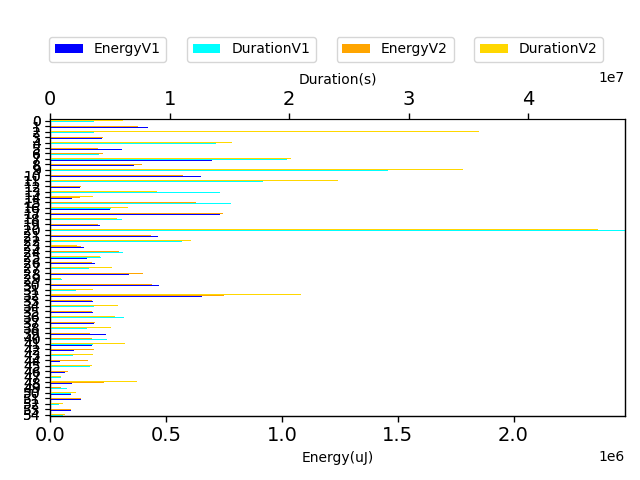

| Index | EnergyV1 | EnergyV2 | DeltaEnergy |
| --- | --- | --- | --- |
| 0 | 167510.3679828146 | 234112.61444047783 | 66602.24645766322 |
| 1 | 421891.79120801354 | 368242.6959559877 | -53649.095252025814 |
| 2 | 282666.4751961124 | 1137674.822520446 | 855008.3473243336 |
| 3 | 223792.9933203894 | 222899.76250134304 | -893.2308190463518 |
| 4 | 678376.3533984423 | 661378.9033697285 | -16997.450028713793 |
| 5 | 308608.97447584104 | 199209.7731189303 | -109399.20135691075 |
| 6 | 213132.04659297934 | 220985.78797771095 | 7853.741384731606 |
| 7 | 697529.0821813564 | 781130.1784289578 | 83601.09624760144 |
| 8 | 362105.49362561404 | 387760.99137790967 | 25655.497752295632 |
| 9 | 1300312.3794554973 | 1277187.450097515 | -23124.92935798224 |
| 10 | 651542.3150695811 | 561821.21136077 | -89721.1037088111 |
| 11 | 920709.6338201049 | 1037762.1410839802 | 117052.50726387533 |
| 12 | 128781.72926863127 | 129318.32185429995 | 536.5925856686808 |
| 13 | 529956.2872601291 | 428081.045743727 | -101875.24151640211 |
| 14 | 94317.89769099728 | 125074.42112425654 | 30756.52343325925 |
| 15 | 746325.2200362649 | 615767.7437899425 | -130557.47624632239 |
| 16 | 256252.64172247023 | 261245.43279563086 | 4992.791073160624 |
| 17 | 733706.4607631803 | 730480.91709566 | -3225.54366752028 |
| 18 | 269311.45334193064 | 212546.38294820336 | -56765.07039372728 |
| 19 | 213716.8213133683 | 201298.50023589685 | -12418.321077471453 |
| 20 | 2481243.7495137514 | 2308919.6680679293 | -172324.08144582203 |
| 21 | 462962.1026104001 | 423779.79184304574 | -39182.310767354385 |
| 22 | 454160.91122755385 | 467294.48316142627 | 13133.571933872416 |
| 23 | 144380.16406027862 | 128900.07226620085 | -15480.091794077773 |
| 24 | 307859.99751283217 | 289243.29764725827 | -18616.6998655739 |
| 25 | 159405.66143150482 | 154287.92096516874 | -5117.740466336079 |
| 26 | 192438.6683701154 | 176185.40725462913 | -16253.261115486268 |
| 27 | 143519.58713750308 | 163808.30414685066 | 20288.717009347572 |
| 28 | 341361.7807867713 | 392304.4287432735 | 50942.64795650216 |
| 29 | 44861.45729487173 | 46258.38973325567 | 1396.9324383839412 |
| 30 | 469493.9200560209 | 430419.06371847284 | -39074.85633754806 |
| 31 | 178183.45079621504 | 173008.76492695406 | -5174.685869260982 |
| 32 | 653461.9446068913 | 734848.8503606801 | 81386.90575378889 |
| 33 | 183087.21289851554 | 175002.76741806447 | -8084.445480451075 |
| 34 | 228470.76801917155 | 254057.77487714018 | 25587.006857968634 |
| 35 | 185594.40082431163 | 174839.37930538738 | -10755.021518924244 |
| 36 | 257933.94663778332 | 213290.62096455996 | -44643.32567322336 |
| 37 | 190777.38566019366 | 187914.18659121593 | -2863.1990689777303 |
| 38 | 180673.29591505002 | 228170.49258498603 | 47497.196669936005 |
| 39 | 240911.02230186953 | 168306.8656410121 | -72604.15666085744 |
| 40 | 195657.9822007314 | 174311.38064818375 | -21346.601552547654 |
| 41 | 178749.4481659691 | 212077.72166834242 | 33328.27350237331 |
| 42 | 100957.37657095029 | 183029.4474564834 | 82072.07088553312 |
| 43 | 90292.32123544789 | 139104.2075231743 | 48811.886287726404 |
| 44 | 42681.6342151165 | 157914.38292805105 | 115232.74871293455 |
| 45 | 140771.06692892505 | 163905.88628750318 | 23134.819358578126 |
| 46 | 63155.21303100776 | 73416.79348940199 | 10261.580458394223 |
| 47 | 40475.01144495634 | 44900.69101407063 | 4425.679569114291 |
| 48 | 92622.66970967739 | 228334.66916469682 | 135711.99945501942 |
| 49 | 67915.57651917769 | 44924.15323324649 | -22991.423285931196 |
| 50 | 90303.57304503224 | 101677.94189338193 | 11374.36884834968 |
| 51 | 133438.00297873144 | 129057.1883928284 | -4380.814585903048 |
| 52 | 41337.379863246926 | 42478.961861600874 | 1141.5819983539477 |
| 53 | 87726.52472361748 | 86644.22913205493 | -1082.2955915625498 |
| 54 | 49780.61676134993 | 40998.16630096961 | -8782.450460380314 |

| Index | DurationV1 | DurationsV2 | DeltaDuration |
| --- | --- | --- | --- |
| 0 | 3648519.1050168597 | 5639343.882025476 | 1990824.777008616 |
| 1 | 11829810.357721904 | 8082070.506756878 | -3747739.850965026 |
| 2 | 3628600.702589736 | 33058117.933753684 | 29429517.23116395 |
| 3 | 4676149.576355683 | 4141673.829820531 | -534475.7465351517 |
| 4 | 13862613.519905245 | 14022614.673773758 | 160001.15386851318 |
| 5 | 10034233.16862994 | 5779955.279069121 | -4254277.88956082 |
| 6 | 4054695.3792421576 | 4842122.636041626 | 787427.2567994688 |
| 7 | 19795459.474881284 | 18559593.130681224 | -1235866.3442000598 |
| 8 | 8618155.51875776 | 8843575.51564535 | 225419.99688758887 |
| 9 | 28231940.40019753 | 31869139.88867889 | 3637199.4884813614 |
| 10 | 13683986.265159003 | 12503225.350819878 | -1180760.9143391252 |
| 11 | 17777054.44883591 | 22197477.91469876 | 4420423.465862852 |
| 12 | 2776160.4442202174 | 2549486.496599559 | -226673.9476206582 |
| 13 | 14180933.126349287 | 8263892.245133287 | -5917040.881216 |
| 14 | 1941332.2722006384 | 3333362.123529429 | 1392029.8513287907 |
| 15 | 15097774.719421977 | 11896107.216471236 | -3201667.502950741 |
| 16 | 5098453.3510791045 | 5984628.848275546 | 886175.4971964415 |
| 17 | 12244740.034256645 | 11435377.07011391 | -809362.9641427342 |
| 18 | 5966195.582528571 | 5111410.977251096 | -854784.605277475 |
| 19 | 4116258.4191659302 | 4158241.893338033 | 41983.47417210275 |
| 20 | 48100287.788353294 | 42253120.00822392 | -5847167.780129373 |
| 21 | 11007044.060662057 | 7905920.457038335 | -3101123.6036237227 |
| 22 | 10985913.470534127 | 10831618.866630003 | -154294.60390412435 |
| 23 | 2496684.4906654623 | 2030394.8307097903 | -466289.659955672 |
| 24 | 6062072.886734833 | 5976125.825128616 | -85947.06160621718 |
| 25 | 4224958.915189954 | 3837052.9333357667 | -387905.9818541878 |
| 26 | 3883493.9451811 | 4639815.7044536695 | 756321.7592725693 |
| 27 | 3244377.931666134 | 4786226.498245159 | 1541848.5665790252 |
| 28 | 5560380.948970229 | 7097338.365082471 | 1536957.4161122413 |
| 29 | 947461.096679223 | 857681.9186629618 | -89779.1780162612 |
| 30 | 9673995.627316684 | 8572261.060223896 | -1101734.5670927875 |
| 31 | 2142663.3661205093 | 3333750.3894416075 | 1191087.0233210982 |
| 32 | 17163080.83404165 | 19374979.614546113 | 2211898.7805044614 |
| 33 | 2998420.651345661 | 3087039.920015144 | 88619.26866948325 |
| 34 | 3686523.758634465 | 5212379.604648335 | 1525855.84601387 |
| 35 | 4419857.691751698 | 4094067.9181889566 | -325789.77356274147 |
| 36 | 6190284.511938675 | 4973837.149893297 | -1216447.3620453784 |
| 37 | 3904758.9230182674 | 4355914.896553988 | 451155.97353572026 |
| 38 | 3046493.1682340316 | 4690090.556043036 | 1643597.3878090046 |
| 39 | 5063584.238122649 | 3533100.749663961 | -1530483.4884586874 |
| 40 | 4768228.792067928 | 2376454.105342413 | -2391774.6867255154 |
| 41 | 3605584.95469764 | 5772045.531857371 | 2166460.577159731 |
| 42 | 2883286.3404742386 | 4403127.174808295 | 1519840.8343340568 |
| 43 | 1905205.9042893609 | 3318272.7702175146 | 1413066.8659281537 |
| 44 | 415900.1627986431 | 5410279.6140525 | 4994379.4512538565 |
| 45 | 3342333.462128221 | 3198977.4288827935 | -143356.03324542753 |
| 46 | 1603385.5345019612 | 1720037.4749440956 | 116651.9404421344 |
| 47 | 861710.084468342 | 859419.5442413493 | -2290.5402269926853 |
| 48 | 1432933.9903940775 | 6674697.811326539 | 5241763.820932462 |
| 49 | 1403081.926305062 | 1187262.1971445791 | -215819.72916048276 |
| 50 | 1698670.619444897 | 1994334.9824191155 | 295664.36297421856 |
| 51 | 4229441.371285813 | 3480634.654988858 | -748806.716296955 |
| 52 | 688020.3083074293 | 1001515.8275314837 | 313495.5192240544 |
| 53 | 1504774.7022800208 | 1522800.2861300304 | 18025.5838500096 |
| 54 | 1103239.8400373557 | 1136164.1243812344 | 32924.28434387874 |
| Index | TestClassName | #Tests |
| --- | --- | --- |
| 0 | com.google.gson.functional.StreamingTypeAdaptersTest | 4 |
| 1 | com.google.gson.functional.JsonAdapterAnnotationOnClassesTest | 7 |
| 2 | com.google.gson.MixedStreamTest | 6 |
| 3 | com.google.gson.functional.JsonParserTest | 5 |
| 4 | com.google.gson.functional.CollectionTest | 15 |
| 5 | com.google.gson.functional.JsonAdapterSerializerDeserializerTest | 3 |
| 6 | com.google.gson.functional.ThrowableFunctionalTest | 5 |
| 7 | com.google.gson.functional.ParameterizedTypesTest | 15 |
| 8 | com.google.gson.internal.bind.RecursiveTypesResolveTest | 5 |
| 9 | com.google.gson.functional.DefaultTypeAdaptersTest | 13 |
| 10 | com.google.gson.functional.CircularReferenceTest | 5 |
| 11 | com.google.gson.functional.MapTest | 19 |
| 12 | com.google.gson.functional.ReadersWritersTest | 3 |
| 13 | com.google.gson.functional.ExposeFieldsTest | 8 |
| 14 | com.google.gson.functional.FieldExclusionTest | 2 |
| 15 | com.google.gson.functional.InheritanceTest | 13 |
| 16 | com.google.gson.functional.MoreSpecificTypeSerializationTest | 6 |
| 17 | com.google.gson.functional.NamingPolicyTest | 16 |
| 18 | com.google.gson.functional.CustomDeserializerTest | 5 |
| 19 | com.google.gson.functional.EnumTest | 4 |
| 20 | com.google.gson.functional.ObjectTest | 37 |
| 21 | com.google.gson.functional.VersioningTest | 8 |
| 22 | com.google.gson.functional.JsonAdapterAnnotationOnFieldsTest | 10 |
| 23 | com.google.gson.functional.SerializedNameTest | 3 |
| 24 | com.google.gson.functional.CustomTypeAdaptersTest | 7 |
| 25 | com.google.gson.functional.TypeVariableTest | 3 |
| 26 | com.google.gson.functional.ArrayTest | 4 |
| 27 | com.google.gson.functional.RuntimeTypeAdapterFactoryFunctionalTest | 1 |
| 28 | com.google.gson.functional.ExclusionStrategyFunctionalTest | 7 |
| 29 | com.google.gson.functional.JavaUtilConcurrentAtomicTest | 1 |
| 30 | com.google.gson.functional.NullObjectAndFieldTest | 10 |
| 31 | com.google.gson.functional.UncategorizedTest | 4 |
| 32 | com.google.gson.functional.ConcurrencyTest | 4 |
| 33 | com.google.gson.functional.EscapingTest | 4 |
| 34 | com.google.gson.functional.FieldNamingTest | 5 |
| 35 | com.google.gson.functional.InstanceCreatorTest | 3 |
| 36 | com.google.gson.functional.MapAsArrayTypeAdapterTest | 4 |
| 37 | com.google.gson.functional.RawSerializationTest | 4 |
| 38 | com.google.gson.functional.CustomSerializerTest | 4 |
| 39 | com.google.gson.functional.JsonTreeTest | 4 |
| 40 | com.google.gson.functional.SecurityTest | 4 |
| 41 | com.google.gson.functional.PrettyPrintingTest | 4 |
| 42 | com.google.gson.functional.TypeHierarchyAdapterTest | 1 |
| 43 | com.google.gson.regression.JsonAdapterNullSafeTest | 2 |
| 44 | com.google.gson.DefaultMapJsonSerializerTest | 1 |
| 45 | com.google.gson.functional.JavaUtilTest | 2 |
| 46 | com.google.gson.GsonTypeAdapterTest | 1 |
| 47 | com.google.gson.functional.PrintFormattingTest | 1 |
| 48 | com.google.gson.GsonBuilderTest | 2 |
| 49 | com.google.gson.functional.DelegateTypeAdapterTest | 1 |
| 50 | com.google.gson.ObjectTypeAdapterTest | 2 |
| 51 | com.google.gson.functional.TreeTypeAdaptersTest | 2 |
| 52 | com.google.gson.functional.PrimitiveTest | 1 |
| 53 | com.google.gson.functional.InterfaceTest | 2 |
| 54 | com.google.gson.JsonParserTest | 1 |
