# gson 844568

https://github.com/google/gson.git/commit/844568

| Index | EnergyV1 | EnergyV2 | DeltaEnergy |
| --- | --- | --- | --- |
| 0 | 133770.89979948653 | 131483.49923509144 | -2287.400564395095 |
| 1 | 482787.7236002396 | 603998.5059737464 | 121210.78237350681 |
| 2 | 2643315.893123708 | 2125882.8622190007 | -517433.0309047075 |
| 3 | 231877.10446601332 | 173744.67271601513 | -58132.431749998184 |
| 4 | 369051.7194269934 | 398101.9179819232 | 29050.19855492981 |
| 5 | 234838.94433800632 | 332510.4177538665 | 97671.47341586021 |
| 6 | 1056608.958575714 | 1493022.8292944669 | 436413.87071875297 |
| 7 | 366494.53440300486 | 298386.9869000963 | -68107.54750290856 |
| 8 | 1260193.3223125665 | 1231095.4930335805 | -29097.82927898597 |
| 9 | 204006.3203019065 | 243129.5880704391 | 39123.26776853259 |
| 10 | 343635.890100902 | 206935.4539084247 | -136700.4361924773 |
| 11 | 2179011.157792976 | 2196060.325112422 | 17049.16731944587 |
| 12 | 694107.3992088847 | 595562.4060844856 | -98544.9931243991 |
| 13 | 579262.4016795438 | 605113.4083823735 | 25851.006702829734 |
| 14 | 243681.7882492669 | 232915.24012905505 | -10766.548120211839 |
| 15 | 396102.4702956774 | 413243.07144163747 | 17140.60114596004 |
| 16 | 683244.0012023522 | 919186.7503037613 | 235942.7491014091 |
| 17 | 89083.61602826268 | 77426.4671136589 | -11657.148914603778 |
| 18 | 291818.6730177986 | 306840.2122339051 | 15021.539216106525 |
| 19 | 408081.5134575309 | 355658.15173101594 | -52423.36172651494 |
| 20 | 755271.2268144152 | 742100.4133278932 | -13170.813486521947 |
| 21 | 211282.3820764065 | 180497.454226353 | -30784.9278500535 |
| 22 | 89320.0645843059 | 362871.2469974026 | 273551.18241309666 |
| 23 | 587402.8299591538 | 454870.92794743535 | -132531.90201171843 |
| 24 | 152972.87436977765 | 145749.15562908773 | -7223.7187406899175 |
| 25 | 431768.16305238276 | 426013.9017812382 | -5754.2612711445545 |
| 26 | 161246.7311245686 | 129239.30499893858 | -32007.426125630038 |
| 27 | 335783.57537456707 | 354196.59514082904 | 18413.019766261976 |
| 28 | 214654.79453085922 | 229171.14927012075 | 14516.35473926153 |
| 29 | 222010.45721048402 | 228460.5576339244 | 6450.100423440395 |
| 30 | 218402.99272547 | 231743.40624427318 | 13340.413518803194 |
| 31 | 432814.6841333893 | 418967.88081974944 | -13846.803313639888 |
| 32 | 252949.4486370009 | 222626.09698548008 | -30323.351651520818 |
| 33 | 907856.6419530937 | 950016.1513907099 | 42159.509437616216 |
| 34 | 131016.36117907126 | 158904.8148031996 | 27888.45362412835 |
| 35 | 243093.21783870348 | 190847.09147413075 | -52246.12636457273 |
| 36 | 259334.14502261684 | 310899.3457328597 | 51565.20071024285 |
| 37 | 657373.191291235 | 779686.8802517119 | 122313.6889604769 |
| 38 | 206742.0152054057 | 170733.9037520694 | -36008.111453336314 |
| 39 | 216971.85497870966 | 241473.74804930255 | 24501.893070592894 |
| 40 | 129459.30243438354 | 132992.9686007096 | 3533.66616632606 |
| 41 | 85232.57053275374 | 90610.09456351647 | 5377.524030762725 |
| 42 | 106768.67190135943 | 151504.38327065506 | 44735.71136929563 |
| 43 | 331698.5295052412 | 371019.38630893093 | 39320.856803689734 |
| 44 | 108858.63365484835 | 181827.94301563452 | 72969.30936078617 |
| 45 | 112701.48812687573 | 115231.51994776295 | 2530.0318208872195 |
| 46 | 58019.32061726401 | 89099.41039744177 | 31080.089780177754 |
| 47 | 315234.9167231686 | 318614.8315639128 | 3379.9148407442262 |
| 48 | 279310.45585939975 | 174675.70947249504 | -104634.7463869047 |
| 49 | 92048.78186134942 | 87310.55882509523 | -4738.223036254189 |
| 50 | 166661.2544706326 | 151609.6927641231 | -15051.5617065095 |
| 51 | 48189.71243906962 | 46145.98114251326 | -2043.7312965563615 |
| 52 | 89028.1930980361 | 131995.51302452665 | 42967.31992649054 |
| 53 | 43597.613067471066 | 41837.44941176085 | -1760.1636557102174 |
| 54 | 130185.32017212594 | 195347.5855427506 | 65162.265370624664 |
| 55 | 43485.2908480457 | 47696.034000089974 | 4210.743152044277 |
| 56 | 89849.2291102376 | 46692.14517338831 | -43157.083936849296 |
| 57 | 48691.142950075286 | 47480.950447956144 | -1210.1925021191419 |

| Index | DurationV1 | DurationsV2 | DeltaDuration |
| --- | --- | --- | --- |
| 0 | 1870180.1909050706 | 2629776.5581690986 | 759596.3672640279 |
| 1 | 9242071.176398035 | 15841604.126184922 | 6599532.949786887 |
| 2 | 49256420.94555239 | 34096535.97815588 | -15159884.967396505 |
| 3 | 5177435.569728969 | 3986369.99829633 | -1191065.5714326384 |
| 4 | 7707473.157563279 | 7569167.35285895 | -138305.804704329 |
| 5 | 6040816.766053628 | 7815022.084781507 | 1774205.3187278789 |
| 6 | 24705207.262435343 | 29516235.5856937 | 4811028.323258355 |
| 7 | 9830503.97768168 | 4582510.936529308 | -5247993.041152372 |
| 8 | 24401375.42646342 | 20820658.315394633 | -3580717.111068789 |
| 9 | 5104241.736017592 | 6668272.777432574 | 1564031.0414149817 |
| 10 | 7900152.736982495 | 3855346.414621883 | -4044806.3223606115 |
| 11 | 38759594.847782254 | 42323189.086394295 | 3563594.238612041 |
| 12 | 13076229.26449224 | 8838173.22906376 | -4238056.035428479 |
| 13 | 11922315.732553756 | 15207513.021748725 | 3285197.2891949695 |
| 14 | 3959418.6126767723 | 4485725.827382309 | 526307.2147055371 |
| 15 | 6710732.133070418 | 7379422.609122674 | 668690.4760522563 |
| 16 | 12909210.834263366 | 18381978.05892234 | 5472767.2246589735 |
| 17 | 1238598.1113639353 | 1784360.1205402394 | 545762.0091763041 |
| 18 | 6576869.5934008565 | 7410374.916842397 | 833505.3234415408 |
| 19 | 8349205.266351365 | 7241647.612859128 | -1107557.6534922365 |
| 20 | 20045436.701219443 | 16102092.3533224 | -3943344.3478970435 |
| 21 | 4535030.929526806 | 2839722.079240267 | -1695308.8502865387 |
| 22 | 1428403.6572461661 | 10590150.414827766 | 9161746.757581599 |
| 23 | 17991596.418336846 | 11859271.75786525 | -6132324.660471596 |
| 24 | 3781203.858577747 | 3002909.585471702 | -778294.2731060451 |
| 25 | 7905431.008456009 | 8102954.335707093 | 197523.32725108322 |
| 26 | 4960106.474011973 | 3150010.1476065367 | -1810096.3264054358 |
| 27 | 6429075.227086385 | 7369929.233553074 | 940854.0064666895 |
| 28 | 3569312.158236527 | 4400016.675417346 | 830704.5171808191 |
| 29 | 3583481.8417180073 | 3228047.659299959 | -355434.1824180484 |
| 30 | 2917995.025002896 | 4319827.062534864 | 1401832.0375319682 |
| 31 | 6528043.236596849 | 6035760.862435257 | -492282.37416159175 |
| 32 | 5438310.6560133565 | 4783440.534620299 | -654870.1213930575 |
| 33 | 21594115.724322975 | 24307928.257545695 | 2713812.53322272 |
| 34 | 1872262.282351592 | 3395379.2837025137 | 1523117.0013509216 |
| 35 | 4548196.078882047 | 2840182.394241713 | -1708013.684640334 |
| 36 | 6493620.516842106 | 8739540.95094128 | 2245920.434099173 |
| 37 | 15440311.088028476 | 19293435.10132147 | 3853124.0132929944 |
| 38 | 4810560.377278126 | 2628551.1256283973 | -2182009.2516497285 |
| 39 | 3263518.721951056 | 5354833.904488824 | 2091315.1825377685 |
| 40 | 2155325.6455675904 | 1652303.304114764 | -503022.3414528263 |
| 41 | 1491858.3597067292 | 1566146.0126799094 | 74287.65297318017 |
| 42 | 2774921.779277252 | 3172173.024587514 | 397251.24531026185 |
| 43 | 5077934.30099323 | 7082108.953094636 | 2004174.652101406 |
| 44 | 2873788.1344966223 | 5634907.666614711 | 2761119.532118089 |
| 45 | 3655376.6527966075 | 4431832.465619783 | 776455.8128231755 |
| 46 | 1211616.3358013276 | 2615688.631724109 | 1404072.2959227813 |
| 47 | 7068154.380834032 | 6691678.86457117 | -376475.5162628619 |
| 48 | 5107443.5989967175 | 2307861.004477354 | -2799582.5945193633 |
| 49 | 1822870.0285991137 | 1603587.2755628254 | -219282.7530362883 |
| 50 | 3603068.555868604 | 3005086.5953995693 | -597981.960469035 |
| 51 | 1431950.1544379552 | 1217415.719700477 | -214534.43473747815 |
| 52 | 1364884.5997380558 | 2346286.279897271 | 981401.6801592153 |
| 53 | 752054.8821872859 | 1062201.9925131372 | 310147.11032585124 |
| 54 | 2044319.9848091416 | 3981670.4141892814 | 1937350.4293801398 |
| 55 | 789139.6948770087 | 1092320.1969343033 | 303180.5020572946 |
| 56 | 3618951.355111249 | 1151739.3322293726 | -2467212.022881876 |
| 57 | 1578037.0515220638 | 1103457.995152309 | -474579.0563697547 |

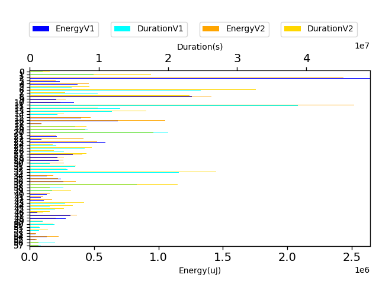

| Index | TestClassName | #Tests |
| --- | --- | --- |
| 0 | com.google.gson.functional.PrimitiveTest | 3 |
| 1 | com.google.gson.functional.CustomTypeAdaptersTest | 11 |
| 2 | com.google.gson.functional.ObjectTest | 38 |
| 3 | com.google.gson.functional.StreamingTypeAdaptersTest | 4 |
| 4 | com.google.gson.functional.JsonAdapterAnnotationOnClassesTest | 8 |
| 5 | com.google.gson.functional.CustomDeserializerTest | 5 |
| 6 | com.google.gson.functional.DefaultTypeAdaptersTest | 14 |
| 7 | com.google.gson.functional.JsonParserTest | 7 |
| 8 | com.google.gson.functional.CollectionTest | 28 |
| 9 | com.google.gson.functional.JsonAdapterSerializerDeserializerTest | 3 |
| 10 | com.google.gson.functional.ThrowableFunctionalTest | 5 |
| 11 | com.google.gson.functional.MapTest | 46 |
| 12 | com.google.gson.functional.NamingPolicyTest | 14 |
| 13 | com.google.gson.functional.CircularReferenceTest | 5 |
| 14 | com.google.gson.functional.ReadersWritersTest | 5 |
| 15 | com.google.gson.functional.ExposeFieldsTest | 8 |
| 16 | com.google.gson.functional.InheritanceTest | 13 |
| 17 | com.google.gson.GsonBuilderTest | 2 |
| 18 | com.google.gson.functional.MoreSpecificTypeSerializationTest | 6 |
| 19 | com.google.gson.functional.EnumTest | 8 |
| 20 | com.google.gson.functional.ParameterizedTypesTest | 15 |
| 21 | com.google.gson.functional.JsonTreeTest | 4 |
| 22 | com.google.gson.functional.FieldExclusionTest | 2 |
| 23 | com.google.gson.functional.JsonAdapterAnnotationOnFieldsTest | 10 |
| 24 | com.google.gson.functional.TypeVariableTest | 3 |
| 25 | com.google.gson.functional.VersioningTest | 8 |
| 26 | com.google.gson.functional.RuntimeTypeAdapterFactoryFunctionalTest | 1 |
| 27 | com.google.gson.functional.ExclusionStrategyFunctionalTest | 7 |
| 28 | com.google.gson.functional.PrettyPrintingTest | 5 |
| 29 | com.google.gson.functional.UncategorizedTest | 5 |
| 30 | com.google.gson.functional.FieldNamingTest | 5 |
| 31 | com.google.gson.functional.NullObjectAndFieldTest | 10 |
| 32 | com.google.gson.functional.RawSerializationTest | 5 |
| 33 | com.google.gson.JavaSerializationTest | 3 |
| 34 | com.google.gson.functional.SerializedNameTest | 3 |
| 35 | com.google.gson.functional.SecurityTest | 4 |
| 36 | com.google.gson.functional.MapAsArrayTypeAdapterTest | 5 |
| 37 | com.google.gson.functional.ConcurrencyTest | 4 |
| 38 | com.google.gson.functional.EscapingTest | 4 |
| 39 | com.google.gson.functional.ArrayTest | 5 |
| 40 | com.google.gson.DefaultMapJsonSerializerTest | 3 |
| 41 | com.google.gson.functional.InterfaceTest | 2 |
| 42 | com.google.gson.functional.TypeHierarchyAdapterTest | 1 |
| 43 | com.google.gson.MixedStreamTest | 8 |
| 44 | com.google.gson.functional.TreeTypeAdaptersTest | 2 |
| 45 | com.google.gson.GsonTypeAdapterTest | 1 |
| 46 | com.google.gson.functional.PrintFormattingTest | 1 |
| 47 | com.google.gson.internal.bind.RecursiveTypesResolveTest | 5 |
| 48 | com.google.gson.functional.CustomSerializerTest | 4 |
| 49 | com.google.gson.regression.JsonAdapterNullSafeTest | 2 |
| 50 | com.google.gson.functional.JavaUtilTest | 2 |
| 51 | com.google.gson.functional.DelegateTypeAdapterTest | 1 |
| 52 | com.google.gson.ObjectTypeAdapterTest | 2 |
| 53 | com.google.gson.JsonParserTest | 1 |
| 54 | com.google.gson.functional.InstanceCreatorTest | 3 |
| 55 | com.google.gson.CommentsTest | 1 |
| 56 | com.google.gson.functional.LeniencyTest | 1 |
| 57 | com.google.gson.functional.JavaUtilConcurrentAtomicTest | 1 |

| Time Label | Time (s) |
| --- | --- |
| Selection | 35.172659158706665 |
| Injection | 21.716394186019897 |
| Total | 1636.2546074390411 |
## com.google.gson.functional.PrimitiveTest

| Test | IterationV1 | IterationV2 | DeltaIteration |
| --- | --- | --- | --- |
| com.google.gson.functional.PrimitiveTest-testDeserializePrimitiveWrapperAsObjectField | 41 | 47 | 6 |
| com.google.gson.functional.PrimitiveTest-testStringsAsBooleans | 55 | 62 | 7 |
| com.google.gson.functional.PrimitiveTest-testMoreSpecificSerialization | 27 | 30 | 3 |

| Test | EnergyV1 | EnergyV2 | DeltaEnergy |
| --- | --- | --- | --- |
| com.google.gson.functional.PrimitiveTest-testDeserializePrimitiveWrapperAsObjectField | 44071.61451326094 | 43533.77719142048 | -537.8373218404595 |
| com.google.gson.functional.PrimitiveTest-testStringsAsBooleans | 44432.991820581476 | 44966.00039602096 | 533.0085754394822 |
| com.google.gson.functional.PrimitiveTest-testMoreSpecificSerialization | 45266.29346564412 | 42983.72164765 | -2282.5718179941177 |

| Test | DurationV1 | DurationsV2 | DeltaDuration |
| --- | --- | --- | --- |
| com.google.gson.functional.PrimitiveTest-testDeserializePrimitiveWrapperAsObjectField | 644732.5315238864 | 649389.4901553898 | 4656.958631503396 |
| com.google.gson.functional.PrimitiveTest-testStringsAsBooleans | 702268.9767966154 | 1401966.4536372735 | 699697.4768406581 |
| com.google.gson.functional.PrimitiveTest-testMoreSpecificSerialization | 523178.68258456886 | 578420.614376435 | 55241.9317918662 |

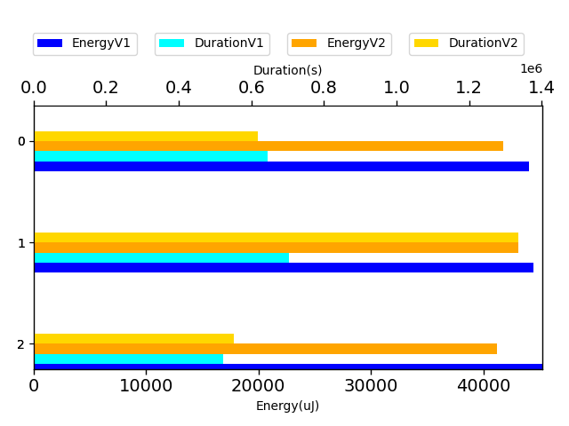

## com.google.gson.functional.CustomTypeAdaptersTest

| Test | IterationV1 | IterationV2 | DeltaIteration |
| --- | --- | --- | --- |
| com.google.gson.functional.CustomTypeAdaptersTest-testCustomAdapterInvokedForCollectionElementDeserialization | 45 | 60 | 15 |
| com.google.gson.functional.CustomTypeAdaptersTest-testCustomAdapterInvokedForMapElementDeserialization | 51 | 54 | 3 |
| com.google.gson.functional.CustomTypeAdaptersTest-testCustomAdapterInvokedForMapElementSerializationWithType | 50 | 55 | 5 |
| com.google.gson.functional.CustomTypeAdaptersTest-testCustomTypeAdapterDoesNotAppliesToSubClasses | 94 | 89 | -5 |
| com.google.gson.functional.CustomTypeAdaptersTest-testCustomAdapterInvokedForCollectionElementSerializationWithType | 83 | 83 | 0 |
| com.google.gson.functional.CustomTypeAdaptersTest-testEnsureCustomSerializerNotInvokedForNullValues | 74 | 77 | 3 |
| com.google.gson.functional.CustomTypeAdaptersTest-testEnsureCustomDeserializerNotInvokedForNullValues | 56 | 66 | 10 |
| com.google.gson.functional.CustomTypeAdaptersTest-testCustomNestedSerializers | 61 | 63 | 2 |
| com.google.gson.functional.CustomTypeAdaptersTest-testCustomNestedDeserializers | 54 | 57 | 3 |
| com.google.gson.functional.CustomTypeAdaptersTest-testCustomAdapterInvokedForCollectionElementSerialization | 27 | 34 | 7 |
| com.google.gson.functional.CustomTypeAdaptersTest-testCustomAdapterInvokedForMapElementSerialization | 16 | 17 | 1 |

| Test | EnergyV1 | EnergyV2 | DeltaEnergy |
| --- | --- | --- | --- |
| com.google.gson.functional.CustomTypeAdaptersTest-testCustomAdapterInvokedForCollectionElementDeserialization | 42784.512491122645 | 41156.31746551687 | -1628.1950256057753 |
| com.google.gson.functional.CustomTypeAdaptersTest-testCustomAdapterInvokedForMapElementDeserialization | 61242.14510453332 | 41150.333716529654 | -20091.81138800367 |
| com.google.gson.functional.CustomTypeAdaptersTest-testCustomAdapterInvokedForMapElementSerializationWithType | 42196.45461431838 | 42972.63625922835 | 776.1816449099642 |
| com.google.gson.functional.CustomTypeAdaptersTest-testCustomTypeAdapterDoesNotAppliesToSubClasses | 41997.0497691436 | 44692.480344217256 | 2695.430575073653 |
| com.google.gson.functional.CustomTypeAdaptersTest-testCustomAdapterInvokedForCollectionElementSerializationWithType | 40800.14336468332 | 62928.89532297469 | 22128.751958291374 |
| com.google.gson.functional.CustomTypeAdaptersTest-testEnsureCustomSerializerNotInvokedForNullValues | 43062.647259823745 | 39296.94172550776 | -3765.705534315988 |
| com.google.gson.functional.CustomTypeAdaptersTest-testEnsureCustomDeserializerNotInvokedForNullValues | 44575.535153943085 | 158951.5980304725 | 114376.06287652941 |
| com.google.gson.functional.CustomTypeAdaptersTest-testCustomNestedSerializers | 41734.20538335478 | 50096.570671818714 | 8362.36528846393 |
| com.google.gson.functional.CustomTypeAdaptersTest-testCustomNestedDeserializers | 41866.99479580134 | 40666.749364356365 | -1200.2454314449787 |
| com.google.gson.functional.CustomTypeAdaptersTest-testCustomAdapterInvokedForCollectionElementSerialization | 41193.34843817353 | 38277.297831425094 | -2916.0506067484384 |
| com.google.gson.functional.CustomTypeAdaptersTest-testCustomAdapterInvokedForMapElementSerialization | 41334.6872253418 | 43808.68524169922 | 2473.998016357422 |

| Test | DurationV1 | DurationsV2 | DeltaDuration |
| --- | --- | --- | --- |
| com.google.gson.functional.CustomTypeAdaptersTest-testCustomAdapterInvokedForCollectionElementDeserialization | 901830.6351463052 | 1270566.3626708316 | 368735.7275245264 |
| com.google.gson.functional.CustomTypeAdaptersTest-testCustomAdapterInvokedForMapElementDeserialization | 1299539.5341190798 | 788895.9984738368 | -510643.535645243 |
| com.google.gson.functional.CustomTypeAdaptersTest-testCustomAdapterInvokedForMapElementSerializationWithType | 668177.6914406609 | 917778.8014805571 | 249601.11003989622 |
| com.google.gson.functional.CustomTypeAdaptersTest-testCustomTypeAdapterDoesNotAppliesToSubClasses | 1059754.968542917 | 1765429.006766242 | 705674.038223325 |
| com.google.gson.functional.CustomTypeAdaptersTest-testCustomAdapterInvokedForCollectionElementSerializationWithType | 995686.0447265368 | 1580703.514039585 | 585017.4693130481 |
| com.google.gson.functional.CustomTypeAdaptersTest-testEnsureCustomSerializerNotInvokedForNullValues | 1122697.7242830358 | 1338387.1579724005 | 215689.4336893647 |
| com.google.gson.functional.CustomTypeAdaptersTest-testEnsureCustomDeserializerNotInvokedForNullValues | 716690.2709031864 | 4453039.533609901 | 3736349.262706714 |
| com.google.gson.functional.CustomTypeAdaptersTest-testCustomNestedSerializers | 803102.0295678182 | 1468020.9803971248 | 664918.9508293066 |
| com.google.gson.functional.CustomTypeAdaptersTest-testCustomNestedDeserializers | 752706.655733261 | 1170878.9687914501 | 418172.3130581891 |
| com.google.gson.functional.CustomTypeAdaptersTest-testCustomAdapterInvokedForCollectionElementSerialization | 406811.94197307527 | 625150.5691186134 | 218338.6271455381 |
| com.google.gson.functional.CustomTypeAdaptersTest-testCustomAdapterInvokedForMapElementSerialization | 515073.6799621582 | 462753.2328643799 | -52320.44709777832 |

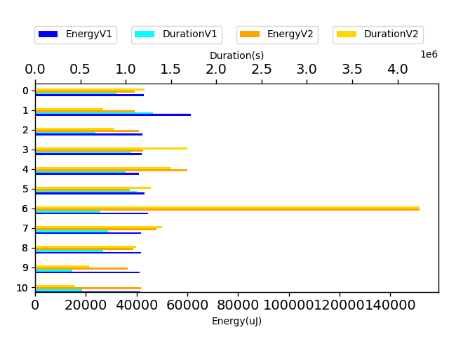

## com.google.gson.functional.ObjectTest

| Test | IterationV1 | IterationV2 | DeltaIteration |
| --- | --- | --- | --- |
| com.google.gson.functional.ObjectTest-testStringFieldWithEmptyValueDeserialization | 19 | 24 | 5 |
| com.google.gson.functional.ObjectTest-testEmptyCollectionInAnObjectDeserialization | 58 | 53 | -5 |
| com.google.gson.functional.ObjectTest-testNestedSerialization | 37 | 35 | -2 |
| com.google.gson.functional.ObjectTest-testArrayOfArraysDeserialization | 47 | 44 | -3 |
| com.google.gson.functional.ObjectTest-testSingletonLists | 85 | 89 | 4 |
| com.google.gson.functional.ObjectTest-testClassWithNoFieldsDeserialization | 22 | 14 | -8 |
| com.google.gson.functional.ObjectTest-testStringFieldWithNumberValueDeserialization | 29 | 20 | -9 |
| com.google.gson.functional.ObjectTest-testPrivateNoArgConstructorDeserialization | 47 | 42 | -5 |
| com.google.gson.functional.ObjectTest-testArrayOfObjectsAsFields | 60 | 62 | 2 |
| com.google.gson.functional.ObjectTest-testClassWithTransientFieldsDeserializationTransientFieldsPassedInJsonAreIgnored | 19 | 18 | -1 |
| com.google.gson.functional.ObjectTest-testDateAsMapObjectField | 99 | 99 | 0 |
| com.google.gson.functional.ObjectTest-testClassWithNoFieldsSerialization | 20 | 25 | 5 |
| com.google.gson.functional.ObjectTest-testStringFieldWithEmptyValueSerialization | 51 | 43 | -8 |
| com.google.gson.functional.ObjectTest-testEmptyCollectionInAnObjectSerialization | 26 | 18 | -8 |
| com.google.gson.functional.ObjectTest-testClassWithObjectFieldSerialization | 42 | 40 | -2 |
| com.google.gson.functional.ObjectTest-testBagOfPrimitiveWrappersSerialization | 37 | 43 | 6 |
| com.google.gson.functional.ObjectTest-testTruncatedDeserialization | 48 | 57 | 9 |
| com.google.gson.functional.ObjectTest-testArrayOfArraysSerialization | 77 | 77 | 0 |
| com.google.gson.functional.ObjectTest-testBagOfPrimitivesSerialization | 18 | 25 | 7 |
| com.google.gson.functional.ObjectTest-testBagOfPrimitiveWrappersDeserialization | 39 | 34 | -5 |
| com.google.gson.functional.ObjectTest-testJsonInMixedQuotesDeserialization | 19 | 28 | 9 |
| com.google.gson.functional.ObjectTest-testArrayOfObjectsSerialization | 40 | 37 | -3 |
| com.google.gson.functional.ObjectTest-testClassWithTransientFieldsSerialization | 37 | 31 | -6 |
| com.google.gson.functional.ObjectTest-testNullPrimitiveFieldsDeserialization | 22 | 20 | -2 |
| com.google.gson.functional.ObjectTest-testBagOfPrimitivesDeserialization | 26 | 29 | 3 |
| com.google.gson.functional.ObjectTest-testInnerClassDeserialization | 53 | 49 | -4 |
| com.google.gson.functional.ObjectTest-testJsonInSingleQuotesDeserialization | 29 | 26 | -3 |
| com.google.gson.functional.ObjectTest-testNullFieldsDeserialization | 36 | 28 | -8 |
| com.google.gson.functional.ObjectTest-testNullObjectFieldsDeserialization | 20 | 20 | 0 |
| com.google.gson.functional.ObjectTest-testInnerClassSerialization | 62 | 57 | -5 |
| com.google.gson.functional.ObjectTest-testNestedDeserialization | 30 | 28 | -2 |
| com.google.gson.functional.ObjectTest-testNullFieldsSerialization | 21 | 28 | 7 |
| com.google.gson.functional.ObjectTest-testObjectFieldNamesWithoutQuotesDeserialization | 25 | 20 | -5 |
| com.google.gson.functional.ObjectTest-testArrayOfObjectsDeserialization | 29 | 35 | 6 |
| com.google.gson.functional.ObjectTest-testClassWithTransientFieldsDeserialization | 20 | 33 | 13 |
| com.google.gson.functional.ObjectTest-testPrimitiveArrayInAnObjectDeserialization | 31 | 25 | -6 |
| com.google.gson.functional.ObjectTest-testNullArraysDeserialization | 23 | 28 | 5 |
| com.google.gson.functional.ObjectTest-testPrimitiveArrayFieldSerialization | 19 | 27 | 8 |

| Test | EnergyV1 | EnergyV2 | DeltaEnergy |
| --- | --- | --- | --- |
| com.google.gson.functional.ObjectTest-testStringFieldWithEmptyValueDeserialization | 42960.48372268677 | 40867.26660621166 | -2093.2171164751053 |
| com.google.gson.functional.ObjectTest-testEmptyCollectionInAnObjectDeserialization | 46197.868350637684 | 41566.95524361935 | -4630.913107018336 |
| com.google.gson.functional.ObjectTest-testNestedSerialization | 43826.11429685109 | 40952.85632843734 | -2873.2579684137527 |
| com.google.gson.functional.ObjectTest-testArrayOfArraysDeserialization | 42964.51573055785 | 43274.81505479853 | 310.299324240681 |
| com.google.gson.functional.ObjectTest-testSingletonLists | 48715.18193977862 | 40595.3957125168 | -8119.786227261815 |
| com.google.gson.functional.ObjectTest-testClassWithNoFieldsDeserialization | 43277.36352062225 | 42602.56066894531 | -674.8028516769409 |
| com.google.gson.functional.ObjectTest-testStringFieldWithNumberValueDeserialization | 41006.702566353604 | 42611.64135932922 | 1604.9387929756194 |
| com.google.gson.functional.ObjectTest-testPrivateNoArgConstructorDeserialization | 46828.37043950223 | 40690.36560726511 | -6138.004832237122 |
| com.google.gson.functional.ObjectTest-testArrayOfObjectsAsFields | 43892.39633407626 | 44616.11345809269 | 723.7171240164316 |
| com.google.gson.functional.ObjectTest-testClassWithTransientFieldsDeserializationTransientFieldsPassedInJsonAreIgnored | 41150.67951774597 | 42678.55806732178 | 1527.8785495758057 |
| com.google.gson.functional.ObjectTest-testDateAsMapObjectField | 1000200.1888259749 | 567661.1934174448 | -432538.9954085301 |
| com.google.gson.functional.ObjectTest-testClassWithNoFieldsSerialization | 42741.5093870163 | 41337.79405713081 | -1403.7153298854828 |
| com.google.gson.functional.ObjectTest-testStringFieldWithEmptyValueSerialization | 40561.342085490076 | 41574.34439489749 | 1013.0023094074131 |
| com.google.gson.functional.ObjectTest-testEmptyCollectionInAnObjectSerialization | 44346.16794964671 | 41255.43753814697 | -3090.7304114997387 |
| com.google.gson.functional.ObjectTest-testClassWithObjectFieldSerialization | 45733.503911283704 | 40614.65829778982 | -5118.845613493882 |
| com.google.gson.functional.ObjectTest-testBagOfPrimitiveWrappersSerialization | 59587.13670681396 | 43438.97549028102 | -16148.161216532942 |
| com.google.gson.functional.ObjectTest-testTruncatedDeserialization | 50516.04654249384 | 43223.386515930535 | -7292.660026563302 |
| com.google.gson.functional.ObjectTest-testArrayOfArraysSerialization | 42733.53363765681 | 43456.38553411553 | 722.8518964587201 |
| com.google.gson.functional.ObjectTest-testBagOfPrimitivesSerialization | 41858.49491882324 | 41414.589435994625 | -443.9054828286171 |
| com.google.gson.functional.ObjectTest-testBagOfPrimitiveWrappersDeserialization | 68349.94507286481 | 43476.736957252724 | -24873.208115612084 |
| com.google.gson.functional.ObjectTest-testJsonInMixedQuotesDeserialization | 44486.624908447266 | 43391.1848276183 | -1095.4400808289647 |
| com.google.gson.functional.ObjectTest-testArrayOfObjectsSerialization | 45199.20095595573 | 42702.65598370755 | -2496.544972248179 |
| com.google.gson.functional.ObjectTest-testClassWithTransientFieldsSerialization | 42893.27719214553 | 44968.57857305277 | 2075.3013809072436 |
| com.google.gson.functional.ObjectTest-testNullPrimitiveFieldsDeserialization | 41700.38776445389 | 43451.093269348145 | 1750.7055048942566 |
| com.google.gson.functional.ObjectTest-testBagOfPrimitivesDeserialization | 41237.13614483178 | 40480.59360769391 | -756.542537137866 |
| com.google.gson.functional.ObjectTest-testInnerClassDeserialization | 42227.09317312121 | 41265.47488763826 | -961.6182854829531 |
| com.google.gson.functional.ObjectTest-testJsonInSingleQuotesDeserialization | 38947.504782605916 | 40769.6890206635 | 1822.1842380575836 |
| com.google.gson.functional.ObjectTest-testNullFieldsDeserialization | 43816.24528327302 | 42568.55744796246 | -1247.6878353105567 |
| com.google.gson.functional.ObjectTest-testNullObjectFieldsDeserialization | 43684.63112258911 | 42388.09114456177 | -1296.5399780273438 |
| com.google.gson.functional.ObjectTest-testInnerClassSerialization | 42113.83945908131 | 43377.66012739458 | 1263.8206683132667 |
| com.google.gson.functional.ObjectTest-testNestedDeserialization | 44081.67337398045 | 42866.17845642939 | -1215.4949175510556 |
| com.google.gson.functional.ObjectTest-testNullFieldsSerialization | 40842.48125267029 | 41172.99358664453 | 330.5123339742422 |
| com.google.gson.functional.ObjectTest-testObjectFieldNamesWithoutQuotesDeserialization | 41997.75735425949 | 40698.411766052246 | -1299.3455882072449 |
| com.google.gson.functional.ObjectTest-testArrayOfObjectsDeserialization | 42125.66877038777 | 40982.84740025265 | -1142.8213701351197 |
| com.google.gson.functional.ObjectTest-testClassWithTransientFieldsDeserialization | 42883.55351638794 | 41517.77827585745 | -1365.7752405304927 |
| com.google.gson.functional.ObjectTest-testPrimitiveArrayInAnObjectDeserialization | 42955.318427154794 | 43428.351213395596 | 473.0327862408012 |
| com.google.gson.functional.ObjectTest-testNullArraysDeserialization | 41653.32227706909 | 40021.798704609275 | -1631.523572459817 |
| com.google.gson.functional.ObjectTest-testPrimitiveArrayFieldSerialization | 43022.63190841675 | 41920.894180595875 | -1101.7377278208733 |

| Test | DurationV1 | DurationsV2 | DeltaDuration |
| --- | --- | --- | --- |
| com.google.gson.functional.ObjectTest-testStringFieldWithEmptyValueDeserialization | 430962.3874835968 | 428685.2179220319 | -2277.1695615649223 |
| com.google.gson.functional.ObjectTest-testEmptyCollectionInAnObjectDeserialization | 858204.4630179724 | 734202.0481222495 | -124002.41489572288 |
| com.google.gson.functional.ObjectTest-testNestedSerialization | 617895.9700614222 | 565653.3135424764 | -52242.65651894582 |
| com.google.gson.functional.ObjectTest-testArrayOfArraysDeserialization | 863098.806803778 | 662073.6258458986 | -201025.1809578794 |
| com.google.gson.functional.ObjectTest-testSingletonLists | 1111233.3248953237 | 1167594.5482977722 | 56361.223402448464 |
| com.google.gson.functional.ObjectTest-testClassWithNoFieldsDeserialization | 375760.22560477257 | 416161.92248535156 | 40401.696880578995 |
| com.google.gson.functional.ObjectTest-testStringFieldWithNumberValueDeserialization | 474021.40022242256 | 440644.65851306915 | -33376.7417093534 |
| com.google.gson.functional.ObjectTest-testPrivateNoArgConstructorDeserialization | 677392.8693943737 | 691720.5618175596 | 14327.692423185916 |
| com.google.gson.functional.ObjectTest-testArrayOfObjectsAsFields | 700400.2209649526 | 642563.7543688214 | -57836.46659613121 |
| com.google.gson.functional.ObjectTest-testClassWithTransientFieldsDeserializationTransientFieldsPassedInJsonAreIgnored | 450962.998626709 | 463220.7238845825 | 12257.725257873535 |
| com.google.gson.functional.ObjectTest-testDateAsMapObjectField | 23336011.67776008 | 13469335.282733843 | -9866676.395026237 |
| com.google.gson.functional.ObjectTest-testClassWithNoFieldsSerialization | 620313.2528057098 | 397275.7585467696 | -223037.49425894022 |
| com.google.gson.functional.ObjectTest-testStringFieldWithEmptyValueSerialization | 672168.3806169119 | 706911.3239718584 | 34742.943354946445 |
| com.google.gson.functional.ObjectTest-testEmptyCollectionInAnObjectSerialization | 473727.5242026001 | 541233.4555740356 | 67505.93137143552 |
| com.google.gson.functional.ObjectTest-testClassWithObjectFieldSerialization | 647748.5455376842 | 640687.4413578531 | -7061.104179831105 |
| com.google.gson.functional.ObjectTest-testBagOfPrimitiveWrappersSerialization | 1342106.750723079 | 619179.5984688217 | -722927.1522542574 |
| com.google.gson.functional.ObjectTest-testTruncatedDeserialization | 1080745.8086369901 | 790725.5842873738 | -290020.2243496163 |
| com.google.gson.functional.ObjectTest-testArrayOfArraysSerialization | 946599.5276775833 | 907273.8649672157 | -39325.662710367586 |
| com.google.gson.functional.ObjectTest-testBagOfPrimitivesSerialization | 612669.0452766418 | 424455.3687889576 | -188213.67648768425 |
| com.google.gson.functional.ObjectTest-testBagOfPrimitiveWrappersDeserialization | 1488683.3640438702 | 561637.788449009 | -927045.5755948613 |
| com.google.gson.functional.ObjectTest-testJsonInMixedQuotesDeserialization | 522431.8338851929 | 428377.7362065166 | -94054.09767867625 |
| com.google.gson.functional.ObjectTest-testArrayOfObjectsSerialization | 895115.4500852181 | 541486.0771909987 | -353629.37289421936 |
| com.google.gson.functional.ObjectTest-testClassWithTransientFieldsSerialization | 728048.5398247715 | 587961.8909323448 | -140086.64889242663 |
| com.google.gson.functional.ObjectTest-testNullPrimitiveFieldsDeserialization | 497478.4203901291 | 482801.75789260864 | -14676.662497520447 |
| com.google.gson.functional.ObjectTest-testBagOfPrimitivesDeserialization | 420629.37546910346 | 417923.6013445221 | -2705.774124581367 |
| com.google.gson.functional.ObjectTest-testInnerClassDeserialization | 860323.0561204305 | 628480.1999520895 | -231842.856168341 |
| com.google.gson.functional.ObjectTest-testJsonInSingleQuotesDeserialization | 798538.6991138533 | 475753.05671325326 | -322785.6424006 |
| com.google.gson.functional.ObjectTest-testNullFieldsDeserialization | 473294.98508710106 | 467821.6341493875 | -5473.350937713578 |
| com.google.gson.functional.ObjectTest-testNullObjectFieldsDeserialization | 463150.65269851685 | 434950.59862327576 | -28200.05407524109 |
| com.google.gson.functional.ObjectTest-testInnerClassSerialization | 909738.6479600553 | 769793.9644097233 | -139944.68355033197 |
| com.google.gson.functional.ObjectTest-testNestedDeserialization | 507664.5548037309 | 508596.2835270427 | 931.7287233117968 |
| com.google.gson.functional.ObjectTest-testNullFieldsSerialization | 1138578.326169014 | 455755.60380174965 | -682822.7223672643 |
| com.google.gson.functional.ObjectTest-testObjectFieldNamesWithoutQuotesDeserialization | 449943.68201994896 | 408592.1553993225 | -41351.52662062645 |
| com.google.gson.functional.ObjectTest-testArrayOfObjectsDeserialization | 731071.3465475999 | 494968.43295915937 | -236102.9135884405 |
| com.google.gson.functional.ObjectTest-testClassWithTransientFieldsDeserialization | 443863.1201400757 | 431997.1179836198 | -11866.002156455885 |
| com.google.gson.functional.ObjectTest-testPrimitiveArrayInAnObjectDeserialization | 723356.9008903 | 486492.29917913675 | -236864.6017111633 |
| com.google.gson.functional.ObjectTest-testNullArraysDeserialization | 518162.9299402237 | 406796.5127113685 | -111366.41722885519 |
| com.google.gson.functional.ObjectTest-testPrimitiveArrayFieldSerialization | 394323.8800506592 | 396751.213234216 | 2427.333183556795 |

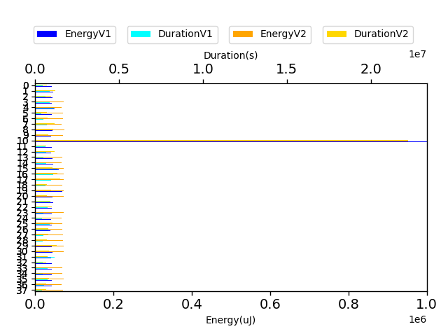

## com.google.gson.functional.StreamingTypeAdaptersTest

| Test | IterationV1 | IterationV2 | DeltaIteration |
| --- | --- | --- | --- |
| com.google.gson.functional.StreamingTypeAdaptersTest-testNullSafe | 72 | 74 | 2 |
| com.google.gson.functional.StreamingTypeAdaptersTest-testSerializeWithCustomTypeAdapter | 88 | 86 | -2 |
| com.google.gson.functional.StreamingTypeAdaptersTest-testSerializeRecursive | 48 | 54 | 6 |
| com.google.gson.functional.StreamingTypeAdaptersTest-testDeserializeWithCustomTypeAdapter | 42 | 41 | -1 |

| Test | EnergyV1 | EnergyV2 | DeltaEnergy |
| --- | --- | --- | --- |
| com.google.gson.functional.StreamingTypeAdaptersTest-testNullSafe | 81177.33732880247 | 48267.32160253375 | -32910.01572626872 |
| com.google.gson.functional.StreamingTypeAdaptersTest-testSerializeWithCustomTypeAdapter | 62843.11226126414 | 41516.9379813074 | -21326.174279956744 |
| com.google.gson.functional.StreamingTypeAdaptersTest-testSerializeRecursive | 43570.39900185227 | 42380.877198413815 | -1189.5218034384525 |
| com.google.gson.functional.StreamingTypeAdaptersTest-testDeserializeWithCustomTypeAdapter | 44286.25587409442 | 41579.535933760155 | -2706.7199403342674 |

| Test | DurationV1 | DurationsV2 | DeltaDuration |
| --- | --- | --- | --- |
| com.google.gson.functional.StreamingTypeAdaptersTest-testNullSafe | 2134518.3244455704 | 1206811.7381022368 | -927706.5863433336 |
| com.google.gson.functional.StreamingTypeAdaptersTest-testSerializeWithCustomTypeAdapter | 1461326.8265260377 | 1257420.5598040265 | -203906.26672201115 |
| com.google.gson.functional.StreamingTypeAdaptersTest-testSerializeRecursive | 786212.1615305389 | 726894.5178690958 | -59317.643661443144 |
| com.google.gson.functional.StreamingTypeAdaptersTest-testDeserializeWithCustomTypeAdapter | 795378.2572268214 | 795243.182520971 | -135.07470585033298 |

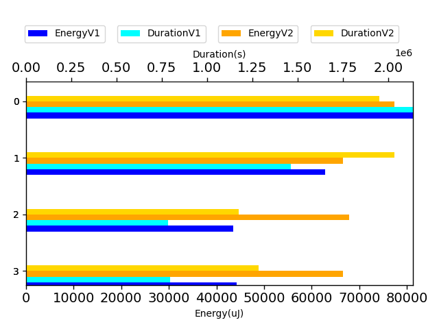

## com.google.gson.functional.JsonAdapterAnnotationOnClassesTest

| Test | IterationV1 | IterationV2 | DeltaIteration |
| --- | --- | --- | --- |
| com.google.gson.functional.JsonAdapterAnnotationOnClassesTest-testJsonAdapterInvoked | 99 | 99 | 0 |
| com.google.gson.functional.JsonAdapterAnnotationOnClassesTest-testIncorrectTypeAdapterFails | 50 | 58 | 8 |
| com.google.gson.functional.JsonAdapterAnnotationOnClassesTest-testJsonAdapterFactoryInvoked | 81 | 82 | 1 |
| com.google.gson.functional.JsonAdapterAnnotationOnClassesTest-testSuperclassTypeAdapterNotInvoked | 48 | 52 | 4 |
| com.google.gson.functional.JsonAdapterAnnotationOnClassesTest-testIncorrectJsonAdapterType | 56 | 50 | -6 |
| com.google.gson.functional.JsonAdapterAnnotationOnClassesTest-testRegisteredSerializerOverridesJsonAdapter | 57 | 50 | -7 |
| com.google.gson.functional.JsonAdapterAnnotationOnClassesTest-testNullSafeObjectFromJson | 63 | 60 | -3 |
| com.google.gson.functional.JsonAdapterAnnotationOnClassesTest-testRegisteredDeserializerOverridesJsonAdapter | 42 | 46 | 4 |

| Test | EnergyV1 | EnergyV2 | DeltaEnergy |
| --- | --- | --- | --- |
| com.google.gson.functional.JsonAdapterAnnotationOnClassesTest-testJsonAdapterInvoked | 77202.7156632429 | 88538.67328400597 | 11335.957620763074 |
| com.google.gson.functional.JsonAdapterAnnotationOnClassesTest-testIncorrectTypeAdapterFails | 42626.74968131258 | 42643.93604352407 | 17.186362211483356 |
| com.google.gson.functional.JsonAdapterAnnotationOnClassesTest-testJsonAdapterFactoryInvoked | 43470.85243519496 | 46317.25678498691 | 2846.4043497919483 |
| com.google.gson.functional.JsonAdapterAnnotationOnClassesTest-testSuperclassTypeAdapterNotInvoked | 41462.52694301141 | 42980.648396142074 | 1518.1214531306614 |
| com.google.gson.functional.JsonAdapterAnnotationOnClassesTest-testIncorrectJsonAdapterType | 42164.77147528469 | 44116.26405097127 | 1951.492575686585 |
| com.google.gson.functional.JsonAdapterAnnotationOnClassesTest-testRegisteredSerializerOverridesJsonAdapter | 43297.62776544418 | 46522.941441865856 | 3225.313676421676 |
| com.google.gson.functional.JsonAdapterAnnotationOnClassesTest-testNullSafeObjectFromJson | 39201.43152662169 | 42550.39383642739 | 3348.9623098057054 |
| com.google.gson.functional.JsonAdapterAnnotationOnClassesTest-testRegisteredDeserializerOverridesJsonAdapter | 39625.043936881004 | 44431.80414399972 | 4806.760207118714 |

| Test | DurationV1 | DurationsV2 | DeltaDuration |
| --- | --- | --- | --- |
| com.google.gson.functional.JsonAdapterAnnotationOnClassesTest-testJsonAdapterInvoked | 2204899.7068948937 | 2159212.248745855 | -45687.45814903872 |
| com.google.gson.functional.JsonAdapterAnnotationOnClassesTest-testIncorrectTypeAdapterFails | 769101.7876251223 | 757568.4978984036 | -11533.289726718795 |
| com.google.gson.functional.JsonAdapterAnnotationOnClassesTest-testJsonAdapterFactoryInvoked | 1023391.0982866401 | 1012584.3051646446 | -10806.79312199552 |
| com.google.gson.functional.JsonAdapterAnnotationOnClassesTest-testSuperclassTypeAdapterNotInvoked | 688583.690951852 | 627729.4810391194 | -60854.20991273259 |
| com.google.gson.functional.JsonAdapterAnnotationOnClassesTest-testIncorrectJsonAdapterType | 888730.4099443008 | 780019.2101235137 | -108711.19982078706 |
| com.google.gson.functional.JsonAdapterAnnotationOnClassesTest-testRegisteredSerializerOverridesJsonAdapter | 708094.9434437084 | 784426.2583161306 | 76331.31487242226 |
| com.google.gson.functional.JsonAdapterAnnotationOnClassesTest-testNullSafeObjectFromJson | 810162.4098513112 | 802944.5887383686 | -7217.821112942649 |
| com.google.gson.functional.JsonAdapterAnnotationOnClassesTest-testRegisteredDeserializerOverridesJsonAdapter | 614509.110565451 | 644682.7628329145 | 30173.652267463505 |

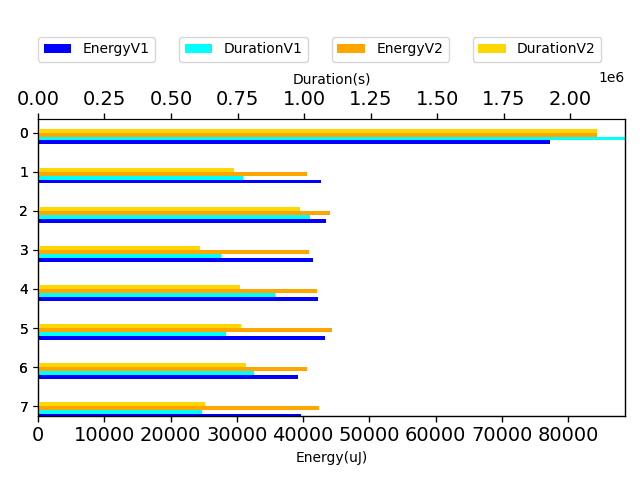

## com.google.gson.functional.CustomDeserializerTest

| Test | IterationV1 | IterationV2 | DeltaIteration |
| --- | --- | --- | --- |
| com.google.gson.functional.CustomDeserializerTest-testDefaultConstructorNotCalledOnField | 55 | 47 | -8 |
| com.google.gson.functional.CustomDeserializerTest-testCustomDeserializerReturnsNullForArrayElementsForArrayField | 63 | 67 | 4 |
| com.google.gson.functional.CustomDeserializerTest-testJsonTypeFieldBasedDeserialization | 99 | 99 | 0 |
| com.google.gson.functional.CustomDeserializerTest-testDefaultConstructorNotCalledOnObject | 29 | 40 | 11 |
| com.google.gson.functional.CustomDeserializerTest-testCustomDeserializerReturnsNull | 59 | 53 | -6 |

| Test | EnergyV1 | EnergyV2 | DeltaEnergy |
| --- | --- | --- | --- |
| com.google.gson.functional.CustomDeserializerTest-testDefaultConstructorNotCalledOnField | 39505.982697495274 | 40751.78425500096 | 1245.8015575056852 |
| com.google.gson.functional.CustomDeserializerTest-testCustomDeserializerReturnsNullForArrayElementsForArrayField | 42810.422320118734 | 45520.84724997409 | 2710.424929855355 |
| com.google.gson.functional.CustomDeserializerTest-testJsonTypeFieldBasedDeserialization | 51520.49388816778 | 66938.37931455209 | 15417.88542638431 |
| com.google.gson.functional.CustomDeserializerTest-testDefaultConstructorNotCalledOnObject | 42415.70732123777 | 59210.5195856516 | 16794.812264413828 |
| com.google.gson.functional.CustomDeserializerTest-testCustomDeserializerReturnsNull | 58586.338110986755 | 120088.8873486878 | 61502.549237701045 |

| Test | DurationV1 | DurationsV2 | DeltaDuration |
| --- | --- | --- | --- |
| com.google.gson.functional.CustomDeserializerTest-testDefaultConstructorNotCalledOnField | 757701.541785205 | 723183.79042301 | -34517.751362195006 |
| com.google.gson.functional.CustomDeserializerTest-testCustomDeserializerReturnsNullForArrayElementsForArrayField | 1396816.2815372588 | 896995.3428872008 | -499820.938650058 |
| com.google.gson.functional.CustomDeserializerTest-testJsonTypeFieldBasedDeserialization | 1686242.8168708922 | 1444790.0952385617 | -241452.72163233045 |
| com.google.gson.functional.CustomDeserializerTest-testDefaultConstructorNotCalledOnObject | 696555.6248056218 | 1317267.8629344478 | 620712.238128826 |
| com.google.gson.functional.CustomDeserializerTest-testCustomDeserializerReturnsNull | 1503500.5010546506 | 3432784.993298287 | 1929284.4922436364 |

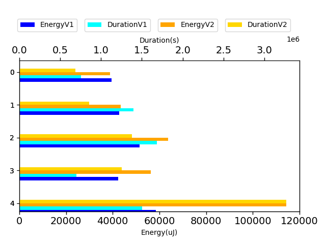

## com.google.gson.functional.DefaultTypeAdaptersTest

| Test | IterationV1 | IterationV2 | DeltaIteration |
| --- | --- | --- | --- |
| com.google.gson.functional.DefaultTypeAdaptersTest-testTreeSetDeserialization | 53 | 45 | -8 |
| com.google.gson.functional.DefaultTypeAdaptersTest-testBadValueForBigDecimalDeserialization | 42 | 45 | 3 |
| com.google.gson.functional.DefaultTypeAdaptersTest-testUrlNullSerialization | 57 | 66 | 9 |
| com.google.gson.functional.DefaultTypeAdaptersTest-testNullSerialization | 99 | 99 | 0 |
| com.google.gson.functional.DefaultTypeAdaptersTest-testDateSerializationInCollection | 99 | 99 | 0 |
| com.google.gson.functional.DefaultTypeAdaptersTest-testBigIntegerFieldSerialization | 89 | 93 | 4 |
| com.google.gson.functional.DefaultTypeAdaptersTest-testBigIntegerFieldDeserialization | 34 | 31 | -3 |
| com.google.gson.functional.DefaultTypeAdaptersTest-testBigDecimalFieldSerialization | 87 | 82 | -5 |
| com.google.gson.functional.DefaultTypeAdaptersTest-testTreeSetSerialization | 49 | 45 | -4 |
| com.google.gson.functional.DefaultTypeAdaptersTest-testSetSerialization | 26 | 29 | 3 |
| com.google.gson.functional.DefaultTypeAdaptersTest-testBigDecimalFieldDeserialization | 29 | 34 | 5 |
| com.google.gson.functional.DefaultTypeAdaptersTest-testUrlNullDeserialization | 20 | 20 | 0 |
| com.google.gson.functional.DefaultTypeAdaptersTest-testPropertiesDeserialization | 18 | 21 | 3 |
| com.google.gson.functional.DefaultTypeAdaptersTest-testPropertiesSerialization | 14 | 17 | 3 |

| Test | EnergyV1 | EnergyV2 | DeltaEnergy |
| --- | --- | --- | --- |
| com.google.gson.functional.DefaultTypeAdaptersTest-testTreeSetDeserialization | 42999.13275469261 | 40161.74541309502 | -2837.3873415975904 |
| com.google.gson.functional.DefaultTypeAdaptersTest-testBadValueForBigDecimalDeserialization | 39625.747229184155 | 44547.878562127225 | 4922.13133294307 |
| com.google.gson.functional.DefaultTypeAdaptersTest-testUrlNullSerialization | 42809.305422911755 | 41456.64065059295 | -1352.664772318807 |
| com.google.gson.functional.DefaultTypeAdaptersTest-testNullSerialization | 464758.36008917325 | 884206.9327644879 | 419448.5726753147 |
| com.google.gson.functional.DefaultTypeAdaptersTest-testDateSerializationInCollection | 53035.161817958084 | 81771.04977470226 | 28735.887956744176 |
| com.google.gson.functional.DefaultTypeAdaptersTest-testBigIntegerFieldSerialization | 49460.47225307065 | 50415.188436341225 | 954.7161832705751 |
| com.google.gson.functional.DefaultTypeAdaptersTest-testBigIntegerFieldDeserialization | 40924.55266594631 | 41909.822724700905 | 985.2700587545987 |
| com.google.gson.functional.DefaultTypeAdaptersTest-testBigDecimalFieldSerialization | 49513.41290188742 | 46829.751152985235 | -2683.6617489021883 |
| com.google.gson.functional.DefaultTypeAdaptersTest-testTreeSetSerialization | 42570.65653546575 | 42403.856614585486 | -166.79992088026484 |
| com.google.gson.functional.DefaultTypeAdaptersTest-testSetSerialization | 44991.65403094888 | 44469.71469761059 | -521.9393333382905 |
| com.google.gson.functional.DefaultTypeAdaptersTest-testBigDecimalFieldDeserialization | 58784.19975100085 | 45382.83490994567 | -13401.364841055183 |
| com.google.gson.functional.DefaultTypeAdaptersTest-testUrlNullDeserialization | 41940.571044921875 | 43451.542430877686 | 1510.9713859558105 |
| com.google.gson.functional.DefaultTypeAdaptersTest-testPropertiesDeserialization | 41621.80556488037 | 41095.41387176514 | -526.3916931152344 |
| com.google.gson.functional.DefaultTypeAdaptersTest-testPropertiesSerialization | 43573.926513671875 | 44920.457290649414 | 1346.530776977539 |

| Test | DurationV1 | DurationsV2 | DeltaDuration |
| --- | --- | --- | --- |
| com.google.gson.functional.DefaultTypeAdaptersTest-testTreeSetDeserialization | 644518.8659906095 | 659524.8058168392 | 15005.939826229704 |
| com.google.gson.functional.DefaultTypeAdaptersTest-testBadValueForBigDecimalDeserialization | 801624.0741678646 | 799171.224491774 | -2452.849676090642 |
| com.google.gson.functional.DefaultTypeAdaptersTest-testUrlNullSerialization | 888504.8434874824 | 785367.6210329692 | -103137.22245451319 |
| com.google.gson.functional.DefaultTypeAdaptersTest-testNullSerialization | 11902861.404074064 | 19738825.233425926 | 7835963.829351863 |
| com.google.gson.functional.DefaultTypeAdaptersTest-testDateSerializationInCollection | 1794665.4757146724 | 1788983.841041221 | -5681.634673451306 |
| com.google.gson.functional.DefaultTypeAdaptersTest-testBigIntegerFieldSerialization | 1333788.978155099 | 1180108.8796755197 | -153680.09847957944 |
| com.google.gson.functional.DefaultTypeAdaptersTest-testBigIntegerFieldDeserialization | 628985.9408271392 | 473336.3988417601 | -155649.54198537907 |
| com.google.gson.functional.DefaultTypeAdaptersTest-testBigDecimalFieldSerialization | 1872213.6485273354 | 994000.4921941312 | -878213.1563332041 |
| com.google.gson.functional.DefaultTypeAdaptersTest-testTreeSetSerialization | 1409979.764548528 | 844472.2285749413 | -565507.5359735867 |
| com.google.gson.functional.DefaultTypeAdaptersTest-testSetSerialization | 446748.0412634015 | 578295.8885648921 | 131547.8473014906 |
| com.google.gson.functional.DefaultTypeAdaptersTest-testBigDecimalFieldDeserialization | 1588051.177190531 | 499940.7928459452 | -1088110.3843445857 |
| com.google.gson.functional.DefaultTypeAdaptersTest-testUrlNullDeserialization | 409037.67515945435 | 385185.0095653534 | -23852.665594100952 |
| com.google.gson.functional.DefaultTypeAdaptersTest-testPropertiesDeserialization | 367675.63443756104 | 374846.5117549896 | 7170.877317428589 |
| com.google.gson.functional.DefaultTypeAdaptersTest-testPropertiesSerialization | 616551.7388916016 | 414176.65786743164 | -202375.08102416992 |

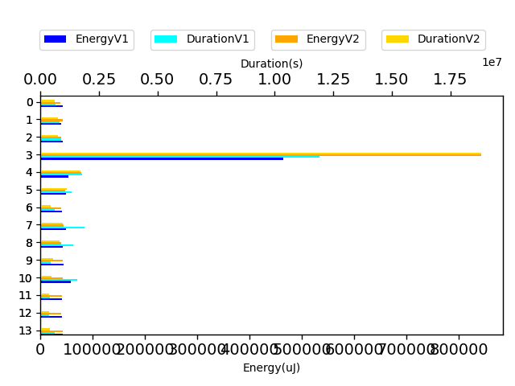

## com.google.gson.functional.JsonParserTest

| Test | IterationV1 | IterationV2 | DeltaIteration |
| --- | --- | --- | --- |
| com.google.gson.functional.JsonParserTest-testBadTypeForDeserializingCustomTree | 39 | 31 | -8 |
| com.google.gson.functional.JsonParserTest-testExtraCommasInArrays | 59 | 59 | 0 |
| com.google.gson.functional.JsonParserTest-testChangingCustomTreeAndDeserializing | 55 | 39 | -16 |
| com.google.gson.functional.JsonParserTest-testExtraCommasInMaps | 66 | 57 | -9 |
| com.google.gson.functional.JsonParserTest-testBadFieldTypeForCustomDeserializerCustomTree | 35 | 27 | -8 |
| com.google.gson.functional.JsonParserTest-testDeserializingCustomTree | 46 | 30 | -16 |
| com.google.gson.functional.JsonParserTest-testBadFieldTypeForDeserializingCustomTree | 34 | 33 | -1 |

| Test | EnergyV1 | EnergyV2 | DeltaEnergy |
| --- | --- | --- | --- |
| com.google.gson.functional.JsonParserTest-testBadTypeForDeserializingCustomTree | 41951.04618090304 | 41396.76016795542 | -554.2860129476176 |
| com.google.gson.functional.JsonParserTest-testExtraCommasInArrays | 42033.02402553748 | 42307.57806433647 | 274.5540387989895 |
| com.google.gson.functional.JsonParserTest-testChangingCustomTreeAndDeserializing | 45553.79468980295 | 42024.99556387062 | -3528.7991259323244 |
| com.google.gson.functional.JsonParserTest-testExtraCommasInMaps | 44158.83814401759 | 42211.72079806678 | -1947.1173459508063 |
| com.google.gson.functional.JsonParserTest-testBadFieldTypeForCustomDeserializerCustomTree | 42637.31229016761 | 43134.4254270792 | 497.1131369115901 |
| com.google.gson.functional.JsonParserTest-testDeserializingCustomTree | 105277.05125949545 | 45928.801500320435 | -59348.249759175014 |
| com.google.gson.functional.JsonParserTest-testBadFieldTypeForDeserializingCustomTree | 44883.46781308076 | 41382.70537846733 | -3500.7624346134253 |

| Test | DurationV1 | DurationsV2 | DeltaDuration |
| --- | --- | --- | --- |
| com.google.gson.functional.JsonParserTest-testBadTypeForDeserializingCustomTree | 694351.356068716 | 595475.1725435723 | -98876.18352514377 |
| com.google.gson.functional.JsonParserTest-testExtraCommasInArrays | 929583.7633992208 | 1040696.0790903093 | 111112.31569108856 |
| com.google.gson.functional.JsonParserTest-testChangingCustomTreeAndDeserializing | 1100680.9219078873 | 722475.404758988 | -378205.5171488994 |
| com.google.gson.functional.JsonParserTest-testExtraCommasInMaps | 817129.5624493824 | 700968.9997724729 | -116160.5626769095 |
| com.google.gson.functional.JsonParserTest-testBadFieldTypeForCustomDeserializerCustomTree | 438729.49897731416 | 433462.562775895 | -5266.936201419157 |
| com.google.gson.functional.JsonParserTest-testDeserializingCustomTree | 2336827.2684211982 | 567470.8721538102 | -1769356.396267388 |
| com.google.gson.functional.JsonParserTest-testBadFieldTypeForDeserializingCustomTree | 3513201.60645796 | 521961.84543426 | -2991239.7610237 |

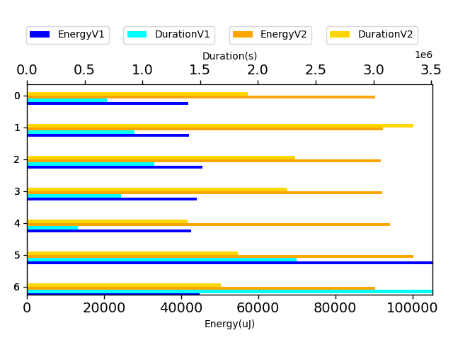

## com.google.gson.functional.CollectionTest

| Test | IterationV1 | IterationV2 | DeltaIteration |
| --- | --- | --- | --- |
| com.google.gson.functional.CollectionTest-testCollectionOfObjectSerialization | 50 | 51 | 1 |
| com.google.gson.functional.CollectionTest-testPriorityQueue | 98 | 97 | -1 |
| com.google.gson.functional.CollectionTest-testIssue1107 | 86 | 86 | 0 |
| com.google.gson.functional.CollectionTest-testWildcardPrimitiveCollectionSerilaization | 68 | 60 | -8 |
| com.google.gson.functional.CollectionTest-testWildcardPrimitiveCollectionDeserilaization | 40 | 49 | 9 |
| com.google.gson.functional.CollectionTest-testQueueSerialization | 54 | 57 | 3 |
| com.google.gson.functional.CollectionTest-testWildcardCollectionField | 71 | 79 | 8 |
| com.google.gson.functional.CollectionTest-testSetSerialization | 50 | 59 | 9 |
| com.google.gson.functional.CollectionTest-testTopLevelListOfIntegerCollectionsDeserialization | 50 | 53 | 3 |
| com.google.gson.functional.CollectionTest-testRawCollectionDeserializationNotAlllowed | 54 | 58 | 4 |
| com.google.gson.functional.CollectionTest-testNullsInListDeserialization | 46 | 38 | -8 |
| com.google.gson.functional.CollectionTest-testStack | 97 | 96 | -1 |
| com.google.gson.functional.CollectionTest-testRawCollectionOfBagOfPrimitivesNotAllowed | 46 | 44 | -2 |
| com.google.gson.functional.CollectionTest-testFieldIsArrayList | 58 | 59 | 1 |
| com.google.gson.functional.CollectionTest-testCollectionOfStringsDeserialization | 34 | 60 | 26 |
| com.google.gson.functional.CollectionTest-testTopLevelCollectionOfIntegersDeserialization | 61 | 49 | -12 |
| com.google.gson.functional.CollectionTest-testSetDeserialization | 68 | 66 | -2 |
| com.google.gson.functional.CollectionTest-testTopLevelCollectionOfIntegersSerialization | 50 | 47 | -3 |
| com.google.gson.functional.CollectionTest-testLinkedListSerialization | 54 | 54 | 0 |
| com.google.gson.functional.CollectionTest-testRawCollectionSerialization | 34 | 29 | -5 |
| com.google.gson.functional.CollectionTest-testNullsInListSerialization | 43 | 44 | 1 |
| com.google.gson.functional.CollectionTest-testQueueDeserialization | 45 | 43 | -2 |
| com.google.gson.functional.CollectionTest-testCollectionOfBagOfPrimitivesSerialization | 40 | 36 | -4 |
| com.google.gson.functional.CollectionTest-testLinkedListDeserialization | 49 | 32 | -17 |
| com.google.gson.functional.CollectionTest-testCollectionOfObjectWithNullSerialization | 43 | 48 | 5 |
| com.google.gson.functional.CollectionTest-testVector | 54 | 62 | 8 |
| com.google.gson.functional.CollectionTest-testRawCollectionOfIntegersSerialization | 19 | 22 | 3 |
| com.google.gson.functional.CollectionTest-testCollectionOfStringsSerialization | 12 | 16 | 4 |

| Test | EnergyV1 | EnergyV2 | DeltaEnergy |
| --- | --- | --- | --- |
| com.google.gson.functional.CollectionTest-testCollectionOfObjectSerialization | 41618.67447272045 | 44671.24734742919 | 3052.5728747087414 |
| com.google.gson.functional.CollectionTest-testPriorityQueue | 46248.87281552746 | 51290.86058075965 | 5041.987765232188 |
| com.google.gson.functional.CollectionTest-testIssue1107 | 46074.306739816864 | 44337.09150553496 | -1737.2152342819027 |
| com.google.gson.functional.CollectionTest-testWildcardPrimitiveCollectionSerilaization | 72933.55862098993 | 41523.47808316291 | -31410.080537827023 |
| com.google.gson.functional.CollectionTest-testWildcardPrimitiveCollectionDeserilaization | 45273.34403487364 | 42104.359637248985 | -3168.9843976246557 |
| com.google.gson.functional.CollectionTest-testQueueSerialization | 42740.2822718214 | 44271.51636454693 | 1531.2340927255282 |
| com.google.gson.functional.CollectionTest-testWildcardCollectionField | 41655.35294825639 | 43320.581894527975 | 1665.2289462715853 |
| com.google.gson.functional.CollectionTest-testSetSerialization | 47479.61118882886 | 44947.29198057958 | -2532.319208249275 |
| com.google.gson.functional.CollectionTest-testTopLevelListOfIntegerCollectionsDeserialization | 43036.054283048914 | 44719.980452663156 | 1683.926169614242 |
| com.google.gson.functional.CollectionTest-testRawCollectionDeserializationNotAlllowed | 44494.16001646675 | 45194.003622292745 | 699.8436058259977 |
| com.google.gson.functional.CollectionTest-testNullsInListDeserialization | 44516.548529059844 | 42333.47009016607 | -2183.0784388937755 |
| com.google.gson.functional.CollectionTest-testStack | 44777.52604035821 | 43734.81204669815 | -1042.713993660058 |
| com.google.gson.functional.CollectionTest-testRawCollectionOfBagOfPrimitivesNotAllowed | 44431.3769006075 | 44567.35522121392 | 135.97832060641667 |
| com.google.gson.functional.CollectionTest-testFieldIsArrayList | 41838.01949601909 | 44449.15070434446 | 2611.131208325365 |
| com.google.gson.functional.CollectionTest-testCollectionOfStringsDeserialization | 43557.21460631315 | 45393.715281400524 | 1836.5006750873727 |
| com.google.gson.functional.CollectionTest-testTopLevelCollectionOfIntegersDeserialization | 43514.9654034142 | 42349.470234329856 | -1165.4951690843445 |
| com.google.gson.functional.CollectionTest-testSetDeserialization | 48264.38539626698 | 44921.24739915227 | -3343.1379971147107 |
| com.google.gson.functional.CollectionTest-testTopLevelCollectionOfIntegersSerialization | 43204.4671580031 | 43213.0276294901 | 8.560471486998722 |
| com.google.gson.functional.CollectionTest-testLinkedListSerialization | 44131.16204091635 | 43629.68370177808 | -501.47833913827344 |
| com.google.gson.functional.CollectionTest-testRawCollectionSerialization | 44367.180378551944 | 44022.02743021771 | -345.15294833423104 |
| com.google.gson.functional.CollectionTest-testNullsInListSerialization | 43460.48016887987 | 43520.46270061382 | 59.982531733949145 |
| com.google.gson.functional.CollectionTest-testQueueDeserialization | 44326.71259899137 | 41760.742819844716 | -2565.9697791466533 |
| com.google.gson.functional.CollectionTest-testCollectionOfBagOfPrimitivesSerialization | 42191.9588672671 | 43313.16996255028 | 1121.211095283179 |
| com.google.gson.functional.CollectionTest-testLinkedListDeserialization | 43002.07733323747 | 43089.67847499228 | 87.60114175481431 |
| com.google.gson.functional.CollectionTest-testCollectionOfObjectWithNullSerialization | 44771.363613043795 | 43015.95797502604 | -1755.4056380177572 |
| com.google.gson.functional.CollectionTest-testVector | 41225.20283108894 | 45057.15674655857 | 3831.953915469632 |
| com.google.gson.functional.CollectionTest-testRawCollectionOfIntegersSerialization | 45069.32928085327 | 43786.475393772125 | -1282.8538870811462 |
| com.google.gson.functional.CollectionTest-testCollectionOfStringsSerialization | 41989.13427734375 | 42557.47775268555 | 568.3434753417969 |

| Test | DurationV1 | DurationsV2 | DeltaDuration |
| --- | --- | --- | --- |
| com.google.gson.functional.CollectionTest-testCollectionOfObjectSerialization | 752668.2675061165 | 671248.8332202941 | -81419.43428582244 |
| com.google.gson.functional.CollectionTest-testPriorityQueue | 1374581.6312173891 | 1244421.080818484 | -130160.55039890506 |
| com.google.gson.functional.CollectionTest-testIssue1107 | 1469613.6458090302 | 1135298.9033246995 | -334314.74248433067 |
| com.google.gson.functional.CollectionTest-testWildcardPrimitiveCollectionSerilaization | 1240414.5209080155 | 999159.4369227753 | -241255.0839852402 |
| com.google.gson.functional.CollectionTest-testWildcardPrimitiveCollectionDeserilaization | 742383.5355424802 | 624437.743339972 | -117945.7922025082 |
| com.google.gson.functional.CollectionTest-testQueueSerialization | 782727.7101267922 | 764131.167992702 | -18596.54213409021 |
| com.google.gson.functional.CollectionTest-testWildcardCollectionField | 1090020.622977305 | 1040716.7354917611 | -49303.88748554385 |
| com.google.gson.functional.CollectionTest-testSetSerialization | 1190906.4807921015 | 909248.5186008362 | -281657.9621912653 |
| com.google.gson.functional.CollectionTest-testTopLevelListOfIntegerCollectionsDeserialization | 687430.313732198 | 659201.5659796358 | -28228.747752562165 |
| com.google.gson.functional.CollectionTest-testRawCollectionDeserializationNotAlllowed | 891282.4933145789 | 715147.3866481975 | -176135.10666638135 |
| com.google.gson.functional.CollectionTest-testNullsInListDeserialization | 634213.8902471315 | 576187.9100363324 | -58025.980210799025 |
| com.google.gson.functional.CollectionTest-testStack | 1240233.5167592254 | 1235881.074893018 | -4352.441866207402 |
| com.google.gson.functional.CollectionTest-testRawCollectionOfBagOfPrimitivesNotAllowed | 642780.808265799 | 635768.5131327407 | -7012.295133058215 |
| com.google.gson.functional.CollectionTest-testFieldIsArrayList | 676607.1146331688 | 715588.2808250842 | 38981.1661919154 |
| com.google.gson.functional.CollectionTest-testCollectionOfStringsDeserialization | 689322.6222888038 | 660027.7920896488 | -29294.830199155025 |
| com.google.gson.functional.CollectionTest-testTopLevelCollectionOfIntegersDeserialization | 866791.891391722 | 862708.8253528317 | -4083.066038890276 |
| com.google.gson.functional.CollectionTest-testSetDeserialization | 1436291.892338325 | 828060.6294567938 | -608231.2628815313 |
| com.google.gson.functional.CollectionTest-testTopLevelCollectionOfIntegersSerialization | 839112.2259701652 | 630521.2956042297 | -208590.93036593555 |
| com.google.gson.functional.CollectionTest-testLinkedListSerialization | 758510.2795080172 | 711973.9996616662 | -46536.27984635101 |
| com.google.gson.functional.CollectionTest-testRawCollectionSerialization | 661438.2934220573 | 479167.9378070943 | -182270.355614963 |
| com.google.gson.functional.CollectionTest-testNullsInListSerialization | 710831.6622831598 | 596756.3494595074 | -114075.3128236524 |
| com.google.gson.functional.CollectionTest-testQueueDeserialization | 704620.0731890622 | 605711.0563485066 | -98909.01684055559 |
| com.google.gson.functional.CollectionTest-testCollectionOfBagOfPrimitivesSerialization | 979563.5319788277 | 539758.3567080662 | -439805.1752707615 |
| com.google.gson.functional.CollectionTest-testLinkedListDeserialization | 615620.514336325 | 619114.3267660358 | 3493.812429710757 |
| com.google.gson.functional.CollectionTest-testCollectionOfObjectWithNullSerialization | 872064.0445189024 | 668028.9013011609 | -204035.1432177415 |
| com.google.gson.functional.CollectionTest-testVector | 897468.8313789829 | 761066.5207271423 | -136402.31065184053 |
| com.google.gson.functional.CollectionTest-testRawCollectionOfIntegersSerialization | 498516.063785553 | 529495.8541903496 | 30979.7904047966 |
| com.google.gson.functional.CollectionTest-testCollectionOfStringsSerialization | 455358.9482421875 | 401829.31869506836 | -53529.62954711914 |

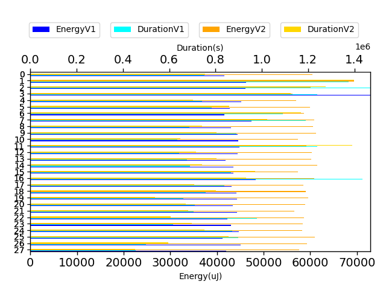

## com.google.gson.functional.JsonAdapterSerializerDeserializerTest

| Test | IterationV1 | IterationV2 | DeltaIteration |
| --- | --- | --- | --- |
| com.google.gson.functional.JsonAdapterSerializerDeserializerTest-testJsonSerializerDeserializerBasedJsonAdapterOnFields | 99 | 99 | 0 |
| com.google.gson.functional.JsonAdapterSerializerDeserializerTest-testDifferentJsonAdaptersForGenericFieldsOfSameRawType | 99 | 99 | 0 |
| com.google.gson.functional.JsonAdapterSerializerDeserializerTest-testJsonSerializerDeserializerBasedJsonAdapterOnClass | 92 | 92 | 0 |

| Test | EnergyV1 | EnergyV2 | DeltaEnergy |
| --- | --- | --- | --- |
| com.google.gson.functional.JsonAdapterSerializerDeserializerTest-testJsonSerializerDeserializerBasedJsonAdapterOnFields | 105224.2615766633 | 142815.87093093645 | 37591.609354273154 |
| com.google.gson.functional.JsonAdapterSerializerDeserializerTest-testDifferentJsonAdaptersForGenericFieldsOfSameRawType | 57043.534527453434 | 58903.5496427005 | 1860.0151152470644 |
| com.google.gson.functional.JsonAdapterSerializerDeserializerTest-testJsonSerializerDeserializerBasedJsonAdapterOnClass | 41738.5241977898 | 41410.16749680214 | -328.35670098765695 |

| Test | DurationV1 | DurationsV2 | DeltaDuration |
| --- | --- | --- | --- |
| com.google.gson.functional.JsonAdapterSerializerDeserializerTest-testJsonSerializerDeserializerBasedJsonAdapterOnFields | 2172584.9585294505 | 3878528.5131771667 | 1705943.5546477162 |
| com.google.gson.functional.JsonAdapterSerializerDeserializerTest-testDifferentJsonAdaptersForGenericFieldsOfSameRawType | 1604516.6944158282 | 1542943.7079314014 | -61572.98648442677 |
| com.google.gson.functional.JsonAdapterSerializerDeserializerTest-testJsonSerializerDeserializerBasedJsonAdapterOnClass | 1327140.083072314 | 1246800.5563240056 | -80339.52674830845 |

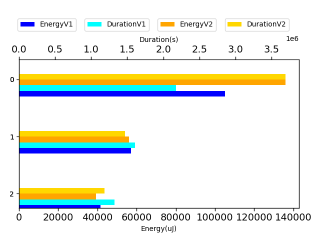

## com.google.gson.functional.ThrowableFunctionalTest

| Test | IterationV1 | IterationV2 | DeltaIteration |
| --- | --- | --- | --- |
| com.google.gson.functional.ThrowableFunctionalTest-testExceptionWithoutCause | 71 | 71 | 0 |
| com.google.gson.functional.ThrowableFunctionalTest-testSerializedNameOnExceptionFields | 84 | 85 | 1 |
| com.google.gson.functional.ThrowableFunctionalTest-testErrorWithoutCause | 52 | 58 | 6 |
| com.google.gson.functional.ThrowableFunctionalTest-testExceptionWithCause | 70 | 58 | -12 |
| com.google.gson.functional.ThrowableFunctionalTest-testErrornWithCause | 68 | 49 | -19 |

| Test | EnergyV1 | EnergyV2 | DeltaEnergy |
| --- | --- | --- | --- |
| com.google.gson.functional.ThrowableFunctionalTest-testExceptionWithoutCause | 119783.32480934834 | 41649.06879050038 | -78134.25601884795 |
| com.google.gson.functional.ThrowableFunctionalTest-testSerializedNameOnExceptionFields | 96016.3752470671 | 41378.74863727909 | -54637.626609788014 |
| com.google.gson.functional.ThrowableFunctionalTest-testErrorWithoutCause | 41234.31982622257 | 40680.40152138192 | -553.9183048406485 |
| com.google.gson.functional.ThrowableFunctionalTest-testExceptionWithCause | 43162.89546082805 | 40940.23795916733 | -2222.6575016607167 |
| com.google.gson.functional.ThrowableFunctionalTest-testErrornWithCause | 43438.97475743592 | 42286.997000095995 | -1151.977757339926 |

| Test | DurationV1 | DurationsV2 | DeltaDuration |
| --- | --- | --- | --- |
| com.google.gson.functional.ThrowableFunctionalTest-testExceptionWithoutCause | 2839753.874402445 | 776519.6722446769 | -2063234.202157768 |
| com.google.gson.functional.ThrowableFunctionalTest-testSerializedNameOnExceptionFields | 2081955.1443649104 | 942518.1022854026 | -1139437.0420795078 |
| com.google.gson.functional.ThrowableFunctionalTest-testErrorWithoutCause | 813253.0877177966 | 631864.2620647635 | -181388.8256530331 |
| com.google.gson.functional.ThrowableFunctionalTest-testExceptionWithCause | 1131046.701418403 | 799035.9273657957 | -332010.77405260736 |
| com.google.gson.functional.ThrowableFunctionalTest-testErrornWithCause | 1034143.9290789405 | 705408.4506612443 | -328735.4784176962 |

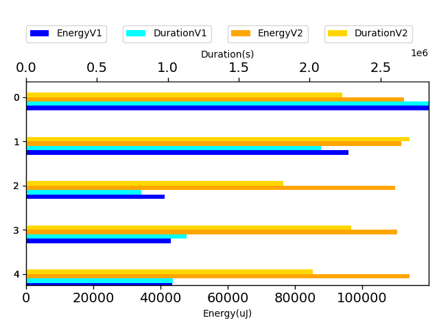

## com.google.gson.functional.MapTest

| Test | IterationV1 | IterationV2 | DeltaIteration |
| --- | --- | --- | --- |
| com.google.gson.functional.MapTest-testWriteMapsWithEmptyStringKey | 14 | 15 | 1 |
| com.google.gson.functional.MapTest-testSerializeMaps | 53 | 57 | 4 |
| com.google.gson.functional.MapTest-testMapSerializationWithNullValues | 67 | 75 | 8 |
| com.google.gson.functional.MapTest-testInterfaceTypeMapWithSerializer | 90 | 92 | 2 |
| com.google.gson.functional.MapTest-testConcurrentSkipListMap | 59 | 68 | 9 |
| com.google.gson.functional.MapTest-testComplexKeysSerialization | 78 | 76 | -2 |
| com.google.gson.functional.MapTest-testMapDeserializationWithDuplicateKeys | 50 | 39 | -11 |
| com.google.gson.functional.MapTest-testMapDeserializationWithIntegerKeys | 35 | 38 | 3 |
| com.google.gson.functional.MapTest-testMapOfMapDeserialization | 55 | 50 | -5 |
| com.google.gson.functional.MapTest-testMapDeserializationWithNullKey | 42 | 44 | 2 |
| com.google.gson.functional.MapTest-testMapDeserializationWithUnquotedLongKeys | 46 | 43 | -3 |
| com.google.gson.functional.MapTest-testMapStandardSubclassDeserialization | 43 | 46 | 3 |
| com.google.gson.functional.MapTest-testReadMapsWithEmptyStringKey | 47 | 55 | 8 |
| com.google.gson.functional.MapTest-testMapSerializationWithNullValuesSerialized | 28 | 29 | 1 |
| com.google.gson.functional.MapTest-testMapWithQuotes | 16 | 21 | 5 |
| com.google.gson.functional.MapTest-testStringKeyDeserialization | 48 | 46 | -2 |
| com.google.gson.functional.MapTest-testGeneralMapField | 59 | 59 | 0 |
| com.google.gson.functional.MapTest-testMapSerializationWithNullValueButSerializeNulls | 34 | 44 | 10 |
| com.google.gson.functional.MapTest-testSortedMap | 66 | 76 | 10 |
| com.google.gson.functional.MapTest-testInterfaceTypeMap | 80 | 81 | 1 |
| com.google.gson.functional.MapTest-testMapSerializationWithWildcardValues | 66 | 71 | 5 |
| com.google.gson.functional.MapTest-testSerializeMapOfMaps | 53 | 46 | -7 |
| com.google.gson.functional.MapTest-testParameterizedMapSubclassSerialization | 99 | 99 | 0 |
| com.google.gson.functional.MapTest-testConcurrentHashMap | 75 | 71 | -4 |
| com.google.gson.functional.MapTest-testMapDeserializationWithLongKeys | 65 | 59 | -6 |
| com.google.gson.functional.MapTest-testMapSubclassSerialization | 44 | 47 | 3 |
| com.google.gson.functional.MapTest-testBooleanKeyDeserialization | 53 | 48 | -5 |
| com.google.gson.functional.MapTest-testMapNamePromotionWithJsonElementReader | 58 | 68 | 10 |
| com.google.gson.functional.MapTest-testNumberKeyDeserialization | 58 | 59 | 1 |
| com.google.gson.functional.MapTest-testComplexKeysDeserialization | 60 | 65 | 5 |
| com.google.gson.functional.MapTest-testConcurrentMap | 66 | 63 | -3 |
| com.google.gson.functional.MapTest-testConcurrentNavigableMap | 99 | 99 | 0 |
| com.google.gson.functional.MapTest-testMapSerializationWithNullKey | 42 | 46 | 4 |
| com.google.gson.functional.MapTest-testMapDeserializationWithUnquotedIntegerKeys | 38 | 38 | 0 |
| com.google.gson.functional.MapTest-testMapSerializationWithIntegerKeys | 51 | 41 | -10 |
| com.google.gson.functional.MapTest-testDeerializeMapOfMaps | 45 | 45 | 0 |
| com.google.gson.functional.MapTest-testMapDeserialization | 50 | 50 | 0 |
| com.google.gson.functional.MapTest-testMapDeserializationWithNullValue | 44 | 48 | 4 |
| com.google.gson.functional.MapTest-testMapDeserializationEmpty | 40 | 42 | 2 |
| com.google.gson.functional.MapTest-testMapSerializationWithNullValue | 39 | 45 | 6 |
| com.google.gson.functional.MapTest-testHashMapDeserialization | 38 | 50 | 12 |
| com.google.gson.functional.MapTest-testMapSerializationEmpty | 47 | 52 | 5 |
| com.google.gson.functional.MapTest-testMapOfMapSerialization | 21 | 18 | -3 |
| com.google.gson.functional.MapTest-testMapDeserializationWithWildcardValues | 40 | 60 | 20 |
| com.google.gson.functional.MapTest-testMapSerialization | 21 | 32 | 11 |
| com.google.gson.functional.MapTest-testRawMapSerialization | 22 | 14 | -8 |

| Test | EnergyV1 | EnergyV2 | DeltaEnergy |
| --- | --- | --- | --- |
| com.google.gson.functional.MapTest-testWriteMapsWithEmptyStringKey | 42828.096130371094 | 42966.25714111328 | 138.1610107421875 |
| com.google.gson.functional.MapTest-testSerializeMaps | 43018.02947494748 | 56894.40168938028 | 13876.372214432799 |
| com.google.gson.functional.MapTest-testMapSerializationWithNullValues | 66490.1635714917 | 44117.811805225385 | -22372.35176626632 |
| com.google.gson.functional.MapTest-testInterfaceTypeMapWithSerializer | 46041.677050468505 | 51269.84887094902 | 5228.171820480515 |
| com.google.gson.functional.MapTest-testConcurrentSkipListMap | 39893.7572180322 | 41036.82186349947 | 1143.0646454672678 |
| com.google.gson.functional.MapTest-testComplexKeysSerialization | 44284.654053673905 | 47661.802504671636 | 3377.148450997731 |
| com.google.gson.functional.MapTest-testMapDeserializationWithDuplicateKeys | 42827.78046945918 | 43563.677230972855 | 735.8967615136717 |
| com.google.gson.functional.MapTest-testMapDeserializationWithIntegerKeys | 41183.593684181105 | 42765.45312336158 | 1581.8594391804727 |
| com.google.gson.functional.MapTest-testMapOfMapDeserialization | 44132.13302392751 | 40233.85797443318 | -3898.275049494332 |
| com.google.gson.functional.MapTest-testMapDeserializationWithNullKey | 43308.38464921314 | 41347.89062357975 | -1960.494025633394 |
| com.google.gson.functional.MapTest-testMapDeserializationWithUnquotedLongKeys | 42381.692366627 | 42377.70543185217 | -3.9869347748317523 |
| com.google.gson.functional.MapTest-testMapStandardSubclassDeserialization | 42859.98688129368 | 40334.760495063485 | -2525.2263862301916 |
| com.google.gson.functional.MapTest-testReadMapsWithEmptyStringKey | 39854.33021179022 | 41388.00824584411 | 1533.6780340538899 |
| com.google.gson.functional.MapTest-testMapSerializationWithNullValuesSerialized | 41578.59364072606 | 50948.562770567834 | 9369.969129841775 |
| com.google.gson.functional.MapTest-testMapWithQuotes | 42555.68983459473 | 43043.47998905182 | 487.7901544570923 |
| com.google.gson.functional.MapTest-testStringKeyDeserialization | 43674.27906790399 | 41906.25371150005 | -1768.0253564039376 |
| com.google.gson.functional.MapTest-testGeneralMapField | 43961.97824972804 | 43720.496485824915 | -241.48176390312437 |
| com.google.gson.functional.MapTest-testMapSerializationWithNullValueButSerializeNulls | 42217.131635792786 | 41886.95404861393 | -330.1775871788559 |
| com.google.gson.functional.MapTest-testSortedMap | 41683.81191688152 | 42351.809622455505 | 667.9977055739873 |
| com.google.gson.functional.MapTest-testInterfaceTypeMap | 58945.17123881582 | 112629.71236934049 | 53684.54113052467 |
| com.google.gson.functional.MapTest-testMapSerializationWithWildcardValues | 45844.579398768474 | 43438.23182595144 | -2406.3475728170306 |
| com.google.gson.functional.MapTest-testSerializeMapOfMaps | 43077.5176310003 | 42563.258727166874 | -514.2589038334263 |
| com.google.gson.functional.MapTest-testParameterizedMapSubclassSerialization | 65698.65350159824 | 55638.616694660486 | -10060.036806937751 |
| com.google.gson.functional.MapTest-testConcurrentHashMap | 45845.00451605074 | 41817.12435461317 | -4027.8801614375698 |
| com.google.gson.functional.MapTest-testMapDeserializationWithLongKeys | 43402.96136630775 | 41295.85811303307 | -2107.103253274676 |
| com.google.gson.functional.MapTest-testMapSubclassSerialization | 41833.506328291216 | 42472.845704238134 | 639.3393759469182 |
| com.google.gson.functional.MapTest-testBooleanKeyDeserialization | 42459.31342729371 | 40488.00270532196 | -1971.3107219717494 |
| com.google.gson.functional.MapTest-testMapNamePromotionWithJsonElementReader | 41938.008420962935 | 46156.34844355475 | 4218.340022591816 |
| com.google.gson.functional.MapTest-testNumberKeyDeserialization | 63593.196700183005 | 43605.29300789003 | -19987.903692292974 |
| com.google.gson.functional.MapTest-testComplexKeysDeserialization | 43045.335485721705 | 58234.85949402438 | 15189.524008302673 |
| com.google.gson.functional.MapTest-testConcurrentMap | 41626.654225741455 | 44604.39338420823 | 2977.7391584667785 |
| com.google.gson.functional.MapTest-testConcurrentNavigableMap | 170709.6527890975 | 146414.43954843003 | -24295.21324066748 |
| com.google.gson.functional.MapTest-testMapSerializationWithNullKey | 43724.86067628821 | 41349.60592045981 | -2375.2547558283986 |
| com.google.gson.functional.MapTest-testMapDeserializationWithUnquotedIntegerKeys | 41782.85509066711 | 42245.8665015399 | 463.01141087279393 |
| com.google.gson.functional.MapTest-testMapSerializationWithIntegerKeys | 42380.87964049257 | 42346.7020291848 | -34.17761130776489 |
| com.google.gson.functional.MapTest-testDeerializeMapOfMaps | 43154.37368653095 | 42708.45518294467 | -445.9185035862756 |
| com.google.gson.functional.MapTest-testMapDeserialization | 41358.31312098302 | 43796.150615432496 | 2437.837494449479 |
| com.google.gson.functional.MapTest-testMapDeserializationWithNullValue | 40681.78702480467 | 44471.132868003886 | 3789.3458431992185 |
| com.google.gson.functional.MapTest-testMapDeserializationEmpty | 41582.94814217961 | 44142.525083499044 | 2559.5769413194357 |
| com.google.gson.functional.MapTest-testMapSerializationWithNullValue | 40164.9599241761 | 41547.74023856522 | 1382.7803143891142 |
| com.google.gson.functional.MapTest-testHashMapDeserialization | 42104.8649243196 | 43981.9822644526 | 1877.1173401330016 |
| com.google.gson.functional.MapTest-testMapSerializationEmpty | 43884.722511087326 | 41399.611245612665 | -2485.111265474661 |
| com.google.gson.functional.MapTest-testMapOfMapSerialization | 41780.50073051453 | 39349.40079498291 | -2431.099935531616 |
| com.google.gson.functional.MapTest-testMapDeserializationWithWildcardValues | 48686.53339537837 | 40168.0299159811 | -8518.503479397274 |
| com.google.gson.functional.MapTest-testMapSerialization | 40983.6998462677 | 45758.8990753931 | 4775.199229125399 |
| com.google.gson.functional.MapTest-testRawMapSerialization | 43944.54091835022 | 43619.38537597656 | -325.1555423736572 |

| Test | DurationV1 | DurationsV2 | DeltaDuration |
| --- | --- | --- | --- |
| com.google.gson.functional.MapTest-testWriteMapsWithEmptyStringKey | 379451.68103027344 | 772246.5679931641 | 392794.8869628906 |
| com.google.gson.functional.MapTest-testSerializeMaps | 969512.670698239 | 1577338.4052346002 | 607825.7345363612 |
| com.google.gson.functional.MapTest-testMapSerializationWithNullValues | 1310169.9189287806 | 1037252.0806681657 | -272917.8382606149 |
| com.google.gson.functional.MapTest-testInterfaceTypeMapWithSerializer | 1327529.0212851756 | 1577041.6574599233 | 249512.63617474772 |
| com.google.gson.functional.MapTest-testConcurrentSkipListMap | 822324.5052143027 | 853703.5940004776 | 31379.088786174892 |
| com.google.gson.functional.MapTest-testComplexKeysSerialization | 1030596.1467998556 | 994115.1747899866 | -36480.97200986906 |
| com.google.gson.functional.MapTest-testMapDeserializationWithDuplicateKeys | 602167.6813063549 | 613637.0941918397 | 11469.412885484751 |
| com.google.gson.functional.MapTest-testMapDeserializationWithIntegerKeys | 627790.0164428232 | 654424.6946678985 | 26634.678225075244 |
| com.google.gson.functional.MapTest-testMapOfMapDeserialization | 825446.5999813302 | 815209.6893957758 | -10236.910585554433 |
| com.google.gson.functional.MapTest-testMapDeserializationWithNullKey | 649150.9483127804 | 693020.3640955519 | 43869.41578277154 |
| com.google.gson.functional.MapTest-testMapDeserializationWithUnquotedLongKeys | 630512.7996554391 | 639801.6919283833 | 9288.892272944213 |
| com.google.gson.functional.MapTest-testMapStandardSubclassDeserialization | 739385.9776854825 | 732001.8234782986 | -7384.154207183863 |
| com.google.gson.functional.MapTest-testReadMapsWithEmptyStringKey | 611940.0835461437 | 711880.5331041911 | 99940.44955804734 |
| com.google.gson.functional.MapTest-testMapSerializationWithNullValuesSerialized | 482205.3549842872 | 900607.9961682148 | 418402.64118392766 |
| com.google.gson.functional.MapTest-testMapWithQuotes | 334508.38761901855 | 389452.66705417633 | 54944.279435157776 |
| com.google.gson.functional.MapTest-testStringKeyDeserialization | 638161.1727168716 | 692380.1141064535 | 54218.94138958189 |
| com.google.gson.functional.MapTest-testGeneralMapField | 902326.3412767485 | 788612.4714868171 | -113713.86978993134 |
| com.google.gson.functional.MapTest-testMapSerializationWithNullValueButSerializeNulls | 581309.8840637554 | 628205.1314885772 | 46895.247424821835 |
| com.google.gson.functional.MapTest-testSortedMap | 872100.8764246056 | 879225.8281859881 | 7124.9517613825155 |
| com.google.gson.functional.MapTest-testInterfaceTypeMap | 1667925.820214704 | 2992854.9251413695 | 1324929.1049266655 |
| com.google.gson.functional.MapTest-testMapSerializationWithWildcardValues | 848516.9472560151 | 920246.3261924207 | 71729.37893640553 |
| com.google.gson.functional.MapTest-testSerializeMapOfMaps | 642525.0896033193 | 830906.4417052927 | 188381.35210197337 |
| com.google.gson.functional.MapTest-testParameterizedMapSubclassSerialization | 1478750.3523379462 | 1564876.449815931 | 86126.09747798485 |
| com.google.gson.functional.MapTest-testConcurrentHashMap | 1088173.0338444475 | 987490.2583654828 | -100682.77547896467 |
| com.google.gson.functional.MapTest-testMapDeserializationWithLongKeys | 814222.6553020932 | 779890.1539725198 | -34332.50132957345 |
| com.google.gson.functional.MapTest-testMapSubclassSerialization | 514124.2561096178 | 668298.255071504 | 154173.99896188622 |
| com.google.gson.functional.MapTest-testBooleanKeyDeserialization | 656166.882709719 | 696427.7836958362 | 40260.900986117194 |
| com.google.gson.functional.MapTest-testMapNamePromotionWithJsonElementReader | 771395.5410815784 | 854108.9241246049 | 82713.38304302655 |
| com.google.gson.functional.MapTest-testNumberKeyDeserialization | 1141777.3312813567 | 839434.3068764132 | -302343.0244049436 |
| com.google.gson.functional.MapTest-testComplexKeysDeserialization | 748358.4394441743 | 1409122.5581225872 | 660764.1186784129 |
| com.google.gson.functional.MapTest-testConcurrentMap | 936742.0537182016 | 966595.2050800417 | 29853.15136184008 |
| com.google.gson.functional.MapTest-testConcurrentNavigableMap | 4032578.5053471792 | 3922936.9874599124 | -109641.51788726682 |
| com.google.gson.functional.MapTest-testMapSerializationWithNullKey | 629247.399217142 | 636511.763981171 | 7264.364764028927 |
| com.google.gson.functional.MapTest-testMapDeserializationWithUnquotedIntegerKeys | 677911.7450309943 | 618855.2449313308 | -59056.500099663506 |
| com.google.gson.functional.MapTest-testMapSerializationWithIntegerKeys | 577332.3807032376 | 652801.1689691417 | 75468.78826590406 |
| com.google.gson.functional.MapTest-testDeerializeMapOfMaps | 1175581.651591661 | 711962.0281323867 | -463619.6234592742 |
| com.google.gson.functional.MapTest-testMapDeserialization | 632057.6987200587 | 618344.6900429123 | -13713.008677146398 |
| com.google.gson.functional.MapTest-testMapDeserializationWithNullValue | 605245.9833043001 | 601731.3749506699 | -3514.608353630174 |
| com.google.gson.functional.MapTest-testMapDeserializationEmpty | 601388.6799054062 | 621124.7197340629 | 19736.039828656707 |
| com.google.gson.functional.MapTest-testMapSerializationWithNullValue | 588735.7288423382 | 660101.3211260961 | 71365.59228375787 |
| com.google.gson.functional.MapTest-testHashMapDeserialization | 607379.274527847 | 604893.373235336 | -2485.9012925109128 |
| com.google.gson.functional.MapTest-testMapSerializationEmpty | 632602.5187761682 | 647992.6350104616 | 15390.116234293324 |
| com.google.gson.functional.MapTest-testMapOfMapSerialization | 422708.09725666046 | 615554.8682632446 | 192846.77100658417 |
| com.google.gson.functional.MapTest-testMapDeserializationWithWildcardValues | 948494.8174917321 | 873235.4691039495 | -75259.34838778258 |
| com.google.gson.functional.MapTest-testMapSerialization | 597486.7145261765 | 668472.1135128103 | 70985.39898663387 |
| com.google.gson.functional.MapTest-testRawMapSerialization | 385575.18166589737 | 408262.1602783203 | 22686.978612422943 |

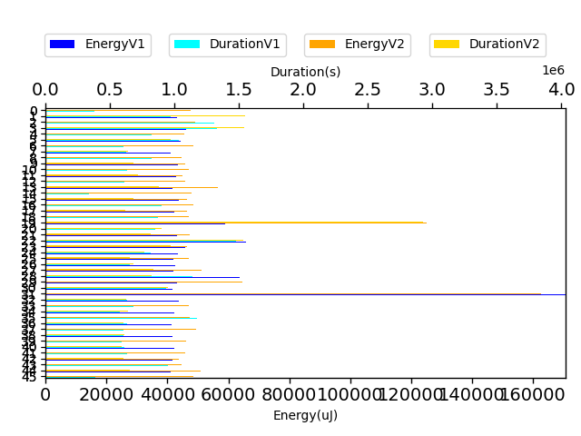

## com.google.gson.functional.NamingPolicyTest

| Test | IterationV1 | IterationV2 | DeltaIteration |
| --- | --- | --- | --- |
| com.google.gson.functional.NamingPolicyTest-testAtSignInSerializedName | 42 | 44 | 2 |
| com.google.gson.functional.NamingPolicyTest-testGsonWithUpperCamelCaseSpacesPolicyDeserialiation | 30 | 19 | -11 |
| com.google.gson.functional.NamingPolicyTest-testGsonWithSerializedNameFieldNamingPolicySerialization | 59 | 57 | -2 |
| com.google.gson.functional.NamingPolicyTest-testComplexFieldNameStrategy | 78 | 71 | -7 |
| com.google.gson.functional.NamingPolicyTest-testGsonWithNonDefaultFieldNamingPolicySerialization | 44 | 33 | -11 |
| com.google.gson.functional.NamingPolicyTest-testGsonDuplicateNameUsingSerializedNameFieldNamingPolicySerialization | 73 | 72 | -1 |
| com.google.gson.functional.NamingPolicyTest-testGsonWithSerializedNameFieldNamingPolicyDeserialization | 22 | 26 | 4 |
| com.google.gson.functional.NamingPolicyTest-testGsonWithLowerCaseUnderscorePolicyDeserialiation | 26 | 29 | 3 |
| com.google.gson.functional.NamingPolicyTest-testGsonWithLowerCaseDashPolicyDeserialiation | 34 | 17 | -17 |
| com.google.gson.functional.NamingPolicyTest-testDeprecatedNamingStrategy | 60 | 45 | -15 |
| com.google.gson.functional.NamingPolicyTest-testGsonWithNonDefaultFieldNamingPolicyDeserialiation | 43 | 37 | -6 |
| com.google.gson.functional.NamingPolicyTest-testGsonWithLowerCaseDashPolicySerialization | 24 | 21 | -3 |
| com.google.gson.functional.NamingPolicyTest-testGsonWithLowerCaseUnderscorePolicySerialization | 27 | 35 | 8 |
| com.google.gson.functional.NamingPolicyTest-testGsonWithUpperCamelCaseSpacesPolicySerialiation | 25 | 31 | 6 |

| Test | EnergyV1 | EnergyV2 | DeltaEnergy |
| --- | --- | --- | --- |
| com.google.gson.functional.NamingPolicyTest-testAtSignInSerializedName | 41693.35962507002 | 44383.23405910639 | 2689.87443403637 |
| com.google.gson.functional.NamingPolicyTest-testGsonWithUpperCamelCaseSpacesPolicyDeserialiation | 41913.723173088394 | 43421.72100830078 | 1507.9978352123871 |
| com.google.gson.functional.NamingPolicyTest-testGsonWithSerializedNameFieldNamingPolicySerialization | 42270.48954040125 | 43672.770768626055 | 1402.281228224805 |
| com.google.gson.functional.NamingPolicyTest-testComplexFieldNameStrategy | 41220.853314234046 | 42485.66119071028 | 1264.8078764762322 |
| com.google.gson.functional.NamingPolicyTest-testGsonWithNonDefaultFieldNamingPolicySerialization | 47202.98250244728 | 36580.29452566593 | -10622.687976781352 |
| com.google.gson.functional.NamingPolicyTest-testGsonDuplicateNameUsingSerializedNameFieldNamingPolicySerialization | 73321.07243005565 | 49372.979413027846 | -23948.0930170278 |
| com.google.gson.functional.NamingPolicyTest-testGsonWithSerializedNameFieldNamingPolicyDeserialization | 51015.600435733795 | 42490.88599914312 | -8524.714436590672 |
| com.google.gson.functional.NamingPolicyTest-testGsonWithLowerCaseUnderscorePolicyDeserialiation | 41729.37128505111 | 40568.48540669307 | -1160.8858783580363 |
| com.google.gson.functional.NamingPolicyTest-testGsonWithLowerCaseDashPolicyDeserialiation | 38403.448447302915 | 38749.07014465332 | 345.62169735040516 |
| com.google.gson.functional.NamingPolicyTest-testDeprecatedNamingStrategy | 39494.212586948706 | 43344.86822794158 | 3850.6556409928744 |
| com.google.gson.functional.NamingPolicyTest-testGsonWithNonDefaultFieldNamingPolicyDeserialiation | 105722.79940966886 | 42442.48000162821 | -63280.319408040654 |
| com.google.gson.functional.NamingPolicyTest-testGsonWithLowerCaseDashPolicySerialization | 41863.217218995094 | 41209.13248252869 | -654.0847364664078 |
| com.google.gson.functional.NamingPolicyTest-testGsonWithLowerCaseUnderscorePolicySerialization | 41430.71716158092 | 41639.10703159368 | 208.3898700127611 |
| com.google.gson.functional.NamingPolicyTest-testGsonWithUpperCamelCaseSpacesPolicySerialiation | 46825.552078306675 | 45201.71582486667 | -1623.8362534400076 |

| Test | DurationV1 | DurationsV2 | DeltaDuration |
| --- | --- | --- | --- |
| com.google.gson.functional.NamingPolicyTest-testAtSignInSerializedName | 714525.1708409562 | 720673.5499714595 | 6148.379130503396 |
| com.google.gson.functional.NamingPolicyTest-testGsonWithUpperCamelCaseSpacesPolicyDeserialiation | 534455.474651888 | 436802.84911727905 | -97652.62553460896 |
| com.google.gson.functional.NamingPolicyTest-testGsonWithSerializedNameFieldNamingPolicySerialization | 1054472.0280309403 | 684801.0198646488 | -369671.0081662915 |
| com.google.gson.functional.NamingPolicyTest-testComplexFieldNameStrategy | 919202.8823995478 | 814761.937400585 | -104440.9449989628 |
| com.google.gson.functional.NamingPolicyTest-testGsonWithNonDefaultFieldNamingPolicySerialization | 870001.2747959365 | 812434.9203991301 | -57566.35439680645 |
| com.google.gson.functional.NamingPolicyTest-testGsonDuplicateNameUsingSerializedNameFieldNamingPolicySerialization | 1948657.1891781164 | 1076755.215389638 | -871901.9737884784 |
| com.google.gson.functional.NamingPolicyTest-testGsonWithSerializedNameFieldNamingPolicyDeserialization | 795238.745098114 | 445062.6186109185 | -350176.1264871955 |
| com.google.gson.functional.NamingPolicyTest-testGsonWithLowerCaseUnderscorePolicyDeserialiation | 585321.4098236263 | 495273.3735109903 | -90048.03631263599 |
| com.google.gson.functional.NamingPolicyTest-testGsonWithLowerCaseDashPolicyDeserialiation | 713011.0151119772 | 567269.4873657227 | -145741.52774625458 |
| com.google.gson.functional.NamingPolicyTest-testDeprecatedNamingStrategy | 776765.7839991498 | 743907.1012710785 | -32858.68272807135 |
| com.google.gson.functional.NamingPolicyTest-testGsonWithNonDefaultFieldNamingPolicyDeserialiation | 2635095.9540633997 | 526897.0159173869 | -2108198.938146013 |
| com.google.gson.functional.NamingPolicyTest-testGsonWithLowerCaseDashPolicySerialization | 506622.8726398945 | 565672.2956132889 | 59049.422973394394 |
| com.google.gson.functional.NamingPolicyTest-testGsonWithLowerCaseUnderscorePolicySerialization | 504045.6854040921 | 448672.29782528995 | -55373.387578802125 |
| com.google.gson.functional.NamingPolicyTest-testGsonWithUpperCamelCaseSpacesPolicySerialiation | 518813.77845460176 | 499189.54680634383 | -19624.231648257934 |

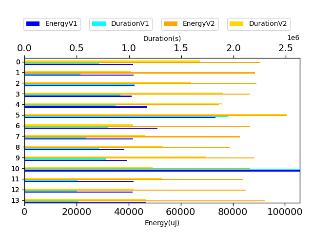

## com.google.gson.functional.CircularReferenceTest

| Test | IterationV1 | IterationV2 | DeltaIteration |
| --- | --- | --- | --- |
| com.google.gson.functional.CircularReferenceTest-testCircularSerialization | 99 | 99 | 0 |
| com.google.gson.functional.CircularReferenceTest-testSelfReferenceArrayFieldSerialization | 99 | 99 | 0 |
| com.google.gson.functional.CircularReferenceTest-testDirectedAcyclicGraphSerialization | 32 | 29 | -3 |
| com.google.gson.functional.CircularReferenceTest-testSelfReferenceIgnoredInSerialization | 28 | 38 | 10 |
| com.google.gson.functional.CircularReferenceTest-testDirectedAcyclicGraphDeserialization | 38 | 40 | 2 |

| Test | EnergyV1 | EnergyV2 | DeltaEnergy |
| --- | --- | --- | --- |
| com.google.gson.functional.CircularReferenceTest-testCircularSerialization | 249612.0354815387 | 300062.1422872093 | 50450.10680567057 |
| com.google.gson.functional.CircularReferenceTest-testSelfReferenceArrayFieldSerialization | 195766.44094382328 | 175124.82473393998 | -20641.6162098833 |
| com.google.gson.functional.CircularReferenceTest-testDirectedAcyclicGraphSerialization | 42527.55970377708 | 44092.790909290314 | 1565.2312055132352 |
| com.google.gson.functional.CircularReferenceTest-testSelfReferenceIgnoredInSerialization | 46096.62960924208 | 44767.93888696396 | -1328.6907222781228 |
| com.google.gson.functional.CircularReferenceTest-testDirectedAcyclicGraphDeserialization | 45259.73594116259 | 41065.71156497002 | -4194.024376192567 |

| Test | DurationV1 | DurationsV2 | DeltaDuration |
| --- | --- | --- | --- |
| com.google.gson.functional.CircularReferenceTest-testCircularSerialization | 5877493.495717355 | 8027461.55690475 | 2149968.061187395 |
| com.google.gson.functional.CircularReferenceTest-testSelfReferenceArrayFieldSerialization | 4430142.255332998 | 4776718.4774593115 | 346576.2221263135 |
| com.google.gson.functional.CircularReferenceTest-testDirectedAcyclicGraphSerialization | 412384.3395797396 | 509102.2009324841 | 96717.86135274451 |
| com.google.gson.functional.CircularReferenceTest-testSelfReferenceIgnoredInSerialization | 634455.8375632539 | 622202.3991624891 | -12253.438400764833 |
| com.google.gson.functional.CircularReferenceTest-testDirectedAcyclicGraphDeserialization | 567839.80436041 | 1272028.3872896892 | 704188.5829292792 |

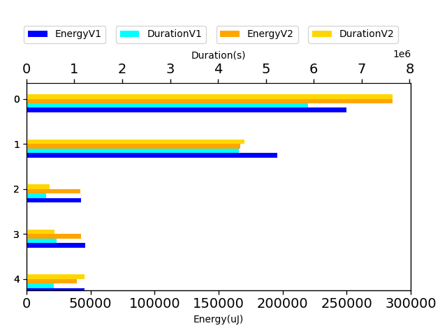

## com.google.gson.functional.ReadersWritersTest

| Test | IterationV1 | IterationV2 | DeltaIteration |
| --- | --- | --- | --- |
| com.google.gson.functional.ReadersWritersTest-testReadWriteTwoObjects | 90 | 87 | -3 |
| com.google.gson.functional.ReadersWritersTest-testTypeMismatchThrowsJsonSyntaxExceptionForStrings | 48 | 62 | 14 |
| com.google.gson.functional.ReadersWritersTest-testReaderForDeserialization | 29 | 30 | 1 |
| com.google.gson.functional.ReadersWritersTest-testWriterForSerialization | 26 | 35 | 9 |
| com.google.gson.functional.ReadersWritersTest-testTypeMismatchThrowsJsonSyntaxExceptionForReaders | 43 | 43 | 0 |

| Test | EnergyV1 | EnergyV2 | DeltaEnergy |
| --- | --- | --- | --- |
| com.google.gson.functional.ReadersWritersTest-testReadWriteTwoObjects | 69541.92916963756 | 47490.11469067811 | -22051.81447895945 |
| com.google.gson.functional.ReadersWritersTest-testTypeMismatchThrowsJsonSyntaxExceptionForStrings | 41963.68145349245 | 45222.4559674228 | 3258.7745139303515 |
| com.google.gson.functional.ReadersWritersTest-testReaderForDeserialization | 42420.51659039408 | 40996.1042726133 | -1424.4123177807778 |
| com.google.gson.functional.ReadersWritersTest-testWriterForSerialization | 45926.785513177514 | 57788.88487507828 | 11862.099361900764 |
| com.google.gson.functional.ReadersWritersTest-testTypeMismatchThrowsJsonSyntaxExceptionForReaders | 43828.8755225653 | 41417.68032326255 | -2411.195199302747 |

| Test | DurationV1 | DurationsV2 | DeltaDuration |
| --- | --- | --- | --- |
| com.google.gson.functional.ReadersWritersTest-testReadWriteTwoObjects | 1265913.0145221078 | 1063809.55098018 | -202103.46354192775 |
| com.google.gson.functional.ReadersWritersTest-testTypeMismatchThrowsJsonSyntaxExceptionForStrings | 959068.8911177579 | 807004.7694030984 | -152064.1217146595 |
| com.google.gson.functional.ReadersWritersTest-testReaderForDeserialization | 468258.3309648894 | 702355.2143803462 | 234096.88341545686 |
| com.google.gson.functional.ReadersWritersTest-testWriterForSerialization | 659476.245910883 | 1201931.0035161441 | 542454.7576052612 |
| com.google.gson.functional.ReadersWritersTest-testTypeMismatchThrowsJsonSyntaxExceptionForReaders | 606702.1301611348 | 710625.2891025399 | 103923.15894140513 |

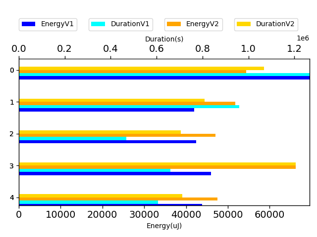

## com.google.gson.functional.ExposeFieldsTest

| Test | IterationV1 | IterationV2 | DeltaIteration |
| --- | --- | --- | --- |
| com.google.gson.functional.ExposeFieldsTest-testNullExposeFieldSerialization | 99 | 99 | 0 |
| com.google.gson.functional.ExposeFieldsTest-testExposeAnnotationDeserialization | 36 | 28 | -8 |
| com.google.gson.functional.ExposeFieldsTest-testExposedInterfaceFieldSerialization | 77 | 78 | 1 |
| com.google.gson.functional.ExposeFieldsTest-testArrayWithOneNullExposeFieldObjectSerialization | 36 | 38 | 2 |
| com.google.gson.functional.ExposeFieldsTest-testNoExposedFieldSerialization | 57 | 58 | 1 |
| com.google.gson.functional.ExposeFieldsTest-testExposedInterfaceFieldDeserialization | 28 | 22 | -6 |
| com.google.gson.functional.ExposeFieldsTest-testExposeAnnotationSerialization | 27 | 33 | 6 |
| com.google.gson.functional.ExposeFieldsTest-testNoExposedFieldDeserialization | 23 | 14 | -9 |

| Test | EnergyV1 | EnergyV2 | DeltaEnergy |
| --- | --- | --- | --- |
| com.google.gson.functional.ExposeFieldsTest-testNullExposeFieldSerialization | 88267.84058318996 | 97078.55301920585 | 8810.712436015892 |
| com.google.gson.functional.ExposeFieldsTest-testExposeAnnotationDeserialization | 49510.11509981436 | 48576.698175258934 | -933.4169245554222 |
| com.google.gson.functional.ExposeFieldsTest-testExposedInterfaceFieldSerialization | 40337.44800311039 | 50848.51616612098 | 10511.06816301059 |
| com.google.gson.functional.ExposeFieldsTest-testArrayWithOneNullExposeFieldObjectSerialization | 44332.089568246214 | 42078.146551881684 | -2253.94301636453 |
| com.google.gson.functional.ExposeFieldsTest-testNoExposedFieldSerialization | 41974.826992337905 | 41877.73565554698 | -97.09133679092338 |
| com.google.gson.functional.ExposeFieldsTest-testExposedInterfaceFieldDeserialization | 44237.44371316582 | 47631.2680015564 | 3393.824288390577 |
| com.google.gson.functional.ExposeFieldsTest-testExposeAnnotationSerialization | 44142.606012135744 | 42320.66992431274 | -1821.9360878230073 |
| com.google.gson.functional.ExposeFieldsTest-testNoExposedFieldDeserialization | 43300.10032367706 | 42831.483947753906 | -468.61637592315674 |

| Test | DurationV1 | DurationsV2 | DeltaDuration |
| --- | --- | --- | --- |
| com.google.gson.functional.ExposeFieldsTest-testNullExposeFieldSerialization | 2456700.3240189105 | 2537914.915193178 | 81214.5911742677 |
| com.google.gson.functional.ExposeFieldsTest-testExposeAnnotationDeserialization | 614501.2149445163 | 841319.2709747255 | 226818.05603020918 |
| com.google.gson.functional.ExposeFieldsTest-testExposedInterfaceFieldSerialization | 994501.4148454224 | 1061295.1500455956 | 66793.73520017322 |
| com.google.gson.functional.ExposeFieldsTest-testArrayWithOneNullExposeFieldObjectSerialization | 577483.9850050583 | 683850.7870427195 | 106366.8020376612 |
| com.google.gson.functional.ExposeFieldsTest-testNoExposedFieldSerialization | 705017.1767312465 | 771997.0480965399 | 66979.8713652934 |
| com.google.gson.functional.ExposeFieldsTest-testExposedInterfaceFieldDeserialization | 450377.04612281173 | 511498.5994606018 | 61121.55333779007 |
| com.google.gson.functional.ExposeFieldsTest-testExposeAnnotationSerialization | 500171.9728143662 | 512948.8342809932 | 12776.861466626986 |
| com.google.gson.functional.ExposeFieldsTest-testNoExposedFieldDeserialization | 411978.9985880852 | 458598.0040283203 | 46619.00544023514 |

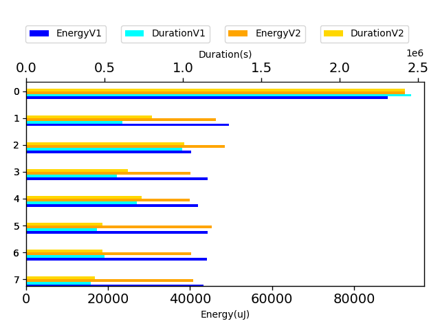

## com.google.gson.functional.InheritanceTest

| Test | IterationV1 | IterationV2 | DeltaIteration |
| --- | --- | --- | --- |
| com.google.gson.functional.InheritanceTest-testSubInterfacesOfCollectionSerialization | 99 | 99 | 0 |
| com.google.gson.functional.InheritanceTest-testBaseSerializedAsSubForToJsonMethod | 15 | 19 | 4 |
| com.google.gson.functional.InheritanceTest-testSubInterfacesOfCollectionDeserialization | 71 | 74 | 3 |
| com.google.gson.functional.InheritanceTest-testSubClassSerialization | 74 | 68 | -6 |
| com.google.gson.functional.InheritanceTest-testClassWithBaseArrayFieldSerialization | 42 | 52 | 10 |
| com.google.gson.functional.InheritanceTest-testBaseSerializedAsSub | 27 | 22 | -5 |
| com.google.gson.functional.InheritanceTest-testClassWithBaseCollectionFieldSerialization | 48 | 45 | -3 |
| com.google.gson.functional.InheritanceTest-testBaseSerializedAsSubWhenSpecifiedWithExplicitType | 13 | 17 | 4 |
| com.google.gson.functional.InheritanceTest-testBaseSerializedAsBaseWhenSpecifiedWithExplicitTypeForToJsonMethod | 35 | 37 | 2 |
| com.google.gson.functional.InheritanceTest-testBaseSerializedAsSubWhenSpecifiedWithExplicitTypeForToJsonMethod | 19 | 18 | -1 |
| com.google.gson.functional.InheritanceTest-testClassWithBaseFieldSerialization | 43 | 41 | -2 |
| com.google.gson.functional.InheritanceTest-testBaseSerializedAsBaseWhenSpecifiedWithExplicitType | 21 | 13 | -8 |
| com.google.gson.functional.InheritanceTest-testSubClassDeserialization | 27 | 52 | 25 |

| Test | EnergyV1 | EnergyV2 | DeltaEnergy |
| --- | --- | --- | --- |
| com.google.gson.functional.InheritanceTest-testSubInterfacesOfCollectionSerialization | 88767.93269454723 | 120716.34036131292 | 31948.407666765692 |
| com.google.gson.functional.InheritanceTest-testBaseSerializedAsSubForToJsonMethod | 43374.336181640625 | 41228.56008529663 | -2145.776096343994 |
| com.google.gson.functional.InheritanceTest-testSubInterfacesOfCollectionDeserialization | 42124.227018969235 | 41035.75000896569 | -1088.4770100035457 |
| com.google.gson.functional.InheritanceTest-testSubClassSerialization | 41424.69378923913 | 44781.14630509707 | 3356.4525158579418 |
| com.google.gson.functional.InheritanceTest-testClassWithBaseArrayFieldSerialization | 41329.07239872634 | 43755.02869540737 | 2425.9562966810263 |
| com.google.gson.functional.InheritanceTest-testBaseSerializedAsSub | 42996.53754135966 | 42458.72175192833 | -537.8157894313335 |
| com.google.gson.functional.InheritanceTest-testClassWithBaseCollectionFieldSerialization | 42952.32958500621 | 41833.7263316436 | -1118.603253362613 |
| com.google.gson.functional.InheritanceTest-testBaseSerializedAsSubWhenSpecifiedWithExplicitType | 41562.854248046875 | 41031.014083862305 | -531.8401641845703 |
| com.google.gson.functional.InheritanceTest-testBaseSerializedAsBaseWhenSpecifiedWithExplicitTypeForToJsonMethod | 109193.74836524279 | 103974.35510105756 | -5219.39326418523 |
| com.google.gson.functional.InheritanceTest-testBaseSerializedAsSubWhenSpecifiedWithExplicitTypeForToJsonMethod | 45941.95464706421 | 44962.21284484863 | -979.7418022155762 |
| com.google.gson.functional.InheritanceTest-testClassWithBaseFieldSerialization | 43720.81529179518 | 42725.75728394838 | -995.0580078468047 |
| com.google.gson.functional.InheritanceTest-testBaseSerializedAsBaseWhenSpecifiedWithExplicitType | 40078.21785449982 | 45866.611572265625 | 5788.393717765808 |
| com.google.gson.functional.InheritanceTest-testSubClassDeserialization | 59777.2815862149 | 264817.52587812726 | 205040.24429191236 |

| Test | DurationV1 | DurationsV2 | DeltaDuration |
| --- | --- | --- | --- |
| com.google.gson.functional.InheritanceTest-testSubInterfacesOfCollectionSerialization | 2171715.2436261284 | 3168049.8305349564 | 996334.586908828 |
| com.google.gson.functional.InheritanceTest-testBaseSerializedAsSubForToJsonMethod | 498052.8588562012 | 465756.77390670776 | -32296.08494949341 |
| com.google.gson.functional.InheritanceTest-testSubInterfacesOfCollectionDeserialization | 984489.5172617096 | 1331479.3831429316 | 346989.86588122207 |
| com.google.gson.functional.InheritanceTest-testSubClassSerialization | 903267.7476758843 | 938994.2246617852 | 35726.476985900896 |
| com.google.gson.functional.InheritanceTest-testClassWithBaseArrayFieldSerialization | 854774.4295687156 | 649338.2358121194 | -205436.19375659619 |
| com.google.gson.functional.InheritanceTest-testBaseSerializedAsSub | 459339.4051691443 | 394458.1286301613 | -64881.27653898299 |
| com.google.gson.functional.InheritanceTest-testClassWithBaseCollectionFieldSerialization | 774138.4167415326 | 746381.6702425762 | -27756.74649895646 |
| com.google.gson.functional.InheritanceTest-testBaseSerializedAsSubWhenSpecifiedWithExplicitType | 530014.3911132812 | 479494.1889953613 | -50520.20211791992 |
| com.google.gson.functional.InheritanceTest-testBaseSerializedAsBaseWhenSpecifiedWithExplicitTypeForToJsonMethod | 2573750.709884275 | 2237431.8580759144 | -336318.8518083608 |
| com.google.gson.functional.InheritanceTest-testBaseSerializedAsSubWhenSpecifiedWithExplicitTypeForToJsonMethod | 446745.98610305786 | 457338.6200866699 | 10592.63398361206 |
| com.google.gson.functional.InheritanceTest-testClassWithBaseFieldSerialization | 801247.5814786036 | 1053687.9353080106 | 252440.3538294069 |
| com.google.gson.functional.InheritanceTest-testBaseSerializedAsBaseWhenSpecifiedWithExplicitType | 461761.8952035904 | 389640.4436035156 | -72121.45160007477 |
| com.google.gson.functional.InheritanceTest-testSubClassDeserialization | 1449912.6515812427 | 6069926.76592163 | 4620014.114340387 |

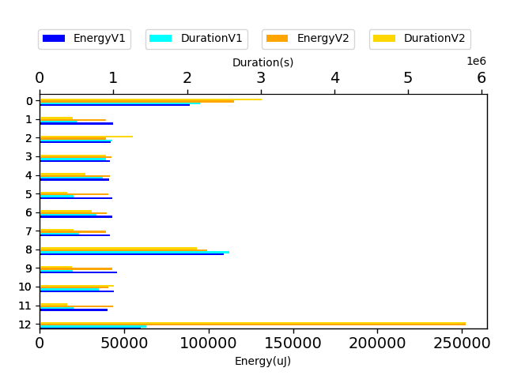

## com.google.gson.GsonBuilderTest

| Test | IterationV1 | IterationV2 | DeltaIteration |
| --- | --- | --- | --- |
| com.google.gson.GsonBuilderTest-testExcludeFieldsWithModifiers | 44 | 50 | 6 |
| com.google.gson.GsonBuilderTest-testTransientFieldExclusion | 40 | 48 | 8 |

| Test | EnergyV1 | EnergyV2 | DeltaEnergy |
| --- | --- | --- | --- |
| com.google.gson.GsonBuilderTest-testExcludeFieldsWithModifiers | 45018.148860231995 | 40153.63110959869 | -4864.517750633306 |
| com.google.gson.GsonBuilderTest-testTransientFieldExclusion | 44065.46716803069 | 37272.83600406021 | -6792.63116397048 |

| Test | DurationV1 | DurationsV2 | DeltaDuration |
| --- | --- | --- | --- |
| com.google.gson.GsonBuilderTest-testExcludeFieldsWithModifiers | 651190.4132226997 | 1012364.976436271 | 361174.5632135713 |
| com.google.gson.GsonBuilderTest-testTransientFieldExclusion | 587407.6981412356 | 771995.1441039685 | 184587.4459627329 |

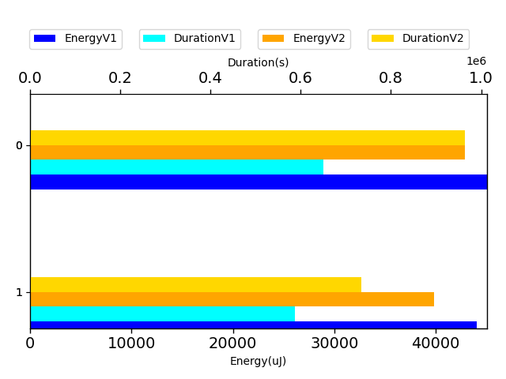

## com.google.gson.functional.MoreSpecificTypeSerializationTest

| Test | IterationV1 | IterationV2 | DeltaIteration |
| --- | --- | --- | --- |
| com.google.gson.functional.MoreSpecificTypeSerializationTest-testSubclassFields | 59 | 64 | 5 |
| com.google.gson.functional.MoreSpecificTypeSerializationTest-testMapOfParameterizedSubclassFields | 40 | 45 | 5 |
| com.google.gson.functional.MoreSpecificTypeSerializationTest-testListOfSubclassFields | 71 | 73 | 2 |
| com.google.gson.functional.MoreSpecificTypeSerializationTest-testParameterizedSubclassFields | 72 | 73 | 1 |
| com.google.gson.functional.MoreSpecificTypeSerializationTest-testListOfParameterizedSubclassFields | 58 | 59 | 1 |
| com.google.gson.functional.MoreSpecificTypeSerializationTest-testMapOfSubclassFields | 57 | 64 | 7 |

| Test | EnergyV1 | EnergyV2 | DeltaEnergy |
| --- | --- | --- | --- |
| com.google.gson.functional.MoreSpecificTypeSerializationTest-testSubclassFields | 53026.26228550852 | 69411.5187752578 | 16385.256489749285 |
| com.google.gson.functional.MoreSpecificTypeSerializationTest-testMapOfParameterizedSubclassFields | 46151.08801938791 | 44149.11232104748 | -2001.9756983404295 |
| com.google.gson.functional.MoreSpecificTypeSerializationTest-testListOfSubclassFields | 49393.49761468789 | 55738.92892985622 | 6345.431315168331 |
| com.google.gson.functional.MoreSpecificTypeSerializationTest-testParameterizedSubclassFields | 42713.54986067687 | 38426.72941889091 | -4286.82044178596 |
| com.google.gson.functional.MoreSpecificTypeSerializationTest-testListOfParameterizedSubclassFields | 43154.825553020804 | 39065.35829553787 | -4089.467257482931 |
| com.google.gson.functional.MoreSpecificTypeSerializationTest-testMapOfSubclassFields | 57379.4496845166 | 60048.5644933148 | 2669.1148087982 |

| Test | DurationV1 | DurationsV2 | DeltaDuration |
| --- | --- | --- | --- |
| com.google.gson.functional.MoreSpecificTypeSerializationTest-testSubclassFields | 1303378.2068973274 | 1991750.5979310216 | 688372.3910336941 |
| com.google.gson.functional.MoreSpecificTypeSerializationTest-testMapOfParameterizedSubclassFields | 679456.5905565002 | 686772.269403172 | 7315.678846671712 |
| com.google.gson.functional.MoreSpecificTypeSerializationTest-testListOfSubclassFields | 1249480.570555088 | 1329065.7177962617 | 79585.14724117354 |
| com.google.gson.functional.MoreSpecificTypeSerializationTest-testParameterizedSubclassFields | 1070697.9567712557 | 1026677.8724830907 | -44020.08428816497 |
| com.google.gson.functional.MoreSpecificTypeSerializationTest-testListOfParameterizedSubclassFields | 882831.5364550593 | 940348.1135437168 | 57516.577088657534 |
| com.google.gson.functional.MoreSpecificTypeSerializationTest-testMapOfSubclassFields | 1391024.7321656256 | 1435760.345685135 | 44735.613519509556 |

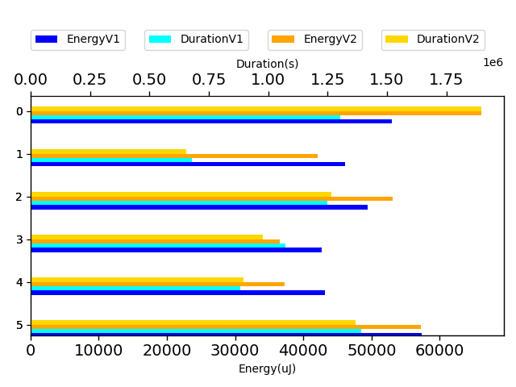

## com.google.gson.functional.EnumTest

| Test | IterationV1 | IterationV2 | DeltaIteration |
| --- | --- | --- | --- |
| com.google.gson.functional.EnumTest-testEnumSubclassAsParameterizedType | 53 | 55 | 2 |
| com.google.gson.functional.EnumTest-testEnumSubclass | 97 | 97 | 0 |
| com.google.gson.functional.EnumTest-testEnumSubclassWithRegisteredTypeAdapter | 79 | 87 | 8 |
| com.google.gson.functional.EnumTest-testClassWithEnumFieldSerialization | 50 | 44 | -6 |
| com.google.gson.functional.EnumTest-testCollectionOfEnumsDeserialization | 46 | 55 | 9 |
| com.google.gson.functional.EnumTest-testEnumSet | 58 | 60 | 2 |
| com.google.gson.functional.EnumTest-testCollectionOfEnumsSerialization | 71 | 80 | 9 |
| com.google.gson.functional.EnumTest-testClassWithEnumFieldDeserialization | 30 | 21 | -9 |

| Test | EnergyV1 | EnergyV2 | DeltaEnergy |
| --- | --- | --- | --- |
| com.google.gson.functional.EnumTest-testEnumSubclassAsParameterizedType | 42971.49162201661 | 41103.66472245898 | -1867.826899557629 |
| com.google.gson.functional.EnumTest-testEnumSubclass | 80408.46618352771 | 63033.408674748505 | -17375.057508779202 |
| com.google.gson.functional.EnumTest-testEnumSubclassWithRegisteredTypeAdapter | 58563.24202664408 | 42002.777412313255 | -16560.464614330827 |
| com.google.gson.functional.EnumTest-testClassWithEnumFieldSerialization | 43680.51909711861 | 40701.92526954932 | -2978.5938275692897 |
| com.google.gson.functional.EnumTest-testCollectionOfEnumsDeserialization | 42037.06003766095 | 42045.66310576083 | 8.603068099881057 |
| com.google.gson.functional.EnumTest-testEnumSet | 43623.92671804052 | 42815.348539613886 | -808.5781784266364 |
| com.google.gson.functional.EnumTest-testCollectionOfEnumsSerialization | 41545.94490650072 | 42652.490171961195 | 1106.5452654604742 |
| com.google.gson.functional.EnumTest-testClassWithEnumFieldDeserialization | 55250.86286602169 | 41302.873834609985 | -13947.989031411707 |

| Test | DurationV1 | DurationsV2 | DeltaDuration |
| --- | --- | --- | --- |
| com.google.gson.functional.EnumTest-testEnumSubclassAsParameterizedType | 713676.6047978431 | 654883.9968208614 | -58792.60797698179 |
| com.google.gson.functional.EnumTest-testEnumSubclass | 1924448.8245128146 | 2025194.8914718763 | 100746.06695906166 |
| com.google.gson.functional.EnumTest-testEnumSubclassWithRegisteredTypeAdapter | 1312499.6791494773 | 1084721.0696854335 | -227778.60946404375 |
| com.google.gson.functional.EnumTest-testClassWithEnumFieldSerialization | 768212.8853708892 | 687308.8888060446 | -80903.99656484462 |
| com.google.gson.functional.EnumTest-testCollectionOfEnumsDeserialization | 738529.9665510207 | 688504.6260469152 | -50025.34050410555 |
| com.google.gson.functional.EnumTest-testEnumSet | 784640.8062420283 | 760433.4531243311 | -24207.353117697174 |
| com.google.gson.functional.EnumTest-testCollectionOfEnumsSerialization | 1277864.0942105567 | 867209.5342041955 | -410654.5600063612 |
| com.google.gson.functional.EnumTest-testClassWithEnumFieldDeserialization | 829332.4055167343 | 473391.1526994705 | -355941.2528172638 |

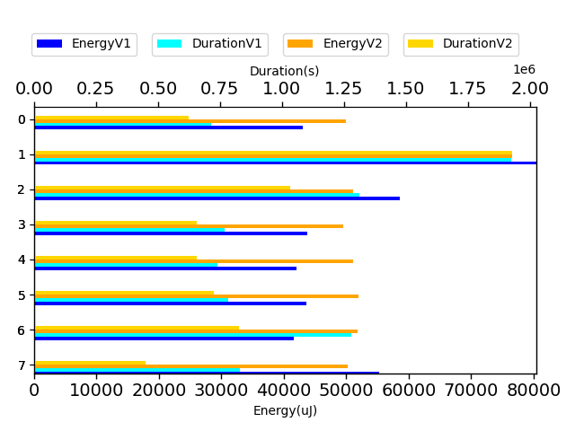

## com.google.gson.functional.ParameterizedTypesTest

| Test | IterationV1 | IterationV2 | DeltaIteration |
| --- | --- | --- | --- |
| com.google.gson.functional.ParameterizedTypesTest-testVariableTypeArrayDeserialization | 74 | 71 | -3 |
| com.google.gson.functional.ParameterizedTypesTest-testParameterizedTypeWithReaderDeserialization | 49 | 54 | 5 |
| com.google.gson.functional.ParameterizedTypesTest-testParameterizedTypesSerialization | 97 | 98 | 1 |
| com.google.gson.functional.ParameterizedTypesTest-testDeepParameterizedTypeSerialization | 31 | 39 | 8 |
| com.google.gson.functional.ParameterizedTypesTest-testVariableTypeDeserialization | 72 | 75 | 3 |
| com.google.gson.functional.ParameterizedTypesTest-testVariableTypeFieldsAndGenericArraysSerialization | 99 | 99 | 0 |
| com.google.gson.functional.ParameterizedTypesTest-testParameterizedTypeGenericArraysDeserialization | 79 | 74 | -5 |
| com.google.gson.functional.ParameterizedTypesTest-testParameterizedTypeDeserialization | 77 | 77 | 0 |
| com.google.gson.functional.ParameterizedTypesTest-testTypesWithMultipleParametersSerialization | 98 | 99 | 1 |
| com.google.gson.functional.ParameterizedTypesTest-testParameterizedTypeGenericArraysSerialization | 71 | 70 | -1 |
| com.google.gson.functional.ParameterizedTypesTest-testParameterizedTypesWithWriterSerialization | 58 | 56 | -2 |
| com.google.gson.functional.ParameterizedTypesTest-testDeepParameterizedTypeDeserialization | 48 | 46 | -2 |
| com.google.gson.functional.ParameterizedTypesTest-testVariableTypeFieldsAndGenericArraysDeserialization | 80 | 83 | 3 |
| com.google.gson.functional.ParameterizedTypesTest-testTypesWithMultipleParametersDeserialization | 66 | 63 | -3 |
| com.google.gson.functional.ParameterizedTypesTest-testParameterizedTypeWithVariableTypeDeserialization | 74 | 71 | -3 |

| Test | EnergyV1 | EnergyV2 | DeltaEnergy |
| --- | --- | --- | --- |
| com.google.gson.functional.ParameterizedTypesTest-testVariableTypeArrayDeserialization | 39852.83323098652 | 45075.28559336108 | 5222.452362374555 |
| com.google.gson.functional.ParameterizedTypesTest-testParameterizedTypeWithReaderDeserialization | 41626.96592966631 | 44126.59289600026 | 2499.626966333948 |
| com.google.gson.functional.ParameterizedTypesTest-testParameterizedTypesSerialization | 82983.48723023268 | 66536.68325360073 | -16446.803976631956 |
| com.google.gson.functional.ParameterizedTypesTest-testDeepParameterizedTypeSerialization | 36564.84768330073 | 41105.0746409573 | 4540.226957656567 |
| com.google.gson.functional.ParameterizedTypesTest-testVariableTypeDeserialization | 48712.46901959065 | 45885.10458143924 | -2827.3644381514096 |
| com.google.gson.functional.ParameterizedTypesTest-testVariableTypeFieldsAndGenericArraysSerialization | 98229.67465521485 | 74043.02319853444 | -24186.65145668041 |
| com.google.gson.functional.ParameterizedTypesTest-testParameterizedTypeGenericArraysDeserialization | 41747.763883453496 | 39855.68263603666 | -1892.0812474168342 |
| com.google.gson.functional.ParameterizedTypesTest-testParameterizedTypeDeserialization | 50188.34589364273 | 45341.25031687437 | -4847.095576768355 |
| com.google.gson.functional.ParameterizedTypesTest-testTypesWithMultipleParametersSerialization | 63980.220193580986 | 61831.970036016326 | -2148.25015756466 |
| com.google.gson.functional.ParameterizedTypesTest-testParameterizedTypeGenericArraysSerialization | 41112.193461982184 | 42169.538743272555 | 1057.3452812903706 |
| com.google.gson.functional.ParameterizedTypesTest-testParameterizedTypesWithWriterSerialization | 40338.2374832636 | 42737.68631637271 | 2399.4488331091125 |
| com.google.gson.functional.ParameterizedTypesTest-testDeepParameterizedTypeDeserialization | 42270.012440287464 | 44483.88782649684 | 2213.8753862093727 |
| com.google.gson.functional.ParameterizedTypesTest-testVariableTypeFieldsAndGenericArraysDeserialization | 39117.4742728721 | 66450.99605107334 | 27333.521778201233 |
| com.google.gson.functional.ParameterizedTypesTest-testTypesWithMultipleParametersDeserialization | 48974.115296042044 | 39863.273683271655 | -9110.84161277039 |
| com.google.gson.functional.ParameterizedTypesTest-testParameterizedTypeWithVariableTypeDeserialization | 39572.586140298714 | 42594.36355458581 | 3021.7774142870985 |

| Test | DurationV1 | DurationsV2 | DeltaDuration |
| --- | --- | --- | --- |
| com.google.gson.functional.ParameterizedTypesTest-testVariableTypeArrayDeserialization | 1381650.0955121857 | 1038350.0531705985 | -343300.04234158725 |
| com.google.gson.functional.ParameterizedTypesTest-testParameterizedTypeWithReaderDeserialization | 1104669.829067332 | 837808.5306485668 | -266861.2984187652 |
| com.google.gson.functional.ParameterizedTypesTest-testParameterizedTypesSerialization | 2544269.8515327987 | 1618408.1939482046 | -925861.6575845941 |
| com.google.gson.functional.ParameterizedTypesTest-testDeepParameterizedTypeSerialization | 708652.9012646629 | 519346.2379016545 | -189306.66336300835 |
| com.google.gson.functional.ParameterizedTypesTest-testVariableTypeDeserialization | 1146098.4346214975 | 1017639.2632352548 | -128459.17138624273 |
| com.google.gson.functional.ParameterizedTypesTest-testVariableTypeFieldsAndGenericArraysSerialization | 2293672.426463564 | 1917746.6949404962 | -375925.7315230677 |
| com.google.gson.functional.ParameterizedTypesTest-testParameterizedTypeGenericArraysDeserialization | 1007381.4423422217 | 1072163.5261357785 | 64782.08379355678 |
| com.google.gson.functional.ParameterizedTypesTest-testParameterizedTypeDeserialization | 1664681.0829114974 | 1054133.9656157214 | -610547.117295776 |
| com.google.gson.functional.ParameterizedTypesTest-testTypesWithMultipleParametersSerialization | 2425857.050694702 | 1782984.3971386324 | -642872.6535560698 |
| com.google.gson.functional.ParameterizedTypesTest-testParameterizedTypeGenericArraysSerialization | 973350.0256108519 | 974777.0405175593 | 1427.0149067073362 |
| com.google.gson.functional.ParameterizedTypesTest-testParameterizedTypesWithWriterSerialization | 751326.8429807343 | 610095.3237000124 | -141231.5192807219 |
| com.google.gson.functional.ParameterizedTypesTest-testDeepParameterizedTypeDeserialization | 684095.76151695 | 689515.5006174351 | 5419.739100485109 |
| com.google.gson.functional.ParameterizedTypesTest-testVariableTypeFieldsAndGenericArraysDeserialization | 1204139.7897221076 | 1155852.808109921 | -48286.981612186646 |
| com.google.gson.functional.ParameterizedTypesTest-testTypesWithMultipleParametersDeserialization | 1088148.8881362453 | 803859.8821700404 | -284289.0059662049 |
| com.google.gson.functional.ParameterizedTypesTest-testParameterizedTypeWithVariableTypeDeserialization | 1067442.2788420958 | 1009410.9354725239 | -58031.34336957184 |

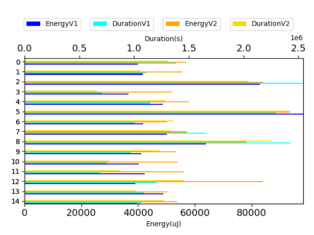

## com.google.gson.functional.JsonTreeTest

| Test | IterationV1 | IterationV2 | DeltaIteration |
| --- | --- | --- | --- |
| com.google.gson.functional.JsonTreeTest-testJsonTreeNull | 24 | 28 | 4 |
| com.google.gson.functional.JsonTreeTest-testJsonTreeToString | 64 | 69 | 5 |
| com.google.gson.functional.JsonTreeTest-testToJsonTree | 47 | 49 | 2 |
| com.google.gson.functional.JsonTreeTest-testToJsonTreeObjectType | 52 | 52 | 0 |

| Test | EnergyV1 | EnergyV2 | DeltaEnergy |
| --- | --- | --- | --- |
| com.google.gson.functional.JsonTreeTest-testJsonTreeNull | 44087.15626215935 | 44556.403290227056 | 469.247028067708 |
| com.google.gson.functional.JsonTreeTest-testJsonTreeToString | 47441.795783720154 | 46667.897475758466 | -773.8983079616883 |
| com.google.gson.functional.JsonTreeTest-testToJsonTree | 79937.2320182175 | 44002.22405198083 | -35935.00796623667 |
| com.google.gson.functional.JsonTreeTest-testToJsonTreeObjectType | 39816.19801230948 | 45270.92940838665 | 5454.731396077164 |

| Test | DurationV1 | DurationsV2 | DeltaDuration |
| --- | --- | --- | --- |
| com.google.gson.functional.JsonTreeTest-testJsonTreeNull | 553254.8303804994 | 437940.0846098736 | -115314.74577062577 |
| com.google.gson.functional.JsonTreeTest-testJsonTreeToString | 1041980.3085991121 | 1001147.2012610857 | -40833.1073380264 |
| com.google.gson.functional.JsonTreeTest-testToJsonTree | 2136875.575339928 | 664359.2974688713 | -1472516.2778710565 |
| com.google.gson.functional.JsonTreeTest-testToJsonTreeObjectType | 802920.2152072662 | 736275.4959004361 | -66644.71930683008 |

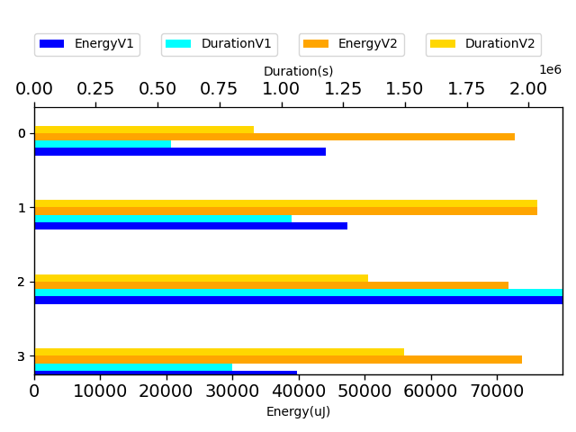

## com.google.gson.functional.FieldExclusionTest

| Test | IterationV1 | IterationV2 | DeltaIteration |
| --- | --- | --- | --- |
| com.google.gson.functional.FieldExclusionTest-testDefaultInnerClassExclusion | 63 | 71 | 8 |
| com.google.gson.functional.FieldExclusionTest-testDefaultNestedStaticClassIncluded | 27 | 34 | 7 |

| Test | EnergyV1 | EnergyV2 | DeltaEnergy |
| --- | --- | --- | --- |
| com.google.gson.functional.FieldExclusionTest-testDefaultInnerClassExclusion | 44574.8964974493 | 324897.543729873 | 280322.6472324237 |
| com.google.gson.functional.FieldExclusionTest-testDefaultNestedStaticClassIncluded | 44745.1680868566 | 37973.70326752955 | -6771.464819327055 |

| Test | DurationV1 | DurationsV2 | DeltaDuration |
| --- | --- | --- | --- |
| com.google.gson.functional.FieldExclusionTest-testDefaultInnerClassExclusion | 889770.7905878362 | 9789935.053580567 | 8900164.26299273 |
| com.google.gson.functional.FieldExclusionTest-testDefaultNestedStaticClassIncluded | 538632.86665833 | 800215.3612471987 | 261582.4945888687 |

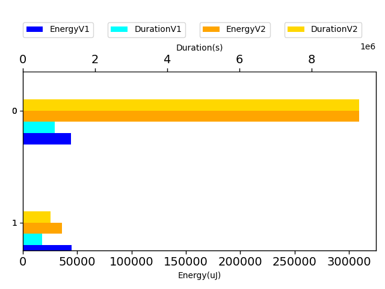

## com.google.gson.functional.JsonAdapterAnnotationOnFieldsTest

| Test | IterationV1 | IterationV2 | DeltaIteration |
| --- | --- | --- | --- |
| com.google.gson.functional.JsonAdapterAnnotationOnFieldsTest-testPrimitiveFieldAnnotationTakesPrecedenceOverDefault | 96 | 93 | -3 |
| com.google.gson.functional.JsonAdapterAnnotationOnFieldsTest-testClassAnnotationAdapterFactoryTakesPrecedenceOverDefault | 97 | 97 | 0 |
| com.google.gson.functional.JsonAdapterAnnotationOnFieldsTest-testClassAnnotationAdapterTakesPrecedenceOverDefault | 97 | 97 | 0 |
| com.google.gson.functional.JsonAdapterAnnotationOnFieldsTest-testFieldAnnotationWorksForParameterizedType | 94 | 91 | -3 |
| com.google.gson.functional.JsonAdapterAnnotationOnFieldsTest-testFieldAnnotationTakesPrecedenceOverClassAnnotation | 77 | 73 | -4 |
| com.google.gson.functional.JsonAdapterAnnotationOnFieldsTest-testJsonAdapterInvokedOnlyForAnnotatedFields | 72 | 69 | -3 |
| com.google.gson.functional.JsonAdapterAnnotationOnFieldsTest-testFieldAnnotationTakesPrecedenceOverRegisteredTypeAdapter | 93 | 91 | -2 |
| com.google.gson.functional.JsonAdapterAnnotationOnFieldsTest-testJsonAdapterWrappedInNullSafeAsRequested | 55 | 57 | 2 |
| com.google.gson.functional.JsonAdapterAnnotationOnFieldsTest-testRegisteredTypeAdapterTakesPrecedenceOverClassAnnotationAdapter | 68 | 56 | -12 |
| com.google.gson.functional.JsonAdapterAnnotationOnFieldsTest-testNonPrimitiveFieldAnnotationTakesPrecedenceOverDefault | 25 | 27 | 2 |

| Test | EnergyV1 | EnergyV2 | DeltaEnergy |
| --- | --- | --- | --- |
| com.google.gson.functional.JsonAdapterAnnotationOnFieldsTest-testPrimitiveFieldAnnotationTakesPrecedenceOverDefault | 37737.24972947051 | 40865.677394571016 | 3128.4276651005057 |
| com.google.gson.functional.JsonAdapterAnnotationOnFieldsTest-testClassAnnotationAdapterFactoryTakesPrecedenceOverDefault | 38368.489031979145 | 40717.84406524414 | 2349.3550332649975 |
| com.google.gson.functional.JsonAdapterAnnotationOnFieldsTest-testClassAnnotationAdapterTakesPrecedenceOverDefault | 184003.93255298704 | 78560.11811351738 | -105443.81443946966 |
| com.google.gson.functional.JsonAdapterAnnotationOnFieldsTest-testFieldAnnotationWorksForParameterizedType | 37853.17892505138 | 42393.07172688462 | 4539.892801833237 |
| com.google.gson.functional.JsonAdapterAnnotationOnFieldsTest-testFieldAnnotationTakesPrecedenceOverClassAnnotation | 65552.91283135324 | 40884.75124578875 | -24668.161585564492 |
| com.google.gson.functional.JsonAdapterAnnotationOnFieldsTest-testJsonAdapterInvokedOnlyForAnnotatedFields | 39417.45325487078 | 42664.3604675293 | 3246.9072126585233 |
| com.google.gson.functional.JsonAdapterAnnotationOnFieldsTest-testFieldAnnotationTakesPrecedenceOverRegisteredTypeAdapter | 43421.68313898967 | 42575.579543935884 | -846.1035950537844 |
| com.google.gson.functional.JsonAdapterAnnotationOnFieldsTest-testJsonAdapterWrappedInNullSafeAsRequested | 41350.80991394778 | 42552.61686931901 | 1201.806955371234 |
| com.google.gson.functional.JsonAdapterAnnotationOnFieldsTest-testRegisteredTypeAdapterTakesPrecedenceOverClassAnnotationAdapter | 57165.78405589846 | 42875.425043887226 | -14290.359012011235 |
| com.google.gson.functional.JsonAdapterAnnotationOnFieldsTest-testNonPrimitiveFieldAnnotationTakesPrecedenceOverDefault | 42531.33652460575 | 40781.483476758 | -1749.8530478477478 |

| Test | DurationV1 | DurationsV2 | DeltaDuration |
| --- | --- | --- | --- |
| com.google.gson.functional.JsonAdapterAnnotationOnFieldsTest-testPrimitiveFieldAnnotationTakesPrecedenceOverDefault | 1568593.170322719 | 1307199.0884679633 | -261394.08185475576 |
| com.google.gson.functional.JsonAdapterAnnotationOnFieldsTest-testClassAnnotationAdapterFactoryTakesPrecedenceOverDefault | 1626651.8272502886 | 1525829.4593171785 | -100822.3679331101 |
| com.google.gson.functional.JsonAdapterAnnotationOnFieldsTest-testClassAnnotationAdapterTakesPrecedenceOverDefault | 5731801.754470548 | 2307280.6781468624 | -3424521.0763236852 |
| com.google.gson.functional.JsonAdapterAnnotationOnFieldsTest-testFieldAnnotationWorksForParameterizedType | 1465463.344793233 | 1234269.633450767 | -231193.71134246606 |
| com.google.gson.functional.JsonAdapterAnnotationOnFieldsTest-testFieldAnnotationTakesPrecedenceOverClassAnnotation | 1880358.6602498614 | 1001063.6003813475 | -879295.059868514 |
| com.google.gson.functional.JsonAdapterAnnotationOnFieldsTest-testJsonAdapterInvokedOnlyForAnnotatedFields | 1204994.869453867 | 860608.6287652343 | -344386.2406886327 |
| com.google.gson.functional.JsonAdapterAnnotationOnFieldsTest-testFieldAnnotationTakesPrecedenceOverRegisteredTypeAdapter | 1545796.110101509 | 1318389.7066419388 | -227406.40345957014 |
| com.google.gson.functional.JsonAdapterAnnotationOnFieldsTest-testJsonAdapterWrappedInNullSafeAsRequested | 1044009.6247072001 | 804508.8120868333 | -239500.8126203668 |
| com.google.gson.functional.JsonAdapterAnnotationOnFieldsTest-testRegisteredTypeAdapterTakesPrecedenceOverClassAnnotationAdapter | 1468147.4782170404 | 993143.4691050376 | -475004.0091120028 |
| com.google.gson.functional.JsonAdapterAnnotationOnFieldsTest-testNonPrimitiveFieldAnnotationTakesPrecedenceOverDefault | 455779.5787705779 | 506978.6815020889 | 51199.102731511 |

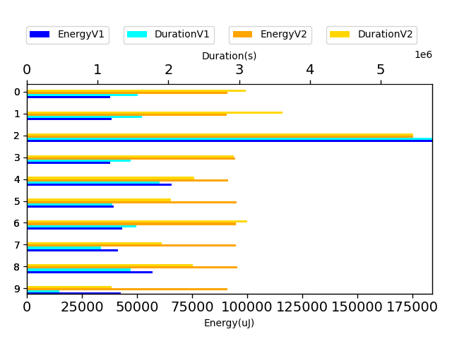

## com.google.gson.functional.TypeVariableTest

| Test | IterationV1 | IterationV2 | DeltaIteration |
| --- | --- | --- | --- |
| com.google.gson.functional.TypeVariableTest-testBasicTypeVariables | 54 | 48 | -6 |
| com.google.gson.functional.TypeVariableTest-testAdvancedTypeVariables | 99 | 96 | -3 |
| com.google.gson.functional.TypeVariableTest-testTypeVariablesViaTypeParameter | 73 | 75 | 2 |

| Test | EnergyV1 | EnergyV2 | DeltaEnergy |
| --- | --- | --- | --- |
| com.google.gson.functional.TypeVariableTest-testBasicTypeVariables | 44000.73596269694 | 43406.810578721575 | -593.9253839753655 |
| com.google.gson.functional.TypeVariableTest-testAdvancedTypeVariables | 67423.56436041807 | 60822.58919620734 | -6600.975164210729 |
| com.google.gson.functional.TypeVariableTest-testTypeVariablesViaTypeParameter | 41548.57404666264 | 41519.75585415883 | -28.81819250380795 |

| Test | DurationV1 | DurationsV2 | DeltaDuration |
| --- | --- | --- | --- |
| com.google.gson.functional.TypeVariableTest-testBasicTypeVariables | 948224.1619604747 | 683683.8770118565 | -264540.28494861815 |
| com.google.gson.functional.TypeVariableTest-testAdvancedTypeVariables | 1519534.9100812324 | 1419935.0008029204 | -99599.909278312 |
| com.google.gson.functional.TypeVariableTest-testTypeVariablesViaTypeParameter | 1313444.78653604 | 899290.7076569245 | -414154.0788791155 |

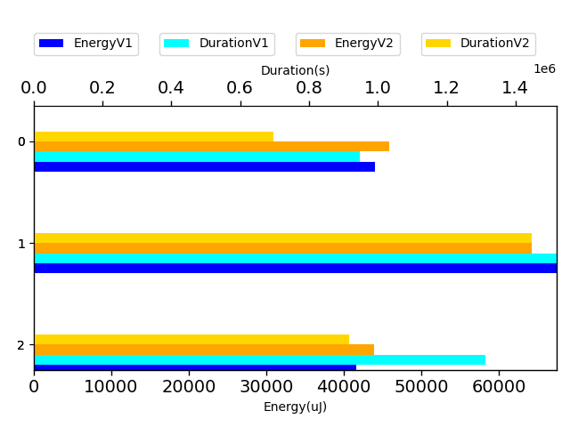

## com.google.gson.functional.VersioningTest

| Test | IterationV1 | IterationV2 | DeltaIteration |
| --- | --- | --- | --- |
| com.google.gson.functional.VersioningTest-testVersionedUntilSerialization | 99 | 99 | 0 |
| com.google.gson.functional.VersioningTest-testVersionedClassesSerialization | 62 | 58 | -4 |
| com.google.gson.functional.VersioningTest-testVersionedGsonMixingSinceAndUntilSerialization | 71 | 69 | -2 |
| com.google.gson.functional.VersioningTest-testVersionedUntilDeserialization | 28 | 29 | 1 |
| com.google.gson.functional.VersioningTest-testVersionedGsonWithUnversionedClassesDeserialization | 25 | 26 | 1 |
| com.google.gson.functional.VersioningTest-testVersionedGsonMixingSinceAndUntilDeserialization | 34 | 33 | -1 |
| com.google.gson.functional.VersioningTest-testVersionedClassesDeserialization | 30 | 32 | 2 |
| com.google.gson.functional.VersioningTest-testVersionedGsonWithUnversionedClassesSerialization | 28 | 27 | -1 |

| Test | EnergyV1 | EnergyV2 | DeltaEnergy |
| --- | --- | --- | --- |
| com.google.gson.functional.VersioningTest-testVersionedUntilSerialization | 130139.62772540687 | 124745.72858833085 | -5393.8991370760195 |
| com.google.gson.functional.VersioningTest-testVersionedClassesSerialization | 42107.700116753986 | 41189.402358562 | -918.297758191984 |
| com.google.gson.functional.VersioningTest-testVersionedGsonMixingSinceAndUntilSerialization | 44913.72126797163 | 41026.83585263534 | -3886.8854153362918 |
| com.google.gson.functional.VersioningTest-testVersionedUntilDeserialization | 42787.618244580925 | 43223.814834825695 | 436.19659024477005 |
| com.google.gson.functional.VersioningTest-testVersionedGsonWithUnversionedClassesDeserialization | 44082.161213994026 | 44691.627462267876 | 609.4662482738495 |
| com.google.gson.functional.VersioningTest-testVersionedGsonMixingSinceAndUntilDeserialization | 44177.79967929202 | 43832.574628548464 | -345.22505074355286 |
| com.google.gson.functional.VersioningTest-testVersionedClassesDeserialization | 41920.44550650753 | 44385.784347784705 | 2465.3388412771747 |
| com.google.gson.functional.VersioningTest-testVersionedGsonWithUnversionedClassesSerialization | 41639.08929787576 | 42918.133708283305 | 1279.0444104075432 |

| Test | DurationV1 | DurationsV2 | DeltaDuration |
| --- | --- | --- | --- |
| com.google.gson.functional.VersioningTest-testVersionedUntilSerialization | 3221482.704397373 | 3295611.474006545 | 74128.7696091719 |
| com.google.gson.functional.VersioningTest-testVersionedClassesSerialization | 769038.7123581303 | 749683.0851178241 | -19355.627240306116 |
| com.google.gson.functional.VersioningTest-testVersionedGsonMixingSinceAndUntilSerialization | 870529.3198203159 | 840292.34489971 | -30236.97492060589 |
| com.google.gson.functional.VersioningTest-testVersionedUntilDeserialization | 555619.9906756803 | 455528.6289723255 | -100091.36170335487 |
| com.google.gson.functional.VersioningTest-testVersionedGsonWithUnversionedClassesDeserialization | 628646.0009884834 | 654817.5473199189 | 26171.546331435442 |
| com.google.gson.functional.VersioningTest-testVersionedGsonMixingSinceAndUntilDeserialization | 624574.1219159684 | 607917.6639103548 | -16656.45800561353 |
| com.google.gson.functional.VersioningTest-testVersionedClassesDeserialization | 687889.5436197314 | 540714.207210551 | -147175.33640918043 |
| com.google.gson.functional.VersioningTest-testVersionedGsonWithUnversionedClassesSerialization | 547650.6146803275 | 958389.3842698634 | 410738.7695895359 |

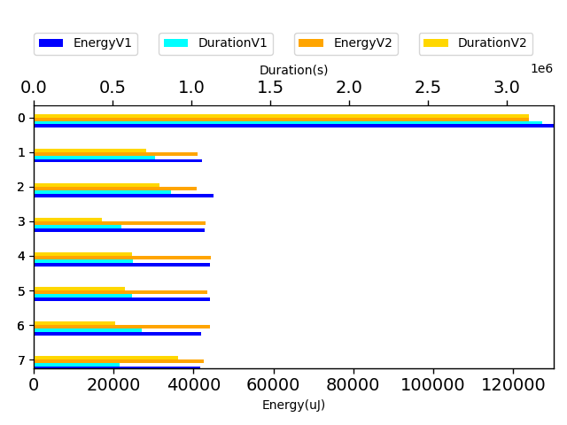

## com.google.gson.functional.RuntimeTypeAdapterFactoryFunctionalTest

| Test | IterationV1 | IterationV2 | DeltaIteration |
| --- | --- | --- | --- |
| com.google.gson.functional.RuntimeTypeAdapterFactoryFunctionalTest-testSubclassesAutomaticallySerialized | 99 | 99 | 0 |

| Test | EnergyV1 | EnergyV2 | DeltaEnergy |
| --- | --- | --- | --- |
| com.google.gson.functional.RuntimeTypeAdapterFactoryFunctionalTest-testSubclassesAutomaticallySerialized | 161246.7311245686 | 129239.30499893858 | -32007.426125630038 |

| Test | DurationV1 | DurationsV2 | DeltaDuration |
| --- | --- | --- | --- |
| com.google.gson.functional.RuntimeTypeAdapterFactoryFunctionalTest-testSubclassesAutomaticallySerialized | 4960106.474011973 | 3150010.1476065367 | -1810096.3264054358 |

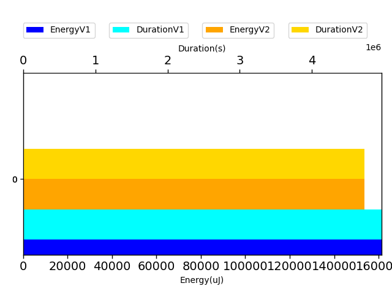

## com.google.gson.functional.ExclusionStrategyFunctionalTest

| Test | IterationV1 | IterationV2 | DeltaIteration |
| --- | --- | --- | --- |
| com.google.gson.functional.ExclusionStrategyFunctionalTest-testExclusionStrategyWithMode | 36 | 44 | 8 |
| com.google.gson.functional.ExclusionStrategyFunctionalTest-testExclusionStrategySerializationDoesNotImpactDeserialization | 46 | 35 | -11 |
| com.google.gson.functional.ExclusionStrategyFunctionalTest-testExcludeTopLevelClassDeserializationDoesNotImpactSerialization | 24 | 29 | 5 |
| com.google.gson.functional.ExclusionStrategyFunctionalTest-testExclusionStrategySerialization | 99 | 98 | -1 |
| com.google.gson.functional.ExclusionStrategyFunctionalTest-testExclusionStrategyDeserialization | 38 | 37 | -1 |
| com.google.gson.functional.ExclusionStrategyFunctionalTest-testExcludeTopLevelClassSerializationDoesNotImpactDeserialization | 29 | 24 | -5 |
| com.google.gson.functional.ExclusionStrategyFunctionalTest-testExclusionStrategySerializationDoesNotImpactSerialization | 25 | 26 | 1 |

| Test | EnergyV1 | EnergyV2 | DeltaEnergy |
| --- | --- | --- | --- |
| com.google.gson.functional.ExclusionStrategyFunctionalTest-testExclusionStrategyWithMode | 39769.12984807657 | 41252.2194676127 | 1483.0896195361274 |
| com.google.gson.functional.ExclusionStrategyFunctionalTest-testExclusionStrategySerializationDoesNotImpactDeserialization | 42622.40113336014 | 43558.60316027887 | 936.2020269187342 |
| com.google.gson.functional.ExclusionStrategyFunctionalTest-testExcludeTopLevelClassDeserializationDoesNotImpactSerialization | 35670.87107902765 | 40504.4881099537 | 4833.617030926049 |
| com.google.gson.functional.ExclusionStrategyFunctionalTest-testExclusionStrategySerialization | 87264.064578285 | 78670.72865925328 | -8593.335919031728 |
| com.google.gson.functional.ExclusionStrategyFunctionalTest-testExclusionStrategyDeserialization | 50309.01427442884 | 67976.90827638553 | 17667.894001956687 |
| com.google.gson.functional.ExclusionStrategyFunctionalTest-testExcludeTopLevelClassSerializationDoesNotImpactDeserialization | 42512.85089445859 | 41304.565819859505 | -1208.2850745990872 |
| com.google.gson.functional.ExclusionStrategyFunctionalTest-testExclusionStrategySerializationDoesNotImpactSerialization | 37635.243566930294 | 40929.081647485495 | 3293.8380805552006 |

| Test | DurationV1 | DurationsV2 | DeltaDuration |
| --- | --- | --- | --- |
| com.google.gson.functional.ExclusionStrategyFunctionalTest-testExclusionStrategyWithMode | 615097.7065352607 | 714837.0139295664 | 99739.30739430571 |
| com.google.gson.functional.ExclusionStrategyFunctionalTest-testExclusionStrategySerializationDoesNotImpactDeserialization | 903253.6969827849 | 517734.387609091 | -385519.3093736939 |
| com.google.gson.functional.ExclusionStrategyFunctionalTest-testExcludeTopLevelClassDeserializationDoesNotImpactSerialization | 702359.9010347724 | 588164.3015574999 | -114195.59947727248 |
| com.google.gson.functional.ExclusionStrategyFunctionalTest-testExclusionStrategySerialization | 2254040.9674362084 | 2369111.591226313 | 115070.62379010441 |
| com.google.gson.functional.ExclusionStrategyFunctionalTest-testExclusionStrategyDeserialization | 846273.8508667981 | 1917322.0248398767 | 1071048.1739730786 |
| com.google.gson.functional.ExclusionStrategyFunctionalTest-testExcludeTopLevelClassSerializationDoesNotImpactDeserialization | 456862.9550772086 | 615491.6962395906 | 158628.74116238207 |
| com.google.gson.functional.ExclusionStrategyFunctionalTest-testExclusionStrategySerializationDoesNotImpactSerialization | 651186.1491533518 | 647268.2181511372 | -3917.931002214551 |

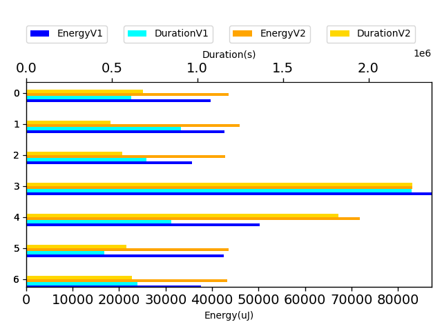

## com.google.gson.functional.PrettyPrintingTest

| Test | IterationV1 | IterationV2 | DeltaIteration |
| --- | --- | --- | --- |
| com.google.gson.functional.PrettyPrintingTest-testPrettyPrintListOfPrimitiveArrays | 35 | 35 | 0 |
| com.google.gson.functional.PrettyPrintingTest-testPrettyPrintList | 74 | 74 | 0 |
| com.google.gson.functional.PrettyPrintingTest-testEmptyMapField | 65 | 52 | -13 |
| com.google.gson.functional.PrettyPrintingTest-testMap | 32 | 21 | -11 |
| com.google.gson.functional.PrettyPrintingTest-testPrettyPrintArrayOfObjects | 44 | 43 | -1 |

| Test | EnergyV1 | EnergyV2 | DeltaEnergy |
| --- | --- | --- | --- |
| com.google.gson.functional.PrettyPrintingTest-testPrettyPrintListOfPrimitiveArrays | 40530.59699647088 | 42800.128526141896 | 2269.531529671018 |
| com.google.gson.functional.PrettyPrintingTest-testPrettyPrintList | 43114.57142087919 | 56250.621675792514 | 13136.050254913323 |
| com.google.gson.functional.PrettyPrintingTest-testEmptyMapField | 42455.74739201643 | 42648.64755857513 | 192.90016655870568 |
| com.google.gson.functional.PrettyPrintingTest-testMap | 43841.879944898654 | 44456.332026958466 | 614.4520820598118 |
| com.google.gson.functional.PrettyPrintingTest-testPrettyPrintArrayOfObjects | 44711.998776594046 | 43015.41948265273 | -1696.579293941315 |

| Test | DurationV1 | DurationsV2 | DeltaDuration |
| --- | --- | --- | --- |
| com.google.gson.functional.PrettyPrintingTest-testPrettyPrintListOfPrimitiveArrays | 693342.2869393562 | 772660.0819581272 | 79317.79501877096 |
| com.google.gson.functional.PrettyPrintingTest-testPrettyPrintList | 1032465.8348310372 | 1341464.7651970563 | 308998.93036601914 |
| com.google.gson.functional.PrettyPrintingTest-testEmptyMapField | 787900.4956247397 | 948659.3380784506 | 160758.84245371097 |
| com.google.gson.functional.PrettyPrintingTest-testMap | 420883.4904681556 | 480734.14563560486 | 59850.655167449266 |
| com.google.gson.functional.PrettyPrintingTest-testPrettyPrintArrayOfObjects | 634720.0503732382 | 856498.344548107 | 221778.29417486885 |

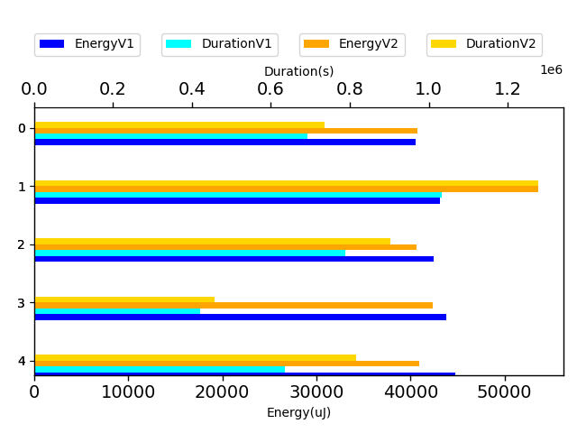

## com.google.gson.functional.UncategorizedTest

| Test | IterationV1 | IterationV2 | DeltaIteration |
| --- | --- | --- | --- |
| com.google.gson.functional.UncategorizedTest-testGsonInstanceReusableForSerializationAndDeserialization | 26 | 27 | 1 |
| com.google.gson.functional.UncategorizedTest-testTrailingWhitespace | 59 | 49 | -10 |
| com.google.gson.functional.UncategorizedTest-testStaticFieldsAreNotSerialized | 31 | 28 | -3 |
| com.google.gson.functional.UncategorizedTest-testInvalidJsonDeserializationFails | 34 | 38 | 4 |
| com.google.gson.functional.UncategorizedTest-testObjectEqualButNotSameSerialization | 32 | 23 | -9 |

| Test | EnergyV1 | EnergyV2 | DeltaEnergy |
| --- | --- | --- | --- |
| com.google.gson.functional.UncategorizedTest-testGsonInstanceReusableForSerializationAndDeserialization | 42437.80226187408 | 44068.637511752546 | 1630.8352498784661 |
| com.google.gson.functional.UncategorizedTest-testTrailingWhitespace | 46221.682552675724 | 44355.78197013073 | -1865.900582544993 |
| com.google.gson.functional.UncategorizedTest-testStaticFieldsAreNotSerialized | 41427.09573827963 | 42540.93765974045 | 1113.8419214608148 |
| com.google.gson.functional.UncategorizedTest-testInvalidJsonDeserializationFails | 48931.65621816373 | 45016.04141727893 | -3915.614800884796 |
| com.google.gson.functional.UncategorizedTest-testObjectEqualButNotSameSerialization | 42992.22043949086 | 52479.159075021744 | 9486.938635530882 |

| Test | DurationV1 | DurationsV2 | DeltaDuration |
| --- | --- | --- | --- |
| com.google.gson.functional.UncategorizedTest-testGsonInstanceReusableForSerializationAndDeserialization | 515332.09786333144 | 700179.4090876579 | 184847.3112243265 |
| com.google.gson.functional.UncategorizedTest-testTrailingWhitespace | 864018.1768377319 | 807604.7680244141 | -56413.40881331777 |
| com.google.gson.functional.UncategorizedTest-testStaticFieldsAreNotSerialized | 702004.4855483216 | 412570.7474004701 | -289433.73814785155 |
| com.google.gson.functional.UncategorizedTest-testInvalidJsonDeserializationFails | 990640.0574574496 | 657210.4424798016 | -333429.614977648 |
| com.google.gson.functional.UncategorizedTest-testObjectEqualButNotSameSerialization | 511487.0240111728 | 650482.2923076153 | 138995.26829644246 |

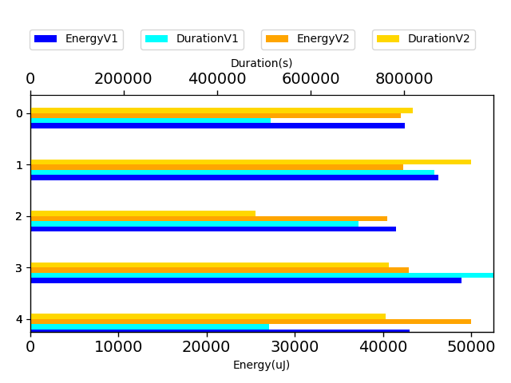

## com.google.gson.functional.FieldNamingTest

| Test | IterationV1 | IterationV2 | DeltaIteration |
| --- | --- | --- | --- |
| com.google.gson.functional.FieldNamingTest-testIdentity | 82 | 77 | -5 |
| com.google.gson.functional.FieldNamingTest-testLowerCaseWithDashes | 33 | 33 | 0 |
| com.google.gson.functional.FieldNamingTest-testLowerCaseWithUnderscores | 33 | 39 | 6 |
| com.google.gson.functional.FieldNamingTest-testUpperCamelCase | 31 | 36 | 5 |
| com.google.gson.functional.FieldNamingTest-testUpperCamelCaseWithSpaces | 30 | 43 | 13 |

| Test | EnergyV1 | EnergyV2 | DeltaEnergy |
| --- | --- | --- | --- |
| com.google.gson.functional.FieldNamingTest-testIdentity | 49061.61134948884 | 63874.18998614242 | 14812.578636653576 |
| com.google.gson.functional.FieldNamingTest-testLowerCaseWithDashes | 43650.78062621772 | 40876.98113332584 | -2773.799492891878 |
| com.google.gson.functional.FieldNamingTest-testLowerCaseWithUnderscores | 38945.2026805894 | 44022.38740804434 | 5077.184727454944 |
| com.google.gson.functional.FieldNamingTest-testUpperCamelCase | 42176.65577775333 | 41196.79575010498 | -979.8600276483485 |
| com.google.gson.functional.FieldNamingTest-testUpperCamelCaseWithSpaces | 44568.7422914207 | 41773.05196665558 | -2795.6903247651207 |

| Test | DurationV1 | DurationsV2 | DeltaDuration |
| --- | --- | --- | --- |
| com.google.gson.functional.FieldNamingTest-testIdentity | 879319.5855838261 | 1647840.2195100945 | 768520.6339262684 |
| com.google.gson.functional.FieldNamingTest-testLowerCaseWithDashes | 543306.7380189727 | 753111.0957607714 | 209804.35774179874 |
| com.google.gson.functional.FieldNamingTest-testLowerCaseWithUnderscores | 452286.6922320293 | 645285.286087201 | 192998.5938551717 |
| com.google.gson.functional.FieldNamingTest-testUpperCamelCase | 565425.8949420657 | 538470.0524206946 | -26955.842521371087 |
| com.google.gson.functional.FieldNamingTest-testUpperCamelCaseWithSpaces | 477656.11422600225 | 735120.4087561027 | 257464.29453010042 |

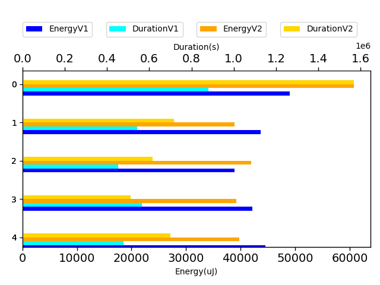

## com.google.gson.functional.NullObjectAndFieldTest

| Test | IterationV1 | IterationV2 | DeltaIteration |
| --- | --- | --- | --- |
| com.google.gson.functional.NullObjectAndFieldTest-testAbsentJsonElementsAreSetToNull | 59 | 60 | 1 |
| com.google.gson.functional.NullObjectAndFieldTest-testPrintPrintingObjectWithNulls | 33 | 35 | 2 |
| com.google.gson.functional.NullObjectAndFieldTest-testNullWrappedPrimitiveMemberSerialization | 46 | 34 | -12 |
| com.google.gson.functional.NullObjectAndFieldTest-testExplicitNullSetsFieldToNullDuringDeserialization | 40 | 35 | -5 |
| com.google.gson.functional.NullObjectAndFieldTest-testExplicitSerializationOfNullArrayMembers | 73 | 71 | -2 |
| com.google.gson.functional.NullObjectAndFieldTest-testExplicitSerializationOfNulls | 37 | 35 | -2 |
| com.google.gson.functional.NullObjectAndFieldTest-testNullWrappedPrimitiveMemberDeserialization | 19 | 22 | 3 |
| com.google.gson.functional.NullObjectAndFieldTest-testExplicitSerializationOfNullCollectionMembers | 38 | 27 | -11 |
| com.google.gson.functional.NullObjectAndFieldTest-testExplicitSerializationOfNullStringMembers | 31 | 36 | 5 |
| com.google.gson.functional.NullObjectAndFieldTest-testExplicitDeserializationOfNulls | 33 | 27 | -6 |

| Test | EnergyV1 | EnergyV2 | DeltaEnergy |
| --- | --- | --- | --- |
| com.google.gson.functional.NullObjectAndFieldTest-testAbsentJsonElementsAreSetToNull | 42550.81860336432 | 41378.47378582365 | -1172.3448175406738 |
| com.google.gson.functional.NullObjectAndFieldTest-testPrintPrintingObjectWithNulls | 43827.16498075158 | 42113.00677971955 | -1714.1582010320271 |
| com.google.gson.functional.NullObjectAndFieldTest-testNullWrappedPrimitiveMemberSerialization | 41987.81347837343 | 41252.482171771466 | -735.3313066019618 |
| com.google.gson.functional.NullObjectAndFieldTest-testExplicitNullSetsFieldToNullDuringDeserialization | 41266.8496389786 | 42389.33638041132 | 1122.4867414327164 |
| com.google.gson.functional.NullObjectAndFieldTest-testExplicitSerializationOfNullArrayMembers | 42375.22659840651 | 42834.637114871206 | 459.41051646469714 |
| com.google.gson.functional.NullObjectAndFieldTest-testExplicitSerializationOfNulls | 48870.58731451609 | 44012.4111994835 | -4858.176115032591 |
| com.google.gson.functional.NullObjectAndFieldTest-testNullWrappedPrimitiveMemberDeserialization | 40686.922410964966 | 39759.89808535576 | -927.0243256092072 |
| com.google.gson.functional.NullObjectAndFieldTest-testExplicitSerializationOfNullCollectionMembers | 45301.92094699503 | 42601.446855627 | -2700.474091368029 |
| com.google.gson.functional.NullObjectAndFieldTest-testExplicitSerializationOfNullStringMembers | 43019.952288937755 | 42691.70471780779 | -328.24757112996303 |
| com.google.gson.functional.NullObjectAndFieldTest-testExplicitDeserializationOfNulls | 42927.42787210108 | 39934.4837288782 | -2992.9441432228778 |

| Test | DurationV1 | DurationsV2 | DeltaDuration |
| --- | --- | --- | --- |
| com.google.gson.functional.NullObjectAndFieldTest-testAbsentJsonElementsAreSetToNull | 767830.8625180118 | 785954.0507773578 | 18123.188259345945 |
| com.google.gson.functional.NullObjectAndFieldTest-testPrintPrintingObjectWithNulls | 612598.5801840392 | 573341.5077556672 | -39257.07242837199 |
| com.google.gson.functional.NullObjectAndFieldTest-testNullWrappedPrimitiveMemberSerialization | 603640.0858529405 | 645016.8060421988 | 41376.72018925834 |
| com.google.gson.functional.NullObjectAndFieldTest-testExplicitNullSetsFieldToNullDuringDeserialization | 668020.2711129528 | 653247.4015991831 | -14772.86951376975 |
| com.google.gson.functional.NullObjectAndFieldTest-testExplicitSerializationOfNullArrayMembers | 947402.201651898 | 905158.2673841264 | -42243.93426777155 |
| com.google.gson.functional.NullObjectAndFieldTest-testExplicitSerializationOfNulls | 925375.7187222593 | 491379.7115117644 | -433996.0072104949 |
| com.google.gson.functional.NullObjectAndFieldTest-testNullWrappedPrimitiveMemberDeserialization | 450015.66052246094 | 439198.80290675163 | -10816.857615709305 |
| com.google.gson.functional.NullObjectAndFieldTest-testExplicitSerializationOfNullCollectionMembers | 560951.3119434579 | 620959.3799738511 | 60008.06803039322 |
| com.google.gson.functional.NullObjectAndFieldTest-testExplicitSerializationOfNullStringMembers | 502218.339456941 | 423721.588764058 | -78496.75069288298 |
| com.google.gson.functional.NullObjectAndFieldTest-testExplicitDeserializationOfNulls | 489990.2046318869 | 497783.3457202986 | 7793.141088411678 |

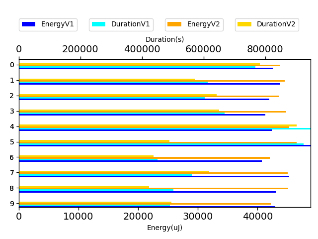

## com.google.gson.functional.RawSerializationTest

| Test | IterationV1 | IterationV2 | DeltaIteration |
| --- | --- | --- | --- |
| com.google.gson.functional.RawSerializationTest-testParameterizedObject | 87 | 82 | -5 |
| com.google.gson.functional.RawSerializationTest-testTwoLevelParameterizedObject | 77 | 68 | -9 |
| com.google.gson.functional.RawSerializationTest-testCollectionOfPrimitives | 34 | 27 | -7 |
| com.google.gson.functional.RawSerializationTest-testThreeLevelParameterizedObject | 74 | 78 | 4 |
| com.google.gson.functional.RawSerializationTest-testCollectionOfObjects | 49 | 61 | 12 |

| Test | EnergyV1 | EnergyV2 | DeltaEnergy |
| --- | --- | --- | --- |
| com.google.gson.functional.RawSerializationTest-testParameterizedObject | 43821.51390328792 | 43870.739189060536 | 49.22528577261255 |
| com.google.gson.functional.RawSerializationTest-testTwoLevelParameterizedObject | 45436.31518478556 | 44036.70083733814 | -1399.614347447423 |
| com.google.gson.functional.RawSerializationTest-testCollectionOfPrimitives | 47430.24873425008 | 47952.56721419096 | 522.3184799408773 |
| com.google.gson.functional.RawSerializationTest-testThreeLevelParameterizedObject | 43830.90318549456 | 44455.041101821495 | 624.1379163269376 |
| com.google.gson.functional.RawSerializationTest-testCollectionOfObjects | 72430.46762918276 | 42311.04864306893 | -30119.418986113837 |

| Test | DurationV1 | DurationsV2 | DeltaDuration |
| --- | --- | --- | --- |
| com.google.gson.functional.RawSerializationTest-testParameterizedObject | 986908.7693363198 | 1187440.1440321659 | 200531.3746958461 |
| com.google.gson.functional.RawSerializationTest-testTwoLevelParameterizedObject | 929863.3678169919 | 934335.912516552 | 4472.544699560152 |
| com.google.gson.functional.RawSerializationTest-testCollectionOfPrimitives | 711237.309831108 | 807714.230713293 | 96476.92088218499 |
| com.google.gson.functional.RawSerializationTest-testThreeLevelParameterizedObject | 931642.7388112021 | 1005900.3013506872 | 74257.56253948505 |
| com.google.gson.functional.RawSerializationTest-testCollectionOfObjects | 1878658.4702177348 | 848049.9460076008 | -1030608.524210134 |

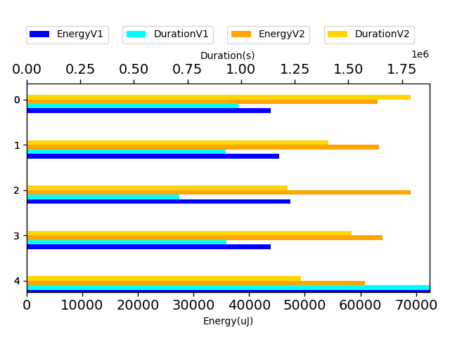

## com.google.gson.JavaSerializationTest

| Test | IterationV1 | IterationV2 | DeltaIteration |
| --- | --- | --- | --- |
| com.google.gson.JavaSerializationTest-testMapIsSerializable | 99 | 99 | 0 |
| com.google.gson.JavaSerializationTest-testNumberIsSerializable | 99 | 99 | 0 |
| com.google.gson.JavaSerializationTest-testListIsSerializable | 99 | 99 | 0 |

| Test | EnergyV1 | EnergyV2 | DeltaEnergy |
| --- | --- | --- | --- |
| com.google.gson.JavaSerializationTest-testMapIsSerializable | 379168.37058438116 | 412925.665810392 | 33757.29522601084 |
| com.google.gson.JavaSerializationTest-testNumberIsSerializable | 469834.10222917836 | 455713.0200800812 | -14121.082149097172 |
| com.google.gson.JavaSerializationTest-testListIsSerializable | 58854.169139534206 | 81377.46550023668 | 22523.296360702472 |

| Test | DurationV1 | DurationsV2 | DeltaDuration |
| --- | --- | --- | --- |
| com.google.gson.JavaSerializationTest-testMapIsSerializable | 8766690.561014064 | 10177263.189797126 | 1410572.628783062 |
| com.google.gson.JavaSerializationTest-testNumberIsSerializable | 11083959.081557915 | 12254164.207709098 | 1170205.1261511836 |
| com.google.gson.JavaSerializationTest-testListIsSerializable | 1743466.0817509976 | 1876500.8600394726 | 133034.778288475 |

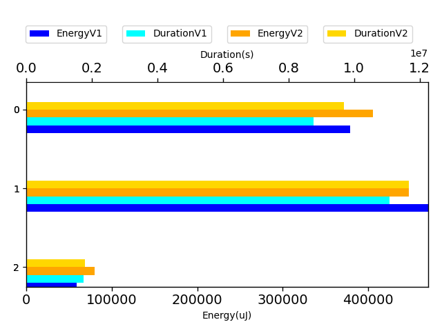

## com.google.gson.functional.SerializedNameTest

| Test | IterationV1 | IterationV2 | DeltaIteration |
| --- | --- | --- | --- |
| com.google.gson.functional.SerializedNameTest-testMultipleNamesDeserializedCorrectly | 34 | 43 | 9 |
| com.google.gson.functional.SerializedNameTest-testFirstNameIsChosenForSerialization | 81 | 83 | 2 |
| com.google.gson.functional.SerializedNameTest-testMultipleNamesInTheSameString | 26 | 25 | -1 |

| Test | EnergyV1 | EnergyV2 | DeltaEnergy |
| --- | --- | --- | --- |
| com.google.gson.functional.SerializedNameTest-testMultipleNamesDeserializedCorrectly | 45794.983618427825 | 49227.76981235358 | 3432.7861939257564 |
| com.google.gson.functional.SerializedNameTest-testFirstNameIsChosenForSerialization | 43784.10603683996 | 69835.56708759916 | 26051.4610507592 |
| com.google.gson.functional.SerializedNameTest-testMultipleNamesInTheSameString | 41437.27152380347 | 39841.47790324688 | -1595.793620556593 |

| Test | DurationV1 | DurationsV2 | DeltaDuration |
| --- | --- | --- | --- |
| com.google.gson.functional.SerializedNameTest-testMultipleNamesDeserializedCorrectly | 528338.3267150305 | 1018477.4088162308 | 490139.08210120036 |
| com.google.gson.functional.SerializedNameTest-testFirstNameIsChosenForSerialization | 919821.2585290975 | 1649412.0317419255 | 729590.773212828 |
| com.google.gson.functional.SerializedNameTest-testMultipleNamesInTheSameString | 424102.6971074641 | 727489.8431443572 | 303387.14603689313 |

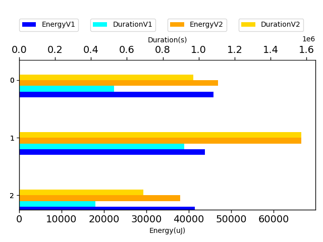

## com.google.gson.functional.SecurityTest

| Test | IterationV1 | IterationV2 | DeltaIteration |
| --- | --- | --- | --- |
| com.google.gson.functional.SecurityTest-testNonExecutableJsonSerialization | 36 | 28 | -8 |
| com.google.gson.functional.SecurityTest-testJsonWithNonExectuableTokenWithRegularGsonDeserialization | 23 | 29 | 6 |
| com.google.gson.functional.SecurityTest-testNonExecutableJsonDeserialization | 24 | 25 | 1 |
| com.google.gson.functional.SecurityTest-testJsonWithNonExectuableTokenWithConfiguredGsonDeserialization | 31 | 29 | -2 |

| Test | EnergyV1 | EnergyV2 | DeltaEnergy |
| --- | --- | --- | --- |
| com.google.gson.functional.SecurityTest-testNonExecutableJsonSerialization | 105782.2590508804 | 47587.83490507305 | -58194.42414580735 |
| com.google.gson.functional.SecurityTest-testJsonWithNonExectuableTokenWithRegularGsonDeserialization | 44718.15710186958 | 42298.80580034107 | -2419.3513015285134 |
| com.google.gson.functional.SecurityTest-testNonExecutableJsonDeserialization | 48070.93077361584 | 60517.70138710737 | 12446.770613491535 |
| com.google.gson.functional.SecurityTest-testJsonWithNonExectuableTokenWithConfiguredGsonDeserialization | 44521.870912337676 | 40442.74938160926 | -4079.1215307284147 |

| Test | DurationV1 | DurationsV2 | DeltaDuration |
| --- | --- | --- | --- |
| com.google.gson.functional.SecurityTest-testNonExecutableJsonSerialization | 2684814.078037204 | 767676.6938232183 | -1917137.3842139859 |
| com.google.gson.functional.SecurityTest-testJsonWithNonExectuableTokenWithRegularGsonDeserialization | 517876.3231114149 | 465252.86210779473 | -52623.46100362018 |
| com.google.gson.functional.SecurityTest-testNonExecutableJsonDeserialization | 664175.2166216373 | 1194005.0572853088 | 529829.8406636715 |
| com.google.gson.functional.SecurityTest-testJsonWithNonExectuableTokenWithConfiguredGsonDeserialization | 681330.4611117905 | 413247.7810253911 | -268082.6800863994 |

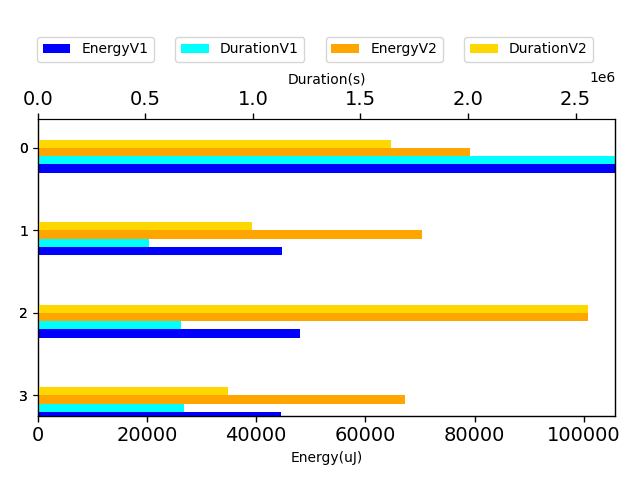

## com.google.gson.functional.MapAsArrayTypeAdapterTest

| Test | IterationV1 | IterationV2 | DeltaIteration |
| --- | --- | --- | --- |
| com.google.gson.functional.MapAsArrayTypeAdapterTest-testSerializeComplexMapWithTypeAdapter | 99 | 99 | 0 |
| com.google.gson.functional.MapAsArrayTypeAdapterTest-testTwoTypesCollapseToOneDeserialize | 58 | 52 | -6 |
| com.google.gson.functional.MapAsArrayTypeAdapterTest-testMapWithTypeVariableSerialization | 79 | 79 | 0 |
| com.google.gson.functional.MapAsArrayTypeAdapterTest-testMultipleEnableComplexKeyRegistrationHasNoEffect | 61 | 62 | 1 |
| com.google.gson.functional.MapAsArrayTypeAdapterTest-testMapWithTypeVariableDeserialization | 65 | 67 | 2 |

| Test | EnergyV1 | EnergyV2 | DeltaEnergy |
| --- | --- | --- | --- |
| com.google.gson.functional.MapAsArrayTypeAdapterTest-testSerializeComplexMapWithTypeAdapter | 69225.36882697421 | 143783.8195648493 | 74558.4507378751 |
| com.google.gson.functional.MapAsArrayTypeAdapterTest-testTwoTypesCollapseToOneDeserialize | 61657.42034007772 | 41700.98929813711 | -19956.43104194061 |
| com.google.gson.functional.MapAsArrayTypeAdapterTest-testMapWithTypeVariableSerialization | 48337.277074974554 | 43178.09563292448 | -5159.181442050074 |
| com.google.gson.functional.MapAsArrayTypeAdapterTest-testMultipleEnableComplexKeyRegistrationHasNoEffect | 41472.05913208911 | 40435.13992714156 | -1036.9192049475532 |
| com.google.gson.functional.MapAsArrayTypeAdapterTest-testMapWithTypeVariableDeserialization | 38642.01964850123 | 41801.30130980724 | 3159.281661306013 |

| Test | DurationV1 | DurationsV2 | DeltaDuration |
| --- | --- | --- | --- |
| com.google.gson.functional.MapAsArrayTypeAdapterTest-testSerializeComplexMapWithTypeAdapter | 2239899.058819985 | 4444069.293385973 | 2204170.234565988 |
| com.google.gson.functional.MapAsArrayTypeAdapterTest-testTwoTypesCollapseToOneDeserialize | 1350901.5972394585 | 1020641.5406040708 | -330260.0566353877 |
| com.google.gson.functional.MapAsArrayTypeAdapterTest-testMapWithTypeVariableSerialization | 1102061.1660653343 | 1132833.3879060936 | 30772.221840759274 |
| com.google.gson.functional.MapAsArrayTypeAdapterTest-testMultipleEnableComplexKeyRegistrationHasNoEffect | 819382.3197339531 | 1105770.5133561285 | 286388.1936221754 |
| com.google.gson.functional.MapAsArrayTypeAdapterTest-testMapWithTypeVariableDeserialization | 981376.3749833754 | 1036226.2156890135 | 54849.84070563805 |

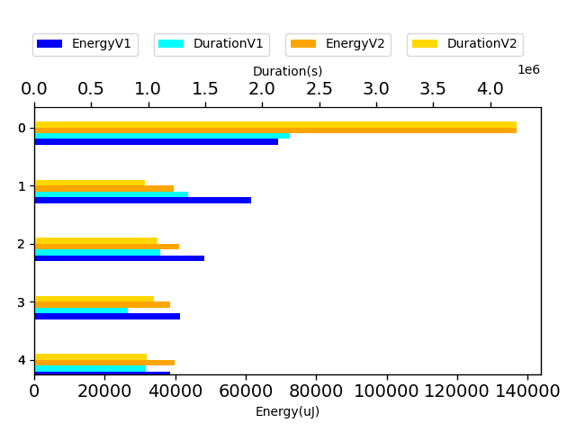

## com.google.gson.functional.ConcurrencyTest

| Test | IterationV1 | IterationV2 | DeltaIteration |
| --- | --- | --- | --- |
| com.google.gson.functional.ConcurrencyTest-testMultiThreadSerialization | 99 | 99 | 0 |
| com.google.gson.functional.ConcurrencyTest-testMultiThreadDeserialization | 99 | 99 | 0 |
| com.google.gson.functional.ConcurrencyTest-testSingleThreadDeserialization | 39 | 47 | 8 |
| com.google.gson.functional.ConcurrencyTest-testSingleThreadSerialization | 59 | 46 | -13 |

| Test | EnergyV1 | EnergyV2 | DeltaEnergy |
| --- | --- | --- | --- |
| com.google.gson.functional.ConcurrencyTest-testMultiThreadSerialization | 237900.71911707363 | 293049.45513828733 | 55148.7360212137 |
| com.google.gson.functional.ConcurrencyTest-testMultiThreadDeserialization | 333299.89660830784 | 386931.6945904445 | 53631.79798213666 |
| com.google.gson.functional.ConcurrencyTest-testSingleThreadDeserialization | 41412.33173275243 | 46654.881095670964 | 5242.549362918537 |
| com.google.gson.functional.ConcurrencyTest-testSingleThreadSerialization | 44760.24383310108 | 53050.84942730906 | 8290.605594207984 |

| Test | DurationV1 | DurationsV2 | DeltaDuration |
| --- | --- | --- | --- |
| com.google.gson.functional.ConcurrencyTest-testMultiThreadSerialization | 6022533.814141062 | 7050859.377045372 | 1028325.5629043095 |
| com.google.gson.functional.ConcurrencyTest-testMultiThreadDeserialization | 7977274.823302354 | 10285036.402065665 | 2307761.578763311 |
| com.google.gson.functional.ConcurrencyTest-testSingleThreadDeserialization | 582550.8848442802 | 777435.6259307112 | 194884.74108643096 |
| com.google.gson.functional.ConcurrencyTest-testSingleThreadSerialization | 857951.5657407783 | 1180103.6962797244 | 322152.130538946 |

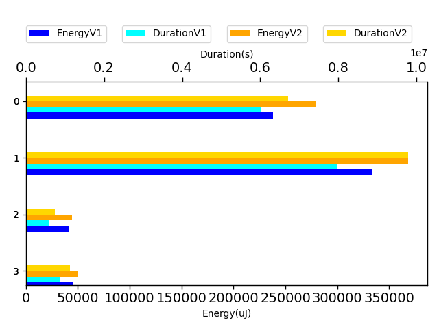

## com.google.gson.functional.EscapingTest

| Test | IterationV1 | IterationV2 | DeltaIteration |
| --- | --- | --- | --- |
| com.google.gson.functional.EscapingTest-testEscapingObjectFields | 41 | 23 | -18 |
| com.google.gson.functional.EscapingTest-testGsonAcceptsEscapedAndNonEscapedJsonDeserialization | 56 | 49 | -7 |
| com.google.gson.functional.EscapingTest-testEscapeAllHtmlCharacters | 34 | 33 | -1 |
| com.google.gson.functional.EscapingTest-testGsonDoubleDeserialization | 33 | 31 | -2 |

| Test | EnergyV1 | EnergyV2 | DeltaEnergy |
| --- | --- | --- | --- |
| com.google.gson.functional.EscapingTest-testEscapingObjectFields | 67896.41693727879 | 41570.89189982414 | -26325.525037454645 |
| com.google.gson.functional.EscapingTest-testGsonAcceptsEscapedAndNonEscapedJsonDeserialization | 41065.16554559812 | 42303.575315917784 | 1238.4097703196603 |
| com.google.gson.functional.EscapingTest-testEscapeAllHtmlCharacters | 53022.0567707665 | 43101.29811079847 | -9920.758659968036 |
| com.google.gson.functional.EscapingTest-testGsonDoubleDeserialization | 44758.37595176231 | 43758.138425529 | -1000.237526233308 |

| Test | DurationV1 | DurationsV2 | DeltaDuration |
| --- | --- | --- | --- |
| com.google.gson.functional.EscapingTest-testEscapingObjectFields | 1450635.9318721397 | 652613.0265498161 | -798022.9053223236 |
| com.google.gson.functional.EscapingTest-testGsonAcceptsEscapedAndNonEscapedJsonDeserialization | 915375.3344852817 | 611862.0814897574 | -303513.2529955243 |
| com.google.gson.functional.EscapingTest-testEscapeAllHtmlCharacters | 1727401.2903244542 | 593673.5783206798 | -1133727.7120037745 |
| com.google.gson.functional.EscapingTest-testGsonDoubleDeserialization | 717147.8205962502 | 770402.4392681438 | 53254.61867189361 |

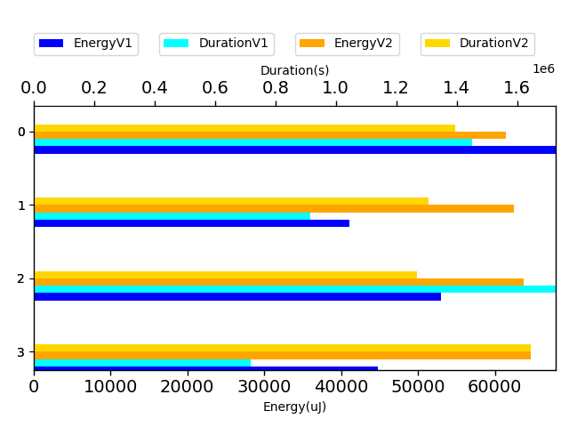

## com.google.gson.functional.ArrayTest

| Test | IterationV1 | IterationV2 | DeltaIteration |
| --- | --- | --- | --- |
| com.google.gson.functional.ArrayTest-testArrayOfCollectionSerialization | 70 | 70 | 0 |
| com.google.gson.functional.ArrayTest-testSingleNullInArraySerialization | 31 | 30 | -1 |
| com.google.gson.functional.ArrayTest-testObjectArrayWithNonPrimitivesSerialization | 36 | 41 | 5 |
| com.google.gson.functional.ArrayTest-testArrayOfCollectionDeserialization | 53 | 52 | -1 |
| com.google.gson.functional.ArrayTest-testSingleNullInArrayDeserialization | 18 | 30 | 12 |

| Test | EnergyV1 | EnergyV2 | DeltaEnergy |
| --- | --- | --- | --- |
| com.google.gson.functional.ArrayTest-testArrayOfCollectionSerialization | 40932.08998650208 | 41664.22685125993 | 732.1368647578565 |
| com.google.gson.functional.ArrayTest-testSingleNullInArraySerialization | 43773.911801857874 | 65647.50676471833 | 21873.594962860458 |
| com.google.gson.functional.ArrayTest-testObjectArrayWithNonPrimitivesSerialization | 43774.94944813984 | 45834.78190273868 | 2059.832454598836 |
| com.google.gson.functional.ArrayTest-testArrayOfCollectionDeserialization | 45004.35740889689 | 44173.57600537419 | -830.7814035226984 |
| com.google.gson.functional.ArrayTest-testSingleNullInArrayDeserialization | 43486.54633331299 | 44153.65652521141 | 667.1101918984205 |

| Test | DurationV1 | DurationsV2 | DeltaDuration |
| --- | --- | --- | --- |
| com.google.gson.functional.ArrayTest-testArrayOfCollectionSerialization | 867746.9210303808 | 1137048.2618845212 | 269301.34085414046 |
| com.google.gson.functional.ArrayTest-testSingleNullInArraySerialization | 487993.596270673 | 1340155.458987778 | 852161.8627171051 |
| com.google.gson.functional.ArrayTest-testObjectArrayWithNonPrimitivesSerialization | 569560.9785301831 | 1247294.8587623606 | 677733.8802321776 |
| com.google.gson.functional.ArrayTest-testArrayOfCollectionDeserialization | 894529.0525587229 | 1063438.5204503625 | 168909.46789163956 |
| com.google.gson.functional.ArrayTest-testSingleNullInArrayDeserialization | 443688.1735610962 | 566896.8044038024 | 123208.63084270619 |

## com.google.gson.DefaultMapJsonSerializerTest

| Test | IterationV1 | IterationV2 | DeltaIteration |
| --- | --- | --- | --- |
| com.google.gson.DefaultMapJsonSerializerTest-testNonEmptyMapSerialization | 52 | 52 | 0 |
| com.google.gson.DefaultMapJsonSerializerTest-testEmptyMapSerialization | 33 | 43 | 10 |
| com.google.gson.DefaultMapJsonSerializerTest-testEmptyMapNoTypeSerialization | 26 | 26 | 0 |

| Test | EnergyV1 | EnergyV2 | DeltaEnergy |
| --- | --- | --- | --- |
| com.google.gson.DefaultMapJsonSerializerTest-testNonEmptyMapSerialization | 41813.545791907825 | 44153.23245855601 | 2339.6866666481874 |
| com.google.gson.DefaultMapJsonSerializerTest-testEmptyMapSerialization | 45586.2444229871 | 42678.960312763906 | -2907.284110223198 |
| com.google.gson.DefaultMapJsonSerializerTest-testEmptyMapNoTypeSerialization | 42059.51221948862 | 46160.77582938969 | 4101.263609901071 |

| Test | DurationV1 | DurationsV2 | DeltaDuration |
| --- | --- | --- | --- |
| com.google.gson.DefaultMapJsonSerializerTest-testNonEmptyMapSerialization | 601757.5086820901 | 615299.2233214785 | 13541.714639388374 |
| com.google.gson.DefaultMapJsonSerializerTest-testEmptyMapSerialization | 715968.955475098 | 623877.8996134193 | -92091.05586167867 |
| com.google.gson.DefaultMapJsonSerializerTest-testEmptyMapNoTypeSerialization | 837599.1814104021 | 413126.1811798662 | -424473.00023053586 |

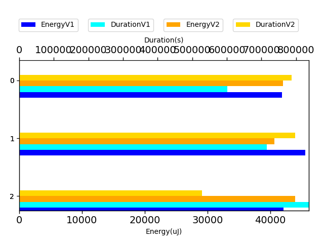

## com.google.gson.functional.InterfaceTest

| Test | IterationV1 | IterationV2 | DeltaIteration |
| --- | --- | --- | --- |
| com.google.gson.functional.InterfaceTest-testSerializingInterfaceObjectField | 50 | 53 | 3 |
| com.google.gson.functional.InterfaceTest-testSerializingObjectImplementingInterface | 44 | 40 | -4 |

| Test | EnergyV1 | EnergyV2 | DeltaEnergy |
| --- | --- | --- | --- |
| com.google.gson.functional.InterfaceTest-testSerializingInterfaceObjectField | 43836.20610118171 | 45496.36831406159 | 1660.1622128798772 |
| com.google.gson.functional.InterfaceTest-testSerializingObjectImplementingInterface | 41396.36443157202 | 45113.72624945488 | 3717.3618178828547 |

| Test | DurationV1 | DurationsV2 | DeltaDuration |
| --- | --- | --- | --- |
| com.google.gson.functional.InterfaceTest-testSerializingInterfaceObjectField | 791342.1434907544 | 871768.3954565244 | 80426.25196577003 |
| com.google.gson.functional.InterfaceTest-testSerializingObjectImplementingInterface | 700516.2162159747 | 694377.6172233848 | -6138.598992589861 |

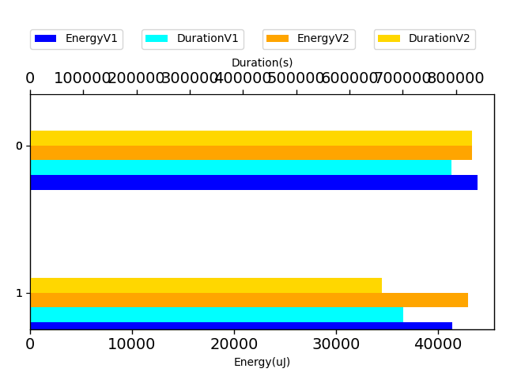

## com.google.gson.functional.TypeHierarchyAdapterTest

| Test | IterationV1 | IterationV2 | DeltaIteration |
| --- | --- | --- | --- |
| com.google.gson.functional.TypeHierarchyAdapterTest-testTypeHierarchy | 99 | 99 | 0 |

| Test | EnergyV1 | EnergyV2 | DeltaEnergy |
| --- | --- | --- | --- |
| com.google.gson.functional.TypeHierarchyAdapterTest-testTypeHierarchy | 106768.67190135943 | 151504.38327065506 | 44735.71136929563 |

| Test | DurationV1 | DurationsV2 | DeltaDuration |
| --- | --- | --- | --- |
| com.google.gson.functional.TypeHierarchyAdapterTest-testTypeHierarchy | 2774921.779277252 | 3172173.024587514 | 397251.24531026185 |

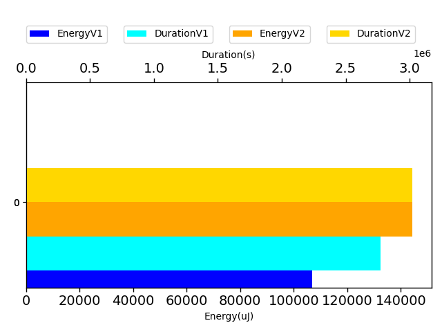

## com.google.gson.MixedStreamTest

| Test | IterationV1 | IterationV2 | DeltaIteration |
| --- | --- | --- | --- |
| com.google.gson.MixedStreamTest-testWriteDoesNotMutateState | 11 | 27 | 16 |
| com.google.gson.MixedStreamTest-testWriteHtmlSafe | 54 | 62 | 8 |
| com.google.gson.MixedStreamTest-testWriteLenient | 65 | 63 | -2 |
| com.google.gson.MixedStreamTest-testReaderDoesNotMutateState | 32 | 17 | -15 |
| com.google.gson.MixedStreamTest-testWriteInvalidState | 15 | 22 | 7 |
| com.google.gson.MixedStreamTest-testReadMixedStreamed | 32 | 39 | 7 |
| com.google.gson.MixedStreamTest-testWriteClosed | 26 | 22 | -4 |
| com.google.gson.MixedStreamTest-testWriteMixedStreamed | 26 | 38 | 12 |

| Test | EnergyV1 | EnergyV2 | DeltaEnergy |
| --- | --- | --- | --- |
| com.google.gson.MixedStreamTest-testWriteDoesNotMutateState | 37579.6884765625 | 42706.15479251742 | 5126.466315954924 |
| com.google.gson.MixedStreamTest-testWriteHtmlSafe | 41486.31787534055 | 41679.729970011955 | 193.41209467140288 |
| com.google.gson.MixedStreamTest-testWriteLenient | 43689.8338813065 | 77934.8911711348 | 34245.057289828306 |
| com.google.gson.MixedStreamTest-testReaderDoesNotMutateState | 42994.5010331613 | 38266.94396972656 | -4727.557063434739 |
| com.google.gson.MixedStreamTest-testWriteInvalidState | 40408.64831542969 | 41001.29840660095 | 592.6500911712646 |
| com.google.gson.MixedStreamTest-testReadMixedStreamed | 42974.86885152385 | 44235.93971785961 | 1261.0708663357655 |
| com.google.gson.MixedStreamTest-testWriteClosed | 43537.122881770134 | 40725.32306718826 | -2811.799814581871 |
| com.google.gson.MixedStreamTest-testWriteMixedStreamed | 39027.548190146685 | 44469.10521389136 | 5441.557023744674 |

| Test | DurationV1 | DurationsV2 | DeltaDuration |
| --- | --- | --- | --- |
| com.google.gson.MixedStreamTest-testWriteDoesNotMutateState | 578648.3383789062 | 587086.0807137191 | 8437.74233481288 |
| com.google.gson.MixedStreamTest-testWriteHtmlSafe | 825412.7782877745 | 1158833.3739986918 | 333420.59571091726 |
| com.google.gson.MixedStreamTest-testWriteLenient | 822085.9271493461 | 2213414.323410453 | 1391328.3962611067 |
| com.google.gson.MixedStreamTest-testReaderDoesNotMutateState | 573410.0044559562 | 577962.803894043 | 4552.799438086804 |
| com.google.gson.MixedStreamTest-testWriteInvalidState | 685610.4664916992 | 564647.4413843155 | -120963.02510738373 |
| com.google.gson.MixedStreamTest-testReadMixedStreamed | 455174.0378462947 | 542649.9272682816 | 87475.88942198688 |
| com.google.gson.MixedStreamTest-testWriteClosed | 449985.4206366837 | 466973.74911785126 | 16988.328481167555 |
| com.google.gson.MixedStreamTest-testWriteMixedStreamed | 687607.3277465701 | 970541.2533072808 | 282933.9255607107 |

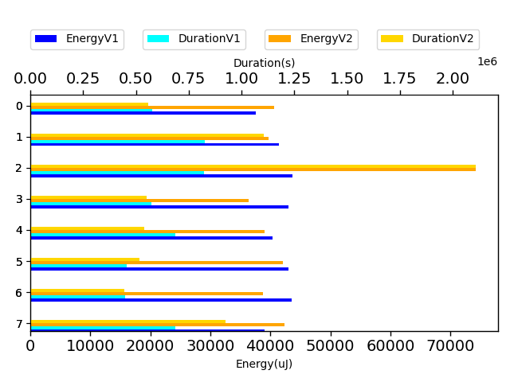

## com.google.gson.functional.TreeTypeAdaptersTest

| Test | IterationV1 | IterationV2 | DeltaIteration |
| --- | --- | --- | --- |
| com.google.gson.functional.TreeTypeAdaptersTest-testDeserializeId | 76 | 61 | -15 |
| com.google.gson.functional.TreeTypeAdaptersTest-testSerializeId | 78 | 81 | 3 |

| Test | EnergyV1 | EnergyV2 | DeltaEnergy |
| --- | --- | --- | --- |
| com.google.gson.functional.TreeTypeAdaptersTest-testDeserializeId | 45089.12666678958 | 103209.11857658694 | 58119.99190979736 |
| com.google.gson.functional.TreeTypeAdaptersTest-testSerializeId | 63769.506988058776 | 78618.82443904757 | 14849.317450988798 |

| Test | DurationV1 | DurationsV2 | DeltaDuration |
| --- | --- | --- | --- |
| com.google.gson.functional.TreeTypeAdaptersTest-testDeserializeId | 1266837.1283520102 | 2759380.7881571283 | 1492543.659805118 |
| com.google.gson.functional.TreeTypeAdaptersTest-testSerializeId | 1606951.006144612 | 2875526.8784575835 | 1268575.8723129714 |

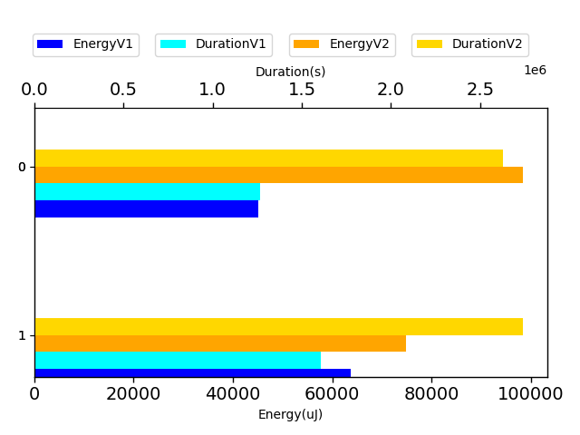

## com.google.gson.GsonTypeAdapterTest

| Test | IterationV1 | IterationV2 | DeltaIteration |
| --- | --- | --- | --- |
| com.google.gson.GsonTypeAdapterTest-testDeserializerForAbstractClass | 93 | 95 | 2 |

| Test | EnergyV1 | EnergyV2 | DeltaEnergy |
| --- | --- | --- | --- |
| com.google.gson.GsonTypeAdapterTest-testDeserializerForAbstractClass | 112701.48812687573 | 115231.51994776295 | 2530.0318208872195 |

| Test | DurationV1 | DurationsV2 | DeltaDuration |
| --- | --- | --- | --- |
| com.google.gson.GsonTypeAdapterTest-testDeserializerForAbstractClass | 3655376.6527966075 | 4431832.465619783 | 776455.8128231755 |

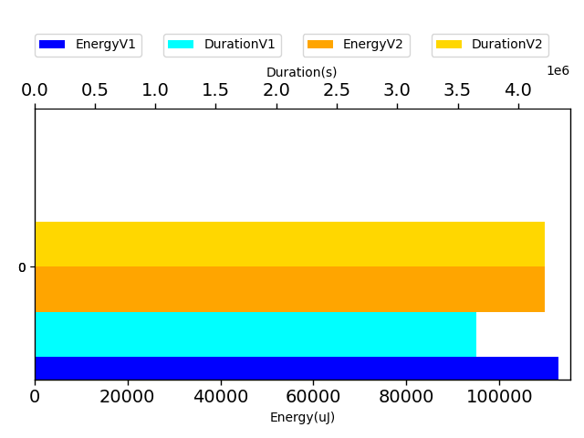

## com.google.gson.functional.PrintFormattingTest

| Test | IterationV1 | IterationV2 | DeltaIteration |
| --- | --- | --- | --- |
| com.google.gson.functional.PrintFormattingTest-testCompactFormattingLeavesNoWhiteSpace | 58 | 55 | -3 |

| Test | EnergyV1 | EnergyV2 | DeltaEnergy |
| --- | --- | --- | --- |
| com.google.gson.functional.PrintFormattingTest-testCompactFormattingLeavesNoWhiteSpace | 58019.32061726401 | 89099.41039744177 | 31080.089780177754 |

| Test | DurationV1 | DurationsV2 | DeltaDuration |
| --- | --- | --- | --- |
| com.google.gson.functional.PrintFormattingTest-testCompactFormattingLeavesNoWhiteSpace | 1211616.3358013276 | 2615688.631724109 | 1404072.2959227813 |

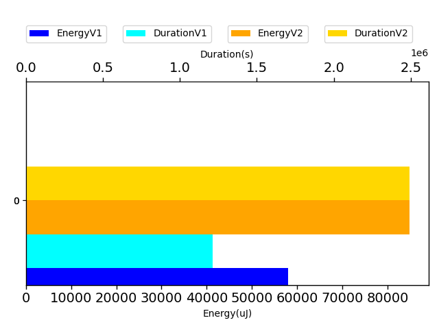

## com.google.gson.internal.bind.RecursiveTypesResolveTest

| Test | IterationV1 | IterationV2 | DeltaIteration |
| --- | --- | --- | --- |
| com.google.gson.internal.bind.RecursiveTypesResolveTest-testRecursiveResolveSimple | 95 | 92 | -3 |
| com.google.gson.internal.bind.RecursiveTypesResolveTest-testIssue603PrintStream | 99 | 99 | 0 |
| com.google.gson.internal.bind.RecursiveTypesResolveTest-testRecursiveTypeVariablesResolve12 | 43 | 45 | 2 |
| com.google.gson.internal.bind.RecursiveTypesResolveTest-testIssue440WeakReference | 78 | 80 | 2 |
| com.google.gson.internal.bind.RecursiveTypesResolveTest-testRecursiveTypeVariablesResolve1 | 36 | 47 | 11 |

| Test | EnergyV1 | EnergyV2 | DeltaEnergy |
| --- | --- | --- | --- |
| com.google.gson.internal.bind.RecursiveTypesResolveTest-testRecursiveResolveSimple | 46464.146771065105 | 64479.786463261145 | 18015.63969219604 |
| com.google.gson.internal.bind.RecursiveTypesResolveTest-testIssue603PrintStream | 139561.43954263063 | 125448.63143676607 | -14112.808105864562 |
| com.google.gson.internal.bind.RecursiveTypesResolveTest-testRecursiveTypeVariablesResolve12 | 43593.08243329233 | 42665.15628245167 | -927.9261508406562 |
| com.google.gson.internal.bind.RecursiveTypesResolveTest-testIssue440WeakReference | 42356.97100441932 | 41608.59070661559 | -748.3802978037274 |
| com.google.gson.internal.bind.RecursiveTypesResolveTest-testRecursiveTypeVariablesResolve1 | 43259.276971761195 | 44412.666674818334 | 1153.3897030571388 |

| Test | DurationV1 | DurationsV2 | DeltaDuration |
| --- | --- | --- | --- |
| com.google.gson.internal.bind.RecursiveTypesResolveTest-testRecursiveResolveSimple | 1366679.696506673 | 1351917.2942721292 | -14762.402234543813 |
| com.google.gson.internal.bind.RecursiveTypesResolveTest-testIssue603PrintStream | 3341468.2308764486 | 3373055.8487419197 | 31587.61786547117 |
| com.google.gson.internal.bind.RecursiveTypesResolveTest-testRecursiveTypeVariablesResolve12 | 650184.79457213 | 607885.1580719443 | -42299.636500185705 |
| com.google.gson.internal.bind.RecursiveTypesResolveTest-testIssue440WeakReference | 1042139.0250104152 | 852154.626385926 | -189984.3986244892 |
| com.google.gson.internal.bind.RecursiveTypesResolveTest-testRecursiveTypeVariablesResolve1 | 667682.633868366 | 506665.9370992501 | -161016.69676911592 |

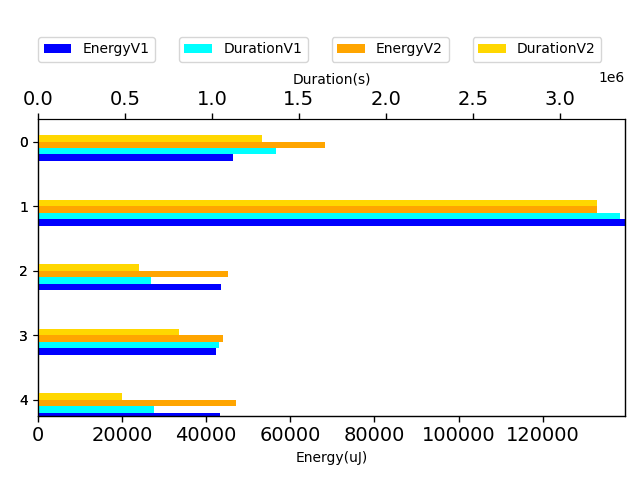

## com.google.gson.functional.CustomSerializerTest

| Test | IterationV1 | IterationV2 | DeltaIteration |
| --- | --- | --- | --- |
| com.google.gson.functional.CustomSerializerTest-testBaseClassSerializerInvokedForBaseClassFields | 33 | 37 | 4 |
| com.google.gson.functional.CustomSerializerTest-testSubClassSerializerInvokedForBaseClassFieldsHoldingArrayOfSubClassInstances | 31 | 49 | 18 |
| com.google.gson.functional.CustomSerializerTest-testSubClassSerializerInvokedForBaseClassFieldsHoldingSubClassInstances | 62 | 67 | 5 |
| com.google.gson.functional.CustomSerializerTest-testBaseClassSerializerInvokedForBaseClassFieldsHoldingSubClassInstances | 33 | 40 | 7 |

| Test | EnergyV1 | EnergyV2 | DeltaEnergy |
| --- | --- | --- | --- |
| com.google.gson.functional.CustomSerializerTest-testBaseClassSerializerInvokedForBaseClassFields | 47235.07259149314 | 43019.59527487394 | -4215.477316619203 |
| com.google.gson.functional.CustomSerializerTest-testSubClassSerializerInvokedForBaseClassFieldsHoldingArrayOfSubClassInstances | 43797.13513279986 | 40250.509564924556 | -3546.6255678753005 |
| com.google.gson.functional.CustomSerializerTest-testSubClassSerializerInvokedForBaseClassFieldsHoldingSubClassInstances | 146909.03240447762 | 45696.53453625823 | -101212.49786821939 |
| com.google.gson.functional.CustomSerializerTest-testBaseClassSerializerInvokedForBaseClassFieldsHoldingSubClassInstances | 41369.21573062916 | 45709.07009643831 | 4339.854365809144 |

| Test | DurationV1 | DurationsV2 | DeltaDuration |
| --- | --- | --- | --- |
| com.google.gson.functional.CustomSerializerTest-testBaseClassSerializerInvokedForBaseClassFields | 620483.2650030435 | 457703.2923348987 | -162779.97266814474 |
| com.google.gson.functional.CustomSerializerTest-testSubClassSerializerInvokedForBaseClassFieldsHoldingArrayOfSubClassInstances | 989587.5445581949 | 509443.92982915 | -480143.61472904496 |
| com.google.gson.functional.CustomSerializerTest-testSubClassSerializerInvokedForBaseClassFieldsHoldingSubClassInstances | 2971128.16009515 | 755804.286360513 | -2215323.873734637 |
| com.google.gson.functional.CustomSerializerTest-testBaseClassSerializerInvokedForBaseClassFieldsHoldingSubClassInstances | 526244.6293403297 | 584909.4959527925 | 58664.86661246279 |

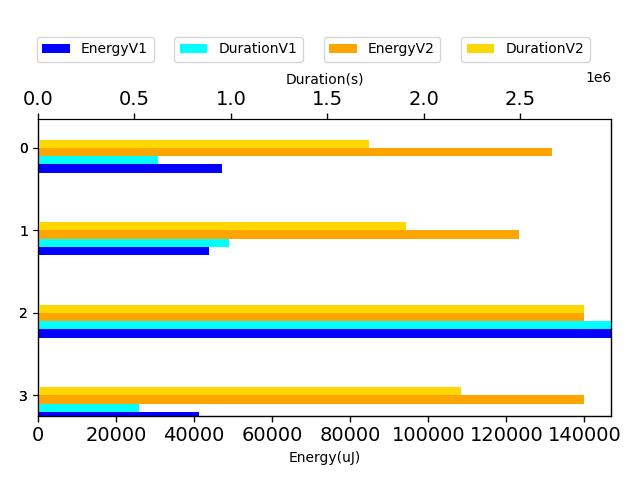

## com.google.gson.regression.JsonAdapterNullSafeTest

| Test | IterationV1 | IterationV2 | DeltaIteration |
| --- | --- | --- | --- |
| com.google.gson.regression.JsonAdapterNullSafeTest-testNullSafeBugSerialize | 80 | 84 | 4 |
| com.google.gson.regression.JsonAdapterNullSafeTest-testNullSafeBugDeserialize | 37 | 36 | -1 |

| Test | EnergyV1 | EnergyV2 | DeltaEnergy |
| --- | --- | --- | --- |
| com.google.gson.regression.JsonAdapterNullSafeTest-testNullSafeBugSerialize | 46731.361375408844 | 44049.6311345311 | -2681.730240877747 |
| com.google.gson.regression.JsonAdapterNullSafeTest-testNullSafeBugDeserialize | 45317.42048594057 | 43260.92769056413 | -2056.492795376442 |

| Test | DurationV1 | DurationsV2 | DeltaDuration |
| --- | --- | --- | --- |
| com.google.gson.regression.JsonAdapterNullSafeTest-testNullSafeBugSerialize | 1141388.095360022 | 981832.4804307175 | -159555.61492930457 |
| com.google.gson.regression.JsonAdapterNullSafeTest-testNullSafeBugDeserialize | 681481.9332390917 | 621754.7951321079 | -59727.13810698374 |

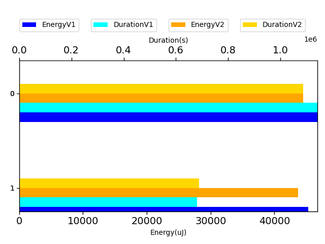

## com.google.gson.functional.JavaUtilTest

| Test | IterationV1 | IterationV2 | DeltaIteration |
| --- | --- | --- | --- |
| com.google.gson.functional.JavaUtilTest-testCurrency | 99 | 99 | 0 |
| com.google.gson.functional.JavaUtilTest-testProperties | 26 | 18 | -8 |

| Test | EnergyV1 | EnergyV2 | DeltaEnergy |
| --- | --- | --- | --- |
| com.google.gson.functional.JavaUtilTest-testCurrency | 121532.0816733103 | 106799.15858443557 | -14732.923088874726 |
| com.google.gson.functional.JavaUtilTest-testProperties | 45129.17279732227 | 44810.5341796875 | -318.63861763477325 |

| Test | DurationV1 | DurationsV2 | DeltaDuration |
| --- | --- | --- | --- |
| com.google.gson.functional.JavaUtilTest-testCurrency | 3130092.3563989187 | 2565991.24193735 | -564101.1144615686 |
| com.google.gson.functional.JavaUtilTest-testProperties | 472976.19946968555 | 439095.35346221924 | -33880.846007466316 |

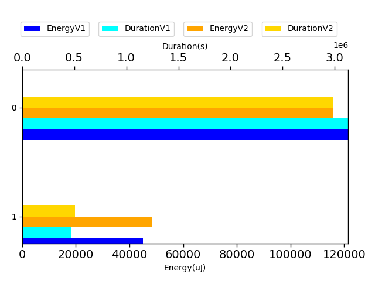

## com.google.gson.functional.DelegateTypeAdapterTest

| Test | IterationV1 | IterationV2 | DeltaIteration |
| --- | --- | --- | --- |
| com.google.gson.functional.DelegateTypeAdapterTest-testDelegateInvoked | 87 | 89 | 2 |

| Test | EnergyV1 | EnergyV2 | DeltaEnergy |
| --- | --- | --- | --- |
| com.google.gson.functional.DelegateTypeAdapterTest-testDelegateInvoked | 48189.71243906962 | 46145.98114251326 | -2043.7312965563615 |

| Test | DurationV1 | DurationsV2 | DeltaDuration |
| --- | --- | --- | --- |
| com.google.gson.functional.DelegateTypeAdapterTest-testDelegateInvoked | 1431950.1544379552 | 1217415.719700477 | -214534.43473747815 |

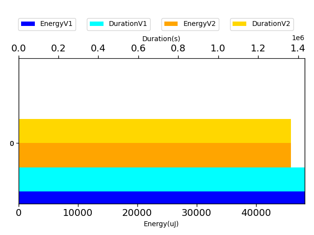

## com.google.gson.ObjectTypeAdapterTest

| Test | IterationV1 | IterationV2 | DeltaIteration |
| --- | --- | --- | --- |
| com.google.gson.ObjectTypeAdapterTest-testSerialize | 76 | 76 | 0 |
| com.google.gson.ObjectTypeAdapterTest-testSerializeNullValue | 25 | 23 | -2 |

| Test | EnergyV1 | EnergyV2 | DeltaEnergy |
| --- | --- | --- | --- |
| com.google.gson.ObjectTypeAdapterTest-testSerialize | 45269.74290409452 | 84566.3298086701 | 39296.586904575575 |
| com.google.gson.ObjectTypeAdapterTest-testSerializeNullValue | 43758.45019394159 | 47429.18321585655 | 3670.733021914959 |

| Test | DurationV1 | DurationsV2 | DeltaDuration |
| --- | --- | --- | --- |
| com.google.gson.ObjectTypeAdapterTest-testSerialize | 918461.2890589181 | 1791888.8284733878 | 873427.5394144696 |
| com.google.gson.ObjectTypeAdapterTest-testSerializeNullValue | 446423.3106791377 | 554397.4514238834 | 107974.14074474573 |

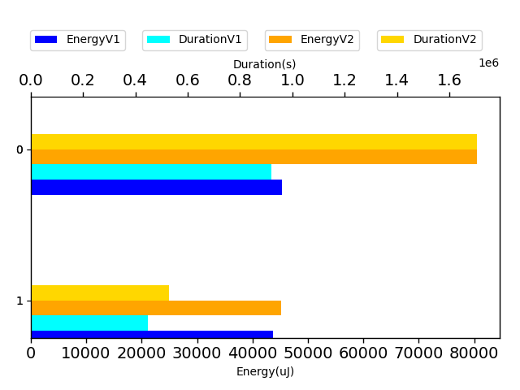

## com.google.gson.JsonParserTest

| Test | IterationV1 | IterationV2 | DeltaIteration |
| --- | --- | --- | --- |
| com.google.gson.JsonParserTest-testReadWriteTwoObjects | 63 | 61 | -2 |

| Test | EnergyV1 | EnergyV2 | DeltaEnergy |
| --- | --- | --- | --- |
| com.google.gson.JsonParserTest-testReadWriteTwoObjects | 43597.613067471066 | 41837.44941176085 | -1760.1636557102174 |

| Test | DurationV1 | DurationsV2 | DeltaDuration |
| --- | --- | --- | --- |
| com.google.gson.JsonParserTest-testReadWriteTwoObjects | 752054.8821872859 | 1062201.9925131372 | 310147.11032585124 |

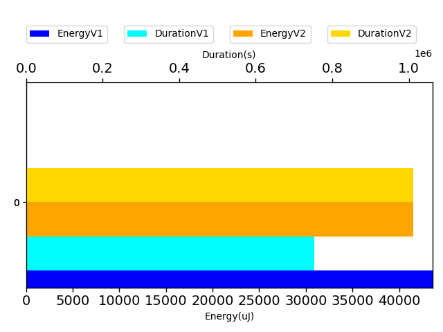

## com.google.gson.functional.InstanceCreatorTest

| Test | IterationV1 | IterationV2 | DeltaIteration |
| --- | --- | --- | --- |
| com.google.gson.functional.InstanceCreatorTest-testInstanceCreatorReturnsBaseType | 58 | 60 | 2 |
| com.google.gson.functional.InstanceCreatorTest-testInstanceCreatorReturnsSubTypeForField | 58 | 57 | -1 |
| com.google.gson.functional.InstanceCreatorTest-testInstanceCreatorReturnsSubTypeForTopLevelObject | 46 | 32 | -14 |

| Test | EnergyV1 | EnergyV2 | DeltaEnergy |
| --- | --- | --- | --- |
| com.google.gson.functional.InstanceCreatorTest-testInstanceCreatorReturnsBaseType | 45464.26802916266 | 110259.64247331012 | 64795.374444147456 |
| com.google.gson.functional.InstanceCreatorTest-testInstanceCreatorReturnsSubTypeForField | 42502.32781685895 | 43685.05204780186 | 1182.7242309429057 |
| com.google.gson.functional.InstanceCreatorTest-testInstanceCreatorReturnsSubTypeForTopLevelObject | 42218.72432610433 | 41402.89102163864 | -815.8333044656902 |

| Test | DurationV1 | DurationsV2 | DeltaDuration |
| --- | --- | --- | --- |
| com.google.gson.functional.InstanceCreatorTest-testInstanceCreatorReturnsBaseType | 782495.353131872 | 2498841.4143890254 | 1716346.0612571533 |
| com.google.gson.functional.InstanceCreatorTest-testInstanceCreatorReturnsSubTypeForField | 685331.4238699682 | 816527.4744663351 | 131196.050596367 |
| com.google.gson.functional.InstanceCreatorTest-testInstanceCreatorReturnsSubTypeForTopLevelObject | 576493.2078073017 | 666301.525333921 | 89808.3175266193 |

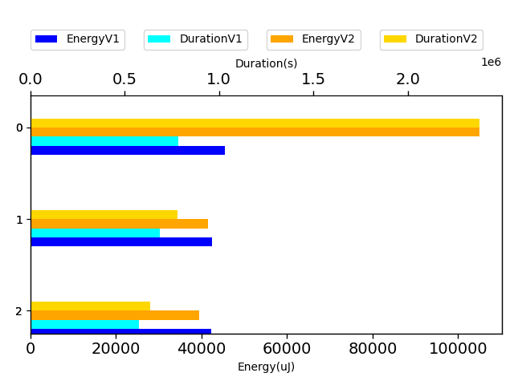

## com.google.gson.CommentsTest

| Test | IterationV1 | IterationV2 | DeltaIteration |
| --- | --- | --- | --- |
| com.google.gson.CommentsTest-testParseComments | 59 | 61 | 2 |

| Test | EnergyV1 | EnergyV2 | DeltaEnergy |
| --- | --- | --- | --- |
| com.google.gson.CommentsTest-testParseComments | 43485.2908480457 | 47696.034000089974 | 4210.743152044277 |

| Test | DurationV1 | DurationsV2 | DeltaDuration |
| --- | --- | --- | --- |
| com.google.gson.CommentsTest-testParseComments | 789139.6948770087 | 1092320.1969343033 | 303180.5020572946 |

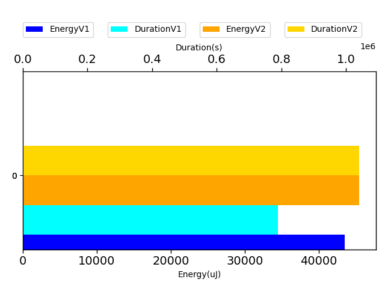

## com.google.gson.functional.LeniencyTest

| Test | IterationV1 | IterationV2 | DeltaIteration |
| --- | --- | --- | --- |
| com.google.gson.functional.LeniencyTest-testLenientFromJson | 48 | 58 | 10 |

| Test | EnergyV1 | EnergyV2 | DeltaEnergy |
| --- | --- | --- | --- |
| com.google.gson.functional.LeniencyTest-testLenientFromJson | 89849.2291102376 | 46692.14517338831 | -43157.083936849296 |

| Test | DurationV1 | DurationsV2 | DeltaDuration |
| --- | --- | --- | --- |
| com.google.gson.functional.LeniencyTest-testLenientFromJson | 3618951.355111249 | 1151739.3322293726 | -2467212.022881876 |

## com.google.gson.functional.JavaUtilConcurrentAtomicTest

| Test | IterationV1 | IterationV2 | DeltaIteration |
| --- | --- | --- | --- |
| com.google.gson.functional.JavaUtilConcurrentAtomicTest-testAtomicLongWithStringSerializationPolicy | 61 | 66 | 5 |

| Test | EnergyV1 | EnergyV2 | DeltaEnergy |
| --- | --- | --- | --- |
| com.google.gson.functional.JavaUtilConcurrentAtomicTest-testAtomicLongWithStringSerializationPolicy | 48691.142950075286 | 47480.950447956144 | -1210.1925021191419 |

| Test | DurationV1 | DurationsV2 | DeltaDuration |
| --- | --- | --- | --- |
| com.google.gson.functional.JavaUtilConcurrentAtomicTest-testAtomicLongWithStringSerializationPolicy | 1578037.0515220638 | 1103457.995152309 | -474579.0563697547 |

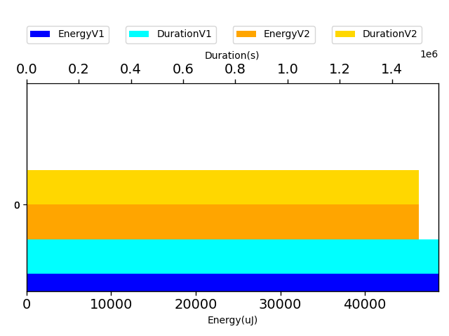

