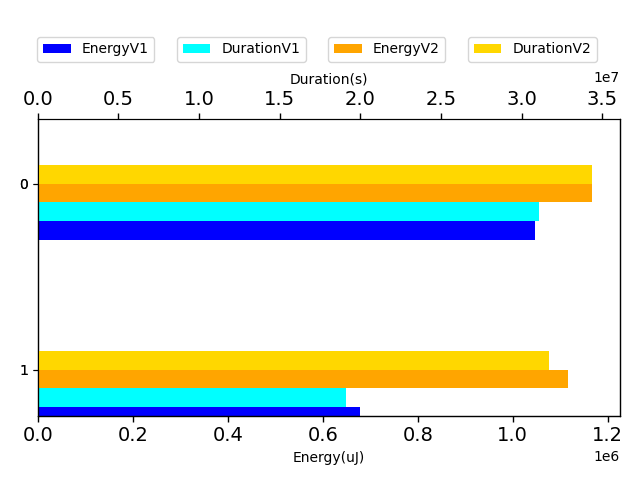
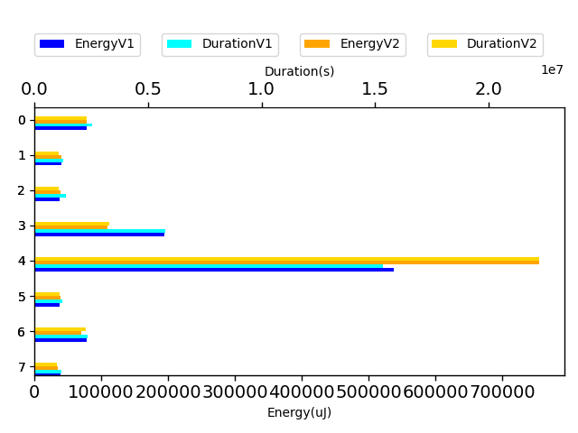
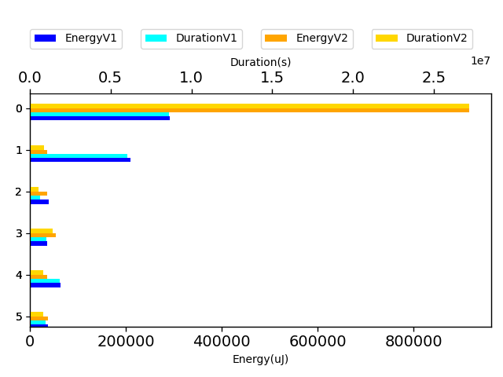

# gson 0aaf5f

https://github.com/google/gson.git/commit/0aaf5f

| Index | EnergyV1 | EnergyV2 | DeltaEnergy |
| --- | --- | --- | --- |
| 0 | 1047271.0164935689 | 1224926.5365862106 | 177655.5200926417 |
| 1 | 678791.0665521226 | 1171415.653897406 | 492624.5873452835 |

| Index | DurationV1 | DurationsV2 | DeltaDuration |
| --- | --- | --- | --- |
| 0 | 31071776.898930363 | 36076186.72956699 | 5004409.830636628 |
| 1 | 19124637.624684516 | 33280296.63357446 | 14155659.008889943 |

| Index | TestClassName | #Tests |
| --- | --- | --- |
| 0 | com.google.gson.functional.DefaultTypeAdaptersTest | 8 |
| 1 | com.google.gson.DefaultDateTypeAdapterTest | 6 |

| Time Label | Time (s) |
| --- | --- |
| Selection | 35.82942223548889 |
| Injection | 14.121205568313599 |
| Total | 1417.9607286453247 |
## com.google.gson.functional.DefaultTypeAdaptersTest

| Test | IterationV1 | IterationV2 | DeltaIteration |
| --- | --- | --- | --- |
| com.google.gson.functional.DefaultTypeAdaptersTest-testDateSerializationWithPatternNotOverridenByTypeAdapter | 99 | 99 | 0 |
| com.google.gson.functional.DefaultTypeAdaptersTest-testSqlDateSerialization | 92 | 71 | -21 |
| com.google.gson.functional.DefaultTypeAdaptersTest-testTimestampSerialization | 97 | 57 | -40 |
| com.google.gson.functional.DefaultTypeAdaptersTest-testDefaultDateDeserializationUsingBuilder | 99 | 98 | -1 |
| com.google.gson.functional.DefaultTypeAdaptersTest-testNullSerialization | 99 | 99 | 0 |
| com.google.gson.functional.DefaultTypeAdaptersTest-testDateDeserializationWithPattern | 87 | 71 | -16 |
| com.google.gson.functional.DefaultTypeAdaptersTest-testDateSerializationInCollection | 99 | 99 | 0 |
| com.google.gson.functional.DefaultTypeAdaptersTest-testDateSerializationWithPattern | 87 | 71 | -16 |

| Test | EnergyV1 | EnergyV2 | DeltaEnergy |
| --- | --- | --- | --- |
| com.google.gson.functional.DefaultTypeAdaptersTest-testDateSerializationWithPatternNotOverridenByTypeAdapter | 78456.13969951433 | 81956.79130364915 | 3500.6516041348223 |
| com.google.gson.functional.DefaultTypeAdaptersTest-testSqlDateSerialization | 40787.76655996246 | 42371.40780145759 | 1583.6412414951337 |
| com.google.gson.functional.DefaultTypeAdaptersTest-testTimestampSerialization | 38533.101537147115 | 41276.90079244128 | 2743.799255294165 |
| com.google.gson.functional.DefaultTypeAdaptersTest-testDefaultDateDeserializationUsingBuilder | 195327.1065955127 | 114998.38202185681 | -80328.7245736559 |
| com.google.gson.functional.DefaultTypeAdaptersTest-testNullSerialization | 538416.4443828778 | 793233.2637506342 | 254816.81936775637 |
| com.google.gson.functional.DefaultTypeAdaptersTest-testDateDeserializationWithPattern | 37693.69764509551 | 40997.32767653528 | 3303.6300314397668 |
| com.google.gson.functional.DefaultTypeAdaptersTest-testDateSerializationInCollection | 78091.16543416983 | 73769.35723521473 | -4321.808198955099 |
| com.google.gson.functional.DefaultTypeAdaptersTest-testDateSerializationWithPattern | 39965.59463928912 | 36323.10600442151 | -3642.488634867608 |

| Test | DurationV1 | DurationsV2 | DeltaDuration |
| --- | --- | --- | --- |
| com.google.gson.functional.DefaultTypeAdaptersTest-testDateSerializationWithPatternNotOverridenByTypeAdapter | 2527188.32620384 | 2410821.076691847 | -116367.24951199302 |
| com.google.gson.functional.DefaultTypeAdaptersTest-testSqlDateSerialization | 1280523.2274022242 | 1115006.5067129023 | -165516.72068932187 |
| com.google.gson.functional.DefaultTypeAdaptersTest-testTimestampSerialization | 1376454.4291598182 | 1134679.8116843114 | -241774.61747550685 |
| com.google.gson.functional.DefaultTypeAdaptersTest-testDefaultDateDeserializationUsingBuilder | 5768690.99658205 | 3464801.7316720523 | -2303889.2649099976 |
| com.google.gson.functional.DefaultTypeAdaptersTest-testNullSerialization | 15348189.28103741 | 23324379.54190789 | 7976190.260870481 |
| com.google.gson.functional.DefaultTypeAdaptersTest-testDateDeserializationWithPattern | 1234356.1409667155 | 1185540.0120748389 | -48816.128891876666 |
| com.google.gson.functional.DefaultTypeAdaptersTest-testDateSerializationInCollection | 2356010.5694221756 | 2376182.323469786 | 20171.75404761033 |
| com.google.gson.functional.DefaultTypeAdaptersTest-testDateSerializationWithPattern | 1180363.9281561319 | 1064775.7253533606 | -115588.20280277124 |

## com.google.gson.DefaultDateTypeAdapterTest

| Test | IterationV1 | IterationV2 | DeltaIteration |
| --- | --- | --- | --- |
| com.google.gson.DefaultDateTypeAdapterTest-testDateDeserializationISO8601 | 99 | 99 | 0 |
| com.google.gson.DefaultDateTypeAdapterTest-testUnexpectedToken | 51 | 47 | -4 |
| com.google.gson.DefaultDateTypeAdapterTest-testInvalidDatePattern | 21 | 27 | 6 |
| com.google.gson.DefaultDateTypeAdapterTest-testDateSerialization | 64 | 69 | 5 |
| com.google.gson.DefaultDateTypeAdapterTest-testDatePattern | 68 | 55 | -13 |
| com.google.gson.DefaultDateTypeAdapterTest-testNullValue | 51 | 56 | 5 |

| Test | EnergyV1 | EnergyV2 | DeltaEnergy |
| --- | --- | --- | --- |
| com.google.gson.DefaultDateTypeAdapterTest-testDateDeserializationISO8601 | 291365.0317488219 | 961406.4496287731 | 670041.4178799512 |
| com.google.gson.DefaultDateTypeAdapterTest-testUnexpectedToken | 210038.3902582792 | 38335.31300333922 | -171703.07725493997 |
| com.google.gson.DefaultDateTypeAdapterTest-testInvalidDatePattern | 40042.67897748947 | 38811.60156819224 | -1231.0774092972279 |
| com.google.gson.DefaultDateTypeAdapterTest-testDateSerialization | 36267.3391081707 | 56168.81811158947 | 19901.479003418768 |
| com.google.gson.DefaultDateTypeAdapterTest-testDatePattern | 64084.78485625093 | 37675.41004725377 | -26409.374808997163 |
| com.google.gson.DefaultDateTypeAdapterTest-testNullValue | 36992.841603110355 | 39018.06153825818 | 2025.2199351478266 |

| Test | DurationV1 | DurationsV2 | DeltaDuration |
| --- | --- | --- | --- |
| com.google.gson.DefaultDateTypeAdapterTest-testDateDeserializationISO8601 | 8623051.768508742 | 28555828.279207822 | 19932776.51069908 |
| com.google.gson.DefaultDateTypeAdapterTest-testUnexpectedToken | 6014577.45690814 | 911488.6952591109 | -5103088.761649029 |
| com.google.gson.DefaultDateTypeAdapterTest-testInvalidDatePattern | 637764.2372732162 | 585746.7166076005 | -52017.5206656158 |
| com.google.gson.DefaultDateTypeAdapterTest-testDateSerialization | 1023878.3635096196 | 1481947.9714345282 | 458069.60792490863 |
| com.google.gson.DefaultDateTypeAdapterTest-testDatePattern | 1860202.746394437 | 865135.2034145062 | -995067.5429799309 |
| com.google.gson.DefaultDateTypeAdapterTest-testNullValue | 965163.0520903626 | 880149.7676508902 | -85013.28443947248 |

