# gson 3bf196

https://github.com/google/gson.git/commit/3bf196

| Index | EnergyV1 | EnergyV2 | DeltaEnergy |
| --- | --- | --- | --- |
| 0 | 172708.6212234497 | 170181.80126953125 | -2526.819953918457 |
| 1 | 4304239.845302887 | 4215129.38913565 | -89110.4561672369 |
| 2 | 809916.2604994713 | 863018.6323917445 | 53102.37189227319 |
| 3 | 424015.27205809765 | 384956.23808754294 | -39059.03397055471 |
| 4 | 484282.8744164132 | 395406.9857794504 | -88875.8886369628 |
| 5 | 292787.8597154631 | 312923.12625418825 | 20135.266538725118 |
| 6 | 407167.65866070887 | 535065.7364537268 | 127898.0777930179 |
| 7 | 271318.15820032905 | 314709.80244078906 | 43391.64424046001 |
| 8 | 336584.7758457028 | 359562.00747684814 | 22977.231631145347 |
| 9 | 1240223.301352248 | 1405460.7621494269 | 165237.4607971788 |
| 10 | 152686.00835189683 | 192699.5726082565 | 40013.56425635968 |
| 11 | 459936.4256842698 | 358218.54686029383 | -101717.87882397597 |
| 12 | 825711.1587337903 | 687120.7853366006 | -138590.37339718966 |
| 13 | 729610.1700686612 | 694625.2622083755 | -34984.90786028572 |
| 14 | 344845.28284731763 | 352836.8710344324 | 7991.588187114743 |
| 15 | 2212018.3482003463 | 2247856.9921999476 | 35838.64399960125 |
| 16 | 442874.279809767 | 398637.35784972395 | -44236.92196004302 |
| 17 | 567554.3651116104 | 953604.380440602 | 386050.0153289916 |
| 18 | 300889.207487395 | 258630.66519807608 | -42258.542289318895 |
| 19 | 3413074.416832 | 3095797.2412925223 | -317277.1755394777 |
| 20 | 787227.8966002464 | 753457.7085189819 | -33770.188081264496 |
| 21 | 797679.6269911736 | 911431.3920606002 | 113751.76506942662 |
| 22 | 710881.5451445007 | 691068.7772300232 | -19812.767914477503 |
| 23 | 76706.21281300776 | 68018.65923744845 | -8687.553575559316 |
| 24 | 335840.6495618762 | 431955.11297134706 | 96114.46340947086 |
| 25 | 183910.0738132749 | 182417.90935256222 | -1492.1644607126946 |
| 26 | 135909.18506175512 | 168420.15929297614 | 32510.974231221015 |
| 27 | 1676280.638831381 | 1847552.6899082754 | 171272.0510768944 |
| 28 | 621062.9743151633 | 480516.2766539039 | -140546.69766125944 |
| 29 | 475389.1608308079 | 516599.5281154347 | 41210.36728462682 |
| 30 | 130865.75749487075 | 145053.6550157623 | 14187.897520891565 |
| 31 | 528959.8997491386 | 519556.40212546545 | -9403.497623673175 |
| 32 | 153180.08714836795 | 183315.23053127888 | 30135.14338291093 |
| 33 | 311251.3089926125 | 305776.10063460877 | -5475.208358003758 |
| 34 | 354849.6760332772 | 108334.14690492375 | -246515.52912835343 |
| 35 | 86919.33168268204 | 79567.51988101006 | -7351.811801671982 |
| 36 | 793451.6228326146 | 738466.8352603437 | -54984.78757227084 |
| 37 | 1134254.549197938 | 1128635.022916068 | -5619.52628186997 |
| 38 | 218671.4610678205 | 792244.0813637788 | 573572.6202959584 |
| 39 | 212496.93331898196 | 267572.30377437983 | 55075.370455397875 |
| 40 | 302240.6541910063 | 361916.7251626431 | 59676.0709716368 |
| 41 | 1029010.4118932836 | 866442.09174899 | -162568.3201442936 |
| 42 | 270736.8706703404 | 265601.60284003115 | -5135.267830309225 |
| 43 | 217871.6589631084 | 238826.84240472855 | 20955.183441620145 |
| 44 | 424600.7591394548 | 370471.9845109589 | -54128.774628495914 |
| 45 | 179200.88712114317 | 177119.96858949933 | -2080.918531643838 |
| 46 | 90493.46036469768 | 85751.88525066996 | -4741.575114027713 |
| 47 | 332075.1276696118 | 350640.8300744856 | 18565.702404873853 |
| 48 | 153685.78052199248 | 129815.06730362425 | -23870.713218368226 |
| 49 | 176727.63870166207 | 150957.28453402297 | -25770.354167639103 |
| 50 | 98987.54776104154 | 109545.04054708639 | 10557.492786044852 |
| 51 | 224290.07468042456 | 219108.88872215938 | -5181.185958265181 |
| 52 | 224038.8672543397 | 259626.36800432228 | 35587.50074998257 |
| 53 | 70140.44571890855 | 67393.23045703015 | -2747.215261878402 |
| 54 | 92929.9806351345 | 82947.42301064354 | -9982.55762449096 |
| 55 | 224024.1722647843 | 277146.19229020184 | 53122.02002541753 |
| 56 | 213800.22689139342 | 89978.16789148944 | -123822.05899990398 |
| 57 | 88122.54248850107 | 139178.97835914796 | 51056.43587064689 |
| 58 | 90756.06363874947 | 97987.93382859921 | 7231.870189849738 |
| 59 | 92527.73260783398 | 114220.96342952663 | 21693.230821692647 |
| 60 | 43952.154233774825 | 43932.74459226452 | -19.409641510304937 |
| 61 | 130617.84394077267 | 155968.1329772717 | 25350.289036499045 |
| 62 | 221104.02415411742 | 218116.33608292567 | -2987.6880711917474 |
| 63 | 105387.69935765862 | 82776.82235699147 | -22610.877000667155 |
| 64 | 173488.156887019 | 170341.74909449206 | -3146.4077925269376 |
| 65 | 131129.29885215708 | 128316.23736122728 | -2813.061490929802 |
| 66 | 42172.25857152045 | 44559.66453255457 | 2387.405961034121 |
| 67 | 58414.77097825803 | 40925.438762695914 | -17489.332215562114 |

| Index | DurationV1 | DurationsV2 | DeltaDuration |
| --- | --- | --- | --- |
| 0 | 1298309.1685638428 | 1315115.3149414062 | 16806.146377563477 |
| 1 | 44309895.46856763 | 39064696.6560699 | -5245198.812497735 |
| 2 | 13010523.920051472 | 16388755.374856971 | 3378231.454805499 |
| 3 | 7703625.702648903 | 6720143.701913057 | -983482.0007358463 |
| 4 | 9195485.953419203 | 6764735.034666887 | -2430750.9187523164 |
| 5 | 6325157.904874794 | 5357352.509428456 | -967805.3954463378 |
| 6 | 6461643.385150298 | 8942473.748739304 | 2480830.3635890065 |
| 7 | 7640001.391628153 | 7487749.823357323 | -152251.5682708295 |
| 8 | 4775087.447196911 | 6691813.432173423 | 1916725.9849765114 |
| 9 | 22701666.423930902 | 22753228.391028825 | 51561.96709792316 |
| 10 | 3931675.3457074338 | 4789168.306007637 | 857492.960300203 |
| 11 | 12102198.231389351 | 7364776.354072833 | -4737421.877316518 |
| 12 | 16359620.561243344 | 10836985.941186583 | -5522634.620056761 |
| 13 | 16466894.43694031 | 16465419.63220249 | -1474.8047378212214 |
| 14 | 4391222.650005015 | 5294524.5409902735 | 903301.8909852589 |
| 15 | 39602652.19613966 | 39115953.119579665 | -486699.0765599981 |
| 16 | 8076201.6209074175 | 6986513.662384477 | -1089687.95852294 |
| 17 | 10129903.183944367 | 19500070.11524221 | 9370166.931297842 |
| 18 | 7697541.245319936 | 4535744.106553456 | -3161797.1387664806 |
| 19 | 60259858.822985016 | 56905813.90672495 | -3354044.9162600636 |
| 20 | 6804643.609972477 | 6423549.049232483 | -381094.56073999405 |
| 21 | 16033137.539237257 | 23119736.38134544 | 7086598.842108183 |
| 22 | 10658588.76995948 | 9469832.842720214 | -1188755.9272392653 |
| 23 | 2139279.3622326115 | 1586704.887297279 | -552574.4749353325 |
| 24 | 5168827.887977757 | 8291445.54037629 | 3122617.652398533 |
| 25 | 3060516.5479639927 | 2981955.146160351 | -78561.40180364158 |
| 26 | 1841301.0541810747 | 3553889.767655959 | 1712588.7134748842 |
| 27 | 22488090.907535665 | 33699508.36795488 | 11211417.460419215 |
| 28 | 13433072.2397258 | 7853889.643228721 | -5579182.596497079 |
| 29 | 10784736.850594927 | 11427973.29580653 | 643236.4452116042 |
| 30 | 2046849.8741004202 | 2269174.2071715454 | 222324.3330711252 |
| 31 | 11752738.729127306 | 8923970.796180176 | -2828767.932947131 |
| 32 | 3379066.356867876 | 3813828.7067024973 | 434762.3498346214 |
| 33 | 4592574.668782095 | 5058967.202624377 | 466392.53384228144 |
| 34 | 10913549.40728837 | 2642842.4444500124 | -8270706.962838358 |
| 35 | 1176691.6139934063 | 1397289.9052352905 | 220598.29124188423 |
| 36 | 18725751.100397725 | 19197397.453130357 | 471646.3527326323 |
| 37 | 13497813.948407631 | 14912714.071031528 | 1414900.1226238962 |
| 38 | 3467898.123930922 | 22075297.086298674 | 18607398.96236775 |
| 39 | 3828824.581005244 | 6489036.967755057 | 2660212.386749813 |
| 40 | 7384923.803644715 | 9688088.552019317 | 2303164.748374602 |
| 41 | 23943590.472640272 | 22849377.70321887 | -1094212.7694214024 |
| 42 | 4336971.20795911 | 4334768.954066746 | -2202.2538923639804 |
| 43 | 2625136.0275806664 | 2739755.8377198665 | 114619.81013920018 |
| 44 | 7031659.481151085 | 4966918.50894466 | -2064740.972206425 |
| 45 | 2630708.0893244245 | 2802203.983016995 | 171495.89369257027 |
| 46 | 1514838.7525786557 | 1507527.6810082223 | -7311.071570433443 |
| 47 | 4371974.449754458 | 5550745.453675356 | 1178771.0039208978 |
| 48 | 3036527.249908452 | 3408637.759424286 | 372110.50951583404 |
| 49 | 3549837.145698296 | 3060491.5482419813 | -489345.5974563146 |
| 50 | 2704154.118590437 | 2535591.009682913 | -168563.10890752403 |
| 51 | 2967668.8765006037 | 4222516.661602989 | 1254847.785102385 |
| 52 | 4355860.946498944 | 5656450.641234685 | 1300589.6947357403 |
| 53 | 1750034.0180545943 | 1850558.0999074571 | 100524.08185286284 |
| 54 | 1000179.5126907197 | 1287808.7105862931 | 287629.19789557345 |
| 55 | 3092604.711155166 | 4899216.076398101 | 1806611.3652429348 |
| 56 | 5968636.45129009 | 1673362.475322322 | -4295273.975967768 |
| 57 | 1711051.2323374366 | 4410406.978296995 | 2699355.7459595585 |
| 58 | 1880570.2727677047 | 1423643.8654791773 | -456926.40728852735 |
| 59 | 2272634.5019929595 | 2379686.832360356 | 107052.33036739659 |
| 60 | 1191421.0765019497 | 743603.0386423527 | -447818.037859597 |
| 61 | 1998406.3166269362 | 2772062.2335512573 | 773655.9169243211 |
| 62 | 3014678.65042705 | 4867771.454621529 | 1853092.8041944792 |
| 63 | 2627964.155619085 | 1075623.3612053394 | -1552340.7944137454 |
| 64 | 2259289.016243116 | 1984783.4652206819 | -274505.55102243414 |
| 65 | 1481388.899843906 | 1895047.364938538 | 413658.465094632 |
| 66 | 552635.6603146046 | 629376.111143922 | 76740.45082931733 |
| 67 | 1283081.3857317278 | 667356.4860780591 | -615724.8996536687 |

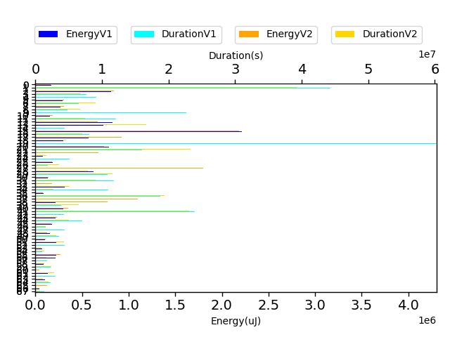

| Index | TestClassName | #Tests |
| --- | --- | --- |
| 0 | com.google.gson.InnerClassExclusionStrategyTest | 4 |
| 1 | com.google.gson.functional.PrimitiveTest | 99 |
| 2 | com.google.gson.functional.CustomTypeAdaptersTest | 19 |
| 3 | com.google.gson.functional.StreamingTypeAdaptersTest | 9 |
| 4 | com.google.gson.functional.JsonAdapterAnnotationOnClassesTest | 9 |
| 5 | com.google.gson.functional.CustomDeserializerTest | 7 |
| 6 | com.google.gson.functional.ExclusionStrategyFunctionalTest | 9 |
| 7 | com.google.gson.functional.InstanceCreatorTest | 5 |
| 8 | com.google.gson.functional.JsonParserTest | 8 |
| 9 | com.google.gson.functional.CollectionTest | 29 |
| 10 | com.google.gson.functional.JsonAdapterSerializerDeserializerTest | 3 |
| 11 | com.google.gson.internal.bind.RecursiveTypesResolveTest | 5 |
| 12 | com.google.gson.functional.NamingPolicyTest | 14 |
| 13 | com.google.gson.functional.CircularReferenceTest | 6 |
| 14 | com.google.gson.functional.PrettyPrintingTest | 8 |
| 15 | com.google.gson.functional.MapTest | 48 |
| 16 | com.google.gson.functional.ExposeFieldsTest | 8 |
| 17 | com.google.gson.functional.InheritanceTest | 13 |
| 18 | com.google.gson.functional.MoreSpecificTypeSerializationTest | 6 |
| 19 | com.google.gson.functional.DefaultTypeAdaptersTest | 50 |
| 20 | com.google.gson.functional.StringTest | 18 |
| 21 | com.google.gson.functional.ParameterizedTypesTest | 17 |
| 22 | com.google.gson.functional.NullObjectAndFieldTest | 16 |
| 23 | com.google.gson.JsonParserTest | 1 |
| 24 | com.google.gson.functional.ReadersWritersTest | 8 |
| 25 | com.google.gson.functional.JsonTreeTest | 4 |
| 26 | com.google.gson.DefaultMapJsonSerializerTest | 3 |
| 27 | com.google.gson.functional.ObjectTest | 39 |
| 28 | com.google.gson.functional.VersioningTest | 10 |
| 29 | com.google.gson.functional.JsonAdapterAnnotationOnFieldsTest | 10 |
| 30 | com.google.gson.functional.SerializedNameTest | 3 |
| 31 | com.google.gson.functional.EnumTest | 11 |
| 32 | com.google.gson.functional.TypeVariableTest | 3 |
| 33 | com.google.gson.functional.JavaUtilConcurrentAtomicTest | 7 |
| 34 | com.google.gson.functional.RuntimeTypeAdapterFactoryFunctionalTest | 1 |
| 35 | com.google.gson.LongSerializationPolicyTest | 2 |
| 36 | com.google.gson.functional.ConcurrencyTest | 4 |
| 37 | com.google.gson.functional.ArrayTest | 26 |
| 38 | com.google.gson.functional.FieldNamingTest | 5 |
| 39 | com.google.gson.functional.RawSerializationTest | 5 |
| 40 | com.google.gson.functional.MapAsArrayTypeAdapterTest | 5 |
| 41 | com.google.gson.JavaSerializationTest | 3 |
| 42 | com.google.gson.functional.UncategorizedTest | 6 |
| 43 | com.google.gson.functional.SecurityTest | 5 |
| 44 | com.google.gson.MixedStreamTest | 9 |
| 45 | com.google.gson.VersionExclusionStrategyTest | 3 |
| 46 | com.google.gson.functional.InterfaceTest | 2 |
| 47 | com.google.gson.functional.TypeAdapterPrecedenceTest | 8 |
| 48 | com.google.gson.functional.TypeHierarchyAdapterTest | 2 |
| 49 | com.google.gson.functional.JavaUtilTest | 2 |
| 50 | com.google.gson.DefaultInetAddressTypeAdapterTest | 1 |
| 51 | com.google.gson.GsonTypeAdapterTest | 5 |
| 52 | com.google.gson.functional.ThrowableFunctionalTest | 5 |
| 53 | com.google.gson.functional.PrintFormattingTest | 1 |
| 54 | com.google.gson.GsonBuilderTest | 2 |
| 55 | com.google.gson.functional.CustomSerializerTest | 5 |
| 56 | com.google.gson.regression.JsonAdapterNullSafeTest | 2 |
| 57 | com.google.gson.functional.DelegateTypeAdapterTest | 2 |
| 58 | com.google.gson.ObjectTypeAdapterTest | 2 |
| 59 | com.google.gson.functional.TreeTypeAdaptersTest | 2 |
| 60 | com.google.gson.functional.LeniencyTest | 1 |
| 61 | com.google.gson.functional.FieldExclusionTest | 3 |
| 62 | com.google.gson.functional.EscapingTest | 5 |
| 63 | com.google.gson.functional.PrimitiveCharacterTest | 2 |
| 64 | com.google.gson.functional.InternationalizationTest | 4 |
| 65 | com.google.gson.OverrideCoreTypeAdaptersTest | 3 |
| 66 | com.google.gson.ExposeAnnotationExclusionStrategyTest | 1 |
| 67 | com.google.gson.CommentsTest | 1 |

| Time Label | Time (s) |
| --- | --- |
| Selection | 35.4389808177948 |
| Injection | 22.09887456893921 |
| Total | 1748.8546388149261 |
## com.google.gson.InnerClassExclusionStrategyTest

| Test | IterationV1 | IterationV2 | DeltaIteration |
| --- | --- | --- | --- |
| com.google.gson.InnerClassExclusionStrategyTest-testExcludeInnerClassField | 17 | 7 | -10 |
| com.google.gson.InnerClassExclusionStrategyTest-testExcludeInnerClassObject | 7 | 11 | 4 |
| com.google.gson.InnerClassExclusionStrategyTest-testIncludeStaticNestedClassField | 15 | 8 | -7 |
| com.google.gson.InnerClassExclusionStrategyTest-testIncludeStaticNestedClassObject | 8 | 12 | 4 |

| Test | EnergyV1 | EnergyV2 | DeltaEnergy |
| --- | --- | --- | --- |
| com.google.gson.InnerClassExclusionStrategyTest-testExcludeInnerClassField | 41461.80628204346 | 43549.5625 | 2087.756217956543 |
| com.google.gson.InnerClassExclusionStrategyTest-testExcludeInnerClassObject | 45001.046875 | 39240.8681640625 | -5760.1787109375 |
| com.google.gson.InnerClassExclusionStrategyTest-testIncludeStaticNestedClassField | 44614.05712890625 | 43548.7265625 | -1065.33056640625 |
| com.google.gson.InnerClassExclusionStrategyTest-testIncludeStaticNestedClassObject | 41631.7109375 | 43842.64404296875 | 2210.93310546875 |

| Test | DurationV1 | DurationsV2 | DeltaDuration |
| --- | --- | --- | --- |
| com.google.gson.InnerClassExclusionStrategyTest-testExcludeInnerClassField | 369787.9261932373 | 309745.546875 | -60042.379318237305 |
| com.google.gson.InnerClassExclusionStrategyTest-testExcludeInnerClassObject | 297007.890625 | 327223.796875 | 30215.90625 |
| com.google.gson.InnerClassExclusionStrategyTest-testIncludeStaticNestedClassField | 285497.29705810547 | 373317.3984375 | 87820.10137939453 |
| com.google.gson.InnerClassExclusionStrategyTest-testIncludeStaticNestedClassObject | 346016.0546875 | 304828.57275390625 | -41187.48193359375 |

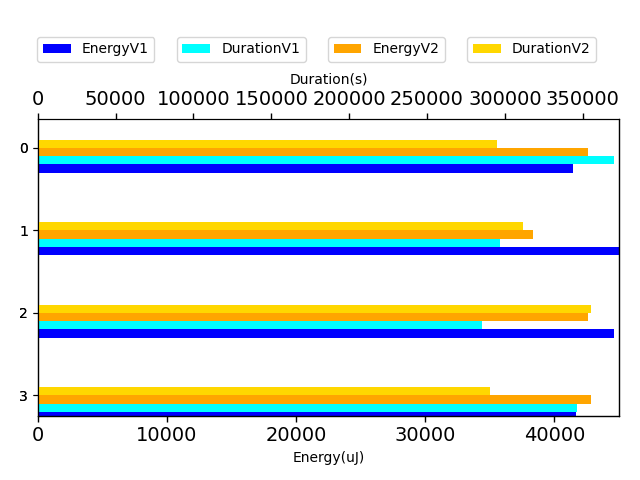

## com.google.gson.functional.PrimitiveTest

| Test | IterationV1 | IterationV2 | DeltaIteration |
| --- | --- | --- | --- |
| com.google.gson.functional.PrimitiveTest-testDeserializePrimitiveWrapperAsObjectField | 51 | 47 | -4 |
| com.google.gson.functional.PrimitiveTest-testDoubleNoFractAsStringRepresentationDeserialization | 21 | 22 | 1 |
| com.google.gson.functional.PrimitiveTest-testMoreSpecificSerialization | 28 | 29 | 1 |
| com.google.gson.functional.PrimitiveTest-testPrimitiveDoubleAutoboxedInASingleElementArraySerialization | 25 | 14 | -11 |
| com.google.gson.functional.PrimitiveTest-testFloatNaNSerializationNotSupportedByDefault | 9 | 14 | 5 |
| com.google.gson.functional.PrimitiveTest-testHtmlCharacterSerialization | 10 | 17 | 7 |
| com.google.gson.functional.PrimitiveTest-testPrimitiveIntegerAutoboxedInASingleElementArraySerialization | 27 | 21 | -6 |
| com.google.gson.functional.PrimitiveTest-testNegativeInfinityDeserialization | 18 | 13 | -5 |
| com.google.gson.functional.PrimitiveTest-testNegativeInfinityFloatSerializationNotSupportedByDefault | 19 | 12 | -7 |
| com.google.gson.functional.PrimitiveTest-testDoubleInfinitySerializationNotSupportedByDefault | 18 | 8 | -10 |
| com.google.gson.functional.PrimitiveTest-testBigIntegerInASingleElementArraySerialization | 37 | 29 | -8 |
| com.google.gson.functional.PrimitiveTest-testBigIntegerSerialization | 51 | 51 | 0 |
| com.google.gson.functional.PrimitiveTest-testNegativeInfinityFloatSerialization | 11 | 10 | -1 |
| com.google.gson.functional.PrimitiveTest-testPrimitiveBooleanAutoboxedInASingleElementArraySerialization | 19 | 13 | -6 |
| com.google.gson.functional.PrimitiveTest-testStringsAsBooleans | 62 | 52 | -10 |
| com.google.gson.functional.PrimitiveTest-testByteDeserialization | 37 | 31 | -6 |
| com.google.gson.functional.PrimitiveTest-testDeserializeJsonObjectAsBytePrimitive | 9 | 16 | 7 |
| com.google.gson.functional.PrimitiveTest-testBigDecimalNaNDeserializationNotSupported | 26 | 23 | -3 |
| com.google.gson.functional.PrimitiveTest-testDeserializeJsonArrayAsFloatWrapper | 12 | 15 | 3 |
| com.google.gson.functional.PrimitiveTest-testValueVeryCloseToZeroIsZero | 46 | 55 | 9 |
| com.google.gson.functional.PrimitiveTest-testDeserializeJsonObjectAsLongPrimitive | 19 | 14 | -5 |
| com.google.gson.functional.PrimitiveTest-testDoubleArrayDeserialization | 45 | 43 | -2 |
| com.google.gson.functional.PrimitiveTest-testPrimitiveClassLiteral | 34 | 17 | -17 |
| com.google.gson.functional.PrimitiveTest-testDeserializeJsonArrayAsInt | 20 | 15 | -5 |
| com.google.gson.functional.PrimitiveTest-testDeserializeJsonArrayAsDoublePrimitive | 19 | 16 | -3 |
| com.google.gson.functional.PrimitiveTest-testDeserializingBigDecimalAsDouble | 18 | 13 | -5 |
| com.google.gson.functional.PrimitiveTest-testBigDecimalNoFractAsStringRepresentationDeserialization | 14 | 17 | 3 |
| com.google.gson.functional.PrimitiveTest-testUnquotedStringDeserializationFails | 24 | 27 | 3 |
| com.google.gson.functional.PrimitiveTest-testFloatNaNSerialization | 13 | 13 | 0 |
| com.google.gson.functional.PrimitiveTest-testBadValueForBigIntegerDeserialization | 14 | 18 | 4 |
| com.google.gson.functional.PrimitiveTest-testDoubleInfinitySerialization | 13 | 14 | 1 |
| com.google.gson.functional.PrimitiveTest-testDeserializingBigIntegerAsInteger | 20 | 16 | -4 |
| com.google.gson.functional.PrimitiveTest-testLongAsStringDeserialization | 24 | 21 | -3 |
| com.google.gson.functional.PrimitiveTest-testBigDecimalInfinityDeserializationNotSupported | 20 | 14 | -6 |
| com.google.gson.functional.PrimitiveTest-testDeserializeJsonArrayAsByteWrapper | 19 | 12 | -7 |
| com.google.gson.functional.PrimitiveTest-testPrimitiveIntegerAutoboxedSerialization | 15 | 16 | 1 |
| com.google.gson.functional.PrimitiveTest-testSmallValueForBigDecimalSerialization | 15 | 14 | -1 |
| com.google.gson.functional.PrimitiveTest-testDeserializeJsonObjectAsNumber | 12 | 10 | -2 |
| com.google.gson.functional.PrimitiveTest-testNumberDeserialization | 49 | 42 | -7 |
| com.google.gson.functional.PrimitiveTest-testDeserializeJsonObjectAsBigDecimal | 13 | 11 | -2 |
| com.google.gson.functional.PrimitiveTest-testDeserializeJsonObjectAsShortPrimitive | 18 | 14 | -4 |
| com.google.gson.functional.PrimitiveTest-testDoubleInfinityDeserialization | 12 | 8 | -4 |
| com.google.gson.functional.PrimitiveTest-testPrimitiveBooleanAutoboxedSerialization | 13 | 11 | -2 |
| com.google.gson.functional.PrimitiveTest-testLongAsStringSerialization | 21 | 11 | -10 |
| com.google.gson.functional.PrimitiveTest-testDeserializingBigDecimalAsFloat | 13 | 15 | 2 |
| com.google.gson.functional.PrimitiveTest-testNumberSerialization | 13 | 17 | 4 |
| com.google.gson.functional.PrimitiveTest-testDoubleNaNSerialization | 6 | 11 | 5 |
| com.google.gson.functional.PrimitiveTest-testPrimitiveDoubleAutoboxedSerialization | 22 | 29 | 7 |
| com.google.gson.functional.PrimitiveTest-testDeserializingBigIntegerAsLong | 19 | 14 | -5 |
| com.google.gson.functional.PrimitiveTest-testDeserializingBigDecimalAsIntegerFails | 20 | 20 | 0 |
| com.google.gson.functional.PrimitiveTest-testSmallValueForBigIntegerDeserialization | 12 | 20 | 8 |
| com.google.gson.functional.PrimitiveTest-testFloatInfinitySerializationNotSupportedByDefault | 18 | 17 | -1 |
| com.google.gson.functional.PrimitiveTest-testBigIntegerDeserialization | 16 | 19 | 3 |
| com.google.gson.functional.PrimitiveTest-testPrimitiveLongAutoboxedInASingleElementArraySerialization | 15 | 17 | 2 |
| com.google.gson.functional.PrimitiveTest-testBigDecimalSerialization | 33 | 22 | -11 |
| com.google.gson.functional.PrimitiveTest-testDeserializeJsonObjectAsFloatPrimitive | 13 | 12 | -1 |
| com.google.gson.functional.PrimitiveTest-testDeserializingNonZeroDecimalPointValuesAsIntegerFails | 24 | 30 | 6 |
| com.google.gson.functional.PrimitiveTest-testSmallValueForBigDecimalDeserialization | 13 | 10 | -3 |
| com.google.gson.functional.PrimitiveTest-testDeserializeJsonObjectAsBooleanPrimitive | 19 | 13 | -6 |
| com.google.gson.functional.PrimitiveTest-testReallyLongValuesDeserialization | 12 | 15 | 3 |
| com.google.gson.functional.PrimitiveTest-testPrimitiveDoubleAutoboxedDeserialization | 29 | 15 | -14 |
| com.google.gson.functional.PrimitiveTest-testFloatInfinitySerialization | 11 | 14 | 3 |
| com.google.gson.functional.PrimitiveTest-testBigDecimalPreservePrecisionSerialization | 14 | 8 | -6 |
| com.google.gson.functional.PrimitiveTest-testBigDecimalDeserialization | 13 | 14 | 1 |
| com.google.gson.functional.PrimitiveTest-testShortSerialization | 14 | 13 | -1 |
| com.google.gson.functional.PrimitiveTest-testNegativeInfinitySerializationNotSupportedByDefault | 12 | 16 | 4 |
| com.google.gson.functional.PrimitiveTest-testDeserializingBigDecimalAsBigIntegerFails | 20 | 16 | -4 |
| com.google.gson.functional.PrimitiveTest-testDeserializeJsonArrayAsNumber | 16 | 16 | 0 |
| com.google.gson.functional.PrimitiveTest-testDeserializeJsonArrayAsBigDecimal | 15 | 10 | -5 |
| com.google.gson.functional.PrimitiveTest-testFloatInfinityDeserialization | 17 | 11 | -6 |
| com.google.gson.functional.PrimitiveTest-testBigDecimalInASingleElementArraySerialization | 27 | 13 | -14 |
| com.google.gson.functional.PrimitiveTest-testBigDecimalNegativeInfinityDeserializationNotSupported | 9 | 10 | 1 |
| com.google.gson.functional.PrimitiveTest-testFloatNaNDeserialization | 16 | 11 | -5 |
| com.google.gson.functional.PrimitiveTest-testBooleanDeserialization | 24 | 16 | -8 |
| com.google.gson.functional.PrimitiveTest-testPrimitiveLongAutoboxedDeserialization | 17 | 17 | 0 |
| com.google.gson.functional.PrimitiveTest-testDeserializeJsonArrayAsBooleanWrapper | 10 | 15 | 5 |
| com.google.gson.functional.PrimitiveTest-testDeserializeJsonObjectAsBigInteger | 24 | 12 | -12 |
| com.google.gson.functional.PrimitiveTest-testNumberAsStringDeserialization | 16 | 15 | -1 |
| com.google.gson.functional.PrimitiveTest-testDeserializingBigIntegerAsBigDecimal | 22 | 26 | 4 |
| com.google.gson.functional.PrimitiveTest-testQuotedStringSerializationAndDeserialization | 14 | 14 | 0 |
| com.google.gson.functional.PrimitiveTest-testDeserializeJsonArrayAsShortWrapper | 14 | 15 | 1 |
| com.google.gson.functional.PrimitiveTest-testDeserializeJsonArrayAsLongWrapper | 8 | 15 | 7 |
| com.google.gson.functional.PrimitiveTest-testDoubleNaNDeserialization | 19 | 14 | -5 |
| com.google.gson.functional.PrimitiveTest-testDeserializeJsonObjectAsDoubleWrapper | 15 | 20 | 5 |
| com.google.gson.functional.PrimitiveTest-testByteSerialization | 13 | 11 | -2 |
| com.google.gson.functional.PrimitiveTest-testNegativeInfinityFloatDeserialization | 13 | 14 | 1 |
| com.google.gson.functional.PrimitiveTest-testSmallValueForBigIntegerSerialization | 16 | 7 | -9 |
| com.google.gson.functional.PrimitiveTest-testDoubleAsStringRepresentationDeserialization | 21 | 20 | -1 |
| com.google.gson.functional.PrimitiveTest-testPrimitiveLongAutoboxedSerialization | 11 | 11 | 0 |
| com.google.gson.functional.PrimitiveTest-testLargeDoubleDeserialization | 15 | 19 | 4 |
| com.google.gson.functional.PrimitiveTest-testReallyLongValuesSerialization | 14 | 11 | -3 |
| com.google.gson.functional.PrimitiveTest-testDoubleNaNSerializationNotSupportedByDefault | 18 | 22 | 4 |
| com.google.gson.functional.PrimitiveTest-testDeserializeJsonArrayAsBigInteger | 11 | 12 | 1 |
| com.google.gson.functional.PrimitiveTest-testBigDecimalPreservePrecisionDeserialization | 13 | 16 | 3 |
| com.google.gson.functional.PrimitiveTest-testPrimitiveIntegerAutoboxedDeserialization | 14 | 19 | 5 |
| com.google.gson.functional.PrimitiveTest-testNegativeInfinitySerialization | 8 | 11 | 3 |
| com.google.gson.functional.PrimitiveTest-testBigDecimalAsStringRepresentationDeserialization | 14 | 16 | 2 |
| com.google.gson.functional.PrimitiveTest-testDeserializingDecimalPointValueZeroSucceeds | 8 | 16 | 8 |
| com.google.gson.functional.PrimitiveTest-testDeserializeJsonObjectAsInteger | 16 | 12 | -4 |

| Test | EnergyV1 | EnergyV2 | DeltaEnergy |
| --- | --- | --- | --- |
| com.google.gson.functional.PrimitiveTest-testDeserializePrimitiveWrapperAsObjectField | 41850.92487346228 | 41562.99783631161 | -287.9270371506718 |
| com.google.gson.functional.PrimitiveTest-testDoubleNoFractAsStringRepresentationDeserialization | 42936.49823284149 | 41826.22320175171 | -1110.2750310897827 |
| com.google.gson.functional.PrimitiveTest-testMoreSpecificSerialization | 85534.43471777067 | 45265.21127772331 | -40269.22344004735 |
| com.google.gson.functional.PrimitiveTest-testPrimitiveDoubleAutoboxedInASingleElementArraySerialization | 42444.53625291586 | 41461.54406738281 | -982.9921855330467 |
| com.google.gson.functional.PrimitiveTest-testFloatNaNSerializationNotSupportedByDefault | 39397.462890625 | 42961.3359375 | 3563.873046875 |
| com.google.gson.functional.PrimitiveTest-testHtmlCharacterSerialization | 41499.203125 | 43453.45362854004 | 1954.250503540039 |
| com.google.gson.functional.PrimitiveTest-testPrimitiveIntegerAutoboxedInASingleElementArraySerialization | 42484.67761467397 | 43319.370513916016 | 834.6928992420435 |
| com.google.gson.functional.PrimitiveTest-testNegativeInfinityDeserialization | 42775.74797821045 | 42982.537353515625 | 206.78937530517578 |
| com.google.gson.functional.PrimitiveTest-testNegativeInfinityFloatSerializationNotSupportedByDefault | 37796.07134628296 | 42881.1103515625 | 5085.039005279541 |
| com.google.gson.functional.PrimitiveTest-testDoubleInfinitySerializationNotSupportedByDefault | 43014.854022979736 | 40870.69921875 | -2144.1548042297363 |
| com.google.gson.functional.PrimitiveTest-testBigIntegerInASingleElementArraySerialization | 42663.60951950628 | 39497.31803776696 | -3166.2914817393175 |
| com.google.gson.functional.PrimitiveTest-testBigIntegerSerialization | 43909.29197168042 | 43119.37137686749 | -789.9205948129238 |
| com.google.gson.functional.PrimitiveTest-testNegativeInfinityFloatSerialization | 42154.22412109375 | 41291.056640625 | -863.16748046875 |
| com.google.gson.functional.PrimitiveTest-testPrimitiveBooleanAutoboxedInASingleElementArraySerialization | 44240.59560585022 | 41082.56298828125 | -3158.0326175689697 |
| com.google.gson.functional.PrimitiveTest-testStringsAsBooleans | 47842.54673343372 | 42433.607107957134 | -5408.939625476589 |
| com.google.gson.functional.PrimitiveTest-testByteDeserialization | 41477.55921418656 | 42422.03592140414 | 944.4767072175746 |
| com.google.gson.functional.PrimitiveTest-testDeserializeJsonObjectAsBytePrimitive | 41334.14453125 | 42270.68083190918 | 936.5363006591797 |
| com.google.gson.functional.PrimitiveTest-testBigDecimalNaNDeserializationNotSupported | 42807.95744165778 | 42243.359664440155 | -564.5977772176266 |
| com.google.gson.functional.PrimitiveTest-testDeserializeJsonArrayAsFloatWrapper | 42250.42822265625 | 41987.218505859375 | -263.209716796875 |
| com.google.gson.functional.PrimitiveTest-testValueVeryCloseToZeroIsZero | 40813.42759075941 | 40957.86823654839 | 144.44064578897814 |
| com.google.gson.functional.PrimitiveTest-testDeserializeJsonObjectAsLongPrimitive | 40944.67527008057 | 44038.734130859375 | 3094.0588607788086 |
| com.google.gson.functional.PrimitiveTest-testDoubleArrayDeserialization | 42361.155507035386 | 42311.237052154516 | -49.91845488086983 |
| com.google.gson.functional.PrimitiveTest-testPrimitiveClassLiteral | 41742.28614840214 | 42293.56214904785 | 551.2760006457102 |
| com.google.gson.functional.PrimitiveTest-testDeserializeJsonArrayAsInt | 42800.68681907654 | 44460.46789550781 | 1659.7810764312744 |
| com.google.gson.functional.PrimitiveTest-testDeserializeJsonArrayAsDoublePrimitive | 42603.78796005249 | 41837.05694580078 | -766.731014251709 |
| com.google.gson.functional.PrimitiveTest-testDeserializingBigDecimalAsDouble | 42432.86257171631 | 42760.1884765625 | 327.3259048461914 |
| com.google.gson.functional.PrimitiveTest-testBigDecimalNoFractAsStringRepresentationDeserialization | 43124.60021972656 | 41281.3172454834 | -1843.282974243164 |
| com.google.gson.functional.PrimitiveTest-testUnquotedStringDeserializationFails | 41045.641610741615 | 42204.939745754 | 1159.2981350123882 |
| com.google.gson.functional.PrimitiveTest-testFloatNaNSerialization | 41333.359619140625 | 40843.40478515625 | -489.954833984375 |
| com.google.gson.functional.PrimitiveTest-testBadValueForBigIntegerDeserialization | 44750.744140625 | 42401.82816314697 | -2348.9159774780273 |
| com.google.gson.functional.PrimitiveTest-testDoubleInfinitySerialization | 44649.154052734375 | 44136.6513671875 | -512.502685546875 |
| com.google.gson.functional.PrimitiveTest-testDeserializingBigIntegerAsInteger | 42190.60960006714 | 41670.542541503906 | -520.0670585632324 |
| com.google.gson.functional.PrimitiveTest-testLongAsStringDeserialization | 42490.09524011612 | 40764.11679267883 | -1725.9784474372864 |
| com.google.gson.functional.PrimitiveTest-testBigDecimalInfinityDeserializationNotSupported | 41707.49418067932 | 44473.32312011719 | 2765.828939437866 |
| com.google.gson.functional.PrimitiveTest-testDeserializeJsonArrayAsByteWrapper | 40776.928565979004 | 41575.25927734375 | 798.3307113647461 |
| com.google.gson.functional.PrimitiveTest-testPrimitiveIntegerAutoboxedSerialization | 75330.03045654297 | 47239.341247558594 | -28090.689208984375 |
| com.google.gson.functional.PrimitiveTest-testSmallValueForBigDecimalSerialization | 43047.65948486328 | 41757.07067871094 | -1290.5888061523438 |
| com.google.gson.functional.PrimitiveTest-testDeserializeJsonObjectAsNumber | 40683.37744140625 | 42244.90625 | 1561.52880859375 |
| com.google.gson.functional.PrimitiveTest-testNumberDeserialization | 62197.91602539194 | 43953.96293195571 | -18243.953093436226 |
| com.google.gson.functional.PrimitiveTest-testDeserializeJsonObjectAsBigDecimal | 35078.322021484375 | 42248.5927734375 | 7170.270751953125 |
| com.google.gson.functional.PrimitiveTest-testDeserializeJsonObjectAsShortPrimitive | 43583.95951080322 | 42374.54138183594 | -1209.4181289672852 |
| com.google.gson.functional.PrimitiveTest-testDoubleInfinityDeserialization | 38964.91845703125 | 42546.34375 | 3581.42529296875 |
| com.google.gson.functional.PrimitiveTest-testPrimitiveBooleanAutoboxedSerialization | 44271.978759765625 | 43468.3798828125 | -803.598876953125 |
| com.google.gson.functional.PrimitiveTest-testLongAsStringSerialization | 41157.010685920715 | 42200.04296875 | 1043.0322828292847 |
| com.google.gson.functional.PrimitiveTest-testDeserializingBigDecimalAsFloat | 42227.670166015625 | 40357.39239501953 | -1870.2777709960938 |
| com.google.gson.functional.PrimitiveTest-testNumberSerialization | 44341.32861328125 | 38897.95153808594 | -5443.3770751953125 |
| com.google.gson.functional.PrimitiveTest-testDoubleNaNSerialization | 42899.84375 | 42533.3818359375 | -366.4619140625 |
| com.google.gson.functional.PrimitiveTest-testPrimitiveDoubleAutoboxedSerialization | 56927.817398548126 | 47796.02952587232 | -9131.787872675806 |
| com.google.gson.functional.PrimitiveTest-testDeserializingBigIntegerAsLong | 46116.00615692139 | 43464.82458496094 | -2651.181571960449 |
| com.google.gson.functional.PrimitiveTest-testDeserializingBigDecimalAsIntegerFails | 39043.100719451904 | 43526.72219276428 | 4483.621473312378 |
| com.google.gson.functional.PrimitiveTest-testSmallValueForBigIntegerDeserialization | 45852.90771484375 | 42583.51749801636 | -3269.3902168273926 |
| com.google.gson.functional.PrimitiveTest-testFloatInfinitySerializationNotSupportedByDefault | 39503.46677398682 | 43253.479721069336 | 3750.0129470825195 |
| com.google.gson.functional.PrimitiveTest-testBigIntegerDeserialization | 42797.484771728516 | 42922.671115875244 | 125.18634414672852 |
| com.google.gson.functional.PrimitiveTest-testPrimitiveLongAutoboxedInASingleElementArraySerialization | 44040.88201904297 | 43546.448333740234 | -494.4336853027344 |
| com.google.gson.functional.PrimitiveTest-testBigDecimalSerialization | 42423.48979417491 | 40497.19195652008 | -1926.2978376548272 |
| com.google.gson.functional.PrimitiveTest-testDeserializeJsonObjectAsFloatPrimitive | 42886.791015625 | 42022.138671875 | -864.65234375 |
| com.google.gson.functional.PrimitiveTest-testDeserializingNonZeroDecimalPointValuesAsIntegerFails | 43449.07849776745 | 44665.90168602113 | 1216.8231882536784 |
| com.google.gson.functional.PrimitiveTest-testSmallValueForBigDecimalDeserialization | 40595.991455078125 | 40774.271484375 | 178.280029296875 |
| com.google.gson.functional.PrimitiveTest-testDeserializeJsonObjectAsBooleanPrimitive | 43061.6978263855 | 40052.0849609375 | -3009.612865447998 |
| com.google.gson.functional.PrimitiveTest-testReallyLongValuesDeserialization | 44470.4501953125 | 44239.182861328125 | -231.267333984375 |
| com.google.gson.functional.PrimitiveTest-testPrimitiveDoubleAutoboxedDeserialization | 43503.17096366733 | 43592.008239746094 | 88.83727607876062 |
| com.google.gson.functional.PrimitiveTest-testFloatInfinitySerialization | 42117.1591796875 | 43902.38037109375 | 1785.22119140625 |
| com.google.gson.functional.PrimitiveTest-testBigDecimalPreservePrecisionSerialization | 42011.74987792969 | 44018.390625 | 2006.6407470703125 |
| com.google.gson.functional.PrimitiveTest-testBigDecimalDeserialization | 43962.490234375 | 40015.72595214844 | -3946.7642822265625 |
| com.google.gson.functional.PrimitiveTest-testShortSerialization | 40780.62158203125 | 43795.543701171875 | 3014.922119140625 |
| com.google.gson.functional.PrimitiveTest-testNegativeInfinitySerializationNotSupportedByDefault | 43104.35693359375 | 41460.84161376953 | -1643.5153198242188 |
| com.google.gson.functional.PrimitiveTest-testDeserializingBigDecimalAsBigIntegerFails | 38638.020515441895 | 41144.086334228516 | 2506.065818786621 |
| com.google.gson.functional.PrimitiveTest-testDeserializeJsonArrayAsNumber | 42954.26315307617 | 41977.182189941406 | -977.0809631347656 |
| com.google.gson.functional.PrimitiveTest-testDeserializeJsonArrayAsBigDecimal | 42674.44384765625 | 42379.666015625 | -294.77783203125 |
| com.google.gson.functional.PrimitiveTest-testFloatInfinityDeserialization | 44844.16828918457 | 41746.828125 | -3097.3401641845703 |
| com.google.gson.functional.PrimitiveTest-testBigDecimalInASingleElementArraySerialization | 38110.565431147814 | 42389.935791015625 | 4279.370359867811 |
| com.google.gson.functional.PrimitiveTest-testBigDecimalNegativeInfinityDeserializationNotSupported | 40823.72265625 | 42048.1953125 | 1224.47265625 |
| com.google.gson.functional.PrimitiveTest-testFloatNaNDeserialization | 43853.97152709961 | 42328.259765625 | -1525.7117614746094 |
| com.google.gson.functional.PrimitiveTest-testBooleanDeserialization | 42265.92565834522 | 44587.144134521484 | 2321.218476176262 |
| com.google.gson.functional.PrimitiveTest-testPrimitiveLongAutoboxedDeserialization | 38855.33656311035 | 44146.87171936035 | 5291.53515625 |
| com.google.gson.functional.PrimitiveTest-testDeserializeJsonArrayAsBooleanWrapper | 41031.2890625 | 40582.43927001953 | -448.84979248046875 |
| com.google.gson.functional.PrimitiveTest-testDeserializeJsonObjectAsBigInteger | 36436.64034819603 | 42613.28857421875 | 6176.64822602272 |
| com.google.gson.functional.PrimitiveTest-testNumberAsStringDeserialization | 39169.486419677734 | 45111.988220214844 | 5942.501800537109 |
| com.google.gson.functional.PrimitiveTest-testDeserializingBigIntegerAsBigDecimal | 41427.63535785675 | 40752.990934580564 | -674.644423276186 |
| com.google.gson.functional.PrimitiveTest-testQuotedStringSerializationAndDeserialization | 41760.142333984375 | 42526.21936035156 | 766.0770263671875 |
| com.google.gson.functional.PrimitiveTest-testDeserializeJsonArrayAsShortWrapper | 42511.918212890625 | 42711.9248046875 | 200.006591796875 |
| com.google.gson.functional.PrimitiveTest-testDeserializeJsonArrayAsLongWrapper | 39678.6953125 | 42713.874572753906 | 3035.1792602539062 |
| com.google.gson.functional.PrimitiveTest-testDoubleNaNDeserialization | 42165.169120788574 | 40276.12060546875 | -1889.0485153198242 |
| com.google.gson.functional.PrimitiveTest-testDeserializeJsonObjectAsDoubleWrapper | 35689.65380859375 | 41288.24864196777 | 5598.594833374023 |
| com.google.gson.functional.PrimitiveTest-testByteSerialization | 43797.259033203125 | 46927.58203125 | 3130.322998046875 |
| com.google.gson.functional.PrimitiveTest-testNegativeInfinityFloatDeserialization | 40824.625 | 41500.64660644531 | 676.0216064453125 |
| com.google.gson.functional.PrimitiveTest-testSmallValueForBigIntegerSerialization | 42984.695709228516 | 44291.375 | 1306.6792907714844 |
| com.google.gson.functional.PrimitiveTest-testDoubleAsStringRepresentationDeserialization | 65595.18914222717 | 45414.45315742493 | -20180.735984802246 |
| com.google.gson.functional.PrimitiveTest-testPrimitiveLongAutoboxedSerialization | 44229.47265625 | 42606.619140625 | -1622.853515625 |
| com.google.gson.functional.PrimitiveTest-testLargeDoubleDeserialization | 43253.04797363281 | 41477.039279937744 | -1776.0086936950684 |
| com.google.gson.functional.PrimitiveTest-testReallyLongValuesSerialization | 44635.364013671875 | 42178.486328125 | -2456.877685546875 |
| com.google.gson.functional.PrimitiveTest-testDoubleNaNSerializationNotSupportedByDefault | 40872.85001373291 | 44046.0839471817 | 3173.2339334487915 |
| com.google.gson.functional.PrimitiveTest-testDeserializeJsonArrayAsBigInteger | 39928.951171875 | 41999.52734375 | 2070.576171875 |
| com.google.gson.functional.PrimitiveTest-testBigDecimalPreservePrecisionDeserialization | 40204.09375 | 41084.95361328125 | 880.85986328125 |
| com.google.gson.functional.PrimitiveTest-testPrimitiveIntegerAutoboxedDeserialization | 59957.89562988281 | 42184.90869140625 | -17772.986938476562 |
| com.google.gson.functional.PrimitiveTest-testNegativeInfinitySerialization | 42304.78125 | 43653.9931640625 | 1349.2119140625 |
| com.google.gson.functional.PrimitiveTest-testBigDecimalAsStringRepresentationDeserialization | 41440.283447265625 | 43090.05764770508 | 1649.7742004394531 |
| com.google.gson.functional.PrimitiveTest-testDeserializingDecimalPointValueZeroSucceeds | 41071.0703125 | 43866.23178100586 | 2795.1614685058594 |
| com.google.gson.functional.PrimitiveTest-testDeserializeJsonObjectAsInteger | 35634.21258544922 | 42588.7119140625 | 6954.499328613281 |

| Test | DurationV1 | DurationsV2 | DeltaDuration |
| --- | --- | --- | --- |
| com.google.gson.functional.PrimitiveTest-testDeserializePrimitiveWrapperAsObjectField | 697804.9328033628 | 656540.4190593176 | -41264.51374404528 |
| com.google.gson.functional.PrimitiveTest-testDoubleNoFractAsStringRepresentationDeserialization | 396374.32085466385 | 365170.16266584396 | -31204.158188819885 |
| com.google.gson.functional.PrimitiveTest-testMoreSpecificSerialization | 1595689.758217305 | 398903.8944321722 | -1196785.8637851328 |
| com.google.gson.functional.PrimitiveTest-testPrimitiveDoubleAutoboxedInASingleElementArraySerialization | 518640.22019454837 | 438123.77893066406 | -80516.4412638843 |
| com.google.gson.functional.PrimitiveTest-testFloatNaNSerializationNotSupportedByDefault | 347074.697265625 | 364396.1007080078 | 17321.403442382812 |
| com.google.gson.functional.PrimitiveTest-testHtmlCharacterSerialization | 318556.4521484375 | 317772.5453186035 | -783.9068298339844 |
| com.google.gson.functional.PrimitiveTest-testPrimitiveIntegerAutoboxedInASingleElementArraySerialization | 350528.6981809586 | 475392.0220422745 | 124863.32386131585 |
| com.google.gson.functional.PrimitiveTest-testNegativeInfinityDeserialization | 361517.69204330444 | 258508.0164794922 | -103009.67556381226 |
| com.google.gson.functional.PrimitiveTest-testNegativeInfinityFloatSerializationNotSupportedByDefault | 292941.1556892395 | 331637.74609375 | 38696.5904045105 |
| com.google.gson.functional.PrimitiveTest-testDoubleInfinitySerializationNotSupportedByDefault | 329491.1465988159 | 345226.64453125 | 15735.497932434082 |
| com.google.gson.functional.PrimitiveTest-testBigIntegerInASingleElementArraySerialization | 413038.08480952086 | 453273.12655834854 | 40235.04174882767 |
| com.google.gson.functional.PrimitiveTest-testBigIntegerSerialization | 845469.5023884464 | 886832.5852558535 | 41363.08286740712 |
| com.google.gson.functional.PrimitiveTest-testNegativeInfinityFloatSerialization | 286897.43798828125 | 301600.54296875 | 14703.10498046875 |
| com.google.gson.functional.PrimitiveTest-testPrimitiveBooleanAutoboxedInASingleElementArraySerialization | 366105.3588409424 | 366919.0446777344 | 813.6858367919922 |
| com.google.gson.functional.PrimitiveTest-testStringsAsBooleans | 836453.4442937413 | 1126037.3655137585 | 289583.92122001725 |
| com.google.gson.functional.PrimitiveTest-testByteDeserialization | 773929.286529363 | 629462.7252901699 | -144466.56123919308 |
| com.google.gson.functional.PrimitiveTest-testDeserializeJsonObjectAsBytePrimitive | 352345.384765625 | 308292.92642211914 | -44052.45834350586 |
| com.google.gson.functional.PrimitiveTest-testBigDecimalNaNDeserializationNotSupported | 537012.54405801 | 407069.7492580414 | -129942.7947999686 |
| com.google.gson.functional.PrimitiveTest-testDeserializeJsonArrayAsFloatWrapper | 349921.3820800781 | 344608.5832519531 | -5312.798828125 |
| com.google.gson.functional.PrimitiveTest-testValueVeryCloseToZeroIsZero | 758983.8108523656 | 699792.8542968936 | -59190.95655547199 |
| com.google.gson.functional.PrimitiveTest-testDeserializeJsonObjectAsLongPrimitive | 395032.02772140503 | 364024.0908203125 | -31007.93690109253 |
| com.google.gson.functional.PrimitiveTest-testDoubleArrayDeserialization | 581520.3250675051 | 525080.3713313469 | -56439.953736158204 |
| com.google.gson.functional.PrimitiveTest-testPrimitiveClassLiteral | 617466.3530052638 | 487313.44650268555 | -130152.90650257829 |
| com.google.gson.functional.PrimitiveTest-testDeserializeJsonArrayAsInt | 323293.1617870331 | 304332.57916259766 | -18960.582624435425 |
| com.google.gson.functional.PrimitiveTest-testDeserializeJsonArrayAsDoublePrimitive | 360963.69509506226 | 316811.69009399414 | -44152.005001068115 |
| com.google.gson.functional.PrimitiveTest-testDeserializingBigDecimalAsDouble | 330591.7492904663 | 383632.4387207031 | 53040.68943023682 |
| com.google.gson.functional.PrimitiveTest-testBigDecimalNoFractAsStringRepresentationDeserialization | 320483.9862060547 | 346603.9680480957 | 26119.981842041016 |
| com.google.gson.functional.PrimitiveTest-testUnquotedStringDeserializationFails | 431116.5573928356 | 354572.1715666652 | -76544.38582617044 |
| com.google.gson.functional.PrimitiveTest-testFloatNaNSerialization | 351438.9958496094 | 352581.9582519531 | 1142.96240234375 |
| com.google.gson.functional.PrimitiveTest-testBadValueForBigIntegerDeserialization | 385534.5578613281 | 398723.77519226074 | 13189.217330932617 |
| com.google.gson.functional.PrimitiveTest-testDoubleInfinitySerialization | 346838.99658203125 | 399208.6696777344 | 52369.673095703125 |
| com.google.gson.functional.PrimitiveTest-testDeserializingBigIntegerAsInteger | 390569.4646911621 | 406874.16748046875 | 16304.70278930664 |
| com.google.gson.functional.PrimitiveTest-testLongAsStringDeserialization | 507897.3451025486 | 393078.9472990036 | -114818.397803545 |
| com.google.gson.functional.PrimitiveTest-testBigDecimalInfinityDeserializationNotSupported | 323067.99570274353 | 347863.9758300781 | 24795.980127334595 |
| com.google.gson.functional.PrimitiveTest-testDeserializeJsonArrayAsByteWrapper | 322407.0386199951 | 339949.66650390625 | 17542.627883911133 |
| com.google.gson.functional.PrimitiveTest-testPrimitiveIntegerAutoboxedSerialization | 1711580.4935913086 | 338614.13638305664 | -1372966.357208252 |
| com.google.gson.functional.PrimitiveTest-testSmallValueForBigDecimalSerialization | 311462.9432373047 | 377082.1828613281 | 65619.23962402344 |
| com.google.gson.functional.PrimitiveTest-testDeserializeJsonObjectAsNumber | 287884.17431640625 | 282684.279296875 | -5199.89501953125 |
| com.google.gson.functional.PrimitiveTest-testNumberDeserialization | 1475394.9101487177 | 779148.5866751036 | -696246.3234736141 |
| com.google.gson.functional.PrimitiveTest-testDeserializeJsonObjectAsBigDecimal | 302768.1052246094 | 350514.3916015625 | 47746.286376953125 |
| com.google.gson.functional.PrimitiveTest-testDeserializeJsonObjectAsShortPrimitive | 327932.1601867676 | 289794.9533691406 | -38137.20681762695 |
| com.google.gson.functional.PrimitiveTest-testDoubleInfinityDeserialization | 277435.91455078125 | 357677.0390625 | 80241.12451171875 |
| com.google.gson.functional.PrimitiveTest-testPrimitiveBooleanAutoboxedSerialization | 310864.30224609375 | 321457.748046875 | 10593.44580078125 |
| com.google.gson.functional.PrimitiveTest-testLongAsStringSerialization | 449512.66093730927 | 506592.9443359375 | 57080.283398628235 |
| com.google.gson.functional.PrimitiveTest-testDeserializingBigDecimalAsFloat | 313557.03564453125 | 287510.72833251953 | -26046.30731201172 |
| com.google.gson.functional.PrimitiveTest-testNumberSerialization | 353649.7805175781 | 317436.6673736572 | -36213.1131439209 |
| com.google.gson.functional.PrimitiveTest-testDoubleNaNSerialization | 320174.375 | 365945.568359375 | 45771.193359375 |
| com.google.gson.functional.PrimitiveTest-testPrimitiveDoubleAutoboxedSerialization | 905560.6198248863 | 540797.0593374297 | -364763.5604874566 |
| com.google.gson.functional.PrimitiveTest-testDeserializingBigIntegerAsLong | 454068.0817146301 | 398386.04821777344 | -55682.03349685669 |
| com.google.gson.functional.PrimitiveTest-testDeserializingBigDecimalAsIntegerFails | 337866.7314453125 | 332801.93489837646 | -5064.796546936035 |
| com.google.gson.functional.PrimitiveTest-testSmallValueForBigIntegerDeserialization | 304774.51611328125 | 328028.6258945465 | 23254.10978126526 |
| com.google.gson.functional.PrimitiveTest-testFloatInfinitySerializationNotSupportedByDefault | 359579.0361557007 | 312299.04290771484 | -47279.99324798584 |
| com.google.gson.functional.PrimitiveTest-testBigIntegerDeserialization | 382952.6488342285 | 395274.3092803955 | 12321.660446166992 |
| com.google.gson.functional.PrimitiveTest-testPrimitiveLongAutoboxedInASingleElementArraySerialization | 564821.9505615234 | 399401.2757720947 | -165420.6747894287 |
| com.google.gson.functional.PrimitiveTest-testBigDecimalSerialization | 532544.5271957603 | 515651.38180732727 | -16893.14538843301 |
| com.google.gson.functional.PrimitiveTest-testDeserializeJsonObjectAsFloatPrimitive | 321986.46728515625 | 329681.59765625 | 7695.13037109375 |
| com.google.gson.functional.PrimitiveTest-testDeserializingNonZeroDecimalPointValuesAsIntegerFails | 465680.7467867136 | 524402.454782377 | 58721.7079956634 |
| com.google.gson.functional.PrimitiveTest-testSmallValueForBigDecimalDeserialization | 301539.7165527344 | 352035.15234375 | 50495.435791015625 |
| com.google.gson.functional.PrimitiveTest-testDeserializeJsonObjectAsBooleanPrimitive | 374800.40853118896 | 362049.3293457031 | -12751.07918548584 |
| com.google.gson.functional.PrimitiveTest-testReallyLongValuesDeserialization | 445889.380859375 | 349304.94830322266 | -96584.43255615234 |
| com.google.gson.functional.PrimitiveTest-testPrimitiveDoubleAutoboxedDeserialization | 557380.608537484 | 774278.526550293 | 216897.918012809 |
| com.google.gson.functional.PrimitiveTest-testFloatInfinitySerialization | 331424.822265625 | 316904.45782470703 | -14520.364440917969 |
| com.google.gson.functional.PrimitiveTest-testBigDecimalPreservePrecisionSerialization | 320301.4432373047 | 288534.796875 | -31766.646362304688 |
| com.google.gson.functional.PrimitiveTest-testBigDecimalDeserialization | 347172.53955078125 | 378994.3342285156 | 31821.794677734375 |
| com.google.gson.functional.PrimitiveTest-testShortSerialization | 296167.18981933594 | 511569.2639160156 | 215402.0740966797 |
| com.google.gson.functional.PrimitiveTest-testNegativeInfinitySerializationNotSupportedByDefault | 352222.26708984375 | 343482.9071960449 | -8739.359893798828 |
| com.google.gson.functional.PrimitiveTest-testDeserializingBigDecimalAsBigIntegerFails | 300825.96374320984 | 267478.5728149414 | -33347.39092826843 |
| com.google.gson.functional.PrimitiveTest-testDeserializeJsonArrayAsNumber | 274048.1838684082 | 459550.88024902344 | 185502.69638061523 |
| com.google.gson.functional.PrimitiveTest-testDeserializeJsonArrayAsBigDecimal | 371024.15130615234 | 356589.697265625 | -14434.454040527344 |
| com.google.gson.functional.PrimitiveTest-testFloatInfinityDeserialization | 272478.6258087158 | 387359.5498046875 | 114880.92399597168 |
| com.google.gson.functional.PrimitiveTest-testBigDecimalInASingleElementArraySerialization | 523729.37475299835 | 399192.4289550781 | -124536.94579792023 |
| com.google.gson.functional.PrimitiveTest-testBigDecimalNegativeInfinityDeserializationNotSupported | 341219.69921875 | 374165.728515625 | 32946.029296875 |
| com.google.gson.functional.PrimitiveTest-testFloatNaNDeserialization | 426824.13903808594 | 348345.4375 | -78478.70153808594 |
| com.google.gson.functional.PrimitiveTest-testBooleanDeserialization | 369521.7959048748 | 327366.15170288086 | -42155.64420199394 |
| com.google.gson.functional.PrimitiveTest-testPrimitiveLongAutoboxedDeserialization | 442551.91401672363 | 364935.47749328613 | -77616.4365234375 |
| com.google.gson.functional.PrimitiveTest-testDeserializeJsonArrayAsBooleanWrapper | 320253.060546875 | 333040.34283447266 | 12787.282287597656 |
| com.google.gson.functional.PrimitiveTest-testDeserializeJsonObjectAsBigInteger | 315950.23576772213 | 281836.5498046875 | -34113.68596303463 |
| com.google.gson.functional.PrimitiveTest-testNumberAsStringDeserialization | 397448.10803222656 | 374553.0949707031 | -22895.013061523438 |
| com.google.gson.functional.PrimitiveTest-testDeserializingBigIntegerAsBigDecimal | 425910.3217921257 | 363211.15353509784 | -62699.168257027864 |
| com.google.gson.functional.PrimitiveTest-testQuotedStringSerializationAndDeserialization | 313459.6746826172 | 315608.4299316406 | 2148.7552490234375 |
| com.google.gson.functional.PrimitiveTest-testDeserializeJsonArrayAsShortWrapper | 335296.09826660156 | 334540.15267944336 | -755.9455871582031 |
| com.google.gson.functional.PrimitiveTest-testDeserializeJsonArrayAsLongWrapper | 297546.6875 | 326346.7041015625 | 28800.0166015625 |
| com.google.gson.functional.PrimitiveTest-testDoubleNaNDeserialization | 344333.25785827637 | 330118.4969482422 | -14214.76091003418 |
| com.google.gson.functional.PrimitiveTest-testDeserializeJsonObjectAsDoubleWrapper | 277306.14764404297 | 312495.0673446655 | 35188.91970062256 |
| com.google.gson.functional.PrimitiveTest-testByteSerialization | 488853.31787109375 | 320209.4755859375 | -168643.84228515625 |
| com.google.gson.functional.PrimitiveTest-testNegativeInfinityFloatDeserialization | 399526.9099121094 | 295567.31579589844 | -103959.59411621094 |
| com.google.gson.functional.PrimitiveTest-testSmallValueForBigIntegerSerialization | 321453.4912109375 | 328281.375 | 6827.8837890625 |
| com.google.gson.functional.PrimitiveTest-testDoubleAsStringRepresentationDeserialization | 934199.6625833511 | 439786.891456604 | -494412.77112674713 |
| com.google.gson.functional.PrimitiveTest-testPrimitiveLongAutoboxedSerialization | 353332.630859375 | 331547.681640625 | -21784.94921875 |
| com.google.gson.functional.PrimitiveTest-testLargeDoubleDeserialization | 441126.85247802734 | 325505.8566493988 | -115620.99582862854 |
| com.google.gson.functional.PrimitiveTest-testReallyLongValuesSerialization | 304721.1932373047 | 414572.677734375 | 109851.48449707031 |
| com.google.gson.functional.PrimitiveTest-testDoubleNaNSerializationNotSupportedByDefault | 379124.33171081543 | 332262.79335451126 | -46861.53835630417 |
| com.google.gson.functional.PrimitiveTest-testDeserializeJsonArrayAsBigInteger | 346571.4912109375 | 311097.26513671875 | -35474.22607421875 |
| com.google.gson.functional.PrimitiveTest-testBigDecimalPreservePrecisionDeserialization | 318861.96875 | 333148.58670043945 | 14286.617950439453 |
| com.google.gson.functional.PrimitiveTest-testPrimitiveIntegerAutoboxedDeserialization | 1270527.8995361328 | 485310.85134887695 | -785217.0481872559 |
| com.google.gson.functional.PrimitiveTest-testNegativeInfinitySerialization | 273833.546875 | 330654.091796875 | 56820.544921875 |
| com.google.gson.functional.PrimitiveTest-testBigDecimalAsStringRepresentationDeserialization | 365181.6953125 | 394847.1855163574 | 29665.490203857422 |
| com.google.gson.functional.PrimitiveTest-testDeserializingDecimalPointValueZeroSucceeds | 350889.0390625 | 311678.32693481445 | -39210.71212768555 |
| com.google.gson.functional.PrimitiveTest-testDeserializeJsonObjectAsInteger | 296015.87966918945 | 328942.94189453125 | 32927.0622253418 |

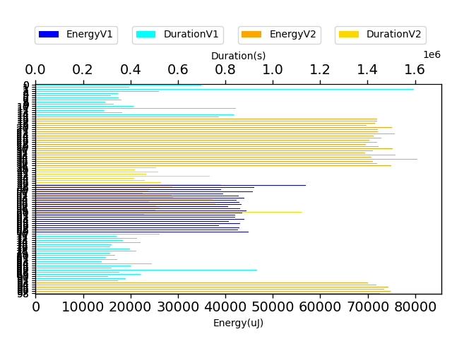

## com.google.gson.functional.CustomTypeAdaptersTest

| Test | IterationV1 | IterationV2 | DeltaIteration |
| --- | --- | --- | --- |
| com.google.gson.functional.CustomTypeAdaptersTest-testCustomAdapterInvokedForCollectionElementDeserialization | 55 | 55 | 0 |
| com.google.gson.functional.CustomTypeAdaptersTest-testCustomAdapterInvokedForMapElementDeserialization | 48 | 40 | -8 |
| com.google.gson.functional.CustomTypeAdaptersTest-testCustomAdapterInvokedForMapElementSerializationWithType | 43 | 49 | 6 |
| com.google.gson.functional.CustomTypeAdaptersTest-testCustomTypeAdapterDoesNotAppliesToSubClasses | 76 | 78 | 2 |
| com.google.gson.functional.CustomTypeAdaptersTest-testRegisterHierarchyAdapterForDate | 67 | 67 | 0 |
| com.google.gson.functional.CustomTypeAdaptersTest-testCustomAdapterInvokedForCollectionElementSerializationWithType | 85 | 85 | 0 |
| com.google.gson.functional.CustomTypeAdaptersTest-testEnsureCustomSerializerNotInvokedForNullValues | 68 | 79 | 11 |
| com.google.gson.functional.CustomTypeAdaptersTest-testEnsureCustomDeserializerNotInvokedForNullValues | 48 | 49 | 1 |
| com.google.gson.functional.CustomTypeAdaptersTest-testCustomTypeAdapterAppliesToSubClassesSerializedAsBaseClass | 44 | 43 | -1 |
| com.google.gson.functional.CustomTypeAdaptersTest-testCustomNestedSerializers | 53 | 60 | 7 |
| com.google.gson.functional.CustomTypeAdaptersTest-testCustomAdapterInvokedForCollectionElementSerialization | 23 | 22 | -1 |
| com.google.gson.functional.CustomTypeAdaptersTest-testCustomByteArraySerializer | 46 | 37 | -9 |
| com.google.gson.functional.CustomTypeAdaptersTest-testCustomDeserializers | 48 | 48 | 0 |
| com.google.gson.functional.CustomTypeAdaptersTest-testCustomByteArrayDeserializerAndInstanceCreator | 52 | 67 | 15 |
| com.google.gson.functional.CustomTypeAdaptersTest-testCustomSerializerInvokedForPrimitives | 40 | 36 | -4 |
| com.google.gson.functional.CustomTypeAdaptersTest-testCustomNestedDeserializers | 40 | 44 | 4 |
| com.google.gson.functional.CustomTypeAdaptersTest-testCustomAdapterInvokedForMapElementSerialization | 17 | 19 | 2 |
| com.google.gson.functional.CustomTypeAdaptersTest-testCustomSerializers | 55 | 58 | 3 |
| com.google.gson.functional.CustomTypeAdaptersTest-testCustomDeserializerInvokedForPrimitives | 36 | 42 | 6 |

| Test | EnergyV1 | EnergyV2 | DeltaEnergy |
| --- | --- | --- | --- |
| com.google.gson.functional.CustomTypeAdaptersTest-testCustomAdapterInvokedForCollectionElementDeserialization | 42861.17875388197 | 40910.12851550925 | -1951.0502383727217 |
| com.google.gson.functional.CustomTypeAdaptersTest-testCustomAdapterInvokedForMapElementDeserialization | 44123.75572556644 | 41936.38152293737 | -2187.374202629071 |
| com.google.gson.functional.CustomTypeAdaptersTest-testCustomAdapterInvokedForMapElementSerializationWithType | 45483.465806406966 | 42638.6285014344 | -2844.8373049725633 |
| com.google.gson.functional.CustomTypeAdaptersTest-testCustomTypeAdapterDoesNotAppliesToSubClasses | 38647.76374888201 | 39311.3820516104 | 663.6183027283914 |
| com.google.gson.functional.CustomTypeAdaptersTest-testRegisterHierarchyAdapterForDate | 46061.20631639978 | 39615.345379059814 | -6445.860937339967 |
| com.google.gson.functional.CustomTypeAdaptersTest-testCustomAdapterInvokedForCollectionElementSerializationWithType | 44141.06451273103 | 39942.61722404523 | -4198.447288685798 |
| com.google.gson.functional.CustomTypeAdaptersTest-testEnsureCustomSerializerNotInvokedForNullValues | 43729.74211586847 | 122231.70262713787 | 78501.9605112694 |
| com.google.gson.functional.CustomTypeAdaptersTest-testEnsureCustomDeserializerNotInvokedForNullValues | 42427.97948094017 | 42923.22053836903 | 495.24105742885877 |
| com.google.gson.functional.CustomTypeAdaptersTest-testCustomTypeAdapterAppliesToSubClassesSerializedAsBaseClass | 42129.21875496555 | 40128.37416320977 | -2000.8445917557765 |
| com.google.gson.functional.CustomTypeAdaptersTest-testCustomNestedSerializers | 44737.5349199974 | 41175.06399062474 | -3562.470929372663 |
| com.google.gson.functional.CustomTypeAdaptersTest-testCustomAdapterInvokedForCollectionElementSerialization | 39575.30799174309 | 44340.57395029068 | 4765.265958547592 |
| com.google.gson.functional.CustomTypeAdaptersTest-testCustomByteArraySerializer | 40597.99636381971 | 40535.68398714253 | -62.31237667717505 |
| com.google.gson.functional.CustomTypeAdaptersTest-testCustomDeserializers | 43080.148854339204 | 43290.825908644285 | 210.67705430508067 |
| com.google.gson.functional.CustomTypeAdaptersTest-testCustomByteArrayDeserializerAndInstanceCreator | 45525.37225167622 | 40319.968786710146 | -5205.403464966075 |
| com.google.gson.functional.CustomTypeAdaptersTest-testCustomSerializerInvokedForPrimitives | 39619.239147188724 | 40343.593725411716 | 724.3545782229921 |
| com.google.gson.functional.CustomTypeAdaptersTest-testCustomNestedDeserializers | 39542.16386642643 | 40837.34508645708 | 1295.181220030645 |
| com.google.gson.functional.CustomTypeAdaptersTest-testCustomAdapterInvokedForMapElementSerialization | 40895.409271240234 | 41421.42339706421 | 526.0141258239746 |
| com.google.gson.functional.CustomTypeAdaptersTest-testCustomSerializers | 45070.47431095745 | 41169.41245554437 | -3901.061855413078 |
| com.google.gson.functional.CustomTypeAdaptersTest-testCustomDeserializerInvokedForPrimitives | 41667.2383064405 | 39946.96058054175 | -1720.277725898748 |

| Test | DurationV1 | DurationsV2 | DeltaDuration |
| --- | --- | --- | --- |
| com.google.gson.functional.CustomTypeAdaptersTest-testCustomAdapterInvokedForCollectionElementDeserialization | 792471.8107268751 | 841163.5431970924 | 48691.73247021728 |
| com.google.gson.functional.CustomTypeAdaptersTest-testCustomAdapterInvokedForMapElementDeserialization | 714380.6312720865 | 709165.1703622027 | -5215.460909883841 |
| com.google.gson.functional.CustomTypeAdaptersTest-testCustomAdapterInvokedForMapElementSerializationWithType | 693759.7214092994 | 732833.8133188649 | 39074.0919095655 |
| com.google.gson.functional.CustomTypeAdaptersTest-testCustomTypeAdapterDoesNotAppliesToSubClasses | 963470.0772546519 | 1052204.971197145 | 88734.89394249313 |
| com.google.gson.functional.CustomTypeAdaptersTest-testRegisterHierarchyAdapterForDate | 624655.2328273493 | 828379.226337589 | 203723.99351023964 |
| com.google.gson.functional.CustomTypeAdaptersTest-testCustomAdapterInvokedForCollectionElementSerializationWithType | 1004369.8920924356 | 1220179.2153274538 | 215809.32323501818 |
| com.google.gson.functional.CustomTypeAdaptersTest-testEnsureCustomSerializerNotInvokedForNullValues | 964356.0721306826 | 2865024.7810539785 | 1900668.7089232958 |
| com.google.gson.functional.CustomTypeAdaptersTest-testEnsureCustomDeserializerNotInvokedForNullValues | 707201.1215183723 | 667915.3084419534 | -39285.81307641894 |
| com.google.gson.functional.CustomTypeAdaptersTest-testCustomTypeAdapterAppliesToSubClassesSerializedAsBaseClass | 538621.6877852911 | 633477.6819842501 | 94855.99419895897 |
| com.google.gson.functional.CustomTypeAdaptersTest-testCustomNestedSerializers | 649206.7047799922 | 734761.9634856276 | 85555.25870563532 |
| com.google.gson.functional.CustomTypeAdaptersTest-testCustomAdapterInvokedForCollectionElementSerialization | 571930.3539528847 | 437996.9571452141 | -133933.3968076706 |
| com.google.gson.functional.CustomTypeAdaptersTest-testCustomByteArraySerializer | 504136.57293468417 | 646063.1046187733 | 141926.53168408916 |
| com.google.gson.functional.CustomTypeAdaptersTest-testCustomDeserializers | 691102.370848042 | 658618.5772018477 | -32483.793646194274 |
| com.google.gson.functional.CustomTypeAdaptersTest-testCustomByteArrayDeserializerAndInstanceCreator | 590011.3938348657 | 869753.0724574736 | 279741.67862260796 |
| com.google.gson.functional.CustomTypeAdaptersTest-testCustomSerializerInvokedForPrimitives | 617157.6483537734 | 636390.1977614335 | 19232.549407660146 |
| com.google.gson.functional.CustomTypeAdaptersTest-testCustomNestedDeserializers | 606961.8663508196 | 712784.5107780037 | 105822.64442718413 |
| com.google.gson.functional.CustomTypeAdaptersTest-testCustomAdapterInvokedForMapElementSerialization | 366693.5708465576 | 374720.7476577759 | 8027.176811218262 |
| com.google.gson.functional.CustomTypeAdaptersTest-testCustomSerializers | 826943.3043226443 | 914949.7772817188 | 88006.47295907454 |
| com.google.gson.functional.CustomTypeAdaptersTest-testCustomDeserializerInvokedForPrimitives | 583093.8868101604 | 852372.7552485747 | 269278.8684384143 |

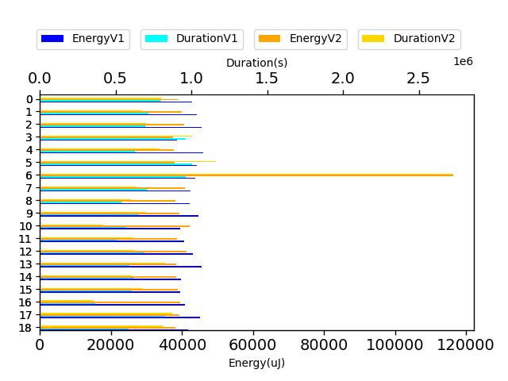

## com.google.gson.functional.StreamingTypeAdaptersTest

| Test | IterationV1 | IterationV2 | DeltaIteration |
| --- | --- | --- | --- |
| com.google.gson.functional.StreamingTypeAdaptersTest-testNullSafe | 83 | 74 | -9 |
| com.google.gson.functional.StreamingTypeAdaptersTest-testSerializeWithCustomTypeAdapter | 61 | 63 | 2 |
| com.google.gson.functional.StreamingTypeAdaptersTest-testDeserializeWithCustomTypeAdapter | 50 | 49 | -1 |
| com.google.gson.functional.StreamingTypeAdaptersTest-testDeserialize1dArray | 50 | 62 | 12 |
| com.google.gson.functional.StreamingTypeAdaptersTest-testDeserialize2dArray | 45 | 36 | -9 |
| com.google.gson.functional.StreamingTypeAdaptersTest-testSerialize2dArray | 40 | 31 | -9 |
| com.google.gson.functional.StreamingTypeAdaptersTest-testSerialize | 49 | 43 | -6 |
| com.google.gson.functional.StreamingTypeAdaptersTest-testSerializeRecursive | 46 | 47 | 1 |
| com.google.gson.functional.StreamingTypeAdaptersTest-testSerialize1dArray | 41 | 50 | 9 |

| Test | EnergyV1 | EnergyV2 | DeltaEnergy |
| --- | --- | --- | --- |
| com.google.gson.functional.StreamingTypeAdaptersTest-testNullSafe | 45214.60019086625 | 44459.75083675564 | -754.8493541106145 |
| com.google.gson.functional.StreamingTypeAdaptersTest-testSerializeWithCustomTypeAdapter | 43442.63300949705 | 44259.17445306309 | 816.5414435660423 |
| com.google.gson.functional.StreamingTypeAdaptersTest-testDeserializeWithCustomTypeAdapter | 45621.96958261156 | 43978.56231189024 | -1643.40727072132 |
| com.google.gson.functional.StreamingTypeAdaptersTest-testDeserialize1dArray | 43259.79981231567 | 40164.86762316852 | -3094.9321891471554 |
| com.google.gson.functional.StreamingTypeAdaptersTest-testDeserialize2dArray | 44429.37027032968 | 39768.876957840694 | -4660.493312488987 |
| com.google.gson.functional.StreamingTypeAdaptersTest-testSerialize2dArray | 45264.17284919919 | 42551.97406496853 | -2712.1987842306626 |
| com.google.gson.functional.StreamingTypeAdaptersTest-testSerialize | 69379.23079338283 | 42276.6972792997 | -27102.53351408313 |
| com.google.gson.functional.StreamingTypeAdaptersTest-testSerializeRecursive | 42160.56357415457 | 44421.768312909844 | 2261.204738755274 |
| com.google.gson.functional.StreamingTypeAdaptersTest-testSerialize1dArray | 45242.93197574088 | 43074.56624764668 | -2168.365728094199 |

| Test | DurationV1 | DurationsV2 | DeltaDuration |
| --- | --- | --- | --- |
| com.google.gson.functional.StreamingTypeAdaptersTest-testNullSafe | 1044347.4488240688 | 1118913.3965975042 | 74565.94777343539 |
| com.google.gson.functional.StreamingTypeAdaptersTest-testSerializeWithCustomTypeAdapter | 964666.5428485773 | 810132.3504975182 | -154534.19235105906 |
| com.google.gson.functional.StreamingTypeAdaptersTest-testDeserializeWithCustomTypeAdapter | 837917.1318345126 | 768335.1693888154 | -69581.96244569717 |
| com.google.gson.functional.StreamingTypeAdaptersTest-testDeserialize1dArray | 779402.165402555 | 838958.4943769292 | 59556.32897437422 |
| com.google.gson.functional.StreamingTypeAdaptersTest-testDeserialize2dArray | 536418.7232934801 | 511146.54567367444 | -25272.177619805676 |
| com.google.gson.functional.StreamingTypeAdaptersTest-testSerialize2dArray | 534991.7791579113 | 545916.7662305012 | 10924.987072589924 |
| com.google.gson.functional.StreamingTypeAdaptersTest-testSerialize | 1441269.0414552013 | 708738.4150522192 | -732530.6264029822 |
| com.google.gson.functional.StreamingTypeAdaptersTest-testSerializeRecursive | 792514.2510629364 | 716733.8671753225 | -75780.38388761389 |
| com.google.gson.functional.StreamingTypeAdaptersTest-testSerialize1dArray | 772098.6187696609 | 701268.6969205715 | -70829.92184908944 |

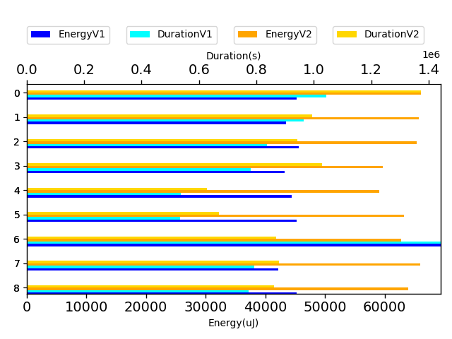

## com.google.gson.functional.JsonAdapterAnnotationOnClassesTest

| Test | IterationV1 | IterationV2 | DeltaIteration |
| --- | --- | --- | --- |
| com.google.gson.functional.JsonAdapterAnnotationOnClassesTest-testJsonAdapterInvoked | 99 | 99 | 0 |
| com.google.gson.functional.JsonAdapterAnnotationOnClassesTest-testJsonAdapterFactoryInvoked | 76 | 72 | -4 |
| com.google.gson.functional.JsonAdapterAnnotationOnClassesTest-testRegisteredDeserializerOverridesJsonAdapter | 44 | 39 | -5 |
| com.google.gson.functional.JsonAdapterAnnotationOnClassesTest-testSuperclassTypeAdapterNotInvoked | 49 | 48 | -1 |
| com.google.gson.functional.JsonAdapterAnnotationOnClassesTest-testIncorrectJsonAdapterType | 47 | 57 | 10 |
| com.google.gson.functional.JsonAdapterAnnotationOnClassesTest-testRegisteredSerializerOverridesJsonAdapter | 50 | 48 | -2 |
| com.google.gson.functional.JsonAdapterAnnotationOnClassesTest-testNullSafeObjectFromJson | 71 | 60 | -11 |
| com.google.gson.functional.JsonAdapterAnnotationOnClassesTest-testIncorrectTypeAdapterFails | 42 | 42 | 0 |
| com.google.gson.functional.JsonAdapterAnnotationOnClassesTest-testRegisteredAdapterOverridesJsonAdapter | 34 | 36 | 2 |

| Test | EnergyV1 | EnergyV2 | DeltaEnergy |
| --- | --- | --- | --- |
| com.google.gson.functional.JsonAdapterAnnotationOnClassesTest-testJsonAdapterInvoked | 106195.40860395439 | 78463.73135331944 | -27731.67725063495 |
| com.google.gson.functional.JsonAdapterAnnotationOnClassesTest-testJsonAdapterFactoryInvoked | 44273.188424604996 | 39808.34242808483 | -4464.845996520169 |
| com.google.gson.functional.JsonAdapterAnnotationOnClassesTest-testRegisteredDeserializerOverridesJsonAdapter | 43954.628852674716 | 39070.375352616 | -4884.253500058716 |
| com.google.gson.functional.JsonAdapterAnnotationOnClassesTest-testSuperclassTypeAdapterNotInvoked | 41710.58615523652 | 40110.595681951265 | -1599.990473285252 |
| com.google.gson.functional.JsonAdapterAnnotationOnClassesTest-testIncorrectJsonAdapterType | 68313.05411503252 | 38029.39914933359 | -30283.654965698923 |
| com.google.gson.functional.JsonAdapterAnnotationOnClassesTest-testRegisteredSerializerOverridesJsonAdapter | 46763.7840505881 | 39926.21006069101 | -6837.573989897093 |
| com.google.gson.functional.JsonAdapterAnnotationOnClassesTest-testNullSafeObjectFromJson | 45841.20791528716 | 40115.845857792054 | -5725.362057495106 |
| com.google.gson.functional.JsonAdapterAnnotationOnClassesTest-testIncorrectTypeAdapterFails | 44954.48211449776 | 39534.42862745894 | -5420.053487038822 |
| com.google.gson.functional.JsonAdapterAnnotationOnClassesTest-testRegisteredAdapterOverridesJsonAdapter | 42276.53418453701 | 40348.05726820332 | -1928.4769163336896 |

| Test | DurationV1 | DurationsV2 | DeltaDuration |
| --- | --- | --- | --- |
| com.google.gson.functional.JsonAdapterAnnotationOnClassesTest-testJsonAdapterInvoked | 2220470.895119 | 1946650.0808904925 | -273820.8142285077 |
| com.google.gson.functional.JsonAdapterAnnotationOnClassesTest-testJsonAdapterFactoryInvoked | 956109.4632744708 | 957589.2898366152 | 1479.8265621444443 |
| com.google.gson.functional.JsonAdapterAnnotationOnClassesTest-testRegisteredDeserializerOverridesJsonAdapter | 685594.0355170425 | 470699.73530458845 | -214894.30021245405 |
| com.google.gson.functional.JsonAdapterAnnotationOnClassesTest-testSuperclassTypeAdapterNotInvoked | 590545.8374493053 | 522171.28797281237 | -68374.54947649298 |
| com.google.gson.functional.JsonAdapterAnnotationOnClassesTest-testIncorrectJsonAdapterType | 1524336.9203533889 | 630232.2333561722 | -894104.6869972167 |
| com.google.gson.functional.JsonAdapterAnnotationOnClassesTest-testRegisteredSerializerOverridesJsonAdapter | 673594.0634063506 | 560900.8035319905 | -112693.25987436005 |
| com.google.gson.functional.JsonAdapterAnnotationOnClassesTest-testNullSafeObjectFromJson | 864017.2042557627 | 642963.3027286067 | -221053.901527156 |
| com.google.gson.functional.JsonAdapterAnnotationOnClassesTest-testIncorrectTypeAdapterFails | 806459.0169551799 | 531178.5559291227 | -275280.46102605714 |
| com.google.gson.functional.JsonAdapterAnnotationOnClassesTest-testRegisteredAdapterOverridesJsonAdapter | 874358.5170887024 | 502349.745116486 | -372008.77197221643 |

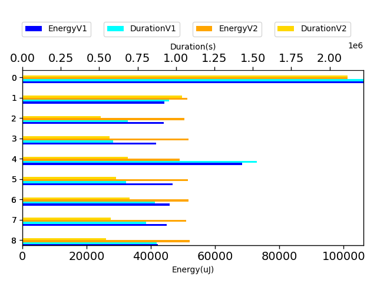

## com.google.gson.functional.CustomDeserializerTest

| Test | IterationV1 | IterationV2 | DeltaIteration |
| --- | --- | --- | --- |
| com.google.gson.functional.CustomDeserializerTest-testDefaultConstructorNotCalledOnObject | 42 | 46 | 4 |
| com.google.gson.functional.CustomDeserializerTest-testCustomDeserializerReturnsNullForArrayElementsForArrayField | 60 | 58 | -2 |
| com.google.gson.functional.CustomDeserializerTest-testCustomDeserializerReturnsNull | 54 | 50 | -4 |
| com.google.gson.functional.CustomDeserializerTest-testJsonTypeFieldBasedDeserialization | 98 | 98 | 0 |
| com.google.gson.functional.CustomDeserializerTest-testCustomDeserializerReturnsNullForArrayElements | 44 | 36 | -8 |
| com.google.gson.functional.CustomDeserializerTest-testCustomDeserializerReturnsNullForTopLevelObject | 45 | 43 | -2 |
| com.google.gson.functional.CustomDeserializerTest-testDefaultConstructorNotCalledOnField | 42 | 51 | 9 |

| Test | EnergyV1 | EnergyV2 | DeltaEnergy |
| --- | --- | --- | --- |
| com.google.gson.functional.CustomDeserializerTest-testDefaultConstructorNotCalledOnObject | 39897.19392764788 | 48875.53163419885 | 8978.33770655097 |
| com.google.gson.functional.CustomDeserializerTest-testCustomDeserializerReturnsNullForArrayElementsForArrayField | 38202.58957672797 | 40229.729256430466 | 2027.1396797024936 |
| com.google.gson.functional.CustomDeserializerTest-testCustomDeserializerReturnsNull | 42329.16995338953 | 43543.56945584788 | 1214.3995024583492 |
| com.google.gson.functional.CustomDeserializerTest-testJsonTypeFieldBasedDeserialization | 39318.39136589318 | 54790.651798382736 | 15472.260432489558 |
| com.google.gson.functional.CustomDeserializerTest-testCustomDeserializerReturnsNullForArrayElements | 46714.69605196807 | 41591.316454057975 | -5123.379597910098 |
| com.google.gson.functional.CustomDeserializerTest-testCustomDeserializerReturnsNullForTopLevelObject | 42420.708819368105 | 41862.851806965315 | -557.8570124027901 |
| com.google.gson.functional.CustomDeserializerTest-testDefaultConstructorNotCalledOnField | 43905.11002046839 | 42029.47584830504 | -1875.6341721633507 |

| Test | DurationV1 | DurationsV2 | DeltaDuration |
| --- | --- | --- | --- |
| com.google.gson.functional.CustomDeserializerTest-testDefaultConstructorNotCalledOnObject | 786827.14683517 | 736930.0392631105 | -49897.107572059496 |
| com.google.gson.functional.CustomDeserializerTest-testCustomDeserializerReturnsNullForArrayElementsForArrayField | 935311.7554921687 | 719367.0043444897 | -215944.75114767905 |
| com.google.gson.functional.CustomDeserializerTest-testCustomDeserializerReturnsNull | 690372.8200269945 | 749330.4582610659 | 58957.63823407143 |
| com.google.gson.functional.CustomDeserializerTest-testJsonTypeFieldBasedDeserialization | 1676486.4242029327 | 1281963.7419234575 | -394522.68227947527 |
| com.google.gson.functional.CustomDeserializerTest-testCustomDeserializerReturnsNullForArrayElements | 823497.7610713373 | 607016.9657078445 | -216480.7953634928 |
| com.google.gson.functional.CustomDeserializerTest-testCustomDeserializerReturnsNullForTopLevelObject | 534571.8823661678 | 478829.84107682086 | -55742.04128934699 |
| com.google.gson.functional.CustomDeserializerTest-testDefaultConstructorNotCalledOnField | 878090.1148800235 | 783914.4588516671 | -94175.6560283564 |

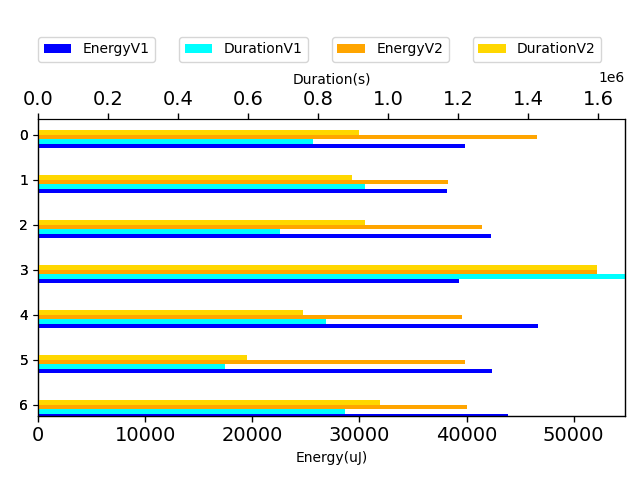

## com.google.gson.functional.ExclusionStrategyFunctionalTest

| Test | IterationV1 | IterationV2 | DeltaIteration |
| --- | --- | --- | --- |
| com.google.gson.functional.ExclusionStrategyFunctionalTest-testExclusionStrategySerializationDoesNotImpactSerialization | 28 | 23 | -5 |
| com.google.gson.functional.ExclusionStrategyFunctionalTest-testExcludeTopLevelClassSerialization | 13 | 23 | 10 |
| com.google.gson.functional.ExclusionStrategyFunctionalTest-testExcludeTopLevelClassDeserializationDoesNotImpactSerialization | 23 | 20 | -3 |
| com.google.gson.functional.ExclusionStrategyFunctionalTest-testExclusionStrategySerialization | 97 | 97 | 0 |
| com.google.gson.functional.ExclusionStrategyFunctionalTest-testExclusionStrategyDeserialization | 45 | 42 | -3 |
| com.google.gson.functional.ExclusionStrategyFunctionalTest-testExclusionStrategyWithMode | 34 | 32 | -2 |
| com.google.gson.functional.ExclusionStrategyFunctionalTest-testExcludeTopLevelClassDeserialization | 14 | 16 | 2 |
| com.google.gson.functional.ExclusionStrategyFunctionalTest-testExcludeTopLevelClassSerializationDoesNotImpactDeserialization | 26 | 24 | -2 |
| com.google.gson.functional.ExclusionStrategyFunctionalTest-testExclusionStrategySerializationDoesNotImpactDeserialization | 38 | 39 | 1 |

| Test | EnergyV1 | EnergyV2 | DeltaEnergy |
| --- | --- | --- | --- |
| com.google.gson.functional.ExclusionStrategyFunctionalTest-testExclusionStrategySerializationDoesNotImpactSerialization | 43541.31780591607 | 45428.4781062603 | 1887.1603003442287 |
| com.google.gson.functional.ExclusionStrategyFunctionalTest-testExcludeTopLevelClassSerialization | 44733.48156738281 | 43709.44953227043 | -1024.032035112381 |
| com.google.gson.functional.ExclusionStrategyFunctionalTest-testExcludeTopLevelClassDeserializationDoesNotImpactSerialization | 40389.89400279522 | 43181.365772247314 | 2791.471769452095 |
| com.google.gson.functional.ExclusionStrategyFunctionalTest-testExclusionStrategySerialization | 63885.230334938184 | 149782.07141519774 | 85896.84108025956 |
| com.google.gson.functional.ExclusionStrategyFunctionalTest-testExclusionStrategyDeserialization | 42572.8415370893 | 74501.48480690617 | 31928.643269816872 |
| com.google.gson.functional.ExclusionStrategyFunctionalTest-testExclusionStrategyWithMode | 43131.37253507716 | 39236.22602702165 | -3895.1465080555063 |
| com.google.gson.functional.ExclusionStrategyFunctionalTest-testExcludeTopLevelClassDeserialization | 42987.27844238281 | 43967.46694946289 | 980.1885070800781 |
| com.google.gson.functional.ExclusionStrategyFunctionalTest-testExcludeTopLevelClassSerializationDoesNotImpactDeserialization | 41817.98717185855 | 42214.02319252491 | 396.03602066636086 |
| com.google.gson.functional.ExclusionStrategyFunctionalTest-testExclusionStrategySerializationDoesNotImpactDeserialization | 44108.25526326878 | 53045.170651835404 | 8936.915388566624 |

| Test | DurationV1 | DurationsV2 | DeltaDuration |
| --- | --- | --- | --- |
| com.google.gson.functional.ExclusionStrategyFunctionalTest-testExclusionStrategySerializationDoesNotImpactSerialization | 385397.3853637986 | 437864.26518797874 | 52466.879824180156 |
| com.google.gson.functional.ExclusionStrategyFunctionalTest-testExcludeTopLevelClassSerialization | 308955.9606933594 | 324740.581207037 | 15784.620513677597 |
| com.google.gson.functional.ExclusionStrategyFunctionalTest-testExcludeTopLevelClassDeserializationDoesNotImpactSerialization | 428688.77847242355 | 481634.3135128021 | 52945.53504037857 |
| com.google.gson.functional.ExclusionStrategyFunctionalTest-testExclusionStrategySerialization | 2007385.2130952335 | 3604792.452007789 | 1597407.2389125556 |
| com.google.gson.functional.ExclusionStrategyFunctionalTest-testExclusionStrategyDeserialization | 443811.1678767423 | 1474863.3554641427 | 1031052.1875874004 |
| com.google.gson.functional.ExclusionStrategyFunctionalTest-testExclusionStrategyWithMode | 471485.8966592271 | 809417.6704004668 | 337931.7737412397 |
| com.google.gson.functional.ExclusionStrategyFunctionalTest-testExcludeTopLevelClassDeserialization | 332795.4289550781 | 341963.88693237305 | 9168.457977294922 |
| com.google.gson.functional.ExclusionStrategyFunctionalTest-testExcludeTopLevelClassSerializationDoesNotImpactDeserialization | 1603216.6541268826 | 413580.63265138865 | -1189636.021475494 |
| com.google.gson.functional.ExclusionStrategyFunctionalTest-testExclusionStrategySerializationDoesNotImpactDeserialization | 479906.899907553 | 1053616.5913753256 | 573709.6914677726 |

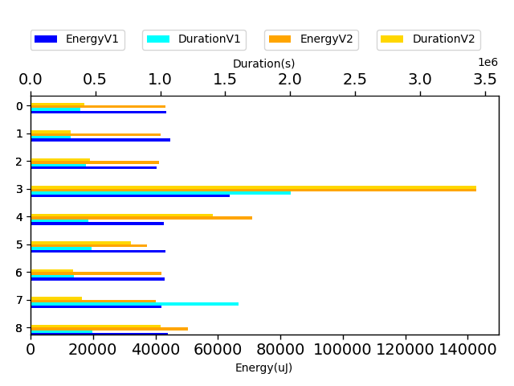

## com.google.gson.functional.InstanceCreatorTest

| Test | IterationV1 | IterationV2 | DeltaIteration |
| --- | --- | --- | --- |
| com.google.gson.functional.InstanceCreatorTest-testInstanceCreatorForParametrizedType | 96 | 99 | 3 |
| com.google.gson.functional.InstanceCreatorTest-testInstanceCreatorReturnsBaseType | 66 | 60 | -6 |
| com.google.gson.functional.InstanceCreatorTest-testInstanceCreatorReturnsSubTypeForField | 46 | 53 | 7 |
| com.google.gson.functional.InstanceCreatorTest-testInstanceCreatorReturnsSubTypeForTopLevelObject | 46 | 45 | -1 |
| com.google.gson.functional.InstanceCreatorTest-testInstanceCreatorForCollectionType | 99 | 99 | 0 |

| Test | EnergyV1 | EnergyV2 | DeltaEnergy |
| --- | --- | --- | --- |
| com.google.gson.functional.InstanceCreatorTest-testInstanceCreatorForParametrizedType | 66290.18104202954 | 83993.24349544544 | 17703.0624534159 |
| com.google.gson.functional.InstanceCreatorTest-testInstanceCreatorReturnsBaseType | 80025.39015996442 | 77388.14268017755 | -2637.2474797868636 |
| com.google.gson.functional.InstanceCreatorTest-testInstanceCreatorReturnsSubTypeForField | 41111.35151178842 | 54037.02238562137 | 12925.670873832947 |
| com.google.gson.functional.InstanceCreatorTest-testInstanceCreatorReturnsSubTypeForTopLevelObject | 40384.73214595317 | 43752.06865500618 | 3367.3365090530133 |
| com.google.gson.functional.InstanceCreatorTest-testInstanceCreatorForCollectionType | 43506.50334059349 | 55539.325224538494 | 12032.821883945006 |

| Test | DurationV1 | DurationsV2 | DeltaDuration |
| --- | --- | --- | --- |
| com.google.gson.functional.InstanceCreatorTest-testInstanceCreatorForParametrizedType | 2125403.7763397326 | 1718089.2539745527 | -407314.52236517984 |
| com.google.gson.functional.InstanceCreatorTest-testInstanceCreatorReturnsBaseType | 2431759.906728465 | 2017167.8946039504 | -414592.0121245147 |
| com.google.gson.functional.InstanceCreatorTest-testInstanceCreatorReturnsSubTypeForField | 625362.2578978383 | 1239496.2136604376 | 614133.9557625994 |
| com.google.gson.functional.InstanceCreatorTest-testInstanceCreatorReturnsSubTypeForTopLevelObject | 734108.2436974049 | 785689.5363049296 | 51581.29260752478 |
| com.google.gson.functional.InstanceCreatorTest-testInstanceCreatorForCollectionType | 1723367.2069647128 | 1727306.924813453 | 3939.7178487402853 |

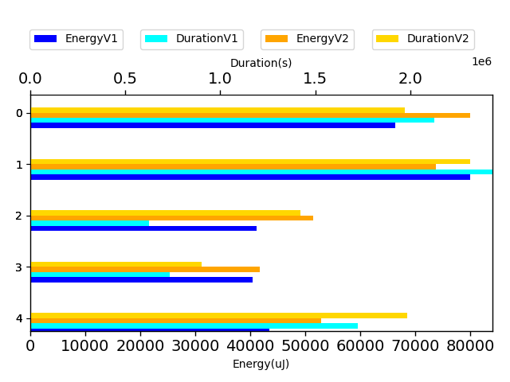

## com.google.gson.functional.JsonParserTest

| Test | IterationV1 | IterationV2 | DeltaIteration |
| --- | --- | --- | --- |
| com.google.gson.functional.JsonParserTest-testBadTypeForDeserializingCustomTree | 32 | 22 | -10 |
| com.google.gson.functional.JsonParserTest-testDeserializingCustomTree | 34 | 41 | 7 |
| com.google.gson.functional.JsonParserTest-testExtraCommasInMaps | 50 | 51 | 1 |
| com.google.gson.functional.JsonParserTest-testChangingCustomTreeAndDeserializing | 41 | 43 | 2 |
| com.google.gson.functional.JsonParserTest-testBadFieldTypeForCustomDeserializerCustomTree | 22 | 34 | 12 |
| com.google.gson.functional.JsonParserTest-testBadFieldTypeForDeserializingCustomTree | 27 | 26 | -1 |
| com.google.gson.functional.JsonParserTest-testExtraCommasInArrays | 54 | 66 | 12 |
| com.google.gson.functional.JsonParserTest-testParseInvalidJson | 31 | 29 | -2 |

| Test | EnergyV1 | EnergyV2 | DeltaEnergy |
| --- | --- | --- | --- |
| com.google.gson.functional.JsonParserTest-testBadTypeForDeserializingCustomTree | 46160.62269687955 | 41203.51838517189 | -4957.104311707662 |
| com.google.gson.functional.JsonParserTest-testDeserializingCustomTree | 42388.423270303116 | 55301.73244588583 | 12913.309175582712 |
| com.google.gson.functional.JsonParserTest-testExtraCommasInMaps | 41463.40222346867 | 41812.24680106074 | 348.84457759207 |
| com.google.gson.functional.JsonParserTest-testChangingCustomTreeAndDeserializing | 42001.702033230846 | 46324.281893696185 | 4322.579860465339 |
| com.google.gson.functional.JsonParserTest-testBadFieldTypeForCustomDeserializerCustomTree | 39248.355363845825 | 45882.39306339051 | 6634.037699544686 |
| com.google.gson.functional.JsonParserTest-testBadFieldTypeForDeserializingCustomTree | 42274.49284400046 | 37463.89641278982 | -4810.596431210637 |
| com.google.gson.functional.JsonParserTest-testExtraCommasInArrays | 39540.732304172416 | 45971.23345729394 | 6430.501153121528 |
| com.google.gson.functional.JsonParserTest-testParseInvalidJson | 43507.045109801926 | 45602.70501755923 | 2095.6599077573046 |

| Test | DurationV1 | DurationsV2 | DeltaDuration |
| --- | --- | --- | --- |
| com.google.gson.functional.JsonParserTest-testBadTypeForDeserializingCustomTree | 727987.8636283895 | 491153.78520846367 | -236834.07841992588 |
| com.google.gson.functional.JsonParserTest-testDeserializingCustomTree | 552980.9931500528 | 1167012.4803517503 | 614031.4872016974 |
| com.google.gson.functional.JsonParserTest-testExtraCommasInMaps | 562233.7593709168 | 793146.1372083757 | 230912.37783745897 |
| com.google.gson.functional.JsonParserTest-testChangingCustomTreeAndDeserializing | 534500.6894366851 | 1248272.8122846591 | 713772.1228479741 |
| com.google.gson.functional.JsonParserTest-testBadFieldTypeForCustomDeserializerCustomTree | 456665.5432524681 | 493982.4488098093 | 37316.905557341175 |
| com.google.gson.functional.JsonParserTest-testBadFieldTypeForDeserializingCustomTree | 624224.2366651744 | 1022731.8626627624 | 398507.62599758804 |
| com.google.gson.functional.JsonParserTest-testExtraCommasInArrays | 690950.3782104098 | 876274.0232503228 | 185323.645039913 |
| com.google.gson.functional.JsonParserTest-testParseInvalidJson | 625543.9834828144 | 599239.8823972791 | -26304.10108553525 |

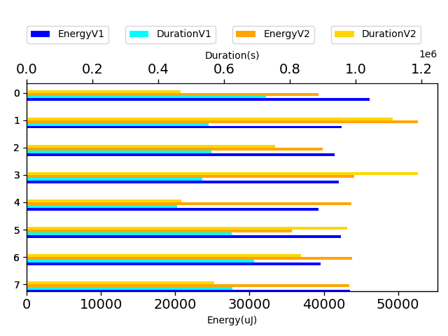

## com.google.gson.functional.CollectionTest

| Test | IterationV1 | IterationV2 | DeltaIteration |
| --- | --- | --- | --- |
| com.google.gson.functional.CollectionTest-testCollectionOfObjectSerialization | 53 | 48 | -5 |
| com.google.gson.functional.CollectionTest-testNullsInListDeserialization | 39 | 41 | 2 |
| com.google.gson.functional.CollectionTest-testRawCollectionSerialization | 33 | 30 | -3 |
| com.google.gson.functional.CollectionTest-testStack | 96 | 95 | -1 |
| com.google.gson.functional.CollectionTest-testRawCollectionOfBagOfPrimitivesNotAllowed | 38 | 36 | -2 |
| com.google.gson.functional.CollectionTest-testPriorityQueue | 95 | 97 | 2 |
| com.google.gson.functional.CollectionTest-testNullsInListSerialization | 32 | 47 | 15 |
| com.google.gson.functional.CollectionTest-testIssue1107 | 79 | 77 | -2 |
| com.google.gson.functional.CollectionTest-testWildcardPrimitiveCollectionSerilaization | 50 | 44 | -6 |
| com.google.gson.functional.CollectionTest-testWildcardPrimitiveCollectionDeserilaization | 41 | 44 | 3 |
| com.google.gson.functional.CollectionTest-testQueueDeserialization | 39 | 41 | 2 |
| com.google.gson.functional.CollectionTest-testCollectionOfBagOfPrimitivesSerialization | 32 | 37 | 5 |
| com.google.gson.functional.CollectionTest-testSetDeserialization | 72 | 65 | -7 |
| com.google.gson.functional.CollectionTest-testWildcardCollectionField | 71 | 69 | -2 |
| com.google.gson.functional.CollectionTest-testVector | 60 | 58 | -2 |
| com.google.gson.functional.CollectionTest-testSetSerialization | 62 | 58 | -4 |
| com.google.gson.functional.CollectionTest-testTopLevelCollectionOfIntegersSerialization | 43 | 43 | 0 |
| com.google.gson.functional.CollectionTest-testLinkedListSerialization | 50 | 48 | -2 |
| com.google.gson.functional.CollectionTest-testFieldIsArrayList | 50 | 55 | 5 |
| com.google.gson.functional.CollectionTest-testRawCollectionOfIntegersSerialization | 23 | 12 | -11 |
| com.google.gson.functional.CollectionTest-testLinkedListDeserialization | 45 | 44 | -1 |
| com.google.gson.functional.CollectionTest-testUserCollectionTypeAdapter | 74 | 62 | -12 |
| com.google.gson.functional.CollectionTest-testTopLevelListOfIntegerCollectionsDeserialization | 50 | 39 | -11 |
| com.google.gson.functional.CollectionTest-testCollectionOfStringsDeserialization | 36 | 46 | 10 |
| com.google.gson.functional.CollectionTest-testQueueSerialization | 61 | 57 | -4 |
| com.google.gson.functional.CollectionTest-testTopLevelCollectionOfIntegersDeserialization | 39 | 47 | 8 |
| com.google.gson.functional.CollectionTest-testCollectionOfObjectWithNullSerialization | 44 | 42 | -2 |
| com.google.gson.functional.CollectionTest-testRawCollectionDeserializationNotAlllowed | 36 | 27 | -9 |
| com.google.gson.functional.CollectionTest-testCollectionOfStringsSerialization | 17 | 12 | -5 |

| Test | EnergyV1 | EnergyV2 | DeltaEnergy |
| --- | --- | --- | --- |
| com.google.gson.functional.CollectionTest-testCollectionOfObjectSerialization | 40297.40319885536 | 41936.063236196904 | 1638.6600373415422 |
| com.google.gson.functional.CollectionTest-testNullsInListDeserialization | 45400.365828149355 | 45035.36751408437 | -364.9983140649856 |
| com.google.gson.functional.CollectionTest-testRawCollectionSerialization | 43199.65506625536 | 44914.36959736049 | 1714.7145311051281 |
| com.google.gson.functional.CollectionTest-testStack | 43069.75228530778 | 64083.175103988 | 21013.422818680214 |
| com.google.gson.functional.CollectionTest-testRawCollectionOfBagOfPrimitivesNotAllowed | 40112.98034434652 | 45978.99184955997 | 5866.01150521345 |
| com.google.gson.functional.CollectionTest-testPriorityQueue | 44652.82328796286 | 64366.483797894936 | 19713.660509932073 |
| com.google.gson.functional.CollectionTest-testNullsInListSerialization | 39450.20409139246 | 43700.86727629768 | 4250.663184905221 |
| com.google.gson.functional.CollectionTest-testIssue1107 | 40100.89440671599 | 46261.74160944755 | 6160.847202731558 |
| com.google.gson.functional.CollectionTest-testWildcardPrimitiveCollectionSerilaization | 42927.66661966731 | 45493.3958065375 | 2565.729186870187 |
| com.google.gson.functional.CollectionTest-testWildcardPrimitiveCollectionDeserilaization | 44249.91820033816 | 44007.42499149973 | -242.4932088384303 |
| com.google.gson.functional.CollectionTest-testQueueDeserialization | 46261.44091185375 | 40945.362482916025 | -5316.078428937726 |
| com.google.gson.functional.CollectionTest-testCollectionOfBagOfPrimitivesSerialization | 44204.90801600902 | 42004.356482243005 | -2200.551533766018 |
| com.google.gson.functional.CollectionTest-testSetDeserialization | 44868.33752019204 | 54769.81679321455 | 9901.479273022509 |
| com.google.gson.functional.CollectionTest-testWildcardCollectionField | 46841.69281033793 | 43621.74710170366 | -3219.9457086342736 |
| com.google.gson.functional.CollectionTest-testVector | 41325.76489012473 | 42477.14895467865 | 1151.3840645539167 |
| com.google.gson.functional.CollectionTest-testSetSerialization | 43485.51325906675 | 68810.35286208118 | 25324.839603014436 |
| com.google.gson.functional.CollectionTest-testTopLevelCollectionOfIntegersSerialization | 43133.26290908644 | 97347.73657685946 | 54214.47366777302 |
| com.google.gson.functional.CollectionTest-testLinkedListSerialization | 42185.56545531296 | 43197.155691883396 | 1011.5902365704387 |
| com.google.gson.functional.CollectionTest-testFieldIsArrayList | 41855.36706748014 | 44273.53658224104 | 2418.169514760899 |
| com.google.gson.functional.CollectionTest-testRawCollectionOfIntegersSerialization | 41499.72471785545 | 44402.08349609375 | 2902.3587782382965 |
| com.google.gson.functional.CollectionTest-testLinkedListDeserialization | 39829.97849346382 | 44246.189108205246 | 4416.210614741423 |
| com.google.gson.functional.CollectionTest-testUserCollectionTypeAdapter | 45257.854071001624 | 43982.027492196205 | -1275.8265788054196 |
| com.google.gson.functional.CollectionTest-testTopLevelListOfIntegerCollectionsDeserialization | 39654.02022774754 | 44245.86375390698 | 4591.843526159442 |
| com.google.gson.functional.CollectionTest-testCollectionOfStringsDeserialization | 47401.66910855935 | 44033.10963408933 | -3368.559474470021 |
| com.google.gson.functional.CollectionTest-testQueueSerialization | 42819.75640284379 | 44370.655793211066 | 1550.8993903672745 |
| com.google.gson.functional.CollectionTest-testTopLevelCollectionOfIntegersDeserialization | 41988.54885928788 | 44048.49012506926 | 2059.9412657813737 |
| com.google.gson.functional.CollectionTest-testCollectionOfObjectWithNullSerialization | 40455.1315613402 | 44167.60887453761 | 3712.4773131974143 |
| com.google.gson.functional.CollectionTest-testRawCollectionDeserializationNotAlllowed | 41722.93420018919 | 45398.20450283587 | 3675.270302646677 |
| com.google.gson.functional.CollectionTest-testCollectionOfStringsSerialization | 41970.167541503906 | 43341.43505859375 | 1371.2675170898438 |

| Test | DurationV1 | DurationsV2 | DeltaDuration |
| --- | --- | --- | --- |
| com.google.gson.functional.CollectionTest-testCollectionOfObjectSerialization | 707011.9663584091 | 587544.7695698019 | -119467.19678860728 |
| com.google.gson.functional.CollectionTest-testNullsInListDeserialization | 643912.1823333425 | 624236.0881384013 | -19676.094194941223 |
| com.google.gson.functional.CollectionTest-testRawCollectionSerialization | 460890.9625781777 | 679605.6724132085 | 218714.70983503084 |
| com.google.gson.functional.CollectionTest-testStack | 1240126.3119636907 | 1337153.3575562155 | 97027.04559252481 |
| com.google.gson.functional.CollectionTest-testRawCollectionOfBagOfPrimitivesNotAllowed | 882063.5390625629 | 720818.8256800158 | -161244.71338254702 |
| com.google.gson.functional.CollectionTest-testPriorityQueue | 1330438.5179040849 | 1636916.08832082 | 306477.570416735 |
| com.google.gson.functional.CollectionTest-testNullsInListSerialization | 614515.0465083802 | 597415.5177499884 | -17099.528758391854 |
| com.google.gson.functional.CollectionTest-testIssue1107 | 1323667.9792128752 | 921980.3183649783 | -401687.66084789694 |
| com.google.gson.functional.CollectionTest-testWildcardPrimitiveCollectionSerilaization | 766570.6931372337 | 889550.212956218 | 122979.51981898432 |
| com.google.gson.functional.CollectionTest-testWildcardPrimitiveCollectionDeserilaization | 648109.4255981668 | 542935.0085642303 | -105174.41703393648 |
| com.google.gson.functional.CollectionTest-testQueueDeserialization | 614720.9193431451 | 503280.33268908045 | -111440.58665406465 |
| com.google.gson.functional.CollectionTest-testCollectionOfBagOfPrimitivesSerialization | 521620.9210052297 | 370419.3916726613 | -151201.5293325684 |
| com.google.gson.functional.CollectionTest-testSetDeserialization | 1230130.8553618756 | 991453.3405704643 | -238677.51479141135 |
| com.google.gson.functional.CollectionTest-testWildcardCollectionField | 1129049.6411918723 | 1066113.9808558505 | -62935.6603360218 |
| com.google.gson.functional.CollectionTest-testVector | 690029.4730881437 | 659684.534951479 | -30344.938136664685 |
| com.google.gson.functional.CollectionTest-testSetSerialization | 839164.8585282437 | 1582029.5420599403 | 742864.6835316966 |
| com.google.gson.functional.CollectionTest-testTopLevelCollectionOfIntegersSerialization | 599856.7090237743 | 1848291.6463103858 | 1248434.9372866116 |
| com.google.gson.functional.CollectionTest-testLinkedListSerialization | 945984.5611557532 | 584352.6516928193 | -361631.9094629339 |
| com.google.gson.functional.CollectionTest-testFieldIsArrayList | 705484.1312462171 | 763932.2248933555 | 58448.09364713845 |
| com.google.gson.functional.CollectionTest-testRawCollectionOfIntegersSerialization | 570604.4871854782 | 511994.125 | -58610.36218547821 |
| com.google.gson.functional.CollectionTest-testLinkedListDeserialization | 641864.0437717715 | 500814.01901264634 | -141050.02475912514 |
| com.google.gson.functional.CollectionTest-testUserCollectionTypeAdapter | 923434.7840310683 | 841625.7220184405 | -81809.06201262784 |
| com.google.gson.functional.CollectionTest-testTopLevelListOfIntegerCollectionsDeserialization | 682843.5393949404 | 570401.0180069231 | -112442.52138801722 |
| com.google.gson.functional.CollectionTest-testCollectionOfStringsDeserialization | 662563.9120842485 | 663978.1325507734 | 1414.2204665249446 |
| com.google.gson.functional.CollectionTest-testQueueSerialization | 820190.1370189816 | 554590.8168380416 | -265599.32018094 |
| com.google.gson.functional.CollectionTest-testTopLevelCollectionOfIntegersDeserialization | 800726.0679189896 | 572460.3022895701 | -228265.76562941947 |
| com.google.gson.functional.CollectionTest-testCollectionOfObjectWithNullSerialization | 703111.3468169951 | 742648.733334417 | 39537.386517421925 |
| com.google.gson.functional.CollectionTest-testRawCollectionDeserializationNotAlllowed | 692686.7335254657 | 567999.3748782575 | -124687.3586472082 |
| com.google.gson.functional.CollectionTest-testCollectionOfStringsSerialization | 310292.6775817871 | 319002.64208984375 | 8709.96450805664 |

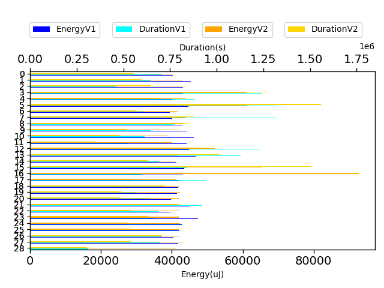

## com.google.gson.functional.JsonAdapterSerializerDeserializerTest

| Test | IterationV1 | IterationV2 | DeltaIteration |
| --- | --- | --- | --- |
| com.google.gson.functional.JsonAdapterSerializerDeserializerTest-testJsonSerializerDeserializerBasedJsonAdapterOnFields | 99 | 99 | 0 |
| com.google.gson.functional.JsonAdapterSerializerDeserializerTest-testDifferentJsonAdaptersForGenericFieldsOfSameRawType | 99 | 99 | 0 |
| com.google.gson.functional.JsonAdapterSerializerDeserializerTest-testJsonSerializerDeserializerBasedJsonAdapterOnClass | 86 | 87 | 1 |

| Test | EnergyV1 | EnergyV2 | DeltaEnergy |
| --- | --- | --- | --- |
| com.google.gson.functional.JsonAdapterSerializerDeserializerTest-testJsonSerializerDeserializerBasedJsonAdapterOnFields | 73013.26247649235 | 105323.73192533218 | 32310.469448839824 |
| com.google.gson.functional.JsonAdapterSerializerDeserializerTest-testDifferentJsonAdaptersForGenericFieldsOfSameRawType | 38140.60010909586 | 44326.90921277252 | 6186.309103676664 |
| com.google.gson.functional.JsonAdapterSerializerDeserializerTest-testJsonSerializerDeserializerBasedJsonAdapterOnClass | 41532.14576630862 | 43048.931470151816 | 1516.7857038431976 |

| Test | DurationV1 | DurationsV2 | DeltaDuration |
| --- | --- | --- | --- |
| com.google.gson.functional.JsonAdapterSerializerDeserializerTest-testJsonSerializerDeserializerBasedJsonAdapterOnFields | 1593839.4368316052 | 2279050.4303149567 | 685210.9934833515 |
| com.google.gson.functional.JsonAdapterSerializerDeserializerTest-testDifferentJsonAdaptersForGenericFieldsOfSameRawType | 1278452.9753618913 | 1460025.4012451814 | 181572.42588329013 |
| com.google.gson.functional.JsonAdapterSerializerDeserializerTest-testJsonSerializerDeserializerBasedJsonAdapterOnClass | 1059382.933513937 | 1050092.474447498 | -9290.459066438954 |

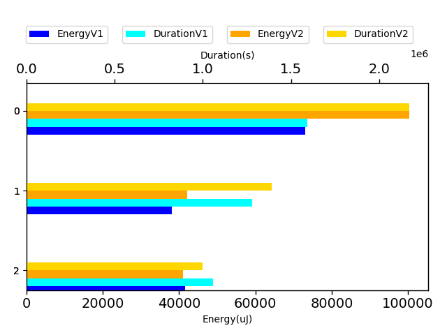

## com.google.gson.internal.bind.RecursiveTypesResolveTest

| Test | IterationV1 | IterationV2 | DeltaIteration |
| --- | --- | --- | --- |
| com.google.gson.internal.bind.RecursiveTypesResolveTest-testIssue440WeakReference | 68 | 76 | 8 |
| com.google.gson.internal.bind.RecursiveTypesResolveTest-testRecursiveResolveSimple | 94 | 88 | -6 |
| com.google.gson.internal.bind.RecursiveTypesResolveTest-testIssue603PrintStream | 99 | 99 | 0 |
| com.google.gson.internal.bind.RecursiveTypesResolveTest-testRecursiveTypeVariablesResolve12 | 40 | 35 | -5 |
| com.google.gson.internal.bind.RecursiveTypesResolveTest-testRecursiveTypeVariablesResolve1 | 45 | 57 | 12 |

| Test | EnergyV1 | EnergyV2 | DeltaEnergy |
| --- | --- | --- | --- |
| com.google.gson.internal.bind.RecursiveTypesResolveTest-testIssue440WeakReference | 39649.48104684949 | 42011.65337348822 | 2362.172326638727 |
| com.google.gson.internal.bind.RecursiveTypesResolveTest-testRecursiveResolveSimple | 78966.5100349896 | 76587.2662810102 | -2379.24375397939 |
| com.google.gson.internal.bind.RecursiveTypesResolveTest-testIssue603PrintStream | 262326.61537305894 | 156098.6250201959 | -106227.99035286304 |
| com.google.gson.internal.bind.RecursiveTypesResolveTest-testRecursiveTypeVariablesResolve12 | 39837.10255402916 | 42802.48224505212 | 2965.3796910229576 |
| com.google.gson.internal.bind.RecursiveTypesResolveTest-testRecursiveTypeVariablesResolve1 | 39156.716675342665 | 40718.51994054738 | 1561.8032652047186 |

| Test | DurationV1 | DurationsV2 | DeltaDuration |
| --- | --- | --- | --- |
| com.google.gson.internal.bind.RecursiveTypesResolveTest-testIssue440WeakReference | 1356444.9455476347 | 950979.9348154329 | -405465.01073220186 |
| com.google.gson.internal.bind.RecursiveTypesResolveTest-testRecursiveResolveSimple | 2422597.488828046 | 1404691.0875796562 | -1017906.4012483896 |
| com.google.gson.internal.bind.RecursiveTypesResolveTest-testIssue603PrintStream | 6865482.198797876 | 3910097.4979220405 | -2955384.7008758355 |
| com.google.gson.internal.bind.RecursiveTypesResolveTest-testRecursiveTypeVariablesResolve12 | 765558.8143636937 | 444618.1959013164 | -320940.6184623773 |
| com.google.gson.internal.bind.RecursiveTypesResolveTest-testRecursiveTypeVariablesResolve1 | 692114.7838521005 | 654389.6378543875 | -37725.14599771297 |

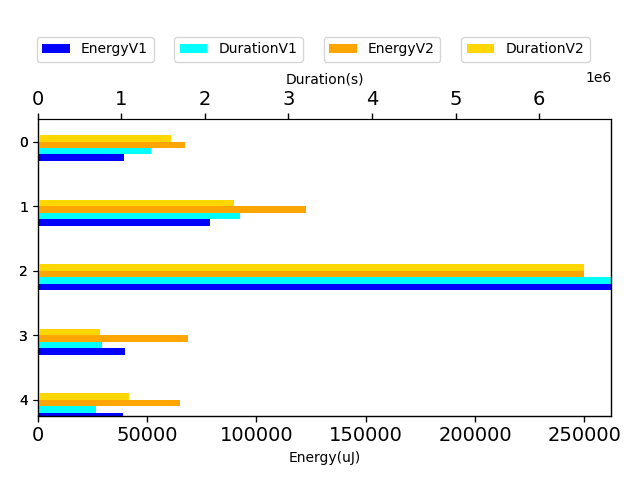

## com.google.gson.functional.NamingPolicyTest

| Test | IterationV1 | IterationV2 | DeltaIteration |
| --- | --- | --- | --- |
| com.google.gson.functional.NamingPolicyTest-testAtSignInSerializedName | 41 | 38 | -3 |
| com.google.gson.functional.NamingPolicyTest-testGsonDuplicateNameUsingSerializedNameFieldNamingPolicySerialization | 70 | 74 | 4 |
| com.google.gson.functional.NamingPolicyTest-testGsonWithSerializedNameFieldNamingPolicyDeserialization | 16 | 24 | 8 |
| com.google.gson.functional.NamingPolicyTest-testGsonWithSerializedNameFieldNamingPolicySerialization | 61 | 49 | -12 |
| com.google.gson.functional.NamingPolicyTest-testComplexFieldNameStrategy | 63 | 61 | -2 |
| com.google.gson.functional.NamingPolicyTest-testDeprecatedNamingStrategy | 53 | 57 | 4 |
| com.google.gson.functional.NamingPolicyTest-testGsonWithLowerCaseDashPolicySerialization | 26 | 20 | -6 |
| com.google.gson.functional.NamingPolicyTest-testGsonWithLowerCaseUnderscorePolicyDeserialiation | 29 | 21 | -8 |
| com.google.gson.functional.NamingPolicyTest-testGsonWithNonDefaultFieldNamingPolicySerialization | 37 | 29 | -8 |
| com.google.gson.functional.NamingPolicyTest-testGsonWithUpperCamelCaseSpacesPolicyDeserialiation | 27 | 18 | -9 |
| com.google.gson.functional.NamingPolicyTest-testGsonWithNonDefaultFieldNamingPolicyDeserialiation | 31 | 19 | -12 |
| com.google.gson.functional.NamingPolicyTest-testGsonWithUpperCamelCaseSpacesPolicySerialiation | 23 | 19 | -4 |
| com.google.gson.functional.NamingPolicyTest-testGsonWithLowerCaseUnderscorePolicySerialization | 24 | 31 | 7 |
| com.google.gson.functional.NamingPolicyTest-testGsonWithLowerCaseDashPolicyDeserialiation | 19 | 26 | 7 |

| Test | EnergyV1 | EnergyV2 | DeltaEnergy |
| --- | --- | --- | --- |
| com.google.gson.functional.NamingPolicyTest-testAtSignInSerializedName | 41278.661018144565 | 39984.926719849354 | -1293.7342982952105 |
| com.google.gson.functional.NamingPolicyTest-testGsonDuplicateNameUsingSerializedNameFieldNamingPolicySerialization | 193165.31756975234 | 44926.41362059036 | -148238.903949162 |
| com.google.gson.functional.NamingPolicyTest-testGsonWithSerializedNameFieldNamingPolicyDeserialization | 39937.34663391113 | 43298.27465069294 | 3360.928016781807 |
| com.google.gson.functional.NamingPolicyTest-testGsonWithSerializedNameFieldNamingPolicySerialization | 41356.8435987109 | 44439.509251405194 | 3082.665652694297 |
| com.google.gson.functional.NamingPolicyTest-testComplexFieldNameStrategy | 40138.934637613514 | 40170.490490703276 | 31.555853089761513 |
| com.google.gson.functional.NamingPolicyTest-testDeprecatedNamingStrategy | 41308.34692990765 | 43400.83901501012 | 2092.4920851024654 |
| com.google.gson.functional.NamingPolicyTest-testGsonWithLowerCaseDashPolicySerialization | 41279.25025092065 | 41693.19846057892 | 413.9482096582651 |
| com.google.gson.functional.NamingPolicyTest-testGsonWithLowerCaseUnderscorePolicyDeserialiation | 38876.32345020026 | 44008.08246040344 | 5131.759010203183 |
| com.google.gson.functional.NamingPolicyTest-testGsonWithNonDefaultFieldNamingPolicySerialization | 41534.144494444845 | 44063.717993713915 | 2529.5734992690705 |
| com.google.gson.functional.NamingPolicyTest-testGsonWithUpperCamelCaseSpacesPolicyDeserialiation | 45078.288605064154 | 43483.688331604004 | -1594.6002734601498 |
| com.google.gson.functional.NamingPolicyTest-testGsonWithNonDefaultFieldNamingPolicyDeserialiation | 135749.78137755487 | 130620.80862426758 | -5128.972753287293 |
| com.google.gson.functional.NamingPolicyTest-testGsonWithUpperCamelCaseSpacesPolicySerialiation | 37402.13752937317 | 42393.17292022705 | 4991.035390853882 |
| com.google.gson.functional.NamingPolicyTest-testGsonWithLowerCaseUnderscorePolicySerialization | 42740.48809015751 | 41126.715452237986 | -1613.7726379195228 |
| com.google.gson.functional.NamingPolicyTest-testGsonWithLowerCaseDashPolicyDeserialiation | 45865.29454803467 | 43510.94734531641 | -2354.347202718258 |

| Test | DurationV1 | DurationsV2 | DeltaDuration |
| --- | --- | --- | --- |
| com.google.gson.functional.NamingPolicyTest-testAtSignInSerializedName | 721383.2073634659 | 562858.4367256743 | -158524.7706377916 |
| com.google.gson.functional.NamingPolicyTest-testGsonDuplicateNameUsingSerializedNameFieldNamingPolicySerialization | 5103074.627944448 | 974866.9676964812 | -4128207.6602479666 |
| com.google.gson.functional.NamingPolicyTest-testGsonWithSerializedNameFieldNamingPolicyDeserialization | 588257.412902832 | 448379.9738957882 | -139877.43900704384 |
| com.google.gson.functional.NamingPolicyTest-testGsonWithSerializedNameFieldNamingPolicySerialization | 774295.0009769658 | 865294.12152378 | 90999.12054681429 |
| com.google.gson.functional.NamingPolicyTest-testComplexFieldNameStrategy | 969706.0433545674 | 911873.5574802875 | -57832.48587427987 |
| com.google.gson.functional.NamingPolicyTest-testDeprecatedNamingStrategy | 717765.3523482545 | 629511.5511807839 | -88253.80116747064 |
| com.google.gson.functional.NamingPolicyTest-testGsonWithLowerCaseDashPolicySerialization | 486636.3535593003 | 435068.54158210754 | -51567.81197719276 |
| com.google.gson.functional.NamingPolicyTest-testGsonWithLowerCaseUnderscorePolicyDeserialiation | 651574.2182419039 | 591988.2432785034 | -59585.97496340051 |
| com.google.gson.functional.NamingPolicyTest-testGsonWithNonDefaultFieldNamingPolicySerialization | 522576.4944563138 | 630798.7559330147 | 108222.26147670089 |
| com.google.gson.functional.NamingPolicyTest-testGsonWithUpperCamelCaseSpacesPolicyDeserialiation | 468534.0758242905 | 404047.15379333496 | -64486.92203095555 |
| com.google.gson.functional.NamingPolicyTest-testGsonWithNonDefaultFieldNamingPolicyDeserialiation | 3783693.580058922 | 2984064.136724472 | -799629.44333445 |
| com.google.gson.functional.NamingPolicyTest-testGsonWithUpperCamelCaseSpacesPolicySerialiation | 548614.7811932564 | 445418.27728271484 | -103196.50391054153 |
| com.google.gson.functional.NamingPolicyTest-testGsonWithLowerCaseUnderscorePolicySerialization | 482189.7168251276 | 423039.4905403871 | -59150.22628474049 |
| com.google.gson.functional.NamingPolicyTest-testGsonWithLowerCaseDashPolicyDeserialiation | 541319.6961936951 | 529776.7335492522 | -11542.962644442916 |

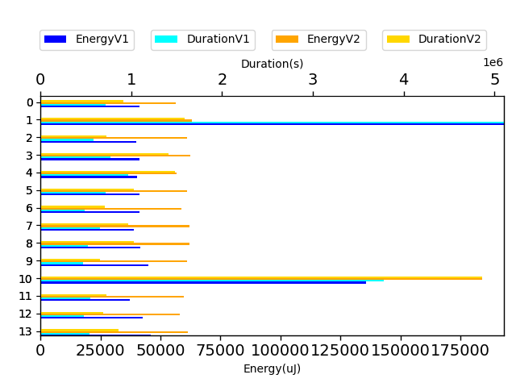

## com.google.gson.functional.CircularReferenceTest

| Test | IterationV1 | IterationV2 | DeltaIteration |
| --- | --- | --- | --- |
| com.google.gson.functional.CircularReferenceTest-testCircularSerialization | 99 | 99 | 0 |
| com.google.gson.functional.CircularReferenceTest-testSelfReferenceArrayFieldSerialization | 99 | 99 | 0 |
| com.google.gson.functional.CircularReferenceTest-testSelfReferenceCustomHandlerSerialization | 99 | 99 | 0 |
| com.google.gson.functional.CircularReferenceTest-testSelfReferenceIgnoredInSerialization | 26 | 24 | -2 |
| com.google.gson.functional.CircularReferenceTest-testDirectedAcyclicGraphDeserialization | 36 | 23 | -13 |
| com.google.gson.functional.CircularReferenceTest-testDirectedAcyclicGraphSerialization | 22 | 28 | 6 |

| Test | EnergyV1 | EnergyV2 | DeltaEnergy |
| --- | --- | --- | --- |
| com.google.gson.functional.CircularReferenceTest-testCircularSerialization | 218548.56023651612 | 207022.83321846227 | -11525.727018053847 |
| com.google.gson.functional.CircularReferenceTest-testSelfReferenceArrayFieldSerialization | 179007.86236888764 | 166348.68585713935 | -12659.176511748286 |
| com.google.gson.functional.CircularReferenceTest-testSelfReferenceCustomHandlerSerialization | 213516.28091238957 | 193393.32115629697 | -20122.959756092605 |
| com.google.gson.functional.CircularReferenceTest-testSelfReferenceIgnoredInSerialization | 41779.007542967796 | 40270.25214123726 | -1508.7554017305374 |
| com.google.gson.functional.CircularReferenceTest-testDirectedAcyclicGraphDeserialization | 36493.28519169602 | 44260.13606953621 | 7766.850877840188 |
| com.google.gson.functional.CircularReferenceTest-testDirectedAcyclicGraphSerialization | 40265.17381620407 | 43330.03376570344 | 3064.8599494993687 |

| Test | DurationV1 | DurationsV2 | DeltaDuration |
| --- | --- | --- | --- |
| com.google.gson.functional.CircularReferenceTest-testCircularSerialization | 5332102.59449331 | 5217948.130632058 | -114154.46386125218 |
| com.google.gson.functional.CircularReferenceTest-testSelfReferenceArrayFieldSerialization | 4415236.5960770575 | 4835930.294523492 | 420693.6984464349 |
| com.google.gson.functional.CircularReferenceTest-testSelfReferenceCustomHandlerSerialization | 5302131.998551635 | 5078640.109407766 | -223491.88914386928 |
| com.google.gson.functional.CircularReferenceTest-testSelfReferenceIgnoredInSerialization | 596146.6888395846 | 449869.2050077915 | -146277.48383179307 |
| com.google.gson.functional.CircularReferenceTest-testDirectedAcyclicGraphDeserialization | 381375.6908365957 | 403304.475076437 | 21928.784239841276 |
| com.google.gson.functional.CircularReferenceTest-testDirectedAcyclicGraphSerialization | 439900.868142128 | 479727.41755494475 | 39826.54941281676 |

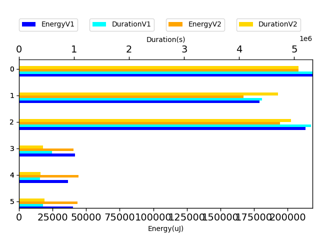

## com.google.gson.functional.PrettyPrintingTest

| Test | IterationV1 | IterationV2 | DeltaIteration |
| --- | --- | --- | --- |
| com.google.gson.functional.PrettyPrintingTest-testEmptyMapField | 50 | 57 | 7 |
| com.google.gson.functional.PrettyPrintingTest-testMap | 21 | 26 | 5 |
| com.google.gson.functional.PrettyPrintingTest-testPrettyPrintList | 75 | 77 | 2 |
| com.google.gson.functional.PrettyPrintingTest-testPrettyPrintArrayOfPrimitiveArrays | 24 | 24 | 0 |
| com.google.gson.functional.PrettyPrintingTest-testPrettyPrintArrayOfPrimitives | 18 | 13 | -5 |
| com.google.gson.functional.PrettyPrintingTest-testPrettyPrintArrayOfObjects | 39 | 44 | 5 |
| com.google.gson.functional.PrettyPrintingTest-testPrettyPrintListOfPrimitiveArrays | 27 | 35 | 8 |
| com.google.gson.functional.PrettyPrintingTest-testMultipleArrays | 24 | 18 | -6 |

| Test | EnergyV1 | EnergyV2 | DeltaEnergy |
| --- | --- | --- | --- |
| com.google.gson.functional.PrettyPrintingTest-testEmptyMapField | 43334.90351630451 | 43929.150673890275 | 594.2471575857635 |
| com.google.gson.functional.PrettyPrintingTest-testMap | 44479.58604192734 | 43113.34459230304 | -1366.2414496243 |
| com.google.gson.functional.PrettyPrintingTest-testPrettyPrintList | 43942.072213257125 | 42855.182085391425 | -1086.8901278656995 |
| com.google.gson.functional.PrettyPrintingTest-testPrettyPrintArrayOfPrimitiveArrays | 43237.01503944397 | 41293.074292480946 | -1943.9407469630241 |
| com.google.gson.functional.PrettyPrintingTest-testPrettyPrintArrayOfPrimitives | 43926.084243774414 | 42802.390380859375 | -1123.693862915039 |
| com.google.gson.functional.PrettyPrintingTest-testPrettyPrintArrayOfObjects | 42236.910026322614 | 49252.97185721234 | 7016.061830889725 |
| com.google.gson.functional.PrettyPrintingTest-testPrettyPrintListOfPrimitiveArrays | 41085.152721211314 | 47647.94730732427 | 6562.794586112956 |
| com.google.gson.functional.PrettyPrintingTest-testMultipleArrays | 42603.55904507637 | 41942.8098449707 | -660.7492001056671 |

| Test | DurationV1 | DurationsV2 | DeltaDuration |
| --- | --- | --- | --- |
| com.google.gson.functional.PrettyPrintingTest-testEmptyMapField | 864028.433447515 | 824751.5221126905 | -39276.911334824516 |
| com.google.gson.functional.PrettyPrintingTest-testMap | 451207.06106185913 | 454185.67476812005 | 2978.6137062609196 |
| com.google.gson.functional.PrettyPrintingTest-testPrettyPrintList | 988405.2551167976 | 1427876.84749764 | 439471.5923808423 |
| com.google.gson.functional.PrettyPrintingTest-testPrettyPrintArrayOfPrimitiveArrays | 338259.20553040504 | 364995.9711011052 | 26736.76557070017 |
| com.google.gson.functional.PrettyPrintingTest-testPrettyPrintArrayOfPrimitives | 271492.04053497314 | 379978.154296875 | 108486.11376190186 |
| com.google.gson.functional.PrettyPrintingTest-testPrettyPrintArrayOfObjects | 599477.192548622 | 682997.8350657299 | 83520.64251710789 |
| com.google.gson.functional.PrettyPrintingTest-testPrettyPrintListOfPrimitiveArrays | 466396.0833171904 | 680203.7945785939 | 213807.7112614035 |
| com.google.gson.functional.PrettyPrintingTest-testMultipleArrays | 411957.37844765186 | 479534.74156951904 | 67577.36312186718 |

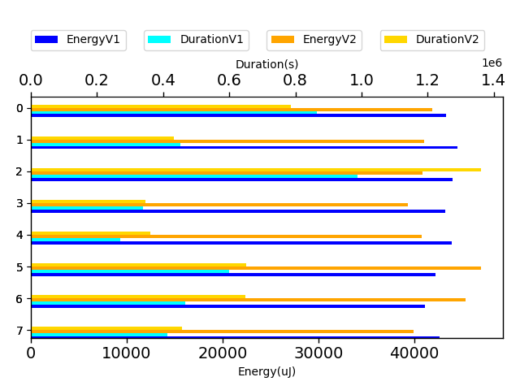

## com.google.gson.functional.MapTest

| Test | IterationV1 | IterationV2 | DeltaIteration |
| --- | --- | --- | --- |
| com.google.gson.functional.MapTest-testInterfaceTypeMapWithSerializer | 86 | 81 | -5 |
| com.google.gson.functional.MapTest-testConcurrentSkipListMap | 56 | 55 | -1 |
| com.google.gson.functional.MapTest-testComplexKeysSerialization | 54 | 57 | 3 |
| com.google.gson.functional.MapTest-testMapDeserializationWithIntegerKeys | 41 | 46 | 5 |
| com.google.gson.functional.MapTest-testMapSerializationEmpty | 35 | 42 | 7 |
| com.google.gson.functional.MapTest-testMapStandardSubclassDeserialization | 48 | 47 | -1 |
| com.google.gson.functional.MapTest-testMapDeserializationWithUnquotedIntegerKeys | 42 | 32 | -10 |
| com.google.gson.functional.MapTest-testReadMapsWithEmptyStringKey | 46 | 45 | -1 |
| com.google.gson.functional.MapTest-testCustomSerializerForSpecificMapType | 51 | 52 | 1 |
| com.google.gson.functional.MapTest-testSortedMap | 71 | 74 | 3 |
| com.google.gson.functional.MapTest-testMapSerializationWithWildcardValues | 60 | 56 | -4 |
| com.google.gson.functional.MapTest-testDeerializeMapOfMaps | 42 | 45 | 3 |
| com.google.gson.functional.MapTest-testMapDeserialization | 50 | 41 | -9 |
| com.google.gson.functional.MapTest-testParameterizedMapSubclassSerialization | 99 | 99 | 0 |
| com.google.gson.functional.MapTest-testConcurrentHashMap | 41 | 46 | 5 |
| com.google.gson.functional.MapTest-testMapOfMapSerialization | 19 | 22 | 3 |
| com.google.gson.functional.MapTest-testBooleanKeyDeserialization | 41 | 32 | -9 |
| com.google.gson.functional.MapTest-testComplexKeysDeserialization | 62 | 54 | -8 |
| com.google.gson.functional.MapTest-testConcurrentMap | 82 | 72 | -10 |
| com.google.gson.functional.MapTest-testConcurrentNavigableMap | 99 | 99 | 0 |
| com.google.gson.functional.MapTest-testMapSerializationWithNullKey | 42 | 45 | 3 |
| com.google.gson.functional.MapTest-testMapSerializationWithNullValue | 42 | 41 | -1 |
| com.google.gson.functional.MapTest-testSerializeMaps | 57 | 57 | 0 |
| com.google.gson.functional.MapTest-testMapSerializationWithNullValues | 46 | 52 | 6 |
| com.google.gson.functional.MapTest-testMapOfMapDeserialization | 52 | 51 | -1 |
| com.google.gson.functional.MapTest-testMapSerializationWithNullValuesSerialized | 23 | 21 | -2 |
| com.google.gson.functional.MapTest-testMapSerializationWithIntegerKeys | 44 | 45 | 1 |
| com.google.gson.functional.MapTest-testGeneralMapField | 43 | 51 | 8 |
| com.google.gson.functional.MapTest-testMapSerializationWithNullValueButSerializeNulls | 40 | 41 | 1 |
| com.google.gson.functional.MapTest-testInterfaceTypeMap | 79 | 78 | -1 |
| com.google.gson.functional.MapTest-testMapDeserializationWithNullValue | 37 | 34 | -3 |
| com.google.gson.functional.MapTest-testMapDeserializationWithLongKeys | 65 | 61 | -4 |
| com.google.gson.functional.MapTest-testNumberKeyDeserialization | 41 | 49 | 8 |
| com.google.gson.functional.MapTest-testMapDeserializationWithNullKey | 37 | 39 | 2 |
| com.google.gson.functional.MapTest-testMapDeserializationWithUnquotedLongKeys | 48 | 50 | 2 |
| com.google.gson.functional.MapTest-testMapSubclassDeserialization | 41 | 48 | 7 |
| com.google.gson.functional.MapTest-testMapNamePromotionWithJsonElementReader | 61 | 66 | 5 |
| com.google.gson.functional.MapTest-testHashMapDeserialization | 42 | 39 | -3 |
| com.google.gson.functional.MapTest-testMapDeserializationWithDuplicateKeys | 44 | 40 | -4 |
| com.google.gson.functional.MapTest-testStringKeyDeserialization | 45 | 39 | -6 |
| com.google.gson.functional.MapTest-testSerializeMapOfMaps | 47 | 33 | -14 |
| com.google.gson.functional.MapTest-testMapSerialization | 53 | 46 | -7 |
| com.google.gson.functional.MapTest-testMapSubclassSerialization | 24 | 16 | -8 |
| com.google.gson.functional.MapTest-testMapDeserializationWithWildcardValues | 46 | 51 | 5 |
| com.google.gson.functional.MapTest-testMapDeserializationEmpty | 40 | 39 | -1 |
| com.google.gson.functional.MapTest-testRawMapSerialization | 19 | 19 | 0 |
| com.google.gson.functional.MapTest-testMapWithQuotes | 14 | 17 | 3 |
| com.google.gson.functional.MapTest-testWriteMapsWithEmptyStringKey | 8 | 11 | 3 |

| Test | EnergyV1 | EnergyV2 | DeltaEnergy |
| --- | --- | --- | --- |
| com.google.gson.functional.MapTest-testInterfaceTypeMapWithSerializer | 42119.135518616524 | 48606.18568478343 | 6487.050166166904 |
| com.google.gson.functional.MapTest-testConcurrentSkipListMap | 43888.51264077197 | 41980.154371781435 | -1908.358268990538 |
| com.google.gson.functional.MapTest-testComplexKeysSerialization | 50940.02282868568 | 51727.547424718665 | 787.5245960329848 |
| com.google.gson.functional.MapTest-testMapDeserializationWithIntegerKeys | 42466.76633460173 | 43905.4921836313 | 1438.7258490295717 |
| com.google.gson.functional.MapTest-testMapSerializationEmpty | 41274.70001068624 | 42820.87883797275 | 1546.1788272865087 |
| com.google.gson.functional.MapTest-testMapStandardSubclassDeserialization | 45431.86328354591 | 41041.14409481421 | -4390.719188731695 |
| com.google.gson.functional.MapTest-testMapDeserializationWithUnquotedIntegerKeys | 42738.59048334954 | 41172.14936249005 | -1566.4411208594902 |
| com.google.gson.functional.MapTest-testReadMapsWithEmptyStringKey | 43511.08918250847 | 41943.34507606149 | -1567.7441064469822 |
| com.google.gson.functional.MapTest-testCustomSerializerForSpecificMapType | 44145.66927539838 | 48810.9860001732 | 4665.316724774821 |
| com.google.gson.functional.MapTest-testSortedMap | 74380.027268286 | 48240.59233867044 | -26139.434929615556 |
| com.google.gson.functional.MapTest-testMapSerializationWithWildcardValues | 43910.494229212316 | 55686.86724148562 | 11776.373012273303 |
| com.google.gson.functional.MapTest-testDeerializeMapOfMaps | 41645.11125981201 | 41063.33440948496 | -581.776850327049 |
| com.google.gson.functional.MapTest-testMapDeserialization | 44222.370982685956 | 43329.6118223499 | -892.7591603360561 |
| com.google.gson.functional.MapTest-testParameterizedMapSubclassSerialization | 41571.73322003639 | 46060.59162512337 | 4488.858405086983 |
| com.google.gson.functional.MapTest-testConcurrentHashMap | 43912.87587678511 | 42631.86770848904 | -1281.0081682960736 |
| com.google.gson.functional.MapTest-testMapOfMapSerialization | 42545.188776016235 | 45104.61610651016 | 2559.427330493927 |
| com.google.gson.functional.MapTest-testBooleanKeyDeserialization | 39211.00277221556 | 41168.10587845906 | 1957.1031062434995 |
| com.google.gson.functional.MapTest-testComplexKeysDeserialization | 51417.7004068399 | 71922.91836184023 | 20505.217955000335 |
| com.google.gson.functional.MapTest-testConcurrentMap | 47822.48643068552 | 64141.926734211185 | 16319.440303525662 |
| com.google.gson.functional.MapTest-testConcurrentNavigableMap | 129114.67822303576 | 131357.77365652012 | 2243.0954334843555 |
| com.google.gson.functional.MapTest-testMapSerializationWithNullKey | 42400.465575091745 | 40974.28495316977 | -1426.1806219219725 |
| com.google.gson.functional.MapTest-testMapSerializationWithNullValue | 43496.50631109426 | 44132.94965661589 | 636.4433455216349 |
| com.google.gson.functional.MapTest-testSerializeMaps | 38717.45394084658 | 54727.13876453915 | 16009.684823692573 |
| com.google.gson.functional.MapTest-testMapSerializationWithNullValues | 43851.572772401036 | 40195.31734158228 | -3656.2554308187537 |
| com.google.gson.functional.MapTest-testMapOfMapDeserialization | 38672.55626077934 | 43668.121900778366 | 4995.565639999026 |
| com.google.gson.functional.MapTest-testMapSerializationWithNullValuesSerialized | 41800.10131764412 | 43818.05074310303 | 2017.949425458908 |
| com.google.gson.functional.MapTest-testMapSerializationWithIntegerKeys | 43194.98009489051 | 44381.180977213575 | 1186.2008823230644 |
| com.google.gson.functional.MapTest-testGeneralMapField | 38049.7765059162 | 41262.23623254425 | 3212.4597266280543 |
| com.google.gson.functional.MapTest-testMapSerializationWithNullValueButSerializeNulls | 43647.66374042678 | 44456.37899754729 | 808.7152571205079 |
| com.google.gson.functional.MapTest-testInterfaceTypeMap | 87595.58543745137 | 60050.10525624593 | -27545.480181205443 |
| com.google.gson.functional.MapTest-testMapDeserializationWithNullValue | 41877.28380916391 | 40117.12932286586 | -1760.1544862980518 |
| com.google.gson.functional.MapTest-testMapDeserializationWithLongKeys | 40194.90676714275 | 43454.905432870735 | 3259.998665727988 |
| com.google.gson.functional.MapTest-testNumberKeyDeserialization | 40848.79840121206 | 43694.14571958287 | 2845.347318370812 |
| com.google.gson.functional.MapTest-testMapDeserializationWithNullKey | 43554.80968237719 | 39889.784304124434 | -3665.025378252758 |
| com.google.gson.functional.MapTest-testMapDeserializationWithUnquotedLongKeys | 45252.714354292024 | 42541.308887250634 | -2711.40546704139 |
| com.google.gson.functional.MapTest-testMapSubclassDeserialization | 38596.0108010688 | 42036.45395862378 | 3440.4431575549825 |
| com.google.gson.functional.MapTest-testMapNamePromotionWithJsonElementReader | 42396.75349675296 | 46680.57322307739 | 4283.819726324429 |
| com.google.gson.functional.MapTest-testHashMapDeserialization | 44812.789901148106 | 42332.90312867319 | -2479.8867724749143 |
| com.google.gson.functional.MapTest-testMapDeserializationWithDuplicateKeys | 40735.85615606409 | 37711.40169721522 | -3024.4544588488716 |
| com.google.gson.functional.MapTest-testStringKeyDeserialization | 39722.541341691845 | 41145.1926818646 | 1422.651340172757 |
| com.google.gson.functional.MapTest-testSerializeMapOfMaps | 42111.73222751339 | 41421.276266811416 | -690.4559607019764 |
| com.google.gson.functional.MapTest-testMapSerialization | 42344.55875121387 | 43938.531073868275 | 1593.972322654401 |
| com.google.gson.functional.MapTest-testMapSubclassSerialization | 43021.63001310825 | 44479.95227050781 | 1458.322257399559 |
| com.google.gson.functional.MapTest-testMapDeserializationWithWildcardValues | 37615.23567159927 | 42042.36919442016 | 4427.1335228208845 |
| com.google.gson.functional.MapTest-testMapDeserializationEmpty | 42771.45383992404 | 38566.031165276 | -4205.422674648042 |
| com.google.gson.functional.MapTest-testRawMapSerialization | 44525.08213806152 | 43279.78749084473 | -1245.2946472167969 |
| com.google.gson.functional.MapTest-testMapWithQuotes | 44764.08801269531 | 42660.617248535156 | -2103.4707641601562 |
| com.google.gson.functional.MapTest-testWriteMapsWithEmptyStringKey | 39175.421875 | 41482.775390625 | 2307.353515625 |

| Test | DurationV1 | DurationsV2 | DeltaDuration |
| --- | --- | --- | --- |
| com.google.gson.functional.MapTest-testInterfaceTypeMapWithSerializer | 1091123.8981020907 | 1242072.6288491865 | 150948.73074709577 |
| com.google.gson.functional.MapTest-testConcurrentSkipListMap | 919480.7988811034 | 669483.7548574158 | -249997.0440236876 |
| com.google.gson.functional.MapTest-testComplexKeysSerialization | 917801.0010780029 | 1272468.5286410241 | 354667.5275630213 |
| com.google.gson.functional.MapTest-testMapDeserializationWithIntegerKeys | 540737.2044662721 | 650498.6851643587 | 109761.48069808655 |
| com.google.gson.functional.MapTest-testMapSerializationEmpty | 666418.8879267126 | 600309.5034590412 | -66109.38446767139 |
| com.google.gson.functional.MapTest-testMapStandardSubclassDeserialization | 582006.5014123553 | 637172.8312798026 | 55166.32986744726 |
| com.google.gson.functional.MapTest-testMapDeserializationWithUnquotedIntegerKeys | 579573.9094175156 | 588298.9278242132 | 8725.018406697549 |
| com.google.gson.functional.MapTest-testReadMapsWithEmptyStringKey | 584139.0741023446 | 744755.4128307295 | 160616.33872838493 |
| com.google.gson.functional.MapTest-testCustomSerializerForSpecificMapType | 1395643.4946144642 | 747689.1033815467 | -647954.3912329176 |
| com.google.gson.functional.MapTest-testSortedMap | 1507949.0545559272 | 980646.1631680627 | -527302.8913878645 |
| com.google.gson.functional.MapTest-testMapSerializationWithWildcardValues | 1322922.2778387787 | 1202043.1304273533 | -120879.14741142537 |
| com.google.gson.functional.MapTest-testDeerializeMapOfMaps | 548563.7378857415 | 580221.5541847027 | 31657.816298961174 |
| com.google.gson.functional.MapTest-testMapDeserialization | 825637.8072281093 | 626017.7843792079 | -199620.02284890146 |
| com.google.gson.functional.MapTest-testParameterizedMapSubclassSerialization | 1414063.6431506134 | 1360416.2726857557 | -53647.37046485767 |
| com.google.gson.functional.MapTest-testConcurrentHashMap | 798742.1973148953 | 605275.9182736194 | -193466.27904127596 |
| com.google.gson.functional.MapTest-testMapOfMapSerialization | 382325.1298942566 | 328591.9973897934 | -53733.132504463196 |
| com.google.gson.functional.MapTest-testBooleanKeyDeserialization | 629311.677312733 | 818079.9925602919 | 188768.31524755887 |
| com.google.gson.functional.MapTest-testComplexKeysDeserialization | 1059689.879553413 | 1570707.4687171662 | 511017.5891637532 |
| com.google.gson.functional.MapTest-testConcurrentMap | 948720.9794122372 | 1189894.536085947 | 241173.55667370977 |
| com.google.gson.functional.MapTest-testConcurrentNavigableMap | 3248857.23811659 | 3169981.3396286704 | -78875.89848791948 |
| com.google.gson.functional.MapTest-testMapSerializationWithNullKey | 667956.4074875296 | 673108.4267850214 | 5152.0192974918755 |
| com.google.gson.functional.MapTest-testMapSerializationWithNullValue | 573428.941071617 | 597827.6416652647 | 24398.70059364778 |
| com.google.gson.functional.MapTest-testSerializeMaps | 840169.2855374773 | 966900.2027472578 | 126730.91720978043 |
| com.google.gson.functional.MapTest-testMapSerializationWithNullValues | 681400.5297831842 | 634934.0974824041 | -46466.432300780085 |
| com.google.gson.functional.MapTest-testMapOfMapDeserialization | 629805.7033352845 | 666225.2066189668 | 36419.50328368228 |
| com.google.gson.functional.MapTest-testMapSerializationWithNullValuesSerialized | 366221.3651342392 | 421631.0409927368 | 55409.67585849762 |
| com.google.gson.functional.MapTest-testMapSerializationWithIntegerKeys | 779924.7559976305 | 779821.2695084653 | -103.48648916522507 |
| com.google.gson.functional.MapTest-testGeneralMapField | 728930.8749104528 | 810447.7275423297 | 81516.85263187694 |
| com.google.gson.functional.MapTest-testMapSerializationWithNullValueButSerializeNulls | 715123.2343219114 | 643990.2783903616 | -71132.95593154978 |
| com.google.gson.functional.MapTest-testInterfaceTypeMap | 2145686.609247709 | 1431808.8522976001 | -713877.756950109 |
| com.google.gson.functional.MapTest-testMapDeserializationWithNullValue | 506429.6759881757 | 642145.695483842 | 135716.01949566638 |
| com.google.gson.functional.MapTest-testMapDeserializationWithLongKeys | 808624.5744450062 | 1242736.4167094766 | 434111.8422644704 |
| com.google.gson.functional.MapTest-testNumberKeyDeserialization | 618918.0155618391 | 637103.6298653407 | 18185.614303501556 |
| com.google.gson.functional.MapTest-testMapDeserializationWithNullKey | 709123.7496779975 | 587498.2028729063 | -121625.5468050912 |
| com.google.gson.functional.MapTest-testMapDeserializationWithUnquotedLongKeys | 643489.2317845651 | 780853.6864724881 | 137364.45468792296 |
| com.google.gson.functional.MapTest-testMapSubclassDeserialization | 870185.5937135177 | 804905.8587407363 | -65279.734972781385 |
| com.google.gson.functional.MapTest-testMapNamePromotionWithJsonElementReader | 1255970.250876641 | 750212.907537576 | -505757.34333906486 |
| com.google.gson.functional.MapTest-testHashMapDeserialization | 731648.3448979347 | 711230.8150389923 | -20417.529858942376 |
| com.google.gson.functional.MapTest-testMapDeserializationWithDuplicateKeys | 661074.1397586418 | 577348.0265147386 | -83726.11324390327 |
| com.google.gson.functional.MapTest-testStringKeyDeserialization | 568259.3502024447 | 561785.5280858828 | -6473.8221165619325 |
| com.google.gson.functional.MapTest-testSerializeMapOfMaps | 657502.3215947712 | 560322.0371823485 | -97180.28441242268 |
| com.google.gson.functional.MapTest-testMapSerialization | 729090.28739256 | 785256.343271067 | 56166.05587850697 |
| com.google.gson.functional.MapTest-testMapSubclassSerialization | 393628.8640233278 | 567863.8226318359 | 174234.9586085081 |
| com.google.gson.functional.MapTest-testMapDeserializationWithWildcardValues | 594503.2084885731 | 641788.298362507 | 47285.08987393393 |
| com.google.gson.functional.MapTest-testMapDeserializationEmpty | 557186.1393077621 | 700419.8747418058 | 143233.7354340437 |
| com.google.gson.functional.MapTest-testRawMapSerialization | 523487.0380554199 | 655631.3737869263 | 132144.33573150635 |
| com.google.gson.functional.MapTest-testMapWithQuotes | 371864.4753417969 | 359625.9924316406 | -12238.48291015625 |
| com.google.gson.functional.MapTest-testWriteMapsWithEmptyStringKey | 309310.8359375 | 337904.33203125 | 28593.49609375 |

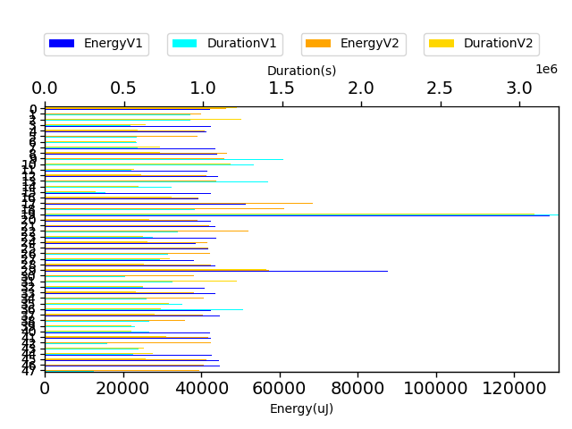

## com.google.gson.functional.ExposeFieldsTest

| Test | IterationV1 | IterationV2 | DeltaIteration |
| --- | --- | --- | --- |
| com.google.gson.functional.ExposeFieldsTest-testNullExposeFieldSerialization | 99 | 99 | 0 |
| com.google.gson.functional.ExposeFieldsTest-testNoExposedFieldDeserialization | 12 | 20 | 8 |
| com.google.gson.functional.ExposeFieldsTest-testArrayWithOneNullExposeFieldObjectSerialization | 29 | 31 | 2 |
| com.google.gson.functional.ExposeFieldsTest-testExposedInterfaceFieldSerialization | 69 | 70 | 1 |
| com.google.gson.functional.ExposeFieldsTest-testNoExposedFieldSerialization | 46 | 49 | 3 |
| com.google.gson.functional.ExposeFieldsTest-testExposeAnnotationDeserialization | 33 | 27 | -6 |
| com.google.gson.functional.ExposeFieldsTest-testExposeAnnotationSerialization | 34 | 22 | -12 |
| com.google.gson.functional.ExposeFieldsTest-testExposedInterfaceFieldDeserialization | 15 | 17 | 2 |

| Test | EnergyV1 | EnergyV2 | DeltaEnergy |
| --- | --- | --- | --- |
| com.google.gson.functional.ExposeFieldsTest-testNullExposeFieldSerialization | 97827.26417760365 | 96598.02194533256 | -1229.2422322710918 |
| com.google.gson.functional.ExposeFieldsTest-testNoExposedFieldDeserialization | 41451.24658203125 | 42892.588872909546 | 1441.342290878296 |
| com.google.gson.functional.ExposeFieldsTest-testArrayWithOneNullExposeFieldObjectSerialization | 44229.06134867109 | 43974.65161832562 | -254.40973034547642 |
| com.google.gson.functional.ExposeFieldsTest-testExposedInterfaceFieldSerialization | 44252.31510032548 | 43596.75929327445 | -655.5558070510306 |
| com.google.gson.functional.ExposeFieldsTest-testNoExposedFieldSerialization | 46049.77948456022 | 43535.67214230349 | -2514.107342256728 |
| com.google.gson.functional.ExposeFieldsTest-testExposeAnnotationDeserialization | 83710.31615861622 | 40482.00523991883 | -43228.31091869739 |
| com.google.gson.functional.ExposeFieldsTest-testExposeAnnotationSerialization | 41687.21443842782 | 44612.05287218094 | 2924.838433753117 |
| com.google.gson.functional.ExposeFieldsTest-testExposedInterfaceFieldDeserialization | 43667.08251953125 | 42945.605865478516 | -721.4766540527344 |

| Test | DurationV1 | DurationsV2 | DeltaDuration |
| --- | --- | --- | --- |
| com.google.gson.functional.ExposeFieldsTest-testNullExposeFieldSerialization | 2399605.6016015783 | 2758411.2322236435 | 358805.63062206516 |
| com.google.gson.functional.ExposeFieldsTest-testNoExposedFieldDeserialization | 387104.6579589844 | 385362.9876842499 | -1741.670274734497 |
| com.google.gson.functional.ExposeFieldsTest-testArrayWithOneNullExposeFieldObjectSerialization | 529887.616650397 | 813601.627832091 | 283714.011181694 |
| com.google.gson.functional.ExposeFieldsTest-testExposedInterfaceFieldSerialization | 966144.5339368503 | 913095.9233374202 | -53048.610599430045 |
| com.google.gson.functional.ExposeFieldsTest-testNoExposedFieldSerialization | 651261.0985507607 | 689631.8303959981 | 38370.73184523743 |
| com.google.gson.functional.ExposeFieldsTest-testExposeAnnotationDeserialization | 2191849.6220706566 | 502703.76124562323 | -1689145.8608250334 |
| com.google.gson.functional.ExposeFieldsTest-testExposeAnnotationSerialization | 393180.99868311116 | 455413.97138786316 | 62232.972704752 |
| com.google.gson.functional.ExposeFieldsTest-testExposedInterfaceFieldDeserialization | 557167.4914550781 | 468292.3282775879 | -88875.16317749023 |

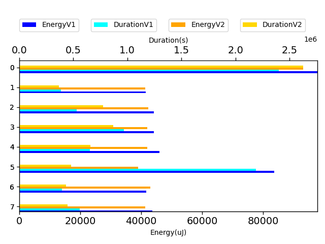

## com.google.gson.functional.InheritanceTest

| Test | IterationV1 | IterationV2 | DeltaIteration |
| --- | --- | --- | --- |
| com.google.gson.functional.InheritanceTest-testSubInterfacesOfCollectionSerialization | 99 | 99 | 0 |
| com.google.gson.functional.InheritanceTest-testClassWithBaseArrayFieldSerialization | 49 | 52 | 3 |
| com.google.gson.functional.InheritanceTest-testSubInterfacesOfCollectionDeserialization | 66 | 67 | 1 |
| com.google.gson.functional.InheritanceTest-testClassWithBaseCollectionFieldSerialization | 48 | 50 | 2 |
| com.google.gson.functional.InheritanceTest-testClassWithBaseFieldSerialization | 36 | 43 | 7 |
| com.google.gson.functional.InheritanceTest-testBaseSerializedAsSub | 22 | 16 | -6 |
| com.google.gson.functional.InheritanceTest-testSubClassSerialization | 70 | 70 | 0 |
| com.google.gson.functional.InheritanceTest-testSubClassDeserialization | 39 | 38 | -1 |
| com.google.gson.functional.InheritanceTest-testBaseSerializedAsBaseWhenSpecifiedWithExplicitTypeForToJsonMethod | 38 | 53 | 15 |
| com.google.gson.functional.InheritanceTest-testBaseSerializedAsSubWhenSpecifiedWithExplicitTypeForToJsonMethod | 14 | 16 | 2 |
| com.google.gson.functional.InheritanceTest-testBaseSerializedAsSubWhenSpecifiedWithExplicitType | 20 | 20 | 0 |
| com.google.gson.functional.InheritanceTest-testBaseSerializedAsSubForToJsonMethod | 14 | 13 | -1 |
| com.google.gson.functional.InheritanceTest-testBaseSerializedAsBaseWhenSpecifiedWithExplicitType | 19 | 25 | 6 |

| Test | EnergyV1 | EnergyV2 | DeltaEnergy |
| --- | --- | --- | --- |
| com.google.gson.functional.InheritanceTest-testSubInterfacesOfCollectionSerialization | 62100.16929398118 | 217509.4773747238 | 155409.3080807426 |
| com.google.gson.functional.InheritanceTest-testClassWithBaseArrayFieldSerialization | 38263.60206125798 | 45585.87673409941 | 7322.274672841428 |
| com.google.gson.functional.InheritanceTest-testSubInterfacesOfCollectionDeserialization | 39327.65433017687 | 78828.97095711004 | 39501.31662693317 |
| com.google.gson.functional.InheritanceTest-testClassWithBaseCollectionFieldSerialization | 36932.44099864738 | 48476.978401157015 | 11544.537402509639 |
| com.google.gson.functional.InheritanceTest-testClassWithBaseFieldSerialization | 37183.82655121568 | 91723.70892688769 | 54539.88237567201 |
| com.google.gson.functional.InheritanceTest-testBaseSerializedAsSub | 52050.3298869133 | 41421.641052246094 | -10628.688834667206 |
| com.google.gson.functional.InheritanceTest-testSubClassSerialization | 39071.50343785816 | 43804.44407902282 | 4732.940641164656 |
| com.google.gson.functional.InheritanceTest-testSubClassDeserialization | 41276.490924529484 | 116423.49850300064 | 75147.00757847115 |
| com.google.gson.functional.InheritanceTest-testBaseSerializedAsBaseWhenSpecifiedWithExplicitTypeForToJsonMethod | 52756.18361030667 | 103308.79916986843 | 50552.61555956177 |
| com.google.gson.functional.InheritanceTest-testBaseSerializedAsSubWhenSpecifiedWithExplicitTypeForToJsonMethod | 42943.66809082031 | 41803.29345703125 | -1140.3746337890625 |
| com.google.gson.functional.InheritanceTest-testBaseSerializedAsSubWhenSpecifiedWithExplicitType | 41842.249813079834 | 40491.74874687195 | -1350.5010662078857 |
| com.google.gson.functional.InheritanceTest-testBaseSerializedAsSubForToJsonMethod | 42174.320556640625 | 38731.18054199219 | -3443.1400146484375 |
| com.google.gson.functional.InheritanceTest-testBaseSerializedAsBaseWhenSpecifiedWithExplicitType | 41631.92555618286 | 45494.762496590614 | 3862.836940407753 |

| Test | DurationV1 | DurationsV2 | DeltaDuration |
| --- | --- | --- | --- |
| com.google.gson.functional.InheritanceTest-testSubInterfacesOfCollectionSerialization | 1786613.735872542 | 4992783.6727811275 | 3206169.9369085855 |
| com.google.gson.functional.InheritanceTest-testClassWithBaseArrayFieldSerialization | 463198.37603243423 | 872601.857101129 | 409403.4810686948 |
| com.google.gson.functional.InheritanceTest-testSubInterfacesOfCollectionDeserialization | 885409.057972911 | 1597962.9829621732 | 712553.9249892621 |
| com.google.gson.functional.InheritanceTest-testClassWithBaseCollectionFieldSerialization | 457549.5922685859 | 788928.0821594623 | 331378.48989087634 |
| com.google.gson.functional.InheritanceTest-testClassWithBaseFieldSerialization | 839228.5746476221 | 1842262.941047376 | 1003034.366399754 |
| com.google.gson.functional.InheritanceTest-testBaseSerializedAsSub | 1912659.4100670815 | 397257.85510253906 | -1515401.5549645424 |
| com.google.gson.functional.InheritanceTest-testSubClassSerialization | 659650.2130761344 | 1307702.3413577774 | 648052.1282816429 |
| com.google.gson.functional.InheritanceTest-testSubClassDeserialization | 591108.7287563718 | 2654663.833573373 | 2063555.1048170011 |
| com.google.gson.functional.InheritanceTest-testBaseSerializedAsBaseWhenSpecifiedWithExplicitTypeForToJsonMethod | 743483.0781478705 | 2652239.9592946046 | 1908756.881146734 |
| com.google.gson.functional.InheritanceTest-testBaseSerializedAsSubWhenSpecifiedWithExplicitTypeForToJsonMethod | 410298.8972167969 | 938430.7232666016 | 528131.8260498047 |
| com.google.gson.functional.InheritanceTest-testBaseSerializedAsSubWhenSpecifiedWithExplicitType | 437894.92486953735 | 394264.3497810364 | -43630.57508850098 |
| com.google.gson.functional.InheritanceTest-testBaseSerializedAsSubForToJsonMethod | 570130.1593017578 | 643412.4921875 | 73282.33288574219 |
| com.google.gson.functional.InheritanceTest-testBaseSerializedAsBaseWhenSpecifiedWithExplicitType | 372678.4357147217 | 417559.02462750673 | 44880.58891278505 |

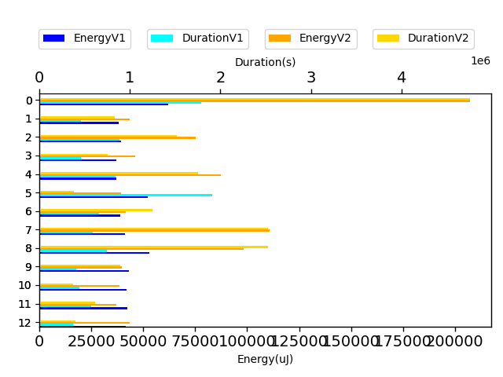

## com.google.gson.functional.MoreSpecificTypeSerializationTest

| Test | IterationV1 | IterationV2 | DeltaIteration |
| --- | --- | --- | --- |
| com.google.gson.functional.MoreSpecificTypeSerializationTest-testSubclassFields | 60 | 58 | -2 |
| com.google.gson.functional.MoreSpecificTypeSerializationTest-testParameterizedSubclassFields | 83 | 73 | -10 |
| com.google.gson.functional.MoreSpecificTypeSerializationTest-testMapOfParameterizedSubclassFields | 41 | 42 | 1 |
| com.google.gson.functional.MoreSpecificTypeSerializationTest-testListOfSubclassFields | 66 | 61 | -5 |
| com.google.gson.functional.MoreSpecificTypeSerializationTest-testMapOfSubclassFields | 57 | 61 | 4 |
| com.google.gson.functional.MoreSpecificTypeSerializationTest-testListOfParameterizedSubclassFields | 56 | 46 | -10 |

| Test | EnergyV1 | EnergyV2 | DeltaEnergy |
| --- | --- | --- | --- |
| com.google.gson.functional.MoreSpecificTypeSerializationTest-testSubclassFields | 42090.784670175104 | 43055.713334215354 | 964.9286640402497 |
| com.google.gson.functional.MoreSpecificTypeSerializationTest-testParameterizedSubclassFields | 42519.78379627644 | 43096.57197483265 | 576.7881785562131 |
| com.google.gson.functional.MoreSpecificTypeSerializationTest-testMapOfParameterizedSubclassFields | 41735.44138733343 | 41252.216702863036 | -483.22468447039137 |
| com.google.gson.functional.MoreSpecificTypeSerializationTest-testListOfSubclassFields | 57093.708404295045 | 45110.885510506036 | -11982.822893789009 |
| com.google.gson.functional.MoreSpecificTypeSerializationTest-testMapOfSubclassFields | 75009.30750803254 | 41391.52413723746 | -33617.78337079508 |
| com.google.gson.functional.MoreSpecificTypeSerializationTest-testListOfParameterizedSubclassFields | 42440.18172128241 | 44723.75353842155 | 2283.571817139142 |

| Test | DurationV1 | DurationsV2 | DeltaDuration |
| --- | --- | --- | --- |
| com.google.gson.functional.MoreSpecificTypeSerializationTest-testSubclassFields | 880215.1772921223 | 705769.049814574 | -174446.12747754832 |
| com.google.gson.functional.MoreSpecificTypeSerializationTest-testParameterizedSubclassFields | 1037517.2141074471 | 982637.1775531409 | -54880.03655430616 |
| com.google.gson.functional.MoreSpecificTypeSerializationTest-testMapOfParameterizedSubclassFields | 682712.4897713454 | 637496.7923545715 | -45215.69741677388 |
| com.google.gson.functional.MoreSpecificTypeSerializationTest-testListOfSubclassFields | 1194589.3181562198 | 863421.8618295353 | -331167.45632668445 |
| com.google.gson.functional.MoreSpecificTypeSerializationTest-testMapOfSubclassFields | 3132126.834123183 | 693442.2464956228 | -2438684.5876275604 |
| com.google.gson.functional.MoreSpecificTypeSerializationTest-testListOfParameterizedSubclassFields | 770380.2118696186 | 652976.9785060119 | -117403.23336360673 |

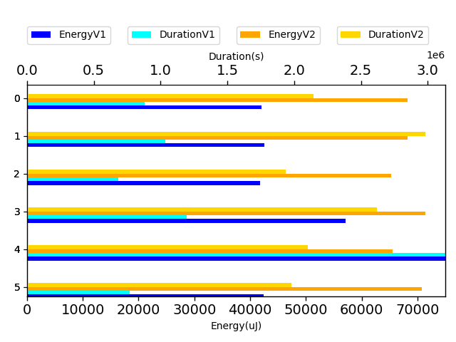

## com.google.gson.functional.DefaultTypeAdaptersTest

| Test | IterationV1 | IterationV2 | DeltaIteration |
| --- | --- | --- | --- |
| com.google.gson.functional.DefaultTypeAdaptersTest-testLocaleSerializationWithLanguage | 21 | 14 | -7 |
| com.google.gson.functional.DefaultTypeAdaptersTest-testDateSerializationWithPattern | 96 | 87 | -9 |
| com.google.gson.functional.DefaultTypeAdaptersTest-testBitSetDeserialization | 25 | 21 | -4 |
| com.google.gson.functional.DefaultTypeAdaptersTest-testUrlSerialization | 98 | 98 | 0 |
| com.google.gson.functional.DefaultTypeAdaptersTest-testDefaultGregorianCalendarDeserialization | 22 | 23 | 1 |
| com.google.gson.functional.DefaultTypeAdaptersTest-testSqlDateSerialization | 62 | 67 | 5 |
| com.google.gson.functional.DefaultTypeAdaptersTest-testClassSerialization | 50 | 59 | 9 |
| com.google.gson.functional.DefaultTypeAdaptersTest-testPropertiesDeserialization | 14 | 20 | 6 |
| com.google.gson.functional.DefaultTypeAdaptersTest-testTimestampSerialization | 62 | 68 | 6 |
| com.google.gson.functional.DefaultTypeAdaptersTest-testDefaultDateDeserializationUsingBuilder | 99 | 99 | 0 |
| com.google.gson.functional.DefaultTypeAdaptersTest-testUrlNullSerialization | 63 | 65 | 2 |
| com.google.gson.functional.DefaultTypeAdaptersTest-testNullSerialization | 99 | 99 | 0 |
| com.google.gson.functional.DefaultTypeAdaptersTest-testTreeSetSerialization | 28 | 35 | 7 |
| com.google.gson.functional.DefaultTypeAdaptersTest-testDefaultJavaSqlTimeDeserialization | 35 | 49 | 14 |
| com.google.gson.functional.DefaultTypeAdaptersTest-testDefaultJavaSqlTimeSerialization | 38 | 39 | 1 |
| com.google.gson.functional.DefaultTypeAdaptersTest-testDateSerializationInCollection | 97 | 96 | -1 |
| com.google.gson.functional.DefaultTypeAdaptersTest-testLocaleDeserializationWithLanguageCountry | 17 | 23 | 6 |
| com.google.gson.functional.DefaultTypeAdaptersTest-testTreeSetDeserialization | 50 | 55 | 5 |
| com.google.gson.functional.DefaultTypeAdaptersTest-testDateSerializationWithPatternNotOverridenByTypeAdapter | 73 | 83 | 10 |
| com.google.gson.functional.DefaultTypeAdaptersTest-testUrlDeserialization | 24 | 22 | -2 |
| com.google.gson.functional.DefaultTypeAdaptersTest-testUuidDeserialization | 11 | 14 | 3 |
| com.google.gson.functional.DefaultTypeAdaptersTest-testOverrideBigIntegerTypeAdapter | 62 | 57 | -5 |
| com.google.gson.functional.DefaultTypeAdaptersTest-testClassDeserialization | 28 | 19 | -9 |
| com.google.gson.functional.DefaultTypeAdaptersTest-testDateDeserializationWithPattern | 69 | 78 | 9 |
| com.google.gson.functional.DefaultTypeAdaptersTest-testBigIntegerFieldSerialization | 72 | 77 | 5 |
| com.google.gson.functional.DefaultTypeAdaptersTest-testDefaultGregorianCalendarSerialization | 16 | 17 | 1 |
| com.google.gson.functional.DefaultTypeAdaptersTest-testBigDecimalFieldSerialization | 71 | 62 | -9 |
| com.google.gson.functional.DefaultTypeAdaptersTest-testBadValueForBigDecimalDeserialization | 33 | 31 | -2 |
| com.google.gson.functional.DefaultTypeAdaptersTest-testStringBuilderSerialization | 19 | 17 | -2 |
| com.google.gson.functional.DefaultTypeAdaptersTest-testDefaultJavaSqlDateSerialization | 25 | 36 | 11 |
| com.google.gson.functional.DefaultTypeAdaptersTest-testBigDecimalFieldDeserialization | 34 | 30 | -4 |
| com.google.gson.functional.DefaultTypeAdaptersTest-testUriSerialization | 14 | 17 | 3 |
| com.google.gson.functional.DefaultTypeAdaptersTest-testDefaultCalendarSerialization | 22 | 22 | 0 |
| com.google.gson.functional.DefaultTypeAdaptersTest-testStringBufferDeserialization | 10 | 10 | 0 |
| com.google.gson.functional.DefaultTypeAdaptersTest-testUrlNullDeserialization | 27 | 11 | -16 |
| com.google.gson.functional.DefaultTypeAdaptersTest-testDefaultCalendarDeserialization | 41 | 25 | -16 |
| com.google.gson.functional.DefaultTypeAdaptersTest-testSetSerialization | 22 | 31 | 9 |
| com.google.gson.functional.DefaultTypeAdaptersTest-testStringBufferSerialization | 14 | 13 | -1 |
| com.google.gson.functional.DefaultTypeAdaptersTest-testBigIntegerFieldDeserialization | 27 | 34 | 7 |
| com.google.gson.functional.DefaultTypeAdaptersTest-testUuidSerialization | 23 | 24 | 1 |
| com.google.gson.functional.DefaultTypeAdaptersTest-testUriDeserialization | 14 | 21 | 7 |
| com.google.gson.functional.DefaultTypeAdaptersTest-testLocaleSerializationWithLanguageCountryVariant | 16 | 17 | 1 |
| com.google.gson.functional.DefaultTypeAdaptersTest-testLocaleSerializationWithLanguageCountry | 10 | 16 | 6 |
| com.google.gson.functional.DefaultTypeAdaptersTest-testOverrideBigDecimalTypeAdapter | 23 | 27 | 4 |
| com.google.gson.functional.DefaultTypeAdaptersTest-testDefaultJavaSqlDateDeserialization | 56 | 61 | 5 |
| com.google.gson.functional.DefaultTypeAdaptersTest-testPropertiesSerialization | 19 | 28 | 9 |
| com.google.gson.functional.DefaultTypeAdaptersTest-testLocaleDeserializationWithLanguageCountryVariant | 18 | 16 | -2 |
| com.google.gson.functional.DefaultTypeAdaptersTest-testBitSetSerialization | 15 | 20 | 5 |
| com.google.gson.functional.DefaultTypeAdaptersTest-testLocaleDeserializationWithLanguage | 21 | 15 | -6 |
| com.google.gson.functional.DefaultTypeAdaptersTest-testStringBuilderDeserialization | 11 | 10 | -1 |

| Test | EnergyV1 | EnergyV2 | DeltaEnergy |
| --- | --- | --- | --- |
| com.google.gson.functional.DefaultTypeAdaptersTest-testLocaleSerializationWithLanguage | 39491.01868343353 | 39469.059997558594 | -21.958685874938965 |
| com.google.gson.functional.DefaultTypeAdaptersTest-testDateSerializationWithPattern | 40930.457326519725 | 41146.54752045783 | 216.0901939381074 |
| com.google.gson.functional.DefaultTypeAdaptersTest-testBitSetDeserialization | 44288.48116710782 | 39747.0691280365 | -4541.4120390713215 |
| com.google.gson.functional.DefaultTypeAdaptersTest-testUrlSerialization | 299334.49394102395 | 254547.8958820359 | -44786.59805898805 |
| com.google.gson.functional.DefaultTypeAdaptersTest-testDefaultGregorianCalendarDeserialization | 41483.24403142929 | 36987.93575048447 | -4495.308280944824 |
| com.google.gson.functional.DefaultTypeAdaptersTest-testSqlDateSerialization | 41730.49238036314 | 38810.493802776116 | -2919.9985775870227 |
| com.google.gson.functional.DefaultTypeAdaptersTest-testClassSerialization | 40760.43579863204 | 43311.48635115873 | 2551.0505525266926 |
| com.google.gson.functional.DefaultTypeAdaptersTest-testPropertiesDeserialization | 42644.446838378906 | 42078.69908905029 | -565.7477493286133 |
| com.google.gson.functional.DefaultTypeAdaptersTest-testTimestampSerialization | 43525.95900283166 | 39433.04845684528 | -4092.9105459863786 |
| com.google.gson.functional.DefaultTypeAdaptersTest-testDefaultDateDeserializationUsingBuilder | 184668.05982089514 | 178532.92578812665 | -6135.134032768488 |
| com.google.gson.functional.DefaultTypeAdaptersTest-testUrlNullSerialization | 37056.3400180216 | 42545.11003413438 | 5488.77001611278 |
| com.google.gson.functional.DefaultTypeAdaptersTest-testNullSerialization | 905910.5702162244 | 715927.5585178111 | -189983.0116984133 |
| com.google.gson.functional.DefaultTypeAdaptersTest-testTreeSetSerialization | 42593.59626548365 | 43958.44612177997 | 1364.8498562963214 |
| com.google.gson.functional.DefaultTypeAdaptersTest-testDefaultJavaSqlTimeDeserialization | 41819.214180524985 | 40989.01914670726 | -830.1950338177267 |
| com.google.gson.functional.DefaultTypeAdaptersTest-testDefaultJavaSqlTimeSerialization | 41405.43778556234 | 42284.79558724418 | 879.3578016818428 |
| com.google.gson.functional.DefaultTypeAdaptersTest-testDateSerializationInCollection | 52608.09031732375 | 40577.759681849544 | -12030.330635474209 |
| com.google.gson.functional.DefaultTypeAdaptersTest-testLocaleDeserializationWithLanguageCountry | 41699.239837646484 | 40983.496730327606 | -715.7431073188782 |
| com.google.gson.functional.DefaultTypeAdaptersTest-testTreeSetDeserialization | 44357.270225317996 | 42043.47193795361 | -2313.798287364385 |
| com.google.gson.functional.DefaultTypeAdaptersTest-testDateSerializationWithPatternNotOverridenByTypeAdapter | 39648.23187704321 | 40071.92415848769 | 423.692281444477 |
| com.google.gson.functional.DefaultTypeAdaptersTest-testUrlDeserialization | 56110.02871453762 | 45519.548268318176 | -10590.480446219444 |
| com.google.gson.functional.DefaultTypeAdaptersTest-testUuidDeserialization | 39500.5419921875 | 43460.46807861328 | 3959.9260864257812 |
| com.google.gson.functional.DefaultTypeAdaptersTest-testOverrideBigIntegerTypeAdapter | 42081.93457332961 | 39256.50963138724 | -2825.424941942365 |
| com.google.gson.functional.DefaultTypeAdaptersTest-testClassDeserialization | 44732.579384595156 | 44014.59725379944 | -717.9821307957172 |
| com.google.gson.functional.DefaultTypeAdaptersTest-testDateDeserializationWithPattern | 41867.77056685588 | 44417.859828916866 | 2550.0892620609884 |
| com.google.gson.functional.DefaultTypeAdaptersTest-testBigIntegerFieldSerialization | 63945.125867495895 | 41031.47958567339 | -22913.646281822505 |
| com.google.gson.functional.DefaultTypeAdaptersTest-testDefaultGregorianCalendarSerialization | 41052.1083984375 | 39521.22410583496 | -1530.884292602539 |
| com.google.gson.functional.DefaultTypeAdaptersTest-testBigDecimalFieldSerialization | 42858.46064082345 | 52025.843700752215 | 9167.383059928768 |
| com.google.gson.functional.DefaultTypeAdaptersTest-testBadValueForBigDecimalDeserialization | 43343.266466115136 | 43338.54870200902 | -4.717764106113464 |
| com.google.gson.functional.DefaultTypeAdaptersTest-testStringBuilderSerialization | 43810.91942977905 | 41969.47334289551 | -1841.446086883545 |
| com.google.gson.functional.DefaultTypeAdaptersTest-testDefaultJavaSqlDateSerialization | 42905.36952406168 | 39997.437322499725 | -2907.9322015619546 |
| com.google.gson.functional.DefaultTypeAdaptersTest-testBigDecimalFieldDeserialization | 50371.29063748615 | 41620.6292598173 | -8750.661377668846 |
| com.google.gson.functional.DefaultTypeAdaptersTest-testUriSerialization | 40095.88024902344 | 40673.25862121582 | 577.3783721923828 |
| com.google.gson.functional.DefaultTypeAdaptersTest-testDefaultCalendarSerialization | 39792.98085165024 | 42633.74524331093 | 2840.7643916606903 |
| com.google.gson.functional.DefaultTypeAdaptersTest-testStringBufferDeserialization | 42745.314453125 | 41564.974609375 | -1180.33984375 |
| com.google.gson.functional.DefaultTypeAdaptersTest-testUrlNullDeserialization | 39970.34621836245 | 39329.875 | -640.4712183624506 |
| com.google.gson.functional.DefaultTypeAdaptersTest-testDefaultCalendarDeserialization | 40462.69318342107 | 41812.551116764545 | 1349.8579333434755 |
| com.google.gson.functional.DefaultTypeAdaptersTest-testSetSerialization | 43534.1574215889 | 39686.38869593106 | -3847.7687256578356 |
| com.google.gson.functional.DefaultTypeAdaptersTest-testStringBufferSerialization | 41563.23840332031 | 41034.725830078125 | -528.5125732421875 |
| com.google.gson.functional.DefaultTypeAdaptersTest-testBigIntegerFieldDeserialization | 44402.05572336912 | 41774.5212229616 | -2627.5345004075207 |
| com.google.gson.functional.DefaultTypeAdaptersTest-testUuidSerialization | 43365.3718521595 | 41421.57043147087 | -1943.8014206886292 |
| com.google.gson.functional.DefaultTypeAdaptersTest-testUriDeserialization | 42443.17883300781 | 40900.7108001709 | -1542.468032836914 |
| com.google.gson.functional.DefaultTypeAdaptersTest-testLocaleSerializationWithLanguageCountryVariant | 41951.67984008789 | 41437.72396850586 | -513.9558715820312 |
| com.google.gson.functional.DefaultTypeAdaptersTest-testLocaleSerializationWithLanguageCountry | 43527.6328125 | 41222.55310058594 | -2305.0797119140625 |
| com.google.gson.functional.DefaultTypeAdaptersTest-testOverrideBigDecimalTypeAdapter | 40605.08388566971 | 37516.23225800693 | -3088.851627662778 |
| com.google.gson.functional.DefaultTypeAdaptersTest-testDefaultJavaSqlDateDeserialization | 42319.42128856889 | 42284.931250840986 | -34.490037727904564 |
| com.google.gson.functional.DefaultTypeAdaptersTest-testPropertiesSerialization | 41216.72108459473 | 36447.86021922529 | -4768.860865369439 |
| com.google.gson.functional.DefaultTypeAdaptersTest-testLocaleDeserializationWithLanguageCountryVariant | 42922.94811248779 | 38402.017639160156 | -4520.930473327637 |
| com.google.gson.functional.DefaultTypeAdaptersTest-testBitSetSerialization | 41801.29895019531 | 43886.360958099365 | 2085.0620079040527 |
| com.google.gson.functional.DefaultTypeAdaptersTest-testLocaleDeserializationWithLanguage | 43855.765884399414 | 41869.09045410156 | -1986.6754302978516 |
| com.google.gson.functional.DefaultTypeAdaptersTest-testStringBuilderDeserialization | 37964.171875 | 42277.787109375 | 4313.615234375 |

| Test | DurationV1 | DurationsV2 | DeltaDuration |
| --- | --- | --- | --- |
| com.google.gson.functional.DefaultTypeAdaptersTest-testLocaleSerializationWithLanguage | 370371.30149793625 | 384001.6996459961 | 13630.398148059845 |
| com.google.gson.functional.DefaultTypeAdaptersTest-testDateSerializationWithPattern | 1464729.7224564734 | 1148520.0048471282 | -316209.7176093452 |
| com.google.gson.functional.DefaultTypeAdaptersTest-testBitSetDeserialization | 507918.35702195764 | 495261.57992839813 | -12656.777093559504 |
| com.google.gson.functional.DefaultTypeAdaptersTest-testUrlSerialization | 7190181.5670153955 | 6633288.442725452 | -556893.1242899438 |
| com.google.gson.functional.DefaultTypeAdaptersTest-testDefaultGregorianCalendarDeserialization | 519740.4617598057 | 325863.6197142601 | -193876.84204554558 |
| com.google.gson.functional.DefaultTypeAdaptersTest-testSqlDateSerialization | 952652.8217365176 | 1089623.114735376 | 136970.2929988585 |
| com.google.gson.functional.DefaultTypeAdaptersTest-testClassSerialization | 808949.8719852609 | 778956.8696863807 | -29993.002298880136 |
| com.google.gson.functional.DefaultTypeAdaptersTest-testPropertiesDeserialization | 424266.11334228516 | 477604.29909324646 | 53338.185750961304 |
| com.google.gson.functional.DefaultTypeAdaptersTest-testTimestampSerialization | 987214.9067423823 | 1156804.608909841 | 169589.7021674586 |
| com.google.gson.functional.DefaultTypeAdaptersTest-testDefaultDateDeserializationUsingBuilder | 4722151.610704172 | 4735545.353648624 | 13393.74294445198 |
| com.google.gson.functional.DefaultTypeAdaptersTest-testUrlNullSerialization | 899518.2474703758 | 791023.1374123383 | -108495.11005803756 |
| com.google.gson.functional.DefaultTypeAdaptersTest-testNullSerialization | 19608853.42272247 | 17090075.567832097 | -2518777.8548903726 |
| com.google.gson.functional.DefaultTypeAdaptersTest-testTreeSetSerialization | 724731.8641443513 | 730640.6085079345 | 5908.744363583159 |
| com.google.gson.functional.DefaultTypeAdaptersTest-testDefaultJavaSqlTimeDeserialization | 780551.3249976875 | 706264.0515318324 | -74287.27346585505 |
| com.google.gson.functional.DefaultTypeAdaptersTest-testDefaultJavaSqlTimeSerialization | 576244.2034811506 | 592303.8656823422 | 16059.662201191648 |
| com.google.gson.functional.DefaultTypeAdaptersTest-testDateSerializationInCollection | 1460347.8229652639 | 1645269.7970758644 | 184921.97411060054 |
| com.google.gson.functional.DefaultTypeAdaptersTest-testLocaleDeserializationWithLanguageCountry | 419537.10038757324 | 379369.14628124237 | -40167.95410633087 |
| com.google.gson.functional.DefaultTypeAdaptersTest-testTreeSetDeserialization | 723946.1754162642 | 668267.3695715179 | -55678.8058447463 |
| com.google.gson.functional.DefaultTypeAdaptersTest-testDateSerializationWithPatternNotOverridenByTypeAdapter | 1027015.0417563982 | 1353002.0077346703 | 325986.96597827214 |
| com.google.gson.functional.DefaultTypeAdaptersTest-testUrlDeserialization | 867344.7984004021 | 550266.2755522728 | -317078.5228481293 |
| com.google.gson.functional.DefaultTypeAdaptersTest-testUuidDeserialization | 372429.130859375 | 321837.2653198242 | -50591.86553955078 |
| com.google.gson.functional.DefaultTypeAdaptersTest-testOverrideBigIntegerTypeAdapter | 727426.8288141459 | 755507.4180902229 | 28080.589276076993 |
| com.google.gson.functional.DefaultTypeAdaptersTest-testClassDeserialization | 307903.1459537819 | 428081.96579170227 | 120178.81983792037 |
| com.google.gson.functional.DefaultTypeAdaptersTest-testDateDeserializationWithPattern | 1254864.9647650947 | 957326.3220493475 | -297538.64271574724 |
| com.google.gson.functional.DefaultTypeAdaptersTest-testBigIntegerFieldSerialization | 1172278.8317134907 | 1196227.3240246952 | 23948.49231120455 |
| com.google.gson.functional.DefaultTypeAdaptersTest-testDefaultGregorianCalendarSerialization | 511362.4219055176 | 358547.98793029785 | -152814.43397521973 |
| com.google.gson.functional.DefaultTypeAdaptersTest-testBigDecimalFieldSerialization | 922622.2409276485 | 1397252.5078079766 | 474630.26688032807 |
| com.google.gson.functional.DefaultTypeAdaptersTest-testBadValueForBigDecimalDeserialization | 458132.33343595034 | 702024.0958152711 | 243891.7623793208 |
| com.google.gson.functional.DefaultTypeAdaptersTest-testStringBuilderSerialization | 300439.95373916626 | 278689.43995666504 | -21750.51378250122 |
| com.google.gson.functional.DefaultTypeAdaptersTest-testDefaultJavaSqlDateSerialization | 744000.5668568611 | 737687.4557548237 | -6313.111102037365 |
| com.google.gson.functional.DefaultTypeAdaptersTest-testBigDecimalFieldDeserialization | 839548.194357813 | 491030.0343511179 | -348518.1600066951 |
| com.google.gson.functional.DefaultTypeAdaptersTest-testUriSerialization | 334657.5018310547 | 379626.03578186035 | 44968.533950805664 |
| com.google.gson.functional.DefaultTypeAdaptersTest-testDefaultCalendarSerialization | 352530.66079568863 | 442153.1221501827 | 89622.4613544941 |
| com.google.gson.functional.DefaultTypeAdaptersTest-testStringBufferDeserialization | 311453.59765625 | 269954.71484375 | -41498.8828125 |
| com.google.gson.functional.DefaultTypeAdaptersTest-testUrlNullDeserialization | 358025.131784901 | 380421.126953125 | 22395.995168223977 |
| com.google.gson.functional.DefaultTypeAdaptersTest-testDefaultCalendarDeserialization | 473708.72304757976 | 463037.1511015892 | -10671.571945990552 |
| com.google.gson.functional.DefaultTypeAdaptersTest-testSetSerialization | 391819.0567302704 | 444182.4861119599 | 52363.42938168952 |
| com.google.gson.functional.DefaultTypeAdaptersTest-testStringBufferSerialization | 281546.3195800781 | 305629.6813964844 | 24083.36181640625 |
| com.google.gson.functional.DefaultTypeAdaptersTest-testBigIntegerFieldDeserialization | 531405.4440907985 | 520163.5433865543 | -11241.90070424421 |
| com.google.gson.functional.DefaultTypeAdaptersTest-testUuidSerialization | 430024.42719364166 | 410509.21309512854 | -19515.214098513126 |
| com.google.gson.functional.DefaultTypeAdaptersTest-testUriDeserialization | 376698.9483642578 | 367494.5267429352 | -9204.421621322632 |
| com.google.gson.functional.DefaultTypeAdaptersTest-testLocaleSerializationWithLanguageCountryVariant | 549978.7778015137 | 269525.99421691895 | -280452.7835845947 |
| com.google.gson.functional.DefaultTypeAdaptersTest-testLocaleSerializationWithLanguageCountry | 325416.16796875 | 301760.78436279297 | -23655.38360595703 |
| com.google.gson.functional.DefaultTypeAdaptersTest-testOverrideBigDecimalTypeAdapter | 371583.89969944954 | 433140.4142923355 | 61556.51459288597 |
| com.google.gson.functional.DefaultTypeAdaptersTest-testDefaultJavaSqlDateDeserialization | 844164.7392193119 | 802823.3003069388 | -41341.438912373036 |
| com.google.gson.functional.DefaultTypeAdaptersTest-testPropertiesSerialization | 370164.02990341187 | 380769.00381809473 | 10604.973914682865 |
| com.google.gson.functional.DefaultTypeAdaptersTest-testLocaleDeserializationWithLanguageCountryVariant | 329912.66037750244 | 286265.14782714844 | -43647.512550354004 |
| com.google.gson.functional.DefaultTypeAdaptersTest-testBitSetSerialization | 346940.37408447266 | 367378.8829231262 | 20438.508838653564 |
| com.google.gson.functional.DefaultTypeAdaptersTest-testLocaleDeserializationWithLanguage | 373384.6805152893 | 394759.76306152344 | 21375.08254623413 |
| com.google.gson.functional.DefaultTypeAdaptersTest-testStringBuilderDeserialization | 259168.3330078125 | 330055.77734375 | 70887.4443359375 |

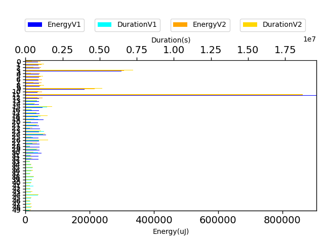

## com.google.gson.functional.StringTest

| Test | IterationV1 | IterationV2 | DeltaIteration |
| --- | --- | --- | --- |
| com.google.gson.functional.StringTest-testStringValueAsSingleElementArraySerialization | 20 | 16 | -4 |
| com.google.gson.functional.StringTest-testEscapedCtrlRInStringSerialization | 12 | 19 | 7 |
| com.google.gson.functional.StringTest-testStringValueSerialization | 8 | 11 | 3 |
| com.google.gson.functional.StringTest-testEscapedCtrlNInStringSerialization | 14 | 11 | -3 |
| com.google.gson.functional.StringTest-testEscapedBackslashInStringSerialization | 12 | 13 | 1 |
| com.google.gson.functional.StringTest-testSingleQuoteInStringDeserialization | 10 | 14 | 4 |
| com.google.gson.functional.StringTest-testAssignmentCharSerialization | 13 | 15 | 2 |
| com.google.gson.functional.StringTest-testJavascriptKeywordsInStringDeserialization | 10 | 11 | 1 |
| com.google.gson.functional.StringTest-testStringValueDeserialization | 18 | 15 | -3 |
| com.google.gson.functional.StringTest-testEscapingQuotesInStringDeserialization | 19 | 7 | -12 |
| com.google.gson.functional.StringTest-testJavascriptKeywordsInStringSerialization | 19 | 7 | -12 |
| com.google.gson.functional.StringTest-testEscapedBackslashInStringDeserialization | 16 | 15 | -1 |
| com.google.gson.functional.StringTest-testSingleQuoteInStringSerialization | 12 | 15 | 3 |
| com.google.gson.functional.StringTest-testEscapingQuotesInStringSerialization | 22 | 14 | -8 |
| com.google.gson.functional.StringTest-testAssignmentCharDeserialization | 12 | 9 | -3 |
| com.google.gson.functional.StringTest-testStringWithEscapedSlashDeserialization | 15 | 14 | -1 |
| com.google.gson.functional.StringTest-testEscapedCtrlRInStringDeserialization | 12 | 13 | 1 |
| com.google.gson.functional.StringTest-testEscapedCtrlNInStringDeserialization | 7 | 10 | 3 |

| Test | EnergyV1 | EnergyV2 | DeltaEnergy |
| --- | --- | --- | --- |
| com.google.gson.functional.StringTest-testStringValueAsSingleElementArraySerialization | 41081.65404033661 | 43014.804138183594 | 1933.1500978469849 |
| com.google.gson.functional.StringTest-testEscapedCtrlRInStringSerialization | 43397.022705078125 | 41583.15273284912 | -1813.869972229004 |
| com.google.gson.functional.StringTest-testStringValueSerialization | 41642.2578125 | 41513.162109375 | -129.095703125 |
| com.google.gson.functional.StringTest-testEscapedCtrlNInStringSerialization | 58407.8876953125 | 43014.3544921875 | -15393.533203125 |
| com.google.gson.functional.StringTest-testEscapedBackslashInStringSerialization | 44688.15234375 | 42046.73388671875 | -2641.41845703125 |
| com.google.gson.functional.StringTest-testSingleQuoteInStringDeserialization | 43615.6640625 | 43507.80993652344 | -107.8541259765625 |
| com.google.gson.functional.StringTest-testAssignmentCharSerialization | 43594.141845703125 | 39670.97570800781 | -3923.1661376953125 |
| com.google.gson.functional.StringTest-testJavascriptKeywordsInStringDeserialization | 42243.71484375 | 42595.4375 | 351.72265625 |
| com.google.gson.functional.StringTest-testStringValueDeserialization | 43598.60472869873 | 43257.80499267578 | -340.7997360229492 |
| com.google.gson.functional.StringTest-testEscapingQuotesInStringDeserialization | 44468.27040100098 | 41210.03125 | -3258.2391510009766 |
| com.google.gson.functional.StringTest-testJavascriptKeywordsInStringSerialization | 42880.930278778076 | 42764.515625 | -116.41465377807617 |
| com.google.gson.functional.StringTest-testEscapedBackslashInStringDeserialization | 44128.7453918457 | 43447.937927246094 | -680.8074645996094 |
| com.google.gson.functional.StringTest-testSingleQuoteInStringSerialization | 41076.00537109375 | 40955.09930419922 | -120.90606689453125 |
| com.google.gson.functional.StringTest-testEscapingQuotesInStringSerialization | 43862.88713312149 | 41683.36462402344 | -2179.522509098053 |
| com.google.gson.functional.StringTest-testAssignmentCharDeserialization | 42343.615234375 | 41298.984375 | -1044.630859375 |
| com.google.gson.functional.StringTest-testStringWithEscapedSlashDeserialization | 41502.164489746094 | 41081.43688964844 | -420.72760009765625 |
| com.google.gson.functional.StringTest-testEscapedCtrlRInStringDeserialization | 43489.24072265625 | 39075.62060546875 | -4413.6201171875 |
| com.google.gson.functional.StringTest-testEscapedCtrlNInStringDeserialization | 41206.9375 | 41736.482421875 | 529.544921875 |

| Test | DurationV1 | DurationsV2 | DeltaDuration |
| --- | --- | --- | --- |
| com.google.gson.functional.StringTest-testStringValueAsSingleElementArraySerialization | 376375.0550746918 | 383284.5825805664 | 6909.527505874634 |
| com.google.gson.functional.StringTest-testEscapedCtrlRInStringSerialization | 320307.7346191406 | 282764.3165054321 | -37543.418113708496 |
| com.google.gson.functional.StringTest-testStringValueSerialization | 285238.71484375 | 269086.474609375 | -16152.240234375 |
| com.google.gson.functional.StringTest-testEscapedCtrlNInStringSerialization | 811968.6134033203 | 257882.2353515625 | -554086.3780517578 |
| com.google.gson.functional.StringTest-testEscapedBackslashInStringSerialization | 435671.54638671875 | 327954.04833984375 | -107717.498046875 |
| com.google.gson.functional.StringTest-testSingleQuoteInStringDeserialization | 365116.060546875 | 332258.2092285156 | -32857.851318359375 |
| com.google.gson.functional.StringTest-testAssignmentCharSerialization | 309467.84228515625 | 505770.3084716797 | 196302.46618652344 |
| com.google.gson.functional.StringTest-testJavascriptKeywordsInStringDeserialization | 345314.767578125 | 436692.6982421875 | 91377.9306640625 |
| com.google.gson.functional.StringTest-testStringValueDeserialization | 300166.6253967285 | 259434.70977783203 | -40731.915618896484 |
| com.google.gson.functional.StringTest-testEscapingQuotesInStringDeserialization | 418510.9805831909 | 456340.15625 | 37829.17566680908 |
| com.google.gson.functional.StringTest-testJavascriptKeywordsInStringSerialization | 295365.03897857666 | 289678.765625 | -5686.27335357666 |
| com.google.gson.functional.StringTest-testEscapedBackslashInStringDeserialization | 479588.9666442871 | 481432.9307861328 | 1843.9641418457031 |
| com.google.gson.functional.StringTest-testSingleQuoteInStringSerialization | 329598.00732421875 | 294424.5579223633 | -35173.44940185547 |
| com.google.gson.functional.StringTest-testEscapingQuotesInStringSerialization | 375882.7903409004 | 437807.4450683594 | 61924.654727458954 |
| com.google.gson.functional.StringTest-testAssignmentCharDeserialization | 338691.48974609375 | 403119.4609375 | 64427.97119140625 |
| com.google.gson.functional.StringTest-testStringWithEscapedSlashDeserialization | 341175.2277832031 | 375782.08203125 | 34606.854248046875 |
| com.google.gson.functional.StringTest-testEscapedCtrlRInStringDeserialization | 356998.8671875 | 320779.3956298828 | -36219.47155761719 |
| com.google.gson.functional.StringTest-testEscapedCtrlNInStringDeserialization | 319205.28125 | 309056.671875 | -10148.609375 |

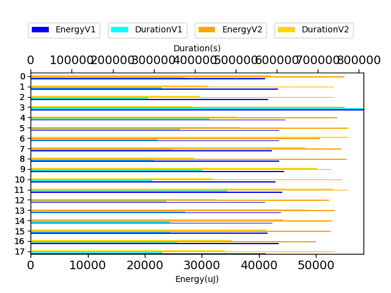

## com.google.gson.functional.ParameterizedTypesTest

| Test | IterationV1 | IterationV2 | DeltaIteration |
| --- | --- | --- | --- |
| com.google.gson.functional.ParameterizedTypesTest-testParameterizedTypesWithWriterSerialization | 51 | 51 | 0 |
| com.google.gson.functional.ParameterizedTypesTest-testVariableTypeArrayDeserialization | 73 | 66 | -7 |
| com.google.gson.functional.ParameterizedTypesTest-testParameterizedTypeWithReaderDeserialization | 51 | 48 | -3 |
| com.google.gson.functional.ParameterizedTypesTest-testParameterizedTypeWithCustomSerializer | 83 | 78 | -5 |
| com.google.gson.functional.ParameterizedTypesTest-testParameterizedTypesSerialization | 99 | 99 | 0 |
| com.google.gson.functional.ParameterizedTypesTest-testVariableTypeDeserialization | 65 | 65 | 0 |
| com.google.gson.functional.ParameterizedTypesTest-testVariableTypeFieldsAndGenericArraysSerialization | 99 | 98 | -1 |
| com.google.gson.functional.ParameterizedTypesTest-testTypesWithMultipleParametersSerialization | 99 | 99 | 0 |
| com.google.gson.functional.ParameterizedTypesTest-testParameterizedTypesWithCustomDeserializer | 63 | 67 | 4 |
| com.google.gson.functional.ParameterizedTypesTest-testParameterizedTypeGenericArraysSerialization | 64 | 70 | 6 |
| com.google.gson.functional.ParameterizedTypesTest-testParameterizedTypeGenericArraysDeserialization | 72 | 73 | 1 |
| com.google.gson.functional.ParameterizedTypesTest-testParameterizedTypeDeserialization | 72 | 70 | -2 |
| com.google.gson.functional.ParameterizedTypesTest-testTypesWithMultipleParametersDeserialization | 66 | 66 | 0 |
| com.google.gson.functional.ParameterizedTypesTest-testDeepParameterizedTypeSerialization | 29 | 25 | -4 |
| com.google.gson.functional.ParameterizedTypesTest-testParameterizedTypeWithVariableTypeDeserialization | 69 | 66 | -3 |
| com.google.gson.functional.ParameterizedTypesTest-testDeepParameterizedTypeDeserialization | 41 | 43 | 2 |
| com.google.gson.functional.ParameterizedTypesTest-testVariableTypeFieldsAndGenericArraysDeserialization | 80 | 84 | 4 |

| Test | EnergyV1 | EnergyV2 | DeltaEnergy |
| --- | --- | --- | --- |
| com.google.gson.functional.ParameterizedTypesTest-testParameterizedTypesWithWriterSerialization | 43375.621243247275 | 38444.26604804129 | -4931.355195205986 |
| com.google.gson.functional.ParameterizedTypesTest-testVariableTypeArrayDeserialization | 41978.33313513378 | 41184.774156033855 | -793.558979099922 |
| com.google.gson.functional.ParameterizedTypesTest-testParameterizedTypeWithReaderDeserialization | 43039.15730250542 | 38854.27226975157 | -4184.885032753846 |
| com.google.gson.functional.ParameterizedTypesTest-testParameterizedTypeWithCustomSerializer | 49042.81230460773 | 67812.18515018205 | 18769.37284557432 |
| com.google.gson.functional.ParameterizedTypesTest-testParameterizedTypesSerialization | 57731.43183221262 | 86807.9544552667 | 29076.522623054087 |
| com.google.gson.functional.ParameterizedTypesTest-testVariableTypeDeserialization | 41783.42758163988 | 40370.316500310786 | -1413.1110813290943 |
| com.google.gson.functional.ParameterizedTypesTest-testVariableTypeFieldsAndGenericArraysSerialization | 48709.415012654325 | 124334.20579044259 | 75624.79077778826 |
| com.google.gson.functional.ParameterizedTypesTest-testTypesWithMultipleParametersSerialization | 74726.16489942462 | 84592.2797433208 | 9866.114843896183 |
| com.google.gson.functional.ParameterizedTypesTest-testParameterizedTypesWithCustomDeserializer | 43354.77307576782 | 38938.95627346277 | -4415.816802305053 |
| com.google.gson.functional.ParameterizedTypesTest-testParameterizedTypeGenericArraysSerialization | 43344.65018671006 | 44278.12751649156 | 933.4773297814972 |
| com.google.gson.functional.ParameterizedTypesTest-testParameterizedTypeGenericArraysDeserialization | 42826.91967254451 | 42950.11827069779 | 123.19859815328527 |
| com.google.gson.functional.ParameterizedTypesTest-testParameterizedTypeDeserialization | 54113.07024832949 | 39750.44783977091 | -14362.622408558578 |
| com.google.gson.functional.ParameterizedTypesTest-testTypesWithMultipleParametersDeserialization | 43483.38785033423 | 43527.170697673326 | 43.782847339098225 |
| com.google.gson.functional.ParameterizedTypesTest-testDeepParameterizedTypeSerialization | 42290.30346801877 | 39304.22988331318 | -2986.073584705591 |
| com.google.gson.functional.ParameterizedTypesTest-testParameterizedTypeWithVariableTypeDeserialization | 42646.24114842083 | 40222.433548509085 | -2423.8075999117427 |
| com.google.gson.functional.ParameterizedTypesTest-testDeepParameterizedTypeDeserialization | 41910.212243938295 | 42731.226076357496 | 821.0138324192012 |
| com.google.gson.functional.ParameterizedTypesTest-testVariableTypeFieldsAndGenericArraysDeserialization | 43323.70578568394 | 57328.427840974386 | 14004.722055290447 |

| Test | DurationV1 | DurationsV2 | DeltaDuration |
| --- | --- | --- | --- |
| com.google.gson.functional.ParameterizedTypesTest-testParameterizedTypesWithWriterSerialization | 664244.9001088352 | 829865.9677656521 | 165621.06765681691 |
| com.google.gson.functional.ParameterizedTypesTest-testVariableTypeArrayDeserialization | 785336.5316715471 | 1012403.4306985878 | 227066.8990270407 |
| com.google.gson.functional.ParameterizedTypesTest-testParameterizedTypeWithReaderDeserialization | 685828.623940321 | 1143849.4081101608 | 458020.7841698398 |
| com.google.gson.functional.ParameterizedTypesTest-testParameterizedTypeWithCustomSerializer | 1040951.6924381201 | 1638718.3723010565 | 597766.6798629364 |
| com.google.gson.functional.ParameterizedTypesTest-testParameterizedTypesSerialization | 1577941.9263181854 | 2398233.828378831 | 820291.9020606456 |
| com.google.gson.functional.ParameterizedTypesTest-testVariableTypeDeserialization | 880195.1054377947 | 980120.2741504875 | 99925.1687126928 |
| com.google.gson.functional.ParameterizedTypesTest-testVariableTypeFieldsAndGenericArraysSerialization | 1513870.6838031744 | 3460694.9318320863 | 1946824.2480289119 |
| com.google.gson.functional.ParameterizedTypesTest-testTypesWithMultipleParametersSerialization | 1680508.761130143 | 2484790.806407061 | 804282.045276918 |
| com.google.gson.functional.ParameterizedTypesTest-testParameterizedTypesWithCustomDeserializer | 792458.8786883308 | 1196695.326527308 | 404236.4478389772 |
| com.google.gson.functional.ParameterizedTypesTest-testParameterizedTypeGenericArraysSerialization | 857201.6749186513 | 984262.6898878907 | 127061.01496923936 |
| com.google.gson.functional.ParameterizedTypesTest-testParameterizedTypeGenericArraysDeserialization | 895579.5561162124 | 983302.9778649601 | 87723.4217487477 |
| com.google.gson.functional.ParameterizedTypesTest-testParameterizedTypeDeserialization | 874858.7225167912 | 1133359.1998347891 | 258500.47731799795 |
| com.google.gson.functional.ParameterizedTypesTest-testTypesWithMultipleParametersDeserialization | 779016.5239838196 | 1213934.4510670647 | 434917.927083245 |
| com.google.gson.functional.ParameterizedTypesTest-testDeepParameterizedTypeSerialization | 512641.9896680601 | 533524.0246717334 | 20882.035003673285 |
| com.google.gson.functional.ParameterizedTypesTest-testParameterizedTypeWithVariableTypeDeserialization | 915589.8118727892 | 1022067.1737045395 | 106477.36183175037 |
| com.google.gson.functional.ParameterizedTypesTest-testDeepParameterizedTypeDeserialization | 625926.609999341 | 686861.0414278046 | 60934.431428463664 |
| com.google.gson.functional.ParameterizedTypesTest-testVariableTypeFieldsAndGenericArraysDeserialization | 950985.5466251371 | 1417052.4767154283 | 466066.9300902912 |

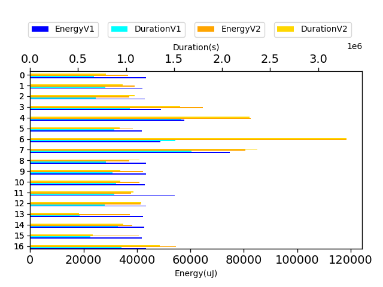

## com.google.gson.functional.NullObjectAndFieldTest

| Test | IterationV1 | IterationV2 | DeltaIteration |
| --- | --- | --- | --- |
| com.google.gson.functional.NullObjectAndFieldTest-testExplicitDeserializationOfNulls | 28 | 29 | 1 |
| com.google.gson.functional.NullObjectAndFieldTest-testAbsentJsonElementsAreSetToNull | 50 | 55 | 5 |
| com.google.gson.functional.NullObjectAndFieldTest-testExplicitSerializationOfNullArrayMembers | 67 | 80 | 13 |
| com.google.gson.functional.NullObjectAndFieldTest-testExplicitSerializationOfNulls | 30 | 40 | 10 |
| com.google.gson.functional.NullObjectAndFieldTest-testCustomTypeAdapterPassesNullSerialization | 16 | 22 | 6 |
| com.google.gson.functional.NullObjectAndFieldTest-testExplicitSerializationOfNullCollectionMembers | 33 | 39 | 6 |
| com.google.gson.functional.NullObjectAndFieldTest-testCustomSerializationOfNulls | 40 | 44 | 4 |
| com.google.gson.functional.NullObjectAndFieldTest-testPrintPrintingObjectWithNulls | 50 | 46 | -4 |
| com.google.gson.functional.NullObjectAndFieldTest-testExplicitNullSetsFieldToNullDuringDeserialization | 38 | 40 | 2 |
| com.google.gson.functional.NullObjectAndFieldTest-testCustomTypeAdapterPassesNullDesrialization | 48 | 50 | 2 |
| com.google.gson.functional.NullObjectAndFieldTest-testNullWrappedPrimitiveMemberSerialization | 33 | 36 | 3 |
| com.google.gson.functional.NullObjectAndFieldTest-testExplicitSerializationOfNullStringMembers | 30 | 29 | -1 |
| com.google.gson.functional.NullObjectAndFieldTest-testPrintPrintingArraysWithNulls | 13 | 17 | 4 |
| com.google.gson.functional.NullObjectAndFieldTest-testNullWrappedPrimitiveMemberDeserialization | 20 | 28 | 8 |
| com.google.gson.functional.NullObjectAndFieldTest-testTopLevelNullObjectSerialization | 22 | 11 | -11 |
| com.google.gson.functional.NullObjectAndFieldTest-testTopLevelNullObjectDeserialization | 15 | 23 | 8 |

| Test | EnergyV1 | EnergyV2 | DeltaEnergy |
| --- | --- | --- | --- |
| com.google.gson.functional.NullObjectAndFieldTest-testExplicitDeserializationOfNulls | 40757.374690096825 | 43495.08212206513 | 2737.7074319683015 |
| com.google.gson.functional.NullObjectAndFieldTest-testAbsentJsonElementsAreSetToNull | 43178.307942565996 | 41118.10236500247 | -2060.2055775635235 |
| com.google.gson.functional.NullObjectAndFieldTest-testExplicitSerializationOfNullArrayMembers | 38716.51259312705 | 42809.423685452944 | 4092.9110923258922 |
| com.google.gson.functional.NullObjectAndFieldTest-testExplicitSerializationOfNulls | 46137.369002631865 | 44380.53094969996 | -1756.8380529319038 |
| com.google.gson.functional.NullObjectAndFieldTest-testCustomTypeAdapterPassesNullSerialization | 43974.44982910156 | 43977.95596551895 | 3.506136417388916 |
| com.google.gson.functional.NullObjectAndFieldTest-testExplicitSerializationOfNullCollectionMembers | 41621.50068373489 | 42012.341315409605 | 390.8406316747132 |
| com.google.gson.functional.NullObjectAndFieldTest-testCustomSerializationOfNulls | 60244.20116725168 | 40580.235012911755 | -19663.966154339927 |
| com.google.gson.functional.NullObjectAndFieldTest-testPrintPrintingObjectWithNulls | 39435.36371762604 | 41929.78026135132 | 2494.4165437252814 |
| com.google.gson.functional.NullObjectAndFieldTest-testExplicitNullSetsFieldToNullDuringDeserialization | 42984.93653948068 | 42577.056977669694 | -407.87956181098707 |
| com.google.gson.functional.NullObjectAndFieldTest-testCustomTypeAdapterPassesNullDesrialization | 43698.868482880585 | 40081.52968809222 | -3617.3387947883675 |
| com.google.gson.functional.NullObjectAndFieldTest-testNullWrappedPrimitiveMemberSerialization | 41460.76137324376 | 42875.37529166142 | 1414.6139184176573 |
| com.google.gson.functional.NullObjectAndFieldTest-testExplicitSerializationOfNullStringMembers | 36829.05855230987 | 38065.53904213011 | 1236.480489820242 |
| com.google.gson.functional.NullObjectAndFieldTest-testPrintPrintingArraysWithNulls | 46185.072509765625 | 40599.39205932617 | -5585.680450439453 |
| com.google.gson.functional.NullObjectAndFieldTest-testNullWrappedPrimitiveMemberDeserialization | 43229.20650100708 | 40527.04979805648 | -2702.156702950597 |
| com.google.gson.functional.NullObjectAndFieldTest-testTopLevelNullObjectSerialization | 60261.645360946655 | 63630.548828125 | 3368.9034671783447 |
| com.google.gson.functional.NullObjectAndFieldTest-testTopLevelNullObjectDeserialization | 42166.91619873047 | 42408.833867549896 | 241.9176688194275 |

| Test | DurationV1 | DurationsV2 | DeltaDuration |
| --- | --- | --- | --- |
| com.google.gson.functional.NullObjectAndFieldTest-testExplicitDeserializationOfNulls | 477021.3554606885 | 500276.9091903027 | 23255.553729614243 |
| com.google.gson.functional.NullObjectAndFieldTest-testAbsentJsonElementsAreSetToNull | 867479.9830616158 | 705011.6592807178 | -162468.323780898 |
| com.google.gson.functional.NullObjectAndFieldTest-testExplicitSerializationOfNullArrayMembers | 1111402.9530612952 | 1012086.869002555 | -99316.08405874018 |
| com.google.gson.functional.NullObjectAndFieldTest-testExplicitSerializationOfNulls | 918552.4257644247 | 495839.05288275925 | -422713.3728816655 |
| com.google.gson.functional.NullObjectAndFieldTest-testCustomTypeAdapterPassesNullSerialization | 369269.72790527344 | 413432.0971112251 | 44162.36920595169 |
| com.google.gson.functional.NullObjectAndFieldTest-testExplicitSerializationOfNullCollectionMembers | 521635.7054255463 | 604667.1829386335 | 83031.47751308721 |
| com.google.gson.functional.NullObjectAndFieldTest-testCustomSerializationOfNulls | 1038903.0713067185 | 583307.7154782608 | -455595.35582845774 |
| com.google.gson.functional.NullObjectAndFieldTest-testPrintPrintingObjectWithNulls | 632197.7949905621 | 527038.5355381577 | -105159.25945240445 |
| com.google.gson.functional.NullObjectAndFieldTest-testExplicitNullSetsFieldToNullDuringDeserialization | 617005.7942627955 | 619699.6895009581 | 2693.8952381626004 |
| com.google.gson.functional.NullObjectAndFieldTest-testCustomTypeAdapterPassesNullDesrialization | 830337.8997632405 | 589509.9691558147 | -240827.93060742575 |
| com.google.gson.functional.NullObjectAndFieldTest-testNullWrappedPrimitiveMemberSerialization | 627917.2450667263 | 671900.047449721 | 43982.802382994676 |
| com.google.gson.functional.NullObjectAndFieldTest-testExplicitSerializationOfNullStringMembers | 512905.70691408403 | 513213.9204756692 | 308.213561585173 |
| com.google.gson.functional.NullObjectAndFieldTest-testPrintPrintingArraysWithNulls | 457308.5070800781 | 484504.8459625244 | 27196.33888244629 |
| com.google.gson.functional.NullObjectAndFieldTest-testNullWrappedPrimitiveMemberDeserialization | 456580.90611457825 | 460957.51362508535 | 4376.607510507107 |
| com.google.gson.functional.NullObjectAndFieldTest-testTopLevelNullObjectSerialization | 817990.345454216 | 999126.1923828125 | 181135.8469285965 |
| com.google.gson.functional.NullObjectAndFieldTest-testTopLevelNullObjectDeserialization | 402079.3483276367 | 289260.642745018 | -112818.70558261871 |

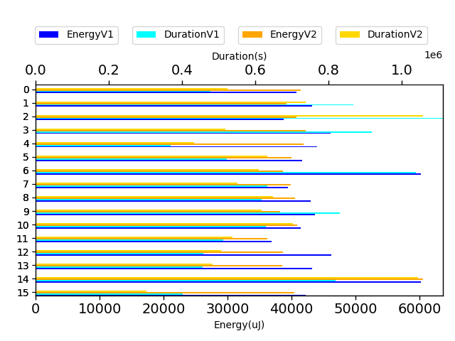

## com.google.gson.JsonParserTest

| Test | IterationV1 | IterationV2 | DeltaIteration |
| --- | --- | --- | --- |
| com.google.gson.JsonParserTest-testReadWriteTwoObjects | 69 | 64 | -5 |

| Test | EnergyV1 | EnergyV2 | DeltaEnergy |
| --- | --- | --- | --- |
| com.google.gson.JsonParserTest-testReadWriteTwoObjects | 76706.21281300776 | 68018.65923744845 | -8687.553575559316 |

| Test | DurationV1 | DurationsV2 | DeltaDuration |
| --- | --- | --- | --- |
| com.google.gson.JsonParserTest-testReadWriteTwoObjects | 2139279.3622326115 | 1586704.887297279 | -552574.4749353325 |

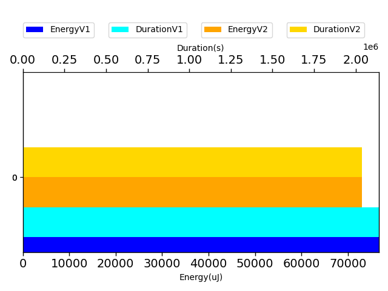

## com.google.gson.functional.ReadersWritersTest

| Test | IterationV1 | IterationV2 | DeltaIteration |
| --- | --- | --- | --- |
| com.google.gson.functional.ReadersWritersTest-testTypeMismatchThrowsJsonSyntaxExceptionForStrings | 49 | 51 | 2 |
| com.google.gson.functional.ReadersWritersTest-testReadWriteTwoStrings | 69 | 68 | -1 |
| com.google.gson.functional.ReadersWritersTest-testReadWriteTwoObjects | 39 | 55 | 16 |
| com.google.gson.functional.ReadersWritersTest-testReaderForDeserialization | 27 | 30 | 3 |
| com.google.gson.functional.ReadersWritersTest-testTypeMismatchThrowsJsonSyntaxExceptionForReaders | 44 | 38 | -6 |
| com.google.gson.functional.ReadersWritersTest-testWriterForSerialization | 33 | 35 | 2 |
| com.google.gson.functional.ReadersWritersTest-testTopLevelNullObjectDeserializationWithReader | 10 | 14 | 4 |
| com.google.gson.functional.ReadersWritersTest-testTopLevelNullObjectDeserializationWithReaderAndSerializeNulls | 14 | 13 | -1 |

| Test | EnergyV1 | EnergyV2 | DeltaEnergy |
| --- | --- | --- | --- |
| com.google.gson.functional.ReadersWritersTest-testTypeMismatchThrowsJsonSyntaxExceptionForStrings | 44541.61968474464 | 40206.96920337715 | -4334.650481367491 |
| com.google.gson.functional.ReadersWritersTest-testReadWriteTwoStrings | 39953.01870134036 | 48325.0841784706 | 8372.065477130236 |
| com.google.gson.functional.ReadersWritersTest-testReadWriteTwoObjects | 37135.468799464514 | 64039.31854232024 | 26903.849742855724 |
| com.google.gson.functional.ReadersWritersTest-testReaderForDeserialization | 46430.92929930985 | 78320.62254620157 | 31889.693246891722 |
| com.google.gson.functional.ReadersWritersTest-testTypeMismatchThrowsJsonSyntaxExceptionForReaders | 42015.1909747539 | 44303.266346294025 | 2288.0753715401224 |
| com.google.gson.functional.ReadersWritersTest-testWriterForSerialization | 41278.64695577859 | 75265.52464003509 | 33986.8776842565 |
| com.google.gson.functional.ReadersWritersTest-testTopLevelNullObjectDeserializationWithReader | 44418.98828125 | 38711.42199707031 | -5707.5662841796875 |
| com.google.gson.functional.ReadersWritersTest-testTopLevelNullObjectDeserializationWithReaderAndSerializeNulls | 40066.786865234375 | 42782.905517578125 | 2716.11865234375 |

| Test | DurationV1 | DurationsV2 | DeltaDuration |
| --- | --- | --- | --- |
| com.google.gson.functional.ReadersWritersTest-testTypeMismatchThrowsJsonSyntaxExceptionForStrings | 738918.2160940748 | 931430.0304771672 | 192511.81438309245 |
| com.google.gson.functional.ReadersWritersTest-testReadWriteTwoStrings | 730627.5001107196 | 884605.7534807111 | 153978.25336999155 |
| com.google.gson.functional.ReadersWritersTest-testReadWriteTwoObjects | 1034978.1930839147 | 1228612.6295818104 | 193634.43649789575 |
| com.google.gson.functional.ReadersWritersTest-testReaderForDeserialization | 449940.8278579861 | 1822005.4028023127 | 1372064.5749443267 |
| com.google.gson.functional.ReadersWritersTest-testTypeMismatchThrowsJsonSyntaxExceptionForReaders | 608013.265130683 | 563896.6742895565 | -44116.59084112651 |
| com.google.gson.functional.ReadersWritersTest-testWriterForSerialization | 682321.6665841681 | 1928665.9043589896 | 1246344.2377748215 |
| com.google.gson.functional.ReadersWritersTest-testTopLevelNullObjectDeserializationWithReader | 540142.978515625 | 535511.6685791016 | -4631.3099365234375 |
| com.google.gson.functional.ReadersWritersTest-testTopLevelNullObjectDeserializationWithReaderAndSerializeNulls | 383885.24060058594 | 396717.4768066406 | 12832.236206054688 |

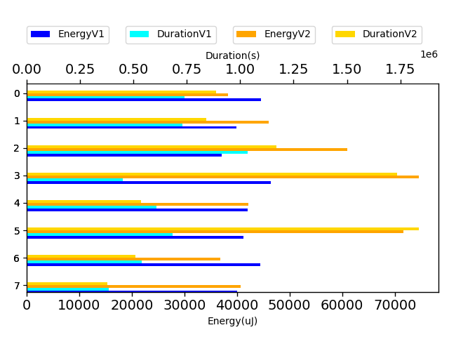

## com.google.gson.functional.JsonTreeTest

| Test | IterationV1 | IterationV2 | DeltaIteration |
| --- | --- | --- | --- |
| com.google.gson.functional.JsonTreeTest-testJsonTreeNull | 21 | 23 | 2 |
| com.google.gson.functional.JsonTreeTest-testJsonTreeToString | 65 | 62 | -3 |
| com.google.gson.functional.JsonTreeTest-testToJsonTreeObjectType | 52 | 55 | 3 |
| com.google.gson.functional.JsonTreeTest-testToJsonTree | 39 | 45 | 6 |

| Test | EnergyV1 | EnergyV2 | DeltaEnergy |
| --- | --- | --- | --- |
| com.google.gson.functional.JsonTreeTest-testJsonTreeNull | 42924.95359325409 | 41923.347517728806 | -1001.6060755252838 |
| com.google.gson.functional.JsonTreeTest-testJsonTreeToString | 55096.33617744519 | 46921.19597199955 | -8175.140205445641 |
| com.google.gson.functional.JsonTreeTest-testToJsonTreeObjectType | 42461.52160846518 | 48606.93889318207 | 6145.417284716896 |
| com.google.gson.functional.JsonTreeTest-testToJsonTree | 43427.26243411047 | 44966.42696965176 | 1539.1645355412911 |

| Test | DurationV1 | DurationsV2 | DeltaDuration |
| --- | --- | --- | --- |
| com.google.gson.functional.JsonTreeTest-testJsonTreeNull | 397839.4101176262 | 454336.643917799 | 56497.233800172806 |
| com.google.gson.functional.JsonTreeTest-testJsonTreeToString | 1265226.1750248952 | 940864.2344230411 | -324361.9406018541 |
| com.google.gson.functional.JsonTreeTest-testToJsonTreeObjectType | 679637.8903923105 | 830070.1181729948 | 150432.22778068436 |
| com.google.gson.functional.JsonTreeTest-testToJsonTree | 717813.0724291606 | 756684.1496465158 | 38871.077217355254 |

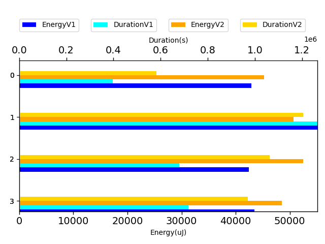

## com.google.gson.DefaultMapJsonSerializerTest

| Test | IterationV1 | IterationV2 | DeltaIteration |
| --- | --- | --- | --- |
| com.google.gson.DefaultMapJsonSerializerTest-testEmptyMapSerialization | 45 | 46 | 1 |
| com.google.gson.DefaultMapJsonSerializerTest-testNonEmptyMapSerialization | 46 | 47 | 1 |
| com.google.gson.DefaultMapJsonSerializerTest-testEmptyMapNoTypeSerialization | 24 | 24 | 0 |

| Test | EnergyV1 | EnergyV2 | DeltaEnergy |
| --- | --- | --- | --- |
| com.google.gson.DefaultMapJsonSerializerTest-testEmptyMapSerialization | 44361.97625397323 | 52048.937968697704 | 7686.961714724472 |
| com.google.gson.DefaultMapJsonSerializerTest-testNonEmptyMapSerialization | 42097.310823873224 | 46604.596196605286 | 4507.285372732062 |
| com.google.gson.DefaultMapJsonSerializerTest-testEmptyMapNoTypeSerialization | 49449.89798390865 | 69766.62512767315 | 20316.727143764496 |

| Test | DurationV1 | DurationsV2 | DeltaDuration |
| --- | --- | --- | --- |
| com.google.gson.DefaultMapJsonSerializerTest-testEmptyMapSerialization | 564750.9292311664 | 874761.7028421662 | 310010.7736109998 |
| com.google.gson.DefaultMapJsonSerializerTest-testNonEmptyMapSerialization | 572950.412163234 | 710943.1479174495 | 137992.7357542155 |
| com.google.gson.DefaultMapJsonSerializerTest-testEmptyMapNoTypeSerialization | 703599.7127866745 | 1968184.9168963432 | 1264585.2041096687 |

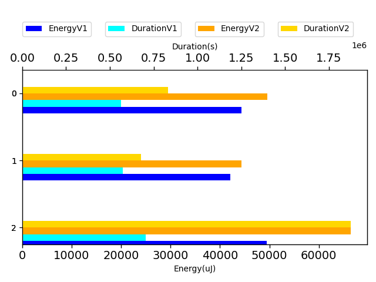

## com.google.gson.functional.ObjectTest

| Test | IterationV1 | IterationV2 | DeltaIteration |
| --- | --- | --- | --- |
| com.google.gson.functional.ObjectTest-testSingletonLists | 85 | 93 | 8 |
| com.google.gson.functional.ObjectTest-testNullFieldsSerialization | 13 | 23 | 10 |
| com.google.gson.functional.ObjectTest-testPrivateNoArgConstructorDeserialization | 41 | 42 | 1 |
| com.google.gson.functional.ObjectTest-testClassWithTransientFieldsDeserializationTransientFieldsPassedInJsonAreIgnored | 19 | 21 | 2 |
| com.google.gson.functional.ObjectTest-testNullArraysDeserialization | 24 | 15 | -9 |
| com.google.gson.functional.ObjectTest-testInnerClassSerialization | 64 | 56 | -8 |
| com.google.gson.functional.ObjectTest-testClassWithObjectFieldSerialization | 37 | 39 | 2 |
| com.google.gson.functional.ObjectTest-testTruncatedDeserialization | 57 | 65 | 8 |
| com.google.gson.functional.ObjectTest-testArrayOfArraysSerialization | 70 | 75 | 5 |
| com.google.gson.functional.ObjectTest-testBagOfPrimitiveWrappersDeserialization | 34 | 38 | 4 |
| com.google.gson.functional.ObjectTest-testJsonInMixedQuotesDeserialization | 20 | 32 | 12 |
| com.google.gson.functional.ObjectTest-testArrayOfObjectsSerialization | 40 | 42 | 2 |
| com.google.gson.functional.ObjectTest-testEmptyCollectionInAnObjectDeserialization | 49 | 61 | 12 |
| com.google.gson.functional.ObjectTest-testArrayOfArraysDeserialization | 48 | 43 | -5 |
| com.google.gson.functional.ObjectTest-testStringFieldWithNumberValueDeserialization | 19 | 22 | 3 |
| com.google.gson.functional.ObjectTest-testArrayOfObjectsAsFields | 55 | 52 | -3 |
| com.google.gson.functional.ObjectTest-testAnonymousLocalClassesCustomSerialization | 47 | 55 | 8 |
| com.google.gson.functional.ObjectTest-testClassWithNoFieldsSerialization | 18 | 31 | 13 |
| com.google.gson.functional.ObjectTest-testEmptyCollectionInAnObjectSerialization | 26 | 22 | -4 |
| com.google.gson.functional.ObjectTest-testBagOfPrimitiveWrappersSerialization | 43 | 44 | 1 |
| com.google.gson.functional.ObjectTest-testAnonymousLocalClassesSerialization | 41 | 39 | -2 |
| com.google.gson.functional.ObjectTest-testNullPrimitiveFieldsDeserialization | 22 | 29 | 7 |
| com.google.gson.functional.ObjectTest-testInnerClassDeserialization | 44 | 45 | 1 |
| com.google.gson.functional.ObjectTest-testStringFieldWithEmptyValueDeserialization | 23 | 17 | -6 |
| com.google.gson.functional.ObjectTest-testNestedSerialization | 38 | 32 | -6 |
| com.google.gson.functional.ObjectTest-testStringFieldWithEmptyValueSerialization | 46 | 43 | -3 |
| com.google.gson.functional.ObjectTest-testArrayOfObjectsDeserialization | 39 | 29 | -10 |
| com.google.gson.functional.ObjectTest-testClassWithTransientFieldsSerialization | 40 | 50 | 10 |
| com.google.gson.functional.ObjectTest-testPrimitiveArrayFieldSerialization | 20 | 22 | 2 |
| com.google.gson.functional.ObjectTest-testBagOfPrimitivesSerialization | 32 | 25 | -7 |
| com.google.gson.functional.ObjectTest-testNestedDeserialization | 27 | 28 | 1 |
| com.google.gson.functional.ObjectTest-testClassWithTransientFieldsDeserialization | 21 | 18 | -3 |
| com.google.gson.functional.ObjectTest-testPrimitiveArrayInAnObjectDeserialization | 29 | 32 | 3 |
| com.google.gson.functional.ObjectTest-testClassWithNoFieldsDeserialization | 17 | 14 | -3 |
| com.google.gson.functional.ObjectTest-testNullFieldsDeserialization | 25 | 20 | -5 |
| com.google.gson.functional.ObjectTest-testBagOfPrimitivesDeserialization | 27 | 23 | -4 |
| com.google.gson.functional.ObjectTest-testNullObjectFieldsDeserialization | 22 | 26 | 4 |
| com.google.gson.functional.ObjectTest-testJsonInSingleQuotesDeserialization | 23 | 31 | 8 |
| com.google.gson.functional.ObjectTest-testObjectFieldNamesWithoutQuotesDeserialization | 20 | 24 | 4 |

| Test | EnergyV1 | EnergyV2 | DeltaEnergy |
| --- | --- | --- | --- |
| com.google.gson.functional.ObjectTest-testSingletonLists | 53851.04130677605 | 43601.057443389414 | -10249.983863386638 |
| com.google.gson.functional.ObjectTest-testNullFieldsSerialization | 42372.33728027344 | 42219.8176176548 | -152.51966261863708 |
| com.google.gson.functional.ObjectTest-testPrivateNoArgConstructorDeserialization | 43790.53234875025 | 43568.19558304362 | -222.33676570662647 |
| com.google.gson.functional.ObjectTest-testClassWithTransientFieldsDeserializationTransientFieldsPassedInJsonAreIgnored | 40724.92799949646 | 44548.31608200073 | 3823.3880825042725 |
| com.google.gson.functional.ObjectTest-testNullArraysDeserialization | 43397.72013938427 | 45877.159912109375 | 2479.4397727251053 |
| com.google.gson.functional.ObjectTest-testInnerClassSerialization | 40609.08022100986 | 40485.20459955261 | -123.87562145724951 |
| com.google.gson.functional.ObjectTest-testClassWithObjectFieldSerialization | 39801.04390221692 | 47195.66567030858 | 7394.62176809166 |
| com.google.gson.functional.ObjectTest-testTruncatedDeserialization | 43222.94808855333 | 64714.02107773691 | 21491.07298918358 |
| com.google.gson.functional.ObjectTest-testArrayOfArraysSerialization | 44067.46730019231 | 41402.86355246705 | -2664.603747725254 |
| com.google.gson.functional.ObjectTest-testBagOfPrimitiveWrappersDeserialization | 51776.9990495696 | 108500.76938725394 | 56723.77033768434 |
| com.google.gson.functional.ObjectTest-testJsonInMixedQuotesDeserialization | 40927.60472869873 | 36509.11661704164 | -4418.4881116570905 |
| com.google.gson.functional.ObjectTest-testArrayOfObjectsSerialization | 41562.132010991685 | 42547.6259773824 | 985.4939663907135 |
| com.google.gson.functional.ObjectTest-testEmptyCollectionInAnObjectDeserialization | 43686.41692626361 | 43115.754280894675 | -570.6626453689387 |
| com.google.gson.functional.ObjectTest-testArrayOfArraysDeserialization | 43290.78491923044 | 41685.674460142814 | -1605.1104590876275 |
| com.google.gson.functional.ObjectTest-testStringFieldWithNumberValueDeserialization | 43693.54923248291 | 46454.07267665863 | 2760.52344417572 |
| com.google.gson.functional.ObjectTest-testArrayOfObjectsAsFields | 42590.37677048377 | 43623.02951133999 | 1032.6527408562251 |
| com.google.gson.functional.ObjectTest-testAnonymousLocalClassesCustomSerialization | 41139.21594114513 | 67197.39482476855 | 26058.17888362342 |
| com.google.gson.functional.ObjectTest-testClassWithNoFieldsSerialization | 43665.32736968994 | 46641.370046689175 | 2976.0426769992337 |
| com.google.gson.functional.ObjectTest-testEmptyCollectionInAnObjectSerialization | 41874.1784389317 | 42863.32111287117 | 989.1426739394665 |
| com.google.gson.functional.ObjectTest-testBagOfPrimitiveWrappersSerialization | 41506.53224329841 | 77195.24106438697 | 35688.708821088556 |
| com.google.gson.functional.ObjectTest-testAnonymousLocalClassesSerialization | 43069.68742131878 | 45845.95163957797 | 2776.2642182591953 |
| com.google.gson.functional.ObjectTest-testNullPrimitiveFieldsDeserialization | 41813.235630989075 | 45457.82217561081 | 3644.586544621736 |
| com.google.gson.functional.ObjectTest-testInnerClassDeserialization | 42169.07612111145 | 43179.989016195395 | 1010.912895083944 |
| com.google.gson.functional.ObjectTest-testStringFieldWithEmptyValueDeserialization | 43044.43930411339 | 45212.458557128906 | 2168.019253015518 |
| com.google.gson.functional.ObjectTest-testNestedSerialization | 43130.99402933558 | 40702.8119502007 | -2428.18207913488 |
| com.google.gson.functional.ObjectTest-testStringFieldWithEmptyValueSerialization | 42110.81051017822 | 41527.542856298496 | -583.2676538797241 |
| com.google.gson.functional.ObjectTest-testArrayOfObjectsDeserialization | 43488.3794439482 | 45062.468457609415 | 1574.0890136612143 |
| com.google.gson.functional.ObjectTest-testClassWithTransientFieldsSerialization | 43520.692279154486 | 39629.19034901392 | -3891.5019301405628 |
| com.google.gson.functional.ObjectTest-testPrimitiveArrayFieldSerialization | 41329.67558288574 | 44466.072701931 | 3136.3971190452576 |
| com.google.gson.functional.ObjectTest-testBagOfPrimitivesSerialization | 40329.73293058155 | 44551.027157366276 | 4221.294226784725 |
| com.google.gson.functional.ObjectTest-testNestedDeserialization | 42417.765048116446 | 44776.74374153465 | 2358.978693418205 |
| com.google.gson.functional.ObjectTest-testClassWithTransientFieldsDeserialization | 43856.88063240051 | 39816.71373748779 | -4040.1668949127197 |
| com.google.gson.functional.ObjectTest-testPrimitiveArrayInAnObjectDeserialization | 40287.87877511978 | 45753.21486164769 | 5465.33608652791 |
| com.google.gson.functional.ObjectTest-testClassWithNoFieldsDeserialization | 43394.62568664551 | 40722.63684082031 | -2671.9888458251953 |
| com.google.gson.functional.ObjectTest-testNullFieldsDeserialization | 43891.762512266636 | 41496.79438018799 | -2394.9681320786476 |
| com.google.gson.functional.ObjectTest-testBagOfPrimitivesDeserialization | 42178.847118899226 | 38951.30033040047 | -3227.5467884987593 |
| com.google.gson.functional.ObjectTest-testNullObjectFieldsDeserialization | 42695.392573833466 | 45082.36688885093 | 2386.974315017462 |
| com.google.gson.functional.ObjectTest-testJsonInSingleQuotesDeserialization | 44426.87016940117 | 62271.77499449067 | 17844.9048250895 |
| com.google.gson.functional.ObjectTest-testObjectFieldNamesWithoutQuotesDeserialization | 41573.67684364319 | 43100.13777422905 | 1526.4609305858612 |

| Test | DurationV1 | DurationsV2 | DeltaDuration |
| --- | --- | --- | --- |
| com.google.gson.functional.ObjectTest-testSingletonLists | 1192535.826561756 | 1302594.0235479244 | 110058.19698616839 |
| com.google.gson.functional.ObjectTest-testNullFieldsSerialization | 386675.7473144531 | 615279.3660788536 | 228603.61876440048 |
| com.google.gson.functional.ObjectTest-testPrivateNoArgConstructorDeserialization | 657550.7829639263 | 646123.9329922389 | -11426.849971687421 |
| com.google.gson.functional.ObjectTest-testClassWithTransientFieldsDeserializationTransientFieldsPassedInJsonAreIgnored | 387222.2581920624 | 476898.30184841156 | 89676.04365634918 |
| com.google.gson.functional.ObjectTest-testNullArraysDeserialization | 433974.060107708 | 482219.44512939453 | 48245.385021686554 |
| com.google.gson.functional.ObjectTest-testInnerClassSerialization | 746280.4436602434 | 827023.5497601895 | 80743.10609994608 |
| com.google.gson.functional.ObjectTest-testClassWithObjectFieldSerialization | 549006.1813826384 | 720416.6947941391 | 171410.51341150072 |
| com.google.gson.functional.ObjectTest-testTruncatedDeserialization | 804112.7518996589 | 1545535.0148068168 | 741422.2629071579 |
| com.google.gson.functional.ObjectTest-testArrayOfArraysSerialization | 1059401.9058029 | 1131509.2596376787 | 72107.35383477877 |
| com.google.gson.functional.ObjectTest-testBagOfPrimitiveWrappersDeserialization | 626792.9227442066 | 2807366.8144983696 | 2180573.891754163 |
| com.google.gson.functional.ObjectTest-testJsonInMixedQuotesDeserialization | 452940.3264122009 | 728638.2702139672 | 275697.94380176626 |
| com.google.gson.functional.ObjectTest-testArrayOfObjectsSerialization | 632960.6578016724 | 976779.3653112588 | 343818.7075095865 |
| com.google.gson.functional.ObjectTest-testEmptyCollectionInAnObjectDeserialization | 767644.628119131 | 1002237.0045820081 | 234592.37646287715 |
| com.google.gson.functional.ObjectTest-testArrayOfArraysDeserialization | 953843.9554329395 | 872118.9931026248 | -81724.96233031468 |
| com.google.gson.functional.ObjectTest-testStringFieldWithNumberValueDeserialization | 433903.4269256592 | 479949.33078479767 | 46045.90385913849 |
| com.google.gson.functional.ObjectTest-testArrayOfObjectsAsFields | 762577.1227307315 | 1215117.7077520513 | 452540.5850213198 |
| com.google.gson.functional.ObjectTest-testAnonymousLocalClassesCustomSerialization | 564276.512471595 | 1248781.5674178917 | 684505.0549462967 |
| com.google.gson.functional.ObjectTest-testClassWithNoFieldsSerialization | 575378.889579773 | 489361.91987256054 | -86016.96970721241 |
| com.google.gson.functional.ObjectTest-testEmptyCollectionInAnObjectSerialization | 433470.18929734826 | 554398.9627423286 | 120928.77344498038 |
| com.google.gson.functional.ObjectTest-testBagOfPrimitiveWrappersSerialization | 516234.56318925746 | 2140075.7921090545 | 1623841.228919797 |
| com.google.gson.functional.ObjectTest-testAnonymousLocalClassesSerialization | 670634.4670554888 | 709274.514282991 | 38640.0472275021 |
| com.google.gson.functional.ObjectTest-testNullPrimitiveFieldsDeserialization | 401552.2531785965 | 816091.3336438611 | 414539.0804652646 |
| com.google.gson.functional.ObjectTest-testInnerClassDeserialization | 577569.1231663593 | 865251.0393423672 | 287681.91617600794 |
| com.google.gson.functional.ObjectTest-testStringFieldWithEmptyValueDeserialization | 409823.58483457565 | 444229.9030303955 | 34406.318195819855 |
| com.google.gson.functional.ObjectTest-testNestedSerialization | 805343.8290324986 | 955571.0612751935 | 150227.23224269482 |
| com.google.gson.functional.ObjectTest-testStringFieldWithEmptyValueSerialization | 553330.0335979608 | 603531.5434194548 | 50201.50982149399 |
| com.google.gson.functional.ObjectTest-testArrayOfObjectsDeserialization | 549006.7108582034 | 707057.775964573 | 158051.06510636967 |
| com.google.gson.functional.ObjectTest-testClassWithTransientFieldsSerialization | 568779.4784662225 | 989894.2125770333 | 421114.7341108108 |
| com.google.gson.functional.ObjectTest-testPrimitiveArrayFieldSerialization | 403667.008228302 | 352009.50192403793 | -51657.50630426407 |
| com.google.gson.functional.ObjectTest-testBagOfPrimitivesSerialization | 544189.476857576 | 561388.3053479195 | 17198.82849034341 |
| com.google.gson.functional.ObjectTest-testNestedDeserialization | 491396.04617618024 | 619113.6047869921 | 127717.55861081183 |
| com.google.gson.functional.ObjectTest-testClassWithTransientFieldsDeserialization | 398944.24866867065 | 614484.4363098145 | 215540.1876411438 |
| com.google.gson.functional.ObjectTest-testPrimitiveArrayInAnObjectDeserialization | 663111.5160200857 | 751717.4800158837 | 88605.96399579803 |
| com.google.gson.functional.ObjectTest-testClassWithNoFieldsDeserialization | 375551.052734375 | 518986.7687988281 | 143435.71606445312 |
| com.google.gson.functional.ObjectTest-testNullFieldsDeserialization | 524388.4772049189 | 637283.3719921112 | 112894.89478719234 |
| com.google.gson.functional.ObjectTest-testBagOfPrimitivesDeserialization | 356855.14487327635 | 627557.0954685211 | 270701.95059524477 |
| com.google.gson.functional.ObjectTest-testNullObjectFieldsDeserialization | 369634.680747509 | 447269.7859868407 | 77635.10523933172 |
| com.google.gson.functional.ObjectTest-testJsonInSingleQuotesDeserialization | 473237.74106764793 | 1818720.8098285422 | 1345483.0687608942 |
| com.google.gson.functional.ObjectTest-testObjectFieldNamesWithoutQuotesDeserialization | 414292.8821773529 | 397650.5069769621 | -16642.375200390816 |

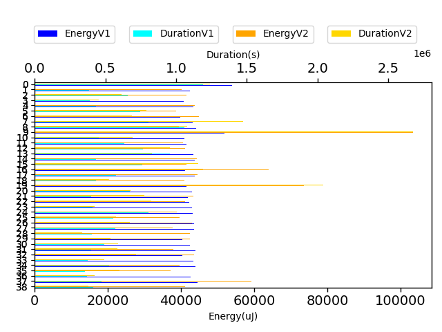

## com.google.gson.functional.VersioningTest

| Test | IterationV1 | IterationV2 | DeltaIteration |
| --- | --- | --- | --- |
| com.google.gson.functional.VersioningTest-testVersionedGsonMixingSinceAndUntilDeserialization | 31 | 35 | 4 |
| com.google.gson.functional.VersioningTest-testVersionedUntilSerialization | 96 | 97 | 1 |
| com.google.gson.functional.VersioningTest-testVersionedClassesSerialization | 57 | 57 | 0 |
| com.google.gson.functional.VersioningTest-testVersionedGsonMixingSinceAndUntilSerialization | 66 | 69 | 3 |
| com.google.gson.functional.VersioningTest-testIgnoreLaterVersionClassDeserialization | 11 | 14 | 3 |
| com.google.gson.functional.VersioningTest-testVersionedUntilDeserialization | 22 | 16 | -6 |
| com.google.gson.functional.VersioningTest-testVersionedClassesDeserialization | 32 | 31 | -1 |
| com.google.gson.functional.VersioningTest-testIgnoreLaterVersionClassSerialization | 43 | 47 | 4 |
| com.google.gson.functional.VersioningTest-testVersionedGsonWithUnversionedClassesDeserialization | 21 | 23 | 2 |
| com.google.gson.functional.VersioningTest-testVersionedGsonWithUnversionedClassesSerialization | 28 | 33 | 5 |

| Test | EnergyV1 | EnergyV2 | DeltaEnergy |
| --- | --- | --- | --- |
| com.google.gson.functional.VersioningTest-testVersionedGsonMixingSinceAndUntilDeserialization | 37681.95869022282 | 45390.77365276593 | 7708.814962543111 |
| com.google.gson.functional.VersioningTest-testVersionedUntilSerialization | 208794.77637808167 | 96544.78988786317 | -112249.9864902185 |
| com.google.gson.functional.VersioningTest-testVersionedClassesSerialization | 83330.88861044745 | 43128.00608807345 | -40202.882522374 |
| com.google.gson.functional.VersioningTest-testVersionedGsonMixingSinceAndUntilSerialization | 40526.289336893984 | 43219.96300873235 | 2693.673671838369 |
| com.google.gson.functional.VersioningTest-testIgnoreLaterVersionClassDeserialization | 40067.65966796875 | 44482.77551269531 | 4415.1158447265625 |
| com.google.gson.functional.VersioningTest-testVersionedUntilDeserialization | 42192.49549102783 | 40932.510681152344 | -1259.9848098754883 |
| com.google.gson.functional.VersioningTest-testVersionedClassesDeserialization | 41287.526436745655 | 42937.45455445256 | 1649.928117706906 |
| com.google.gson.functional.VersioningTest-testIgnoreLaterVersionClassSerialization | 43985.73275737473 | 44362.38630214377 | 376.6535447690403 |
| com.google.gson.functional.VersioningTest-testVersionedGsonWithUnversionedClassesDeserialization | 41339.44327926636 | 39563.431371450424 | -1776.0119078159332 |
| com.google.gson.functional.VersioningTest-testVersionedGsonWithUnversionedClassesSerialization | 41856.20366713405 | 39954.18559457455 | -1902.0180725594983 |

| Test | DurationV1 | DurationsV2 | DeltaDuration |
| --- | --- | --- | --- |
| com.google.gson.functional.VersioningTest-testVersionedGsonMixingSinceAndUntilDeserialization | 716337.8859313577 | 580552.4309231986 | -135785.45500815916 |
| com.google.gson.functional.VersioningTest-testVersionedUntilSerialization | 6005908.586717953 | 2274985.7592949783 | -3730922.8274229746 |
| com.google.gson.functional.VersioningTest-testVersionedClassesSerialization | 2196832.4920641873 | 798855.5125800294 | -1397976.9794841579 |
| com.google.gson.functional.VersioningTest-testVersionedGsonMixingSinceAndUntilSerialization | 819631.2093585928 | 900840.1420104837 | 81208.93265189091 |
| com.google.gson.functional.VersioningTest-testIgnoreLaterVersionClassDeserialization | 366089.4287109375 | 390808.27966308594 | 24718.850952148438 |
| com.google.gson.functional.VersioningTest-testVersionedUntilDeserialization | 814053.3355081081 | 420782.40841674805 | -393270.9270913601 |
| com.google.gson.functional.VersioningTest-testVersionedClassesDeserialization | 585591.964579327 | 554285.0773488735 | -31306.887230453547 |
| com.google.gson.functional.VersioningTest-testIgnoreLaterVersionClassSerialization | 623257.3780916617 | 664258.1654274461 | 41000.78733578441 |
| com.google.gson.functional.VersioningTest-testVersionedGsonWithUnversionedClassesDeserialization | 520378.0908308029 | 516433.424921751 | -3944.665909051895 |
| com.google.gson.functional.VersioningTest-testVersionedGsonWithUnversionedClassesSerialization | 784991.867932871 | 752088.4426421261 | -32903.42529074487 |

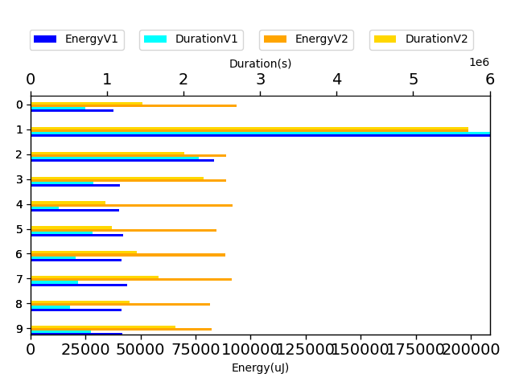

## com.google.gson.functional.JsonAdapterAnnotationOnFieldsTest

| Test | IterationV1 | IterationV2 | DeltaIteration |
| --- | --- | --- | --- |
| com.google.gson.functional.JsonAdapterAnnotationOnFieldsTest-testPrimitiveFieldAnnotationTakesPrecedenceOverDefault | 95 | 93 | -2 |
| com.google.gson.functional.JsonAdapterAnnotationOnFieldsTest-testClassAnnotationAdapterFactoryTakesPrecedenceOverDefault | 96 | 95 | -1 |
| com.google.gson.functional.JsonAdapterAnnotationOnFieldsTest-testClassAnnotationAdapterTakesPrecedenceOverDefault | 95 | 96 | 1 |
| com.google.gson.functional.JsonAdapterAnnotationOnFieldsTest-testFieldAnnotationWorksForParameterizedType | 92 | 90 | -2 |
| com.google.gson.functional.JsonAdapterAnnotationOnFieldsTest-testRegisteredTypeAdapterTakesPrecedenceOverClassAnnotationAdapter | 61 | 54 | -7 |
| com.google.gson.functional.JsonAdapterAnnotationOnFieldsTest-testFieldAnnotationTakesPrecedenceOverClassAnnotation | 70 | 71 | 1 |
| com.google.gson.functional.JsonAdapterAnnotationOnFieldsTest-testNonPrimitiveFieldAnnotationTakesPrecedenceOverDefault | 27 | 25 | -2 |
| com.google.gson.functional.JsonAdapterAnnotationOnFieldsTest-testFieldAnnotationTakesPrecedenceOverRegisteredTypeAdapter | 88 | 94 | 6 |
| com.google.gson.functional.JsonAdapterAnnotationOnFieldsTest-testJsonAdapterWrappedInNullSafeAsRequested | 56 | 48 | -8 |
| com.google.gson.functional.JsonAdapterAnnotationOnFieldsTest-testJsonAdapterInvokedOnlyForAnnotatedFields | 61 | 59 | -2 |

| Test | EnergyV1 | EnergyV2 | DeltaEnergy |
| --- | --- | --- | --- |
| com.google.gson.functional.JsonAdapterAnnotationOnFieldsTest-testPrimitiveFieldAnnotationTakesPrecedenceOverDefault | 69018.47196625968 | 43899.7754247481 | -25118.696541511577 |
| com.google.gson.functional.JsonAdapterAnnotationOnFieldsTest-testClassAnnotationAdapterFactoryTakesPrecedenceOverDefault | 64787.7908635633 | 62410.53681011492 | -2377.254053448378 |
| com.google.gson.functional.JsonAdapterAnnotationOnFieldsTest-testClassAnnotationAdapterTakesPrecedenceOverDefault | 43348.89851896106 | 97748.80845666613 | 54399.909937705066 |
| com.google.gson.functional.JsonAdapterAnnotationOnFieldsTest-testFieldAnnotationWorksForParameterizedType | 44314.13179737173 | 62811.555631752955 | 18497.423834381225 |
| com.google.gson.functional.JsonAdapterAnnotationOnFieldsTest-testRegisteredTypeAdapterTakesPrecedenceOverClassAnnotationAdapter | 42895.35846789216 | 41246.54817064278 | -1648.8102972493798 |
| com.google.gson.functional.JsonAdapterAnnotationOnFieldsTest-testFieldAnnotationTakesPrecedenceOverClassAnnotation | 41422.18696386212 | 41180.1249407318 | -242.06202313031827 |
| com.google.gson.functional.JsonAdapterAnnotationOnFieldsTest-testNonPrimitiveFieldAnnotationTakesPrecedenceOverDefault | 40777.19343248755 | 40138.74136555195 | -638.4520669355989 |
| com.google.gson.functional.JsonAdapterAnnotationOnFieldsTest-testFieldAnnotationTakesPrecedenceOverRegisteredTypeAdapter | 42027.2496540047 | 41679.05353857043 | -348.19611543427163 |
| com.google.gson.functional.JsonAdapterAnnotationOnFieldsTest-testJsonAdapterWrappedInNullSafeAsRequested | 42843.66777034226 | 43117.99837656836 | 274.3306062260963 |
| com.google.gson.functional.JsonAdapterAnnotationOnFieldsTest-testJsonAdapterInvokedOnlyForAnnotatedFields | 43954.21139606336 | 42366.38540008727 | -1587.8259959760908 |

| Test | DurationV1 | DurationsV2 | DeltaDuration |
| --- | --- | --- | --- |
| com.google.gson.functional.JsonAdapterAnnotationOnFieldsTest-testPrimitiveFieldAnnotationTakesPrecedenceOverDefault | 1722487.0678115222 | 1181245.4391659144 | -541241.6286456077 |
| com.google.gson.functional.JsonAdapterAnnotationOnFieldsTest-testClassAnnotationAdapterFactoryTakesPrecedenceOverDefault | 1400435.6679218546 | 1326599.5674751638 | -73836.1004466908 |
| com.google.gson.functional.JsonAdapterAnnotationOnFieldsTest-testClassAnnotationAdapterTakesPrecedenceOverDefault | 1334751.2855155065 | 2385319.130231299 | 1050567.8447157925 |
| com.google.gson.functional.JsonAdapterAnnotationOnFieldsTest-testFieldAnnotationWorksForParameterizedType | 1284065.204148747 | 1352080.6127800122 | 68015.40863126516 |
| com.google.gson.functional.JsonAdapterAnnotationOnFieldsTest-testRegisteredTypeAdapterTakesPrecedenceOverClassAnnotationAdapter | 861554.7153307092 | 797810.9706515011 | -63743.74467920815 |
| com.google.gson.functional.JsonAdapterAnnotationOnFieldsTest-testFieldAnnotationTakesPrecedenceOverClassAnnotation | 1066244.8651331924 | 955110.281413081 | -111134.5837201114 |
| com.google.gson.functional.JsonAdapterAnnotationOnFieldsTest-testNonPrimitiveFieldAnnotationTakesPrecedenceOverDefault | 364965.40958951414 | 473313.96274000406 | 108348.55315048993 |
| com.google.gson.functional.JsonAdapterAnnotationOnFieldsTest-testFieldAnnotationTakesPrecedenceOverRegisteredTypeAdapter | 1196224.3422930199 | 1207646.755100859 | 11422.412807839224 |
| com.google.gson.functional.JsonAdapterAnnotationOnFieldsTest-testJsonAdapterWrappedInNullSafeAsRequested | 690055.5278406639 | 841630.6250337804 | 151575.09719311644 |
| com.google.gson.functional.JsonAdapterAnnotationOnFieldsTest-testJsonAdapterInvokedOnlyForAnnotatedFields | 863952.7650101945 | 907215.9512149143 | 43263.18620471982 |

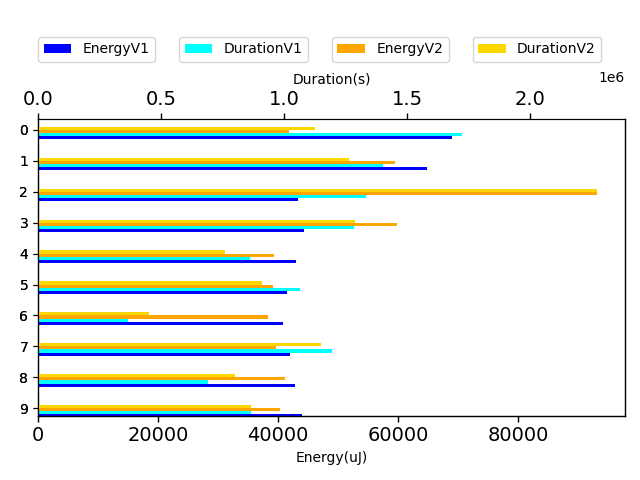

## com.google.gson.functional.SerializedNameTest

| Test | IterationV1 | IterationV2 | DeltaIteration |
| --- | --- | --- | --- |
| com.google.gson.functional.SerializedNameTest-testFirstNameIsChosenForSerialization | 72 | 77 | 5 |
| com.google.gson.functional.SerializedNameTest-testMultipleNamesInTheSameString | 21 | 21 | 0 |
| com.google.gson.functional.SerializedNameTest-testMultipleNamesDeserializedCorrectly | 44 | 36 | -8 |

| Test | EnergyV1 | EnergyV2 | DeltaEnergy |
| --- | --- | --- | --- |
| com.google.gson.functional.SerializedNameTest-testFirstNameIsChosenForSerialization | 44465.91795655458 | 58937.849106938906 | 14471.931150384327 |
| com.google.gson.functional.SerializedNameTest-testMultipleNamesInTheSameString | 40197.562229156494 | 41071.48847293854 | 873.9262437820435 |
| com.google.gson.functional.SerializedNameTest-testMultipleNamesDeserializedCorrectly | 46202.277309159675 | 45044.31743588489 | -1157.9598732747836 |

| Test | DurationV1 | DurationsV2 | DeltaDuration |
| --- | --- | --- | --- |
| com.google.gson.functional.SerializedNameTest-testFirstNameIsChosenForSerialization | 944266.2681631823 | 1266620.112084146 | 322353.8439209636 |
| com.google.gson.functional.SerializedNameTest-testMultipleNamesInTheSameString | 445190.8043909073 | 426861.6675004959 | -18329.136890411377 |
| com.google.gson.functional.SerializedNameTest-testMultipleNamesDeserializedCorrectly | 657392.8015463306 | 575692.4275869033 | -81700.37395942723 |

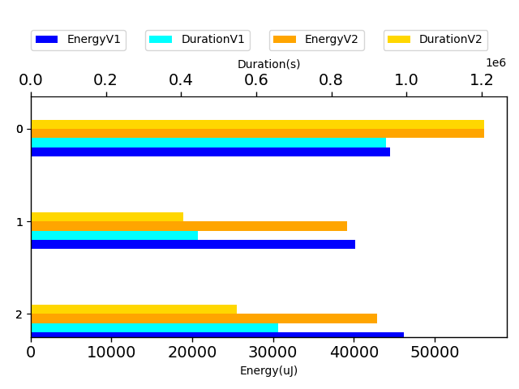

## com.google.gson.functional.EnumTest

| Test | IterationV1 | IterationV2 | DeltaIteration |
| --- | --- | --- | --- |
| com.google.gson.functional.EnumTest-testEnumCaseMapping | 58 | 63 | 5 |
| com.google.gson.functional.EnumTest-testEnumSubclass | 99 | 99 | 0 |
| com.google.gson.functional.EnumTest-testClassWithEnumFieldSerialization | 46 | 54 | 8 |
| com.google.gson.functional.EnumTest-testCollectionOfEnumsDeserialization | 50 | 50 | 0 |
| com.google.gson.functional.EnumTest-testEnumSet | 54 | 53 | -1 |
| com.google.gson.functional.EnumTest-testTopLevelEnumSerialization | 52 | 47 | -5 |
| com.google.gson.functional.EnumTest-testCollectionOfEnumsSerialization | 49 | 52 | 3 |
| com.google.gson.functional.EnumTest-testEnumSubclassAsParameterizedType | 45 | 52 | 7 |
| com.google.gson.functional.EnumTest-testEnumSubclassWithRegisteredTypeAdapter | 82 | 81 | -1 |
| com.google.gson.functional.EnumTest-testTopLevelEnumDeserialization | 16 | 12 | -4 |
| com.google.gson.functional.EnumTest-testClassWithEnumFieldDeserialization | 22 | 29 | 7 |

| Test | EnergyV1 | EnergyV2 | DeltaEnergy |
| --- | --- | --- | --- |
| com.google.gson.functional.EnumTest-testEnumCaseMapping | 42060.84905247518 | 49608.14149376544 | 7547.292441290258 |
| com.google.gson.functional.EnumTest-testEnumSubclass | 92988.39594241788 | 80157.29665692624 | -12831.09928549164 |
| com.google.gson.functional.EnumTest-testClassWithEnumFieldSerialization | 41973.18609764487 | 43040.18866556552 | 1067.0025679206447 |
| com.google.gson.functional.EnumTest-testCollectionOfEnumsDeserialization | 40956.605478830956 | 44251.6795928641 | 3295.0741140331447 |
| com.google.gson.functional.EnumTest-testEnumSet | 42146.32434907714 | 42686.61358581259 | 540.2892367354507 |
| com.google.gson.functional.EnumTest-testTopLevelEnumSerialization | 43058.95828875759 | 45185.44110895375 | 2126.4828201961645 |
| com.google.gson.functional.EnumTest-testCollectionOfEnumsSerialization | 49414.1943218853 | 42580.12463211687 | -6834.069689768425 |
| com.google.gson.functional.EnumTest-testEnumSubclassAsParameterizedType | 41720.2533398926 | 42467.79830552635 | 747.5449656337441 |
| com.google.gson.functional.EnumTest-testEnumSubclassWithRegisteredTypeAdapter | 50819.67583832404 | 42839.11754718176 | -7980.558291142275 |
| com.google.gson.functional.EnumTest-testTopLevelEnumDeserialization | 39998.215087890625 | 43414.0185546875 | 3415.803466796875 |
| com.google.gson.functional.EnumTest-testClassWithEnumFieldDeserialization | 43823.241951942444 | 43325.981982065365 | -497.25996987707913 |

| Test | DurationV1 | DurationsV2 | DeltaDuration |
| --- | --- | --- | --- |
| com.google.gson.functional.EnumTest-testEnumCaseMapping | 1705960.076000141 | 946770.6147476053 | -759189.4612525357 |
| com.google.gson.functional.EnumTest-testEnumSubclass | 2518413.1839144956 | 1983452.3817936573 | -534960.8021208383 |
| com.google.gson.functional.EnumTest-testClassWithEnumFieldSerialization | 731675.6716826883 | 604857.6000758382 | -126818.07160685014 |
| com.google.gson.functional.EnumTest-testCollectionOfEnumsDeserialization | 787864.3713112203 | 782183.3951882438 | -5680.976122976514 |
| com.google.gson.functional.EnumTest-testEnumSet | 896275.870495191 | 705834.4919692492 | -190441.37852594175 |
| com.google.gson.functional.EnumTest-testTopLevelEnumSerialization | 978669.4851902567 | 658451.5068795595 | -320217.97831069725 |
| com.google.gson.functional.EnumTest-testCollectionOfEnumsSerialization | 1111888.9751668053 | 717525.702502743 | -394363.27266406233 |
| com.google.gson.functional.EnumTest-testEnumSubclassAsParameterizedType | 735186.2075432657 | 694297.0123796917 | -40889.19516357395 |
| com.google.gson.functional.EnumTest-testEnumSubclassWithRegisteredTypeAdapter | 1486676.596595902 | 996354.5548442608 | -490322.0417516412 |
| com.google.gson.functional.EnumTest-testTopLevelEnumDeserialization | 386057.96490478516 | 432537.48974609375 | 46479.524841308594 |
| com.google.gson.functional.EnumTest-testClassWithEnumFieldDeserialization | 414070.32632255554 | 401706.0460532326 | -12364.280269322917 |

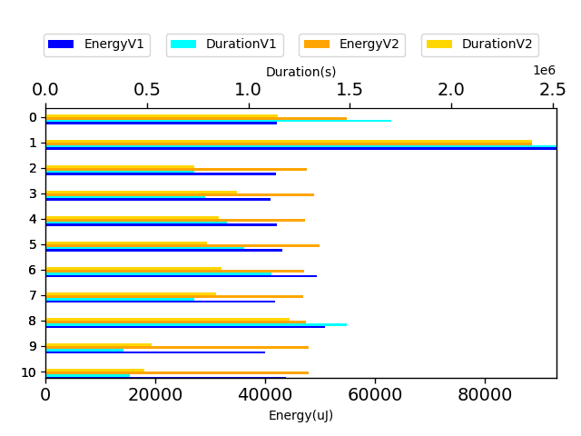

## com.google.gson.functional.TypeVariableTest

| Test | IterationV1 | IterationV2 | DeltaIteration |
| --- | --- | --- | --- |
| com.google.gson.functional.TypeVariableTest-testBasicTypeVariables | 50 | 53 | 3 |
| com.google.gson.functional.TypeVariableTest-testAdvancedTypeVariables | 97 | 98 | 1 |
| com.google.gson.functional.TypeVariableTest-testTypeVariablesViaTypeParameter | 72 | 75 | 3 |

| Test | EnergyV1 | EnergyV2 | DeltaEnergy |
| --- | --- | --- | --- |
| com.google.gson.functional.TypeVariableTest-testBasicTypeVariables | 42884.22575704484 | 43744.62561517064 | 860.3998581257983 |
| com.google.gson.functional.TypeVariableTest-testAdvancedTypeVariables | 62542.406541238284 | 76768.847016579 | 14226.440475340722 |
| com.google.gson.functional.TypeVariableTest-testTypeVariablesViaTypeParameter | 47753.4548500848 | 62801.75789952926 | 15048.303049444454 |

| Test | DurationV1 | DurationsV2 | DeltaDuration |
| --- | --- | --- | --- |
| com.google.gson.functional.TypeVariableTest-testBasicTypeVariables | 846203.463541569 | 638959.0436839184 | -207244.41985765053 |
| com.google.gson.functional.TypeVariableTest-testAdvancedTypeVariables | 1497011.7157915458 | 1799639.2398174105 | 302627.52402586467 |
| com.google.gson.functional.TypeVariableTest-testTypeVariablesViaTypeParameter | 1035851.1775347607 | 1375230.4232011684 | 339379.24566640775 |

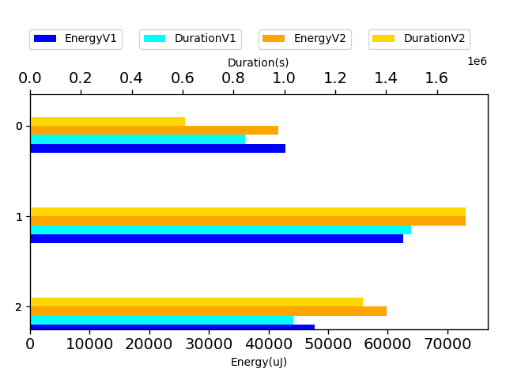

## com.google.gson.functional.JavaUtilConcurrentAtomicTest

| Test | IterationV1 | IterationV2 | DeltaIteration |
| --- | --- | --- | --- |
| com.google.gson.functional.JavaUtilConcurrentAtomicTest-testAtomicLongArray | 89 | 89 | 0 |
| com.google.gson.functional.JavaUtilConcurrentAtomicTest-testAtomicIntegerArray | 88 | 87 | -1 |
| com.google.gson.functional.JavaUtilConcurrentAtomicTest-testAtomicLong | 13 | 17 | 4 |
| com.google.gson.functional.JavaUtilConcurrentAtomicTest-testAtomicInteger | 13 | 19 | 6 |
| com.google.gson.functional.JavaUtilConcurrentAtomicTest-testAtomicLongWithStringSerializationPolicy | 57 | 42 | -15 |
| com.google.gson.functional.JavaUtilConcurrentAtomicTest-testAtomicLongArrayWithStringSerializationPolicy | 11 | 23 | 12 |
| com.google.gson.functional.JavaUtilConcurrentAtomicTest-testAtomicBoolean | 25 | 19 | -6 |

| Test | EnergyV1 | EnergyV2 | DeltaEnergy |
| --- | --- | --- | --- |
| com.google.gson.functional.JavaUtilConcurrentAtomicTest-testAtomicLongArray | 44929.016067467535 | 44099.4208846839 | -829.5951827836325 |
| com.google.gson.functional.JavaUtilConcurrentAtomicTest-testAtomicIntegerArray | 43962.60266813412 | 42857.16358801643 | -1105.439080117685 |
| com.google.gson.functional.JavaUtilConcurrentAtomicTest-testAtomicLong | 44381.61572265625 | 43348.2254486084 | -1033.3902740478516 |
| com.google.gson.functional.JavaUtilConcurrentAtomicTest-testAtomicInteger | 42198.37939453125 | 43265.57922363281 | 1067.1998291015625 |
| com.google.gson.functional.JavaUtilConcurrentAtomicTest-testAtomicLongWithStringSerializationPolicy | 43268.10516786381 | 45803.24735211301 | 2535.142184249198 |
| com.google.gson.functional.JavaUtilConcurrentAtomicTest-testAtomicLongArrayWithStringSerializationPolicy | 44911.15625 | 40069.13267850876 | -4842.0235714912415 |
| com.google.gson.functional.JavaUtilConcurrentAtomicTest-testAtomicBoolean | 47600.43372195959 | 46333.33145904541 | -1267.1022629141808 |

| Test | DurationV1 | DurationsV2 | DeltaDuration |
| --- | --- | --- | --- |
| com.google.gson.functional.JavaUtilConcurrentAtomicTest-testAtomicLongArray | 1022815.0420114109 | 1233988.8978486233 | 211173.8558372124 |
| com.google.gson.functional.JavaUtilConcurrentAtomicTest-testAtomicIntegerArray | 1088961.3823195603 | 1191065.576041013 | 102104.19372145273 |
| com.google.gson.functional.JavaUtilConcurrentAtomicTest-testAtomicLong | 344394.20361328125 | 458615.10137939453 | 114220.89776611328 |
| com.google.gson.functional.JavaUtilConcurrentAtomicTest-testAtomicInteger | 502445.0646972656 | 330833.7846508026 | -171611.280046463 |
| com.google.gson.functional.JavaUtilConcurrentAtomicTest-testAtomicLongWithStringSerializationPolicy | 662960.6868619507 | 878705.3409612263 | 215744.6540992756 |
| com.google.gson.functional.JavaUtilConcurrentAtomicTest-testAtomicLongArrayWithStringSerializationPolicy | 395296.0166015625 | 374833.9750061035 | -20462.041595458984 |
| com.google.gson.functional.JavaUtilConcurrentAtomicTest-testAtomicBoolean | 575702.272677064 | 590924.5267372131 | 15222.254060149193 |

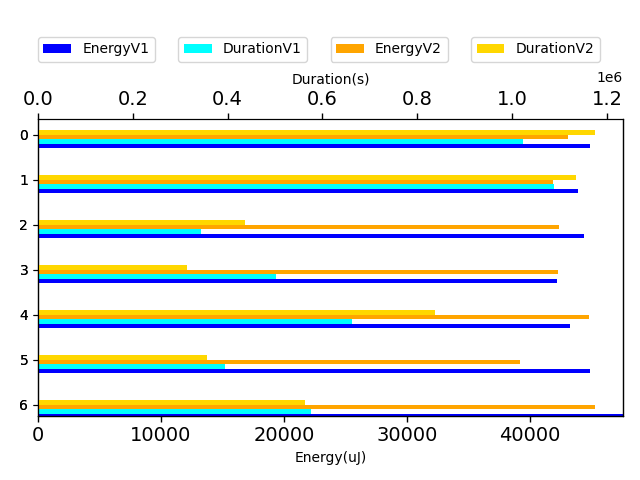

## com.google.gson.functional.RuntimeTypeAdapterFactoryFunctionalTest

| Test | IterationV1 | IterationV2 | DeltaIteration |
| --- | --- | --- | --- |
| com.google.gson.functional.RuntimeTypeAdapterFactoryFunctionalTest-testSubclassesAutomaticallySerialized | 99 | 99 | 0 |

| Test | EnergyV1 | EnergyV2 | DeltaEnergy |
| --- | --- | --- | --- |
| com.google.gson.functional.RuntimeTypeAdapterFactoryFunctionalTest-testSubclassesAutomaticallySerialized | 354849.6760332772 | 108334.14690492375 | -246515.52912835343 |

| Test | DurationV1 | DurationsV2 | DeltaDuration |
| --- | --- | --- | --- |
| com.google.gson.functional.RuntimeTypeAdapterFactoryFunctionalTest-testSubclassesAutomaticallySerialized | 10913549.40728837 | 2642842.4444500124 | -8270706.962838358 |

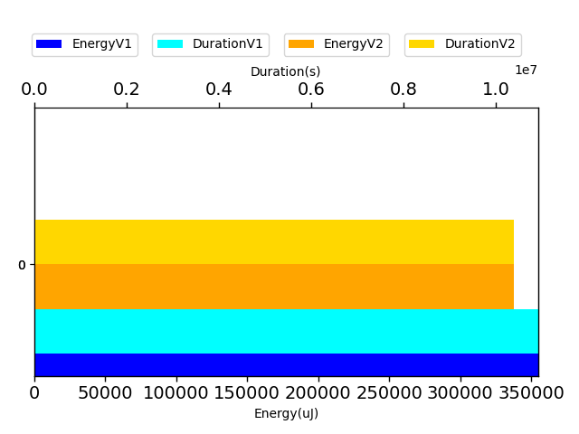

## com.google.gson.LongSerializationPolicyTest

| Test | IterationV1 | IterationV2 | DeltaIteration |
| --- | --- | --- | --- |
| com.google.gson.LongSerializationPolicyTest-testStringLongSerializationIntegration | 23 | 18 | -5 |
| com.google.gson.LongSerializationPolicyTest-testDefaultLongSerializationIntegration | 26 | 22 | -4 |

| Test | EnergyV1 | EnergyV2 | DeltaEnergy |
| --- | --- | --- | --- |
| com.google.gson.LongSerializationPolicyTest-testStringLongSerializationIntegration | 44597.33878171444 | 41017.83472442627 | -3579.50405728817 |
| com.google.gson.LongSerializationPolicyTest-testDefaultLongSerializationIntegration | 42321.9929009676 | 38549.685156583786 | -3772.307744383812 |

| Test | DurationV1 | DurationsV2 | DeltaDuration |
| --- | --- | --- | --- |
| com.google.gson.LongSerializationPolicyTest-testStringLongSerializationIntegration | 511074.7556107044 | 569439.9154586792 | 58365.15984797478 |
| com.google.gson.LongSerializationPolicyTest-testDefaultLongSerializationIntegration | 665616.8583827019 | 827849.9897766113 | 162233.13139390945 |

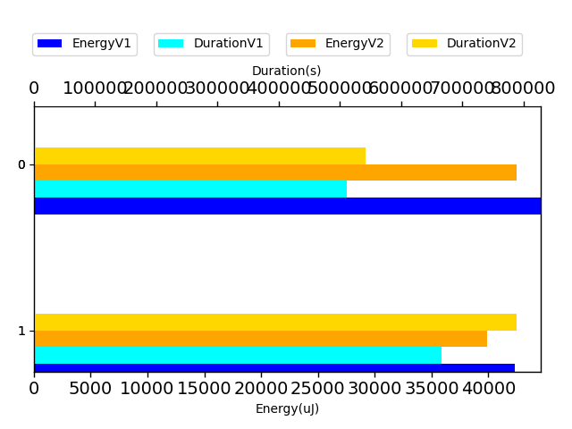

## com.google.gson.functional.ConcurrencyTest

| Test | IterationV1 | IterationV2 | DeltaIteration |
| --- | --- | --- | --- |
| com.google.gson.functional.ConcurrencyTest-testSingleThreadSerialization | 45 | 60 | 15 |
| com.google.gson.functional.ConcurrencyTest-testMultiThreadSerialization | 99 | 99 | 0 |
| com.google.gson.functional.ConcurrencyTest-testMultiThreadDeserialization | 99 | 99 | 0 |
| com.google.gson.functional.ConcurrencyTest-testSingleThreadDeserialization | 37 | 40 | 3 |

| Test | EnergyV1 | EnergyV2 | DeltaEnergy |
| --- | --- | --- | --- |
| com.google.gson.functional.ConcurrencyTest-testSingleThreadSerialization | 44749.21748503235 | 41709.61938612142 | -3039.5980989109303 |
| com.google.gson.functional.ConcurrencyTest-testMultiThreadSerialization | 367226.7547332096 | 289388.0649149051 | -77838.6898183045 |
| com.google.gson.functional.ConcurrencyTest-testMultiThreadDeserialization | 336308.05917840905 | 366210.3537449212 | 29902.294566512166 |
| com.google.gson.functional.ConcurrencyTest-testSingleThreadDeserialization | 45167.59143596361 | 41158.79721439612 | -4008.794221567485 |

| Test | DurationV1 | DurationsV2 | DeltaDuration |
| --- | --- | --- | --- |
| com.google.gson.functional.ConcurrencyTest-testSingleThreadSerialization | 816043.5006931414 | 936099.164219776 | 120055.66352663469 |
| com.google.gson.functional.ConcurrencyTest-testMultiThreadSerialization | 8801332.302266717 | 8112824.950837749 | -688507.3514289679 |
| com.google.gson.functional.ConcurrencyTest-testMultiThreadDeserialization | 8450541.6552032 | 9452735.044753227 | 1002193.3895500265 |
| com.google.gson.functional.ConcurrencyTest-testSingleThreadDeserialization | 657833.6422346628 | 695738.2933196046 | 37904.65108494181 |

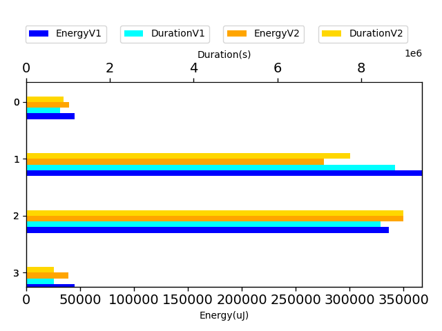

## com.google.gson.functional.ArrayTest

| Test | IterationV1 | IterationV2 | DeltaIteration |
| --- | --- | --- | --- |
| com.google.gson.functional.ArrayTest-testMixingTypesInObjectArraySerialization | 20 | 11 | -9 |
| com.google.gson.functional.ArrayTest-testSingleNullInArrayDeserialization | 14 | 20 | 6 |
| com.google.gson.functional.ArrayTest-testNullsInArrayWithSerializeNullPropertySetSerialization | 21 | 15 | -6 |
| com.google.gson.functional.ArrayTest-testMultidimenstionalArraysDeserialization | 15 | 13 | -2 |
| com.google.gson.functional.ArrayTest-testInvalidArrayDeserialization | 36 | 23 | -13 |
| com.google.gson.functional.ArrayTest-testMultidimenstionalArraysSerialization | 14 | 21 | 7 |
| com.google.gson.functional.ArrayTest-testArrayOfCollectionSerialization | 70 | 70 | 0 |
| com.google.gson.functional.ArrayTest-testArrayOfPrimitivesAsObjectsSerialization | 22 | 33 | 11 |
| com.google.gson.functional.ArrayTest-testArrayElementsAreArrays | 13 | 11 | -2 |
| com.google.gson.functional.ArrayTest-testNullsInArraySerialization | 19 | 16 | -3 |
| com.google.gson.functional.ArrayTest-testArrayOfPrimitivesAsObjectsDeserialization | 47 | 39 | -8 |
| com.google.gson.functional.ArrayTest-testArrayOfCollectionDeserialization | 54 | 46 | -8 |
| com.google.gson.functional.ArrayTest-testSingleNullInArraySerialization | 27 | 19 | -8 |
| com.google.gson.functional.ArrayTest-testObjectArrayWithNonPrimitivesSerialization | 43 | 35 | -8 |
| com.google.gson.functional.ArrayTest-testArrayOfStringsSerialization | 11 | 17 | 6 |
| com.google.gson.functional.ArrayTest-testTopLevelArrayOfIntsDeserialization | 30 | 29 | -1 |
| com.google.gson.functional.ArrayTest-testArrayOfNullSerialization | 13 | 14 | 1 |
| com.google.gson.functional.ArrayTest-testSingleStringArrayDeserialization | 18 | 13 | -5 |
| com.google.gson.functional.ArrayTest-testTopLevelArrayOfIntsSerialization | 19 | 25 | 6 |
| com.google.gson.functional.ArrayTest-testSingleStringArraySerialization | 15 | 14 | -1 |
| com.google.gson.functional.ArrayTest-testEmptyArraySerialization | 17 | 7 | -10 |
| com.google.gson.functional.ArrayTest-testArrayOfStringsDeserialization | 11 | 9 | -2 |
| com.google.gson.functional.ArrayTest-testArrayOfNullDeserialization | 19 | 12 | -7 |
| com.google.gson.functional.ArrayTest-testEmptyArrayDeserialization | 17 | 19 | 2 |
| com.google.gson.functional.ArrayTest-testMultiDimenstionalObjectArraysSerialization | 16 | 25 | 9 |
| com.google.gson.functional.ArrayTest-testNullsInArrayDeserialization | 15 | 14 | -1 |

| Test | EnergyV1 | EnergyV2 | DeltaEnergy |
| --- | --- | --- | --- |
| com.google.gson.functional.ArrayTest-testMixingTypesInObjectArraySerialization | 41957.306027412415 | 39641.1240234375 | -2316.1820039749146 |
| com.google.gson.functional.ArrayTest-testSingleNullInArrayDeserialization | 37906.621337890625 | 40136.8996887207 | 2230.278350830078 |
| com.google.gson.functional.ArrayTest-testNullsInArrayWithSerializeNullPropertySetSerialization | 46336.64590740204 | 41806.02404785156 | -4530.621859550476 |
| com.google.gson.functional.ArrayTest-testMultidimenstionalArraysDeserialization | 40412.10513305664 | 41821.650146484375 | 1409.5450134277344 |
| com.google.gson.functional.ArrayTest-testInvalidArrayDeserialization | 43400.35876387595 | 41934.00101685524 | -1466.3577470207092 |
| com.google.gson.functional.ArrayTest-testMultidimenstionalArraysSerialization | 41370.20739746094 | 40231.064091682434 | -1139.1433057785034 |
| com.google.gson.functional.ArrayTest-testArrayOfCollectionSerialization | 44798.14506272433 | 44867.36787507878 | 69.22281235444825 |
| com.google.gson.functional.ArrayTest-testArrayOfPrimitivesAsObjectsSerialization | 51154.212158203125 | 51209.91289446829 | 55.70073626516387 |
| com.google.gson.functional.ArrayTest-testArrayElementsAreArrays | 40817.049560546875 | 43332.37109375 | 2515.321533203125 |
| com.google.gson.functional.ArrayTest-testNullsInArraySerialization | 42670.35914230347 | 40815.05828857422 | -1855.300853729248 |
| com.google.gson.functional.ArrayTest-testArrayOfPrimitivesAsObjectsDeserialization | 49718.27162807598 | 67049.94838555623 | 17331.67675748025 |
| com.google.gson.functional.ArrayTest-testArrayOfCollectionDeserialization | 42812.88253492199 | 44030.74057207486 | 1217.858037152866 |
| com.google.gson.functional.ArrayTest-testSingleNullInArraySerialization | 45137.212268546224 | 39252.49580383301 | -5884.716464713216 |
| com.google.gson.functional.ArrayTest-testObjectArrayWithNonPrimitivesSerialization | 40512.48162935524 | 40510.05951372121 | -2.4221156340354355 |
| com.google.gson.functional.ArrayTest-testArrayOfStringsSerialization | 43878.857421875 | 37412.19645690918 | -6466.66096496582 |
| com.google.gson.functional.ArrayTest-testTopLevelArrayOfIntsDeserialization | 62091.69760798477 | 47241.921798642725 | -14849.775809342042 |
| com.google.gson.functional.ArrayTest-testArrayOfNullSerialization | 43955.176025390625 | 43205.89758300781 | -749.2784423828125 |
| com.google.gson.functional.ArrayTest-testSingleStringArrayDeserialization | 41433.592361450195 | 40324.04016113281 | -1109.5522003173828 |
| com.google.gson.functional.ArrayTest-testTopLevelArrayOfIntsSerialization | 42188.501403808594 | 58358.90054088831 | 16170.399137079716 |
| com.google.gson.functional.ArrayTest-testSingleStringArraySerialization | 40768.224182128906 | 40389.226806640625 | -378.99737548828125 |
| com.google.gson.functional.ArrayTest-testEmptyArraySerialization | 43427.8907623291 | 40097.28125 | -3330.6095123291016 |
| com.google.gson.functional.ArrayTest-testArrayOfStringsDeserialization | 42616.224609375 | 39819.7578125 | -2796.466796875 |
| com.google.gson.functional.ArrayTest-testArrayOfNullDeserialization | 43730.37874984741 | 41539.611328125 | -2190.767421722412 |
| com.google.gson.functional.ArrayTest-testEmptyArrayDeserialization | 38615.519775390625 | 43264.450580596924 | 4648.930805206299 |
| com.google.gson.functional.ArrayTest-testMultiDimenstionalObjectArraysSerialization | 41305.41638183594 | 40184.047522723675 | -1121.3688591122627 |
| com.google.gson.functional.ArrayTest-testNullsInArrayDeserialization | 41239.211364746094 | 40158.9736328125 | -1080.2377319335938 |

| Test | DurationV1 | DurationsV2 | DeltaDuration |
| --- | --- | --- | --- |
| com.google.gson.functional.ArrayTest-testMixingTypesInObjectArraySerialization | 323572.76065540314 | 275309.0703125 | -48263.69034290314 |
| com.google.gson.functional.ArrayTest-testSingleNullInArrayDeserialization | 760636.2880859375 | 454559.23469924927 | -306077.05338668823 |
| com.google.gson.functional.ArrayTest-testNullsInArrayWithSerializeNullPropertySetSerialization | 455069.40694093704 | 371983.78399658203 | -83085.62294435501 |
| com.google.gson.functional.ArrayTest-testMultidimenstionalArraysDeserialization | 326186.9157409668 | 373412.5075683594 | 47225.59182739258 |
| com.google.gson.functional.ArrayTest-testInvalidArrayDeserialization | 478183.29610404547 | 517112.96437835693 | 38929.668274311465 |
| com.google.gson.functional.ArrayTest-testMultidimenstionalArraysSerialization | 332925.1569824219 | 520443.4370546341 | 187518.28007221222 |
| com.google.gson.functional.ArrayTest-testArrayOfCollectionSerialization | 1031550.134540769 | 993226.0664458962 | -38324.06809487287 |
| com.google.gson.functional.ArrayTest-testArrayOfPrimitivesAsObjectsSerialization | 864622.0340185165 | 626340.6632845742 | -238281.37073394237 |
| com.google.gson.functional.ArrayTest-testArrayElementsAreArrays | 311312.74365234375 | 463404.2724609375 | 152091.52880859375 |
| com.google.gson.functional.ArrayTest-testNullsInArraySerialization | 345209.3832206726 | 373855.17657470703 | 28645.793354034424 |
| com.google.gson.functional.ArrayTest-testArrayOfPrimitivesAsObjectsDeserialization | 1379636.6092593966 | 1444502.4627035519 | 64865.853444155306 |
| com.google.gson.functional.ArrayTest-testArrayOfCollectionDeserialization | 771466.034073657 | 716624.3075994698 | -54841.72647418722 |
| com.google.gson.functional.ArrayTest-testSingleNullInArraySerialization | 399427.0854329318 | 845474.1877098083 | 446047.10227687657 |
| com.google.gson.functional.ArrayTest-testObjectArrayWithNonPrimitivesSerialization | 523573.7172488112 | 847653.9858191027 | 324080.2685702915 |
| com.google.gson.functional.ArrayTest-testArrayOfStringsSerialization | 295638.328125 | 506730.42753601074 | 211092.09941101074 |
| com.google.gson.functional.ArrayTest-testTopLevelArrayOfIntsDeserialization | 1208298.38539958 | 656140.7899007406 | -552157.5954988394 |
| com.google.gson.functional.ArrayTest-testArrayOfNullSerialization | 317662.85205078125 | 296378.1484375 | -21284.70361328125 |
| com.google.gson.functional.ArrayTest-testSingleStringArrayDeserialization | 341434.76637268066 | 330378.03454589844 | -11056.731826782227 |
| com.google.gson.functional.ArrayTest-testTopLevelArrayOfIntsSerialization | 383167.91036987305 | 1567762.434052229 | 1184594.5236823559 |
| com.google.gson.functional.ArrayTest-testSingleStringArraySerialization | 452782.1124267578 | 296633.6387939453 | -156148.4736328125 |
| com.google.gson.functional.ArrayTest-testEmptyArraySerialization | 304588.3843536377 | 463285.03125 | 158696.6468963623 |
| com.google.gson.functional.ArrayTest-testArrayOfStringsDeserialization | 344383.884765625 | 327017.4453125 | -17366.439453125 |
| com.google.gson.functional.ArrayTest-testArrayOfNullDeserialization | 446231.3002586365 | 383598.86083984375 | -62632.439418792725 |
| com.google.gson.functional.ArrayTest-testEmptyArrayDeserialization | 273462.4308319092 | 398310.7238407135 | 124848.29300880432 |
| com.google.gson.functional.ArrayTest-testMultiDimenstionalObjectArraysSerialization | 293520.3989562988 | 365312.92421519756 | 71792.52525889874 |
| com.google.gson.functional.ArrayTest-testNullsInArrayDeserialization | 533271.6285400391 | 497263.49169921875 | -36008.13684082031 |

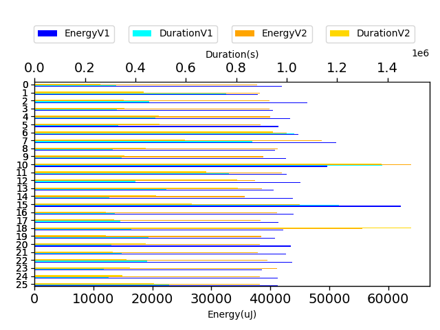

## com.google.gson.functional.FieldNamingTest

| Test | IterationV1 | IterationV2 | DeltaIteration |
| --- | --- | --- | --- |
| com.google.gson.functional.FieldNamingTest-testIdentity | 78 | 81 | 3 |
| com.google.gson.functional.FieldNamingTest-testUpperCamelCase | 34 | 31 | -3 |
| com.google.gson.functional.FieldNamingTest-testUpperCamelCaseWithSpaces | 30 | 31 | 1 |
| com.google.gson.functional.FieldNamingTest-testLowerCaseWithUnderscores | 31 | 26 | -5 |
| com.google.gson.functional.FieldNamingTest-testLowerCaseWithDashes | 33 | 28 | -5 |

| Test | EnergyV1 | EnergyV2 | DeltaEnergy |
| --- | --- | --- | --- |
| com.google.gson.functional.FieldNamingTest-testIdentity | 45911.43904453803 | 625637.8233984781 | 579726.38435394 |
| com.google.gson.functional.FieldNamingTest-testUpperCamelCase | 43343.16039498756 | 40355.24607712915 | -2987.9143178584054 |
| com.google.gson.functional.FieldNamingTest-testUpperCamelCaseWithSpaces | 42750.25486346893 | 41252.57523021381 | -1497.6796332551166 |
| com.google.gson.functional.FieldNamingTest-testLowerCaseWithUnderscores | 42865.39631120488 | 42845.47876369953 | -19.91754750534892 |
| com.google.gson.functional.FieldNamingTest-testLowerCaseWithDashes | 43801.21045362111 | 42152.9578942582 | -1648.2525593629107 |

| Test | DurationV1 | DurationsV2 | DeltaDuration |
| --- | --- | --- | --- |
| com.google.gson.functional.FieldNamingTest-testIdentity | 1386057.5991272265 | 18840418.508068085 | 17454360.90894086 |
| com.google.gson.functional.FieldNamingTest-testUpperCamelCase | 483277.39565992093 | 902491.1855055019 | 419213.789845581 |
| com.google.gson.functional.FieldNamingTest-testUpperCamelCaseWithSpaces | 553176.16803532 | 918874.5947171673 | 365698.4266818473 |
| com.google.gson.functional.FieldNamingTest-testLowerCaseWithUnderscores | 554800.2378811995 | 545104.918597728 | -9695.319283471443 |
| com.google.gson.functional.FieldNamingTest-testLowerCaseWithDashes | 490586.7232272548 | 868407.8794101924 | 377821.15618293756 |

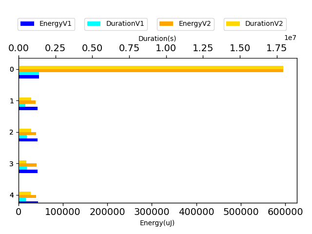

## com.google.gson.functional.RawSerializationTest

| Test | IterationV1 | IterationV2 | DeltaIteration |
| --- | --- | --- | --- |
| com.google.gson.functional.RawSerializationTest-testThreeLevelParameterizedObject | 68 | 74 | 6 |
| com.google.gson.functional.RawSerializationTest-testParameterizedObject | 82 | 82 | 0 |
| com.google.gson.functional.RawSerializationTest-testCollectionOfObjects | 55 | 53 | -2 |
| com.google.gson.functional.RawSerializationTest-testTwoLevelParameterizedObject | 70 | 74 | 4 |
| com.google.gson.functional.RawSerializationTest-testCollectionOfPrimitives | 27 | 22 | -5 |

| Test | EnergyV1 | EnergyV2 | DeltaEnergy |
| --- | --- | --- | --- |
| com.google.gson.functional.RawSerializationTest-testThreeLevelParameterizedObject | 41387.15188121012 | 55979.489223965116 | 14592.337342754996 |
| com.google.gson.functional.RawSerializationTest-testParameterizedObject | 42776.10633592326 | 48155.13090240155 | 5379.024566478292 |
| com.google.gson.functional.RawSerializationTest-testCollectionOfObjects | 42411.78320339123 | 66636.91553525234 | 24225.13233186111 |
| com.google.gson.functional.RawSerializationTest-testTwoLevelParameterizedObject | 45373.420240048705 | 41879.54823599463 | -3493.872004054072 |
| com.google.gson.functional.RawSerializationTest-testCollectionOfPrimitives | 40548.47165840864 | 54921.219876766205 | 14372.748218357563 |

| Test | DurationV1 | DurationsV2 | DeltaDuration |
| --- | --- | --- | --- |
| com.google.gson.functional.RawSerializationTest-testThreeLevelParameterizedObject | 799211.0852395643 | 1013299.4062797741 | 214088.32104020985 |
| com.google.gson.functional.RawSerializationTest-testParameterizedObject | 955622.0420239385 | 1177600.0740698786 | 221978.03204594005 |
| com.google.gson.functional.RawSerializationTest-testCollectionOfObjects | 652870.7371162926 | 1871987.6332067589 | 1219116.8960904663 |
| com.google.gson.functional.RawSerializationTest-testTwoLevelParameterizedObject | 767877.1425087717 | 1073067.249377918 | 305190.1068691462 |
| com.google.gson.functional.RawSerializationTest-testCollectionOfPrimitives | 653243.574116677 | 1353082.6048207283 | 699839.0307040513 |

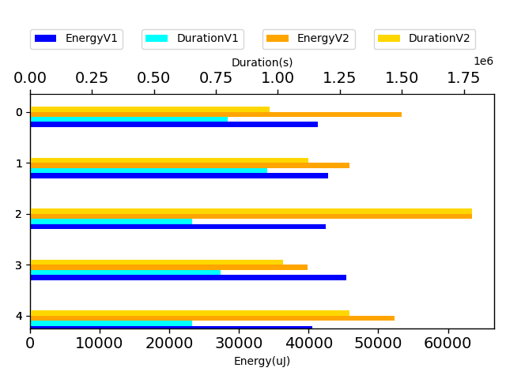

## com.google.gson.functional.MapAsArrayTypeAdapterTest

| Test | IterationV1 | IterationV2 | DeltaIteration |
| --- | --- | --- | --- |
| com.google.gson.functional.MapAsArrayTypeAdapterTest-testMapWithTypeVariableDeserialization | 64 | 55 | -9 |
| com.google.gson.functional.MapAsArrayTypeAdapterTest-testSerializeComplexMapWithTypeAdapter | 99 | 99 | 0 |
| com.google.gson.functional.MapAsArrayTypeAdapterTest-testMapWithTypeVariableSerialization | 78 | 79 | 1 |
| com.google.gson.functional.MapAsArrayTypeAdapterTest-testMultipleEnableComplexKeyRegistrationHasNoEffect | 56 | 61 | 5 |
| com.google.gson.functional.MapAsArrayTypeAdapterTest-testTwoTypesCollapseToOneDeserialize | 51 | 55 | 4 |

| Test | EnergyV1 | EnergyV2 | DeltaEnergy |
| --- | --- | --- | --- |
| com.google.gson.functional.MapAsArrayTypeAdapterTest-testMapWithTypeVariableDeserialization | 43826.31267776499 | 41455.70325325423 | -2370.6094245107597 |
| com.google.gson.functional.MapAsArrayTypeAdapterTest-testSerializeComplexMapWithTypeAdapter | 101387.382533636 | 162056.08703264786 | 60668.70449901186 |
| com.google.gson.functional.MapAsArrayTypeAdapterTest-testMapWithTypeVariableSerialization | 44376.13921756328 | 67815.79856890795 | 23439.65935134467 |
| com.google.gson.functional.MapAsArrayTypeAdapterTest-testMultipleEnableComplexKeyRegistrationHasNoEffect | 44440.09910503475 | 42251.840106330725 | -2188.2589987040265 |
| com.google.gson.functional.MapAsArrayTypeAdapterTest-testTwoTypesCollapseToOneDeserialize | 68210.7206570073 | 48337.29620150232 | -19873.42445550498 |

| Test | DurationV1 | DurationsV2 | DeltaDuration |
| --- | --- | --- | --- |
| com.google.gson.functional.MapAsArrayTypeAdapterTest-testMapWithTypeVariableDeserialization | 890045.7149735483 | 961302.6563214273 | 71256.94134787901 |
| com.google.gson.functional.MapAsArrayTypeAdapterTest-testSerializeComplexMapWithTypeAdapter | 2728792.6780633014 | 4934066.599794549 | 2205273.9217312476 |
| com.google.gson.functional.MapAsArrayTypeAdapterTest-testMapWithTypeVariableSerialization | 1063091.2592657143 | 1671902.1803269563 | 608810.921061242 |
| com.google.gson.functional.MapAsArrayTypeAdapterTest-testMultipleEnableComplexKeyRegistrationHasNoEffect | 935697.049210158 | 1018118.4249571312 | 82421.37574697321 |
| com.google.gson.functional.MapAsArrayTypeAdapterTest-testTwoTypesCollapseToOneDeserialize | 1767297.102131993 | 1102698.6906192533 | -664598.4115127397 |

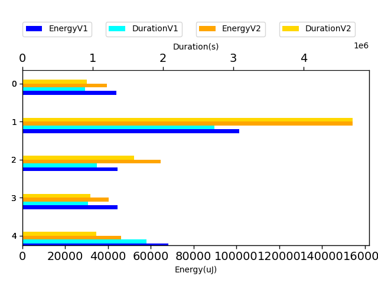

## com.google.gson.JavaSerializationTest

| Test | IterationV1 | IterationV2 | DeltaIteration |
| --- | --- | --- | --- |
| com.google.gson.JavaSerializationTest-testMapIsSerializable | 99 | 99 | 0 |
| com.google.gson.JavaSerializationTest-testNumberIsSerializable | 99 | 99 | 0 |
| com.google.gson.JavaSerializationTest-testListIsSerializable | 99 | 99 | 0 |

| Test | EnergyV1 | EnergyV2 | DeltaEnergy |
| --- | --- | --- | --- |
| com.google.gson.JavaSerializationTest-testMapIsSerializable | 438390.5893717342 | 366646.5494373173 | -71744.03993441688 |
| com.google.gson.JavaSerializationTest-testNumberIsSerializable | 505484.79667484027 | 431385.2427126049 | -74099.5539622354 |
| com.google.gson.JavaSerializationTest-testListIsSerializable | 85135.02584670919 | 68410.29959906788 | -16724.726247641316 |

| Test | DurationV1 | DurationsV2 | DeltaDuration |
| --- | --- | --- | --- |
| com.google.gson.JavaSerializationTest-testMapIsSerializable | 9942680.513656316 | 9279672.919442374 | -663007.5942139421 |
| com.google.gson.JavaSerializationTest-testNumberIsSerializable | 12088734.904801408 | 11749609.860209193 | -339125.04459221475 |
| com.google.gson.JavaSerializationTest-testListIsSerializable | 1912175.0541825474 | 1820094.9235673025 | -92080.13061524485 |

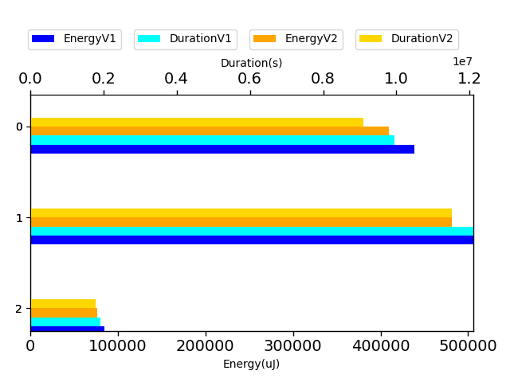

## com.google.gson.functional.UncategorizedTest

| Test | IterationV1 | IterationV2 | DeltaIteration |
| --- | --- | --- | --- |
| com.google.gson.functional.UncategorizedTest-testTrailingWhitespace | 41 | 51 | 10 |
| com.google.gson.functional.UncategorizedTest-testInvalidJsonDeserializationFails | 43 | 44 | 1 |
| com.google.gson.functional.UncategorizedTest-testReturningDerivedClassesDuringDeserialization | 99 | 99 | 0 |
| com.google.gson.functional.UncategorizedTest-testObjectEqualButNotSameSerialization | 31 | 28 | -3 |
| com.google.gson.functional.UncategorizedTest-testGsonInstanceReusableForSerializationAndDeserialization | 29 | 27 | -2 |
| com.google.gson.functional.UncategorizedTest-testStaticFieldsAreNotSerialized | 23 | 32 | 9 |

| Test | EnergyV1 | EnergyV2 | DeltaEnergy |
| --- | --- | --- | --- |
| com.google.gson.functional.UncategorizedTest-testTrailingWhitespace | 41253.99716618467 | 42497.305907543785 | 1243.308741359113 |
| com.google.gson.functional.UncategorizedTest-testInvalidJsonDeserializationFails | 46947.110079963146 | 46122.64212260708 | -824.4679573560643 |
| com.google.gson.functional.UncategorizedTest-testReturningDerivedClassesDuringDeserialization | 59520.94867351556 | 47052.76603548672 | -12468.18263802884 |
| com.google.gson.functional.UncategorizedTest-testObjectEqualButNotSameSerialization | 38774.119521064684 | 42494.55219590664 | 3720.4326748419553 |
| com.google.gson.functional.UncategorizedTest-testGsonInstanceReusableForSerializationAndDeserialization | 42645.136638484895 | 43564.91013997793 | 919.7735014930367 |
| com.google.gson.functional.UncategorizedTest-testStaticFieldsAreNotSerialized | 41595.558591127396 | 43869.42643850902 | 2273.8678473816253 |

| Test | DurationV1 | DurationsV2 | DeltaDuration |
| --- | --- | --- | --- |
| com.google.gson.functional.UncategorizedTest-testTrailingWhitespace | 670949.8809244839 | 708297.3055241513 | 37347.42459966743 |
| com.google.gson.functional.UncategorizedTest-testInvalidJsonDeserializationFails | 576016.3838717986 | 659084.2341398299 | 83067.85026803124 |
| com.google.gson.functional.UncategorizedTest-testReturningDerivedClassesDuringDeserialization | 1749865.5528982356 | 1437445.5369870246 | -312420.015911211 |
| com.google.gson.functional.UncategorizedTest-testObjectEqualButNotSameSerialization | 480387.8150716452 | 524656.5603073016 | 44268.74523565639 |
| com.google.gson.functional.UncategorizedTest-testGsonInstanceReusableForSerializationAndDeserialization | 442835.19328023866 | 478977.42686243355 | 36142.233582194895 |
| com.google.gson.functional.UncategorizedTest-testStaticFieldsAreNotSerialized | 416916.3819127083 | 526307.8902460043 | 109391.50833329605 |

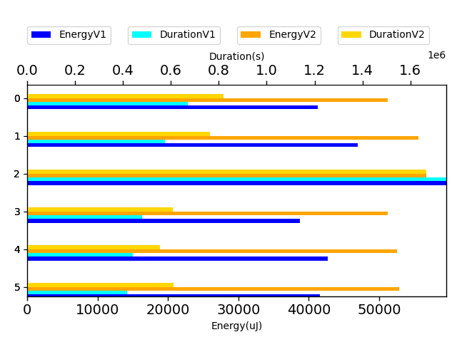

## com.google.gson.functional.SecurityTest

| Test | IterationV1 | IterationV2 | DeltaIteration |
| --- | --- | --- | --- |
| com.google.gson.functional.SecurityTest-testNonExecutableJsonSerialization | 37 | 36 | -1 |
| com.google.gson.functional.SecurityTest-testNonExecutableJsonDeserialization | 22 | 24 | 2 |
| com.google.gson.functional.SecurityTest-testJsonWithNonExectuableTokenWithRegularGsonDeserialization | 24 | 26 | 2 |
| com.google.gson.functional.SecurityTest-testJsonWithNonExectuableTokenWithConfiguredGsonDeserialization | 22 | 25 | 3 |
| com.google.gson.functional.SecurityTest-testJsonWithNonExectuableTokenSerialization | 15 | 15 | 0 |

| Test | EnergyV1 | EnergyV2 | DeltaEnergy |
| --- | --- | --- | --- |
| com.google.gson.functional.SecurityTest-testNonExecutableJsonSerialization | 43596.55380394494 | 52495.736969774385 | 8899.183165829447 |
| com.google.gson.functional.SecurityTest-testNonExecutableJsonDeserialization | 42728.133276462555 | 49716.56867814064 | 6988.435401678085 |
| com.google.gson.functional.SecurityTest-testJsonWithNonExectuableTokenWithRegularGsonDeserialization | 44591.98725402355 | 46849.90941888094 | 2257.9221648573875 |
| com.google.gson.functional.SecurityTest-testJsonWithNonExectuableTokenWithConfiguredGsonDeserialization | 43822.470041275024 | 44118.94398832321 | 296.47394704818726 |
| com.google.gson.functional.SecurityTest-testJsonWithNonExectuableTokenSerialization | 43132.514587402344 | 45645.683349609375 | 2513.1687622070312 |

| Test | DurationV1 | DurationsV2 | DeltaDuration |
| --- | --- | --- | --- |
| com.google.gson.functional.SecurityTest-testNonExecutableJsonSerialization | 705552.0802443502 | 732900.8629927128 | 27348.782748362515 |
| com.google.gson.functional.SecurityTest-testNonExecutableJsonDeserialization | 591718.0485522747 | 788287.8019208908 | 196569.7533686161 |
| com.google.gson.functional.SecurityTest-testJsonWithNonExectuableTokenWithRegularGsonDeserialization | 516289.0038613081 | 391119.6140574217 | -125169.38980388641 |
| com.google.gson.functional.SecurityTest-testJsonWithNonExectuableTokenWithConfiguredGsonDeserialization | 398695.23916101456 | 457806.8083215952 | 59111.569160580635 |
| com.google.gson.functional.SecurityTest-testJsonWithNonExectuableTokenSerialization | 412881.65576171875 | 369640.7504272461 | -43240.905334472656 |

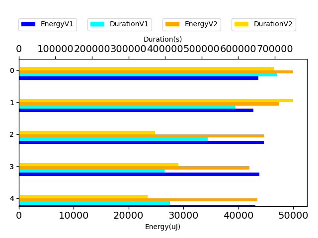

## com.google.gson.MixedStreamTest

| Test | IterationV1 | IterationV2 | DeltaIteration |
| --- | --- | --- | --- |
| com.google.gson.MixedStreamTest-testWriteClosed | 16 | 24 | 8 |
| com.google.gson.MixedStreamTest-testWriteLenient | 54 | 51 | -3 |
| com.google.gson.MixedStreamTest-testReadMixedStreamed | 30 | 27 | -3 |
| com.google.gson.MixedStreamTest-testReadInvalidState | 18 | 19 | 1 |
| com.google.gson.MixedStreamTest-testWriteInvalidState | 23 | 25 | 2 |
| com.google.gson.MixedStreamTest-testWriteHtmlSafe | 60 | 60 | 0 |
| com.google.gson.MixedStreamTest-testWriteMixedStreamed | 35 | 28 | -7 |
| com.google.gson.MixedStreamTest-testWriteDoesNotMutateState | 21 | 16 | -5 |
| com.google.gson.MixedStreamTest-testReaderDoesNotMutateState | 19 | 24 | 5 |

| Test | EnergyV1 | EnergyV2 | DeltaEnergy |
| --- | --- | --- | --- |
| com.google.gson.MixedStreamTest-testWriteClosed | 41603.76368713379 | 44162.96872472763 | 2559.2050375938416 |
| com.google.gson.MixedStreamTest-testWriteLenient | 51344.65981745286 | 42680.671362588466 | -8663.988454864397 |
| com.google.gson.MixedStreamTest-testReadMixedStreamed | 40504.024337558076 | 41037.03248797357 | 533.008150415495 |
| com.google.gson.MixedStreamTest-testReadInvalidState | 44360.86992645264 | 38352.606689453125 | -6008.263236999512 |
| com.google.gson.MixedStreamTest-testWriteInvalidState | 77929.8784236908 | 42055.13793683052 | -35874.740486860275 |
| com.google.gson.MixedStreamTest-testWriteHtmlSafe | 49209.40200398696 | 39587.25350264314 | -9622.148501343814 |
| com.google.gson.MixedStreamTest-testWriteMixedStreamed | 37074.2210809284 | 39122.718868523836 | 2048.4977875954355 |
| com.google.gson.MixedStreamTest-testWriteDoesNotMutateState | 42506.19111728668 | 41227.370513916016 | -1278.8206033706665 |
| com.google.gson.MixedStreamTest-testReaderDoesNotMutateState | 40067.7487449646 | 42246.22442430258 | 2178.4756793379784 |

| Test | DurationV1 | DurationsV2 | DeltaDuration |
| --- | --- | --- | --- |
| com.google.gson.MixedStreamTest-testWriteClosed | 448443.2679901123 | 516913.5785883665 | 68470.3105982542 |
| com.google.gson.MixedStreamTest-testWriteLenient | 1025977.763287232 | 904466.4884393669 | -121511.2748478651 |
| com.google.gson.MixedStreamTest-testReadMixedStreamed | 490873.8829681352 | 604323.4069420174 | 113449.5239738822 |
| com.google.gson.MixedStreamTest-testReadInvalidState | 541916.2594604492 | 316093.292011261 | -225822.96744918823 |
| com.google.gson.MixedStreamTest-testWriteInvalidState | 1417176.2573246956 | 467419.0737361908 | -949757.1835885048 |
| com.google.gson.MixedStreamTest-testWriteHtmlSafe | 1146489.8362861676 | 769220.2440530573 | -377269.59223311034 |
| com.google.gson.MixedStreamTest-testWriteMixedStreamed | 933073.5149321633 | 557115.2418953031 | -375958.27303686016 |
| com.google.gson.MixedStreamTest-testWriteDoesNotMutateState | 472690.12686157227 | 335034.34756469727 | -137655.779296875 |
| com.google.gson.MixedStreamTest-testReaderDoesNotMutateState | 555018.5720405579 | 496332.8357143998 | -58685.73632615805 |

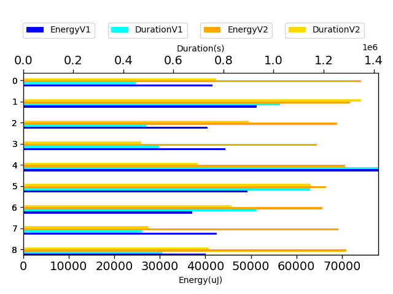

## com.google.gson.VersionExclusionStrategyTest

| Test | IterationV1 | IterationV2 | DeltaIteration |
| --- | --- | --- | --- |
| com.google.gson.VersionExclusionStrategyTest-testClassAndFieldAreAtSameVersion | 77 | 73 | -4 |
| com.google.gson.VersionExclusionStrategyTest-testClassAndFieldAreAheadInVersion | 12 | 7 | -5 |
| com.google.gson.VersionExclusionStrategyTest-testClassAndFieldAreBehindInVersion | 5 | 10 | 5 |

| Test | EnergyV1 | EnergyV2 | DeltaEnergy |
| --- | --- | --- | --- |
| com.google.gson.VersionExclusionStrategyTest-testClassAndFieldAreAtSameVersion | 92594.72745317442 | 83912.96077699933 | -8681.766676175088 |
| com.google.gson.VersionExclusionStrategyTest-testClassAndFieldAreAheadInVersion | 42855.34716796875 | 46656.75 | 3801.40283203125 |
| com.google.gson.VersionExclusionStrategyTest-testClassAndFieldAreBehindInVersion | 43750.8125 | 46550.2578125 | 2799.4453125 |

| Test | DurationV1 | DurationsV2 | DeltaDuration |
| --- | --- | --- | --- |
| com.google.gson.VersionExclusionStrategyTest-testClassAndFieldAreAtSameVersion | 2028057.7040705183 | 2218467.59043887 | 190409.88636835152 |
| com.google.gson.VersionExclusionStrategyTest-testClassAndFieldAreAheadInVersion | 300128.63525390625 | 298051.0625 | -2077.57275390625 |
| com.google.gson.VersionExclusionStrategyTest-testClassAndFieldAreBehindInVersion | 302521.75 | 285685.330078125 | -16836.419921875 |

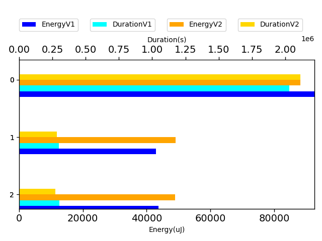

## com.google.gson.functional.InterfaceTest

| Test | IterationV1 | IterationV2 | DeltaIteration |
| --- | --- | --- | --- |
| com.google.gson.functional.InterfaceTest-testSerializingInterfaceObjectField | 56 | 51 | -5 |
| com.google.gson.functional.InterfaceTest-testSerializingObjectImplementingInterface | 39 | 36 | -3 |

| Test | EnergyV1 | EnergyV2 | DeltaEnergy |
| --- | --- | --- | --- |
| com.google.gson.functional.InterfaceTest-testSerializingInterfaceObjectField | 42635.56706382482 | 42015.5712180602 | -619.9958457646208 |
| com.google.gson.functional.InterfaceTest-testSerializingObjectImplementingInterface | 47857.89330087286 | 43736.314032609764 | -4121.5792682631 |

| Test | DurationV1 | DurationsV2 | DeltaDuration |
| --- | --- | --- | --- |
| com.google.gson.functional.InterfaceTest-testSerializingInterfaceObjectField | 729854.3291879715 | 728174.0476107347 | -1680.281577236834 |
| com.google.gson.functional.InterfaceTest-testSerializingObjectImplementingInterface | 784984.4233906842 | 779353.6333974876 | -5630.789993196609 |

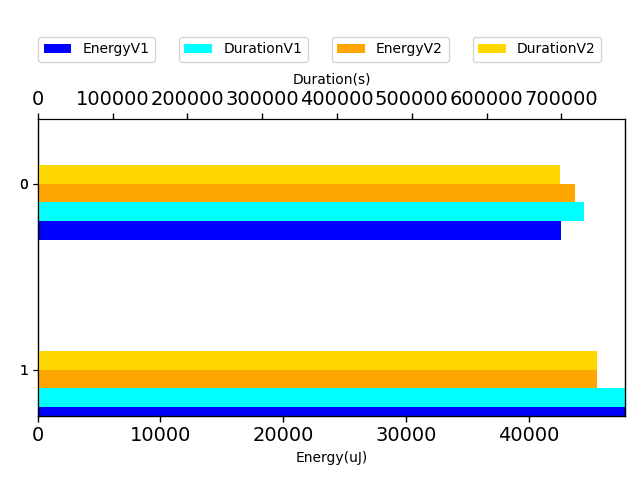

## com.google.gson.functional.TypeAdapterPrecedenceTest

| Test | IterationV1 | IterationV2 | DeltaIteration |
| --- | --- | --- | --- |
| com.google.gson.functional.TypeAdapterPrecedenceTest-testStreamingHierarchicalFollowedByNonstreamingHierarchical | 20 | 19 | -1 |
| com.google.gson.functional.TypeAdapterPrecedenceTest-testNonstreamingFollowedByNonstreaming | 83 | 86 | 3 |
| com.google.gson.functional.TypeAdapterPrecedenceTest-testStreamingFollowedByNonstreaming | 14 | 22 | 8 |
| com.google.gson.functional.TypeAdapterPrecedenceTest-testNonstreamingHierarchicalFollowedByNonstreaming | 17 | 20 | 3 |
| com.google.gson.functional.TypeAdapterPrecedenceTest-testStreamingHierarchicalFollowedByNonstreaming | 17 | 19 | 2 |
| com.google.gson.functional.TypeAdapterPrecedenceTest-testStreamingFollowedByStreaming | 33 | 31 | -2 |
| com.google.gson.functional.TypeAdapterPrecedenceTest-testStreamingFollowedByNonstreamingHierarchical | 14 | 16 | 2 |
| com.google.gson.functional.TypeAdapterPrecedenceTest-testSerializeNonstreamingTypeAdapterFollowedByStreamingTypeAdapter | 16 | 24 | 8 |

| Test | EnergyV1 | EnergyV2 | DeltaEnergy |
| --- | --- | --- | --- |
| com.google.gson.functional.TypeAdapterPrecedenceTest-testStreamingHierarchicalFollowedByNonstreamingHierarchical | 37199.79510688782 | 41714.09362602234 | 4514.2985191345215 |
| com.google.gson.functional.TypeAdapterPrecedenceTest-testNonstreamingFollowedByNonstreaming | 48404.6949419955 | 67907.738482279 | 19503.043540283506 |
| com.google.gson.functional.TypeAdapterPrecedenceTest-testStreamingFollowedByNonstreaming | 42867.65466308594 | 39990.11596393585 | -2877.5386991500854 |
| com.google.gson.functional.TypeAdapterPrecedenceTest-testNonstreamingHierarchicalFollowedByNonstreaming | 39532.04444885254 | 41900.34793663025 | 2368.30348777771 |
| com.google.gson.functional.TypeAdapterPrecedenceTest-testStreamingHierarchicalFollowedByNonstreaming | 42728.39222717285 | 38771.845752716064 | -3956.546474456787 |
| com.google.gson.functional.TypeAdapterPrecedenceTest-testStreamingFollowedByStreaming | 43703.12632922456 | 38519.04840804543 | -5184.077921179123 |
| com.google.gson.functional.TypeAdapterPrecedenceTest-testStreamingFollowedByNonstreamingHierarchical | 36489.07434082031 | 39074.468658447266 | 2585.394317626953 |
| com.google.gson.functional.TypeAdapterPrecedenceTest-testSerializeNonstreamingTypeAdapterFollowedByStreamingTypeAdapter | 41150.345611572266 | 42763.171246409416 | 1612.8256348371506 |

| Test | DurationV1 | DurationsV2 | DeltaDuration |
| --- | --- | --- | --- |
| com.google.gson.functional.TypeAdapterPrecedenceTest-testStreamingHierarchicalFollowedByNonstreamingHierarchical | 504142.5421361923 | 462730.90532302856 | -41411.63681316376 |
| com.google.gson.functional.TypeAdapterPrecedenceTest-testNonstreamingFollowedByNonstreaming | 1325099.452331563 | 1748024.4700902314 | 422925.0177586684 |
| com.google.gson.functional.TypeAdapterPrecedenceTest-testStreamingFollowedByNonstreaming | 360499.4211425781 | 589563.1070866585 | 229063.68594408035 |
| com.google.gson.functional.TypeAdapterPrecedenceTest-testNonstreamingHierarchicalFollowedByNonstreaming | 332858.64433288574 | 382878.86979675293 | 50020.22546386719 |
| com.google.gson.functional.TypeAdapterPrecedenceTest-testStreamingHierarchicalFollowedByNonstreaming | 356587.9106750488 | 558952.5828132629 | 202364.6721382141 |
| com.google.gson.functional.TypeAdapterPrecedenceTest-testStreamingFollowedByStreaming | 645065.0789897055 | 941184.1059963759 | 296119.02700667037 |
| com.google.gson.functional.TypeAdapterPrecedenceTest-testStreamingFollowedByNonstreamingHierarchical | 526607.8225097656 | 458747.5866088867 | -67860.2359008789 |
| com.google.gson.functional.TypeAdapterPrecedenceTest-testSerializeNonstreamingTypeAdapterFollowedByStreamingTypeAdapter | 321113.57763671875 | 408663.8259601593 | 87550.24832344055 |

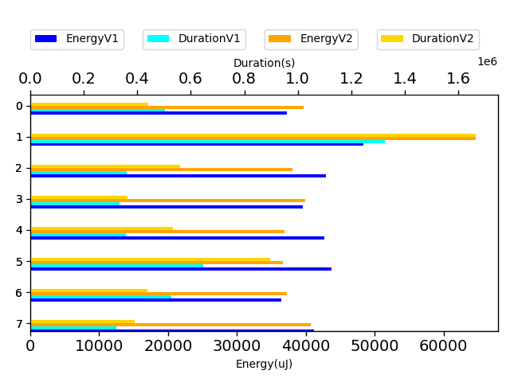

## com.google.gson.functional.TypeHierarchyAdapterTest

| Test | IterationV1 | IterationV2 | DeltaIteration |
| --- | --- | --- | --- |
| com.google.gson.functional.TypeHierarchyAdapterTest-testTypeHierarchy | 99 | 99 | 0 |
| com.google.gson.functional.TypeHierarchyAdapterTest-testRegisterSuperTypeFirst | 49 | 52 | 3 |

| Test | EnergyV1 | EnergyV2 | DeltaEnergy |
| --- | --- | --- | --- |
| com.google.gson.functional.TypeHierarchyAdapterTest-testTypeHierarchy | 108496.05877321854 | 85463.71424887615 | -23032.344524342392 |
| com.google.gson.functional.TypeHierarchyAdapterTest-testRegisterSuperTypeFirst | 45189.721748773925 | 44351.353054748106 | -838.3686940258194 |

| Test | DurationV1 | DurationsV2 | DeltaDuration |
| --- | --- | --- | --- |
| com.google.gson.functional.TypeHierarchyAdapterTest-testTypeHierarchy | 2414776.3955401937 | 2197891.2299691346 | -216885.1655710591 |
| com.google.gson.functional.TypeHierarchyAdapterTest-testRegisterSuperTypeFirst | 621750.8543682584 | 1210746.5294551516 | 588995.6750868933 |

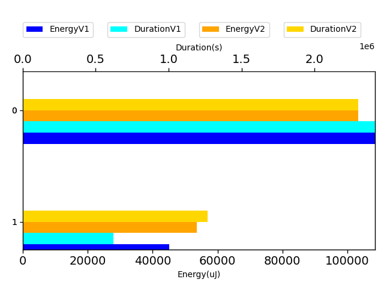

## com.google.gson.functional.JavaUtilTest

| Test | IterationV1 | IterationV2 | DeltaIteration |
| --- | --- | --- | --- |
| com.google.gson.functional.JavaUtilTest-testProperties | 25 | 21 | -4 |
| com.google.gson.functional.JavaUtilTest-testCurrency | 99 | 99 | 0 |

| Test | EnergyV1 | EnergyV2 | DeltaEnergy |
| --- | --- | --- | --- |
| com.google.gson.functional.JavaUtilTest-testProperties | 43074.50759014487 | 43196.89709568024 | 122.38950553536415 |
| com.google.gson.functional.JavaUtilTest-testCurrency | 133653.1311115172 | 107760.38743834272 | -25892.743673174482 |

| Test | DurationV1 | DurationsV2 | DeltaDuration |
| --- | --- | --- | --- |
| com.google.gson.functional.JavaUtilTest-testProperties | 570196.386900574 | 441526.98063468933 | -128669.40626588464 |
| com.google.gson.functional.JavaUtilTest-testCurrency | 2979640.758797722 | 2618964.567607292 | -360676.19119042996 |

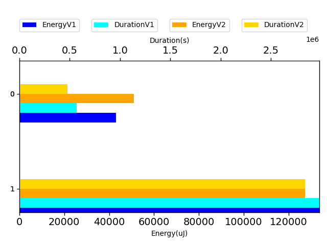

## com.google.gson.DefaultInetAddressTypeAdapterTest

| Test | IterationV1 | IterationV2 | DeltaIteration |
| --- | --- | --- | --- |
| com.google.gson.DefaultInetAddressTypeAdapterTest-testInetAddressSerializationAndDeserialization | 99 | 99 | 0 |

| Test | EnergyV1 | EnergyV2 | DeltaEnergy |
| --- | --- | --- | --- |
| com.google.gson.DefaultInetAddressTypeAdapterTest-testInetAddressSerializationAndDeserialization | 98987.54776104154 | 109545.04054708639 | 10557.492786044852 |

| Test | DurationV1 | DurationsV2 | DeltaDuration |
| --- | --- | --- | --- |
| com.google.gson.DefaultInetAddressTypeAdapterTest-testInetAddressSerializationAndDeserialization | 2704154.118590437 | 2535591.009682913 | -168563.10890752403 |

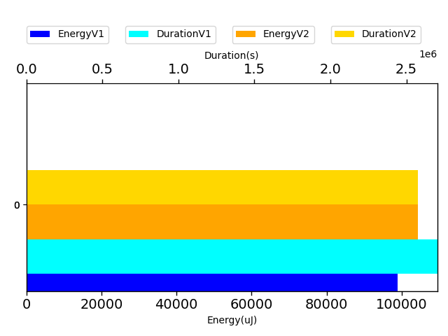

## com.google.gson.GsonTypeAdapterTest

| Test | IterationV1 | IterationV2 | DeltaIteration |
| --- | --- | --- | --- |
| com.google.gson.GsonTypeAdapterTest-testDeserializerForAbstractClass | 91 | 94 | 3 |
| com.google.gson.GsonTypeAdapterTest-testTypeAdapterProperlyConvertsTypes | 20 | 18 | -2 |
| com.google.gson.GsonTypeAdapterTest-testTypeAdapterThrowsException | 33 | 23 | -10 |
| com.google.gson.GsonTypeAdapterTest-testDefaultTypeAdapterThrowsParseException | 41 | 36 | -5 |
| com.google.gson.GsonTypeAdapterTest-testTypeAdapterDoesNotAffectNonAdaptedTypes | 11 | 18 | 7 |

| Test | EnergyV1 | EnergyV2 | DeltaEnergy |
| --- | --- | --- | --- |
| com.google.gson.GsonTypeAdapterTest-testDeserializerForAbstractClass | 44969.92883698152 | 48839.86146127969 | 3869.9326242981697 |
| com.google.gson.GsonTypeAdapterTest-testTypeAdapterProperlyConvertsTypes | 44502.1965637207 | 41938.07080078125 | -2564.125762939453 |
| com.google.gson.GsonTypeAdapterTest-testTypeAdapterThrowsException | 45151.18614994502 | 43261.92768955231 | -1889.2584603927098 |
| com.google.gson.GsonTypeAdapterTest-testDefaultTypeAdapterThrowsParseException | 46054.382270402304 | 47186.43907938403 | 1132.0568089817243 |
| com.google.gson.GsonTypeAdapterTest-testTypeAdapterDoesNotAffectNonAdaptedTypes | 43612.380859375 | 37882.58969116211 | -5729.791168212891 |

| Test | DurationV1 | DurationsV2 | DeltaDuration |
| --- | --- | --- | --- |
| com.google.gson.GsonTypeAdapterTest-testDeserializerForAbstractClass | 1259343.6422897 | 1449257.2921713023 | 189913.64988160226 |
| com.google.gson.GsonTypeAdapterTest-testTypeAdapterProperlyConvertsTypes | 372711.4286003113 | 443408.09296417236 | 70696.66436386108 |
| com.google.gson.GsonTypeAdapterTest-testTypeAdapterThrowsException | 418548.2288597559 | 362104.80937337875 | -56443.419486377155 |
| com.google.gson.GsonTypeAdapterTest-testDefaultTypeAdapterThrowsParseException | 565275.5601492741 | 1323629.7418362624 | 758354.1816869883 |
| com.google.gson.GsonTypeAdapterTest-testTypeAdapterDoesNotAffectNonAdaptedTypes | 351790.0166015625 | 644116.7252578735 | 292326.70865631104 |

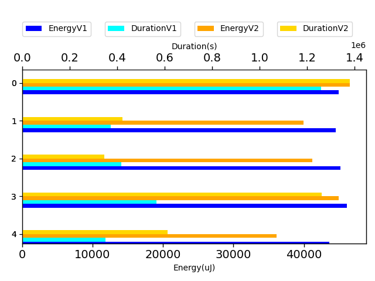

## com.google.gson.functional.ThrowableFunctionalTest

| Test | IterationV1 | IterationV2 | DeltaIteration |
| --- | --- | --- | --- |
| com.google.gson.functional.ThrowableFunctionalTest-testErrorWithoutCause | 53 | 59 | 6 |
| com.google.gson.functional.ThrowableFunctionalTest-testSerializedNameOnExceptionFields | 83 | 93 | 10 |
| com.google.gson.functional.ThrowableFunctionalTest-testExceptionWithCause | 55 | 63 | 8 |
| com.google.gson.functional.ThrowableFunctionalTest-testExceptionWithoutCause | 70 | 81 | 11 |
| com.google.gson.functional.ThrowableFunctionalTest-testErrornWithCause | 49 | 49 | 0 |

| Test | EnergyV1 | EnergyV2 | DeltaEnergy |
| --- | --- | --- | --- |
| com.google.gson.functional.ThrowableFunctionalTest-testErrorWithoutCause | 42075.57056772456 | 42132.158965705625 | 56.58839798106783 |
| com.google.gson.functional.ThrowableFunctionalTest-testSerializedNameOnExceptionFields | 45016.05110618981 | 78723.18052437951 | 33707.1294181897 |
| com.google.gson.functional.ThrowableFunctionalTest-testExceptionWithCause | 42770.28574899183 | 43915.48006841281 | 1145.1943194209816 |
| com.google.gson.functional.ThrowableFunctionalTest-testExceptionWithoutCause | 53026.30191027724 | 51328.96079146317 | -1697.3411188140672 |
| com.google.gson.functional.ThrowableFunctionalTest-testErrornWithCause | 41150.65792115629 | 43526.58765436115 | 2375.929733204859 |

| Test | DurationV1 | DurationsV2 | DeltaDuration |
| --- | --- | --- | --- |
| com.google.gson.functional.ThrowableFunctionalTest-testErrorWithoutCause | 623901.8421127684 | 778124.9578381116 | 154223.11572534312 |
| com.google.gson.functional.ThrowableFunctionalTest-testSerializedNameOnExceptionFields | 1090205.3110425647 | 1471539.5435343836 | 381334.23249181896 |
| com.google.gson.functional.ThrowableFunctionalTest-testExceptionWithCause | 738633.4572074619 | 1086056.9213799206 | 347423.4641724586 |
| com.google.gson.functional.ThrowableFunctionalTest-testExceptionWithoutCause | 1082951.6864176346 | 1364881.4020857702 | 281929.71566813556 |
| com.google.gson.functional.ThrowableFunctionalTest-testErrornWithCause | 820168.6497185149 | 955847.8163964994 | 135679.16667798453 |

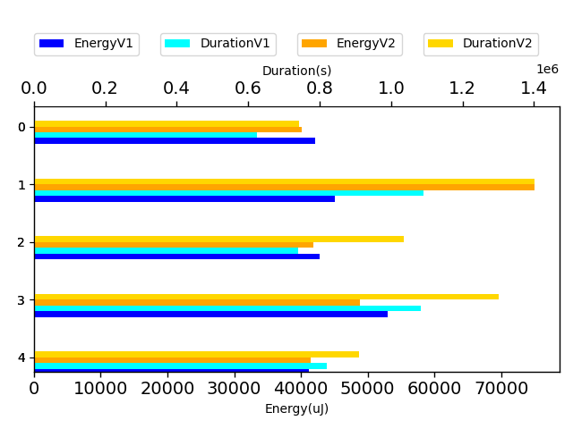

## com.google.gson.functional.PrintFormattingTest

| Test | IterationV1 | IterationV2 | DeltaIteration |
| --- | --- | --- | --- |
| com.google.gson.functional.PrintFormattingTest-testCompactFormattingLeavesNoWhiteSpace | 69 | 65 | -4 |

| Test | EnergyV1 | EnergyV2 | DeltaEnergy |
| --- | --- | --- | --- |
| com.google.gson.functional.PrintFormattingTest-testCompactFormattingLeavesNoWhiteSpace | 70140.44571890855 | 67393.23045703015 | -2747.215261878402 |

| Test | DurationV1 | DurationsV2 | DeltaDuration |
| --- | --- | --- | --- |
| com.google.gson.functional.PrintFormattingTest-testCompactFormattingLeavesNoWhiteSpace | 1750034.0180545943 | 1850558.0999074571 | 100524.08185286284 |

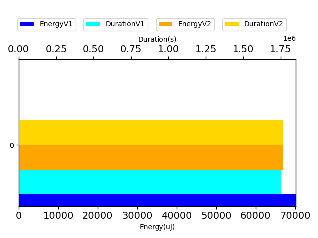

## com.google.gson.GsonBuilderTest

| Test | IterationV1 | IterationV2 | DeltaIteration |
| --- | --- | --- | --- |
| com.google.gson.GsonBuilderTest-testTransientFieldExclusion | 34 | 42 | 8 |
| com.google.gson.GsonBuilderTest-testExcludeFieldsWithModifiers | 46 | 39 | -7 |

| Test | EnergyV1 | EnergyV2 | DeltaEnergy |
| --- | --- | --- | --- |
| com.google.gson.GsonBuilderTest-testTransientFieldExclusion | 45757.08601650095 | 41224.33211987967 | -4532.7538966212815 |
| com.google.gson.GsonBuilderTest-testExcludeFieldsWithModifiers | 47172.894618633545 | 41723.09089076388 | -5449.803727869665 |

| Test | DurationV1 | DurationsV2 | DeltaDuration |
| --- | --- | --- | --- |
| com.google.gson.GsonBuilderTest-testTransientFieldExclusion | 437001.78323566803 | 595283.101540525 | 158281.31830485695 |
| com.google.gson.GsonBuilderTest-testExcludeFieldsWithModifiers | 563177.7294550516 | 692525.609045768 | 129347.87959071645 |

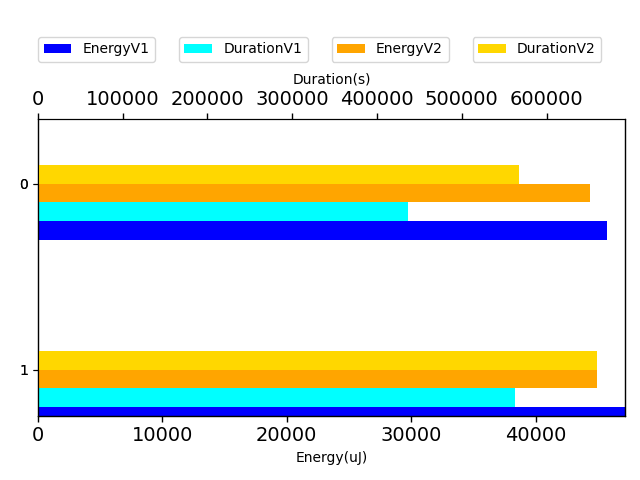

## com.google.gson.functional.CustomSerializerTest

| Test | IterationV1 | IterationV2 | DeltaIteration |
| --- | --- | --- | --- |
| com.google.gson.functional.CustomSerializerTest-testSubClassSerializerInvokedForBaseClassFieldsHoldingArrayOfSubClassInstances | 42 | 45 | 3 |
| com.google.gson.functional.CustomSerializerTest-testSerializerReturnsNull | 39 | 37 | -2 |
| com.google.gson.functional.CustomSerializerTest-testBaseClassSerializerInvokedForBaseClassFieldsHoldingSubClassInstances | 51 | 52 | 1 |
| com.google.gson.functional.CustomSerializerTest-testSubClassSerializerInvokedForBaseClassFieldsHoldingSubClassInstances | 40 | 37 | -3 |
| com.google.gson.functional.CustomSerializerTest-testBaseClassSerializerInvokedForBaseClassFields | 22 | 26 | 4 |

| Test | EnergyV1 | EnergyV2 | DeltaEnergy |
| --- | --- | --- | --- |
| com.google.gson.functional.CustomSerializerTest-testSubClassSerializerInvokedForBaseClassFieldsHoldingArrayOfSubClassInstances | 42509.16535213542 | 41434.688287070945 | -1074.4770650644714 |
| com.google.gson.functional.CustomSerializerTest-testSerializerReturnsNull | 42981.18343702699 | 41277.61525374693 | -1703.568183280062 |
| com.google.gson.functional.CustomSerializerTest-testBaseClassSerializerInvokedForBaseClassFieldsHoldingSubClassInstances | 55346.70966711344 | 104577.05048664927 | 49230.34081953583 |
| com.google.gson.functional.CustomSerializerTest-testSubClassSerializerInvokedForBaseClassFieldsHoldingSubClassInstances | 42372.61289202744 | 44939.01166668326 | 2566.3987746558196 |
| com.google.gson.functional.CustomSerializerTest-testBaseClassSerializerInvokedForBaseClassFields | 40814.50091648102 | 44917.826596051455 | 4103.3256795704365 |

| Test | DurationV1 | DurationsV2 | DeltaDuration |
| --- | --- | --- | --- |
| com.google.gson.functional.CustomSerializerTest-testSubClassSerializerInvokedForBaseClassFieldsHoldingArrayOfSubClassInstances | 527100.2121794944 | 616787.8392021838 | 89687.62702268932 |
| com.google.gson.functional.CustomSerializerTest-testSerializerReturnsNull | 757898.5345954942 | 647337.9049303841 | -110560.62966511003 |
| com.google.gson.functional.CustomSerializerTest-testBaseClassSerializerInvokedForBaseClassFieldsHoldingSubClassInstances | 826325.0923273609 | 2395677.0448706695 | 1569351.9525433085 |
| com.google.gson.functional.CustomSerializerTest-testSubClassSerializerInvokedForBaseClassFieldsHoldingSubClassInstances | 537610.3191534556 | 656301.4696062328 | 118691.15045277728 |
| com.google.gson.functional.CustomSerializerTest-testBaseClassSerializerInvokedForBaseClassFields | 443670.55289936066 | 583111.8177886307 | 139441.26488927007 |

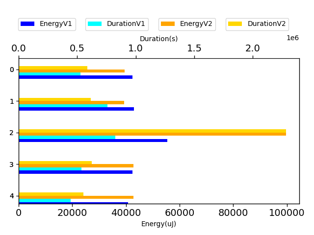

## com.google.gson.regression.JsonAdapterNullSafeTest

| Test | IterationV1 | IterationV2 | DeltaIteration |
| --- | --- | --- | --- |
| com.google.gson.regression.JsonAdapterNullSafeTest-testNullSafeBugSerialize | 85 | 84 | -1 |
| com.google.gson.regression.JsonAdapterNullSafeTest-testNullSafeBugDeserialize | 36 | 35 | -1 |

| Test | EnergyV1 | EnergyV2 | DeltaEnergy |
| --- | --- | --- | --- |
| com.google.gson.regression.JsonAdapterNullSafeTest-testNullSafeBugSerialize | 89594.95422361279 | 43800.2588218054 | -45794.69540180739 |
| com.google.gson.regression.JsonAdapterNullSafeTest-testNullSafeBugDeserialize | 124205.27266778063 | 46177.90906968404 | -78027.36359809659 |

| Test | DurationV1 | DurationsV2 | DeltaDuration |
| --- | --- | --- | --- |
| com.google.gson.regression.JsonAdapterNullSafeTest-testNullSafeBugSerialize | 2819898.4130225796 | 1068436.8887860947 | -1751461.524236485 |
| com.google.gson.regression.JsonAdapterNullSafeTest-testNullSafeBugDeserialize | 3148738.0382675105 | 604925.5865362274 | -2543812.451731283 |

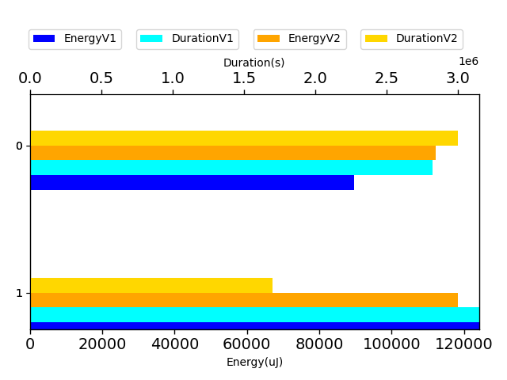

## com.google.gson.functional.DelegateTypeAdapterTest

| Test | IterationV1 | IterationV2 | DeltaIteration |
| --- | --- | --- | --- |
| com.google.gson.functional.DelegateTypeAdapterTest-testDelegateInvoked | 90 | 89 | -1 |
| com.google.gson.functional.DelegateTypeAdapterTest-testDelegateInvokedOnStrings | 28 | 27 | -1 |

| Test | EnergyV1 | EnergyV2 | DeltaEnergy |
| --- | --- | --- | --- |
| com.google.gson.functional.DelegateTypeAdapterTest-testDelegateInvoked | 44222.467643939555 | 102272.5446554572 | 58050.07701151764 |
| com.google.gson.functional.DelegateTypeAdapterTest-testDelegateInvokedOnStrings | 43900.07484456152 | 36906.43370369077 | -6993.64114087075 |

| Test | DurationV1 | DurationsV2 | DeltaDuration |
| --- | --- | --- | --- |
| com.google.gson.functional.DelegateTypeAdapterTest-testDelegateInvoked | 1163944.5747028058 | 3553632.9253024315 | 2389688.3505996256 |
| com.google.gson.functional.DelegateTypeAdapterTest-testDelegateInvokedOnStrings | 547106.6576346308 | 856774.0529945642 | 309667.3953599334 |

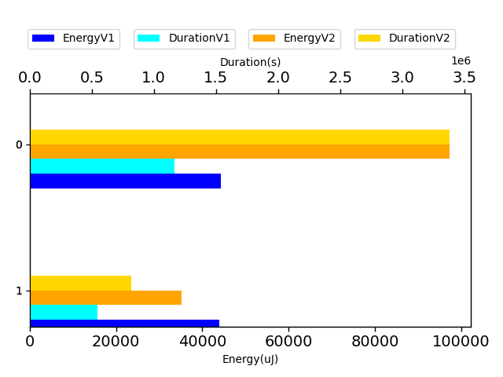

## com.google.gson.ObjectTypeAdapterTest

| Test | IterationV1 | IterationV2 | DeltaIteration |
| --- | --- | --- | --- |
| com.google.gson.ObjectTypeAdapterTest-testSerialize | 89 | 78 | -11 |
| com.google.gson.ObjectTypeAdapterTest-testSerializeNullValue | 21 | 20 | -1 |

| Test | EnergyV1 | EnergyV2 | DeltaEnergy |
| --- | --- | --- | --- |
| com.google.gson.ObjectTypeAdapterTest-testSerialize | 52023.92612177407 | 54685.44048906064 | 2661.514367286567 |
| com.google.gson.ObjectTypeAdapterTest-testSerializeNullValue | 38732.1375169754 | 43302.493339538574 | 4570.355822563171 |

| Test | DurationV1 | DurationsV2 | DeltaDuration |
| --- | --- | --- | --- |
| com.google.gson.ObjectTypeAdapterTest-testSerialize | 1477783.6530214965 | 1053441.3150259913 | -424342.3379955052 |
| com.google.gson.ObjectTypeAdapterTest-testSerializeNullValue | 402786.6197462082 | 370202.55045318604 | -32584.069293022156 |

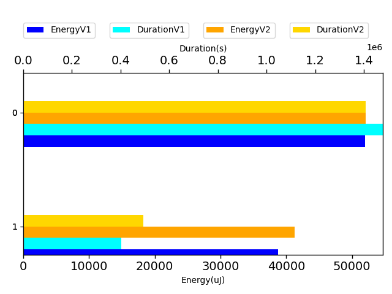

## com.google.gson.functional.TreeTypeAdaptersTest

| Test | IterationV1 | IterationV2 | DeltaIteration |
| --- | --- | --- | --- |
| com.google.gson.functional.TreeTypeAdaptersTest-testSerializeId | 78 | 75 | -3 |
| com.google.gson.functional.TreeTypeAdaptersTest-testDeserializeId | 60 | 62 | 2 |

| Test | EnergyV1 | EnergyV2 | DeltaEnergy |
| --- | --- | --- | --- |
| com.google.gson.functional.TreeTypeAdaptersTest-testSerializeId | 48662.06110297707 | 45382.87819902344 | -3279.1829039536315 |
| com.google.gson.functional.TreeTypeAdaptersTest-testDeserializeId | 43865.67150485691 | 68838.08523050319 | 24972.413725646278 |

| Test | DurationV1 | DurationsV2 | DeltaDuration |
| --- | --- | --- | --- |
| com.google.gson.functional.TreeTypeAdaptersTest-testSerializeId | 1265238.2386217036 | 988082.8723031316 | -277155.36631857196 |
| com.google.gson.functional.TreeTypeAdaptersTest-testDeserializeId | 1007396.263371256 | 1391603.9600572244 | 384207.69668596843 |

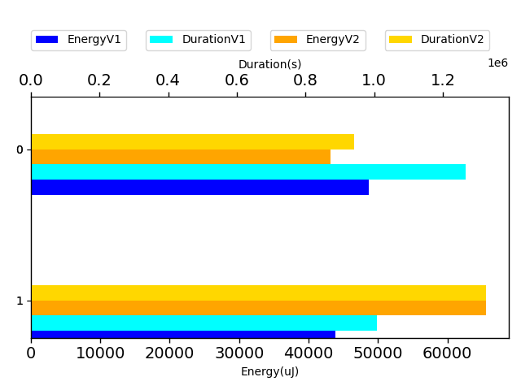

## com.google.gson.functional.LeniencyTest

| Test | IterationV1 | IterationV2 | DeltaIteration |
| --- | --- | --- | --- |
| com.google.gson.functional.LeniencyTest-testLenientFromJson | 54 | 53 | -1 |

| Test | EnergyV1 | EnergyV2 | DeltaEnergy |
| --- | --- | --- | --- |
| com.google.gson.functional.LeniencyTest-testLenientFromJson | 43952.154233774825 | 43932.74459226452 | -19.409641510304937 |

| Test | DurationV1 | DurationsV2 | DeltaDuration |
| --- | --- | --- | --- |
| com.google.gson.functional.LeniencyTest-testLenientFromJson | 1191421.0765019497 | 743603.0386423527 | -447818.037859597 |

## com.google.gson.functional.FieldExclusionTest

| Test | IterationV1 | IterationV2 | DeltaIteration |
| --- | --- | --- | --- |
| com.google.gson.functional.FieldExclusionTest-testDefaultNestedStaticClassIncluded | 30 | 29 | -1 |
| com.google.gson.functional.FieldExclusionTest-testDefaultInnerClassExclusion | 67 | 66 | -1 |
| com.google.gson.functional.FieldExclusionTest-testInnerClassExclusion | 22 | 19 | -3 |

| Test | EnergyV1 | EnergyV2 | DeltaEnergy |
| --- | --- | --- | --- |
| com.google.gson.functional.FieldExclusionTest-testDefaultNestedStaticClassIncluded | 43742.08278543502 | 38797.026897504926 | -4945.055887930095 |
| com.google.gson.functional.FieldExclusionTest-testDefaultInnerClassExclusion | 42305.15911027844 | 79008.57687444452 | 36703.417764166086 |
| com.google.gson.functional.FieldExclusionTest-testInnerClassExclusion | 44570.602045059204 | 38162.529205322266 | -6408.0728397369385 |

| Test | DurationV1 | DurationsV2 | DeltaDuration |
| --- | --- | --- | --- |
| com.google.gson.functional.FieldExclusionTest-testDefaultNestedStaticClassIncluded | 583838.0855482388 | 408696.48867094144 | -175141.5968772974 |
| com.google.gson.functional.FieldExclusionTest-testDefaultInnerClassExclusion | 1043885.7588706743 | 1947468.5961757873 | 903582.837305113 |
| com.google.gson.functional.FieldExclusionTest-testInnerClassExclusion | 370682.4722080231 | 415897.1487045288 | 45214.67649650574 |

## com.google.gson.functional.EscapingTest

| Test | IterationV1 | IterationV2 | DeltaIteration |
| --- | --- | --- | --- |
| com.google.gson.functional.EscapingTest-testGsonAcceptsEscapedAndNonEscapedJsonDeserialization | 47 | 51 | 4 |
| com.google.gson.functional.EscapingTest-testEscapingObjectFields | 32 | 37 | 5 |
| com.google.gson.functional.EscapingTest-testGsonDoubleDeserialization | 31 | 27 | -4 |
| com.google.gson.functional.EscapingTest-testEscapingQuotesInStringArray | 19 | 28 | 9 |
| com.google.gson.functional.EscapingTest-testEscapeAllHtmlCharacters | 24 | 24 | 0 |

| Test | EnergyV1 | EnergyV2 | DeltaEnergy |
| --- | --- | --- | --- |
| com.google.gson.functional.EscapingTest-testGsonAcceptsEscapedAndNonEscapedJsonDeserialization | 43530.938640712855 | 42139.52090950085 | -1391.4177312120082 |
| com.google.gson.functional.EscapingTest-testEscapingObjectFields | 42764.05972962454 | 46529.76607358459 | 3765.7063439600533 |
| com.google.gson.functional.EscapingTest-testGsonDoubleDeserialization | 44695.762556078844 | 41004.96951214969 | -3690.793043929152 |
| com.google.gson.functional.EscapingTest-testEscapingQuotesInStringArray | 46538.857330322266 | 46108.6284577176 | -430.22887260466814 |
| com.google.gson.functional.EscapingTest-testEscapeAllHtmlCharacters | 43574.40589737892 | 42333.451129972935 | -1240.9547674059868 |

| Test | DurationV1 | DurationsV2 | DeltaDuration |
| --- | --- | --- | --- |
| com.google.gson.functional.EscapingTest-testGsonAcceptsEscapedAndNonEscapedJsonDeserialization | 570169.2395334472 | 750681.0710154028 | 180511.8314819556 |
| com.google.gson.functional.EscapingTest-testEscapingObjectFields | 865528.5061093741 | 944993.4388717313 | 79464.93276235717 |
| com.google.gson.functional.EscapingTest-testGsonDoubleDeserialization | 419394.76368048415 | 2186562.9664201736 | 1767168.2027396895 |
| com.google.gson.functional.EscapingTest-testEscapingQuotesInStringArray | 599471.0932388306 | 549255.9226077199 | -50215.17063111067 |
| com.google.gson.functional.EscapingTest-testEscapeAllHtmlCharacters | 560115.0478649139 | 436278.055706501 | -123836.99215841293 |

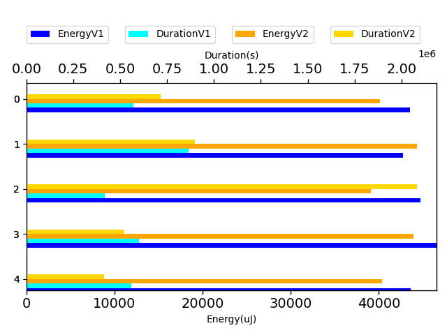

## com.google.gson.functional.PrimitiveCharacterTest

| Test | IterationV1 | IterationV2 | DeltaIteration |
| --- | --- | --- | --- |
| com.google.gson.functional.PrimitiveCharacterTest-testPrimitiveCharacterAutoboxedDeserialization | 23 | 19 | -4 |
| com.google.gson.functional.PrimitiveCharacterTest-testPrimitiveCharacterAutoboxedSerialization | 26 | 27 | 1 |

| Test | EnergyV1 | EnergyV2 | DeltaEnergy |
| --- | --- | --- | --- |
| com.google.gson.functional.PrimitiveCharacterTest-testPrimitiveCharacterAutoboxedDeserialization | 58040.94339489937 | 38337.80213737488 | -19703.14125752449 |
| com.google.gson.functional.PrimitiveCharacterTest-testPrimitiveCharacterAutoboxedSerialization | 47346.75596275926 | 44439.02021961659 | -2907.7357431426644 |

| Test | DurationV1 | DurationsV2 | DeltaDuration |
| --- | --- | --- | --- |
| com.google.gson.functional.PrimitiveCharacterTest-testPrimitiveCharacterAutoboxedDeserialization | 1336030.5686080456 | 368918.8170185089 | -967111.7515895367 |
| com.google.gson.functional.PrimitiveCharacterTest-testPrimitiveCharacterAutoboxedSerialization | 1291933.5870110393 | 706704.5441868305 | -585229.0428242087 |

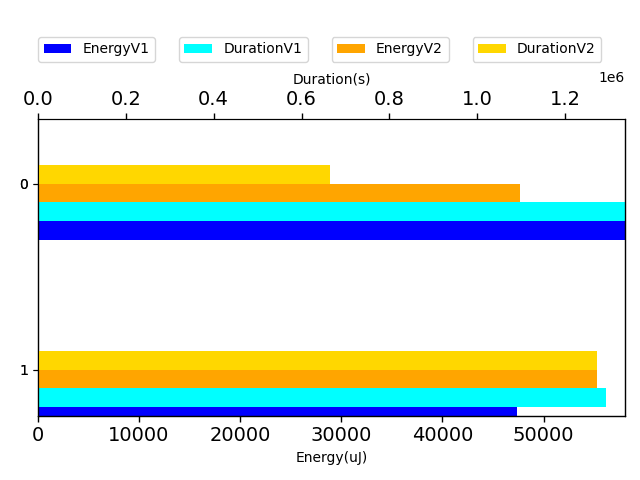

## com.google.gson.functional.InternationalizationTest

| Test | IterationV1 | IterationV2 | DeltaIteration |
| --- | --- | --- | --- |
| com.google.gson.functional.InternationalizationTest-testStringsWithUnicodeChineseCharactersDeserialization | 18 | 12 | -6 |
| com.google.gson.functional.InternationalizationTest-testStringsWithUnicodeChineseCharactersSerialization | 43 | 41 | -2 |
| com.google.gson.functional.InternationalizationTest-testStringsWithRawChineseCharactersDeserialization | 47 | 38 | -9 |
| com.google.gson.functional.InternationalizationTest-testStringsWithUnicodeChineseCharactersEscapedDeserialization | 16 | 27 | 11 |

| Test | EnergyV1 | EnergyV2 | DeltaEnergy |
| --- | --- | --- | --- |
| com.google.gson.functional.InternationalizationTest-testStringsWithUnicodeChineseCharactersDeserialization | 41058.320808410645 | 41841.7373046875 | 783.4164962768555 |
| com.google.gson.functional.InternationalizationTest-testStringsWithUnicodeChineseCharactersSerialization | 45313.58957013853 | 44484.163400127014 | -829.4261700115167 |
| com.google.gson.functional.InternationalizationTest-testStringsWithRawChineseCharactersDeserialization | 43095.89732634093 | 39995.84153708056 | -3100.0557892603683 |
| com.google.gson.functional.InternationalizationTest-testStringsWithUnicodeChineseCharactersEscapedDeserialization | 44020.349182128906 | 44020.006852597 | -0.3423295319080353 |

| Test | DurationV1 | DurationsV2 | DeltaDuration |
| --- | --- | --- | --- |
| com.google.gson.functional.InternationalizationTest-testStringsWithUnicodeChineseCharactersDeserialization | 384103.1260986328 | 431571.34033203125 | 47468.21423339844 |
| com.google.gson.functional.InternationalizationTest-testStringsWithUnicodeChineseCharactersSerialization | 592115.6969482199 | 623589.6652686186 | 31473.968320398708 |
| com.google.gson.functional.InternationalizationTest-testStringsWithRawChineseCharactersDeserialization | 804151.1026200914 | 542775.7430333081 | -261375.35958678334 |
| com.google.gson.functional.InternationalizationTest-testStringsWithUnicodeChineseCharactersEscapedDeserialization | 478919.0905761719 | 386846.7165867239 | -92072.37398944795 |

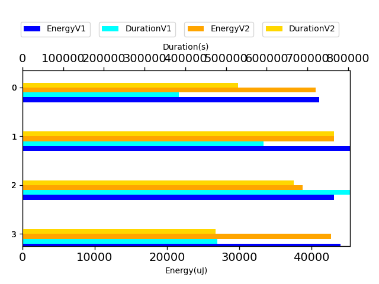

## com.google.gson.OverrideCoreTypeAdaptersTest

| Test | IterationV1 | IterationV2 | DeltaIteration |
| --- | --- | --- | --- |
| com.google.gson.OverrideCoreTypeAdaptersTest-testOverrideStringAdapter | 23 | 20 | -3 |
| com.google.gson.OverrideCoreTypeAdaptersTest-testOverridePrimitiveBooleanAdapter | 17 | 9 | -8 |
| com.google.gson.OverrideCoreTypeAdaptersTest-testOverrideWrapperBooleanAdapter | 37 | 34 | -3 |

| Test | EnergyV1 | EnergyV2 | DeltaEnergy |
| --- | --- | --- | --- |
| com.google.gson.OverrideCoreTypeAdaptersTest-testOverrideStringAdapter | 42105.858580589294 | 42231.51285266876 | 125.65427207946777 |
| com.google.gson.OverrideCoreTypeAdaptersTest-testOverridePrimitiveBooleanAdapter | 43620.180236816406 | 42469.67578125 | -1150.5044555664062 |
| com.google.gson.OverrideCoreTypeAdaptersTest-testOverrideWrapperBooleanAdapter | 45403.260034751365 | 43615.04872730852 | -1788.211307442849 |

| Test | DurationV1 | DurationsV2 | DeltaDuration |
| --- | --- | --- | --- |
| com.google.gson.OverrideCoreTypeAdaptersTest-testOverrideStringAdapter | 319611.58997535706 | 334647.2261734009 | 15035.636198043823 |
| com.google.gson.OverrideCoreTypeAdaptersTest-testOverridePrimitiveBooleanAdapter | 455274.05853271484 | 480273.59765625 | 24999.539123535156 |
| com.google.gson.OverrideCoreTypeAdaptersTest-testOverrideWrapperBooleanAdapter | 706503.2513358343 | 1080126.5411088872 | 373623.2897730529 |

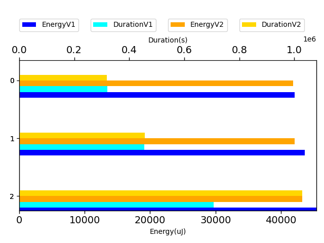

## com.google.gson.ExposeAnnotationExclusionStrategyTest

| Test | IterationV1 | IterationV2 | DeltaIteration |
| --- | --- | --- | --- |
| com.google.gson.ExposeAnnotationExclusionStrategyTest-testNeverSkipClasses | 28 | 33 | 5 |

| Test | EnergyV1 | EnergyV2 | DeltaEnergy |
| --- | --- | --- | --- |
| com.google.gson.ExposeAnnotationExclusionStrategyTest-testNeverSkipClasses | 42172.25857152045 | 44559.66453255457 | 2387.405961034121 |

| Test | DurationV1 | DurationsV2 | DeltaDuration |
| --- | --- | --- | --- |
| com.google.gson.ExposeAnnotationExclusionStrategyTest-testNeverSkipClasses | 552635.6603146046 | 629376.111143922 | 76740.45082931733 |

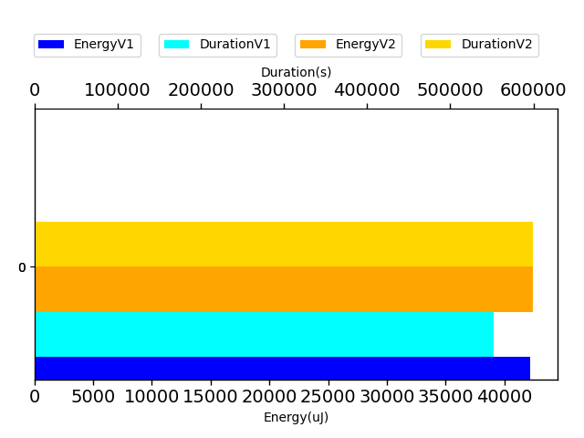

## com.google.gson.CommentsTest

| Test | IterationV1 | IterationV2 | DeltaIteration |
| --- | --- | --- | --- |
| com.google.gson.CommentsTest-testParseComments | 63 | 66 | 3 |

| Test | EnergyV1 | EnergyV2 | DeltaEnergy |
| --- | --- | --- | --- |
| com.google.gson.CommentsTest-testParseComments | 58414.77097825803 | 40925.438762695914 | -17489.332215562114 |

| Test | DurationV1 | DurationsV2 | DeltaDuration |
| --- | --- | --- | --- |
| com.google.gson.CommentsTest-testParseComments | 1283081.3857317278 | 667356.4860780591 | -615724.8996536687 |

