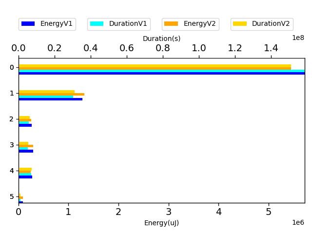
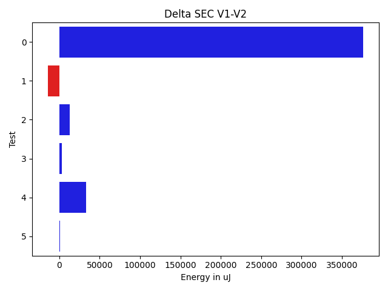
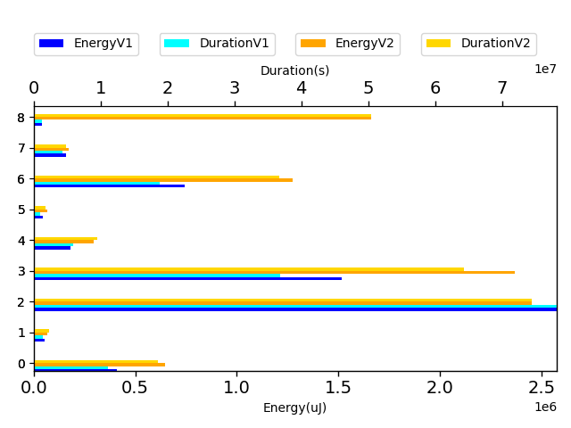
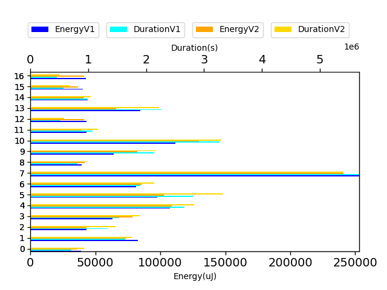
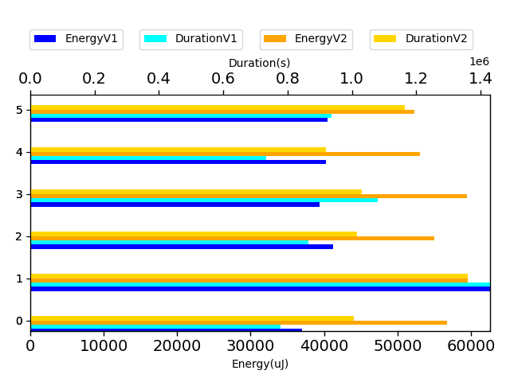
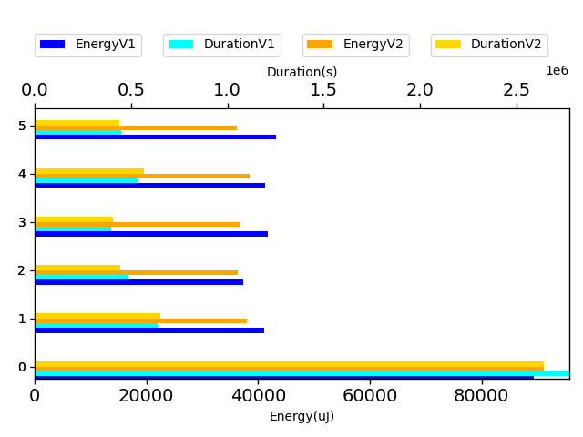
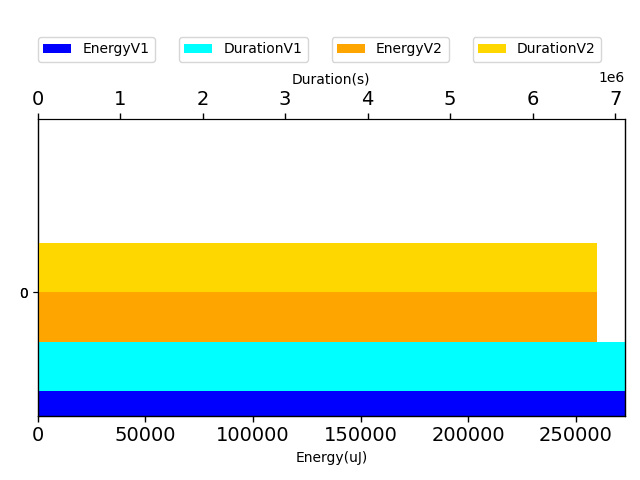
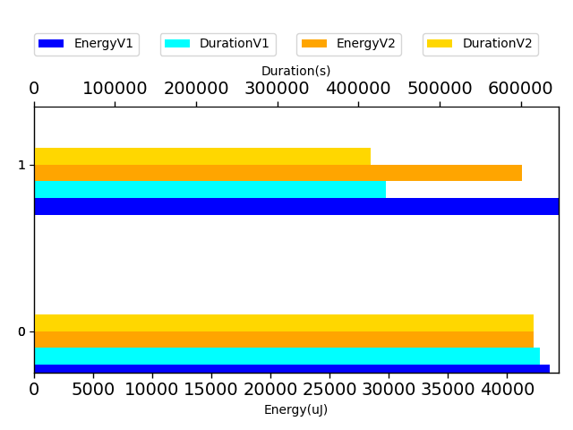

# javapoet a5f4f0

http://github.com/square/javapoet/commit/a5f4f0

| Index | EnergyV1 | EnergyV2 | DeltaEnergy | DurationV1 | DurationsV2 | DeltaDuration |
| --- | --- | --- | --- | --- | --- | --- |
| 0 | 5724342.87109375 | 5348023.203125 | 376319.66796875 | 158661003.00195312 | 145704473.06640625 | 12956529.935546875 |
| 1 | 1281119.671875 | 1295205.708984375 | -14086.037109375 | 30379105.787109375 | 29879687.6953125 | 499418.091796875 |
| 2 | 260957.3671875 | 248041.0 | 12916.3671875 | 5823482.94921875 | 6120318.34375 | -296835.39453125 |
| 3 | 293818.609375 | 290991.236328125 | 2827.373046875 | 5287697.6484375 | 5318508.07421875 | -30810.42578125 |
| 4 | 272784.765625 | 239455.560546875 | 33329.205078125 | 7119781.169921875 | 6947468.84765625 | 172312.322265625 |
| 5 | 87951.0 | 86894.921875 | 1056.078125 | 1056609.0 | 1083337.140625 | -26728.140625 |

| TestClassName | Index |
| --- | --- |
| com.squareup.javapoet.MethodSpecTest | 0 |
| com.squareup.javapoet.TypeSpecTest | 1 |
| com.squareup.javapoet.JavaFileTest | 2 |
| com.squareup.javapoet.ParameterSpecTest | 3 |
| com.squareup.javapoet.FileWritingTest | 4 |
| com.squareup.javapoet.AnnotatedTypeNameTest | 5 |
## com.squareup.javapoet.MethodSpecTest

| Test | EnergyV1 | EnergyV2 | DeltaEnergy | DurationV1 | DurationsV2 | DeltaDuration |
| --- | --- | --- | --- | --- | --- | --- |
| com.squareup.javapoet.MethodSpecTest-overrideExtendsOthersWorksWithActualTypeParameters | 410199.421875 | 384288.380859375 | 25911.041015625 | 11025017.494140625 | 10273495.2109375 | 751522.283203125 |
| com.squareup.javapoet.MethodSpecTest-withoutParameterJavaDoc | 52785.53125 | 39695.71875 | 13089.8125 | 1370182.0 | 1282348.75 | 87833.25 |
| com.squareup.javapoet.MethodSpecTest-overrideEverything | 2577111.548828125 | 1456335.12109375 | 1120776.427734375 | 78240275.85546875 | 41278232.986328125 | 36962042.869140625 |
| com.squareup.javapoet.MethodSpecTest-overrideDoesNotCopyParameterAnnotations | 1515496.1640625 | 1404882.796875 | 110613.3671875 | 36891294.525390625 | 35665672.6875 | 1225621.837890625 |
| com.squareup.javapoet.MethodSpecTest-overrideGenerics | 181582.58203125 | 176072.1484375 | 5510.43359375 | 5884268.1875 | 5231059.80078125 | 653208.38671875 |
| com.squareup.javapoet.MethodSpecTest-withParameterJavaDocAndWithoutMethodJavadoc | 42693.5390625 | 40057.625 | 2635.9140625 | 929220.2265625 | 970587.5 | -41367.2734375 |
| com.squareup.javapoet.MethodSpecTest-equalsAndHashCode | 742723.669921875 | 756787.96484375 | -14064.294921875 | 18845119.87890625 | 20331866.939453125 | -1486747.060546875 |
| com.squareup.javapoet.MethodSpecTest-modifyParameters | 160006.4765625 | 103059.689453125 | 56946.787109375 | 4301958.583984375 | 2699379.99609375 | 1602578.587890625 |
| com.squareup.javapoet.MethodSpecTest-withParameterJavaDoc | 41743.9375 | 986843.7578125 | -945099.8203125 | 1173666.25 | 27971829.1953125 | -26798162.9453125 |

## com.squareup.javapoet.TypeSpecTest

| Test | EnergyV1 | EnergyV2 | DeltaEnergy | DurationV1 | DurationsV2 | DeltaDuration |
| --- | --- | --- | --- | --- | --- | --- |
| com.squareup.javapoet.TypeSpecTest-ifElse | 39137.84375 | 36352.3125 | 2785.53125 | 709246.71875 | 852285.59375 | -143038.875 |
| com.squareup.javapoet.TypeSpecTest-enumWithSubclassing | 82742.5859375 | 74251.75390625 | 8490.83203125 | 1640710.4921875 | 1618903.19140625 | 21807.30078125 |
| com.squareup.javapoet.TypeSpecTest-javadoc | 43066.845703125 | 43471.796875 | -404.951171875 | 1333384.982421875 | 1359856.181640625 | -26471.19921875 |
| com.squareup.javapoet.TypeSpecTest-membersOrdering | 62983.060546875 | 79058.544921875 | -16075.484375 | 1536611.69921875 | 1737592.234375 | -200980.53515625 |
| com.squareup.javapoet.TypeSpecTest-annotatedParameters | 107595.623046875 | 109360.068359375 | -1764.4453125 | 2666852.48046875 | 2604341.923828125 | 62510.556640625 |
| com.squareup.javapoet.TypeSpecTest-lineWrapping | 97825.2578125 | 103321.708984375 | -5496.451171875 | 2808840.044921875 | 3073234.41796875 | -264394.373046875 |
| com.squareup.javapoet.TypeSpecTest-multilineStatementWithAnonymousClass | 81419.125 | 85695.423828125 | -4276.298828125 | 1899795.791015625 | 1968802.232421875 | -69006.44140625 |
| com.squareup.javapoet.TypeSpecTest-codeBlocks | 253212.310546875 | 242363.79296875 | 10848.517578125 | 5687611.3984375 | 4990889.546875 | 696721.8515625 |
| com.squareup.javapoet.TypeSpecTest-tryCatch | 39471.6640625 | 41964.421875 | -2492.7578125 | 809323.5 | 915826.1640625 | -106502.6640625 |
| com.squareup.javapoet.TypeSpecTest-retrofitStyleInterface | 64035.39453125 | 82704.990234375 | -18669.595703125 | 2145117.341796875 | 2008036.876953125 | 137080.46484375 |
| com.squareup.javapoet.TypeSpecTest-typeVariables | 111551.5703125 | 130283.390625 | -18731.8203125 | 3272815.640625 | 3038290.73046875 | 234524.91015625 |
| com.squareup.javapoet.TypeSpecTest-varargs | 43160.0703125 | 39596.71875 | 3563.3515625 | 1077081.11328125 | 1079537.0546875 | -2455.94140625 |
| com.squareup.javapoet.TypeSpecTest-parameterToString | 42999.125 | 41313.0 | 1686.125 | 511438.3125 | 537984.875 | -26546.5625 |
| com.squareup.javapoet.TypeSpecTest-anonymousInnerClass | 84547.234375 | 66129.70703125 | 18417.52734375 | 2263130.865234375 | 2047247.2890625 | 215883.576171875 |
| com.squareup.javapoet.TypeSpecTest-nativeMethods | 44013.5859375 | 41205.703125 | 2807.8828125 | 993610.90625 | 963220.5703125 | 30390.3359375 |
| com.squareup.javapoet.TypeSpecTest-constructorToString | 40466.0 | 36628.875 | 3837.125 | 569012.5 | 621476.8125 | -52464.3125 |
| com.squareup.javapoet.TypeSpecTest-nameFromParameter | 42892.375 | 41503.5 | 1388.875 | 454522.0 | 462162.0 | -7640.0 |

## com.squareup.javapoet.JavaFileTest

| Test | EnergyV1 | EnergyV2 | DeltaEnergy | DurationV1 | DurationsV2 | DeltaDuration |
| --- | --- | --- | --- | --- | --- | --- |
| com.squareup.javapoet.JavaFileTest-importStaticUsingWildcards | 37040.375 | 41860.53125 | -4820.15625 | 778629.03125 | 948297.625 | -169668.59375 |
| com.squareup.javapoet.JavaFileTest-importStaticMixed | 62573.3359375 | 43983.90625 | 18589.4296875 | 1428781.19921875 | 1281854.328125 | 146926.87109375 |
| com.squareup.javapoet.JavaFileTest-importStaticOnce | 41182.640625 | 40571.765625 | 610.875 | 865498.609375 | 956252.59375 | -90753.984375 |
| com.squareup.javapoet.JavaFileTest-importStaticNone | 39425.1484375 | 43868.625 | -4443.4765625 | 1080605.3515625 | 971304.625 | 109300.7265625 |
| com.squareup.javapoet.JavaFileTest-defaultPackage | 40292.9921875 | 39176.8984375 | 1116.09375 | 733051.6328125 | 865994.15625 | -132942.5234375 |
| com.squareup.javapoet.JavaFileTest-importStaticTwice | 40442.875 | 38579.2734375 | 1863.6015625 | 936917.125 | 1096615.015625 | -159697.890625 |

## com.squareup.javapoet.ParameterSpecTest

| Test | EnergyV1 | EnergyV2 | DeltaEnergy | DurationV1 | DurationsV2 | DeltaDuration |
| --- | --- | --- | --- | --- | --- | --- |
| com.squareup.javapoet.ParameterSpecTest-parameterVariableElement | 89394.484375 | 95682.048828125 | -6287.564453125 | 2773457.5859375 | 2724790.63671875 | 48666.94921875 |
| com.squareup.javapoet.ParameterSpecTest-equalsAndHashCode | 41106.625 | 39963.0 | 1143.625 | 640378.5625 | 674745.25 | -34366.6875 |
| com.squareup.javapoet.ParameterSpecTest-modifyModifiers | 37307.5 | 38177.5 | -870.0 | 488877.75 | 459391.5 | 29486.25 |
| com.squareup.javapoet.ParameterSpecTest-nullAnnotationsAddition | 41656.0 | 38707.6875 | 2948.3125 | 395160.0 | 417971.6875 | -22811.6875 |
| com.squareup.javapoet.ParameterSpecTest-modifyAnnotations | 41172.0 | 40375.0 | 797.0 | 540822.25 | 586789.0 | -45966.75 |
| com.squareup.javapoet.ParameterSpecTest-addNonFinalModifier | 43182.0 | 38086.0 | 5096.0 | 449001.5 | 454820.0 | -5818.5 |

## com.squareup.javapoet.FileWritingTest

| Test | EnergyV1 | EnergyV2 | DeltaEnergy | DurationV1 | DurationsV2 | DeltaDuration |
| --- | --- | --- | --- | --- | --- | --- |
| com.squareup.javapoet.FileWritingTest-filerClassesWithTabIndent | 272784.765625 | 239455.560546875 | 33329.205078125 | 7119781.169921875 | 6947468.84765625 | 172312.322265625 |

## com.squareup.javapoet.AnnotatedTypeNameTest

| Test | EnergyV1 | EnergyV2 | DeltaEnergy | DurationV1 | DurationsV2 | DeltaDuration |
| --- | --- | --- | --- | --- | --- | --- |
| com.squareup.javapoet.AnnotatedTypeNameTest-annotatedArrayTypeVarargsParameter | 43579.0 | 43957.421875 | -378.421875 | 623251.0 | 647093.640625 | -23842.640625 |
| com.squareup.javapoet.AnnotatedTypeNameTest-annotatedArrayTypeInVarargsParameter | 44372.0 | 42937.5 | 1434.5 | 433358.0 | 436243.5 | -2885.5 |

