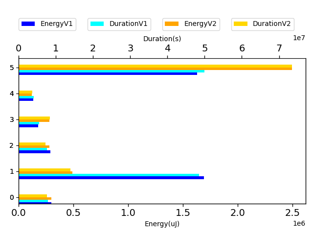
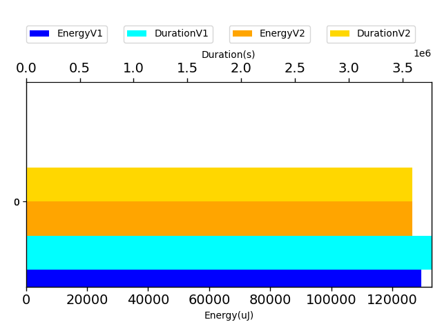

# javapoet 622e07

http://github.com/square/javapoet/commit/622e07

| Index | EnergyV1 | EnergyV2 | DeltaEnergy | DurationV1 | DurationsV2 | DeltaDuration |
| --- | --- | --- | --- | --- | --- | --- |
| 0 | 4222633.994140625 | 4170068.69140625 | 52565.302734375 | 123578234.609375 | 120257641.76171875 | 3320592.84765625 |
| 1 | 129455.470703125 | 132907.734375 | -3452.263671875 | 3769132.2265625 | 3746785.58984375 | 22346.63671875 |

| TestClassName | Index |
| --- | --- |
| com.squareup.javapoet.MethodSpecTest | 0 |
| com.squareup.javapoet.ParameterSpecTest | 1 |
## com.squareup.javapoet.MethodSpecTest

| Test | EnergyV1 | EnergyV2 | DeltaEnergy | DurationV1 | DurationsV2 | DeltaDuration |
| --- | --- | --- | --- | --- | --- | --- |
| com.squareup.javapoet.MethodSpecTest-overrideExtendsOthersWorksWithActualTypeParameters | 299901.03515625 | 315423.5859375 | -15522.55078125 | 7931678.26953125 | 8016886.205078125 | -85207.935546875 |
| com.squareup.javapoet.MethodSpecTest-overrideEverything | 1692714.990234375 | 517275.38671875 | 1175439.603515625 | 48487083.82421875 | 14674882.728515625 | 33812201.095703125 |
| com.squareup.javapoet.MethodSpecTest-overrideDoesNotCopyDefaultModifier | 290220.998046875 | 295740.681640625 | -5519.68359375 | 7632288.169921875 | 7582922.0078125 | 49366.162109375 |
| com.squareup.javapoet.MethodSpecTest-overrideGenerics | 177812.671875 | 293609.099609375 | -115796.427734375 | 5484482.080078125 | 8909090.7265625 | -3424608.646484375 |
| com.squareup.javapoet.MethodSpecTest-overrideDoesNotCopyOverrideAnnotation | 133447.6640625 | 127926.345703125 | 5521.318359375 | 4077051.228515625 | 3919801.705078125 | 157249.5234375 |
| com.squareup.javapoet.MethodSpecTest-equalsAndHashCode | 1628536.634765625 | 2620093.591796875 | -991556.95703125 | 49965651.037109375 | 77154058.38867188 | -27188407.3515625 |

## com.squareup.javapoet.ParameterSpecTest

| Test | EnergyV1 | EnergyV2 | DeltaEnergy | DurationV1 | DurationsV2 | DeltaDuration |
| --- | --- | --- | --- | --- | --- | --- |
| com.squareup.javapoet.ParameterSpecTest-parameterVariableElement | 129455.470703125 | 132907.734375 | -3452.263671875 | 3769132.2265625 | 3746785.58984375 | 22346.63671875 |

