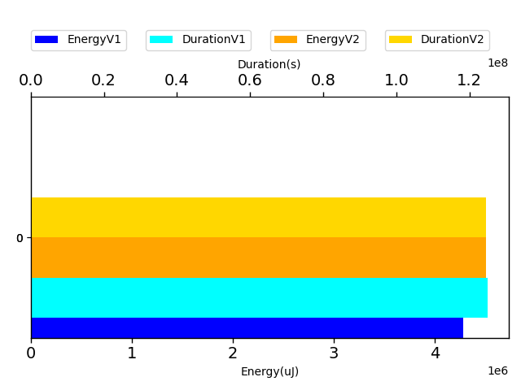
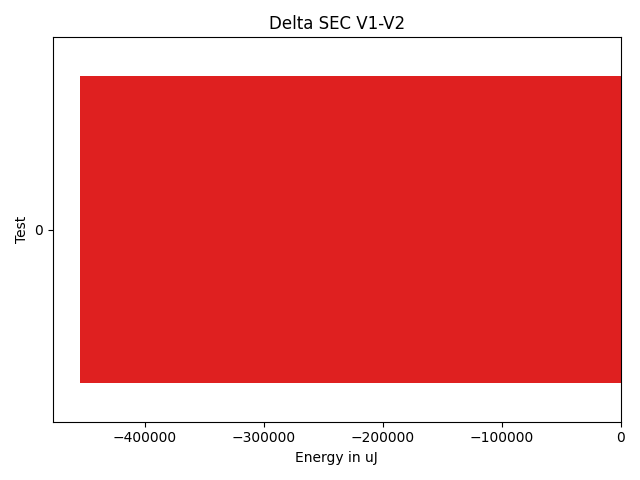
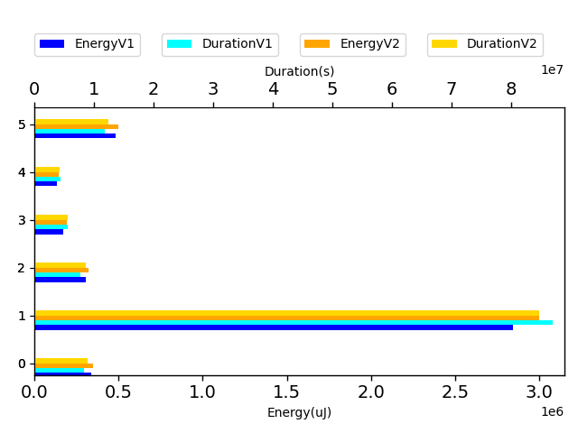

# javapoet 5a6c84

http://github.com/square/javapoet/commit/5a6c84

| Index | EnergyV1 | EnergyV2 | DeltaEnergy | DurationV1 | DurationsV2 | DeltaDuration |
| --- | --- | --- | --- | --- | --- | --- |
| 0 | 4280240.0078125 | 4734638.419921875 | -454398.412109375 | 124957860.671875 | 130738813.69335938 | -5780953.021484375 |

| TestClassName | Index |
| --- | --- |
| com.squareup.javapoet.MethodSpecTest | 0 |
## com.squareup.javapoet.MethodSpecTest

| Test | EnergyV1 | EnergyV2 | DeltaEnergy | DurationV1 | DurationsV2 | DeltaDuration |
| --- | --- | --- | --- | --- | --- | --- |
| com.squareup.javapoet.MethodSpecTest-overrideExtendsOthersWorksWithActualTypeParameters | 340639.435546875 | 364346.58203125 | -23707.146484375 | 8279572.640625 | 9345338.505859375 | -1065765.865234375 |
| com.squareup.javapoet.MethodSpecTest-overrideEverything | 2842473.962890625 | 3148017.666015625 | -305543.703125 | 86961390.921875 | 89005667.81835938 | -2044276.896484375 |
| com.squareup.javapoet.MethodSpecTest-overrideDoesNotCopyDefaultModifier | 304543.115234375 | 339015.4765625 | -34472.361328125 | 7792824.140625 | 9041133.576171875 | -1248309.435546875 |
| com.squareup.javapoet.MethodSpecTest-overrideGenerics | 174648.212890625 | 204528.48828125 | -29880.275390625 | 5582044.873046875 | 5888777.673828125 | -306732.80078125 |
| com.squareup.javapoet.MethodSpecTest-overrideDoesNotCopyOverrideAnnotation | 135096.775390625 | 152502.822265625 | -17406.046875 | 4447339.396484375 | 4455284.1171875 | -7944.720703125 |
| com.squareup.javapoet.MethodSpecTest-equalsAndHashCode | 482838.505859375 | 526227.384765625 | -43388.87890625 | 11894688.69921875 | 13002612.001953125 | -1107923.302734375 |

