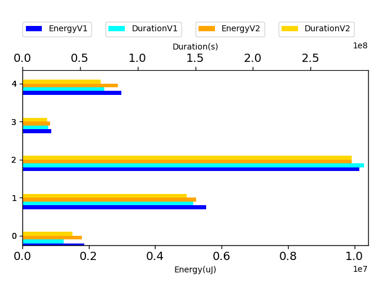
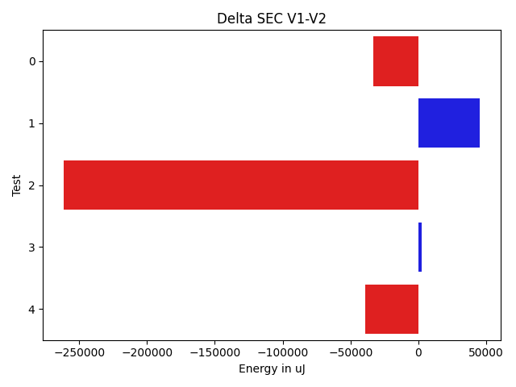
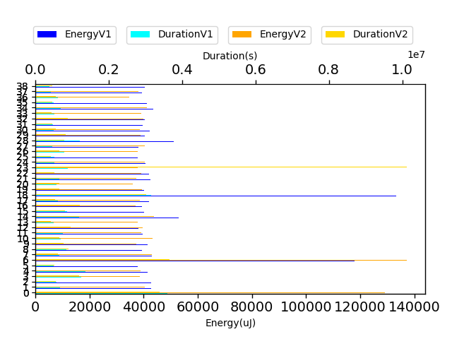
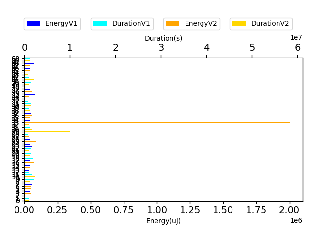
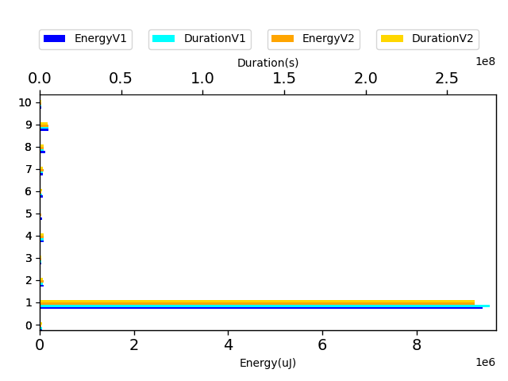
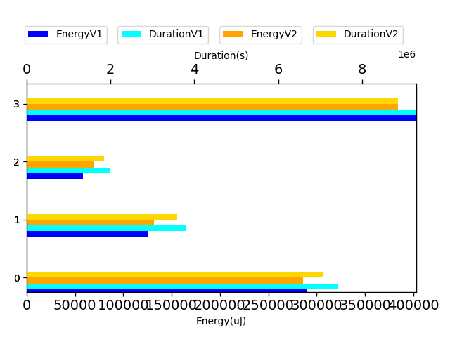
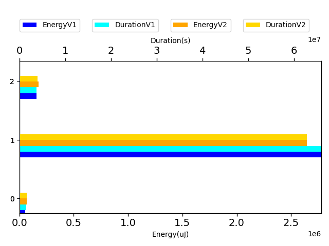

# javapoet dc64ed

http://github.com/square/javapoet/commit/dc64ed

| Index | EnergyV1 | EnergyV2 | DeltaEnergy | DurationV1 | DurationsV2 | DeltaDuration |
| --- | --- | --- | --- | --- | --- | --- |
| 0 | 1858163.037109375 | 1891189.6015625 | -33026.564453125 | 35800735.072265625 | 45542288.84375 | -9741553.771484375 |
| 1 | 5537327.556640625 | 5492112.966796875 | 45214.58984375 | 148004010.64648438 | 149657628.88867188 | -1653618.2421875 |
| 2 | 10154511.46875 | 10415899.11328125 | -261387.64453125 | 296265560.1074219 | 299846291.984375 | -3580731.876953125 |
| 3 | 876949.873046875 | 874436.892578125 | 2512.98046875 | 22511596.150390625 | 22376340.783203125 | 135255.3671875 |
| 4 | 2987577.203125 | 3026540.06640625 | -38962.86328125 | 71104406.6640625 | 71352614.4296875 | -248207.765625 |

| TestClassName | Index |
| --- | --- |
| com.squareup.javapoet.JavaFileTest | 0 |
| com.squareup.javapoet.TypeSpecTest | 1 |
| com.squareup.javapoet.FileWritingTest | 2 |
| com.squareup.javapoet.AnnotationSpecTest | 3 |
| com.squareup.javapoet.FileReadingTest | 4 |
## com.squareup.javapoet.JavaFileTest

| Test | EnergyV1 | EnergyV2 | DeltaEnergy | DurationV1 | DurationsV2 | DeltaDuration |
| --- | --- | --- | --- | --- | --- | --- |
| com.squareup.javapoet.JavaFileTest-avoidClashesWithNestedClasses_viaTypeElement | 128395.06640625 | 135752.42578125 | -7357.359375 | 3586806.822265625 | 3545358.53515625 | 41448.287109375 |
| com.squareup.javapoet.JavaFileTest-importStaticUsingWildcards | 42747.1875 | 42450.25 | 296.9375 | 667074.15625 | 620940.5 | 46133.65625 |
| com.squareup.javapoet.JavaFileTest-annotatedTypeParam | 42724.0 | 40909.125 | 1814.875 | 573656.0 | 581349.125 | -7693.125 |
| com.squareup.javapoet.JavaFileTest-importStaticMixed | 40761.208984375 | 40428.44921875 | 332.759765625 | 1246796.265625 | 1241143.87109375 | 5652.39453125 |
| com.squareup.javapoet.JavaFileTest-avoidClashes_parentChild_superclass_type | 41307.5 | 40747.599609375 | 559.900390625 | 1361730.59375 | 1196464.193359375 | 165266.400390625 |
| com.squareup.javapoet.JavaFileTest-packageClassConflictsWithNestedClass | 37735.0 | 42244.0 | -4509.0 | 494493.75 | 549311.875 | -54818.125 |
| com.squareup.javapoet.JavaFileTest-avoidClashes_parentChild_superclass_typeMirror | 117969.06640625 | 144127.751953125 | -26158.685546875 | 3522698.927734375 | 3833891.5625 | -311192.634765625 |
| com.squareup.javapoet.JavaFileTest-avoidClashes_mapEntry | 42885.0 | 45287.75 | -2402.75 | 641194.125 | 644691.5 | -3497.375 |
| com.squareup.javapoet.JavaFileTest-importStaticTwice | 39375.125 | 40805.9375 | -1430.8125 | 834753.0 | 949781.875 | -115028.875 |
| com.squareup.javapoet.JavaFileTest-conflictingNameOutOfScope | 41520.57421875 | 39210.90625 | 2309.66796875 | 780762.87109375 | 795376.0 | -14613.12890625 |
| com.squareup.javapoet.JavaFileTest-importStaticNone | 42740.125 | 45547.5 | -2807.375 | 680915.75 | 687928.25 | -7012.5 |
| com.squareup.javapoet.JavaFileTest-superclassReferencesSelf | 39520.0 | 41046.0 | -1526.0 | 738718.75 | 548005.5 | 190713.25 |
| com.squareup.javapoet.JavaFileTest-avoidClashesWithNestedClasses_viaClass | 38121.16015625 | 41667.90625 | -3546.74609375 | 995740.072265625 | 999743.25 | -4003.177734375 |
| com.squareup.javapoet.JavaFileTest-alwaysQualifySupersedesJavaLangImports | 39031.5 | 39703.5 | -672.0 | 500264.0 | 432357.5 | 67906.5 |
| com.squareup.javapoet.JavaFileTest-avoidClashesWithNestedClasses_viaSuperinterfaceType | 52904.05859375 | 46053.900390625 | 6850.158203125 | 1188558.5546875 | 1055636.6640625 | 132921.890625 |
| com.squareup.javapoet.JavaFileTest-importStaticReadmeExample | 40052.34375 | 44314.546875 | -4262.203125 | 852294.8125 | 836382.1953125 | 15912.6171875 |
| com.squareup.javapoet.JavaFileTest-importStaticForCrazyFormatsWorks | 39398.03125 | 38905.06640625 | 492.96484375 | 1160526.71875 | 1273868.0 | -113341.28125 |
| com.squareup.javapoet.JavaFileTest-conflictingTypeVariableBound | 42075.6875 | 40530.8125 | 1544.875 | 614807.75 | 553077.4375 | 61730.3125 |
| com.squareup.javapoet.JavaFileTest-avoidClashes_parentChild_superinterface_typeMirror | 133438.25390625 | 129007.134765625 | 4431.119140625 | 3153090.39453125 | 3171897.806640625 | -18807.412109375 |
| com.squareup.javapoet.JavaFileTest-defaultPackage | 40179.84375 | 41427.375 | -1247.53125 | 749641.40625 | 687055.0 | 62586.40625 |
| com.squareup.javapoet.JavaFileTest-skipJavaLangImportsWithConflictingClassFirst | 39093.0 | 37887.5 | 1205.5 | 575457.0 | 678188.75 | -102731.75 |
| com.squareup.javapoet.JavaFileTest-annotationIsNestedClass | 42396.25 | 39062.25 | 3334.0 | 643812.125 | 564688.75 | 79123.375 |
| com.squareup.javapoet.JavaFileTest-packageClassConflictsWithSuperlass | 41847.25 | 40954.5 | 892.75 | 521283.625 | 533403.125 | -12119.5 |
| com.squareup.javapoet.JavaFileTest-conflictingParentName | 40114.515625 | 39680.25 | 434.265625 | 873989.1953125 | 10632056.125 | -9758066.9296875 |
| com.squareup.javapoet.JavaFileTest-conflictingAnnotation | 40745.0625 | 42380.875 | -1635.8125 | 504916.1875 | 479647.0 | 25269.1875 |
| com.squareup.javapoet.JavaFileTest-topOfFileComment | 37796.0 | 41290.25 | -3494.25 | 508621.5 | 432184.75 | 76436.75 |
| com.squareup.javapoet.JavaFileTest-nestedClassAndSuperclassShareName | 39962.6875 | 39754.765625 | 207.921875 | 789998.6875 | 680701.296875 | 109297.390625 |
| com.squareup.javapoet.JavaFileTest-skipJavaLangImportsWithConflictingClassLast | 37918.0 | 42457.375 | -4539.375 | 462539.25 | 526490.375 | -63951.125 |
| com.squareup.javapoet.JavaFileTest-conflictingChildName | 51067.671875 | 41041.8125 | 10025.859375 | 1200120.234375 | 813143.34375 | 386976.890625 |
| com.squareup.javapoet.JavaFileTest-avoidClashes_parentChild_superinterface_type | 40276.3984375 | 40844.640625 | -568.2421875 | 754307.734375 | 872763.765625 | -118456.03125 |
| com.squareup.javapoet.JavaFileTest-conflictingAnnotationReferencedClass | 42230.59375 | 40466.5 | 1764.09375 | 501387.4375 | 586813.0 | -85425.5625 |
| com.squareup.javapoet.JavaFileTest-alwaysQualifySimple | 39527.75 | 38650.5 | 877.25 | 468611.5 | 483634.25 | -15022.75 |
| com.squareup.javapoet.JavaFileTest-conflictingImports | 40435.0 | 41847.125 | -1412.125 | 553726.0 | 932624.625 | -378898.625 |
| com.squareup.javapoet.JavaFileTest-defaultPackageTypesAreNotImported | 37567.0 | 41061.5 | -3494.5 | 514594.5 | 457867.0 | 56727.5 |
| com.squareup.javapoet.JavaFileTest-importStaticOnce | 43403.0 | 43211.5703125 | 191.4296875 | 679322.875 | 638835.234375 | 40487.640625 |
| com.squareup.javapoet.JavaFileTest-modifyStaticImports | 41168.0 | 41259.75 | -91.75 | 494675.5 | 475461.1875 | 19214.3125 |
| com.squareup.javapoet.JavaFileTest-classAndSuperclassShareName | 39794.0 | 36331.0 | 3463.0 | 606587.0 | 579602.375 | 26984.625 |
| com.squareup.javapoet.JavaFileTest-emptyLinesInTopOfFileComment | 39474.125 | 39871.0 | -396.875 | 419898.5 | 490539.25 | -70640.75 |
| com.squareup.javapoet.JavaFileTest-noImports | 40466.0 | 42968.5 | -2502.5 | 382361.5 | 479384.0 | -97022.5 |

## com.squareup.javapoet.TypeSpecTest

| Test | EnergyV1 | EnergyV2 | DeltaEnergy | DurationV1 | DurationsV2 | DeltaDuration |
| --- | --- | --- | --- | --- | --- | --- |
| com.squareup.javapoet.TypeSpecTest-ifElse | 42888.4375 | 36361.625 | 6526.8125 | 904690.8125 | 943094.625 | -38403.8125 |
| com.squareup.javapoet.TypeSpecTest-annotationWithFields | 42663.25 | 58582.0 | -15918.75 | 1020733.5 | 1496594.125 | -475860.625 |
| com.squareup.javapoet.TypeSpecTest-indexedElseIf | 43122.5546875 | 52749.34375 | -9626.7890625 | 1171775.22265625 | 1313644.375 | -141869.15234375 |
| com.squareup.javapoet.TypeSpecTest-enumWithMembersButNoConstructorCall | 39437.55078125 | 53688.48828125 | -14250.9375 | 2262525.0625 | 1561868.90625 | 700656.15625 |
| com.squareup.javapoet.TypeSpecTest-nativeMethods | 41070.71875 | 39457.375 | 1613.34375 | 890188.7890625 | 969315.703125 | -79126.9140625 |
| com.squareup.javapoet.TypeSpecTest-methodThrows | 87316.662109375 | 49215.01953125 | 38101.642578125 | 2304043.25 | 1326355.603515625 | 977687.646484375 |
| com.squareup.javapoet.TypeSpecTest-enumWithSubclassing | 63306.083984375 | 51720.03515625 | 11586.048828125 | 1708825.630859375 | 1436859.98046875 | 271965.650390625 |
| com.squareup.javapoet.TypeSpecTest-javadoc | 60549.6796875 | 48613.671875 | 11936.0078125 | 1681718.73828125 | 1482924.0859375 | 198794.65234375 |
| com.squareup.javapoet.TypeSpecTest-membersOrdering | 41872.0625 | 41498.81640625 | 373.24609375 | 1398929.068359375 | 1295879.4765625 | 103049.591796875 |
| com.squareup.javapoet.TypeSpecTest-annotatedParameters | 72687.015625 | 74950.24609375 | -2263.23046875 | 2227974.046875 | 2198024.88671875 | 29949.16015625 |
| com.squareup.javapoet.TypeSpecTest-lineWrapping | 118340.447265625 | 81437.728515625 | 36902.71875 | 2509960.720703125 | 2365269.67578125 | 144691.044921875 |
| com.squareup.javapoet.TypeSpecTest-multilineStatementWithAnonymousClass | 54148.169921875 | 51192.669921875 | 2955.5 | 1604882.001953125 | 1645964.521484375 | -41082.51953125 |
| com.squareup.javapoet.TypeSpecTest-enumImplements | 42539.359375 | 63956.171875 | -21416.8125 | 951551.734375 | 1368776.234375 | -417224.5 |
| com.squareup.javapoet.TypeSpecTest-javadocEnsuresTrailingLine | 36689.75 | 40512.25 | -3822.5 | 550406.25 | 533491.625 | 16914.625 |
| com.squareup.javapoet.TypeSpecTest-annotatedClass | 40083.78125 | 40227.03125 | -143.25 | 759716.0390625 | 915253.546875 | -155537.5078125 |
| com.squareup.javapoet.TypeSpecTest-inlineIndent | 40864.78125 | 40115.5 | 749.28125 | 678906.1875 | 938114.5 | -259208.3125 |
| com.squareup.javapoet.TypeSpecTest-codeBlocks | 94131.765625 | 78843.3046875 | 15288.4609375 | 2466911.16796875 | 2073690.2578125 | 393220.91015625 |
| com.squareup.javapoet.TypeSpecTest-multipleSuperinterfaceAddition | 39964.3125 | 39311.6875 | 652.625 | 854595.234375 | 945233.3203125 | -90638.0859375 |
| com.squareup.javapoet.TypeSpecTest-enumsMayDefineAbstractMethods | 67494.796875 | 43754.15625 | 23740.640625 | 1883751.1875 | 1038932.65625 | 844818.53125 |
| com.squareup.javapoet.TypeSpecTest-innerAnnotationInAnnotationDeclaration | 42106.078125 | 37150.63671875 | 4955.44140625 | 934931.1796875 | 1298301.30859375 | -363370.12890625 |
| com.squareup.javapoet.TypeSpecTest-simpleNameConflictsWithTypeVariable | 48215.095703125 | 78347.6171875 | -30132.521484375 | 1466755.208984375 | 2214909.01953125 | -748153.810546875 |
| com.squareup.javapoet.TypeSpecTest-interfaceStaticMethods | 39501.125 | 40871.875 | -1370.75 | 832976.125 | 1086771.828125 | -253795.703125 |
| com.squareup.javapoet.TypeSpecTest-retrofitStyleInterface | 65615.828125 | 139388.857421875 | -73773.029296875 | 1529478.876953125 | 4206545.681640625 | -2677066.8046875 |
| com.squareup.javapoet.TypeSpecTest-enumWithAnnotatedValues | 61346.15625 | 40357.53125 | 20988.625 | 1449432.78125 | 895816.7734375 | 553616.0078125 |
| com.squareup.javapoet.TypeSpecTest-initializerBlockInRightPlace | 42299.31640625 | 36821.26171875 | 5478.0546875 | 1189044.02734375 | 1182191.81640625 | 6852.2109375 |
| com.squareup.javapoet.TypeSpecTest-nestedClasses | 72804.892578125 | 89037.380859375 | -16232.48828125 | 2162954.64453125 | 2324501.3359375 | -161546.69140625 |
| com.squareup.javapoet.TypeSpecTest-multipleTypeAddition | 42297.0 | 38243.04296875 | 4053.95703125 | 1225966.0 | 720547.24609375 | 505418.75390625 |
| com.squareup.javapoet.TypeSpecTest-interfaceDefaultMethods | 40826.734375 | 38680.875 | 2145.859375 | 782679.015625 | 1268023.0 | -485343.984375 |
| com.squareup.javapoet.TypeSpecTest-multilineStrings | 42015.53125 | 46876.78125 | -4861.25 | 782155.859375 | 1117736.28125 | -335580.421875 |
| com.squareup.javapoet.TypeSpecTest-initializersToBuilder | 416356.791015625 | 370290.689453125 | 46066.1015625 | 10649939.267578125 | 10437635.408203125 | 212303.859375 |
| com.squareup.javapoet.TypeSpecTest-typeVariables | 162805.251953125 | 72023.263671875 | 90781.98828125 | 4108994.16796875 | 1904128.1171875 | 2204866.05078125 |
| com.squareup.javapoet.TypeSpecTest-varargs | 41260.359375 | 39994.3125 | 1266.046875 | 1178404.5703125 | 933930.1953125 | 244474.375 |
| com.squareup.javapoet.TypeSpecTest-defaultModifiersForInterfaceMembers | 38495.8125 | 42603.78125 | -4107.96875 | 1409667.6875 | 932199.84375 | 477467.84375 |
| com.squareup.javapoet.TypeSpecTest-basic | 2030970.603515625 | 2100479.765625 | -69509.162109375 | 59880426.634765625 | 61129128.740234375 | -1248702.10546875 |
| com.squareup.javapoet.TypeSpecTest-multipleMethodAddition | 40584.421875 | 42487.65625 | -1903.234375 | 849522.75 | 1092538.375 | -243015.625 |
| com.squareup.javapoet.TypeSpecTest-multilineStatement | 42831.21875 | 42442.73046875 | 388.48828125 | 827432.828125 | 984227.33203125 | -156794.50390625 |
| com.squareup.javapoet.TypeSpecTest-referencedAndDeclaredSimpleNamesConflict | 65516.25 | 64014.064453125 | 1502.185546875 | 1598287.58984375 | 1855114.7109375 | -256827.12109375 |
| com.squareup.javapoet.TypeSpecTest-multipleTypeVariableAddition | 48322.75 | 63652.25 | -15329.5 | 947669.40625 | 1263430.5 | -315761.09375 |
| com.squareup.javapoet.TypeSpecTest-multipleAnnotationAddition | 43234.44921875 | 50354.640625 | -7120.19140625 | 976693.927734375 | 1197308.6171875 | -220614.689453125 |
| com.squareup.javapoet.TypeSpecTest-multipleFieldAddition | 39672.875 | 41793.90625 | -2121.03125 | 954889.0 | 952990.1640625 | 1898.8359375 |
| com.squareup.javapoet.TypeSpecTest-annotationsInAnnotations | 60609.5 | 52892.23046875 | 7717.26953125 | 1593651.8515625 | 1551297.95703125 | 42353.89453125 |
| com.squareup.javapoet.TypeSpecTest-typeVariableWithBounds | 41136.8125 | 42785.8203125 | -1649.0078125 | 1502158.4453125 | 1014298.3984375 | 487860.046875 |
| com.squareup.javapoet.TypeSpecTest-defaultModifiersForMemberInterfacesAndEnums | 41969.46875 | 41134.546875 | 834.921875 | 846883.4296875 | 901430.15625 | -54546.7265625 |
| com.squareup.javapoet.TypeSpecTest-interestingTypes | 36584.5390625 | 54974.1015625 | -18389.5625 | 1510086.67578125 | 1614661.75 | -104575.07421875 |
| com.squareup.javapoet.TypeSpecTest-staticCodeBlock | 48958.8125 | 36834.71875 | 12124.09375 | 1409893.671875 | 1205841.78125 | 204051.890625 |
| com.squareup.javapoet.TypeSpecTest-anonymousInnerClass | 82889.5625 | 80781.5546875 | 2108.0078125 | 1828304.67578125 | 2133747.6328125 | -305442.95703125 |
| com.squareup.javapoet.TypeSpecTest-classImplementsExtends | 39430.0 | 60808.984375 | -21378.984375 | 1347248.9375 | 1636381.84765625 | -289132.91015625 |
| com.squareup.javapoet.TypeSpecTest-doWhile | 38742.25 | 41129.9375 | -2387.6875 | 782394.3125 | 850207.9375 | -67813.625 |
| com.squareup.javapoet.TypeSpecTest-tryCatch | 46758.34375 | 41140.25 | 5618.09375 | 888017.953125 | 896075.234375 | -8057.28125 |
| com.squareup.javapoet.TypeSpecTest-annotatedField | 42260.921875 | 41852.828125 | 408.09375 | 897374.21875 | 1091960.171875 | -194585.953125 |
| com.squareup.javapoet.TypeSpecTest-arrayType | 63396.3125 | 42703.0625 | 20693.25 | 1529067.875 | 809416.140625 | 719651.734375 |
| com.squareup.javapoet.TypeSpecTest-annotationsAndJavaLangTypes | 54641.3125 | 83212.875 | -28571.5625 | 1434710.1875 | 2141317.078125 | -706606.890625 |
| com.squareup.javapoet.TypeSpecTest-elseIf | 42984.125 | 41423.6875 | 1560.4375 | 975298.625 | 1012228.625 | -36930.0 |
| com.squareup.javapoet.TypeSpecTest-lineWrappingWithZeroWidthSpace | 37330.625 | 36773.75 | 556.875 | 733328.25 | 748188.4375 | -14860.1875 |
| com.squareup.javapoet.TypeSpecTest-simpleNamesConflictInThisAndOtherPackage | 41351.0 | 40341.375 | 1009.625 | 675406.0 | 888344.484375 | -212938.484375 |
| com.squareup.javapoet.TypeSpecTest-javadocWithTrailingLineDoesNotAddAnother | 43945.0 | 40297.9375 | 3647.0625 | 509340.0 | 581450.5 | -72110.5 |
| com.squareup.javapoet.TypeSpecTest-nullStringLiteral | 42678.875 | 40988.625 | 1690.25 | 679384.25 | 741278.0 | -61893.75 |
| com.squareup.javapoet.TypeSpecTest-interfaceExtends | 40346.0625 | 40764.0 | -417.9375 | 1040182.59375 | 1326527.4375 | -286344.84375 |
| com.squareup.javapoet.TypeSpecTest-intersectionType | 71365.75 | 39703.21875 | 31662.53125 | 2034975.5 | 1089563.9375 | 945411.5625 |
| com.squareup.javapoet.TypeSpecTest-annotation | 42324.1875 | 49363.96875 | -7039.78125 | 1009785.125 | 1234975.34375 | -225190.21875 |
| com.squareup.javapoet.TypeSpecTest-classImplementsNestedClass | 41374.375 | 40105.453125 | 1268.921875 | 1206131.875 | 1341171.63671875 | -135039.76171875 |

## com.squareup.javapoet.FileWritingTest

| Test | EnergyV1 | EnergyV2 | DeltaEnergy | DurationV1 | DurationsV2 | DeltaDuration |
| --- | --- | --- | --- | --- | --- | --- |
| com.squareup.javapoet.FileWritingTest-fileNotDirectory | 50066.859375 | 41037.724609375 | 9029.134765625 | 1651266.005859375 | 1711007.232421875 | -59741.2265625 |
| com.squareup.javapoet.FileWritingTest-filerPassesOriginatingElements | 9399173.21484375 | 9685352.419921875 | -286179.205078125 | 276270264.8730469 | 279967039.7421875 | -3696774.869140625 |
| com.squareup.javapoet.FileWritingTest-filerNestedClasses | 80619.76953125 | 83117.1328125 | -2497.36328125 | 2155156.49609375 | 2069966.373046875 | 85190.123046875 |
| com.squareup.javapoet.FileWritingTest-fileIsUtf8 | 39043.375 | 40449.25 | -1405.875 | 968583.203125 | 941158.828125 | 27424.375 |
| com.squareup.javapoet.FileWritingTest-pathNotDirectory | 81691.32421875 | 92878.72265625 | -11187.3984375 | 2451110.58984375 | 2505947.548828125 | -54836.958984375 |
| com.squareup.javapoet.FileWritingTest-pathDefaultPackage | 42833.78125 | 40958.125 | 1875.65625 | 641581.96875 | 650692.5 | -9110.53125 |
| com.squareup.javapoet.FileWritingTest-fileNestedClasses | 64380.26171875 | 38730.8203125 | 25649.44140625 | 1463804.109375 | 1434725.685546875 | 29078.423828125 |
| com.squareup.javapoet.FileWritingTest-filerClassesWithTabIndent | 60121.791015625 | 80055.55859375 | -19933.767578125 | 2015851.681640625 | 2150072.728515625 | -134221.046875 |
| com.squareup.javapoet.FileWritingTest-pathNestedClasses | 108995.12890625 | 81224.2734375 | 27770.85546875 | 2505889.626953125 | 2375572.3515625 | 130317.275390625 |
| com.squareup.javapoet.FileWritingTest-fileDefaultPackage | 188756.212890625 | 192823.0546875 | -4066.841796875 | 5152314.802734375 | 5122947.806640625 | 29366.99609375 |
| com.squareup.javapoet.FileWritingTest-filerDefaultPackage | 38829.75 | 39272.03125 | -442.28125 | 989736.75 | 917161.1875 | 72575.5625 |

## com.squareup.javapoet.AnnotationSpecTest

| Test | EnergyV1 | EnergyV2 | DeltaEnergy | DurationV1 | DurationsV2 | DeltaDuration |
| --- | --- | --- | --- | --- | --- | --- |
| com.squareup.javapoet.AnnotationSpecTest-defaultAnnotation | 289572.763671875 | 287040.71484375 | 2532.048828125 | 7421978.35546875 | 7399803.265625 | 22175.08984375 |
| com.squareup.javapoet.AnnotationSpecTest-defaultAnnotationWithImport | 125726.4140625 | 132091.48828125 | -6365.07421875 | 3800978.07421875 | 3759556.712890625 | 41421.361328125 |
| com.squareup.javapoet.AnnotationSpecTest-reflectAnnotationWithDefaults | 58516.47265625 | 69920.783203125 | -11404.310546875 | 1998241.263671875 | 1933384.669921875 | 64856.59375 |
| com.squareup.javapoet.AnnotationSpecTest-reflectAnnotation | 403134.22265625 | 385383.90625 | 17750.31640625 | 9290398.45703125 | 9283596.134765625 | 6802.322265625 |

## com.squareup.javapoet.FileReadingTest

| Test | EnergyV1 | EnergyV2 | DeltaEnergy | DurationV1 | DurationsV2 | DeltaDuration |
| --- | --- | --- | --- | --- | --- | --- |
| com.squareup.javapoet.FileReadingTest-javaFileObjectCharacterContent | 53671.43359375 | 69493.146484375 | -15821.712890625 | 1432179.8828125 | 1651530.27734375 | -219350.39453125 |
| com.squareup.javapoet.FileReadingTest-compileJavaFile | 2778089.2265625 | 2774536.720703125 | 3552.505859375 | 65986333.35546875 | 65616341.712890625 | 369991.642578125 |
| com.squareup.javapoet.FileReadingTest-javaFileObjectInputStreamIsUtf8 | 155816.54296875 | 182510.19921875 | -26693.65625 | 3685893.42578125 | 4084742.439453125 | -398849.013671875 |

