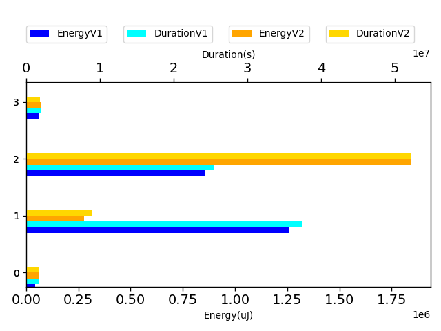

# javapoet 25d198

http://github.com/square/javapoet/commit/25d198

| Index | EnergyV1 | EnergyV2 | DeltaEnergy | DurationV1 | DurationsV2 | DeltaDuration |
| --- | --- | --- | --- | --- | --- | --- |
| 0 | 2220992.625 | 2363334.873046875 | -142342.248046875 | 66681071.9375 | 68081253.62304688 | -1400181.685546875 |

| TestClassName | Index |
| --- | --- |
| com.squareup.javapoet.TypeSpecTest | 0 |
## com.squareup.javapoet.TypeSpecTest

| Test | EnergyV1 | EnergyV2 | DeltaEnergy | DurationV1 | DurationsV2 | DeltaDuration |
| --- | --- | --- | --- | --- | --- | --- |
| com.squareup.javapoet.TypeSpecTest-ifElse | 43800.841796875 | 62995.509765625 | -19194.66796875 | 1683123.111328125 | 1910878.462890625 | -227755.3515625 |
| com.squareup.javapoet.TypeSpecTest-indexedElseIf | 1258889.185546875 | 291046.755859375 | 967842.4296875 | 37503913.91015625 | 9348604.849609375 | 28155309.060546875 |
| com.squareup.javapoet.TypeSpecTest-tryCatch | 853941.744140625 | 1936957.150390625 | -1083015.40625 | 25504191.412109375 | 54842779.05859375 | -29338587.646484375 |
| com.squareup.javapoet.TypeSpecTest-elseIf | 64360.853515625 | 72335.45703125 | -7974.603515625 | 1989843.50390625 | 1978991.251953125 | 10852.251953125 |

