# javapoet 3d6585

http://github.com/square/javapoet/commit/3d6585

| Index | EnergyV1 | EnergyV2 | DeltaEnergy | DurationV1 | DurationsV2 | DeltaDuration |
| --- | --- | --- | --- | --- | --- | --- |
| 0 | 2825406.36328125 | 2903169.921875 | -77763.55859375 | 70966364.27734375 | 73513162.5390625 | -2546798.26171875 |
| 1 | 703671.75 | 697411.125 | 6260.625 | 5851945.875 | 6249978.375 | -398032.5 |
| 2 | 3924252.572265625 | 5643108.408203125 | -1718855.8359375 | 75309799.53710938 | 125933194.3984375 | -50623394.861328125 |
| 3 | 2736874.251953125 | 3194474.83984375 | -457600.587890625 | 79531813.98828125 | 99560972.46289062 | -20029158.474609375 |
| 4 | 1033761.19140625 | 1104484.365234375 | -70723.173828125 | 26802881.625 | 27022931.845703125 | -220050.220703125 |
| 5 | 993907.27734375 | 1438560.21875 | -444652.94140625 | 33240185.681640625 | 52336182.5546875 | -19095996.873046875 |
| 6 | 8944910.451171875 | 8870221.57421875 | 74688.876953125 | 210640573.87890625 | 211247603.19140625 | -607029.3125 |
| 7 | 9549992.302734375 | 9602492.255859375 | -52499.953125 | 277605004.6699219 | 278671492.15625 | -1066487.486328125 |
| 8 | 876218.501953125 | 935019.677734375 | -58801.17578125 | 23510957.68359375 | 23792904.330078125 | -281946.646484375 |
| 9 | 2567308.798828125 | 2257376.453125 | 309932.345703125 | 65848453.083984375 | 60753239.306640625 | 5095213.77734375 |
| 10 | 408607.23828125 | 398210.51953125 | 10396.71875 | 5701752.6640625 | 5157249.453125 | 544503.2109375 |
| 11 | 555567.544921875 | 552845.763671875 | 2721.78125 | 15865880.1875 | 16988431.94921875 | -1122551.76171875 |
| 12 | 153453.236328125 | 135999.814453125 | 17453.421875 | 2929328.8359375 | 3066783.275390625 | -137454.439453125 |
| 13 | 33103.5 | 35247.75 | -2144.25 | 723299.5 | 708933.75 | 14365.75 |

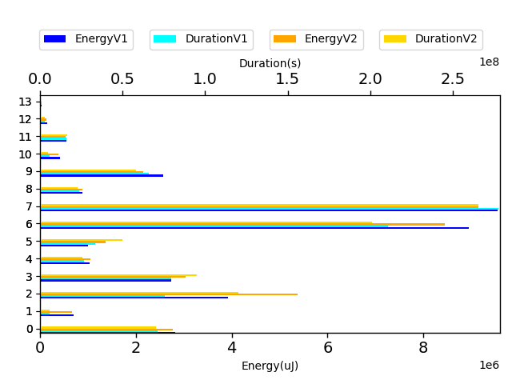

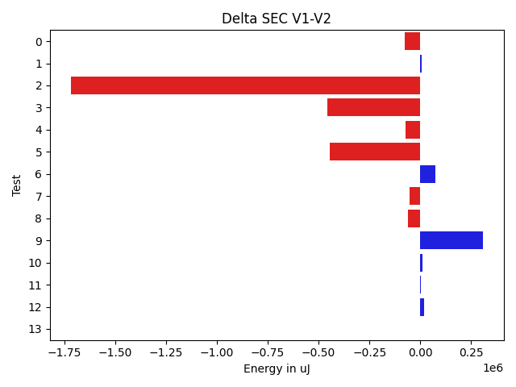

| TestClassName | Index |
| --- | --- |
| com.squareup.javapoet.MethodSpecTest | 0 |
| com.squareup.javapoet.AnnotatedTypeNameTest | 1 |
| com.squareup.javapoet.TypeSpecTest | 2 |
| com.squareup.javapoet.CodeBlockTest | 3 |
| com.squareup.javapoet.AbstractTypesTest | 4 |
| com.squareup.javapoet.JavaFileTest | 5 |
| com.squareup.javapoet.ClassNameTest | 6 |
| com.squareup.javapoet.FileWritingTest | 7 |
| com.squareup.javapoet.AnnotationSpecTest | 8 |
| com.squareup.javapoet.FileReadingTest | 9 |
| com.squareup.javapoet.TypeNameTest | 10 |
| ClassNameNoPackageTest | 11 |
| com.squareup.javapoet.ParameterSpecTest | 12 |
| com.squareup.javapoet.FieldSpecTest | 13 |
## com.squareup.javapoet.MethodSpecTest

| Test | EnergyV1 | EnergyV2 | DeltaEnergy | DurationV1 | DurationsV2 | DeltaDuration |
| --- | --- | --- | --- | --- | --- | --- |
| com.squareup.javapoet.MethodSpecTest-overrideExtendsOthersWorksWithActualTypeParameters | 259972.234375 | 324710.462890625 | -64738.228515625 | 6785120.134765625 | 7847692.125 | -1062571.990234375 |
| com.squareup.javapoet.MethodSpecTest-withoutParameterJavaDoc | 44127.53125 | 42625.875 | 1501.65625 | 861250.375 | 856373.625 | 4876.75 |
| com.squareup.javapoet.MethodSpecTest-overrideEverything | 444292.3359375 | 1022534.447265625 | -578242.111328125 | 11883014.857421875 | 27113395.263671875 | -15230380.40625 |
| com.squareup.javapoet.MethodSpecTest-overrideDoesNotCopyDefaultModifier | 261673.486328125 | 279328.693359375 | -17655.20703125 | 6670398.001953125 | 7088340.552734375 | -417942.55078125 |
| com.squareup.javapoet.MethodSpecTest-overrideGenerics | 150137.513671875 | 173994.013671875 | -23856.5 | 4171541.76953125 | 4938237.431640625 | -766695.662109375 |
| com.squareup.javapoet.MethodSpecTest-overrideDoesNotCopyOverrideAnnotation | 123747.80859375 | 125424.46875 | -1676.66015625 | 3327136.19140625 | 3647754.98046875 | -320618.7890625 |
| com.squareup.javapoet.MethodSpecTest-equalsAndHashCode | 1236978.0 | 643160.373046875 | 593817.626953125 | 31708309.958984375 | 16328450.06640625 | 15379859.892578125 |
| com.squareup.javapoet.MethodSpecTest-duplicateExceptionsIgnored | 91347.328125 | 83299.712890625 | 8047.615234375 | 2586251.17578125 | 2303605.181640625 | 282645.994140625 |
| com.squareup.javapoet.MethodSpecTest-withParameterJavaDoc | 43376.625 | 42107.1875 | 1269.4375 | 725962.5625 | 923030.0 | -197067.4375 |
| com.squareup.javapoet.MethodSpecTest-ensureTrailingNewlineWithExistingNewline | 43579.0 | 41275.0 | 2304.0 | 531557.0 | 552714.75 | -21157.75 |
| com.squareup.javapoet.MethodSpecTest-modifyMethodName | 42236.5 | 43487.3125 | -1250.8125 | 538302.5 | 536174.5625 | 2127.9375 |
| com.squareup.javapoet.MethodSpecTest-ensureTrailingNewline | 42373.5 | 40512.125 | 1861.375 | 548716.75 | 617908.25 | -69191.5 |
| com.squareup.javapoet.MethodSpecTest-withParameterJavaDocAndWithoutMethodJavadoc | 41564.5 | 40710.25 | 854.25 | 628803.0 | 759485.75 | -130682.75 |

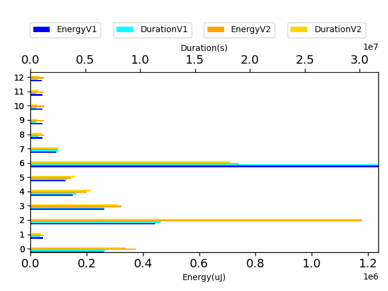

## com.squareup.javapoet.AnnotatedTypeNameTest

| Test | EnergyV1 | EnergyV2 | DeltaEnergy | DurationV1 | DurationsV2 | DeltaDuration |
| --- | --- | --- | --- | --- | --- | --- |
| com.squareup.javapoet.AnnotatedTypeNameTest-annotatedArrayTypeVarargsParameter | 42785.5 | 46875.0 | -4089.5 | 516194.0 | 367855.75 | 148338.25 |
| com.squareup.javapoet.AnnotatedTypeNameTest-annotatedOuterMultidimensionalArrayType | 45257.5 | 44677.5 | 580.0 | 394283.5 | 324179.0 | 70104.5 |
| com.squareup.javapoet.AnnotatedTypeNameTest-withoutAnnotationsOnAnnotatedEnclosingType | 43243.5 | 45486.25 | -2242.75 | 429179.5 | 456377.75 | -27198.25 |
| com.squareup.javapoet.AnnotatedTypeNameTest-annotatedTwice | 41320.375 | 45963.125 | -4642.75 | 292304.5 | 407548.0 | -115243.5 |
| com.squareup.javapoet.AnnotatedTypeNameTest-annotatedNestedType | 41488.5 | 39245 | 2243.5 | 329684.25 | 485197 | -155512.75 |
| com.squareup.javapoet.AnnotatedTypeNameTest-annotatedNestedParameterizedType | 43258.125 | 41748.0 | 1510.125 | 409486.375 | 347105.0 | 62381.375 |
| com.squareup.javapoet.AnnotatedTypeNameTest-annotatedArrayType | 44128.5 | 42602.0 | 1526.5 | 430109.5 | 436178.0 | -6068.5 |
| com.squareup.javapoet.AnnotatedTypeNameTest-annotatedEquivalence | 42541.5 | 41007.75 | 1533.75 | 276616.5 | 416580.125 | -139963.625 |
| com.squareup.javapoet.AnnotatedTypeNameTest-annotatedWildcardTypeNameWithSuper | 44006.5 | 45349.0 | -1342.5 | 285609.0 | 328346.0 | -42737.0 |
| com.squareup.javapoet.AnnotatedTypeNameTest-annotated | 42632.75 | 41534.0 | 1098.75 | 399987.75 | 458771.0 | -58783.25 |
| com.squareup.javapoet.AnnotatedTypeNameTest-annotatedParameterizedType | 48431.5 | 41107.25 | 7324.25 | 317463.5 | 360224.75 | -42761.25 |
| com.squareup.javapoet.AnnotatedTypeNameTest-annotatedArrayTypeInVarargsParameter | 41717.5 | 43533.25 | -1815.75 | 402133.5 | 470657.0 | -68523.5 |
| com.squareup.javapoet.AnnotatedTypeNameTest-annotatedEnclosingAndNestedType | 45349.0 | 44403.0 | 946.0 | 281947.0 | 328998.0 | -47051.0 |
| com.squareup.javapoet.AnnotatedTypeNameTest-withoutAnnotationsOnAnnotatedEnclosingAndNestedType | 47729.0 | 46722.0 | 1007.0 | 277699.0 | 338016.0 | -60317.0 |
| com.squareup.javapoet.AnnotatedTypeNameTest-withoutAnnotationsOnAnnotatedNestedType | 43029.0 | 40039.0 | 2990.0 | 413933.0 | 414900.0 | -967.0 |
| com.squareup.javapoet.AnnotatedTypeNameTest-annotatedType | 46753.0 | 47119.0 | -366.0 | 395315.0 | 309045.0 | 86270.0 |

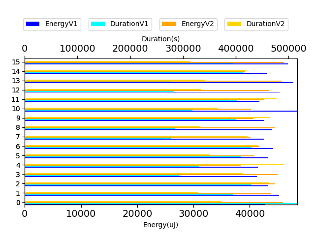

## com.squareup.javapoet.TypeSpecTest

| Test | EnergyV1 | EnergyV2 | DeltaEnergy | DurationV1 | DurationsV2 | DeltaDuration |
| --- | --- | --- | --- | --- | --- | --- |
| com.squareup.javapoet.TypeSpecTest-ifElse | 39444.0 | 37292.0 | 2152.0 | 576711.5 | 794661.5 | -217950.0 |
| com.squareup.javapoet.TypeSpecTest-indexedElseIf | 40573.25 | 43512.26953125 | -2939.01953125 | 880904.375 | 885699.134765625 | -4794.759765625 |
| com.squareup.javapoet.TypeSpecTest-nativeMethods | 41259.625 | 40180.25 | 1079.375 | 759127.5625 | 826553.6875 | -67426.125 |
| com.squareup.javapoet.TypeSpecTest-methodThrows | 34280.5625 | 45597.505859375 | -11316.943359375 | 1199308.75 | 1238992.71875 | -39683.96875 |
| com.squareup.javapoet.TypeSpecTest-enumWithSubclassing | 40083.25 | 42699.3046875 | -2616.0546875 | 1222015.64453125 | 1233193.984375 | -11178.33984375 |
| com.squareup.javapoet.TypeSpecTest-javadoc | 41146.328125 | 42267.359375 | -1121.03125 | 1056097.4140625 | 1130266.1171875 | -74168.703125 |
| com.squareup.javapoet.TypeSpecTest-annotatedParameters | 54542.671875 | 73752.052734375 | -19209.380859375 | 1674318.384765625 | 1746661.0390625 | -72342.654296875 |
| com.squareup.javapoet.TypeSpecTest-lineWrapping | 71800.322265625 | 79508.328125 | -7708.005859375 | 1828160.791015625 | 2177072.52734375 | -348911.736328125 |
| com.squareup.javapoet.TypeSpecTest-multilineStatementWithAnonymousClass | 42912.392578125 | 63828.041015625 | -20915.6484375 | 1373494.90234375 | 1773463.23828125 | -399968.3359375 |
| com.squareup.javapoet.TypeSpecTest-nullStringLiteral | 42579.0 | 39333.1875 | 3245.8125 | 634561.6875 | 712085.375 | -77523.6875 |
| com.squareup.javapoet.TypeSpecTest-annotationDeclarationToString | 39062.5 | 39429.0 | -366.5 | 437871.75 | 386847.5 | 51024.25 |
| com.squareup.javapoet.TypeSpecTest-stringFromAnything | 37032.625 | 37975.3125 | -942.6875 | 569649.375 | 616559.84375 | -46910.46875 |
| com.squareup.javapoet.TypeSpecTest-intersectionType | 42637.59375 | 41692.75 | 944.84375 | 806898.328125 | 811791.0625 | -4892.734375 |
| com.squareup.javapoet.TypeSpecTest-annotatedClass | 40331.609375 | 41534.25 | -1202.640625 | 825867.59375 | 769024.125 | 56843.46875 |
| com.squareup.javapoet.TypeSpecTest-nameFromParameter | 41076 | 39703.25 | 1372.75 | 350295 | 365229.75 | -14934.75 |
| com.squareup.javapoet.TypeSpecTest-codeBlocks | 100368.703125 | 129926.09765625 | -29557.39453125 | 2663320.998046875 | 3347808.5234375 | -684487.525390625 |
| com.squareup.javapoet.TypeSpecTest-enumsMayDefineAbstractMethods | 38164.3125 | 38906.44921875 | -742.13671875 | 835267.71875 | 844085.19140625 | -8817.47265625 |
| com.squareup.javapoet.TypeSpecTest-innerAnnotationInAnnotationDeclaration | 40262.1875 | 42373.1875 | -2111.0 | 738964.3125 | 1085442.4375 | -346478.125 |
| com.squareup.javapoet.TypeSpecTest-simpleNameConflictsWithTypeVariable | 59537.125 | 71911.19921875 | -12374.07421875 | 1345875.03125 | 1345478.63671875 | 396.39453125 |
| com.squareup.javapoet.TypeSpecTest-interfaceStaticMethods | 41710.0 | 44739 | -3029.0 | 531322.5 | 591613 | -60290.5 |
| com.squareup.javapoet.TypeSpecTest-retrofitStyleInterface | 78573.515625 | 42596.53125 | 35976.984375 | 1531715.953125 | 1644875.06640625 | -113159.11328125 |
| com.squareup.javapoet.TypeSpecTest-enumWithAnnotatedValues | 37243.0 | 41839.375 | -4596.375 | 803938.5625 | 734465.8125 | 69472.75 |
| com.squareup.javapoet.TypeSpecTest-interfaceExtends | 39344.9375 | 38414.375 | 930.5625 | 643791.96875 | 730647.9375 | -86855.96875 |
| com.squareup.javapoet.TypeSpecTest-annotatedField | 42061.09375 | 42819.78125 | -758.6875 | 954198.4375 | 868842.78125 | 85355.65625 |
| com.squareup.javapoet.TypeSpecTest-initializerBlockInRightPlace | 41448.7734375 | 42225.890625 | -777.1171875 | 789789.4296875 | 973347.015625 | -183557.5859375 |
| com.squareup.javapoet.TypeSpecTest-nestedClasses | 40694.96484375 | 54590.640625 | -13895.67578125 | 1350444.37109375 | 1647138.853515625 | -296694.482421875 |
| com.squareup.javapoet.TypeSpecTest-initializersToBuilder | 178456.470703125 | 205115.810546875 | -26659.33984375 | 4611471.453125 | 5110480.755859375 | -499009.302734375 |
| com.squareup.javapoet.TypeSpecTest-typeVariables | 70096.998046875 | 60381.259765625 | 9715.73828125 | 2169064.333984375 | 1864001.33203125 | 305063.001953125 |
| com.squareup.javapoet.TypeSpecTest-nameFromField | 40100 | 42938.0 | -2838.0 | 390732 | 354498.0 | 36234.0 |
| com.squareup.javapoet.TypeSpecTest-defaultModifiersForInterfaceMembers | 40279.25 | 38536.1875 | 1743.0625 | 710422.8125 | 931021.21875 | -220598.40625 |
| com.squareup.javapoet.TypeSpecTest-basic | 224165.806640625 | 225950.302734375 | -1784.49609375 | 5732528.599609375 | 5914485.1875 | -181956.587890625 |
| com.squareup.javapoet.TypeSpecTest-multipleMethodAddition | 41512.703125 | 42196.21875 | -683.515625 | 677983.640625 | 836132.09375 | -158148.453125 |
| com.squareup.javapoet.TypeSpecTest-multilineStatement | 41694.3125 | 39977.546875 | 1716.765625 | 749592.0 | 837464.28125 | -87872.28125 |
| com.squareup.javapoet.TypeSpecTest-referencedAndDeclaredSimpleNamesConflict | 42850.16015625 | 44932.15625 | -2081.99609375 | 1013685.68359375 | 1286444.6171875 | -272758.93359375 |
| com.squareup.javapoet.TypeSpecTest-lineWrappingWithZeroWidthSpace | 42854.3125 | 41864.25 | 990.0625 | 514726.125 | 612056.4375 | -97330.3125 |
| com.squareup.javapoet.TypeSpecTest-multipleAnnotationAddition | 39943.25 | 40679.5 | -736.25 | 749600.0 | 756709.25 | -7109.25 |
| com.squareup.javapoet.TypeSpecTest-multipleFieldAddition | 39878.75 | 40355.5 | -476.75 | 668014.875 | 757191.0625 | -89176.1875 |
| com.squareup.javapoet.TypeSpecTest-typeVariableWithBounds | 35781.296875 | 44001.390625 | -8220.09375 | 885700.984375 | 1190221.84375 | -304520.859375 |
| com.squareup.javapoet.TypeSpecTest-methodToString | 41900.875 | 43244.0 | -1343.125 | 481571.75 | 509763.5 | -28191.75 |
| com.squareup.javapoet.TypeSpecTest-defaultModifiersForMemberInterfacesAndEnums | 42459.28125 | 41259.0 | 1200.28125 | 631910.1875 | 641446.359375 | -9536.171875 |
| com.squareup.javapoet.TypeSpecTest-simpleNamesConflictInThisAndOtherPackage | 41656.65625 | 41301.625 | 355.03125 | 714878.4375 | 741747.3125 | -26868.875 |
| com.squareup.javapoet.TypeSpecTest-equalsAndHashCode | 55850.30859375 | 70747.896484375 | -14897.587890625 | 1423396.66796875 | 1609814.5859375 | -186417.91796875 |
| com.squareup.javapoet.TypeSpecTest-staticCodeBlock | 40868.59375 | 41453.046875 | -584.453125 | 723763.140625 | 983688.96875 | -259925.828125 |
| com.squareup.javapoet.TypeSpecTest-javadocWithTrailingLineDoesNotAddAnother | 42465.0 | 42480.5 | -15.5 | 501788.75 | 506644.125 | -4855.375 |
| com.squareup.javapoet.TypeSpecTest-typeFromReflectType | 41290.5 | 42633.0 | -1342.5 | 300564.0 | 391473.5 | -90909.5 |
| com.squareup.javapoet.TypeSpecTest-anonymousInnerClass | 44634.08203125 | 52443.041015625 | -7808.958984375 | 1581253.19140625 | 1714431.88671875 | -133178.6953125 |
| com.squareup.javapoet.TypeSpecTest-enumWithMembersButNoConstructorCall | 40855.1875 | 46047.6953125 | -5192.5078125 | 891439.5625 | 919154.140625 | -27714.578125 |
| com.squareup.javapoet.TypeSpecTest-typeFromTypeMirror | 41831.8125 | 40918.296875 | 913.515625 | 698651.84375 | 751294.75 | -52642.90625 |
| com.squareup.javapoet.TypeSpecTest-membersOrdering | 40913.30859375 | 64744.884765625 | -23831.576171875 | 1031135.234375 | 1279244.318359375 | -248109.083984375 |
| com.squareup.javapoet.TypeSpecTest-classImplementsExtends | 36895.765625 | 43404.90625 | -6509.140625 | 848822.4375 | 957872.28125 | -109049.84375 |
| com.squareup.javapoet.TypeSpecTest-enumImplements | 68143.875 | 90795.4375 | -22651.5625 | 1684272.6875 | 2102098.40625 | -417825.71875 |
| com.squareup.javapoet.TypeSpecTest-multipleSuperinterfaceAddition | 42190.5 | 42110.0625 | 80.4375 | 670152.75 | 814620.5625 | -144467.8125 |
| com.squareup.javapoet.TypeSpecTest-annotation | 42526.25 | 40363.15625 | 2163.09375 | 589829.5 | 772695.03125 | -182865.53125 |
| com.squareup.javapoet.TypeSpecTest-interfaceDefaultMethods | 40527.4375 | 39115.875 | 1411.5625 | 556209.375 | 679532.625 | -123323.25 |
| com.squareup.javapoet.TypeSpecTest-annotationsInAnnotations | 39377.984375 | 51756.796875 | -12378.8125 | 939800.875 | 1287195.6875 | -347394.8125 |
| com.squareup.javapoet.TypeSpecTest-parameterToString | 43761.75 | 41641.0 | 2120.75 | 467279.0 | 477819.5 | -10540.5 |
| com.squareup.javapoet.TypeSpecTest-interestingTypes | 39966.375 | 40598.41015625 | -632.03515625 | 854905.234375 | 1049459.63671875 | -194554.40234375 |
| com.squareup.javapoet.TypeSpecTest-constructorToString | 39306.0 | 39825.0 | -519.0 | 478532.0 | 457866.5 | 20665.5 |
| com.squareup.javapoet.TypeSpecTest-doWhile | 41938.125 | 619684.96875 | -577746.84375 | 586791.0 | 17894186.28125 | -17307395.28125 |
| com.squareup.javapoet.TypeSpecTest-tryCatch | 37636.125 | 39121.3125 | -1485.1875 | 620271.625 | 720937.9375 | -100666.3125 |
| com.squareup.javapoet.TypeSpecTest-multilineStrings | 41839.375 | 41101.4375 | 737.9375 | 593490.3125 | 793311.234375 | -199820.921875 |
| com.squareup.javapoet.TypeSpecTest-arrayType | 37662.5 | 42727.109375 | -5064.609375 | 685206.1875 | 769758.890625 | -84552.703125 |
| com.squareup.javapoet.TypeSpecTest-annotationsAndJavaLangTypes | 43419.125 | 41301.375 | 2117.75 | 838540.375 | 865546.9375 | -27006.5625 |
| com.squareup.javapoet.TypeSpecTest-multipleTypeVariableAddition | 42560.6875 | 36514.25 | 6046.4375 | 607199.0625 | 676700.0 | -69500.9375 |
| com.squareup.javapoet.TypeSpecTest-annotationWithFields | 39062.0625 | 37658.5 | 1403.5625 | 629589.0625 | 599693.5 | 29895.5625 |
| com.squareup.javapoet.TypeSpecTest-anonymousClassToString | 41885.5 | 43335.0 | -1449.5 | 517629.125 | 586721.0 | -69091.875 |
| com.squareup.javapoet.TypeSpecTest-javadocEnsuresTrailingLine | 41870.0 | 44068 | -2198.0 | 383167.0 | 542230 | -159063.0 |
| com.squareup.javapoet.TypeSpecTest-inlineIndent | 39917.0 | 38635.125 | 1281.875 | 574082.0 | 684117.53125 | -110035.53125 |
| com.squareup.javapoet.TypeSpecTest-interfaceClassToString | 36803.5 | 40786.625 | -3983.125 | 440171.5 | 377479.125 | 62692.375 |
| com.squareup.javapoet.TypeSpecTest-nameFromType | 40855.125 | 38635.0 | 2220.125 | 430840.875 | 448039.0 | -17198.125 |
| com.squareup.javapoet.TypeSpecTest-multipleTypeAddition | 42045.875 | 40745.0625 | 1300.8125 | 559150.0 | 634036.3125 | -74886.3125 |
| com.squareup.javapoet.TypeSpecTest-literalFromAnything | 40985.0 | 41564.5 | -579.5 | 619348.75 | 611335.25 | 8013.5 |
| com.squareup.javapoet.TypeSpecTest-varargs | 40096.375 | 41579.84375 | -1483.46875 | 705246.5625 | 785036.0 | -79789.4375 |
| com.squareup.javapoet.TypeSpecTest-elseIf | 39825.25 | 42055.125 | -2229.875 | 740033.75 | 796127.125 | -56093.375 |
| com.squareup.javapoet.TypeSpecTest-codeBlockAddStatementOfCodeBlockToString | 39947.5 | 43121.5 | -3174.0 | 363380.0 | 409790.0 | -46410.0 |
| com.squareup.javapoet.TypeSpecTest-typeFromTypeElement | 39123.0 | 38749.75 | 373.25 | 634865.25 | 692935.0 | -58069.75 |
| com.squareup.javapoet.TypeSpecTest-annotationToString | 38940.0 | 38860.125 | 79.875 | 516812.0 | 532384.5 | -15572.5 |
| com.squareup.javapoet.TypeSpecTest-nameFromMethod | 40955.0 | 967252.5 | -926297.5 | 434018.0 | 25313754.75 | -24879736.75 |
| com.squareup.javapoet.TypeSpecTest-fieldToString | 41511.125 | 41565.5 | -54.375 | 432330.5 | 458701.5 | -26371.0 |
| com.squareup.javapoet.TypeSpecTest-classImplementsNestedClass | 38635.125 | 40195.65625 | -1560.53125 | 790786.125 | 978241.53125 | -187455.40625 |
| com.squareup.javapoet.TypeSpecTest-codeBlockToString | 40344.0 | 41015.5 | -671.5 | 353975.0 | 478685.0 | -124710.0 |
| com.squareup.javapoet.TypeSpecTest-invalidSuperClass | 41564.0 | 41801.5 | -237.5 | 555861.0 | 530222.375 | 25638.625 |
| com.squareup.javapoet.TypeSpecTest-typeFromTypeName | 41626.0 | 38574.0 | 3052.0 | 369423.0 | 372807.0 | -3384.0 |

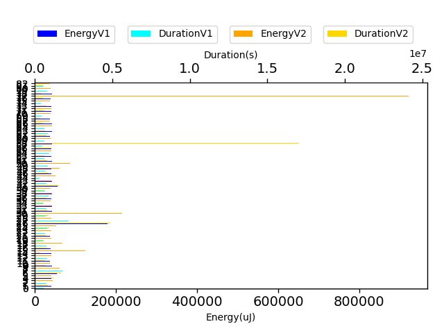

## com.squareup.javapoet.CodeBlockTest

| Test | EnergyV1 | EnergyV2 | DeltaEnergy | DurationV1 | DurationsV2 | DeltaDuration |
| --- | --- | --- | --- | --- | --- | --- |
| com.squareup.javapoet.CodeBlockTest-joiningWithPrefixAndSuffix | 70293.474609375 | 80908.728515625 | -10615.25390625 | 2519775.25 | 2387889.2890625 | 131885.9609375 |
| com.squareup.javapoet.CodeBlockTest-sameIndexCanBeUsedWithDifferentFormats | 35995.25 | 33218.5 | 2776.75 | 719848.0 | 777361.25 | -57513.25 |
| com.squareup.javapoet.CodeBlockTest-stringFormatCanBeIndexed | 49706.578125 | 94467.25 | -44760.671875 | 1549605.203125 | 2591970.0 | -1042364.796875 |
| com.squareup.javapoet.CodeBlockTest-literalFormatCanBeIndexed | 47744.375 | 35415.5625 | 12328.8125 | 1089534.375 | 666500.875 | 423033.5 |
| com.squareup.javapoet.CodeBlockTest-repeatedNamedArgument | 38086.0 | 34423.5 | 3662.5 | 782146.125 | 718646.75 | 63499.375 |
| com.squareup.javapoet.CodeBlockTest-nameFormatCanBeIndexed | 35339.0 | 50242.8125 | -14903.8125 | 580571.5 | 1460887.9375 | -880316.4375 |
| com.squareup.javapoet.CodeBlockTest-equalsAndHashCode | 50858.23828125 | 46027.728515625 | 4830.509765625 | 1997564.10546875 | 1836837.548828125 | 160726.556640625 |
| com.squareup.javapoet.CodeBlockTest-joining | 1565914.7578125 | 991347.3984375 | 574567.359375 | 47055186.1328125 | 32565037.125 | 14490149.0078125 |
| com.squareup.javapoet.CodeBlockTest-multipleNamedArguments | 35614.0 | 35515.125 | 98.875 | 762269.5 | 703604.375 | 58665.125 |
| com.squareup.javapoet.CodeBlockTest-namedAndNoArgFormat | 37712.640625 | 35547.28125 | 2165.359375 | 1037949.859375 | 799110.1875 | 238839.671875 |
| com.squareup.javapoet.CodeBlockTest-typeFormatCanBeIndexed | 37918.0 | 34759.25 | 3158.75 | 659157.5 | 704286.0 | -45128.5 |
| com.squareup.javapoet.CodeBlockTest-joiningSingle | 36255.0 | 34942.4375 | 1312.5625 | 576009.75 | 576014.6875 | -4.9375 |
| com.squareup.javapoet.CodeBlockTest-namedNewline | 37475.75 | 35812.25 | 1663.5 | 699742.5 | 869944.25 | -170201.75 |
| com.squareup.javapoet.CodeBlockTest-join | 556375.9375 | 1585691.296875 | -1029315.359375 | 16208714.0625 | 50949527.3125 | -34740813.25 |
| com.squareup.javapoet.CodeBlockTest-simpleNamedArgument | 68443.25 | 34500.0 | 33943.25 | 2334242.125 | 805465.0 | 1528777.125 |
| com.squareup.javapoet.CodeBlockTest-of | 33142.0 | 31655.71875 | 1486.28125 | 959498.0 | 1147889.875 | -188391.875 |

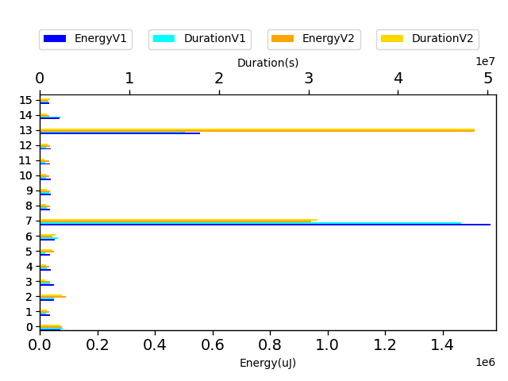

## com.squareup.javapoet.AbstractTypesTest

| Test | EnergyV1 | EnergyV2 | DeltaEnergy | DurationV1 | DurationsV2 | DeltaDuration |
| --- | --- | --- | --- | --- | --- | --- |
| com.squareup.javapoet.AbstractTypesTest-getTypeVariableTypeMirror | 85121.8125 | 88405.103515625 | -3283.291015625 | 2516085.517578125 | 2498405.08984375 | 17680.427734375 |
| com.squareup.javapoet.AbstractTypesTest-getArrayTypeMirror | 35652.25 | 40156.21875 | -4503.96875 | 774278.0625 | 769493.984375 | 4784.078125 |
| com.squareup.javapoet.AbstractTypesTest-getBasicTypeMirror | 88228.068359375 | 100128.251953125 | -11900.18359375 | 2987813.244140625 | 3029777.197265625 | -41963.953125 |
| com.squareup.javapoet.AbstractTypesTest-errorTypes | 322652.8203125 | 380135.88671875 | -57483.06640625 | 11148096.71484375 | 11224007.138671875 | -75910.423828125 |
| com.squareup.javapoet.AbstractTypesTest-getTypeVariableTypeMirrorRecursive | 124192.28125 | 116795.73828125 | 7396.54296875 | 3728485.888671875 | 3682458.208984375 | 46027.6796875 |
| com.squareup.javapoet.AbstractTypesTest-wildcardExtendsObject | 39002 | 45715.0 | -6713.0 | 324926 | 348539.0 | -23613.0 |
| com.squareup.javapoet.AbstractTypesTest-getParameterizedTypeMirror | 58746.208984375 | 54389.212890625 | 4356.99609375 | 1825765.947265625 | 1843819.3515625 | -18053.404296875 |
| com.squareup.javapoet.AbstractTypesTest-wildcardSuperType | 40345.0 | 41076.0 | -731.0 | 305084.0 | 321419.0 | -16335.0 |
| com.squareup.javapoet.AbstractTypesTest-wildcardMirrorNoBounds | 41137.5 | 35339.0 | 5798.5 | 375705.0 | 400445.0 | -24740.0 |
| com.squareup.javapoet.AbstractTypesTest-wildcardMirrorSuperType | 38635.0 | 38739.203125 | -104.203125 | 730030.5 | 720166.625 | 9863.875 |
| com.squareup.javapoet.AbstractTypesTest-wildcardExtendsType | 36987.0 | 41626.0 | -4639.0 | 335566.0 | 330402.0 | 5164.0 |
| com.squareup.javapoet.AbstractTypesTest-wildcardMirrorExtendsType | 36804.0 | 33615.0 | 3189.0 | 495576.0 | 553064.25 | -57488.25 |
| com.squareup.javapoet.AbstractTypesTest-box | 27023.25 | 34973.0 | -7949.75 | 411101.75 | 450233.0 | -39131.25 |
| com.squareup.javapoet.AbstractTypesTest-typeVariable | 26855.0 | 28488.25 | -1633.25 | 433755.0 | 391451.0 | 42304.0 |
| com.squareup.javapoet.AbstractTypesTest-unbox | 32379.0 | 24902.5 | 7476.5 | 410612.0 | 459251.0 | -48639.0 |

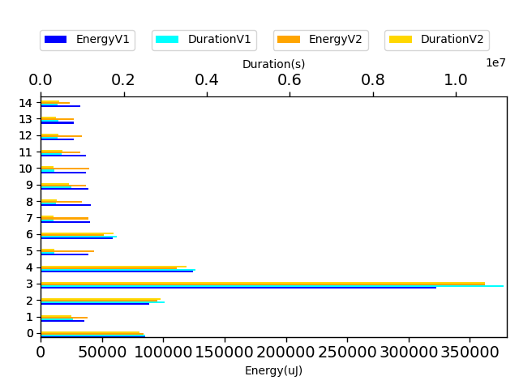

## com.squareup.javapoet.JavaFileTest

| Test | EnergyV1 | EnergyV2 | DeltaEnergy | DurationV1 | DurationsV2 | DeltaDuration |
| --- | --- | --- | --- | --- | --- | --- |
| com.squareup.javapoet.JavaFileTest-importStaticMixed | 34268.5546875 | 37173.125 | -2904.5703125 | 946694.2734375 | 975599.0390625 | -28904.765625 |
| com.squareup.javapoet.JavaFileTest-packageClassConflictsWithNestedClass | 34561.25 | 36133.0 | -1571.75 | 400812.9375 | 434797.0 | -33984.0625 |
| com.squareup.javapoet.JavaFileTest-importStaticReadmeExample | 32291.6875 | 32627.046875 | -335.359375 | 911040.6875 | 1032377.4375 | -121336.75 |
| com.squareup.javapoet.JavaFileTest-defaultPackage | 32583.22265625 | 30580.65625 | 2002.56640625 | 1378640.423828125 | 682583.78125 | 696056.642578125 |
| com.squareup.javapoet.JavaFileTest-skipJavaLangImportsWithConflictingClassFirst | 33714.375 | 34820.5 | -1106.125 | 447638.0 | 525605.0 | -77967.0 |
| com.squareup.javapoet.JavaFileTest-conflictingParentName | 33557.875 | 31637.8125 | 1920.0625 | 677557.625 | 683786.515625 | -6228.890625 |
| com.squareup.javapoet.JavaFileTest-topOfFileComment | 33142.0 | 37902.0 | -4760.0 | 508284.25 | 382199.0 | 126085.25 |
| com.squareup.javapoet.JavaFileTest-skipJavaLangImportsWithConflictingClassLast | 35064.0 | 32706.875 | 2357.125 | 457308.0 | 546551.625 | -89243.625 |
| com.squareup.javapoet.JavaFileTest-importStaticTwice | 40344.0 | 36067.6875 | 4276.3125 | 561514.0 | 666735.625 | -105221.625 |
| com.squareup.javapoet.JavaFileTest-conflictingNameOutOfScope | 32429.0625 | 34790.0 | -2360.9375 | 619606.1875 | 685983.25 | -66377.0625 |
| com.squareup.javapoet.JavaFileTest-importStaticNone | 31864.25 | 33954.34375 | -2090.09375 | 729213.1875 | 808947.25 | -79734.0625 |
| com.squareup.javapoet.JavaFileTest-superclassReferencesSelf | 52185.0 | 33736.875 | 18448.125 | 15326788.5 | 730404.375 | 14596384.125 |
| com.squareup.javapoet.JavaFileTest-importStaticForCrazyFormatsWorks | 37011.625 | 37181.765625 | -170.140625 | 815721.921875 | 988313.859375 | -172591.9375 |
| com.squareup.javapoet.JavaFileTest-conflictingAnnotationReferencedClass | 31235.0 | 91255.15625 | -60020.15625 | 561236.5 | 20426062.703125 | -19864826.203125 |
| com.squareup.javapoet.JavaFileTest-nestedClassAndSuperclassShareName | 34072.75 | 33836.125 | 236.625 | 611583.625 | 604879.125 | 6704.5 |
| com.squareup.javapoet.JavaFileTest-noImports | 39878.75 | 36438.0 | 3440.75 | 369894.0 | 402256.5 | -32362.5 |
| com.squareup.javapoet.JavaFileTest-importStaticUsingWildcards | 36697.25 | 32951.625 | 3745.625 | 518195.25 | 581532.5 | -63337.25 |
| com.squareup.javapoet.JavaFileTest-conflictingImports | 32485.75 | 37567.0 | -5081.25 | 429526.5 | 522790.625 | -93264.125 |
| com.squareup.javapoet.JavaFileTest-importStaticOnce | 38146.625 | 36384.5 | 1762.125 | 537318.25 | 632755.5 | -95437.25 |
| com.squareup.javapoet.JavaFileTest-conflictingChildName | 30746.0 | 35415.5 | -4669.5 | 585248.875 | 639204.5 | -53955.625 |
| com.squareup.javapoet.JavaFileTest-singleImport | 34592.0 | 37414.5 | -2822.5 | 437393.75 | 446123.25 | -8729.5 |
| com.squareup.javapoet.JavaFileTest-annotationIsNestedClass | 49804.75 | 34377.75 | 15427.0 | 2490735.6875 | 669645.625 | 1821090.0625 |
| com.squareup.javapoet.JavaFileTest-modifyStaticImports | 36529.5 | 40039.0 | -3509.5 | 479410.0 | 373283.5 | 106126.5 |
| com.squareup.javapoet.JavaFileTest-packageClassConflictsWithSuperlass | 32928.0 | 33813.0 | -885.0 | 429093.0 | 414016.0 | 15077.0 |
| com.squareup.javapoet.JavaFileTest-defaultPackageTypesAreNotImported | 34469.5 | 35507.5 | -1038.0 | 687238.25 | 392913.0 | 294325.25 |
| com.squareup.javapoet.JavaFileTest-conflictingTypeVariableBound | 30639.5 | 32753.375 | -2113.875 | 546904.0 | 884074.96875 | -337170.96875 |
| com.squareup.javapoet.JavaFileTest-classAndSuperclassShareName | 37476.0 | 30029.0 | 7447.0 | 380016.0 | 360720.0 | 19296.0 |
| com.squareup.javapoet.JavaFileTest-conflictingAnnotation | 31189.0 | 441466.5 | -410277.5 | 395572.0 | 15842041.0 | -15446469.0 |

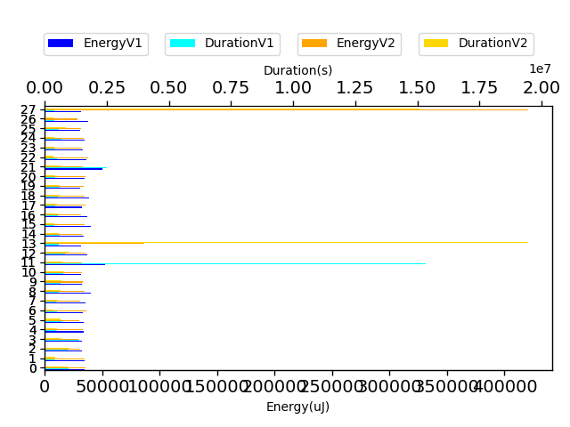

## com.squareup.javapoet.ClassNameTest

| Test | EnergyV1 | EnergyV2 | DeltaEnergy | DurationV1 | DurationsV2 | DeltaDuration |
| --- | --- | --- | --- | --- | --- | --- |
| com.squareup.javapoet.ClassNameTest-classNameFromTypeElementDoesntUseGetKind | 8651612.95703125 | 8576262.087890625 | 75350.869140625 | 204853857.25976562 | 205244523.38671875 | -390666.126953125 |
| com.squareup.javapoet.ClassNameTest-classNameFromClass | 45101.02734375 | 45106.30859375 | -5.28125 | 1036244.6875 | 1090494.419921875 | -54249.732421875 |
| com.squareup.javapoet.ClassNameTest-classNameFromTypeElement | 122807.466796875 | 122961.013671875 | -153.546875 | 3122596.744140625 | 3143084.330078125 | -20487.5859375 |
| com.squareup.javapoet.ClassNameTest-bestGuessForString_defaultPackage | 40909.0 | 42690.0625 | -1781.0625 | 382447.5 | 431540.9375 | -49093.4375 |
| com.squareup.javapoet.ClassNameTest-bestGuessForString_nestedClass | 40260.0 | 41646.96875 | -1386.96875 | 775076.1875 | 824591.609375 | -49515.421875 |
| com.squareup.javapoet.ClassNameTest-peerClass | 44220.0 | 41555.1328125 | 2664.8671875 | 470351.5 | 513368.5078125 | -43017.0078125 |

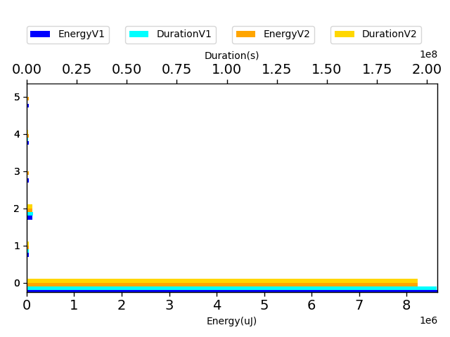

## com.squareup.javapoet.FileWritingTest

| Test | EnergyV1 | EnergyV2 | DeltaEnergy | DurationV1 | DurationsV2 | DeltaDuration |
| --- | --- | --- | --- | --- | --- | --- |
| com.squareup.javapoet.FileWritingTest-filerPassesOriginatingElements | 8866507.83984375 | 8776851.2109375 | 89656.62890625 | 257455377.28710938 | 258035380.33984375 | -580003.052734375 |
| com.squareup.javapoet.FileWritingTest-filerNestedClasses | 82532.345703125 | 85055.77734375 | -2523.431640625 | 2039066.796875 | 2276759.515625 | -237692.71875 |
| com.squareup.javapoet.FileWritingTest-fileIsUtf8 | 36886.28125 | 37301.578125 | -415.296875 | 1221615.5234375 | 1000112.46875 | 221503.0546875 |
| com.squareup.javapoet.FileWritingTest-pathDefaultPackage | 83376.17578125 | 122222.935546875 | -38846.759765625 | 2779733.4296875 | 2821705.953125 | -41972.5234375 |
| com.squareup.javapoet.FileWritingTest-fileNestedClasses | 41901.837890625 | 44026.53515625 | -2124.697265625 | 1178691.5859375 | 1316947.775390625 | -138256.189453125 |
| com.squareup.javapoet.FileWritingTest-filerDefaultPackage | 93021.01171875 | 121985.693359375 | -28964.681640625 | 2437684.189453125 | 2509695.93359375 | -72011.744140625 |
| com.squareup.javapoet.FileWritingTest-filerClassesWithTabIndent | 80457.87890625 | 106635.318359375 | -26177.439453125 | 3155256.955078125 | 3294295.439453125 | -139038.484375 |
| com.squareup.javapoet.FileWritingTest-pathNestedClasses | 44482.65234375 | 80158.689453125 | -35676.037109375 | 1639202.98828125 | 1802126.48046875 | -162923.4921875 |
| com.squareup.javapoet.FileWritingTest-fileDefaultPackage | 220826.279296875 | 228254.517578125 | -7428.23828125 | 5698375.9140625 | 5614468.25 | 83907.6640625 |

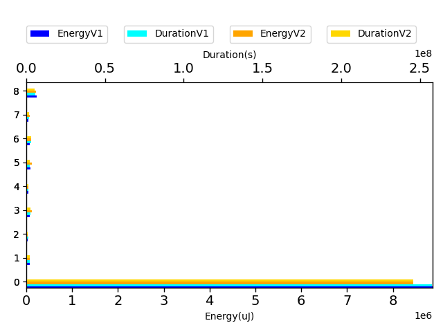

## com.squareup.javapoet.AnnotationSpecTest

| Test | EnergyV1 | EnergyV2 | DeltaEnergy | DurationV1 | DurationsV2 | DeltaDuration |
| --- | --- | --- | --- | --- | --- | --- |
| com.squareup.javapoet.AnnotationSpecTest-defaultAnnotation | 159583.978515625 | 156824.689453125 | 2759.2890625 | 4549050.4296875 | 4564684.0234375 | -15633.59375 |
| com.squareup.javapoet.AnnotationSpecTest-defaultAnnotationWithImport | 97824.32421875 | 116439.083984375 | -18614.759765625 | 3136111.390625 | 3334403.74609375 | -198292.35546875 |
| com.squareup.javapoet.AnnotationSpecTest-defaultAnnotationToBuilder | 101117.9453125 | 103456.962890625 | -2339.017578125 | 2695120.51171875 | 2748051.423828125 | -52930.912109375 |
| com.squareup.javapoet.AnnotationSpecTest-reflectAnnotationWithDefaults | 66343.384765625 | 79907.0078125 | -13563.623046875 | 1633133.05859375 | 1850370.791015625 | -217237.732421875 |
| com.squareup.javapoet.AnnotationSpecTest-equalsAndHashCode | 52377.1875 | 55005.8515625 | -2628.6640625 | 1311575.57421875 | 1327939.501953125 | -16363.927734375 |
| com.squareup.javapoet.AnnotationSpecTest-reflectAnnotation | 289046.681640625 | 308694.36328125 | -19647.681640625 | 8590066.46875 | 8254197.34375 | 335869.125 |
| com.squareup.javapoet.AnnotationSpecTest-dynamicArrayOfEnumConstants | 35766.5 | 38764.71875 | -2998.21875 | 736359.75 | 797644.0 | -61284.25 |
| com.squareup.javapoet.AnnotationSpecTest-emptyArray | 33142.5 | 39642.0 | -6499.5 | 396516.5 | 504911.5 | -108395.0 |
| com.squareup.javapoet.AnnotationSpecTest-modifyMembers | 41016.0 | 36285.0 | 4731.0 | 463024.0 | 410702.0 | 52322.0 |

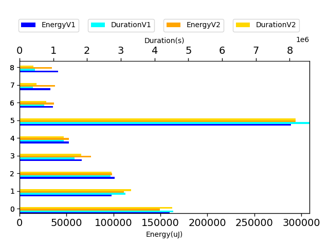

## com.squareup.javapoet.FileReadingTest

| Test | EnergyV1 | EnergyV2 | DeltaEnergy | DurationV1 | DurationsV2 | DeltaDuration |
| --- | --- | --- | --- | --- | --- | --- |
| com.squareup.javapoet.FileReadingTest-javaFileObjectCharacterContent | 41160.5390625 | 39127.51953125 | 2033.01953125 | 977282.35546875 | 1011286.337890625 | -34003.982421875 |
| com.squareup.javapoet.FileReadingTest-compileJavaFile | 2414178.5078125 | 2120907.380859375 | 293271.126953125 | 62011579.41015625 | 57008937.892578125 | 5002641.517578125 |
| com.squareup.javapoet.FileReadingTest-javaFileObjectInputStreamIsUtf8 | 111969.751953125 | 97341.552734375 | 14628.19921875 | 2859591.318359375 | 2733015.076171875 | 126576.2421875 |

## com.squareup.javapoet.TypeNameTest

| Test | EnergyV1 | EnergyV2 | DeltaEnergy | DurationV1 | DurationsV2 | DeltaDuration |
| --- | --- | --- | --- | --- | --- | --- |
| com.squareup.javapoet.TypeNameTest-innerClassInGenericType | 51370.80859375 | 48631.83203125 | 2738.9765625 | 1211002.7421875 | 984119.640625 | 226883.1015625 |
| com.squareup.javapoet.TypeNameTest-innerGenericInGenericType | 43922.0 | 43884.0 | 38.0 | 651104.875 | 626483.0 | 24621.875 |
| com.squareup.javapoet.TypeNameTest-equalsAndHashCodePrimitive | 43884.0 | 40344.5 | 3539.5 | 433701.0 | 372436.0 | 61265.0 |
| com.squareup.javapoet.TypeNameTest-genericType | 43448.9296875 | 46798.4375 | -3349.5078125 | 1549058.296875 | 1306537.0625 | 242521.234375 |
| com.squareup.javapoet.TypeNameTest-equalsAndHashCodeParameterizedTypeName | 44510.0 | 44953.0 | -443.0 | 393897.25 | 450153.5 | -56256.25 |
| com.squareup.javapoet.TypeNameTest-equalsAndHashCodeWildcardTypeName | 42083.5 | 47791.0 | -5707.5 | 396624.5 | 373594.0 | 23030.5 |
| com.squareup.javapoet.TypeNameTest-isBoxedPrimitive | 48263.0 | 43655.5 | 4607.5 | 389061.0 | 402241.25 | -13180.25 |
| com.squareup.javapoet.TypeNameTest-equalsAndHashCodeClassName | 45807.0 | 44616.25 | 1190.75 | 334309.0 | 350311.0 | -16002.0 |
| com.squareup.javapoet.TypeNameTest-equalsAndHashCodeArrayTypeName | 45318.0 | 37536.0 | 7782.0 | 342994.0 | 291374.0 | 51620.0 |

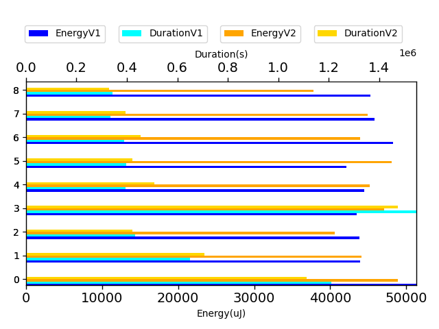

## ClassNameNoPackageTest

| Test | EnergyV1 | EnergyV2 | DeltaEnergy | DurationV1 | DurationsV2 | DeltaDuration |
| --- | --- | --- | --- | --- | --- | --- |
| ClassNameNoPackageTest-shouldSupportClassInDefaultPackage | 555567.544921875 | 552845.763671875 | 2721.78125 | 15865880.1875 | 16988431.94921875 | -1122551.76171875 |

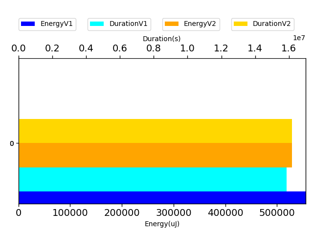

## com.squareup.javapoet.ParameterSpecTest

| Test | EnergyV1 | EnergyV2 | DeltaEnergy | DurationV1 | DurationsV2 | DeltaDuration |
| --- | --- | --- | --- | --- | --- | --- |
| com.squareup.javapoet.ParameterSpecTest-parameterVariableElement | 110225.236328125 | 91607.814453125 | 18617.421875 | 2451373.8359375 | 2517840.400390625 | -66466.564453125 |
| com.squareup.javapoet.ParameterSpecTest-equalsAndHashCode | 43228.0 | 44392.0 | -1164.0 | 477955.0 | 548942.875 | -70987.875 |

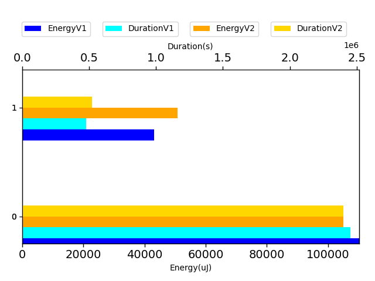

## com.squareup.javapoet.FieldSpecTest

| Test | EnergyV1 | EnergyV2 | DeltaEnergy | DurationV1 | DurationsV2 | DeltaDuration |
| --- | --- | --- | --- | --- | --- | --- |
| com.squareup.javapoet.FieldSpecTest-equalsAndHashCode | 33103.5 | 35247.75 | -2144.25 | 723299.5 | 708933.75 | 14365.75 |

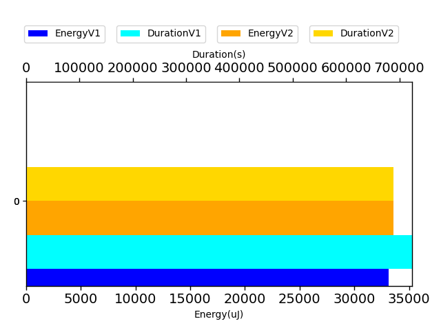

