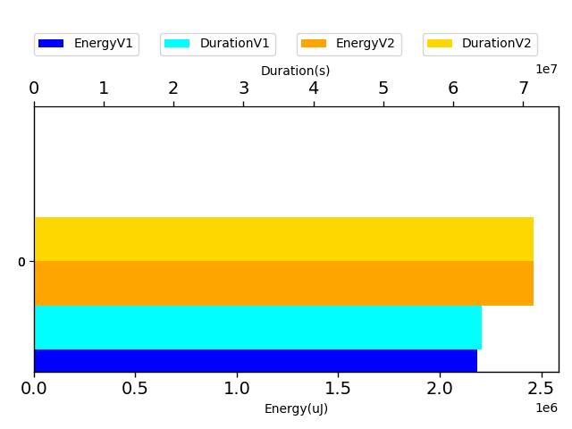
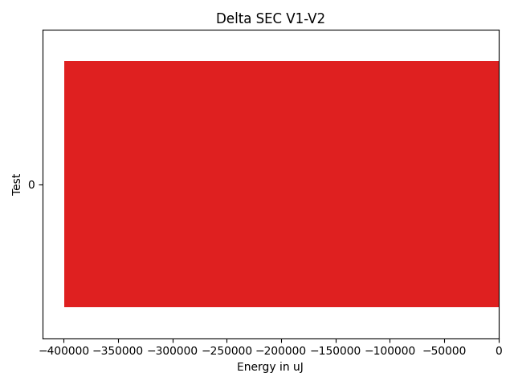

# javapoet 122580

http://github.com/square/javapoet/commit/122580

| Index | EnergyV1 | EnergyV2 | DeltaEnergy | DurationV1 | DurationsV2 | DeltaDuration |
| --- | --- | --- | --- | --- | --- | --- |
| 0 | 2186162.984375 | 2585561.94921875 | -399398.96484375 | 64047927.232421875 | 75048379.92382812 | -11000452.69140625 |

| TestClassName | Index |
| --- | --- |
| com.squareup.javapoet.TypeSpecTest | 0 |
## com.squareup.javapoet.TypeSpecTest

| Test | EnergyV1 | EnergyV2 | DeltaEnergy | DurationV1 | DurationsV2 | DeltaDuration |
| --- | --- | --- | --- | --- | --- | --- |
| com.squareup.javapoet.TypeSpecTest-initializersToBuilder | 2186162.984375 | 2585561.94921875 | -399398.96484375 | 64047927.232421875 | 75048379.92382812 | -11000452.69140625 |

