# javapoet e2ed02

http://github.com/square/javapoet/commit/e2ed02

| Index | EnergyV1 | EnergyV2 | DeltaEnergy | DurationV1 | DurationsV2 | DeltaDuration |
| --- | --- | --- | --- | --- | --- | --- |
| 0 | 1116643.869140625 | 1162450.765625 | -45806.896484375 | 28700079.595703125 | 24564521.578125 | 4135558.017578125 |
| 1 | 2615966.10546875 | 2678939.939453125 | -62973.833984375 | 68563336.71875 | 71223135.94921875 | -2659799.23046875 |
| 2 | 3547282.255859375 | 2966962.953125 | 580319.302734375 | 106552441.01757812 | 90903950.79101562 | 15648490.2265625 |
| 3 | 773298.625 | 784710.5 | -11411.875 | 5630489.875 | 6391660.0 | -761170.125 |
| 4 | 1069772.296875 | 1010797.662109375 | 58974.634765625 | 27016282.83203125 | 26252169.359375 | 764113.47265625 |
| 5 | 3709733.01171875 | 3732440.39453125 | -22707.3828125 | 71745624.88671875 | 70240710.83398438 | 1504914.052734375 |
| 6 | 519145.7578125 | 485513.341796875 | 33632.416015625 | 6058018.12890625 | 5586714.736328125 | 471303.392578125 |
| 7 | 8813040.6640625 | 8557500.5234375 | 255540.140625 | 209809839.19726562 | 207223385.859375 | 2586453.337890625 |
| 8 | 10339489.533203125 | 9145505.0 | 1193984.533203125 | 284921018.2363281 | 274500293.515625 | 10420724.720703125 |
| 9 | 912669.58203125 | 901793.560546875 | 10876.021484375 | 23008262.74609375 | 22573219.666015625 | 435043.080078125 |
| 10 | 2502331.947265625 | 2363260.767578125 | 139071.1796875 | 63924030.529296875 | 62476003.9765625 | 1448026.552734375 |
| 11 | 495064.82421875 | 477672.67578125 | 17392.1484375 | 16018974.001953125 | 15092538.55078125 | 926435.451171875 |
| 12 | 124602.5 | 121338.0 | 3264.5 | 739009.0 | 660625.0 | 78384.0 |
| 13 | 142838.298828125 | 152185.322265625 | -9347.0234375 | 3212612.109375 | 2973209.294921875 | 239402.814453125 |
| 14 | 41351.5 | 35736.0 | 5615.5 | 578433.5 | 680952.75 | -102519.25 |

| TestClassName | Index |
| --- | --- |
| com.squareup.javapoet.JavaFileTest | 0 |
| com.squareup.javapoet.MethodSpecTest | 1 |
| com.squareup.javapoet.CodeBlockTest | 2 |
| com.squareup.javapoet.AnnotatedTypeNameTest | 3 |
| com.squareup.javapoet.AbstractTypesTest | 4 |
| com.squareup.javapoet.TypeSpecTest | 5 |
| com.squareup.javapoet.TypeNameTest | 6 |
| com.squareup.javapoet.ClassNameTest | 7 |
| com.squareup.javapoet.FileWritingTest | 8 |
| com.squareup.javapoet.AnnotationSpecTest | 9 |
| com.squareup.javapoet.FileReadingTest | 10 |
| ClassNameNoPackageTest | 11 |
| com.squareup.javapoet.LineWrapperTest | 12 |
| com.squareup.javapoet.ParameterSpecTest | 13 |
| com.squareup.javapoet.FieldSpecTest | 14 |
## com.squareup.javapoet.JavaFileTest

| Test | EnergyV1 | EnergyV2 | DeltaEnergy | DurationV1 | DurationsV2 | DeltaDuration |
| --- | --- | --- | --- | --- | --- | --- |
| com.squareup.javapoet.JavaFileTest-topOfFileComment | 34469.5 | 41503.75 | -7034.25 | 411040.25 | 493437.375 | -82397.125 |
| com.squareup.javapoet.JavaFileTest-noImports | 39646.4375 | 38833.375 | 813.0625 | 386558.625 | 422382.0 | -35823.375 |
| com.squareup.javapoet.JavaFileTest-skipJavaLangImportsWithConflictingClassLast | 42167.375 | 40321.375 | 1846.0 | 488093.0 | 425046.0 | 63047.0 |
| com.squareup.javapoet.JavaFileTest-importStaticTwice | 35789.25 | 39969.875 | -4180.625 | 595195.8125 | 677001.125 | -81805.3125 |
| com.squareup.javapoet.JavaFileTest-conflictingChildName | 37744.4375 | 40467.0 | -2722.5625 | 598044.3125 | 591719.0 | 6325.3125 |
| com.squareup.javapoet.JavaFileTest-importStaticReadmeExample | 39785.09375 | 39314.0 | 471.09375 | 763197.8984375 | 728975.0 | 34222.8984375 |
| com.squareup.javapoet.JavaFileTest-importStaticForCrazyFormatsWorks | 38818.455078125 | 40851.125 | -2032.669921875 | 844020.138671875 | 929744.25 | -85724.111328125 |
| com.squareup.javapoet.JavaFileTest-conflictingAnnotationReferencedClass | 39184.0 | 34850.75 | 4333.25 | 450839.0 | 6029104.5 | -5578265.5 |
| com.squareup.javapoet.JavaFileTest-defaultPackage | 32720.0 | 39009.125 | -6289.125 | 859829.65625 | 717808.21875 | 142021.4375 |
| com.squareup.javapoet.JavaFileTest-annotationIsNestedClass | 32388.6953125 | 39605.90625 | -7217.2109375 | 1383646.90234375 | 714794.25 | 668852.65234375 |
| com.squareup.javapoet.JavaFileTest-classAndSuperclassShareName | 39368 | 36011.0 | 3357.0 | 399296 | 427205.0 | -27909.0 |
| com.squareup.javapoet.JavaFileTest-conflictingAnnotation | 37506.5 | 35369.75 | 2136.75 | 396796.5 | 371443.25 | 25353.25 |
| com.squareup.javapoet.JavaFileTest-annotatedTypeParam | 38911.53125 | 47042.375 | -8130.84375 | 575760.65625 | 727593.25 | -151832.59375 |
| com.squareup.javapoet.JavaFileTest-importStaticMixed | 38798.96875 | 39834.015625 | -1035.046875 | 928301.03125 | 902443.0625 | 25857.96875 |
| com.squareup.javapoet.JavaFileTest-packageClassConflictsWithNestedClass | 38086.0 | 40405.0 | -2319.0 | 374134.5 | 355569.125 | 18565.375 |
| com.squareup.javapoet.JavaFileTest-defaultPackageTypesAreNotImported | 37689.0 | 32684.25 | 5004.75 | 471245.25 | 523619.25 | -52374.0 |
| com.squareup.javapoet.JavaFileTest-importStaticOnce | 39150.125 | 42617.9375 | -3467.8125 | 988058.5625 | 930289.5625 | 57769.0 |
| com.squareup.javapoet.JavaFileTest-skipJavaLangImportsWithConflictingClassFirst | 38039.75 | 40183.875 | -2144.125 | 525370.0 | 580959.25 | -55589.25 |
| com.squareup.javapoet.JavaFileTest-packageClassConflictsWithSuperlass | 38070.625 | 41183.5 | -3112.875 | 358704.375 | 339989.5 | 18714.875 |
| com.squareup.javapoet.JavaFileTest-nestedClassAndSuperclassShareName | 36438.0 | 41259.75 | -4821.75 | 649558.0 | 631994.5 | 17563.5 |
| com.squareup.javapoet.JavaFileTest-superclassReferencesSelf | 86109.25 | 39259.953125 | 46849.296875 | 11366640.875 | 1911309.28125 | 9455331.59375 |
| com.squareup.javapoet.JavaFileTest-conflictingNameOutOfScope | 36811.875 | 40348.1875 | -3536.3125 | 623934.75 | 559392.4375 | 64542.3125 |
| com.squareup.javapoet.JavaFileTest-emptyLinesInTopOfFileComment | 37048.0 | 39733.0 | -2685.0 | 453892.0 | 374412.0 | 79480.0 |
| com.squareup.javapoet.JavaFileTest-conflictingParentName | 45425.25 | 40370.75 | 5054.5 | 1155049.75 | 710022.875 | 445026.875 |
| com.squareup.javapoet.JavaFileTest-singleImport | 41931.0 | 40008.5 | 1922.5 | 420940.0 | 447600.5 | -26660.5 |
| com.squareup.javapoet.JavaFileTest-conflictingTypeVariableBound | 36193.5 | 89198.140625 | -53004.640625 | 1307859.0 | 2054593.515625 | -746734.515625 |
| com.squareup.javapoet.JavaFileTest-modifyStaticImports | 39291.25 | 40344.0 | -1052.75 | 339045.75 | 455705.0 | -116659.25 |
| com.squareup.javapoet.JavaFileTest-importStaticUsingWildcards | 39062.0 | 41870.5 | -2808.5 | 585027.0 | 530368.5 | 54658.5 |

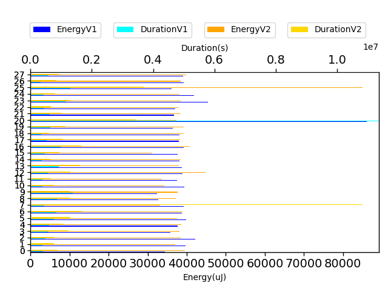

## com.squareup.javapoet.MethodSpecTest

| Test | EnergyV1 | EnergyV2 | DeltaEnergy | DurationV1 | DurationsV2 | DeltaDuration |
| --- | --- | --- | --- | --- | --- | --- |
| com.squareup.javapoet.MethodSpecTest-overrideExtendsOthersWorksWithActualTypeParameters | 277304.357421875 | 274093.171875 | 3211.185546875 | 6982427.384765625 | 7179758.05859375 | -197330.673828125 |
| com.squareup.javapoet.MethodSpecTest-overrideEverything | 371504.810546875 | 778326.662109375 | -406821.8515625 | 10623362.974609375 | 20821113.265625 | -10197750.291015625 |
| com.squareup.javapoet.MethodSpecTest-overrideDoesNotCopyDefaultModifier | 251470.89453125 | 261369.298828125 | -9898.404296875 | 6819989.677734375 | 6851530.1015625 | -31540.423828125 |
| com.squareup.javapoet.MethodSpecTest-overrideGenerics | 155423.90625 | 124898.130859375 | 30525.775390625 | 4105484.17578125 | 4078910.71875 | 26573.45703125 |
| com.squareup.javapoet.MethodSpecTest-overrideDoesNotCopyOverrideAnnotation | 118320.8203125 | 118636.57421875 | -315.75390625 | 3215868.423828125 | 3440203.70703125 | -224335.283203125 |
| com.squareup.javapoet.MethodSpecTest-equalsAndHashCode | 1211188.283203125 | 813919.970703125 | 397268.3125 | 32168290.486328125 | 21675238.16796875 | 10493052.318359375 |
| com.squareup.javapoet.MethodSpecTest-duplicateExceptionsIgnored | 69582.345703125 | 81912.482421875 | -12330.13671875 | 2090816.720703125 | 2519914.34375 | -429097.623046875 |
| com.squareup.javapoet.MethodSpecTest-withoutParameterJavaDoc | 40351.875 | 44220.0234375 | -3868.1484375 | 736455.6875 | 915246.3359375 | -178790.6484375 |
| com.squareup.javapoet.MethodSpecTest-withParameterJavaDoc | 40526.8125 | 41572.375 | -1045.5625 | 663937.6875 | 705723.625 | -41785.9375 |
| com.squareup.javapoet.MethodSpecTest-withParameterJavaDocAndWithoutMethodJavadoc | 39246.0 | 40710.375 | -1464.375 | 697721.0 | 717678.75 | -19957.75 |
| com.squareup.javapoet.MethodSpecTest-modifyMethodName | 41046.0 | 99280.875 | -58234.875 | 458982.5 | 2317818.875 | -1858836.375 |

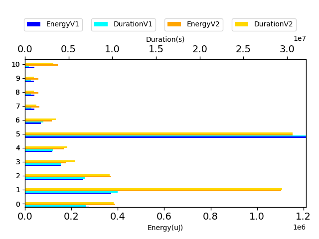

## com.squareup.javapoet.CodeBlockTest

| Test | EnergyV1 | EnergyV2 | DeltaEnergy | DurationV1 | DurationsV2 | DeltaDuration |
| --- | --- | --- | --- | --- | --- | --- |
| com.squareup.javapoet.CodeBlockTest-statementExitWithoutStatementEnter | 33325.25 | 33584.25 | -259.0 | 577467.5 | 588486.625 | -11019.125 |
| com.squareup.javapoet.CodeBlockTest-joiningWithPrefixAndSuffix | 68247.625 | 78946.828125 | -10699.203125 | 2102718.2890625 | 2314539.376953125 | -211821.087890625 |
| com.squareup.javapoet.CodeBlockTest-stringFormatCanBeIndexed | 56518.4375 | 47250.75 | 9267.6875 | 1956968.75 | 1492472.75 | 464496.0 |
| com.squareup.javapoet.CodeBlockTest-tooManyStatementEnters | 31794.607421875 | 53820.638671875 | -22026.03125 | 1557589.96484375 | 1792164.466796875 | -234574.501953125 |
| com.squareup.javapoet.CodeBlockTest-typeFormatCanBeIndexed | 39173.625 | 34759.5 | 4414.125 | 1021630.0390625 | 682781.0 | 338849.0390625 |
| com.squareup.javapoet.CodeBlockTest-nameFormatCanBeIndexed | 36484.0 | 52215.5 | -15731.5 | 541438.75 | 1857932.75 | -1316494.0 |
| com.squareup.javapoet.CodeBlockTest-equalsAndHashCode | 48494.7578125 | 46942.138671875 | 1552.619140625 | 1627290.958984375 | 1758284.025390625 | -130993.06640625 |
| com.squareup.javapoet.CodeBlockTest-joining | 1279239.84375 | 753314.12890625 | 525925.71484375 | 41048825.765625 | 23404718.484375 | 17644107.28125 |
| com.squareup.javapoet.CodeBlockTest-namedAndNoArgFormat | 35558.578125 | 36728.1875 | -1169.609375 | 1193280.15625 | 1084052.53125 | 109227.625 |
| com.squareup.javapoet.CodeBlockTest-joiningSingle | 33141.75 | 33508.0 | -366.25 | 619871.0 | 771337.5 | -151466.5 |
| com.squareup.javapoet.CodeBlockTest-of | 35255.625 | 38208.0 | -2952.375 | 932780.125 | 508460.0 | 424320.125 |
| com.squareup.javapoet.CodeBlockTest-clear | 65509.5 | 58609.25 | 6900.25 | 2308789.6875 | 1852204.75 | 456584.9375 |
| com.squareup.javapoet.CodeBlockTest-repeatedNamedArgument | 35461.125 | 35003.5 | 457.625 | 673217.5 | 654506.0 | 18711.5 |
| com.squareup.javapoet.CodeBlockTest-join | 1608102.40625 | 1520351.5 | 87750.90625 | 46919061.40625 | 49248213.5 | -2329152.09375 |
| com.squareup.javapoet.CodeBlockTest-literalFormatCanBeIndexed | 31738.0 | 39642.25 | -7904.25 | 525413.0 | 793976.0 | -268563.0 |
| com.squareup.javapoet.CodeBlockTest-simpleNamedArgument | 38879.0 | 37282.78125 | 1596.21875 | 1202489.0 | 756860.15625 | 445628.84375 |
| com.squareup.javapoet.CodeBlockTest-multipleNamedArguments | 33538.625 | 33714.25 | -175.625 | 1023874.625 | 696141.375 | 327733.25 |
| com.squareup.javapoet.CodeBlockTest-sameIndexCanBeUsedWithDifferentFormats | 36819.5 | 33081.5 | 3738.0 | 719734.5 | 646819.5 | 72915.0 |

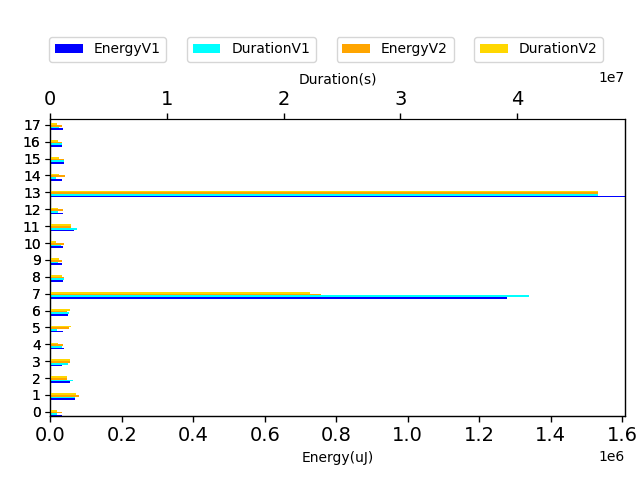

## com.squareup.javapoet.AnnotatedTypeNameTest

| Test | EnergyV1 | EnergyV2 | DeltaEnergy | DurationV1 | DurationsV2 | DeltaDuration |
| --- | --- | --- | --- | --- | --- | --- |
| com.squareup.javapoet.AnnotatedTypeNameTest-annotatedWildcardTypeNameWithExtends | 45441.0 | 45044.0 | 397.0 | 330610.0 | 401018.0 | -70408.0 |
| com.squareup.javapoet.AnnotatedTypeNameTest-withoutAnnotationsOnAnnotatedNestedType | 46325.5 | 45745.5 | 580.0 | 272250.0 | 330636.5 | -58386.5 |
| com.squareup.javapoet.AnnotatedTypeNameTest-annotatedOuterMultidimensionalArrayType | 47638.0 | 46981.75 | 656.25 | 260652.5 | 311787.75 | -51135.25 |
| com.squareup.javapoet.AnnotatedTypeNameTest-annotatedArrayType | 45768.625 | 48767.0 | -2998.375 | 336221.625 | 310294.0 | 25927.625 |
| com.squareup.javapoet.AnnotatedTypeNameTest-withoutAnnotationsOnAnnotatedEnclosingType | 44326.5 | 47852 | -3525.5 | 345936.75 | 444160 | -98223.25 |
| com.squareup.javapoet.AnnotatedTypeNameTest-annotated | 42609.875 | 44616.0 | -2006.125 | 448585.875 | 430285.0 | 18300.875 |
| com.squareup.javapoet.AnnotatedTypeNameTest-annotatedTwice | 47577.0 | 47729.0 | -152.0 | 299510.5 | 424180.0 | -124669.5 |
| com.squareup.javapoet.AnnotatedTypeNameTest-annotatedType | 43930.375 | 48462.0 | -4531.625 | 311792.625 | 464548.0 | -152755.375 |
| com.squareup.javapoet.AnnotatedTypeNameTest-annotatedArrayTypeVarargsParameter | 49362.5 | 46569.0 | 2793.5 | 360386.75 | 372709.0 | -12322.25 |
| com.squareup.javapoet.AnnotatedTypeNameTest-annotatedNestedParameterizedType | 42114.0 | 46584.75 | -4470.75 | 315299.0 | 437143.0 | -121844.0 |
| com.squareup.javapoet.AnnotatedTypeNameTest-annotatedEnclosingAndNestedType | 41199.0 | 46173.5 | -4974.5 | 296450.0 | 413395.0 | -116945.0 |
| com.squareup.javapoet.AnnotatedTypeNameTest-annotatedArrayElementType | 45990.0 | 45837.0 | 153.0 | 324849.5 | 356641.0 | -31791.5 |
| com.squareup.javapoet.AnnotatedTypeNameTest-annotatedNestedType | 45287.75 | 45455.5 | -167.75 | 320238.75 | 345644.25 | -25405.5 |
| com.squareup.javapoet.AnnotatedTypeNameTest-annotatedInnerMultidimensionalArrayType | 49041.0 | 44891.5 | 4149.5 | 270183.0 | 270282.0 | -99.0 |
| com.squareup.javapoet.AnnotatedTypeNameTest-annotatedParameterizedType | 46600.0 | 44434 | 2166.0 | 373521.5 | 303503 | 70018.5 |
| com.squareup.javapoet.AnnotatedTypeNameTest-withoutAnnotationsOnAnnotatedEnclosingAndNestedType | 45654.5 | 45440.0 | 214.5 | 420493.5 | 449072.0 | -28578.5 |
| com.squareup.javapoet.AnnotatedTypeNameTest-annotatedArrayTypeInVarargsParameter | 44433.0 | 44128.0 | 305.0 | 343508.0 | 326361.5 | 17146.5 |

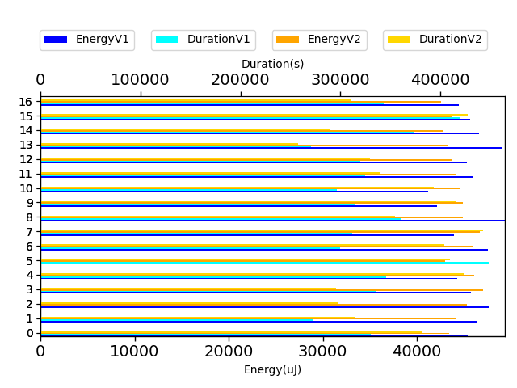

## com.squareup.javapoet.AbstractTypesTest

| Test | EnergyV1 | EnergyV2 | DeltaEnergy | DurationV1 | DurationsV2 | DeltaDuration |
| --- | --- | --- | --- | --- | --- | --- |
| com.squareup.javapoet.AbstractTypesTest-getTypeVariableTypeMirror | 89657.88671875 | 73543.552734375 | 16114.333984375 | 2568729.171875 | 2404621.9921875 | 164107.1796875 |
| com.squareup.javapoet.AbstractTypesTest-getArrayTypeMirror | 32854.96875 | 36033.625 | -3178.65625 | 815490.296875 | 739617.53125 | 75872.765625 |
| com.squareup.javapoet.AbstractTypesTest-getBasicTypeMirror | 94812.314453125 | 99602.228515625 | -4789.9140625 | 2921364.984375 | 2855622.365234375 | 65742.619140625 |
| com.squareup.javapoet.AbstractTypesTest-errorTypes | 409461.509765625 | 366417.6171875 | 43043.892578125 | 11578839.52734375 | 11360059.302734375 | 218780.224609375 |
| com.squareup.javapoet.AbstractTypesTest-wildcardMirrorSuperType | 35759.0 | 33844.25 | 1914.75 | 679026.5 | 824877.0 | -145850.5 |
| com.squareup.javapoet.AbstractTypesTest-getTypeVariableTypeMirrorRecursive | 142042.505859375 | 121129.533203125 | 20912.97265625 | 3621894.830078125 | 3457042.62890625 | 164852.201171875 |
| com.squareup.javapoet.AbstractTypesTest-getParameterizedTypeMirror | 41704.861328125 | 58357.85546875 | -16652.994140625 | 1914226.021484375 | 1817666.2890625 | 96559.732421875 |
| com.squareup.javapoet.AbstractTypesTest-box | 29785.0 | 23376.5 | 6408.5 | 423573.5 | 555984.5 | -132411.0 |
| com.squareup.javapoet.AbstractTypesTest-typeVariable | 24963.25 | 25146.0 | -182.75 | 481830.75 | 401811.0 | 80019.75 |
| com.squareup.javapoet.AbstractTypesTest-wildcardMirrorExtendsType | 36010.5 | 35194.25 | 816.25 | 468438.0 | 446232.0 | 22206.0 |
| com.squareup.javapoet.AbstractTypesTest-wildcardExtendsType | 36163.5 | 36926.0 | -762.5 | 358498.0 | 313963.0 | 44535.0 |
| com.squareup.javapoet.AbstractTypesTest-wildcardSuperType | 33508.0 | 35156.0 | -1648.0 | 336878.25 | 301614.0 | 35264.25 |
| com.squareup.javapoet.AbstractTypesTest-arrayType | 32104.0 | 34851.0 | -2747.0 | 414422.0 | 347282.0 | 67140.0 |
| com.squareup.javapoet.AbstractTypesTest-unbox | 30945.0 | 31219.25 | -274.25 | 433071.0 | 425775.75 | 7295.25 |

## com.squareup.javapoet.TypeSpecTest

| Test | EnergyV1 | EnergyV2 | DeltaEnergy | DurationV1 | DurationsV2 | DeltaDuration |
| --- | --- | --- | --- | --- | --- | --- |
| com.squareup.javapoet.TypeSpecTest-indexedElseIf | 41683.03125 | 41521.265625 | 161.765625 | 817435.875 | 957855.328125 | -140419.453125 |
| com.squareup.javapoet.TypeSpecTest-enumWithMembersButNoConstructorCall | 40895.421875 | 42095.5 | -1200.078125 | 794131.421875 | 778370.0625 | 15761.359375 |
| com.squareup.javapoet.TypeSpecTest-methodThrows | 41995.9921875 | 38627.3046875 | 3368.6875 | 1094113.9296875 | 1093104.49609375 | 1009.43359375 |
| com.squareup.javapoet.TypeSpecTest-typeFromTypeMirror | 42144.625 | 42938.0 | -793.375 | 734426.625 | 739305.0 | -4878.375 |
| com.squareup.javapoet.TypeSpecTest-enumWithSubclassing | 45460.08984375 | 41015.890625 | 4444.19921875 | 1264476.40234375 | 1166271.03125 | 98205.37109375 |
| com.squareup.javapoet.TypeSpecTest-javadoc | 39522.1796875 | 43192.8984375 | -3670.71875 | 1039990.9921875 | 1009303.125 | 30687.8671875 |
| com.squareup.javapoet.TypeSpecTest-membersOrdering | 39418.5859375 | 43372.603515625 | -3954.017578125 | 1080857.125 | 1195365.1640625 | -114508.0390625 |
| com.squareup.javapoet.TypeSpecTest-annotatedParameters | 57714.388671875 | 50930.271484375 | 6784.1171875 | 1763184.00390625 | 1470924.9140625 | 292259.08984375 |
| com.squareup.javapoet.TypeSpecTest-lineWrapping | 67525.048828125 | 77047.240234375 | -9522.19140625 | 1544801.537109375 | 1947100.251953125 | -402298.71484375 |
| com.squareup.javapoet.TypeSpecTest-codeBlockToString | 40481.5 | 41534.0 | -1052.5 | 352965.25 | 435314.0 | -82348.75 |
| com.squareup.javapoet.TypeSpecTest-classImplementsExtends | 34943.0625 | 42067.875 | -7124.8125 | 850143.53125 | 764064.0 | 86079.53125 |
| com.squareup.javapoet.TypeSpecTest-multilineStatementWithAnonymousClass | 40359.623046875 | 41059.373046875 | -699.75 | 1354418.119140625 | 1381967.095703125 | -27548.9765625 |
| com.squareup.javapoet.TypeSpecTest-nullStringLiteral | 41957.6875 | 41088.34375 | 869.34375 | 562212.5 | 605826.375 | -43613.875 |
| com.squareup.javapoet.TypeSpecTest-doWhile | 41992.0 | 41904.0 | 88.0 | 643744.875 | 699106.3125 | -55361.4375 |
| com.squareup.javapoet.TypeSpecTest-annotatedClass | 40260.0625 | 39947.5 | 312.5625 | 813905.015625 | 733133.515625 | 80771.5 |
| com.squareup.javapoet.TypeSpecTest-codeBlocks | 118947.515625 | 120271.546875 | -1324.03125 | 2983518.404296875 | 3053144.666015625 | -69626.26171875 |
| com.squareup.javapoet.TypeSpecTest-simpleNameConflictsWithTypeVariable | 42105.5 | 41799.390625 | 306.109375 | 1061816.09765625 | 1087347.53125 | -25531.43359375 |
| com.squareup.javapoet.TypeSpecTest-interfaceStaticMethods | 37631.5625 | 39775.8125 | -2144.25 | 721877.8125 | 572619.25 | 149258.5625 |
| com.squareup.javapoet.TypeSpecTest-retrofitStyleInterface | 67917.12890625 | 49876.7109375 | 18040.41796875 | 1557397.84375 | 1444304.8515625 | 113092.9921875 |
| com.squareup.javapoet.TypeSpecTest-nameFromType | 40893.5 | 42359.0 | -1465.5 | 389613.5 | 366244.0 | 23369.5 |
| com.squareup.javapoet.TypeSpecTest-annotatedField | 40330.71875 | 41427.3125 | -1096.59375 | 859075.53125 | 786160.9375 | 72914.59375 |
| com.squareup.javapoet.TypeSpecTest-initializerBlockInRightPlace | 43882.05078125 | 41572.0 | 2310.05078125 | 778413.7734375 | 862945.25 | -84531.4765625 |
| com.squareup.javapoet.TypeSpecTest-nestedClasses | 41607.888671875 | 41726.96484375 | -119.076171875 | 1429464.19140625 | 1290729.052734375 | 138735.138671875 |
| com.squareup.javapoet.TypeSpecTest-interfaceDefaultMethods | 38420.84375 | 37750.0 | 670.84375 | 721483.421875 | 585111.5 | 136371.921875 |
| com.squareup.javapoet.TypeSpecTest-literalFromAnything | 40870.6875 | 40161.5 | 709.1875 | 651913.6875 | 600745.0 | 51168.6875 |
| com.squareup.javapoet.TypeSpecTest-initializersToBuilder | 47645.87890625 | 42049.212890625 | 5596.666015625 | 1376419.78125 | 1462950.97265625 | -86531.19140625 |
| com.squareup.javapoet.TypeSpecTest-typeVariables | 80200.55078125 | 66720.20703125 | 13480.34375 | 1735013.03515625 | 1588523.787109375 | 146489.248046875 |
| com.squareup.javapoet.TypeSpecTest-arrayType | 40802.0 | 41521.375 | -719.375 | 718269.375 | 641575.15625 | 76694.21875 |
| com.squareup.javapoet.TypeSpecTest-basic | 212829.373046875 | 242753.703125 | -29924.330078125 | 5784964.693359375 | 6016659.58984375 | -231694.896484375 |
| com.squareup.javapoet.TypeSpecTest-annotationsAndJavaLangTypes | 41750.8046875 | 40952.265625 | 798.5390625 | 833424.9140625 | 853906.65625 | -20481.7421875 |
| com.squareup.javapoet.TypeSpecTest-referencedAndDeclaredSimpleNamesConflict | 40973.328125 | 40970.09375 | 3.234375 | 1116749.80078125 | 1000723.96875 | 116025.83203125 |
| com.squareup.javapoet.TypeSpecTest-lineWrappingWithZeroWidthSpace | 42579.75 | 43702.546875 | -1122.796875 | 501014.375 | 557607.359375 | -56592.984375 |
| com.squareup.javapoet.TypeSpecTest-multipleAnnotationAddition | 41290.25 | 39333.0625 | 1957.1875 | 738912.125 | 759481.375 | -20569.25 |
| com.squareup.javapoet.TypeSpecTest-classToString | 39833.0 | 39878.9375 | -45.9375 | 433700.625 | 452553.875 | -18853.25 |
| com.squareup.javapoet.TypeSpecTest-codeBlockAddStatementOfCodeBlockToString | 40771.0 | 41580.0 | -809.0 | 360158.5 | 367892.5 | -7734.0 |
| com.squareup.javapoet.TypeSpecTest-parameterToString | 39611.5 | 41839.25 | -2227.75 | 440015.375 | 425096.5 | 14918.875 |
| com.squareup.javapoet.TypeSpecTest-simpleNamesConflictInThisAndOtherPackage | 39981.6875 | 41049.84375 | -1068.15625 | 732679.90625 | 662690.3671875 | 69989.5390625 |
| com.squareup.javapoet.TypeSpecTest-typeFromTypeElement | 37601.5 | 41938.625 | -4337.125 | 567367.875 | 576728.25 | -9360.375 |
| com.squareup.javapoet.TypeSpecTest-equalsAndHashCode | 46213.890625 | 75647.31640625 | -29433.42578125 | 1447587.5390625 | 1536368.359375 | -88780.8203125 |
| com.squareup.javapoet.TypeSpecTest-anonymousInnerClass | 41783.130859375 | 48227.560546875 | -6444.4296875 | 1535432.53125 | 1466925.734375 | 68506.796875 |
| com.squareup.javapoet.TypeSpecTest-invalidSuperClass | 40202.53125 | 41198.5 | -995.96875 | 423483.90625 | 530527.0 | -107043.09375 |
| com.squareup.javapoet.TypeSpecTest-nativeMethods | 40043.34375 | 40922.3671875 | -879.0234375 | 752290.421875 | 804058.0859375 | -51767.6640625 |
| com.squareup.javapoet.TypeSpecTest-enumImplements | 40985.0 | 41023.5 | -38.5 | 672557.5 | 660820.75 | 11736.75 |
| com.squareup.javapoet.TypeSpecTest-stringFromAnything | 40835.9375 | 40389.9296875 | 446.0078125 | 621361.0625 | 583185.8203125 | 38175.2421875 |
| com.squareup.javapoet.TypeSpecTest-anonymousClassToString | 39329.5 | 42587.25 | -3257.75 | 566722.0 | 669888.625 | -103166.625 |
| com.squareup.javapoet.TypeSpecTest-inlineIndent | 39882.5 | 41313.25 | -1430.75 | 645119.5625 | 707761.5 | -62641.9375 |
| com.squareup.javapoet.TypeSpecTest-enumsMayDefineAbstractMethods | 40441.53125 | 40756.609375 | -315.078125 | 824666.34375 | 786728.5703125 | 37937.7734375 |
| com.squareup.javapoet.TypeSpecTest-innerAnnotationInAnnotationDeclaration | 81386.125 | 41015.5 | 40370.625 | 1906183.125 | 755289.0 | 1150894.125 |
| com.squareup.javapoet.TypeSpecTest-tryCatch | 38791.5 | 41091.75 | -2300.25 | 667141.03125 | 656962.625 | 10178.40625 |
| com.squareup.javapoet.TypeSpecTest-enumWithAnnotatedValues | 40484.953125 | 39951.21875 | 533.734375 | 845607.9375 | 882027.8125 | -36419.875 |
| com.squareup.javapoet.TypeSpecTest-multilineStrings | 40763.375 | 41153.0 | -389.625 | 642522.25 | 596040.375 | 46481.875 |
| com.squareup.javapoet.TypeSpecTest-varargs | 39291.25 | 40651.4609375 | -1360.2109375 | 746931.375 | 660338.56640625 | 86592.80859375 |
| com.squareup.javapoet.TypeSpecTest-classImplementsNestedClass | 40893.375 | 43935.578125 | -3042.203125 | 844154.75 | 772778.640625 | 71376.109375 |
| com.squareup.javapoet.TypeSpecTest-multipleMethodAddition | 41320.5 | 43304.0 | -1983.5 | 711548.0 | 605353.5 | 106194.5 |
| com.squareup.javapoet.TypeSpecTest-elseIf | 41183.3125 | 41217.625 | -34.3125 | 731079.59375 | 738444.375 | -7364.78125 |
| com.squareup.javapoet.TypeSpecTest-multipleTypeVariableAddition | 42251.0 | 41224.328125 | 1026.671875 | 619980.25 | 607593.375 | 12386.875 |
| com.squareup.javapoet.TypeSpecTest-nameFromMethod | 42602.5 | 40985.0 | 1617.5 | 405806.0 | 390420.75 | 15385.25 |
| com.squareup.javapoet.TypeSpecTest-multipleFieldAddition | 39596.25 | 40251.625 | -655.375 | 682274.625 | 640627.328125 | 41647.296875 |
| com.squareup.javapoet.TypeSpecTest-annotationsInAnnotations | 42983.375 | 40880.6484375 | 2102.7265625 | 1045795.84375 | 882364.5859375 | 163431.2578125 |
| com.squareup.javapoet.TypeSpecTest-typeVariableWithBounds | 41530.53125 | 42131.64453125 | -601.11328125 | 909870.921875 | 881235.48046875 | 28635.44140625 |
| com.squareup.javapoet.TypeSpecTest-stringFromNull | 38208.0 | 40588.0 | -2380.0 | 267661.0 | 308051.5 | -40390.5 |
| com.squareup.javapoet.TypeSpecTest-defaultModifiersForMemberInterfacesAndEnums | 41321.0 | 40748.875 | 572.125 | 604554.25 | 703505.25 | -98951.0 |
| com.squareup.javapoet.TypeSpecTest-staticCodeBlock | 43327.3125 | 42794.140625 | 533.171875 | 831791.0 | 916298.296875 | -84507.296875 |
| com.squareup.javapoet.TypeSpecTest-typeFromReflectType | 42915.0 | 37811.5 | 5103.5 | 333917.875 | 378107.0 | -44189.125 |
| com.squareup.javapoet.TypeSpecTest-intersectionType | 38429.0625 | 44566.2578125 | -6137.1953125 | 733066.3125 | 688584.4765625 | 44481.8359375 |
| com.squareup.javapoet.TypeSpecTest-interfaceClassToString | 40741.0 | 40588.5 | 152.5 | 381799.25 | 470526.5 | -88727.25 |
| com.squareup.javapoet.TypeSpecTest-defaultModifiersForInterfaceMembers | 40660.25 | 40296.90625 | 363.34375 | 772331.375 | 860597.78125 | -88266.40625 |
| com.squareup.javapoet.TypeSpecTest-fieldToString | 44312.0 | 36590.5 | 7721.5 | 425344.0 | 461638.0 | -36294.0 |
| com.squareup.javapoet.TypeSpecTest-methodToString | 40011.9375 | 40268.25 | -256.3125 | 497322.625 | 466022.5 | 31300.125 |
| com.squareup.javapoet.TypeSpecTest-interestingTypes | 40035.21875 | 41737.453125 | -1702.234375 | 1082416.40625 | 1100279.5625 | -17863.15625 |
| com.squareup.javapoet.TypeSpecTest-annotationDeclarationToString | 40527.5 | 40893.0 | -365.5 | 454660.0 | 386429.0 | 68231.0 |
| com.squareup.javapoet.TypeSpecTest-constructorToString | 40100.0 | 40253.0 | -153.0 | 434539.75 | 488463.5 | -53923.75 |
| com.squareup.javapoet.TypeSpecTest-multipleSuperinterfaceAddition | 41351.5 | 38911.8125 | 2439.6875 | 752444.5 | 698604.8125 | 53839.6875 |
| com.squareup.javapoet.TypeSpecTest-interfaceExtends | 39359.75 | 40039.25 | -679.5 | 665665.625 | 638198.25 | 27467.375 |
| com.squareup.javapoet.TypeSpecTest-multilineStatement | 39230.0 | 41617.234375 | -2387.234375 | 986494.75 | 785827.4765625 | 200667.2734375 |
| com.squareup.javapoet.TypeSpecTest-annotationWithFields | 40893.75 | 41049.5 | -155.75 | 504604.75 | 506699.75 | -2095.0 |
| com.squareup.javapoet.TypeSpecTest-multipleTypeAddition | 40283.0 | 38970.875 | 1312.125 | 502827.0 | 496821.25 | 6005.75 |
| com.squareup.javapoet.TypeSpecTest-ifElse | 40649.0 | 41236.75 | -587.75 | 622272.0 | 572044.0 | 50228.0 |
| com.squareup.javapoet.TypeSpecTest-annotation | 39734.0 | 40527.5 | -793.5 | 671817.0 | 753843.0 | -82026.0 |
| com.squareup.javapoet.TypeSpecTest-nameFromCharSequence | 41931.0 | 41992.0 | -61.0 | 368544.0 | 382681.0 | -14137.0 |
| com.squareup.javapoet.TypeSpecTest-nameFromParameter | 38086.0 | 41748.0 | -3662.0 | 399363.0 | 368994.0 | 30369.0 |

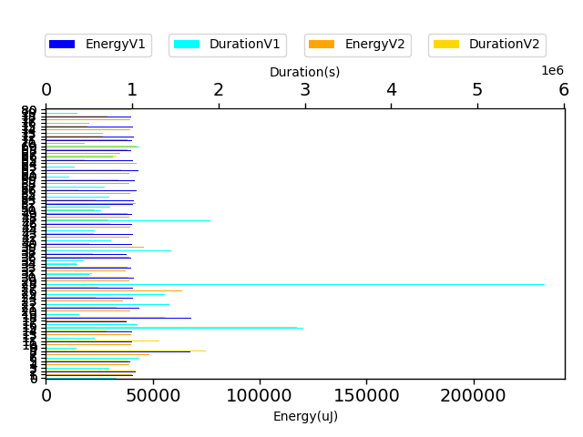

## com.squareup.javapoet.TypeNameTest

| Test | EnergyV1 | EnergyV2 | DeltaEnergy | DurationV1 | DurationsV2 | DeltaDuration |
| --- | --- | --- | --- | --- | --- | --- |
| com.squareup.javapoet.TypeNameTest-equalsAndHashCodeParameterizedTypeName | 42907.5 | 42175.0 | 732.5 | 332076.5 | 331916.0 | 160.5 |
| com.squareup.javapoet.TypeNameTest-equalsAndHashCodeTypeVariableName | 43823.5 | 43380.75 | 442.75 | 295425.0 | 344159.5 | -48734.5 |
| com.squareup.javapoet.TypeNameTest-innerClassInGenericType | 46638.4375 | 44503.07421875 | 2135.36328125 | 1100218.4375 | 833974.6875 | 266243.75 |
| com.squareup.javapoet.TypeNameTest-genericType | 76428.3203125 | 45168.330078125 | 31259.990234375 | 1513119.19140625 | 1309551.798828125 | 203567.392578125 |
| com.squareup.javapoet.TypeNameTest-equalsAndHashCodeWildcardTypeName | 42625.25 | 42358.0 | 267.25 | 419441.5 | 360529.0 | 58912.5 |
| com.squareup.javapoet.TypeNameTest-innerGenericInGenericType | 44738.5 | 43975.5 | 763.0 | 717950.5 | 732115.25 | -14164.75 |
| com.squareup.javapoet.TypeNameTest-equalsAndHashCodeArrayTypeName | 43289.25 | 44189.0 | -899.75 | 353434.5 | 276989.0 | 76445.5 |
| com.squareup.javapoet.TypeNameTest-equalsAndHashCodePrimitive | 44479.0 | 41656.25 | 2822.75 | 372091.5 | 343744.5 | 28347.0 |
| com.squareup.javapoet.TypeNameTest-equalsAndHashCodeClassName | 40771.0 | 45105.0 | -4334.0 | 335472.0 | 335190.0 | 282.0 |
| com.squareup.javapoet.TypeNameTest-innerStaticInGenericType | 46265.0 | 48218.0 | -1953.0 | 289979.0 | 292755.0 | -2776.0 |
| com.squareup.javapoet.TypeNameTest-isBoxedPrimitive | 47180.0 | 44784.4375 | 2395.5625 | 328810.0 | 425790.0 | -96980.0 |

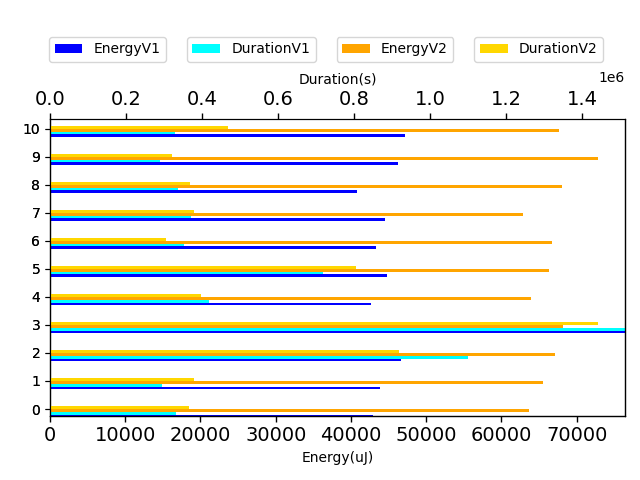

## com.squareup.javapoet.ClassNameTest

| Test | EnergyV1 | EnergyV2 | DeltaEnergy | DurationV1 | DurationsV2 | DeltaDuration |
| --- | --- | --- | --- | --- | --- | --- |
| com.squareup.javapoet.ClassNameTest-classNameFromTypeElementDoesntUseGetKind | 8465483.0625 | 8215195.65234375 | 250287.41015625 | 202940589.2421875 | 200189916.76757812 | 2750672.474609375 |
| com.squareup.javapoet.ClassNameTest-classNameFromClass | 43198.9375 | 44423.572265625 | -1224.634765625 | 1039140.830078125 | 1044499.96484375 | -5359.134765625 |
| com.squareup.javapoet.ClassNameTest-classNameFromTypeElement | 141908.77734375 | 135243.345703125 | 6665.431640625 | 3869838.6796875 | 3957890.642578125 | -88051.962890625 |
| com.squareup.javapoet.ClassNameTest-bestGuessForString_defaultPackage | 41591.4375 | 38146.5 | 3444.9375 | 387357.5 | 409073.75 | -21716.25 |
| com.squareup.javapoet.ClassNameTest-bestGuessForString_nestedClass | 44991.69921875 | 43467.578125 | 1524.12109375 | 822229.9453125 | 828985.609375 | -6755.6640625 |
| com.squareup.javapoet.ClassNameTest-peerClass | 39337.25 | 41961.625 | -2624.375 | 439802.5 | 498101.125 | -58298.625 |
| com.squareup.javapoet.ClassNameTest-createNestedClass | 36529.5 | 39062.25 | -2532.75 | 310880.5 | 294918.0 | 15962.5 |

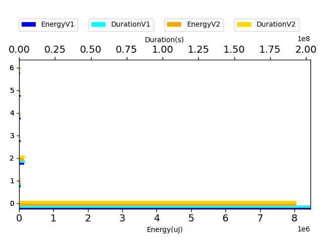

## com.squareup.javapoet.FileWritingTest

| Test | EnergyV1 | EnergyV2 | DeltaEnergy | DurationV1 | DurationsV2 | DeltaDuration |
| --- | --- | --- | --- | --- | --- | --- |
| com.squareup.javapoet.FileWritingTest-filerPassesOriginatingElements | 9536150.173828125 | 8418070.78515625 | 1118079.388671875 | 264764425.21875 | 253657029.92578125 | 11107395.29296875 |
| com.squareup.javapoet.FileWritingTest-filerNestedClasses | 83103.244140625 | 81819.154296875 | 1284.08984375 | 2054001.744140625 | 2196150.646484375 | -142148.90234375 |
| com.squareup.javapoet.FileWritingTest-fileIsUtf8 | 41405.7578125 | 31551.625 | 9854.1328125 | 1003258.5078125 | 1096412.65625 | -93154.1484375 |
| com.squareup.javapoet.FileWritingTest-pathDefaultPackage | 116580.265625 | 107428.06640625 | 9152.19921875 | 2629585.34375 | 2948906.67578125 | -319321.33203125 |
| com.squareup.javapoet.FileWritingTest-fileNestedClasses | 47399.1875 | 38507.064453125 | 8892.123046875 | 1216344.525390625 | 1243984.515625 | -27639.990234375 |
| com.squareup.javapoet.FileWritingTest-filerDefaultPackage | 97342.734375 | 83508.533203125 | 13834.201171875 | 2425016.1484375 | 2593417.970703125 | -168401.822265625 |
| com.squareup.javapoet.FileWritingTest-filerClassesWithTabIndent | 123167.244140625 | 107843.380859375 | 15323.86328125 | 3396832.92578125 | 3080101.6484375 | 316731.27734375 |
| com.squareup.javapoet.FileWritingTest-pathNestedClasses | 54793.265625 | 59380.10546875 | -4586.83984375 | 1634164.078125 | 1686393.474609375 | -52229.396484375 |
| com.squareup.javapoet.FileWritingTest-fileDefaultPackage | 239547.66015625 | 217396.28515625 | 22151.375 | 5797389.744140625 | 5997896.001953125 | -200506.2578125 |

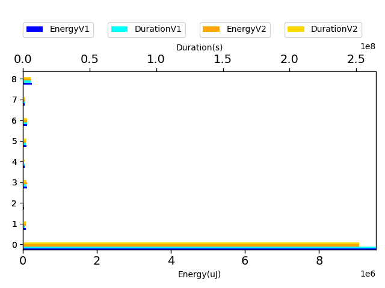

## com.squareup.javapoet.AnnotationSpecTest

| Test | EnergyV1 | EnergyV2 | DeltaEnergy | DurationV1 | DurationsV2 | DeltaDuration |
| --- | --- | --- | --- | --- | --- | --- |
| com.squareup.javapoet.AnnotationSpecTest-defaultAnnotation | 155316.091796875 | 149061.03125 | 6255.060546875 | 4217256.384765625 | 4194612.205078125 | 22644.1796875 |
| com.squareup.javapoet.AnnotationSpecTest-defaultAnnotationWithImport | 99904.583984375 | 112329.07421875 | -12424.490234375 | 3038795.447265625 | 2984428.931640625 | 54366.515625 |
| com.squareup.javapoet.AnnotationSpecTest-defaultAnnotationToBuilder | 99590.07421875 | 112436.47265625 | -12846.3984375 | 2771054.333984375 | 2833284.787109375 | -62230.453125 |
| com.squareup.javapoet.AnnotationSpecTest-reflectAnnotationWithDefaults | 64950.9453125 | 65396.193359375 | -445.248046875 | 1676489.052734375 | 1623369.17578125 | 53119.876953125 |
| com.squareup.javapoet.AnnotationSpecTest-equalsAndHashCode | 57051.421875 | 36028.556640625 | 21022.865234375 | 1325377.5703125 | 1250847.0 | 74530.5703125 |
| com.squareup.javapoet.AnnotationSpecTest-reflectAnnotation | 322881.62109375 | 316187.232421875 | 6694.388671875 | 8301871.11328125 | 8104629.19140625 | 197241.921875 |
| com.squareup.javapoet.AnnotationSpecTest-dynamicArrayOfEnumConstants | 42037.59375 | 39509.125 | 2528.46875 | 761904.34375 | 695893.375 | 66010.96875 |
| com.squareup.javapoet.AnnotationSpecTest-emptyArray | 38894.25 | 39229.875 | -335.625 | 479309.5 | 432624.0 | 46685.5 |
| com.squareup.javapoet.AnnotationSpecTest-modifyMembers | 32043.0 | 31616.0 | 427.0 | 436205.0 | 453531.0 | -17326.0 |

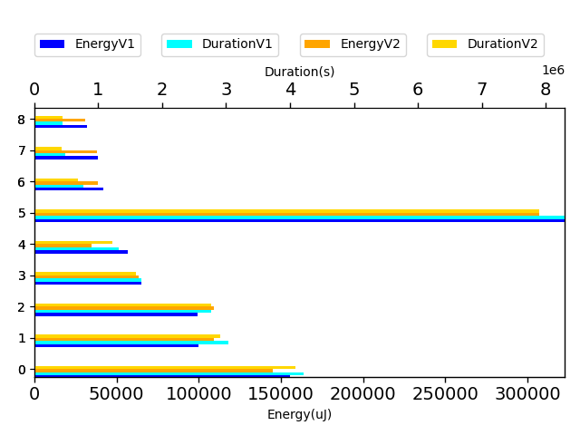

## com.squareup.javapoet.FileReadingTest

| Test | EnergyV1 | EnergyV2 | DeltaEnergy | DurationV1 | DurationsV2 | DeltaDuration |
| --- | --- | --- | --- | --- | --- | --- |
| com.squareup.javapoet.FileReadingTest-javaFileObjectCharacterContent | 42140.65625 | 44870.18359375 | -2729.52734375 | 1115018.291015625 | 1067659.15625 | 47359.134765625 |
| com.squareup.javapoet.FileReadingTest-compileJavaFile | 2373976.994140625 | 2215557.8203125 | 158419.173828125 | 59999838.892578125 | 58537618.939453125 | 1462219.953125 |
| com.squareup.javapoet.FileReadingTest-javaFileObjectInputStreamIsUtf8 | 86214.296875 | 102832.763671875 | -16618.466796875 | 2809173.345703125 | 2870725.880859375 | -61552.53515625 |

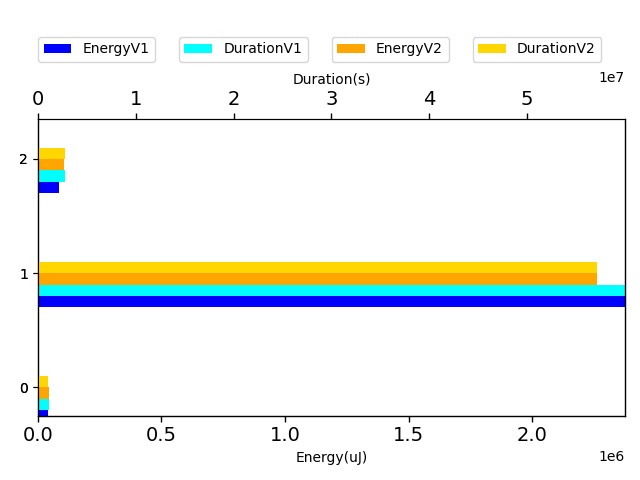

## ClassNameNoPackageTest

| Test | EnergyV1 | EnergyV2 | DeltaEnergy | DurationV1 | DurationsV2 | DeltaDuration |
| --- | --- | --- | --- | --- | --- | --- |
| ClassNameNoPackageTest-shouldSupportClassInDefaultPackage | 495064.82421875 | 477672.67578125 | 17392.1484375 | 16018974.001953125 | 15092538.55078125 | 926435.451171875 |

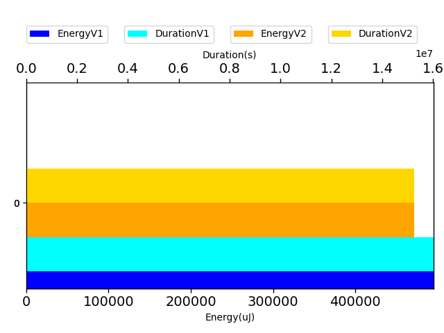

## com.squareup.javapoet.LineWrapperTest

| Test | EnergyV1 | EnergyV2 | DeltaEnergy | DurationV1 | DurationsV2 | DeltaDuration |
| --- | --- | --- | --- | --- | --- | --- |
| com.squareup.javapoet.LineWrapperTest-overlyLongLinesWithoutLeadingSpace | 41931 | 39734.0 | 2197.0 | 218497 | 206643.0 | 11854.0 |
| com.squareup.javapoet.LineWrapperTest-zeroWidthNoWrap | 41839.5 | 38940 | 2899.5 | 225789.0 | 222173 | 3616.0 |
| com.squareup.javapoet.LineWrapperTest-wrapEmbeddedNewlines | 40832.0 | 42664.0 | -1832.0 | 294723.0 | 231809.0 | 62914.0 |

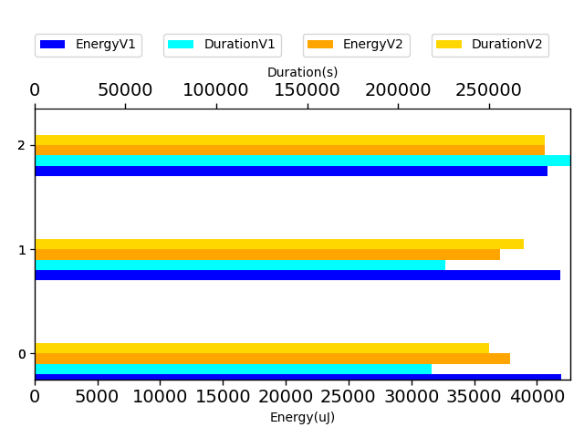

## com.squareup.javapoet.ParameterSpecTest

| Test | EnergyV1 | EnergyV2 | DeltaEnergy | DurationV1 | DurationsV2 | DeltaDuration |
| --- | --- | --- | --- | --- | --- | --- |
| com.squareup.javapoet.ParameterSpecTest-parameterVariableElement | 99144.548828125 | 111898.322265625 | -12753.7734375 | 2681198.859375 | 2467235.919921875 | 213962.939453125 |
| com.squareup.javapoet.ParameterSpecTest-equalsAndHashCode | 43693.75 | 40287.0 | 3406.75 | 531413.25 | 505973.375 | 25439.875 |

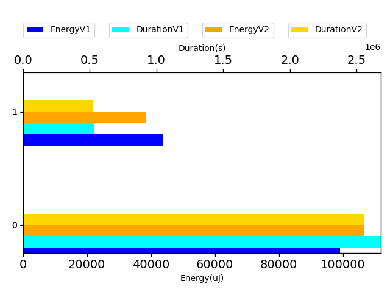

## com.squareup.javapoet.FieldSpecTest

| Test | EnergyV1 | EnergyV2 | DeltaEnergy | DurationV1 | DurationsV2 | DeltaDuration |
| --- | --- | --- | --- | --- | --- | --- |
| com.squareup.javapoet.FieldSpecTest-equalsAndHashCode | 41351.5 | 35736.0 | 5615.5 | 578433.5 | 680952.75 | -102519.25 |

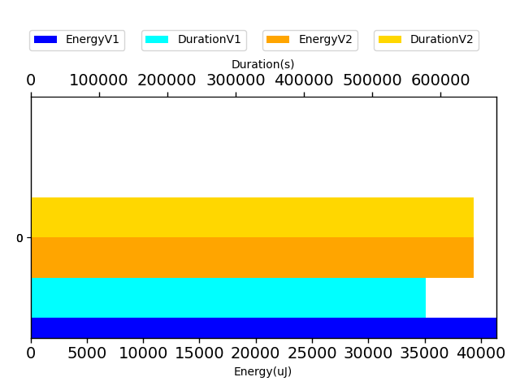

