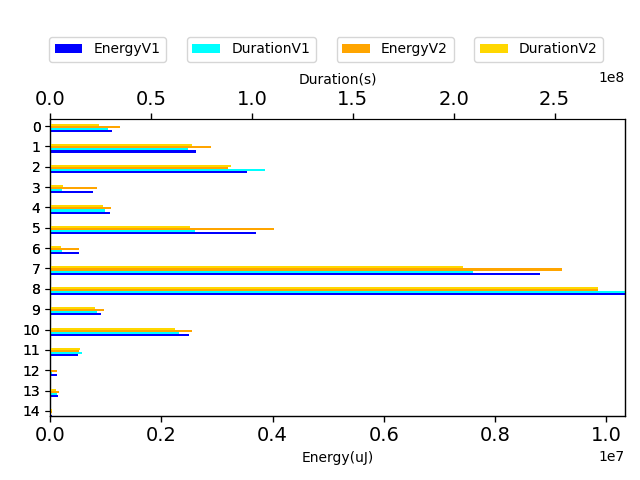
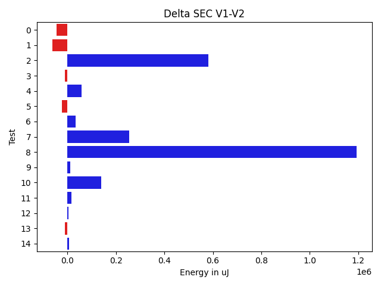

# javapoet e2ed02

http://github.com/square/javapoet/commit/e2ed02

| Index | EnergyV1 | DurationV1 | EnergyV2 | DurationsV2 |
| --- | --- | --- | --- | --- |
| 0 | 1116643.869140625 | 28700079.595703125 | 1162450.765625 | 24564521.578125 |
| 1 | 2615966.10546875 | 68563336.71875 | 2678939.939453125 | 71223135.94921875 |
| 2 | 3547282.255859375 | 106552441.01757812 | 2966962.953125 | 90903950.79101562 |
| 3 | 773298.625 | 5630489.875 | 784710.5 | 6391660.0 |
| 4 | 1069772.296875 | 27016282.83203125 | 1010797.662109375 | 26252169.359375 |
| 5 | 3709733.01171875 | 71745624.88671875 | 3732440.39453125 | 70240710.83398438 |
| 6 | 519145.7578125 | 6058018.12890625 | 485513.341796875 | 5586714.736328125 |
| 7 | 8813040.6640625 | 209809839.19726562 | 8557500.5234375 | 207223385.859375 |
| 8 | 10339489.533203125 | 284921018.2363281 | 9145505.0 | 274500293.515625 |
| 9 | 912669.58203125 | 23008262.74609375 | 901793.560546875 | 22573219.666015625 |
| 10 | 2502331.947265625 | 63924030.529296875 | 2363260.767578125 | 62476003.9765625 |
| 11 | 495064.82421875 | 16018974.001953125 | 477672.67578125 | 15092538.55078125 |
| 12 | 124602.5 | 739009.0 | 121338.0 | 660625.0 |
| 13 | 142838.298828125 | 3212612.109375 | 152185.322265625 | 2973209.294921875 |
| 14 | 41351.5 | 578433.5 | 35736.0 | 680952.75 |

| TestClassName | Index |
| --- | --- |
| com.squareup.javapoet.JavaFileTest | 0 |
| com.squareup.javapoet.MethodSpecTest | 1 |
| com.squareup.javapoet.CodeBlockTest | 2 |
| com.squareup.javapoet.AnnotatedTypeNameTest | 3 |
| com.squareup.javapoet.AbstractTypesTest | 4 |
| com.squareup.javapoet.TypeSpecTest | 5 |
| com.squareup.javapoet.TypeNameTest | 6 |
| com.squareup.javapoet.ClassNameTest | 7 |
| com.squareup.javapoet.FileWritingTest | 8 |
| com.squareup.javapoet.AnnotationSpecTest | 9 |
| com.squareup.javapoet.FileReadingTest | 10 |
| ClassNameNoPackageTest | 11 |
| com.squareup.javapoet.LineWrapperTest | 12 |
| com.squareup.javapoet.ParameterSpecTest | 13 |
| com.squareup.javapoet.FieldSpecTest | 14 |
## com.squareup.javapoet.JavaFileTest

## com.squareup.javapoet.MethodSpecTest

## com.squareup.javapoet.CodeBlockTest

## com.squareup.javapoet.AnnotatedTypeNameTest

## com.squareup.javapoet.AbstractTypesTest

## com.squareup.javapoet.TypeSpecTest

## com.squareup.javapoet.TypeNameTest

## com.squareup.javapoet.ClassNameTest

## com.squareup.javapoet.FileWritingTest

## com.squareup.javapoet.AnnotationSpecTest

## com.squareup.javapoet.FileReadingTest

## ClassNameNoPackageTest

## com.squareup.javapoet.LineWrapperTest

## com.squareup.javapoet.ParameterSpecTest

## com.squareup.javapoet.FieldSpecTest

