# javapoet 4e8f72

http://github.com/square/javapoet/commit/4e8f72

| Index | EnergyV1 | EnergyV2 | DeltaEnergy | DurationV1 | DurationsV2 | DeltaDuration |
| --- | --- | --- | --- | --- | --- | --- |
| 0 | 2540242.26953125 | 2634745.34765625 | -94503.078125 | 63602676.4296875 | 67817350.76757812 | -4214674.337890625 |
| 1 | 1013755.77734375 | 1006259.2421875 | 7496.53515625 | 23785597.93359375 | 23640074.978515625 | 145522.955078125 |
| 2 | 1059608.8359375 | 1118136.443359375 | -58527.607421875 | 14053568.58984375 | 13280445.572265625 | 773123.017578125 |
| 3 | 4304863.068359375 | 4614331.59375 | -309468.525390625 | 132906116.27148438 | 143754576.75195312 | -10848460.48046875 |
| 4 | 930163.458984375 | 944838.083984375 | -14674.625 | 24659014.41796875 | 24156434.576171875 | 502579.841796875 |
| 5 | 14239210.18359375 | 13074973.21484375 | 1164236.96875 | 349212685.63671875 | 335439054.83984375 | 13773630.796875 |
| 6 | 43220.9375 | 40413.6875 | 2807.25 | 565720.3125 | 531016.625 | 34703.6875 |
| 7 | 2918722.171875 | 2777770.974609375 | 140951.197265625 | 70021108.06640625 | 66865924.419921875 | 3155183.646484375 |
| 8 | 40305.875 | 43472.0 | -3166.125 | 640511.875 | 451945.5 | 188566.375 |
| 9 | 150171.91796875 | 154782.578125 | -4610.66015625 | 2033861.12109375 | 2162838.78125 | -128977.66015625 |
| 10 | 590047.875 | 607403.96875 | -17356.09375 | 5269934.0 | 4988811.6875 | 281122.3125 |
| 11 | 42061.125 | 45646.75 | -3585.625 | 486172.125 | 605717.8125 | -119545.6875 |

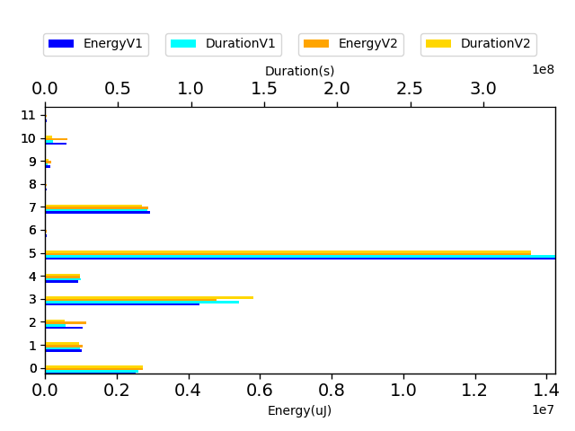

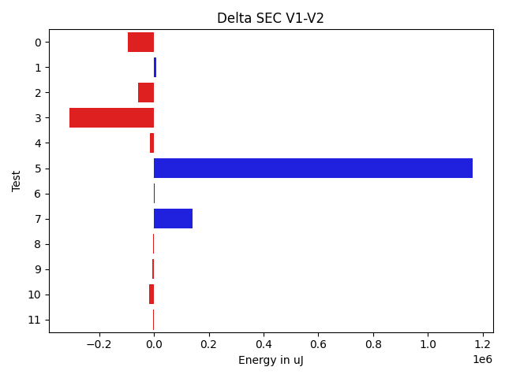

| TestClassName | Index |
| --- | --- |
| com.squareup.javapoet.MethodSpecTest | 0 |
| com.squareup.javapoet.AnnotationSpecTest | 1 |
| com.squareup.javapoet.JavaFileTest | 2 |
| com.squareup.javapoet.CodeBlockTest | 3 |
| com.squareup.javapoet.FileWritingTest | 4 |
| com.squareup.javapoet.TypeSpecTest | 5 |
| com.squareup.javapoet.FieldSpecTest | 6 |
| com.squareup.javapoet.FileReadingTest | 7 |
| com.squareup.javapoet.ParameterSpecTest | 8 |
| com.squareup.javapoet.AbstractTypesTest | 9 |
| com.squareup.javapoet.AnnotatedTypeNameTest | 10 |
| com.squareup.javapoet.TypeNameTest | 11 |
## com.squareup.javapoet.MethodSpecTest

| Test | EnergyV1 | EnergyV2 | DeltaEnergy | DurationV1 | DurationsV2 | DeltaDuration |
| --- | --- | --- | --- | --- | --- | --- |
| com.squareup.javapoet.MethodSpecTest-overrideExtendsOthersWorksWithActualTypeParameters | 280518.822265625 | 275041.0546875 | 5477.767578125 | 7030283.712890625 | 7347081.37109375 | -316797.658203125 |
| com.squareup.javapoet.MethodSpecTest-withoutParameterJavaDoc | 44342.0 | 41613.875 | 2728.125 | 716619.75 | 727482.8125 | -10863.0625 |
| com.squareup.javapoet.MethodSpecTest-overrideEverything | 287982.005859375 | 319727.623046875 | -31745.6171875 | 8319522.701171875 | 9273927.185546875 | -954404.484375 |
| com.squareup.javapoet.MethodSpecTest-modifyMethodName | 43823.25 | 39550.75 | 4272.5 | 491742.75 | 538541.5 | -46798.75 |
| com.squareup.javapoet.MethodSpecTest-overrideDoesNotCopyDefaultModifier | 244797.10546875 | 278956.67578125 | -34159.5703125 | 6342993.640625 | 6862740.1796875 | -519746.5390625 |
| com.squareup.javapoet.MethodSpecTest-overrideGenerics | 155208.369140625 | 153590.0390625 | 1618.330078125 | 4044089.697265625 | 4212058.609375 | -167968.912109375 |
| com.squareup.javapoet.MethodSpecTest-overrideDoesNotCopyOverrideAnnotation | 115695.74609375 | 125373.71484375 | -9677.96875 | 3089926.255859375 | 3319055.9453125 | -229129.689453125 |
| com.squareup.javapoet.MethodSpecTest-withParameterJavaDocAndWithoutMethodJavadoc | 42052.75 | 40374.5 | 1678.25 | 621649.25 | 640139.0 | -18489.75 |
| com.squareup.javapoet.MethodSpecTest-equalsAndHashCode | 1176139.24609375 | 1231541.15234375 | -55401.90625 | 29895930.07421875 | 31904312.939453125 | -2008382.865234375 |
| com.squareup.javapoet.MethodSpecTest-duplicateExceptionsIgnored | 108407.974609375 | 85366.462890625 | 23041.51171875 | 2338668.09765625 | 2228506.224609375 | 110161.873046875 |
| com.squareup.javapoet.MethodSpecTest-withParameterJavaDoc | 41275.0 | 43609.5 | -2334.5 | 711250.5 | 763505.0 | -52254.5 |

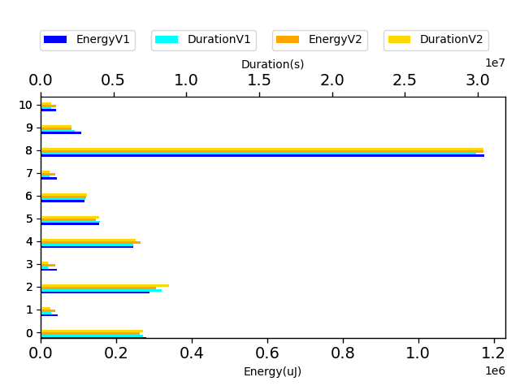

## com.squareup.javapoet.AnnotationSpecTest

| Test | EnergyV1 | EnergyV2 | DeltaEnergy | DurationV1 | DurationsV2 | DeltaDuration |
| --- | --- | --- | --- | --- | --- | --- |
| com.squareup.javapoet.AnnotationSpecTest-dynamicArrayOfEnumConstants | 39945.21875 | 39856.0 | 89.21875 | 650297.4375 | 697037.625 | -46740.1875 |
| com.squareup.javapoet.AnnotationSpecTest-defaultAnnotation | 218710.037109375 | 240130.21484375 | -21420.177734375 | 5498826.615234375 | 5321758.814453125 | 177067.80078125 |
| com.squareup.javapoet.AnnotationSpecTest-defaultAnnotationWithImport | 122999.296875 | 111958.50390625 | 11040.79296875 | 2781052.953125 | 2771191.845703125 | 9861.107421875 |
| com.squareup.javapoet.AnnotationSpecTest-defaultAnnotationToBuilder | 89437.236328125 | 81100.953125 | 8336.283203125 | 2428924.396484375 | 2472954.677734375 | -44030.28125 |
| com.squareup.javapoet.AnnotationSpecTest-reflectAnnotationWithDefaults | 46120.23046875 | 47681.033203125 | -1560.802734375 | 1447138.30078125 | 1526435.82421875 | -79297.5234375 |
| com.squareup.javapoet.AnnotationSpecTest-equalsAndHashCode | 47081.21484375 | 44442.201171875 | 2639.013671875 | 1264129.23046875 | 1287843.6328125 | -23714.40234375 |
| com.squareup.javapoet.AnnotationSpecTest-reflectAnnotation | 333007.10546875 | 318318.8359375 | 14688.26953125 | 8516470.5625 | 8329088.05859375 | 187382.50390625 |
| com.squareup.javapoet.AnnotationSpecTest-requiresValidMemberName | 34546.25 | 41565.0 | -7018.75 | 398080.625 | 499102.5 | -101021.875 |
| com.squareup.javapoet.AnnotationSpecTest-disallowsNullMemberName | 41626.1875 | 40725.5 | 900.6875 | 389100.8125 | 342064.5 | 47036.3125 |
| com.squareup.javapoet.AnnotationSpecTest-emptyArray | 40283.0 | 40481.0 | -198.0 | 411577.0 | 392597.5 | 18979.5 |

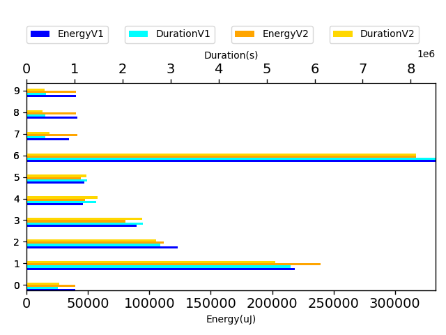

## com.squareup.javapoet.JavaFileTest

| Test | EnergyV1 | EnergyV2 | DeltaEnergy | DurationV1 | DurationsV2 | DeltaDuration |
| --- | --- | --- | --- | --- | --- | --- |
| com.squareup.javapoet.JavaFileTest-nestedClassAndSuperclassShareName | 42411.5 | 39313.75 | 3097.75 | 505769.625 | 548416.25 | -42646.625 |
| com.squareup.javapoet.JavaFileTest-importStaticUsingWildcards | 38841.5 | 43059.875 | -4218.375 | 490530.625 | 449406.875 | 41123.75 |
| com.squareup.javapoet.JavaFileTest-importStaticMixed | 42904.0625 | 40641.75 | 2262.3125 | 893339.875 | 794554.0 | 98785.875 |
| com.squareup.javapoet.JavaFileTest-importStaticTwice | 36658.875 | 41317.890625 | -4659.015625 | 499110.875 | 547172.671875 | -48061.796875 |
| com.squareup.javapoet.JavaFileTest-importStaticNone | 40420.5625 | 42923.375 | -2502.8125 | 511390.4375 | 502496.125 | 8894.3125 |
| com.squareup.javapoet.JavaFileTest-superclassReferencesSelf | 38718.8125 | 39504.75 | -785.9375 | 692626.09375 | 476523.0 | 216103.09375 |
| com.squareup.javapoet.JavaFileTest-importStaticReadmeExample | 41545.7421875 | 64853.990234375 | -23308.248046875 | 1299804.01953125 | 1501919.400390625 | -202115.380859375 |
| com.squareup.javapoet.JavaFileTest-importStaticForCrazyFormatsWorks | 40650.1875 | 40963.046875 | -312.859375 | 712228.875 | 751167.421875 | -38938.546875 |
| com.squareup.javapoet.JavaFileTest-emptyLinesInTopOfFileComment | 42267.0 | 39809.75 | 2457.25 | 300437.25 | 311983.0 | -11545.75 |
| com.squareup.javapoet.JavaFileTest-conflictingAnnotationReferencedClass | 40687.625 | 47241.0 | -6553.375 | 406597.0 | 392726.0 | 13871.0 |
| com.squareup.javapoet.JavaFileTest-conflictingTypeVariableBound | 39955.25 | 45471.0 | -5515.75 | 439018.75 | 310363.5 | 128655.25 |
| com.squareup.javapoet.JavaFileTest-defaultPackage | 43495.46875 | 42600.984375 | 894.484375 | 525102.96875 | 496007.359375 | 29095.609375 |
| com.squareup.javapoet.JavaFileTest-annotationIsNestedClass | 37622.375 | 41687.0 | -4064.625 | 426200.4453125 | 388899.5 | 37300.9453125 |
| com.squareup.javapoet.JavaFileTest-defaultPackageTypesAreNotImported | 41565.0 | 42678.5 | -1113.5 | 319086.0 | 349129.75 | -30043.75 |
| com.squareup.javapoet.JavaFileTest-importStaticOnce | 42091.125 | 43426.75 | -1335.625 | 686708.375 | 752282.125 | -65573.75 |
| com.squareup.javapoet.JavaFileTest-singleImport | 40077.0 | 42999.0 | -2922.0 | 581199.875 | 487188.0 | 94011.875 |
| com.squareup.javapoet.JavaFileTest-topOfFileComment | 37964.0 | 40031.25 | -2067.25 | 415638.0 | 374034.5 | 41603.5 |
| com.squareup.javapoet.JavaFileTest-conflictingChildName | 40466.25 | 43075.625 | -2609.375 | 578596.0 | 459484.375 | 119111.625 |
| com.squareup.javapoet.JavaFileTest-conflictingImports | 39763.5 | 43808.375 | -4044.875 | 426979.0 | 418739.375 | 8239.625 |
| com.squareup.javapoet.JavaFileTest-skipJavaLangImportsWithConflictingClassLast | 40680.0 | 42671.5 | -1991.5 | 447673.0 | 385331.0 | 62342.0 |
| com.squareup.javapoet.JavaFileTest-skipJavaLangImportsWithConflictingClassFirst | 43823.0 | 40223.0 | 3600.0 | 397512.0 | 318104.0 | 79408.0 |
| com.squareup.javapoet.JavaFileTest-classAndSuperclassShareName | 41839.5 | 43701.0 | -1861.5 | 330508.5 | 350151.0 | -19642.5 |
| com.squareup.javapoet.JavaFileTest-conflictingParentName | 42358.5 | 42976.375 | -617.875 | 600341.0 | 477224.5 | 123116.5 |
| com.squareup.javapoet.JavaFileTest-conflictingNameOutOfScope | 40740.5 | 40611.25 | 129.25 | 698620.5 | 555541.0 | 143079.5 |
| com.squareup.javapoet.JavaFileTest-annotatedTypeParam | 41900.5 | 43254.15625 | -1353.65625 | 521747.5 | 478631.34375 | 43116.15625 |
| com.squareup.javapoet.JavaFileTest-packageClassConflictsWithNestedClass | 40161.0 | 39291.5 | 869.5 | 346802.0 | 402969.5 | -56167.5 |

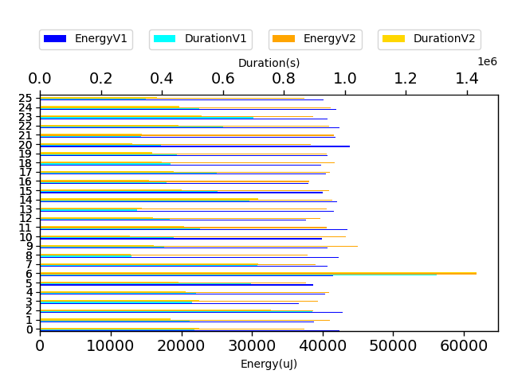

## com.squareup.javapoet.CodeBlockTest

| Test | EnergyV1 | EnergyV2 | DeltaEnergy | DurationV1 | DurationsV2 | DeltaDuration |
| --- | --- | --- | --- | --- | --- | --- |
| com.squareup.javapoet.CodeBlockTest-joiningWithPrefixAndSuffix | 53622.03515625 | 70621.828125 | -16999.79296875 | 2160832.751953125 | 2121115.234375 | 39717.517578125 |
| com.squareup.javapoet.CodeBlockTest-literalFormatCanBeIndexed | 36056.5 | 35766.25 | 290.25 | 1026633.5 | 651516.0 | 375117.5 |
| com.squareup.javapoet.CodeBlockTest-tooManyStatementEnters | 39450.314453125 | 34127.814453125 | 5322.5 | 1487054.873046875 | 1580229.25 | -93174.376953125 |
| com.squareup.javapoet.CodeBlockTest-namedNewline | 36042.1875 | 60729.8125 | -24687.625 | 697643.609375 | 1995840.75 | -1298197.140625 |
| com.squareup.javapoet.CodeBlockTest-equalsAndHashCode | 211456.890625 | 469467.763671875 | -258010.873046875 | 7028767.724609375 | 15428102.994140625 | -8399335.26953125 |
| com.squareup.javapoet.CodeBlockTest-joining | 1546849.21875 | 1464538.3125 | 82310.90625 | 50285592.28125 | 46224451.0078125 | 4061141.2734375 |
| com.squareup.javapoet.CodeBlockTest-namedAndNoArgFormat | 32848.5625 | 36304.4375 | -3455.875 | 840137.3125 | 878991.1875 | -38853.875 |
| com.squareup.javapoet.CodeBlockTest-statementExitWithoutStatementEnter | 35507.0 | 36117.0 | -610.0 | 556966.125 | 583360.5 | -26394.375 |
| com.squareup.javapoet.CodeBlockTest-sameIndexCanBeUsedWithDifferentFormats | 35492.0 | 33754.34375 | 1737.65625 | 614355.0 | 688575.609375 | -74220.609375 |
| com.squareup.javapoet.CodeBlockTest-stringFormatCanBeIndexed | 34607.0 | 35141.0 | -534.0 | 654250.5 | 639303.0 | 14947.5 |
| com.squareup.javapoet.CodeBlockTest-nameFormatCanBeIndexed | 43826.75 | 34092.3125 | 9734.4375 | 1479998.5 | 1048049.4375 | 431949.0625 |
| com.squareup.javapoet.CodeBlockTest-typeFormatCanBeIndexed | 35612.234375 | 35384.9375 | 227.296875 | 1080639.34375 | 1069105.59375 | 11533.75 |
| com.squareup.javapoet.CodeBlockTest-joiningSingle | 33523.25 | 33488.8125 | 34.4375 | 537734.0 | 556094.0625 | -18360.0625 |
| com.squareup.javapoet.CodeBlockTest-repeatedNamedArgument | 32463.0 | 35088.46875 | -2625.46875 | 673503.75 | 827592.0 | -154088.25 |
| com.squareup.javapoet.CodeBlockTest-simpleNamedArgument | 34850.75 | 32836.5 | 2014.25 | 848452.25 | 799015.0 | 49437.25 |
| com.squareup.javapoet.CodeBlockTest-of | 34591.75 | 34629.75 | -38.0 | 1217837.0 | 641603.875 | 576233.125 |
| com.squareup.javapoet.CodeBlockTest-join | 1994219.625 | 2097651.0 | -103431.375 | 61097030.75 | 67126344.25 | -6029313.5 |
| com.squareup.javapoet.CodeBlockTest-multipleNamedArguments | 33844.0 | 34591.25 | -747.25 | 618687.0 | 895287.0 | -276600.0 |

## com.squareup.javapoet.FileWritingTest

| Test | EnergyV1 | EnergyV2 | DeltaEnergy | DurationV1 | DurationsV2 | DeltaDuration |
| --- | --- | --- | --- | --- | --- | --- |
| com.squareup.javapoet.FileWritingTest-fileNotDirectory | 42745.91796875 | 40739.265625 | 2006.65234375 | 1219032.435546875 | 1264359.306640625 | -45326.87109375 |
| com.squareup.javapoet.FileWritingTest-filerPassesOriginatingElements | 92425.767578125 | 91527.857421875 | 897.91015625 | 2449228.724609375 | 2247171.763671875 | 202056.9609375 |
| com.squareup.javapoet.FileWritingTest-filerNestedClasses | 79993.8984375 | 83027.580078125 | -3033.681640625 | 2098871.361328125 | 2007708.216796875 | 91163.14453125 |
| com.squareup.javapoet.FileWritingTest-pathNotDirectory | 194403.349609375 | 219420.611328125 | -25017.26171875 | 5236682.609375 | 5281448.623046875 | -44766.013671875 |
| com.squareup.javapoet.FileWritingTest-fileNestedClasses | 73264.99609375 | 40363.541015625 | 32901.455078125 | 1546261.3671875 | 1252971.244140625 | 293290.123046875 |
| com.squareup.javapoet.FileWritingTest-filerDefaultPackage | 50577.46875 | 43505.91796875 | 7071.55078125 | 1462995.10546875 | 1402165.017578125 | 60830.087890625 |
| com.squareup.javapoet.FileWritingTest-filerClassesWithTabIndent | 46673.0234375 | 69007.994140625 | -22334.970703125 | 1692738.568359375 | 1558318.9453125 | 134419.623046875 |
| com.squareup.javapoet.FileWritingTest-pathNestedClasses | 62128.14453125 | 55285.244140625 | 6842.900390625 | 1782203.173828125 | 1582737.435546875 | 199465.73828125 |
| com.squareup.javapoet.FileWritingTest-fileDefaultPackage | 205387.173828125 | 220448.388671875 | -15061.21484375 | 5099487.005859375 | 5478560.46875 | -379073.462890625 |
| com.squareup.javapoet.FileWritingTest-fileIsUtf8 | 37192.53125 | 42572.28125 | -5379.75 | 1023625.609375 | 1029649.65625 | -6024.046875 |
| com.squareup.javapoet.FileWritingTest-pathDefaultPackage | 45371.1875 | 38939.40234375 | 6431.78515625 | 1047888.45703125 | 1051343.8984375 | -3455.44140625 |

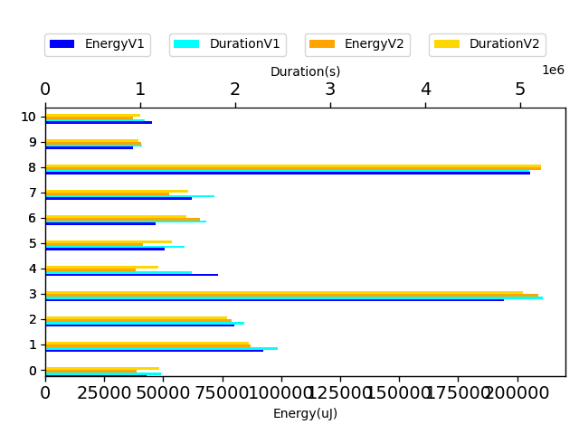

## com.squareup.javapoet.TypeSpecTest

| Test | EnergyV1 | EnergyV2 | DeltaEnergy | DurationV1 | DurationsV2 | DeltaDuration |
| --- | --- | --- | --- | --- | --- | --- |
| com.squareup.javapoet.TypeSpecTest-indexedElseIf | 40387.984375 | 41533.265625 | -1145.28125 | 740380.546875 | 774645.06640625 | -34264.51953125 |
| com.squareup.javapoet.TypeSpecTest-enumWithMembersButNoConstructorCall | 40366.875 | 41653.296875 | -1286.421875 | 822967.5 | 840551.484375 | -17583.984375 |
| com.squareup.javapoet.TypeSpecTest-nativeMethods | 41054.890625 | 38378.625 | 2676.265625 | 828281.8359375 | 830274.796875 | -1992.9609375 |
| com.squareup.javapoet.TypeSpecTest-methodThrows | 38870.2109375 | 41090.73046875 | -2220.51953125 | 1073780.8203125 | 1272426.56640625 | -198645.74609375 |
| com.squareup.javapoet.TypeSpecTest-typeFromTypeMirror | 41469.6875 | 43459.265625 | -1989.578125 | 684229.625 | 1029535.1875 | -345305.5625 |
| com.squareup.javapoet.TypeSpecTest-enumWithSubclassing | 41546.54296875 | 60811.802734375 | -19265.259765625 | 1205671.267578125 | 1377902.982421875 | -172231.71484375 |
| com.squareup.javapoet.TypeSpecTest-annotatedParameters | 46685.392578125 | 51596.021484375 | -4910.62890625 | 1863407.5390625 | 1837132.51953125 | 26275.01953125 |
| com.squareup.javapoet.TypeSpecTest-lineWrapping | 67706.8125 | 48676.806640625 | 19030.005859375 | 1553656.107421875 | 1601726.10546875 | -48069.998046875 |
| com.squareup.javapoet.TypeSpecTest-codeBlockToString | 39596.25 | 36377.5 | 3218.75 | 461747.5 | 402069.0 | 59678.5 |
| com.squareup.javapoet.TypeSpecTest-classImplementsExtends | 37592.5 | 37328.359375 | 264.140625 | 913262.234375 | 881930.265625 | 31331.96875 |
| com.squareup.javapoet.TypeSpecTest-multilineStatementWithAnonymousClass | 48443.537109375 | 62353.919921875 | -13910.3828125 | 1338741.591796875 | 1361173.99609375 | -22432.404296875 |
| com.squareup.javapoet.TypeSpecTest-enumImplements | 35092.796875 | 37537.0 | -2444.203125 | 676696.0703125 | 576363.0 | 100333.0703125 |
| com.squareup.javapoet.TypeSpecTest-stringFromAnything | 40798.1875 | 41228.75 | -430.5625 | 550921.875 | 558486.0 | -7564.125 |
| com.squareup.javapoet.TypeSpecTest-anonymousClassToString | 34652.25 | 41305.5 | -6653.25 | 559483.75 | 576587.25 | -17103.5 |
| com.squareup.javapoet.TypeSpecTest-doWhile | 38536.375 | 43182.5 | -4646.125 | 660773.875 | 655346.5 | 5427.375 |
| com.squareup.javapoet.TypeSpecTest-intersectionType | 39048.84375 | 33569.3125 | 5479.53125 | 676113.0 | 709588.625 | -33475.625 |
| com.squareup.javapoet.TypeSpecTest-annotatedClass | 38565.140625 | 41842.9296875 | -3277.7890625 | 813765.609375 | 871198.6796875 | -57433.0703125 |
| com.squareup.javapoet.TypeSpecTest-inlineIndent | 40565.5625 | 38207.0 | 2358.5625 | 613385.9375 | 743800.0 | -130414.0625 |
| com.squareup.javapoet.TypeSpecTest-codeBlocks | 95740.890625 | 113211.474609375 | -17470.583984375 | 3000876.2890625 | 3088097.7890625 | -87221.5 |
| com.squareup.javapoet.TypeSpecTest-enumsMayDefineAbstractMethods | 41921.703125 | 39291.28125 | 2630.421875 | 811978.703125 | 871720.5 | -59741.796875 |
| com.squareup.javapoet.TypeSpecTest-simpleNameConflictsWithTypeVariable | 41591.4375 | 42389.390625 | -797.953125 | 1012078.2578125 | 1002708.6953125 | 9369.5625 |
| com.squareup.javapoet.TypeSpecTest-retrofitStyleInterface | 65525.56640625 | 73933.083984375 | -8407.517578125 | 1502681.82421875 | 1659925.65234375 | -157243.828125 |
| com.squareup.javapoet.TypeSpecTest-nestedClasses | 42388.955078125 | 50773.162109375 | -8384.20703125 | 1345477.62109375 | 1488142.921875 | -142665.30078125 |
| com.squareup.javapoet.TypeSpecTest-multipleTypeAddition | 42664 | 38757.0 | 3907.0 | 483227 | 542540.5 | -59313.5 |
| com.squareup.javapoet.TypeSpecTest-interfaceDefaultMethods | 43434.125 | 40962.5 | 2471.625 | 547608.125 | 533295.375 | 14312.75 |
| com.squareup.javapoet.TypeSpecTest-multilineStrings | 41484.78125 | 41341.28125 | 143.5 | 710993.6875 | 730818.96875 | -19825.28125 |
| com.squareup.javapoet.TypeSpecTest-literalFromAnything | 41229.25 | 40680.0 | 549.25 | 557726.25 | 525799.0 | 31927.25 |
| com.squareup.javapoet.TypeSpecTest-initializersToBuilder | 61613.197265625 | 43541.796875 | 18071.400390625 | 1297959.333984375 | 1347732.828125 | -49773.494140625 |
| com.squareup.javapoet.TypeSpecTest-varargs | 38214.5234375 | 41093.703125 | -2879.1796875 | 663477.75 | 710654.1875 | -47176.4375 |
| com.squareup.javapoet.TypeSpecTest-defaultModifiersForInterfaceMembers | 36605.328125 | 37979.0 | -1373.671875 | 733649.59375 | 903893.75 | -170244.15625 |
| com.squareup.javapoet.TypeSpecTest-arrayType | 38175.03125 | 36727.75 | 1447.28125 | 656342.859375 | 646041.25 | 10301.609375 |
| com.squareup.javapoet.TypeSpecTest-classImplementsNestedClass | 40716.1875 | 38131.4375 | 2584.75 | 897342.59375 | 926722.53125 | -29379.9375 |
| com.squareup.javapoet.TypeSpecTest-basic | 235883.033203125 | 229828.005859375 | 6055.02734375 | 5717712.67578125 | 5745830.498046875 | -28117.822265625 |
| com.squareup.javapoet.TypeSpecTest-doubleFieldInitialization | 40527.5 | 43029.5 | -2502.0 | 429248.0 | 415722.25 | 13525.75 |
| com.squareup.javapoet.TypeSpecTest-multilineStatement | 40514.03125 | 41797.5 | -1283.46875 | 769751.5 | 784437.1875 | -14685.6875 |
| com.squareup.javapoet.TypeSpecTest-elseIf | 40443.375 | 40695.0 | -251.625 | 655980.875 | 646225.25 | 9755.625 |
| com.squareup.javapoet.TypeSpecTest-referencedAndDeclaredSimpleNamesConflict | 40740.9453125 | 39354.76953125 | 1386.17578125 | 1109737.0234375 | 1069077.05859375 | 40659.96484375 |
| com.squareup.javapoet.TypeSpecTest-multipleTypeVariableAddition | 39418.5625 | 40002.5 | -583.9375 | 5788387.359375 | 666154.5625 | 5122232.796875 |
| com.squareup.javapoet.TypeSpecTest-multipleAnnotationAddition | 41183.25 | 38485.0625 | 2698.1875 | 726004.0 | 703063.75 | 22940.25 |
| com.squareup.javapoet.TypeSpecTest-multipleFieldAddition | 38314.625 | 39081.75 | -767.125 | 732775.125 | 744242.625 | -11467.5 |
| com.squareup.javapoet.TypeSpecTest-typeVariableWithBounds | 40626.2890625 | 39617.3203125 | 1008.96875 | 949450.953125 | 922566.16015625 | 26884.79296875 |
| com.squareup.javapoet.TypeSpecTest-parameterToString | 39672.5 | 40832.0 | -1159.5 | 496646.0 | 468387.0 | 28259.0 |
| com.squareup.javapoet.TypeSpecTest-defaultModifiersForMemberInterfacesAndEnums | 40318.375 | 39184.5 | 1133.875 | 679647.953125 | 569621.5 | 110026.453125 |
| com.squareup.javapoet.TypeSpecTest-typeFromTypeElement | 43525.375 | 41710.125 | 1815.25 | 547548.625 | 557204.125 | -9655.5 |
| com.squareup.javapoet.TypeSpecTest-equalsAndHashCode | 44054.005859375 | 50533.3046875 | -6479.298828125 | 1419295.744140625 | 1424505.8984375 | -5210.154296875 |
| com.squareup.javapoet.TypeSpecTest-interestingTypes | 37381.1640625 | 43454.03125 | -6072.8671875 | 825630.390625 | 1078927.984375 | -253297.59375 |
| com.squareup.javapoet.TypeSpecTest-staticCodeBlock | 42753.0 | 43990.9375 | -1237.9375 | 721737.84375 | 725665.4375 | -3927.59375 |
| com.squareup.javapoet.TypeSpecTest-typeFromReflectType | 39718.25 | 42510.5 | -2792.25 | 321668.5 | 370915.0 | -49246.5 |
| com.squareup.javapoet.TypeSpecTest-anonymousInnerClass | 48074.640625 | 73692.955078125 | -25618.314453125 | 1736212.98046875 | 1706284.333984375 | 29928.646484375 |
| com.squareup.javapoet.TypeSpecTest-originatingElementsIncludesThoseOfNestedTypes | 10427236.28515625 | 9153466.857421875 | 1273769.427734375 | 274130244.5566406 | 262853842.56640625 | 11276401.990234375 |
| com.squareup.javapoet.TypeSpecTest-membersOrdering | 40808.640625 | 40982.48046875 | -173.83984375 | 1023771.734375 | 1170376.0234375 | -146604.2890625 |
| com.squareup.javapoet.TypeSpecTest-annotationDeclarationToString | 41671.25 | 36575.0 | 5096.25 | 480229.75 | 429965.75 | 50264.0 |
| com.squareup.javapoet.TypeSpecTest-innerAnnotationInAnnotationDeclaration | 42114.3125 | 41644.5 | 469.8125 | 719612.8125 | 733046.96875 | -13434.15625 |
| com.squareup.javapoet.TypeSpecTest-tryCatch | 39253.0 | 40558.0 | -1305.0 | 603850.625 | 531472.5 | 72378.125 |
| com.squareup.javapoet.TypeSpecTest-interfaceStaticMethods | 42030.375 | 42480.25 | -449.875 | 566616.0 | 613034.75 | -46418.75 |
| com.squareup.javapoet.TypeSpecTest-enumWithAnnotatedValues | 39153.96875 | 40149.5 | -995.53125 | 815989.4375 | 900115.875 | -84126.4375 |
| com.squareup.javapoet.TypeSpecTest-initializerBlockInRightPlace | 42310.625 | 41106.3125 | 1204.3125 | 757470.03125 | 785995.1875 | -28525.15625 |
| com.squareup.javapoet.TypeSpecTest-typeVariables | 40777.98828125 | 63403.52734375 | -22625.5390625 | 1021558.58203125 | 1518983.146484375 | -497424.564453125 |
| com.squareup.javapoet.TypeSpecTest-annotationsInAnnotations | 37046.9375 | 41647.09375 | -4600.15625 | 855202.75 | 871719.875 | -16517.125 |
| com.squareup.javapoet.TypeSpecTest-codeBlockAddStatementOfCodeBlockToString | 39336.5 | 41305.0 | -1968.5 | 419032.5 | 449068.25 | -30035.75 |
| com.squareup.javapoet.TypeSpecTest-fieldToString | 38879.875 | 40008.5 | -1128.625 | 480569.0 | 462995.0 | 17574.0 |
| com.squareup.javapoet.TypeSpecTest-annotationToString | 39230.25 | 38108.625 | 1121.625 | 527322.25 | 543560.5 | -16238.25 |
| com.squareup.javapoet.TypeSpecTest-ifElse | 39421.4375 | 41321.0 | -1899.5625 | 499632.0625 | 526988.25 | -27356.1875 |
| com.squareup.javapoet.TypeSpecTest-javadoc | 39664.875 | 40257.90625 | -593.03125 | 779760.25 | 788344.9375 | -8584.6875 |
| com.squareup.javapoet.TypeSpecTest-multipleSuperinterfaceAddition | 39737.6875 | 40472.0625 | -734.375 | 702157.875 | 679106.875 | 23051.0 |
| com.squareup.javapoet.TypeSpecTest-interfaceExtends | 36430.25 | 39943.5625 | -3513.3125 | 632508.125 | 639810.25 | -7302.125 |
| com.squareup.javapoet.TypeSpecTest-onlyEnumsMayHaveEnumConstants | 40160.5 | 46325.0 | -6164.5 | 374098.0 | 345380.0 | 28718.0 |
| com.squareup.javapoet.TypeSpecTest-nameFromField | 39702.75 | 38848.5 | 854.25 | 303357.25 | 321192.0 | -17834.75 |
| com.squareup.javapoet.TypeSpecTest-annotationsAndJavaLangTypes | 41669.46875 | 42511.6875 | -842.21875 | 842111.484375 | 864449.1875 | -22337.703125 |
| com.squareup.javapoet.TypeSpecTest-initializerBlockUnsupportedExceptionOnInterface | 41809.0 | 42297.0 | -488.0 | 338967.0 | 433313.0 | -94346.0 |
| com.squareup.javapoet.TypeSpecTest-multipleMethodAddition | 40210.5625 | 40451.25 | -240.6875 | 650869.875 | 685488.5 | -34618.625 |
| com.squareup.javapoet.TypeSpecTest-methodToString | 41242.15625 | 41215.90625 | 26.25 | 545411.9375 | 584917.15625 | -39505.21875 |
| com.squareup.javapoet.TypeSpecTest-simpleNamesConflictInThisAndOtherPackage | 41400.5 | 37720.0 | 3680.5 | 617739.375 | 590651.0 | 27088.375 |
| com.squareup.javapoet.TypeSpecTest-annotationWithFields | 39672.5 | 42055.0 | -2382.5 | 570209.0 | 570445.9375 | -236.9375 |
| com.squareup.javapoet.TypeSpecTest-classNameFactories | 43518.25 | 41336.0 | 2182.25 | 384614.5 | 438441.25 | -53826.75 |
| com.squareup.javapoet.TypeSpecTest-nullStringLiteral | 39130.75 | 38315.25 | 815.5 | 717248.75 | 613612.625 | 103636.125 |
| com.squareup.javapoet.TypeSpecTest-nameFromType | 42969.0 | 39215.0 | 3754.0 | 298413.0 | 317688.5 | -19275.5 |
| com.squareup.javapoet.TypeSpecTest-annotatedField | 43770.0 | 41675.484375 | 2094.515625 | 837504.625 | 858050.6328125 | -20546.0078125 |
| com.squareup.javapoet.TypeSpecTest-classToString | 40679.75 | 41686.75 | -1007.0 | 454854.375 | 472135.25 | -17280.875 |
| com.squareup.javapoet.TypeSpecTest-classCannotHaveDefaultValueForMethod | 39673.0 | 41183.75 | -1510.75 | 470327.0 | 367498.25 | 102828.75 |
| com.squareup.javapoet.TypeSpecTest-nameFromMethod | 40039.0 | 35797.0 | 4242.0 | 338031.5 | 331641.5 | 6390.0 |
| com.squareup.javapoet.TypeSpecTest-typeFromTypeName | 40496.5 | 43823.0 | -3326.5 | 306288.0 | 305556.5 | 731.5 |
| com.squareup.javapoet.TypeSpecTest-lineWrappingWithZeroWidthSpace | 43715.75 | 45105.0 | -1389.25 | 547214.75 | 491499.0 | 55715.75 |
| com.squareup.javapoet.TypeSpecTest-classCannotHaveDefaultMethods | 40588.25 | 41472.75 | -884.5 | 362490.25 | 372158.0 | -9667.75 |
| com.squareup.javapoet.TypeSpecTest-nameFromParameter | 41351.0 | 42083.5 | -732.5 | 298651.0 | 345856.0 | -47205.0 |
| com.squareup.javapoet.TypeSpecTest-annotation | 36865.0 | 41992.0 | -5127.0 | 539763.5 | 635592.0 | -95828.5 |
| com.squareup.javapoet.TypeSpecTest-constructorToString | 40008.5 | 39688.0 | 320.5 | 512870.0 | 517399.25 | -4529.25 |

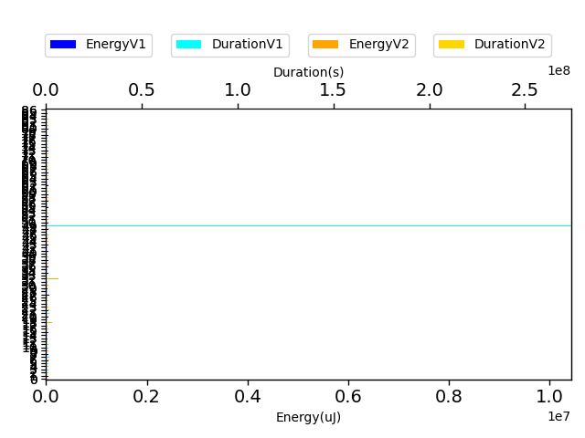

## com.squareup.javapoet.FieldSpecTest

| Test | EnergyV1 | EnergyV2 | DeltaEnergy | DurationV1 | DurationsV2 | DeltaDuration |
| --- | --- | --- | --- | --- | --- | --- |
| com.squareup.javapoet.FieldSpecTest-equalsAndHashCode | 43220.9375 | 40413.6875 | 2807.25 | 565720.3125 | 531016.625 | 34703.6875 |

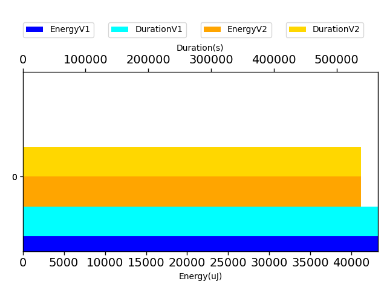

## com.squareup.javapoet.FileReadingTest

| Test | EnergyV1 | EnergyV2 | DeltaEnergy | DurationV1 | DurationsV2 | DeltaDuration |
| --- | --- | --- | --- | --- | --- | --- |
| com.squareup.javapoet.FileReadingTest-javaFileObjectCharacterContent | 41796.03125 | 40737.328125 | 1058.703125 | 625490.84375 | 640354.015625 | -14863.171875 |
| com.squareup.javapoet.FileReadingTest-compileJavaFile | 2674135.9296875 | 2543010.67578125 | 131125.25390625 | 64988380.82421875 | 62279229.267578125 | 2709151.556640625 |
| com.squareup.javapoet.FileReadingTest-javaFileObjectInputStreamIsUtf8 | 119536.21484375 | 111044.458984375 | 8491.755859375 | 3092941.40625 | 2812487.755859375 | 280453.650390625 |
| com.squareup.javapoet.FileReadingTest-javaFileObjectKind | 40222.0 | 42617.5 | -2395.5 | 255250.0 | 250401.0 | 4849.0 |
| com.squareup.javapoet.FileReadingTest-javaFileObjectUri | 43031.99609375 | 40361.01171875 | 2670.984375 | 1059044.9921875 | 883452.380859375 | 175592.611328125 |

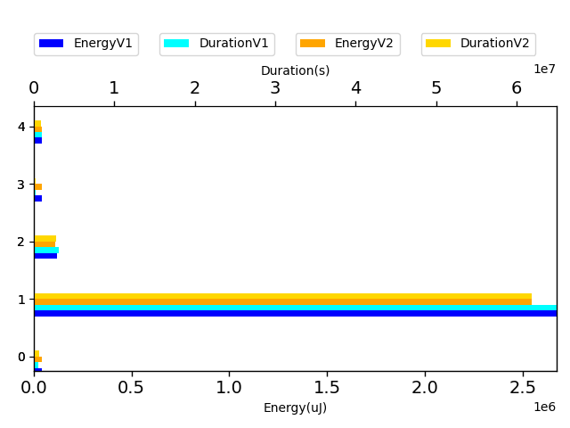

## com.squareup.javapoet.ParameterSpecTest

| Test | EnergyV1 | EnergyV2 | DeltaEnergy | DurationV1 | DurationsV2 | DeltaDuration |
| --- | --- | --- | --- | --- | --- | --- |
| com.squareup.javapoet.ParameterSpecTest-equalsAndHashCode | 40305.875 | 43472.0 | -3166.125 | 640511.875 | 451945.5 | 188566.375 |

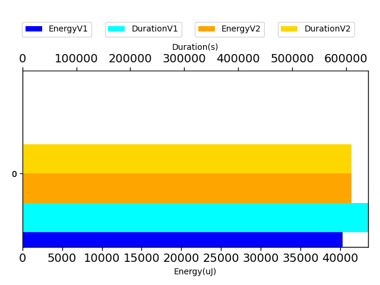

## com.squareup.javapoet.AbstractTypesTest

| Test | EnergyV1 | EnergyV2 | DeltaEnergy | DurationV1 | DurationsV2 | DeltaDuration |
| --- | --- | --- | --- | --- | --- | --- |
| com.squareup.javapoet.AbstractTypesTest-wildcardMirrorExtendsType | 40855.57421875 | 40960.453125 | -104.87890625 | 845683.21484375 | 965801.90625 | -120118.69140625 |
| com.squareup.javapoet.AbstractTypesTest-wildcardMirrorSuperType | 39857.84375 | 39817.625 | 40.21875 | 577230.15625 | 568566.875 | 8663.28125 |
| com.squareup.javapoet.AbstractTypesTest-wildcardExtendsType | 33508.5 | 35125.5 | -1617.0 | 307982.75 | 314984.5 | -7001.75 |
| com.squareup.javapoet.AbstractTypesTest-wildcardSuperType | 35950.0 | 38879.0 | -2929.0 | 302965.0 | 313485.5 | -10520.5 |

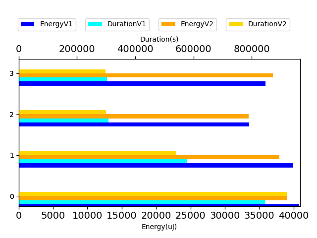

## com.squareup.javapoet.AnnotatedTypeNameTest

| Test | EnergyV1 | EnergyV2 | DeltaEnergy | DurationV1 | DurationsV2 | DeltaDuration |
| --- | --- | --- | --- | --- | --- | --- |
| com.squareup.javapoet.AnnotatedTypeNameTest-annotatedEnclosingAndNestedType | 44708.5 | 45455.75 | -747.25 | 355302.0 | 418334.0 | -63032.0 |
| com.squareup.javapoet.AnnotatedTypeNameTest-annotatedType | 41801.125 | 45486.5 | -3685.375 | 380238.25 | 286846.625 | 93391.625 |
| com.squareup.javapoet.AnnotatedTypeNameTest-annotatedNestedType | 48889 | 43671.0 | 5218.0 | 455103 | 334640.0 | 120463.0 |
| com.squareup.javapoet.AnnotatedTypeNameTest-annotatedEquivalence | 43457.0 | 44464.25 | -1007.25 | 361218.5 | 323076.0 | 38142.5 |
| com.squareup.javapoet.AnnotatedTypeNameTest-annotatedParameterizedType | 41290.5 | 43044.75 | -1754.25 | 423390.5 | 301763.5 | 121627.0 |
| com.squareup.javapoet.AnnotatedTypeNameTest-annotatedWildcardTypeNameWithSuper | 40161.0 | 45013.5 | -4852.5 | 304856.0 | 407509.5 | -102653.5 |
| com.squareup.javapoet.AnnotatedTypeNameTest-annotatedNestedParameterizedType | 37964.0 | 39215.0 | -1251.0 | 481090.0 | 352736.0 | 128354.0 |
| com.squareup.javapoet.AnnotatedTypeNameTest-annotatedArrayTypeInVarargsParameter | 37048.0 | 43686.0 | -6638.0 | 494828.0 | 424413.5 | 70414.5 |
| com.squareup.javapoet.AnnotatedTypeNameTest-annotated | 36987.25 | 43258.5 | -6271.25 | 405560.75 | 454666.75 | -49106.0 |
| com.squareup.javapoet.AnnotatedTypeNameTest-annotatedInnerMultidimensionalArrayType | 44159.5 | 45655.0 | -1495.5 | 329075.0 | 235173.0 | 93902.0 |
| com.squareup.javapoet.AnnotatedTypeNameTest-annotatedArrayTypeVarargsParameter | 41564.0 | 40999.75 | 564.25 | 391324.0 | 402043.5 | -10719.5 |
| com.squareup.javapoet.AnnotatedTypeNameTest-annotatedOuterMultidimensionalArrayType | 41626.0 | 41259.75 | 366.25 | 270510.0 | 392475.0 | -121965.0 |
| com.squareup.javapoet.AnnotatedTypeNameTest-annotatedArrayType | 44799.0 | 44690.71875 | 108.28125 | 332413.0 | 391269.8125 | -58856.8125 |
| com.squareup.javapoet.AnnotatedTypeNameTest-annotatedArrayElementType | 45593.0 | 41503.5 | 4089.5 | 285025.0 | 263864.5 | 21160.5 |

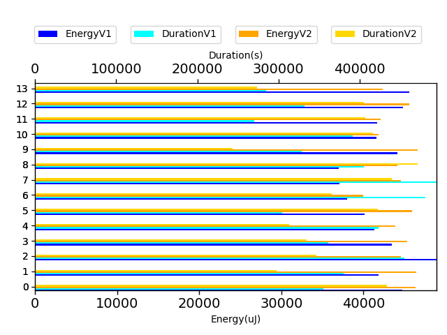

## com.squareup.javapoet.TypeNameTest

| Test | EnergyV1 | EnergyV2 | DeltaEnergy | DurationV1 | DurationsV2 | DeltaDuration |
| --- | --- | --- | --- | --- | --- | --- |
| com.squareup.javapoet.TypeNameTest-equalsAndHashCodeWildcardTypeName | 42061.125 | 45646.75 | -3585.625 | 486172.125 | 605717.8125 | -119545.6875 |

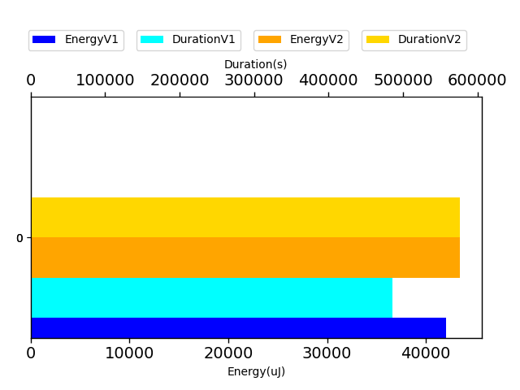

