# gson b1fb9c

https://github.com/google/gson/commit/b1fb9c

## Delta Energy per test method

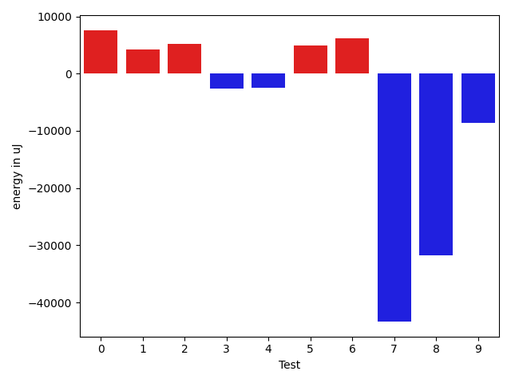

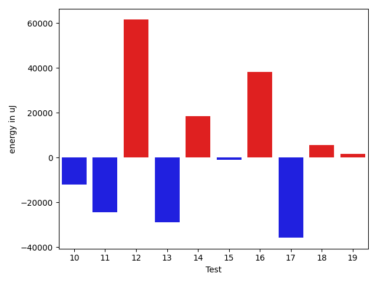

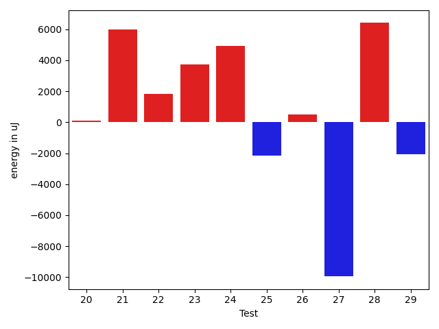

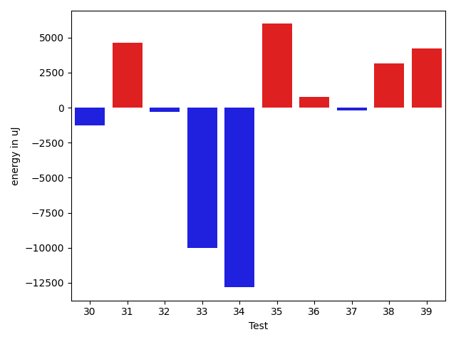

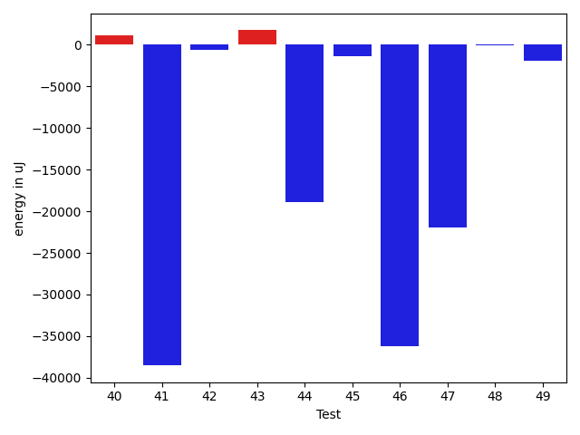

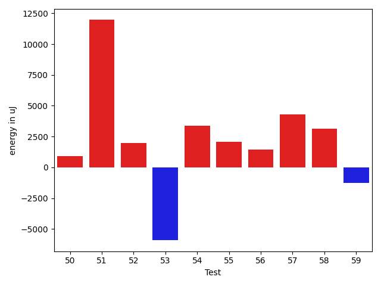

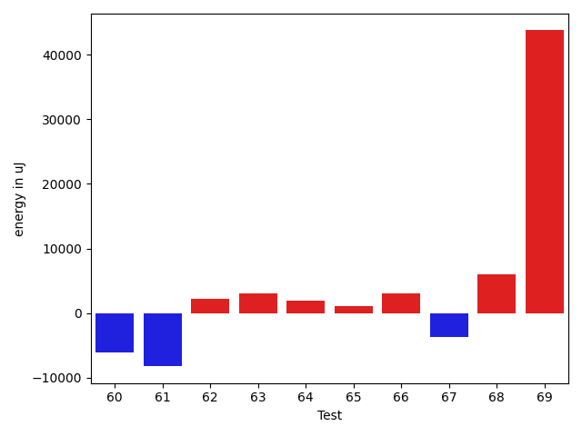

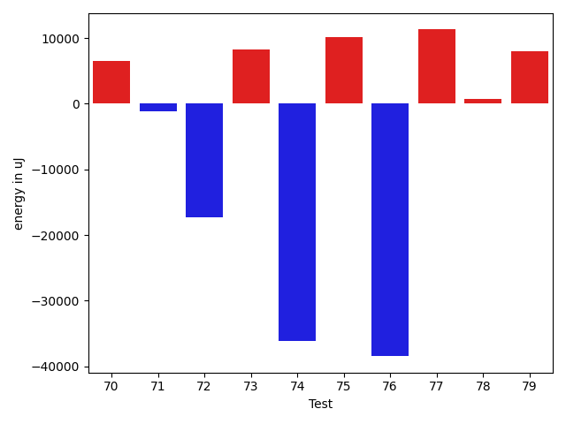

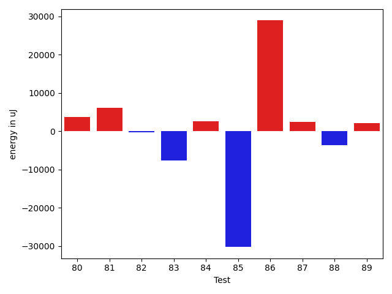

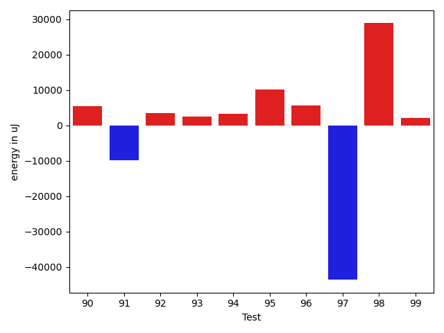

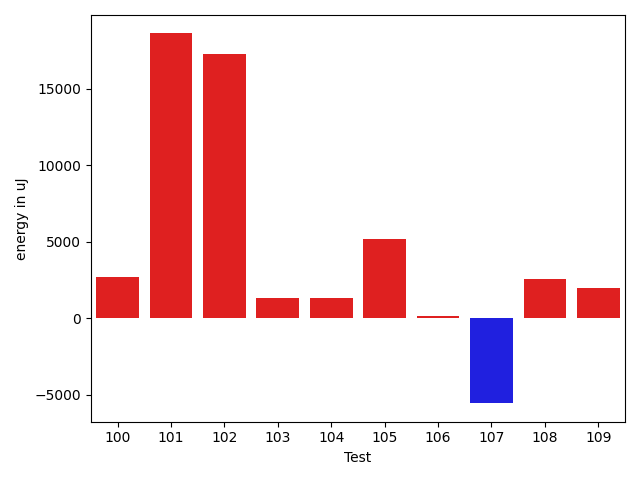

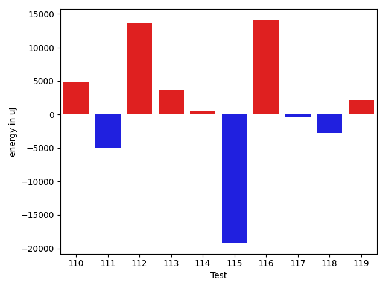

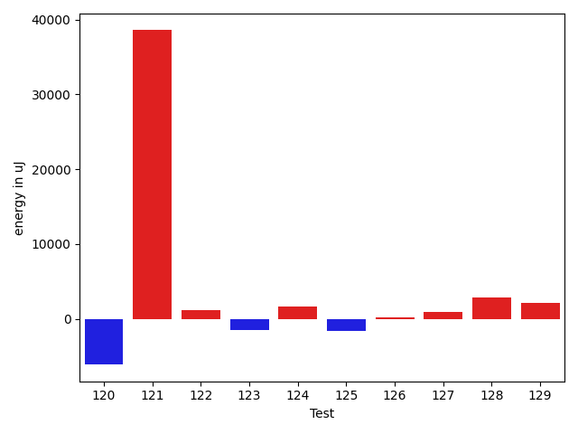

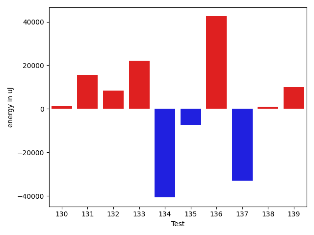

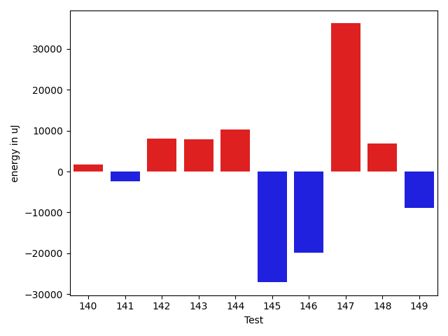

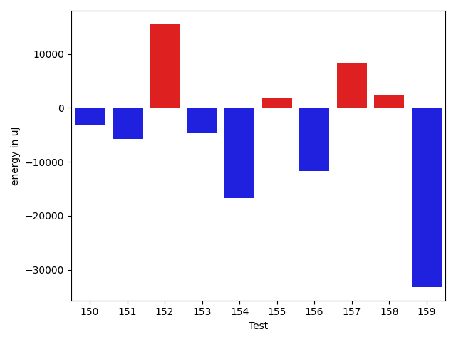

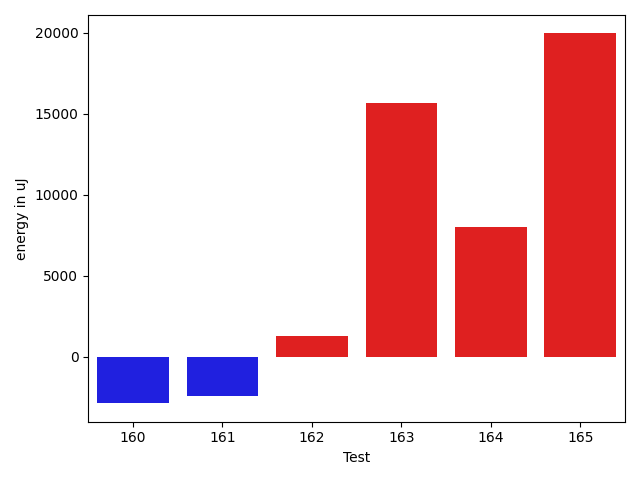

| ID | EnergyV1 | EnergyV2 | DeltaEnergy | σV1 | %σV1 | σV2 | %σV2 |
| --- | --- | --- | --- | --- | --- | --- | --- |
| 0 | 222960 | 230590 | 7630 | 34188.82 | 15.33 | 19718.28 | 8.55 |
| 1 | 159546 | 163757 | 4211 | 12887.78 | 8.08 | 25121.92 | 15.34 |
| 2 | 156189 | 161377 | 5188 | 17104.82 | 10.95 | 15614.98 | 9.68 |
| 3 | 78796 | 76172 | -2624 | 11047.10 | 14.02 | 1231.37 | 1.62 |
| 4 | 89233 | 86792 | -2441 | 13808.04 | 15.47 | 3372.04 | 3.89 |
| 5 | 176819 | 181762 | 4943 | 18168.17 | 10.28 | 20543.78 | 11.30 |
| 6 | 221618 | 227844 | 6226 | 22891.61 | 10.33 | 60698.63 | 26.64 |
| 7 | 133362 | 89966 | -43396 | 24202.38 | 18.15 | 19089.32 | 21.22 |
| 8 | 152954 | 121154 | -31800 | 25038.69 | 16.37 | 19243.35 | 15.88 |
| 9 | 439146 | 430541 | -8605 | 46496.09 | 10.59 | 92789.03 | 21.55 |
| 10 | 341674 | 329711 | -11963 | 92790.13 | 27.16 | 25792.67 | 7.82 |
| 11 | 201477 | 177001 | -24476 | 20653.23 | 10.25 | 26273.67 | 14.84 |
| 12 | 1561336 | 1622860 | 61524 | 53170.12 | 3.41 | 60116.29 | 3.70 |
| 13 | 362731 | 333922 | -28809 | 24015.83 | 6.62 | 30113.63 | 9.02 |
| 14 | 411376 | 429870 | 18494 | 27214.64 | 6.62 | 46938.56 | 10.92 |
| 15 | 84289 | 83252 | -1037 | 17967.85 | 21.32 | 20045.44 | 24.08 |
| 16 | 139831 | 178161 | 38330 | 20474.96 | 14.64 | 15761.84 | 8.85 |
| 17 | 158325 | 122559 | -35766 | 19292.60 | 12.19 | 19297.17 | 15.75 |
| 18 | 85144 | 90759 | 5615 | 13560.98 | 15.93 | 39675.25 | 43.71 |
| 19 | 179016 | 180724 | 1708 | 21787.59 | 12.17 | 20559.97 | 11.38 |
| 20 | 91492 | 91614 | 122 | 29171.26 | 31.88 | 16317.13 | 17.81 |
| 21 | 174011 | 179993 | 5982 | 23451.35 | 13.48 | 20455.61 | 11.36 |
| 22 | 79346 | 81176 | 1830 | 15067.59 | 18.99 | 24723.27 | 30.46 |
| 23 | 134094 | 137817 | 3723 | 20525.88 | 15.31 | 26752.10 | 19.41 |
| 24 | 115600 | 120545 | 4945 | 13069.46 | 11.31 | 18005.01 | 14.94 |
| 25 | 130249 | 128112 | -2137 | 23650.87 | 18.16 | 26103.12 | 20.38 |
| 26 | 161254 | 161743 | 489 | 21671.23 | 13.44 | 22283.42 | 13.78 |
| 27 | 272216 | 262267 | -9949 | 39213.57 | 14.41 | 20209.70 | 7.71 |
| 28 | 85572 | 91979 | 6407 | 28834.49 | 33.70 | 30836.71 | 33.53 |
| 29 | 179321 | 177246 | -2075 | 19789.74 | 11.04 | 25145.21 | 14.19 |
| 30 | 88074 | 86792 | -1282 | 13981.65 | 15.87 | 18126.21 | 20.88 |
| 31 | 277465 | 282104 | 4639 | 26032.26 | 9.38 | 26088.64 | 9.25 |
| 32 | 132385 | 132079 | -306 | 18746.07 | 14.16 | 19700.17 | 14.92 |
| 33 | 228026 | 218017 | -10009 | 35511.01 | 15.57 | 41445.72 | 19.01 |
| 34 | 377929 | 365111 | -12818 | 21307.49 | 5.64 | 33669.75 | 9.22 |
| 35 | 125488 | 131469 | 5981 | 16459.14 | 13.12 | 10375.94 | 7.89 |
| 36 | 74157 | 74951 | 794 | 18430.14 | 24.85 | 18264.20 | 24.37 |
| 37 | 156432 | 156249 | -183 | 23096.23 | 14.76 | 20215.88 | 12.94 |
| 38 | 130737 | 133911 | 3174 | 15203.07 | 11.63 | 19460.74 | 14.53 |
| 39 | 321593 | 325805 | 4212 | 40163.32 | 12.49 | 30458.59 | 9.35 |
| 40 | 44555 | 45654 | 1099 | 16909.14 | 37.95 | 22319.24 | 48.89 |
| 41 | 171813 | 133300 | -38513 | 25899.15 | 15.07 | 20468.52 | 15.36 |
| 42 | 92895 | 92285 | -610 | 57982.59 | 62.42 | 13686.35 | 14.83 |
| 43 | 133606 | 135315 | 1709 | 14454.37 | 10.82 | 20688.08 | 15.29 |
| 44 | 198730 | 179870 | -18860 | 20258.20 | 10.19 | 20228.62 | 11.25 |
| 45 | 159485 | 158142 | -1343 | 16945.66 | 10.63 | 15448.40 | 9.77 |
| 46 | 167663 | 131409 | -36254 | 26954.91 | 16.08 | 23423.98 | 17.83 |
| 47 | 189331 | 167419 | -21912 | 38632.58 | 20.40 | 16626.06 | 9.93 |
| 48 | 44434 | 44311 | -123 | 19069.57 | 42.92 | 2049.61 | 4.63 |
| 49 | 122741 | 120788 | -1953 | 18581.94 | 15.14 | 26280.32 | 21.76 |
| 50 | 138366 | 139282 | 916 | 21059.23 | 15.22 | 5250.49 | 3.77 |
| 51 | 76294 | 88257 | 11963 | 15735.10 | 20.62 | 15787.16 | 17.89 |
| 52 | 301147 | 303100 | 1953 | 14956.78 | 4.97 | 21885.26 | 7.22 |
| 53 | 354003 | 348082 | -5921 | 21971.64 | 6.21 | 31866.74 | 9.15 |
| 54 | 179932 | 183288 | 3356 | 20013.22 | 11.12 | 24141.45 | 13.17 |
| 55 | 135803 | 137878 | 2075 | 20080.95 | 14.79 | 18476.16 | 13.40 |
| 56 | 135192 | 136658 | 1466 | 19427.91 | 14.37 | 26082.78 | 19.09 |
| 57 | 128540 | 132812 | 4272 | 19613.35 | 15.26 | 8355.31 | 6.29 |
| 58 | 132202 | 135315 | 3113 | 25519.67 | 19.30 | 20548.51 | 15.19 |
| 59 | 153442 | 152161 | -1281 | 13663.16 | 8.90 | 22165.23 | 14.57 |
| 60 | 176147 | 170104 | -6043 | 18457.83 | 10.48 | 22202.97 | 13.05 |
| 61 | 176269 | 168029 | -8240 | 70786.69 | 40.16 | 33136.44 | 19.72 |
| 62 | 135070 | 137206 | 2136 | 15581.40 | 11.54 | 14860.87 | 10.83 |
| 63 | 126770 | 129882 | 3112 | 11786.96 | 9.30 | 10351.94 | 7.97 |
| 64 | 263854 | 265808 | 1954 | 23783.02 | 9.01 | 25877.31 | 9.74 |
| 65 | 162720 | 163757 | 1037 | 20013.46 | 12.30 | 45384.93 | 27.71 |
| 66 | 82092 | 85144 | 3052 | 24066.16 | 29.32 | 26060.26 | 30.61 |
| 67 | 136658 | 132934 | -3724 | 23902.82 | 17.49 | 16501.14 | 12.41 |
| 68 | 200317 | 206299 | 5982 | 28922.96 | 14.44 | 53975.43 | 26.16 |
| 69 | 319518 | 363280 | 43762 | 39112.88 | 12.24 | 26535.98 | 7.30 |
| 70 | 126708 | 133178 | 6470 | 14984.77 | 11.83 | 20391.71 | 15.31 |
| 71 | 114929 | 113770 | -1159 | 16996.37 | 14.79 | 18083.69 | 15.89 |
| 72 | 520934 | 503599 | -17335 | 36483.44 | 7.00 | 36547.94 | 7.26 |
| 73 | 144775 | 153015 | 8240 | 29527.31 | 20.40 | 19237.56 | 12.57 |
| 74 | 241271 | 205078 | -36193 | 22569.02 | 9.35 | 26756.56 | 13.05 |
| 75 | 115600 | 125793 | 10193 | 12479.96 | 10.80 | 13766.89 | 10.94 |
| 76 | 174377 | 135925 | -38452 | 20580.41 | 11.80 | 26492.07 | 19.49 |
| 77 | 317016 | 328308 | 11292 | 33931.45 | 10.70 | 44735.15 | 13.63 |
| 78 | 138855 | 139648 | 793 | 17417.54 | 12.54 | 19836.36 | 14.20 |
| 79 | 126037 | 134094 | 8057 | 9055.31 | 7.18 | 23698.85 | 17.67 |
| 80 | 148315 | 152099 | 3784 | 25141.23 | 16.95 | 20064.13 | 13.19 |
| 81 | 162719 | 168823 | 6104 | 26294.70 | 16.16 | 39487.33 | 23.39 |
| 82 | 41015 | 40711 | -304 | 14752.97 | 35.97 | 2947.72 | 7.24 |
| 83 | 86914 | 79285 | -7629 | 18760.73 | 21.59 | 23394.50 | 29.51 |
| 84 | 113342 | 115905 | 2563 | 4454.24 | 3.93 | 21255.93 | 18.34 |
| 85 | 220458 | 190185 | -30273 | 23814.24 | 10.80 | 21318.77 | 11.21 |
| 86 | 156371 | 185302 | 28931 | 11281.83 | 7.21 | 17115.93 | 9.24 |
| 87 | 186828 | 189270 | 2442 | 39464.37 | 21.12 | 69172.66 | 36.55 |
| 88 | 205932 | 202270 | -3662 | 26878.02 | 13.05 | 14821.62 | 7.33 |
| 89 | 176514 | 178649 | 2135 | 23866.81 | 13.52 | 29182.14 | 16.33 |
| 90 | 176330 | 181823 | 5493 | 16730.44 | 9.49 | 27153.03 | 14.93 |
| 91 | 171203 | 161437 | -9766 | 55906.27 | 32.65 | 23806.79 | 14.75 |
| 92 | 42846 | 46325 | 3479 | 2751.03 | 6.42 | 14664.03 | 31.65 |
| 93 | 116638 | 119201 | 2563 | 20093.66 | 17.23 | 15853.22 | 13.30 |
| 94 | 122253 | 125610 | 3357 | 16274.82 | 13.31 | 43435.09 | 34.58 |
| 95 | 494749 | 504943 | 10194 | 19749.06 | 3.99 | 44357.97 | 8.78 |
| 96 | 277831 | 283386 | 5555 | 35237.69 | 12.68 | 12425.92 | 4.38 |
| 97 | 310119 | 266479 | -43640 | 31413.44 | 10.13 | 31683.19 | 11.89 |
| 98 | 263854 | 292723 | 28869 | 20484.70 | 7.76 | 32554.53 | 11.12 |
| 99 | 306701 | 308837 | 2136 | 21516.29 | 7.02 | 14997.40 | 4.86 |
| 100 | 268310 | 270996 | 2686 | 23900.48 | 8.91 | 19051.55 | 7.03 |
| 101 | 290344 | 308959 | 18615 | 37343.56 | 12.86 | 26053.79 | 8.43 |
| 102 | 2024042 | 2041316 | 17274 | 111874.59 | 5.53 | 156908.87 | 7.69 |
| 103 | 90271 | 91614 | 1343 | 20227.59 | 22.41 | 2458.71 | 2.68 |
| 104 | 162719 | 164062 | 1343 | 18868.75 | 11.60 | 21324.72 | 13.00 |
| 105 | 111023 | 116210 | 5187 | 23447.83 | 21.12 | 22033.04 | 18.96 |
| 106 | 89050 | 89172 | 122 | 22482.69 | 25.25 | 22603.29 | 25.35 |
| 107 | 88684 | 83130 | -5554 | 4502.79 | 5.08 | 20148.35 | 24.24 |
| 108 | 44678 | 47241 | 2563 | 15347.10 | 34.35 | 16091.85 | 34.06 |
| 109 | 746214 | 748167 | 1953 | 164831.06 | 22.09 | 81893.33 | 10.95 |
| 110 | 85815 | 90698 | 4883 | 20249.68 | 23.60 | 16461.95 | 18.15 |
| 111 | 180603 | 175597 | -5006 | 22639.88 | 12.54 | 21246.56 | 12.10 |
| 112 | 666503 | 680174 | 13671 | 66606.80 | 9.99 | 40628.31 | 5.97 |
| 113 | 118530 | 122254 | 3724 | 24797.81 | 20.92 | 24894.82 | 20.36 |
| 114 | 166809 | 167358 | 549 | 23734.63 | 14.23 | 16240.79 | 9.70 |
| 115 | 270873 | 251708 | -19165 | 27044.43 | 9.98 | 20974.28 | 8.33 |
| 116 | 177673 | 191772 | 14099 | 24559.91 | 13.82 | 40596.94 | 21.17 |
| 117 | 132568 | 132201 | -367 | 34154.92 | 25.76 | 16745.73 | 12.67 |
| 118 | 212280 | 209472 | -2808 | 14964.61 | 7.05 | 15076.59 | 7.20 |
| 119 | 271545 | 273742 | 2197 | 25371.29 | 9.34 | 35034.32 | 12.80 |
| 120 | 270691 | 264586 | -6105 | 45823.34 | 16.93 | 27904.21 | 10.55 |
| 121 | 281310 | 319884 | 38574 | 24487.93 | 8.70 | 22237.20 | 6.95 |
| 122 | 204650 | 205810 | 1160 | 21531.41 | 10.52 | 17440.96 | 8.47 |
| 123 | 177673 | 176147 | -1526 | 14329.75 | 8.07 | 20853.90 | 11.84 |
| 124 | 159301 | 160949 | 1648 | 18315.73 | 11.50 | 22201.67 | 13.79 |
| 125 | 158630 | 156982 | -1648 | 17271.88 | 10.89 | 27381.57 | 17.44 |
| 126 | 73730 | 73913 | 183 | 1109.79 | 1.51 | 21102.16 | 28.55 |
| 127 | 76294 | 77209 | 915 | 2847.04 | 3.73 | 14962.42 | 19.38 |
| 128 | 129821 | 132690 | 2869 | 24933.42 | 19.21 | 24750.28 | 18.65 |
| 129 | 86914 | 89050 | 2136 | 13798.61 | 15.88 | 20812.44 | 23.37 |
| 130 | 302001 | 303527 | 1526 | 19316.78 | 6.40 | 31999.40 | 10.54 |
| 131 | 256042 | 271728 | 15686 | 30933.75 | 12.08 | 18261.86 | 6.72 |
| 132 | 216674 | 225098 | 8424 | 15155.58 | 6.99 | 29485.80 | 13.10 |
| 133 | 134765 | 156982 | 22217 | 28571.34 | 21.20 | 64775.66 | 41.26 |
| 134 | 176574 | 135864 | -40710 | 30367.95 | 17.20 | 21499.32 | 15.82 |
| 135 | 221374 | 214111 | -7263 | 26103.62 | 11.79 | 22098.15 | 10.32 |
| 136 | 154724 | 197204 | 42480 | 20854.27 | 13.48 | 47444.61 | 24.06 |
| 137 | 479491 | 446532 | -32959 | 32447.67 | 6.77 | 83590.78 | 18.72 |
| 138 | 151245 | 152282 | 1037 | 11902.83 | 7.87 | 13663.41 | 8.97 |
| 139 | 201659 | 211547 | 9888 | 24568.01 | 12.18 | 11057.85 | 5.23 |
| 140 | 39001 | 40711 | 1710 | 13270.24 | 34.03 | 11790.54 | 28.96 |
| 141 | 256835 | 254394 | -2441 | 55913.43 | 21.77 | 47016.06 | 18.48 |
| 142 | 175902 | 183898 | 7996 | 22538.74 | 12.81 | 21107.13 | 11.48 |
| 143 | 223022 | 230834 | 7812 | 12759.15 | 5.72 | 26128.23 | 11.32 |
| 144 | 438902 | 449218 | 10316 | 80558.27 | 18.35 | 77384.28 | 17.23 |
| 145 | 955014 | 927915 | -27099 | 81582.93 | 8.54 | 276890.22 | 29.84 |
| 146 | 548704 | 528869 | -19835 | 33817.51 | 6.16 | 36595.21 | 6.92 |
| 147 | 115112 | 151367 | 36255 | 17789.27 | 15.45 | 21079.93 | 13.93 |
| 148 | 318053 | 324889 | 6836 | 17860.94 | 5.62 | 48801.01 | 15.02 |
| 149 | 164977 | 156005 | -8972 | 26877.49 | 16.29 | 18870.52 | 12.10 |
| 150 | 155944 | 152770 | -3174 | 16207.85 | 10.39 | 15209.47 | 9.96 |
| 151 | 159057 | 153259 | -5798 | 17732.99 | 11.15 | 21894.43 | 14.29 |
| 152 | 161804 | 177367 | 15563 | 26865.42 | 16.60 | 29481.75 | 16.62 |
| 153 | 177612 | 172851 | -4761 | 27441.56 | 15.45 | 25779.66 | 14.91 |
| 154 | 303710 | 286987 | -16723 | 31565.79 | 10.39 | 47645.47 | 16.60 |
| 155 | 179015 | 180968 | 1953 | 4481.67 | 2.50 | 15656.00 | 8.65 |
| 156 | 177002 | 165344 | -11658 | 22086.89 | 12.48 | 24521.65 | 14.83 |
| 157 | 82214 | 90576 | 8362 | 6208.87 | 7.55 | 6313.25 | 6.97 |
| 158 | 39489 | 41931 | 2442 | 15973.86 | 40.45 | 18138.62 | 43.26 |
| 159 | 76111 | 42846 | -33265 | 19368.05 | 25.45 | 18548.63 | 43.29 |
| 160 | 169128 | 166259 | -2869 | 32551.61 | 19.25 | 18327.21 | 11.02 |
| 161 | 131836 | 129394 | -2442 | 19367.47 | 14.69 | 23499.60 | 18.16 |
| 162 | 111755 | 113037 | 1282 | 11465.64 | 10.26 | 17940.34 | 15.87 |
| 163 | 1717769 | 1733455 | 15686 | 121843.37 | 7.09 | 118999.28 | 6.86 |
| 164 | 1601986 | 1609981 | 7995 | 28752.65 | 1.79 | 37376.64 | 2.32 |
| 165 | 293274 | 313232 | 19958 | 22000.85 | 7.50 | 18419.79 | 5.88 |

## Misc.

| ID | Test Class | Test Method |
| --- | --- | --- |
| 0 | com.google.gson.functional.CustomTypeAdaptersTest | testCustomAdapterInvokedForCollectionElementDeserialization |
| 1 | com.google.gson.functional.CustomTypeAdaptersTest | testCustomAdapterInvokedForMapElementDeserialization |
| 2 | com.google.gson.functional.CustomTypeAdaptersTest | testCustomAdapterInvokedForMapElementSerializationWithType |
| 3 | com.google.gson.functional.CustomTypeAdaptersTest | testCustomAdapterInvokedForMapElementSerialization |
| 4 | com.google.gson.functional.CustomTypeAdaptersTest | testCustomAdapterInvokedForCollectionElementSerialization |
| 5 | com.google.gson.functional.CustomTypeAdaptersTest | testCustomAdapterInvokedForCollectionElementSerializationWithType |
| 6 | com.google.gson.functional.StreamingTypeAdaptersTest | testNullSafe |
| 7 | com.google.gson.functional.StreamingTypeAdaptersTest | testSerializeWithCustomTypeAdapter |
| 8 | com.google.gson.functional.StreamingTypeAdaptersTest | testDeserializeWithCustomTypeAdapter |
| 9 | com.google.gson.functional.InstanceCreatorTest | testInstanceCreatorForParametrizedType |
| 10 | com.google.gson.functional.InstanceCreatorTest | testInstanceCreatorForCollectionType |
| 11 | com.google.gson.functional.DefaultTypeAdaptersTest | testTreeSetDeserialization |
| 12 | com.google.gson.functional.DefaultTypeAdaptersTest | testNullSerialization |
| 13 | com.google.gson.functional.DefaultTypeAdaptersTest | testTreeSetSerialization |
| 14 | com.google.gson.functional.DefaultTypeAdaptersTest | testDateSerializationInCollection |
| 15 | com.google.gson.functional.DefaultTypeAdaptersTest | testSetSerialization |
| 16 | com.google.gson.functional.CollectionTest | testCollectionOfObjectSerialization |
| 17 | com.google.gson.functional.CollectionTest | testNullsInListDeserialization |
| 18 | com.google.gson.functional.CollectionTest | testRawCollectionSerialization |
| 19 | com.google.gson.functional.CollectionTest | testStack |
| 20 | com.google.gson.functional.CollectionTest | testRawCollectionOfBagOfPrimitivesNotAllowed |
| 21 | com.google.gson.functional.CollectionTest | testPriorityQueue |
| 22 | com.google.gson.functional.CollectionTest | testFieldIsArrayList |
| 23 | com.google.gson.functional.CollectionTest | testCollectionOfStringsDeserialization |
| 24 | com.google.gson.functional.CollectionTest | testNullsInListSerialization |
| 25 | com.google.gson.functional.CollectionTest | testWildcardPrimitiveCollectionSerilaization |
| 26 | com.google.gson.functional.CollectionTest | testWildcardPrimitiveCollectionDeserilaization |
| 27 | com.google.gson.functional.CollectionTest | testQueueDeserialization |
| 28 | com.google.gson.functional.CollectionTest | testCollectionOfBagOfPrimitivesSerialization |
| 29 | com.google.gson.functional.CollectionTest | testTopLevelCollectionOfIntegersDeserialization |
| 30 | com.google.gson.functional.CollectionTest | testRawCollectionOfIntegersSerialization |
| 31 | com.google.gson.functional.CollectionTest | testQueueSerialization |
| 32 | com.google.gson.functional.CollectionTest | testLinkedListDeserialization |
| 33 | com.google.gson.functional.CollectionTest | testSetDeserialization |
| 34 | com.google.gson.functional.CollectionTest | testWildcardCollectionField |
| 35 | com.google.gson.functional.CollectionTest | testVector |
| 36 | com.google.gson.functional.CollectionTest | testSetSerialization |
| 37 | com.google.gson.functional.CollectionTest | testTopLevelListOfIntegerCollectionsDeserialization |
| 38 | com.google.gson.functional.CollectionTest | testTopLevelCollectionOfIntegersSerialization |
| 39 | com.google.gson.functional.CollectionTest | testCollectionOfObjectWithNullSerialization |
| 40 | com.google.gson.functional.CollectionTest | testCollectionOfStringsSerialization |
| 41 | com.google.gson.functional.CollectionTest | testLinkedListSerialization |
| 42 | com.google.gson.functional.CollectionTest | testRawCollectionDeserializationNotAlllowed |
| 43 | com.google.gson.functional.ThrowableFunctionalTest | testExceptionWithoutCause |
| 44 | com.google.gson.functional.ThrowableFunctionalTest | testErrornWithCause |
| 45 | com.google.gson.functional.ThrowableFunctionalTest | testSerializedNameOnExceptionFields |
| 46 | com.google.gson.functional.ThrowableFunctionalTest | testErrorWithoutCause |
| 47 | com.google.gson.functional.ThrowableFunctionalTest | testExceptionWithCause |
| 48 | com.google.gson.functional.MapTest | testWriteMapsWithEmptyStringKey |
| 49 | com.google.gson.functional.MapTest | testSerializeMaps |
| 50 | com.google.gson.functional.MapTest | testHashMapDeserialization |
| 51 | com.google.gson.functional.MapTest | testMapSerializationWithNullValues |
| 52 | com.google.gson.functional.MapTest | testInterfaceTypeMapWithSerializer |
| 53 | com.google.gson.functional.MapTest | testConcurrentSkipListMap |
| 54 | com.google.gson.functional.MapTest | testComplexKeysSerialization |
| 55 | com.google.gson.functional.MapTest | testMapDeserializationWithDuplicateKeys |
| 56 | com.google.gson.functional.MapTest | testMapDeserializationWithIntegerKeys |
| 57 | com.google.gson.functional.MapTest | testMapSerializationEmpty |
| 58 | com.google.gson.functional.MapTest | testMapOfMapDeserialization |
| 59 | com.google.gson.functional.MapTest | testMapDeserializationWithNullKey |
| 60 | com.google.gson.functional.MapTest | testMapDeserializationWithUnquotedLongKeys |
| 61 | com.google.gson.functional.MapTest | testMapStandardSubclassDeserialization |
| 62 | com.google.gson.functional.MapTest | testMapDeserializationWithUnquotedIntegerKeys |
| 63 | com.google.gson.functional.MapTest | testReadMapsWithEmptyStringKey |
| 64 | com.google.gson.functional.MapTest | testMapSerializationWithNullValuesSerialized |
| 65 | com.google.gson.functional.MapTest | testMapSubclassDeserialization |
| 66 | com.google.gson.functional.MapTest | testMapWithQuotes |
| 67 | com.google.gson.functional.MapTest | testStringKeyDeserialization |
| 68 | com.google.gson.functional.MapTest | testMapSerializationWithIntegerKeys |
| 69 | com.google.gson.functional.MapTest | testGeneralMapField |
| 70 | com.google.gson.functional.MapTest | testMapSerializationWithNullValueButSerializeNulls |
| 71 | com.google.gson.functional.MapTest | testSortedMap |
| 72 | com.google.gson.functional.MapTest | testInterfaceTypeMap |
| 73 | com.google.gson.functional.MapTest | testMapSerializationWithWildcardValues |
| 74 | com.google.gson.functional.MapTest | testDeerializeMapOfMaps |
| 75 | com.google.gson.functional.MapTest | testMapDeserialization |
| 76 | com.google.gson.functional.MapTest | testSerializeMapOfMaps |
| 77 | com.google.gson.functional.MapTest | testParameterizedMapSubclassSerialization |
| 78 | com.google.gson.functional.MapTest | testMapSerialization |
| 79 | com.google.gson.functional.MapTest | testMapDeserializationWithNullValue |
| 80 | com.google.gson.functional.MapTest | testConcurrentHashMap |
| 81 | com.google.gson.functional.MapTest | testMapDeserializationWithLongKeys |
| 82 | com.google.gson.functional.MapTest | testMapOfMapSerialization |
| 83 | com.google.gson.functional.MapTest | testMapSubclassSerialization |
| 84 | com.google.gson.functional.MapTest | testBooleanKeyDeserialization |
| 85 | com.google.gson.functional.MapTest | testMapNamePromotionWithJsonElementReader |
| 86 | com.google.gson.functional.MapTest | testNumberKeyDeserialization |
| 87 | com.google.gson.functional.MapTest | testComplexKeysDeserialization |
| 88 | com.google.gson.functional.MapTest | testConcurrentMap |
| 89 | com.google.gson.functional.MapTest | testMapDeserializationWithWildcardValues |
| 90 | com.google.gson.functional.MapTest | testConcurrentNavigableMap |
| 91 | com.google.gson.functional.MapTest | testMapSerializationWithNullKey |
| 92 | com.google.gson.functional.MapTest | testRawMapSerialization |
| 93 | com.google.gson.functional.MapTest | testMapDeserializationEmpty |
| 94 | com.google.gson.functional.MapTest | testMapSerializationWithNullValue |
| 95 | com.google.gson.functional.ParameterizedTypesTest | testParameterizedTypeGenericArraysSerialization |
| 96 | com.google.gson.functional.ParameterizedTypesTest | testVariableTypeArrayDeserialization |
| 97 | com.google.gson.functional.ParameterizedTypesTest | testVariableTypeDeserialization |
| 98 | com.google.gson.functional.ParameterizedTypesTest | testVariableTypeFieldsAndGenericArraysSerialization |
| 99 | com.google.gson.functional.ParameterizedTypesTest | testParameterizedTypeGenericArraysDeserialization |
| 100 | com.google.gson.functional.ParameterizedTypesTest | testVariableTypeFieldsAndGenericArraysDeserialization |
| 101 | com.google.gson.functional.ParameterizedTypesTest | testParameterizedTypeWithVariableTypeDeserialization |
| 102 | com.google.gson.functional.CircularReferenceTest | testCircularSerialization |
| 103 | com.google.gson.functional.CircularReferenceTest | testDirectedAcyclicGraphSerialization |
| 104 | com.google.gson.functional.CircularReferenceTest | testDirectedAcyclicGraphDeserialization |
| 105 | com.google.gson.functional.LeniencyTest | testLenientFromJson |
| 106 | com.google.gson.functional.PrettyPrintingTest | testEmptyMapField |
| 107 | com.google.gson.functional.PrettyPrintingTest | testPrettyPrintListOfPrimitiveArrays |
| 108 | com.google.gson.functional.PrettyPrintingTest | testMap |
| 109 | com.google.gson.functional.PrettyPrintingTest | testPrettyPrintList |
| 110 | com.google.gson.functional.ObjectTest | testEmptyCollectionInAnObjectDeserialization |
| 111 | com.google.gson.functional.ObjectTest | testSingletonLists |
| 112 | com.google.gson.functional.ObjectTest | testDateAsMapObjectField |
| 113 | com.google.gson.functional.ObjectTest | testEmptyCollectionInAnObjectSerialization |
| 114 | com.google.gson.functional.ObjectTest | testTruncatedDeserialization |
| 115 | com.google.gson.functional.InheritanceTest | testSubInterfacesOfCollectionSerialization |
| 116 | com.google.gson.functional.InheritanceTest | testSubInterfacesOfCollectionDeserialization |
| 117 | com.google.gson.functional.InheritanceTest | testClassWithBaseCollectionFieldSerialization |
| 118 | com.google.gson.functional.EnumTest | testEnumSubclassAsParameterizedType |
| 119 | com.google.gson.functional.EnumTest | testEnumSubclass |
| 120 | com.google.gson.functional.EnumTest | testEnumSubclassWithRegisteredTypeAdapter |
| 121 | com.google.gson.functional.EnumTest | testCollectionOfEnumsDeserialization |
| 122 | com.google.gson.functional.EnumTest | testEnumSet |
| 123 | com.google.gson.functional.EnumTest | testCollectionOfEnumsSerialization |
| 124 | com.google.gson.functional.ReadersWritersTest | testTypeMismatchThrowsJsonSyntaxExceptionForStrings |
| 125 | com.google.gson.functional.ReadersWritersTest | testTypeMismatchThrowsJsonSyntaxExceptionForReaders |
| 126 | com.google.gson.functional.NullObjectAndFieldTest | testExplicitSerializationOfNullStringMembers |
| 127 | com.google.gson.functional.NullObjectAndFieldTest | testExplicitSerializationOfNullCollectionMembers |
| 128 | com.google.gson.functional.NullObjectAndFieldTest | testPrintPrintingObjectWithNulls |
| 129 | com.google.gson.functional.NullObjectAndFieldTest | testExplicitSerializationOfNullArrayMembers |
| 130 | com.google.gson.DefaultMapJsonSerializerTest | testEmptyMapSerialization |
| 131 | com.google.gson.DefaultMapJsonSerializerTest | testNonEmptyMapSerialization |
| 132 | com.google.gson.DefaultMapJsonSerializerTest | testEmptyMapNoTypeSerialization |
| 133 | com.google.gson.functional.JsonParserTest | testExtraCommasInArrays |
| 134 | com.google.gson.functional.JsonParserTest | testExtraCommasInMaps |
| 135 | com.google.gson.functional.MapAsArrayTypeAdapterTest | testMultipleEnableComplexKeyRegistrationHasNoEffect |
| 136 | com.google.gson.functional.MapAsArrayTypeAdapterTest | testMapWithTypeVariableDeserialization |
| 137 | com.google.gson.functional.MapAsArrayTypeAdapterTest | testSerializeComplexMapWithTypeAdapter |
| 138 | com.google.gson.functional.MapAsArrayTypeAdapterTest | testTwoTypesCollapseToOneDeserialize |
| 139 | com.google.gson.functional.MapAsArrayTypeAdapterTest | testMapWithTypeVariableSerialization |
| 140 | com.google.gson.ObjectTypeAdapterTest | testSerializeNullValue |
| 141 | com.google.gson.ObjectTypeAdapterTest | testSerialize |
| 142 | com.google.gson.functional.TypeVariableTest | testAdvancedTypeVariables |
| 143 | com.google.gson.functional.TypeVariableTest | testTypeVariablesViaTypeParameter |
| 144 | com.google.gson.JavaSerializationTest | testMapIsSerializable |
| 145 | com.google.gson.JavaSerializationTest | testNumberIsSerializable |
| 146 | com.google.gson.JavaSerializationTest | testListIsSerializable |
| 147 | com.google.gson.functional.UncategorizedTest | testTrailingWhitespace |
| 148 | com.google.gson.CommentsTest | testParseComments |
| 149 | com.google.gson.functional.MoreSpecificTypeSerializationTest | testListOfParameterizedSubclassFields |
| 150 | com.google.gson.functional.MoreSpecificTypeSerializationTest | testMapOfParameterizedSubclassFields |
| 151 | com.google.gson.functional.MoreSpecificTypeSerializationTest | testListOfSubclassFields |
| 152 | com.google.gson.functional.MoreSpecificTypeSerializationTest | testMapOfSubclassFields |
| 153 | com.google.gson.functional.ArrayTest | testArrayOfCollectionSerialization |
| 154 | com.google.gson.functional.ArrayTest | testArrayOfCollectionDeserialization |
| 155 | com.google.gson.functional.TreeTypeAdaptersTest | testDeserializeId |
| 156 | com.google.gson.functional.TreeTypeAdaptersTest | testSerializeId |
| 157 | com.google.gson.functional.RawSerializationTest | testCollectionOfObjects |
| 158 | com.google.gson.functional.RawSerializationTest | testCollectionOfPrimitives |
| 159 | com.google.gson.functional.EscapingTest | testEscapeAllHtmlCharacters |
| 160 | com.google.gson.functional.PrimitiveTest | testStringsAsBooleans |
| 161 | com.google.gson.functional.PrintFormattingTest | testCompactFormattingLeavesNoWhiteSpace |
| 162 | com.google.gson.MixedStreamTest | testWriteHtmlSafe |
| 163 | com.google.gson.MixedStreamTest | testWriteLenient |
| 164 | com.google.gson.internal.bind.RecursiveTypesResolveTest | testIssue603PrintStream |
| 165 | com.google.gson.functional.DelegateTypeAdapterTest | testDelegateInvoked |

## Classifications

### Tests
| ID | Class | Delta | Share |
| --- | --- | --- | --- |
| G | NEUTRAL | -122.0 | - |
| N | NEGATIVE | -825014.0 | 1.56 |
| P | POSITIVE | 824892.0 | 0.98 |
| 7 | NEGATIVE | -43396.0 | 5.26 |
| 8 | NEGATIVE | -31800.0 | 3.85 |
| 11 | NEGATIVE | -24476.0 | 2.97 |
| 12 | POSITIVE | 61524.0 | 7.46 |
| 13 | NEGATIVE | -28809.0 | 3.49 |
| 14 | POSITIVE | 18494.0 | 2.24 |
| 16 | POSITIVE | 38330.0 | 4.65 |
| 17 | NEGATIVE | -35766.0 | 4.34 |
| 41 | NEGATIVE | -38513.0 | 4.67 |
| 46 | NEGATIVE | -36254.0 | 4.39 |
| 47 | NEGATIVE | -21912.0 | 2.66 |
| 69 | POSITIVE | 43762.0 | 5.31 |
| 74 | NEGATIVE | -36193.0 | 4.39 |
| 76 | NEGATIVE | -38452.0 | 4.66 |
| 85 | NEGATIVE | -30273.0 | 3.67 |
| 86 | POSITIVE | 28931.0 | 3.51 |
| 97 | NEGATIVE | -43640.0 | 5.29 |
| 98 | POSITIVE | 28869.0 | 3.50 |
| 101 | POSITIVE | 18615.0 | 2.26 |
| 102 | POSITIVE | 17274.0 | 2.09 |
| 112 | POSITIVE | 13671.0 | 1.66 |
| 116 | POSITIVE | 14099.0 | 1.71 |
| 121 | POSITIVE | 38574.0 | 4.68 |
| 131 | POSITIVE | 15686.0 | 1.90 |
| 133 | POSITIVE | 22217.0 | 2.69 |
| 134 | NEGATIVE | -40710.0 | 4.93 |
| 136 | POSITIVE | 42480.0 | 5.15 |
| 137 | NEGATIVE | -32959.0 | 3.99 |
| 145 | NEGATIVE | -27099.0 | 3.28 |
| 146 | NEGATIVE | -19835.0 | 2.40 |
| 147 | POSITIVE | 36255.0 | 4.40 |
| 152 | POSITIVE | 15563.0 | 1.89 |
| 159 | NEGATIVE | -33265.0 | 4.03 |
| 163 | POSITIVE | 15686.0 | 1.90 |
| 165 | POSITIVE | 19958.0 | 2.42 |

### Lines
| Class | Java Class | Line |
| --- | --- | --- |
| negative | com.google.gson.internal.$Gson$Types | 278 |
| positive | com.google.gson.internal.$Gson$Types | 278 |
| unknown | com.google.gson.internal.$Gson$Types | 278 |
| unknown | com.google.gson.internal.$Gson$Types | 280 |

## Localization of Green Regression
### Selected Tests
| Test class | test method |
| --- | --- |

### Suspected lines
| Class | line |
| --- | --- |
| com.google.gson.internal.$Gson$Types | [278](https://github.com/google/gson/tree/b1fb9c/gson/src/main/java/com/google/gson/internal/$Gson$Types.java#L278) |
| com.google.gson.internal.$Gson$Types | [280](https://github.com/google/gson/tree/b1fb9c/gson/src/main/java/com/google/gson/internal/$Gson$Types.java#L278#L280) |

| Time Label | Time (s) |
| --- | --- |
| Selection | 35.05523490905762 |
| Injection | 63.90760064125061 |
| Total | 340.1571228504181 |

