# gson 08bbb2

https://github.com/google/gson/commit/08bbb2

## Delta Energy per test method

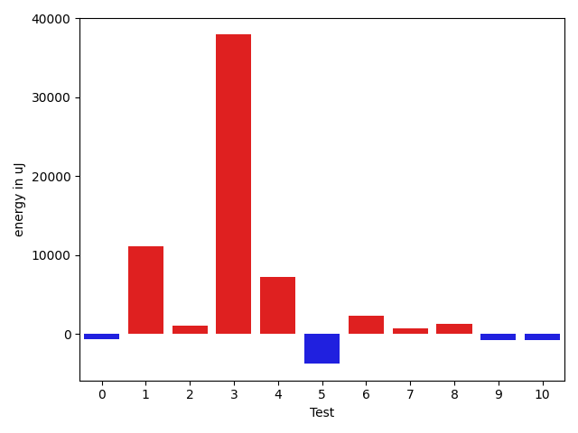

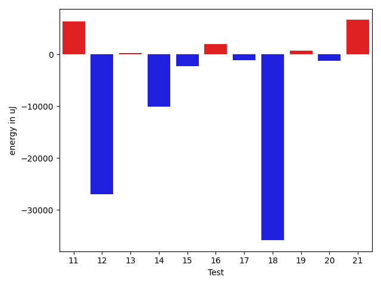

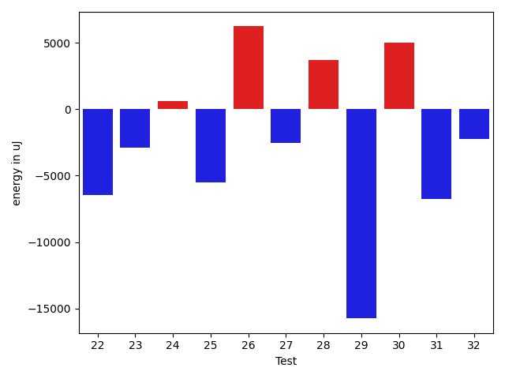

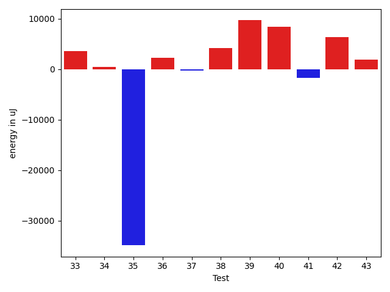

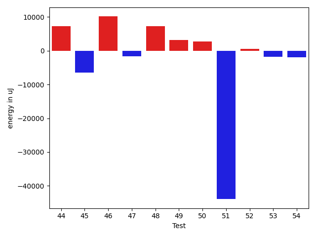

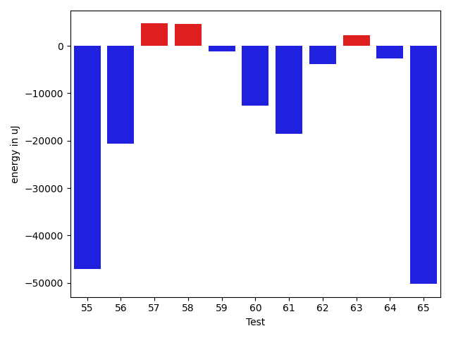

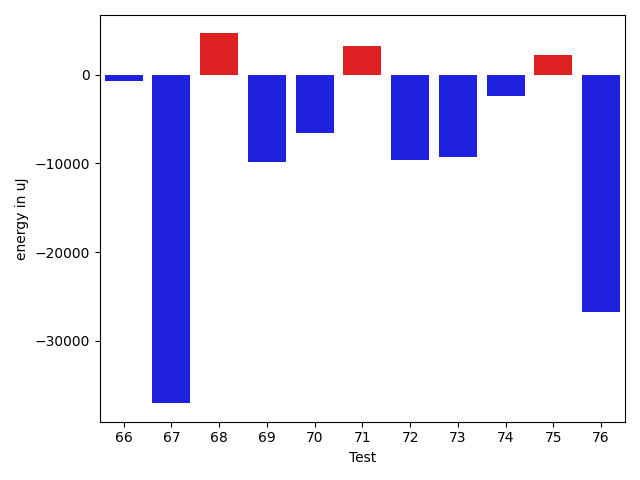

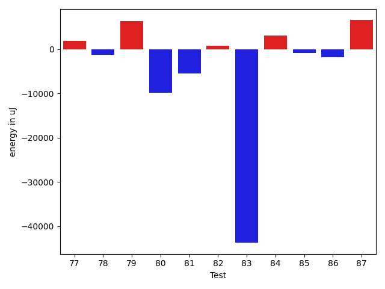

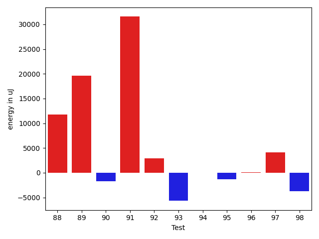

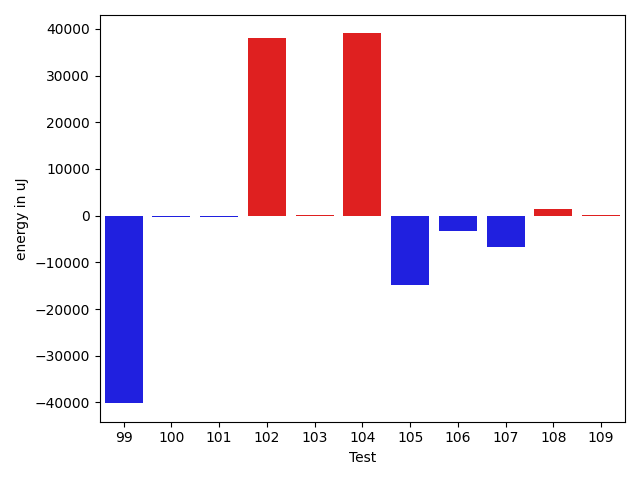

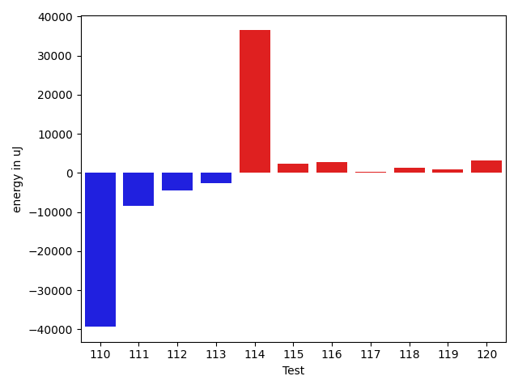

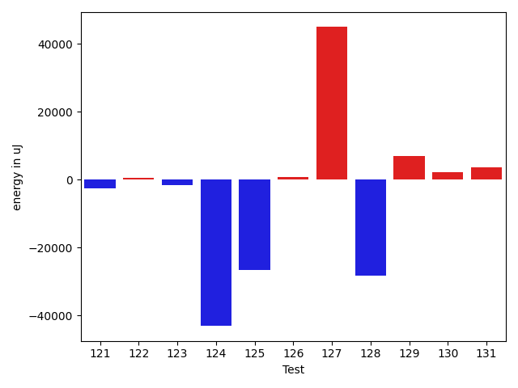

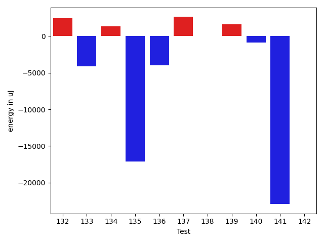

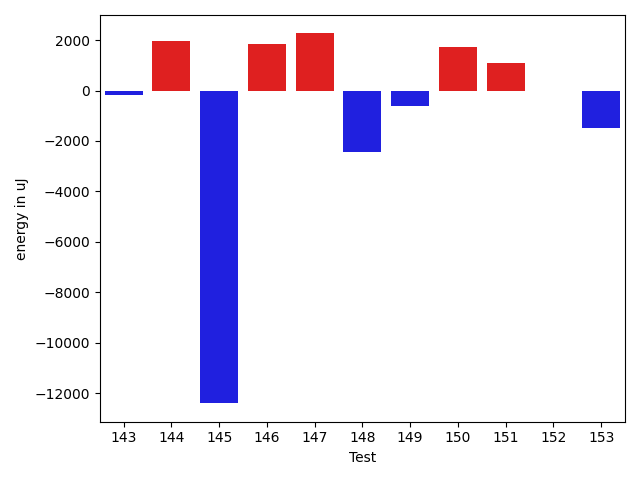

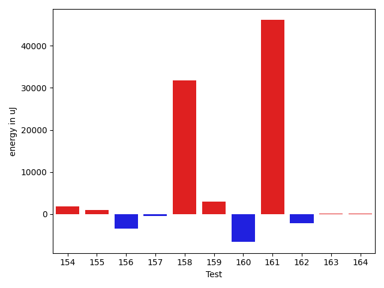

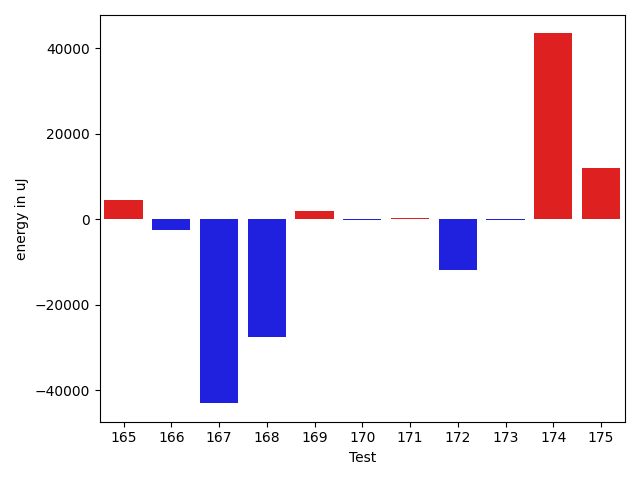

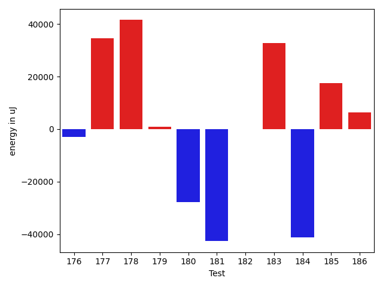

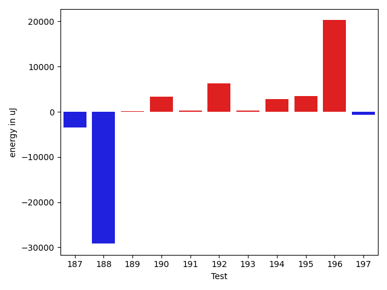

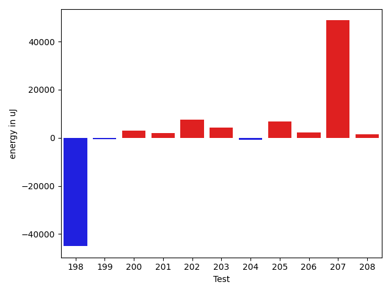

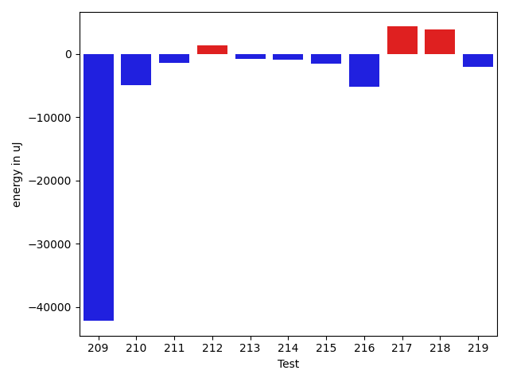

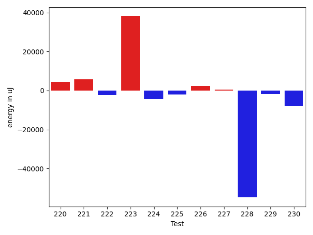

| ID | EnergyV1 | EnergyV2 | DeltaEnergy | σV1 | %σV1 | σV2 | %σV2 |
| --- | --- | --- | --- | --- | --- | --- | --- |
| 0 | 88745 | 88073 | -672 | 19165.80 | 21.60 | 5487.61 | 6.23 |
| 1 | 128295 | 139404 | 11109 | 20414.65 | 15.91 | 57662.51 | 41.36 |
| 2 | 91369 | 92468 | 1099 | 20382.84 | 22.31 | 19966.67 | 21.59 |
| 3 | 42358 | 80322 | 37964 | 19439.13 | 45.89 | 16195.99 | 20.16 |
| 4 | 87219 | 94421 | 7202 | 29725.40 | 34.08 | 16318.30 | 17.28 |
| 5 | 84045 | 80261 | -3784 | 3887.60 | 4.63 | 21290.05 | 26.53 |
| 6 | 44678 | 46997 | 2319 | 21233.58 | 47.53 | 1797.47 | 3.82 |
| 7 | 92041 | 92712 | 671 | 23899.34 | 25.97 | 14815.84 | 15.98 |
| 8 | 187134 | 188415 | 1281 | 18122.80 | 9.68 | 14371.68 | 7.63 |
| 9 | 117004 | 116271 | -733 | 16990.64 | 14.52 | 12378.47 | 10.65 |
| 10 | 176635 | 175842 | -793 | 22614.48 | 12.80 | 14208.59 | 8.08 |
| 11 | 156250 | 162658 | 6408 | 19113.74 | 12.23 | 18790.66 | 11.55 |
| 12 | 174561 | 147582 | -26979 | 22462.30 | 12.87 | 21666.05 | 14.68 |
| 13 | 76538 | 76782 | 244 | 1763.77 | 2.30 | 17764.35 | 23.14 |
| 14 | 167602 | 157470 | -10132 | 31499.30 | 18.79 | 35975.68 | 22.85 |
| 15 | 151489 | 149230 | -2259 | 16907.73 | 11.16 | 23219.98 | 15.56 |
| 16 | 160400 | 162414 | 2014 | 22056.40 | 13.75 | 174198.23 | 107.26 |
| 17 | 93261 | 92102 | -1159 | 15702.24 | 16.84 | 19377.79 | 21.04 |
| 18 | 89111 | 53223 | -35888 | 21505.54 | 24.13 | 22398.20 | 42.08 |
| 19 | 183593 | 184325 | 732 | 17539.25 | 9.55 | 21057.15 | 11.42 |
| 20 | 165039 | 163757 | -1282 | 15203.53 | 9.21 | 14016.17 | 8.56 |
| 21 | 147949 | 154601 | 6652 | 19019.81 | 12.86 | 18451.67 | 11.94 |
| 22 | 177734 | 171264 | -6470 | 29837.03 | 16.79 | 19839.37 | 11.58 |
| 23 | 91126 | 88257 | -2869 | 19854.38 | 21.79 | 14959.93 | 16.95 |
| 24 | 76599 | 77209 | 610 | 20570.73 | 26.86 | 13489.22 | 17.47 |
| 25 | 162170 | 156677 | -5493 | 23866.79 | 14.72 | 27981.86 | 17.86 |
| 26 | 173096 | 179321 | 6225 | 36487.16 | 21.08 | 24468.01 | 13.64 |
| 27 | 259399 | 256835 | -2564 | 27175.69 | 10.48 | 22653.00 | 8.82 |
| 28 | 89234 | 92956 | 3722 | 23465.71 | 26.30 | 23447.65 | 25.22 |
| 29 | 143188 | 127441 | -15747 | 16087.45 | 11.24 | 17076.57 | 13.40 |
| 30 | 129822 | 134826 | 5004 | 18770.57 | 14.46 | 12929.99 | 9.59 |
| 31 | 118652 | 111877 | -6775 | 13074.46 | 11.02 | 14244.53 | 12.73 |
| 32 | 181823 | 179565 | -2258 | 25585.98 | 14.07 | 18096.95 | 10.08 |
| 33 | 145874 | 149414 | 3540 | 29905.37 | 20.50 | 16834.17 | 11.27 |
| 34 | 77698 | 78186 | 488 | 18383.99 | 23.66 | 24145.95 | 30.88 |
| 35 | 83068 | 48218 | -34850 | 24964.32 | 30.05 | 22857.21 | 47.40 |
| 36 | 75989 | 78186 | 2197 | 13261.32 | 17.45 | 16275.77 | 20.82 |
| 37 | 87890 | 87585 | -305 | 15088.97 | 17.17 | 4634.54 | 5.29 |
| 38 | 88501 | 92712 | 4211 | 25031.12 | 28.28 | 19637.95 | 21.18 |
| 39 | 114624 | 124268 | 9644 | 22381.00 | 19.53 | 5097.38 | 4.10 |
| 40 | 259338 | 267760 | 8422 | 44292.60 | 17.08 | 27416.07 | 10.24 |
| 41 | 44190 | 42420 | -1770 | 15879.07 | 35.93 | 17526.45 | 41.32 |
| 42 | 40405 | 46753 | 6348 | 2704.63 | 6.69 | 18610.77 | 39.81 |
| 43 | 123412 | 125244 | 1832 | 10385.70 | 8.42 | 21315.76 | 17.02 |
| 44 | 136047 | 143310 | 7263 | 8440.92 | 6.20 | 21343.68 | 14.89 |
| 45 | 180420 | 173949 | -6471 | 20024.65 | 11.10 | 24166.04 | 13.89 |
| 46 | 162903 | 173034 | 10131 | 23458.21 | 14.40 | 21895.68 | 12.65 |
| 47 | 121032 | 119385 | -1647 | 19252.01 | 15.91 | 16936.39 | 14.19 |
| 48 | 135803 | 143127 | 7324 | 21629.09 | 15.93 | 30747.03 | 21.48 |
| 49 | 42846 | 45960 | 3114 | 2138.98 | 4.99 | 20524.45 | 44.66 |
| 50 | 137145 | 139892 | 2747 | 32180.94 | 23.46 | 71709.19 | 51.26 |
| 51 | 169005 | 125060 | -43945 | 226974.60 | 134.30 | 151569.17 | 121.20 |
| 52 | 45959 | 46509 | 550 | 18382.27 | 40.00 | 18705.21 | 40.22 |
| 53 | 136230 | 134399 | -1831 | 17707.55 | 13.00 | 20485.62 | 15.24 |
| 54 | 45471 | 43518 | -1953 | 15392.11 | 33.85 | 4584.49 | 10.53 |
| 55 | 1807613 | 1760494 | -47119 | 98506.54 | 5.45 | 82794.28 | 4.70 |
| 56 | 157898 | 137207 | -20691 | 32698.87 | 20.71 | 28175.40 | 20.53 |
| 57 | 162292 | 166992 | 4700 | 23786.47 | 14.66 | 32320.72 | 19.35 |
| 58 | 182555 | 187133 | 4578 | 34822.04 | 19.07 | 77801.07 | 41.58 |
| 59 | 128601 | 127441 | -1160 | 12861.68 | 10.00 | 17893.39 | 14.04 |
| 60 | 355773 | 343138 | -12635 | 19969.25 | 5.61 | 34893.23 | 10.17 |
| 61 | 276916 | 258361 | -18555 | 33285.92 | 12.02 | 28596.25 | 11.07 |
| 62 | 210571 | 206664 | -3907 | 27995.14 | 13.29 | 24178.99 | 11.70 |
| 63 | 114440 | 116699 | 2259 | 7927.06 | 6.93 | 4891.46 | 4.19 |
| 64 | 345642 | 343016 | -2626 | 18067.74 | 5.23 | 25027.85 | 7.30 |
| 65 | 640807 | 590575 | -50232 | 42759.60 | 6.67 | 36242.07 | 6.14 |
| 66 | 119323 | 118591 | -732 | 22655.01 | 18.99 | 14299.35 | 12.06 |
| 67 | 122741 | 85693 | -37048 | 15231.23 | 12.41 | 21713.69 | 25.34 |
| 68 | 84290 | 88928 | 4638 | 20575.48 | 24.41 | 23378.70 | 26.29 |
| 69 | 1196714 | 1186826 | -9888 | 86373.28 | 7.22 | 50023.49 | 4.21 |
| 70 | 130737 | 124145 | -6592 | 13009.92 | 9.95 | 19100.25 | 15.39 |
| 71 | 38636 | 41870 | 3234 | 19163.84 | 49.60 | 18678.40 | 44.61 |
| 72 | 183655 | 174010 | -9645 | 16781.31 | 9.14 | 13713.00 | 7.88 |
| 73 | 623778 | 614500 | -9278 | 50380.13 | 8.08 | 39934.58 | 6.50 |
| 74 | 49194 | 46753 | -2441 | 21819.50 | 44.35 | 24227.82 | 51.82 |
| 75 | 135864 | 138061 | 2197 | 25613.15 | 18.85 | 14892.57 | 10.79 |
| 76 | 511596 | 484862 | -26734 | 26914.31 | 5.26 | 32013.93 | 6.60 |
| 77 | 46752 | 48584 | 1832 | 23059.89 | 49.32 | 22172.62 | 45.64 |
| 78 | 91736 | 90515 | -1221 | 20134.01 | 21.95 | 19125.78 | 21.13 |
| 79 | 313109 | 319396 | 6287 | 27479.87 | 8.78 | 23727.42 | 7.43 |
| 80 | 304077 | 294250 | -9827 | 19110.83 | 6.28 | 18929.44 | 6.43 |
| 81 | 88012 | 82580 | -5432 | 16213.04 | 18.42 | 28494.05 | 34.50 |
| 82 | 38758 | 39550 | 792 | 2119.50 | 5.47 | 2825.96 | 7.15 |
| 83 | 90698 | 46997 | -43701 | 11905.10 | 13.13 | 18931.81 | 40.28 |
| 84 | 479247 | 482359 | 3112 | 32701.71 | 6.82 | 14808.23 | 3.07 |
| 85 | 45593 | 44678 | -915 | 1935.72 | 4.25 | 1856.27 | 4.15 |
| 86 | 42420 | 40527 | -1893 | 3577.85 | 8.43 | 2563.60 | 6.33 |
| 87 | 177367 | 183898 | 6531 | 24525.14 | 13.83 | 24137.81 | 13.13 |
| 88 | 135558 | 147277 | 11719 | 26718.20 | 19.71 | 23439.09 | 15.91 |
| 89 | 111694 | 131348 | 19654 | 21320.61 | 19.09 | 20965.05 | 15.96 |
| 90 | 83313 | 81543 | -1770 | 16633.13 | 19.96 | 15248.64 | 18.70 |
| 91 | 111938 | 143494 | 31556 | 16195.71 | 14.47 | 20502.56 | 14.29 |
| 92 | 88257 | 91186 | 2929 | 18273.11 | 20.70 | 1861.74 | 2.04 |
| 93 | 88196 | 82519 | -5677 | 20538.10 | 23.29 | 13000.05 | 15.75 |
| 94 | 138000 | 137939 | -61 | 20321.98 | 14.73 | 2978.49 | 2.16 |
| 95 | 84046 | 82764 | -1282 | 21010.95 | 25.00 | 21826.79 | 26.37 |
| 96 | 45288 | 45410 | 122 | 1855.30 | 4.10 | 13032.39 | 28.70 |
| 97 | 77636 | 81787 | 4151 | 19131.35 | 24.64 | 13555.44 | 16.57 |
| 98 | 126647 | 122863 | -3784 | 33264.94 | 26.27 | 18150.73 | 14.77 |
| 99 | 88562 | 48401 | -40161 | 20899.02 | 23.60 | 22476.35 | 46.44 |
| 100 | 78857 | 78674 | -183 | 19481.66 | 24.71 | 25585.06 | 32.52 |
| 101 | 38879 | 38696 | -183 | 18257.33 | 46.96 | 15583.73 | 40.27 |
| 102 | 45105 | 83129 | 38024 | 17728.94 | 39.31 | 19471.43 | 23.42 |
| 103 | 76721 | 76843 | 122 | 13876.44 | 18.09 | 15790.68 | 20.55 |
| 104 | 47608 | 86608 | 39000 | 21678.58 | 45.54 | 23361.10 | 26.97 |
| 105 | 89965 | 75073 | -14892 | 21829.51 | 24.26 | 22539.30 | 30.02 |
| 106 | 47608 | 44372 | -3236 | 2586.94 | 5.43 | 2213.27 | 4.99 |
| 107 | 717100 | 710447 | -6653 | 40240.18 | 5.61 | 45663.19 | 6.43 |
| 108 | 318176 | 319579 | 1403 | 29066.04 | 9.14 | 52795.47 | 16.52 |
| 109 | 243530 | 243712 | 182 | 30418.70 | 12.49 | 32458.10 | 13.32 |
| 110 | 950864 | 911496 | -39368 | 106438.00 | 11.19 | 81257.97 | 8.91 |
| 111 | 323302 | 314880 | -8422 | 58422.00 | 18.07 | 13793.93 | 4.38 |
| 112 | 81970 | 77453 | -4517 | 26283.72 | 32.07 | 21218.22 | 27.39 |
| 113 | 90576 | 88073 | -2503 | 30127.27 | 33.26 | 21226.16 | 24.10 |
| 114 | 47546 | 84045 | 36499 | 19168.56 | 40.32 | 23130.52 | 27.52 |
| 115 | 80688 | 83129 | 2441 | 12846.70 | 15.92 | 13486.64 | 16.22 |
| 116 | 88806 | 91553 | 2747 | 16932.83 | 19.07 | 22566.95 | 24.65 |
| 117 | 87768 | 88012 | 244 | 27216.24 | 31.01 | 18240.68 | 20.73 |
| 118 | 80871 | 82153 | 1282 | 23105.61 | 28.57 | 17185.54 | 20.92 |
| 119 | 85022 | 85999 | 977 | 19115.72 | 22.48 | 17087.86 | 19.87 |
| 120 | 81726 | 84839 | 3113 | 24511.40 | 29.99 | 19099.89 | 22.51 |
| 121 | 168335 | 165649 | -2686 | 37993.80 | 22.57 | 22622.46 | 13.66 |
| 122 | 75256 | 75805 | 549 | 12648.92 | 16.81 | 18870.41 | 24.89 |
| 123 | 86059 | 84350 | -1709 | 16524.74 | 19.20 | 16953.71 | 20.10 |
| 124 | 91553 | 48462 | -43091 | 26825.14 | 29.30 | 23030.04 | 47.52 |
| 125 | 116821 | 90148 | -26673 | 30327.09 | 25.96 | 21009.13 | 23.31 |
| 126 | 157470 | 158264 | 794 | 24030.72 | 15.26 | 21410.76 | 13.53 |
| 127 | 139159 | 184081 | 44922 | 22927.34 | 16.48 | 22077.15 | 11.99 |
| 128 | 170776 | 142577 | -28199 | 22835.56 | 13.37 | 22865.81 | 16.04 |
| 129 | 345702 | 352599 | 6897 | 31651.98 | 9.16 | 23853.08 | 6.76 |
| 130 | 161193 | 163329 | 2136 | 22715.86 | 14.09 | 36447.77 | 22.32 |
| 131 | 173645 | 177368 | 3723 | 20786.26 | 11.97 | 22045.55 | 12.43 |
| 132 | 162170 | 164611 | 2441 | 19398.36 | 11.96 | 19003.75 | 11.54 |
| 133 | 211242 | 207092 | -4150 | 47759.39 | 22.61 | 31070.41 | 15.00 |
| 134 | 129394 | 130736 | 1342 | 23124.01 | 17.87 | 6734.55 | 5.15 |
| 135 | 271911 | 254821 | -17090 | 20507.25 | 7.54 | 16805.91 | 6.60 |
| 136 | 134094 | 130127 | -3967 | 5118.05 | 3.82 | 25099.48 | 19.29 |
| 137 | 39856 | 42480 | 2624 | 2440.50 | 6.12 | 4303.79 | 10.13 |
| 138 | 89782 | 89843 | 61 | 22072.96 | 24.59 | 15559.29 | 17.32 |
| 139 | 41137 | 42785 | 1648 | 2541.58 | 6.18 | 2683.99 | 6.27 |
| 140 | 87158 | 86304 | -854 | 16051.13 | 18.42 | 16974.99 | 19.67 |
| 141 | 118286 | 95337 | -22949 | 20805.64 | 17.59 | 32088.14 | 33.66 |
| 142 | 48461 | 48461 | 0 | 24736.44 | 51.04 | 22143.76 | 45.69 |
| 143 | 168274 | 168090 | -184 | 31429.68 | 18.68 | 21231.58 | 12.63 |
| 144 | 145995 | 147949 | 1954 | 34828.20 | 23.86 | 14749.16 | 9.97 |
| 145 | 259276 | 246886 | -12390 | 27356.99 | 10.55 | 23714.59 | 9.61 |
| 146 | 42236 | 44067 | 1831 | 16961.21 | 40.16 | 18520.90 | 42.03 |
| 147 | 41381 | 43640 | 2259 | 20172.05 | 48.75 | 19722.51 | 45.19 |
| 148 | 40955 | 38513 | -2442 | 3341.21 | 8.16 | 14220.46 | 36.92 |
| 149 | 39002 | 38391 | -611 | 25189.24 | 64.58 | 15504.34 | 40.39 |
| 150 | 45043 | 46753 | 1710 | 15600.16 | 34.63 | 18266.67 | 39.07 |
| 151 | 46508 | 47607 | 1099 | 2935.99 | 6.31 | 15189.52 | 31.91 |
| 152 | 45716 | 45715 | -1 | 11799.97 | 25.81 | 15466.85 | 33.83 |
| 153 | 47242 | 45776 | -1466 | 18097.38 | 38.31 | 14403.36 | 31.46 |
| 154 | 43579 | 45410 | 1831 | 3722.72 | 8.54 | 2614.41 | 5.76 |
| 155 | 45898 | 46936 | 1038 | 19155.09 | 41.73 | 1921.31 | 4.09 |
| 156 | 224609 | 221252 | -3357 | 55664.59 | 24.78 | 24442.23 | 11.05 |
| 157 | 213134 | 212707 | -427 | 24688.25 | 11.58 | 24376.81 | 11.46 |
| 158 | 252074 | 283813 | 31739 | 23376.73 | 9.27 | 24466.84 | 8.62 |
| 159 | 114990 | 118042 | 3052 | 18526.46 | 16.11 | 17629.58 | 14.94 |
| 160 | 154053 | 147461 | -6592 | 16625.31 | 10.79 | 11676.83 | 7.92 |
| 161 | 446044 | 492125 | 46081 | 33436.69 | 7.50 | 62039.92 | 12.61 |
| 162 | 182678 | 180480 | -2198 | 23780.75 | 13.02 | 14659.29 | 8.12 |
| 163 | 75684 | 75805 | 121 | 11421.59 | 15.09 | 18126.51 | 23.91 |
| 164 | 89172 | 89355 | 183 | 14612.41 | 16.39 | 19283.36 | 21.58 |
| 165 | 88867 | 93323 | 4456 | 21325.66 | 24.00 | 28311.73 | 30.34 |
| 166 | 77210 | 74646 | -2564 | 4004.44 | 5.19 | 18589.83 | 24.90 |
| 167 | 227783 | 184753 | -43030 | 29584.43 | 12.99 | 12183.50 | 6.59 |
| 168 | 249084 | 221619 | -27465 | 34465.63 | 13.84 | 4618.20 | 2.08 |
| 169 | 179199 | 181091 | 1892 | 21693.08 | 12.11 | 18994.87 | 10.49 |
| 170 | 46813 | 46753 | -60 | 17450.43 | 37.28 | 22059.89 | 47.18 |
| 171 | 133606 | 133972 | 366 | 21481.32 | 16.08 | 31136.03 | 23.24 |
| 172 | 87890 | 76049 | -11841 | 6774.19 | 7.71 | 17489.70 | 23.00 |
| 173 | 75256 | 75012 | -244 | 26676.08 | 35.45 | 19325.79 | 25.76 |
| 174 | 90820 | 134277 | 43457 | 23906.20 | 26.32 | 22023.35 | 16.40 |
| 175 | 66956 | 78918 | 11962 | 18595.69 | 27.77 | 18810.78 | 23.84 |
| 176 | 81238 | 78369 | -2869 | 24339.03 | 29.96 | 24364.22 | 31.09 |
| 177 | 261657 | 296264 | 34607 | 26200.89 | 10.01 | 30283.18 | 10.22 |
| 178 | 46265 | 87830 | 41565 | 18200.88 | 39.34 | 20917.15 | 23.82 |
| 179 | 78430 | 79284 | 854 | 19098.35 | 24.35 | 2087.69 | 2.63 |
| 180 | 76294 | 48584 | -27710 | 21403.91 | 28.05 | 20005.20 | 41.18 |
| 181 | 177124 | 134460 | -42664 | 24468.95 | 13.81 | 22290.52 | 16.58 |
| 182 | 148682 | 148681 | -1 | 18841.74 | 12.67 | 19584.85 | 13.17 |
| 183 | 91919 | 124755 | 32836 | 23065.10 | 25.09 | 29098.75 | 23.32 |
| 184 | 131469 | 90149 | -41320 | 23273.79 | 17.70 | 23517.70 | 26.09 |
| 185 | 337950 | 355590 | 17640 | 25940.52 | 7.68 | 44020.72 | 12.38 |
| 186 | 122009 | 128417 | 6408 | 27632.30 | 22.65 | 85508.20 | 66.59 |
| 187 | 95276 | 91797 | -3479 | 22565.64 | 23.68 | 23699.50 | 25.82 |
| 188 | 120361 | 91186 | -29175 | 23490.20 | 19.52 | 23329.37 | 25.58 |
| 189 | 116028 | 116211 | 183 | 17810.61 | 15.35 | 18473.89 | 15.90 |
| 190 | 216431 | 219726 | 3295 | 19695.25 | 9.10 | 26256.53 | 11.95 |
| 191 | 80689 | 80933 | 244 | 14484.38 | 17.95 | 18515.24 | 22.88 |
| 192 | 81787 | 88012 | 6225 | 22163.00 | 27.10 | 14092.15 | 16.01 |
| 193 | 328368 | 328673 | 305 | 34566.55 | 10.53 | 31397.71 | 9.55 |
| 194 | 82214 | 85022 | 2808 | 21339.45 | 25.96 | 18243.31 | 21.46 |
| 195 | 192505 | 195923 | 3418 | 17900.76 | 9.30 | 21722.37 | 11.09 |
| 196 | 229797 | 250060 | 20263 | 20055.73 | 8.73 | 45825.97 | 18.33 |
| 197 | 40955 | 40283 | -672 | 17332.37 | 42.32 | 19478.30 | 48.35 |
| 198 | 93811 | 48767 | -45044 | 20050.41 | 21.37 | 22908.63 | 46.98 |
| 199 | 81909 | 81421 | -488 | 17224.74 | 21.03 | 21908.05 | 26.91 |
| 200 | 81665 | 84717 | 3052 | 12310.15 | 15.07 | 24666.95 | 29.12 |
| 201 | 87585 | 89416 | 1831 | 26332.71 | 30.07 | 14878.58 | 16.64 |
| 202 | 311278 | 318785 | 7507 | 31249.77 | 10.04 | 35674.79 | 11.19 |
| 203 | 203735 | 207886 | 4151 | 22278.80 | 10.94 | 10476.61 | 5.04 |
| 204 | 222961 | 222106 | -855 | 13693.86 | 6.14 | 18960.67 | 8.54 |
| 205 | 499388 | 506286 | 6898 | 31781.14 | 6.36 | 48691.13 | 9.62 |
| 206 | 151061 | 153259 | 2198 | 15879.31 | 10.51 | 16377.50 | 10.69 |
| 207 | 167663 | 216430 | 48767 | 22992.45 | 13.71 | 21741.09 | 10.05 |
| 208 | 80567 | 82092 | 1525 | 24545.88 | 30.47 | 3438.21 | 4.19 |
| 209 | 129455 | 87280 | -42175 | 23589.82 | 18.22 | 21785.43 | 24.96 |
| 210 | 186217 | 181335 | -4882 | 18601.60 | 9.99 | 18938.26 | 10.44 |
| 211 | 265014 | 263671 | -1343 | 12974.68 | 4.90 | 18902.32 | 7.17 |
| 212 | 266296 | 267639 | 1343 | 31858.39 | 11.96 | 21130.75 | 7.90 |
| 213 | 267395 | 266662 | -733 | 34831.28 | 13.03 | 17732.31 | 6.65 |
| 214 | 92834 | 91919 | -915 | 28649.02 | 30.86 | 13692.86 | 14.90 |
| 215 | 91492 | 89966 | -1526 | 16429.93 | 17.96 | 30578.86 | 33.99 |
| 216 | 86670 | 81543 | -5127 | 15283.78 | 17.63 | 15201.91 | 18.64 |
| 217 | 86913 | 91247 | 4334 | 28187.45 | 32.43 | 14425.98 | 15.81 |
| 218 | 89355 | 93201 | 3846 | 4061.09 | 4.54 | 18962.04 | 20.35 |
| 219 | 358214 | 356139 | -2075 | 29577.81 | 8.26 | 26707.16 | 7.50 |
| 220 | 82703 | 87158 | 4455 | 18797.41 | 22.73 | 4476.20 | 5.14 |
| 221 | 218749 | 224547 | 5798 | 34959.09 | 15.98 | 22695.67 | 10.11 |
| 222 | 133179 | 130859 | -2320 | 15609.50 | 11.72 | 22038.35 | 16.84 |
| 223 | 256103 | 294128 | 38025 | 19322.20 | 7.54 | 26203.39 | 8.91 |
| 224 | 129639 | 125305 | -4334 | 23340.63 | 18.00 | 22436.27 | 17.91 |
| 225 | 45654 | 43579 | -2075 | 2945.86 | 6.45 | 12825.42 | 29.43 |
| 226 | 38514 | 40649 | 2135 | 3286.51 | 8.53 | 1576.76 | 3.88 |
| 227 | 44983 | 45411 | 428 | 14199.78 | 31.57 | 2264.79 | 4.99 |
| 228 | 739012 | 684202 | -54810 | 35859.08 | 4.85 | 30945.29 | 4.52 |
| 229 | 47669 | 45960 | -1709 | 20611.33 | 43.24 | 15277.41 | 33.24 |
| 230 | 1487668 | 1479671 | -7997 | 135175.83 | 9.09 | 100263.77 | 6.78 |

## Misc.

| ID | Test Class | Test Method |
| --- | --- | --- |
| 0 | com.google.gson.functional.TypeAdapterPrecedenceTest | testStreamingFollowedByNonstreaming |
| 1 | com.google.gson.functional.TypeAdapterPrecedenceTest | testStreamingHierarchicalFollowedByNonstreaming |
| 2 | com.google.gson.functional.TypeAdapterPrecedenceTest | testSerializeNonstreamingTypeAdapterFollowedByStreamingTypeAdapter |
| 3 | com.google.gson.functional.TypeAdapterPrecedenceTest | testNonstreamingHierarchicalFollowedByNonstreaming |
| 4 | com.google.gson.functional.TypeAdapterPrecedenceTest | testStreamingHierarchicalFollowedByNonstreamingHierarchical |
| 5 | com.google.gson.functional.TypeAdapterPrecedenceTest | testNonstreamingFollowedByNonstreaming |
| 6 | com.google.gson.functional.TypeAdapterPrecedenceTest | testStreamingFollowedByStreaming |
| 7 | com.google.gson.functional.TypeAdapterPrecedenceTest | testStreamingFollowedByNonstreamingHierarchical |
| 8 | com.google.gson.functional.CustomTypeAdaptersTest | testCustomAdapterInvokedForCollectionElementDeserialization |
| 9 | com.google.gson.functional.CustomTypeAdaptersTest | testCustomTypeAdapterAppliesToSubClassesSerializedAsBaseClass |
| 10 | com.google.gson.functional.CustomTypeAdaptersTest | testCustomAdapterInvokedForMapElementDeserialization |
| 11 | com.google.gson.functional.CustomTypeAdaptersTest | testCustomAdapterInvokedForMapElementSerializationWithType |
| 12 | com.google.gson.functional.CustomTypeAdaptersTest | testCustomNestedSerializers |
| 13 | com.google.gson.functional.CustomTypeAdaptersTest | testCustomAdapterInvokedForMapElementSerialization |
| 14 | com.google.gson.functional.CustomTypeAdaptersTest | testCustomSerializers |
| 15 | com.google.gson.functional.CustomTypeAdaptersTest | testCustomNestedDeserializers |
| 16 | com.google.gson.functional.CustomTypeAdaptersTest | testCustomTypeAdapterDoesNotAppliesToSubClasses |
| 17 | com.google.gson.functional.CustomTypeAdaptersTest | testCustomAdapterInvokedForCollectionElementSerialization |
| 18 | com.google.gson.functional.CustomTypeAdaptersTest | testRegisterHierarchyAdapterForDate |
| 19 | com.google.gson.functional.CustomTypeAdaptersTest | testCustomAdapterInvokedForCollectionElementSerializationWithType |
| 20 | com.google.gson.functional.CustomTypeAdaptersTest | testCustomDeserializers |
| 21 | com.google.gson.functional.CustomTypeAdaptersTest | testCustomByteArrayDeserializerAndInstanceCreator |
| 22 | com.google.gson.functional.CustomTypeAdaptersTest | testCustomByteArraySerializer |
| 23 | com.google.gson.functional.CustomTypeAdaptersTest | testEnsureCustomSerializerNotInvokedForNullValues |
| 24 | com.google.gson.functional.CustomTypeAdaptersTest | testEnsureCustomDeserializerNotInvokedForNullValues |
| 25 | com.google.gson.functional.CustomTypeAdaptersTest | testCustomDeserializerInvokedForPrimitives |
| 26 | com.google.gson.functional.CustomTypeAdaptersTest | testCustomSerializerInvokedForPrimitives |
| 27 | com.google.gson.functional.StreamingTypeAdaptersTest | testNullSafe |
| 28 | com.google.gson.functional.StreamingTypeAdaptersTest | testSerializeWithCustomTypeAdapter |
| 29 | com.google.gson.functional.StreamingTypeAdaptersTest | testDeserializeWithCustomTypeAdapter |
| 30 | com.google.gson.functional.JsonAdapterAnnotationOnClassesTest | testJsonAdapterInvoked |
| 31 | com.google.gson.functional.JsonAdapterAnnotationOnClassesTest | testRegisteredAdapterOverridesJsonAdapter |
| 32 | com.google.gson.functional.JsonAdapterAnnotationOnClassesTest | testRegisteredDeserializerOverridesJsonAdapter |
| 33 | com.google.gson.functional.JsonAdapterAnnotationOnClassesTest | testRegisteredSerializerOverridesJsonAdapter |
| 34 | com.google.gson.functional.JsonAdapterAnnotationOnClassesTest | testSuperclassTypeAdapterNotInvoked |
| 35 | com.google.gson.functional.JsonAdapterAnnotationOnClassesTest | testNullSafeObjectFromJson |
| 36 | com.google.gson.functional.JsonAdapterAnnotationOnClassesTest | testIncorrectTypeAdapterFails |
| 37 | com.google.gson.functional.JsonAdapterAnnotationOnClassesTest | testJsonAdapterFactoryInvoked |
| 38 | com.google.gson.functional.JsonAdapterAnnotationOnClassesTest | testIncorrectJsonAdapterType |
| 39 | com.google.gson.functional.ExclusionStrategyFunctionalTest | testExclusionStrategySerializationDoesNotImpactSerialization |
| 40 | com.google.gson.functional.ExclusionStrategyFunctionalTest | testExclusionStrategyWithMode |
| 41 | com.google.gson.functional.ExclusionStrategyFunctionalTest | testExcludeTopLevelClassDeserialization |
| 42 | com.google.gson.functional.ExclusionStrategyFunctionalTest | testExcludeTopLevelClassSerialization |
| 43 | com.google.gson.functional.ExclusionStrategyFunctionalTest | testExclusionStrategySerializationDoesNotImpactDeserialization |
| 44 | com.google.gson.functional.ExclusionStrategyFunctionalTest | testExcludeTopLevelClassDeserializationDoesNotImpactSerialization |
| 45 | com.google.gson.functional.ExclusionStrategyFunctionalTest | testExcludeTopLevelClassSerializationDoesNotImpactDeserialization |
| 46 | com.google.gson.functional.ExclusionStrategyFunctionalTest | testExclusionStrategyDeserialization |
| 47 | com.google.gson.functional.ExclusionStrategyFunctionalTest | testExclusionStrategySerialization |
| 48 | com.google.gson.MixedStreamTest | testReaderDoesNotMutateState |
| 49 | com.google.gson.MixedStreamTest | testReadInvalidState |
| 50 | com.google.gson.MixedStreamTest | testWriteClosed |
| 51 | com.google.gson.MixedStreamTest | testWriteInvalidState |
| 52 | com.google.gson.MixedStreamTest | testWriteDoesNotMutateState |
| 53 | com.google.gson.MixedStreamTest | testWriteHtmlSafe |
| 54 | com.google.gson.MixedStreamTest | testReadNulls |
| 55 | com.google.gson.MixedStreamTest | testWriteLenient |
| 56 | com.google.gson.MixedStreamTest | testWriteMixedStreamed |
| 57 | com.google.gson.MixedStreamTest | testWriteNulls |
| 58 | com.google.gson.MixedStreamTest | testReadMixedStreamed |
| 59 | com.google.gson.MixedStreamTest | testReadClosed |
| 60 | com.google.gson.functional.InstanceCreatorTest | testInstanceCreatorForParametrizedType |
| 61 | com.google.gson.functional.InstanceCreatorTest | testInstanceCreatorReturnsBaseType |
| 62 | com.google.gson.functional.InstanceCreatorTest | testInstanceCreatorReturnsSubTypeForField |
| 63 | com.google.gson.functional.InstanceCreatorTest | testInstanceCreatorReturnsSubTypeForTopLevelObject |
| 64 | com.google.gson.functional.InstanceCreatorTest | testInstanceCreatorForCollectionType |
| 65 | com.google.gson.functional.DefaultTypeAdaptersTest | testDateSerializationWithPatternNotOverridenByTypeAdapter |
| 66 | com.google.gson.functional.DefaultTypeAdaptersTest | testDateSerializationWithPattern |
| 67 | com.google.gson.functional.DefaultTypeAdaptersTest | testBitSetDeserialization |
| 68 | com.google.gson.functional.DefaultTypeAdaptersTest | testOverrideBigIntegerTypeAdapter |
| 69 | com.google.gson.functional.DefaultTypeAdaptersTest | testDefaultGregorianCalendarDeserialization |
| 70 | com.google.gson.functional.DefaultTypeAdaptersTest | testSqlDateSerialization |
| 71 | com.google.gson.functional.DefaultTypeAdaptersTest | testClassSerialization |
| 72 | com.google.gson.functional.DefaultTypeAdaptersTest | testTimestampSerialization |
| 73 | com.google.gson.functional.DefaultTypeAdaptersTest | testDefaultDateDeserializationUsingBuilder |
| 74 | com.google.gson.functional.DefaultTypeAdaptersTest | testDefaultCalendarSerialization |
| 75 | com.google.gson.functional.DefaultTypeAdaptersTest | testOverrideBigDecimalTypeAdapter |
| 76 | com.google.gson.functional.DefaultTypeAdaptersTest | testNullSerialization |
| 77 | com.google.gson.functional.DefaultTypeAdaptersTest | testDefaultCalendarDeserialization |
| 78 | com.google.gson.functional.DefaultTypeAdaptersTest | testClassDeserialization |
| 79 | com.google.gson.functional.DefaultTypeAdaptersTest | testDateDeserializationWithPattern |
| 80 | com.google.gson.functional.DefaultTypeAdaptersTest | testDateSerializationInCollection |
| 81 | com.google.gson.functional.DefaultTypeAdaptersTest | testSetSerialization |
| 82 | com.google.gson.functional.DefaultTypeAdaptersTest | testBitSetSerialization |
| 83 | com.google.gson.functional.DefaultTypeAdaptersTest | testDefaultGregorianCalendarSerialization |
| 84 | com.google.gson.functional.DefaultTypeAdaptersTest | testDefaultDateSerializationUsingBuilder |
| 85 | com.google.gson.OverrideCoreTypeAdaptersTest | testOverrideStringAdapter |
| 86 | com.google.gson.OverrideCoreTypeAdaptersTest | testOverridePrimitiveBooleanAdapter |
| 87 | com.google.gson.OverrideCoreTypeAdaptersTest | testOverrideWrapperBooleanAdapter |
| 88 | com.google.gson.functional.JsonAdapterSerializerDeserializerTest | testJsonSerializerDeserializerBasedJsonAdapterOnFields |
| 89 | com.google.gson.functional.JsonAdapterSerializerDeserializerTest | testDifferentJsonAdaptersForGenericFieldsOfSameRawType |
| 90 | com.google.gson.functional.JsonAdapterSerializerDeserializerTest | testJsonSerializerDeserializerBasedJsonAdapterOnClass |
| 91 | com.google.gson.functional.NullObjectAndFieldTest | testCustomTypeAdapterPassesNullSerialization |
| 92 | com.google.gson.functional.NullObjectAndFieldTest | testExplicitDeserializationOfNulls |
| 93 | com.google.gson.functional.NullObjectAndFieldTest | testExplicitSerializationOfNullStringMembers |
| 94 | com.google.gson.functional.NullObjectAndFieldTest | testCustomTypeAdapterPassesNullDesrialization |
| 95 | com.google.gson.functional.NullObjectAndFieldTest | testExplicitSerializationOfNullCollectionMembers |
| 96 | com.google.gson.functional.NullObjectAndFieldTest | testCustomSerializationOfNulls |
| 97 | com.google.gson.functional.NullObjectAndFieldTest | testAbsentJsonElementsAreSetToNull |
| 98 | com.google.gson.functional.NullObjectAndFieldTest | testPrintPrintingObjectWithNulls |
| 99 | com.google.gson.functional.NullObjectAndFieldTest | testPrintPrintingArraysWithNulls |
| 100 | com.google.gson.functional.NullObjectAndFieldTest | testTopLevelNullObjectSerialization |
| 101 | com.google.gson.functional.NullObjectAndFieldTest | testNullWrappedPrimitiveMemberSerialization |
| 102 | com.google.gson.functional.NullObjectAndFieldTest | testExplicitNullSetsFieldToNullDuringDeserialization |
| 103 | com.google.gson.functional.NullObjectAndFieldTest | testExplicitSerializationOfNullArrayMembers |
| 104 | com.google.gson.functional.NullObjectAndFieldTest | testExplicitSerializationOfNulls |
| 105 | com.google.gson.functional.NullObjectAndFieldTest | testNullWrappedPrimitiveMemberDeserialization |
| 106 | com.google.gson.functional.NullObjectAndFieldTest | testTopLevelNullObjectDeserialization |
| 107 | com.google.gson.internal.bind.RecursiveTypesResolveTest | testIssue440WeakReference |
| 108 | com.google.gson.internal.bind.RecursiveTypesResolveTest | testRecursiveResolveSimple |
| 109 | com.google.gson.internal.bind.RecursiveTypesResolveTest | testRecursiveTypeVariablesResolve1 |
| 110 | com.google.gson.internal.bind.RecursiveTypesResolveTest | testIssue603PrintStream |
| 111 | com.google.gson.internal.bind.RecursiveTypesResolveTest | testRecursiveTypeVariablesResolve12 |
| 112 | com.google.gson.functional.NamingPolicyTest | testAtSignInSerializedName |
| 113 | com.google.gson.functional.NamingPolicyTest | testGsonWithNonDefaultFieldNamingPolicySerialization |
| 114 | com.google.gson.functional.NamingPolicyTest | testGsonWithLowerCaseDashPolicyDeserialiation |
| 115 | com.google.gson.functional.NamingPolicyTest | testGsonDuplicateNameUsingSerializedNameFieldNamingPolicySerialization |
| 116 | com.google.gson.functional.NamingPolicyTest | testGsonWithSerializedNameFieldNamingPolicyDeserialization |
| 117 | com.google.gson.functional.NamingPolicyTest | testGsonWithUpperCamelCaseSpacesPolicyDeserialiation |
| 118 | com.google.gson.functional.NamingPolicyTest | testGsonWithSerializedNameFieldNamingPolicySerialization |
| 119 | com.google.gson.functional.NamingPolicyTest | testGsonWithNonDefaultFieldNamingPolicyDeserialiation |
| 120 | com.google.gson.functional.NamingPolicyTest | testGsonWithLowerCaseUnderscorePolicySerialization |
| 121 | com.google.gson.functional.NamingPolicyTest | testComplexFieldNameStrategy |
| 122 | com.google.gson.functional.NamingPolicyTest | testDeprecatedNamingStrategy |
| 123 | com.google.gson.functional.NamingPolicyTest | testGsonWithUpperCamelCaseSpacesPolicySerialiation |
| 124 | com.google.gson.functional.NamingPolicyTest | testGsonWithLowerCaseDashPolicySerialization |
| 125 | com.google.gson.functional.NamingPolicyTest | testGsonWithLowerCaseUnderscorePolicyDeserialiation |
| 126 | com.google.gson.LongSerializationPolicyTest | testDefaultLongSerializationIntegration |
| 127 | com.google.gson.LongSerializationPolicyTest | testStringLongSerializationIntegration |
| 128 | com.google.gson.functional.MapTest | testSerializeMaps |
| 129 | com.google.gson.functional.MapTest | testInterfaceTypeMapWithSerializer |
| 130 | com.google.gson.functional.MapTest | testMapSerializationWithNullValuesSerialized |
| 131 | com.google.gson.functional.MapTest | testMapSubclassDeserialization |
| 132 | com.google.gson.functional.MapTest | testCustomSerializerForSpecificMapType |
| 133 | com.google.gson.functional.MapTest | testGeneralMapField |
| 134 | com.google.gson.functional.MapTest | testMapSerializationWithNullValueButSerializeNulls |
| 135 | com.google.gson.functional.MapTest | testInterfaceTypeMap |
| 136 | com.google.gson.functional.ReadersWritersTest | testReadWriteTwoObjects |
| 137 | com.google.gson.functional.ReadersWritersTest | testTopLevelNullObjectDeserializationWithReaderAndSerializeNulls |
| 138 | com.google.gson.functional.ReadersWritersTest | testReadWriteTwoStrings |
| 139 | com.google.gson.functional.ReadersWritersTest | testTopLevelNullObjectSerializationWithWriterAndSerializeNulls |
| 140 | com.google.gson.functional.FieldExclusionTest | testDefaultNestedStaticClassIncluded |
| 141 | com.google.gson.functional.FieldExclusionTest | testDefaultInnerClassExclusion |
| 142 | com.google.gson.functional.FieldExclusionTest | testInnerClassExclusion |
| 143 | com.google.gson.GsonBuilderTest | testExcludeFieldsWithModifiers |
| 144 | com.google.gson.GsonBuilderTest | testCreatingMoreThanOnce |
| 145 | com.google.gson.GsonBuilderTest | testTransientFieldExclusion |
| 146 | com.google.gson.functional.PrimitiveTest | testMoreSpecificSerialization |
| 147 | com.google.gson.functional.PrimitiveTest | testDoubleInfinitySerialization |
| 148 | com.google.gson.functional.PrimitiveTest | testLongAsStringDeserialization |
| 149 | com.google.gson.functional.PrimitiveTest | testHtmlCharacterSerialization |
| 150 | com.google.gson.functional.PrimitiveTest | testNegativeInfinitySerialization |
| 151 | com.google.gson.functional.PrimitiveTest | testLongAsStringSerialization |
| 152 | com.google.gson.functional.PrimitiveTest | testFloatInfinitySerialization |
| 153 | com.google.gson.functional.PrimitiveTest | testFloatNaNSerialization |
| 154 | com.google.gson.functional.PrimitiveTest | testNegativeInfinityFloatSerialization |
| 155 | com.google.gson.functional.PrimitiveTest | testDoubleNaNSerialization |
| 156 | com.google.gson.functional.CustomDeserializerTest | testCustomDeserializerReturnsNullForArrayElementsForArrayField |
| 157 | com.google.gson.functional.CustomDeserializerTest | testCustomDeserializerReturnsNull |
| 158 | com.google.gson.functional.CustomDeserializerTest | testJsonTypeFieldBasedDeserialization |
| 159 | com.google.gson.functional.CustomDeserializerTest | testCustomDeserializerReturnsNullForArrayElements |
| 160 | com.google.gson.functional.CustomDeserializerTest | testCustomDeserializerReturnsNullForTopLevelObject |
| 161 | com.google.gson.JsonParserTest | testReadWriteTwoObjects |
| 162 | com.google.gson.functional.CustomSerializerTest | testSerializerReturnsNull |
| 163 | com.google.gson.functional.CustomSerializerTest | testSubClassSerializerInvokedForBaseClassFieldsHoldingSubClassInstances |
| 164 | com.google.gson.functional.CustomSerializerTest | testBaseClassSerializerInvokedForBaseClassFieldsHoldingSubClassInstances |
| 165 | com.google.gson.functional.CustomSerializerTest | testBaseClassSerializerInvokedForBaseClassFields |
| 166 | com.google.gson.functional.CustomSerializerTest | testSubClassSerializerInvokedForBaseClassFieldsHoldingArrayOfSubClassInstances |
| 167 | com.google.gson.functional.ObjectTest | testSingletonLists |
| 168 | com.google.gson.functional.ObjectTest | testAnonymousLocalClassesCustomSerialization |
| 169 | com.google.gson.functional.ObjectTest | testInnerClassDeserialization |
| 170 | com.google.gson.functional.ObjectTest | testJsonObjectSerialization |
| 171 | com.google.gson.functional.VersioningTest | testVersionedGsonMixingSinceAndUntilDeserialization |
| 172 | com.google.gson.functional.VersioningTest | testVersionedUntilSerialization |
| 173 | com.google.gson.functional.VersioningTest | testIgnoreLaterVersionClassSerialization |
| 174 | com.google.gson.functional.VersioningTest | testVersionedClassesDeserialization |
| 175 | com.google.gson.functional.VersioningTest | testVersionedGsonWithUnversionedClassesSerialization |
| 176 | com.google.gson.functional.VersioningTest | testVersionedClassesSerialization |
| 177 | com.google.gson.functional.VersioningTest | testVersionedGsonMixingSinceAndUntilSerialization |
| 178 | com.google.gson.functional.VersioningTest | testIgnoreLaterVersionClassDeserialization |
| 179 | com.google.gson.functional.VersioningTest | testVersionedUntilDeserialization |
| 180 | com.google.gson.functional.VersioningTest | testVersionedGsonWithUnversionedClassesDeserialization |
| 181 | com.google.gson.functional.JsonAdapterAnnotationOnFieldsTest | testPrimitiveFieldAnnotationTakesPrecedenceOverDefault |
| 182 | com.google.gson.functional.JsonAdapterAnnotationOnFieldsTest | testClassAnnotationAdapterFactoryTakesPrecedenceOverDefault |
| 183 | com.google.gson.functional.JsonAdapterAnnotationOnFieldsTest | testJsonAdapterWrappedInNullSafeAsRequested |
| 184 | com.google.gson.functional.JsonAdapterAnnotationOnFieldsTest | testClassAnnotationAdapterTakesPrecedenceOverDefault |
| 185 | com.google.gson.functional.JsonAdapterAnnotationOnFieldsTest | testFieldAnnotationWorksForParameterizedType |
| 186 | com.google.gson.functional.JsonAdapterAnnotationOnFieldsTest | testRegisteredTypeAdapterTakesPrecedenceOverClassAnnotationAdapter |
| 187 | com.google.gson.functional.JsonAdapterAnnotationOnFieldsTest | testFieldAnnotationTakesPrecedenceOverClassAnnotation |
| 188 | com.google.gson.functional.JsonAdapterAnnotationOnFieldsTest | testNonPrimitiveFieldAnnotationTakesPrecedenceOverDefault |
| 189 | com.google.gson.functional.JsonAdapterAnnotationOnFieldsTest | testJsonAdapterInvokedOnlyForAnnotatedFields |
| 190 | com.google.gson.functional.JsonAdapterAnnotationOnFieldsTest | testFieldAnnotationTakesPrecedenceOverRegisteredTypeAdapter |
| 191 | com.google.gson.functional.TypeHierarchyAdapterTest | testRegisterSuperTypeFirst |
| 192 | com.google.gson.functional.TypeHierarchyAdapterTest | testRegisterSubTypeFirstAllowed |
| 193 | com.google.gson.functional.TypeHierarchyAdapterTest | testTypeHierarchy |
| 194 | com.google.gson.functional.TypeVariableTest | testBasicTypeVariables |
| 195 | com.google.gson.functional.TypeVariableTest | testAdvancedTypeVariables |
| 196 | com.google.gson.functional.TypeVariableTest | testTypeVariablesViaTypeParameter |
| 197 | com.google.gson.functional.SecurityTest | testJsonWithNonExectuableTokenSerialization |
| 198 | com.google.gson.functional.SecurityTest | testNonExecutableJsonSerialization |
| 199 | com.google.gson.functional.SecurityTest | testNonExecutableJsonDeserialization |
| 200 | com.google.gson.functional.SecurityTest | testJsonWithNonExectuableTokenWithConfiguredGsonDeserialization |
| 201 | com.google.gson.functional.SecurityTest | testJsonWithNonExectuableTokenWithRegularGsonDeserialization |
| 202 | com.google.gson.functional.EnumTest | testEnumSubclassWithRegisteredTypeAdapter |
| 203 | com.google.gson.functional.MapAsArrayTypeAdapterTest | testMultipleEnableComplexKeyRegistrationHasNoEffect |
| 204 | com.google.gson.functional.MapAsArrayTypeAdapterTest | testMapWithTypeVariableDeserialization |
| 205 | com.google.gson.functional.MapAsArrayTypeAdapterTest | testSerializeComplexMapWithTypeAdapter |
| 206 | com.google.gson.functional.MapAsArrayTypeAdapterTest | testTwoTypesCollapseToOneDeserialize |
| 207 | com.google.gson.functional.MapAsArrayTypeAdapterTest | testMapWithTypeVariableSerialization |
| 208 | com.google.gson.functional.JavaUtilConcurrentAtomicTest | testAtomicLongWithStringSerializationPolicy |
| 209 | com.google.gson.functional.JavaUtilConcurrentAtomicTest | testAtomicLongArrayWithStringSerializationPolicy |
| 210 | com.google.gson.functional.ParameterizedTypesTest | testParameterizedTypeWithReaderDeserialization |
| 211 | com.google.gson.functional.ParameterizedTypesTest | testParameterizedTypeWithCustomSerializer |
| 212 | com.google.gson.functional.ParameterizedTypesTest | testParameterizedTypeDeserialization |
| 213 | com.google.gson.functional.ParameterizedTypesTest | testParameterizedTypesWithCustomDeserializer |
| 214 | com.google.gson.functional.FieldNamingTest | testIdentity |
| 215 | com.google.gson.functional.FieldNamingTest | testLowerCaseWithDashes |
| 216 | com.google.gson.functional.FieldNamingTest | testLowerCaseWithUnderscores |
| 217 | com.google.gson.functional.FieldNamingTest | testUpperCamelCase |
| 218 | com.google.gson.functional.FieldNamingTest | testUpperCamelCaseWithSpaces |
| 219 | com.google.gson.CommentsTest | testParseComments |
| 220 | com.google.gson.functional.EscapingTest | testGsonAcceptsEscapedAndNonEscapedJsonDeserialization |
| 221 | com.google.gson.functional.CollectionTest | testUserCollectionTypeAdapter |
| 222 | com.google.gson.functional.UncategorizedTest | testReturningDerivedClassesDuringDeserialization |
| 223 | com.google.gson.DefaultMapJsonSerializerTest | testNonEmptyMapSerialization |
| 224 | com.google.gson.JsonObjectTest | testPropertyWithQuotes |
| 225 | com.google.gson.JsonObjectTest | testWritePropertyWithEmptyStringName |
| 226 | com.google.gson.functional.ArrayTest | testArrayElementsAreArrays |
| 227 | com.google.gson.functional.ArrayTest | testNullsInArrayWithSerializeNullPropertySetSerialization |
| 228 | com.google.gson.GsonTypeAdapterTest | testDeserializerForAbstractClass |
| 229 | com.google.gson.functional.PrintFormattingTest | testJsonObjectWithNullValuesSerialized |
| 230 | com.google.gson.functional.CircularReferenceTest | testSelfReferenceCustomHandlerSerialization |

## Classifications

### Tests
| ID | Class | Delta | Share |
| --- | --- | --- | --- |
| G | NEUTRAL | -339627.0 | - |
| N | NEGATIVE | -1266131.0 | 0.88 |
| P | POSITIVE | 926504.0 | 0.85 |
| 3 | POSITIVE | 37964.0 | 4.10 |
| 12 | NEGATIVE | -26979.0 | 2.13 |
| 18 | NEGATIVE | -35888.0 | 2.83 |
| 35 | NEGATIVE | -34850.0 | 2.75 |
| 51 | NEGATIVE | -43945.0 | 3.47 |
| 55 | NEGATIVE | -47119.0 | 3.72 |
| 56 | NEGATIVE | -20691.0 | 1.63 |
| 61 | NEGATIVE | -18555.0 | 1.47 |
| 65 | NEGATIVE | -50232.0 | 3.97 |
| 67 | NEGATIVE | -37048.0 | 2.93 |
| 76 | NEGATIVE | -26734.0 | 2.11 |
| 83 | NEGATIVE | -43701.0 | 3.45 |
| 89 | POSITIVE | 19654.0 | 2.12 |
| 91 | POSITIVE | 31556.0 | 3.41 |
| 99 | NEGATIVE | -40161.0 | 3.17 |
| 102 | POSITIVE | 38024.0 | 4.10 |
| 104 | POSITIVE | 39000.0 | 4.21 |
| 110 | NEGATIVE | -39368.0 | 3.11 |
| 114 | POSITIVE | 36499.0 | 3.94 |
| 124 | NEGATIVE | -43091.0 | 3.40 |
| 125 | NEGATIVE | -26673.0 | 2.11 |
| 127 | POSITIVE | 44922.0 | 4.85 |
| 128 | NEGATIVE | -28199.0 | 2.23 |
| 135 | NEGATIVE | -17090.0 | 1.35 |
| 141 | NEGATIVE | -22949.0 | 1.81 |
| 158 | POSITIVE | 31739.0 | 3.43 |
| 161 | POSITIVE | 46081.0 | 4.97 |
| 167 | NEGATIVE | -43030.0 | 3.40 |
| 168 | NEGATIVE | -27465.0 | 2.17 |
| 174 | POSITIVE | 43457.0 | 4.69 |
| 175 | POSITIVE | 11962.0 | 1.29 |
| 177 | POSITIVE | 34607.0 | 3.74 |
| 178 | POSITIVE | 41565.0 | 4.49 |
| 180 | NEGATIVE | -27710.0 | 2.19 |
| 181 | NEGATIVE | -42664.0 | 3.37 |
| 183 | POSITIVE | 32836.0 | 3.54 |
| 184 | NEGATIVE | -41320.0 | 3.26 |
| 185 | POSITIVE | 17640.0 | 1.90 |
| 188 | NEGATIVE | -29175.0 | 2.30 |
| 196 | POSITIVE | 20263.0 | 2.19 |
| 198 | NEGATIVE | -45044.0 | 3.56 |
| 207 | POSITIVE | 48767.0 | 5.26 |
| 209 | NEGATIVE | -42175.0 | 3.33 |
| 223 | POSITIVE | 38025.0 | 4.10 |
| 228 | NEGATIVE | -54810.0 | 4.33 |

### Lines
| Class | Java Class | Line |
| --- | --- | --- |
| negative | com.google.gson.Gson | 289 |
| negative | com.google.gson.Gson | 212 |
| negative | com.google.gson.Gson | 213 |
| negative | com.google.gson.Gson | 214 |
| negative | com.google.gson.Gson | 215 |
| negative | com.google.gson.Gson | 216 |
| negative | com.google.gson.Gson | 217 |
| negative | com.google.gson.Gson | 218 |
| negative | com.google.gson.Gson | 204 |
| negative | com.google.gson.Gson | 189 |
| negative | com.google.gson.Gson | 190 |
| negative | com.google.gson.Gson | 207 |
| negative | com.google.gson.GsonBuilder | 115 |
| negative | com.google.gson.GsonBuilder | 116 |
| positive | com.google.gson.Gson | 212 |
| positive | com.google.gson.Gson | 213 |
| positive | com.google.gson.Gson | 214 |
| positive | com.google.gson.Gson | 215 |
| positive | com.google.gson.Gson | 216 |
| positive | com.google.gson.Gson | 217 |
| positive | com.google.gson.Gson | 218 |
| positive | com.google.gson.Gson | 204 |
| positive | com.google.gson.Gson | 189 |
| positive | com.google.gson.Gson | 190 |
| positive | com.google.gson.Gson | 207 |
| positive | com.google.gson.GsonBuilder | 115 |
| positive | com.google.gson.GsonBuilder | 116 |
| unknown | com.google.gson.Gson | 289 |
| unknown | com.google.gson.Gson | 212 |
| unknown | com.google.gson.Gson | 213 |
| unknown | com.google.gson.Gson | 214 |
| unknown | com.google.gson.Gson | 215 |
| unknown | com.google.gson.Gson | 216 |
| unknown | com.google.gson.Gson | 217 |
| unknown | com.google.gson.Gson | 218 |
| unknown | com.google.gson.Gson | 204 |
| unknown | com.google.gson.Gson | 189 |
| unknown | com.google.gson.Gson | 190 |
| unknown | com.google.gson.Gson | 207 |
| unknown | com.google.gson.GsonBuilder | 128 |
| unknown | com.google.gson.GsonBuilder | 129 |
| unknown | com.google.gson.GsonBuilder | 114 |
| unknown | com.google.gson.GsonBuilder | 115 |
| unknown | com.google.gson.GsonBuilder | 116 |
| unknown | com.google.gson.GsonBuilder | 117 |
| unknown | com.google.gson.GsonBuilder | 118 |
| unknown | com.google.gson.GsonBuilder | 119 |
| unknown | com.google.gson.GsonBuilder | 120 |
| unknown | com.google.gson.GsonBuilder | 121 |
| unknown | com.google.gson.GsonBuilder | 122 |
| unknown | com.google.gson.GsonBuilder | 123 |
| unknown | com.google.gson.GsonBuilder | 124 |
| unknown | com.google.gson.GsonBuilder | 125 |
| unknown | com.google.gson.GsonBuilder | 126 |
| unknown | com.google.gson.GsonBuilder | 127 |

## Localization of Green Regression
### Selected Tests
| Test class | test method |
| --- | --- |

### Suspected lines
| Class | line |
| --- | --- |
| com.google.gson.Gson | [212](https://github.com/google/gson/tree/08bbb2/gson/src/main/java/com/google/gson/Gson.java#L212) |
| com.google.gson.Gson | [213](https://github.com/google/gson/tree/08bbb2/gson/src/main/java/com/google/gson/Gson.java#L212#L213) |
| com.google.gson.Gson | [214](https://github.com/google/gson/tree/08bbb2/gson/src/main/java/com/google/gson/Gson.java#L212#L213#L214) |
| com.google.gson.Gson | [215](https://github.com/google/gson/tree/08bbb2/gson/src/main/java/com/google/gson/Gson.java#L212#L213#L214#L215) |
| com.google.gson.Gson | [216](https://github.com/google/gson/tree/08bbb2/gson/src/main/java/com/google/gson/Gson.java#L212#L213#L214#L215#L216) |
| com.google.gson.Gson | [218](https://github.com/google/gson/tree/08bbb2/gson/src/main/java/com/google/gson/Gson.java#L212#L213#L214#L215#L216#L218) |
| com.google.gson.Gson | [204](https://github.com/google/gson/tree/08bbb2/gson/src/main/java/com/google/gson/Gson.java#L212#L213#L214#L215#L216#L218#L204) |
| com.google.gson.Gson | [207](https://github.com/google/gson/tree/08bbb2/gson/src/main/java/com/google/gson/Gson.java#L212#L213#L214#L215#L216#L218#L204#L207) |
| com.google.gson.Gson | [217](https://github.com/google/gson/tree/08bbb2/gson/src/main/java/com/google/gson/Gson.java#L212#L213#L214#L215#L216#L218#L204#L207#L217) |
| com.google.gson.Gson | [189](https://github.com/google/gson/tree/08bbb2/gson/src/main/java/com/google/gson/Gson.java#L212#L213#L214#L215#L216#L218#L204#L207#L217#L189) |
| com.google.gson.Gson | [190](https://github.com/google/gson/tree/08bbb2/gson/src/main/java/com/google/gson/Gson.java#L212#L213#L214#L215#L216#L218#L204#L207#L217#L189#L190) |
| com.google.gson.Gson | [289](https://github.com/google/gson/tree/08bbb2/gson/src/main/java/com/google/gson/Gson.java#L212#L213#L214#L215#L216#L218#L204#L207#L217#L189#L190#L289) |
| com.google.gson.GsonBuilder | [115](https://github.com/google/gson/tree/08bbb2/gson/src/main/java/com/google/gson/GsonBuilder.java#L115) |
| com.google.gson.GsonBuilder | [116](https://github.com/google/gson/tree/08bbb2/gson/src/main/java/com/google/gson/GsonBuilder.java#L115#L116) |
| com.google.gson.GsonBuilder | [114](https://github.com/google/gson/tree/08bbb2/gson/src/main/java/com/google/gson/GsonBuilder.java#L115#L116#L114) |
| com.google.gson.GsonBuilder | [117](https://github.com/google/gson/tree/08bbb2/gson/src/main/java/com/google/gson/GsonBuilder.java#L115#L116#L114#L117) |
| com.google.gson.GsonBuilder | [118](https://github.com/google/gson/tree/08bbb2/gson/src/main/java/com/google/gson/GsonBuilder.java#L115#L116#L114#L117#L118) |
| com.google.gson.GsonBuilder | [119](https://github.com/google/gson/tree/08bbb2/gson/src/main/java/com/google/gson/GsonBuilder.java#L115#L116#L114#L117#L118#L119) |
| com.google.gson.GsonBuilder | [120](https://github.com/google/gson/tree/08bbb2/gson/src/main/java/com/google/gson/GsonBuilder.java#L115#L116#L114#L117#L118#L119#L120) |
| com.google.gson.GsonBuilder | [121](https://github.com/google/gson/tree/08bbb2/gson/src/main/java/com/google/gson/GsonBuilder.java#L115#L116#L114#L117#L118#L119#L120#L121) |
| com.google.gson.GsonBuilder | [122](https://github.com/google/gson/tree/08bbb2/gson/src/main/java/com/google/gson/GsonBuilder.java#L115#L116#L114#L117#L118#L119#L120#L121#L122) |
| com.google.gson.GsonBuilder | [123](https://github.com/google/gson/tree/08bbb2/gson/src/main/java/com/google/gson/GsonBuilder.java#L115#L116#L114#L117#L118#L119#L120#L121#L122#L123) |
| com.google.gson.GsonBuilder | [124](https://github.com/google/gson/tree/08bbb2/gson/src/main/java/com/google/gson/GsonBuilder.java#L115#L116#L114#L117#L118#L119#L120#L121#L122#L123#L124) |
| com.google.gson.GsonBuilder | [125](https://github.com/google/gson/tree/08bbb2/gson/src/main/java/com/google/gson/GsonBuilder.java#L115#L116#L114#L117#L118#L119#L120#L121#L122#L123#L124#L125) |
| com.google.gson.GsonBuilder | [126](https://github.com/google/gson/tree/08bbb2/gson/src/main/java/com/google/gson/GsonBuilder.java#L115#L116#L114#L117#L118#L119#L120#L121#L122#L123#L124#L125#L126) |
| com.google.gson.GsonBuilder | [127](https://github.com/google/gson/tree/08bbb2/gson/src/main/java/com/google/gson/GsonBuilder.java#L115#L116#L114#L117#L118#L119#L120#L121#L122#L123#L124#L125#L126#L127) |
| com.google.gson.GsonBuilder | [128](https://github.com/google/gson/tree/08bbb2/gson/src/main/java/com/google/gson/GsonBuilder.java#L115#L116#L114#L117#L118#L119#L120#L121#L122#L123#L124#L125#L126#L127#L128) |
| com.google.gson.GsonBuilder | [129](https://github.com/google/gson/tree/08bbb2/gson/src/main/java/com/google/gson/GsonBuilder.java#L115#L116#L114#L117#L118#L119#L120#L121#L122#L123#L124#L125#L126#L127#L128#L129) |

| Time Label | Time (s) |
| --- | --- |
| Selection | 35.15988063812256 |
| Injection | 96.284170627594 |
| Total | 395.95924067497253 |

