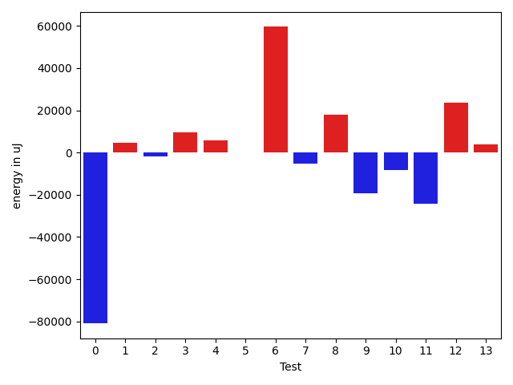

# gson 7a9fd5

https://github.com/google/gson/commit/7a9fd5

## Delta Energy per test method

| ID | EnergyV1 | EnergyV2 | DeltaEnergy | σV1 | %σV1 | σV2 | %σV2 |
| --- | --- | --- | --- | --- | --- | --- | --- |
| 0 | 632688 | 619871 | -12817 | 36266.54 | 5.73 | 37066.53 | 5.98 |
| 1 | 325560 | 284545 | -41015 | 49494.99 | 15.20 | 41433.15 | 14.56 |
| 2 | 313781 | 319823 | 6042 | 24522.41 | 7.82 | 55130.36 | 17.24 |
| 3 | 319213 | 329284 | 10071 | 26291.71 | 8.24 | 17640.68 | 5.36 |
| 4 | 489623 | 498412 | 8789 | 50528.08 | 10.32 | 44631.92 | 8.95 |
| 5 | 644041 | 637633 | -6408 | 45319.64 | 7.04 | 27727.86 | 4.35 |
| 6 | 1726009 | 1737423 | 11414 | 135147.71 | 7.83 | 226414.80 | 13.03 |
| 7 | 508422 | 510436 | 2014 | 73726.56 | 14.50 | 36111.15 | 7.07 |
| 8 | 656065 | 661681 | 5616 | 155347.00 | 23.68 | 219393.40 | 33.16 |
| 9 | 325622 | 324523 | -1099 | 35999.41 | 11.06 | 171809.90 | 52.94 |
| 10 | 228576 | 233337 | 4761 | 41339.25 | 18.09 | 33226.27 | 14.24 |
| 11 | 2914727 | 3045463 | 130736 | 53185.42 | 1.82 | 282478.49 | 9.28 |

## Misc.

| ID | Test Class | Test Method |
| --- | --- | --- |
| 0 | com.google.gson.functional.DefaultTypeAdaptersTest | testDateSerializationWithPatternNotOverridenByTypeAdapter |
| 1 | com.google.gson.functional.DefaultTypeAdaptersTest | testDateSerializationWithPattern |
| 2 | com.google.gson.functional.DefaultTypeAdaptersTest | testSqlDateSerialization |
| 3 | com.google.gson.functional.DefaultTypeAdaptersTest | testTimestampSerialization |
| 4 | com.google.gson.functional.DefaultTypeAdaptersTest | testDateDeserializationWithPattern |
| 5 | com.google.gson.functional.DefaultTypeAdaptersTest | testDateSerializationInCollection |
| 6 | com.google.gson.DefaultDateTypeAdapterTest | testDateDeserializationISO8601 |
| 7 | com.google.gson.DefaultDateTypeAdapterTest | testFormattingInEnUs |
| 8 | com.google.gson.DefaultDateTypeAdapterTest | testFormatUsesDefaultTimezone |
| 9 | com.google.gson.DefaultDateTypeAdapterTest | testDatePattern |
| 10 | com.google.gson.DefaultDateTypeAdapterTest | testDateSerialization |
| 11 | com.google.gson.DefaultDateTypeAdapterTest | testFormattingInFr |

## Classifications

### Tests
| ID | Class | Delta | Share |
| --- | --- | --- | --- |
| G | NEUTRAL | 118104.0 | - |
| N | NEGATIVE | -61339.0 | 25.00 |
| P | POSITIVE | 179443.0 | 12.50 |
| 1 | NEGATIVE | -41015.0 | 66.87 |
| 11 | POSITIVE | 130736.0 | 72.86 |

### Lines
| Class | Java Class | Line |
| --- | --- | --- |
| negative | com.google.gson.DefaultDateTypeAdapter | 87 |
| negative | com.google.gson.DefaultDateTypeAdapter | 88 |
| positive | com.google.gson.DefaultDateTypeAdapter | 87 |
| positive | com.google.gson.DefaultDateTypeAdapter | 88 |
| unknown | com.google.gson.DefaultDateTypeAdapter | 100 |
| unknown | com.google.gson.DefaultDateTypeAdapter | 101 |
| unknown | com.google.gson.DefaultDateTypeAdapter | 87 |
| unknown | com.google.gson.DefaultDateTypeAdapter | 88 |

## Localization of Green Regression
### Selected Tests
| Test class | test method |
| --- | --- |
| com.google.gson.DefaultDateTypeAdapterTest | testFormattingInFr |

### Suspected lines
| Class | line |
| --- | --- |
| com.google.gson.DefaultDateTypeAdapter | [87](https://github.com/google/gson/tree/7a9fd5/gson/src/main/java/com/google/gson/DefaultDateTypeAdapter.java#L87) |
| com.google.gson.DefaultDateTypeAdapter | [88](https://github.com/google/gson/tree/7a9fd5/gson/src/main/java/com/google/gson/DefaultDateTypeAdapter.java#L87#L88) |

| Time Label | Time (s) |
| --- | --- |
| Selection | 35.419569969177246 |
| Injection | 15.747283458709717 |
| Total | 207.82422494888306 |

