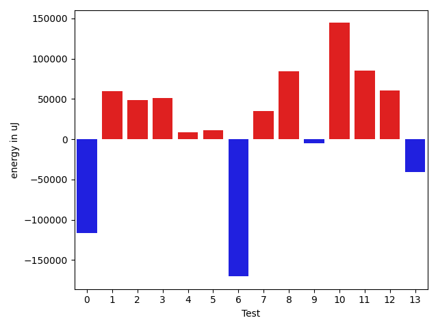

# gson 7a9fd5

https://github.com/google/gson/commit/7a9fd5

## Delta Energy per test method

| ID | EnergyV1 | EnergyV2 | DeltaEnergy | σV1 | %σV1 | σV2 | %σV2 |
| --- | --- | --- | --- | --- | --- | --- | --- |
| 0 | 1558650 | 1471493 | -87157 | 75352.90 | 4.83 | 133071.70 | 9.04 |
| 1 | 779845 | 749876 | -29969 | 101243.91 | 12.98 | 51045.66 | 6.81 |
| 2 | 286804 | 284423 | -2381 | 35072.42 | 12.23 | 24877.85 | 8.75 |
| 3 | 583677 | 562193 | -21484 | 38042.63 | 6.52 | 20662.59 | 3.68 |
| 4 | 232116 | 219055 | -13061 | 28283.37 | 12.19 | 23429.22 | 10.70 |
| 5 | 170471 | 176879 | 6408 | 25220.34 | 14.79 | 31505.99 | 17.81 |
| 6 | 4465565 | 4336903 | -128662 | 319120.99 | 7.15 | 158473.34 | 3.65 |
| 7 | 3512992 | 3358146 | -154846 | 355386.46 | 10.12 | 121531.46 | 3.62 |
| 8 | 429747 | 420287 | -9460 | 55185.56 | 12.84 | 47851.16 | 11.39 |
| 9 | 224060 | 213927 | -10133 | 25562.86 | 11.41 | 119731.85 | 55.97 |
| 10 | 210754 | 198669 | -12085 | 19049.78 | 9.04 | 19677.24 | 9.90 |
| 11 | 249145 | 232788 | -16357 | 65278.67 | 26.20 | 80995.33 | 34.79 |
| 12 | 296203 | 269043 | -27160 | 30395.07 | 10.26 | 36537.01 | 13.58 |
| 13 | 457336 | 399169 | -58167 | 39975.58 | 8.74 | 58645.47 | 14.69 |

## Misc.

| ID | Test Class | Test Method |
| --- | --- | --- |
| 0 | com.google.gson.DefaultDateTypeAdapterTest | testParsingDatesFormattedWithUsLocale |
| 1 | com.google.gson.DefaultDateTypeAdapterTest | testDateDeserializationISO8601 |
| 2 | com.google.gson.DefaultDateTypeAdapterTest | testFormattingInEnUs |
| 3 | com.google.gson.DefaultDateTypeAdapterTest | testFormatUsesDefaultTimezone |
| 4 | com.google.gson.DefaultDateTypeAdapterTest | testDatePattern |
| 5 | com.google.gson.DefaultDateTypeAdapterTest | testDateSerialization |
| 6 | com.google.gson.DefaultDateTypeAdapterTest | testParsingDatesFormattedWithSystemLocale |
| 7 | com.google.gson.DefaultDateTypeAdapterTest | testFormattingInFr |
| 8 | com.google.gson.functional.DefaultTypeAdaptersTest | testDateSerializationWithPatternNotOverridenByTypeAdapter |
| 9 | com.google.gson.functional.DefaultTypeAdaptersTest | testDateSerializationWithPattern |
| 10 | com.google.gson.functional.DefaultTypeAdaptersTest | testSqlDateSerialization |
| 11 | com.google.gson.functional.DefaultTypeAdaptersTest | testTimestampSerialization |
| 12 | com.google.gson.functional.DefaultTypeAdaptersTest | testDateDeserializationWithPattern |
| 13 | com.google.gson.functional.DefaultTypeAdaptersTest | testDateSerializationInCollection |

## Classifications

### Tests
| ID | Class | Delta | Share |
| --- | --- | --- | --- |
| G | NEUTRAL | -564514.0 | - |
| N | NEGATIVE | -570922.0 | 7.69 |
| P | POSITIVE | 6408.0 | 100.00 |
| 0 | NEGATIVE | -87157.0 | 15.27 |
| 6 | NEGATIVE | -128662.0 | 22.54 |
| 7 | NEGATIVE | -154846.0 | 27.12 |

### Lines
| Class | Java Class | Line |
| --- | --- | --- |
| negative | com.google.gson.DefaultDateTypeAdapter | 100 |
| negative | com.google.gson.DefaultDateTypeAdapter | 87 |
| negative | com.google.gson.DefaultDateTypeAdapter | 88 |
| unknown | com.google.gson.DefaultDateTypeAdapter | 100 |
| unknown | com.google.gson.DefaultDateTypeAdapter | 101 |
| unknown | com.google.gson.DefaultDateTypeAdapter | 87 |
| unknown | com.google.gson.DefaultDateTypeAdapter | 88 |

## Localization of Green Regression
### Selected Tests
| Test class | test method |
| --- | --- |
| com.google.gson.DefaultDateTypeAdapterTest | testDateSerialization |
| com.google.gson.DefaultDateTypeAdapterTest | testFormattingInFr |

### Suspected lines
| Class | line |
| --- | --- |
| com.google.gson.DefaultDateTypeAdapter | [87](https://github.com/google/gson/tree/7a9fd5/gson/src/main/java/com/google/gson/DefaultDateTypeAdapter.java#L87) |
| com.google.gson.DefaultDateTypeAdapter | [88](https://github.com/google/gson/tree/7a9fd5/gson/src/main/java/com/google/gson/DefaultDateTypeAdapter.java#L87#L88) |

| Time Label | Time (s) |
| --- | --- |
| Selection | 35.347739696502686 |
| Injection | 15.779882431030273 |
| Total | 212.53080892562866 |

