# gson d9cc7b

https://github.com/google/gson/commit/d9cc7b

## Delta Energy per test method

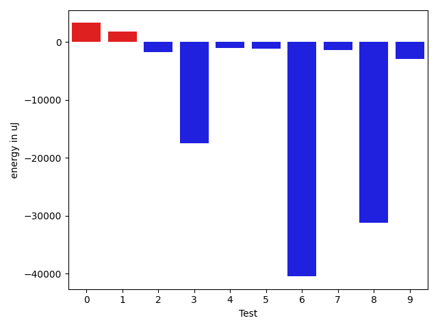

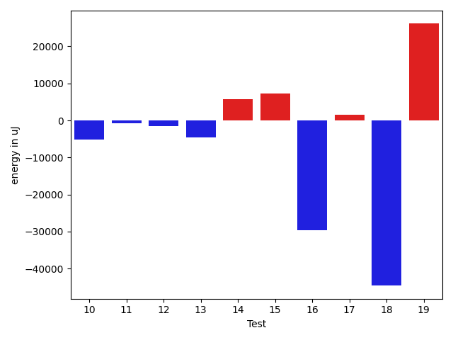

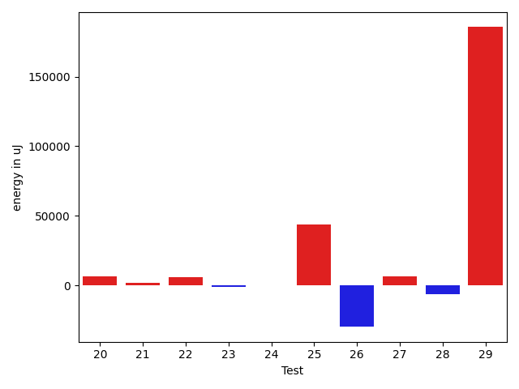

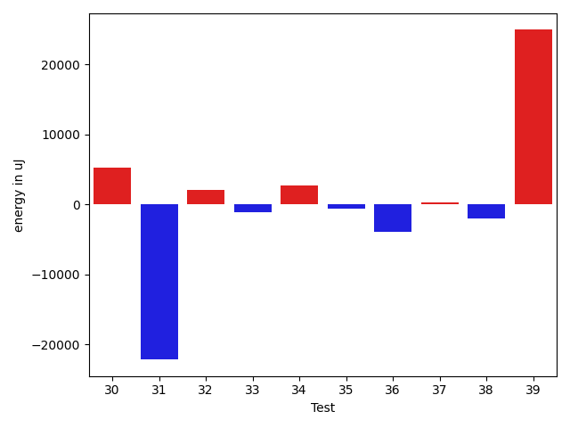

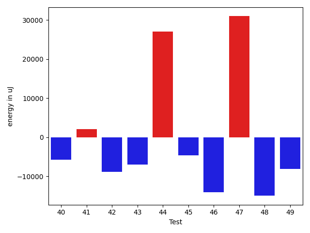

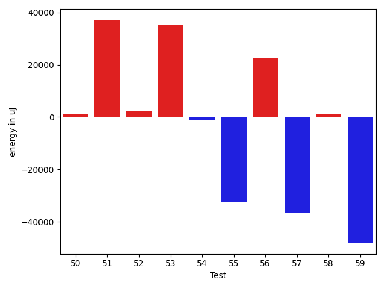

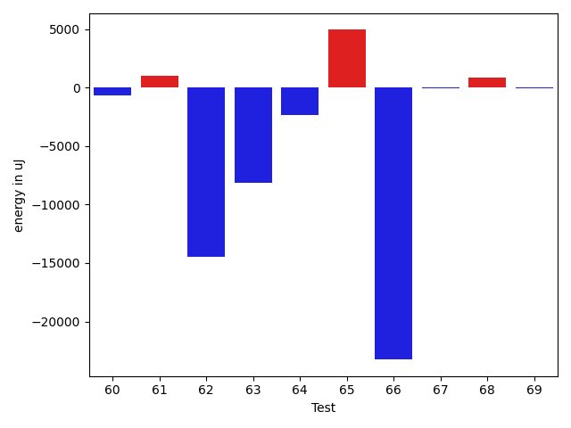

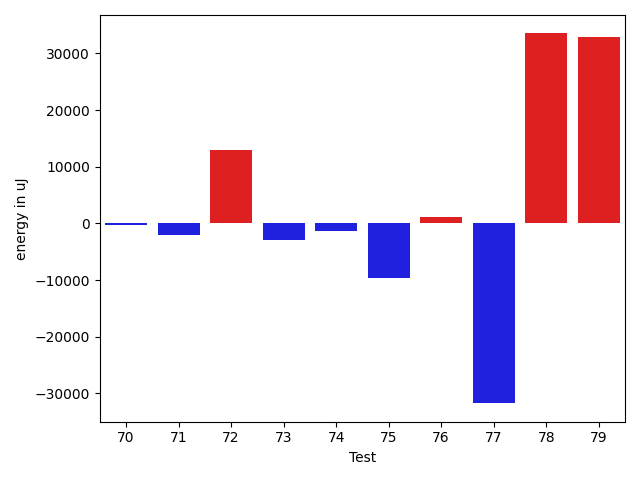

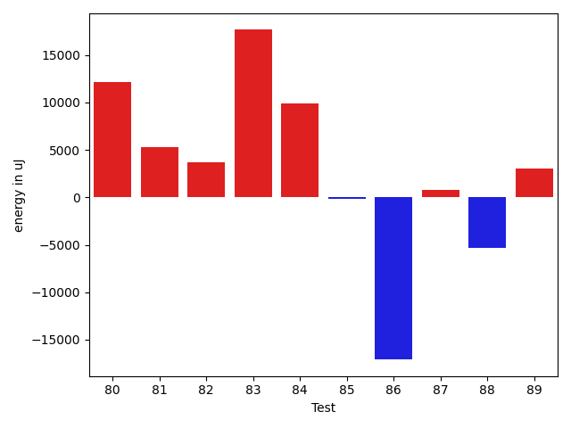

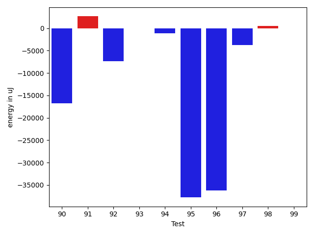

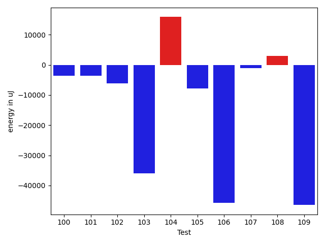

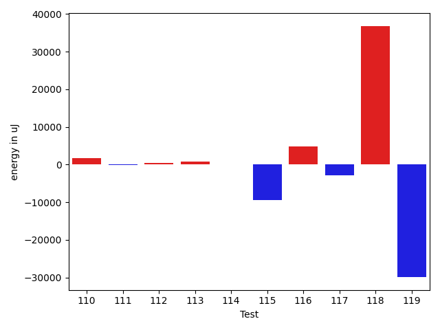

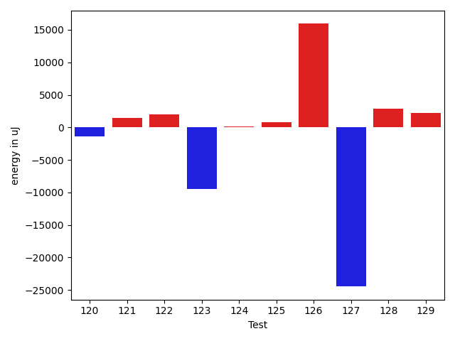

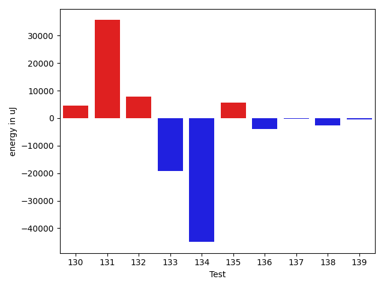

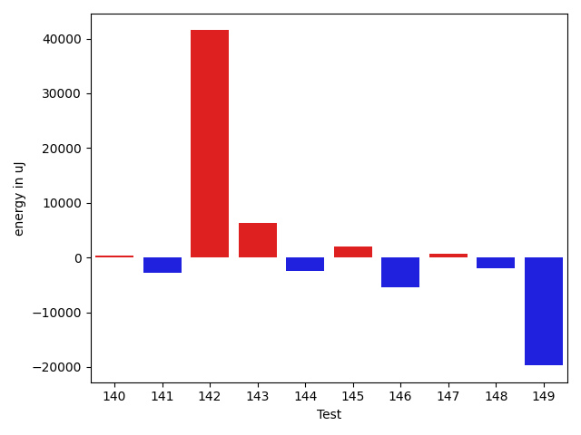

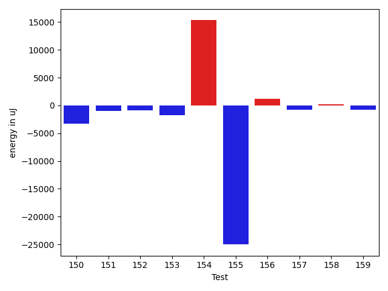

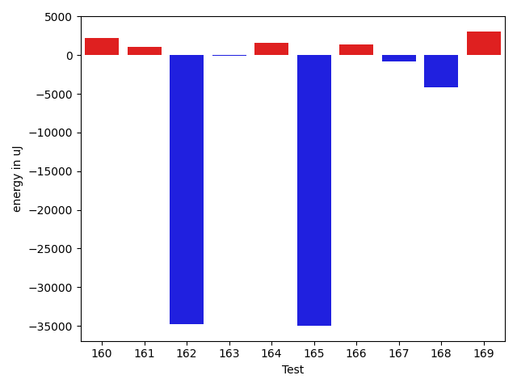

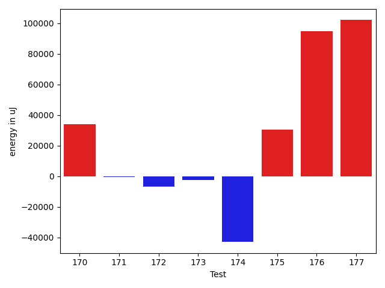

| ID | EnergyV1 | EnergyV2 | DeltaEnergy | σV1 | %σV1 | σV2 | %σV2 |
| --- | --- | --- | --- | --- | --- | --- | --- |
| 0 | 118346 | 121643 | 3297 | 20049.86 | 16.94 | 21955.68 | 18.05 |
| 1 | 89904 | 91674 | 1770 | 17969.12 | 19.99 | 21677.24 | 23.65 |
| 2 | 88867 | 87097 | -1770 | 30678.73 | 34.52 | 27523.77 | 31.60 |
| 3 | 89111 | 71655 | -17456 | 20747.22 | 23.28 | 21631.04 | 30.19 |
| 4 | 94116 | 93139 | -977 | 26168.23 | 27.80 | 3357.68 | 3.61 |
| 5 | 90759 | 89660 | -1099 | 15936.21 | 17.56 | 21270.77 | 23.72 |
| 6 | 89050 | 48584 | -40466 | 22333.47 | 25.08 | 85731.04 | 176.46 |
| 7 | 91247 | 89904 | -1343 | 17545.19 | 19.23 | 18687.14 | 20.79 |
| 8 | 214721 | 183533 | -31188 | 27898.07 | 12.99 | 20127.08 | 10.97 |
| 9 | 166321 | 163390 | -2931 | 20107.99 | 12.09 | 20253.25 | 12.40 |
| 10 | 209228 | 204162 | -5066 | 26511.26 | 12.67 | 19566.42 | 9.58 |
| 11 | 221557 | 220703 | -854 | 25578.11 | 11.54 | 21971.71 | 9.96 |
| 12 | 139648 | 138123 | -1525 | 20968.10 | 15.01 | 19822.80 | 14.35 |
| 13 | 133361 | 128723 | -4638 | 14117.72 | 10.59 | 130238.94 | 101.18 |
| 14 | 173340 | 179076 | 5736 | 29174.57 | 16.83 | 34111.31 | 19.05 |
| 15 | 211243 | 218445 | 7202 | 22240.15 | 10.53 | 8480.14 | 3.88 |
| 16 | 187134 | 157409 | -29725 | 18186.00 | 9.72 | 20208.83 | 12.84 |
| 17 | 89966 | 91430 | 1464 | 27658.14 | 30.74 | 19790.27 | 21.65 |
| 18 | 92102 | 47486 | -44616 | 21847.61 | 23.72 | 24367.99 | 51.32 |
| 19 | 217590 | 243713 | 26123 | 32309.17 | 14.85 | 16221.21 | 6.66 |
| 20 | 155700 | 162475 | 6775 | 13967.99 | 8.97 | 15915.25 | 9.80 |
| 21 | 223205 | 225036 | 1831 | 17427.08 | 7.81 | 14047.19 | 6.24 |
| 22 | 161315 | 166992 | 5677 | 20339.60 | 12.61 | 31037.80 | 18.59 |
| 23 | 93994 | 92956 | -1038 | 28911.51 | 30.76 | 15861.61 | 17.06 |
| 24 | 92407 | 92285 | -122 | 15949.35 | 17.26 | 21297.43 | 23.08 |
| 25 | 178772 | 222289 | 43517 | 22238.58 | 12.44 | 65515.29 | 29.47 |
| 26 | 147095 | 117370 | -29725 | 18899.58 | 12.85 | 25450.10 | 21.68 |
| 27 | 273009 | 279723 | 6714 | 42097.19 | 15.42 | 64915.71 | 23.21 |
| 28 | 130127 | 123901 | -6226 | 19776.92 | 15.20 | 25313.63 | 20.43 |
| 29 | 239318 | 424865 | 185547 | 125567.80 | 52.47 | 102204.80 | 24.06 |
| 30 | 133362 | 138550 | 5188 | 15323.21 | 11.49 | 22577.90 | 16.30 |
| 31 | 434020 | 411864 | -22156 | 29616.17 | 6.82 | 32223.27 | 7.82 |
| 32 | 47668 | 49743 | 2075 | 22948.58 | 48.14 | 20590.11 | 41.39 |
| 33 | 44800 | 43701 | -1099 | 19989.26 | 44.62 | 2416.12 | 5.53 |
| 34 | 136475 | 139160 | 2685 | 24953.95 | 18.28 | 21965.58 | 15.78 |
| 35 | 135681 | 135010 | -671 | 23296.53 | 17.17 | 15433.72 | 11.43 |
| 36 | 139770 | 135864 | -3906 | 30463.97 | 21.80 | 22139.37 | 16.30 |
| 37 | 153442 | 153748 | 306 | 22017.34 | 14.35 | 27701.72 | 18.02 |
| 38 | 134154 | 132080 | -2074 | 18400.81 | 13.72 | 21740.58 | 16.46 |
| 39 | 456481 | 481383 | 24902 | 36756.28 | 8.05 | 42274.08 | 8.78 |
| 40 | 435973 | 430175 | -5798 | 16550.27 | 3.80 | 44726.52 | 10.40 |
| 41 | 324096 | 326171 | 2075 | 33379.43 | 10.30 | 17336.03 | 5.32 |
| 42 | 133483 | 124695 | -8788 | 8648.50 | 6.48 | 10744.02 | 8.62 |
| 43 | 358763 | 351745 | -7018 | 30167.87 | 8.41 | 30320.75 | 8.62 |
| 44 | 753050 | 780028 | 26978 | 41263.70 | 5.48 | 74803.87 | 9.59 |
| 45 | 159484 | 154846 | -4638 | 23065.89 | 14.46 | 24962.10 | 16.12 |
| 46 | 138000 | 123901 | -14099 | 3697.03 | 2.68 | 23641.47 | 19.08 |
| 47 | 1279904 | 1310848 | 30944 | 127007.78 | 9.92 | 50321.53 | 3.84 |
| 48 | 155395 | 140441 | -14954 | 19763.00 | 12.72 | 20811.03 | 14.82 |
| 49 | 51880 | 43823 | -8057 | 17762.97 | 34.24 | 20384.41 | 46.52 |
| 50 | 188476 | 189636 | 1160 | 104105.03 | 55.24 | 21819.52 | 11.51 |
| 51 | 671019 | 708067 | 37048 | 101990.90 | 15.20 | 41485.06 | 5.86 |
| 52 | 81115 | 83556 | 2441 | 17198.37 | 21.20 | 12420.77 | 14.87 |
| 53 | 130004 | 165282 | 35278 | 20211.94 | 15.55 | 22838.95 | 13.82 |
| 54 | 82153 | 80810 | -1343 | 20511.22 | 24.97 | 21218.72 | 26.26 |
| 55 | 120972 | 88440 | -32532 | 29553.82 | 24.43 | 24363.52 | 27.55 |
| 56 | 277404 | 299987 | 22583 | 14102.61 | 5.08 | 16869.47 | 5.62 |
| 57 | 367553 | 331176 | -36377 | 53742.51 | 14.62 | 41838.37 | 12.63 |
| 58 | 88196 | 89172 | 976 | 15607.19 | 17.70 | 14542.18 | 16.31 |
| 59 | 686216 | 638182 | -48034 | 65320.29 | 9.52 | 51783.93 | 8.11 |
| 60 | 45593 | 44922 | -671 | 4511.30 | 9.89 | 3757.69 | 8.36 |
| 61 | 46204 | 47241 | 1037 | 18656.20 | 40.38 | 17465.58 | 36.97 |
| 62 | 243834 | 229370 | -14464 | 35623.99 | 14.61 | 54287.25 | 23.67 |
| 63 | 177063 | 168945 | -8118 | 19255.65 | 10.88 | 25829.53 | 15.29 |
| 64 | 81299 | 78980 | -2319 | 2899.90 | 3.57 | 23489.36 | 29.74 |
| 65 | 89355 | 94299 | 4944 | 7797.51 | 8.73 | 17015.37 | 18.04 |
| 66 | 163879 | 140624 | -23255 | 20427.96 | 12.47 | 25993.54 | 18.48 |
| 67 | 47363 | 47303 | -60 | 1716.21 | 3.62 | 13022.97 | 27.53 |
| 68 | 86669 | 87524 | 855 | 22659.02 | 26.14 | 20339.49 | 23.24 |
| 69 | 48706 | 48645 | -61 | 21014.54 | 43.15 | 21654.06 | 44.51 |
| 70 | 208739 | 208495 | -244 | 20098.56 | 9.63 | 18023.60 | 8.64 |
| 71 | 80932 | 78918 | -2014 | 20027.90 | 24.75 | 25709.29 | 32.58 |
| 72 | 125793 | 138733 | 12940 | 33735.49 | 26.82 | 21739.97 | 15.67 |
| 73 | 45410 | 42480 | -2930 | 12198.87 | 26.86 | 11391.68 | 26.82 |
| 74 | 82031 | 80749 | -1282 | 17299.69 | 21.09 | 20477.69 | 25.36 |
| 75 | 88806 | 79102 | -9704 | 14597.55 | 16.44 | 18787.41 | 23.75 |
| 76 | 83862 | 84960 | 1098 | 17151.42 | 20.45 | 24519.24 | 28.86 |
| 77 | 216003 | 184265 | -31738 | 57523.26 | 26.63 | 37596.69 | 20.40 |
| 78 | 129028 | 162536 | 33508 | 51551.73 | 39.95 | 18347.62 | 11.29 |
| 79 | 171875 | 204833 | 32958 | 47763.96 | 27.79 | 30673.73 | 14.97 |
| 80 | 343383 | 355529 | 12146 | 16732.61 | 4.87 | 19676.95 | 5.53 |
| 81 | 254211 | 259521 | 5310 | 22315.73 | 8.78 | 34484.14 | 13.29 |
| 82 | 162719 | 166381 | 3662 | 20322.13 | 12.49 | 21290.20 | 12.80 |
| 83 | 174682 | 192321 | 17639 | 21594.13 | 12.36 | 21950.53 | 11.41 |
| 84 | 370605 | 380492 | 9887 | 66426.74 | 17.92 | 31843.01 | 8.37 |
| 85 | 137939 | 137756 | -183 | 19299.23 | 13.99 | 9824.56 | 7.13 |
| 86 | 515013 | 497924 | -17089 | 25367.55 | 4.93 | 33637.94 | 6.76 |
| 87 | 96252 | 96984 | 732 | 20287.82 | 21.08 | 23115.90 | 23.83 |
| 88 | 126647 | 121276 | -5371 | 18814.20 | 14.86 | 37907.92 | 31.26 |
| 89 | 83984 | 87036 | 3052 | 20783.14 | 24.75 | 23511.56 | 27.01 |
| 90 | 194457 | 177734 | -16723 | 25784.16 | 13.26 | 23456.58 | 13.20 |
| 91 | 149658 | 152282 | 2624 | 27118.37 | 18.12 | 23211.10 | 15.24 |
| 92 | 271301 | 263976 | -7325 | 27247.27 | 10.04 | 39929.40 | 15.13 |
| 93 | 43518 | 43457 | -61 | 16995.40 | 39.05 | 2401.05 | 5.53 |
| 94 | 45532 | 44372 | -1160 | 16151.54 | 35.47 | 1897.03 | 4.28 |
| 95 | 86303 | 48523 | -37780 | 21245.04 | 24.62 | 46328.97 | 95.48 |
| 96 | 82215 | 46021 | -36194 | 21985.12 | 26.74 | 22634.96 | 49.18 |
| 97 | 49011 | 45288 | -3723 | 21856.40 | 44.59 | 20313.68 | 44.85 |
| 98 | 45227 | 45715 | 488 | 14673.02 | 32.44 | 19579.72 | 42.83 |
| 99 | 42786 | 42786 | 0 | 21264.35 | 49.70 | 21056.09 | 49.21 |
| 100 | 46691 | 43090 | -3601 | 2975.24 | 6.37 | 2952.89 | 6.85 |
| 101 | 49317 | 45777 | -3540 | 23791.33 | 48.24 | 22426.43 | 48.99 |
| 102 | 185302 | 179198 | -6104 | 14515.89 | 7.83 | 15093.90 | 8.42 |
| 103 | 240661 | 204650 | -36011 | 50572.44 | 21.01 | 21131.36 | 10.33 |
| 104 | 317626 | 333495 | 15869 | 18604.17 | 5.86 | 38574.32 | 11.57 |
| 105 | 137573 | 129821 | -7752 | 95695.68 | 69.56 | 23970.83 | 18.46 |
| 106 | 215881 | 170227 | -45654 | 22386.42 | 10.37 | 20585.42 | 12.09 |
| 107 | 90392 | 89355 | -1037 | 13516.54 | 14.95 | 22800.63 | 25.52 |
| 108 | 47180 | 50171 | 2991 | 24911.55 | 52.80 | 22191.67 | 44.23 |
| 109 | 134338 | 87890 | -46448 | 23159.68 | 17.24 | 8373.45 | 9.53 |
| 110 | 89966 | 91614 | 1648 | 25225.01 | 28.04 | 23732.47 | 25.90 |
| 111 | 83374 | 83191 | -183 | 24668.57 | 29.59 | 22198.94 | 26.68 |
| 112 | 132446 | 132934 | 488 | 29960.23 | 22.62 | 23437.05 | 17.63 |
| 113 | 77636 | 78491 | 855 | 16003.11 | 20.61 | 19353.79 | 24.66 |
| 114 | 83069 | 83190 | 121 | 3306.90 | 3.98 | 18217.64 | 21.90 |
| 115 | 89905 | 80506 | -9399 | 28055.86 | 31.21 | 11826.14 | 14.69 |
| 116 | 127319 | 132080 | 4761 | 28441.29 | 22.34 | 15611.62 | 11.82 |
| 117 | 91247 | 88379 | -2868 | 31558.34 | 34.59 | 15282.00 | 17.29 |
| 118 | 78369 | 115234 | 36865 | 19538.12 | 24.93 | 18493.49 | 16.05 |
| 119 | 162476 | 132507 | -29969 | 32115.47 | 19.77 | 20677.61 | 15.60 |
| 120 | 127868 | 126464 | -1404 | 7727.97 | 6.04 | 139451.67 | 110.27 |
| 121 | 93079 | 94482 | 1403 | 19786.90 | 21.26 | 20658.87 | 21.87 |
| 122 | 75744 | 77698 | 1954 | 12442.59 | 16.43 | 17861.63 | 22.99 |
| 123 | 88439 | 78979 | -9460 | 13647.71 | 15.43 | 18564.42 | 23.51 |
| 124 | 132324 | 132446 | 122 | 14683.81 | 11.10 | 23968.78 | 18.10 |
| 125 | 182373 | 183166 | 793 | 15889.32 | 8.71 | 1881.62 | 1.03 |
| 126 | 246399 | 262328 | 15929 | 20492.05 | 8.32 | 84469.06 | 32.20 |
| 127 | 159423 | 134949 | -24474 | 55877.15 | 35.05 | 15445.22 | 11.45 |
| 128 | 91065 | 93932 | 2867 | 25022.98 | 27.48 | 19700.03 | 20.97 |
| 129 | 84655 | 86853 | 2198 | 4403.65 | 5.20 | 24521.00 | 28.23 |
| 130 | 127685 | 132202 | 4517 | 16101.59 | 12.61 | 21493.07 | 16.26 |
| 131 | 46143 | 81787 | 35644 | 23016.48 | 49.88 | 20268.75 | 24.78 |
| 132 | 128845 | 136718 | 7873 | 32113.34 | 24.92 | 27890.57 | 20.40 |
| 133 | 394347 | 375060 | -19287 | 31109.17 | 7.89 | 55367.89 | 14.76 |
| 134 | 92041 | 47058 | -44983 | 16919.10 | 18.38 | 20686.23 | 43.96 |
| 135 | 126525 | 132202 | 5677 | 21697.27 | 17.15 | 16134.38 | 12.20 |
| 136 | 87036 | 83129 | -3907 | 21501.49 | 24.70 | 24485.37 | 29.45 |
| 137 | 94543 | 94299 | -244 | 78258.87 | 82.78 | 49850.05 | 52.86 |
| 138 | 90393 | 87768 | -2625 | 32213.42 | 35.64 | 25813.80 | 29.41 |
| 139 | 360594 | 360106 | -488 | 71744.18 | 19.90 | 36329.79 | 10.09 |
| 140 | 86364 | 86670 | 306 | 14682.63 | 17.00 | 12783.86 | 14.75 |
| 141 | 91553 | 88745 | -2808 | 18320.83 | 20.01 | 3608.98 | 4.07 |
| 142 | 87403 | 128906 | 41503 | 21382.80 | 24.46 | 41680.50 | 32.33 |
| 143 | 127625 | 133972 | 6347 | 25212.06 | 19.75 | 20629.85 | 15.40 |
| 144 | 80994 | 78613 | -2381 | 16821.09 | 20.77 | 15864.31 | 20.18 |
| 145 | 351867 | 353942 | 2075 | 29576.54 | 8.41 | 24144.01 | 6.82 |
| 146 | 229919 | 224547 | -5372 | 31666.27 | 13.77 | 23787.62 | 10.59 |
| 147 | 227721 | 228393 | 672 | 35684.18 | 15.67 | 18806.22 | 8.23 |
| 148 | 497557 | 495543 | -2014 | 50088.88 | 10.07 | 36444.69 | 7.35 |
| 149 | 205932 | 186218 | -19714 | 29900.54 | 14.52 | 12972.05 | 6.97 |
| 150 | 222168 | 218932 | -3236 | 24777.57 | 11.15 | 13580.99 | 6.20 |
| 151 | 45532 | 44495 | -1037 | 11975.57 | 26.30 | 12393.71 | 27.85 |
| 152 | 45838 | 44983 | -855 | 1153.03 | 2.52 | 2319.45 | 5.16 |
| 153 | 130127 | 128417 | -1710 | 2973.46 | 2.29 | 29925.80 | 23.30 |
| 154 | 134094 | 149414 | 15320 | 19915.19 | 14.85 | 22082.27 | 14.78 |
| 155 | 222411 | 197388 | -25023 | 26723.83 | 12.02 | 26758.39 | 13.56 |
| 156 | 260680 | 261840 | 1160 | 23860.60 | 9.15 | 29510.22 | 11.27 |
| 157 | 237975 | 237243 | -732 | 74378.54 | 31.25 | 25260.79 | 10.65 |
| 158 | 258117 | 258361 | 244 | 33444.77 | 12.96 | 27845.36 | 10.78 |
| 159 | 182495 | 181763 | -732 | 3027.73 | 1.66 | 11785.68 | 6.48 |
| 160 | 183593 | 185791 | 2198 | 27762.70 | 15.12 | 2923.84 | 1.57 |
| 161 | 41565 | 42603 | 1038 | 13397.59 | 32.23 | 19764.41 | 46.39 |
| 162 | 122619 | 87829 | -34790 | 30563.33 | 24.93 | 27141.32 | 30.90 |
| 163 | 89600 | 89539 | -61 | 21314.66 | 23.79 | 19360.35 | 21.62 |
| 164 | 93139 | 94727 | 1588 | 23999.14 | 25.77 | 20166.53 | 21.29 |
| 165 | 124512 | 89477 | -35035 | 22080.88 | 17.73 | 4341.66 | 4.85 |
| 166 | 92041 | 93444 | 1403 | 15729.67 | 17.09 | 1613.96 | 1.73 |
| 167 | 91980 | 91186 | -794 | 16706.96 | 18.16 | 24326.35 | 26.68 |
| 168 | 223022 | 218872 | -4150 | 38936.43 | 17.46 | 18084.08 | 8.26 |
| 169 | 119994 | 123108 | 3114 | 18054.09 | 15.05 | 22818.40 | 18.54 |
| 170 | 203735 | 237854 | 34119 | 26066.85 | 12.79 | 22113.58 | 9.30 |
| 171 | 110901 | 110473 | -428 | 19790.66 | 17.85 | 16824.76 | 15.23 |
| 172 | 706907 | 700377 | -6530 | 46129.58 | 6.53 | 66507.46 | 9.50 |
| 173 | 46630 | 44372 | -2258 | 19115.03 | 40.99 | 2477.84 | 5.58 |
| 174 | 88928 | 46081 | -42847 | 20345.44 | 22.88 | 22361.60 | 48.53 |
| 175 | 153015 | 183532 | 30517 | 21015.16 | 13.73 | 34914.56 | 19.02 |
| 176 | 1585689 | 1680294 | 94605 | 59192.46 | 3.73 | 94775.15 | 5.64 |
| 177 | 1277340 | 1379330 | 101990 | 74403.82 | 5.82 | 61084.67 | 4.43 |

## Misc.

| ID | Test Class | Test Method |
| --- | --- | --- |
| 0 | com.google.gson.functional.TypeAdapterPrecedenceTest | testStreamingFollowedByNonstreaming |
| 1 | com.google.gson.functional.TypeAdapterPrecedenceTest | testStreamingHierarchicalFollowedByNonstreaming |
| 2 | com.google.gson.functional.TypeAdapterPrecedenceTest | testSerializeNonstreamingTypeAdapterFollowedByStreamingTypeAdapter |
| 3 | com.google.gson.functional.TypeAdapterPrecedenceTest | testNonstreamingHierarchicalFollowedByNonstreaming |
| 4 | com.google.gson.functional.TypeAdapterPrecedenceTest | testStreamingHierarchicalFollowedByNonstreamingHierarchical |
| 5 | com.google.gson.functional.TypeAdapterPrecedenceTest | testNonstreamingFollowedByNonstreaming |
| 6 | com.google.gson.functional.TypeAdapterPrecedenceTest | testStreamingFollowedByStreaming |
| 7 | com.google.gson.functional.TypeAdapterPrecedenceTest | testStreamingFollowedByNonstreamingHierarchical |
| 8 | com.google.gson.functional.CustomTypeAdaptersTest | testCustomAdapterInvokedForCollectionElementDeserialization |
| 9 | com.google.gson.functional.CustomTypeAdaptersTest | testCustomTypeAdapterAppliesToSubClassesSerializedAsBaseClass |
| 10 | com.google.gson.functional.CustomTypeAdaptersTest | testCustomAdapterInvokedForMapElementDeserialization |
| 11 | com.google.gson.functional.CustomTypeAdaptersTest | testCustomAdapterInvokedForMapElementSerializationWithType |
| 12 | com.google.gson.functional.CustomTypeAdaptersTest | testCustomNestedSerializers |
| 13 | com.google.gson.functional.CustomTypeAdaptersTest | testCustomAdapterInvokedForMapElementSerialization |
| 14 | com.google.gson.functional.CustomTypeAdaptersTest | testCustomSerializers |
| 15 | com.google.gson.functional.CustomTypeAdaptersTest | testCustomNestedDeserializers |
| 16 | com.google.gson.functional.CustomTypeAdaptersTest | testCustomTypeAdapterDoesNotAppliesToSubClasses |
| 17 | com.google.gson.functional.CustomTypeAdaptersTest | testCustomAdapterInvokedForCollectionElementSerialization |
| 18 | com.google.gson.functional.CustomTypeAdaptersTest | testRegisterHierarchyAdapterForDate |
| 19 | com.google.gson.functional.CustomTypeAdaptersTest | testCustomAdapterInvokedForCollectionElementSerializationWithType |
| 20 | com.google.gson.functional.CustomTypeAdaptersTest | testCustomDeserializers |
| 21 | com.google.gson.functional.CustomTypeAdaptersTest | testCustomByteArrayDeserializerAndInstanceCreator |
| 22 | com.google.gson.functional.CustomTypeAdaptersTest | testCustomByteArraySerializer |
| 23 | com.google.gson.functional.CustomTypeAdaptersTest | testEnsureCustomSerializerNotInvokedForNullValues |
| 24 | com.google.gson.functional.CustomTypeAdaptersTest | testEnsureCustomDeserializerNotInvokedForNullValues |
| 25 | com.google.gson.functional.CustomTypeAdaptersTest | testCustomDeserializerInvokedForPrimitives |
| 26 | com.google.gson.functional.CustomTypeAdaptersTest | testCustomSerializerInvokedForPrimitives |
| 27 | com.google.gson.functional.StreamingTypeAdaptersTest | testNullSafe |
| 28 | com.google.gson.functional.StreamingTypeAdaptersTest | testSerializeWithCustomTypeAdapter |
| 29 | com.google.gson.functional.StreamingTypeAdaptersTest | testDeserializeWithCustomTypeAdapter |
| 30 | com.google.gson.functional.ExclusionStrategyFunctionalTest | testExclusionStrategySerializationDoesNotImpactSerialization |
| 31 | com.google.gson.functional.ExclusionStrategyFunctionalTest | testExclusionStrategyWithMode |
| 32 | com.google.gson.functional.ExclusionStrategyFunctionalTest | testExcludeTopLevelClassDeserialization |
| 33 | com.google.gson.functional.ExclusionStrategyFunctionalTest | testExcludeTopLevelClassSerialization |
| 34 | com.google.gson.functional.ExclusionStrategyFunctionalTest | testExclusionStrategySerializationDoesNotImpactDeserialization |
| 35 | com.google.gson.functional.ExclusionStrategyFunctionalTest | testExcludeTopLevelClassDeserializationDoesNotImpactSerialization |
| 36 | com.google.gson.functional.ExclusionStrategyFunctionalTest | testExcludeTopLevelClassSerializationDoesNotImpactDeserialization |
| 37 | com.google.gson.functional.ExclusionStrategyFunctionalTest | testExclusionStrategyDeserialization |
| 38 | com.google.gson.functional.ExclusionStrategyFunctionalTest | testExclusionStrategySerialization |
| 39 | com.google.gson.functional.InstanceCreatorTest | testInstanceCreatorForParametrizedType |
| 40 | com.google.gson.functional.InstanceCreatorTest | testInstanceCreatorReturnsBaseType |
| 41 | com.google.gson.functional.InstanceCreatorTest | testInstanceCreatorReturnsSubTypeForField |
| 42 | com.google.gson.functional.InstanceCreatorTest | testInstanceCreatorReturnsSubTypeForTopLevelObject |
| 43 | com.google.gson.functional.InstanceCreatorTest | testInstanceCreatorForCollectionType |
| 44 | com.google.gson.functional.DefaultTypeAdaptersTest | testDateSerializationWithPatternNotOverridenByTypeAdapter |
| 45 | com.google.gson.functional.DefaultTypeAdaptersTest | testDateSerializationWithPattern |
| 46 | com.google.gson.functional.DefaultTypeAdaptersTest | testOverrideBigIntegerTypeAdapter |
| 47 | com.google.gson.functional.DefaultTypeAdaptersTest | testDefaultGregorianCalendarDeserialization |
| 48 | com.google.gson.functional.DefaultTypeAdaptersTest | testSqlDateSerialization |
| 49 | com.google.gson.functional.DefaultTypeAdaptersTest | testClassSerialization |
| 50 | com.google.gson.functional.DefaultTypeAdaptersTest | testTimestampSerialization |
| 51 | com.google.gson.functional.DefaultTypeAdaptersTest | testDefaultDateDeserializationUsingBuilder |
| 52 | com.google.gson.functional.DefaultTypeAdaptersTest | testDefaultCalendarSerialization |
| 53 | com.google.gson.functional.DefaultTypeAdaptersTest | testOverrideBigDecimalTypeAdapter |
| 54 | com.google.gson.functional.DefaultTypeAdaptersTest | testDefaultCalendarDeserialization |
| 55 | com.google.gson.functional.DefaultTypeAdaptersTest | testClassDeserialization |
| 56 | com.google.gson.functional.DefaultTypeAdaptersTest | testDateDeserializationWithPattern |
| 57 | com.google.gson.functional.DefaultTypeAdaptersTest | testDateSerializationInCollection |
| 58 | com.google.gson.functional.DefaultTypeAdaptersTest | testDefaultGregorianCalendarSerialization |
| 59 | com.google.gson.functional.DefaultTypeAdaptersTest | testDefaultDateSerializationUsingBuilder |
| 60 | com.google.gson.OverrideCoreTypeAdaptersTest | testOverrideStringAdapter |
| 61 | com.google.gson.OverrideCoreTypeAdaptersTest | testOverridePrimitiveBooleanAdapter |
| 62 | com.google.gson.OverrideCoreTypeAdaptersTest | testOverrideWrapperBooleanAdapter |
| 63 | com.google.gson.functional.NullObjectAndFieldTest | testCustomTypeAdapterPassesNullSerialization |
| 64 | com.google.gson.functional.NullObjectAndFieldTest | testExplicitDeserializationOfNulls |
| 65 | com.google.gson.functional.NullObjectAndFieldTest | testExplicitSerializationOfNullStringMembers |
| 66 | com.google.gson.functional.NullObjectAndFieldTest | testCustomTypeAdapterPassesNullDesrialization |
| 67 | com.google.gson.functional.NullObjectAndFieldTest | testTopLevelNullObjectDeserialization |
| 68 | com.google.gson.functional.NullObjectAndFieldTest | testExplicitSerializationOfNullCollectionMembers |
| 69 | com.google.gson.functional.NullObjectAndFieldTest | testCustomSerializationOfNulls |
| 70 | com.google.gson.functional.NullObjectAndFieldTest | testPrintPrintingObjectWithNulls |
| 71 | com.google.gson.functional.NullObjectAndFieldTest | testPrintPrintingArraysWithNulls |
| 72 | com.google.gson.functional.NullObjectAndFieldTest | testTopLevelNullObjectSerialization |
| 73 | com.google.gson.functional.NullObjectAndFieldTest | testNullWrappedPrimitiveMemberSerialization |
| 74 | com.google.gson.functional.NullObjectAndFieldTest | testExplicitSerializationOfNullArrayMembers |
| 75 | com.google.gson.functional.NullObjectAndFieldTest | testExplicitSerializationOfNulls |
| 76 | com.google.gson.functional.NullObjectAndFieldTest | testNullWrappedPrimitiveMemberDeserialization |
| 77 | com.google.gson.LongSerializationPolicyTest | testDefaultLongSerializationIntegration |
| 78 | com.google.gson.LongSerializationPolicyTest | testStringLongSerializationIntegration |
| 79 | com.google.gson.functional.MapTest | testSerializeMaps |
| 80 | com.google.gson.functional.MapTest | testInterfaceTypeMapWithSerializer |
| 81 | com.google.gson.functional.MapTest | testMapSerializationWithNullValuesSerialized |
| 82 | com.google.gson.functional.MapTest | testMapSubclassDeserialization |
| 83 | com.google.gson.functional.MapTest | testCustomSerializerForSpecificMapType |
| 84 | com.google.gson.functional.MapTest | testGeneralMapField |
| 85 | com.google.gson.functional.MapTest | testMapSerializationWithNullValueButSerializeNulls |
| 86 | com.google.gson.functional.MapTest | testInterfaceTypeMap |
| 87 | com.google.gson.functional.FieldExclusionTest | testDefaultNestedStaticClassIncluded |
| 88 | com.google.gson.functional.FieldExclusionTest | testDefaultInnerClassExclusion |
| 89 | com.google.gson.functional.FieldExclusionTest | testInnerClassExclusion |
| 90 | com.google.gson.GsonBuilderTest | testExcludeFieldsWithModifiers |
| 91 | com.google.gson.GsonBuilderTest | testCreatingMoreThanOnce |
| 92 | com.google.gson.GsonBuilderTest | testTransientFieldExclusion |
| 93 | com.google.gson.functional.PrimitiveTest | testDoubleInfinitySerialization |
| 94 | com.google.gson.functional.PrimitiveTest | testLongAsStringDeserialization |
| 95 | com.google.gson.functional.PrimitiveTest | testHtmlCharacterSerialization |
| 96 | com.google.gson.functional.PrimitiveTest | testNegativeInfinitySerialization |
| 97 | com.google.gson.functional.PrimitiveTest | testLongAsStringSerialization |
| 98 | com.google.gson.functional.PrimitiveTest | testFloatInfinitySerialization |
| 99 | com.google.gson.functional.PrimitiveTest | testFloatNaNSerialization |
| 100 | com.google.gson.functional.PrimitiveTest | testNegativeInfinityFloatSerialization |
| 101 | com.google.gson.functional.PrimitiveTest | testDoubleNaNSerialization |
| 102 | com.google.gson.functional.CustomDeserializerTest | testCustomDeserializerReturnsNullForArrayElementsForArrayField |
| 103 | com.google.gson.functional.CustomDeserializerTest | testCustomDeserializerReturnsNull |
| 104 | com.google.gson.functional.CustomDeserializerTest | testJsonTypeFieldBasedDeserialization |
| 105 | com.google.gson.functional.CustomDeserializerTest | testCustomDeserializerReturnsNullForArrayElements |
| 106 | com.google.gson.functional.CustomDeserializerTest | testCustomDeserializerReturnsNullForTopLevelObject |
| 107 | com.google.gson.functional.NamingPolicyTest | testGsonWithNonDefaultFieldNamingPolicySerialization |
| 108 | com.google.gson.functional.NamingPolicyTest | testGsonWithLowerCaseDashPolicyDeserialiation |
| 109 | com.google.gson.functional.NamingPolicyTest | testGsonDuplicateNameUsingSerializedNameFieldNamingPolicySerialization |
| 110 | com.google.gson.functional.NamingPolicyTest | testGsonWithSerializedNameFieldNamingPolicyDeserialization |
| 111 | com.google.gson.functional.NamingPolicyTest | testGsonWithUpperCamelCaseSpacesPolicyDeserialiation |
| 112 | com.google.gson.functional.NamingPolicyTest | testGsonWithSerializedNameFieldNamingPolicySerialization |
| 113 | com.google.gson.functional.NamingPolicyTest | testGsonWithNonDefaultFieldNamingPolicyDeserialiation |
| 114 | com.google.gson.functional.NamingPolicyTest | testGsonWithLowerCaseUnderscorePolicySerialization |
| 115 | com.google.gson.functional.NamingPolicyTest | testDeprecatedNamingStrategy |
| 116 | com.google.gson.functional.NamingPolicyTest | testGsonWithUpperCamelCaseSpacesPolicySerialiation |
| 117 | com.google.gson.functional.NamingPolicyTest | testGsonWithLowerCaseDashPolicySerialization |
| 118 | com.google.gson.functional.NamingPolicyTest | testGsonWithLowerCaseUnderscorePolicyDeserialiation |
| 119 | com.google.gson.functional.CustomSerializerTest | testSerializerReturnsNull |
| 120 | com.google.gson.functional.CustomSerializerTest | testSubClassSerializerInvokedForBaseClassFieldsHoldingSubClassInstances |
| 121 | com.google.gson.functional.CustomSerializerTest | testBaseClassSerializerInvokedForBaseClassFieldsHoldingSubClassInstances |
| 122 | com.google.gson.functional.CustomSerializerTest | testBaseClassSerializerInvokedForBaseClassFields |
| 123 | com.google.gson.functional.CustomSerializerTest | testSubClassSerializerInvokedForBaseClassFieldsHoldingArrayOfSubClassInstances |
| 124 | com.google.gson.functional.JsonAdapterAnnotationOnClassesTest | testRegisteredAdapterOverridesJsonAdapter |
| 125 | com.google.gson.functional.JsonAdapterAnnotationOnClassesTest | testRegisteredDeserializerOverridesJsonAdapter |
| 126 | com.google.gson.functional.JsonAdapterAnnotationOnClassesTest | testRegisteredSerializerOverridesJsonAdapter |
| 127 | com.google.gson.functional.VersioningTest | testVersionedGsonMixingSinceAndUntilDeserialization |
| 128 | com.google.gson.functional.VersioningTest | testVersionedUntilSerialization |
| 129 | com.google.gson.functional.VersioningTest | testIgnoreLaterVersionClassSerialization |
| 130 | com.google.gson.functional.VersioningTest | testVersionedClassesDeserialization |
| 131 | com.google.gson.functional.VersioningTest | testVersionedGsonWithUnversionedClassesSerialization |
| 132 | com.google.gson.functional.VersioningTest | testVersionedClassesSerialization |
| 133 | com.google.gson.functional.VersioningTest | testVersionedGsonMixingSinceAndUntilSerialization |
| 134 | com.google.gson.functional.VersioningTest | testIgnoreLaterVersionClassDeserialization |
| 135 | com.google.gson.functional.VersioningTest | testVersionedUntilDeserialization |
| 136 | com.google.gson.functional.VersioningTest | testVersionedGsonWithUnversionedClassesDeserialization |
| 137 | com.google.gson.functional.TypeHierarchyAdapterTest | testRegisterSuperTypeFirst |
| 138 | com.google.gson.functional.TypeHierarchyAdapterTest | testRegisterSubTypeFirstAllowed |
| 139 | com.google.gson.functional.TypeHierarchyAdapterTest | testTypeHierarchy |
| 140 | com.google.gson.functional.SecurityTest | testJsonWithNonExectuableTokenSerialization |
| 141 | com.google.gson.functional.SecurityTest | testNonExecutableJsonSerialization |
| 142 | com.google.gson.functional.SecurityTest | testNonExecutableJsonDeserialization |
| 143 | com.google.gson.functional.SecurityTest | testJsonWithNonExectuableTokenWithConfiguredGsonDeserialization |
| 144 | com.google.gson.functional.SecurityTest | testJsonWithNonExectuableTokenWithRegularGsonDeserialization |
| 145 | com.google.gson.functional.EnumTest | testEnumSubclassWithRegisteredTypeAdapter |
| 146 | com.google.gson.functional.MapAsArrayTypeAdapterTest | testMultipleEnableComplexKeyRegistrationHasNoEffect |
| 147 | com.google.gson.functional.MapAsArrayTypeAdapterTest | testMapWithTypeVariableDeserialization |
| 148 | com.google.gson.functional.MapAsArrayTypeAdapterTest | testSerializeComplexMapWithTypeAdapter |
| 149 | com.google.gson.functional.MapAsArrayTypeAdapterTest | testTwoTypesCollapseToOneDeserialize |
| 150 | com.google.gson.functional.MapAsArrayTypeAdapterTest | testMapWithTypeVariableSerialization |
| 151 | com.google.gson.functional.ReadersWritersTest | testTopLevelNullObjectDeserializationWithReaderAndSerializeNulls |
| 152 | com.google.gson.functional.ReadersWritersTest | testTopLevelNullObjectSerializationWithWriterAndSerializeNulls |
| 153 | com.google.gson.functional.JavaUtilConcurrentAtomicTest | testAtomicLongWithStringSerializationPolicy |
| 154 | com.google.gson.functional.JavaUtilConcurrentAtomicTest | testAtomicLongArrayWithStringSerializationPolicy |
| 155 | com.google.gson.functional.ParameterizedTypesTest | testParameterizedTypeWithReaderDeserialization |
| 156 | com.google.gson.functional.ParameterizedTypesTest | testParameterizedTypeWithCustomSerializer |
| 157 | com.google.gson.functional.ParameterizedTypesTest | testParameterizedTypeDeserialization |
| 158 | com.google.gson.functional.ParameterizedTypesTest | testParameterizedTypesWithCustomDeserializer |
| 159 | com.google.gson.functional.ObjectTest | testAnonymousLocalClassesCustomSerialization |
| 160 | com.google.gson.functional.ObjectTest | testInnerClassDeserialization |
| 161 | com.google.gson.functional.ObjectTest | testJsonObjectSerialization |
| 162 | com.google.gson.functional.FieldNamingTest | testIdentity |
| 163 | com.google.gson.functional.FieldNamingTest | testLowerCaseWithDashes |
| 164 | com.google.gson.functional.FieldNamingTest | testLowerCaseWithUnderscores |
| 165 | com.google.gson.functional.FieldNamingTest | testUpperCamelCase |
| 166 | com.google.gson.functional.FieldNamingTest | testUpperCamelCaseWithSpaces |
| 167 | com.google.gson.functional.EscapingTest | testGsonAcceptsEscapedAndNonEscapedJsonDeserialization |
| 168 | com.google.gson.functional.CollectionTest | testUserCollectionTypeAdapter |
| 169 | com.google.gson.functional.JsonAdapterAnnotationOnFieldsTest | testRegisteredTypeAdapterTakesPrecedenceOverClassAnnotationAdapter |
| 170 | com.google.gson.functional.JsonAdapterAnnotationOnFieldsTest | testFieldAnnotationTakesPrecedenceOverRegisteredTypeAdapter |
| 171 | com.google.gson.functional.UncategorizedTest | testReturningDerivedClassesDuringDeserialization |
| 172 | com.google.gson.GsonTypeAdapterTest | testDeserializerForAbstractClass |
| 173 | com.google.gson.functional.ArrayTest | testNullsInArrayWithSerializeNullPropertySetSerialization |
| 174 | com.google.gson.functional.PrintFormattingTest | testJsonObjectWithNullValuesSerialized |
| 175 | com.google.gson.MixedStreamTest | testWriteHtmlSafe |
| 176 | com.google.gson.MixedStreamTest | testWriteLenient |
| 177 | com.google.gson.functional.CircularReferenceTest | testSelfReferenceCustomHandlerSerialization |

## Classifications

### Tests
| ID | Class | Delta | Share |
| --- | --- | --- | --- |
| G | NEUTRAL | -32777.0 | - |
| N | NEGATIVE | -1146723.0 | 1.01 |
| P | POSITIVE | 1113946.0 | 1.28 |
| 3 | NEGATIVE | -17456.0 | 1.52 |
| 6 | NEGATIVE | -40466.0 | 3.53 |
| 8 | NEGATIVE | -31188.0 | 2.72 |
| 16 | NEGATIVE | -29725.0 | 2.59 |
| 18 | NEGATIVE | -44616.0 | 3.89 |
| 19 | POSITIVE | 26123.0 | 2.35 |
| 25 | POSITIVE | 43517.0 | 3.91 |
| 26 | NEGATIVE | -29725.0 | 2.59 |
| 29 | POSITIVE | 185547.0 | 16.66 |
| 31 | NEGATIVE | -22156.0 | 1.93 |
| 39 | POSITIVE | 24902.0 | 2.24 |
| 44 | POSITIVE | 26978.0 | 2.42 |
| 47 | POSITIVE | 30944.0 | 2.78 |
| 51 | POSITIVE | 37048.0 | 3.33 |
| 53 | POSITIVE | 35278.0 | 3.17 |
| 55 | NEGATIVE | -32532.0 | 2.84 |
| 56 | POSITIVE | 22583.0 | 2.03 |
| 57 | NEGATIVE | -36377.0 | 3.17 |
| 59 | NEGATIVE | -48034.0 | 4.19 |
| 66 | NEGATIVE | -23255.0 | 2.03 |
| 77 | NEGATIVE | -31738.0 | 2.77 |
| 78 | POSITIVE | 33508.0 | 3.01 |
| 79 | POSITIVE | 32958.0 | 2.96 |
| 95 | NEGATIVE | -37780.0 | 3.29 |
| 96 | NEGATIVE | -36194.0 | 3.16 |
| 103 | NEGATIVE | -36011.0 | 3.14 |
| 106 | NEGATIVE | -45654.0 | 3.98 |
| 109 | NEGATIVE | -46448.0 | 4.05 |
| 118 | POSITIVE | 36865.0 | 3.31 |
| 119 | NEGATIVE | -29969.0 | 2.61 |
| 127 | NEGATIVE | -24474.0 | 2.13 |
| 131 | POSITIVE | 35644.0 | 3.20 |
| 133 | NEGATIVE | -19287.0 | 1.68 |
| 134 | NEGATIVE | -44983.0 | 3.92 |
| 142 | POSITIVE | 41503.0 | 3.73 |
| 149 | NEGATIVE | -19714.0 | 1.72 |
| 155 | NEGATIVE | -25023.0 | 2.18 |
| 162 | NEGATIVE | -34790.0 | 3.03 |
| 165 | NEGATIVE | -35035.0 | 3.06 |
| 170 | POSITIVE | 34119.0 | 3.06 |
| 174 | NEGATIVE | -42847.0 | 3.74 |
| 175 | POSITIVE | 30517.0 | 2.74 |
| 176 | POSITIVE | 94605.0 | 8.49 |
| 177 | POSITIVE | 101990.0 | 9.16 |

### Lines
| Class | Java Class | Line |
| --- | --- | --- |
| negative | com.google.gson.GsonBuilder | 566 |
| negative | com.google.gson.GsonBuilder | 567 |
| negative | com.google.gson.GsonBuilder | 568 |
| positive | com.google.gson.GsonBuilder | 566 |
| positive | com.google.gson.GsonBuilder | 567 |
| positive | com.google.gson.GsonBuilder | 568 |
| unknown | com.google.gson.GsonBuilder | 566 |
| unknown | com.google.gson.GsonBuilder | 567 |
| unknown | com.google.gson.GsonBuilder | 568 |

## Localization of Green Regression
### Selected Tests
| Test class | test method |
| --- | --- |

### Suspected lines
| Class | line |
| --- | --- |
| com.google.gson.GsonBuilder | [566](https://github.com/google/gson/tree/d9cc7b/gson/src/main/java/com/google/gson/GsonBuilder.java#L566) |
| com.google.gson.GsonBuilder | [567](https://github.com/google/gson/tree/d9cc7b/gson/src/main/java/com/google/gson/GsonBuilder.java#L566#L567) |
| com.google.gson.GsonBuilder | [568](https://github.com/google/gson/tree/d9cc7b/gson/src/main/java/com/google/gson/GsonBuilder.java#L566#L567#L568) |

| Time Label | Time (s) |
| --- | --- |
| Selection | 34.88567519187927 |
| Injection | 80.9409728050232 |
| Total | 356.3918957710266 |

