# gson 03a72e

https://github.com/google/gson/commit/03a72e

## Delta Energy per test method

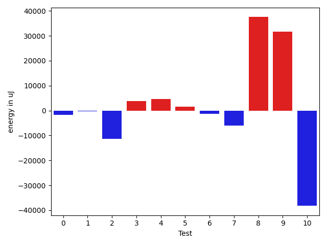

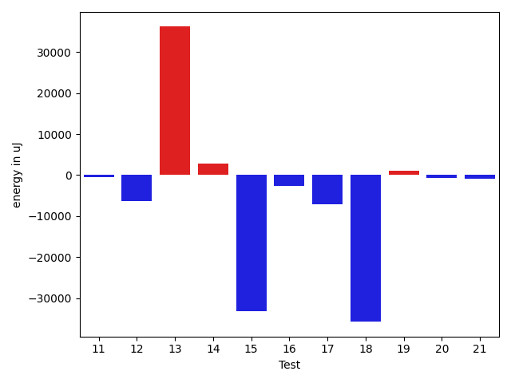

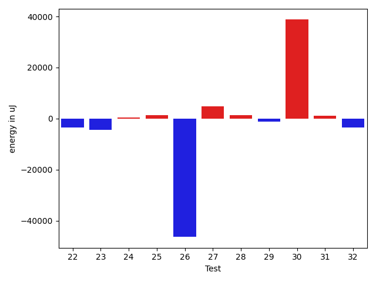

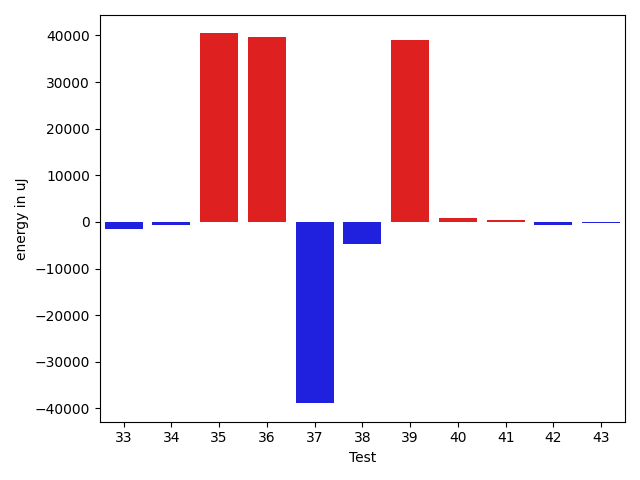

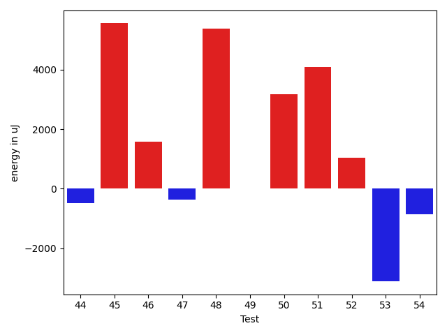

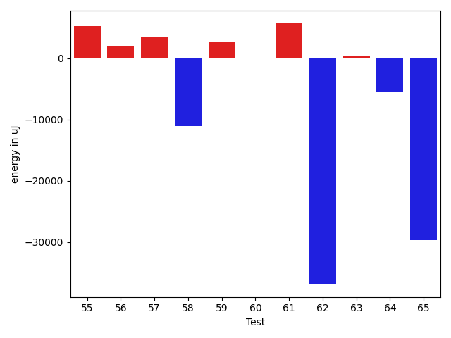

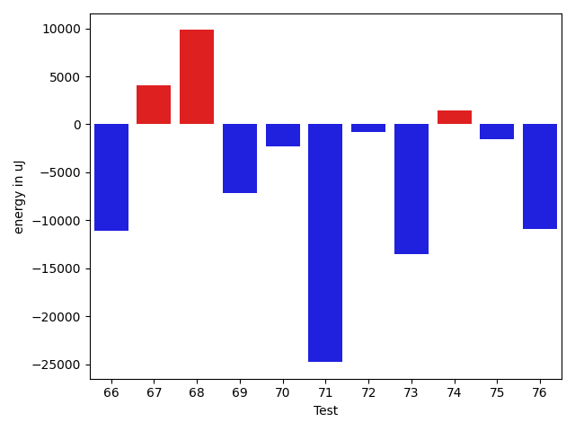

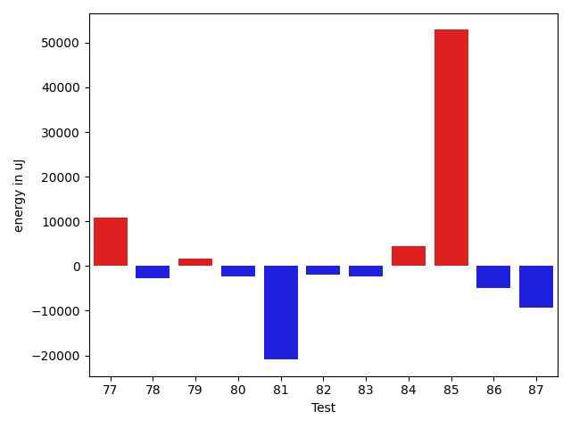

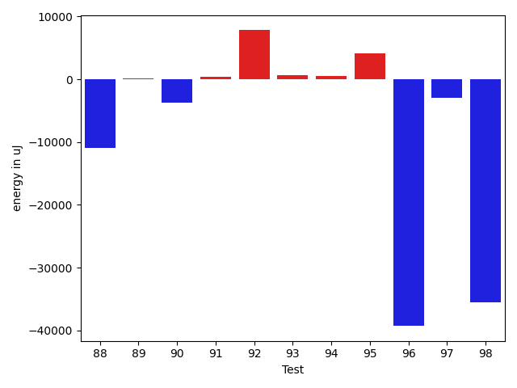

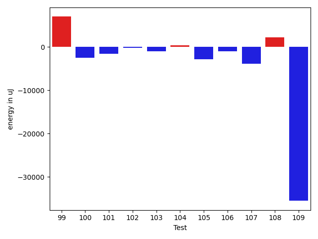

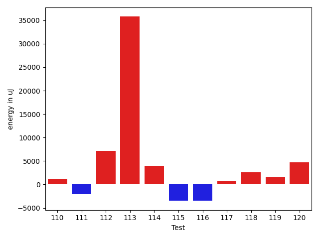

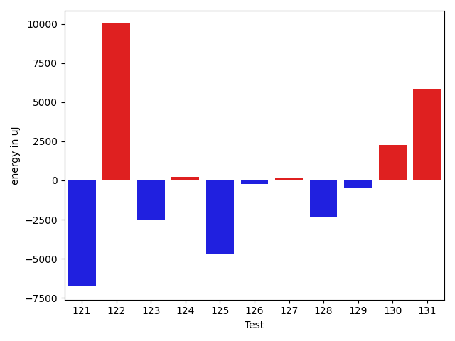

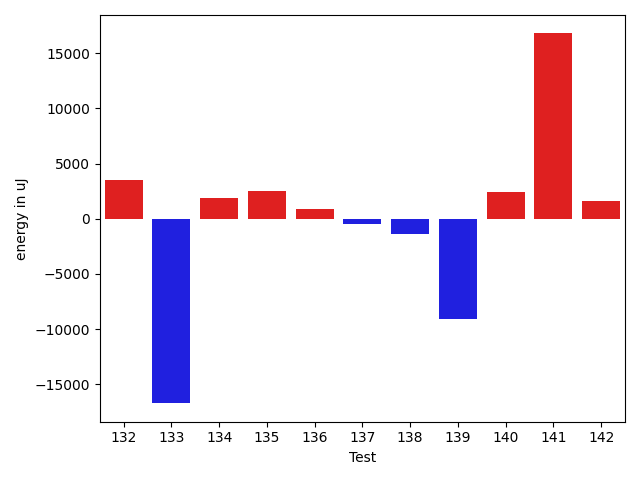

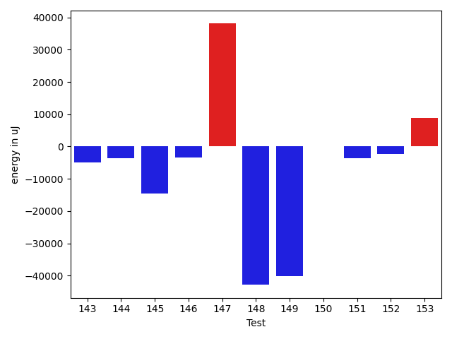

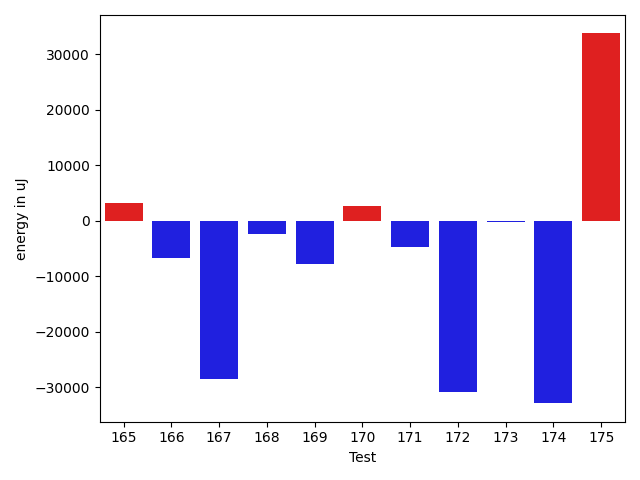

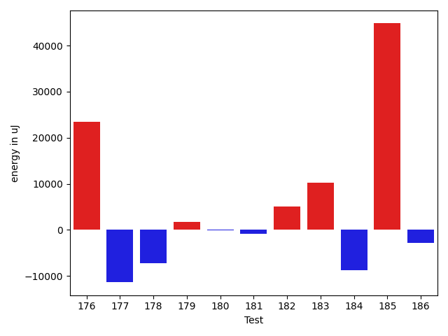

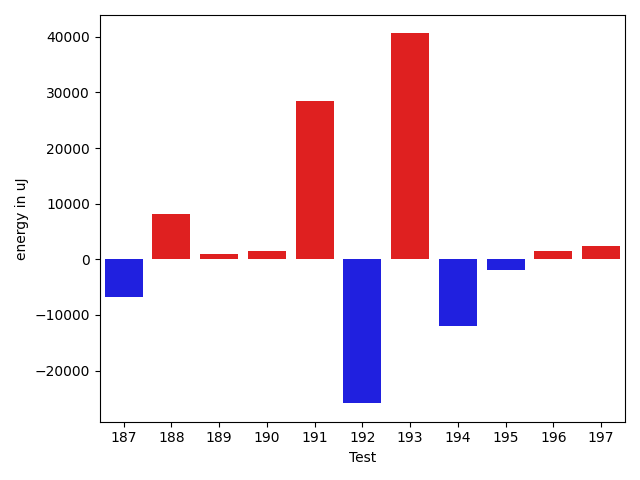

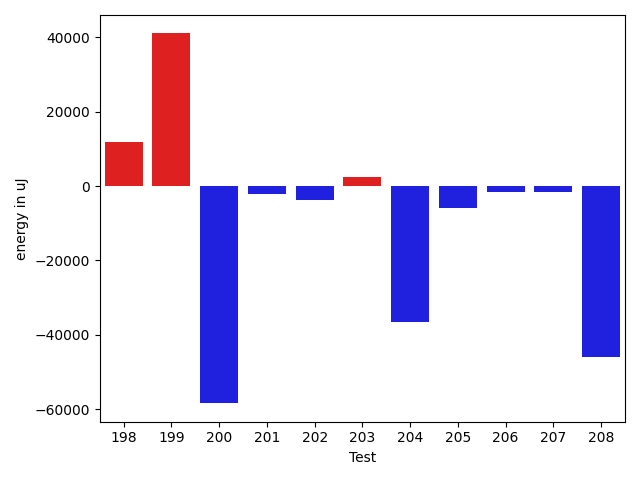

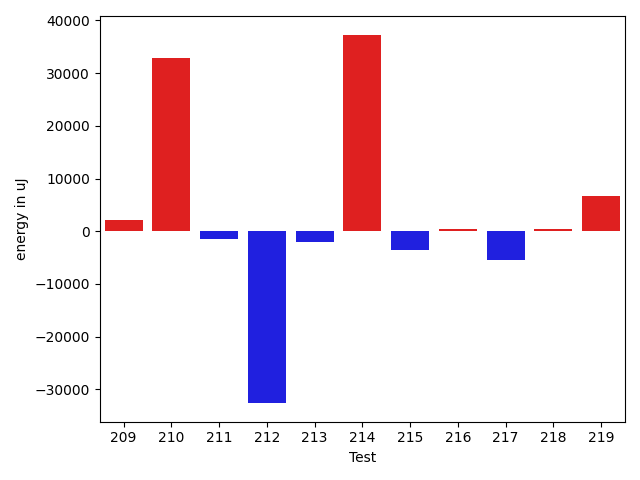

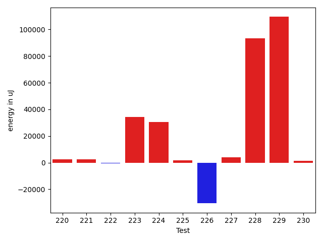

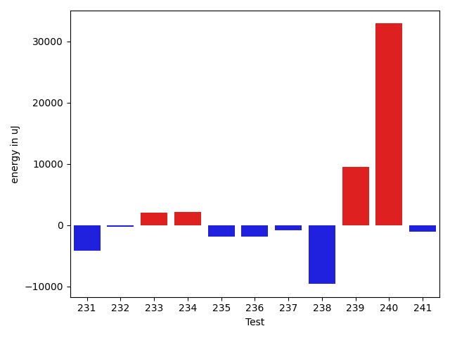

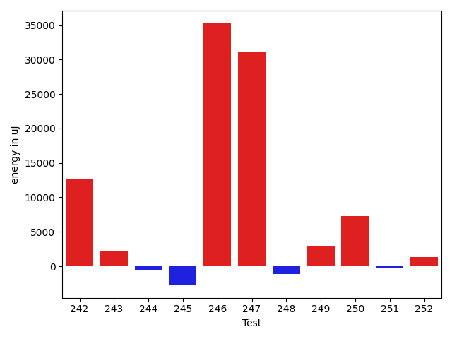

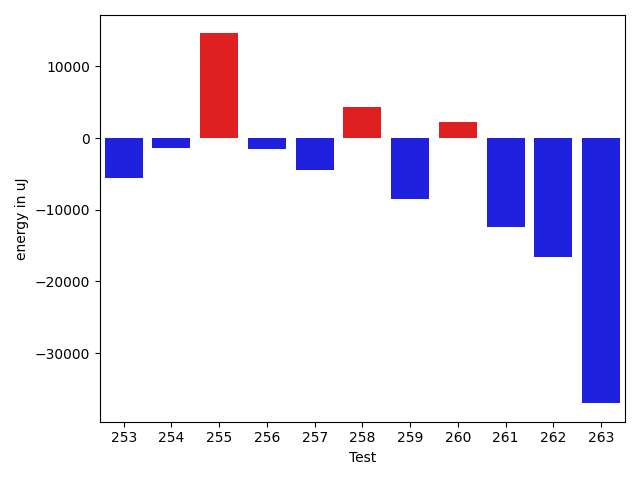

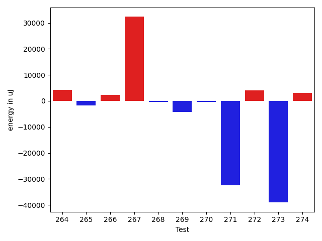

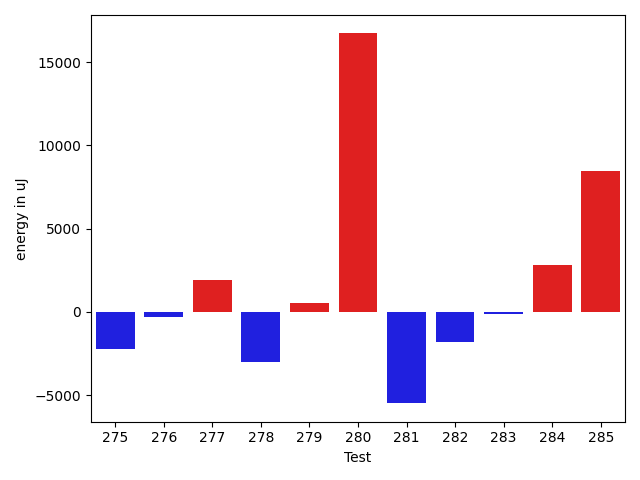

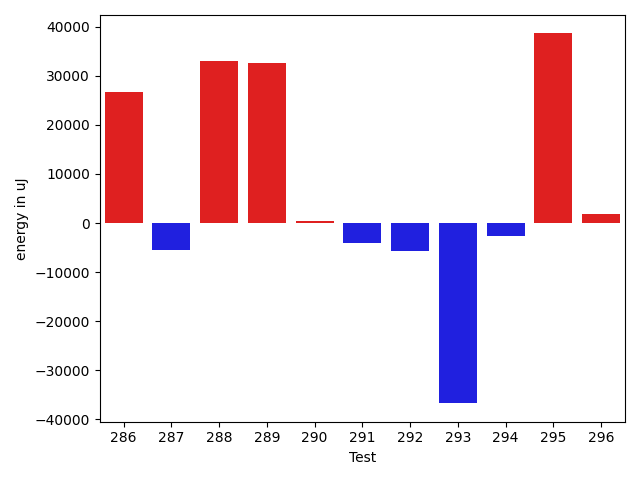

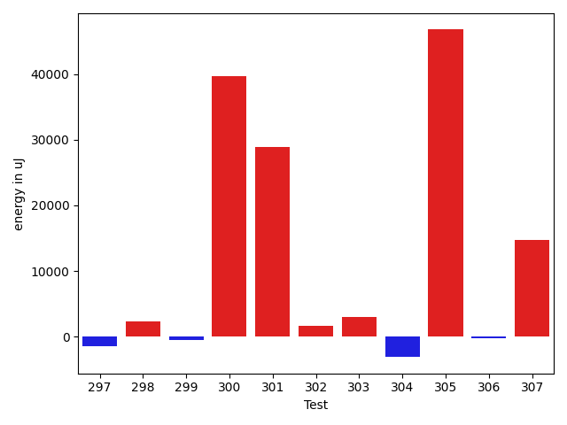

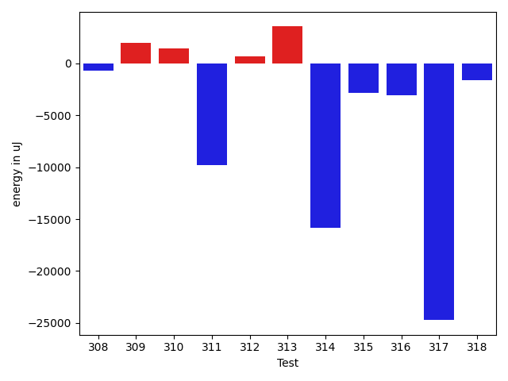

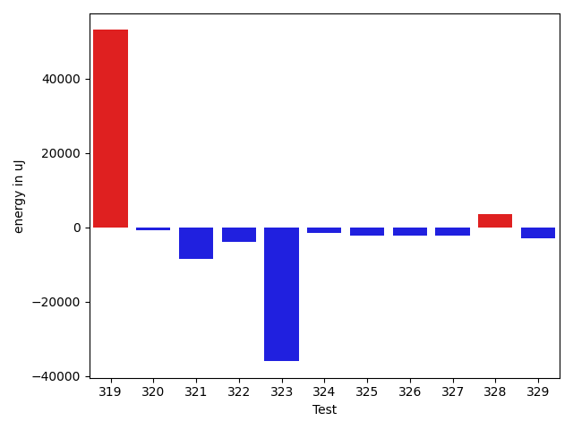

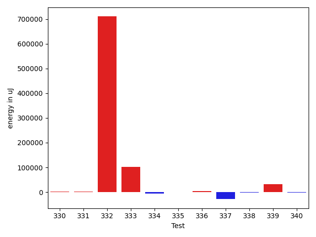

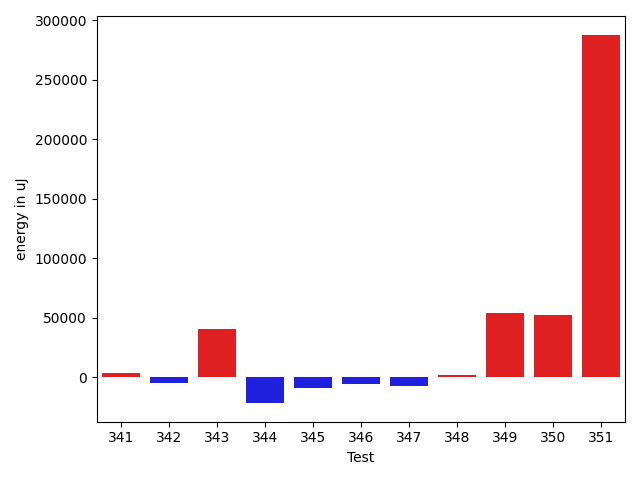

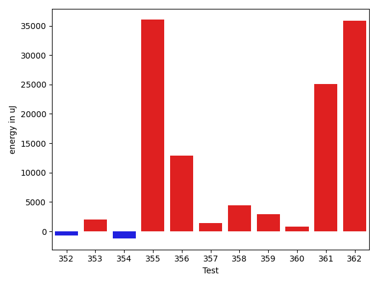

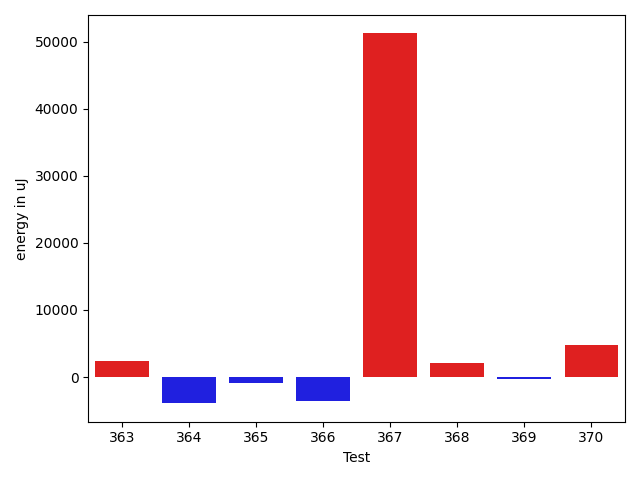

| ID | EnergyV1 | EnergyV2 | DeltaEnergy | σV1 | %σV1 | σV2 | %σV2 |
| --- | --- | --- | --- | --- | --- | --- | --- |
| 0 | 45471 | 43701 | -1770 | 17733.64 | 39.00 | 23724.93 | 54.29 |
| 1 | 156555 | 156250 | -305 | 17072.36 | 10.91 | 68151.93 | 43.62 |
| 2 | 179320 | 168030 | -11290 | 30998.24 | 17.29 | 8280.92 | 4.93 |
| 3 | 166198 | 169983 | 3785 | 24738.11 | 14.88 | 17981.31 | 10.58 |
| 4 | 147583 | 152222 | 4639 | 14721.03 | 9.97 | 14787.88 | 9.71 |
| 5 | 124999 | 126648 | 1649 | 20488.50 | 16.39 | 19269.55 | 15.22 |
| 6 | 82947 | 81603 | -1344 | 24324.76 | 29.33 | 147409.74 | 180.64 |
| 7 | 180481 | 174499 | -5982 | 22652.30 | 12.55 | 31411.53 | 18.00 |
| 8 | 119628 | 157104 | 37476 | 23635.62 | 19.76 | 18412.47 | 11.72 |
| 9 | 44006 | 75561 | 31555 | 21068.60 | 47.88 | 18777.23 | 24.85 |
| 10 | 202575 | 164367 | -38208 | 24500.05 | 12.09 | 19303.06 | 11.74 |
| 11 | 46325 | 45776 | -549 | 21893.99 | 47.26 | 21958.55 | 47.97 |
| 12 | 89599 | 83191 | -6408 | 18602.25 | 20.76 | 18820.88 | 22.62 |
| 13 | 45654 | 81848 | 36194 | 23021.85 | 50.43 | 21245.51 | 25.96 |
| 14 | 117797 | 120666 | 2869 | 22137.04 | 18.79 | 18608.77 | 15.42 |
| 15 | 77148 | 44006 | -33142 | 17529.07 | 22.72 | 21084.49 | 47.91 |
| 16 | 47974 | 45288 | -2686 | 21697.46 | 45.23 | 19347.64 | 42.72 |
| 17 | 124877 | 117676 | -7201 | 20639.96 | 16.53 | 20699.15 | 17.59 |
| 18 | 152649 | 116882 | -35767 | 18811.58 | 12.32 | 18650.76 | 15.96 |
| 19 | 89111 | 90149 | 1038 | 12015.04 | 13.48 | 22012.24 | 24.42 |
| 20 | 45654 | 45043 | -611 | 2423.97 | 5.31 | 3189.01 | 7.08 |
| 21 | 85144 | 84229 | -915 | 27312.18 | 32.08 | 28413.79 | 33.73 |
| 22 | 46508 | 43030 | -3478 | 3025.96 | 6.51 | 4534.42 | 10.54 |
| 23 | 47730 | 43396 | -4334 | 15505.53 | 32.49 | 4692.80 | 10.81 |
| 24 | 119568 | 120055 | 487 | 19992.83 | 16.72 | 21756.54 | 18.12 |
| 25 | 80139 | 81420 | 1281 | 3263.96 | 4.07 | 29118.54 | 35.76 |
| 26 | 697508 | 651122 | -46386 | 47756.48 | 6.85 | 58293.20 | 8.95 |
| 27 | 75622 | 80322 | 4700 | 24913.52 | 32.94 | 17521.14 | 21.81 |
| 28 | 88806 | 90088 | 1282 | 16495.33 | 18.57 | 15431.99 | 17.13 |
| 29 | 44739 | 43640 | -1099 | 20397.63 | 45.59 | 13471.45 | 30.87 |
| 30 | 46204 | 84961 | 38757 | 21773.89 | 47.13 | 19487.82 | 22.94 |
| 31 | 44495 | 45532 | 1037 | 14011.20 | 31.49 | 18734.12 | 41.14 |
| 32 | 48950 | 45471 | -3479 | 24514.07 | 50.08 | 20141.54 | 44.30 |
| 33 | 78369 | 76843 | -1526 | 12778.58 | 16.31 | 19017.30 | 24.75 |
| 34 | 41077 | 40405 | -672 | 2648.97 | 6.45 | 2961.97 | 7.33 |
| 35 | 47425 | 87829 | 40404 | 19512.66 | 41.14 | 15225.51 | 17.34 |
| 36 | 46203 | 85876 | 39673 | 22000.84 | 47.62 | 22786.68 | 26.53 |
| 37 | 86242 | 47363 | -38879 | 29051.50 | 33.69 | 18096.79 | 38.21 |
| 38 | 122925 | 118164 | -4761 | 36237.24 | 29.48 | 20259.20 | 17.14 |
| 39 | 48401 | 87463 | 39062 | 22984.85 | 47.49 | 22329.13 | 25.53 |
| 40 | 39917 | 40772 | 855 | 2304.95 | 5.77 | 18515.57 | 45.41 |
| 41 | 38208 | 38696 | 488 | 14310.65 | 37.45 | 15739.82 | 40.68 |
| 42 | 46753 | 46020 | -733 | 15694.32 | 33.57 | 14118.98 | 30.68 |
| 43 | 47912 | 47668 | -244 | 20762.45 | 43.33 | 19519.16 | 40.95 |
| 44 | 47607 | 47119 | -488 | 18018.24 | 37.85 | 22003.81 | 46.70 |
| 45 | 39611 | 45166 | 5555 | 19673.22 | 49.67 | 20582.51 | 45.57 |
| 46 | 46082 | 47669 | 1587 | 17650.95 | 38.30 | 16631.33 | 34.89 |
| 47 | 46570 | 46203 | -367 | 2189.56 | 4.70 | 2414.95 | 5.23 |
| 48 | 80384 | 85754 | 5370 | 21436.50 | 26.67 | 17672.82 | 20.61 |
| 49 | 39490 | 39490 | 0 | 20897.64 | 52.92 | 16570.16 | 41.96 |
| 50 | 131104 | 134277 | 3173 | 5453.89 | 4.16 | 6614.12 | 4.93 |
| 51 | 213622 | 217711 | 4089 | 18315.44 | 8.57 | 14945.82 | 6.86 |
| 52 | 74158 | 75196 | 1038 | 11975.44 | 16.15 | 2812.65 | 3.74 |
| 53 | 112853 | 109741 | -3112 | 16757.01 | 14.85 | 17983.28 | 16.39 |
| 54 | 39307 | 38452 | -855 | 10578.15 | 26.91 | 15905.32 | 41.36 |
| 55 | 90698 | 95947 | 5249 | 21147.27 | 23.32 | 37289.90 | 38.87 |
| 56 | 73730 | 75806 | 2076 | 17433.59 | 23.65 | 16049.44 | 21.17 |
| 57 | 184203 | 187683 | 3480 | 27432.69 | 14.89 | 34023.01 | 18.13 |
| 58 | 176391 | 165282 | -11109 | 16432.74 | 9.32 | 15906.25 | 9.62 |
| 59 | 230346 | 233031 | 2685 | 17412.74 | 7.56 | 15407.00 | 6.61 |
| 60 | 114745 | 114807 | 62 | 20340.06 | 17.73 | 15901.64 | 13.85 |
| 61 | 244018 | 249695 | 5677 | 24913.43 | 10.21 | 26487.45 | 10.61 |
| 62 | 117981 | 81115 | -36866 | 22621.01 | 19.17 | 41812.98 | 51.55 |
| 63 | 111572 | 112060 | 488 | 15867.32 | 14.22 | 21843.45 | 19.49 |
| 64 | 122498 | 117126 | -5372 | 27570.70 | 22.51 | 11659.05 | 9.95 |
| 65 | 167907 | 138244 | -29663 | 20758.37 | 12.36 | 28507.96 | 20.62 |
| 66 | 132446 | 121338 | -11108 | 25985.45 | 19.62 | 18496.03 | 15.24 |
| 67 | 131897 | 135986 | 4089 | 23298.92 | 17.66 | 23802.74 | 17.50 |
| 68 | 111267 | 121093 | 9826 | 46731.44 | 42.00 | 46648.75 | 38.52 |
| 69 | 129333 | 122192 | -7141 | 22569.45 | 17.45 | 21581.37 | 17.66 |
| 70 | 115112 | 112853 | -2259 | 17868.91 | 15.52 | 16834.89 | 14.92 |
| 71 | 1664791 | 1640011 | -24780 | 108550.39 | 6.52 | 62116.98 | 3.79 |
| 72 | 125244 | 124451 | -793 | 32970.92 | 26.33 | 24215.87 | 19.46 |
| 73 | 180359 | 166808 | -13551 | 51970.73 | 28.82 | 100245.16 | 60.10 |
| 74 | 39429 | 40832 | 1403 | 3684.53 | 9.34 | 5012.79 | 12.28 |
| 75 | 363525 | 361937 | -1588 | 32168.18 | 8.85 | 30936.14 | 8.55 |
| 76 | 278198 | 267333 | -10865 | 34895.87 | 12.54 | 34292.65 | 12.83 |
| 77 | 167908 | 178710 | 10802 | 27458.25 | 16.35 | 21005.13 | 11.75 |
| 78 | 126342 | 123596 | -2746 | 27733.26 | 21.95 | 12690.76 | 10.27 |
| 79 | 290954 | 292663 | 1709 | 20116.20 | 6.91 | 36419.62 | 12.44 |
| 80 | 117858 | 115600 | -2258 | 7230.62 | 6.14 | 4541.93 | 3.93 |
| 81 | 102600 | 81664 | -20936 | 13948.94 | 13.60 | 18684.88 | 22.88 |
| 82 | 92529 | 90515 | -2014 | 23895.41 | 25.82 | 9544.39 | 10.54 |
| 83 | 45471 | 43213 | -2258 | 14599.81 | 32.11 | 12497.60 | 28.92 |
| 84 | 79468 | 83862 | 4394 | 21137.29 | 26.60 | 20606.52 | 24.57 |
| 85 | 1775020 | 1827876 | 52856 | 206058.66 | 11.61 | 196548.38 | 10.75 |
| 86 | 83618 | 78735 | -4883 | 17898.24 | 21.40 | 17009.03 | 21.60 |
| 87 | 419067 | 409667 | -9400 | 94505.29 | 22.55 | 89355.84 | 21.81 |
| 88 | 173583 | 162720 | -10863 | 18170.66 | 10.47 | 20638.35 | 12.68 |
| 89 | 45776 | 45959 | 183 | 22505.79 | 49.17 | 21492.54 | 46.76 |
| 90 | 131897 | 128235 | -3662 | 4787.09 | 3.63 | 6243.80 | 4.87 |
| 91 | 74767 | 75195 | 428 | 16309.14 | 21.81 | 18717.88 | 24.89 |
| 92 | 70251 | 78125 | 7874 | 16557.01 | 23.57 | 20941.69 | 26.81 |
| 93 | 137207 | 137817 | 610 | 3314.19 | 2.42 | 21995.51 | 15.96 |
| 94 | 111450 | 111939 | 489 | 2199.67 | 1.97 | 2081.78 | 1.86 |
| 95 | 89294 | 93445 | 4151 | 19916.83 | 22.30 | 22908.02 | 24.51 |
| 96 | 85632 | 46326 | -39306 | 79433.50 | 92.76 | 21022.55 | 45.38 |
| 97 | 92041 | 89051 | -2990 | 15957.55 | 17.34 | 4910.48 | 5.51 |
| 98 | 79650 | 44128 | -35522 | 16455.40 | 20.66 | 19959.27 | 45.23 |
| 99 | 138061 | 145080 | 7019 | 16249.77 | 11.77 | 21231.68 | 14.63 |
| 100 | 122436 | 119934 | -2502 | 8681.32 | 7.09 | 8640.93 | 7.20 |
| 101 | 44006 | 42420 | -1586 | 19077.41 | 43.35 | 20152.52 | 47.51 |
| 102 | 165221 | 165039 | -182 | 12298.35 | 7.44 | 9850.52 | 5.97 |
| 103 | 86181 | 85205 | -976 | 22331.67 | 25.91 | 22397.57 | 26.29 |
| 104 | 151855 | 152282 | 427 | 21576.44 | 14.21 | 18056.08 | 11.86 |
| 105 | 87341 | 84472 | -2869 | 29407.41 | 33.67 | 3103.34 | 3.67 |
| 106 | 112121 | 111145 | -976 | 12286.62 | 10.96 | 17709.40 | 15.93 |
| 107 | 125854 | 121948 | -3906 | 22775.78 | 18.10 | 23906.75 | 19.60 |
| 108 | 123535 | 125793 | 2258 | 20396.26 | 16.51 | 17061.81 | 13.56 |
| 109 | 166076 | 130554 | -35522 | 34549.70 | 20.80 | 34460.10 | 26.40 |
| 110 | 162903 | 164062 | 1159 | 17649.31 | 10.83 | 15350.53 | 9.36 |
| 111 | 78369 | 76294 | -2075 | 22699.56 | 28.96 | 16621.69 | 21.79 |
| 112 | 171753 | 178893 | 7140 | 9300.10 | 5.41 | 29870.07 | 16.70 |
| 113 | 43762 | 79528 | 35766 | 19158.06 | 43.78 | 20572.07 | 25.87 |
| 114 | 202270 | 206237 | 3967 | 35947.00 | 17.77 | 15482.98 | 7.51 |
| 115 | 122986 | 119507 | -3479 | 23039.47 | 18.73 | 16673.16 | 13.95 |
| 116 | 142273 | 138794 | -3479 | 25208.02 | 17.72 | 17721.12 | 12.77 |
| 117 | 157837 | 158569 | 732 | 14307.18 | 9.06 | 19079.28 | 12.03 |
| 118 | 114563 | 117126 | 2563 | 14113.20 | 12.32 | 10662.62 | 9.10 |
| 119 | 42175 | 43701 | 1526 | 20961.37 | 49.70 | 19312.93 | 44.19 |
| 120 | 178466 | 183227 | 4761 | 24063.19 | 13.48 | 31075.69 | 16.96 |
| 121 | 133910 | 127136 | -6774 | 18852.67 | 14.08 | 14504.35 | 11.41 |
| 122 | 177979 | 187987 | 10008 | 25489.46 | 14.32 | 29439.35 | 15.66 |
| 123 | 42236 | 39733 | -2503 | 4039.23 | 9.56 | 12540.00 | 31.56 |
| 124 | 122253 | 122497 | 244 | 9983.68 | 8.17 | 18905.13 | 15.43 |
| 125 | 46692 | 41992 | -4700 | 22346.93 | 47.86 | 22843.02 | 54.40 |
| 126 | 123901 | 123657 | -244 | 3016.86 | 2.43 | 14372.36 | 11.62 |
| 127 | 113220 | 113404 | 184 | 5723.97 | 5.06 | 5526.01 | 4.87 |
| 128 | 90332 | 87951 | -2381 | 14940.61 | 16.54 | 4679.41 | 5.32 |
| 129 | 93688 | 93201 | -487 | 22236.31 | 23.73 | 28072.58 | 30.12 |
| 130 | 164123 | 166381 | 2258 | 27372.32 | 16.68 | 23701.74 | 14.25 |
| 131 | 135375 | 141235 | 5860 | 23400.01 | 17.29 | 44790.38 | 31.71 |
| 132 | 154479 | 157959 | 3480 | 20102.29 | 13.01 | 18183.31 | 11.51 |
| 133 | 187621 | 170898 | -16723 | 20706.55 | 11.04 | 19073.76 | 11.16 |
| 134 | 39551 | 41443 | 1892 | 18210.43 | 46.04 | 19018.48 | 45.89 |
| 135 | 79773 | 82275 | 2502 | 14815.06 | 18.57 | 3983.42 | 4.84 |
| 136 | 39063 | 39978 | 915 | 15134.71 | 38.74 | 14777.99 | 36.97 |
| 137 | 125304 | 124816 | -488 | 25792.58 | 20.58 | 23722.37 | 19.01 |
| 138 | 130005 | 128601 | -1404 | 20612.64 | 15.86 | 22249.55 | 17.30 |
| 139 | 92529 | 83435 | -9094 | 19691.40 | 21.28 | 20742.18 | 24.86 |
| 140 | 328979 | 331359 | 2380 | 28571.20 | 8.68 | 34775.75 | 10.49 |
| 141 | 266906 | 283691 | 16785 | 26000.10 | 9.74 | 23695.18 | 8.35 |
| 142 | 141846 | 143433 | 1587 | 23809.53 | 16.79 | 30982.13 | 21.60 |
| 143 | 135132 | 130127 | -5005 | 5616.60 | 4.16 | 16027.16 | 12.32 |
| 144 | 122009 | 118347 | -3662 | 16080.15 | 13.18 | 22396.57 | 18.92 |
| 145 | 137878 | 123413 | -14465 | 17118.39 | 12.42 | 22761.16 | 18.44 |
| 146 | 118530 | 115112 | -3418 | 15918.03 | 13.43 | 4774.13 | 4.15 |
| 147 | 138550 | 176635 | 38085 | 24386.79 | 17.60 | 16664.61 | 9.43 |
| 148 | 177063 | 134216 | -42847 | 20785.47 | 11.74 | 14953.15 | 11.14 |
| 149 | 164916 | 124817 | -40099 | 23895.20 | 14.49 | 24571.49 | 19.69 |
| 150 | 137329 | 137389 | 60 | 21149.94 | 15.40 | 11812.88 | 8.60 |
| 151 | 142456 | 138915 | -3541 | 22669.53 | 15.91 | 28762.44 | 20.71 |
| 152 | 168396 | 166016 | -2380 | 18885.76 | 11.22 | 44353.89 | 26.72 |
| 153 | 126708 | 135559 | 8851 | 24950.48 | 19.69 | 17381.81 | 12.82 |
| 154 | 39917 | 40893 | 976 | 17322.74 | 43.40 | 19842.92 | 48.52 |
| 155 | 114318 | 112732 | -1586 | 2943.56 | 2.57 | 11575.89 | 10.27 |
| 156 | 143981 | 112366 | -31615 | 16671.21 | 11.58 | 19641.56 | 17.48 |
| 157 | 191406 | 192931 | 1525 | 20773.33 | 10.85 | 18236.55 | 9.45 |
| 158 | 118897 | 113708 | -5189 | 9537.36 | 8.02 | 17211.12 | 15.14 |
| 159 | 116576 | 121154 | 4578 | 18111.75 | 15.54 | 7745.55 | 6.39 |
| 160 | 236693 | 240356 | 3663 | 20349.29 | 8.60 | 23658.15 | 9.84 |
| 161 | 170105 | 167846 | -2259 | 19671.12 | 11.56 | 29856.30 | 17.79 |
| 162 | 160828 | 154907 | -5921 | 14223.82 | 8.84 | 23691.40 | 15.29 |
| 163 | 129211 | 123168 | -6043 | 20624.67 | 15.96 | 15675.48 | 12.73 |
| 164 | 131408 | 121033 | -10375 | 16111.87 | 12.26 | 11846.18 | 9.79 |
| 165 | 230224 | 233398 | 3174 | 11339.87 | 4.93 | 16948.85 | 7.26 |
| 166 | 132751 | 125976 | -6775 | 12058.40 | 9.08 | 5360.31 | 4.26 |
| 167 | 137267 | 108764 | -28503 | 25918.84 | 18.88 | 24667.69 | 22.68 |
| 168 | 167663 | 165222 | -2441 | 22388.39 | 13.35 | 20150.79 | 12.20 |
| 169 | 171570 | 163757 | -7813 | 23399.12 | 13.64 | 25480.57 | 15.56 |
| 170 | 41870 | 44434 | 2564 | 3706.20 | 8.85 | 3009.73 | 6.77 |
| 171 | 46386 | 41687 | -4699 | 16950.18 | 36.54 | 18531.37 | 44.45 |
| 172 | 123229 | 92468 | -30761 | 13260.81 | 10.76 | 17788.47 | 19.24 |
| 173 | 136657 | 136474 | -183 | 6236.24 | 4.56 | 11009.38 | 8.07 |
| 174 | 203308 | 170471 | -32837 | 46063.33 | 22.66 | 22156.95 | 13.00 |
| 175 | 140197 | 173889 | 33692 | 23052.56 | 16.44 | 9563.29 | 5.50 |
| 176 | 179931 | 203368 | 23437 | 17020.27 | 9.46 | 25218.87 | 12.40 |
| 177 | 137879 | 126525 | -11354 | 26927.00 | 19.53 | 17147.71 | 13.55 |
| 178 | 159179 | 151977 | -7202 | 21735.46 | 13.65 | 12206.39 | 8.03 |
| 179 | 117371 | 119080 | 1709 | 4013.56 | 3.42 | 24901.75 | 20.91 |
| 180 | 40650 | 40527 | -123 | 3745.89 | 9.21 | 1665.86 | 4.11 |
| 181 | 132812 | 131897 | -915 | 23340.70 | 17.57 | 23615.02 | 17.90 |
| 182 | 134948 | 140075 | 5127 | 21133.26 | 15.66 | 23409.58 | 16.71 |
| 183 | 380126 | 390380 | 10254 | 37215.72 | 9.79 | 37538.50 | 9.62 |
| 184 | 215087 | 206420 | -8667 | 22429.82 | 10.43 | 20325.40 | 9.85 |
| 185 | 270812 | 315612 | 44800 | 26109.64 | 9.64 | 37103.76 | 11.76 |
| 186 | 187866 | 184998 | -2868 | 133384.02 | 71.00 | 22492.28 | 12.16 |
| 187 | 173034 | 166320 | -6714 | 13455.16 | 7.78 | 14532.03 | 8.74 |
| 188 | 116455 | 124633 | 8178 | 19021.88 | 16.33 | 9918.51 | 7.96 |
| 189 | 73608 | 74646 | 1038 | 20196.66 | 27.44 | 21043.05 | 28.19 |
| 190 | 218627 | 220153 | 1526 | 1962.14 | 0.90 | 17124.87 | 7.78 |
| 191 | 235473 | 263976 | 28503 | 22957.69 | 9.75 | 12694.91 | 4.81 |
| 192 | 265991 | 240112 | -25879 | 24886.91 | 9.36 | 24742.23 | 10.30 |
| 193 | 176818 | 217407 | 40589 | 7515.26 | 4.25 | 20812.80 | 9.57 |
| 194 | 277160 | 265197 | -11963 | 15840.31 | 5.72 | 25897.77 | 9.77 |
| 195 | 197753 | 195739 | -2014 | 19049.47 | 9.63 | 11495.31 | 5.87 |
| 196 | 182861 | 184386 | 1525 | 3043.42 | 1.66 | 21462.42 | 11.64 |
| 197 | 271118 | 273498 | 2380 | 13107.61 | 4.83 | 21144.40 | 7.73 |
| 198 | 722227 | 734190 | 11963 | 39878.65 | 5.52 | 24449.06 | 3.33 |
| 199 | 321166 | 362182 | 41016 | 18243.87 | 5.68 | 24406.63 | 6.74 |
| 200 | 1105221 | 1046811 | -58410 | 68785.48 | 6.22 | 41063.01 | 3.92 |
| 201 | 41626 | 39612 | -2014 | 21510.43 | 51.68 | 15739.02 | 39.73 |
| 202 | 47119 | 43396 | -3723 | 20999.81 | 44.57 | 19368.51 | 44.63 |
| 203 | 242187 | 244689 | 2502 | 17685.74 | 7.30 | 15645.20 | 6.39 |
| 204 | 76721 | 40161 | -36560 | 18609.36 | 24.26 | 19700.76 | 49.05 |
| 205 | 85144 | 79345 | -5799 | 20392.64 | 23.95 | 21904.81 | 27.61 |
| 206 | 90148 | 88623 | -1525 | 41705.64 | 46.26 | 30087.84 | 33.95 |
| 207 | 41259 | 39672 | -1587 | 12364.03 | 29.97 | 1991.47 | 5.02 |
| 208 | 93688 | 47729 | -45959 | 21613.61 | 23.07 | 22075.88 | 46.25 |
| 209 | 38574 | 40772 | 2198 | 3901.61 | 10.11 | 11045.16 | 27.09 |
| 210 | 141479 | 174377 | 32898 | 24998.83 | 17.67 | 22414.85 | 12.85 |
| 211 | 76843 | 75317 | -1526 | 16083.57 | 20.93 | 4395.51 | 5.84 |
| 212 | 76050 | 43396 | -32654 | 17096.20 | 22.48 | 19873.36 | 45.80 |
| 213 | 93567 | 91553 | -2014 | 19029.53 | 20.34 | 22190.46 | 24.24 |
| 214 | 46631 | 83923 | 37292 | 23289.42 | 49.94 | 21837.17 | 26.02 |
| 215 | 46021 | 42480 | -3541 | 21334.46 | 46.36 | 20236.44 | 47.64 |
| 216 | 44250 | 44738 | 488 | 15480.62 | 34.98 | 2455.08 | 5.49 |
| 217 | 91553 | 86059 | -5494 | 45068.02 | 49.23 | 35905.10 | 41.72 |
| 218 | 77148 | 77514 | 366 | 18229.02 | 23.63 | 18487.03 | 23.85 |
| 219 | 72143 | 78857 | 6714 | 20258.76 | 28.08 | 19164.00 | 24.30 |
| 220 | 86547 | 89050 | 2503 | 18622.56 | 21.52 | 31227.64 | 35.07 |
| 221 | 85082 | 87585 | 2503 | 26645.74 | 31.32 | 18430.17 | 21.04 |
| 222 | 89599 | 88928 | -671 | 18887.90 | 21.08 | 31344.11 | 35.25 |
| 223 | 116638 | 150878 | 34240 | 18110.05 | 15.53 | 19670.22 | 13.04 |
| 224 | 51635 | 82275 | 30640 | 23680.84 | 45.86 | 15992.29 | 19.44 |
| 225 | 83130 | 84717 | 1587 | 20378.42 | 24.51 | 29209.64 | 34.48 |
| 226 | 70800 | 40283 | -30517 | 18322.97 | 25.88 | 18137.03 | 45.02 |
| 227 | 83985 | 88012 | 4027 | 28220.86 | 33.60 | 21869.48 | 24.85 |
| 228 | 1693294 | 1786738 | 93444 | 140697.66 | 8.31 | 151973.93 | 8.51 |
| 229 | 2076594 | 2186029 | 109435 | 124029.04 | 5.97 | 116513.94 | 5.33 |
| 230 | 44738 | 46204 | 1466 | 2084.65 | 4.66 | 1254.88 | 2.72 |
| 231 | 87463 | 83313 | -4150 | 4378.47 | 5.01 | 17524.58 | 21.03 |
| 232 | 118286 | 118041 | -245 | 22053.97 | 18.64 | 32610.93 | 27.63 |
| 233 | 134704 | 136718 | 2014 | 11123.11 | 8.26 | 18269.09 | 13.36 |
| 234 | 80078 | 82214 | 2136 | 21386.08 | 26.71 | 15207.89 | 18.50 |
| 235 | 85021 | 83129 | -1892 | 22841.64 | 26.87 | 20657.66 | 24.85 |
| 236 | 48401 | 46570 | -1831 | 2222.37 | 4.59 | 3834.90 | 8.23 |
| 237 | 40955 | 40100 | -855 | 19210.65 | 46.91 | 19670.64 | 49.05 |
| 238 | 269470 | 259887 | -9583 | 27424.76 | 10.18 | 40653.40 | 15.64 |
| 239 | 122498 | 131958 | 9460 | 22772.47 | 18.59 | 51904.60 | 39.33 |
| 240 | 136047 | 168945 | 32898 | 18728.62 | 13.77 | 23361.84 | 13.83 |
| 241 | 42541 | 41442 | -1099 | 3790.81 | 8.91 | 13369.88 | 32.26 |
| 242 | 168212 | 180847 | 12635 | 16834.61 | 10.01 | 37034.10 | 20.48 |
| 243 | 40710 | 42846 | 2136 | 1373.89 | 3.37 | 3291.00 | 7.68 |
| 244 | 137085 | 136535 | -550 | 24409.64 | 17.81 | 20050.63 | 14.69 |
| 245 | 48584 | 45899 | -2685 | 20386.98 | 41.96 | 21810.21 | 47.52 |
| 246 | 46020 | 81237 | 35217 | 22568.37 | 49.04 | 22497.36 | 27.69 |
| 247 | 81482 | 112610 | 31128 | 20840.71 | 25.58 | 15101.40 | 13.41 |
| 248 | 91431 | 90332 | -1099 | 14843.82 | 16.23 | 146501.21 | 162.18 |
| 249 | 138245 | 141113 | 2868 | 21570.32 | 15.60 | 21949.04 | 15.55 |
| 250 | 183838 | 191162 | 7324 | 18660.05 | 10.15 | 17015.99 | 8.90 |
| 251 | 90393 | 90088 | -305 | 17681.30 | 19.56 | 14989.09 | 16.64 |
| 252 | 88318 | 89660 | 1342 | 18636.02 | 21.10 | 18244.04 | 20.35 |
| 253 | 90271 | 84655 | -5616 | 20614.01 | 22.84 | 5395.77 | 6.37 |
| 254 | 162842 | 161498 | -1344 | 21092.75 | 12.95 | 17046.99 | 10.56 |
| 255 | 261535 | 276122 | 14587 | 47159.95 | 18.03 | 21245.04 | 7.69 |
| 256 | 85205 | 83679 | -1526 | 4820.88 | 5.66 | 13946.15 | 16.67 |
| 257 | 90820 | 86304 | -4516 | 3428.57 | 3.78 | 21766.52 | 25.22 |
| 258 | 133667 | 137939 | 4272 | 16468.04 | 12.32 | 18747.75 | 13.59 |
| 259 | 216003 | 207458 | -8545 | 21493.47 | 9.95 | 21663.07 | 10.44 |
| 260 | 178405 | 180602 | 2197 | 24671.58 | 13.83 | 23088.12 | 12.78 |
| 261 | 136597 | 124145 | -12452 | 19651.19 | 14.39 | 22514.36 | 18.14 |
| 262 | 179809 | 163268 | -16541 | 22131.73 | 12.31 | 17908.91 | 10.97 |
| 263 | 308227 | 271240 | -36987 | 19732.33 | 6.40 | 33099.88 | 12.20 |
| 264 | 218872 | 223205 | 4333 | 23724.36 | 10.84 | 20745.87 | 9.29 |
| 265 | 89294 | 87646 | -1648 | 15366.16 | 17.21 | 18171.73 | 20.73 |
| 266 | 186706 | 188965 | 2259 | 40860.08 | 21.88 | 35871.23 | 18.98 |
| 267 | 44860 | 77209 | 32349 | 21937.79 | 48.90 | 15147.84 | 19.62 |
| 268 | 178528 | 178222 | -306 | 17577.23 | 9.85 | 18638.48 | 10.46 |
| 269 | 137573 | 133362 | -4211 | 19914.37 | 14.48 | 21413.14 | 16.06 |
| 270 | 88134 | 87707 | -427 | 21089.34 | 23.93 | 12619.52 | 14.39 |
| 271 | 75805 | 43335 | -32470 | 19044.69 | 25.12 | 17059.80 | 39.37 |
| 272 | 90576 | 94604 | 4028 | 20557.90 | 22.70 | 22543.61 | 23.83 |
| 273 | 89173 | 50109 | -39064 | 264120.68 | 296.19 | 22503.44 | 44.91 |
| 274 | 114928 | 117981 | 3053 | 15939.33 | 13.87 | 12438.86 | 10.54 |
| 275 | 47302 | 45044 | -2258 | 16890.47 | 35.71 | 10699.87 | 23.75 |
| 276 | 84899 | 84594 | -305 | 22101.77 | 26.03 | 22067.59 | 26.09 |
| 277 | 46997 | 48889 | 1892 | 22930.47 | 48.79 | 21503.62 | 43.98 |
| 278 | 42542 | 39551 | -2991 | 14527.83 | 34.15 | 15438.08 | 39.03 |
| 279 | 41259 | 41809 | 550 | 27876.52 | 67.56 | 16813.76 | 40.22 |
| 280 | 363463 | 380187 | 16724 | 22231.87 | 6.12 | 26640.01 | 7.01 |
| 281 | 91126 | 85633 | -5493 | 26766.02 | 29.37 | 16274.26 | 19.00 |
| 282 | 121765 | 119934 | -1831 | 16408.70 | 13.48 | 24923.49 | 20.78 |
| 283 | 75988 | 75867 | -121 | 59399.08 | 78.17 | 19346.69 | 25.50 |
| 284 | 101257 | 104064 | 2807 | 23938.75 | 23.64 | 20543.46 | 19.74 |
| 285 | 267456 | 275940 | 8484 | 27485.80 | 10.28 | 21329.32 | 7.73 |
| 286 | 209899 | 236510 | 26611 | 24093.55 | 11.48 | 28651.08 | 12.11 |
| 287 | 213317 | 207763 | -5554 | 103762.96 | 48.64 | 22062.02 | 10.62 |
| 288 | 81054 | 114075 | 33021 | 18116.48 | 22.35 | 18335.58 | 16.07 |
| 289 | 41382 | 73975 | 32593 | 15514.83 | 37.49 | 20429.62 | 27.62 |
| 290 | 79102 | 79589 | 487 | 15401.10 | 19.47 | 2675.12 | 3.36 |
| 291 | 47180 | 43030 | -4150 | 19290.87 | 40.89 | 21738.36 | 50.52 |
| 292 | 94360 | 88623 | -5737 | 30818.47 | 32.66 | 20490.05 | 23.12 |
| 293 | 285155 | 248413 | -36742 | 32753.15 | 11.49 | 29142.34 | 11.73 |
| 294 | 88196 | 85571 | -2625 | 18665.51 | 21.16 | 2956.99 | 3.46 |
| 295 | 48035 | 86670 | 38635 | 22478.72 | 46.80 | 30970.83 | 35.73 |
| 296 | 132324 | 134155 | 1831 | 19878.57 | 15.02 | 30148.02 | 22.47 |
| 297 | 120850 | 119385 | -1465 | 14603.34 | 12.08 | 13212.11 | 11.07 |
| 298 | 79590 | 81848 | 2258 | 14908.06 | 18.73 | 2803.79 | 3.43 |
| 299 | 80017 | 79467 | -550 | 18713.74 | 23.39 | 20029.23 | 25.20 |
| 300 | 160583 | 200317 | 39734 | 43365.17 | 27.00 | 32556.31 | 16.25 |
| 301 | 91369 | 120239 | 28870 | 22235.22 | 24.34 | 20900.86 | 17.38 |
| 302 | 89233 | 90820 | 1587 | 12633.52 | 14.16 | 18798.05 | 20.70 |
| 303 | 87280 | 90210 | 2930 | 21450.39 | 24.58 | 21581.20 | 23.92 |
| 304 | 95154 | 92041 | -3113 | 21792.40 | 22.90 | 20587.46 | 22.37 |
| 305 | 170654 | 217407 | 46753 | 19799.92 | 11.60 | 24305.57 | 11.18 |
| 306 | 47241 | 46997 | -244 | 20665.98 | 43.75 | 20099.20 | 42.77 |
| 307 | 104859 | 119567 | 14708 | 22160.40 | 21.13 | 36315.96 | 30.37 |
| 308 | 92346 | 91613 | -733 | 22288.33 | 24.14 | 22727.90 | 24.81 |
| 309 | 74097 | 76049 | 1952 | 11086.42 | 14.96 | 13370.64 | 17.58 |
| 310 | 168517 | 169921 | 1404 | 19720.65 | 11.70 | 17288.03 | 10.17 |
| 311 | 199157 | 189330 | -9827 | 16196.61 | 8.13 | 9872.82 | 5.21 |
| 312 | 43029 | 43701 | 672 | 13124.37 | 30.50 | 2412.77 | 5.52 |
| 313 | 77942 | 81481 | 3539 | 20289.49 | 26.03 | 18411.05 | 22.60 |
| 314 | 131896 | 116028 | -15868 | 24683.31 | 18.71 | 24397.50 | 21.03 |
| 315 | 46143 | 43274 | -2869 | 18129.51 | 39.29 | 13582.80 | 31.39 |
| 316 | 254455 | 251404 | -3051 | 32090.37 | 12.61 | 16656.78 | 6.63 |
| 317 | 187316 | 162597 | -24719 | 14203.68 | 7.58 | 23293.78 | 14.33 |
| 318 | 173522 | 171874 | -1648 | 9855.93 | 5.68 | 22919.12 | 13.33 |
| 319 | 361266 | 414367 | 53101 | 28781.92 | 7.97 | 103604.54 | 25.00 |
| 320 | 140502 | 139831 | -671 | 15181.70 | 10.81 | 19834.98 | 14.18 |
| 321 | 167664 | 159301 | -8363 | 15979.83 | 9.53 | 20019.33 | 12.57 |
| 322 | 159485 | 155517 | -3968 | 19995.62 | 12.54 | 13934.83 | 8.96 |
| 323 | 120177 | 84167 | -36010 | 30244.05 | 25.17 | 18464.71 | 21.94 |
| 324 | 41565 | 40100 | -1465 | 1324.89 | 3.19 | 2770.10 | 6.91 |
| 325 | 220886 | 218627 | -2259 | 23084.69 | 10.45 | 24231.40 | 11.08 |
| 326 | 44372 | 42175 | -2197 | 17994.10 | 40.55 | 11843.58 | 28.08 |
| 327 | 139709 | 137390 | -2319 | 23470.04 | 16.80 | 23974.87 | 17.45 |
| 328 | 71716 | 75317 | 3601 | 17319.64 | 24.15 | 18011.35 | 23.91 |
| 329 | 80383 | 77331 | -3052 | 16685.07 | 20.76 | 20209.53 | 26.13 |
| 330 | 40527 | 42602 | 2075 | 14844.29 | 36.63 | 14265.81 | 33.49 |
| 331 | 75744 | 77576 | 1832 | 1553.60 | 2.05 | 11775.42 | 15.18 |
| 332 | 3587332 | 4297413 | 710081 | 593968.41 | 16.56 | 628480.53 | 14.62 |
| 333 | 3830251 | 3932546 | 102295 | 549396.40 | 14.34 | 358149.80 | 9.11 |
| 334 | 134338 | 129516 | -4822 | 11940.78 | 8.89 | 21117.83 | 16.31 |
| 335 | 88196 | 88318 | 122 | 22129.03 | 25.09 | 29343.47 | 33.22 |
| 336 | 73608 | 76904 | 3296 | 20420.96 | 27.74 | 18607.88 | 24.20 |
| 337 | 73303 | 45105 | -28198 | 17439.74 | 23.79 | 21039.54 | 46.65 |
| 338 | 47608 | 44860 | -2748 | 18887.17 | 39.67 | 24346.63 | 54.27 |
| 339 | 45959 | 77820 | 31861 | 18733.77 | 40.76 | 21274.77 | 27.34 |
| 340 | 77148 | 75928 | -1220 | 12090.71 | 15.67 | 12301.46 | 16.20 |
| 341 | 40406 | 43579 | 3173 | 12234.95 | 30.28 | 16536.93 | 37.95 |
| 342 | 88074 | 82764 | -5310 | 35622.27 | 40.45 | 13442.41 | 16.24 |
| 343 | 47791 | 88135 | 40344 | 16791.13 | 35.13 | 24823.42 | 28.17 |
| 344 | 260985 | 239013 | -21972 | 23674.91 | 9.07 | 18827.11 | 7.88 |
| 345 | 160033 | 151001 | -9032 | 20800.48 | 13.00 | 11994.94 | 7.94 |
| 346 | 48706 | 43091 | -5615 | 22419.83 | 46.03 | 20016.19 | 46.45 |
| 347 | 184082 | 176940 | -7142 | 18374.20 | 9.98 | 12660.03 | 7.15 |
| 348 | 41687 | 43640 | 1953 | 2943.86 | 7.06 | 1718.35 | 3.94 |
| 349 | 479369 | 533690 | 54321 | 91779.40 | 19.15 | 61430.62 | 11.51 |
| 350 | 884519 | 937071 | 52552 | 90899.87 | 10.28 | 95118.70 | 10.15 |
| 351 | 554625 | 842588 | 287963 | 26801.84 | 4.83 | 137877.78 | 16.36 |
| 352 | 43030 | 42297 | -733 | 11788.77 | 27.40 | 20659.19 | 48.84 |
| 353 | 44678 | 46753 | 2075 | 20908.75 | 46.80 | 21443.04 | 45.86 |
| 354 | 82336 | 81116 | -1220 | 22830.95 | 27.73 | 23298.87 | 28.72 |
| 355 | 46508 | 82519 | 36011 | 20546.04 | 44.18 | 20631.44 | 25.00 |
| 356 | 308227 | 321166 | 12939 | 35432.10 | 11.50 | 25449.30 | 7.92 |
| 357 | 86731 | 88135 | 1404 | 20474.55 | 23.61 | 18516.33 | 21.01 |
| 358 | 40100 | 44494 | 4394 | 20187.35 | 50.34 | 15367.71 | 34.54 |
| 359 | 82397 | 85327 | 2930 | 21873.06 | 26.55 | 18026.35 | 21.13 |
| 360 | 46326 | 47180 | 854 | 19955.29 | 43.08 | 21680.47 | 45.95 |
| 361 | 235107 | 260192 | 25085 | 26352.96 | 11.21 | 19427.72 | 7.47 |
| 362 | 367370 | 403197 | 35827 | 45225.46 | 12.31 | 43990.32 | 10.91 |
| 363 | 176391 | 178711 | 2320 | 23019.74 | 13.05 | 37142.67 | 20.78 |
| 364 | 138977 | 135070 | -3907 | 20339.22 | 14.63 | 18066.94 | 13.38 |
| 365 | 135132 | 134216 | -916 | 22356.20 | 16.54 | 24208.93 | 18.04 |
| 366 | 93017 | 89478 | -3539 | 22243.76 | 23.91 | 20867.14 | 23.32 |
| 367 | 727659 | 778867 | 51208 | 17654.52 | 2.43 | 54998.94 | 7.06 |
| 368 | 115356 | 117431 | 2075 | 20112.10 | 17.43 | 65914.38 | 56.13 |
| 369 | 169677 | 169372 | -305 | 20362.47 | 12.00 | 25252.46 | 14.91 |
| 370 | 277038 | 281798 | 4760 | 25572.48 | 9.23 | 63483.80 | 22.53 |

## Misc.

| ID | Test Class | Test Method |
| --- | --- | --- |
| 0 | com.google.gson.functional.PrimitiveTest | testDeserializePrimitiveWrapperAsObjectField |
| 1 | com.google.gson.functional.PrimitiveTest | testStringsAsBooleans |
| 2 | com.google.gson.functional.CustomTypeAdaptersTest | testCustomAdapterInvokedForCollectionElementDeserialization |
| 3 | com.google.gson.functional.CustomTypeAdaptersTest | testCustomAdapterInvokedForMapElementDeserialization |
| 4 | com.google.gson.functional.CustomTypeAdaptersTest | testCustomAdapterInvokedForMapElementSerializationWithType |
| 5 | com.google.gson.functional.CustomTypeAdaptersTest | testCustomNestedSerializers |
| 6 | com.google.gson.functional.CustomTypeAdaptersTest | testCustomAdapterInvokedForMapElementSerialization |
| 7 | com.google.gson.functional.CustomTypeAdaptersTest | testCustomNestedDeserializers |
| 8 | com.google.gson.functional.CustomTypeAdaptersTest | testCustomTypeAdapterDoesNotAppliesToSubClasses |
| 9 | com.google.gson.functional.CustomTypeAdaptersTest | testCustomAdapterInvokedForCollectionElementSerialization |
| 10 | com.google.gson.functional.CustomTypeAdaptersTest | testCustomAdapterInvokedForCollectionElementSerializationWithType |
| 11 | com.google.gson.functional.CustomTypeAdaptersTest | testEnsureCustomSerializerNotInvokedForNullValues |
| 12 | com.google.gson.functional.CustomTypeAdaptersTest | testEnsureCustomDeserializerNotInvokedForNullValues |
| 13 | com.google.gson.functional.ObjectTest | testStringFieldWithEmptyValueDeserialization |
| 14 | com.google.gson.functional.ObjectTest | testNullObjectFieldsDeserialization |
| 15 | com.google.gson.functional.ObjectTest | testEmptyCollectionInAnObjectDeserialization |
| 16 | com.google.gson.functional.ObjectTest | testNestedSerialization |
| 17 | com.google.gson.functional.ObjectTest | testArrayOfArraysDeserialization |
| 18 | com.google.gson.functional.ObjectTest | testSingletonLists |
| 19 | com.google.gson.functional.ObjectTest | testNullFieldsSerialization |
| 20 | com.google.gson.functional.ObjectTest | testClassWithNoFieldsDeserialization |
| 21 | com.google.gson.functional.ObjectTest | testClassWithTransientFieldsDeserialization |
| 22 | com.google.gson.functional.ObjectTest | testStringFieldWithNumberValueDeserialization |
| 23 | com.google.gson.functional.ObjectTest | testPrivateNoArgConstructorDeserialization |
| 24 | com.google.gson.functional.ObjectTest | testArrayOfObjectsAsFields |
| 25 | com.google.gson.functional.ObjectTest | testClassWithTransientFieldsDeserializationTransientFieldsPassedInJsonAreIgnored |
| 26 | com.google.gson.functional.ObjectTest | testDateAsMapObjectField |
| 27 | com.google.gson.functional.ObjectTest | testPrimitiveArrayFieldSerialization |
| 28 | com.google.gson.functional.ObjectTest | testPrimitiveArrayInAnObjectDeserialization |
| 29 | com.google.gson.functional.ObjectTest | testClassWithNoFieldsSerialization |
| 30 | com.google.gson.functional.ObjectTest | testStringFieldWithEmptyValueSerialization |
| 31 | com.google.gson.functional.ObjectTest | testNullArraysDeserialization |
| 32 | com.google.gson.functional.ObjectTest | testInnerClassSerialization |
| 33 | com.google.gson.functional.ObjectTest | testEmptyCollectionInAnObjectSerialization |
| 34 | com.google.gson.functional.ObjectTest | testClassWithObjectFieldSerialization |
| 35 | com.google.gson.functional.ObjectTest | testBagOfPrimitiveWrappersSerialization |
| 36 | com.google.gson.functional.ObjectTest | testObjectFieldNamesWithoutQuotesDeserialization |
| 37 | com.google.gson.functional.ObjectTest | testArrayOfObjectsDeserialization |
| 38 | com.google.gson.functional.ObjectTest | testTruncatedDeserialization |
| 39 | com.google.gson.functional.ObjectTest | testArrayOfArraysSerialization |
| 40 | com.google.gson.functional.ObjectTest | testJsonInSingleQuotesDeserialization |
| 41 | com.google.gson.functional.ObjectTest | testBagOfPrimitivesSerialization |
| 42 | com.google.gson.functional.ObjectTest | testNestedDeserialization |
| 43 | com.google.gson.functional.ObjectTest | testBagOfPrimitiveWrappersDeserialization |
| 44 | com.google.gson.functional.ObjectTest | testJsonInMixedQuotesDeserialization |
| 45 | com.google.gson.functional.ObjectTest | testNullFieldsDeserialization |
| 46 | com.google.gson.functional.ObjectTest | testArrayOfObjectsSerialization |
| 47 | com.google.gson.functional.ObjectTest | testClassWithTransientFieldsSerialization |
| 48 | com.google.gson.functional.ObjectTest | testNullPrimitiveFieldsDeserialization |
| 49 | com.google.gson.functional.ObjectTest | testBagOfPrimitivesDeserialization |
| 50 | com.google.gson.functional.ObjectTest | testInnerClassDeserialization |
| 51 | com.google.gson.functional.StreamingTypeAdaptersTest | testNullSafe |
| 52 | com.google.gson.functional.StreamingTypeAdaptersTest | testSerializeWithCustomTypeAdapter |
| 53 | com.google.gson.functional.StreamingTypeAdaptersTest | testDeserializeWithCustomTypeAdapter |
| 54 | com.google.gson.functional.StreamingTypeAdaptersTest | testSerializeRecursive |
| 55 | com.google.gson.functional.CustomDeserializerTest | testDefaultConstructorNotCalledOnField |
| 56 | com.google.gson.functional.CustomDeserializerTest | testDefaultConstructorNotCalledOnObject |
| 57 | com.google.gson.functional.CustomDeserializerTest | testCustomDeserializerReturnsNullForArrayElementsForArrayField |
| 58 | com.google.gson.functional.CustomDeserializerTest | testCustomDeserializerReturnsNull |
| 59 | com.google.gson.functional.CustomDeserializerTest | testJsonTypeFieldBasedDeserialization |
| 60 | com.google.gson.functional.ExclusionStrategyFunctionalTest | testExclusionStrategySerializationDoesNotImpactSerialization |
| 61 | com.google.gson.functional.ExclusionStrategyFunctionalTest | testExclusionStrategyWithMode |
| 62 | com.google.gson.functional.ExclusionStrategyFunctionalTest | testExclusionStrategySerializationDoesNotImpactDeserialization |
| 63 | com.google.gson.functional.ExclusionStrategyFunctionalTest | testExcludeTopLevelClassDeserializationDoesNotImpactSerialization |
| 64 | com.google.gson.functional.ExclusionStrategyFunctionalTest | testExcludeTopLevelClassSerializationDoesNotImpactDeserialization |
| 65 | com.google.gson.functional.ExclusionStrategyFunctionalTest | testExclusionStrategyDeserialization |
| 66 | com.google.gson.functional.ExclusionStrategyFunctionalTest | testExclusionStrategySerialization |
| 67 | com.google.gson.MixedStreamTest | testReaderDoesNotMutateState |
| 68 | com.google.gson.MixedStreamTest | testWriteClosed |
| 69 | com.google.gson.MixedStreamTest | testWriteInvalidState |
| 70 | com.google.gson.MixedStreamTest | testWriteHtmlSafe |
| 71 | com.google.gson.MixedStreamTest | testWriteLenient |
| 72 | com.google.gson.MixedStreamTest | testWriteMixedStreamed |
| 73 | com.google.gson.MixedStreamTest | testReadMixedStreamed |
| 74 | com.google.gson.MixedStreamTest | testWriteDoesNotMutateState |
| 75 | com.google.gson.functional.InstanceCreatorTest | testInstanceCreatorForParametrizedType |
| 76 | com.google.gson.functional.InstanceCreatorTest | testInstanceCreatorReturnsBaseType |
| 77 | com.google.gson.functional.InstanceCreatorTest | testInstanceCreatorReturnsSubTypeForField |
| 78 | com.google.gson.functional.InstanceCreatorTest | testInstanceCreatorReturnsSubTypeForTopLevelObject |
| 79 | com.google.gson.functional.InstanceCreatorTest | testInstanceCreatorForCollectionType |
| 80 | com.google.gson.functional.DefaultTypeAdaptersTest | testTreeSetDeserialization |
| 81 | com.google.gson.functional.DefaultTypeAdaptersTest | testBadValueForBigDecimalDeserialization |
| 82 | com.google.gson.functional.DefaultTypeAdaptersTest | testBigIntegerFieldDeserialization |
| 83 | com.google.gson.functional.DefaultTypeAdaptersTest | testUrlNullDeserialization |
| 84 | com.google.gson.functional.DefaultTypeAdaptersTest | testUrlNullSerialization |
| 85 | com.google.gson.functional.DefaultTypeAdaptersTest | testNullSerialization |
| 86 | com.google.gson.functional.DefaultTypeAdaptersTest | testTreeSetSerialization |
| 87 | com.google.gson.functional.DefaultTypeAdaptersTest | testDateSerializationInCollection |
| 88 | com.google.gson.functional.DefaultTypeAdaptersTest | testBigIntegerFieldSerialization |
| 89 | com.google.gson.functional.DefaultTypeAdaptersTest | testSetSerialization |
| 90 | com.google.gson.functional.DefaultTypeAdaptersTest | testBigDecimalFieldDeserialization |
| 91 | com.google.gson.functional.DefaultTypeAdaptersTest | testBigDecimalFieldSerialization |
| 92 | com.google.gson.functional.JsonParserTest | testBadTypeForDeserializingCustomTree |
| 93 | com.google.gson.functional.JsonParserTest | testExtraCommasInArrays |
| 94 | com.google.gson.functional.JsonParserTest | testExtraCommasInMaps |
| 95 | com.google.gson.functional.JsonParserTest | testBadFieldTypeForCustomDeserializerCustomTree |
| 96 | com.google.gson.functional.JsonParserTest | testChangingCustomTreeAndDeserializing |
| 97 | com.google.gson.functional.JsonParserTest | testBadFieldTypeForDeserializingCustomTree |
| 98 | com.google.gson.functional.JsonParserTest | testDeserializingCustomTree |
| 99 | com.google.gson.functional.CollectionTest | testCollectionOfObjectSerialization |
| 100 | com.google.gson.functional.CollectionTest | testNullsInListDeserialization |
| 101 | com.google.gson.functional.CollectionTest | testRawCollectionSerialization |
| 102 | com.google.gson.functional.CollectionTest | testStack |
| 103 | com.google.gson.functional.CollectionTest | testRawCollectionOfBagOfPrimitivesNotAllowed |
| 104 | com.google.gson.functional.CollectionTest | testPriorityQueue |
| 105 | com.google.gson.functional.CollectionTest | testFieldIsArrayList |
| 106 | com.google.gson.functional.CollectionTest | testCollectionOfStringsDeserialization |
| 107 | com.google.gson.functional.CollectionTest | testNullsInListSerialization |
| 108 | com.google.gson.functional.CollectionTest | testWildcardPrimitiveCollectionSerilaization |
| 109 | com.google.gson.functional.CollectionTest | testWildcardPrimitiveCollectionDeserilaization |
| 110 | com.google.gson.functional.CollectionTest | testQueueDeserialization |
| 111 | com.google.gson.functional.CollectionTest | testCollectionOfBagOfPrimitivesSerialization |
| 112 | com.google.gson.functional.CollectionTest | testTopLevelCollectionOfIntegersDeserialization |
| 113 | com.google.gson.functional.CollectionTest | testRawCollectionOfIntegersSerialization |
| 114 | com.google.gson.functional.CollectionTest | testQueueSerialization |
| 115 | com.google.gson.functional.CollectionTest | testLinkedListDeserialization |
| 116 | com.google.gson.functional.CollectionTest | testSetDeserialization |
| 117 | com.google.gson.functional.CollectionTest | testWildcardCollectionField |
| 118 | com.google.gson.functional.CollectionTest | testVector |
| 119 | com.google.gson.functional.CollectionTest | testSetSerialization |
| 120 | com.google.gson.functional.CollectionTest | testTopLevelListOfIntegerCollectionsDeserialization |
| 121 | com.google.gson.functional.CollectionTest | testTopLevelCollectionOfIntegersSerialization |
| 122 | com.google.gson.functional.CollectionTest | testCollectionOfObjectWithNullSerialization |
| 123 | com.google.gson.functional.CollectionTest | testCollectionOfStringsSerialization |
| 124 | com.google.gson.functional.CollectionTest | testLinkedListSerialization |
| 125 | com.google.gson.functional.CollectionTest | testRawCollectionDeserializationNotAlllowed |
| 126 | com.google.gson.functional.JsonAdapterSerializerDeserializerTest | testJsonSerializerDeserializerBasedJsonAdapterOnFields |
| 127 | com.google.gson.functional.JsonAdapterSerializerDeserializerTest | testDifferentJsonAdaptersForGenericFieldsOfSameRawType |
| 128 | com.google.gson.functional.JsonAdapterSerializerDeserializerTest | testJsonSerializerDeserializerBasedJsonAdapterOnClass |
| 129 | com.google.gson.functional.ThrowableFunctionalTest | testExceptionWithoutCause |
| 130 | com.google.gson.functional.ThrowableFunctionalTest | testErrornWithCause |
| 131 | com.google.gson.functional.ThrowableFunctionalTest | testSerializedNameOnExceptionFields |
| 132 | com.google.gson.functional.ThrowableFunctionalTest | testErrorWithoutCause |
| 133 | com.google.gson.functional.ThrowableFunctionalTest | testExceptionWithCause |
| 134 | com.google.gson.functional.InterfaceTest | testSerializingObjectImplementingInterface |
| 135 | com.google.gson.functional.InterfaceTest | testSerializingInterfaceObjectField |
| 136 | com.google.gson.functional.MapTest | testWriteMapsWithEmptyStringKey |
| 137 | com.google.gson.functional.MapTest | testSerializeMaps |
| 138 | com.google.gson.functional.MapTest | testHashMapDeserialization |
| 139 | com.google.gson.functional.MapTest | testMapSerializationWithNullValues |
| 140 | com.google.gson.functional.MapTest | testInterfaceTypeMapWithSerializer |
| 141 | com.google.gson.functional.MapTest | testConcurrentSkipListMap |
| 142 | com.google.gson.functional.MapTest | testComplexKeysSerialization |
| 143 | com.google.gson.functional.MapTest | testMapDeserializationWithDuplicateKeys |
| 144 | com.google.gson.functional.MapTest | testMapDeserializationWithIntegerKeys |
| 145 | com.google.gson.functional.MapTest | testMapSerializationEmpty |
| 146 | com.google.gson.functional.MapTest | testMapOfMapDeserialization |
| 147 | com.google.gson.functional.MapTest | testMapDeserializationWithNullKey |
| 148 | com.google.gson.functional.MapTest | testMapDeserializationWithUnquotedLongKeys |
| 149 | com.google.gson.functional.MapTest | testMapStandardSubclassDeserialization |
| 150 | com.google.gson.functional.MapTest | testMapDeserializationWithUnquotedIntegerKeys |
| 151 | com.google.gson.functional.MapTest | testReadMapsWithEmptyStringKey |
| 152 | com.google.gson.functional.MapTest | testMapSerializationWithNullValuesSerialized |
| 153 | com.google.gson.functional.MapTest | testMapSubclassDeserialization |
| 154 | com.google.gson.functional.MapTest | testMapWithQuotes |
| 155 | com.google.gson.functional.MapTest | testStringKeyDeserialization |
| 156 | com.google.gson.functional.MapTest | testMapSerializationWithIntegerKeys |
| 157 | com.google.gson.functional.MapTest | testGeneralMapField |
| 158 | com.google.gson.functional.MapTest | testMapSerializationWithNullValueButSerializeNulls |
| 159 | com.google.gson.functional.MapTest | testSortedMap |
| 160 | com.google.gson.functional.MapTest | testInterfaceTypeMap |
| 161 | com.google.gson.functional.MapTest | testMapSerializationWithWildcardValues |
| 162 | com.google.gson.functional.MapTest | testDeerializeMapOfMaps |
| 163 | com.google.gson.functional.MapTest | testMapDeserialization |
| 164 | com.google.gson.functional.MapTest | testSerializeMapOfMaps |
| 165 | com.google.gson.functional.MapTest | testParameterizedMapSubclassSerialization |
| 166 | com.google.gson.functional.MapTest | testMapSerialization |
| 167 | com.google.gson.functional.MapTest | testMapDeserializationWithNullValue |
| 168 | com.google.gson.functional.MapTest | testConcurrentHashMap |
| 169 | com.google.gson.functional.MapTest | testMapDeserializationWithLongKeys |
| 170 | com.google.gson.functional.MapTest | testMapOfMapSerialization |
| 171 | com.google.gson.functional.MapTest | testMapSubclassSerialization |
| 172 | com.google.gson.functional.MapTest | testBooleanKeyDeserialization |
| 173 | com.google.gson.functional.MapTest | testMapNamePromotionWithJsonElementReader |
| 174 | com.google.gson.functional.MapTest | testNumberKeyDeserialization |
| 175 | com.google.gson.functional.MapTest | testComplexKeysDeserialization |
| 176 | com.google.gson.functional.MapTest | testConcurrentMap |
| 177 | com.google.gson.functional.MapTest | testMapDeserializationWithWildcardValues |
| 178 | com.google.gson.functional.MapTest | testConcurrentNavigableMap |
| 179 | com.google.gson.functional.MapTest | testMapSerializationWithNullKey |
| 180 | com.google.gson.functional.MapTest | testRawMapSerialization |
| 181 | com.google.gson.functional.MapTest | testMapDeserializationEmpty |
| 182 | com.google.gson.functional.MapTest | testMapSerializationWithNullValue |
| 183 | com.google.gson.functional.ParameterizedTypesTest | testParameterizedTypeGenericArraysSerialization |
| 184 | com.google.gson.functional.ParameterizedTypesTest | testParameterizedTypesWithWriterSerialization |
| 185 | com.google.gson.functional.ParameterizedTypesTest | testVariableTypeArrayDeserialization |
| 186 | com.google.gson.functional.ParameterizedTypesTest | testParameterizedTypeWithReaderDeserialization |
| 187 | com.google.gson.functional.ParameterizedTypesTest | testDeepParameterizedTypeDeserialization |
| 188 | com.google.gson.functional.ParameterizedTypesTest | testParameterizedTypesSerialization |
| 189 | com.google.gson.functional.ParameterizedTypesTest | testDeepParameterizedTypeSerialization |
| 190 | com.google.gson.functional.ParameterizedTypesTest | testVariableTypeDeserialization |
| 191 | com.google.gson.functional.ParameterizedTypesTest | testVariableTypeFieldsAndGenericArraysSerialization |
| 192 | com.google.gson.functional.ParameterizedTypesTest | testParameterizedTypeGenericArraysDeserialization |
| 193 | com.google.gson.functional.ParameterizedTypesTest | testParameterizedTypeDeserialization |
| 194 | com.google.gson.functional.ParameterizedTypesTest | testVariableTypeFieldsAndGenericArraysDeserialization |
| 195 | com.google.gson.functional.ParameterizedTypesTest | testTypesWithMultipleParametersDeserialization |
| 196 | com.google.gson.functional.ParameterizedTypesTest | testTypesWithMultipleParametersSerialization |
| 197 | com.google.gson.functional.ParameterizedTypesTest | testParameterizedTypeWithVariableTypeDeserialization |
| 198 | com.google.gson.internal.bind.RecursiveTypesResolveTest | testIssue440WeakReference |
| 199 | com.google.gson.internal.bind.RecursiveTypesResolveTest | testRecursiveResolveSimple |
| 200 | com.google.gson.internal.bind.RecursiveTypesResolveTest | testIssue603PrintStream |
| 201 | com.google.gson.functional.InheritanceTest | testBaseSerializedAsBaseWhenSpecifiedWithExplicitType |
| 202 | com.google.gson.functional.InheritanceTest | testBaseSerializedAsSubWhenSpecifiedWithExplicitType |
| 203 | com.google.gson.functional.InheritanceTest | testSubInterfacesOfCollectionSerialization |
| 204 | com.google.gson.functional.InheritanceTest | testBaseSerializedAsBaseWhenSpecifiedWithExplicitTypeForToJsonMethod |
| 205 | com.google.gson.functional.InheritanceTest | testBaseSerializedAsSubForToJsonMethod |
| 206 | com.google.gson.functional.InheritanceTest | testClassWithBaseArrayFieldSerialization |
| 207 | com.google.gson.functional.InheritanceTest | testBaseSerializedAsSub |
| 208 | com.google.gson.functional.InheritanceTest | testSubClassDeserialization |
| 209 | com.google.gson.functional.InheritanceTest | testBaseSerializedAsSubWhenSpecifiedWithExplicitTypeForToJsonMethod |
| 210 | com.google.gson.functional.InheritanceTest | testSubInterfacesOfCollectionDeserialization |
| 211 | com.google.gson.functional.InheritanceTest | testClassWithBaseCollectionFieldSerialization |
| 212 | com.google.gson.functional.InheritanceTest | testClassWithBaseFieldSerialization |
| 213 | com.google.gson.functional.InheritanceTest | testSubClassSerialization |
| 214 | com.google.gson.functional.NamingPolicyTest | testAtSignInSerializedName |
| 215 | com.google.gson.functional.NamingPolicyTest | testGsonWithNonDefaultFieldNamingPolicySerialization |
| 216 | com.google.gson.functional.NamingPolicyTest | testGsonWithLowerCaseDashPolicyDeserialiation |
| 217 | com.google.gson.functional.NamingPolicyTest | testGsonDuplicateNameUsingSerializedNameFieldNamingPolicySerialization |
| 218 | com.google.gson.functional.NamingPolicyTest | testGsonWithSerializedNameFieldNamingPolicyDeserialization |
| 219 | com.google.gson.functional.NamingPolicyTest | testGsonWithUpperCamelCaseSpacesPolicyDeserialiation |
| 220 | com.google.gson.functional.NamingPolicyTest | testGsonWithSerializedNameFieldNamingPolicySerialization |
| 221 | com.google.gson.functional.NamingPolicyTest | testGsonWithNonDefaultFieldNamingPolicyDeserialiation |
| 222 | com.google.gson.functional.NamingPolicyTest | testGsonWithLowerCaseUnderscorePolicySerialization |
| 223 | com.google.gson.functional.NamingPolicyTest | testComplexFieldNameStrategy |
| 224 | com.google.gson.functional.NamingPolicyTest | testDeprecatedNamingStrategy |
| 225 | com.google.gson.functional.NamingPolicyTest | testGsonWithUpperCamelCaseSpacesPolicySerialiation |
| 226 | com.google.gson.functional.NamingPolicyTest | testGsonWithLowerCaseDashPolicySerialization |
| 227 | com.google.gson.functional.NamingPolicyTest | testGsonWithLowerCaseUnderscorePolicyDeserialiation |
| 228 | com.google.gson.functional.CircularReferenceTest | testCircularSerialization |
| 229 | com.google.gson.functional.CircularReferenceTest | testSelfReferenceArrayFieldSerialization |
| 230 | com.google.gson.functional.CircularReferenceTest | testSelfReferenceIgnoredInSerialization |
| 231 | com.google.gson.functional.CircularReferenceTest | testDirectedAcyclicGraphSerialization |
| 232 | com.google.gson.functional.CircularReferenceTest | testDirectedAcyclicGraphDeserialization |
| 233 | com.google.gson.functional.LeniencyTest | testLenientFromJson |
| 234 | com.google.gson.functional.PrettyPrintingTest | testEmptyMapField |
| 235 | com.google.gson.functional.PrettyPrintingTest | testPrettyPrintListOfPrimitiveArrays |
| 236 | com.google.gson.functional.PrettyPrintingTest | testMap |
| 237 | com.google.gson.functional.PrettyPrintingTest | testPrettyPrintArrayOfObjects |
| 238 | com.google.gson.functional.PrettyPrintingTest | testPrettyPrintList |
| 239 | com.google.gson.functional.ReadersWritersTest | testReadWriteTwoObjects |
| 240 | com.google.gson.functional.ReadersWritersTest | testTypeMismatchThrowsJsonSyntaxExceptionForStrings |
| 241 | com.google.gson.functional.ReadersWritersTest | testReaderForDeserialization |
| 242 | com.google.gson.functional.ReadersWritersTest | testTypeMismatchThrowsJsonSyntaxExceptionForReaders |
| 243 | com.google.gson.functional.ReadersWritersTest | testWriterForSerialization |
| 244 | com.google.gson.functional.ExposeFieldsTest | testNullExposeFieldSerialization |
| 245 | com.google.gson.functional.ExposeFieldsTest | testNoExposedFieldDeserialization |
| 246 | com.google.gson.functional.ExposeFieldsTest | testNoExposedFieldSerialization |
| 247 | com.google.gson.functional.ExposeFieldsTest | testExposeAnnotationSerialization |
| 248 | com.google.gson.functional.ExposeFieldsTest | testExposedInterfaceFieldDeserialization |
| 249 | com.google.gson.functional.ExposeFieldsTest | testArrayWithOneNullExposeFieldObjectSerialization |
| 250 | com.google.gson.functional.ExposeFieldsTest | testExposeAnnotationDeserialization |
| 251 | com.google.gson.functional.ExposeFieldsTest | testExposedInterfaceFieldSerialization |
| 252 | com.google.gson.functional.FieldExclusionTest | testDefaultNestedStaticClassIncluded |
| 253 | com.google.gson.functional.FieldExclusionTest | testDefaultInnerClassExclusion |
| 254 | com.google.gson.GsonBuilderTest | testExcludeFieldsWithModifiers |
| 255 | com.google.gson.GsonBuilderTest | testTransientFieldExclusion |
| 256 | com.google.gson.functional.MoreSpecificTypeSerializationTest | testSubclassFields |
| 257 | com.google.gson.functional.MoreSpecificTypeSerializationTest | testParameterizedSubclassFields |
| 258 | com.google.gson.functional.MoreSpecificTypeSerializationTest | testListOfParameterizedSubclassFields |
| 259 | com.google.gson.functional.MoreSpecificTypeSerializationTest | testMapOfParameterizedSubclassFields |
| 260 | com.google.gson.functional.MoreSpecificTypeSerializationTest | testListOfSubclassFields |
| 261 | com.google.gson.functional.MoreSpecificTypeSerializationTest | testMapOfSubclassFields |
| 262 | com.google.gson.functional.EnumTest | testEnumSubclassAsParameterizedType |
| 263 | com.google.gson.functional.EnumTest | testEnumSubclass |
| 264 | com.google.gson.functional.EnumTest | testEnumSubclassWithRegisteredTypeAdapter |
| 265 | com.google.gson.functional.EnumTest | testClassWithEnumFieldSerialization |
| 266 | com.google.gson.functional.EnumTest | testCollectionOfEnumsDeserialization |
| 267 | com.google.gson.functional.EnumTest | testClassWithEnumFieldDeserialization |
| 268 | com.google.gson.functional.EnumTest | testEnumSet |
| 269 | com.google.gson.functional.EnumTest | testCollectionOfEnumsSerialization |
| 270 | com.google.gson.functional.NullObjectAndFieldTest | testExplicitDeserializationOfNulls |
| 271 | com.google.gson.functional.NullObjectAndFieldTest | testExplicitSerializationOfNullStringMembers |
| 272 | com.google.gson.functional.NullObjectAndFieldTest | testExplicitSerializationOfNullCollectionMembers |
| 273 | com.google.gson.functional.NullObjectAndFieldTest | testAbsentJsonElementsAreSetToNull |
| 274 | com.google.gson.functional.NullObjectAndFieldTest | testPrintPrintingObjectWithNulls |
| 275 | com.google.gson.functional.NullObjectAndFieldTest | testNullWrappedPrimitiveMemberSerialization |
| 276 | com.google.gson.functional.NullObjectAndFieldTest | testExplicitNullSetsFieldToNullDuringDeserialization |
| 277 | com.google.gson.functional.NullObjectAndFieldTest | testExplicitSerializationOfNullArrayMembers |
| 278 | com.google.gson.functional.NullObjectAndFieldTest | testExplicitSerializationOfNulls |
| 279 | com.google.gson.functional.NullObjectAndFieldTest | testNullWrappedPrimitiveMemberDeserialization |
| 280 | com.google.gson.JsonParserTest | testReadWriteTwoObjects |
| 281 | com.google.gson.functional.JsonTreeTest | testJsonTreeNull |
| 282 | com.google.gson.functional.JsonTreeTest | testJsonTreeToString |
| 283 | com.google.gson.functional.JsonTreeTest | testToJsonTreeObjectType |
| 284 | com.google.gson.functional.JsonTreeTest | testToJsonTree |
| 285 | com.google.gson.DefaultMapJsonSerializerTest | testEmptyMapSerialization |
| 286 | com.google.gson.DefaultMapJsonSerializerTest | testNonEmptyMapSerialization |
| 287 | com.google.gson.DefaultMapJsonSerializerTest | testEmptyMapNoTypeSerialization |
| 288 | com.google.gson.functional.VersioningTest | testVersionedGsonMixingSinceAndUntilDeserialization |
| 289 | com.google.gson.functional.VersioningTest | testVersionedUntilSerialization |
| 290 | com.google.gson.functional.VersioningTest | testVersionedClassesDeserialization |
| 291 | com.google.gson.functional.VersioningTest | testVersionedGsonWithUnversionedClassesSerialization |
| 292 | com.google.gson.functional.VersioningTest | testVersionedClassesSerialization |
| 293 | com.google.gson.functional.VersioningTest | testVersionedGsonMixingSinceAndUntilSerialization |
| 294 | com.google.gson.functional.VersioningTest | testVersionedUntilDeserialization |
| 295 | com.google.gson.functional.VersioningTest | testVersionedGsonWithUnversionedClassesDeserialization |
| 296 | com.google.gson.functional.JsonAdapterAnnotationOnFieldsTest | testPrimitiveFieldAnnotationTakesPrecedenceOverDefault |
| 297 | com.google.gson.functional.JsonAdapterAnnotationOnFieldsTest | testClassAnnotationAdapterFactoryTakesPrecedenceOverDefault |
| 298 | com.google.gson.functional.JsonAdapterAnnotationOnFieldsTest | testJsonAdapterWrappedInNullSafeAsRequested |
| 299 | com.google.gson.functional.JsonAdapterAnnotationOnFieldsTest | testClassAnnotationAdapterTakesPrecedenceOverDefault |
| 300 | com.google.gson.functional.JsonAdapterAnnotationOnFieldsTest | testFieldAnnotationWorksForParameterizedType |
| 301 | com.google.gson.functional.JsonAdapterAnnotationOnFieldsTest | testRegisteredTypeAdapterTakesPrecedenceOverClassAnnotationAdapter |
| 302 | com.google.gson.functional.JsonAdapterAnnotationOnFieldsTest | testFieldAnnotationTakesPrecedenceOverClassAnnotation |
| 303 | com.google.gson.functional.JsonAdapterAnnotationOnFieldsTest | testNonPrimitiveFieldAnnotationTakesPrecedenceOverDefault |
| 304 | com.google.gson.functional.JsonAdapterAnnotationOnFieldsTest | testJsonAdapterInvokedOnlyForAnnotatedFields |
| 305 | com.google.gson.functional.JsonAdapterAnnotationOnFieldsTest | testFieldAnnotationTakesPrecedenceOverRegisteredTypeAdapter |
| 306 | com.google.gson.functional.SerializedNameTest | testFirstNameIsChosenForSerialization |
| 307 | com.google.gson.functional.SerializedNameTest | testMultipleNamesDeserializedCorrectly |
| 308 | com.google.gson.functional.SerializedNameTest | testMultipleNamesInTheSameString |
| 309 | com.google.gson.functional.TypeVariableTest | testBasicTypeVariables |
| 310 | com.google.gson.functional.TypeVariableTest | testAdvancedTypeVariables |
| 311 | com.google.gson.functional.TypeVariableTest | testTypeVariablesViaTypeParameter |
| 312 | com.google.gson.functional.ArrayTest | testSingleNullInArraySerialization |
| 313 | com.google.gson.functional.ArrayTest | testObjectArrayWithNonPrimitivesSerialization |
| 314 | com.google.gson.functional.ArrayTest | testArrayOfCollectionSerialization |
| 315 | com.google.gson.functional.ArrayTest | testSingleNullInArrayDeserialization |
| 316 | com.google.gson.functional.ArrayTest | testArrayOfCollectionDeserialization |
| 317 | com.google.gson.functional.MapAsArrayTypeAdapterTest | testMultipleEnableComplexKeyRegistrationHasNoEffect |
| 318 | com.google.gson.functional.MapAsArrayTypeAdapterTest | testMapWithTypeVariableDeserialization |
| 319 | com.google.gson.functional.MapAsArrayTypeAdapterTest | testSerializeComplexMapWithTypeAdapter |
| 320 | com.google.gson.functional.MapAsArrayTypeAdapterTest | testTwoTypesCollapseToOneDeserialize |
| 321 | com.google.gson.functional.MapAsArrayTypeAdapterTest | testMapWithTypeVariableSerialization |
| 322 | com.google.gson.functional.RuntimeTypeAdapterFactoryFunctionalTest | testSubclassesAutomaticallySerialized |
| 323 | com.google.gson.functional.JavaUtilConcurrentAtomicTest | testAtomicLongWithStringSerializationPolicy |
| 324 | com.google.gson.ObjectTypeAdapterTest | testSerializeNullValue |
| 325 | com.google.gson.ObjectTypeAdapterTest | testSerialize |
| 326 | com.google.gson.functional.UncategorizedTest | testGsonInstanceReusableForSerializationAndDeserialization |
| 327 | com.google.gson.functional.UncategorizedTest | testTrailingWhitespace |
| 328 | com.google.gson.functional.UncategorizedTest | testStaticFieldsAreNotSerialized |
| 329 | com.google.gson.functional.UncategorizedTest | testInvalidJsonDeserializationFails |
| 330 | com.google.gson.functional.UncategorizedTest | testObjectEqualButNotSameSerialization |
| 331 | com.google.gson.functional.ConcurrencyTest | testSingleThreadSerialization |
| 332 | com.google.gson.functional.ConcurrencyTest | testMultiThreadSerialization |
| 333 | com.google.gson.functional.ConcurrencyTest | testMultiThreadDeserialization |
| 334 | com.google.gson.functional.ConcurrencyTest | testSingleThreadDeserialization |
| 335 | com.google.gson.functional.EscapingTest | testGsonDoubleDeserialization |
| 336 | com.google.gson.functional.EscapingTest | testGsonAcceptsEscapedAndNonEscapedJsonDeserialization |
| 337 | com.google.gson.functional.EscapingTest | testEscapingObjectFields |
| 338 | com.google.gson.functional.EscapingTest | testEscapeAllHtmlCharacters |
| 339 | com.google.gson.functional.FieldNamingTest | testIdentity |
| 340 | com.google.gson.functional.FieldNamingTest | testLowerCaseWithDashes |
| 341 | com.google.gson.functional.FieldNamingTest | testLowerCaseWithUnderscores |
| 342 | com.google.gson.functional.FieldNamingTest | testUpperCamelCase |
| 343 | com.google.gson.functional.FieldNamingTest | testUpperCamelCaseWithSpaces |
| 344 | com.google.gson.functional.RawSerializationTest | testThreeLevelParameterizedObject |
| 345 | com.google.gson.functional.RawSerializationTest | testParameterizedObject |
| 346 | com.google.gson.functional.RawSerializationTest | testCollectionOfObjects |
| 347 | com.google.gson.functional.RawSerializationTest | testTwoLevelParameterizedObject |
| 348 | com.google.gson.functional.RawSerializationTest | testCollectionOfPrimitives |
| 349 | com.google.gson.JavaSerializationTest | testMapIsSerializable |
| 350 | com.google.gson.JavaSerializationTest | testNumberIsSerializable |
| 351 | com.google.gson.JavaSerializationTest | testListIsSerializable |
| 352 | com.google.gson.functional.SecurityTest | testNonExecutableJsonSerialization |
| 353 | com.google.gson.functional.SecurityTest | testNonExecutableJsonDeserialization |
| 354 | com.google.gson.functional.SecurityTest | testJsonWithNonExectuableTokenWithConfiguredGsonDeserialization |
| 355 | com.google.gson.functional.SecurityTest | testJsonWithNonExectuableTokenWithRegularGsonDeserialization |
| 356 | com.google.gson.CommentsTest | testParseComments |
| 357 | com.google.gson.functional.CustomSerializerTest | testSubClassSerializerInvokedForBaseClassFieldsHoldingSubClassInstances |
| 358 | com.google.gson.functional.CustomSerializerTest | testBaseClassSerializerInvokedForBaseClassFieldsHoldingSubClassInstances |
| 359 | com.google.gson.functional.CustomSerializerTest | testBaseClassSerializerInvokedForBaseClassFields |
| 360 | com.google.gson.functional.CustomSerializerTest | testSubClassSerializerInvokedForBaseClassFieldsHoldingArrayOfSubClassInstances |
| 361 | com.google.gson.functional.TypeHierarchyAdapterTest | testTypeHierarchy |
| 362 | com.google.gson.regression.JsonAdapterNullSafeTest | testNullSafeBugDeserialize |
| 363 | com.google.gson.regression.JsonAdapterNullSafeTest | testNullSafeBugSerialize |
| 364 | com.google.gson.functional.TreeTypeAdaptersTest | testDeserializeId |
| 365 | com.google.gson.functional.TreeTypeAdaptersTest | testSerializeId |
| 366 | com.google.gson.functional.JsonAdapterAnnotationOnClassesTest | testSuperclassTypeAdapterNotInvoked |
| 367 | com.google.gson.GsonTypeAdapterTest | testDeserializerForAbstractClass |
| 368 | com.google.gson.functional.PrintFormattingTest | testCompactFormattingLeavesNoWhiteSpace |
| 369 | com.google.gson.functional.JavaUtilTest | testCurrency |
| 370 | com.google.gson.functional.DelegateTypeAdapterTest | testDelegateInvoked |

## Classifications

### Tests
| ID | Class | Delta | Share |
| --- | --- | --- | --- |
| G | NEUTRAL | 1536425.0 | - |
| N | NEGATIVE | -1731808.0 | 0.52 |
| P | POSITIVE | 3268233.0 | 0.56 |
| 8 | POSITIVE | 37476.0 | 1.15 |
| 9 | POSITIVE | 31555.0 | 0.97 |
| 10 | NEGATIVE | -38208.0 | 2.21 |
| 13 | POSITIVE | 36194.0 | 1.11 |
| 15 | NEGATIVE | -33142.0 | 1.91 |
| 18 | NEGATIVE | -35767.0 | 2.07 |
| 26 | NEGATIVE | -46386.0 | 2.68 |
| 30 | POSITIVE | 38757.0 | 1.19 |
| 35 | POSITIVE | 40404.0 | 1.24 |
| 36 | POSITIVE | 39673.0 | 1.21 |
| 37 | NEGATIVE | -38879.0 | 2.24 |
| 39 | POSITIVE | 39062.0 | 1.20 |
| 62 | NEGATIVE | -36866.0 | 2.13 |
| 65 | NEGATIVE | -29663.0 | 1.71 |
| 71 | NEGATIVE | -24780.0 | 1.43 |
| 73 | NEGATIVE | -13551.0 | 0.78 |
| 81 | NEGATIVE | -20936.0 | 1.21 |
| 85 | POSITIVE | 52856.0 | 1.62 |
| 96 | NEGATIVE | -39306.0 | 2.27 |
| 98 | NEGATIVE | -35522.0 | 2.05 |
| 109 | NEGATIVE | -35522.0 | 2.05 |
| 113 | POSITIVE | 35766.0 | 1.09 |
| 133 | NEGATIVE | -16723.0 | 0.97 |
| 145 | NEGATIVE | -14465.0 | 0.84 |
| 147 | POSITIVE | 38085.0 | 1.17 |
| 148 | NEGATIVE | -42847.0 | 2.47 |
| 149 | NEGATIVE | -40099.0 | 2.32 |
| 156 | NEGATIVE | -31615.0 | 1.83 |
| 167 | NEGATIVE | -28503.0 | 1.65 |
| 172 | NEGATIVE | -30761.0 | 1.78 |
| 174 | NEGATIVE | -32837.0 | 1.90 |
| 175 | POSITIVE | 33692.0 | 1.03 |
| 185 | POSITIVE | 44800.0 | 1.37 |
| 191 | POSITIVE | 28503.0 | 0.87 |
| 192 | NEGATIVE | -25879.0 | 1.49 |
| 193 | POSITIVE | 40589.0 | 1.24 |
| 199 | POSITIVE | 41016.0 | 1.25 |
| 200 | NEGATIVE | -58410.0 | 3.37 |
| 204 | NEGATIVE | -36560.0 | 2.11 |
| 208 | NEGATIVE | -45959.0 | 2.65 |
| 210 | POSITIVE | 32898.0 | 1.01 |
| 212 | NEGATIVE | -32654.0 | 1.89 |
| 214 | POSITIVE | 37292.0 | 1.14 |
| 223 | POSITIVE | 34240.0 | 1.05 |
| 224 | POSITIVE | 30640.0 | 0.94 |
| 226 | NEGATIVE | -30517.0 | 1.76 |
| 228 | POSITIVE | 93444.0 | 2.86 |
| 229 | POSITIVE | 109435.0 | 3.35 |
| 240 | POSITIVE | 32898.0 | 1.01 |
| 246 | POSITIVE | 35217.0 | 1.08 |
| 247 | POSITIVE | 31128.0 | 0.95 |
| 262 | NEGATIVE | -16541.0 | 0.96 |
| 263 | NEGATIVE | -36987.0 | 2.14 |
| 267 | POSITIVE | 32349.0 | 0.99 |
| 271 | NEGATIVE | -32470.0 | 1.87 |
| 273 | NEGATIVE | -39064.0 | 2.26 |
| 288 | POSITIVE | 33021.0 | 1.01 |
| 289 | POSITIVE | 32593.0 | 1.00 |
| 293 | NEGATIVE | -36742.0 | 2.12 |
| 295 | POSITIVE | 38635.0 | 1.18 |
| 300 | POSITIVE | 39734.0 | 1.22 |
| 301 | POSITIVE | 28870.0 | 0.88 |
| 305 | POSITIVE | 46753.0 | 1.43 |
| 314 | NEGATIVE | -15868.0 | 0.92 |
| 317 | NEGATIVE | -24719.0 | 1.43 |
| 319 | POSITIVE | 53101.0 | 1.62 |
| 323 | NEGATIVE | -36010.0 | 2.08 |
| 332 | POSITIVE | 710081.0 | 21.73 |
| 333 | POSITIVE | 102295.0 | 3.13 |
| 337 | NEGATIVE | -28198.0 | 1.63 |
| 339 | POSITIVE | 31861.0 | 0.97 |
| 343 | POSITIVE | 40344.0 | 1.23 |
| 344 | NEGATIVE | -21972.0 | 1.27 |
| 349 | POSITIVE | 54321.0 | 1.66 |
| 350 | POSITIVE | 52552.0 | 1.61 |
| 351 | POSITIVE | 287963.0 | 8.81 |
| 355 | POSITIVE | 36011.0 | 1.10 |
| 362 | POSITIVE | 35827.0 | 1.10 |
| 367 | POSITIVE | 51208.0 | 1.57 |

### Lines
| Class | Java Class | Line |
| --- | --- | --- |
| negative | com.google.gson.internal.$Gson$Types | 402 |
| negative | com.google.gson.internal.$Gson$Types | 372 |
| negative | com.google.gson.internal.$Gson$Types | 356 |
| negative | com.google.gson.internal.$Gson$Types | 342 |
| negative | com.google.gson.internal.$Gson$Types | 377 |
| negative | com.google.gson.internal.$Gson$Types | 346 |
| negative | com.google.gson.internal.$Gson$Types | 333 |
| negative | com.google.gson.internal.$Gson$Types | 397 |
| positive | com.google.gson.internal.$Gson$Types | 402 |
| positive | com.google.gson.internal.$Gson$Types | 356 |
| positive | com.google.gson.internal.$Gson$Types | 372 |
| positive | com.google.gson.internal.$Gson$Types | 342 |
| positive | com.google.gson.internal.$Gson$Types | 377 |
| positive | com.google.gson.internal.$Gson$Types | 346 |
| positive | com.google.gson.internal.$Gson$Types | 333 |
| positive | com.google.gson.internal.$Gson$Types | 397 |
| unknown | com.google.gson.internal.$Gson$Types | 402 |
| unknown | com.google.gson.internal.$Gson$Types | 372 |
| unknown | com.google.gson.internal.$Gson$Types | 356 |
| unknown | com.google.gson.internal.$Gson$Types | 342 |
| unknown | com.google.gson.internal.$Gson$Types | 344 |
| unknown | com.google.gson.internal.$Gson$Types | 377 |
| unknown | com.google.gson.internal.$Gson$Types | 346 |
| unknown | com.google.gson.internal.$Gson$Types | 333 |
| unknown | com.google.gson.internal.$Gson$Types | 397 |

## Localization of Green Regression
### Selected Tests
| Test class | test method |
| --- | --- |

### Suspected lines
| Class | line |
| --- | --- |
| com.google.gson.internal.$Gson$Types | [346](https://github.com/google/gson/tree/03a72e/gson/src/main/java/com/google/gson/internal/$Gson$Types.java#L346) |
| com.google.gson.internal.$Gson$Types | [333](https://github.com/google/gson/tree/03a72e/gson/src/main/java/com/google/gson/internal/$Gson$Types.java#L346#L333) |
| com.google.gson.internal.$Gson$Types | [372](https://github.com/google/gson/tree/03a72e/gson/src/main/java/com/google/gson/internal/$Gson$Types.java#L346#L333#L372) |
| com.google.gson.internal.$Gson$Types | [342](https://github.com/google/gson/tree/03a72e/gson/src/main/java/com/google/gson/internal/$Gson$Types.java#L346#L333#L372#L342) |
| com.google.gson.internal.$Gson$Types | [377](https://github.com/google/gson/tree/03a72e/gson/src/main/java/com/google/gson/internal/$Gson$Types.java#L346#L333#L372#L342#L377) |
| com.google.gson.internal.$Gson$Types | [356](https://github.com/google/gson/tree/03a72e/gson/src/main/java/com/google/gson/internal/$Gson$Types.java#L346#L333#L372#L342#L377#L356) |
| com.google.gson.internal.$Gson$Types | [402](https://github.com/google/gson/tree/03a72e/gson/src/main/java/com/google/gson/internal/$Gson$Types.java#L346#L333#L372#L342#L377#L356#L402) |
| com.google.gson.internal.$Gson$Types | [397](https://github.com/google/gson/tree/03a72e/gson/src/main/java/com/google/gson/internal/$Gson$Types.java#L346#L333#L372#L342#L377#L356#L402#L397) |
| com.google.gson.internal.$Gson$Types | [344](https://github.com/google/gson/tree/03a72e/gson/src/main/java/com/google/gson/internal/$Gson$Types.java#L346#L333#L372#L342#L377#L356#L402#L397#L344) |

| Time Label | Time (s) |
| --- | --- |
| Selection | 34.78524684906006 |
| Injection | 137.0793833732605 |
| Total | 491.4484393596649 |

