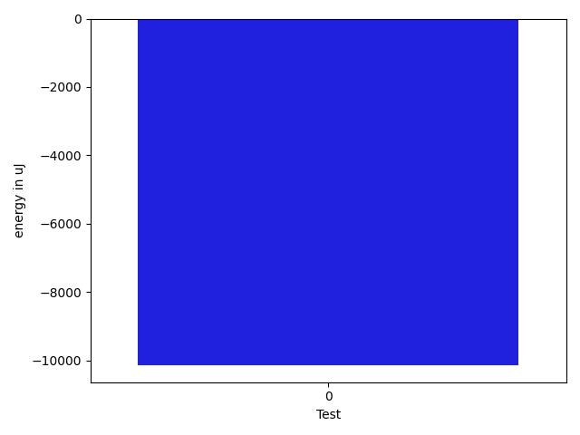

# gson 3090a7

https://github.com/google/gson/commit/3090a7

## Delta Energy per test method

| ID | EnergyV1 | EnergyV2 | DeltaEnergy | σV1 | %σV1 | σV2 | %σV2 |
| --- | --- | --- | --- | --- | --- | --- | --- |
| 0 | 517821 | 507689 | -10132 | 37353.26 | 7.21 | 84947.16 | 16.73 |

## Misc.

| ID | Test Class | Test Method |
| --- | --- | --- |
| 0 | com.google.gson.JsonArrayTest | testDeepCopy |

## Classifications

### Tests
| ID | Class | Delta | Share |
| --- | --- | --- | --- |
| G | NEUTRAL | -10132.0 | - |
| N | NEGATIVE | -10132.0 | 100.00 |
| P | POSITIVE | 0.0 | 100.00 |

### Lines
| Class | Java Class | Line |
| --- | --- | --- |
| unknown | com.google.gson.JsonArray | 52 |

## Localization of Green Regression
### Selected Tests
| Test class | test method |
| --- | --- |
| com.google.gson.JsonArrayTest | testDeepCopy |

### Suspected lines
| Class | line |
| --- | --- |
| com.google.gson.JsonArray | [52](https://github.com/google/gson/tree/3090a7/gson/src/main/java/com/google/gson/JsonArray.java#L52) |

| Time Label | Time (s) |
| --- | --- |
| Selection | 35.5882625579834 |
| Injection | 14.08030915260315 |
| Total | 197.18086314201355 |

