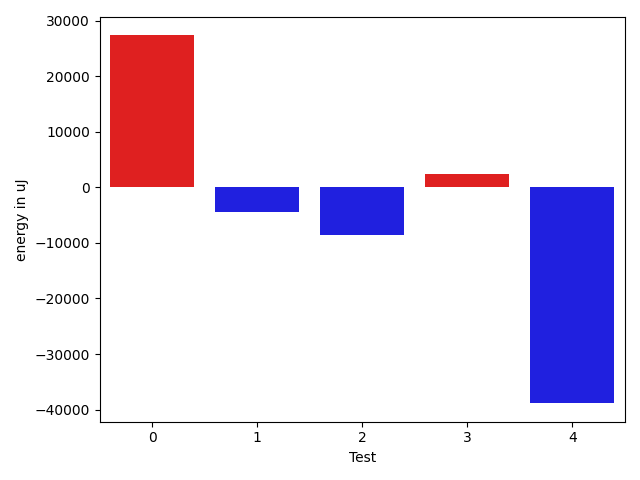

# gson ada597

https://github.com/google/gson/commit/ada597

## Delta Energy per test method

| ID | EnergyV1 | EnergyV2 | DeltaEnergy | σV1 | %σV1 | σV2 | %σV2 |
| --- | --- | --- | --- | --- | --- | --- | --- |
| 0 | 590086 | 617492 | 27406 | 40394.30 | 6.85 | 75827.58 | 12.28 |
| 1 | 145629 | 141174 | -4455 | 48362.29 | 33.21 | 14914.47 | 10.56 |
| 2 | 167236 | 158691 | -8545 | 30437.24 | 18.20 | 34932.71 | 22.01 |
| 3 | 227904 | 230346 | 2442 | 24756.37 | 10.86 | 22350.70 | 9.70 |
| 4 | 158996 | 120116 | -38880 | 18740.52 | 11.79 | 25050.34 | 20.86 |

## Misc.

| ID | Test Class | Test Method |
| --- | --- | --- |
| 0 | com.google.gson.stream.JsonWriterTest | testPrettyPrintArray |
| 1 | com.google.gson.stream.JsonWriterTest | testNonFiniteDoubles |
| 2 | com.google.gson.stream.JsonWriterTest | testPrettyPrintObject |
| 3 | com.google.gson.stream.JsonWriterTest | testDoubles |
| 4 | com.google.gson.stream.JsonWriterTest | testTopLevelValueTypes |

## Classifications

### Tests
| ID | Class | Delta | Share |
| --- | --- | --- | --- |
| G | NEUTRAL | -22032.0 | - |
| N | NEGATIVE | -51880.0 | 33.33 |
| P | POSITIVE | 29848.0 | 50.00 |
| 0 | POSITIVE | 27406.0 | 91.82 |
| 4 | NEGATIVE | -38880.0 | 74.94 |

### Lines
| Class | Java Class | Line |
| --- | --- | --- |
| negative | com.google.gson.stream.JsonWriter | 495 |
| positive | com.google.gson.stream.JsonWriter | 495 |
| unknown | com.google.gson.stream.JsonWriter | 495 |

## Localization of Green Regression
### Selected Tests
| Test class | test method |
| --- | --- |
| com.google.gson.stream.JsonWriterTest | testPrettyPrintArray |

### Suspected lines
| Class | line |
| --- | --- |
| com.google.gson.stream.JsonWriter | [495](https://github.com/google/gson/tree/ada597/gson/src/main/java/com/google/gson/stream/JsonWriter.java#L495) |

| Time Label | Time (s) |
| --- | --- |
| Selection | 35.684189796447754 |
| Injection | 15.065466165542603 |
| Total | 199.87743258476257 |

