# gson b8f616

https://github.com/google/gson/commit/b8f616

## Delta Energy per test method

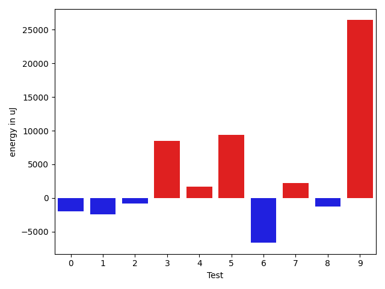

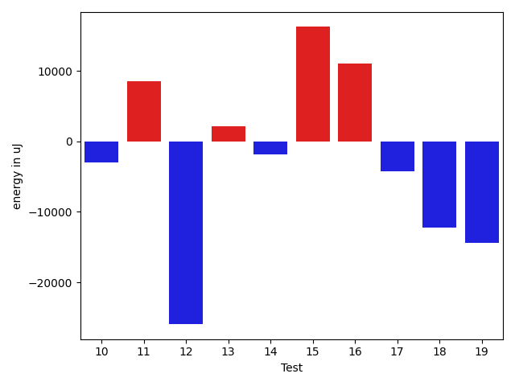

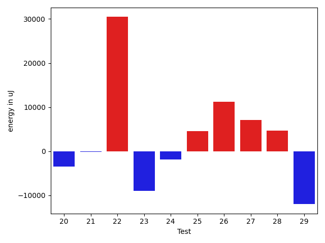

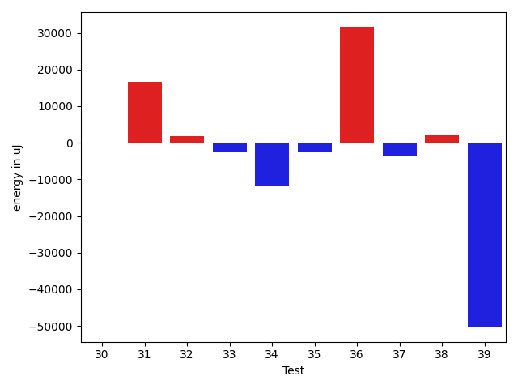

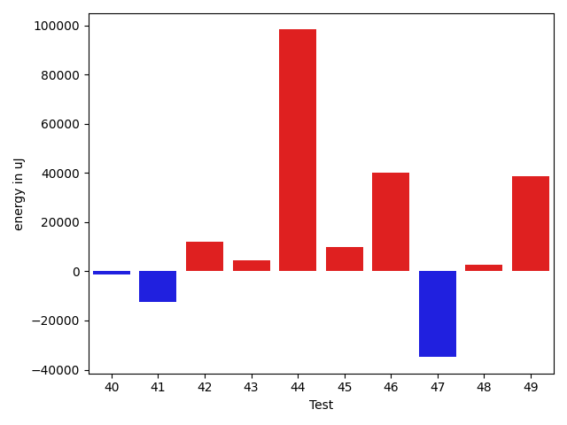

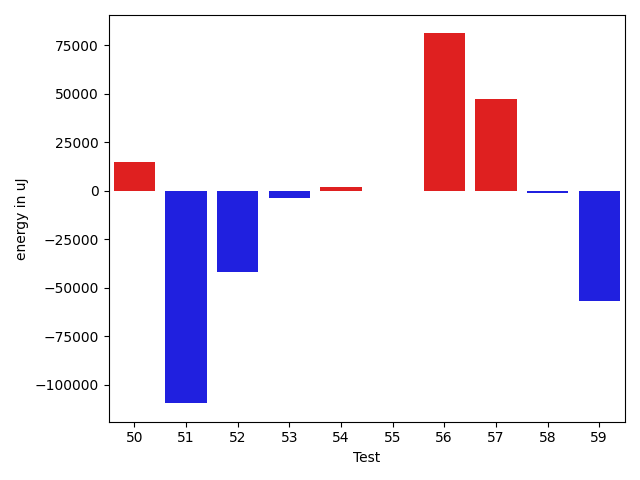

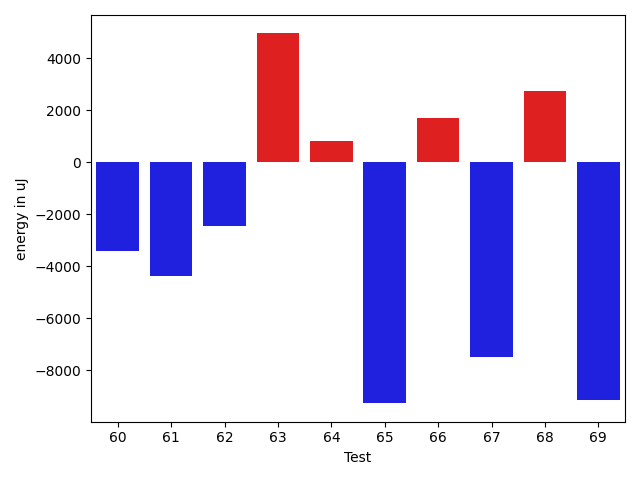

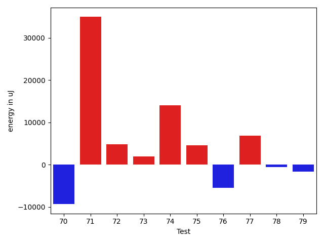

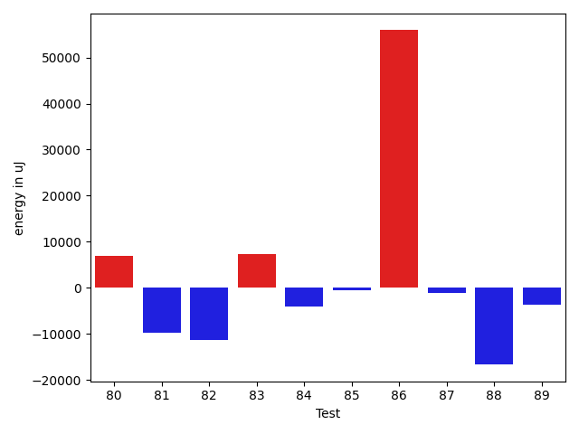

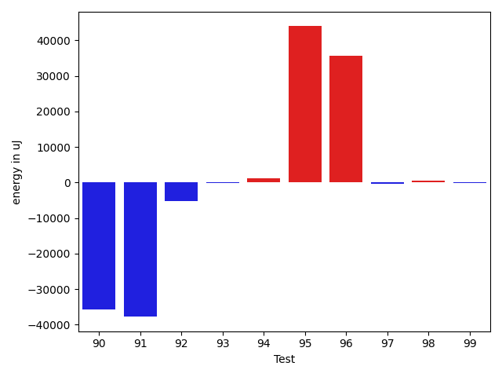

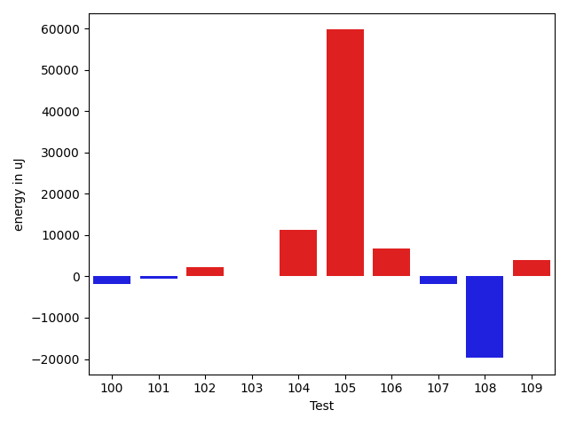

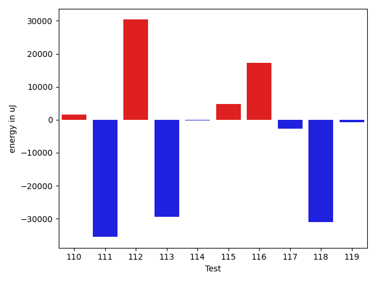

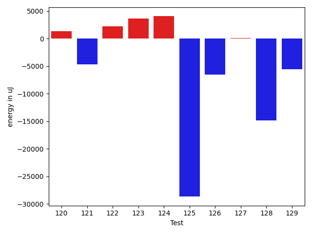

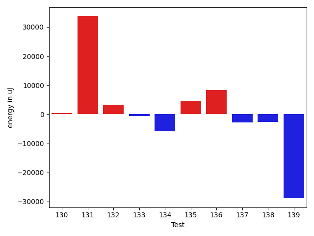

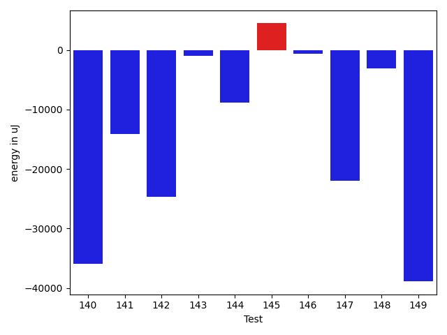

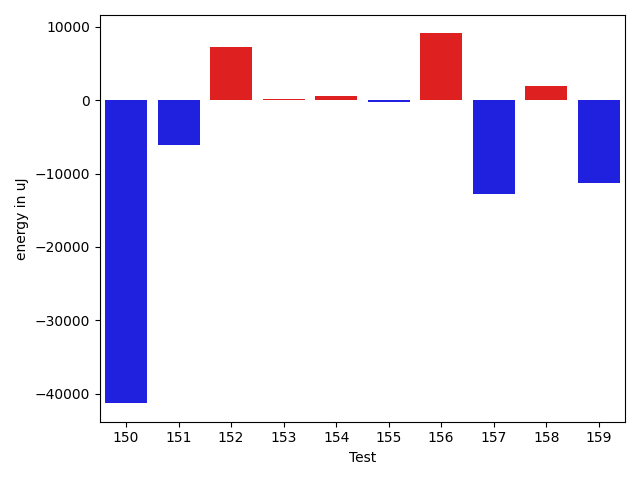

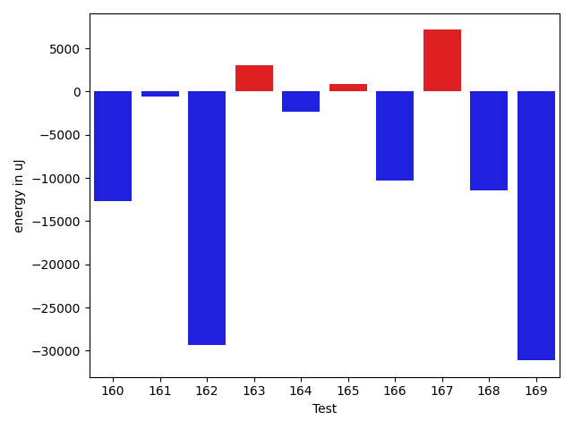

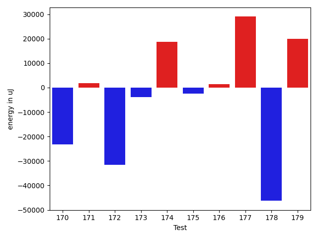

| ID | EnergyV1 | EnergyV2 | DeltaEnergy | σV1 | %σV1 | σV2 | %σV2 |
| --- | --- | --- | --- | --- | --- | --- | --- |
| 0 | 83740 | 81726 | -2014 | 21076.51 | 25.17 | 13204.13 | 16.16 |
| 1 | 92041 | 89600 | -2441 | 21840.56 | 23.73 | 15470.14 | 17.27 |
| 2 | 90393 | 89599 | -794 | 22391.89 | 24.77 | 21981.69 | 24.53 |
| 3 | 75317 | 83802 | 8485 | 20179.22 | 26.79 | 14134.23 | 16.87 |
| 4 | 93506 | 95154 | 1648 | 14339.64 | 15.34 | 19675.60 | 20.68 |
| 5 | 80261 | 89600 | 9339 | 19849.36 | 24.73 | 14527.34 | 16.21 |
| 6 | 82947 | 76294 | -6653 | 21952.35 | 26.47 | 21337.58 | 27.97 |
| 7 | 91553 | 93811 | 2258 | 14886.28 | 16.26 | 33704.73 | 35.93 |
| 8 | 210022 | 208801 | -1221 | 21518.13 | 10.25 | 38195.38 | 18.29 |
| 9 | 130126 | 156554 | 26428 | 18319.29 | 14.08 | 25983.45 | 16.60 |
| 10 | 202820 | 199890 | -2930 | 16014.55 | 7.90 | 19602.02 | 9.81 |
| 11 | 167724 | 176269 | 8545 | 22531.55 | 13.43 | 17045.01 | 9.67 |
| 12 | 138062 | 112121 | -25941 | 24452.20 | 17.71 | 27261.34 | 24.31 |
| 13 | 126160 | 128295 | 2135 | 23124.82 | 18.33 | 21446.77 | 16.72 |
| 14 | 172791 | 170959 | -1832 | 11852.14 | 6.86 | 22542.46 | 13.19 |
| 15 | 210326 | 226562 | 16236 | 25704.53 | 12.22 | 19911.03 | 8.79 |
| 16 | 163390 | 174438 | 11048 | 28454.17 | 17.41 | 35339.04 | 20.26 |
| 17 | 89661 | 85449 | -4212 | 3481.70 | 3.88 | 13301.98 | 15.57 |
| 18 | 90332 | 78064 | -12268 | 21794.98 | 24.13 | 19104.47 | 24.47 |
| 19 | 243652 | 229247 | -14405 | 37749.87 | 15.49 | 29391.47 | 12.82 |
| 20 | 173156 | 169677 | -3479 | 17019.67 | 9.83 | 16102.53 | 9.49 |
| 21 | 176269 | 176147 | -122 | 7696.88 | 4.37 | 13282.50 | 7.54 |
| 22 | 134155 | 164612 | 30457 | 26968.34 | 20.10 | 23284.91 | 14.15 |
| 23 | 91064 | 82092 | -8972 | 3460.58 | 3.80 | 22650.78 | 27.59 |
| 24 | 91613 | 89721 | -1892 | 19904.08 | 21.73 | 18333.08 | 20.43 |
| 25 | 158019 | 162597 | 4578 | 28372.29 | 17.95 | 25360.88 | 15.60 |
| 26 | 148437 | 159606 | 11169 | 23445.59 | 15.79 | 28582.55 | 17.91 |
| 27 | 261840 | 268920 | 7080 | 14200.43 | 5.42 | 24402.75 | 9.07 |
| 28 | 89905 | 94543 | 4638 | 18329.97 | 20.39 | 23718.57 | 25.09 |
| 29 | 214782 | 202759 | -12023 | 22294.97 | 10.38 | 43471.15 | 21.44 |
| 30 | 138183 | 138244 | 61 | 102123.62 | 73.90 | 17545.37 | 12.69 |
| 31 | 492187 | 508910 | 16723 | 32770.54 | 6.66 | 38680.71 | 7.60 |
| 32 | 45043 | 46814 | 1771 | 19048.81 | 42.29 | 20990.41 | 44.84 |
| 33 | 44433 | 42053 | -2380 | 15984.17 | 35.97 | 1997.49 | 4.75 |
| 34 | 128235 | 116638 | -11597 | 28183.04 | 21.98 | 16632.77 | 14.26 |
| 35 | 134460 | 132080 | -2380 | 14734.30 | 10.96 | 3942.54 | 2.98 |
| 36 | 137817 | 169372 | 31555 | 30984.34 | 22.48 | 25875.08 | 15.28 |
| 37 | 153930 | 150513 | -3417 | 26969.50 | 17.52 | 27183.16 | 18.06 |
| 38 | 132263 | 134460 | 2197 | 39018.54 | 29.50 | 14883.94 | 11.07 |
| 39 | 523680 | 473448 | -50232 | 34445.85 | 6.58 | 76537.19 | 16.17 |
| 40 | 458250 | 456786 | -1464 | 29076.76 | 6.35 | 30171.89 | 6.61 |
| 41 | 340575 | 328185 | -12390 | 34529.83 | 10.14 | 21301.67 | 6.49 |
| 42 | 120728 | 132629 | 11901 | 6802.84 | 5.63 | 13622.51 | 10.27 |
| 43 | 356384 | 360961 | 4577 | 29066.55 | 8.16 | 30049.66 | 8.32 |
| 44 | 340331 | 438597 | 98266 | 58579.08 | 17.21 | 47338.21 | 10.79 |
| 45 | 117004 | 126892 | 9888 | 19621.32 | 16.77 | 10655.22 | 8.40 |
| 46 | 94238 | 134460 | 40222 | 184220.76 | 195.48 | 18948.58 | 14.09 |
| 47 | 480285 | 445434 | -34851 | 78310.03 | 16.30 | 159277.02 | 35.76 |
| 48 | 127807 | 130432 | 2625 | 18255.69 | 14.28 | 21396.70 | 16.40 |
| 49 | 42175 | 80933 | 38758 | 21692.11 | 51.43 | 17570.40 | 21.71 |
| 50 | 139587 | 154113 | 14526 | 20125.49 | 14.42 | 18743.23 | 12.16 |
| 51 | 628660 | 519041 | -109619 | 45653.61 | 7.26 | 56050.59 | 10.80 |
| 52 | 83374 | 41443 | -41931 | 21486.47 | 25.77 | 28948.87 | 69.85 |
| 53 | 133483 | 129638 | -3845 | 13572.87 | 10.17 | 18475.15 | 14.25 |
| 54 | 84350 | 86060 | 1710 | 21091.25 | 25.00 | 20430.12 | 23.74 |
| 55 | 89416 | 89050 | -366 | 22597.37 | 25.27 | 20241.91 | 22.73 |
| 56 | 192077 | 273070 | 80993 | 18852.11 | 9.81 | 23028.54 | 8.43 |
| 57 | 271789 | 319152 | 47363 | 31597.28 | 11.63 | 26950.60 | 8.44 |
| 58 | 87830 | 86548 | -1282 | 18522.25 | 21.09 | 12801.68 | 14.79 |
| 59 | 374083 | 317199 | -56884 | 23699.45 | 6.34 | 39864.37 | 12.57 |
| 60 | 43823 | 40405 | -3418 | 3991.93 | 9.11 | 10917.67 | 27.02 |
| 61 | 45654 | 41260 | -4394 | 18180.81 | 39.82 | 3075.51 | 7.45 |
| 62 | 276611 | 274169 | -2442 | 35052.88 | 12.67 | 57089.79 | 20.82 |
| 63 | 168640 | 173584 | 4944 | 18834.91 | 11.17 | 27805.45 | 16.02 |
| 64 | 78185 | 78979 | 794 | 19729.72 | 25.23 | 17269.07 | 21.87 |
| 65 | 84961 | 75684 | -9277 | 6570.96 | 7.73 | 18807.74 | 24.85 |
| 66 | 176819 | 178527 | 1708 | 26269.30 | 14.86 | 26985.59 | 15.12 |
| 67 | 46448 | 38940 | -7508 | 18294.98 | 39.39 | 3560.31 | 9.14 |
| 68 | 125854 | 128601 | 2747 | 12936.76 | 10.28 | 33813.71 | 26.29 |
| 69 | 48034 | 38879 | -9155 | 22734.27 | 47.33 | 20833.12 | 53.58 |
| 70 | 221374 | 212036 | -9338 | 23780.90 | 10.74 | 22822.29 | 10.76 |
| 71 | 42725 | 77698 | 34973 | 20607.43 | 48.23 | 19679.58 | 25.33 |
| 72 | 182739 | 187621 | 4882 | 165456.29 | 90.54 | 76914.26 | 40.99 |
| 73 | 43334 | 45349 | 2015 | 15297.85 | 35.30 | 20570.43 | 45.36 |
| 74 | 75683 | 89721 | 14038 | 19768.87 | 26.12 | 16184.22 | 18.04 |
| 75 | 85693 | 90270 | 4577 | 22357.18 | 26.09 | 4121.04 | 4.57 |
| 76 | 87647 | 82154 | -5493 | 26817.21 | 30.60 | 21201.00 | 25.81 |
| 77 | 218383 | 225280 | 6897 | 20188.53 | 9.24 | 35431.98 | 15.73 |
| 78 | 181457 | 180847 | -610 | 16432.65 | 9.06 | 26292.37 | 14.54 |
| 79 | 170227 | 168640 | -1587 | 18927.86 | 11.12 | 27067.09 | 16.05 |
| 80 | 338439 | 345458 | 7019 | 24180.24 | 7.14 | 19101.03 | 5.53 |
| 81 | 274963 | 265136 | -9827 | 37351.21 | 13.58 | 104062.58 | 39.25 |
| 82 | 179870 | 168579 | -11291 | 27200.27 | 15.12 | 25262.64 | 14.99 |
| 83 | 193603 | 200928 | 7325 | 19084.03 | 9.86 | 21542.46 | 10.72 |
| 84 | 466124 | 462157 | -3967 | 36172.62 | 7.76 | 123616.42 | 26.75 |
| 85 | 134521 | 133911 | -610 | 24182.67 | 17.98 | 19104.82 | 14.27 |
| 86 | 488219 | 544127 | 55908 | 47021.10 | 9.63 | 79720.80 | 14.65 |
| 87 | 124878 | 123779 | -1099 | 22406.80 | 17.94 | 23063.38 | 18.63 |
| 88 | 135986 | 119324 | -16662 | 14081.58 | 10.36 | 26385.02 | 22.11 |
| 89 | 86181 | 82459 | -3722 | 24276.44 | 28.17 | 30654.19 | 37.18 |
| 90 | 223022 | 187316 | -35706 | 19881.50 | 8.91 | 21079.20 | 11.25 |
| 91 | 157409 | 119628 | -37781 | 21746.96 | 13.82 | 22183.99 | 18.54 |
| 92 | 264770 | 259582 | -5188 | 21248.16 | 8.03 | 21039.73 | 8.11 |
| 93 | 43579 | 43396 | -183 | 19910.57 | 45.69 | 1080.96 | 2.49 |
| 94 | 44006 | 45166 | 1160 | 3491.31 | 7.93 | 13695.92 | 30.32 |
| 95 | 44983 | 88928 | 43945 | 22228.90 | 49.42 | 5307.78 | 5.97 |
| 96 | 45227 | 80932 | 35705 | 15093.66 | 33.37 | 21028.08 | 25.98 |
| 97 | 45227 | 44861 | -366 | 2195.35 | 4.85 | 15047.30 | 33.54 |
| 98 | 46326 | 46936 | 610 | 2367.14 | 5.11 | 22422.89 | 47.77 |
| 99 | 44495 | 44250 | -245 | 2640.11 | 5.93 | 11358.75 | 25.67 |
| 100 | 45471 | 43579 | -1892 | 16705.02 | 36.74 | 2426.38 | 5.57 |
| 101 | 46753 | 46264 | -489 | 16496.27 | 35.28 | 20669.72 | 44.68 |
| 102 | 184447 | 186645 | 2198 | 13873.17 | 7.52 | 11298.14 | 6.05 |
| 103 | 202514 | 202697 | 183 | 26556.98 | 13.11 | 18540.43 | 9.15 |
| 104 | 292296 | 303588 | 11292 | 28997.96 | 9.92 | 22552.36 | 7.43 |
| 105 | 114807 | 174499 | 59692 | 20728.05 | 18.05 | 24579.43 | 14.09 |
| 106 | 208313 | 215026 | 6713 | 25340.51 | 12.16 | 25765.41 | 11.98 |
| 107 | 87951 | 86059 | -1892 | 29065.47 | 33.05 | 19834.42 | 23.05 |
| 108 | 93750 | 74035 | -19715 | 15645.74 | 16.69 | 19893.18 | 26.87 |
| 109 | 86669 | 90637 | 3968 | 15025.84 | 17.34 | 20194.18 | 22.28 |
| 110 | 91736 | 93384 | 1648 | 29862.20 | 32.55 | 21445.98 | 22.97 |
| 111 | 121094 | 85571 | -35523 | 22158.02 | 18.30 | 18637.05 | 21.78 |
| 112 | 121704 | 152038 | 30334 | 13195.13 | 10.84 | 22878.07 | 15.05 |
| 113 | 109314 | 79895 | -29419 | 16629.92 | 15.21 | 18037.38 | 22.58 |
| 114 | 82275 | 82031 | -244 | 11531.97 | 14.02 | 34170.69 | 41.66 |
| 115 | 82031 | 86852 | 4821 | 5804.64 | 7.08 | 7272.67 | 8.37 |
| 116 | 135803 | 153076 | 17273 | 28712.11 | 21.14 | 51847.93 | 33.87 |
| 117 | 89599 | 86914 | -2685 | 3580.89 | 4.00 | 15683.63 | 18.05 |
| 118 | 111633 | 80689 | -30944 | 16805.60 | 15.05 | 18772.34 | 23.27 |
| 119 | 133483 | 132812 | -671 | 27282.13 | 20.44 | 16174.08 | 12.18 |
| 120 | 131713 | 133057 | 1344 | 19567.93 | 14.86 | 11718.61 | 8.81 |
| 121 | 89721 | 85022 | -4699 | 18212.31 | 20.30 | 20443.22 | 24.04 |
| 122 | 81970 | 84167 | 2197 | 17179.41 | 20.96 | 21208.29 | 25.20 |
| 123 | 81176 | 84777 | 3601 | 13538.08 | 16.68 | 13531.31 | 15.96 |
| 124 | 133056 | 137084 | 4028 | 17269.52 | 12.98 | 25650.13 | 18.71 |
| 125 | 182129 | 153442 | -28687 | 19464.69 | 10.69 | 24046.98 | 15.67 |
| 126 | 276305 | 269774 | -6531 | 22470.61 | 8.13 | 21957.18 | 8.14 |
| 127 | 135803 | 135925 | 122 | 55276.23 | 40.70 | 27081.21 | 19.92 |
| 128 | 90514 | 75684 | -14830 | 6211.34 | 6.86 | 18517.17 | 24.47 |
| 129 | 95276 | 89721 | -5555 | 26802.33 | 28.13 | 29207.62 | 32.55 |
| 130 | 135071 | 135437 | 366 | 18509.26 | 13.70 | 20278.56 | 14.97 |
| 131 | 46936 | 80566 | 33630 | 19744.19 | 42.07 | 24100.04 | 29.91 |
| 132 | 131835 | 135193 | 3358 | 24410.64 | 18.52 | 3378.67 | 2.50 |
| 133 | 464354 | 463683 | -671 | 97400.99 | 20.98 | 42963.30 | 9.27 |
| 134 | 89600 | 83801 | -5799 | 22665.64 | 25.30 | 19991.77 | 23.86 |
| 135 | 124572 | 129212 | 4640 | 14138.58 | 11.35 | 27420.54 | 21.22 |
| 136 | 79895 | 88317 | 8422 | 190210.89 | 238.08 | 22416.51 | 25.38 |
| 137 | 92101 | 89355 | -2746 | 53696.90 | 58.30 | 19852.71 | 22.22 |
| 138 | 84900 | 82336 | -2564 | 30677.46 | 36.13 | 30096.63 | 36.55 |
| 139 | 374144 | 345275 | -28869 | 164013.88 | 43.84 | 24664.41 | 7.14 |
| 140 | 318175 | 282287 | -35888 | 45289.01 | 14.23 | 364738.15 | 129.21 |
| 141 | 2177607 | 2163447 | -14160 | 41468.09 | 1.90 | 126756.60 | 5.86 |
| 142 | 116577 | 91858 | -24719 | 36096.49 | 30.96 | 49136.56 | 53.49 |
| 143 | 90576 | 89538 | -1038 | 26070.69 | 28.78 | 18759.80 | 20.95 |
| 144 | 123474 | 114624 | -8850 | 33148.36 | 26.85 | 16264.68 | 14.19 |
| 145 | 127868 | 132324 | 4456 | 20419.32 | 15.97 | 30407.92 | 22.98 |
| 146 | 82947 | 82336 | -611 | 27264.50 | 32.87 | 19440.10 | 23.61 |
| 147 | 353576 | 331603 | -21973 | 30306.89 | 8.57 | 51767.26 | 15.61 |
| 148 | 224060 | 221008 | -3052 | 10623.21 | 4.74 | 12698.91 | 5.75 |
| 149 | 228759 | 189880 | -38879 | 17703.15 | 7.74 | 17350.49 | 9.14 |
| 150 | 539672 | 498351 | -41321 | 33988.29 | 6.30 | 37998.14 | 7.62 |
| 151 | 194580 | 188476 | -6104 | 20636.32 | 10.61 | 21334.55 | 11.32 |
| 152 | 210448 | 217712 | 7264 | 22990.40 | 10.92 | 8161.31 | 3.75 |
| 153 | 43457 | 43579 | 122 | 2497.45 | 5.75 | 1852.26 | 4.25 |
| 154 | 44250 | 44800 | 550 | 49546.93 | 111.97 | 2775.69 | 6.20 |
| 155 | 129943 | 129700 | -243 | 16088.88 | 12.38 | 13913.69 | 10.73 |
| 156 | 155029 | 164123 | 9094 | 23858.03 | 15.39 | 19245.11 | 11.73 |
| 157 | 202087 | 189270 | -12817 | 22276.04 | 11.02 | 18262.07 | 9.65 |
| 158 | 265930 | 267821 | 1891 | 27242.75 | 10.24 | 20580.91 | 7.68 |
| 159 | 272338 | 261108 | -11230 | 24577.07 | 9.02 | 15589.31 | 5.97 |
| 160 | 266845 | 254210 | -12635 | 17834.43 | 6.68 | 20922.93 | 8.23 |
| 161 | 186400 | 185852 | -548 | 15118.00 | 8.11 | 10963.78 | 5.90 |
| 162 | 184936 | 155640 | -29296 | 2749.61 | 1.49 | 29494.30 | 18.95 |
| 163 | 41260 | 44311 | 3051 | 17292.59 | 41.91 | 20311.58 | 45.84 |
| 164 | 91492 | 89172 | -2320 | 22606.44 | 24.71 | 34533.31 | 38.73 |
| 165 | 90576 | 91430 | 854 | 19828.65 | 21.89 | 23304.10 | 25.49 |
| 166 | 92956 | 82703 | -10253 | 16018.28 | 17.23 | 14372.39 | 17.38 |
| 167 | 117676 | 124817 | 7141 | 29538.46 | 25.10 | 18533.49 | 14.85 |
| 168 | 93139 | 81665 | -11474 | 17538.50 | 18.83 | 23856.96 | 29.21 |
| 169 | 124084 | 92956 | -31128 | 137701.92 | 110.97 | 18419.44 | 19.82 |
| 170 | 239379 | 216064 | -23315 | 21658.30 | 9.05 | 32507.05 | 15.05 |
| 171 | 145263 | 147094 | 1831 | 18497.51 | 12.73 | 17742.06 | 12.06 |
| 172 | 240478 | 208923 | -31555 | 19717.06 | 8.20 | 17848.44 | 8.54 |
| 173 | 114196 | 110351 | -3845 | 18800.12 | 16.46 | 16532.30 | 14.98 |
| 174 | 695799 | 714414 | 18615 | 52810.48 | 7.59 | 78785.53 | 11.03 |
| 175 | 44373 | 41993 | -2380 | 16588.63 | 37.38 | 14756.69 | 35.14 |
| 176 | 46631 | 48034 | 1403 | 23408.33 | 50.20 | 21838.08 | 45.46 |
| 177 | 136474 | 165466 | 28992 | 20276.38 | 14.86 | 30131.21 | 18.21 |
| 178 | 1670223 | 1623958 | -46265 | 96430.17 | 5.77 | 98308.95 | 6.05 |
| 179 | 1379269 | 1399228 | 19959 | 81397.21 | 5.90 | 59490.71 | 4.25 |

## Misc.

| ID | Test Class | Test Method |
| --- | --- | --- |
| 0 | com.google.gson.functional.TypeAdapterPrecedenceTest | testStreamingFollowedByNonstreaming |
| 1 | com.google.gson.functional.TypeAdapterPrecedenceTest | testStreamingHierarchicalFollowedByNonstreaming |
| 2 | com.google.gson.functional.TypeAdapterPrecedenceTest | testSerializeNonstreamingTypeAdapterFollowedByStreamingTypeAdapter |
| 3 | com.google.gson.functional.TypeAdapterPrecedenceTest | testNonstreamingHierarchicalFollowedByNonstreaming |
| 4 | com.google.gson.functional.TypeAdapterPrecedenceTest | testStreamingHierarchicalFollowedByNonstreamingHierarchical |
| 5 | com.google.gson.functional.TypeAdapterPrecedenceTest | testNonstreamingFollowedByNonstreaming |
| 6 | com.google.gson.functional.TypeAdapterPrecedenceTest | testStreamingFollowedByStreaming |
| 7 | com.google.gson.functional.TypeAdapterPrecedenceTest | testStreamingFollowedByNonstreamingHierarchical |
| 8 | com.google.gson.functional.CustomTypeAdaptersTest | testCustomAdapterInvokedForCollectionElementDeserialization |
| 9 | com.google.gson.functional.CustomTypeAdaptersTest | testCustomTypeAdapterAppliesToSubClassesSerializedAsBaseClass |
| 10 | com.google.gson.functional.CustomTypeAdaptersTest | testCustomAdapterInvokedForMapElementDeserialization |
| 11 | com.google.gson.functional.CustomTypeAdaptersTest | testCustomAdapterInvokedForMapElementSerializationWithType |
| 12 | com.google.gson.functional.CustomTypeAdaptersTest | testCustomNestedSerializers |
| 13 | com.google.gson.functional.CustomTypeAdaptersTest | testCustomAdapterInvokedForMapElementSerialization |
| 14 | com.google.gson.functional.CustomTypeAdaptersTest | testCustomSerializers |
| 15 | com.google.gson.functional.CustomTypeAdaptersTest | testCustomNestedDeserializers |
| 16 | com.google.gson.functional.CustomTypeAdaptersTest | testCustomTypeAdapterDoesNotAppliesToSubClasses |
| 17 | com.google.gson.functional.CustomTypeAdaptersTest | testCustomAdapterInvokedForCollectionElementSerialization |
| 18 | com.google.gson.functional.CustomTypeAdaptersTest | testRegisterHierarchyAdapterForDate |
| 19 | com.google.gson.functional.CustomTypeAdaptersTest | testCustomAdapterInvokedForCollectionElementSerializationWithType |
| 20 | com.google.gson.functional.CustomTypeAdaptersTest | testCustomDeserializers |
| 21 | com.google.gson.functional.CustomTypeAdaptersTest | testCustomByteArrayDeserializerAndInstanceCreator |
| 22 | com.google.gson.functional.CustomTypeAdaptersTest | testCustomByteArraySerializer |
| 23 | com.google.gson.functional.CustomTypeAdaptersTest | testEnsureCustomSerializerNotInvokedForNullValues |
| 24 | com.google.gson.functional.CustomTypeAdaptersTest | testEnsureCustomDeserializerNotInvokedForNullValues |
| 25 | com.google.gson.functional.CustomTypeAdaptersTest | testCustomDeserializerInvokedForPrimitives |
| 26 | com.google.gson.functional.CustomTypeAdaptersTest | testCustomSerializerInvokedForPrimitives |
| 27 | com.google.gson.functional.StreamingTypeAdaptersTest | testNullSafe |
| 28 | com.google.gson.functional.StreamingTypeAdaptersTest | testSerializeWithCustomTypeAdapter |
| 29 | com.google.gson.functional.StreamingTypeAdaptersTest | testDeserializeWithCustomTypeAdapter |
| 30 | com.google.gson.functional.ExclusionStrategyFunctionalTest | testExclusionStrategySerializationDoesNotImpactSerialization |
| 31 | com.google.gson.functional.ExclusionStrategyFunctionalTest | testExclusionStrategyWithMode |
| 32 | com.google.gson.functional.ExclusionStrategyFunctionalTest | testExcludeTopLevelClassDeserialization |
| 33 | com.google.gson.functional.ExclusionStrategyFunctionalTest | testExcludeTopLevelClassSerialization |
| 34 | com.google.gson.functional.ExclusionStrategyFunctionalTest | testExclusionStrategySerializationDoesNotImpactDeserialization |
| 35 | com.google.gson.functional.ExclusionStrategyFunctionalTest | testExcludeTopLevelClassDeserializationDoesNotImpactSerialization |
| 36 | com.google.gson.functional.ExclusionStrategyFunctionalTest | testExcludeTopLevelClassSerializationDoesNotImpactDeserialization |
| 37 | com.google.gson.functional.ExclusionStrategyFunctionalTest | testExclusionStrategyDeserialization |
| 38 | com.google.gson.functional.ExclusionStrategyFunctionalTest | testExclusionStrategySerialization |
| 39 | com.google.gson.functional.InstanceCreatorTest | testInstanceCreatorForParametrizedType |
| 40 | com.google.gson.functional.InstanceCreatorTest | testInstanceCreatorReturnsBaseType |
| 41 | com.google.gson.functional.InstanceCreatorTest | testInstanceCreatorReturnsSubTypeForField |
| 42 | com.google.gson.functional.InstanceCreatorTest | testInstanceCreatorReturnsSubTypeForTopLevelObject |
| 43 | com.google.gson.functional.InstanceCreatorTest | testInstanceCreatorForCollectionType |
| 44 | com.google.gson.functional.DefaultTypeAdaptersTest | testDateSerializationWithPatternNotOverridenByTypeAdapter |
| 45 | com.google.gson.functional.DefaultTypeAdaptersTest | testDateSerializationWithPattern |
| 46 | com.google.gson.functional.DefaultTypeAdaptersTest | testOverrideBigIntegerTypeAdapter |
| 47 | com.google.gson.functional.DefaultTypeAdaptersTest | testDefaultGregorianCalendarDeserialization |
| 48 | com.google.gson.functional.DefaultTypeAdaptersTest | testSqlDateSerialization |
| 49 | com.google.gson.functional.DefaultTypeAdaptersTest | testClassSerialization |
| 50 | com.google.gson.functional.DefaultTypeAdaptersTest | testTimestampSerialization |
| 51 | com.google.gson.functional.DefaultTypeAdaptersTest | testDefaultDateDeserializationUsingBuilder |
| 52 | com.google.gson.functional.DefaultTypeAdaptersTest | testDefaultCalendarSerialization |
| 53 | com.google.gson.functional.DefaultTypeAdaptersTest | testOverrideBigDecimalTypeAdapter |
| 54 | com.google.gson.functional.DefaultTypeAdaptersTest | testDefaultCalendarDeserialization |
| 55 | com.google.gson.functional.DefaultTypeAdaptersTest | testClassDeserialization |
| 56 | com.google.gson.functional.DefaultTypeAdaptersTest | testDateDeserializationWithPattern |
| 57 | com.google.gson.functional.DefaultTypeAdaptersTest | testDateSerializationInCollection |
| 58 | com.google.gson.functional.DefaultTypeAdaptersTest | testDefaultGregorianCalendarSerialization |
| 59 | com.google.gson.functional.DefaultTypeAdaptersTest | testDefaultDateSerializationUsingBuilder |
| 60 | com.google.gson.OverrideCoreTypeAdaptersTest | testOverrideStringAdapter |
| 61 | com.google.gson.OverrideCoreTypeAdaptersTest | testOverridePrimitiveBooleanAdapter |
| 62 | com.google.gson.OverrideCoreTypeAdaptersTest | testOverrideWrapperBooleanAdapter |
| 63 | com.google.gson.functional.NullObjectAndFieldTest | testCustomTypeAdapterPassesNullSerialization |
| 64 | com.google.gson.functional.NullObjectAndFieldTest | testExplicitDeserializationOfNulls |
| 65 | com.google.gson.functional.NullObjectAndFieldTest | testExplicitSerializationOfNullStringMembers |
| 66 | com.google.gson.functional.NullObjectAndFieldTest | testCustomTypeAdapterPassesNullDesrialization |
| 67 | com.google.gson.functional.NullObjectAndFieldTest | testTopLevelNullObjectDeserialization |
| 68 | com.google.gson.functional.NullObjectAndFieldTest | testExplicitSerializationOfNullCollectionMembers |
| 69 | com.google.gson.functional.NullObjectAndFieldTest | testCustomSerializationOfNulls |
| 70 | com.google.gson.functional.NullObjectAndFieldTest | testPrintPrintingObjectWithNulls |
| 71 | com.google.gson.functional.NullObjectAndFieldTest | testPrintPrintingArraysWithNulls |
| 72 | com.google.gson.functional.NullObjectAndFieldTest | testTopLevelNullObjectSerialization |
| 73 | com.google.gson.functional.NullObjectAndFieldTest | testNullWrappedPrimitiveMemberSerialization |
| 74 | com.google.gson.functional.NullObjectAndFieldTest | testExplicitSerializationOfNullArrayMembers |
| 75 | com.google.gson.functional.NullObjectAndFieldTest | testExplicitSerializationOfNulls |
| 76 | com.google.gson.functional.NullObjectAndFieldTest | testNullWrappedPrimitiveMemberDeserialization |
| 77 | com.google.gson.LongSerializationPolicyTest | testDefaultLongSerializationIntegration |
| 78 | com.google.gson.LongSerializationPolicyTest | testStringLongSerializationIntegration |
| 79 | com.google.gson.functional.MapTest | testSerializeMaps |
| 80 | com.google.gson.functional.MapTest | testInterfaceTypeMapWithSerializer |
| 81 | com.google.gson.functional.MapTest | testMapSerializationWithNullValuesSerialized |
| 82 | com.google.gson.functional.MapTest | testMapSubclassDeserialization |
| 83 | com.google.gson.functional.MapTest | testCustomSerializerForSpecificMapType |
| 84 | com.google.gson.functional.MapTest | testGeneralMapField |
| 85 | com.google.gson.functional.MapTest | testMapSerializationWithNullValueButSerializeNulls |
| 86 | com.google.gson.functional.MapTest | testInterfaceTypeMap |
| 87 | com.google.gson.functional.FieldExclusionTest | testDefaultNestedStaticClassIncluded |
| 88 | com.google.gson.functional.FieldExclusionTest | testDefaultInnerClassExclusion |
| 89 | com.google.gson.functional.FieldExclusionTest | testInnerClassExclusion |
| 90 | com.google.gson.GsonBuilderTest | testExcludeFieldsWithModifiers |
| 91 | com.google.gson.GsonBuilderTest | testCreatingMoreThanOnce |
| 92 | com.google.gson.GsonBuilderTest | testTransientFieldExclusion |
| 93 | com.google.gson.functional.PrimitiveTest | testDoubleInfinitySerialization |
| 94 | com.google.gson.functional.PrimitiveTest | testLongAsStringDeserialization |
| 95 | com.google.gson.functional.PrimitiveTest | testHtmlCharacterSerialization |
| 96 | com.google.gson.functional.PrimitiveTest | testNegativeInfinitySerialization |
| 97 | com.google.gson.functional.PrimitiveTest | testLongAsStringSerialization |
| 98 | com.google.gson.functional.PrimitiveTest | testFloatInfinitySerialization |
| 99 | com.google.gson.functional.PrimitiveTest | testFloatNaNSerialization |
| 100 | com.google.gson.functional.PrimitiveTest | testNegativeInfinityFloatSerialization |
| 101 | com.google.gson.functional.PrimitiveTest | testDoubleNaNSerialization |
| 102 | com.google.gson.functional.CustomDeserializerTest | testCustomDeserializerReturnsNullForArrayElementsForArrayField |
| 103 | com.google.gson.functional.CustomDeserializerTest | testCustomDeserializerReturnsNull |
| 104 | com.google.gson.functional.CustomDeserializerTest | testJsonTypeFieldBasedDeserialization |
| 105 | com.google.gson.functional.CustomDeserializerTest | testCustomDeserializerReturnsNullForArrayElements |
| 106 | com.google.gson.functional.CustomDeserializerTest | testCustomDeserializerReturnsNullForTopLevelObject |
| 107 | com.google.gson.functional.NamingPolicyTest | testGsonWithNonDefaultFieldNamingPolicySerialization |
| 108 | com.google.gson.functional.NamingPolicyTest | testGsonWithLowerCaseDashPolicyDeserialiation |
| 109 | com.google.gson.functional.NamingPolicyTest | testGsonDuplicateNameUsingSerializedNameFieldNamingPolicySerialization |
| 110 | com.google.gson.functional.NamingPolicyTest | testGsonWithSerializedNameFieldNamingPolicyDeserialization |
| 111 | com.google.gson.functional.NamingPolicyTest | testGsonWithUpperCamelCaseSpacesPolicyDeserialiation |
| 112 | com.google.gson.functional.NamingPolicyTest | testGsonWithSerializedNameFieldNamingPolicySerialization |
| 113 | com.google.gson.functional.NamingPolicyTest | testGsonWithNonDefaultFieldNamingPolicyDeserialiation |
| 114 | com.google.gson.functional.NamingPolicyTest | testGsonWithLowerCaseUnderscorePolicySerialization |
| 115 | com.google.gson.functional.NamingPolicyTest | testDeprecatedNamingStrategy |
| 116 | com.google.gson.functional.NamingPolicyTest | testGsonWithUpperCamelCaseSpacesPolicySerialiation |
| 117 | com.google.gson.functional.NamingPolicyTest | testGsonWithLowerCaseDashPolicySerialization |
| 118 | com.google.gson.functional.NamingPolicyTest | testGsonWithLowerCaseUnderscorePolicyDeserialiation |
| 119 | com.google.gson.functional.CustomSerializerTest | testSerializerReturnsNull |
| 120 | com.google.gson.functional.CustomSerializerTest | testSubClassSerializerInvokedForBaseClassFieldsHoldingSubClassInstances |
| 121 | com.google.gson.functional.CustomSerializerTest | testBaseClassSerializerInvokedForBaseClassFieldsHoldingSubClassInstances |
| 122 | com.google.gson.functional.CustomSerializerTest | testBaseClassSerializerInvokedForBaseClassFields |
| 123 | com.google.gson.functional.CustomSerializerTest | testSubClassSerializerInvokedForBaseClassFieldsHoldingArrayOfSubClassInstances |
| 124 | com.google.gson.functional.JsonAdapterAnnotationOnClassesTest | testRegisteredAdapterOverridesJsonAdapter |
| 125 | com.google.gson.functional.JsonAdapterAnnotationOnClassesTest | testRegisteredDeserializerOverridesJsonAdapter |
| 126 | com.google.gson.functional.JsonAdapterAnnotationOnClassesTest | testRegisteredSerializerOverridesJsonAdapter |
| 127 | com.google.gson.functional.VersioningTest | testVersionedGsonMixingSinceAndUntilDeserialization |
| 128 | com.google.gson.functional.VersioningTest | testVersionedUntilSerialization |
| 129 | com.google.gson.functional.VersioningTest | testIgnoreLaterVersionClassSerialization |
| 130 | com.google.gson.functional.VersioningTest | testVersionedClassesDeserialization |
| 131 | com.google.gson.functional.VersioningTest | testVersionedGsonWithUnversionedClassesSerialization |
| 132 | com.google.gson.functional.VersioningTest | testVersionedClassesSerialization |
| 133 | com.google.gson.functional.VersioningTest | testVersionedGsonMixingSinceAndUntilSerialization |
| 134 | com.google.gson.functional.VersioningTest | testIgnoreLaterVersionClassDeserialization |
| 135 | com.google.gson.functional.VersioningTest | testVersionedUntilDeserialization |
| 136 | com.google.gson.functional.VersioningTest | testVersionedGsonWithUnversionedClassesDeserialization |
| 137 | com.google.gson.functional.TypeHierarchyAdapterTest | testRegisterSuperTypeFirst |
| 138 | com.google.gson.functional.TypeHierarchyAdapterTest | testRegisterSubTypeFirstAllowed |
| 139 | com.google.gson.functional.TypeHierarchyAdapterTest | testTypeHierarchy |
| 140 | com.google.gson.DefaultDateTypeAdapterTest | testFormattingInEnUs |
| 141 | com.google.gson.DefaultDateTypeAdapterTest | testFormattingInFr |
| 142 | com.google.gson.functional.SecurityTest | testJsonWithNonExectuableTokenSerialization |
| 143 | com.google.gson.functional.SecurityTest | testNonExecutableJsonSerialization |
| 144 | com.google.gson.functional.SecurityTest | testNonExecutableJsonDeserialization |
| 145 | com.google.gson.functional.SecurityTest | testJsonWithNonExectuableTokenWithConfiguredGsonDeserialization |
| 146 | com.google.gson.functional.SecurityTest | testJsonWithNonExectuableTokenWithRegularGsonDeserialization |
| 147 | com.google.gson.functional.EnumTest | testEnumSubclassWithRegisteredTypeAdapter |
| 148 | com.google.gson.functional.MapAsArrayTypeAdapterTest | testMultipleEnableComplexKeyRegistrationHasNoEffect |
| 149 | com.google.gson.functional.MapAsArrayTypeAdapterTest | testMapWithTypeVariableDeserialization |
| 150 | com.google.gson.functional.MapAsArrayTypeAdapterTest | testSerializeComplexMapWithTypeAdapter |
| 151 | com.google.gson.functional.MapAsArrayTypeAdapterTest | testTwoTypesCollapseToOneDeserialize |
| 152 | com.google.gson.functional.MapAsArrayTypeAdapterTest | testMapWithTypeVariableSerialization |
| 153 | com.google.gson.functional.ReadersWritersTest | testTopLevelNullObjectDeserializationWithReaderAndSerializeNulls |
| 154 | com.google.gson.functional.ReadersWritersTest | testTopLevelNullObjectSerializationWithWriterAndSerializeNulls |
| 155 | com.google.gson.functional.JavaUtilConcurrentAtomicTest | testAtomicLongWithStringSerializationPolicy |
| 156 | com.google.gson.functional.JavaUtilConcurrentAtomicTest | testAtomicLongArrayWithStringSerializationPolicy |
| 157 | com.google.gson.functional.ParameterizedTypesTest | testParameterizedTypeWithReaderDeserialization |
| 158 | com.google.gson.functional.ParameterizedTypesTest | testParameterizedTypeWithCustomSerializer |
| 159 | com.google.gson.functional.ParameterizedTypesTest | testParameterizedTypeDeserialization |
| 160 | com.google.gson.functional.ParameterizedTypesTest | testParameterizedTypesWithCustomDeserializer |
| 161 | com.google.gson.functional.ObjectTest | testAnonymousLocalClassesCustomSerialization |
| 162 | com.google.gson.functional.ObjectTest | testInnerClassDeserialization |
| 163 | com.google.gson.functional.ObjectTest | testJsonObjectSerialization |
| 164 | com.google.gson.functional.FieldNamingTest | testIdentity |
| 165 | com.google.gson.functional.FieldNamingTest | testLowerCaseWithDashes |
| 166 | com.google.gson.functional.FieldNamingTest | testLowerCaseWithUnderscores |
| 167 | com.google.gson.functional.FieldNamingTest | testUpperCamelCase |
| 168 | com.google.gson.functional.FieldNamingTest | testUpperCamelCaseWithSpaces |
| 169 | com.google.gson.functional.EscapingTest | testGsonAcceptsEscapedAndNonEscapedJsonDeserialization |
| 170 | com.google.gson.functional.CollectionTest | testUserCollectionTypeAdapter |
| 171 | com.google.gson.functional.JsonAdapterAnnotationOnFieldsTest | testRegisteredTypeAdapterTakesPrecedenceOverClassAnnotationAdapter |
| 172 | com.google.gson.functional.JsonAdapterAnnotationOnFieldsTest | testFieldAnnotationTakesPrecedenceOverRegisteredTypeAdapter |
| 173 | com.google.gson.functional.UncategorizedTest | testReturningDerivedClassesDuringDeserialization |
| 174 | com.google.gson.GsonTypeAdapterTest | testDeserializerForAbstractClass |
| 175 | com.google.gson.functional.ArrayTest | testNullsInArrayWithSerializeNullPropertySetSerialization |
| 176 | com.google.gson.functional.PrintFormattingTest | testJsonObjectWithNullValuesSerialized |
| 177 | com.google.gson.MixedStreamTest | testWriteHtmlSafe |
| 178 | com.google.gson.MixedStreamTest | testWriteLenient |
| 179 | com.google.gson.functional.CircularReferenceTest | testSelfReferenceCustomHandlerSerialization |

## Classifications

### Tests
| ID | Class | Delta | Share |
| --- | --- | --- | --- |
| G | NEUTRAL | -182550.0 | - |
| N | NEGATIVE | -1264030.0 | 1.01 |
| P | POSITIVE | 1081480.0 | 1.23 |
| 9 | POSITIVE | 26428.0 | 2.44 |
| 12 | NEGATIVE | -25941.0 | 2.05 |
| 22 | POSITIVE | 30457.0 | 2.82 |
| 36 | POSITIVE | 31555.0 | 2.92 |
| 39 | NEGATIVE | -50232.0 | 3.97 |
| 44 | POSITIVE | 98266.0 | 9.09 |
| 46 | POSITIVE | 40222.0 | 3.72 |
| 47 | NEGATIVE | -34851.0 | 2.76 |
| 49 | POSITIVE | 38758.0 | 3.58 |
| 51 | NEGATIVE | -109619.0 | 8.67 |
| 52 | NEGATIVE | -41931.0 | 3.32 |
| 56 | POSITIVE | 80993.0 | 7.49 |
| 57 | POSITIVE | 47363.0 | 4.38 |
| 59 | NEGATIVE | -56884.0 | 4.50 |
| 71 | POSITIVE | 34973.0 | 3.23 |
| 86 | POSITIVE | 55908.0 | 5.17 |
| 90 | NEGATIVE | -35706.0 | 2.82 |
| 91 | NEGATIVE | -37781.0 | 2.99 |
| 95 | POSITIVE | 43945.0 | 4.06 |
| 96 | POSITIVE | 35705.0 | 3.30 |
| 105 | POSITIVE | 59692.0 | 5.52 |
| 108 | NEGATIVE | -19715.0 | 1.56 |
| 111 | NEGATIVE | -35523.0 | 2.81 |
| 112 | POSITIVE | 30334.0 | 2.80 |
| 113 | NEGATIVE | -29419.0 | 2.33 |
| 118 | NEGATIVE | -30944.0 | 2.45 |
| 125 | NEGATIVE | -28687.0 | 2.27 |
| 131 | POSITIVE | 33630.0 | 3.11 |
| 139 | NEGATIVE | -28869.0 | 2.28 |
| 140 | NEGATIVE | -35888.0 | 2.84 |
| 142 | NEGATIVE | -24719.0 | 1.96 |
| 147 | NEGATIVE | -21973.0 | 1.74 |
| 149 | NEGATIVE | -38879.0 | 3.08 |
| 150 | NEGATIVE | -41321.0 | 3.27 |
| 162 | NEGATIVE | -29296.0 | 2.32 |
| 169 | NEGATIVE | -31128.0 | 2.46 |
| 170 | NEGATIVE | -23315.0 | 1.84 |
| 172 | NEGATIVE | -31555.0 | 2.50 |
| 177 | POSITIVE | 28992.0 | 2.68 |
| 178 | NEGATIVE | -46265.0 | 3.66 |

### Lines
| Class | Java Class | Line |
| --- | --- | --- |
| negative | com.google.gson.DefaultDateTypeAdapter | 49 |
| negative | com.google.gson.DefaultDateTypeAdapter | 88 |
| negative | com.google.gson.DefaultDateTypeAdapter | 89 |
| negative | com.google.gson.DefaultDateTypeAdapter | 75 |
| negative | com.google.gson.DefaultDateTypeAdapter | 78 |
| negative | com.google.gson.GsonBuilder | 579 |
| negative | com.google.gson.GsonBuilder | 580 |
| negative | com.google.gson.GsonBuilder | 583 |
| positive | com.google.gson.DefaultDateTypeAdapter | 98 |
| positive | com.google.gson.DefaultDateTypeAdapter | 82 |
| positive | com.google.gson.DefaultDateTypeAdapter | 99 |
| positive | com.google.gson.DefaultDateTypeAdapter | 100 |
| positive | com.google.gson.DefaultDateTypeAdapter | 86 |
| positive | com.google.gson.DefaultDateTypeAdapter | 55 |
| positive | com.google.gson.DefaultDateTypeAdapter | 88 |
| positive | com.google.gson.DefaultDateTypeAdapter | 89 |
| positive | com.google.gson.DefaultDateTypeAdapter | 75 |
| positive | com.google.gson.DefaultDateTypeAdapter | 78 |
| positive | com.google.gson.DefaultDateTypeAdapter | 95 |
| positive | com.google.gson.GsonBuilder | 579 |
| positive | com.google.gson.GsonBuilder | 580 |
| positive | com.google.gson.GsonBuilder | 582 |
| positive | com.google.gson.GsonBuilder | 583 |
| positive | com.google.gson.GsonBuilder | 584 |
| positive | com.google.gson.GsonBuilder | 586 |
| positive | com.google.gson.GsonBuilder | 587 |
| positive | com.google.gson.GsonBuilder | 588 |
| unknown | com.google.gson.DefaultDateTypeAdapter | 98 |
| unknown | com.google.gson.DefaultDateTypeAdapter | 99 |
| unknown | com.google.gson.DefaultDateTypeAdapter | 100 |
| unknown | com.google.gson.DefaultDateTypeAdapter | 101 |
| unknown | com.google.gson.DefaultDateTypeAdapter | 103 |
| unknown | com.google.gson.DefaultDateTypeAdapter | 106 |
| unknown | com.google.gson.DefaultDateTypeAdapter | 75 |
| unknown | com.google.gson.DefaultDateTypeAdapter | 108 |
| unknown | com.google.gson.DefaultDateTypeAdapter | 78 |
| unknown | com.google.gson.DefaultDateTypeAdapter | 49 |
| unknown | com.google.gson.DefaultDateTypeAdapter | 82 |
| unknown | com.google.gson.DefaultDateTypeAdapter | 86 |
| unknown | com.google.gson.DefaultDateTypeAdapter | 55 |
| unknown | com.google.gson.DefaultDateTypeAdapter | 88 |
| unknown | com.google.gson.DefaultDateTypeAdapter | 89 |
| unknown | com.google.gson.DefaultDateTypeAdapter | 122 |
| unknown | com.google.gson.DefaultDateTypeAdapter | 90 |
| unknown | com.google.gson.DefaultDateTypeAdapter | 59 |
| unknown | com.google.gson.DefaultDateTypeAdapter | 95 |
| unknown | com.google.gson.GsonBuilder | 579 |
| unknown | com.google.gson.GsonBuilder | 580 |
| unknown | com.google.gson.GsonBuilder | 582 |
| unknown | com.google.gson.GsonBuilder | 583 |
| unknown | com.google.gson.GsonBuilder | 584 |
| unknown | com.google.gson.GsonBuilder | 586 |
| unknown | com.google.gson.GsonBuilder | 587 |
| unknown | com.google.gson.GsonBuilder | 588 |

## Localization of Green Regression
### Selected Tests
| Test class | test method |
| --- | --- |

### Suspected lines
| Class | line |
| --- | --- |
| com.google.gson.GsonBuilder | [580](https://github.com/google/gson/tree/b8f616/gson/src/main/java/com/google/gson/GsonBuilder.java#L580) |
| com.google.gson.GsonBuilder | [579](https://github.com/google/gson/tree/b8f616/gson/src/main/java/com/google/gson/GsonBuilder.java#L580#L579) |
| com.google.gson.GsonBuilder | [583](https://github.com/google/gson/tree/b8f616/gson/src/main/java/com/google/gson/GsonBuilder.java#L580#L579#L583) |
| com.google.gson.GsonBuilder | [586](https://github.com/google/gson/tree/b8f616/gson/src/main/java/com/google/gson/GsonBuilder.java#L580#L579#L583#L586) |
| com.google.gson.GsonBuilder | [587](https://github.com/google/gson/tree/b8f616/gson/src/main/java/com/google/gson/GsonBuilder.java#L580#L579#L583#L586#L587) |
| com.google.gson.GsonBuilder | [588](https://github.com/google/gson/tree/b8f616/gson/src/main/java/com/google/gson/GsonBuilder.java#L580#L579#L583#L586#L587#L588) |
| com.google.gson.GsonBuilder | [582](https://github.com/google/gson/tree/b8f616/gson/src/main/java/com/google/gson/GsonBuilder.java#L580#L579#L583#L586#L587#L588#L582) |
| com.google.gson.GsonBuilder | [584](https://github.com/google/gson/tree/b8f616/gson/src/main/java/com/google/gson/GsonBuilder.java#L580#L579#L583#L586#L587#L588#L582#L584) |
| com.google.gson.DefaultDateTypeAdapter | [75](https://github.com/google/gson/tree/b8f616/gson/src/main/java/com/google/gson/DefaultDateTypeAdapter.java#L75) |
| com.google.gson.DefaultDateTypeAdapter | [98](https://github.com/google/gson/tree/b8f616/gson/src/main/java/com/google/gson/DefaultDateTypeAdapter.java#L75#L98) |
| com.google.gson.DefaultDateTypeAdapter | [78](https://github.com/google/gson/tree/b8f616/gson/src/main/java/com/google/gson/DefaultDateTypeAdapter.java#L75#L98#L78) |
| com.google.gson.DefaultDateTypeAdapter | [88](https://github.com/google/gson/tree/b8f616/gson/src/main/java/com/google/gson/DefaultDateTypeAdapter.java#L75#L98#L78#L88) |
| com.google.gson.DefaultDateTypeAdapter | [99](https://github.com/google/gson/tree/b8f616/gson/src/main/java/com/google/gson/DefaultDateTypeAdapter.java#L75#L98#L78#L88#L99) |
| com.google.gson.DefaultDateTypeAdapter | [89](https://github.com/google/gson/tree/b8f616/gson/src/main/java/com/google/gson/DefaultDateTypeAdapter.java#L75#L98#L78#L88#L99#L89) |
| com.google.gson.DefaultDateTypeAdapter | [100](https://github.com/google/gson/tree/b8f616/gson/src/main/java/com/google/gson/DefaultDateTypeAdapter.java#L75#L98#L78#L88#L99#L89#L100) |
| com.google.gson.DefaultDateTypeAdapter | [103](https://github.com/google/gson/tree/b8f616/gson/src/main/java/com/google/gson/DefaultDateTypeAdapter.java#L75#L98#L78#L88#L99#L89#L100#L103) |
| com.google.gson.DefaultDateTypeAdapter | [55](https://github.com/google/gson/tree/b8f616/gson/src/main/java/com/google/gson/DefaultDateTypeAdapter.java#L75#L98#L78#L88#L99#L89#L100#L103#L55) |
| com.google.gson.DefaultDateTypeAdapter | [95](https://github.com/google/gson/tree/b8f616/gson/src/main/java/com/google/gson/DefaultDateTypeAdapter.java#L75#L98#L78#L88#L99#L89#L100#L103#L55#L95) |
| com.google.gson.DefaultDateTypeAdapter | [82](https://github.com/google/gson/tree/b8f616/gson/src/main/java/com/google/gson/DefaultDateTypeAdapter.java#L75#L98#L78#L88#L99#L89#L100#L103#L55#L95#L82) |
| com.google.gson.DefaultDateTypeAdapter | [49](https://github.com/google/gson/tree/b8f616/gson/src/main/java/com/google/gson/DefaultDateTypeAdapter.java#L75#L98#L78#L88#L99#L89#L100#L103#L55#L95#L82#L49) |
| com.google.gson.DefaultDateTypeAdapter | [86](https://github.com/google/gson/tree/b8f616/gson/src/main/java/com/google/gson/DefaultDateTypeAdapter.java#L75#L98#L78#L88#L99#L89#L100#L103#L55#L95#L82#L49#L86) |
| com.google.gson.DefaultDateTypeAdapter | [106](https://github.com/google/gson/tree/b8f616/gson/src/main/java/com/google/gson/DefaultDateTypeAdapter.java#L75#L98#L78#L88#L99#L89#L100#L103#L55#L95#L82#L49#L86#L106) |
| com.google.gson.DefaultDateTypeAdapter | [101](https://github.com/google/gson/tree/b8f616/gson/src/main/java/com/google/gson/DefaultDateTypeAdapter.java#L75#L98#L78#L88#L99#L89#L100#L103#L55#L95#L82#L49#L86#L106#L101) |
| com.google.gson.DefaultDateTypeAdapter | [122](https://github.com/google/gson/tree/b8f616/gson/src/main/java/com/google/gson/DefaultDateTypeAdapter.java#L75#L98#L78#L88#L99#L89#L100#L103#L55#L95#L82#L49#L86#L106#L101#L122) |
| com.google.gson.DefaultDateTypeAdapter | [108](https://github.com/google/gson/tree/b8f616/gson/src/main/java/com/google/gson/DefaultDateTypeAdapter.java#L75#L98#L78#L88#L99#L89#L100#L103#L55#L95#L82#L49#L86#L106#L101#L122#L108) |
| com.google.gson.DefaultDateTypeAdapter | [59](https://github.com/google/gson/tree/b8f616/gson/src/main/java/com/google/gson/DefaultDateTypeAdapter.java#L75#L98#L78#L88#L99#L89#L100#L103#L55#L95#L82#L49#L86#L106#L101#L122#L108#L59) |
| com.google.gson.DefaultDateTypeAdapter | [90](https://github.com/google/gson/tree/b8f616/gson/src/main/java/com/google/gson/DefaultDateTypeAdapter.java#L75#L98#L78#L88#L99#L89#L100#L103#L55#L95#L82#L49#L86#L106#L101#L122#L108#L59#L90) |

| Time Label | Time (s) |
| --- | --- |
| Selection | 34.85762596130371 |
| Injection | 86.28158140182495 |
| Total | 360.9473330974579 |

