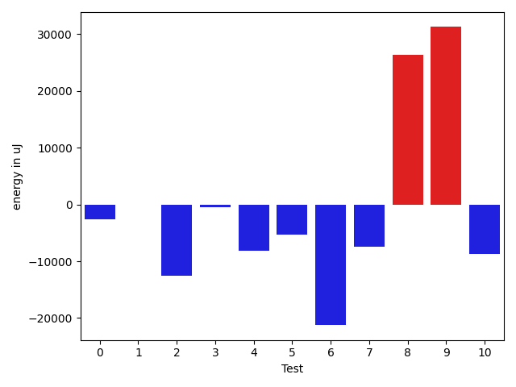

# gson 584809

https://github.com/google/gson/commit/584809

## Delta Energy per test method

| ID | EnergyV1 | EnergyV2 | DeltaEnergy | σV1 | %σV1 | σV2 | %σV2 |
| --- | --- | --- | --- | --- | --- | --- | --- |
| 0 | 252624 | 250061 | -2563 | 11566.26 | 4.58 | 17750.20 | 7.10 |
| 1 | 205871 | 205749 | -122 | 25350.09 | 12.31 | 17868.88 | 8.68 |
| 2 | 263488 | 250915 | -12573 | 26015.98 | 9.87 | 31549.48 | 12.57 |
| 3 | 212707 | 212219 | -488 | 68008.36 | 31.97 | 34005.62 | 16.02 |
| 4 | 211120 | 203002 | -8118 | 20122.07 | 9.53 | 46375.01 | 22.84 |
| 5 | 216247 | 210998 | -5249 | 21568.21 | 9.97 | 22048.60 | 10.45 |
| 6 | 195923 | 174682 | -21241 | 22996.13 | 11.74 | 18097.63 | 10.36 |
| 7 | 190185 | 182678 | -7507 | 16298.21 | 8.57 | 29679.63 | 16.25 |
| 8 | 515990 | 542296 | 26306 | 38120.45 | 7.39 | 46465.19 | 8.57 |
| 9 | 275390 | 306640 | 31250 | 23876.41 | 8.67 | 28243.80 | 9.21 |
| 10 | 1878779 | 1870113 | -8666 | 53585.05 | 2.85 | 52799.79 | 2.82 |

## Misc.

| ID | Test Class | Test Method |
| --- | --- | --- |
| 0 | com.google.gson.functional.TypeAdapterPrecedenceTest | testStreamingFollowedByNonstreaming |
| 1 | com.google.gson.functional.TypeAdapterPrecedenceTest | testStreamingHierarchicalFollowedByNonstreaming |
| 2 | com.google.gson.functional.TypeAdapterPrecedenceTest | testSerializeNonstreamingTypeAdapterFollowedByStreamingTypeAdapter |
| 3 | com.google.gson.functional.TypeAdapterPrecedenceTest | testNonstreamingHierarchicalFollowedByNonstreaming |
| 4 | com.google.gson.functional.TypeAdapterPrecedenceTest | testStreamingHierarchicalFollowedByNonstreamingHierarchical |
| 5 | com.google.gson.functional.TypeAdapterPrecedenceTest | testNonstreamingFollowedByNonstreaming |
| 6 | com.google.gson.functional.TypeAdapterPrecedenceTest | testStreamingFollowedByStreaming |
| 7 | com.google.gson.functional.TypeAdapterPrecedenceTest | testStreamingFollowedByNonstreamingHierarchical |
| 8 | com.google.gson.functional.StreamingTypeAdaptersTest | testNullSafe |
| 9 | com.google.gson.functional.JsonAdapterAnnotationOnClassesTest | testRegisteredDeserializerOverridesJsonAdapter |
| 10 | com.google.gson.functional.JsonAdapterAnnotationOnClassesTest | testRegisteredSerializerOverridesJsonAdapter |

## Classifications

### Tests
| ID | Class | Delta | Share |
| --- | --- | --- | --- |
| G | NEUTRAL | -8971.0 | - |
| N | NEGATIVE | -66527.0 | 11.11 |
| P | POSITIVE | 57556.0 | 50.00 |
| 2 | NEGATIVE | -12573.0 | 18.90 |
| 6 | NEGATIVE | -21241.0 | 31.93 |

### Lines
| Class | Java Class | Line |
| --- | --- | --- |
| negative | com.google.gson.stream.JsonReader | 1090 |
| negative | com.google.gson.stream.JsonReader | 1091 |
| negative | com.google.gson.stream.JsonReader | 1092 |
| unknown | com.google.gson.stream.JsonReader | 1090 |
| unknown | com.google.gson.stream.JsonReader | 1091 |
| unknown | com.google.gson.stream.JsonReader | 1092 |

## Localization of Green Regression
### Selected Tests
| Test class | test method |
| --- | --- |
| com.google.gson.functional.StreamingTypeAdaptersTest | testNullSafe |
| com.google.gson.functional.JsonAdapterAnnotationOnClassesTest | testRegisteredDeserializerOverridesJsonAdapter |

### Suspected lines
| Class | line |
| --- | --- |
| com.google.gson.stream.JsonReader | [1090](https://github.com/google/gson/tree/584809/gson/src/main/java/com/google/gson/stream/JsonReader.java#L1090) |
| com.google.gson.stream.JsonReader | [1091](https://github.com/google/gson/tree/584809/gson/src/main/java/com/google/gson/stream/JsonReader.java#L1090#L1091) |
| com.google.gson.stream.JsonReader | [1092](https://github.com/google/gson/tree/584809/gson/src/main/java/com/google/gson/stream/JsonReader.java#L1090#L1091#L1092) |

| Time Label | Time (s) |
| --- | --- |
| Selection | 35.36930727958679 |
| Injection | 22.456758737564087 |
| Total | 213.24198865890503 |

