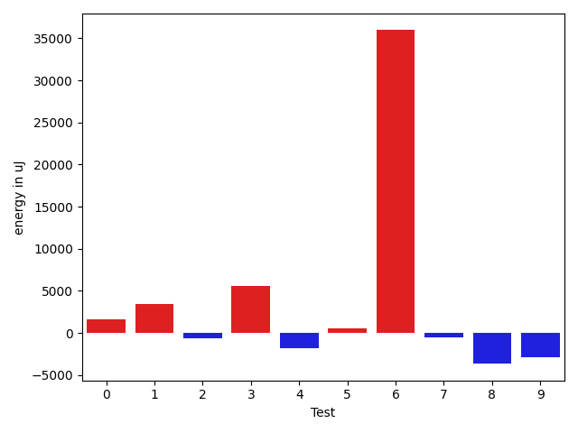
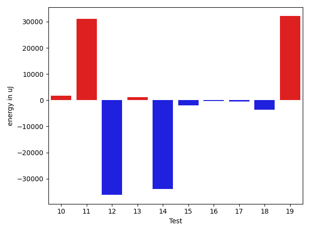
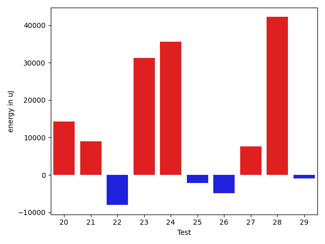
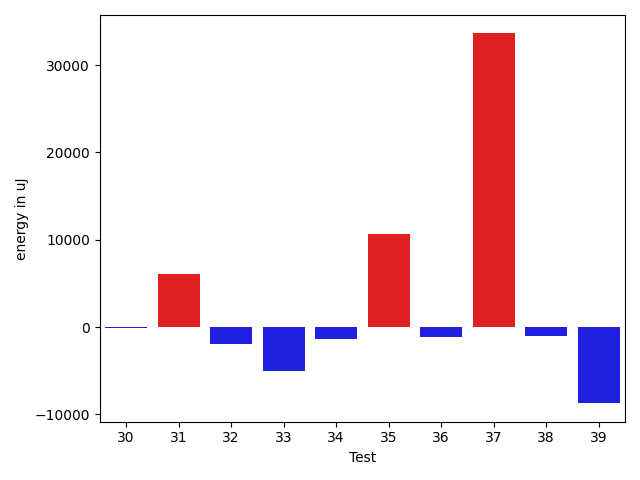
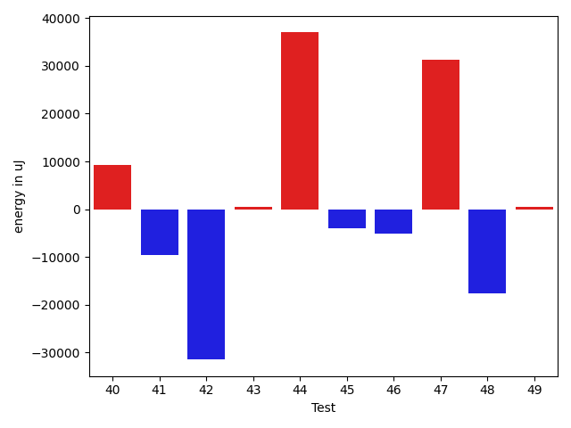
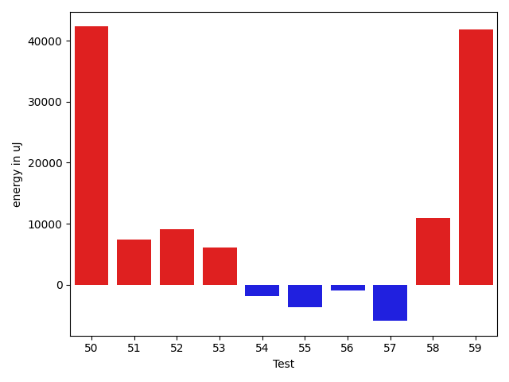
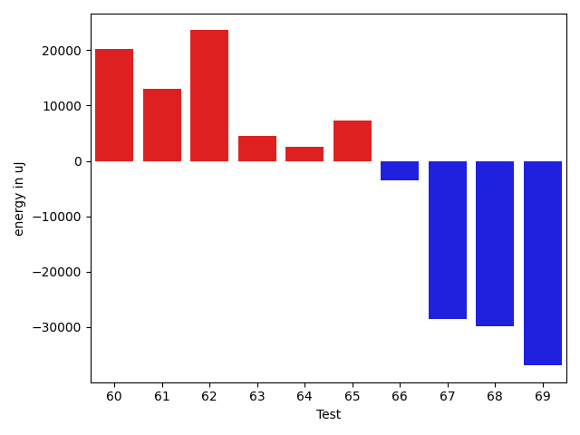
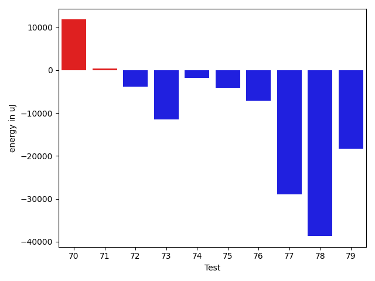
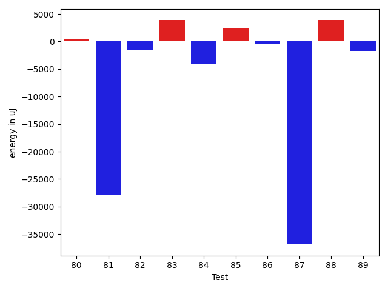
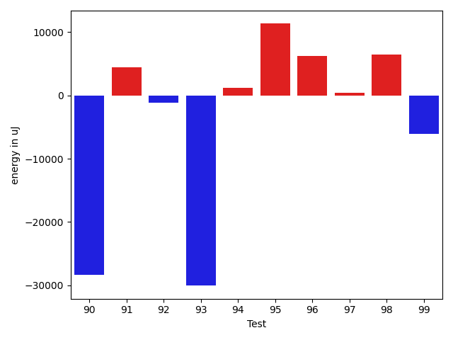

# gson 9bf25c

https://github.com/google/gson/commit/9bf25c

## Delta Energy per test method

| ID | EnergyV1 | EnergyV2 | DeltaEnergy | σV1 | %σV1 | σV2 | %σV2 |
| --- | --- | --- | --- | --- | --- | --- | --- |
| 0 | 123779 | 125366 | 1587 | 19583.83 | 15.82 | 19416.79 | 15.49 |
| 1 | 80261 | 83679 | 3418 | 2516.96 | 3.14 | 20356.08 | 24.33 |
| 2 | 81359 | 80688 | -671 | 13268.79 | 16.31 | 28284.97 | 35.05 |
| 3 | 85693 | 91248 | 5555 | 18571.82 | 21.67 | 27554.07 | 30.20 |
| 4 | 77881 | 76110 | -1771 | 10759.92 | 13.82 | 16665.58 | 21.90 |
| 5 | 85144 | 85694 | 550 | 20057.47 | 23.56 | 26079.00 | 30.43 |
| 6 | 41687 | 77636 | 35949 | 26253.13 | 62.98 | 24583.04 | 31.66 |
| 7 | 75928 | 75440 | -488 | 9801.94 | 12.91 | 18964.78 | 25.14 |
| 8 | 376037 | 372374 | -3663 | 16920.34 | 4.50 | 40686.00 | 10.93 |
| 9 | 172485 | 169556 | -2929 | 22631.49 | 13.12 | 33961.83 | 20.03 |
| 10 | 177184 | 178894 | 1710 | 16217.41 | 9.15 | 22163.76 | 12.39 |
| 11 | 209045 | 240112 | 31067 | 40558.31 | 19.40 | 29723.56 | 12.38 |
| 12 | 124267 | 88073 | -36194 | 18723.09 | 15.07 | 18415.73 | 20.91 |
| 13 | 164123 | 165222 | 1099 | 28847.45 | 17.58 | 27481.54 | 16.63 |
| 14 | 111999 | 78064 | -33935 | 15951.28 | 14.24 | 19302.66 | 24.73 |
| 15 | 44739 | 42725 | -2014 | 20382.08 | 45.56 | 13668.20 | 31.99 |
| 16 | 43823 | 43518 | -305 | 21109.28 | 48.17 | 21309.86 | 48.97 |
| 17 | 235900 | 235473 | -427 | 19063.86 | 8.08 | 13974.68 | 5.93 |
| 18 | 154236 | 150512 | -3724 | 15175.71 | 9.84 | 25154.82 | 16.71 |
| 19 | 125122 | 157226 | 32104 | 26428.27 | 21.12 | 28884.57 | 18.37 |
| 20 | 184997 | 199219 | 14222 | 17259.38 | 9.33 | 20391.68 | 10.24 |
| 21 | 245239 | 254211 | 8972 | 27791.67 | 11.33 | 19460.14 | 7.66 |
| 22 | 434935 | 426879 | -8056 | 49971.28 | 11.49 | 31185.06 | 7.31 |
| 23 | 555479 | 586730 | 31251 | 24361.36 | 4.39 | 45130.21 | 7.69 |
| 24 | 42419 | 78064 | 35645 | 18631.30 | 43.92 | 20335.77 | 26.05 |
| 25 | 44494 | 42358 | -2136 | 21715.09 | 48.80 | 13586.06 | 32.07 |
| 26 | 84045 | 79162 | -4883 | 18015.66 | 21.44 | 12399.47 | 15.66 |
| 27 | 161804 | 169372 | 7568 | 22565.49 | 13.95 | 13375.10 | 7.90 |
| 28 | 182800 | 225036 | 42236 | 90645.13 | 49.59 | 26962.57 | 11.98 |
| 29 | 86731 | 85754 | -977 | 23360.39 | 26.93 | 20107.14 | 23.45 |
| 30 | 42847 | 42785 | -62 | 18966.14 | 44.26 | 21438.38 | 50.11 |
| 31 | 77026 | 83129 | 6103 | 28371.72 | 36.83 | 25148.67 | 30.25 |
| 32 | 41260 | 39367 | -1893 | 18764.05 | 45.48 | 18728.73 | 47.57 |
| 33 | 150451 | 145385 | -5066 | 22145.19 | 14.72 | 19912.13 | 13.70 |
| 34 | 81176 | 79834 | -1342 | 12687.24 | 15.63 | 13352.85 | 16.73 |
| 35 | 315551 | 326232 | 10681 | 18528.64 | 5.87 | 28530.92 | 8.75 |
| 36 | 241637 | 240478 | -1159 | 22599.40 | 9.35 | 17061.03 | 7.09 |
| 37 | 278137 | 311767 | 33630 | 29661.85 | 10.66 | 44006.37 | 14.12 |
| 38 | 204712 | 203673 | -1039 | 27338.35 | 13.35 | 17034.08 | 8.36 |
| 39 | 209411 | 200683 | -8728 | 24850.33 | 11.87 | 24667.02 | 12.29 |
| 40 | 178954 | 188293 | 9339 | 15062.33 | 8.42 | 16316.65 | 8.67 |
| 41 | 208984 | 199401 | -9583 | 27772.72 | 13.29 | 27951.71 | 14.02 |
| 42 | 553100 | 521544 | -31556 | 44241.79 | 8.00 | 70511.60 | 13.52 |
| 43 | 165771 | 166321 | 550 | 19683.87 | 11.87 | 13137.42 | 7.90 |
| 44 | 399230 | 436339 | 37109 | 47450.41 | 11.89 | 39987.80 | 9.16 |
| 45 | 123841 | 119812 | -4029 | 14833.08 | 11.98 | 20375.24 | 17.01 |
| 46 | 175841 | 170654 | -5187 | 20382.12 | 11.59 | 27395.03 | 16.05 |
| 47 | 176330 | 207641 | 31311 | 22480.78 | 12.75 | 223603.08 | 107.69 |
| 48 | 686339 | 668638 | -17701 | 45895.61 | 6.69 | 39426.43 | 5.90 |
| 49 | 153747 | 154236 | 489 | 14632.79 | 9.52 | 35192.89 | 22.82 |
| 50 | 2070552 | 2112849 | 42297 | 134748.90 | 6.51 | 84898.58 | 4.02 |
| 51 | 244995 | 252441 | 7446 | 23269.66 | 9.50 | 12680.33 | 5.02 |
| 52 | 334838 | 343993 | 9155 | 23717.79 | 7.08 | 12884.86 | 3.75 |
| 53 | 192932 | 199096 | 6164 | 14383.74 | 7.46 | 23692.09 | 11.90 |
| 54 | 83496 | 81604 | -1892 | 2617.64 | 3.14 | 25434.34 | 31.17 |
| 55 | 313110 | 309447 | -3663 | 30639.27 | 9.79 | 21332.74 | 6.89 |
| 56 | 223022 | 222106 | -916 | 12457.88 | 5.59 | 30572.18 | 13.76 |
| 57 | 224914 | 218994 | -5920 | 31212.85 | 13.88 | 39740.78 | 18.15 |
| 58 | 221862 | 232788 | 10926 | 20135.31 | 9.08 | 20431.28 | 8.78 |
| 59 | 84838 | 126647 | 41809 | 23183.79 | 27.33 | 19336.75 | 15.27 |
| 60 | 372924 | 393187 | 20263 | 18495.32 | 4.96 | 38880.35 | 9.89 |
| 61 | 566465 | 579528 | 13063 | 69281.04 | 12.23 | 26316.44 | 4.54 |
| 62 | 1120054 | 1143613 | 23559 | 49759.42 | 4.44 | 58646.25 | 5.13 |
| 63 | 345946 | 350402 | 4456 | 32318.50 | 9.34 | 18579.75 | 5.30 |
| 64 | 301940 | 304442 | 2502 | 20717.42 | 6.86 | 24570.89 | 8.07 |
| 65 | 354736 | 361999 | 7263 | 16257.57 | 4.58 | 28985.36 | 8.01 |
| 66 | 356567 | 353087 | -3480 | 26346.81 | 7.39 | 21050.00 | 5.96 |
| 67 | 768858 | 740233 | -28625 | 40099.40 | 5.22 | 57527.95 | 7.77 |
| 68 | 223388 | 193542 | -29846 | 20546.46 | 9.20 | 14878.61 | 7.69 |
| 69 | 156188 | 119262 | -36926 | 21029.08 | 13.46 | 22827.12 | 19.14 |
| 70 | 317565 | 329344 | 11779 | 22778.54 | 7.17 | 25391.65 | 7.71 |
| 71 | 119690 | 120055 | 365 | 11579.33 | 9.67 | 24333.75 | 20.27 |
| 72 | 113342 | 109435 | -3907 | 13658.82 | 12.05 | 2447.90 | 2.24 |
| 73 | 470519 | 458984 | -11535 | 38526.62 | 8.19 | 38737.17 | 8.44 |
| 74 | 122742 | 120911 | -1831 | 16692.56 | 13.60 | 13113.94 | 10.85 |
| 75 | 127136 | 122985 | -4151 | 24552.83 | 19.31 | 16414.20 | 13.35 |
| 76 | 127930 | 120788 | -7142 | 24441.64 | 19.11 | 14281.60 | 11.82 |
| 77 | 234130 | 205138 | -28992 | 39731.27 | 16.97 | 15349.97 | 7.48 |
| 78 | 119506 | 80810 | -38696 | 26834.58 | 22.45 | 18101.33 | 22.40 |
| 79 | 462341 | 443969 | -18372 | 30970.10 | 6.70 | 26828.15 | 6.04 |
| 80 | 118896 | 119324 | 428 | 16750.33 | 14.09 | 19194.10 | 16.09 |
| 81 | 399596 | 371703 | -27893 | 43721.16 | 10.94 | 39992.83 | 10.76 |
| 82 | 283508 | 281859 | -1649 | 16557.42 | 5.84 | 22282.77 | 7.91 |
| 83 | 249450 | 253295 | 3845 | 12449.64 | 4.99 | 18150.62 | 7.17 |
| 84 | 509093 | 504943 | -4150 | 26272.29 | 5.16 | 25885.35 | 5.13 |
| 85 | 296569 | 298888 | 2319 | 21635.94 | 7.30 | 22291.21 | 7.46 |
| 86 | 84900 | 84534 | -366 | 21940.14 | 25.84 | 18574.28 | 21.97 |
| 87 | 79590 | 42725 | -36865 | 19300.00 | 24.25 | 21708.78 | 50.81 |
| 88 | 77453 | 81299 | 3846 | 20320.68 | 26.24 | 20290.10 | 24.96 |
| 89 | 83251 | 81543 | -1708 | 19849.24 | 23.84 | 20239.93 | 24.82 |
| 90 | 266723 | 238403 | -28320 | 48367.95 | 18.13 | 21239.80 | 8.91 |
| 91 | 116882 | 121277 | 4395 | 27977.58 | 23.94 | 23460.55 | 19.34 |
| 92 | 126647 | 125488 | -1159 | 13279.71 | 10.49 | 21829.86 | 17.40 |
| 93 | 116089 | 86059 | -30030 | 18773.81 | 16.17 | 17874.21 | 20.77 |
| 94 | 80017 | 81238 | 1221 | 19702.65 | 24.62 | 20994.55 | 25.84 |
| 95 | 295471 | 306762 | 11291 | 21832.54 | 7.39 | 24690.01 | 8.05 |
| 96 | 82214 | 88379 | 6165 | 17594.34 | 21.40 | 21681.04 | 24.53 |
| 97 | 84473 | 84838 | 365 | 18483.52 | 21.88 | 18889.97 | 22.27 |
| 98 | 234557 | 240966 | 6409 | 29419.37 | 12.54 | 36174.88 | 15.01 |
| 99 | 126953 | 120849 | -6104 | 20862.09 | 16.43 | 27605.51 | 22.84 |

## Misc.

| ID | Test Class | Test Method |
| --- | --- | --- |
| 0 | com.google.gson.functional.TypeAdapterPrecedenceTest | testStreamingFollowedByNonstreaming |
| 1 | com.google.gson.functional.TypeAdapterPrecedenceTest | testStreamingHierarchicalFollowedByNonstreaming |
| 2 | com.google.gson.functional.TypeAdapterPrecedenceTest | testSerializeNonstreamingTypeAdapterFollowedByStreamingTypeAdapter |
| 3 | com.google.gson.functional.TypeAdapterPrecedenceTest | testNonstreamingHierarchicalFollowedByNonstreaming |
| 4 | com.google.gson.functional.TypeAdapterPrecedenceTest | testStreamingHierarchicalFollowedByNonstreamingHierarchical |
| 5 | com.google.gson.functional.TypeAdapterPrecedenceTest | testNonstreamingFollowedByNonstreaming |
| 6 | com.google.gson.functional.TypeAdapterPrecedenceTest | testStreamingFollowedByStreaming |
| 7 | com.google.gson.functional.TypeAdapterPrecedenceTest | testStreamingFollowedByNonstreamingHierarchical |
| 8 | com.google.gson.functional.StreamingTypeAdaptersTest | testNullSafe |
| 9 | com.google.gson.functional.JsonAdapterAnnotationOnClassesTest | testJsonAdapterInvoked |
| 10 | com.google.gson.functional.JsonAdapterAnnotationOnClassesTest | testRegisteredDeserializerOverridesJsonAdapter |
| 11 | com.google.gson.functional.JsonAdapterAnnotationOnClassesTest | testRegisteredSerializerOverridesJsonAdapter |
| 12 | com.google.gson.functional.JsonAdapterAnnotationOnClassesTest | testJsonAdapterFactoryInvoked |
| 13 | com.google.gson.functional.CustomDeserializerTest | testDefaultConstructorNotCalledOnField |
| 14 | com.google.gson.functional.CustomDeserializerTest | testDefaultConstructorNotCalledOnObject |
| 15 | com.google.gson.OverrideCoreTypeAdaptersTest | testOverrideStringAdapter |
| 16 | com.google.gson.OverrideCoreTypeAdaptersTest | testOverridePrimitiveBooleanAdapter |
| 17 | com.google.gson.OverrideCoreTypeAdaptersTest | testOverrideWrapperBooleanAdapter |
| 18 | com.google.gson.functional.JsonAdapterSerializerDeserializerTest | testJsonSerializerDeserializerBasedJsonAdapterOnFields |
| 19 | com.google.gson.functional.JsonAdapterSerializerDeserializerTest | testJsonSerializerDeserializerBasedJsonAdapterOnClass |
| 20 | com.google.gson.functional.ThrowableFunctionalTest | testExceptionWithoutCause |
| 21 | com.google.gson.functional.ThrowableFunctionalTest | testErrornWithCause |
| 22 | com.google.gson.functional.ThrowableFunctionalTest | testErrorWithoutCause |
| 23 | com.google.gson.functional.ThrowableFunctionalTest | testExceptionWithCause |
| 24 | com.google.gson.functional.JavaUtilConcurrentAtomicTest | testAtomicInteger |
| 25 | com.google.gson.functional.JavaUtilConcurrentAtomicTest | testAtomicLong |
| 26 | com.google.gson.functional.JavaUtilConcurrentAtomicTest | testAtomicLongArray |
| 27 | com.google.gson.functional.JavaUtilConcurrentAtomicTest | testAtomicLongWithStringSerializationPolicy |
| 28 | com.google.gson.functional.JavaUtilConcurrentAtomicTest | testAtomicLongArrayWithStringSerializationPolicy |
| 29 | com.google.gson.functional.JavaUtilConcurrentAtomicTest | testAtomicIntegerArray |
| 30 | com.google.gson.functional.JavaUtilConcurrentAtomicTest | testAtomicBoolean |
| 31 | com.google.gson.functional.StringTest | testEscapingQuotesInStringSerialization |
| 32 | com.google.gson.functional.StringTest | testSingleQuoteInStringSerialization |
| 33 | com.google.gson.functional.ReadersWritersTest | testReadWriteTwoObjects |
| 34 | com.google.gson.functional.ReadersWritersTest | testReadWriteTwoStrings |
| 35 | com.google.gson.functional.MapTest | testConcurrentSkipListMap |
| 36 | com.google.gson.functional.MapTest | testConcurrentHashMap |
| 37 | com.google.gson.functional.MapTest | testConcurrentMap |
| 38 | com.google.gson.functional.MapTest | testConcurrentNavigableMap |
| 39 | com.google.gson.functional.CollectionTest | testStack |
| 40 | com.google.gson.functional.CollectionTest | testPriorityQueue |
| 41 | com.google.gson.functional.CollectionTest | testFieldIsArrayList |
| 42 | com.google.gson.functional.CollectionTest | testWildcardCollectionField |
| 43 | com.google.gson.functional.CollectionTest | testVector |
| 44 | com.google.gson.functional.DefaultTypeAdaptersTest | testBitSetDeserialization |
| 45 | com.google.gson.functional.DefaultTypeAdaptersTest | testOverrideBigIntegerTypeAdapter |
| 46 | com.google.gson.functional.DefaultTypeAdaptersTest | testSqlDateSerialization |
| 47 | com.google.gson.functional.DefaultTypeAdaptersTest | testTimestampSerialization |
| 48 | com.google.gson.functional.DefaultTypeAdaptersTest | testDefaultDateDeserializationUsingBuilder |
| 49 | com.google.gson.functional.DefaultTypeAdaptersTest | testOverrideBigDecimalTypeAdapter |
| 50 | com.google.gson.functional.DefaultTypeAdaptersTest | testNullSerialization |
| 51 | com.google.gson.functional.DefaultTypeAdaptersTest | testDateDeserializationWithPattern |
| 52 | com.google.gson.functional.DefaultTypeAdaptersTest | testDateSerializationInCollection |
| 53 | com.google.gson.functional.EnumTest | testEnumSubclassAsParameterizedType |
| 54 | com.google.gson.functional.EnumTest | testEnumCaseMapping |
| 55 | com.google.gson.functional.EnumTest | testEnumSubclass |
| 56 | com.google.gson.functional.EnumTest | testEnumSubclassWithRegisteredTypeAdapter |
| 57 | com.google.gson.functional.EnumTest | testEnumClassWithFields |
| 58 | com.google.gson.functional.EnumTest | testEnumSet |
| 59 | com.google.gson.functional.DelegateTypeAdapterTest | testDelegateInvokedOnStrings |
| 60 | com.google.gson.functional.DelegateTypeAdapterTest | testDelegateInvoked |
| 61 | com.google.gson.JsonParserTest | testReadWriteTwoObjects |
| 62 | com.google.gson.JsonParserTest | testParseMixedArray |
| 63 | com.google.gson.functional.ParameterizedTypesTest | testVariableTypeArrayDeserialization |
| 64 | com.google.gson.functional.ParameterizedTypesTest | testVariableTypeDeserialization |
| 65 | com.google.gson.functional.ParameterizedTypesTest | testParameterizedTypeGenericArraysDeserialization |
| 66 | com.google.gson.functional.ParameterizedTypesTest | testVariableTypeFieldsAndGenericArraysDeserialization |
| 67 | com.google.gson.functional.ParameterizedTypesTest | testParameterizedTypeWithVariableTypeDeserialization |
| 68 | com.google.gson.functional.ObjectTest | testSingletonLists |
| 69 | com.google.gson.functional.JsonAdapterAnnotationOnFieldsTest | testPrimitiveFieldAnnotationTakesPrecedenceOverDefault |
| 70 | com.google.gson.functional.JsonAdapterAnnotationOnFieldsTest | testClassAnnotationAdapterFactoryTakesPrecedenceOverDefault |
| 71 | com.google.gson.functional.JsonAdapterAnnotationOnFieldsTest | testJsonAdapterWrappedInNullSafeAsRequested |
| 72 | com.google.gson.functional.JsonAdapterAnnotationOnFieldsTest | testClassAnnotationAdapterTakesPrecedenceOverDefault |
| 73 | com.google.gson.functional.JsonAdapterAnnotationOnFieldsTest | testFieldAnnotationWorksForParameterizedType |
| 74 | com.google.gson.functional.JsonAdapterAnnotationOnFieldsTest | testRegisteredTypeAdapterTakesPrecedenceOverClassAnnotationAdapter |
| 75 | com.google.gson.functional.JsonAdapterAnnotationOnFieldsTest | testFieldAnnotationTakesPrecedenceOverClassAnnotation |
| 76 | com.google.gson.functional.JsonAdapterAnnotationOnFieldsTest | testNonPrimitiveFieldAnnotationTakesPrecedenceOverDefault |
| 77 | com.google.gson.functional.JsonAdapterAnnotationOnFieldsTest | testFieldAnnotationTakesPrecedenceOverRegisteredTypeAdapter |
| 78 | com.google.gson.functional.TypeHierarchyAdapterTest | testRegisterSuperTypeFirst |
| 79 | com.google.gson.functional.TypeHierarchyAdapterTest | testTypeHierarchy |
| 80 | com.google.gson.functional.TypeVariableTest | testBasicTypeVariables |
| 81 | com.google.gson.functional.TypeVariableTest | testAdvancedTypeVariables |
| 82 | com.google.gson.functional.TypeVariableTest | testTypeVariablesViaTypeParameter |
| 83 | com.google.gson.functional.MapAsArrayTypeAdapterTest | testMultipleEnableComplexKeyRegistrationHasNoEffect |
| 84 | com.google.gson.functional.MapAsArrayTypeAdapterTest | testSerializeComplexMapWithTypeAdapter |
| 85 | com.google.gson.functional.RuntimeTypeAdapterFactoryFunctionalTest | testSubclassesAutomaticallySerialized |
| 86 | com.google.gson.functional.UncategorizedTest | testGsonInstanceReusableForSerializationAndDeserialization |
| 87 | com.google.gson.functional.PrimitiveTest | testQuotedStringSerializationAndDeserialization |
| 88 | com.google.gson.GsonTypeAdapterTest | testTypeAdapterDoesNotAffectNonAdaptedTypes |
| 89 | com.google.gson.GsonTypeAdapterTest | testTypeAdapterProperlyConvertsTypes |
| 90 | com.google.gson.GsonTypeAdapterTest | testTypeAdapterThrowsException |
| 91 | com.google.gson.functional.EscapingTest | testGsonDoubleDeserialization |
| 92 | com.google.gson.functional.EscapingTest | testGsonAcceptsEscapedAndNonEscapedJsonDeserialization |
| 93 | com.google.gson.functional.EscapingTest | testEscapingObjectFields |
| 94 | com.google.gson.functional.EscapingTest | testEscapingQuotesInStringArray |
| 95 | com.google.gson.functional.NamingPolicyTest | testComplexFieldNameStrategy |
| 96 | com.google.gson.functional.CustomTypeAdaptersTest | testRegisterHierarchyAdapterForDate |
| 97 | com.google.gson.functional.JavaUtilTest | testProperties |
| 98 | com.google.gson.functional.JavaUtilTest | testCurrency |
| 99 | com.google.gson.DefaultInetAddressTypeAdapterTest | testInetAddressSerializationAndDeserialization |

## Classifications

### Tests
| ID | Class | Delta | Share |
| --- | --- | --- | --- |
| G | NEUTRAL | 69820.0 | - |
| N | NEGATIVE | -553656.0 | 1.89 |
| P | POSITIVE | 623476.0 | 2.13 |
| 6 | POSITIVE | 35949.0 | 5.77 |
| 11 | POSITIVE | 31067.0 | 4.98 |
| 12 | NEGATIVE | -36194.0 | 6.54 |
| 14 | NEGATIVE | -33935.0 | 6.13 |
| 19 | POSITIVE | 32104.0 | 5.15 |
| 23 | POSITIVE | 31251.0 | 5.01 |
| 24 | POSITIVE | 35645.0 | 5.72 |
| 28 | POSITIVE | 42236.0 | 6.77 |
| 37 | POSITIVE | 33630.0 | 5.39 |
| 42 | NEGATIVE | -31556.0 | 5.70 |
| 44 | POSITIVE | 37109.0 | 5.95 |
| 47 | POSITIVE | 31311.0 | 5.02 |
| 48 | NEGATIVE | -17701.0 | 3.20 |
| 50 | POSITIVE | 42297.0 | 6.78 |
| 59 | POSITIVE | 41809.0 | 6.71 |
| 60 | POSITIVE | 20263.0 | 3.25 |
| 62 | POSITIVE | 23559.0 | 3.78 |
| 67 | NEGATIVE | -28625.0 | 5.17 |
| 68 | NEGATIVE | -29846.0 | 5.39 |
| 69 | NEGATIVE | -36926.0 | 6.67 |
| 77 | NEGATIVE | -28992.0 | 5.24 |
| 78 | NEGATIVE | -38696.0 | 6.99 |
| 79 | NEGATIVE | -18372.0 | 3.32 |
| 81 | NEGATIVE | -27893.0 | 5.04 |
| 87 | NEGATIVE | -36865.0 | 6.66 |
| 90 | NEGATIVE | -28320.0 | 5.12 |
| 93 | NEGATIVE | -30030.0 | 5.42 |

### Lines
| Class | Java Class | Line |
| --- | --- | --- |
| negative | com.google.gson.stream.JsonReader | 1573 |
| negative | com.google.gson.stream.JsonReader | 1574 |
| negative | com.google.gson.stream.JsonReader | 1575 |
| negative | com.google.gson.stream.JsonReader | 1579 |
| negative | com.google.gson.stream.JsonReader | 1580 |
| positive | com.google.gson.stream.JsonReader | 1573 |
| positive | com.google.gson.stream.JsonReader | 1574 |
| positive | com.google.gson.stream.JsonReader | 1575 |
| positive | com.google.gson.stream.JsonReader | 1579 |
| positive | com.google.gson.stream.JsonReader | 1580 |
| unknown | com.google.gson.stream.JsonReader | 1573 |
| unknown | com.google.gson.stream.JsonReader | 1574 |
| unknown | com.google.gson.stream.JsonReader | 1575 |
| unknown | com.google.gson.stream.JsonReader | 1579 |
| unknown | com.google.gson.stream.JsonReader | 1580 |

## Localization of Green Regression
### Selected Tests
| Test class | test method |
| --- | --- |

### Suspected lines
| Class | line |
| --- | --- |
| com.google.gson.stream.JsonReader | [1579](https://github.com/google/gson/tree/9bf25c/gson/src/main/java/com/google/gson/stream/JsonReader.java#L1579) |
| com.google.gson.stream.JsonReader | [1573](https://github.com/google/gson/tree/9bf25c/gson/src/main/java/com/google/gson/stream/JsonReader.java#L1579#L1573) |
| com.google.gson.stream.JsonReader | [1580](https://github.com/google/gson/tree/9bf25c/gson/src/main/java/com/google/gson/stream/JsonReader.java#L1579#L1573#L1580) |
| com.google.gson.stream.JsonReader | [1575](https://github.com/google/gson/tree/9bf25c/gson/src/main/java/com/google/gson/stream/JsonReader.java#L1579#L1573#L1580#L1575) |
| com.google.gson.stream.JsonReader | [1574](https://github.com/google/gson/tree/9bf25c/gson/src/main/java/com/google/gson/stream/JsonReader.java#L1579#L1573#L1580#L1575#L1574) |

| Time Label | Time (s) |
| --- | --- |
| Selection | 36.66021132469177 |
| Injection | 61.212159156799316 |
| Total | 323.777708530426 |

