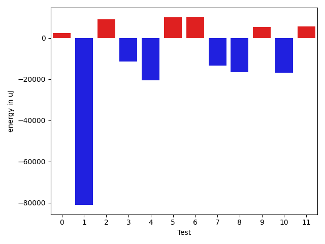

# gson 423ff0

https://github.com/google/gson/commit/423ff0

## Delta Energy per test method

| ID | EnergyV1 | EnergyV2 | DeltaEnergy | σV1 | %σV1 | σV2 | %σV2 |
| --- | --- | --- | --- | --- | --- | --- | --- |
| 0 | 661192 | 663634 | 2442 | 28785.09 | 4.35 | 50759.31 | 7.65 |
| 1 | 2061762 | 1980646 | -81116 | 93480.70 | 4.53 | 207395.46 | 10.47 |
| 2 | 765562 | 774717 | 9155 | 38248.78 | 5.00 | 50842.52 | 6.56 |
| 3 | 193114 | 181579 | -11535 | 16093.21 | 8.33 | 21627.78 | 11.91 |
| 4 | 212646 | 192199 | -20447 | 24376.18 | 11.46 | 22961.82 | 11.95 |
| 5 | 346373 | 356505 | 10132 | 23785.89 | 6.87 | 44488.09 | 12.48 |
| 6 | 341247 | 351439 | 10192 | 19501.81 | 5.71 | 45929.89 | 13.07 |
| 7 | 392394 | 379027 | -13367 | 20779.69 | 5.30 | 42670.38 | 11.26 |
| 8 | 646055 | 629454 | -16601 | 40817.10 | 6.32 | 44910.22 | 7.13 |
| 9 | 352416 | 357910 | 5494 | 34542.55 | 9.80 | 25310.85 | 7.07 |
| 10 | 267395 | 250487 | -16908 | 21754.62 | 8.14 | 32651.46 | 13.04 |
| 11 | 207580 | 213196 | 5616 | 49207.64 | 23.71 | 13818.67 | 6.48 |

## Misc.

| ID | Test Class | Test Method |
| --- | --- | --- |
| 0 | com.google.gson.functional.MapTest | testInterfaceTypeMapWithSerializer |
| 1 | com.google.gson.functional.MapTest | testGeneralMapField |
| 2 | com.google.gson.functional.MapTest | testInterfaceTypeMap |
| 3 | com.google.gson.functional.NamingPolicyTest | testGsonWithNonDefaultFieldNamingPolicySerialization |
| 4 | com.google.gson.functional.NamingPolicyTest | testGsonWithUpperCamelCaseSpacesPolicyDeserialiation |
| 5 | com.google.gson.functional.NamingPolicyTest | testGsonWithNonDefaultFieldNamingPolicyDeserialiation |
| 6 | com.google.gson.functional.NamingPolicyTest | testGsonWithUpperCamelCaseSpacesPolicySerialiation |
| 7 | com.google.gson.functional.MapAsArrayTypeAdapterTest | testMultipleEnableComplexKeyRegistrationHasNoEffect |
| 8 | com.google.gson.functional.MapAsArrayTypeAdapterTest | testSerializeComplexMapWithTypeAdapter |
| 9 | com.google.gson.functional.MapAsArrayTypeAdapterTest | testMapWithTypeVariableSerialization |
| 10 | com.google.gson.functional.FieldNamingTest | testUpperCamelCase |
| 11 | com.google.gson.functional.FieldNamingTest | testUpperCamelCaseWithSpaces |

## Classifications

### Tests
| ID | Class | Delta | Share |
| --- | --- | --- | --- |
| G | NEUTRAL | -116943.0 | - |
| N | NEGATIVE | -159974.0 | 16.67 |
| P | POSITIVE | 43031.0 | 16.67 |
| 1 | NEGATIVE | -81116.0 | 50.71 |

### Lines
| Class | Java Class | Line |
| --- | --- | --- |
| negative | com.google.gson.internal.bind.MapTypeAdapterFactory | 236 |
| unknown | com.google.gson.FieldNamingPolicy | 153 |
| unknown | com.google.gson.FieldNamingPolicy | 154 |
| unknown | com.google.gson.internal.bind.MapTypeAdapterFactory | 227 |
| unknown | com.google.gson.internal.bind.MapTypeAdapterFactory | 236 |

## Localization of Green Regression
### Selected Tests
| Test class | test method |
| --- | --- |

### Suspected lines
| Class | line |
| --- | --- |
| com.google.gson.internal.bind.MapTypeAdapterFactory | [236](https://github.com/google/gson/tree/423ff0/gson/src/main/java/com/google/gson/internal/bind/MapTypeAdapterFactory.java#L236) |
| com.google.gson.internal.bind.MapTypeAdapterFactory | [227](https://github.com/google/gson/tree/423ff0/gson/src/main/java/com/google/gson/internal/bind/MapTypeAdapterFactory.java#L236#L227) |
| com.google.gson.FieldNamingPolicy | [153](https://github.com/google/gson/tree/423ff0/gson/src/main/java/com/google/gson/FieldNamingPolicy.java#L153) |
| com.google.gson.FieldNamingPolicy | [154](https://github.com/google/gson/tree/423ff0/gson/src/main/java/com/google/gson/FieldNamingPolicy.java#L153#L154) |

| Time Label | Time (s) |
| --- | --- |
| Selection | 34.465803384780884 |
| Injection | 18.250820875167847 |
| Total | 207.86967611312866 |

