# gson 8101ab

https://github.com/google/gson/commit/8101ab

## Delta Energy per test method

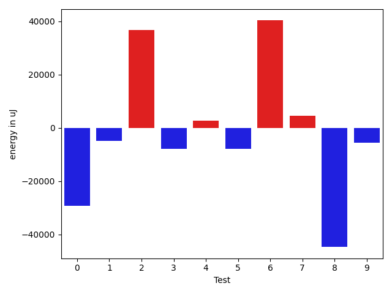

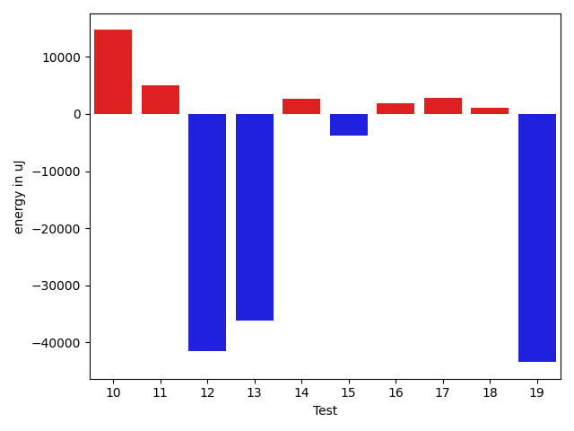

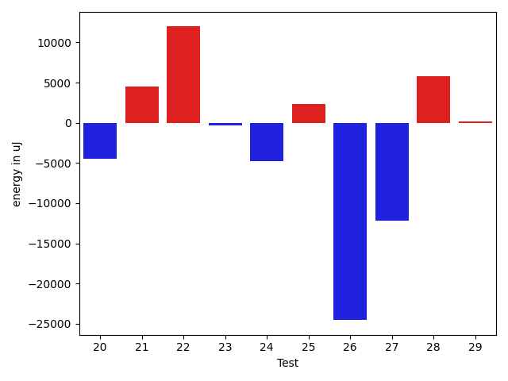

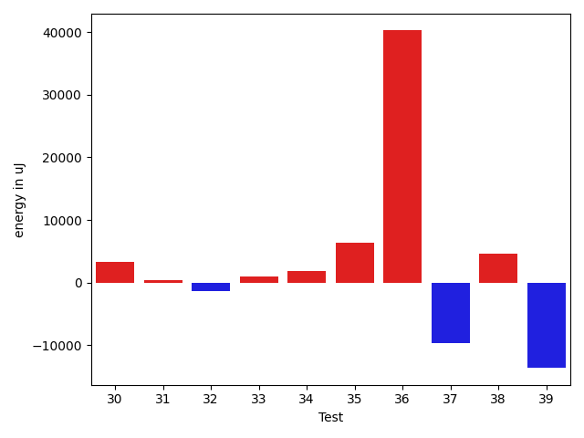

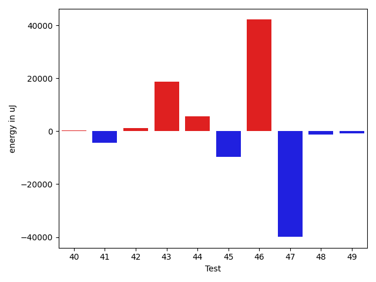

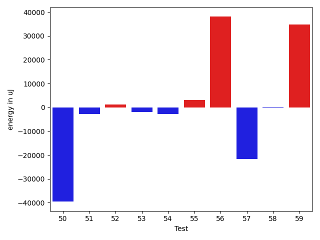

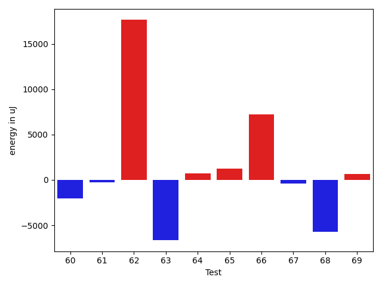

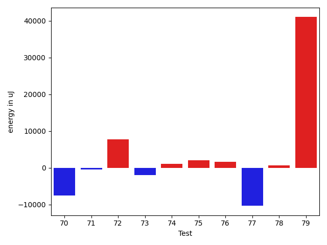

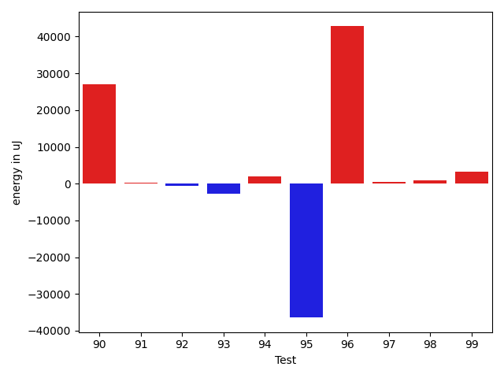

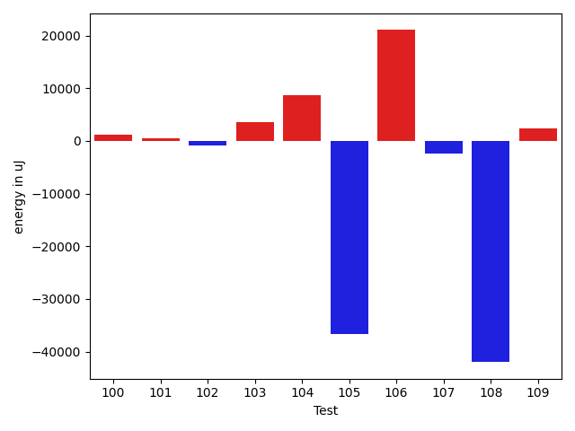

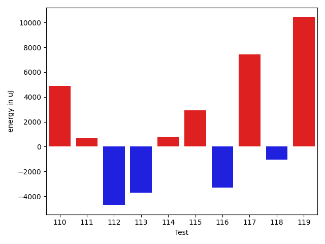

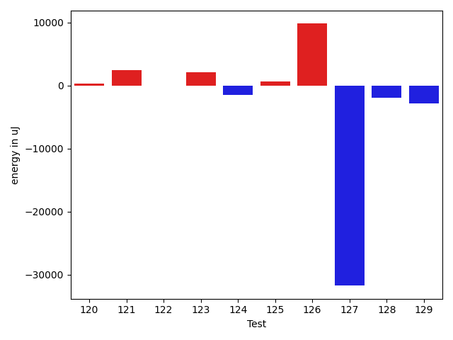

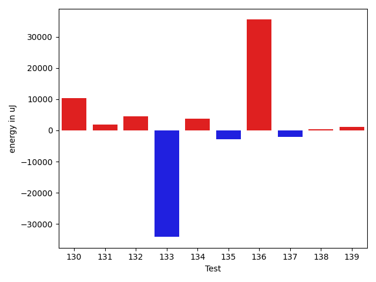

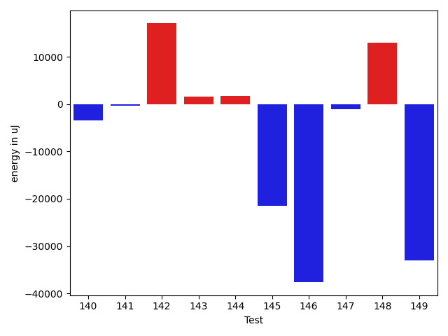

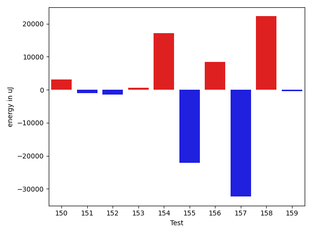

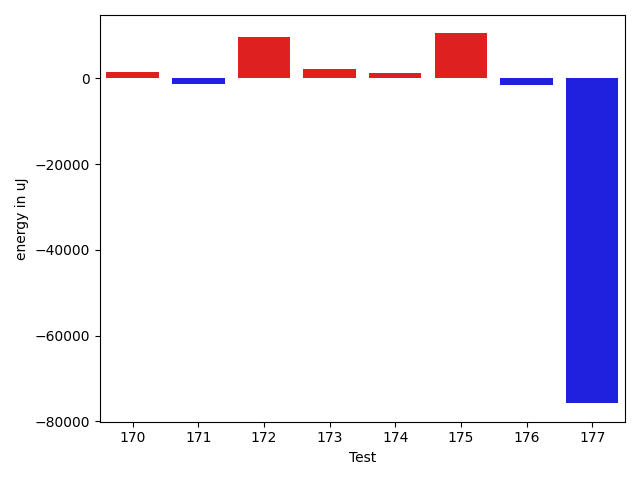

| ID | EnergyV1 | EnergyV2 | DeltaEnergy | σV1 | %σV1 | σV2 | %σV2 |
| --- | --- | --- | --- | --- | --- | --- | --- |
| 0 | 118042 | 88867 | -29175 | 19650.18 | 16.65 | 21398.15 | 24.08 |
| 1 | 91003 | 86182 | -4821 | 19178.31 | 21.07 | 5261.21 | 6.10 |
| 2 | 90393 | 127075 | 36682 | 22327.10 | 24.70 | 23051.35 | 18.14 |
| 3 | 87829 | 79956 | -7873 | 22628.35 | 25.76 | 17105.46 | 21.39 |
| 4 | 88073 | 90760 | 2687 | 26311.68 | 29.87 | 20829.79 | 22.95 |
| 5 | 91491 | 83557 | -7934 | 3079.86 | 3.37 | 28526.92 | 34.14 |
| 6 | 46204 | 86487 | 40283 | 21987.02 | 47.59 | 23249.66 | 26.88 |
| 7 | 86914 | 91369 | 4455 | 21230.02 | 24.43 | 21027.58 | 23.01 |
| 8 | 220276 | 175597 | -44679 | 25501.75 | 11.58 | 28766.39 | 16.38 |
| 9 | 173889 | 168396 | -5493 | 20480.67 | 11.78 | 19980.85 | 11.87 |
| 10 | 203002 | 217711 | 14709 | 15732.41 | 7.75 | 24414.85 | 11.21 |
| 11 | 214477 | 219482 | 5005 | 17807.19 | 8.30 | 25795.81 | 11.75 |
| 12 | 179260 | 137756 | -41504 | 21613.15 | 12.06 | 23364.01 | 16.96 |
| 13 | 121033 | 84838 | -36195 | 21231.64 | 17.54 | 20122.84 | 23.72 |
| 14 | 171813 | 174560 | 2747 | 16630.34 | 9.68 | 4236.98 | 2.43 |
| 15 | 216979 | 213134 | -3845 | 74908.61 | 34.52 | 13179.36 | 6.18 |
| 16 | 175232 | 177123 | 1891 | 41205.56 | 23.51 | 17714.10 | 10.00 |
| 17 | 84289 | 87097 | 2808 | 16268.33 | 19.30 | 15974.08 | 18.34 |
| 18 | 90331 | 91431 | 1100 | 21963.14 | 24.31 | 13247.93 | 14.49 |
| 19 | 240173 | 196715 | -43458 | 28199.78 | 11.74 | 18628.55 | 9.47 |
| 20 | 175720 | 171203 | -4517 | 18983.09 | 10.80 | 19741.40 | 11.53 |
| 21 | 217773 | 222289 | 4516 | 22346.77 | 10.26 | 25674.26 | 11.55 |
| 22 | 162109 | 174072 | 11963 | 15173.90 | 9.36 | 17811.63 | 10.23 |
| 23 | 93017 | 92713 | -304 | 43138.77 | 46.38 | 18626.92 | 20.09 |
| 24 | 91064 | 86303 | -4761 | 20345.00 | 22.34 | 14859.09 | 17.22 |
| 25 | 173462 | 175842 | 2380 | 14385.62 | 8.29 | 18007.10 | 10.24 |
| 26 | 146423 | 121887 | -24536 | 16275.59 | 11.12 | 18764.24 | 15.39 |
| 27 | 275940 | 263733 | -12207 | 78702.83 | 28.52 | 27611.44 | 10.47 |
| 28 | 123779 | 129578 | 5799 | 21561.47 | 17.42 | 22174.09 | 17.11 |
| 29 | 202758 | 202881 | 123 | 23462.81 | 11.57 | 29156.85 | 14.37 |
| 30 | 133911 | 137268 | 3357 | 131796.76 | 98.42 | 25784.66 | 18.78 |
| 31 | 386900 | 387267 | 367 | 23290.87 | 6.02 | 27404.79 | 7.08 |
| 32 | 47241 | 45959 | -1282 | 20686.70 | 43.79 | 24167.65 | 52.59 |
| 33 | 43518 | 44555 | 1037 | 2400.87 | 5.52 | 52676.77 | 118.23 |
| 34 | 135376 | 137268 | 1892 | 17530.82 | 12.95 | 23316.41 | 16.99 |
| 35 | 124389 | 130737 | 6348 | 14115.56 | 11.35 | 21043.53 | 16.10 |
| 36 | 132263 | 172485 | 40222 | 31992.74 | 24.19 | 18695.60 | 10.84 |
| 37 | 168762 | 159057 | -9705 | 11572.89 | 6.86 | 27867.75 | 17.52 |
| 38 | 129089 | 133667 | 4578 | 13524.09 | 10.48 | 13271.72 | 9.93 |
| 39 | 454405 | 440794 | -13611 | 34698.25 | 7.64 | 37751.24 | 8.56 |
| 40 | 402342 | 402587 | 245 | 31446.06 | 7.82 | 20100.56 | 4.99 |
| 41 | 343750 | 339293 | -4457 | 24313.15 | 7.07 | 25418.88 | 7.49 |
| 42 | 129028 | 130310 | 1282 | 20508.97 | 15.89 | 15505.00 | 11.90 |
| 43 | 342223 | 360900 | 18677 | 23635.09 | 6.91 | 18518.89 | 5.13 |
| 44 | 649717 | 655394 | 5677 | 43682.26 | 6.72 | 46183.48 | 7.05 |
| 45 | 132812 | 123047 | -9765 | 5638.84 | 4.25 | 18624.16 | 15.14 |
| 46 | 92224 | 134338 | 42114 | 27361.94 | 29.67 | 20599.51 | 15.33 |
| 47 | 1360714 | 1320797 | -39917 | 245145.61 | 18.02 | 53856.30 | 4.08 |
| 48 | 136108 | 134826 | -1282 | 14933.08 | 10.97 | 18707.91 | 13.88 |
| 49 | 45654 | 44922 | -732 | 22785.61 | 49.91 | 19862.72 | 44.22 |
| 50 | 181640 | 142089 | -39551 | 51438.95 | 28.32 | 22248.82 | 15.66 |
| 51 | 687498 | 684752 | -2746 | 171430.46 | 24.94 | 46747.11 | 6.83 |
| 52 | 83740 | 85021 | 1281 | 19699.03 | 23.52 | 17116.57 | 20.13 |
| 53 | 127624 | 125671 | -1953 | 21330.55 | 16.71 | 27506.55 | 21.89 |
| 54 | 86059 | 83374 | -2685 | 17982.76 | 20.90 | 26321.14 | 31.57 |
| 55 | 83435 | 86609 | 3174 | 18274.15 | 21.90 | 21798.85 | 25.17 |
| 56 | 188903 | 226928 | 38025 | 22663.19 | 12.00 | 20882.29 | 9.20 |
| 57 | 316650 | 294983 | -21667 | 22991.61 | 7.26 | 20562.75 | 6.97 |
| 58 | 88501 | 88257 | -244 | 24579.17 | 27.77 | 10592.73 | 12.00 |
| 59 | 670775 | 705626 | 34851 | 41693.52 | 6.22 | 62071.50 | 8.80 |
| 60 | 46386 | 44373 | -2013 | 1619.98 | 3.49 | 14840.78 | 33.45 |
| 61 | 46265 | 46020 | -245 | 15924.71 | 34.42 | 13179.25 | 28.64 |
| 62 | 208129 | 225768 | 17639 | 21961.67 | 10.55 | 27065.44 | 11.99 |
| 63 | 164062 | 157409 | -6653 | 22510.70 | 13.72 | 13816.97 | 8.78 |
| 64 | 78125 | 78857 | 732 | 2722.35 | 3.48 | 26356.20 | 33.42 |
| 65 | 89966 | 91186 | 1220 | 19027.87 | 21.15 | 20013.58 | 21.95 |
| 66 | 173279 | 180480 | 7201 | 21486.56 | 12.40 | 25144.16 | 13.93 |
| 67 | 47180 | 46753 | -427 | 15286.45 | 32.40 | 13468.75 | 28.81 |
| 68 | 121216 | 115478 | -5738 | 27773.34 | 22.91 | 20122.64 | 17.43 |
| 69 | 46265 | 46936 | 671 | 14562.03 | 31.48 | 22036.20 | 46.95 |
| 70 | 211182 | 203612 | -7570 | 22166.70 | 10.50 | 25521.03 | 12.53 |
| 71 | 81360 | 80994 | -366 | 19494.90 | 23.96 | 21385.87 | 26.40 |
| 72 | 121460 | 129211 | 7751 | 13921.42 | 11.46 | 21012.58 | 16.26 |
| 73 | 44678 | 42786 | -1892 | 21883.05 | 48.98 | 17982.99 | 42.03 |
| 74 | 82458 | 83556 | 1098 | 19689.48 | 23.88 | 13678.66 | 16.37 |
| 75 | 84533 | 86670 | 2137 | 13926.65 | 16.47 | 18873.22 | 21.78 |
| 76 | 88012 | 89721 | 1709 | 19310.94 | 21.94 | 18074.81 | 20.15 |
| 77 | 198791 | 188477 | -10314 | 34865.70 | 17.54 | 21641.84 | 11.48 |
| 78 | 161865 | 162598 | 733 | 21744.22 | 13.43 | 18889.14 | 11.62 |
| 79 | 166443 | 207458 | 41015 | 20777.13 | 12.48 | 23490.38 | 11.32 |
| 80 | 342345 | 332457 | -9888 | 24322.12 | 7.10 | 20539.12 | 6.18 |
| 81 | 241699 | 269409 | 27710 | 31485.28 | 13.03 | 26664.43 | 9.90 |
| 82 | 176757 | 205077 | 28320 | 20261.76 | 11.46 | 24080.62 | 11.74 |
| 83 | 198242 | 198424 | 182 | 17656.01 | 8.91 | 18473.25 | 9.31 |
| 84 | 353820 | 374816 | 20996 | 45891.72 | 12.97 | 21429.76 | 5.72 |
| 85 | 133850 | 166503 | 32653 | 15003.46 | 11.21 | 22063.78 | 13.25 |
| 86 | 522094 | 459777 | -62317 | 53415.25 | 10.23 | 43625.82 | 9.49 |
| 87 | 136230 | 128296 | -7934 | 29795.01 | 21.87 | 56090.16 | 43.72 |
| 88 | 127441 | 132751 | 5310 | 13683.01 | 10.74 | 17162.67 | 12.93 |
| 89 | 84411 | 82947 | -1464 | 22837.42 | 27.06 | 22225.14 | 26.79 |
| 90 | 168212 | 195189 | 26977 | 22596.90 | 13.43 | 32057.22 | 16.42 |
| 91 | 154907 | 155090 | 183 | 20614.31 | 13.31 | 21589.07 | 13.92 |
| 92 | 263976 | 263305 | -671 | 38250.18 | 14.49 | 18652.66 | 7.08 |
| 93 | 45349 | 42541 | -2808 | 19105.50 | 42.13 | 12283.42 | 28.87 |
| 94 | 43884 | 45776 | 1892 | 84005.57 | 191.43 | 19473.57 | 42.54 |
| 95 | 83862 | 47424 | -36438 | 18147.16 | 21.64 | 20979.59 | 44.24 |
| 96 | 43640 | 86425 | 42785 | 12689.71 | 29.08 | 21308.62 | 24.66 |
| 97 | 42908 | 43274 | 366 | 13898.35 | 32.39 | 21814.92 | 50.41 |
| 98 | 45105 | 46082 | 977 | 18932.39 | 41.97 | 20073.16 | 43.56 |
| 99 | 43090 | 46448 | 3358 | 15362.75 | 35.65 | 21384.59 | 46.04 |
| 100 | 44250 | 45471 | 1221 | 1388.66 | 3.14 | 14777.97 | 32.50 |
| 101 | 45776 | 46265 | 489 | 21879.08 | 47.80 | 19914.14 | 43.04 |
| 102 | 182922 | 182068 | -854 | 15401.86 | 8.42 | 21639.07 | 11.89 |
| 103 | 207275 | 210876 | 3601 | 21599.39 | 10.42 | 7123.23 | 3.38 |
| 104 | 294371 | 303038 | 8667 | 48519.26 | 16.48 | 41313.65 | 13.63 |
| 105 | 167602 | 130981 | -36621 | 19759.70 | 11.79 | 26898.30 | 20.54 |
| 106 | 175597 | 196655 | 21058 | 20349.14 | 11.59 | 25699.32 | 13.07 |
| 107 | 88745 | 86364 | -2381 | 26261.68 | 29.59 | 22146.32 | 25.64 |
| 108 | 92224 | 50232 | -41992 | 18836.40 | 20.42 | 22094.32 | 43.98 |
| 109 | 88684 | 91064 | 2380 | 2778.94 | 3.13 | 18573.25 | 20.40 |
| 110 | 85571 | 90454 | 4883 | 21168.76 | 24.74 | 18986.05 | 20.99 |
| 111 | 85266 | 85999 | 733 | 17560.12 | 20.59 | 19818.36 | 23.04 |
| 112 | 130188 | 125488 | -4700 | 18834.61 | 14.47 | 12416.47 | 9.89 |
| 113 | 81176 | 77453 | -3723 | 18644.35 | 22.97 | 11359.75 | 14.67 |
| 114 | 83801 | 84595 | 794 | 12043.49 | 14.37 | 20569.71 | 24.32 |
| 115 | 85205 | 88134 | 2929 | 4451.63 | 5.22 | 2693.25 | 3.06 |
| 116 | 135986 | 132690 | -3296 | 23172.47 | 17.04 | 20851.25 | 15.71 |
| 117 | 81848 | 89294 | 7446 | 38341.34 | 46.84 | 20711.12 | 23.19 |
| 118 | 78674 | 77636 | -1038 | 18953.00 | 24.09 | 45258.98 | 58.30 |
| 119 | 123535 | 133972 | 10437 | 29313.29 | 23.73 | 22860.73 | 17.06 |
| 120 | 123901 | 124207 | 306 | 28959.06 | 23.37 | 15473.61 | 12.46 |
| 121 | 89538 | 92040 | 2502 | 21622.41 | 24.15 | 19488.10 | 21.17 |
| 122 | 75866 | 75867 | 1 | 12990.15 | 17.12 | 20035.84 | 26.41 |
| 123 | 84839 | 86914 | 2075 | 17518.30 | 20.65 | 14426.47 | 16.60 |
| 124 | 131714 | 130188 | -1526 | 15344.66 | 11.65 | 17945.07 | 13.78 |
| 125 | 182190 | 182800 | 610 | 19845.68 | 10.89 | 2542.77 | 1.39 |
| 126 | 238159 | 247985 | 9826 | 35914.85 | 15.08 | 24676.61 | 9.95 |
| 127 | 167786 | 136047 | -31739 | 54099.60 | 32.24 | 19699.83 | 14.48 |
| 128 | 92346 | 90393 | -1953 | 17419.21 | 18.86 | 13912.00 | 15.39 |
| 129 | 84717 | 81909 | -2808 | 24950.72 | 29.45 | 2479.82 | 3.03 |
| 130 | 124023 | 134338 | 10315 | 27191.58 | 21.92 | 16314.74 | 12.14 |
| 131 | 43457 | 45288 | 1831 | 22346.15 | 51.42 | 21887.54 | 48.33 |
| 132 | 131896 | 136413 | 4517 | 66335.20 | 50.29 | 21225.36 | 15.56 |
| 133 | 391601 | 357482 | -34119 | 40606.55 | 10.37 | 38433.02 | 10.75 |
| 134 | 84777 | 88561 | 3784 | 22236.40 | 26.23 | 21565.02 | 24.35 |
| 135 | 124329 | 121399 | -2930 | 3462.91 | 2.79 | 22812.43 | 18.79 |
| 136 | 45471 | 80933 | 35462 | 23051.27 | 50.69 | 22945.23 | 28.35 |
| 137 | 91553 | 89477 | -2076 | 22188.74 | 24.24 | 15400.90 | 17.21 |
| 138 | 87280 | 87585 | 305 | 21565.92 | 24.71 | 29276.62 | 33.43 |
| 139 | 360229 | 361388 | 1159 | 28813.03 | 8.00 | 17413.24 | 4.82 |
| 140 | 89295 | 85815 | -3480 | 16607.45 | 18.60 | 26045.49 | 30.35 |
| 141 | 85754 | 85510 | -244 | 20013.93 | 23.34 | 21223.59 | 24.82 |
| 142 | 114929 | 132019 | 17090 | 19731.72 | 17.17 | 14681.79 | 11.12 |
| 143 | 132141 | 133728 | 1587 | 19423.30 | 14.70 | 9750.36 | 7.29 |
| 144 | 80261 | 82092 | 1831 | 25789.55 | 32.13 | 3331.82 | 4.06 |
| 145 | 336058 | 314513 | -21545 | 69282.83 | 20.62 | 30764.40 | 9.78 |
| 146 | 258422 | 220763 | -37659 | 74813.31 | 28.95 | 16648.78 | 7.54 |
| 147 | 228393 | 227355 | -1038 | 10285.17 | 4.50 | 11083.03 | 4.87 |
| 148 | 513975 | 526976 | 13001 | 29447.41 | 5.73 | 39603.27 | 7.52 |
| 149 | 215454 | 182372 | -33082 | 27578.68 | 12.80 | 16882.60 | 9.26 |
| 150 | 216736 | 219848 | 3112 | 15377.84 | 7.10 | 21776.47 | 9.91 |
| 151 | 45288 | 44189 | -1099 | 3553.23 | 7.85 | 2119.08 | 4.80 |
| 152 | 44922 | 43396 | -1526 | 2284.24 | 5.08 | 2314.60 | 5.33 |
| 153 | 131348 | 131896 | 548 | 42007.60 | 31.98 | 19965.91 | 15.14 |
| 154 | 150329 | 167419 | 17090 | 36465.79 | 24.26 | 18576.26 | 11.10 |
| 155 | 218688 | 196532 | -22156 | 150248.79 | 68.70 | 16117.80 | 8.20 |
| 156 | 263305 | 271728 | 8423 | 26310.84 | 9.99 | 24406.19 | 8.98 |
| 157 | 265014 | 232665 | -32349 | 33524.55 | 12.65 | 130908.12 | 56.26 |
| 158 | 252501 | 274719 | 22218 | 33122.28 | 13.12 | 35706.29 | 13.00 |
| 159 | 180846 | 180481 | -365 | 21719.26 | 12.01 | 13802.17 | 7.65 |
| 160 | 181213 | 182312 | 1099 | 29380.70 | 16.21 | 91084.07 | 49.96 |
| 161 | 41504 | 39978 | -1526 | 19928.24 | 48.02 | 15827.65 | 39.59 |
| 162 | 85937 | 91308 | 5371 | 17742.71 | 20.65 | 23353.27 | 25.58 |
| 163 | 84228 | 123413 | 39185 | 18183.79 | 21.59 | 24397.79 | 19.77 |
| 164 | 91675 | 91004 | -671 | 30792.03 | 33.59 | 4329.47 | 4.76 |
| 165 | 88012 | 90392 | 2380 | 14403.23 | 16.37 | 21574.36 | 23.87 |
| 166 | 91369 | 91918 | 549 | 14428.92 | 15.79 | 19217.44 | 20.91 |
| 167 | 91492 | 93017 | 1525 | 23508.62 | 25.69 | 22592.59 | 24.29 |
| 168 | 211365 | 231262 | 19897 | 25239.85 | 11.94 | 19251.88 | 8.32 |
| 169 | 117309 | 147705 | 30396 | 18505.20 | 15.77 | 15945.34 | 10.80 |
| 170 | 242919 | 244445 | 1526 | 27940.22 | 11.50 | 13147.00 | 5.38 |
| 171 | 111023 | 109802 | -1221 | 15781.19 | 14.21 | 15075.96 | 13.73 |
| 172 | 673155 | 682738 | 9583 | 57488.33 | 8.54 | 58129.99 | 8.51 |
| 173 | 44007 | 46204 | 2197 | 14307.36 | 32.51 | 22973.05 | 49.72 |
| 174 | 83007 | 84289 | 1282 | 23695.06 | 28.55 | 22889.16 | 27.16 |
| 175 | 140991 | 151488 | 10497 | 17906.28 | 12.70 | 31275.60 | 20.65 |
| 176 | 1558834 | 1557369 | -1465 | 82870.31 | 5.32 | 83555.22 | 5.37 |
| 177 | 1370296 | 1294553 | -75743 | 61651.14 | 4.50 | 120737.48 | 9.33 |

## Misc.

| ID | Test Class | Test Method |
| --- | --- | --- |
| 0 | com.google.gson.functional.TypeAdapterPrecedenceTest | testStreamingFollowedByNonstreaming |
| 1 | com.google.gson.functional.TypeAdapterPrecedenceTest | testStreamingHierarchicalFollowedByNonstreaming |
| 2 | com.google.gson.functional.TypeAdapterPrecedenceTest | testSerializeNonstreamingTypeAdapterFollowedByStreamingTypeAdapter |
| 3 | com.google.gson.functional.TypeAdapterPrecedenceTest | testNonstreamingHierarchicalFollowedByNonstreaming |
| 4 | com.google.gson.functional.TypeAdapterPrecedenceTest | testStreamingHierarchicalFollowedByNonstreamingHierarchical |
| 5 | com.google.gson.functional.TypeAdapterPrecedenceTest | testNonstreamingFollowedByNonstreaming |
| 6 | com.google.gson.functional.TypeAdapterPrecedenceTest | testStreamingFollowedByStreaming |
| 7 | com.google.gson.functional.TypeAdapterPrecedenceTest | testStreamingFollowedByNonstreamingHierarchical |
| 8 | com.google.gson.functional.CustomTypeAdaptersTest | testCustomAdapterInvokedForCollectionElementDeserialization |
| 9 | com.google.gson.functional.CustomTypeAdaptersTest | testCustomTypeAdapterAppliesToSubClassesSerializedAsBaseClass |
| 10 | com.google.gson.functional.CustomTypeAdaptersTest | testCustomAdapterInvokedForMapElementDeserialization |
| 11 | com.google.gson.functional.CustomTypeAdaptersTest | testCustomAdapterInvokedForMapElementSerializationWithType |
| 12 | com.google.gson.functional.CustomTypeAdaptersTest | testCustomNestedSerializers |
| 13 | com.google.gson.functional.CustomTypeAdaptersTest | testCustomAdapterInvokedForMapElementSerialization |
| 14 | com.google.gson.functional.CustomTypeAdaptersTest | testCustomSerializers |
| 15 | com.google.gson.functional.CustomTypeAdaptersTest | testCustomNestedDeserializers |
| 16 | com.google.gson.functional.CustomTypeAdaptersTest | testCustomTypeAdapterDoesNotAppliesToSubClasses |
| 17 | com.google.gson.functional.CustomTypeAdaptersTest | testCustomAdapterInvokedForCollectionElementSerialization |
| 18 | com.google.gson.functional.CustomTypeAdaptersTest | testRegisterHierarchyAdapterForDate |
| 19 | com.google.gson.functional.CustomTypeAdaptersTest | testCustomAdapterInvokedForCollectionElementSerializationWithType |
| 20 | com.google.gson.functional.CustomTypeAdaptersTest | testCustomDeserializers |
| 21 | com.google.gson.functional.CustomTypeAdaptersTest | testCustomByteArrayDeserializerAndInstanceCreator |
| 22 | com.google.gson.functional.CustomTypeAdaptersTest | testCustomByteArraySerializer |
| 23 | com.google.gson.functional.CustomTypeAdaptersTest | testEnsureCustomSerializerNotInvokedForNullValues |
| 24 | com.google.gson.functional.CustomTypeAdaptersTest | testEnsureCustomDeserializerNotInvokedForNullValues |
| 25 | com.google.gson.functional.CustomTypeAdaptersTest | testCustomDeserializerInvokedForPrimitives |
| 26 | com.google.gson.functional.CustomTypeAdaptersTest | testCustomSerializerInvokedForPrimitives |
| 27 | com.google.gson.functional.StreamingTypeAdaptersTest | testNullSafe |
| 28 | com.google.gson.functional.StreamingTypeAdaptersTest | testSerializeWithCustomTypeAdapter |
| 29 | com.google.gson.functional.StreamingTypeAdaptersTest | testDeserializeWithCustomTypeAdapter |
| 30 | com.google.gson.functional.ExclusionStrategyFunctionalTest | testExclusionStrategySerializationDoesNotImpactSerialization |
| 31 | com.google.gson.functional.ExclusionStrategyFunctionalTest | testExclusionStrategyWithMode |
| 32 | com.google.gson.functional.ExclusionStrategyFunctionalTest | testExcludeTopLevelClassDeserialization |
| 33 | com.google.gson.functional.ExclusionStrategyFunctionalTest | testExcludeTopLevelClassSerialization |
| 34 | com.google.gson.functional.ExclusionStrategyFunctionalTest | testExclusionStrategySerializationDoesNotImpactDeserialization |
| 35 | com.google.gson.functional.ExclusionStrategyFunctionalTest | testExcludeTopLevelClassDeserializationDoesNotImpactSerialization |
| 36 | com.google.gson.functional.ExclusionStrategyFunctionalTest | testExcludeTopLevelClassSerializationDoesNotImpactDeserialization |
| 37 | com.google.gson.functional.ExclusionStrategyFunctionalTest | testExclusionStrategyDeserialization |
| 38 | com.google.gson.functional.ExclusionStrategyFunctionalTest | testExclusionStrategySerialization |
| 39 | com.google.gson.functional.InstanceCreatorTest | testInstanceCreatorForParametrizedType |
| 40 | com.google.gson.functional.InstanceCreatorTest | testInstanceCreatorReturnsBaseType |
| 41 | com.google.gson.functional.InstanceCreatorTest | testInstanceCreatorReturnsSubTypeForField |
| 42 | com.google.gson.functional.InstanceCreatorTest | testInstanceCreatorReturnsSubTypeForTopLevelObject |
| 43 | com.google.gson.functional.InstanceCreatorTest | testInstanceCreatorForCollectionType |
| 44 | com.google.gson.functional.DefaultTypeAdaptersTest | testDateSerializationWithPatternNotOverridenByTypeAdapter |
| 45 | com.google.gson.functional.DefaultTypeAdaptersTest | testDateSerializationWithPattern |
| 46 | com.google.gson.functional.DefaultTypeAdaptersTest | testOverrideBigIntegerTypeAdapter |
| 47 | com.google.gson.functional.DefaultTypeAdaptersTest | testDefaultGregorianCalendarDeserialization |
| 48 | com.google.gson.functional.DefaultTypeAdaptersTest | testSqlDateSerialization |
| 49 | com.google.gson.functional.DefaultTypeAdaptersTest | testClassSerialization |
| 50 | com.google.gson.functional.DefaultTypeAdaptersTest | testTimestampSerialization |
| 51 | com.google.gson.functional.DefaultTypeAdaptersTest | testDefaultDateDeserializationUsingBuilder |
| 52 | com.google.gson.functional.DefaultTypeAdaptersTest | testDefaultCalendarSerialization |
| 53 | com.google.gson.functional.DefaultTypeAdaptersTest | testOverrideBigDecimalTypeAdapter |
| 54 | com.google.gson.functional.DefaultTypeAdaptersTest | testDefaultCalendarDeserialization |
| 55 | com.google.gson.functional.DefaultTypeAdaptersTest | testClassDeserialization |
| 56 | com.google.gson.functional.DefaultTypeAdaptersTest | testDateDeserializationWithPattern |
| 57 | com.google.gson.functional.DefaultTypeAdaptersTest | testDateSerializationInCollection |
| 58 | com.google.gson.functional.DefaultTypeAdaptersTest | testDefaultGregorianCalendarSerialization |
| 59 | com.google.gson.functional.DefaultTypeAdaptersTest | testDefaultDateSerializationUsingBuilder |
| 60 | com.google.gson.OverrideCoreTypeAdaptersTest | testOverrideStringAdapter |
| 61 | com.google.gson.OverrideCoreTypeAdaptersTest | testOverridePrimitiveBooleanAdapter |
| 62 | com.google.gson.OverrideCoreTypeAdaptersTest | testOverrideWrapperBooleanAdapter |
| 63 | com.google.gson.functional.NullObjectAndFieldTest | testCustomTypeAdapterPassesNullSerialization |
| 64 | com.google.gson.functional.NullObjectAndFieldTest | testExplicitDeserializationOfNulls |
| 65 | com.google.gson.functional.NullObjectAndFieldTest | testExplicitSerializationOfNullStringMembers |
| 66 | com.google.gson.functional.NullObjectAndFieldTest | testCustomTypeAdapterPassesNullDesrialization |
| 67 | com.google.gson.functional.NullObjectAndFieldTest | testTopLevelNullObjectDeserialization |
| 68 | com.google.gson.functional.NullObjectAndFieldTest | testExplicitSerializationOfNullCollectionMembers |
| 69 | com.google.gson.functional.NullObjectAndFieldTest | testCustomSerializationOfNulls |
| 70 | com.google.gson.functional.NullObjectAndFieldTest | testPrintPrintingObjectWithNulls |
| 71 | com.google.gson.functional.NullObjectAndFieldTest | testPrintPrintingArraysWithNulls |
| 72 | com.google.gson.functional.NullObjectAndFieldTest | testTopLevelNullObjectSerialization |
| 73 | com.google.gson.functional.NullObjectAndFieldTest | testNullWrappedPrimitiveMemberSerialization |
| 74 | com.google.gson.functional.NullObjectAndFieldTest | testExplicitSerializationOfNullArrayMembers |
| 75 | com.google.gson.functional.NullObjectAndFieldTest | testExplicitSerializationOfNulls |
| 76 | com.google.gson.functional.NullObjectAndFieldTest | testNullWrappedPrimitiveMemberDeserialization |
| 77 | com.google.gson.LongSerializationPolicyTest | testDefaultLongSerializationIntegration |
| 78 | com.google.gson.LongSerializationPolicyTest | testStringLongSerializationIntegration |
| 79 | com.google.gson.functional.MapTest | testSerializeMaps |
| 80 | com.google.gson.functional.MapTest | testInterfaceTypeMapWithSerializer |
| 81 | com.google.gson.functional.MapTest | testMapSerializationWithNullValuesSerialized |
| 82 | com.google.gson.functional.MapTest | testMapSubclassDeserialization |
| 83 | com.google.gson.functional.MapTest | testCustomSerializerForSpecificMapType |
| 84 | com.google.gson.functional.MapTest | testGeneralMapField |
| 85 | com.google.gson.functional.MapTest | testMapSerializationWithNullValueButSerializeNulls |
| 86 | com.google.gson.functional.MapTest | testInterfaceTypeMap |
| 87 | com.google.gson.functional.FieldExclusionTest | testDefaultNestedStaticClassIncluded |
| 88 | com.google.gson.functional.FieldExclusionTest | testDefaultInnerClassExclusion |
| 89 | com.google.gson.functional.FieldExclusionTest | testInnerClassExclusion |
| 90 | com.google.gson.GsonBuilderTest | testExcludeFieldsWithModifiers |
| 91 | com.google.gson.GsonBuilderTest | testCreatingMoreThanOnce |
| 92 | com.google.gson.GsonBuilderTest | testTransientFieldExclusion |
| 93 | com.google.gson.functional.PrimitiveTest | testDoubleInfinitySerialization |
| 94 | com.google.gson.functional.PrimitiveTest | testLongAsStringDeserialization |
| 95 | com.google.gson.functional.PrimitiveTest | testHtmlCharacterSerialization |
| 96 | com.google.gson.functional.PrimitiveTest | testNegativeInfinitySerialization |
| 97 | com.google.gson.functional.PrimitiveTest | testLongAsStringSerialization |
| 98 | com.google.gson.functional.PrimitiveTest | testFloatInfinitySerialization |
| 99 | com.google.gson.functional.PrimitiveTest | testFloatNaNSerialization |
| 100 | com.google.gson.functional.PrimitiveTest | testNegativeInfinityFloatSerialization |
| 101 | com.google.gson.functional.PrimitiveTest | testDoubleNaNSerialization |
| 102 | com.google.gson.functional.CustomDeserializerTest | testCustomDeserializerReturnsNullForArrayElementsForArrayField |
| 103 | com.google.gson.functional.CustomDeserializerTest | testCustomDeserializerReturnsNull |
| 104 | com.google.gson.functional.CustomDeserializerTest | testJsonTypeFieldBasedDeserialization |
| 105 | com.google.gson.functional.CustomDeserializerTest | testCustomDeserializerReturnsNullForArrayElements |
| 106 | com.google.gson.functional.CustomDeserializerTest | testCustomDeserializerReturnsNullForTopLevelObject |
| 107 | com.google.gson.functional.NamingPolicyTest | testGsonWithNonDefaultFieldNamingPolicySerialization |
| 108 | com.google.gson.functional.NamingPolicyTest | testGsonWithLowerCaseDashPolicyDeserialiation |
| 109 | com.google.gson.functional.NamingPolicyTest | testGsonDuplicateNameUsingSerializedNameFieldNamingPolicySerialization |
| 110 | com.google.gson.functional.NamingPolicyTest | testGsonWithSerializedNameFieldNamingPolicyDeserialization |
| 111 | com.google.gson.functional.NamingPolicyTest | testGsonWithUpperCamelCaseSpacesPolicyDeserialiation |
| 112 | com.google.gson.functional.NamingPolicyTest | testGsonWithSerializedNameFieldNamingPolicySerialization |
| 113 | com.google.gson.functional.NamingPolicyTest | testGsonWithNonDefaultFieldNamingPolicyDeserialiation |
| 114 | com.google.gson.functional.NamingPolicyTest | testGsonWithLowerCaseUnderscorePolicySerialization |
| 115 | com.google.gson.functional.NamingPolicyTest | testDeprecatedNamingStrategy |
| 116 | com.google.gson.functional.NamingPolicyTest | testGsonWithUpperCamelCaseSpacesPolicySerialiation |
| 117 | com.google.gson.functional.NamingPolicyTest | testGsonWithLowerCaseDashPolicySerialization |
| 118 | com.google.gson.functional.NamingPolicyTest | testGsonWithLowerCaseUnderscorePolicyDeserialiation |
| 119 | com.google.gson.functional.CustomSerializerTest | testSerializerReturnsNull |
| 120 | com.google.gson.functional.CustomSerializerTest | testSubClassSerializerInvokedForBaseClassFieldsHoldingSubClassInstances |
| 121 | com.google.gson.functional.CustomSerializerTest | testBaseClassSerializerInvokedForBaseClassFieldsHoldingSubClassInstances |
| 122 | com.google.gson.functional.CustomSerializerTest | testBaseClassSerializerInvokedForBaseClassFields |
| 123 | com.google.gson.functional.CustomSerializerTest | testSubClassSerializerInvokedForBaseClassFieldsHoldingArrayOfSubClassInstances |
| 124 | com.google.gson.functional.JsonAdapterAnnotationOnClassesTest | testRegisteredAdapterOverridesJsonAdapter |
| 125 | com.google.gson.functional.JsonAdapterAnnotationOnClassesTest | testRegisteredDeserializerOverridesJsonAdapter |
| 126 | com.google.gson.functional.JsonAdapterAnnotationOnClassesTest | testRegisteredSerializerOverridesJsonAdapter |
| 127 | com.google.gson.functional.VersioningTest | testVersionedGsonMixingSinceAndUntilDeserialization |
| 128 | com.google.gson.functional.VersioningTest | testVersionedUntilSerialization |
| 129 | com.google.gson.functional.VersioningTest | testIgnoreLaterVersionClassSerialization |
| 130 | com.google.gson.functional.VersioningTest | testVersionedClassesDeserialization |
| 131 | com.google.gson.functional.VersioningTest | testVersionedGsonWithUnversionedClassesSerialization |
| 132 | com.google.gson.functional.VersioningTest | testVersionedClassesSerialization |
| 133 | com.google.gson.functional.VersioningTest | testVersionedGsonMixingSinceAndUntilSerialization |
| 134 | com.google.gson.functional.VersioningTest | testIgnoreLaterVersionClassDeserialization |
| 135 | com.google.gson.functional.VersioningTest | testVersionedUntilDeserialization |
| 136 | com.google.gson.functional.VersioningTest | testVersionedGsonWithUnversionedClassesDeserialization |
| 137 | com.google.gson.functional.TypeHierarchyAdapterTest | testRegisterSuperTypeFirst |
| 138 | com.google.gson.functional.TypeHierarchyAdapterTest | testRegisterSubTypeFirstAllowed |
| 139 | com.google.gson.functional.TypeHierarchyAdapterTest | testTypeHierarchy |
| 140 | com.google.gson.functional.SecurityTest | testJsonWithNonExectuableTokenSerialization |
| 141 | com.google.gson.functional.SecurityTest | testNonExecutableJsonSerialization |
| 142 | com.google.gson.functional.SecurityTest | testNonExecutableJsonDeserialization |
| 143 | com.google.gson.functional.SecurityTest | testJsonWithNonExectuableTokenWithConfiguredGsonDeserialization |
| 144 | com.google.gson.functional.SecurityTest | testJsonWithNonExectuableTokenWithRegularGsonDeserialization |
| 145 | com.google.gson.functional.EnumTest | testEnumSubclassWithRegisteredTypeAdapter |
| 146 | com.google.gson.functional.MapAsArrayTypeAdapterTest | testMultipleEnableComplexKeyRegistrationHasNoEffect |
| 147 | com.google.gson.functional.MapAsArrayTypeAdapterTest | testMapWithTypeVariableDeserialization |
| 148 | com.google.gson.functional.MapAsArrayTypeAdapterTest | testSerializeComplexMapWithTypeAdapter |
| 149 | com.google.gson.functional.MapAsArrayTypeAdapterTest | testTwoTypesCollapseToOneDeserialize |
| 150 | com.google.gson.functional.MapAsArrayTypeAdapterTest | testMapWithTypeVariableSerialization |
| 151 | com.google.gson.functional.ReadersWritersTest | testTopLevelNullObjectDeserializationWithReaderAndSerializeNulls |
| 152 | com.google.gson.functional.ReadersWritersTest | testTopLevelNullObjectSerializationWithWriterAndSerializeNulls |
| 153 | com.google.gson.functional.JavaUtilConcurrentAtomicTest | testAtomicLongWithStringSerializationPolicy |
| 154 | com.google.gson.functional.JavaUtilConcurrentAtomicTest | testAtomicLongArrayWithStringSerializationPolicy |
| 155 | com.google.gson.functional.ParameterizedTypesTest | testParameterizedTypeWithReaderDeserialization |
| 156 | com.google.gson.functional.ParameterizedTypesTest | testParameterizedTypeWithCustomSerializer |
| 157 | com.google.gson.functional.ParameterizedTypesTest | testParameterizedTypeDeserialization |
| 158 | com.google.gson.functional.ParameterizedTypesTest | testParameterizedTypesWithCustomDeserializer |
| 159 | com.google.gson.functional.ObjectTest | testAnonymousLocalClassesCustomSerialization |
| 160 | com.google.gson.functional.ObjectTest | testInnerClassDeserialization |
| 161 | com.google.gson.functional.ObjectTest | testJsonObjectSerialization |
| 162 | com.google.gson.functional.FieldNamingTest | testIdentity |
| 163 | com.google.gson.functional.FieldNamingTest | testLowerCaseWithDashes |
| 164 | com.google.gson.functional.FieldNamingTest | testLowerCaseWithUnderscores |
| 165 | com.google.gson.functional.FieldNamingTest | testUpperCamelCase |
| 166 | com.google.gson.functional.FieldNamingTest | testUpperCamelCaseWithSpaces |
| 167 | com.google.gson.functional.EscapingTest | testGsonAcceptsEscapedAndNonEscapedJsonDeserialization |
| 168 | com.google.gson.functional.CollectionTest | testUserCollectionTypeAdapter |
| 169 | com.google.gson.functional.JsonAdapterAnnotationOnFieldsTest | testRegisteredTypeAdapterTakesPrecedenceOverClassAnnotationAdapter |
| 170 | com.google.gson.functional.JsonAdapterAnnotationOnFieldsTest | testFieldAnnotationTakesPrecedenceOverRegisteredTypeAdapter |
| 171 | com.google.gson.functional.UncategorizedTest | testReturningDerivedClassesDuringDeserialization |
| 172 | com.google.gson.GsonTypeAdapterTest | testDeserializerForAbstractClass |
| 173 | com.google.gson.functional.ArrayTest | testNullsInArrayWithSerializeNullPropertySetSerialization |
| 174 | com.google.gson.functional.PrintFormattingTest | testJsonObjectWithNullValuesSerialized |
| 175 | com.google.gson.MixedStreamTest | testWriteHtmlSafe |
| 176 | com.google.gson.MixedStreamTest | testWriteLenient |
| 177 | com.google.gson.functional.CircularReferenceTest | testSelfReferenceCustomHandlerSerialization |

## Classifications

### Tests
| ID | Class | Delta | Share |
| --- | --- | --- | --- |
| G | NEUTRAL | -22954.0 | - |
| N | NEGATIVE | -984562.0 | 1.32 |
| P | POSITIVE | 961608.0 | 0.98 |
| 0 | NEGATIVE | -29175.0 | 2.96 |
| 2 | POSITIVE | 36682.0 | 3.81 |
| 6 | POSITIVE | 40283.0 | 4.19 |
| 8 | NEGATIVE | -44679.0 | 4.54 |
| 10 | POSITIVE | 14709.0 | 1.53 |
| 12 | NEGATIVE | -41504.0 | 4.22 |
| 13 | NEGATIVE | -36195.0 | 3.68 |
| 19 | NEGATIVE | -43458.0 | 4.41 |
| 26 | NEGATIVE | -24536.0 | 2.49 |
| 36 | POSITIVE | 40222.0 | 4.18 |
| 43 | POSITIVE | 18677.0 | 1.94 |
| 46 | POSITIVE | 42114.0 | 4.38 |
| 47 | NEGATIVE | -39917.0 | 4.05 |
| 50 | NEGATIVE | -39551.0 | 4.02 |
| 56 | POSITIVE | 38025.0 | 3.95 |
| 57 | NEGATIVE | -21667.0 | 2.20 |
| 59 | POSITIVE | 34851.0 | 3.62 |
| 62 | POSITIVE | 17639.0 | 1.83 |
| 79 | POSITIVE | 41015.0 | 4.27 |
| 81 | POSITIVE | 27710.0 | 2.88 |
| 82 | POSITIVE | 28320.0 | 2.95 |
| 84 | POSITIVE | 20996.0 | 2.18 |
| 85 | POSITIVE | 32653.0 | 3.40 |
| 86 | NEGATIVE | -62317.0 | 6.33 |
| 90 | POSITIVE | 26977.0 | 2.81 |
| 95 | NEGATIVE | -36438.0 | 3.70 |
| 96 | POSITIVE | 42785.0 | 4.45 |
| 105 | NEGATIVE | -36621.0 | 3.72 |
| 106 | POSITIVE | 21058.0 | 2.19 |
| 108 | NEGATIVE | -41992.0 | 4.27 |
| 127 | NEGATIVE | -31739.0 | 3.22 |
| 133 | NEGATIVE | -34119.0 | 3.47 |
| 136 | POSITIVE | 35462.0 | 3.69 |
| 142 | POSITIVE | 17090.0 | 1.78 |
| 145 | NEGATIVE | -21545.0 | 2.19 |
| 146 | NEGATIVE | -37659.0 | 3.82 |
| 149 | NEGATIVE | -33082.0 | 3.36 |
| 154 | POSITIVE | 17090.0 | 1.78 |
| 155 | NEGATIVE | -22156.0 | 2.25 |
| 157 | NEGATIVE | -32349.0 | 3.29 |
| 158 | POSITIVE | 22218.0 | 2.31 |
| 163 | POSITIVE | 39185.0 | 4.07 |
| 168 | POSITIVE | 19897.0 | 2.07 |
| 169 | POSITIVE | 30396.0 | 3.16 |
| 177 | NEGATIVE | -75743.0 | 7.69 |

### Lines
| Class | Java Class | Line |
| --- | --- | --- |
| negative | com.google.gson.internal.bind.MapTypeAdapterFactory | 227 |
| negative | com.google.gson.internal.bind.MapTypeAdapterFactory | 236 |
| negative | com.google.gson.GsonBuilder | 562 |
| negative | com.google.gson.GsonBuilder | 565 |
| negative | com.google.gson.GsonBuilder | 522 |
| positive | com.google.gson.internal.bind.MapTypeAdapterFactory | 236 |
| positive | com.google.gson.GsonBuilder | 562 |
| positive | com.google.gson.GsonBuilder | 565 |
| unknown | com.google.gson.FieldNamingPolicy | 153 |
| unknown | com.google.gson.FieldNamingPolicy | 154 |
| unknown | com.google.gson.internal.bind.MapTypeAdapterFactory | 227 |
| unknown | com.google.gson.internal.bind.MapTypeAdapterFactory | 236 |
| unknown | com.google.gson.GsonBuilder | 562 |
| unknown | com.google.gson.GsonBuilder | 565 |
| unknown | com.google.gson.GsonBuilder | 522 |

## Localization of Green Regression
### Selected Tests
| Test class | test method |
| --- | --- |

### Suspected lines
| Class | line |
| --- | --- |
| com.google.gson.GsonBuilder | [565](https://github.com/google/gson/tree/8101ab/gson/src/main/java/com/google/gson/GsonBuilder.java#L565) |
| com.google.gson.GsonBuilder | [562](https://github.com/google/gson/tree/8101ab/gson/src/main/java/com/google/gson/GsonBuilder.java#L565#L562) |
| com.google.gson.GsonBuilder | [522](https://github.com/google/gson/tree/8101ab/gson/src/main/java/com/google/gson/GsonBuilder.java#L565#L562#L522) |
| com.google.gson.internal.bind.MapTypeAdapterFactory | [236](https://github.com/google/gson/tree/8101ab/gson/src/main/java/com/google/gson/internal/bind/MapTypeAdapterFactory.java#L236) |
| com.google.gson.internal.bind.MapTypeAdapterFactory | [227](https://github.com/google/gson/tree/8101ab/gson/src/main/java/com/google/gson/internal/bind/MapTypeAdapterFactory.java#L236#L227) |
| com.google.gson.FieldNamingPolicy | [153](https://github.com/google/gson/tree/8101ab/gson/src/main/java/com/google/gson/FieldNamingPolicy.java#L153) |
| com.google.gson.FieldNamingPolicy | [154](https://github.com/google/gson/tree/8101ab/gson/src/main/java/com/google/gson/FieldNamingPolicy.java#L153#L154) |

| Time Label | Time (s) |
| --- | --- |
| Selection | 35.393824100494385 |
| Injection | 81.08316922187805 |
| Total | 355.3348162174225 |

