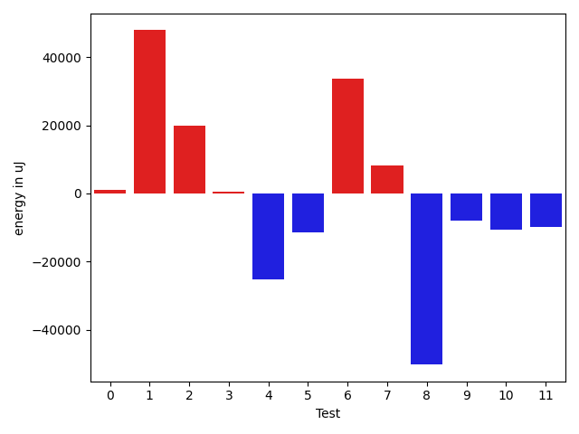

# gson d0e70b

https://github.com/google/gson/commit/d0e70b

## Delta Energy per test method

| ID | EnergyV1 | EnergyV2 | DeltaEnergy | σV1 | %σV1 | σV2 | %σV2 |
| --- | --- | --- | --- | --- | --- | --- | --- |
| 0 | 673887 | 674864 | 977 | 25017.57 | 3.71 | 44812.47 | 6.64 |
| 1 | 1972407 | 2020320 | 47913 | 59154.18 | 3.00 | 116894.12 | 5.79 |
| 2 | 765257 | 785032 | 19775 | 26745.80 | 3.50 | 56115.12 | 7.15 |
| 3 | 190490 | 190979 | 489 | 18894.33 | 9.92 | 15853.46 | 8.30 |
| 4 | 215514 | 190247 | -25267 | 19406.18 | 9.00 | 20655.77 | 10.86 |
| 5 | 363402 | 352049 | -11353 | 28672.45 | 7.89 | 22363.87 | 6.35 |
| 6 | 316405 | 350219 | 33814 | 29655.30 | 9.37 | 22361.80 | 6.39 |
| 7 | 387755 | 395995 | 8240 | 49209.40 | 12.69 | 37130.25 | 9.38 |
| 8 | 694701 | 644469 | -50232 | 37516.91 | 5.40 | 37598.80 | 5.83 |
| 9 | 365478 | 357482 | -7996 | 34289.26 | 9.38 | 37567.52 | 10.51 |
| 10 | 253051 | 242492 | -10559 | 22132.19 | 8.75 | 20547.16 | 8.47 |
| 11 | 223266 | 213439 | -9827 | 27831.11 | 12.47 | 12857.98 | 6.02 |

## Misc.

| ID | Test Class | Test Method |
| --- | --- | --- |
| 0 | com.google.gson.functional.MapTest | testInterfaceTypeMapWithSerializer |
| 1 | com.google.gson.functional.MapTest | testGeneralMapField |
| 2 | com.google.gson.functional.MapTest | testInterfaceTypeMap |
| 3 | com.google.gson.functional.NamingPolicyTest | testGsonWithNonDefaultFieldNamingPolicySerialization |
| 4 | com.google.gson.functional.NamingPolicyTest | testGsonWithUpperCamelCaseSpacesPolicyDeserialiation |
| 5 | com.google.gson.functional.NamingPolicyTest | testGsonWithNonDefaultFieldNamingPolicyDeserialiation |
| 6 | com.google.gson.functional.NamingPolicyTest | testGsonWithUpperCamelCaseSpacesPolicySerialiation |
| 7 | com.google.gson.functional.MapAsArrayTypeAdapterTest | testMultipleEnableComplexKeyRegistrationHasNoEffect |
| 8 | com.google.gson.functional.MapAsArrayTypeAdapterTest | testSerializeComplexMapWithTypeAdapter |
| 9 | com.google.gson.functional.MapAsArrayTypeAdapterTest | testMapWithTypeVariableSerialization |
| 10 | com.google.gson.functional.FieldNamingTest | testUpperCamelCase |
| 11 | com.google.gson.functional.FieldNamingTest | testUpperCamelCaseWithSpaces |

## Classifications

### Tests
| ID | Class | Delta | Share |
| --- | --- | --- | --- |
| G | NEUTRAL | -4026.0 | - |
| N | NEGATIVE | -115234.0 | 16.67 |
| P | POSITIVE | 111208.0 | 16.67 |
| 1 | POSITIVE | 47913.0 | 43.08 |
| 6 | POSITIVE | 33814.0 | 30.41 |
| 8 | NEGATIVE | -50232.0 | 43.59 |

### Lines
| Class | Java Class | Line |
| --- | --- | --- |
| negative | com.google.gson.internal.bind.MapTypeAdapterFactory | 227 |
| negative | com.google.gson.internal.bind.MapTypeAdapterFactory | 236 |
| positive | com.google.gson.FieldNamingPolicy | 153 |
| positive | com.google.gson.FieldNamingPolicy | 154 |
| positive | com.google.gson.internal.bind.MapTypeAdapterFactory | 236 |
| unknown | com.google.gson.FieldNamingPolicy | 153 |
| unknown | com.google.gson.FieldNamingPolicy | 154 |
| unknown | com.google.gson.internal.bind.MapTypeAdapterFactory | 227 |
| unknown | com.google.gson.internal.bind.MapTypeAdapterFactory | 236 |

## Localization of Green Regression
### Selected Tests
| Test class | test method |
| --- | --- |
| com.google.gson.functional.NamingPolicyTest | testGsonWithUpperCamelCaseSpacesPolicySerialiation |
| com.google.gson.functional.MapTest | testGeneralMapField |

### Suspected lines
| Class | line |
| --- | --- |
| com.google.gson.internal.bind.MapTypeAdapterFactory | [236](https://github.com/google/gson/tree/d0e70b/gson/src/main/java/com/google/gson/internal/bind/MapTypeAdapterFactory.java#L236) |
| com.google.gson.FieldNamingPolicy | [153](https://github.com/google/gson/tree/d0e70b/gson/src/main/java/com/google/gson/FieldNamingPolicy.java#L153) |
| com.google.gson.FieldNamingPolicy | [154](https://github.com/google/gson/tree/d0e70b/gson/src/main/java/com/google/gson/FieldNamingPolicy.java#L153#L154) |

| Time Label | Time (s) |
| --- | --- |
| Selection | 34.82648324966431 |
| Injection | 17.732807874679565 |
| Total | 208.32154393196106 |

