# gson 9e44d6

https://github.com/google/gson/commit/9e44d6

## Delta Energy per test method

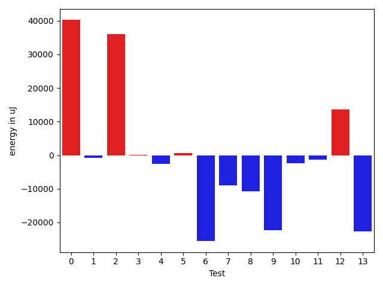

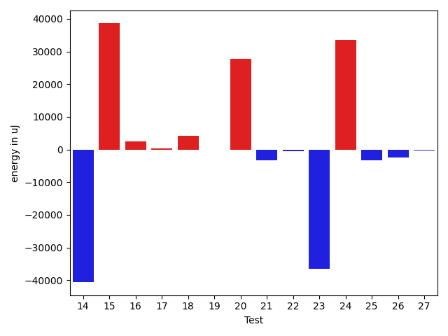

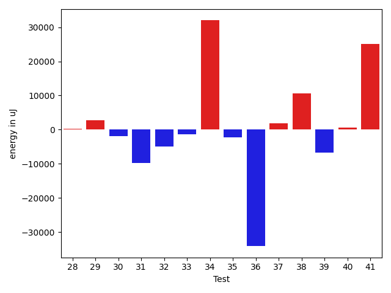

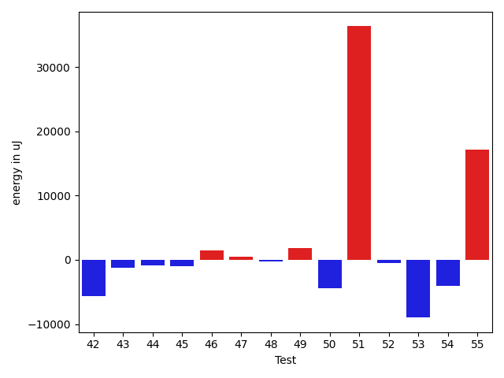

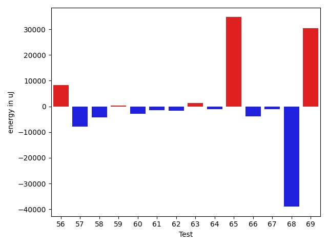

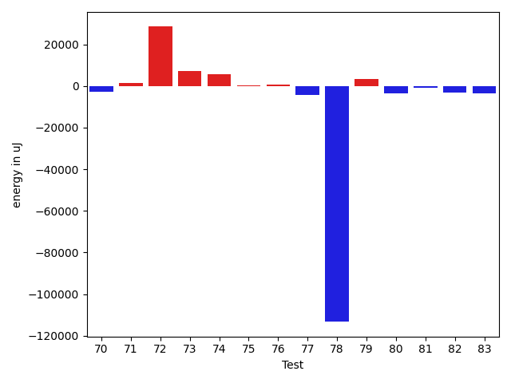

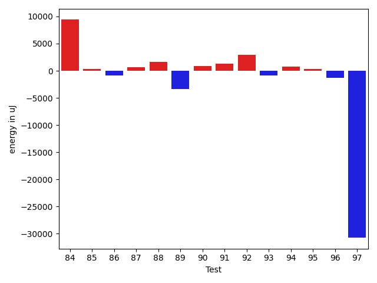

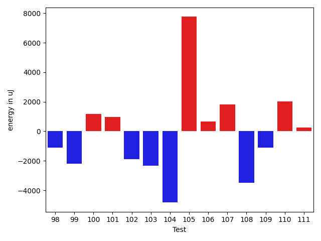

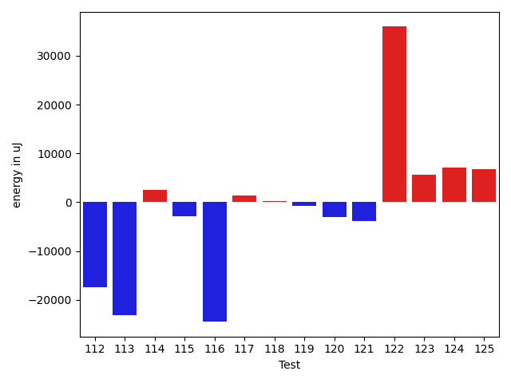

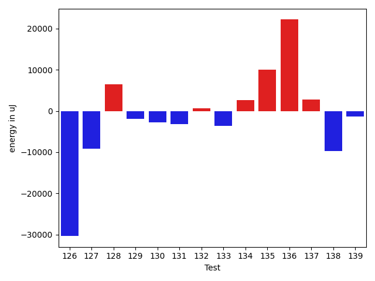

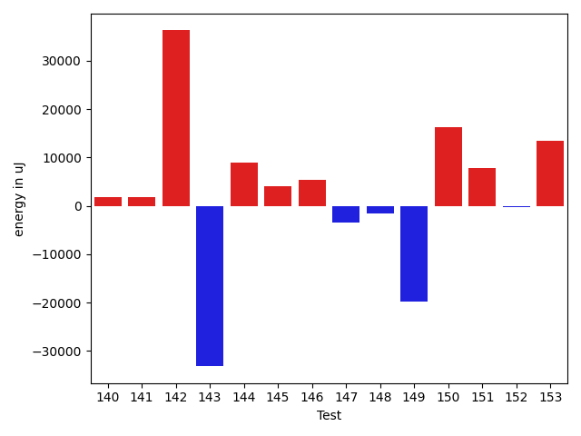

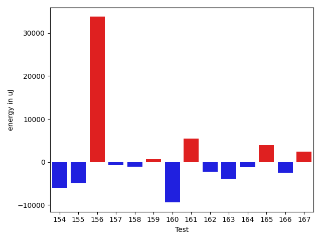

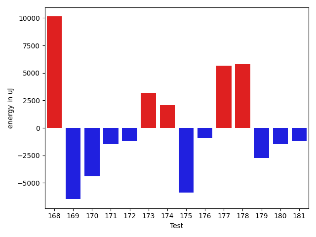

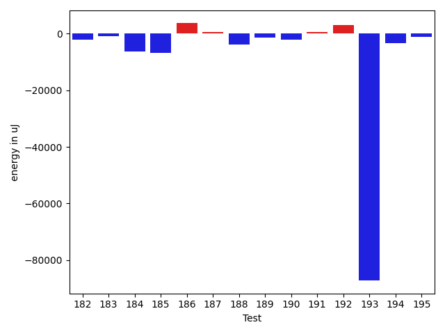

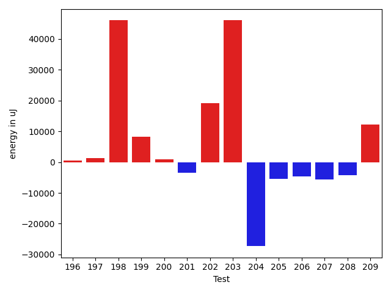

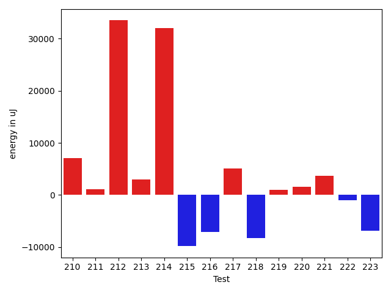

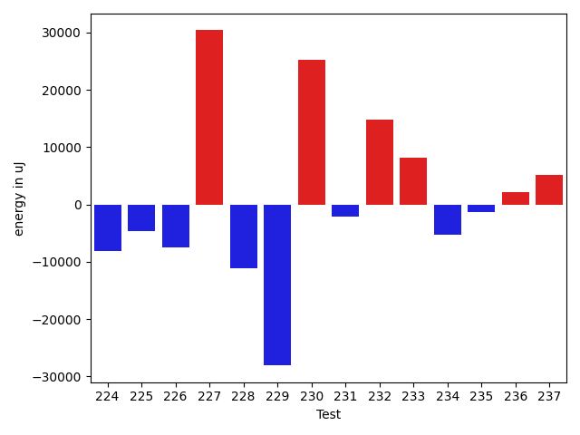

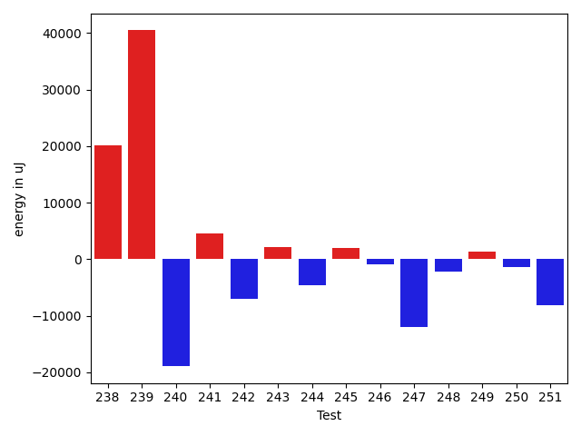

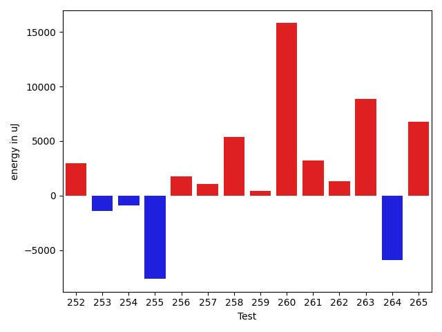

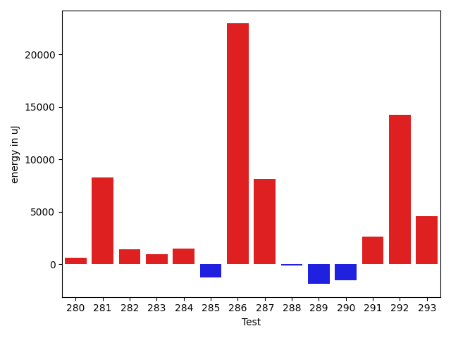

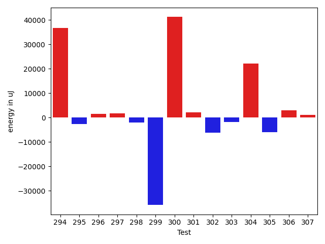

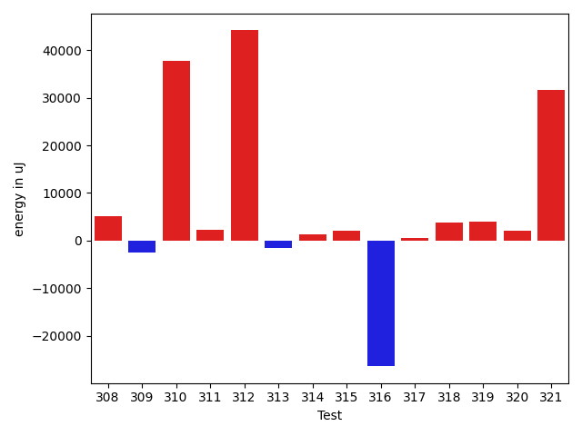

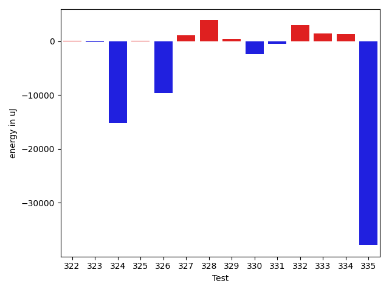

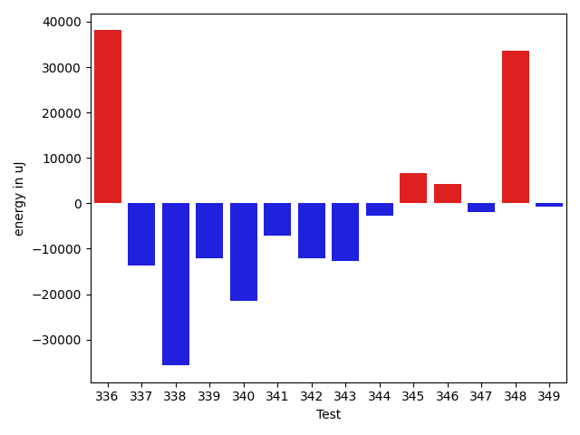

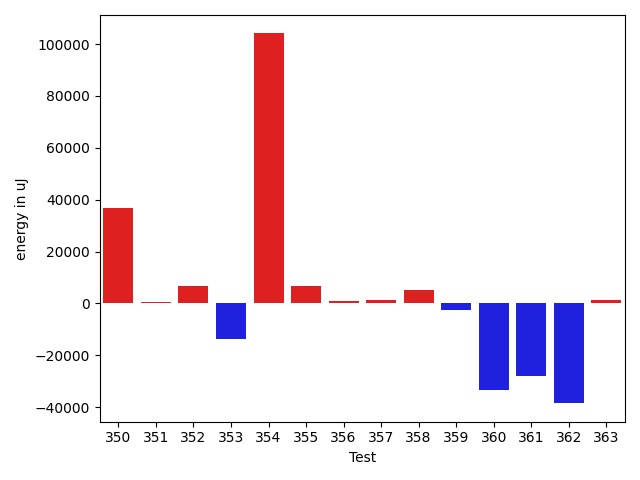

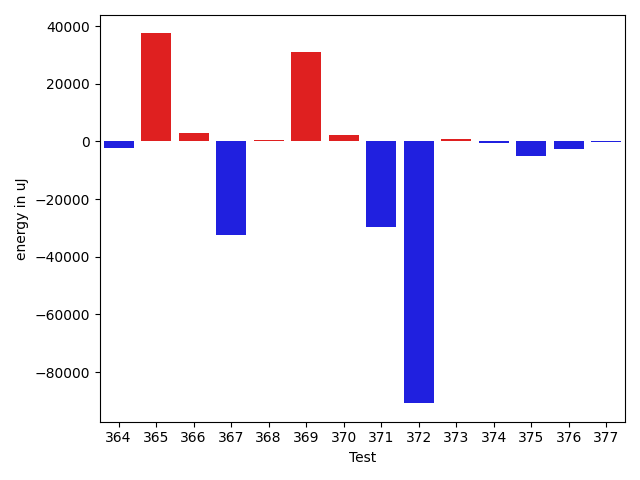

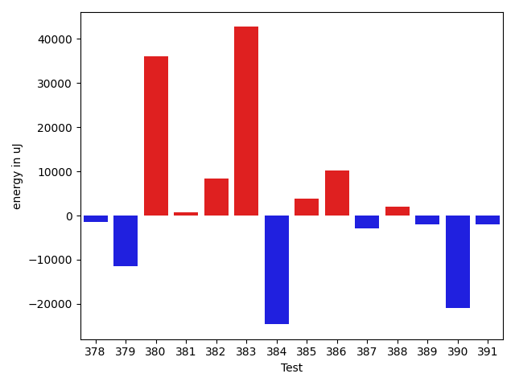

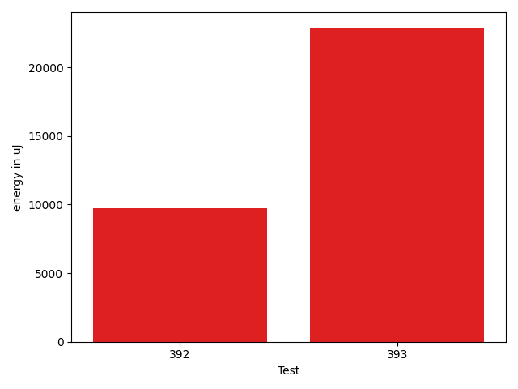

| ID | EnergyV1 | EnergyV2 | DeltaEnergy | σV1 | %σV1 | σV2 | %σV2 |
| --- | --- | --- | --- | --- | --- | --- | --- |
| 0 | 47730 | 87951 | 40221 | 18651.31 | 39.08 | 23213.29 | 26.39 |
| 1 | 78979 | 78124 | -855 | 11294.48 | 14.30 | 13087.88 | 16.75 |
| 2 | 46936 | 83007 | 36071 | 21025.37 | 44.80 | 23031.57 | 27.75 |
| 3 | 41443 | 41565 | 122 | 2549.90 | 6.15 | 646.73 | 1.56 |
| 4 | 160705 | 158142 | -2563 | 2715.19 | 1.69 | 22316.50 | 14.11 |
| 5 | 41626 | 42298 | 672 | 3625.51 | 8.71 | 15931.86 | 37.67 |
| 6 | 156982 | 131409 | -25573 | 35015.53 | 22.31 | 28139.28 | 21.41 |
| 7 | 219421 | 210388 | -9033 | 19960.86 | 9.10 | 36248.08 | 17.23 |
| 8 | 171264 | 160461 | -10803 | 18494.98 | 10.80 | 18614.26 | 11.60 |
| 9 | 173767 | 151428 | -22339 | 26049.08 | 14.99 | 16511.18 | 10.90 |
| 10 | 147156 | 144836 | -2320 | 15404.94 | 10.47 | 17085.84 | 11.80 |
| 11 | 128234 | 126831 | -1403 | 6988.84 | 5.45 | 5627.39 | 4.44 |
| 12 | 164489 | 178039 | 13550 | 21549.48 | 13.10 | 21533.35 | 12.09 |
| 13 | 149597 | 126831 | -22766 | 18961.70 | 12.68 | 19460.89 | 15.34 |
| 14 | 85815 | 45166 | -40649 | 14935.04 | 17.40 | 21908.20 | 48.51 |
| 15 | 166626 | 205200 | 38574 | 20672.48 | 12.41 | 26239.98 | 12.79 |
| 16 | 79040 | 81542 | 2502 | 21793.08 | 27.57 | 13282.88 | 16.29 |
| 17 | 88684 | 89111 | 427 | 19023.11 | 21.45 | 21438.77 | 24.06 |
| 18 | 175537 | 179748 | 4211 | 20502.23 | 11.68 | 25551.13 | 14.21 |
| 19 | 45898 | 45898 | 0 | 11316.29 | 24.66 | 21444.86 | 46.72 |
| 20 | 86182 | 113953 | 27771 | 19681.41 | 22.84 | 24568.49 | 21.56 |
| 21 | 83923 | 80566 | -3357 | 18643.36 | 22.21 | 18631.77 | 23.13 |
| 22 | 77331 | 76904 | -427 | 18039.25 | 23.33 | 21415.84 | 27.85 |
| 23 | 118774 | 82336 | -36438 | 17731.06 | 14.93 | 23648.87 | 28.72 |
| 24 | 121277 | 154784 | 33507 | 15649.67 | 12.90 | 18234.87 | 11.78 |
| 25 | 87524 | 84228 | -3296 | 20090.27 | 22.95 | 11829.84 | 14.05 |
| 26 | 87829 | 85449 | -2380 | 21491.10 | 24.47 | 19425.57 | 22.73 |
| 27 | 46142 | 45837 | -305 | 13769.82 | 29.84 | 15393.75 | 33.58 |
| 28 | 45349 | 45532 | 183 | 14709.63 | 32.44 | 14663.36 | 32.20 |
| 29 | 124938 | 127746 | 2808 | 22986.99 | 18.40 | 21744.39 | 17.02 |
| 30 | 83130 | 81176 | -1954 | 13120.19 | 15.78 | 12135.51 | 14.95 |
| 31 | 734617 | 724913 | -9704 | 29463.84 | 4.01 | 37219.07 | 5.13 |
| 32 | 85511 | 80566 | -4945 | 18092.42 | 21.16 | 20903.84 | 25.95 |
| 33 | 88196 | 86914 | -1282 | 17546.60 | 19.90 | 22614.82 | 26.02 |
| 34 | 45288 | 77270 | 31982 | 24858.14 | 54.89 | 21618.47 | 27.98 |
| 35 | 45471 | 43152 | -2319 | 22773.06 | 50.08 | 14215.28 | 32.94 |
| 36 | 81909 | 47790 | -34119 | 17553.65 | 21.43 | 21635.56 | 45.27 |
| 37 | 80383 | 82153 | 1770 | 13066.16 | 16.25 | 16225.74 | 19.75 |
| 38 | 78369 | 88989 | 10620 | 21966.62 | 28.03 | 15886.30 | 17.85 |
| 39 | 83435 | 76782 | -6653 | 19176.99 | 22.98 | 23222.03 | 30.24 |
| 40 | 47364 | 47912 | 548 | 20362.67 | 42.99 | 17220.64 | 35.94 |
| 41 | 119873 | 144897 | 25024 | 14404.69 | 12.02 | 16233.64 | 11.20 |
| 42 | 87402 | 81726 | -5676 | 21637.73 | 24.76 | 20438.33 | 25.01 |
| 43 | 39002 | 37781 | -1221 | 15706.90 | 40.27 | 12322.91 | 32.62 |
| 44 | 43823 | 42969 | -854 | 17745.33 | 40.49 | 13950.70 | 32.47 |
| 45 | 44799 | 43823 | -976 | 13331.13 | 29.76 | 14620.39 | 33.36 |
| 46 | 87036 | 88561 | 1525 | 24147.89 | 27.74 | 18119.69 | 20.46 |
| 47 | 45105 | 45532 | 427 | 18243.92 | 40.45 | 2618.11 | 5.75 |
| 48 | 43579 | 43273 | -306 | 12531.99 | 28.76 | 17260.23 | 39.89 |
| 49 | 43335 | 45227 | 1892 | 14643.99 | 33.79 | 21166.12 | 46.80 |
| 50 | 45227 | 40771 | -4456 | 4635.48 | 10.25 | 2496.37 | 6.12 |
| 51 | 47729 | 84046 | 36317 | 21521.17 | 45.09 | 19512.57 | 23.22 |
| 52 | 41565 | 41016 | -549 | 18120.17 | 43.59 | 18400.95 | 44.86 |
| 53 | 134155 | 125182 | -8973 | 14679.74 | 10.94 | 4490.70 | 3.59 |
| 54 | 43518 | 39489 | -4029 | 2941.92 | 6.76 | 1638.30 | 4.15 |
| 55 | 205322 | 222412 | 17090 | 19867.10 | 9.68 | 19890.36 | 8.94 |
| 56 | 132446 | 140686 | 8240 | 23363.91 | 17.64 | 28589.30 | 20.32 |
| 57 | 88379 | 80444 | -7935 | 20596.11 | 23.30 | 4080.02 | 5.07 |
| 58 | 114685 | 110473 | -4212 | 17620.47 | 15.36 | 24832.00 | 22.48 |
| 59 | 39184 | 39612 | 428 | 3038.14 | 7.75 | 10681.08 | 26.96 |
| 60 | 82275 | 79407 | -2868 | 21125.77 | 25.68 | 19899.36 | 25.06 |
| 61 | 125182 | 123718 | -1464 | 19712.60 | 15.75 | 23793.60 | 19.23 |
| 62 | 83313 | 81665 | -1648 | 14410.10 | 17.30 | 17442.07 | 21.36 |
| 63 | 183166 | 184509 | 1343 | 40624.05 | 22.18 | 41078.69 | 22.26 |
| 64 | 179687 | 178650 | -1037 | 20776.65 | 11.56 | 21768.01 | 12.18 |
| 65 | 230346 | 265075 | 34729 | 32319.90 | 14.03 | 57309.45 | 21.62 |
| 66 | 132079 | 128235 | -3844 | 18800.45 | 14.23 | 7699.56 | 6.00 |
| 67 | 126404 | 125427 | -977 | 187222.03 | 148.11 | 5331.90 | 4.25 |
| 68 | 248535 | 209533 | -39002 | 27668.41 | 11.13 | 30107.91 | 14.37 |
| 69 | 89294 | 119751 | 30457 | 23293.62 | 26.09 | 19224.37 | 16.05 |
| 70 | 124450 | 121826 | -2624 | 7129.40 | 5.73 | 17262.27 | 14.17 |
| 71 | 115417 | 116882 | 1465 | 4250.58 | 3.68 | 12847.72 | 10.99 |
| 72 | 134155 | 162658 | 28503 | 31660.25 | 23.60 | 24034.44 | 14.78 |
| 73 | 123351 | 130615 | 7264 | 21475.73 | 17.41 | 19357.65 | 14.82 |
| 74 | 122314 | 127808 | 5494 | 29443.31 | 24.07 | 31993.10 | 25.03 |
| 75 | 127502 | 127990 | 488 | 27412.99 | 21.50 | 12174.42 | 9.51 |
| 76 | 125549 | 126221 | 672 | 15073.49 | 12.01 | 2648.34 | 2.10 |
| 77 | 119201 | 114868 | -4333 | 17506.44 | 14.69 | 19884.65 | 17.31 |
| 78 | 1734737 | 1621456 | -113281 | 121125.66 | 6.98 | 115003.89 | 7.09 |
| 79 | 124816 | 128173 | 3357 | 14481.84 | 11.60 | 12800.95 | 9.99 |
| 80 | 170470 | 166808 | -3662 | 25164.63 | 14.76 | 17034.14 | 10.21 |
| 81 | 110900 | 110168 | -732 | 20370.52 | 18.37 | 17912.43 | 16.26 |
| 82 | 42236 | 39001 | -3235 | 1967.10 | 4.66 | 2764.28 | 7.09 |
| 83 | 342284 | 338866 | -3418 | 15071.97 | 4.40 | 24921.92 | 7.35 |
| 84 | 270080 | 279479 | 9399 | 24063.75 | 8.91 | 24838.91 | 8.89 |
| 85 | 171935 | 172301 | 366 | 22475.47 | 13.07 | 11439.77 | 6.64 |
| 86 | 136047 | 135192 | -855 | 24101.15 | 17.72 | 13823.91 | 10.23 |
| 87 | 323791 | 324462 | 671 | 29993.38 | 9.26 | 24471.43 | 7.54 |
| 88 | 114075 | 115723 | 1648 | 12392.84 | 10.86 | 15507.33 | 13.40 |
| 89 | 85388 | 82031 | -3357 | 17689.75 | 20.72 | 23230.72 | 28.32 |
| 90 | 80566 | 81481 | 915 | 16499.89 | 20.48 | 15947.14 | 19.57 |
| 91 | 43701 | 45044 | 1343 | 19881.89 | 45.50 | 5132.99 | 11.40 |
| 92 | 88928 | 91858 | 2930 | 13224.65 | 14.87 | 14504.06 | 15.79 |
| 93 | 44434 | 43579 | -855 | 20040.92 | 45.10 | 18420.53 | 42.27 |
| 94 | 83129 | 83862 | 733 | 21385.99 | 25.73 | 20217.17 | 24.11 |
| 95 | 1763119 | 1763423 | 304 | 93528.93 | 5.30 | 114196.30 | 6.48 |
| 96 | 77148 | 75866 | -1282 | 1845.79 | 2.39 | 5997.96 | 7.91 |
| 97 | 76233 | 45471 | -30762 | 17056.99 | 22.37 | 19171.81 | 42.16 |
| 98 | 313476 | 312377 | -1099 | 17337.12 | 5.53 | 21194.07 | 6.78 |
| 99 | 168030 | 165832 | -2198 | 4448.39 | 2.65 | 31526.05 | 19.01 |
| 100 | 44738 | 45898 | 1160 | 21093.74 | 47.15 | 25128.84 | 54.75 |
| 101 | 45959 | 46936 | 977 | 1846.33 | 4.02 | 1424.01 | 3.03 |
| 102 | 134704 | 132812 | -1892 | 23560.00 | 17.49 | 24736.04 | 18.62 |
| 103 | 80139 | 77819 | -2320 | 14132.09 | 17.63 | 2468.79 | 3.17 |
| 104 | 80505 | 75684 | -4821 | 130425.51 | 162.01 | 21799.69 | 28.80 |
| 105 | 125915 | 133667 | 7752 | 12499.41 | 9.93 | 7560.20 | 5.66 |
| 106 | 126586 | 127258 | 672 | 19518.10 | 15.42 | 21851.79 | 17.17 |
| 107 | 90881 | 92712 | 1831 | 37613.07 | 41.39 | 20895.24 | 22.54 |
| 108 | 88379 | 84899 | -3480 | 19711.54 | 22.30 | 19071.92 | 22.46 |
| 109 | 90576 | 89477 | -1099 | 4674.17 | 5.16 | 13908.28 | 15.54 |
| 110 | 45593 | 47607 | 2014 | 24991.20 | 54.81 | 18146.76 | 38.12 |
| 111 | 240234 | 240478 | 244 | 25904.71 | 10.78 | 50134.74 | 20.85 |
| 112 | 214050 | 196655 | -17395 | 60529.82 | 28.28 | 23231.32 | 11.81 |
| 113 | 137878 | 114807 | -23071 | 14719.20 | 10.68 | 15727.99 | 13.70 |
| 114 | 133789 | 136353 | 2564 | 18892.42 | 14.12 | 21432.18 | 15.72 |
| 115 | 85327 | 82397 | -2930 | 17097.10 | 20.04 | 20019.37 | 24.30 |
| 116 | 184875 | 160400 | -24475 | 24522.50 | 13.26 | 32372.54 | 20.18 |
| 117 | 151855 | 153198 | 1343 | 21249.99 | 13.99 | 25906.26 | 16.91 |
| 118 | 87768 | 88012 | 244 | 1878.79 | 2.14 | 15531.97 | 17.65 |
| 119 | 116882 | 116150 | -732 | 26362.64 | 22.55 | 2086.84 | 1.80 |
| 120 | 132385 | 129394 | -2991 | 17460.86 | 13.19 | 24391.01 | 18.85 |
| 121 | 126708 | 122863 | -3845 | 13481.56 | 10.64 | 15517.46 | 12.63 |
| 122 | 132202 | 168151 | 35949 | 25875.53 | 19.57 | 18753.53 | 11.15 |
| 123 | 164855 | 170410 | 5555 | 28855.35 | 17.50 | 31509.08 | 18.49 |
| 124 | 70617 | 77758 | 7141 | 18554.18 | 26.27 | 14770.15 | 19.00 |
| 125 | 203491 | 210204 | 6713 | 21430.47 | 10.53 | 26496.56 | 12.61 |
| 126 | 72937 | 42603 | -30334 | 21087.97 | 28.91 | 32975.76 | 77.40 |
| 127 | 173461 | 164307 | -9154 | 29342.22 | 16.92 | 22339.22 | 13.60 |
| 128 | 125610 | 132141 | 6531 | 22312.60 | 17.76 | 19630.51 | 14.86 |
| 129 | 186340 | 184387 | -1953 | 12950.02 | 6.95 | 15008.15 | 8.14 |
| 130 | 171020 | 168212 | -2808 | 19595.68 | 11.46 | 21633.99 | 12.86 |
| 131 | 189087 | 185913 | -3174 | 16277.67 | 8.61 | 30597.86 | 16.46 |
| 132 | 118652 | 119262 | 610 | 6449.67 | 5.44 | 12747.72 | 10.69 |
| 133 | 45166 | 41503 | -3663 | 19847.19 | 43.94 | 11958.56 | 28.81 |
| 134 | 183716 | 186401 | 2685 | 59062.83 | 32.15 | 53039.82 | 28.45 |
| 135 | 110901 | 120910 | 10009 | 21868.11 | 19.72 | 17149.83 | 14.18 |
| 136 | 180908 | 203064 | 22156 | 18982.49 | 10.49 | 21519.25 | 10.60 |
| 137 | 39123 | 41870 | 2747 | 1486.86 | 3.80 | 17354.11 | 41.45 |
| 138 | 124206 | 114441 | -9765 | 9803.36 | 7.89 | 19888.49 | 17.38 |
| 139 | 130737 | 129333 | -1404 | 13702.86 | 10.48 | 4139.67 | 3.20 |
| 140 | 110351 | 112183 | 1832 | 19563.02 | 17.73 | 15034.80 | 13.40 |
| 141 | 94299 | 96130 | 1831 | 19867.62 | 21.07 | 21510.62 | 22.38 |
| 142 | 97045 | 133300 | 36255 | 20825.14 | 21.46 | 25094.70 | 18.83 |
| 143 | 172668 | 139526 | -33142 | 32734.57 | 18.96 | 19953.61 | 14.30 |
| 144 | 127074 | 135986 | 8912 | 24032.79 | 18.91 | 20112.99 | 14.79 |
| 145 | 168274 | 172363 | 4089 | 20036.24 | 11.91 | 26038.95 | 15.11 |
| 146 | 265868 | 271240 | 5372 | 20303.08 | 7.64 | 39510.94 | 14.57 |
| 147 | 83923 | 80506 | -3417 | 18791.36 | 22.39 | 21673.71 | 26.92 |
| 148 | 83557 | 81970 | -1587 | 11788.27 | 14.11 | 19001.35 | 23.18 |
| 149 | 453734 | 433897 | -19837 | 55912.28 | 12.32 | 49059.61 | 11.31 |
| 150 | 207702 | 223937 | 16235 | 25807.83 | 12.43 | 21678.20 | 9.68 |
| 151 | 269103 | 276916 | 7813 | 27369.13 | 10.17 | 32446.17 | 11.72 |
| 152 | 181335 | 181091 | -244 | 25682.36 | 14.16 | 4262.80 | 2.35 |
| 153 | 158996 | 172485 | 13489 | 17390.85 | 10.94 | 8282.84 | 4.80 |
| 154 | 224364 | 218383 | -5981 | 19809.12 | 8.83 | 35772.77 | 16.38 |
| 155 | 120911 | 115967 | -4944 | 11913.73 | 9.85 | 17415.92 | 15.02 |
| 156 | 44129 | 77880 | 33751 | 18857.72 | 42.73 | 20175.41 | 25.91 |
| 157 | 223938 | 223205 | -733 | 17351.45 | 7.75 | 7889.63 | 3.53 |
| 158 | 243896 | 242798 | -1098 | 23063.94 | 9.46 | 20846.75 | 8.59 |
| 159 | 265991 | 266662 | 671 | 146633.21 | 55.13 | 24915.99 | 9.34 |
| 160 | 186462 | 177063 | -9399 | 21294.26 | 11.42 | 23216.00 | 13.11 |
| 161 | 252075 | 257507 | 5432 | 17227.08 | 6.83 | 35285.26 | 13.70 |
| 162 | 201111 | 198913 | -2198 | 97846.38 | 48.65 | 154963.62 | 77.91 |
| 163 | 195373 | 191527 | -3846 | 49427.98 | 25.30 | 4231.13 | 2.21 |
| 164 | 302062 | 300842 | -1220 | 14011.04 | 4.64 | 29245.78 | 9.72 |
| 165 | 183166 | 187072 | 3906 | 16193.15 | 8.84 | 13406.70 | 7.17 |
| 166 | 47302 | 44861 | -2441 | 146608.35 | 309.94 | 17785.67 | 39.65 |
| 167 | 38086 | 40527 | 2441 | 3536.78 | 9.29 | 11870.37 | 29.29 |
| 168 | 254821 | 264953 | 10132 | 23435.10 | 9.20 | 16983.47 | 6.41 |
| 169 | 81299 | 74828 | -6471 | 13201.22 | 16.24 | 20182.79 | 26.97 |
| 170 | 85082 | 80688 | -4394 | 22474.75 | 26.42 | 21819.21 | 27.04 |
| 171 | 90393 | 88928 | -1465 | 21197.46 | 23.45 | 15858.57 | 17.83 |
| 172 | 39795 | 38574 | -1221 | 2066.57 | 5.19 | 2747.36 | 7.12 |
| 173 | 85632 | 88806 | 3174 | 19022.38 | 22.21 | 13373.12 | 15.06 |
| 174 | 42237 | 44311 | 2074 | 2429.70 | 5.75 | 1979.84 | 4.47 |
| 175 | 139953 | 134094 | -5859 | 22266.84 | 15.91 | 23794.03 | 17.74 |
| 176 | 88440 | 87525 | -915 | 16219.49 | 18.34 | 11457.88 | 13.09 |
| 177 | 76538 | 82214 | 5676 | 26798.86 | 35.01 | 16113.64 | 19.60 |
| 178 | 84473 | 90271 | 5798 | 20837.30 | 24.67 | 14770.96 | 16.36 |
| 179 | 84228 | 81482 | -2746 | 19389.05 | 23.02 | 22021.77 | 27.03 |
| 180 | 43030 | 41565 | -1465 | 21573.82 | 50.14 | 18329.11 | 44.10 |
| 181 | 44616 | 43395 | -1221 | 2619.27 | 5.87 | 12367.12 | 28.50 |
| 182 | 84290 | 82153 | -2137 | 18781.95 | 22.28 | 17278.87 | 21.03 |
| 183 | 45532 | 44739 | -793 | 20572.61 | 45.18 | 15269.83 | 34.13 |
| 184 | 83679 | 77271 | -6408 | 24231.77 | 28.96 | 19956.24 | 25.83 |
| 185 | 88256 | 81359 | -6897 | 13571.94 | 15.38 | 20706.80 | 25.45 |
| 186 | 83434 | 87097 | 3663 | 16494.13 | 19.77 | 19189.61 | 22.03 |
| 187 | 89966 | 90576 | 610 | 21077.46 | 23.43 | 22370.02 | 24.70 |
| 188 | 151062 | 147155 | -3907 | 26968.53 | 17.85 | 20202.59 | 13.73 |
| 189 | 77515 | 76111 | -1404 | 18385.75 | 23.72 | 21031.92 | 27.63 |
| 190 | 85693 | 83495 | -2198 | 21101.63 | 24.62 | 18855.19 | 22.58 |
| 191 | 39490 | 40039 | 549 | 15112.01 | 38.27 | 17794.82 | 44.44 |
| 192 | 86120 | 89172 | 3052 | 21627.48 | 25.11 | 23009.26 | 25.80 |
| 193 | 1680721 | 1593501 | -87220 | 139564.29 | 8.30 | 161701.79 | 10.15 |
| 194 | 2191218 | 2187860 | -3358 | 176213.86 | 8.04 | 162900.85 | 7.45 |
| 195 | 44494 | 43396 | -1098 | 957.82 | 2.15 | 2528.70 | 5.83 |
| 196 | 76416 | 77027 | 611 | 15726.52 | 20.58 | 12354.21 | 16.04 |
| 197 | 118835 | 120056 | 1221 | 11861.12 | 9.98 | 22694.79 | 18.90 |
| 198 | 136170 | 182190 | 46020 | 17538.55 | 12.88 | 26638.58 | 14.62 |
| 199 | 73852 | 82092 | 8240 | 25923.80 | 35.10 | 22689.15 | 27.64 |
| 200 | 84777 | 85694 | 917 | 3691.98 | 4.35 | 18337.84 | 21.40 |
| 201 | 85449 | 82031 | -3418 | 20866.12 | 24.42 | 20951.73 | 25.54 |
| 202 | 255920 | 275145 | 19225 | 22479.97 | 8.78 | 21912.08 | 7.96 |
| 203 | 88867 | 134887 | 46020 | 21712.66 | 24.43 | 4458.97 | 3.31 |
| 204 | 72144 | 44860 | -27284 | 21468.65 | 29.76 | 20082.06 | 44.77 |
| 205 | 355346 | 349914 | -5432 | 38723.01 | 10.90 | 27676.34 | 7.91 |
| 206 | 308105 | 303405 | -4700 | 38551.42 | 12.51 | 29260.69 | 9.64 |
| 207 | 175719 | 170043 | -5676 | 22452.53 | 12.78 | 26787.85 | 15.75 |
| 208 | 139404 | 135131 | -4273 | 22734.54 | 16.31 | 13339.19 | 9.87 |
| 209 | 120667 | 132812 | 12145 | 19857.15 | 16.46 | 14831.94 | 11.17 |
| 210 | 119629 | 126709 | 7080 | 18955.46 | 15.85 | 24095.46 | 19.02 |
| 211 | 122375 | 123474 | 1099 | 96111.68 | 78.54 | 90643.62 | 73.41 |
| 212 | 133362 | 166869 | 33507 | 31241.33 | 23.43 | 25491.22 | 15.28 |
| 213 | 135925 | 138916 | 2991 | 15729.76 | 11.57 | 23353.79 | 16.81 |
| 214 | 133484 | 165466 | 31982 | 17007.92 | 12.74 | 19460.76 | 11.76 |
| 215 | 136657 | 126831 | -9826 | 6854.76 | 5.02 | 16146.75 | 12.73 |
| 216 | 129211 | 122131 | -7080 | 14543.41 | 11.26 | 19955.96 | 16.34 |
| 217 | 164673 | 169799 | 5126 | 24500.28 | 14.88 | 30120.09 | 17.74 |
| 218 | 136719 | 128478 | -8241 | 24258.79 | 17.74 | 10722.96 | 8.35 |
| 219 | 117797 | 118836 | 1039 | 12425.89 | 10.55 | 19497.49 | 16.41 |
| 220 | 163085 | 164611 | 1526 | 22186.47 | 13.60 | 13548.09 | 8.23 |
| 221 | 178650 | 182372 | 3722 | 11492.75 | 6.43 | 13343.43 | 7.32 |
| 222 | 203430 | 202453 | -977 | 20149.51 | 9.90 | 42606.29 | 21.05 |
| 223 | 128967 | 122131 | -6836 | 14587.30 | 11.31 | 20532.11 | 16.81 |
| 224 | 121826 | 113769 | -8057 | 55544.98 | 45.59 | 14873.29 | 13.07 |
| 225 | 276611 | 271911 | -4700 | 17757.37 | 6.42 | 22082.15 | 8.12 |
| 226 | 173644 | 166198 | -7446 | 25306.59 | 14.57 | 21324.36 | 12.83 |
| 227 | 159912 | 190307 | 30395 | 13386.43 | 8.37 | 17881.10 | 9.40 |
| 228 | 121093 | 109986 | -11107 | 21705.98 | 17.93 | 16566.81 | 15.06 |
| 229 | 149170 | 121094 | -28076 | 31576.58 | 21.17 | 18662.70 | 15.41 |
| 230 | 220031 | 245360 | 25329 | 27033.47 | 12.29 | 21319.77 | 8.69 |
| 231 | 115723 | 113647 | -2076 | 22904.56 | 19.79 | 4253.50 | 3.74 |
| 232 | 111389 | 126220 | 14831 | 19518.95 | 17.52 | 14748.75 | 11.68 |
| 233 | 163940 | 172119 | 8179 | 25588.90 | 15.61 | 8697.32 | 5.05 |
| 234 | 164855 | 159607 | -5248 | 15236.76 | 9.24 | 24578.27 | 15.40 |
| 235 | 46875 | 45594 | -1281 | 22248.97 | 47.46 | 23577.03 | 51.71 |
| 236 | 119446 | 121643 | 2197 | 12598.64 | 10.55 | 23108.08 | 19.00 |
| 237 | 132568 | 137695 | 5127 | 24674.46 | 18.61 | 22261.76 | 16.17 |
| 238 | 175353 | 195434 | 20081 | 12027.89 | 6.86 | 19444.10 | 9.95 |
| 239 | 136596 | 177062 | 40466 | 22767.23 | 16.67 | 8010.07 | 4.52 |
| 240 | 201049 | 182128 | -18921 | 23901.88 | 11.89 | 26357.72 | 14.47 |
| 241 | 131775 | 136413 | 4638 | 5200.20 | 3.95 | 13761.35 | 10.09 |
| 242 | 165039 | 158019 | -7020 | 120233.22 | 72.85 | 103362.33 | 65.41 |
| 243 | 160705 | 162842 | 2137 | 16757.44 | 10.43 | 20135.20 | 12.36 |
| 244 | 135376 | 130737 | -4639 | 19684.60 | 14.54 | 20036.83 | 15.33 |
| 245 | 132141 | 134216 | 2075 | 20951.99 | 15.86 | 24948.60 | 18.59 |
| 246 | 116638 | 115783 | -855 | 15267.02 | 13.09 | 21866.25 | 18.89 |
| 247 | 149474 | 137512 | -11962 | 25713.44 | 17.20 | 21367.70 | 15.54 |
| 248 | 46021 | 43762 | -2259 | 16828.07 | 36.57 | 13726.67 | 31.37 |
| 249 | 163757 | 165039 | 1282 | 21244.68 | 12.97 | 23066.72 | 13.98 |
| 250 | 41321 | 39917 | -1404 | 2098.23 | 5.08 | 1393.37 | 3.49 |
| 251 | 134826 | 126769 | -8057 | 16064.73 | 11.92 | 23837.38 | 18.80 |
| 252 | 110962 | 113953 | 2991 | 16009.32 | 14.43 | 18207.29 | 15.98 |
| 253 | 90331 | 88928 | -1403 | 24707.14 | 27.35 | 14239.27 | 16.01 |
| 254 | 180297 | 179382 | -915 | 39122.71 | 21.70 | 30073.83 | 16.77 |
| 255 | 192443 | 184814 | -7629 | 20504.23 | 10.65 | 17388.92 | 9.41 |
| 256 | 87524 | 89295 | 1771 | 17762.85 | 20.29 | 4185.38 | 4.69 |
| 257 | 89904 | 91003 | 1099 | 14570.27 | 16.21 | 13442.23 | 14.77 |
| 258 | 77026 | 82397 | 5371 | 13228.74 | 17.17 | 18614.63 | 22.59 |
| 259 | 175781 | 176208 | 427 | 27345.44 | 15.56 | 25979.14 | 14.74 |
| 260 | 267455 | 283263 | 15808 | 21646.01 | 8.09 | 69327.19 | 24.47 |
| 261 | 87891 | 91125 | 3234 | 20806.89 | 23.67 | 19678.50 | 21.60 |
| 262 | 82031 | 83374 | 1343 | 13631.05 | 16.62 | 3842.64 | 4.61 |
| 263 | 147155 | 156005 | 8850 | 23517.68 | 15.98 | 21408.88 | 13.72 |
| 264 | 178100 | 172180 | -5920 | 27666.85 | 15.53 | 32578.62 | 18.92 |
| 265 | 171813 | 178589 | 6776 | 21735.99 | 12.65 | 19193.71 | 10.75 |
| 266 | 92224 | 133667 | 41443 | 21963.32 | 23.82 | 13266.55 | 9.93 |
| 267 | 179015 | 159668 | -19347 | 20514.78 | 11.46 | 16044.18 | 10.05 |
| 268 | 308898 | 300109 | -8789 | 13148.41 | 4.26 | 18878.41 | 6.29 |
| 269 | 187988 | 191405 | 3417 | 25033.93 | 13.32 | 25770.26 | 13.46 |
| 270 | 88073 | 89661 | 1588 | 2990.60 | 3.40 | 20003.70 | 22.31 |
| 271 | 203796 | 209167 | 5371 | 16124.99 | 7.91 | 20840.68 | 9.96 |
| 272 | 41748 | 84351 | 42603 | 16100.24 | 38.57 | 20996.25 | 24.89 |
| 273 | 183410 | 173950 | -9460 | 21546.61 | 11.75 | 28350.69 | 16.30 |
| 274 | 132262 | 135437 | 3175 | 5685.63 | 4.30 | 25415.27 | 18.77 |
| 275 | 89538 | 83923 | -5615 | 21683.44 | 24.22 | 16436.80 | 19.59 |
| 276 | 267882 | 273132 | 5250 | 24936.48 | 9.31 | 30457.14 | 11.15 |
| 277 | 84716 | 88562 | 3846 | 12589.43 | 14.86 | 20024.78 | 22.61 |
| 278 | 82824 | 85388 | 2564 | 19108.40 | 23.07 | 14059.93 | 16.47 |
| 279 | 87829 | 122741 | 34912 | 15329.32 | 17.45 | 20608.53 | 16.79 |
| 280 | 47119 | 47729 | 610 | 153911.92 | 326.65 | 20401.12 | 42.74 |
| 281 | 125976 | 134216 | 8240 | 25268.16 | 20.06 | 19723.23 | 14.70 |
| 282 | 45105 | 46509 | 1404 | 3984.52 | 8.83 | 3502.30 | 7.53 |
| 283 | 83313 | 84228 | 915 | 21301.04 | 25.57 | 14547.00 | 17.27 |
| 284 | 45105 | 46570 | 1465 | 22272.17 | 49.38 | 19836.38 | 42.59 |
| 285 | 41687 | 40405 | -1282 | 20034.46 | 48.06 | 21540.76 | 53.31 |
| 286 | 44922 | 67870 | 22948 | 18388.32 | 40.93 | 16568.76 | 24.41 |
| 287 | 436767 | 444884 | 8117 | 35093.32 | 8.03 | 31785.31 | 7.14 |
| 288 | 85082 | 84960 | -122 | 19518.07 | 22.94 | 3011.18 | 3.54 |
| 289 | 125732 | 123840 | -1892 | 8525.86 | 6.78 | 8168.13 | 6.60 |
| 290 | 76355 | 74829 | -1526 | 17068.96 | 22.35 | 17878.79 | 23.89 |
| 291 | 97595 | 100219 | 2624 | 21512.13 | 22.04 | 22738.48 | 22.69 |
| 292 | 192443 | 206665 | 14222 | 24349.34 | 12.65 | 24892.57 | 12.04 |
| 293 | 197937 | 202515 | 4578 | 21492.92 | 10.86 | 22649.34 | 11.18 |
| 294 | 78308 | 115051 | 36743 | 14123.89 | 18.04 | 17057.60 | 14.83 |
| 295 | 44007 | 41260 | -2747 | 17121.62 | 38.91 | 17357.02 | 42.07 |
| 296 | 82824 | 84289 | 1465 | 14850.84 | 17.93 | 18107.93 | 21.48 |
| 297 | 46509 | 48217 | 1708 | 19636.67 | 42.22 | 19415.68 | 40.27 |
| 298 | 88500 | 86426 | -2074 | 19893.48 | 22.48 | 18354.03 | 21.24 |
| 299 | 298584 | 262756 | -35828 | 27210.84 | 9.11 | 21951.73 | 8.35 |
| 300 | 46082 | 87280 | 41198 | 30413.24 | 66.00 | 14416.28 | 16.52 |
| 301 | 46447 | 48645 | 2198 | 21025.44 | 45.27 | 21102.85 | 43.38 |
| 302 | 170592 | 164307 | -6285 | 21770.56 | 12.76 | 14933.19 | 9.09 |
| 303 | 234985 | 233215 | -1770 | 21890.97 | 9.32 | 10281.30 | 4.41 |
| 304 | 379943 | 402038 | 22095 | 50307.52 | 13.24 | 33349.49 | 8.30 |
| 305 | 173401 | 167419 | -5982 | 23378.75 | 13.48 | 20407.87 | 12.19 |
| 306 | 383483 | 386413 | 2930 | 34727.55 | 9.06 | 29404.92 | 7.61 |
| 307 | 132935 | 134094 | 1159 | 20766.53 | 15.62 | 18897.56 | 14.09 |
| 308 | 115234 | 120361 | 5127 | 11526.62 | 10.00 | 18854.56 | 15.67 |
| 309 | 77332 | 74890 | -2442 | 11765.99 | 15.21 | 4144.32 | 5.53 |
| 310 | 85327 | 123108 | 37781 | 24129.52 | 28.28 | 17217.72 | 13.99 |
| 311 | 175781 | 178039 | 2258 | 21071.34 | 11.99 | 20853.44 | 11.71 |
| 312 | 89660 | 133849 | 44189 | 22603.70 | 25.21 | 25269.35 | 18.88 |
| 313 | 80993 | 79529 | -1464 | 14204.97 | 17.54 | 22497.57 | 28.29 |
| 314 | 89050 | 90393 | 1343 | 16436.94 | 18.46 | 23339.55 | 25.82 |
| 315 | 92713 | 94726 | 2013 | 21560.91 | 23.26 | 20968.49 | 22.14 |
| 316 | 202637 | 176208 | -26429 | 16296.43 | 8.04 | 30162.05 | 17.12 |
| 317 | 45471 | 46020 | 549 | 8805.68 | 19.37 | 18106.41 | 39.34 |
| 318 | 110352 | 114074 | 3722 | 24361.13 | 22.08 | 21869.00 | 19.17 |
| 319 | 90332 | 94360 | 4028 | 19775.86 | 21.89 | 42044.53 | 44.56 |
| 320 | 73059 | 75073 | 2014 | 17035.50 | 23.32 | 17954.34 | 23.92 |
| 321 | 174194 | 205871 | 31677 | 14193.41 | 8.15 | 23237.20 | 11.29 |
| 322 | 185973 | 186035 | 62 | 16824.47 | 9.05 | 1868.58 | 1.00 |
| 323 | 122925 | 122742 | -183 | 16350.94 | 13.30 | 36267.49 | 29.55 |
| 324 | 169922 | 154785 | -15137 | 14225.54 | 8.37 | 15996.55 | 10.33 |
| 325 | 42846 | 42907 | 61 | 1879.61 | 4.39 | 1318.45 | 3.07 |
| 326 | 88928 | 79285 | -9643 | 5088.87 | 5.72 | 21825.84 | 27.53 |
| 327 | 38452 | 39551 | 1099 | 3634.58 | 9.45 | 3127.71 | 7.91 |
| 328 | 42053 | 45898 | 3845 | 4056.12 | 9.65 | 23324.28 | 50.82 |
| 329 | 40649 | 41016 | 367 | 12067.35 | 29.69 | 2534.35 | 6.18 |
| 330 | 119933 | 117492 | -2441 | 19656.92 | 16.39 | 21010.52 | 17.88 |
| 331 | 47302 | 46814 | -488 | 22200.68 | 46.93 | 18616.39 | 39.77 |
| 332 | 41504 | 44494 | 2990 | 3151.43 | 7.59 | 18727.73 | 42.09 |
| 333 | 43457 | 44861 | 1404 | 1803.34 | 4.15 | 14700.66 | 32.77 |
| 334 | 47058 | 48340 | 1282 | 20482.46 | 43.53 | 21885.92 | 45.27 |
| 335 | 85205 | 47302 | -37903 | 16668.62 | 19.56 | 22638.73 | 47.86 |
| 336 | 42480 | 80566 | 38086 | 18515.49 | 43.59 | 27927.41 | 34.66 |
| 337 | 243224 | 229553 | -13671 | 39146.83 | 16.09 | 42206.72 | 18.39 |
| 338 | 201659 | 165954 | -35705 | 94246.53 | 46.74 | 20712.62 | 12.48 |
| 339 | 179565 | 167358 | -12207 | 12089.00 | 6.73 | 15658.60 | 9.36 |
| 340 | 401061 | 379638 | -21423 | 35310.58 | 8.80 | 37095.29 | 9.77 |
| 341 | 135375 | 128295 | -7080 | 10722.83 | 7.92 | 7730.21 | 6.03 |
| 342 | 165283 | 153137 | -12146 | 17698.84 | 10.71 | 18423.70 | 12.03 |
| 343 | 170044 | 157409 | -12635 | 7354.51 | 4.33 | 19390.73 | 12.32 |
| 344 | 44922 | 42175 | -2747 | 45864.21 | 102.10 | 3160.44 | 7.49 |
| 345 | 130676 | 137268 | 6592 | 12385.88 | 9.48 | 45323.92 | 33.02 |
| 346 | 84228 | 88501 | 4273 | 16136.96 | 19.16 | 20972.63 | 23.70 |
| 347 | 45410 | 43396 | -2014 | 13088.64 | 28.82 | 14775.23 | 34.05 |
| 348 | 135010 | 168639 | 33629 | 58475.95 | 43.31 | 21722.80 | 12.88 |
| 349 | 78796 | 78125 | -671 | 20022.67 | 25.41 | 31357.01 | 40.14 |
| 350 | 80566 | 117309 | 36743 | 19472.06 | 24.17 | 23457.55 | 20.00 |
| 351 | 43152 | 43701 | 549 | 19092.02 | 44.24 | 16743.56 | 38.31 |
| 352 | 83740 | 90637 | 6897 | 2349.54 | 2.81 | 28071.72 | 30.97 |
| 353 | 4127370 | 4113576 | -13794 | 478742.16 | 11.60 | 375223.46 | 9.12 |
| 354 | 3836416 | 3940481 | 104065 | 205029.90 | 5.34 | 410868.12 | 10.43 |
| 355 | 123779 | 130432 | 6653 | 26265.39 | 21.22 | 18837.94 | 14.44 |
| 356 | 88257 | 89233 | 976 | 20774.14 | 23.54 | 27451.73 | 30.76 |
| 357 | 76538 | 77698 | 1160 | 17529.51 | 22.90 | 10988.87 | 14.14 |
| 358 | 78796 | 84045 | 5249 | 17589.43 | 22.32 | 19155.19 | 22.79 |
| 359 | 46630 | 43945 | -2685 | 2883.98 | 6.18 | 2701.36 | 6.15 |
| 360 | 78369 | 44921 | -33448 | 20009.19 | 25.53 | 13608.74 | 30.29 |
| 361 | 74707 | 46875 | -27832 | 17276.04 | 23.13 | 20055.18 | 42.78 |
| 362 | 84595 | 46143 | -38452 | 21147.85 | 25.00 | 20030.24 | 43.41 |
| 363 | 42053 | 43395 | 1342 | 14634.93 | 34.80 | 19799.83 | 45.63 |
| 364 | 76538 | 74157 | -2381 | 18727.46 | 24.47 | 15031.15 | 20.27 |
| 365 | 45838 | 83313 | 37475 | 329291.44 | 718.38 | 21029.77 | 25.24 |
| 366 | 297119 | 300109 | 2990 | 20675.39 | 6.96 | 27647.30 | 9.21 |
| 367 | 182068 | 149780 | -32288 | 28325.75 | 15.56 | 14737.42 | 9.84 |
| 368 | 81665 | 82336 | 671 | 22637.28 | 27.72 | 20216.52 | 24.55 |
| 369 | 178711 | 209778 | 31067 | 13110.53 | 7.34 | 30494.09 | 14.54 |
| 370 | 41381 | 43579 | 2198 | 3538.25 | 8.55 | 3239.09 | 7.43 |
| 371 | 481444 | 451903 | -29541 | 104799.14 | 21.77 | 266069.50 | 58.88 |
| 372 | 1023863 | 933042 | -90821 | 72174.60 | 7.05 | 86729.35 | 9.30 |
| 373 | 546264 | 547300 | 1036 | 44841.85 | 8.21 | 44513.88 | 8.13 |
| 374 | 44739 | 44311 | -428 | 15728.31 | 35.16 | 13899.65 | 31.37 |
| 375 | 86181 | 81238 | -4943 | 22493.06 | 26.10 | 22473.48 | 27.66 |
| 376 | 84595 | 81970 | -2625 | 31056.36 | 36.71 | 32053.79 | 39.10 |
| 377 | 45165 | 44983 | -182 | 22054.44 | 48.83 | 24455.43 | 54.37 |
| 378 | 332091 | 330687 | -1404 | 15036.12 | 4.53 | 24874.05 | 7.52 |
| 379 | 88073 | 76538 | -11535 | 18495.07 | 21.00 | 15457.48 | 20.20 |
| 380 | 87768 | 123779 | 36011 | 17351.58 | 19.77 | 22943.06 | 18.54 |
| 381 | 44617 | 45349 | 732 | 16298.81 | 36.53 | 19292.63 | 42.54 |
| 382 | 81177 | 89477 | 8300 | 13662.25 | 16.83 | 16856.55 | 18.84 |
| 383 | 47607 | 90270 | 42663 | 20611.87 | 43.30 | 18351.05 | 20.33 |
| 384 | 269103 | 244506 | -24597 | 19536.65 | 7.26 | 20839.47 | 8.52 |
| 385 | 687987 | 691893 | 3906 | 187696.03 | 27.28 | 138913.38 | 20.08 |
| 386 | 157898 | 168029 | 10131 | 28735.76 | 18.20 | 23293.11 | 13.86 |
| 387 | 143737 | 140747 | -2990 | 21063.27 | 14.65 | 23378.04 | 16.61 |
| 388 | 126403 | 128357 | 1954 | 16777.67 | 13.27 | 22296.57 | 17.37 |
| 389 | 87830 | 85815 | -2015 | 17164.55 | 19.54 | 16470.93 | 19.19 |
| 390 | 745665 | 724791 | -20874 | 49708.29 | 6.67 | 31027.07 | 4.28 |
| 391 | 122436 | 120361 | -2075 | 17488.13 | 14.28 | 19255.59 | 16.00 |
| 392 | 167113 | 176818 | 9705 | 23725.41 | 14.20 | 26902.67 | 15.21 |
| 393 | 305663 | 328551 | 22888 | 32922.30 | 10.77 | 38468.62 | 11.71 |

## Misc.

| ID | Test Class | Test Method |
| --- | --- | --- |
| 0 | com.google.gson.functional.PrimitiveTest | testDeserializePrimitiveWrapperAsObjectField |
| 1 | com.google.gson.functional.PrimitiveTest | testDoubleArrayDeserialization |
| 2 | com.google.gson.functional.PrimitiveTest | testDeserializeJsonObjectAsBooleanPrimitive |
| 3 | com.google.gson.functional.PrimitiveTest | testBooleanDeserialization |
| 4 | com.google.gson.functional.PrimitiveTest | testStringsAsBooleans |
| 5 | com.google.gson.functional.PrimitiveTest | testDeserializeJsonArrayAsBooleanWrapper |
| 6 | com.google.gson.internal.GsonTypesTest | testGetFirstTypeArgument |
| 7 | com.google.gson.internal.GsonTypesTest | testNewParameterizedTypeWithoutOwner |
| 8 | com.google.gson.functional.CustomTypeAdaptersTest | testCustomAdapterInvokedForCollectionElementDeserialization |
| 9 | com.google.gson.functional.CustomTypeAdaptersTest | testCustomAdapterInvokedForMapElementDeserialization |
| 10 | com.google.gson.functional.CustomTypeAdaptersTest | testCustomAdapterInvokedForMapElementSerializationWithType |
| 11 | com.google.gson.functional.CustomTypeAdaptersTest | testCustomNestedSerializers |
| 12 | com.google.gson.functional.CustomTypeAdaptersTest | testCustomNestedDeserializers |
| 13 | com.google.gson.functional.CustomTypeAdaptersTest | testCustomTypeAdapterDoesNotAppliesToSubClasses |
| 14 | com.google.gson.functional.CustomTypeAdaptersTest | testCustomAdapterInvokedForCollectionElementSerialization |
| 15 | com.google.gson.functional.CustomTypeAdaptersTest | testCustomAdapterInvokedForCollectionElementSerializationWithType |
| 16 | com.google.gson.functional.CustomTypeAdaptersTest | testEnsureCustomSerializerNotInvokedForNullValues |
| 17 | com.google.gson.functional.CustomTypeAdaptersTest | testEnsureCustomDeserializerNotInvokedForNullValues |
| 18 | com.google.gson.functional.CustomTypeAdaptersTest | testCustomDeserializerInvokedForPrimitives |
| 19 | com.google.gson.functional.ObjectTest | testStringFieldWithEmptyValueDeserialization |
| 20 | com.google.gson.functional.ObjectTest | testNullObjectFieldsDeserialization |
| 21 | com.google.gson.functional.ObjectTest | testEmptyCollectionInAnObjectDeserialization |
| 22 | com.google.gson.functional.ObjectTest | testNestedSerialization |
| 23 | com.google.gson.functional.ObjectTest | testArrayOfArraysDeserialization |
| 24 | com.google.gson.functional.ObjectTest | testSingletonLists |
| 25 | com.google.gson.functional.ObjectTest | testNullFieldsSerialization |
| 26 | com.google.gson.functional.ObjectTest | testClassWithTransientFieldsDeserialization |
| 27 | com.google.gson.functional.ObjectTest | testStringFieldWithNumberValueDeserialization |
| 28 | com.google.gson.functional.ObjectTest | testPrivateNoArgConstructorDeserialization |
| 29 | com.google.gson.functional.ObjectTest | testArrayOfObjectsAsFields |
| 30 | com.google.gson.functional.ObjectTest | testClassWithTransientFieldsDeserializationTransientFieldsPassedInJsonAreIgnored |
| 31 | com.google.gson.functional.ObjectTest | testDateAsMapObjectField |
| 32 | com.google.gson.functional.ObjectTest | testPrimitiveArrayFieldSerialization |
| 33 | com.google.gson.functional.ObjectTest | testPrimitiveArrayInAnObjectDeserialization |
| 34 | com.google.gson.functional.ObjectTest | testStringFieldWithEmptyValueSerialization |
| 35 | com.google.gson.functional.ObjectTest | testNullArraysDeserialization |
| 36 | com.google.gson.functional.ObjectTest | testInnerClassSerialization |
| 37 | com.google.gson.functional.ObjectTest | testEmptyCollectionInAnObjectSerialization |
| 38 | com.google.gson.functional.ObjectTest | testBagOfPrimitiveWrappersSerialization |
| 39 | com.google.gson.functional.ObjectTest | testObjectFieldNamesWithoutQuotesDeserialization |
| 40 | com.google.gson.functional.ObjectTest | testArrayOfObjectsDeserialization |
| 41 | com.google.gson.functional.ObjectTest | testTruncatedDeserialization |
| 42 | com.google.gson.functional.ObjectTest | testArrayOfArraysSerialization |
| 43 | com.google.gson.functional.ObjectTest | testJsonInSingleQuotesDeserialization |
| 44 | com.google.gson.functional.ObjectTest | testBagOfPrimitivesSerialization |
| 45 | com.google.gson.functional.ObjectTest | testNestedDeserialization |
| 46 | com.google.gson.functional.ObjectTest | testBagOfPrimitiveWrappersDeserialization |
| 47 | com.google.gson.functional.ObjectTest | testJsonInMixedQuotesDeserialization |
| 48 | com.google.gson.functional.ObjectTest | testNullFieldsDeserialization |
| 49 | com.google.gson.functional.ObjectTest | testArrayOfObjectsSerialization |
| 50 | com.google.gson.functional.ObjectTest | testClassWithTransientFieldsSerialization |
| 51 | com.google.gson.functional.ObjectTest | testNullPrimitiveFieldsDeserialization |
| 52 | com.google.gson.functional.ObjectTest | testBagOfPrimitivesDeserialization |
| 53 | com.google.gson.functional.ObjectTest | testInnerClassDeserialization |
| 54 | com.google.gson.functional.ObjectTest | testClassWithObjectFieldSerialization |
| 55 | com.google.gson.functional.StreamingTypeAdaptersTest | testNullSafe |
| 56 | com.google.gson.functional.StreamingTypeAdaptersTest | testDeserialize2dArray |
| 57 | com.google.gson.functional.StreamingTypeAdaptersTest | testSerializeWithCustomTypeAdapter |
| 58 | com.google.gson.functional.StreamingTypeAdaptersTest | testDeserializeWithCustomTypeAdapter |
| 59 | com.google.gson.functional.StreamingTypeAdaptersTest | testSerializeRecursive |
| 60 | com.google.gson.functional.StreamingTypeAdaptersTest | testDeserialize1dArray |
| 61 | com.google.gson.functional.CustomDeserializerTest | testDefaultConstructorNotCalledOnField |
| 62 | com.google.gson.functional.CustomDeserializerTest | testDefaultConstructorNotCalledOnObject |
| 63 | com.google.gson.functional.CustomDeserializerTest | testCustomDeserializerReturnsNullForArrayElementsForArrayField |
| 64 | com.google.gson.functional.CustomDeserializerTest | testCustomDeserializerReturnsNull |
| 65 | com.google.gson.functional.CustomDeserializerTest | testJsonTypeFieldBasedDeserialization |
| 66 | com.google.gson.functional.CustomDeserializerTest | testCustomDeserializerReturnsNullForArrayElements |
| 67 | com.google.gson.functional.ExclusionStrategyFunctionalTest | testExclusionStrategySerializationDoesNotImpactSerialization |
| 68 | com.google.gson.functional.ExclusionStrategyFunctionalTest | testExclusionStrategyWithMode |
| 69 | com.google.gson.functional.ExclusionStrategyFunctionalTest | testExclusionStrategySerializationDoesNotImpactDeserialization |
| 70 | com.google.gson.functional.ExclusionStrategyFunctionalTest | testExcludeTopLevelClassDeserializationDoesNotImpactSerialization |
| 71 | com.google.gson.functional.ExclusionStrategyFunctionalTest | testExcludeTopLevelClassSerializationDoesNotImpactDeserialization |
| 72 | com.google.gson.functional.ExclusionStrategyFunctionalTest | testExclusionStrategyDeserialization |
| 73 | com.google.gson.functional.ExclusionStrategyFunctionalTest | testExclusionStrategySerialization |
| 74 | com.google.gson.MixedStreamTest | testReaderDoesNotMutateState |
| 75 | com.google.gson.MixedStreamTest | testWriteClosed |
| 76 | com.google.gson.MixedStreamTest | testWriteInvalidState |
| 77 | com.google.gson.MixedStreamTest | testWriteHtmlSafe |
| 78 | com.google.gson.MixedStreamTest | testWriteLenient |
| 79 | com.google.gson.MixedStreamTest | testWriteMixedStreamed |
| 80 | com.google.gson.MixedStreamTest | testReadMixedStreamed |
| 81 | com.google.gson.MixedStreamTest | testReadClosed |
| 82 | com.google.gson.MixedStreamTest | testWriteDoesNotMutateState |
| 83 | com.google.gson.functional.InstanceCreatorTest | testInstanceCreatorForParametrizedType |
| 84 | com.google.gson.functional.InstanceCreatorTest | testInstanceCreatorReturnsBaseType |
| 85 | com.google.gson.functional.InstanceCreatorTest | testInstanceCreatorReturnsSubTypeForField |
| 86 | com.google.gson.functional.InstanceCreatorTest | testInstanceCreatorReturnsSubTypeForTopLevelObject |
| 87 | com.google.gson.functional.InstanceCreatorTest | testInstanceCreatorForCollectionType |
| 88 | com.google.gson.functional.DefaultTypeAdaptersTest | testTreeSetDeserialization |
| 89 | com.google.gson.functional.DefaultTypeAdaptersTest | testBadValueForBigDecimalDeserialization |
| 90 | com.google.gson.functional.DefaultTypeAdaptersTest | testBitSetDeserialization |
| 91 | com.google.gson.functional.DefaultTypeAdaptersTest | testClassSerialization |
| 92 | com.google.gson.functional.DefaultTypeAdaptersTest | testBigIntegerFieldDeserialization |
| 93 | com.google.gson.functional.DefaultTypeAdaptersTest | testUrlNullDeserialization |
| 94 | com.google.gson.functional.DefaultTypeAdaptersTest | testUrlNullSerialization |
| 95 | com.google.gson.functional.DefaultTypeAdaptersTest | testNullSerialization |
| 96 | com.google.gson.functional.DefaultTypeAdaptersTest | testTreeSetSerialization |
| 97 | com.google.gson.functional.DefaultTypeAdaptersTest | testClassDeserialization |
| 98 | com.google.gson.functional.DefaultTypeAdaptersTest | testDateSerializationInCollection |
| 99 | com.google.gson.functional.DefaultTypeAdaptersTest | testBigIntegerFieldSerialization |
| 100 | com.google.gson.functional.DefaultTypeAdaptersTest | testSetSerialization |
| 101 | com.google.gson.functional.DefaultTypeAdaptersTest | testBitSetSerialization |
| 102 | com.google.gson.functional.DefaultTypeAdaptersTest | testBigDecimalFieldDeserialization |
| 103 | com.google.gson.functional.DefaultTypeAdaptersTest | testBigDecimalFieldSerialization |
| 104 | com.google.gson.functional.JsonParserTest | testBadTypeForDeserializingCustomTree |
| 105 | com.google.gson.functional.JsonParserTest | testExtraCommasInArrays |
| 106 | com.google.gson.functional.JsonParserTest | testExtraCommasInMaps |
| 107 | com.google.gson.functional.JsonParserTest | testBadFieldTypeForCustomDeserializerCustomTree |
| 108 | com.google.gson.functional.JsonParserTest | testChangingCustomTreeAndDeserializing |
| 109 | com.google.gson.functional.JsonParserTest | testBadFieldTypeForDeserializingCustomTree |
| 110 | com.google.gson.functional.JsonParserTest | testDeserializingCustomTree |
| 111 | com.google.gson.ParameterizedTypeTest | testNotEquals |
| 112 | com.google.gson.ParameterizedTypeTest | testOurTypeFunctionality |
| 113 | com.google.gson.functional.CollectionTest | testCollectionOfObjectSerialization |
| 114 | com.google.gson.functional.CollectionTest | testNullsInListDeserialization |
| 115 | com.google.gson.functional.CollectionTest | testRawCollectionSerialization |
| 116 | com.google.gson.functional.CollectionTest | testStack |
| 117 | com.google.gson.functional.CollectionTest | testPriorityQueue |
| 118 | com.google.gson.functional.CollectionTest | testFieldIsArrayList |
| 119 | com.google.gson.functional.CollectionTest | testCollectionOfStringsDeserialization |
| 120 | com.google.gson.functional.CollectionTest | testNullsInListSerialization |
| 121 | com.google.gson.functional.CollectionTest | testWildcardPrimitiveCollectionSerilaization |
| 122 | com.google.gson.functional.CollectionTest | testWildcardPrimitiveCollectionDeserilaization |
| 123 | com.google.gson.functional.CollectionTest | testQueueDeserialization |
| 124 | com.google.gson.functional.CollectionTest | testCollectionOfBagOfPrimitivesSerialization |
| 125 | com.google.gson.functional.CollectionTest | testTopLevelCollectionOfIntegersDeserialization |
| 126 | com.google.gson.functional.CollectionTest | testRawCollectionOfIntegersSerialization |
| 127 | com.google.gson.functional.CollectionTest | testQueueSerialization |
| 128 | com.google.gson.functional.CollectionTest | testLinkedListDeserialization |
| 129 | com.google.gson.functional.CollectionTest | testUserCollectionTypeAdapter |
| 130 | com.google.gson.functional.CollectionTest | testSetDeserialization |
| 131 | com.google.gson.functional.CollectionTest | testWildcardCollectionField |
| 132 | com.google.gson.functional.CollectionTest | testVector |
| 133 | com.google.gson.functional.CollectionTest | testSetSerialization |
| 134 | com.google.gson.functional.CollectionTest | testTopLevelListOfIntegerCollectionsDeserialization |
| 135 | com.google.gson.functional.CollectionTest | testTopLevelCollectionOfIntegersSerialization |
| 136 | com.google.gson.functional.CollectionTest | testCollectionOfObjectWithNullSerialization |
| 137 | com.google.gson.functional.CollectionTest | testCollectionOfStringsSerialization |
| 138 | com.google.gson.functional.CollectionTest | testLinkedListSerialization |
| 139 | com.google.gson.functional.JsonAdapterSerializerDeserializerTest | testJsonSerializerDeserializerBasedJsonAdapterOnFields |
| 140 | com.google.gson.functional.JsonAdapterSerializerDeserializerTest | testDifferentJsonAdaptersForGenericFieldsOfSameRawType |
| 141 | com.google.gson.functional.JsonAdapterSerializerDeserializerTest | testJsonSerializerDeserializerBasedJsonAdapterOnClass |
| 142 | com.google.gson.functional.ThrowableFunctionalTest | testExceptionWithoutCause |
| 143 | com.google.gson.functional.ThrowableFunctionalTest | testErrornWithCause |
| 144 | com.google.gson.functional.ThrowableFunctionalTest | testSerializedNameOnExceptionFields |
| 145 | com.google.gson.functional.ThrowableFunctionalTest | testErrorWithoutCause |
| 146 | com.google.gson.functional.ThrowableFunctionalTest | testExceptionWithCause |
| 147 | com.google.gson.functional.InterfaceTest | testSerializingObjectImplementingInterface |
| 148 | com.google.gson.functional.InterfaceTest | testSerializingInterfaceObjectField |
| 149 | com.google.gson.functional.ParameterizedTypesTest | testParameterizedTypeGenericArraysSerialization |
| 150 | com.google.gson.functional.ParameterizedTypesTest | testParameterizedTypesWithWriterSerialization |
| 151 | com.google.gson.functional.ParameterizedTypesTest | testVariableTypeArrayDeserialization |
| 152 | com.google.gson.functional.ParameterizedTypesTest | testParameterizedTypeWithReaderDeserialization |
| 153 | com.google.gson.functional.ParameterizedTypesTest | testDeepParameterizedTypeDeserialization |
| 154 | com.google.gson.functional.ParameterizedTypesTest | testParameterizedTypeWithCustomSerializer |
| 155 | com.google.gson.functional.ParameterizedTypesTest | testParameterizedTypesSerialization |
| 156 | com.google.gson.functional.ParameterizedTypesTest | testDeepParameterizedTypeSerialization |
| 157 | com.google.gson.functional.ParameterizedTypesTest | testVariableTypeDeserialization |
| 158 | com.google.gson.functional.ParameterizedTypesTest | testVariableTypeFieldsAndGenericArraysSerialization |
| 159 | com.google.gson.functional.ParameterizedTypesTest | testParameterizedTypeGenericArraysDeserialization |
| 160 | com.google.gson.functional.ParameterizedTypesTest | testParameterizedTypeDeserialization |
| 161 | com.google.gson.functional.ParameterizedTypesTest | testVariableTypeFieldsAndGenericArraysDeserialization |
| 162 | com.google.gson.functional.ParameterizedTypesTest | testTypesWithMultipleParametersDeserialization |
| 163 | com.google.gson.functional.ParameterizedTypesTest | testTypesWithMultipleParametersSerialization |
| 164 | com.google.gson.functional.ParameterizedTypesTest | testParameterizedTypeWithVariableTypeDeserialization |
| 165 | com.google.gson.functional.ParameterizedTypesTest | testParameterizedTypesWithCustomDeserializer |
| 166 | com.google.gson.functional.InheritanceTest | testBaseSerializedAsBaseWhenSpecifiedWithExplicitType |
| 167 | com.google.gson.functional.InheritanceTest | testBaseSerializedAsSubWhenSpecifiedWithExplicitType |
| 168 | com.google.gson.functional.InheritanceTest | testSubInterfacesOfCollectionSerialization |
| 169 | com.google.gson.functional.InheritanceTest | testBaseSerializedAsBaseWhenSpecifiedWithExplicitTypeForToJsonMethod |
| 170 | com.google.gson.functional.InheritanceTest | testBaseSerializedAsSubForToJsonMethod |
| 171 | com.google.gson.functional.InheritanceTest | testClassWithBaseArrayFieldSerialization |
| 172 | com.google.gson.functional.InheritanceTest | testBaseSerializedAsSub |
| 173 | com.google.gson.functional.InheritanceTest | testSubClassDeserialization |
| 174 | com.google.gson.functional.InheritanceTest | testBaseSerializedAsSubWhenSpecifiedWithExplicitTypeForToJsonMethod |
| 175 | com.google.gson.functional.InheritanceTest | testSubInterfacesOfCollectionDeserialization |
| 176 | com.google.gson.functional.InheritanceTest | testClassWithBaseCollectionFieldSerialization |
| 177 | com.google.gson.functional.InheritanceTest | testClassWithBaseFieldSerialization |
| 178 | com.google.gson.functional.InheritanceTest | testSubClassSerialization |
| 179 | com.google.gson.functional.NamingPolicyTest | testAtSignInSerializedName |
| 180 | com.google.gson.functional.NamingPolicyTest | testGsonWithNonDefaultFieldNamingPolicySerialization |
| 181 | com.google.gson.functional.NamingPolicyTest | testGsonWithLowerCaseDashPolicyDeserialiation |
| 182 | com.google.gson.functional.NamingPolicyTest | testGsonDuplicateNameUsingSerializedNameFieldNamingPolicySerialization |
| 183 | com.google.gson.functional.NamingPolicyTest | testGsonWithSerializedNameFieldNamingPolicyDeserialization |
| 184 | com.google.gson.functional.NamingPolicyTest | testGsonWithUpperCamelCaseSpacesPolicyDeserialiation |
| 185 | com.google.gson.functional.NamingPolicyTest | testGsonWithSerializedNameFieldNamingPolicySerialization |
| 186 | com.google.gson.functional.NamingPolicyTest | testGsonWithNonDefaultFieldNamingPolicyDeserialiation |
| 187 | com.google.gson.functional.NamingPolicyTest | testGsonWithLowerCaseUnderscorePolicySerialization |
| 188 | com.google.gson.functional.NamingPolicyTest | testComplexFieldNameStrategy |
| 189 | com.google.gson.functional.NamingPolicyTest | testDeprecatedNamingStrategy |
| 190 | com.google.gson.functional.NamingPolicyTest | testGsonWithUpperCamelCaseSpacesPolicySerialiation |
| 191 | com.google.gson.functional.NamingPolicyTest | testGsonWithLowerCaseDashPolicySerialization |
| 192 | com.google.gson.functional.NamingPolicyTest | testGsonWithLowerCaseUnderscorePolicyDeserialiation |
| 193 | com.google.gson.functional.CircularReferenceTest | testCircularSerialization |
| 194 | com.google.gson.functional.CircularReferenceTest | testSelfReferenceArrayFieldSerialization |
| 195 | com.google.gson.functional.CircularReferenceTest | testSelfReferenceIgnoredInSerialization |
| 196 | com.google.gson.functional.CircularReferenceTest | testDirectedAcyclicGraphSerialization |
| 197 | com.google.gson.functional.CircularReferenceTest | testDirectedAcyclicGraphDeserialization |
| 198 | com.google.gson.functional.LeniencyTest | testLenientFromJson |
| 199 | com.google.gson.functional.PrettyPrintingTest | testEmptyMapField |
| 200 | com.google.gson.functional.PrettyPrintingTest | testPrettyPrintListOfPrimitiveArrays |
| 201 | com.google.gson.functional.PrettyPrintingTest | testPrettyPrintArrayOfObjects |
| 202 | com.google.gson.functional.PrettyPrintingTest | testPrettyPrintList |
| 203 | com.google.gson.functional.MapTest | testHashMapDeserialization |
| 204 | com.google.gson.functional.MapTest | testMapSerializationWithNullValues |
| 205 | com.google.gson.functional.MapTest | testInterfaceTypeMapWithSerializer |
| 206 | com.google.gson.functional.MapTest | testConcurrentSkipListMap |
| 207 | com.google.gson.functional.MapTest | testComplexKeysSerialization |
| 208 | com.google.gson.functional.MapTest | testMapDeserializationWithDuplicateKeys |
| 209 | com.google.gson.functional.MapTest | testMapDeserializationWithIntegerKeys |
| 210 | com.google.gson.functional.MapTest | testMapSerializationEmpty |
| 211 | com.google.gson.functional.MapTest | testMapOfMapDeserialization |
| 212 | com.google.gson.functional.MapTest | testMapDeserializationWithNullKey |
| 213 | com.google.gson.functional.MapTest | testMapDeserializationWithUnquotedLongKeys |
| 214 | com.google.gson.functional.MapTest | testMapStandardSubclassDeserialization |
| 215 | com.google.gson.functional.MapTest | testMapDeserializationWithUnquotedIntegerKeys |
| 216 | com.google.gson.functional.MapTest | testReadMapsWithEmptyStringKey |
| 217 | com.google.gson.functional.MapTest | testMapSerializationWithNullValuesSerialized |
| 218 | com.google.gson.functional.MapTest | testMapSubclassDeserialization |
| 219 | com.google.gson.functional.MapTest | testStringKeyDeserialization |
| 220 | com.google.gson.functional.MapTest | testMapSerializationWithIntegerKeys |
| 221 | com.google.gson.functional.MapTest | testCustomSerializerForSpecificMapType |
| 222 | com.google.gson.functional.MapTest | testGeneralMapField |
| 223 | com.google.gson.functional.MapTest | testMapSerializationWithNullValueButSerializeNulls |
| 224 | com.google.gson.functional.MapTest | testSortedMap |
| 225 | com.google.gson.functional.MapTest | testInterfaceTypeMap |
| 226 | com.google.gson.functional.MapTest | testMapSerializationWithWildcardValues |
| 227 | com.google.gson.functional.MapTest | testDeerializeMapOfMaps |
| 228 | com.google.gson.functional.MapTest | testMapDeserialization |
| 229 | com.google.gson.functional.MapTest | testSerializeMapOfMaps |
| 230 | com.google.gson.functional.MapTest | testParameterizedMapSubclassSerialization |
| 231 | com.google.gson.functional.MapTest | testMapSerialization |
| 232 | com.google.gson.functional.MapTest | testMapDeserializationWithNullValue |
| 233 | com.google.gson.functional.MapTest | testConcurrentHashMap |
| 234 | com.google.gson.functional.MapTest | testMapDeserializationWithLongKeys |
| 235 | com.google.gson.functional.MapTest | testMapSubclassSerialization |
| 236 | com.google.gson.functional.MapTest | testBooleanKeyDeserialization |
| 237 | com.google.gson.functional.MapTest | testMapNamePromotionWithJsonElementReader |
| 238 | com.google.gson.functional.MapTest | testNumberKeyDeserialization |
| 239 | com.google.gson.functional.MapTest | testComplexKeysDeserialization |
| 240 | com.google.gson.functional.MapTest | testConcurrentMap |
| 241 | com.google.gson.functional.MapTest | testMapDeserializationWithWildcardValues |
| 242 | com.google.gson.functional.MapTest | testConcurrentNavigableMap |
| 243 | com.google.gson.functional.MapTest | testMapSerializationWithNullKey |
| 244 | com.google.gson.functional.MapTest | testMapDeserializationEmpty |
| 245 | com.google.gson.functional.MapTest | testMapSerializationWithNullValue |
| 246 | com.google.gson.functional.ReadersWritersTest | testReadWriteTwoObjects |
| 247 | com.google.gson.functional.ReadersWritersTest | testTypeMismatchThrowsJsonSyntaxExceptionForStrings |
| 248 | com.google.gson.functional.ReadersWritersTest | testReaderForDeserialization |
| 249 | com.google.gson.functional.ReadersWritersTest | testTypeMismatchThrowsJsonSyntaxExceptionForReaders |
| 250 | com.google.gson.functional.ReadersWritersTest | testWriterForSerialization |
| 251 | com.google.gson.functional.ExposeFieldsTest | testNullExposeFieldSerialization |
| 252 | com.google.gson.functional.ExposeFieldsTest | testExposeAnnotationSerialization |
| 253 | com.google.gson.functional.ExposeFieldsTest | testExposedInterfaceFieldDeserialization |
| 254 | com.google.gson.functional.ExposeFieldsTest | testArrayWithOneNullExposeFieldObjectSerialization |
| 255 | com.google.gson.functional.ExposeFieldsTest | testExposeAnnotationDeserialization |
| 256 | com.google.gson.functional.ExposeFieldsTest | testExposedInterfaceFieldSerialization |
| 257 | com.google.gson.functional.FieldExclusionTest | testDefaultNestedStaticClassIncluded |
| 258 | com.google.gson.functional.FieldExclusionTest | testDefaultInnerClassExclusion |
| 259 | com.google.gson.GsonBuilderTest | testExcludeFieldsWithModifiers |
| 260 | com.google.gson.GsonBuilderTest | testTransientFieldExclusion |
| 261 | com.google.gson.functional.MoreSpecificTypeSerializationTest | testSubclassFields |
| 262 | com.google.gson.functional.MoreSpecificTypeSerializationTest | testParameterizedSubclassFields |
| 263 | com.google.gson.functional.MoreSpecificTypeSerializationTest | testListOfParameterizedSubclassFields |
| 264 | com.google.gson.functional.MoreSpecificTypeSerializationTest | testMapOfParameterizedSubclassFields |
| 265 | com.google.gson.functional.MoreSpecificTypeSerializationTest | testListOfSubclassFields |
| 266 | com.google.gson.functional.MoreSpecificTypeSerializationTest | testMapOfSubclassFields |
| 267 | com.google.gson.functional.EnumTest | testEnumSubclassAsParameterizedType |
| 268 | com.google.gson.functional.EnumTest | testEnumSubclass |
| 269 | com.google.gson.functional.EnumTest | testEnumSubclassWithRegisteredTypeAdapter |
| 270 | com.google.gson.functional.EnumTest | testClassWithEnumFieldSerialization |
| 271 | com.google.gson.functional.EnumTest | testCollectionOfEnumsDeserialization |
| 272 | com.google.gson.functional.EnumTest | testClassWithEnumFieldDeserialization |
| 273 | com.google.gson.functional.EnumTest | testEnumSet |
| 274 | com.google.gson.functional.EnumTest | testCollectionOfEnumsSerialization |
| 275 | com.google.gson.functional.DelegateTypeAdapterTest | testDelegateInvokedOnStrings |
| 276 | com.google.gson.functional.DelegateTypeAdapterTest | testDelegateInvoked |
| 277 | com.google.gson.functional.NullObjectAndFieldTest | testExplicitDeserializationOfNulls |
| 278 | com.google.gson.functional.NullObjectAndFieldTest | testExplicitSerializationOfNullStringMembers |
| 279 | com.google.gson.functional.NullObjectAndFieldTest | testExplicitSerializationOfNullCollectionMembers |
| 280 | com.google.gson.functional.NullObjectAndFieldTest | testAbsentJsonElementsAreSetToNull |
| 281 | com.google.gson.functional.NullObjectAndFieldTest | testPrintPrintingObjectWithNulls |
| 282 | com.google.gson.functional.NullObjectAndFieldTest | testNullWrappedPrimitiveMemberSerialization |
| 283 | com.google.gson.functional.NullObjectAndFieldTest | testExplicitNullSetsFieldToNullDuringDeserialization |
| 284 | com.google.gson.functional.NullObjectAndFieldTest | testExplicitSerializationOfNullArrayMembers |
| 285 | com.google.gson.functional.NullObjectAndFieldTest | testExplicitSerializationOfNulls |
| 286 | com.google.gson.functional.NullObjectAndFieldTest | testNullWrappedPrimitiveMemberDeserialization |
| 287 | com.google.gson.JsonParserTest | testReadWriteTwoObjects |
| 288 | com.google.gson.functional.JsonTreeTest | testJsonTreeNull |
| 289 | com.google.gson.functional.JsonTreeTest | testJsonTreeToString |
| 290 | com.google.gson.functional.JsonTreeTest | testToJsonTreeObjectType |
| 291 | com.google.gson.functional.JsonTreeTest | testToJsonTree |
| 292 | com.google.gson.DefaultMapJsonSerializerTest | testEmptyMapSerialization |
| 293 | com.google.gson.DefaultMapJsonSerializerTest | testNonEmptyMapSerialization |
| 294 | com.google.gson.functional.VersioningTest | testVersionedGsonMixingSinceAndUntilDeserialization |
| 295 | com.google.gson.functional.VersioningTest | testVersionedUntilSerialization |
| 296 | com.google.gson.functional.VersioningTest | testVersionedClassesDeserialization |
| 297 | com.google.gson.functional.VersioningTest | testVersionedGsonWithUnversionedClassesSerialization |
| 298 | com.google.gson.functional.VersioningTest | testVersionedClassesSerialization |
| 299 | com.google.gson.functional.VersioningTest | testVersionedGsonMixingSinceAndUntilSerialization |
| 300 | com.google.gson.functional.VersioningTest | testVersionedUntilDeserialization |
| 301 | com.google.gson.functional.VersioningTest | testVersionedGsonWithUnversionedClassesDeserialization |
| 302 | com.google.gson.reflect.TypeTokenTest | testIsAssignableFromWithTypeParameters |
| 303 | com.google.gson.reflect.TypeTokenTest | testIsAssignableFromWithNestedWildcards |
| 304 | com.google.gson.reflect.TypeTokenTest | testParameterizedFactory |
| 305 | com.google.gson.reflect.TypeTokenTest | testIsAssignableFromWithBasicWildcards |
| 306 | com.google.gson.reflect.TypeTokenTest | testArrayFactory |
| 307 | com.google.gson.functional.JsonAdapterAnnotationOnFieldsTest | testPrimitiveFieldAnnotationTakesPrecedenceOverDefault |
| 308 | com.google.gson.functional.JsonAdapterAnnotationOnFieldsTest | testClassAnnotationAdapterFactoryTakesPrecedenceOverDefault |
| 309 | com.google.gson.functional.JsonAdapterAnnotationOnFieldsTest | testJsonAdapterWrappedInNullSafeAsRequested |
| 310 | com.google.gson.functional.JsonAdapterAnnotationOnFieldsTest | testClassAnnotationAdapterTakesPrecedenceOverDefault |
| 311 | com.google.gson.functional.JsonAdapterAnnotationOnFieldsTest | testFieldAnnotationWorksForParameterizedType |
| 312 | com.google.gson.functional.JsonAdapterAnnotationOnFieldsTest | testRegisteredTypeAdapterTakesPrecedenceOverClassAnnotationAdapter |
| 313 | com.google.gson.functional.JsonAdapterAnnotationOnFieldsTest | testFieldAnnotationTakesPrecedenceOverClassAnnotation |
| 314 | com.google.gson.functional.JsonAdapterAnnotationOnFieldsTest | testNonPrimitiveFieldAnnotationTakesPrecedenceOverDefault |
| 315 | com.google.gson.functional.JsonAdapterAnnotationOnFieldsTest | testJsonAdapterInvokedOnlyForAnnotatedFields |
| 316 | com.google.gson.functional.JsonAdapterAnnotationOnFieldsTest | testFieldAnnotationTakesPrecedenceOverRegisteredTypeAdapter |
| 317 | com.google.gson.functional.SerializedNameTest | testFirstNameIsChosenForSerialization |
| 318 | com.google.gson.functional.SerializedNameTest | testMultipleNamesDeserializedCorrectly |
| 319 | com.google.gson.functional.SerializedNameTest | testMultipleNamesInTheSameString |
| 320 | com.google.gson.functional.TypeVariableTest | testBasicTypeVariables |
| 321 | com.google.gson.functional.TypeVariableTest | testAdvancedTypeVariables |
| 322 | com.google.gson.functional.TypeVariableTest | testTypeVariablesViaTypeParameter |
| 323 | com.google.gson.GenericArrayTypeTest | testNotEquals |
| 324 | com.google.gson.GenericArrayTypeTest | testOurTypeFunctionality |
| 325 | com.google.gson.functional.ArrayTest | testSingleNullInArraySerialization |
| 326 | com.google.gson.functional.ArrayTest | testObjectArrayWithNonPrimitivesSerialization |
| 327 | com.google.gson.functional.ArrayTest | testArrayOfStringsDeserialization |
| 328 | com.google.gson.functional.ArrayTest | testTopLevelArrayOfIntsDeserialization |
| 329 | com.google.gson.functional.ArrayTest | testArrayOfNullDeserialization |
| 330 | com.google.gson.functional.ArrayTest | testArrayOfCollectionSerialization |
| 331 | com.google.gson.functional.ArrayTest | testSingleStringArrayDeserialization |
| 332 | com.google.gson.functional.ArrayTest | testSingleNullInArrayDeserialization |
| 333 | com.google.gson.functional.ArrayTest | testEmptyArrayDeserialization |
| 334 | com.google.gson.functional.ArrayTest | testMultidimenstionalArraysDeserialization |
| 335 | com.google.gson.functional.ArrayTest | testArrayOfPrimitivesAsObjectsDeserialization |
| 336 | com.google.gson.functional.ArrayTest | testNullsInArrayDeserialization |
| 337 | com.google.gson.functional.ArrayTest | testArrayOfCollectionDeserialization |
| 338 | com.google.gson.functional.MapAsArrayTypeAdapterTest | testMultipleEnableComplexKeyRegistrationHasNoEffect |
| 339 | com.google.gson.functional.MapAsArrayTypeAdapterTest | testMapWithTypeVariableDeserialization |
| 340 | com.google.gson.functional.MapAsArrayTypeAdapterTest | testSerializeComplexMapWithTypeAdapter |
| 341 | com.google.gson.functional.MapAsArrayTypeAdapterTest | testTwoTypesCollapseToOneDeserialize |
| 342 | com.google.gson.functional.MapAsArrayTypeAdapterTest | testMapWithTypeVariableSerialization |
| 343 | com.google.gson.functional.RuntimeTypeAdapterFactoryFunctionalTest | testSubclassesAutomaticallySerialized |
| 344 | com.google.gson.OverrideCoreTypeAdaptersTest | testOverridePrimitiveBooleanAdapter |
| 345 | com.google.gson.OverrideCoreTypeAdaptersTest | testOverrideWrapperBooleanAdapter |
| 346 | com.google.gson.functional.JavaUtilConcurrentAtomicTest | testAtomicLongWithStringSerializationPolicy |
| 347 | com.google.gson.functional.UncategorizedTest | testGsonInstanceReusableForSerializationAndDeserialization |
| 348 | com.google.gson.functional.UncategorizedTest | testTrailingWhitespace |
| 349 | com.google.gson.functional.UncategorizedTest | testStaticFieldsAreNotSerialized |
| 350 | com.google.gson.functional.UncategorizedTest | testInvalidJsonDeserializationFails |
| 351 | com.google.gson.functional.UncategorizedTest | testObjectEqualButNotSameSerialization |
| 352 | com.google.gson.functional.ConcurrencyTest | testSingleThreadSerialization |
| 353 | com.google.gson.functional.ConcurrencyTest | testMultiThreadSerialization |
| 354 | com.google.gson.functional.ConcurrencyTest | testMultiThreadDeserialization |
| 355 | com.google.gson.functional.ConcurrencyTest | testSingleThreadDeserialization |
| 356 | com.google.gson.functional.EscapingTest | testGsonDoubleDeserialization |
| 357 | com.google.gson.functional.EscapingTest | testGsonAcceptsEscapedAndNonEscapedJsonDeserialization |
| 358 | com.google.gson.functional.EscapingTest | testEscapingObjectFields |
| 359 | com.google.gson.functional.EscapingTest | testEscapingQuotesInStringArray |
| 360 | com.google.gson.functional.EscapingTest | testEscapeAllHtmlCharacters |
| 361 | com.google.gson.functional.FieldNamingTest | testIdentity |
| 362 | com.google.gson.functional.FieldNamingTest | testLowerCaseWithDashes |
| 363 | com.google.gson.functional.FieldNamingTest | testLowerCaseWithUnderscores |
| 364 | com.google.gson.functional.FieldNamingTest | testUpperCamelCase |
| 365 | com.google.gson.functional.FieldNamingTest | testUpperCamelCaseWithSpaces |
| 366 | com.google.gson.functional.RawSerializationTest | testThreeLevelParameterizedObject |
| 367 | com.google.gson.functional.RawSerializationTest | testParameterizedObject |
| 368 | com.google.gson.functional.RawSerializationTest | testCollectionOfObjects |
| 369 | com.google.gson.functional.RawSerializationTest | testTwoLevelParameterizedObject |
| 370 | com.google.gson.functional.RawSerializationTest | testCollectionOfPrimitives |
| 371 | com.google.gson.JavaSerializationTest | testMapIsSerializable |
| 372 | com.google.gson.JavaSerializationTest | testNumberIsSerializable |
| 373 | com.google.gson.JavaSerializationTest | testListIsSerializable |
| 374 | com.google.gson.functional.SecurityTest | testNonExecutableJsonSerialization |
| 375 | com.google.gson.functional.SecurityTest | testNonExecutableJsonDeserialization |
| 376 | com.google.gson.functional.SecurityTest | testJsonWithNonExectuableTokenWithConfiguredGsonDeserialization |
| 377 | com.google.gson.functional.SecurityTest | testJsonWithNonExectuableTokenWithRegularGsonDeserialization |
| 378 | com.google.gson.CommentsTest | testParseComments |
| 379 | com.google.gson.FieldAttributesTest | testDeclaredTypeAndClass |
| 380 | com.google.gson.functional.CustomSerializerTest | testSubClassSerializerInvokedForBaseClassFieldsHoldingSubClassInstances |
| 381 | com.google.gson.functional.CustomSerializerTest | testBaseClassSerializerInvokedForBaseClassFieldsHoldingSubClassInstances |
| 382 | com.google.gson.functional.CustomSerializerTest | testBaseClassSerializerInvokedForBaseClassFields |
| 383 | com.google.gson.functional.CustomSerializerTest | testSubClassSerializerInvokedForBaseClassFieldsHoldingArrayOfSubClassInstances |
| 384 | com.google.gson.functional.TypeHierarchyAdapterTest | testTypeHierarchy |
| 385 | com.google.gson.regression.JsonAdapterNullSafeTest | testNullSafeBugDeserialize |
| 386 | com.google.gson.regression.JsonAdapterNullSafeTest | testNullSafeBugSerialize |
| 387 | com.google.gson.functional.TreeTypeAdaptersTest | testDeserializeId |
| 388 | com.google.gson.functional.TreeTypeAdaptersTest | testSerializeId |
| 389 | com.google.gson.functional.JsonAdapterAnnotationOnClassesTest | testSuperclassTypeAdapterNotInvoked |
| 390 | com.google.gson.GsonTypeAdapterTest | testDeserializerForAbstractClass |
| 391 | com.google.gson.functional.PrintFormattingTest | testCompactFormattingLeavesNoWhiteSpace |
| 392 | com.google.gson.functional.JavaUtilTest | testCurrency |
| 393 | com.google.gson.ObjectTypeAdapterTest | testSerialize |

## Classifications

### Tests
| ID | Class | Delta | Share |
| --- | --- | --- | --- |
| G | NEUTRAL | 337086.0 | - |
| N | NEGATIVE | -1776549.0 | 0.52 |
| P | POSITIVE | 2113635.0 | 0.50 |
| 0 | POSITIVE | 40221.0 | 1.90 |
| 2 | POSITIVE | 36071.0 | 1.71 |
| 6 | NEGATIVE | -25573.0 | 1.44 |
| 9 | NEGATIVE | -22339.0 | 1.26 |
| 13 | NEGATIVE | -22766.0 | 1.28 |
| 14 | NEGATIVE | -40649.0 | 2.29 |
| 15 | POSITIVE | 38574.0 | 1.83 |
| 20 | POSITIVE | 27771.0 | 1.31 |
| 23 | NEGATIVE | -36438.0 | 2.05 |
| 24 | POSITIVE | 33507.0 | 1.59 |
| 34 | POSITIVE | 31982.0 | 1.51 |
| 36 | NEGATIVE | -34119.0 | 1.92 |
| 41 | POSITIVE | 25024.0 | 1.18 |
| 51 | POSITIVE | 36317.0 | 1.72 |
| 55 | POSITIVE | 17090.0 | 0.81 |
| 65 | POSITIVE | 34729.0 | 1.64 |
| 68 | NEGATIVE | -39002.0 | 2.20 |
| 69 | POSITIVE | 30457.0 | 1.44 |
| 72 | POSITIVE | 28503.0 | 1.35 |
| 78 | NEGATIVE | -113281.0 | 6.38 |
| 97 | NEGATIVE | -30762.0 | 1.73 |
| 112 | NEGATIVE | -17395.0 | 0.98 |
| 113 | NEGATIVE | -23071.0 | 1.30 |
| 116 | NEGATIVE | -24475.0 | 1.38 |
| 122 | POSITIVE | 35949.0 | 1.70 |
| 126 | NEGATIVE | -30334.0 | 1.71 |
| 136 | POSITIVE | 22156.0 | 1.05 |
| 142 | POSITIVE | 36255.0 | 1.72 |
| 143 | NEGATIVE | -33142.0 | 1.87 |
| 149 | NEGATIVE | -19837.0 | 1.12 |
| 150 | POSITIVE | 16235.0 | 0.77 |
| 156 | POSITIVE | 33751.0 | 1.60 |
| 193 | NEGATIVE | -87220.0 | 4.91 |
| 198 | POSITIVE | 46020.0 | 2.18 |
| 202 | POSITIVE | 19225.0 | 0.91 |
| 203 | POSITIVE | 46020.0 | 2.18 |
| 204 | NEGATIVE | -27284.0 | 1.54 |
| 212 | POSITIVE | 33507.0 | 1.59 |
| 214 | POSITIVE | 31982.0 | 1.51 |
| 227 | POSITIVE | 30395.0 | 1.44 |
| 229 | NEGATIVE | -28076.0 | 1.58 |
| 230 | POSITIVE | 25329.0 | 1.20 |
| 238 | POSITIVE | 20081.0 | 0.95 |
| 239 | POSITIVE | 40466.0 | 1.91 |
| 240 | NEGATIVE | -18921.0 | 1.07 |
| 260 | POSITIVE | 15808.0 | 0.75 |
| 266 | POSITIVE | 41443.0 | 1.96 |
| 267 | NEGATIVE | -19347.0 | 1.09 |
| 272 | POSITIVE | 42603.0 | 2.02 |
| 279 | POSITIVE | 34912.0 | 1.65 |
| 286 | POSITIVE | 22948.0 | 1.09 |
| 294 | POSITIVE | 36743.0 | 1.74 |
| 299 | NEGATIVE | -35828.0 | 2.02 |
| 300 | POSITIVE | 41198.0 | 1.95 |
| 304 | POSITIVE | 22095.0 | 1.05 |
| 310 | POSITIVE | 37781.0 | 1.79 |
| 312 | POSITIVE | 44189.0 | 2.09 |
| 316 | NEGATIVE | -26429.0 | 1.49 |
| 321 | POSITIVE | 31677.0 | 1.50 |
| 324 | NEGATIVE | -15137.0 | 0.85 |
| 335 | NEGATIVE | -37903.0 | 2.13 |
| 336 | POSITIVE | 38086.0 | 1.80 |
| 338 | NEGATIVE | -35705.0 | 2.01 |
| 340 | NEGATIVE | -21423.0 | 1.21 |
| 348 | POSITIVE | 33629.0 | 1.59 |
| 350 | POSITIVE | 36743.0 | 1.74 |
| 354 | POSITIVE | 104065.0 | 4.92 |
| 360 | NEGATIVE | -33448.0 | 1.88 |
| 361 | NEGATIVE | -27832.0 | 1.57 |
| 362 | NEGATIVE | -38452.0 | 2.16 |
| 365 | POSITIVE | 37475.0 | 1.77 |
| 367 | NEGATIVE | -32288.0 | 1.82 |
| 369 | POSITIVE | 31067.0 | 1.47 |
| 371 | NEGATIVE | -29541.0 | 1.66 |
| 372 | NEGATIVE | -90821.0 | 5.11 |
| 380 | POSITIVE | 36011.0 | 1.70 |
| 383 | POSITIVE | 42663.0 | 2.02 |
| 384 | NEGATIVE | -24597.0 | 1.38 |
| 390 | NEGATIVE | -20874.0 | 1.17 |
| 393 | POSITIVE | 22888.0 | 1.08 |

### Lines
| Class | Java Class | Line |
| --- | --- | --- |
| negative | com.google.gson.internal.bind.ArrayTypeAdapter | 77 |
| negative | com.google.gson.internal.bind.ArrayTypeAdapter | 78 |
| negative | com.google.gson.internal.bind.ArrayTypeAdapter | 79 |
| negative | com.google.gson.FieldNamingPolicy | 125 |
| negative | com.google.gson.internal.$Gson$Types | 454 |
| negative | com.google.gson.internal.$Gson$Types | 414 |
| negative | com.google.gson.internal.bind.ReflectiveTypeAdapterFactory | 161 |
| negative | com.google.gson.internal.bind.TypeAdapters | 81 |
| negative | com.google.gson.internal.bind.TypeAdapters | 136 |
| positive | com.google.gson.internal.bind.ArrayTypeAdapter | 77 |
| positive | com.google.gson.internal.bind.ArrayTypeAdapter | 78 |
| positive | com.google.gson.internal.bind.ArrayTypeAdapter | 79 |
| positive | com.google.gson.FieldNamingPolicy | 144 |
| positive | com.google.gson.FieldNamingPolicy | 153 |
| positive | com.google.gson.FieldNamingPolicy | 125 |
| positive | com.google.gson.FieldNamingPolicy | 142 |
| positive | com.google.gson.FieldNamingPolicy | 143 |
| positive | com.google.gson.internal.$Gson$Types | 454 |
| positive | com.google.gson.internal.$Gson$Types | 414 |
| positive | com.google.gson.internal.bind.ReflectiveTypeAdapterFactory | 161 |
| positive | com.google.gson.internal.bind.TypeAdapters | 136 |
| unknown | com.google.gson.internal.bind.ArrayTypeAdapter | 77 |
| unknown | com.google.gson.internal.bind.ArrayTypeAdapter | 78 |
| unknown | com.google.gson.internal.bind.ArrayTypeAdapter | 79 |
| unknown | com.google.gson.FieldNamingPolicy | 144 |
| unknown | com.google.gson.FieldNamingPolicy | 153 |
| unknown | com.google.gson.FieldNamingPolicy | 125 |
| unknown | com.google.gson.FieldNamingPolicy | 142 |
| unknown | com.google.gson.FieldNamingPolicy | 143 |
| unknown | com.google.gson.internal.$Gson$Types | 454 |
| unknown | com.google.gson.internal.$Gson$Types | 414 |
| unknown | com.google.gson.internal.bind.ReflectiveTypeAdapterFactory | 161 |
| unknown | com.google.gson.internal.bind.TypeAdapters | 81 |
| unknown | com.google.gson.internal.bind.TypeAdapters | 82 |
| unknown | com.google.gson.internal.bind.TypeAdapters | 83 |
| unknown | com.google.gson.internal.bind.TypeAdapters | 135 |
| unknown | com.google.gson.internal.bind.TypeAdapters | 136 |
| unknown | com.google.gson.internal.bind.TypeAdapters | 72 |
| unknown | com.google.gson.internal.bind.TypeAdapters | 73 |
| unknown | com.google.gson.internal.bind.TypeAdapters | 123 |
| unknown | com.google.gson.internal.bind.TypeAdapters | 94 |

## Localization of Green Regression
### Selected Tests
| Test class | test method |
| --- | --- |

### Suspected lines
| Class | line |
| --- | --- |
| com.google.gson.internal.$Gson$Types | [454](https://github.com/google/gson/tree/9e44d6/gson/src/main/java/com/google/gson/internal/$Gson$Types.java#L454) |
| com.google.gson.internal.$Gson$Types | [414](https://github.com/google/gson/tree/9e44d6/gson/src/main/java/com/google/gson/internal/$Gson$Types.java#L454#L414) |
| com.google.gson.internal.bind.ReflectiveTypeAdapterFactory | [161](https://github.com/google/gson/tree/9e44d6/gson/src/main/java/com/google/gson/internal/bind/ReflectiveTypeAdapterFactory.java#L161) |
| com.google.gson.internal.bind.ArrayTypeAdapter | [77](https://github.com/google/gson/tree/9e44d6/gson/src/main/java/com/google/gson/internal/bind/ArrayTypeAdapter.java#L77) |
| com.google.gson.internal.bind.ArrayTypeAdapter | [78](https://github.com/google/gson/tree/9e44d6/gson/src/main/java/com/google/gson/internal/bind/ArrayTypeAdapter.java#L77#L78) |
| com.google.gson.internal.bind.ArrayTypeAdapter | [79](https://github.com/google/gson/tree/9e44d6/gson/src/main/java/com/google/gson/internal/bind/ArrayTypeAdapter.java#L77#L78#L79) |
| com.google.gson.FieldNamingPolicy | [125](https://github.com/google/gson/tree/9e44d6/gson/src/main/java/com/google/gson/FieldNamingPolicy.java#L125) |
| com.google.gson.FieldNamingPolicy | [144](https://github.com/google/gson/tree/9e44d6/gson/src/main/java/com/google/gson/FieldNamingPolicy.java#L125#L144) |
| com.google.gson.FieldNamingPolicy | [142](https://github.com/google/gson/tree/9e44d6/gson/src/main/java/com/google/gson/FieldNamingPolicy.java#L125#L144#L142) |
| com.google.gson.FieldNamingPolicy | [153](https://github.com/google/gson/tree/9e44d6/gson/src/main/java/com/google/gson/FieldNamingPolicy.java#L125#L144#L142#L153) |
| com.google.gson.FieldNamingPolicy | [143](https://github.com/google/gson/tree/9e44d6/gson/src/main/java/com/google/gson/FieldNamingPolicy.java#L125#L144#L142#L153#L143) |
| com.google.gson.internal.bind.TypeAdapters | [136](https://github.com/google/gson/tree/9e44d6/gson/src/main/java/com/google/gson/internal/bind/TypeAdapters.java#L136) |
| com.google.gson.internal.bind.TypeAdapters | [135](https://github.com/google/gson/tree/9e44d6/gson/src/main/java/com/google/gson/internal/bind/TypeAdapters.java#L136#L135) |
| com.google.gson.internal.bind.TypeAdapters | [72](https://github.com/google/gson/tree/9e44d6/gson/src/main/java/com/google/gson/internal/bind/TypeAdapters.java#L136#L135#L72) |
| com.google.gson.internal.bind.TypeAdapters | [94](https://github.com/google/gson/tree/9e44d6/gson/src/main/java/com/google/gson/internal/bind/TypeAdapters.java#L136#L135#L72#L94) |
| com.google.gson.internal.bind.TypeAdapters | [123](https://github.com/google/gson/tree/9e44d6/gson/src/main/java/com/google/gson/internal/bind/TypeAdapters.java#L136#L135#L72#L94#L123) |
| com.google.gson.internal.bind.TypeAdapters | [81](https://github.com/google/gson/tree/9e44d6/gson/src/main/java/com/google/gson/internal/bind/TypeAdapters.java#L136#L135#L72#L94#L123#L81) |
| com.google.gson.internal.bind.TypeAdapters | [73](https://github.com/google/gson/tree/9e44d6/gson/src/main/java/com/google/gson/internal/bind/TypeAdapters.java#L136#L135#L72#L94#L123#L81#L73) |
| com.google.gson.internal.bind.TypeAdapters | [82](https://github.com/google/gson/tree/9e44d6/gson/src/main/java/com/google/gson/internal/bind/TypeAdapters.java#L136#L135#L72#L94#L123#L81#L73#L82) |
| com.google.gson.internal.bind.TypeAdapters | [83](https://github.com/google/gson/tree/9e44d6/gson/src/main/java/com/google/gson/internal/bind/TypeAdapters.java#L136#L135#L72#L94#L123#L81#L73#L82#L83) |

| Time Label | Time (s) |
| --- | --- |
| Selection | 34.99325132369995 |
| Injection | 140.26074624061584 |
| Total | 508.1606111526489 |

