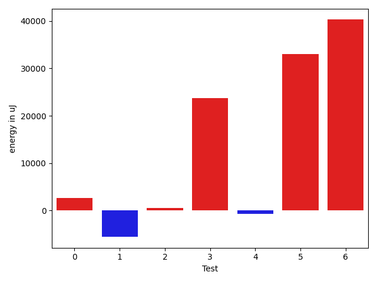

# gson 464483

https://github.com/google/gson/commit/464483

## Delta Energy per test method

| ID | EnergyV1 | EnergyV2 | DeltaEnergy | σV1 | %σV1 | σV2 | %σV2 |
| --- | --- | --- | --- | --- | --- | --- | --- |
| 0 | 187255 | 189880 | 2625 | 17069.97 | 9.12 | 12395.24 | 6.53 |
| 1 | 175293 | 169738 | -5555 | 24205.95 | 13.81 | 31875.77 | 18.78 |
| 2 | 384399 | 384887 | 488 | 25692.70 | 6.68 | 19637.01 | 5.10 |
| 3 | 314514 | 338195 | 23681 | 29015.86 | 9.23 | 30326.92 | 8.97 |
| 4 | 303772 | 303039 | -733 | 17742.99 | 5.84 | 43831.90 | 14.46 |
| 5 | 161560 | 194580 | 33020 | 24879.73 | 15.40 | 45935.99 | 23.61 |
| 6 | 1964777 | 2005060 | 40283 | 154855.09 | 7.88 | 134144.89 | 6.69 |

## Misc.

| ID | Test Class | Test Method |
| --- | --- | --- |
| 0 | com.google.gson.functional.StringTest | testEscapingQuotesInStringSerialization |
| 1 | com.google.gson.functional.StringTest | testSingleQuoteInStringSerialization |
| 2 | com.google.gson.functional.EscapingTest | testGsonDoubleDeserialization |
| 3 | com.google.gson.functional.EscapingTest | testGsonAcceptsEscapedAndNonEscapedJsonDeserialization |
| 4 | com.google.gson.functional.EscapingTest | testEscapingObjectFields |
| 5 | com.google.gson.functional.EscapingTest | testEscapingQuotesInStringArray |
| 6 | com.google.gson.functional.NamingPolicyTest | testComplexFieldNameStrategy |

## Classifications

### Tests
| ID | Class | Delta | Share |
| --- | --- | --- | --- |
| G | NEUTRAL | 93809.0 | - |
| N | NEGATIVE | -6288.0 | 50.00 |
| P | POSITIVE | 100097.0 | 20.00 |
| 1 | NEGATIVE | -5555.0 | 88.34 |
| 5 | POSITIVE | 33020.0 | 32.99 |
| 6 | POSITIVE | 40283.0 | 40.24 |

### Lines
| Class | Java Class | Line |
| --- | --- | --- |
| negative | com.google.gson.stream.JsonReader | 1009 |
| negative | com.google.gson.stream.JsonReader | 1010 |
| negative | com.google.gson.stream.JsonReader | 1011 |
| negative | com.google.gson.stream.JsonReader | 1015 |
| positive | com.google.gson.stream.JsonReader | 1009 |
| positive | com.google.gson.stream.JsonReader | 1010 |
| positive | com.google.gson.stream.JsonReader | 1011 |
| positive | com.google.gson.stream.JsonReader | 1015 |
| unknown | com.google.gson.stream.JsonReader | 1009 |
| unknown | com.google.gson.stream.JsonReader | 1010 |
| unknown | com.google.gson.stream.JsonReader | 1011 |
| unknown | com.google.gson.stream.JsonReader | 1015 |

## Localization of Green Regression
### Selected Tests
| Test class | test method |
| --- | --- |
| com.google.gson.functional.EscapingTest | testEscapingQuotesInStringArray |
| com.google.gson.functional.NamingPolicyTest | testComplexFieldNameStrategy |

### Suspected lines
| Class | line |
| --- | --- |
| com.google.gson.stream.JsonReader | [1010](https://github.com/google/gson/tree/464483/gson/src/main/java/com/google/gson/stream/JsonReader.java#L1010) |
| com.google.gson.stream.JsonReader | [1009](https://github.com/google/gson/tree/464483/gson/src/main/java/com/google/gson/stream/JsonReader.java#L1010#L1009) |
| com.google.gson.stream.JsonReader | [1011](https://github.com/google/gson/tree/464483/gson/src/main/java/com/google/gson/stream/JsonReader.java#L1010#L1009#L1011) |
| com.google.gson.stream.JsonReader | [1015](https://github.com/google/gson/tree/464483/gson/src/main/java/com/google/gson/stream/JsonReader.java#L1010#L1009#L1011#L1015) |

| Time Label | Time (s) |
| --- | --- |
| Selection | 35.0759003162384 |
| Injection | 14.95340347290039 |
| Total | 200.72871613502502 |

