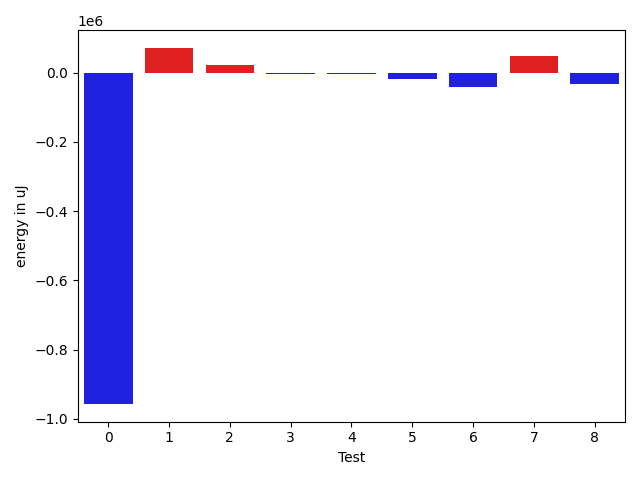

# gson 2d072b

https://github.com/google/gson/commit/2d072b

## Delta Energy per test method

| ID | EnergyV1 | EnergyV2 | DeltaEnergy | σV1 | %σV1 | σV2 | %σV2 |
| --- | --- | --- | --- | --- | --- | --- | --- |
| 0 | 1153195 | 196105 | -957090 | 101602.83 | 8.81 | 17373.01 | 8.86 |
| 1 | 364806 | 436156 | 71350 | 22978.01 | 6.30 | 59696.64 | 13.69 |
| 2 | 282531 | 305541 | 23010 | 15538.52 | 5.50 | 36534.04 | 11.96 |
| 3 | 283446 | 278381 | -5065 | 21651.51 | 7.64 | 15646.29 | 5.62 |
| 4 | 232177 | 228698 | -3479 | 35266.10 | 15.19 | 35820.37 | 15.66 |
| 5 | 226135 | 206543 | -19592 | 33874.13 | 14.98 | 43360.06 | 20.99 |
| 6 | 268859 | 228210 | -40649 | 27513.02 | 10.23 | 29750.98 | 13.04 |
| 7 | 418700 | 465392 | 46692 | 37977.36 | 9.07 | 31290.96 | 6.72 |
| 8 | 318297 | 285766 | -32531 | 23685.08 | 7.44 | 24466.16 | 8.56 |

## Misc.

| ID | Test Class | Test Method |
| --- | --- | --- |
| 0 | com.google.gson.internal.bind.JsonElementReaderTest | testSkipValue |
| 1 | com.google.gson.functional.ExclusionStrategyFunctionalTest | testExclusionStrategyWithMode |
| 2 | com.google.gson.functional.ExclusionStrategyFunctionalTest | testExclusionStrategyDeserialization |
| 3 | com.google.gson.stream.JsonReaderPathTest | skipNestedStructures |
| 4 | com.google.gson.stream.JsonReaderPathTest | skipArrayElements |
| 5 | com.google.gson.stream.JsonReaderPathTest | skipObjectValues |
| 6 | com.google.gson.stream.JsonReaderPathTest | skipObjectNames |
| 7 | com.google.gson.functional.CustomDeserializerTest | testJsonTypeFieldBasedDeserialization |
| 8 | com.google.gson.functional.JsonParserTest | testBadFieldTypeForDeserializingCustomTree |

## Classifications

### Tests
| ID | Class | Delta | Share |
| --- | --- | --- | --- |
| G | NEUTRAL | -917354.0 | - |
| N | NEGATIVE | -1058406.0 | 16.67 |
| P | POSITIVE | 141052.0 | 33.33 |
| 0 | NEGATIVE | -957090.0 | 90.43 |
| 1 | POSITIVE | 71350.0 | 50.58 |

### Lines
| Class | Java Class | Line |
| --- | --- | --- |
| negative | com.google.gson.internal.bind.JsonTreeReader | 262 |
| negative | com.google.gson.internal.bind.JsonTreeReader | 266 |
| positive | com.google.gson.internal.bind.JsonTreeReader | 262 |
| positive | com.google.gson.internal.bind.JsonTreeReader | 266 |
| unknown | com.google.gson.internal.bind.JsonTreeReader | 262 |
| unknown | com.google.gson.internal.bind.JsonTreeReader | 266 |

## Localization of Green Regression
### Selected Tests
| Test class | test method |
| --- | --- |
| com.google.gson.functional.CustomDeserializerTest | testJsonTypeFieldBasedDeserialization |
| com.google.gson.functional.ExclusionStrategyFunctionalTest | testExclusionStrategyWithMode |

### Suspected lines
| Class | line |
| --- | --- |
| com.google.gson.internal.bind.JsonTreeReader | [262](https://github.com/google/gson/tree/2d072b/gson/src/main/java/com/google/gson/internal/bind/JsonTreeReader.java#L262) |
| com.google.gson.internal.bind.JsonTreeReader | [266](https://github.com/google/gson/tree/2d072b/gson/src/main/java/com/google/gson/internal/bind/JsonTreeReader.java#L262#L266) |

| Time Label | Time (s) |
| --- | --- |
| Selection | 35.21564483642578 |
| Injection | 16.086700916290283 |
| Total | 205.25108122825623 |

