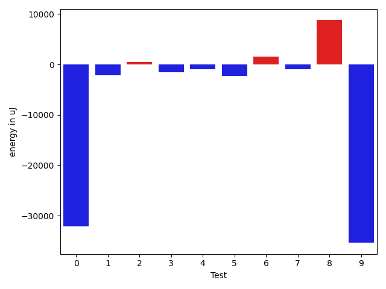
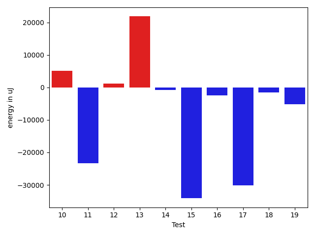
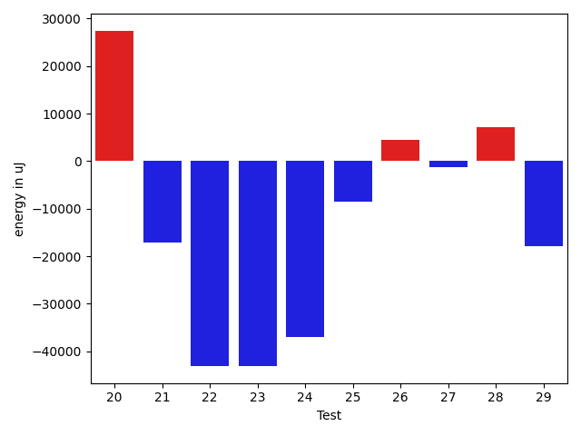
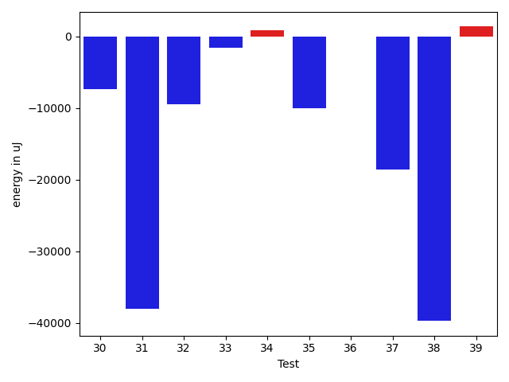
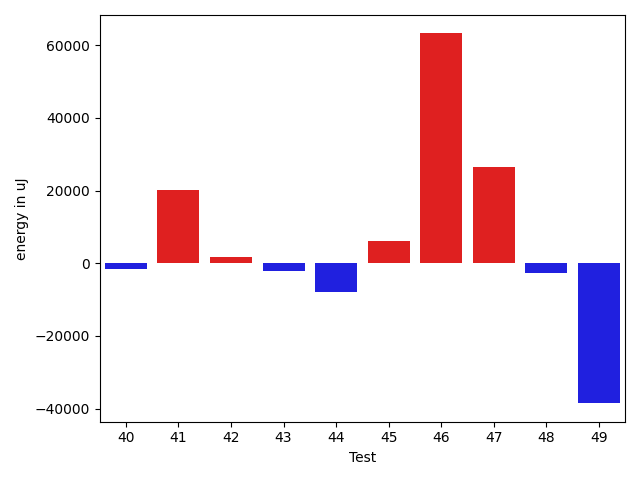
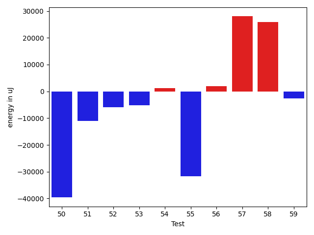
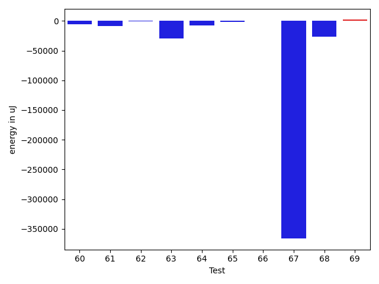
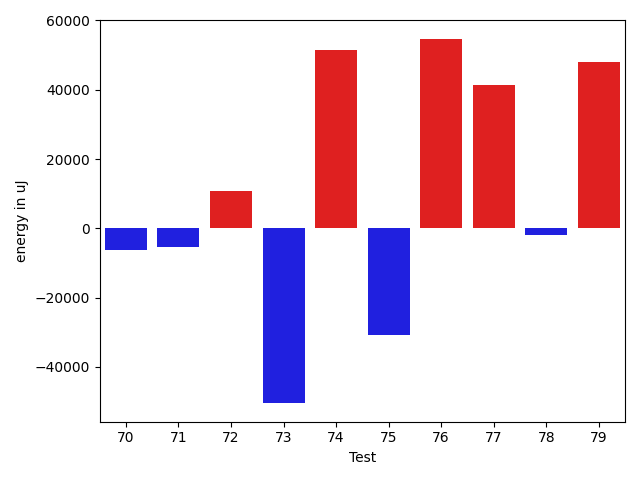
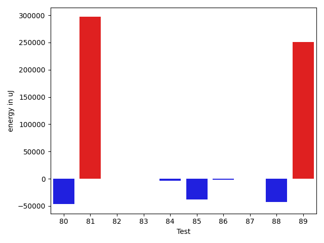
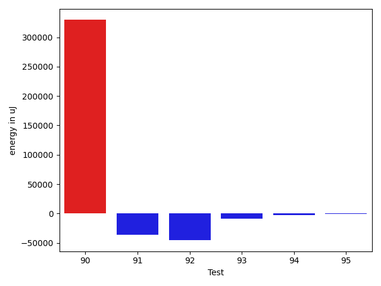

# gson 9c30b0

https://github.com/google/gson/commit/9c30b0

## Delta Energy per test method

| ID | EnergyV1 | EnergyV2 | DeltaEnergy | σV1 | %σV1 | σV2 | %σV2 |
| --- | --- | --- | --- | --- | --- | --- | --- |
| 0 | 112244 | 80078 | -32166 | 19838.97 | 17.67 | 11810.14 | 14.75 |
| 1 | 80749 | 78613 | -2136 | 19999.51 | 24.77 | 17012.08 | 21.64 |
| 2 | 75744 | 76172 | 428 | 18731.08 | 24.73 | 16089.42 | 21.12 |
| 3 | 89783 | 88195 | -1588 | 28056.87 | 31.25 | 24752.18 | 28.07 |
| 4 | 77209 | 76293 | -916 | 12779.17 | 16.55 | 17529.35 | 22.98 |
| 5 | 87402 | 85083 | -2319 | 23388.38 | 26.76 | 12044.11 | 14.16 |
| 6 | 71228 | 72814 | 1586 | 19249.25 | 27.02 | 20147.81 | 27.67 |
| 7 | 76050 | 75073 | -977 | 16234.01 | 21.35 | 12860.44 | 17.13 |
| 8 | 365904 | 374694 | 8790 | 38376.56 | 10.49 | 25548.86 | 6.82 |
| 9 | 168457 | 133057 | -35400 | 19718.22 | 11.71 | 21306.16 | 16.01 |
| 10 | 169555 | 174743 | 5188 | 34147.52 | 20.14 | 7656.49 | 4.38 |
| 11 | 214843 | 191467 | -23376 | 32365.83 | 15.06 | 17084.92 | 8.92 |
| 12 | 80566 | 81787 | 1221 | 21808.63 | 27.07 | 25519.21 | 31.20 |
| 13 | 136780 | 158630 | 21850 | 22528.00 | 16.47 | 28249.57 | 17.81 |
| 14 | 76049 | 75257 | -792 | 13613.05 | 17.90 | 1574.46 | 2.09 |
| 15 | 364196 | 330077 | -34119 | 27091.62 | 7.44 | 25477.83 | 7.72 |
| 16 | 47485 | 45105 | -2380 | 19400.22 | 40.86 | 10977.54 | 24.34 |
| 17 | 149109 | 118896 | -30213 | 18546.82 | 12.44 | 18693.03 | 15.72 |
| 18 | 132324 | 130737 | -1587 | 23138.29 | 17.49 | 5030.53 | 3.85 |
| 19 | 136841 | 131653 | -5188 | 21232.19 | 15.52 | 32007.47 | 24.31 |
| 20 | 199279 | 226746 | 27467 | 23616.96 | 11.85 | 18914.59 | 8.34 |
| 21 | 303894 | 286803 | -17091 | 30101.26 | 9.91 | 30491.61 | 10.63 |
| 22 | 529540 | 486449 | -43091 | 44245.04 | 8.36 | 38785.90 | 7.97 |
| 23 | 85327 | 42175 | -43152 | 2991.24 | 3.51 | 20858.02 | 49.46 |
| 24 | 75012 | 38025 | -36987 | 19394.14 | 25.85 | 16407.69 | 43.15 |
| 25 | 125976 | 117492 | -8484 | 24488.14 | 19.44 | 15555.65 | 13.24 |
| 26 | 83862 | 88379 | 4517 | 18861.80 | 22.49 | 32053.85 | 36.27 |
| 27 | 293518 | 292175 | -1343 | 16673.13 | 5.68 | 23902.07 | 8.18 |
| 28 | 194763 | 201843 | 7080 | 27094.15 | 13.91 | 30766.04 | 15.24 |
| 29 | 230713 | 212890 | -17823 | 13685.79 | 5.93 | 25496.06 | 11.98 |
| 30 | 205261 | 197876 | -7385 | 33354.06 | 16.25 | 23690.92 | 11.97 |
| 31 | 433897 | 395812 | -38085 | 51418.13 | 11.85 | 23717.29 | 5.99 |
| 32 | 129883 | 120361 | -9522 | 21558.47 | 16.60 | 21104.94 | 17.53 |
| 33 | 170470 | 168823 | -1647 | 22241.13 | 13.05 | 20107.10 | 11.91 |
| 34 | 177978 | 178832 | 854 | 4516.41 | 2.54 | 28495.71 | 15.93 |
| 35 | 784300 | 774229 | -10071 | 56911.26 | 7.26 | 53319.32 | 6.89 |
| 36 | 114135 | 114136 | 1 | 18826.59 | 16.50 | 19839.31 | 17.38 |
| 37 | 1315792 | 1297238 | -18554 | 120341.04 | 9.15 | 90281.21 | 6.96 |
| 38 | 357909 | 318175 | -39734 | 60359.90 | 16.86 | 22531.32 | 7.08 |
| 39 | 186217 | 187560 | 1343 | 16243.71 | 8.72 | 41800.13 | 22.29 |
| 40 | 87769 | 86243 | -1526 | 3761.60 | 4.29 | 13293.11 | 15.41 |
| 41 | 281127 | 301391 | 20264 | 20777.54 | 7.39 | 16327.45 | 5.42 |
| 42 | 226562 | 228209 | 1647 | 6285.41 | 2.77 | 4178.43 | 1.83 |
| 43 | 226074 | 223876 | -2198 | 29481.87 | 13.04 | 17483.07 | 7.81 |
| 44 | 89965 | 82092 | -7873 | 17917.01 | 19.92 | 14814.16 | 18.05 |
| 45 | 386535 | 392699 | 6164 | 20254.35 | 5.24 | 19265.73 | 4.91 |
| 46 | 461912 | 525145 | 63233 | 66753.43 | 14.45 | 120879.41 | 23.02 |
| 47 | 1120847 | 1147458 | 26611 | 80948.42 | 7.22 | 128523.26 | 11.20 |
| 48 | 354430 | 351745 | -2685 | 32036.01 | 9.04 | 26054.46 | 7.41 |
| 49 | 303222 | 264709 | -38513 | 53727.69 | 17.72 | 36482.19 | 13.78 |
| 50 | 354980 | 315367 | -39613 | 15443.14 | 4.35 | 30343.31 | 9.62 |
| 51 | 356139 | 345092 | -11047 | 54911.04 | 15.42 | 36215.01 | 10.49 |
| 52 | 523681 | 517821 | -5860 | 43725.91 | 8.35 | 38086.29 | 7.36 |
| 53 | 187316 | 182189 | -5127 | 23642.83 | 12.62 | 19503.99 | 10.71 |
| 54 | 124511 | 125733 | 1222 | 20943.39 | 16.82 | 19994.26 | 15.90 |
| 55 | 291870 | 260192 | -31678 | 42618.68 | 14.60 | 35705.53 | 13.72 |
| 56 | 75500 | 77514 | 2014 | 15086.74 | 19.98 | 17717.16 | 22.86 |
| 57 | 76721 | 104736 | 28015 | 17731.55 | 23.11 | 18834.43 | 17.98 |
| 58 | 483764 | 509582 | 25818 | 29737.66 | 6.15 | 41422.55 | 8.13 |
| 59 | 122619 | 119995 | -2624 | 13344.11 | 10.88 | 21402.21 | 17.84 |
| 60 | 119568 | 114258 | -5310 | 26209.37 | 21.92 | 23627.80 | 20.68 |
| 61 | 133972 | 125000 | -8972 | 17668.29 | 13.19 | 26713.54 | 21.37 |
| 62 | 208496 | 207519 | -977 | 29041.21 | 13.93 | 14323.33 | 6.90 |
| 63 | 117554 | 88257 | -29297 | 29223.07 | 24.86 | 21800.13 | 24.70 |
| 64 | 383178 | 375060 | -8118 | 26052.52 | 6.80 | 18490.64 | 4.93 |
| 65 | 179259 | 177185 | -2074 | 16707.74 | 9.32 | 23375.16 | 13.19 |
| 66 | 80810 | 81238 | 428 | 17292.64 | 21.40 | 14433.61 | 17.77 |
| 67 | 638793 | 272460 | -366333 | 176538.66 | 27.64 | 33152.83 | 12.17 |
| 68 | 274719 | 248473 | -26246 | 22482.74 | 8.18 | 32919.89 | 13.25 |
| 69 | 243774 | 245605 | 1831 | 24572.75 | 10.08 | 22575.33 | 9.19 |
| 70 | 437560 | 431151 | -6409 | 28950.25 | 6.62 | 20338.85 | 4.72 |
| 71 | 270568 | 265197 | -5371 | 26291.75 | 9.72 | 18241.03 | 6.88 |
| 72 | 154846 | 165588 | 10742 | 17787.67 | 11.49 | 28564.29 | 17.25 |
| 73 | 442809 | 392211 | -50598 | 30412.94 | 6.87 | 39100.98 | 9.97 |
| 74 | 351317 | 402770 | 51453 | 41587.21 | 11.84 | 56307.23 | 13.98 |
| 75 | 191100 | 160339 | -30761 | 21058.77 | 11.02 | 19548.92 | 12.19 |
| 76 | 217589 | 272339 | 54750 | 39139.49 | 17.99 | 36834.14 | 13.53 |
| 77 | 223754 | 265258 | 41504 | 30389.06 | 13.58 | 22198.36 | 8.37 |
| 78 | 272460 | 270568 | -1892 | 39197.16 | 14.39 | 71662.48 | 26.49 |
| 79 | 211975 | 259887 | 47912 | 30835.58 | 14.55 | 42029.90 | 16.17 |
| 80 | 157349 | 110717 | -46632 | 26892.77 | 17.09 | 33846.84 | 30.57 |
| 81 | 164245 | 461059 | 296814 | 14661.28 | 8.93 | 104543.65 | 22.67 |
| 82 | 84168 | 84106 | -62 | 22362.58 | 26.57 | 10607.81 | 12.61 |
| 83 | 44555 | 44434 | -121 | 22235.09 | 49.90 | 18958.40 | 42.67 |
| 84 | 85022 | 81482 | -3540 | 17891.05 | 21.04 | 18526.84 | 22.74 |
| 85 | 128540 | 90637 | -37903 | 15084.96 | 11.74 | 22512.40 | 24.84 |
| 86 | 122009 | 119812 | -2197 | 20540.02 | 16.83 | 19064.04 | 15.91 |
| 87 | 75439 | 75744 | 305 | 10787.20 | 14.30 | 11313.80 | 14.94 |
| 88 | 87463 | 44800 | -42663 | 21314.86 | 24.37 | 24583.64 | 54.87 |
| 89 | 167786 | 419066 | 251280 | 20040.57 | 11.94 | 84930.16 | 20.27 |
| 90 | 150207 | 479674 | 329467 | 16449.90 | 10.95 | 31409.30 | 6.55 |
| 91 | 247314 | 211303 | -36011 | 37618.45 | 15.21 | 33448.87 | 15.83 |
| 92 | 90698 | 45227 | -45471 | 14451.73 | 15.93 | 22028.62 | 48.71 |
| 93 | 202759 | 193908 | -8851 | 24980.19 | 12.32 | 24184.67 | 12.47 |
| 94 | 132324 | 129700 | -2624 | 15762.84 | 11.91 | 6267.29 | 4.83 |
| 95 | 132995 | 132263 | -732 | 25724.44 | 19.34 | 32421.80 | 24.51 |

## Misc.

| ID | Test Class | Test Method |
| --- | --- | --- |
| 0 | com.google.gson.functional.TypeAdapterPrecedenceTest | testStreamingFollowedByNonstreaming |
| 1 | com.google.gson.functional.TypeAdapterPrecedenceTest | testStreamingHierarchicalFollowedByNonstreaming |
| 2 | com.google.gson.functional.TypeAdapterPrecedenceTest | testSerializeNonstreamingTypeAdapterFollowedByStreamingTypeAdapter |
| 3 | com.google.gson.functional.TypeAdapterPrecedenceTest | testNonstreamingHierarchicalFollowedByNonstreaming |
| 4 | com.google.gson.functional.TypeAdapterPrecedenceTest | testStreamingHierarchicalFollowedByNonstreamingHierarchical |
| 5 | com.google.gson.functional.TypeAdapterPrecedenceTest | testNonstreamingFollowedByNonstreaming |
| 6 | com.google.gson.functional.TypeAdapterPrecedenceTest | testStreamingFollowedByStreaming |
| 7 | com.google.gson.functional.TypeAdapterPrecedenceTest | testStreamingFollowedByNonstreamingHierarchical |
| 8 | com.google.gson.functional.StreamingTypeAdaptersTest | testNullSafe |
| 9 | com.google.gson.functional.JsonAdapterAnnotationOnClassesTest | testJsonAdapterInvoked |
| 10 | com.google.gson.functional.JsonAdapterAnnotationOnClassesTest | testRegisteredDeserializerOverridesJsonAdapter |
| 11 | com.google.gson.functional.JsonAdapterAnnotationOnClassesTest | testRegisteredSerializerOverridesJsonAdapter |
| 12 | com.google.gson.functional.JsonAdapterAnnotationOnClassesTest | testJsonAdapterFactoryInvoked |
| 13 | com.google.gson.functional.CustomDeserializerTest | testDefaultConstructorNotCalledOnField |
| 14 | com.google.gson.functional.CustomDeserializerTest | testDefaultConstructorNotCalledOnObject |
| 15 | com.google.gson.functional.CustomDeserializerTest | testJsonTypeFieldBasedDeserialization |
| 16 | com.google.gson.OverrideCoreTypeAdaptersTest | testOverrideStringAdapter |
| 17 | com.google.gson.functional.JsonAdapterSerializerDeserializerTest | testJsonSerializerDeserializerBasedJsonAdapterOnFields |
| 18 | com.google.gson.functional.JsonAdapterSerializerDeserializerTest | testJsonSerializerDeserializerBasedJsonAdapterOnClass |
| 19 | com.google.gson.functional.ThrowableFunctionalTest | testExceptionWithoutCause |
| 20 | com.google.gson.functional.ThrowableFunctionalTest | testErrornWithCause |
| 21 | com.google.gson.functional.ThrowableFunctionalTest | testErrorWithoutCause |
| 22 | com.google.gson.functional.ThrowableFunctionalTest | testExceptionWithCause |
| 23 | com.google.gson.functional.StringTest | testEscapingQuotesInStringSerialization |
| 24 | com.google.gson.functional.StringTest | testSingleQuoteInStringSerialization |
| 25 | com.google.gson.functional.ReadersWritersTest | testReadWriteTwoObjects |
| 26 | com.google.gson.functional.ReadersWritersTest | testReadWriteTwoStrings |
| 27 | com.google.gson.functional.MapTest | testConcurrentSkipListMap |
| 28 | com.google.gson.functional.MapTest | testConcurrentHashMap |
| 29 | com.google.gson.functional.MapTest | testConcurrentMap |
| 30 | com.google.gson.functional.MapTest | testConcurrentNavigableMap |
| 31 | com.google.gson.functional.DefaultTypeAdaptersTest | testBitSetDeserialization |
| 32 | com.google.gson.functional.DefaultTypeAdaptersTest | testOverrideBigIntegerTypeAdapter |
| 33 | com.google.gson.functional.DefaultTypeAdaptersTest | testSqlDateSerialization |
| 34 | com.google.gson.functional.DefaultTypeAdaptersTest | testTimestampSerialization |
| 35 | com.google.gson.functional.DefaultTypeAdaptersTest | testDefaultDateDeserializationUsingBuilder |
| 36 | com.google.gson.functional.DefaultTypeAdaptersTest | testOverrideBigDecimalTypeAdapter |
| 37 | com.google.gson.functional.DefaultTypeAdaptersTest | testDateDeserializationWithPattern |
| 38 | com.google.gson.functional.DefaultTypeAdaptersTest | testDateSerializationInCollection |
| 39 | com.google.gson.functional.EnumTest | testEnumSubclassAsParameterizedType |
| 40 | com.google.gson.functional.EnumTest | testEnumCaseMapping |
| 41 | com.google.gson.functional.EnumTest | testEnumSubclass |
| 42 | com.google.gson.functional.EnumTest | testEnumSubclassWithRegisteredTypeAdapter |
| 43 | com.google.gson.functional.EnumTest | testEnumSet |
| 44 | com.google.gson.functional.DelegateTypeAdapterTest | testDelegateInvokedOnStrings |
| 45 | com.google.gson.functional.DelegateTypeAdapterTest | testDelegateInvoked |
| 46 | com.google.gson.JsonParserTest | testReadWriteTwoObjects |
| 47 | com.google.gson.JsonParserTest | testParseMixedArray |
| 48 | com.google.gson.functional.ParameterizedTypesTest | testVariableTypeArrayDeserialization |
| 49 | com.google.gson.functional.ParameterizedTypesTest | testVariableTypeDeserialization |
| 50 | com.google.gson.functional.ParameterizedTypesTest | testParameterizedTypeGenericArraysDeserialization |
| 51 | com.google.gson.functional.ParameterizedTypesTest | testVariableTypeFieldsAndGenericArraysDeserialization |
| 52 | com.google.gson.functional.ParameterizedTypesTest | testParameterizedTypeWithVariableTypeDeserialization |
| 53 | com.google.gson.functional.ObjectTest | testSingletonLists |
| 54 | com.google.gson.functional.JsonAdapterAnnotationOnFieldsTest | testPrimitiveFieldAnnotationTakesPrecedenceOverDefault |
| 55 | com.google.gson.functional.JsonAdapterAnnotationOnFieldsTest | testClassAnnotationAdapterFactoryTakesPrecedenceOverDefault |
| 56 | com.google.gson.functional.JsonAdapterAnnotationOnFieldsTest | testJsonAdapterWrappedInNullSafeAsRequested |
| 57 | com.google.gson.functional.JsonAdapterAnnotationOnFieldsTest | testClassAnnotationAdapterTakesPrecedenceOverDefault |
| 58 | com.google.gson.functional.JsonAdapterAnnotationOnFieldsTest | testFieldAnnotationWorksForParameterizedType |
| 59 | com.google.gson.functional.JsonAdapterAnnotationOnFieldsTest | testRegisteredTypeAdapterTakesPrecedenceOverClassAnnotationAdapter |
| 60 | com.google.gson.functional.JsonAdapterAnnotationOnFieldsTest | testFieldAnnotationTakesPrecedenceOverClassAnnotation |
| 61 | com.google.gson.functional.JsonAdapterAnnotationOnFieldsTest | testNonPrimitiveFieldAnnotationTakesPrecedenceOverDefault |
| 62 | com.google.gson.functional.JsonAdapterAnnotationOnFieldsTest | testFieldAnnotationTakesPrecedenceOverRegisteredTypeAdapter |
| 63 | com.google.gson.functional.TypeHierarchyAdapterTest | testRegisterSuperTypeFirst |
| 64 | com.google.gson.functional.TypeHierarchyAdapterTest | testTypeHierarchy |
| 65 | com.google.gson.internal.bind.JsonElementReaderTest | testSkipValue |
| 66 | com.google.gson.functional.TypeVariableTest | testBasicTypeVariables |
| 67 | com.google.gson.functional.TypeVariableTest | testAdvancedTypeVariables |
| 68 | com.google.gson.functional.TypeVariableTest | testTypeVariablesViaTypeParameter |
| 69 | com.google.gson.functional.MapAsArrayTypeAdapterTest | testMultipleEnableComplexKeyRegistrationHasNoEffect |
| 70 | com.google.gson.functional.MapAsArrayTypeAdapterTest | testSerializeComplexMapWithTypeAdapter |
| 71 | com.google.gson.functional.RuntimeTypeAdapterFactoryFunctionalTest | testSubclassesAutomaticallySerialized |
| 72 | com.google.gson.functional.CollectionTest | testFieldIsArrayList |
| 73 | com.google.gson.functional.CollectionTest | testWildcardCollectionField |
| 74 | com.google.gson.functional.ExclusionStrategyFunctionalTest | testExclusionStrategyWithMode |
| 75 | com.google.gson.functional.ExclusionStrategyFunctionalTest | testExclusionStrategyDeserialization |
| 76 | com.google.gson.stream.JsonReaderPathTest | skipNestedStructures |
| 77 | com.google.gson.stream.JsonReaderPathTest | skipArrayElements |
| 78 | com.google.gson.stream.JsonReaderPathTest | skipObjectValues |
| 79 | com.google.gson.stream.JsonReaderPathTest | skipObjectNames |
| 80 | com.google.gson.functional.JavaUtilConcurrentAtomicTest | testAtomicLongWithStringSerializationPolicy |
| 81 | com.google.gson.functional.JavaUtilConcurrentAtomicTest | testAtomicLongArrayWithStringSerializationPolicy |
| 82 | com.google.gson.functional.UncategorizedTest | testGsonInstanceReusableForSerializationAndDeserialization |
| 83 | com.google.gson.functional.PrimitiveTest | testQuotedStringSerializationAndDeserialization |
| 84 | com.google.gson.GsonTypeAdapterTest | testTypeAdapterDoesNotAffectNonAdaptedTypes |
| 85 | com.google.gson.functional.EscapingTest | testGsonDoubleDeserialization |
| 86 | com.google.gson.functional.EscapingTest | testGsonAcceptsEscapedAndNonEscapedJsonDeserialization |
| 87 | com.google.gson.functional.EscapingTest | testEscapingObjectFields |
| 88 | com.google.gson.functional.EscapingTest | testEscapingQuotesInStringArray |
| 89 | com.google.gson.internal.bind.JsonTreeReaderTest | testSkipValue_filledJsonObject |
| 90 | com.google.gson.internal.bind.JsonTreeReaderTest | testSkipValue_emptyJsonObject |
| 91 | com.google.gson.functional.NamingPolicyTest | testComplexFieldNameStrategy |
| 92 | com.google.gson.functional.JavaUtilTest | testProperties |
| 93 | com.google.gson.functional.JavaUtilTest | testCurrency |
| 94 | com.google.gson.DefaultInetAddressTypeAdapterTest | testInetAddressSerializationAndDeserialization |
| 95 | com.google.gson.functional.JsonParserTest | testBadFieldTypeForDeserializingCustomTree |

## Classifications

### Tests
| ID | Class | Delta | Share |
| --- | --- | --- | --- |
| G | NEUTRAL | -42236.0 | - |
| N | NEGATIVE | -1384035.0 | 1.56 |
| P | POSITIVE | 1341799.0 | 3.12 |
| 9 | NEGATIVE | -35400.0 | 2.56 |
| 15 | NEGATIVE | -34119.0 | 2.47 |
| 22 | NEGATIVE | -43091.0 | 3.11 |
| 23 | NEGATIVE | -43152.0 | 3.12 |
| 24 | NEGATIVE | -36987.0 | 2.67 |
| 31 | NEGATIVE | -38085.0 | 2.75 |
| 38 | NEGATIVE | -39734.0 | 2.87 |
| 46 | POSITIVE | 63233.0 | 4.71 |
| 49 | NEGATIVE | -38513.0 | 2.78 |
| 50 | NEGATIVE | -39613.0 | 2.86 |
| 67 | NEGATIVE | -366333.0 | 26.47 |
| 73 | NEGATIVE | -50598.0 | 3.66 |
| 80 | NEGATIVE | -46632.0 | 3.37 |
| 81 | POSITIVE | 296814.0 | 22.12 |
| 85 | NEGATIVE | -37903.0 | 2.74 |
| 88 | NEGATIVE | -42663.0 | 3.08 |
| 89 | POSITIVE | 251280.0 | 18.73 |
| 90 | POSITIVE | 329467.0 | 24.55 |
| 91 | NEGATIVE | -36011.0 | 2.60 |
| 92 | NEGATIVE | -45471.0 | 3.29 |

### Lines
| Class | Java Class | Line |
| --- | --- | --- |
| negative | com.google.gson.internal.bind.JsonTreeReader | 262 |
| negative | com.google.gson.internal.bind.JsonTreeReader | 266 |
| negative | com.google.gson.stream.JsonReader | 1008 |
| negative | com.google.gson.stream.JsonReader | 1009 |
| negative | com.google.gson.stream.JsonReader | 1010 |
| negative | com.google.gson.stream.JsonReader | 1011 |
| negative | com.google.gson.stream.JsonReader | 999 |
| negative | com.google.gson.stream.JsonReader | 1015 |
| negative | com.google.gson.stream.JsonReader | 1000 |
| negative | com.google.gson.stream.JsonReader | 1001 |
| negative | com.google.gson.stream.JsonReader | 1003 |
| negative | com.google.gson.stream.JsonReader | 988 |
| positive | com.google.gson.internal.bind.JsonTreeReader | 262 |
| positive | com.google.gson.internal.bind.JsonTreeReader | 266 |
| positive | com.google.gson.stream.JsonReader | 1008 |
| positive | com.google.gson.stream.JsonReader | 999 |
| positive | com.google.gson.stream.JsonReader | 1000 |
| positive | com.google.gson.stream.JsonReader | 1001 |
| positive | com.google.gson.stream.JsonReader | 988 |
| unknown | com.google.gson.internal.bind.JsonTreeReader | 262 |
| unknown | com.google.gson.internal.bind.JsonTreeReader | 266 |
| unknown | com.google.gson.stream.JsonReader | 1008 |
| unknown | com.google.gson.stream.JsonReader | 1009 |
| unknown | com.google.gson.stream.JsonReader | 1010 |
| unknown | com.google.gson.stream.JsonReader | 1027 |
| unknown | com.google.gson.stream.JsonReader | 1011 |
| unknown | com.google.gson.stream.JsonReader | 999 |
| unknown | com.google.gson.stream.JsonReader | 1015 |
| unknown | com.google.gson.stream.JsonReader | 1000 |
| unknown | com.google.gson.stream.JsonReader | 1001 |
| unknown | com.google.gson.stream.JsonReader | 1003 |
| unknown | com.google.gson.stream.JsonReader | 988 |

## Localization of Green Regression
### Selected Tests
| Test class | test method |
| --- | --- |

### Suspected lines
| Class | line |
| --- | --- |
| com.google.gson.stream.JsonReader | [988](https://github.com/google/gson/tree/9c30b0/gson/src/main/java/com/google/gson/stream/JsonReader.java#L988) |
| com.google.gson.stream.JsonReader | [999](https://github.com/google/gson/tree/9c30b0/gson/src/main/java/com/google/gson/stream/JsonReader.java#L988#L999) |
| com.google.gson.stream.JsonReader | [1000](https://github.com/google/gson/tree/9c30b0/gson/src/main/java/com/google/gson/stream/JsonReader.java#L988#L999#L1000) |
| com.google.gson.stream.JsonReader | [1001](https://github.com/google/gson/tree/9c30b0/gson/src/main/java/com/google/gson/stream/JsonReader.java#L988#L999#L1000#L1001) |
| com.google.gson.stream.JsonReader | [1008](https://github.com/google/gson/tree/9c30b0/gson/src/main/java/com/google/gson/stream/JsonReader.java#L988#L999#L1000#L1001#L1008) |
| com.google.gson.stream.JsonReader | [1003](https://github.com/google/gson/tree/9c30b0/gson/src/main/java/com/google/gson/stream/JsonReader.java#L988#L999#L1000#L1001#L1008#L1003) |
| com.google.gson.stream.JsonReader | [1027](https://github.com/google/gson/tree/9c30b0/gson/src/main/java/com/google/gson/stream/JsonReader.java#L988#L999#L1000#L1001#L1008#L1003#L1027) |
| com.google.gson.stream.JsonReader | [1009](https://github.com/google/gson/tree/9c30b0/gson/src/main/java/com/google/gson/stream/JsonReader.java#L988#L999#L1000#L1001#L1008#L1003#L1027#L1009) |
| com.google.gson.stream.JsonReader | [1010](https://github.com/google/gson/tree/9c30b0/gson/src/main/java/com/google/gson/stream/JsonReader.java#L988#L999#L1000#L1001#L1008#L1003#L1027#L1009#L1010) |
| com.google.gson.stream.JsonReader | [1011](https://github.com/google/gson/tree/9c30b0/gson/src/main/java/com/google/gson/stream/JsonReader.java#L988#L999#L1000#L1001#L1008#L1003#L1027#L1009#L1010#L1011) |
| com.google.gson.stream.JsonReader | [1015](https://github.com/google/gson/tree/9c30b0/gson/src/main/java/com/google/gson/stream/JsonReader.java#L988#L999#L1000#L1001#L1008#L1003#L1027#L1009#L1010#L1011#L1015) |
| com.google.gson.internal.bind.JsonTreeReader | [262](https://github.com/google/gson/tree/9c30b0/gson/src/main/java/com/google/gson/internal/bind/JsonTreeReader.java#L262) |
| com.google.gson.internal.bind.JsonTreeReader | [266](https://github.com/google/gson/tree/9c30b0/gson/src/main/java/com/google/gson/internal/bind/JsonTreeReader.java#L262#L266) |

| Time Label | Time (s) |
| --- | --- |
| Selection | 35.18761682510376 |
| Injection | 61.024943828582764 |
| Total | 307.39857149124146 |

