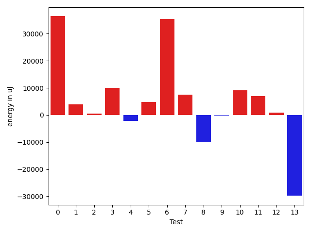
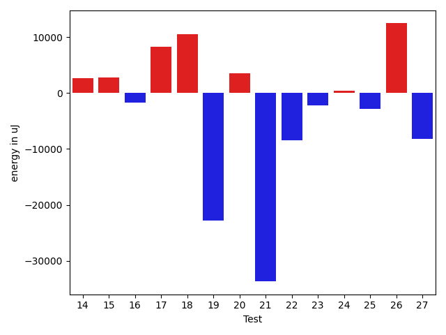
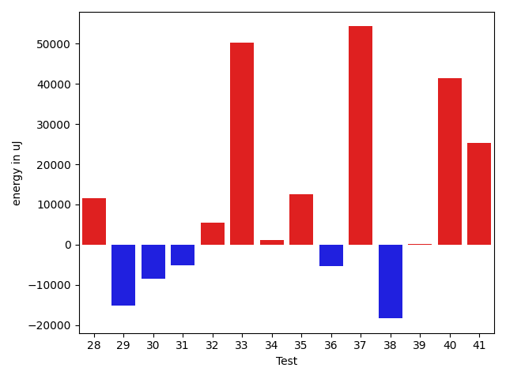
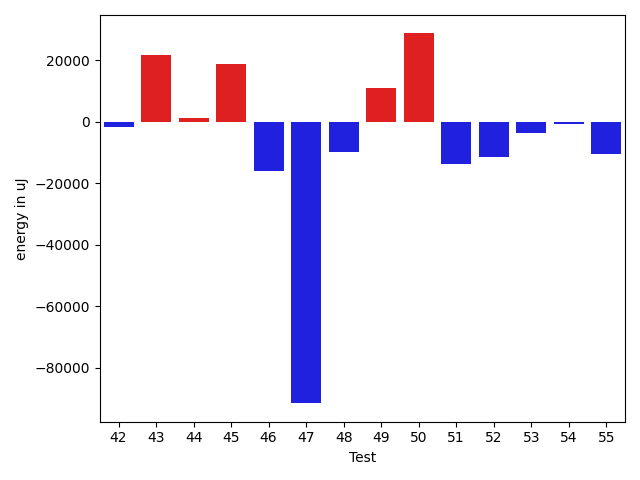
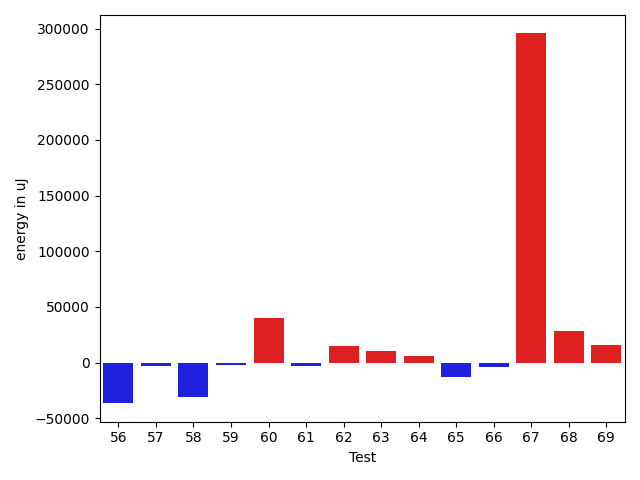
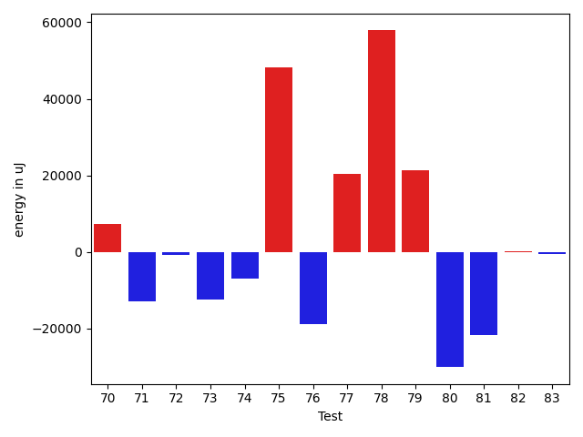
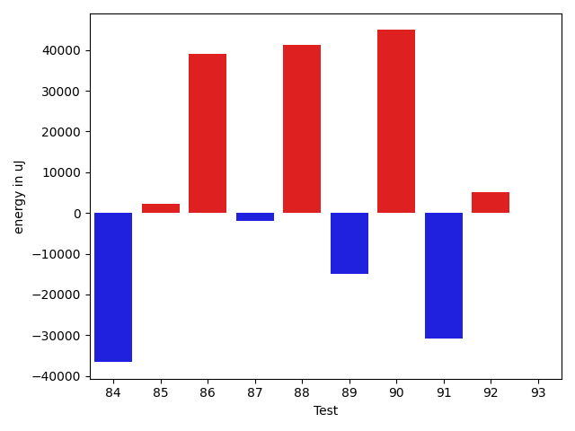

# gson 9e6f2b

https://github.com/google/gson/commit/9e6f2b

## Delta Energy per test method

| ID | EnergyV1 | EnergyV2 | DeltaEnergy | σV1 | %σV1 | σV2 | %σV2 |
| --- | --- | --- | --- | --- | --- | --- | --- |
| 0 | 90149 | 126586 | 36437 | 23375.89 | 25.93 | 21975.47 | 17.36 |
| 1 | 75989 | 79956 | 3967 | 24937.63 | 32.82 | 17463.95 | 21.84 |
| 2 | 76721 | 77209 | 488 | 23910.43 | 31.17 | 15874.45 | 20.56 |
| 3 | 82458 | 92468 | 10010 | 40320.90 | 48.90 | 21348.99 | 23.09 |
| 4 | 76721 | 74524 | -2197 | 13072.28 | 17.04 | 15926.36 | 21.37 |
| 5 | 83862 | 88623 | 4761 | 18666.31 | 22.26 | 22754.15 | 25.68 |
| 6 | 40466 | 75928 | 35462 | 26759.04 | 66.13 | 20167.54 | 26.56 |
| 7 | 72204 | 79712 | 7508 | 12046.05 | 16.68 | 22994.63 | 28.85 |
| 8 | 364990 | 355162 | -9828 | 19158.57 | 5.25 | 19008.25 | 5.35 |
| 9 | 164916 | 164734 | -182 | 16931.21 | 10.27 | 20299.39 | 12.32 |
| 10 | 166870 | 175964 | 9094 | 22454.58 | 13.46 | 34593.04 | 19.66 |
| 11 | 197327 | 204223 | 6896 | 26368.56 | 13.36 | 21167.65 | 10.36 |
| 12 | 80078 | 80994 | 916 | 31123.61 | 38.87 | 29314.15 | 36.19 |
| 13 | 156738 | 126952 | -29786 | 20324.67 | 12.97 | 21212.65 | 16.71 |
| 14 | 73914 | 76538 | 2624 | 17574.20 | 23.78 | 17434.76 | 22.78 |
| 15 | 363708 | 366515 | 2807 | 32889.44 | 9.04 | 24866.35 | 6.78 |
| 16 | 44129 | 42420 | -1709 | 14565.91 | 33.01 | 14271.33 | 33.64 |
| 17 | 110474 | 118713 | 8239 | 14517.15 | 13.14 | 18381.96 | 15.48 |
| 18 | 121459 | 131957 | 10498 | 25913.57 | 21.34 | 26945.50 | 20.42 |
| 19 | 156372 | 133544 | -22828 | 21367.94 | 13.66 | 27186.19 | 20.36 |
| 20 | 193114 | 196594 | 3480 | 13342.79 | 6.91 | 26550.63 | 13.51 |
| 21 | 313354 | 279662 | -33692 | 32388.01 | 10.34 | 29986.90 | 10.72 |
| 22 | 522582 | 514097 | -8485 | 54420.98 | 10.41 | 48649.85 | 9.46 |
| 23 | 83557 | 81359 | -2198 | 14353.22 | 17.18 | 18506.41 | 22.75 |
| 24 | 39062 | 39428 | 366 | 12229.94 | 31.31 | 16271.53 | 41.27 |
| 25 | 126160 | 123290 | -2870 | 3760.73 | 2.98 | 29688.62 | 24.08 |
| 26 | 77942 | 90393 | 12451 | 12368.24 | 15.87 | 14289.33 | 15.81 |
| 27 | 306640 | 298400 | -8240 | 9191.27 | 3.00 | 23675.87 | 7.93 |
| 28 | 195068 | 206543 | 11475 | 21271.42 | 10.90 | 18745.13 | 9.08 |
| 29 | 250305 | 235168 | -15137 | 166910.07 | 66.68 | 15857.44 | 6.74 |
| 30 | 203735 | 195251 | -8484 | 13359.18 | 6.56 | 20153.19 | 10.32 |
| 31 | 398436 | 393187 | -5249 | 41356.87 | 10.38 | 37387.73 | 9.51 |
| 32 | 122131 | 127685 | 5554 | 20058.66 | 16.42 | 42052.91 | 32.93 |
| 33 | 131836 | 182189 | 50353 | 19641.22 | 14.90 | 21138.08 | 11.60 |
| 34 | 174621 | 175720 | 1099 | 5106.88 | 2.92 | 34333.28 | 19.54 |
| 35 | 740293 | 752866 | 12573 | 45277.67 | 6.12 | 37357.11 | 4.96 |
| 36 | 117431 | 112000 | -5431 | 17070.54 | 14.54 | 11769.18 | 10.51 |
| 37 | 1267697 | 1322018 | 54321 | 83130.13 | 6.56 | 64236.60 | 4.86 |
| 38 | 328124 | 309753 | -18371 | 24133.24 | 7.35 | 32131.05 | 10.37 |
| 39 | 184203 | 184265 | 62 | 18518.96 | 10.05 | 4495.21 | 2.44 |
| 40 | 41199 | 82580 | 41381 | 18678.43 | 45.34 | 17951.31 | 21.74 |
| 41 | 281249 | 306579 | 25330 | 23686.77 | 8.42 | 16652.52 | 5.43 |
| 42 | 225708 | 223816 | -1892 | 10995.23 | 4.87 | 15941.12 | 7.12 |
| 43 | 221008 | 242614 | 21606 | 21199.53 | 9.59 | 30418.73 | 12.54 |
| 44 | 84350 | 85632 | 1282 | 18956.31 | 22.47 | 16012.13 | 18.70 |
| 45 | 376097 | 394774 | 18677 | 18733.05 | 4.98 | 24354.13 | 6.17 |
| 46 | 464415 | 448485 | -15930 | 18927.09 | 4.08 | 16792.62 | 3.74 |
| 47 | 1171506 | 1079954 | -91552 | 102506.63 | 8.75 | 43267.43 | 4.01 |
| 48 | 382018 | 372253 | -9765 | 33132.93 | 8.67 | 38384.94 | 10.31 |
| 49 | 263854 | 274841 | 10987 | 12332.89 | 4.67 | 21636.43 | 7.87 |
| 50 | 316100 | 344726 | 28626 | 29932.84 | 9.47 | 40237.37 | 11.67 |
| 51 | 342712 | 328917 | -13795 | 26056.48 | 7.60 | 12834.66 | 3.90 |
| 52 | 564879 | 553343 | -11536 | 61510.86 | 10.89 | 26923.49 | 4.87 |
| 53 | 187561 | 183777 | -3784 | 23827.53 | 12.70 | 20350.16 | 11.07 |
| 54 | 117920 | 117248 | -672 | 20711.33 | 17.56 | 21170.67 | 18.06 |
| 55 | 280517 | 269896 | -10621 | 30009.55 | 10.70 | 31540.23 | 11.69 |
| 56 | 114441 | 77942 | -36499 | 19399.87 | 16.95 | 14407.56 | 18.48 |
| 57 | 110900 | 107605 | -3295 | 29273.64 | 26.40 | 15926.89 | 14.80 |
| 58 | 514342 | 483458 | -30884 | 54235.67 | 10.54 | 35196.50 | 7.28 |
| 59 | 128844 | 126831 | -2013 | 31029.36 | 24.08 | 12368.11 | 9.75 |
| 60 | 79895 | 119934 | 40039 | 25046.36 | 31.35 | 21083.75 | 17.58 |
| 61 | 132996 | 130005 | -2991 | 19990.94 | 15.03 | 17533.76 | 13.49 |
| 62 | 215515 | 229980 | 14465 | 11197.86 | 5.20 | 28417.18 | 12.36 |
| 63 | 81359 | 91735 | 10376 | 89335.46 | 109.80 | 22418.39 | 24.44 |
| 64 | 365661 | 371276 | 5615 | 22963.84 | 6.28 | 25726.95 | 6.93 |
| 65 | 180419 | 167541 | -12878 | 15304.71 | 8.48 | 25103.13 | 14.98 |
| 66 | 85021 | 81359 | -3662 | 15330.87 | 18.03 | 18827.41 | 23.14 |
| 67 | 313720 | 609313 | 295593 | 20456.56 | 6.52 | 178329.27 | 29.27 |
| 68 | 241638 | 269958 | 28320 | 27887.77 | 11.54 | 28668.79 | 10.62 |
| 69 | 242431 | 258178 | 15747 | 13490.37 | 5.56 | 38456.60 | 14.90 |
| 70 | 426146 | 433348 | 7202 | 28685.18 | 6.73 | 41659.67 | 9.61 |
| 71 | 265991 | 252991 | -13000 | 22317.53 | 8.39 | 23583.97 | 9.32 |
| 72 | 155823 | 155089 | -734 | 27794.85 | 17.84 | 19194.13 | 12.38 |
| 73 | 437376 | 425047 | -12329 | 28363.36 | 6.48 | 30755.37 | 7.24 |
| 74 | 379943 | 372924 | -7019 | 69664.91 | 18.34 | 33371.49 | 8.95 |
| 75 | 154297 | 202636 | 48339 | 16837.27 | 10.91 | 18968.52 | 9.36 |
| 76 | 248779 | 230041 | -18738 | 12016.22 | 4.83 | 36128.34 | 15.71 |
| 77 | 222228 | 242676 | 20448 | 19737.80 | 8.88 | 31826.94 | 13.11 |
| 78 | 211914 | 269775 | 57861 | 18283.03 | 8.63 | 48589.01 | 18.01 |
| 79 | 196105 | 217468 | 21363 | 31059.38 | 15.84 | 27160.23 | 12.49 |
| 80 | 151855 | 121765 | -30090 | 19345.22 | 12.74 | 17674.09 | 14.51 |
| 81 | 162536 | 140747 | -21789 | 26186.67 | 16.11 | 23243.67 | 16.51 |
| 82 | 85021 | 85083 | 62 | 1314.78 | 1.55 | 19210.50 | 22.58 |
| 83 | 43335 | 42847 | -488 | 13344.80 | 30.79 | 17255.30 | 40.27 |
| 84 | 82580 | 45960 | -36620 | 22258.80 | 26.95 | 21127.38 | 45.97 |
| 85 | 131530 | 133666 | 2136 | 22294.29 | 16.95 | 30955.21 | 23.16 |
| 86 | 85327 | 124328 | 39001 | 21710.42 | 25.44 | 29855.64 | 24.01 |
| 87 | 77820 | 75806 | -2014 | 18096.82 | 23.25 | 19402.11 | 25.59 |
| 88 | 43030 | 84411 | 41381 | 20348.68 | 47.29 | 17090.43 | 20.25 |
| 89 | 256896 | 241882 | -15014 | 31137.65 | 12.12 | 28173.21 | 11.65 |
| 90 | 43884 | 88805 | 44921 | 21902.73 | 49.91 | 22225.85 | 25.03 |
| 91 | 189209 | 158386 | -30823 | 23734.73 | 12.54 | 19134.63 | 12.08 |
| 92 | 127990 | 133056 | 5066 | 17245.28 | 13.47 | 20822.36 | 15.65 |
| 93 | 127747 | 127686 | -61 | 22476.38 | 17.59 | 29011.59 | 22.72 |

## Misc.

| ID | Test Class | Test Method |
| --- | --- | --- |
| 0 | com.google.gson.functional.TypeAdapterPrecedenceTest | testStreamingFollowedByNonstreaming |
| 1 | com.google.gson.functional.TypeAdapterPrecedenceTest | testStreamingHierarchicalFollowedByNonstreaming |
| 2 | com.google.gson.functional.TypeAdapterPrecedenceTest | testSerializeNonstreamingTypeAdapterFollowedByStreamingTypeAdapter |
| 3 | com.google.gson.functional.TypeAdapterPrecedenceTest | testNonstreamingHierarchicalFollowedByNonstreaming |
| 4 | com.google.gson.functional.TypeAdapterPrecedenceTest | testStreamingHierarchicalFollowedByNonstreamingHierarchical |
| 5 | com.google.gson.functional.TypeAdapterPrecedenceTest | testNonstreamingFollowedByNonstreaming |
| 6 | com.google.gson.functional.TypeAdapterPrecedenceTest | testStreamingFollowedByStreaming |
| 7 | com.google.gson.functional.TypeAdapterPrecedenceTest | testStreamingFollowedByNonstreamingHierarchical |
| 8 | com.google.gson.functional.StreamingTypeAdaptersTest | testNullSafe |
| 9 | com.google.gson.functional.JsonAdapterAnnotationOnClassesTest | testJsonAdapterInvoked |
| 10 | com.google.gson.functional.JsonAdapterAnnotationOnClassesTest | testRegisteredDeserializerOverridesJsonAdapter |
| 11 | com.google.gson.functional.JsonAdapterAnnotationOnClassesTest | testRegisteredSerializerOverridesJsonAdapter |
| 12 | com.google.gson.functional.JsonAdapterAnnotationOnClassesTest | testJsonAdapterFactoryInvoked |
| 13 | com.google.gson.functional.CustomDeserializerTest | testDefaultConstructorNotCalledOnField |
| 14 | com.google.gson.functional.CustomDeserializerTest | testDefaultConstructorNotCalledOnObject |
| 15 | com.google.gson.functional.CustomDeserializerTest | testJsonTypeFieldBasedDeserialization |
| 16 | com.google.gson.OverrideCoreTypeAdaptersTest | testOverrideStringAdapter |
| 17 | com.google.gson.functional.JsonAdapterSerializerDeserializerTest | testJsonSerializerDeserializerBasedJsonAdapterOnFields |
| 18 | com.google.gson.functional.JsonAdapterSerializerDeserializerTest | testJsonSerializerDeserializerBasedJsonAdapterOnClass |
| 19 | com.google.gson.functional.ThrowableFunctionalTest | testExceptionWithoutCause |
| 20 | com.google.gson.functional.ThrowableFunctionalTest | testErrornWithCause |
| 21 | com.google.gson.functional.ThrowableFunctionalTest | testErrorWithoutCause |
| 22 | com.google.gson.functional.ThrowableFunctionalTest | testExceptionWithCause |
| 23 | com.google.gson.functional.StringTest | testEscapingQuotesInStringSerialization |
| 24 | com.google.gson.functional.StringTest | testSingleQuoteInStringSerialization |
| 25 | com.google.gson.functional.ReadersWritersTest | testReadWriteTwoObjects |
| 26 | com.google.gson.functional.ReadersWritersTest | testReadWriteTwoStrings |
| 27 | com.google.gson.functional.MapTest | testConcurrentSkipListMap |
| 28 | com.google.gson.functional.MapTest | testConcurrentHashMap |
| 29 | com.google.gson.functional.MapTest | testConcurrentMap |
| 30 | com.google.gson.functional.MapTest | testConcurrentNavigableMap |
| 31 | com.google.gson.functional.DefaultTypeAdaptersTest | testBitSetDeserialization |
| 32 | com.google.gson.functional.DefaultTypeAdaptersTest | testOverrideBigIntegerTypeAdapter |
| 33 | com.google.gson.functional.DefaultTypeAdaptersTest | testSqlDateSerialization |
| 34 | com.google.gson.functional.DefaultTypeAdaptersTest | testTimestampSerialization |
| 35 | com.google.gson.functional.DefaultTypeAdaptersTest | testDefaultDateDeserializationUsingBuilder |
| 36 | com.google.gson.functional.DefaultTypeAdaptersTest | testOverrideBigDecimalTypeAdapter |
| 37 | com.google.gson.functional.DefaultTypeAdaptersTest | testDateDeserializationWithPattern |
| 38 | com.google.gson.functional.DefaultTypeAdaptersTest | testDateSerializationInCollection |
| 39 | com.google.gson.functional.EnumTest | testEnumSubclassAsParameterizedType |
| 40 | com.google.gson.functional.EnumTest | testEnumCaseMapping |
| 41 | com.google.gson.functional.EnumTest | testEnumSubclass |
| 42 | com.google.gson.functional.EnumTest | testEnumSubclassWithRegisteredTypeAdapter |
| 43 | com.google.gson.functional.EnumTest | testEnumSet |
| 44 | com.google.gson.functional.DelegateTypeAdapterTest | testDelegateInvokedOnStrings |
| 45 | com.google.gson.functional.DelegateTypeAdapterTest | testDelegateInvoked |
| 46 | com.google.gson.JsonParserTest | testReadWriteTwoObjects |
| 47 | com.google.gson.JsonParserTest | testParseMixedArray |
| 48 | com.google.gson.functional.ParameterizedTypesTest | testVariableTypeArrayDeserialization |
| 49 | com.google.gson.functional.ParameterizedTypesTest | testVariableTypeDeserialization |
| 50 | com.google.gson.functional.ParameterizedTypesTest | testParameterizedTypeGenericArraysDeserialization |
| 51 | com.google.gson.functional.ParameterizedTypesTest | testVariableTypeFieldsAndGenericArraysDeserialization |
| 52 | com.google.gson.functional.ParameterizedTypesTest | testParameterizedTypeWithVariableTypeDeserialization |
| 53 | com.google.gson.functional.ObjectTest | testSingletonLists |
| 54 | com.google.gson.functional.JsonAdapterAnnotationOnFieldsTest | testPrimitiveFieldAnnotationTakesPrecedenceOverDefault |
| 55 | com.google.gson.functional.JsonAdapterAnnotationOnFieldsTest | testClassAnnotationAdapterFactoryTakesPrecedenceOverDefault |
| 56 | com.google.gson.functional.JsonAdapterAnnotationOnFieldsTest | testJsonAdapterWrappedInNullSafeAsRequested |
| 57 | com.google.gson.functional.JsonAdapterAnnotationOnFieldsTest | testClassAnnotationAdapterTakesPrecedenceOverDefault |
| 58 | com.google.gson.functional.JsonAdapterAnnotationOnFieldsTest | testFieldAnnotationWorksForParameterizedType |
| 59 | com.google.gson.functional.JsonAdapterAnnotationOnFieldsTest | testRegisteredTypeAdapterTakesPrecedenceOverClassAnnotationAdapter |
| 60 | com.google.gson.functional.JsonAdapterAnnotationOnFieldsTest | testFieldAnnotationTakesPrecedenceOverClassAnnotation |
| 61 | com.google.gson.functional.JsonAdapterAnnotationOnFieldsTest | testNonPrimitiveFieldAnnotationTakesPrecedenceOverDefault |
| 62 | com.google.gson.functional.JsonAdapterAnnotationOnFieldsTest | testFieldAnnotationTakesPrecedenceOverRegisteredTypeAdapter |
| 63 | com.google.gson.functional.TypeHierarchyAdapterTest | testRegisterSuperTypeFirst |
| 64 | com.google.gson.functional.TypeHierarchyAdapterTest | testTypeHierarchy |
| 65 | com.google.gson.internal.bind.JsonElementReaderTest | testSkipValue |
| 66 | com.google.gson.functional.TypeVariableTest | testBasicTypeVariables |
| 67 | com.google.gson.functional.TypeVariableTest | testAdvancedTypeVariables |
| 68 | com.google.gson.functional.TypeVariableTest | testTypeVariablesViaTypeParameter |
| 69 | com.google.gson.functional.MapAsArrayTypeAdapterTest | testMultipleEnableComplexKeyRegistrationHasNoEffect |
| 70 | com.google.gson.functional.MapAsArrayTypeAdapterTest | testSerializeComplexMapWithTypeAdapter |
| 71 | com.google.gson.functional.RuntimeTypeAdapterFactoryFunctionalTest | testSubclassesAutomaticallySerialized |
| 72 | com.google.gson.functional.CollectionTest | testFieldIsArrayList |
| 73 | com.google.gson.functional.CollectionTest | testWildcardCollectionField |
| 74 | com.google.gson.functional.ExclusionStrategyFunctionalTest | testExclusionStrategyWithMode |
| 75 | com.google.gson.functional.ExclusionStrategyFunctionalTest | testExclusionStrategyDeserialization |
| 76 | com.google.gson.stream.JsonReaderPathTest | skipNestedStructures |
| 77 | com.google.gson.stream.JsonReaderPathTest | skipArrayElements |
| 78 | com.google.gson.stream.JsonReaderPathTest | skipObjectValues |
| 79 | com.google.gson.stream.JsonReaderPathTest | skipObjectNames |
| 80 | com.google.gson.functional.JavaUtilConcurrentAtomicTest | testAtomicLongWithStringSerializationPolicy |
| 81 | com.google.gson.functional.JavaUtilConcurrentAtomicTest | testAtomicLongArrayWithStringSerializationPolicy |
| 82 | com.google.gson.functional.UncategorizedTest | testGsonInstanceReusableForSerializationAndDeserialization |
| 83 | com.google.gson.functional.PrimitiveTest | testQuotedStringSerializationAndDeserialization |
| 84 | com.google.gson.GsonTypeAdapterTest | testTypeAdapterDoesNotAffectNonAdaptedTypes |
| 85 | com.google.gson.functional.EscapingTest | testGsonDoubleDeserialization |
| 86 | com.google.gson.functional.EscapingTest | testGsonAcceptsEscapedAndNonEscapedJsonDeserialization |
| 87 | com.google.gson.functional.EscapingTest | testEscapingObjectFields |
| 88 | com.google.gson.functional.EscapingTest | testEscapingQuotesInStringArray |
| 89 | com.google.gson.functional.NamingPolicyTest | testComplexFieldNameStrategy |
| 90 | com.google.gson.functional.JavaUtilTest | testProperties |
| 91 | com.google.gson.functional.JavaUtilTest | testCurrency |
| 92 | com.google.gson.DefaultInetAddressTypeAdapterTest | testInetAddressSerializationAndDeserialization |
| 93 | com.google.gson.functional.JsonParserTest | testBadFieldTypeForDeserializingCustomTree |

## Classifications

### Tests
| ID | Class | Delta | Share |
| --- | --- | --- | --- |
| G | NEUTRAL | 522090.0 | - |
| N | NEGATIVE | -615175.0 | 2.22 |
| P | POSITIVE | 1137265.0 | 2.04 |
| 0 | POSITIVE | 36437.0 | 3.20 |
| 6 | POSITIVE | 35462.0 | 3.12 |
| 13 | NEGATIVE | -29786.0 | 4.84 |
| 19 | NEGATIVE | -22828.0 | 3.71 |
| 21 | NEGATIVE | -33692.0 | 5.48 |
| 33 | POSITIVE | 50353.0 | 4.43 |
| 37 | POSITIVE | 54321.0 | 4.78 |
| 40 | POSITIVE | 41381.0 | 3.64 |
| 47 | NEGATIVE | -91552.0 | 14.88 |
| 56 | NEGATIVE | -36499.0 | 5.93 |
| 58 | NEGATIVE | -30884.0 | 5.02 |
| 60 | POSITIVE | 40039.0 | 3.52 |
| 67 | POSITIVE | 295593.0 | 25.99 |
| 75 | POSITIVE | 48339.0 | 4.25 |
| 78 | POSITIVE | 57861.0 | 5.09 |
| 80 | NEGATIVE | -30090.0 | 4.89 |
| 81 | NEGATIVE | -21789.0 | 3.54 |
| 84 | NEGATIVE | -36620.0 | 5.95 |
| 86 | POSITIVE | 39001.0 | 3.43 |
| 88 | POSITIVE | 41381.0 | 3.64 |
| 90 | POSITIVE | 44921.0 | 3.95 |
| 91 | NEGATIVE | -30823.0 | 5.01 |

### Lines
| Class | Java Class | Line |
| --- | --- | --- |
| negative | com.google.gson.stream.JsonReader | 1008 |
| negative | com.google.gson.stream.JsonReader | 999 |
| negative | com.google.gson.stream.JsonReader | 1000 |
| negative | com.google.gson.stream.JsonReader | 1001 |
| negative | com.google.gson.stream.JsonReader | 988 |
| positive | com.google.gson.internal.bind.JsonTreeReader | 262 |
| positive | com.google.gson.internal.bind.JsonTreeReader | 266 |
| positive | com.google.gson.stream.JsonReader | 1008 |
| positive | com.google.gson.stream.JsonReader | 1009 |
| positive | com.google.gson.stream.JsonReader | 1010 |
| positive | com.google.gson.stream.JsonReader | 1027 |
| positive | com.google.gson.stream.JsonReader | 1011 |
| positive | com.google.gson.stream.JsonReader | 1012 |
| positive | com.google.gson.stream.JsonReader | 999 |
| positive | com.google.gson.stream.JsonReader | 1015 |
| positive | com.google.gson.stream.JsonReader | 1000 |
| positive | com.google.gson.stream.JsonReader | 1001 |
| positive | com.google.gson.stream.JsonReader | 1003 |
| positive | com.google.gson.stream.JsonReader | 988 |
| unknown | com.google.gson.internal.bind.JsonTreeReader | 262 |
| unknown | com.google.gson.internal.bind.JsonTreeReader | 266 |
| unknown | com.google.gson.stream.JsonReader | 1008 |
| unknown | com.google.gson.stream.JsonReader | 1009 |
| unknown | com.google.gson.stream.JsonReader | 1010 |
| unknown | com.google.gson.stream.JsonReader | 1011 |
| unknown | com.google.gson.stream.JsonReader | 1027 |
| unknown | com.google.gson.stream.JsonReader | 1012 |
| unknown | com.google.gson.stream.JsonReader | 999 |
| unknown | com.google.gson.stream.JsonReader | 1015 |
| unknown | com.google.gson.stream.JsonReader | 1000 |
| unknown | com.google.gson.stream.JsonReader | 1001 |
| unknown | com.google.gson.stream.JsonReader | 1003 |
| unknown | com.google.gson.stream.JsonReader | 988 |

## Localization of Green Regression
### Selected Tests
| Test class | test method |
| --- | --- |
| com.google.gson.functional.TypeVariableTest | testAdvancedTypeVariables |

### Suspected lines
| Class | line |
| --- | --- |
| com.google.gson.stream.JsonReader | [988](https://github.com/google/gson/tree/9e6f2b/gson/src/main/java/com/google/gson/stream/JsonReader.java#L988) |
| com.google.gson.stream.JsonReader | [999](https://github.com/google/gson/tree/9e6f2b/gson/src/main/java/com/google/gson/stream/JsonReader.java#L988#L999) |
| com.google.gson.stream.JsonReader | [1000](https://github.com/google/gson/tree/9e6f2b/gson/src/main/java/com/google/gson/stream/JsonReader.java#L988#L999#L1000) |
| com.google.gson.stream.JsonReader | [1001](https://github.com/google/gson/tree/9e6f2b/gson/src/main/java/com/google/gson/stream/JsonReader.java#L988#L999#L1000#L1001) |
| com.google.gson.stream.JsonReader | [1008](https://github.com/google/gson/tree/9e6f2b/gson/src/main/java/com/google/gson/stream/JsonReader.java#L988#L999#L1000#L1001#L1008) |

| Time Label | Time (s) |
| --- | --- |
| Selection | 34.44971513748169 |
| Injection | 63.650259494781494 |
| Total | 308.48328709602356 |

