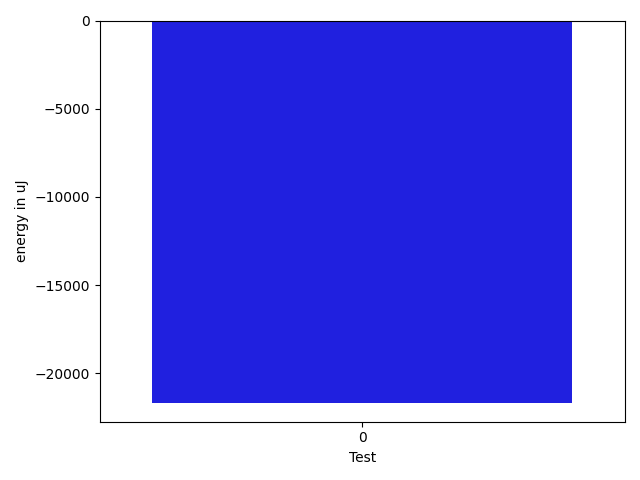

# gson 4976e4

https://github.com/google/gson/commit/4976e4

## Delta Energy per test method

| ID | EnergyV1 | EnergyV2 | DeltaEnergy | σV1 | %σV1 | σV2 | %σV2 |
| --- | --- | --- | --- | --- | --- | --- | --- |
| 0 | 572753 | 551085 | -21668 | 48680.20 | 8.50 | 43614.61 | 7.91 |

## Misc.

| ID | Test Class | Test Method |
| --- | --- | --- |
| 0 | com.google.gson.JsonObjectTest | testSize |

## Classifications

### Tests
| ID | Class | Delta | Share |
| --- | --- | --- | --- |
| G | NEUTRAL | -21668.0 | - |
| N | NEGATIVE | -21668.0 | 100.00 |
| P | POSITIVE | 0.0 | 100.00 |

### Lines
| Class | Java Class | Line |
| --- | --- | --- |
| unknown | com.google.gson.JsonObject | 141 |

## Localization of Green Regression
### Selected Tests
| Test class | test method |
| --- | --- |
| com.google.gson.JsonObjectTest | testSize |

### Suspected lines
| Class | line |
| --- | --- |
| com.google.gson.JsonObject | [141](https://github.com/google/gson/tree/4976e4/gson/src/main/java/com/google/gson/JsonObject.java#L141) |

| Time Label | Time (s) |
| --- | --- |
| Selection | 34.06431555747986 |
| Injection | 13.674885988235474 |
| Total | 194.90026688575745 |

