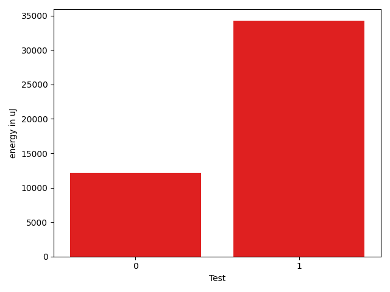

# gson 44cad0

https://github.com/google/gson/commit/44cad0

## Delta Energy per test method

| ID | EnergyV1 | EnergyV2 | DeltaEnergy | σV1 | %σV1 | σV2 | %σV2 |
| --- | --- | --- | --- | --- | --- | --- | --- |
| 0 | 1594052 | 1606258 | 12206 | 141919.51 | 8.90 | 187241.16 | 11.66 |
| 1 | 1284359 | 1318600 | 34241 | 75865.62 | 5.91 | 110987.89 | 8.42 |

## Misc.

| ID | Test Class | Test Method |
| --- | --- | --- |
| 0 | com.google.gson.functional.PrimitiveTest | testNumberDeserialization |
| 1 | com.google.gson.JavaSerializationTest | testNumberIsSerializable |

## Classifications

### Tests
| ID | Class | Delta | Share |
| --- | --- | --- | --- |
| G | NEUTRAL | 46447.0 | - |
| N | NEGATIVE | 0.0 | 100.00 |
| P | POSITIVE | 46447.0 | 50.00 |

### Lines
| Class | Java Class | Line |
| --- | --- | --- |
| unknown | com.google.gson.internal.bind.TypeAdapters | 370 |

## Localization of Green Regression
### Selected Tests
| Test class | test method |
| --- | --- |
| com.google.gson.JavaSerializationTest | testNumberIsSerializable |
| com.google.gson.functional.PrimitiveTest | testNumberDeserialization |

### Suspected lines
| Class | line |
| --- | --- |
| com.google.gson.internal.bind.TypeAdapters | [370](https://github.com/google/gson/tree/44cad0/gson/src/main/java/com/google/gson/internal/bind/TypeAdapters.java#L370) |

| Time Label | Time (s) |
| --- | --- |
| Selection | 35.36856722831726 |
| Injection | 13.783308982849121 |
| Total | 196.97581434249878 |

