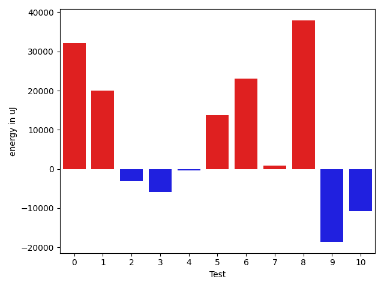
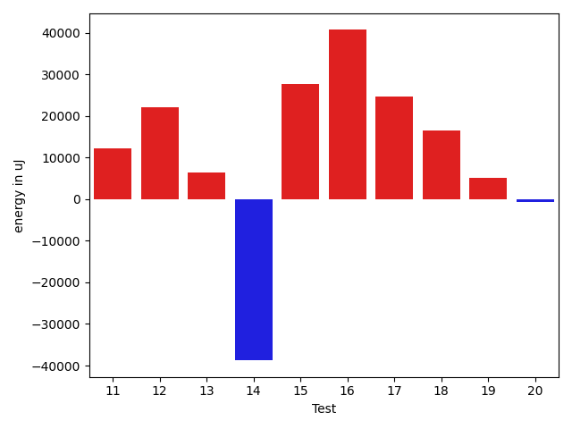

# gson 193349

https://github.com/google/gson/commit/193349

## Delta Energy per test method

| ID | EnergyV1 | EnergyV2 | DeltaEnergy | σV1 | %σV1 | σV2 | %σV2 |
| --- | --- | --- | --- | --- | --- | --- | --- |
| 0 | 256897 | 288940 | 32043 | 36549.64 | 14.23 | 22442.97 | 7.77 |
| 1 | 275390 | 295409 | 20019 | 37725.34 | 13.70 | 21209.31 | 7.18 |
| 2 | 343932 | 340759 | -3173 | 18464.00 | 5.37 | 27451.88 | 8.06 |
| 3 | 182311 | 176514 | -5797 | 24821.20 | 13.61 | 31102.17 | 17.62 |
| 4 | 176391 | 176025 | -366 | 27050.98 | 15.34 | 32008.40 | 18.18 |
| 5 | 208678 | 222351 | 13673 | 35199.25 | 16.87 | 37570.89 | 16.90 |
| 6 | 314636 | 337707 | 23071 | 32840.73 | 10.44 | 28439.55 | 8.42 |
| 7 | 300414 | 301329 | 915 | 37107.62 | 12.35 | 45737.53 | 15.18 |
| 8 | 241760 | 279724 | 37964 | 38761.22 | 16.03 | 39836.96 | 14.24 |
| 9 | 265502 | 246886 | -18616 | 29032.94 | 10.94 | 38103.64 | 15.43 |
| 10 | 270629 | 259887 | -10742 | 10164.45 | 3.76 | 49233.54 | 18.94 |
| 11 | 253051 | 265136 | 12085 | 24187.57 | 9.56 | 22501.29 | 8.49 |
| 12 | 257995 | 280150 | 22155 | 23777.22 | 9.22 | 23010.01 | 8.21 |
| 13 | 372741 | 379088 | 6347 | 28680.39 | 7.69 | 39885.51 | 10.52 |
| 14 | 262328 | 223571 | -38757 | 27161.81 | 10.35 | 32803.47 | 14.67 |
| 15 | 236388 | 264038 | 27650 | 24168.64 | 10.22 | 39432.95 | 14.93 |
| 16 | 260986 | 301635 | 40649 | 36806.71 | 14.10 | 40212.93 | 13.33 |
| 17 | 364135 | 388732 | 24597 | 22580.51 | 6.20 | 29767.09 | 7.66 |
| 18 | 505736 | 522155 | 16419 | 47655.91 | 9.42 | 58780.82 | 11.26 |
| 19 | 826536 | 831724 | 5188 | 82386.56 | 9.97 | 70723.08 | 8.50 |
| 20 | 253539 | 252745 | -794 | 20597.81 | 8.12 | 25338.39 | 10.03 |

## Misc.

| ID | Test Class | Test Method |
| --- | --- | --- |
| 0 | com.google.gson.functional.JsonAdapterAnnotationOnClassesTest | testJsonAdapterInvoked |
| 1 | com.google.gson.functional.JsonAdapterAnnotationOnClassesTest | testRegisteredDeserializerOverridesJsonAdapter |
| 2 | com.google.gson.functional.JsonAdapterAnnotationOnClassesTest | testRegisteredSerializerOverridesJsonAdapter |
| 3 | com.google.gson.functional.JsonAdapterAnnotationOnClassesTest | testNullSafeObjectFromJson |
| 4 | com.google.gson.functional.JsonAdapterAnnotationOnClassesTest | testIncorrectTypeAdapterFails |
| 5 | com.google.gson.functional.JsonAdapterAnnotationOnClassesTest | testJsonAdapterFactoryInvoked |
| 6 | com.google.gson.functional.JsonAdapterSerializerDeserializerTest | testJsonSerializerDeserializerBasedJsonAdapterOnFields |
| 7 | com.google.gson.functional.JsonAdapterSerializerDeserializerTest | testDifferentJsonAdaptersForGenericFieldsOfSameRawType |
| 8 | com.google.gson.functional.JsonAdapterSerializerDeserializerTest | testJsonSerializerDeserializerBasedJsonAdapterOnClass |
| 9 | com.google.gson.functional.JsonAdapterAnnotationOnFieldsTest | testPrimitiveFieldAnnotationTakesPrecedenceOverDefault |
| 10 | com.google.gson.functional.JsonAdapterAnnotationOnFieldsTest | testClassAnnotationAdapterFactoryTakesPrecedenceOverDefault |
| 11 | com.google.gson.functional.JsonAdapterAnnotationOnFieldsTest | testJsonAdapterWrappedInNullSafeAsRequested |
| 12 | com.google.gson.functional.JsonAdapterAnnotationOnFieldsTest | testClassAnnotationAdapterTakesPrecedenceOverDefault |
| 13 | com.google.gson.functional.JsonAdapterAnnotationOnFieldsTest | testFieldAnnotationWorksForParameterizedType |
| 14 | com.google.gson.functional.JsonAdapterAnnotationOnFieldsTest | testFieldAnnotationTakesPrecedenceOverClassAnnotation |
| 15 | com.google.gson.functional.JsonAdapterAnnotationOnFieldsTest | testNonPrimitiveFieldAnnotationTakesPrecedenceOverDefault |
| 16 | com.google.gson.functional.JsonAdapterAnnotationOnFieldsTest | testJsonAdapterInvokedOnlyForAnnotatedFields |
| 17 | com.google.gson.functional.JsonAdapterAnnotationOnFieldsTest | testFieldAnnotationTakesPrecedenceOverRegisteredTypeAdapter |
| 18 | com.google.gson.functional.RuntimeTypeAdapterFactoryFunctionalTest | testSubclassesAutomaticallySerialized |
| 19 | com.google.gson.regression.JsonAdapterNullSafeTest | testNullSafeBugDeserialize |
| 20 | com.google.gson.regression.JsonAdapterNullSafeTest | testNullSafeBugSerialize |

## Classifications

### Tests
| ID | Class | Delta | Share |
| --- | --- | --- | --- |
| G | NEUTRAL | 204530.0 | - |
| N | NEGATIVE | -78245.0 | 14.29 |
| P | POSITIVE | 282775.0 | 7.14 |
| 0 | POSITIVE | 32043.0 | 11.33 |
| 8 | POSITIVE | 37964.0 | 13.43 |
| 9 | NEGATIVE | -18616.0 | 23.79 |
| 14 | NEGATIVE | -38757.0 | 49.53 |
| 16 | POSITIVE | 40649.0 | 14.38 |

### Lines
| Class | Java Class | Line |
| --- | --- | --- |
| negative | com.google.gson.internal.bind.JsonAdapterAnnotationTypeAdapterFactory | 76 |
| positive | com.google.gson.internal.bind.JsonAdapterAnnotationTypeAdapterFactory | 76 |
| unknown | com.google.gson.internal.bind.JsonAdapterAnnotationTypeAdapterFactory | 76 |

## Localization of Green Regression
### Selected Tests
| Test class | test method |
| --- | --- |

### Suspected lines
| Class | line |
| --- | --- |
| com.google.gson.internal.bind.JsonAdapterAnnotationTypeAdapterFactory | [76](https://github.com/google/gson/tree/193349/gson/src/main/java/com/google/gson/internal/bind/JsonAdapterAnnotationTypeAdapterFactory.java#L76) |

| Time Label | Time (s) |
| --- | --- |
| Selection | 34.58714771270752 |
| Injection | 25.704668045043945 |
| Total | 226.3979206085205 |

