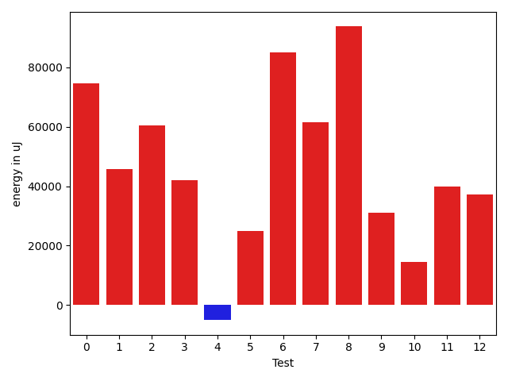
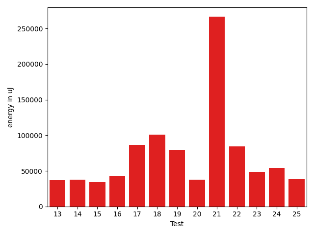
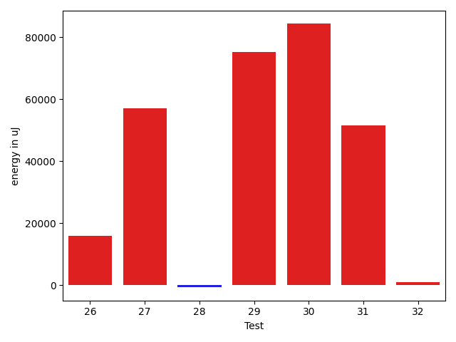

# gson c24af3

https://github.com/google/gson/commit/c24af3

## Delta Energy per test method

| ID | EnergyV1 | EnergyV2 | DeltaEnergy | σV1 | %σV1 | σV2 | %σV2 |
| --- | --- | --- | --- | --- | --- | --- | --- |
| 0 | 207519 | 282165 | 74646 | 20413.81 | 9.84 | 46047.04 | 16.32 |
| 1 | 74157 | 120056 | 45899 | 16183.33 | 21.82 | 14311.97 | 11.92 |
| 2 | 158386 | 218749 | 60363 | 24786.51 | 15.65 | 30990.69 | 14.17 |
| 3 | 80139 | 122192 | 42053 | 21335.00 | 26.62 | 12936.54 | 10.59 |
| 4 | 122741 | 117675 | -5066 | 15940.81 | 12.99 | 24845.92 | 21.11 |
| 5 | 105164 | 130188 | 25024 | 19080.96 | 18.14 | 22543.55 | 17.32 |
| 6 | 108093 | 193237 | 85144 | 14598.87 | 13.51 | 18000.31 | 9.32 |
| 7 | 94482 | 156067 | 61585 | 20118.84 | 21.29 | 19446.30 | 12.46 |
| 8 | 68359 | 162109 | 93750 | 9820.20 | 14.37 | 24330.27 | 15.01 |
| 9 | 121337 | 152344 | 31007 | 28851.64 | 23.78 | 25561.57 | 16.78 |
| 10 | 74951 | 89538 | 14587 | 22134.64 | 29.53 | 28684.43 | 32.04 |
| 11 | 89783 | 129639 | 39856 | 19833.36 | 22.09 | 17847.02 | 13.77 |
| 12 | 85693 | 122803 | 37110 | 21716.46 | 25.34 | 22029.19 | 17.94 |
| 13 | 85327 | 122192 | 36865 | 30764.12 | 36.05 | 77395.96 | 63.34 |
| 14 | 88928 | 126465 | 37537 | 27443.92 | 30.86 | 12644.16 | 10.00 |
| 15 | 84900 | 119385 | 34485 | 22104.21 | 26.04 | 13145.32 | 11.01 |
| 16 | 82642 | 126098 | 43456 | 22228.76 | 26.90 | 27000.30 | 21.41 |
| 17 | 44738 | 131408 | 86670 | 20851.27 | 46.61 | 28504.46 | 21.69 |
| 18 | 70679 | 171753 | 101074 | 18479.27 | 26.15 | 15483.49 | 9.01 |
| 19 | 122864 | 202759 | 79895 | 14498.71 | 11.80 | 21064.17 | 10.39 |
| 20 | 81359 | 118652 | 37293 | 5969.74 | 7.34 | 21891.22 | 18.45 |
| 21 | 839170 | 1105527 | 266357 | 98260.78 | 11.71 | 133534.89 | 12.08 |
| 22 | 69457 | 153564 | 84107 | 15312.81 | 22.05 | 22416.59 | 14.60 |
| 23 | 178406 | 227173 | 48767 | 6519.07 | 3.65 | 105092.51 | 46.26 |
| 24 | 79895 | 133972 | 54077 | 16829.64 | 21.06 | 26421.56 | 19.72 |
| 25 | 389220 | 427672 | 38452 | 24936.27 | 6.41 | 30951.04 | 7.24 |
| 26 | 427306 | 443236 | 15930 | 31674.04 | 7.41 | 32983.27 | 7.44 |
| 27 | 77087 | 134094 | 57007 | 12218.64 | 15.85 | 13930.90 | 10.39 |
| 28 | 356261 | 355529 | -732 | 47338.12 | 13.29 | 38163.74 | 10.73 |
| 29 | 199951 | 275207 | 75256 | 24417.13 | 12.21 | 34946.96 | 12.70 |
| 30 | 336547 | 420897 | 84350 | 36362.38 | 10.80 | 32992.33 | 7.84 |
| 31 | 462279 | 513854 | 51575 | 52334.08 | 11.32 | 32220.21 | 6.27 |
| 32 | 230224 | 231261 | 1037 | 27988.22 | 12.16 | 27881.97 | 12.06 |

## Misc.

| ID | Test Class | Test Method |
| --- | --- | --- |
| 0 | com.google.gson.functional.StreamingTypeAdaptersTest | testFromJsonTree |
| 1 | com.google.gson.functional.JsonParserTest | testBadTypeForDeserializingCustomTree |
| 2 | com.google.gson.functional.JsonParserTest | testBadFieldTypeForCustomDeserializerCustomTree |
| 3 | com.google.gson.functional.JsonParserTest | testChangingCustomTreeAndDeserializing |
| 4 | com.google.gson.functional.JsonParserTest | testBadFieldTypeForDeserializingCustomTree |
| 5 | com.google.gson.functional.JsonParserTest | testDeserializingCustomTree |
| 6 | com.google.gson.internal.bind.JsonElementReaderTest | testLenientNansAndInfinities |
| 7 | com.google.gson.internal.bind.JsonElementReaderTest | testStrictNansAndInfinities |
| 8 | com.google.gson.internal.bind.JsonElementReaderTest | testArray |
| 9 | com.google.gson.internal.bind.JsonElementReaderTest | testObject |
| 10 | com.google.gson.internal.bind.JsonElementReaderTest | testEmptyArray |
| 11 | com.google.gson.internal.bind.JsonElementReaderTest | testNestedObjects |
| 12 | com.google.gson.internal.bind.JsonElementReaderTest | testStrings |
| 13 | com.google.gson.internal.bind.JsonElementReaderTest | testNestedArrays |
| 14 | com.google.gson.internal.bind.JsonElementReaderTest | testSkipValue |
| 15 | com.google.gson.internal.bind.JsonElementReaderTest | testNumbersFromStrings |
| 16 | com.google.gson.internal.bind.JsonElementReaderTest | testBooleans |
| 17 | com.google.gson.internal.bind.JsonElementReaderTest | testNulls |
| 18 | com.google.gson.internal.bind.JsonElementReaderTest | testEarlyClose |
| 19 | com.google.gson.internal.bind.JsonElementReaderTest | testWrongType |
| 20 | com.google.gson.internal.bind.JsonElementReaderTest | testNumbers |
| 21 | com.google.gson.internal.bind.JsonElementReaderTest | testEmptyObject |
| 22 | com.google.gson.internal.bind.JsonElementReaderTest | testStringsFromNumbers |
| 23 | com.google.gson.functional.ReadersWritersTest | testReadWriteTwoObjects |
| 24 | com.google.gson.functional.ReadersWritersTest | testReadWriteTwoStrings |
| 25 | com.google.gson.functional.RuntimeTypeAdapterFactoryFunctionalTest | testSubclassesAutomaticallySerialzed |
| 26 | com.google.gson.JsonParserTest | testReadWriteTwoObjects |
| 27 | com.google.gson.functional.PrimitiveTest | testPrimitiveClassLiteral |
| 28 | com.google.gson.functional.ExclusionStrategyFunctionalTest | testExclusionStrategyWithMode |
| 29 | com.google.gson.functional.ExclusionStrategyFunctionalTest | testExclusionStrategyDeserialization |
| 30 | com.google.gson.functional.CustomDeserializerTest | testJsonTypeFieldBasedDeserialization |
| 31 | com.google.gson.functional.TypeHierarchyAdapterTest | testTypeHierarchy |
| 32 | com.google.gson.functional.MapTest | testMapNamePromotionWithJsonElementReader |

## Classifications

### Tests
| ID | Class | Delta | Share |
| --- | --- | --- | --- |
| G | NEUTRAL | 1839416.0 | - |
| N | NEGATIVE | -5798.0 | 50.00 |
| P | POSITIVE | 1845214.0 | 3.23 |
| 4 | NEGATIVE | -5066.0 | 87.37 |
| 8 | POSITIVE | 93750.0 | 5.08 |
| 18 | POSITIVE | 101074.0 | 5.48 |
| 21 | POSITIVE | 266357.0 | 14.44 |

### Lines
| Class | Java Class | Line |
| --- | --- | --- |
| negative | com.google.gson.internal.bind.JsonTreeReader | 130 |
| negative | com.google.gson.internal.bind.JsonTreeReader | 262 |
| negative | com.google.gson.internal.bind.JsonTreeReader | 134 |
| negative | com.google.gson.internal.bind.JsonTreeReader | 264 |
| negative | com.google.gson.internal.bind.JsonTreeReader | 72 |
| negative | com.google.gson.internal.bind.JsonTreeReader | 82 |
| negative | com.google.gson.internal.bind.JsonTreeReader | 150 |
| negative | com.google.gson.internal.bind.JsonTreeReader | 87 |
| negative | com.google.gson.internal.bind.JsonTreeReader | 280 |
| negative | com.google.gson.internal.bind.JsonTreeReader | 154 |
| negative | com.google.gson.internal.bind.JsonTreeReader | 155 |
| negative | com.google.gson.internal.bind.JsonTreeReader | 156 |
| negative | com.google.gson.internal.bind.JsonTreeReader | 93 |
| negative | com.google.gson.internal.bind.JsonTreeReader | 96 |
| negative | com.google.gson.internal.bind.JsonTreeReader | 291 |
| negative | com.google.gson.internal.bind.JsonTreeReader | 295 |
| negative | com.google.gson.internal.bind.JsonTreeReader | 296 |
| negative | com.google.gson.internal.bind.JsonTreeReader | 297 |
| negative | com.google.gson.internal.bind.JsonTreeReader | 170 |
| negative | com.google.gson.internal.bind.JsonTreeReader | 298 |
| negative | com.google.gson.internal.bind.JsonTreeReader | 107 |
| negative | com.google.gson.internal.bind.JsonTreeReader | 171 |
| negative | com.google.gson.internal.bind.JsonTreeReader | 173 |
| negative | com.google.gson.internal.bind.JsonTreeReader | 301 |
| negative | com.google.gson.internal.bind.JsonTreeReader | 302 |
| negative | com.google.gson.internal.bind.JsonTreeReader | 303 |
| negative | com.google.gson.internal.bind.JsonTreeReader | 304 |
| negative | com.google.gson.internal.bind.JsonTreeReader | 113 |
| negative | com.google.gson.internal.bind.JsonTreeReader | 305 |
| negative | com.google.gson.internal.bind.JsonTreeReader | 245 |
| negative | com.google.gson.internal.bind.JsonTreeReader | 310 |
| negative | com.google.gson.internal.bind.JsonTreeReader | 54 |
| negative | com.google.gson.internal.bind.JsonTreeReader | 314 |
| positive | com.google.gson.internal.bind.JsonTreeReader | 96 |
| positive | com.google.gson.internal.bind.JsonTreeReader | 130 |
| positive | com.google.gson.internal.bind.JsonTreeReader | 291 |
| positive | com.google.gson.internal.bind.JsonTreeReader | 134 |
| positive | com.google.gson.internal.bind.JsonTreeReader | 72 |
| positive | com.google.gson.internal.bind.JsonTreeReader | 73 |
| positive | com.google.gson.internal.bind.JsonTreeReader | 74 |
| positive | com.google.gson.internal.bind.JsonTreeReader | 107 |
| positive | com.google.gson.internal.bind.JsonTreeReader | 203 |
| positive | com.google.gson.internal.bind.JsonTreeReader | 204 |
| positive | com.google.gson.internal.bind.JsonTreeReader | 113 |
| positive | com.google.gson.internal.bind.JsonTreeReader | 81 |
| positive | com.google.gson.internal.bind.JsonTreeReader | 245 |
| positive | com.google.gson.internal.bind.JsonTreeReader | 150 |
| positive | com.google.gson.internal.bind.JsonTreeReader | 54 |
| positive | com.google.gson.internal.bind.JsonTreeReader | 87 |
| positive | com.google.gson.internal.bind.JsonTreeReader | 280 |
| positive | com.google.gson.internal.bind.JsonTreeReader | 154 |
| positive | com.google.gson.internal.bind.JsonTreeReader | 155 |
| positive | com.google.gson.internal.bind.JsonTreeReader | 156 |
| positive | com.google.gson.internal.bind.JsonTreeReader | 252 |
| positive | com.google.gson.internal.bind.JsonTreeReader | 60 |
| positive | com.google.gson.internal.bind.JsonTreeReader | 253 |
| positive | com.google.gson.internal.bind.JsonTreeReader | 93 |
| unknown | com.google.gson.internal.bind.JsonTreeReader | 130 |
| unknown | com.google.gson.internal.bind.JsonTreeReader | 195 |
| unknown | com.google.gson.internal.bind.JsonTreeReader | 259 |
| unknown | com.google.gson.internal.bind.JsonTreeReader | 262 |
| unknown | com.google.gson.internal.bind.JsonTreeReader | 134 |
| unknown | com.google.gson.internal.bind.JsonTreeReader | 264 |
| unknown | com.google.gson.internal.bind.JsonTreeReader | 72 |
| unknown | com.google.gson.internal.bind.JsonTreeReader | 73 |
| unknown | com.google.gson.internal.bind.JsonTreeReader | 201 |
| unknown | com.google.gson.internal.bind.JsonTreeReader | 74 |
| unknown | com.google.gson.internal.bind.JsonTreeReader | 81 |
| unknown | com.google.gson.internal.bind.JsonTreeReader | 82 |
| unknown | com.google.gson.internal.bind.JsonTreeReader | 150 |
| unknown | com.google.gson.internal.bind.JsonTreeReader | 87 |
| unknown | com.google.gson.internal.bind.JsonTreeReader | 280 |
| unknown | com.google.gson.internal.bind.JsonTreeReader | 217 |
| unknown | com.google.gson.internal.bind.JsonTreeReader | 154 |
| unknown | com.google.gson.internal.bind.JsonTreeReader | 155 |
| unknown | com.google.gson.internal.bind.JsonTreeReader | 156 |
| unknown | com.google.gson.internal.bind.JsonTreeReader | 93 |
| unknown | com.google.gson.internal.bind.JsonTreeReader | 96 |
| unknown | com.google.gson.internal.bind.JsonTreeReader | 291 |
| unknown | com.google.gson.internal.bind.JsonTreeReader | 231 |
| unknown | com.google.gson.internal.bind.JsonTreeReader | 295 |
| unknown | com.google.gson.internal.bind.JsonTreeReader | 296 |
| unknown | com.google.gson.internal.bind.JsonTreeReader | 297 |
| unknown | com.google.gson.internal.bind.JsonTreeReader | 170 |
| unknown | com.google.gson.internal.bind.JsonTreeReader | 298 |
| unknown | com.google.gson.internal.bind.JsonTreeReader | 107 |
| unknown | com.google.gson.internal.bind.JsonTreeReader | 171 |
| unknown | com.google.gson.internal.bind.JsonTreeReader | 299 |
| unknown | com.google.gson.internal.bind.JsonTreeReader | 173 |
| unknown | com.google.gson.internal.bind.JsonTreeReader | 301 |
| unknown | com.google.gson.internal.bind.JsonTreeReader | 302 |
| unknown | com.google.gson.internal.bind.JsonTreeReader | 303 |
| unknown | com.google.gson.internal.bind.JsonTreeReader | 304 |
| unknown | com.google.gson.internal.bind.JsonTreeReader | 113 |
| unknown | com.google.gson.internal.bind.JsonTreeReader | 305 |
| unknown | com.google.gson.internal.bind.JsonTreeReader | 245 |
| unknown | com.google.gson.internal.bind.JsonTreeReader | 182 |
| unknown | com.google.gson.internal.bind.JsonTreeReader | 310 |
| unknown | com.google.gson.internal.bind.JsonTreeReader | 54 |
| unknown | com.google.gson.internal.bind.JsonTreeReader | 314 |
| unknown | com.google.gson.internal.bind.JsonTreeReader | 252 |
| unknown | com.google.gson.internal.bind.JsonTreeReader | 60 |
| unknown | com.google.gson.internal.bind.JsonTreeReader | 253 |
| unknown | com.google.gson.internal.bind.JsonTreeReader | 191 |

## Localization of Green Regression
### Selected Tests
| Test class | test method |
| --- | --- |

### Suspected lines
| Class | line |
| --- | --- |
| com.google.gson.internal.bind.JsonTreeReader | [107](https://github.com/google/gson/tree/c24af3/gson/src/main/java/com/google/gson/internal/bind/JsonTreeReader.java#L107) |
| com.google.gson.internal.bind.JsonTreeReader | [130](https://github.com/google/gson/tree/c24af3/gson/src/main/java/com/google/gson/internal/bind/JsonTreeReader.java#L107#L130) |
| com.google.gson.internal.bind.JsonTreeReader | [87](https://github.com/google/gson/tree/c24af3/gson/src/main/java/com/google/gson/internal/bind/JsonTreeReader.java#L107#L130#L87) |
| com.google.gson.internal.bind.JsonTreeReader | [156](https://github.com/google/gson/tree/c24af3/gson/src/main/java/com/google/gson/internal/bind/JsonTreeReader.java#L107#L130#L87#L156) |
| com.google.gson.internal.bind.JsonTreeReader | [113](https://github.com/google/gson/tree/c24af3/gson/src/main/java/com/google/gson/internal/bind/JsonTreeReader.java#L107#L130#L87#L156#L113) |
| com.google.gson.internal.bind.JsonTreeReader | [93](https://github.com/google/gson/tree/c24af3/gson/src/main/java/com/google/gson/internal/bind/JsonTreeReader.java#L107#L130#L87#L156#L113#L93) |
| com.google.gson.internal.bind.JsonTreeReader | [96](https://github.com/google/gson/tree/c24af3/gson/src/main/java/com/google/gson/internal/bind/JsonTreeReader.java#L107#L130#L87#L156#L113#L93#L96) |
| com.google.gson.internal.bind.JsonTreeReader | [150](https://github.com/google/gson/tree/c24af3/gson/src/main/java/com/google/gson/internal/bind/JsonTreeReader.java#L107#L130#L87#L156#L113#L93#L96#L150) |
| com.google.gson.internal.bind.JsonTreeReader | [280](https://github.com/google/gson/tree/c24af3/gson/src/main/java/com/google/gson/internal/bind/JsonTreeReader.java#L107#L130#L87#L156#L113#L93#L96#L150#L280) |
| com.google.gson.internal.bind.JsonTreeReader | [291](https://github.com/google/gson/tree/c24af3/gson/src/main/java/com/google/gson/internal/bind/JsonTreeReader.java#L107#L130#L87#L156#L113#L93#L96#L150#L280#L291) |
| com.google.gson.internal.bind.JsonTreeReader | [154](https://github.com/google/gson/tree/c24af3/gson/src/main/java/com/google/gson/internal/bind/JsonTreeReader.java#L107#L130#L87#L156#L113#L93#L96#L150#L280#L291#L154) |
| com.google.gson.internal.bind.JsonTreeReader | [155](https://github.com/google/gson/tree/c24af3/gson/src/main/java/com/google/gson/internal/bind/JsonTreeReader.java#L107#L130#L87#L156#L113#L93#L96#L150#L280#L291#L154#L155) |
| com.google.gson.internal.bind.JsonTreeReader | [72](https://github.com/google/gson/tree/c24af3/gson/src/main/java/com/google/gson/internal/bind/JsonTreeReader.java#L107#L130#L87#L156#L113#L93#L96#L150#L280#L291#L154#L155#L72) |
| com.google.gson.internal.bind.JsonTreeReader | [134](https://github.com/google/gson/tree/c24af3/gson/src/main/java/com/google/gson/internal/bind/JsonTreeReader.java#L107#L130#L87#L156#L113#L93#L96#L150#L280#L291#L154#L155#L72#L134) |
| com.google.gson.internal.bind.JsonTreeReader | [54](https://github.com/google/gson/tree/c24af3/gson/src/main/java/com/google/gson/internal/bind/JsonTreeReader.java#L107#L130#L87#L156#L113#L93#L96#L150#L280#L291#L154#L155#L72#L134#L54) |
| com.google.gson.internal.bind.JsonTreeReader | [170](https://github.com/google/gson/tree/c24af3/gson/src/main/java/com/google/gson/internal/bind/JsonTreeReader.java#L107#L130#L87#L156#L113#L93#L96#L150#L280#L291#L154#L155#L72#L134#L54#L170) |
| com.google.gson.internal.bind.JsonTreeReader | [171](https://github.com/google/gson/tree/c24af3/gson/src/main/java/com/google/gson/internal/bind/JsonTreeReader.java#L107#L130#L87#L156#L113#L93#L96#L150#L280#L291#L154#L155#L72#L134#L54#L170#L171) |
| com.google.gson.internal.bind.JsonTreeReader | [73](https://github.com/google/gson/tree/c24af3/gson/src/main/java/com/google/gson/internal/bind/JsonTreeReader.java#L107#L130#L87#L156#L113#L93#L96#L150#L280#L291#L154#L155#L72#L134#L54#L170#L171#L73) |
| com.google.gson.internal.bind.JsonTreeReader | [74](https://github.com/google/gson/tree/c24af3/gson/src/main/java/com/google/gson/internal/bind/JsonTreeReader.java#L107#L130#L87#L156#L113#L93#L96#L150#L280#L291#L154#L155#L72#L134#L54#L170#L171#L73#L74) |
| com.google.gson.internal.bind.JsonTreeReader | [82](https://github.com/google/gson/tree/c24af3/gson/src/main/java/com/google/gson/internal/bind/JsonTreeReader.java#L107#L130#L87#L156#L113#L93#L96#L150#L280#L291#L154#L155#L72#L134#L54#L170#L171#L73#L74#L82) |
| com.google.gson.internal.bind.JsonTreeReader | [81](https://github.com/google/gson/tree/c24af3/gson/src/main/java/com/google/gson/internal/bind/JsonTreeReader.java#L107#L130#L87#L156#L113#L93#L96#L150#L280#L291#L154#L155#L72#L134#L54#L170#L171#L73#L74#L82#L81) |
| com.google.gson.internal.bind.JsonTreeReader | [173](https://github.com/google/gson/tree/c24af3/gson/src/main/java/com/google/gson/internal/bind/JsonTreeReader.java#L107#L130#L87#L156#L113#L93#L96#L150#L280#L291#L154#L155#L72#L134#L54#L170#L171#L73#L74#L82#L81#L173) |
| com.google.gson.internal.bind.JsonTreeReader | [182](https://github.com/google/gson/tree/c24af3/gson/src/main/java/com/google/gson/internal/bind/JsonTreeReader.java#L107#L130#L87#L156#L113#L93#L96#L150#L280#L291#L154#L155#L72#L134#L54#L170#L171#L73#L74#L82#L81#L173#L182) |
| com.google.gson.internal.bind.JsonTreeReader | [245](https://github.com/google/gson/tree/c24af3/gson/src/main/java/com/google/gson/internal/bind/JsonTreeReader.java#L107#L130#L87#L156#L113#L93#L96#L150#L280#L291#L154#L155#L72#L134#L54#L170#L171#L73#L74#L82#L81#L173#L182#L245) |
| com.google.gson.internal.bind.JsonTreeReader | [60](https://github.com/google/gson/tree/c24af3/gson/src/main/java/com/google/gson/internal/bind/JsonTreeReader.java#L107#L130#L87#L156#L113#L93#L96#L150#L280#L291#L154#L155#L72#L134#L54#L170#L171#L73#L74#L82#L81#L173#L182#L245#L60) |
| com.google.gson.internal.bind.JsonTreeReader | [295](https://github.com/google/gson/tree/c24af3/gson/src/main/java/com/google/gson/internal/bind/JsonTreeReader.java#L107#L130#L87#L156#L113#L93#L96#L150#L280#L291#L154#L155#L72#L134#L54#L170#L171#L73#L74#L82#L81#L173#L182#L245#L60#L295) |
| com.google.gson.internal.bind.JsonTreeReader | [296](https://github.com/google/gson/tree/c24af3/gson/src/main/java/com/google/gson/internal/bind/JsonTreeReader.java#L107#L130#L87#L156#L113#L93#L96#L150#L280#L291#L154#L155#L72#L134#L54#L170#L171#L73#L74#L82#L81#L173#L182#L245#L60#L295#L296) |
| com.google.gson.internal.bind.JsonTreeReader | [297](https://github.com/google/gson/tree/c24af3/gson/src/main/java/com/google/gson/internal/bind/JsonTreeReader.java#L107#L130#L87#L156#L113#L93#L96#L150#L280#L291#L154#L155#L72#L134#L54#L170#L171#L73#L74#L82#L81#L173#L182#L245#L60#L295#L296#L297) |
| com.google.gson.internal.bind.JsonTreeReader | [310](https://github.com/google/gson/tree/c24af3/gson/src/main/java/com/google/gson/internal/bind/JsonTreeReader.java#L107#L130#L87#L156#L113#L93#L96#L150#L280#L291#L154#L155#L72#L134#L54#L170#L171#L73#L74#L82#L81#L173#L182#L245#L60#L295#L296#L297#L310) |
| com.google.gson.internal.bind.JsonTreeReader | [298](https://github.com/google/gson/tree/c24af3/gson/src/main/java/com/google/gson/internal/bind/JsonTreeReader.java#L107#L130#L87#L156#L113#L93#L96#L150#L280#L291#L154#L155#L72#L134#L54#L170#L171#L73#L74#L82#L81#L173#L182#L245#L60#L295#L296#L297#L310#L298) |
| com.google.gson.internal.bind.JsonTreeReader | [264](https://github.com/google/gson/tree/c24af3/gson/src/main/java/com/google/gson/internal/bind/JsonTreeReader.java#L107#L130#L87#L156#L113#L93#L96#L150#L280#L291#L154#L155#L72#L134#L54#L170#L171#L73#L74#L82#L81#L173#L182#L245#L60#L295#L296#L297#L310#L298#L264) |
| com.google.gson.internal.bind.JsonTreeReader | [301](https://github.com/google/gson/tree/c24af3/gson/src/main/java/com/google/gson/internal/bind/JsonTreeReader.java#L107#L130#L87#L156#L113#L93#L96#L150#L280#L291#L154#L155#L72#L134#L54#L170#L171#L73#L74#L82#L81#L173#L182#L245#L60#L295#L296#L297#L310#L298#L264#L301) |
| com.google.gson.internal.bind.JsonTreeReader | [262](https://github.com/google/gson/tree/c24af3/gson/src/main/java/com/google/gson/internal/bind/JsonTreeReader.java#L107#L130#L87#L156#L113#L93#L96#L150#L280#L291#L154#L155#L72#L134#L54#L170#L171#L73#L74#L82#L81#L173#L182#L245#L60#L295#L296#L297#L310#L298#L264#L301#L262) |
| com.google.gson.internal.bind.JsonTreeReader | [231](https://github.com/google/gson/tree/c24af3/gson/src/main/java/com/google/gson/internal/bind/JsonTreeReader.java#L107#L130#L87#L156#L113#L93#L96#L150#L280#L291#L154#L155#L72#L134#L54#L170#L171#L73#L74#L82#L81#L173#L182#L245#L60#L295#L296#L297#L310#L298#L264#L301#L262#L231) |
| com.google.gson.internal.bind.JsonTreeReader | [302](https://github.com/google/gson/tree/c24af3/gson/src/main/java/com/google/gson/internal/bind/JsonTreeReader.java#L107#L130#L87#L156#L113#L93#L96#L150#L280#L291#L154#L155#L72#L134#L54#L170#L171#L73#L74#L82#L81#L173#L182#L245#L60#L295#L296#L297#L310#L298#L264#L301#L262#L231#L302) |
| com.google.gson.internal.bind.JsonTreeReader | [303](https://github.com/google/gson/tree/c24af3/gson/src/main/java/com/google/gson/internal/bind/JsonTreeReader.java#L107#L130#L87#L156#L113#L93#L96#L150#L280#L291#L154#L155#L72#L134#L54#L170#L171#L73#L74#L82#L81#L173#L182#L245#L60#L295#L296#L297#L310#L298#L264#L301#L262#L231#L302#L303) |
| com.google.gson.internal.bind.JsonTreeReader | [304](https://github.com/google/gson/tree/c24af3/gson/src/main/java/com/google/gson/internal/bind/JsonTreeReader.java#L107#L130#L87#L156#L113#L93#L96#L150#L280#L291#L154#L155#L72#L134#L54#L170#L171#L73#L74#L82#L81#L173#L182#L245#L60#L295#L296#L297#L310#L298#L264#L301#L262#L231#L302#L303#L304) |
| com.google.gson.internal.bind.JsonTreeReader | [299](https://github.com/google/gson/tree/c24af3/gson/src/main/java/com/google/gson/internal/bind/JsonTreeReader.java#L107#L130#L87#L156#L113#L93#L96#L150#L280#L291#L154#L155#L72#L134#L54#L170#L171#L73#L74#L82#L81#L173#L182#L245#L60#L295#L296#L297#L310#L298#L264#L301#L262#L231#L302#L303#L304#L299) |
| com.google.gson.internal.bind.JsonTreeReader | [305](https://github.com/google/gson/tree/c24af3/gson/src/main/java/com/google/gson/internal/bind/JsonTreeReader.java#L107#L130#L87#L156#L113#L93#L96#L150#L280#L291#L154#L155#L72#L134#L54#L170#L171#L73#L74#L82#L81#L173#L182#L245#L60#L295#L296#L297#L310#L298#L264#L301#L262#L231#L302#L303#L304#L299#L305) |
| com.google.gson.internal.bind.JsonTreeReader | [217](https://github.com/google/gson/tree/c24af3/gson/src/main/java/com/google/gson/internal/bind/JsonTreeReader.java#L107#L130#L87#L156#L113#L93#L96#L150#L280#L291#L154#L155#L72#L134#L54#L170#L171#L73#L74#L82#L81#L173#L182#L245#L60#L295#L296#L297#L310#L298#L264#L301#L262#L231#L302#L303#L304#L299#L305#L217) |
| com.google.gson.internal.bind.JsonTreeReader | [195](https://github.com/google/gson/tree/c24af3/gson/src/main/java/com/google/gson/internal/bind/JsonTreeReader.java#L107#L130#L87#L156#L113#L93#L96#L150#L280#L291#L154#L155#L72#L134#L54#L170#L171#L73#L74#L82#L81#L173#L182#L245#L60#L295#L296#L297#L310#L298#L264#L301#L262#L231#L302#L303#L304#L299#L305#L217#L195) |
| com.google.gson.internal.bind.JsonTreeReader | [314](https://github.com/google/gson/tree/c24af3/gson/src/main/java/com/google/gson/internal/bind/JsonTreeReader.java#L107#L130#L87#L156#L113#L93#L96#L150#L280#L291#L154#L155#L72#L134#L54#L170#L171#L73#L74#L82#L81#L173#L182#L245#L60#L295#L296#L297#L310#L298#L264#L301#L262#L231#L302#L303#L304#L299#L305#L217#L195#L314) |
| com.google.gson.internal.bind.JsonTreeReader | [191](https://github.com/google/gson/tree/c24af3/gson/src/main/java/com/google/gson/internal/bind/JsonTreeReader.java#L107#L130#L87#L156#L113#L93#L96#L150#L280#L291#L154#L155#L72#L134#L54#L170#L171#L73#L74#L82#L81#L173#L182#L245#L60#L295#L296#L297#L310#L298#L264#L301#L262#L231#L302#L303#L304#L299#L305#L217#L195#L314#L191) |
| com.google.gson.internal.bind.JsonTreeReader | [252](https://github.com/google/gson/tree/c24af3/gson/src/main/java/com/google/gson/internal/bind/JsonTreeReader.java#L107#L130#L87#L156#L113#L93#L96#L150#L280#L291#L154#L155#L72#L134#L54#L170#L171#L73#L74#L82#L81#L173#L182#L245#L60#L295#L296#L297#L310#L298#L264#L301#L262#L231#L302#L303#L304#L299#L305#L217#L195#L314#L191#L252) |
| com.google.gson.internal.bind.JsonTreeReader | [253](https://github.com/google/gson/tree/c24af3/gson/src/main/java/com/google/gson/internal/bind/JsonTreeReader.java#L107#L130#L87#L156#L113#L93#L96#L150#L280#L291#L154#L155#L72#L134#L54#L170#L171#L73#L74#L82#L81#L173#L182#L245#L60#L295#L296#L297#L310#L298#L264#L301#L262#L231#L302#L303#L304#L299#L305#L217#L195#L314#L191#L252#L253) |
| com.google.gson.internal.bind.JsonTreeReader | [201](https://github.com/google/gson/tree/c24af3/gson/src/main/java/com/google/gson/internal/bind/JsonTreeReader.java#L107#L130#L87#L156#L113#L93#L96#L150#L280#L291#L154#L155#L72#L134#L54#L170#L171#L73#L74#L82#L81#L173#L182#L245#L60#L295#L296#L297#L310#L298#L264#L301#L262#L231#L302#L303#L304#L299#L305#L217#L195#L314#L191#L252#L253#L201) |
| com.google.gson.internal.bind.JsonTreeReader | [259](https://github.com/google/gson/tree/c24af3/gson/src/main/java/com/google/gson/internal/bind/JsonTreeReader.java#L107#L130#L87#L156#L113#L93#L96#L150#L280#L291#L154#L155#L72#L134#L54#L170#L171#L73#L74#L82#L81#L173#L182#L245#L60#L295#L296#L297#L310#L298#L264#L301#L262#L231#L302#L303#L304#L299#L305#L217#L195#L314#L191#L252#L253#L201#L259) |
| com.google.gson.internal.bind.JsonTreeReader | [203](https://github.com/google/gson/tree/c24af3/gson/src/main/java/com/google/gson/internal/bind/JsonTreeReader.java#L107#L130#L87#L156#L113#L93#L96#L150#L280#L291#L154#L155#L72#L134#L54#L170#L171#L73#L74#L82#L81#L173#L182#L245#L60#L295#L296#L297#L310#L298#L264#L301#L262#L231#L302#L303#L304#L299#L305#L217#L195#L314#L191#L252#L253#L201#L259#L203) |
| com.google.gson.internal.bind.JsonTreeReader | [204](https://github.com/google/gson/tree/c24af3/gson/src/main/java/com/google/gson/internal/bind/JsonTreeReader.java#L107#L130#L87#L156#L113#L93#L96#L150#L280#L291#L154#L155#L72#L134#L54#L170#L171#L73#L74#L82#L81#L173#L182#L245#L60#L295#L296#L297#L310#L298#L264#L301#L262#L231#L302#L303#L304#L299#L305#L217#L195#L314#L191#L252#L253#L201#L259#L203#L204) |

| Time Label | Time (s) |
| --- | --- |
| Selection | 34.22938776016235 |
| Injection | 30.191855907440186 |
| Total | 226.22637128829956 |

