# gson 2df655

https://github.com/google/gson/commit/2df655

## Delta Energy per test method

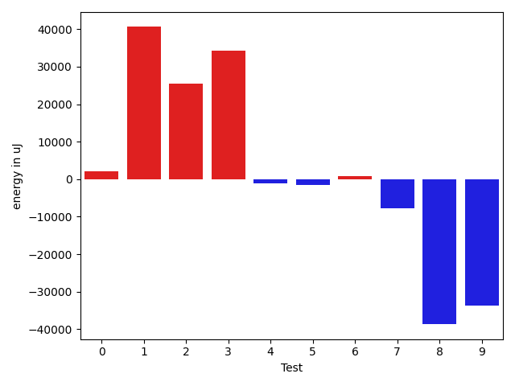

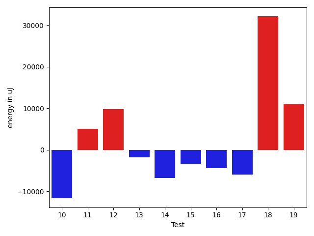

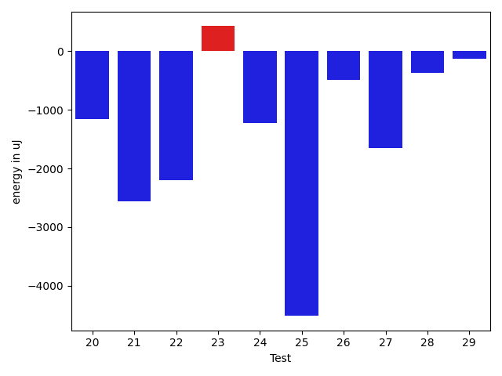

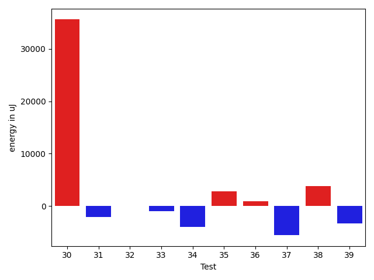

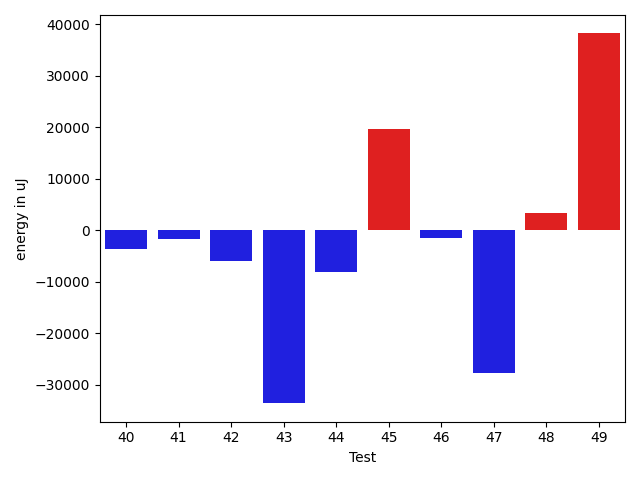

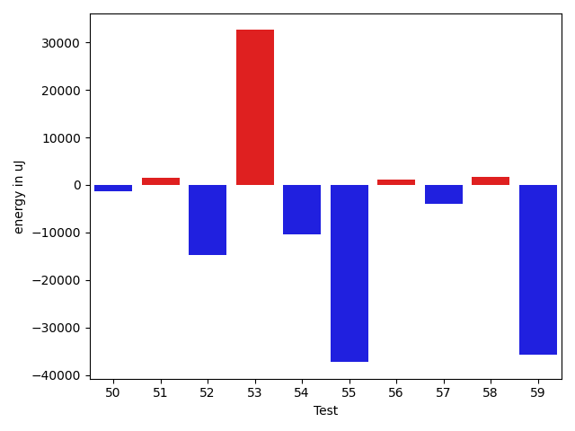

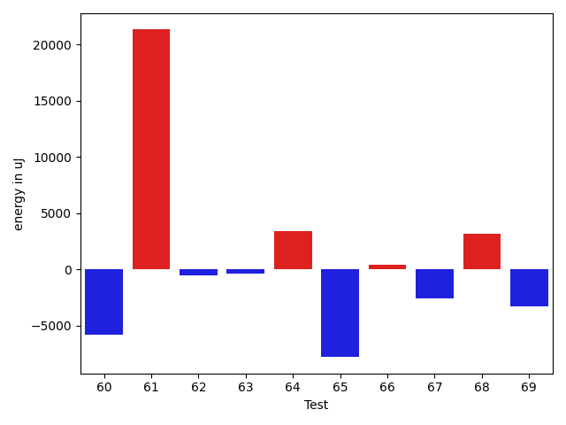

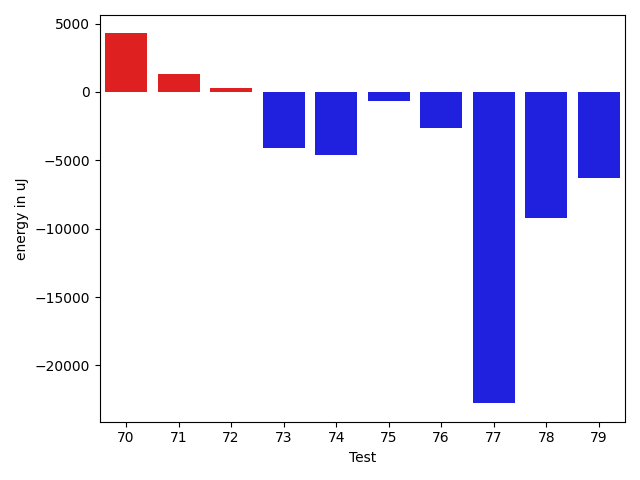

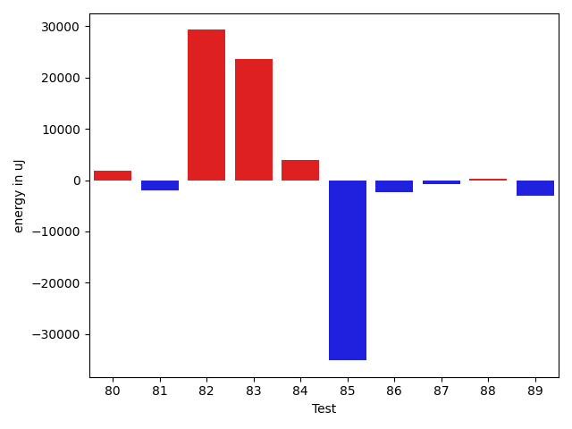

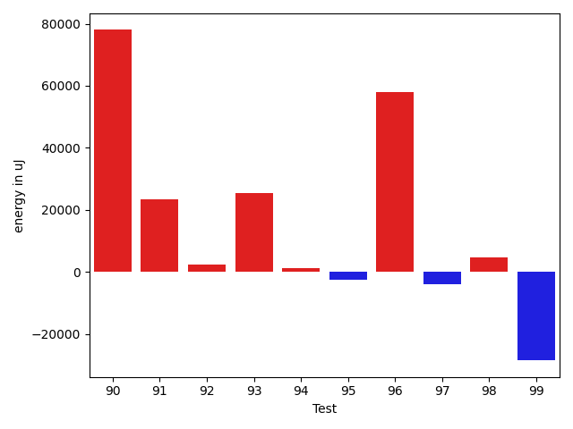

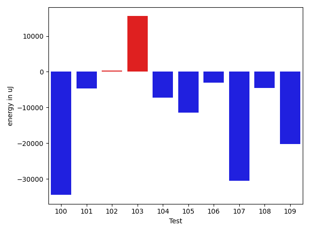

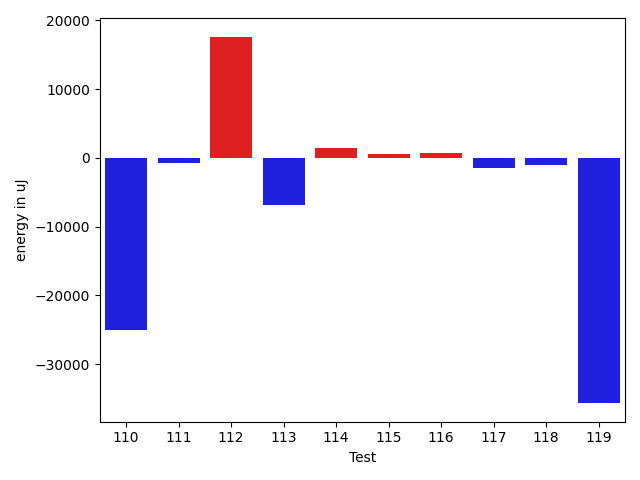

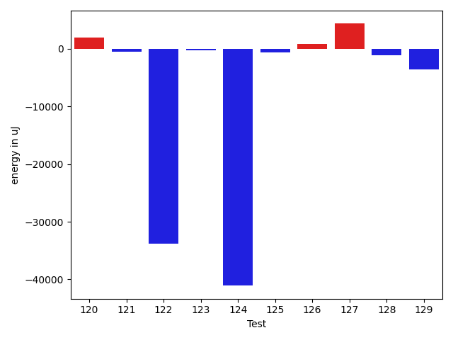

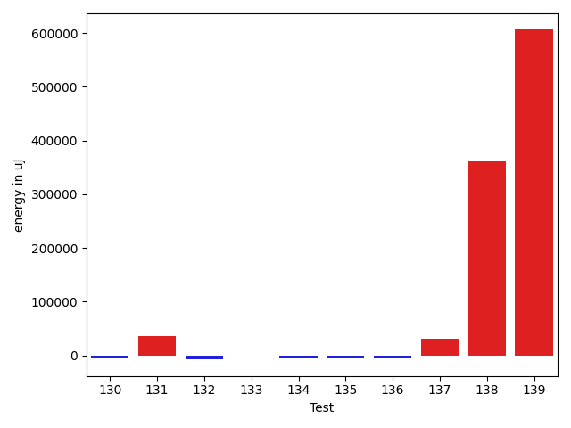

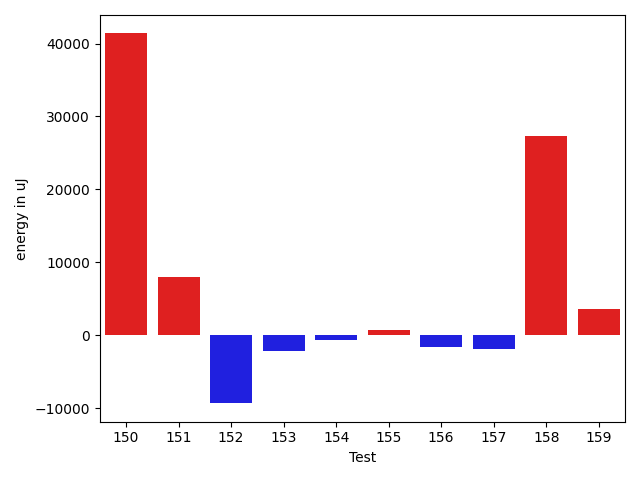

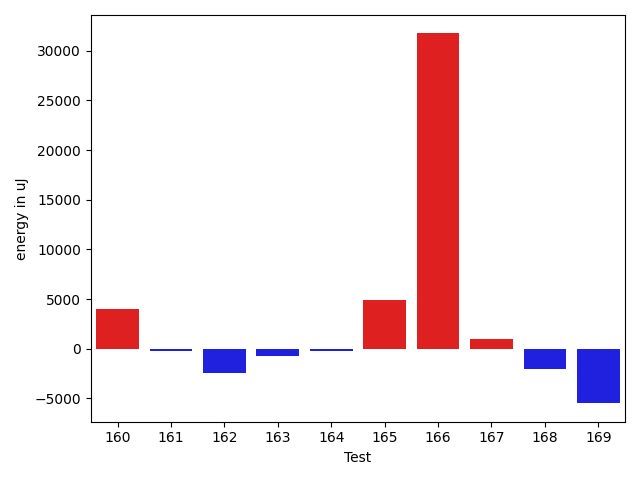

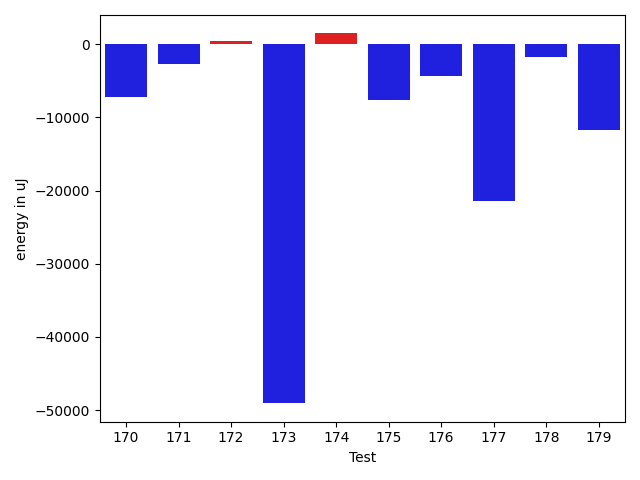

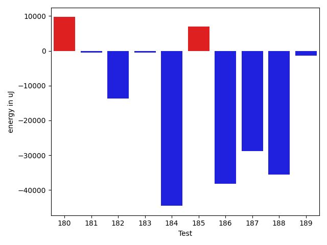

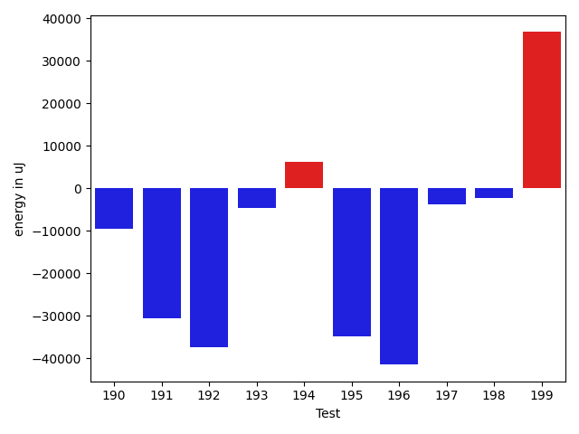

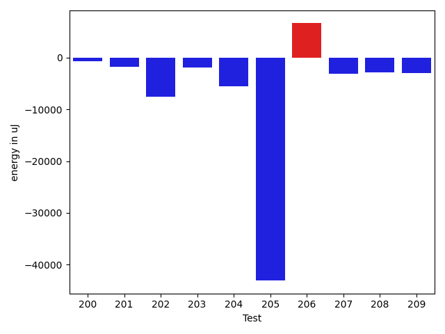

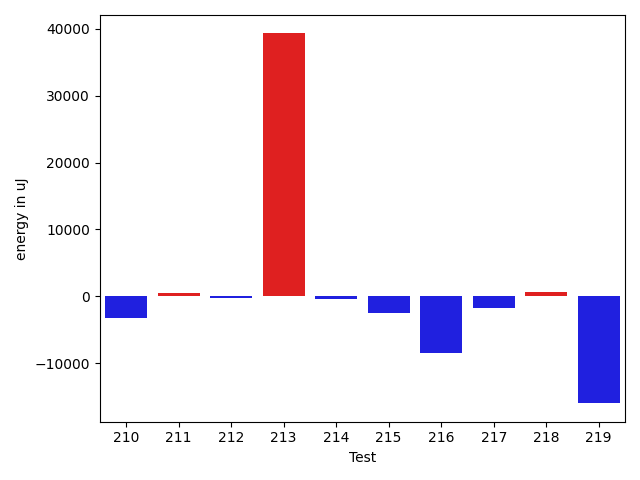

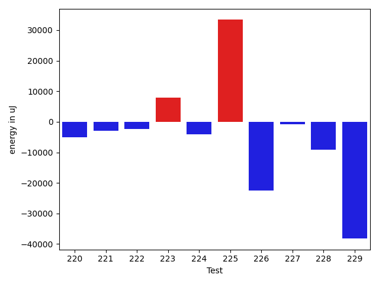

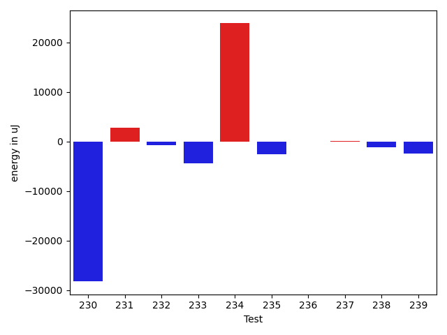

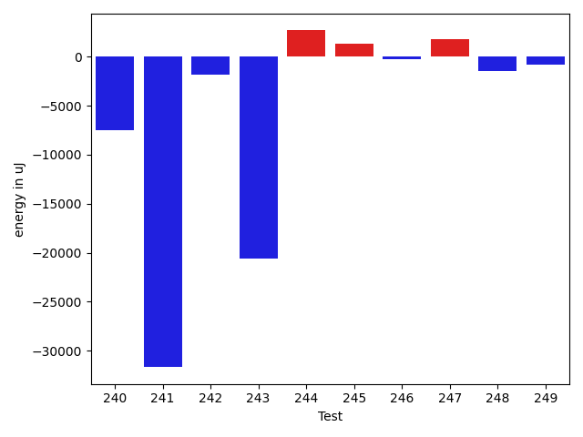

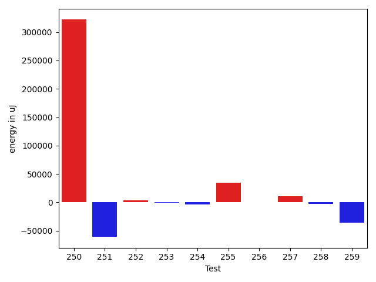

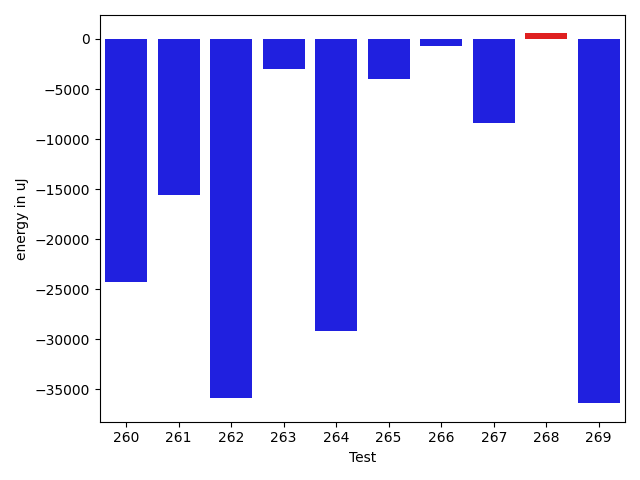

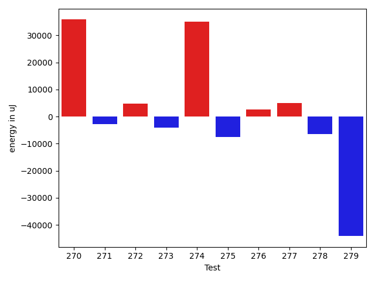

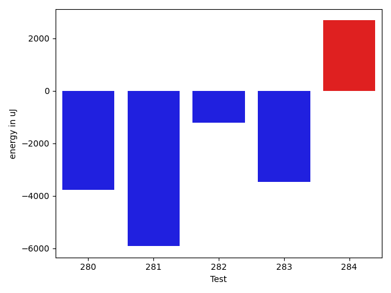

| ID | EnergyV1 | EnergyV2 | DeltaEnergy | σV1 | %σV1 | σV2 | %σV2 |
| --- | --- | --- | --- | --- | --- | --- | --- |
| 0 | 85510 | 87646 | 2136 | 54948.94 | 64.26 | 21008.03 | 23.97 |
| 1 | 40894 | 81482 | 40588 | 18767.97 | 45.89 | 20075.75 | 24.64 |
| 2 | 45776 | 71167 | 25391 | 20828.06 | 45.50 | 16924.93 | 23.78 |
| 3 | 39856 | 74035 | 34179 | 19456.17 | 48.82 | 16680.77 | 22.53 |
| 4 | 45960 | 44739 | -1221 | 15323.05 | 33.34 | 14241.19 | 31.83 |
| 5 | 40771 | 39124 | -1647 | 3219.65 | 7.90 | 1041.00 | 2.66 |
| 6 | 43762 | 44494 | 732 | 20065.80 | 45.85 | 32009.81 | 71.94 |
| 7 | 119018 | 111267 | -7751 | 16982.91 | 14.27 | 15788.76 | 14.19 |
| 8 | 78064 | 39368 | -38696 | 15586.75 | 19.97 | 16468.45 | 41.83 |
| 9 | 74829 | 41077 | -33752 | 17986.43 | 24.04 | 20002.10 | 48.69 |
| 10 | 134949 | 123291 | -11658 | 67475.93 | 50.00 | 114269.11 | 92.68 |
| 11 | 127136 | 132202 | 5066 | 23515.41 | 18.50 | 20916.37 | 15.82 |
| 12 | 71228 | 80993 | 9765 | 19069.58 | 26.77 | 19563.26 | 24.15 |
| 13 | 44921 | 43091 | -1830 | 2623.35 | 5.84 | 1937.47 | 4.50 |
| 14 | 82580 | 75806 | -6774 | 13466.55 | 16.31 | 24281.67 | 32.03 |
| 15 | 46753 | 43396 | -3357 | 19600.20 | 41.92 | 15584.68 | 35.91 |
| 16 | 46874 | 42481 | -4393 | 20425.74 | 43.58 | 3376.72 | 7.95 |
| 17 | 129455 | 123474 | -5981 | 18164.66 | 14.03 | 20587.82 | 16.67 |
| 18 | 46204 | 78308 | 32104 | 18018.57 | 39.00 | 22942.23 | 29.30 |
| 19 | 593626 | 604674 | 11048 | 31030.61 | 5.23 | 26880.57 | 4.45 |
| 20 | 86182 | 85021 | -1161 | 21949.76 | 25.47 | 21426.96 | 25.20 |
| 21 | 47851 | 45288 | -2563 | 20544.26 | 42.93 | 18190.32 | 40.17 |
| 22 | 41138 | 38940 | -2198 | 2607.51 | 6.34 | 13462.35 | 34.57 |
| 23 | 43091 | 43518 | 427 | 2237.01 | 5.19 | 19669.74 | 45.20 |
| 24 | 46814 | 45593 | -1221 | 257326.35 | 549.68 | 13798.30 | 30.26 |
| 25 | 49316 | 44800 | -4516 | 21545.45 | 43.69 | 21847.69 | 48.77 |
| 26 | 86548 | 86060 | -488 | 18326.72 | 21.18 | 19631.14 | 22.81 |
| 27 | 45349 | 43701 | -1648 | 2819.50 | 6.22 | 3938.76 | 9.01 |
| 28 | 47668 | 47302 | -366 | 20989.11 | 44.03 | 20690.62 | 43.74 |
| 29 | 44250 | 44128 | -122 | 1771.81 | 4.00 | 19445.37 | 44.07 |
| 30 | 46996 | 82580 | 35584 | 32263.12 | 68.65 | 51251.89 | 62.06 |
| 31 | 77454 | 75378 | -2076 | 18782.03 | 24.25 | 21713.05 | 28.81 |
| 32 | 37659 | 37720 | 61 | 11404.51 | 30.28 | 1340.89 | 3.55 |
| 33 | 43579 | 42602 | -977 | 11299.67 | 25.93 | 18966.90 | 44.52 |
| 34 | 41443 | 37475 | -3968 | 14008.22 | 33.80 | 1414.34 | 3.77 |
| 35 | 45227 | 48035 | 2808 | 22914.37 | 50.67 | 21733.55 | 45.25 |
| 36 | 44128 | 45044 | 916 | 2015.98 | 4.57 | 3491.18 | 7.75 |
| 37 | 44616 | 39062 | -5554 | 20103.03 | 45.06 | 17883.24 | 45.78 |
| 38 | 42664 | 46447 | 3783 | 1876.08 | 4.40 | 21633.37 | 46.58 |
| 39 | 44861 | 41504 | -3357 | 3065.21 | 6.83 | 3263.52 | 7.86 |
| 40 | 45227 | 41504 | -3723 | 18612.25 | 41.15 | 12554.77 | 30.25 |
| 41 | 40650 | 38941 | -1709 | 18204.13 | 44.78 | 15630.64 | 40.14 |
| 42 | 126952 | 120972 | -5980 | 20948.46 | 16.50 | 4650.19 | 3.84 |
| 43 | 222350 | 188781 | -33569 | 20791.23 | 9.35 | 19721.66 | 10.45 |
| 44 | 87097 | 79040 | -8057 | 20765.81 | 23.84 | 16232.04 | 20.54 |
| 45 | 171752 | 191406 | 19654 | 28306.66 | 16.48 | 43249.96 | 22.60 |
| 46 | 39917 | 38452 | -1465 | 19445.97 | 48.72 | 10816.23 | 28.13 |
| 47 | 106262 | 78491 | -27771 | 17533.98 | 16.50 | 13774.59 | 17.55 |
| 48 | 118835 | 122192 | 3357 | 16504.84 | 13.89 | 13546.11 | 11.09 |
| 49 | 115478 | 153686 | 38208 | 27170.29 | 23.53 | 23122.83 | 15.05 |
| 50 | 78430 | 77148 | -1282 | 29945.45 | 38.18 | 11661.94 | 15.12 |
| 51 | 41259 | 42847 | 1588 | 2362.87 | 5.73 | 23163.61 | 54.06 |
| 52 | 90088 | 75317 | -14771 | 19017.88 | 21.11 | 19563.45 | 25.97 |
| 53 | 38818 | 71411 | 32593 | 17143.02 | 44.16 | 17309.32 | 24.24 |
| 54 | 94238 | 83802 | -10436 | 21635.96 | 22.96 | 13133.62 | 15.67 |
| 55 | 85937 | 48645 | -37292 | 23151.97 | 26.94 | 19747.56 | 40.60 |
| 56 | 174194 | 175292 | 1098 | 17885.20 | 10.27 | 20005.38 | 11.41 |
| 57 | 181457 | 177551 | -3906 | 45664.50 | 25.17 | 24273.36 | 13.67 |
| 58 | 244140 | 245849 | 1709 | 26678.96 | 10.93 | 26536.22 | 10.79 |
| 59 | 115295 | 79468 | -35827 | 18994.87 | 16.48 | 18793.05 | 23.65 |
| 60 | 294371 | 288573 | -5798 | 32752.55 | 11.13 | 24036.18 | 8.33 |
| 61 | 91553 | 112854 | 21301 | 24254.28 | 26.49 | 18173.92 | 16.10 |
| 62 | 114258 | 113708 | -550 | 22721.35 | 19.89 | 16644.68 | 14.64 |
| 63 | 136780 | 136413 | -367 | 22034.35 | 16.11 | 27218.34 | 19.95 |
| 64 | 162842 | 166259 | 3417 | 19495.25 | 11.97 | 17812.45 | 10.71 |
| 65 | 132018 | 124206 | -7812 | 26126.45 | 19.79 | 18950.12 | 15.26 |
| 66 | 173584 | 174011 | 427 | 13246.85 | 7.63 | 48565.40 | 27.91 |
| 67 | 126159 | 123535 | -2624 | 21942.45 | 17.39 | 21686.67 | 17.56 |
| 68 | 127686 | 130859 | 3173 | 20665.61 | 16.18 | 35463.79 | 27.10 |
| 69 | 44678 | 41382 | -3296 | 2747.38 | 6.15 | 2433.80 | 5.88 |
| 70 | 127380 | 131652 | 4272 | 38639.96 | 30.33 | 14714.51 | 11.18 |
| 71 | 173523 | 174865 | 1342 | 23165.22 | 13.35 | 15029.95 | 8.60 |
| 72 | 46387 | 46692 | 305 | 18968.42 | 40.89 | 23474.58 | 50.28 |
| 73 | 90760 | 86670 | -4090 | 28415.86 | 31.31 | 13458.94 | 15.53 |
| 74 | 52856 | 48217 | -4639 | 20694.49 | 39.15 | 61184.89 | 126.89 |
| 75 | 88440 | 87768 | -672 | 14685.15 | 16.60 | 4499.82 | 5.13 |
| 76 | 47241 | 44616 | -2625 | 21314.15 | 45.12 | 18510.52 | 41.49 |
| 77 | 1419491 | 1396725 | -22766 | 126708.87 | 8.93 | 90680.08 | 6.49 |
| 78 | 82336 | 73120 | -9216 | 27090.33 | 32.90 | 17916.28 | 24.50 |
| 79 | 91736 | 85449 | -6287 | 3469.42 | 3.78 | 11084.90 | 12.97 |
| 80 | 43823 | 45593 | 1770 | 13934.15 | 31.80 | 21976.57 | 48.20 |
| 81 | 41809 | 39856 | -1953 | 17571.89 | 42.03 | 14103.73 | 35.39 |
| 82 | 478392 | 507628 | 29236 | 42574.97 | 8.90 | 33139.18 | 6.53 |
| 83 | 118225 | 141845 | 23620 | 18692.99 | 15.81 | 18745.36 | 13.22 |
| 84 | 128173 | 132080 | 3907 | 22219.80 | 17.34 | 24752.43 | 18.74 |
| 85 | 77026 | 41931 | -35095 | 18505.66 | 24.03 | 18312.48 | 43.67 |
| 86 | 128906 | 126648 | -2258 | 6595.22 | 5.12 | 19433.26 | 15.34 |
| 87 | 81970 | 81116 | -854 | 17950.33 | 21.90 | 17922.42 | 22.09 |
| 88 | 90820 | 91064 | 244 | 22686.24 | 24.98 | 18486.05 | 20.30 |
| 89 | 92590 | 89477 | -3113 | 21932.55 | 23.69 | 20353.91 | 22.75 |
| 90 | 141540 | 219543 | 78003 | 23586.01 | 16.66 | 50553.42 | 23.03 |
| 91 | 95825 | 119140 | 23315 | 22204.63 | 23.17 | 21562.19 | 18.10 |
| 92 | 168090 | 170470 | 2380 | 34044.72 | 20.25 | 33881.63 | 19.88 |
| 93 | 291259 | 316832 | 25573 | 29361.37 | 10.08 | 33975.63 | 10.72 |
| 94 | 79407 | 80505 | 1098 | 18969.03 | 23.89 | 21253.77 | 26.40 |
| 95 | 76110 | 73608 | -2502 | 17365.57 | 22.82 | 15927.15 | 21.64 |
| 96 | 612852 | 670897 | 58045 | 49915.49 | 8.14 | 63004.99 | 9.39 |
| 97 | 191161 | 187195 | -3966 | 21058.96 | 11.02 | 18810.28 | 10.05 |
| 98 | 263366 | 268066 | 4700 | 19829.92 | 7.53 | 116215.46 | 43.35 |
| 99 | 208069 | 179565 | -28504 | 24881.54 | 11.96 | 31441.83 | 17.51 |
| 100 | 166443 | 131958 | -34485 | 23756.09 | 14.27 | 19162.39 | 14.52 |
| 101 | 138549 | 133910 | -4639 | 27816.70 | 20.08 | 16953.59 | 12.66 |
| 102 | 45532 | 45838 | 306 | 13946.07 | 30.63 | 18975.48 | 41.40 |
| 103 | 217163 | 232727 | 15564 | 17888.78 | 8.24 | 20258.81 | 8.70 |
| 104 | 226806 | 219543 | -7263 | 21949.57 | 9.68 | 21668.01 | 9.87 |
| 105 | 266906 | 255492 | -11414 | 20677.18 | 7.75 | 9801.14 | 3.84 |
| 106 | 170532 | 167541 | -2991 | 24651.36 | 14.46 | 25330.42 | 15.12 |
| 107 | 258727 | 228149 | -30578 | 28046.79 | 10.84 | 24250.51 | 10.63 |
| 108 | 229796 | 225219 | -4577 | 49533.50 | 21.56 | 32732.94 | 14.53 |
| 109 | 204101 | 183898 | -20203 | 16397.96 | 8.03 | 24876.04 | 13.53 |
| 110 | 373107 | 348082 | -25025 | 36385.40 | 9.75 | 37002.12 | 10.63 |
| 111 | 45349 | 44616 | -733 | 14908.25 | 32.87 | 21713.69 | 48.67 |
| 112 | 311156 | 328796 | 17640 | 26037.58 | 8.37 | 37525.67 | 11.41 |
| 113 | 86059 | 79284 | -6775 | 21806.17 | 25.34 | 22136.77 | 27.92 |
| 114 | 40650 | 42053 | 1403 | 17826.91 | 43.85 | 2406.36 | 5.72 |
| 115 | 89112 | 89661 | 549 | 19507.61 | 21.89 | 19116.16 | 21.32 |
| 116 | 38330 | 39123 | 793 | 2138.63 | 5.58 | 12765.68 | 32.63 |
| 117 | 76599 | 75195 | -1404 | 36149.47 | 47.19 | 17324.17 | 23.04 |
| 118 | 39184 | 38147 | -1037 | 13568.05 | 34.63 | 2598.24 | 6.81 |
| 119 | 153869 | 118163 | -35706 | 20119.24 | 13.08 | 49608.10 | 41.98 |
| 120 | 83740 | 85693 | 1953 | 16219.83 | 19.37 | 5794.47 | 6.76 |
| 121 | 90393 | 89843 | -550 | 18487.73 | 20.45 | 22617.55 | 25.17 |
| 122 | 75195 | 41382 | -33813 | 17041.93 | 22.66 | 18747.65 | 45.30 |
| 123 | 40955 | 40711 | -244 | 2491.66 | 6.08 | 2654.09 | 6.52 |
| 124 | 87402 | 46325 | -41077 | 22959.78 | 26.27 | 23155.37 | 49.98 |
| 125 | 46692 | 46081 | -611 | 21061.30 | 45.11 | 19096.40 | 41.44 |
| 126 | 44129 | 44922 | 793 | 13483.38 | 30.55 | 2833.63 | 6.31 |
| 127 | 78736 | 83069 | 4333 | 20760.13 | 26.37 | 2863.52 | 3.45 |
| 128 | 45166 | 44067 | -1099 | 15256.97 | 33.78 | 2907.77 | 6.60 |
| 129 | 48950 | 45349 | -3601 | 19917.71 | 40.69 | 20296.91 | 44.76 |
| 130 | 84899 | 80200 | -4699 | 23520.87 | 27.70 | 23450.27 | 29.24 |
| 131 | 45105 | 80505 | 35400 | 20187.92 | 44.76 | 21809.84 | 27.09 |
| 132 | 87280 | 79712 | -7568 | 18297.13 | 20.96 | 20034.31 | 25.13 |
| 133 | 158386 | 157776 | -610 | 17412.82 | 10.99 | 28470.65 | 18.04 |
| 134 | 86242 | 80627 | -5615 | 21698.61 | 25.16 | 21706.03 | 26.92 |
| 135 | 83801 | 80627 | -3174 | 12901.29 | 15.40 | 22898.22 | 28.40 |
| 136 | 47363 | 43884 | -3479 | 19395.25 | 40.95 | 13880.63 | 31.63 |
| 137 | 45654 | 76782 | 31128 | 22144.19 | 48.50 | 20446.61 | 26.63 |
| 138 | 1396847 | 1757869 | 361022 | 74521.82 | 5.34 | 152386.11 | 8.67 |
| 139 | 1194211 | 1800288 | 606077 | 103137.76 | 8.64 | 289338.13 | 16.07 |
| 140 | 41931 | 74646 | 32715 | 14596.72 | 34.81 | 21005.68 | 28.14 |
| 141 | 509215 | 472899 | -36316 | 75532.66 | 14.83 | 121386.16 | 25.67 |
| 142 | 40466 | 39856 | -610 | 1954.59 | 4.83 | 1720.10 | 4.32 |
| 143 | 89111 | 86792 | -2319 | 22601.68 | 25.36 | 22072.48 | 25.43 |
| 144 | 44617 | 86487 | 41870 | 14214.19 | 31.86 | 19899.02 | 23.01 |
| 145 | 332885 | 318908 | -13977 | 47432.56 | 14.25 | 26640.06 | 8.35 |
| 146 | 76660 | 42053 | -34607 | 21086.99 | 27.51 | 20858.99 | 49.60 |
| 147 | 310668 | 315124 | 4456 | 23753.14 | 7.65 | 30349.76 | 9.63 |
| 148 | 155090 | 176697 | 21607 | 39425.25 | 25.42 | 35196.85 | 19.92 |
| 149 | 167297 | 170837 | 3540 | 17161.08 | 10.26 | 33396.00 | 19.55 |
| 150 | 261596 | 302978 | 41382 | 42469.45 | 16.23 | 33277.23 | 10.98 |
| 151 | 376098 | 384032 | 7934 | 21776.02 | 5.79 | 35228.17 | 9.17 |
| 152 | 178527 | 169189 | -9338 | 14595.89 | 8.18 | 24240.82 | 14.33 |
| 153 | 136108 | 133972 | -2136 | 30529.67 | 22.43 | 36135.20 | 26.97 |
| 154 | 39856 | 39184 | -672 | 12458.94 | 31.26 | 2282.22 | 5.82 |
| 155 | 44128 | 44800 | 672 | 2418.95 | 5.48 | 2719.38 | 6.07 |
| 156 | 135070 | 133423 | -1647 | 18371.08 | 13.60 | 26278.60 | 19.70 |
| 157 | 45532 | 43579 | -1953 | 13482.34 | 29.61 | 14984.90 | 34.39 |
| 158 | 45044 | 72326 | 27282 | 19655.12 | 43.64 | 18030.99 | 24.93 |
| 159 | 89173 | 92712 | 3539 | 18968.87 | 21.27 | 20520.97 | 22.13 |
| 160 | 79711 | 83679 | 3968 | 18939.87 | 23.76 | 6367.20 | 7.61 |
| 161 | 125427 | 125183 | -244 | 18683.67 | 14.90 | 6191.15 | 4.95 |
| 162 | 196533 | 194092 | -2441 | 21755.08 | 11.07 | 18125.99 | 9.34 |
| 163 | 90576 | 89843 | -733 | 21992.76 | 24.28 | 3079.73 | 3.43 |
| 164 | 77088 | 76905 | -183 | 14289.19 | 18.54 | 1519.69 | 1.98 |
| 165 | 77026 | 81909 | 4883 | 23518.71 | 30.53 | 20670.92 | 25.24 |
| 166 | 42785 | 74524 | 31739 | 17241.12 | 40.30 | 19083.94 | 25.61 |
| 167 | 73120 | 74096 | 976 | 18022.28 | 24.65 | 17446.76 | 23.55 |
| 168 | 47729 | 45715 | -2014 | 23258.58 | 48.73 | 22328.39 | 48.84 |
| 169 | 180603 | 175110 | -5493 | 22331.08 | 12.36 | 6815.11 | 3.89 |
| 170 | 198608 | 191406 | -7202 | 11801.52 | 5.94 | 23453.33 | 12.25 |
| 171 | 48339 | 45593 | -2746 | 18418.32 | 38.10 | 17901.71 | 39.26 |
| 172 | 120117 | 120544 | 427 | 15427.21 | 12.84 | 20154.95 | 16.72 |
| 173 | 1412228 | 1363155 | -49073 | 69148.61 | 4.90 | 94665.96 | 6.94 |
| 174 | 89172 | 90637 | 1465 | 3386.16 | 3.80 | 35677.23 | 39.36 |
| 175 | 86853 | 79285 | -7568 | 13506.98 | 15.55 | 19781.52 | 24.95 |
| 176 | 129455 | 125061 | -4394 | 17169.74 | 13.26 | 23078.32 | 18.45 |
| 177 | 179932 | 158508 | -21424 | 28747.75 | 15.98 | 19718.96 | 12.44 |
| 178 | 171752 | 170044 | -1708 | 21141.96 | 12.31 | 13325.06 | 7.84 |
| 179 | 136047 | 124267 | -11780 | 17134.54 | 12.59 | 19477.43 | 15.67 |
| 180 | 181274 | 190978 | 9704 | 31105.05 | 17.16 | 22480.98 | 11.77 |
| 181 | 44677 | 44250 | -427 | 21967.49 | 49.17 | 2896.78 | 6.55 |
| 182 | 266906 | 253173 | -13733 | 13568.64 | 5.08 | 21209.15 | 8.38 |
| 183 | 87158 | 86670 | -488 | 20828.24 | 23.90 | 22274.64 | 25.70 |
| 184 | 86548 | 41992 | -44556 | 21065.66 | 24.34 | 14843.43 | 35.35 |
| 185 | 225342 | 232300 | 6958 | 43359.44 | 19.24 | 30950.20 | 13.32 |
| 186 | 78124 | 39978 | -38146 | 22350.61 | 28.61 | 24685.43 | 61.75 |
| 187 | 206298 | 177550 | -28748 | 24807.92 | 12.03 | 14090.51 | 7.94 |
| 188 | 81909 | 46326 | -35583 | 20456.70 | 24.97 | 19183.59 | 41.41 |
| 189 | 135315 | 133972 | -1343 | 19500.38 | 14.41 | 25081.71 | 18.72 |
| 190 | 89478 | 80078 | -9400 | 2408.85 | 2.69 | 17550.51 | 21.92 |
| 191 | 274230 | 243591 | -30639 | 23944.27 | 8.73 | 24907.13 | 10.22 |
| 192 | 84594 | 47302 | -37292 | 21586.43 | 25.52 | 20522.94 | 43.39 |
| 193 | 47180 | 42541 | -4639 | 13824.54 | 29.30 | 2148.88 | 5.05 |
| 194 | 78308 | 84595 | 6287 | 22637.26 | 28.91 | 13272.29 | 15.69 |
| 195 | 78430 | 43518 | -34912 | 18957.89 | 24.17 | 18653.87 | 42.86 |
| 196 | 171997 | 130492 | -41505 | 22719.21 | 13.21 | 23019.49 | 17.64 |
| 197 | 46142 | 42358 | -3784 | 14330.30 | 31.06 | 2584.16 | 6.10 |
| 198 | 43945 | 41687 | -2258 | 20241.20 | 46.06 | 20255.53 | 48.59 |
| 199 | 45959 | 82764 | 36805 | 15508.48 | 33.74 | 14215.14 | 17.18 |
| 200 | 46325 | 45654 | -671 | 2061.77 | 4.45 | 1501.90 | 3.29 |
| 201 | 46081 | 44311 | -1770 | 2094.32 | 4.54 | 2682.48 | 6.05 |
| 202 | 557738 | 550231 | -7507 | 33939.26 | 6.09 | 37638.78 | 6.84 |
| 203 | 90332 | 88500 | -1832 | 14591.54 | 16.15 | 18031.02 | 20.37 |
| 204 | 139160 | 133666 | -5494 | 38129.62 | 27.40 | 46853.67 | 35.05 |
| 205 | 91614 | 48522 | -43092 | 19330.68 | 21.10 | 30188.49 | 62.22 |
| 206 | 71228 | 77881 | 6653 | 28006.65 | 39.32 | 12228.62 | 15.70 |
| 207 | 93139 | 90087 | -3052 | 21629.02 | 23.22 | 15759.78 | 17.49 |
| 208 | 45410 | 42541 | -2869 | 14598.57 | 32.15 | 2924.14 | 6.87 |
| 209 | 94665 | 91675 | -2990 | 13640.82 | 14.41 | 15438.74 | 16.84 |
| 210 | 47241 | 44006 | -3235 | 18985.56 | 40.19 | 19336.57 | 43.94 |
| 211 | 82153 | 82641 | 488 | 15439.77 | 18.79 | 13610.88 | 16.47 |
| 212 | 309936 | 309753 | -183 | 26226.51 | 8.46 | 32717.47 | 10.56 |
| 213 | 39978 | 79285 | 39307 | 18671.61 | 46.70 | 17262.25 | 21.77 |
| 214 | 47058 | 46692 | -366 | 23710.16 | 50.38 | 20765.23 | 44.47 |
| 215 | 92224 | 89782 | -2442 | 13463.07 | 14.60 | 17319.50 | 19.29 |
| 216 | 128235 | 119751 | -8484 | 26885.05 | 20.97 | 25102.53 | 20.96 |
| 217 | 91613 | 89905 | -1708 | 20503.61 | 22.38 | 14537.85 | 16.17 |
| 218 | 85327 | 85999 | 672 | 16682.06 | 19.55 | 14087.29 | 16.38 |
| 219 | 195068 | 179077 | -15991 | 26787.34 | 13.73 | 23403.90 | 13.07 |
| 220 | 89111 | 84045 | -5066 | 24241.54 | 27.20 | 15917.78 | 18.94 |
| 221 | 79346 | 76477 | -2869 | 12034.12 | 15.17 | 25605.00 | 33.48 |
| 222 | 89966 | 87585 | -2381 | 19094.90 | 21.22 | 15029.23 | 17.16 |
| 223 | 88073 | 96069 | 7996 | 19969.84 | 22.67 | 20496.54 | 21.34 |
| 224 | 187011 | 182861 | -4150 | 112835.56 | 60.34 | 13905.25 | 7.60 |
| 225 | 48828 | 82214 | 33386 | 21657.09 | 44.35 | 22545.92 | 27.42 |
| 226 | 85449 | 63049 | -22400 | 48718.80 | 57.02 | 26878.70 | 42.63 |
| 227 | 84716 | 83862 | -854 | 25881.88 | 30.55 | 17447.53 | 20.81 |
| 228 | 128357 | 119323 | -9034 | 15543.59 | 12.11 | 21346.18 | 17.89 |
| 229 | 153381 | 115174 | -38207 | 31673.19 | 20.65 | 23134.27 | 20.09 |
| 230 | 144653 | 116394 | -28259 | 18479.84 | 12.78 | 15920.50 | 13.68 |
| 231 | 73242 | 76050 | 2808 | 19679.32 | 26.87 | 18827.92 | 24.76 |
| 232 | 88196 | 87524 | -672 | 14692.17 | 16.66 | 14108.64 | 16.12 |
| 233 | 79589 | 75256 | -4333 | 17553.35 | 22.05 | 17264.30 | 22.94 |
| 234 | 179565 | 203429 | 23864 | 24334.37 | 13.55 | 34846.71 | 17.13 |
| 235 | 184387 | 181884 | -2503 | 12098.14 | 6.56 | 2792.40 | 1.54 |
| 236 | 37720 | 37659 | -61 | 1472.17 | 3.90 | 1360.57 | 3.61 |
| 237 | 45959 | 46081 | 122 | 19625.12 | 42.70 | 20346.50 | 44.15 |
| 238 | 39489 | 38330 | -1159 | 11440.65 | 28.97 | 2123.13 | 5.54 |
| 239 | 184387 | 181945 | -2442 | 18900.31 | 10.25 | 16184.98 | 8.90 |
| 240 | 175109 | 167663 | -7446 | 7416.81 | 4.24 | 8740.31 | 5.21 |
| 241 | 449339 | 417662 | -31677 | 27556.33 | 6.13 | 156062.61 | 37.37 |
| 242 | 151428 | 149597 | -1831 | 16018.80 | 10.58 | 16548.72 | 11.06 |
| 243 | 189331 | 168761 | -20570 | 29191.30 | 15.42 | 23641.19 | 14.01 |
| 244 | 79895 | 82580 | 2685 | 26486.92 | 33.15 | 20667.17 | 25.03 |
| 245 | 38819 | 40161 | 1342 | 12709.58 | 32.74 | 12852.03 | 32.00 |
| 246 | 86242 | 85998 | -244 | 13580.13 | 15.75 | 26887.97 | 31.27 |
| 247 | 85815 | 87585 | 1770 | 24425.37 | 28.46 | 23602.53 | 26.95 |
| 248 | 47485 | 46021 | -1464 | 13477.09 | 28.38 | 2407.51 | 5.23 |
| 249 | 94360 | 93567 | -793 | 20730.83 | 21.97 | 20458.54 | 21.87 |
| 250 | 4309437 | 4631336 | 321899 | 779035.65 | 18.08 | 637947.66 | 13.77 |
| 251 | 4707202 | 4646290 | -60912 | 618035.94 | 13.13 | 791689.72 | 17.04 |
| 252 | 116516 | 120116 | 3600 | 19596.01 | 16.82 | 19865.69 | 16.54 |
| 253 | 46691 | 46021 | -670 | 20659.59 | 44.25 | 21076.24 | 45.80 |
| 254 | 77027 | 73486 | -3541 | 19342.51 | 25.11 | 19659.20 | 26.75 |
| 255 | 46325 | 81421 | 35096 | 18890.59 | 40.78 | 19550.50 | 24.01 |
| 256 | 47302 | 48217 | 915 | 22316.55 | 47.18 | 22168.77 | 45.98 |
| 257 | 74829 | 85876 | 11047 | 20915.10 | 27.95 | 20826.25 | 24.25 |
| 258 | 45777 | 42969 | -2808 | 15278.27 | 33.38 | 16089.68 | 37.44 |
| 259 | 79651 | 43823 | -35828 | 13914.21 | 17.47 | 31628.02 | 72.17 |
| 260 | 63415 | 39124 | -24291 | 17667.57 | 27.86 | 17881.66 | 45.71 |
| 261 | 355285 | 339659 | -15626 | 43931.87 | 12.37 | 41645.54 | 12.26 |
| 262 | 186767 | 150878 | -35889 | 19767.20 | 10.58 | 4507.37 | 2.99 |
| 263 | 46936 | 43945 | -2991 | 20486.08 | 43.65 | 18556.15 | 42.23 |
| 264 | 205199 | 176025 | -29174 | 24352.30 | 11.87 | 17800.03 | 10.11 |
| 265 | 272094 | 268065 | -4029 | 20600.43 | 7.57 | 27043.59 | 10.09 |
| 266 | 168334 | 167602 | -732 | 24896.41 | 14.79 | 15940.52 | 9.51 |
| 267 | 135864 | 127502 | -8362 | 13982.10 | 10.29 | 14787.50 | 11.60 |
| 268 | 45166 | 45716 | 550 | 2123.74 | 4.70 | 946.73 | 2.07 |
| 269 | 80505 | 44128 | -36377 | 18707.47 | 23.24 | 16369.36 | 37.10 |
| 270 | 41565 | 77392 | 35827 | 18405.15 | 44.28 | 19504.10 | 25.20 |
| 271 | 45959 | 43212 | -2747 | 3012.12 | 6.55 | 3669.07 | 8.49 |
| 272 | 79224 | 84046 | 4822 | 23116.90 | 29.18 | 25393.76 | 30.21 |
| 273 | 38086 | 34119 | -3967 | 12801.86 | 33.61 | 3046.65 | 8.93 |
| 274 | 45593 | 80750 | 35157 | 22630.50 | 49.64 | 18829.62 | 23.32 |
| 275 | 90943 | 83435 | -7508 | 18633.59 | 20.49 | 21870.90 | 26.21 |
| 276 | 272583 | 275268 | 2685 | 14556.37 | 5.34 | 17741.81 | 6.45 |
| 277 | 452208 | 457275 | 5067 | 29168.48 | 6.45 | 38939.16 | 8.52 |
| 278 | 161865 | 155517 | -6348 | 65608.21 | 40.53 | 31343.23 | 20.15 |
| 279 | 174377 | 130248 | -44129 | 23056.26 | 13.22 | 4775.44 | 3.67 |
| 280 | 134704 | 130920 | -3784 | 16172.35 | 12.01 | 19570.30 | 14.95 |
| 281 | 564818 | 558898 | -5920 | 301485.58 | 53.38 | 35503.75 | 6.35 |
| 282 | 91735 | 90515 | -1220 | 18931.76 | 20.64 | 17674.31 | 19.53 |
| 283 | 122803 | 119323 | -3480 | 18903.67 | 15.39 | 17824.05 | 14.94 |
| 284 | 320006 | 322692 | 2686 | 160350.64 | 50.11 | 25350.62 | 7.86 |

## Misc.

| ID | Test Class | Test Method |
| --- | --- | --- |
| 0 | com.google.gson.functional.TypeAdapterPrecedenceTest | testStreamingFollowedByNonstreaming |
| 1 | com.google.gson.functional.TypeAdapterPrecedenceTest | testStreamingHierarchicalFollowedByNonstreaming |
| 2 | com.google.gson.functional.TypeAdapterPrecedenceTest | testNonstreamingHierarchicalFollowedByNonstreaming |
| 3 | com.google.gson.functional.TypeAdapterPrecedenceTest | testNonstreamingFollowedByNonstreaming |
| 4 | com.google.gson.functional.PrimitiveTest | testDeserializePrimitiveWrapperAsObjectField |
| 5 | com.google.gson.functional.PrimitiveTest | testMoreSpecificSerialization |
| 6 | com.google.gson.functional.ObjectTest | testStringFieldWithEmptyValueDeserialization |
| 7 | com.google.gson.functional.ObjectTest | testNullObjectFieldsDeserialization |
| 8 | com.google.gson.functional.ObjectTest | testEmptyCollectionInAnObjectDeserialization |
| 9 | com.google.gson.functional.ObjectTest | testNestedSerialization |
| 10 | com.google.gson.functional.ObjectTest | testArrayOfArraysDeserialization |
| 11 | com.google.gson.functional.ObjectTest | testSingletonLists |
| 12 | com.google.gson.functional.ObjectTest | testNullFieldsSerialization |
| 13 | com.google.gson.functional.ObjectTest | testClassWithNoFieldsDeserialization |
| 14 | com.google.gson.functional.ObjectTest | testClassWithTransientFieldsDeserialization |
| 15 | com.google.gson.functional.ObjectTest | testStringFieldWithNumberValueDeserialization |
| 16 | com.google.gson.functional.ObjectTest | testPrivateNoArgConstructorDeserialization |
| 17 | com.google.gson.functional.ObjectTest | testArrayOfObjectsAsFields |
| 18 | com.google.gson.functional.ObjectTest | testClassWithTransientFieldsDeserializationTransientFieldsPassedInJsonAreIgnored |
| 19 | com.google.gson.functional.ObjectTest | testDateAsMapObjectField |
| 20 | com.google.gson.functional.ObjectTest | testPrimitiveArrayFieldSerialization |
| 21 | com.google.gson.functional.ObjectTest | testPrimitiveArrayInAnObjectDeserialization |
| 22 | com.google.gson.functional.ObjectTest | testClassWithNoFieldsSerialization |
| 23 | com.google.gson.functional.ObjectTest | testStringFieldWithEmptyValueSerialization |
| 24 | com.google.gson.functional.ObjectTest | testNullArraysDeserialization |
| 25 | com.google.gson.functional.ObjectTest | testInnerClassSerialization |
| 26 | com.google.gson.functional.ObjectTest | testEmptyCollectionInAnObjectSerialization |
| 27 | com.google.gson.functional.ObjectTest | testClassWithObjectFieldSerialization |
| 28 | com.google.gson.functional.ObjectTest | testBagOfPrimitiveWrappersSerialization |
| 29 | com.google.gson.functional.ObjectTest | testObjectFieldNamesWithoutQuotesDeserialization |
| 30 | com.google.gson.functional.ObjectTest | testArrayOfObjectsDeserialization |
| 31 | com.google.gson.functional.ObjectTest | testArrayOfArraysSerialization |
| 32 | com.google.gson.functional.ObjectTest | testJsonInSingleQuotesDeserialization |
| 33 | com.google.gson.functional.ObjectTest | testBagOfPrimitivesSerialization |
| 34 | com.google.gson.functional.ObjectTest | testNestedDeserialization |
| 35 | com.google.gson.functional.ObjectTest | testBagOfPrimitiveWrappersDeserialization |
| 36 | com.google.gson.functional.ObjectTest | testJsonInMixedQuotesDeserialization |
| 37 | com.google.gson.functional.ObjectTest | testNullFieldsDeserialization |
| 38 | com.google.gson.functional.ObjectTest | testArrayOfObjectsSerialization |
| 39 | com.google.gson.functional.ObjectTest | testClassWithTransientFieldsSerialization |
| 40 | com.google.gson.functional.ObjectTest | testNullPrimitiveFieldsDeserialization |
| 41 | com.google.gson.functional.ObjectTest | testBagOfPrimitivesDeserialization |
| 42 | com.google.gson.functional.ObjectTest | testInnerClassDeserialization |
| 43 | com.google.gson.functional.StreamingTypeAdaptersTest | testNullSafe |
| 44 | com.google.gson.functional.StreamingTypeAdaptersTest | testSerializeWithCustomTypeAdapter |
| 45 | com.google.gson.functional.StreamingTypeAdaptersTest | testDeserializeWithCustomTypeAdapter |
| 46 | com.google.gson.functional.StreamingTypeAdaptersTest | testSerializeRecursive |
| 47 | com.google.gson.functional.JsonAdapterAnnotationOnClassesTest | testJsonAdapterInvoked |
| 48 | com.google.gson.functional.JsonAdapterAnnotationOnClassesTest | testRegisteredDeserializerOverridesJsonAdapter |
| 49 | com.google.gson.functional.JsonAdapterAnnotationOnClassesTest | testRegisteredSerializerOverridesJsonAdapter |
| 50 | com.google.gson.functional.JsonAdapterAnnotationOnClassesTest | testSuperclassTypeAdapterNotInvoked |
| 51 | com.google.gson.functional.JsonAdapterAnnotationOnClassesTest | testNullSafeObjectFromJson |
| 52 | com.google.gson.functional.JsonAdapterAnnotationOnClassesTest | testIncorrectTypeAdapterFails |
| 53 | com.google.gson.functional.JsonAdapterAnnotationOnClassesTest | testJsonAdapterFactoryInvoked |
| 54 | com.google.gson.functional.CustomDeserializerTest | testDefaultConstructorNotCalledOnField |
| 55 | com.google.gson.functional.CustomDeserializerTest | testDefaultConstructorNotCalledOnObject |
| 56 | com.google.gson.functional.CustomDeserializerTest | testCustomDeserializerReturnsNullForArrayElementsForArrayField |
| 57 | com.google.gson.functional.CustomDeserializerTest | testCustomDeserializerReturnsNull |
| 58 | com.google.gson.functional.CustomDeserializerTest | testJsonTypeFieldBasedDeserialization |
| 59 | com.google.gson.functional.ExclusionStrategyFunctionalTest | testExclusionStrategySerializationDoesNotImpactSerialization |
| 60 | com.google.gson.functional.ExclusionStrategyFunctionalTest | testExclusionStrategyWithMode |
| 61 | com.google.gson.functional.ExclusionStrategyFunctionalTest | testExclusionStrategySerializationDoesNotImpactDeserialization |
| 62 | com.google.gson.functional.ExclusionStrategyFunctionalTest | testExcludeTopLevelClassDeserializationDoesNotImpactSerialization |
| 63 | com.google.gson.functional.ExclusionStrategyFunctionalTest | testExcludeTopLevelClassSerializationDoesNotImpactDeserialization |
| 64 | com.google.gson.functional.ExclusionStrategyFunctionalTest | testExclusionStrategyDeserialization |
| 65 | com.google.gson.functional.ExclusionStrategyFunctionalTest | testExclusionStrategySerialization |
| 66 | com.google.gson.MixedStreamTest | testReaderDoesNotMutateState |
| 67 | com.google.gson.MixedStreamTest | testWriteClosed |
| 68 | com.google.gson.MixedStreamTest | testWriteInvalidState |
| 69 | com.google.gson.MixedStreamTest | testWriteDoesNotMutateState |
| 70 | com.google.gson.MixedStreamTest | testWriteMixedStreamed |
| 71 | com.google.gson.MixedStreamTest | testReadMixedStreamed |
| 72 | com.google.gson.functional.JsonParserTest | testBadTypeForDeserializingCustomTree |
| 73 | com.google.gson.functional.JsonParserTest | testBadFieldTypeForCustomDeserializerCustomTree |
| 74 | com.google.gson.functional.JsonParserTest | testChangingCustomTreeAndDeserializing |
| 75 | com.google.gson.functional.JsonParserTest | testBadFieldTypeForDeserializingCustomTree |
| 76 | com.google.gson.functional.JsonParserTest | testDeserializingCustomTree |
| 77 | com.google.gson.functional.DefaultTypeAdaptersTest | testDateSerializationWithPatternNotOverridenByTypeAdapter |
| 78 | com.google.gson.functional.DefaultTypeAdaptersTest | testBadValueForBigDecimalDeserialization |
| 79 | com.google.gson.functional.DefaultTypeAdaptersTest | testBigIntegerFieldDeserialization |
| 80 | com.google.gson.functional.DefaultTypeAdaptersTest | testUrlNullDeserialization |
| 81 | com.google.gson.functional.DefaultTypeAdaptersTest | testUrlNullSerialization |
| 82 | com.google.gson.functional.DefaultTypeAdaptersTest | testNullSerialization |
| 83 | com.google.gson.functional.DefaultTypeAdaptersTest | testBigIntegerFieldSerialization |
| 84 | com.google.gson.functional.DefaultTypeAdaptersTest | testBigDecimalFieldDeserialization |
| 85 | com.google.gson.functional.DefaultTypeAdaptersTest | testBigDecimalFieldSerialization |
| 86 | com.google.gson.functional.JsonAdapterSerializerDeserializerTest | testJsonSerializerDeserializerBasedJsonAdapterOnFields |
| 87 | com.google.gson.functional.JsonAdapterSerializerDeserializerTest | testDifferentJsonAdaptersForGenericFieldsOfSameRawType |
| 88 | com.google.gson.functional.JsonAdapterSerializerDeserializerTest | testJsonSerializerDeserializerBasedJsonAdapterOnClass |
| 89 | com.google.gson.functional.ThrowableFunctionalTest | testExceptionWithoutCause |
| 90 | com.google.gson.functional.ThrowableFunctionalTest | testErrornWithCause |
| 91 | com.google.gson.functional.ThrowableFunctionalTest | testSerializedNameOnExceptionFields |
| 92 | com.google.gson.functional.ThrowableFunctionalTest | testErrorWithoutCause |
| 93 | com.google.gson.functional.ThrowableFunctionalTest | testExceptionWithCause |
| 94 | com.google.gson.functional.InterfaceTest | testSerializingObjectImplementingInterface |
| 95 | com.google.gson.functional.InterfaceTest | testSerializingInterfaceObjectField |
| 96 | com.google.gson.functional.ParameterizedTypesTest | testParameterizedTypeGenericArraysSerialization |
| 97 | com.google.gson.functional.ParameterizedTypesTest | testParameterizedTypesWithWriterSerialization |
| 98 | com.google.gson.functional.ParameterizedTypesTest | testVariableTypeArrayDeserialization |
| 99 | com.google.gson.functional.ParameterizedTypesTest | testParameterizedTypeWithReaderDeserialization |
| 100 | com.google.gson.functional.ParameterizedTypesTest | testDeepParameterizedTypeDeserialization |
| 101 | com.google.gson.functional.ParameterizedTypesTest | testParameterizedTypesSerialization |
| 102 | com.google.gson.functional.ParameterizedTypesTest | testDeepParameterizedTypeSerialization |
| 103 | com.google.gson.functional.ParameterizedTypesTest | testVariableTypeDeserialization |
| 104 | com.google.gson.functional.ParameterizedTypesTest | testVariableTypeFieldsAndGenericArraysSerialization |
| 105 | com.google.gson.functional.ParameterizedTypesTest | testParameterizedTypeGenericArraysDeserialization |
| 106 | com.google.gson.functional.ParameterizedTypesTest | testParameterizedTypeDeserialization |
| 107 | com.google.gson.functional.ParameterizedTypesTest | testVariableTypeFieldsAndGenericArraysDeserialization |
| 108 | com.google.gson.functional.ParameterizedTypesTest | testTypesWithMultipleParametersDeserialization |
| 109 | com.google.gson.functional.ParameterizedTypesTest | testTypesWithMultipleParametersSerialization |
| 110 | com.google.gson.functional.ParameterizedTypesTest | testParameterizedTypeWithVariableTypeDeserialization |
| 111 | com.google.gson.functional.InheritanceTest | testBaseSerializedAsBaseWhenSpecifiedWithExplicitType |
| 112 | com.google.gson.functional.InheritanceTest | testSubInterfacesOfCollectionSerialization |
| 113 | com.google.gson.functional.InheritanceTest | testBaseSerializedAsBaseWhenSpecifiedWithExplicitTypeForToJsonMethod |
| 114 | com.google.gson.functional.InheritanceTest | testBaseSerializedAsSubForToJsonMethod |
| 115 | com.google.gson.functional.InheritanceTest | testClassWithBaseArrayFieldSerialization |
| 116 | com.google.gson.functional.InheritanceTest | testBaseSerializedAsSub |
| 117 | com.google.gson.functional.InheritanceTest | testSubClassDeserialization |
| 118 | com.google.gson.functional.InheritanceTest | testBaseSerializedAsSubWhenSpecifiedWithExplicitTypeForToJsonMethod |
| 119 | com.google.gson.functional.InheritanceTest | testSubInterfacesOfCollectionDeserialization |
| 120 | com.google.gson.functional.InheritanceTest | testClassWithBaseCollectionFieldSerialization |
| 121 | com.google.gson.functional.InheritanceTest | testClassWithBaseFieldSerialization |
| 122 | com.google.gson.functional.InheritanceTest | testSubClassSerialization |
| 123 | com.google.gson.functional.InheritanceTest | testBaseSerializedAsSubWhenSpecifiedWithExplicitType |
| 124 | com.google.gson.functional.NamingPolicyTest | testAtSignInSerializedName |
| 125 | com.google.gson.functional.NamingPolicyTest | testGsonWithNonDefaultFieldNamingPolicySerialization |
| 126 | com.google.gson.functional.NamingPolicyTest | testGsonWithLowerCaseDashPolicyDeserialiation |
| 127 | com.google.gson.functional.NamingPolicyTest | testGsonDuplicateNameUsingSerializedNameFieldNamingPolicySerialization |
| 128 | com.google.gson.functional.NamingPolicyTest | testGsonWithSerializedNameFieldNamingPolicyDeserialization |
| 129 | com.google.gson.functional.NamingPolicyTest | testGsonWithUpperCamelCaseSpacesPolicyDeserialiation |
| 130 | com.google.gson.functional.NamingPolicyTest | testGsonWithSerializedNameFieldNamingPolicySerialization |
| 131 | com.google.gson.functional.NamingPolicyTest | testGsonWithNonDefaultFieldNamingPolicyDeserialiation |
| 132 | com.google.gson.functional.NamingPolicyTest | testGsonWithLowerCaseUnderscorePolicySerialization |
| 133 | com.google.gson.functional.NamingPolicyTest | testComplexFieldNameStrategy |
| 134 | com.google.gson.functional.NamingPolicyTest | testDeprecatedNamingStrategy |
| 135 | com.google.gson.functional.NamingPolicyTest | testGsonWithUpperCamelCaseSpacesPolicySerialiation |
| 136 | com.google.gson.functional.NamingPolicyTest | testGsonWithLowerCaseDashPolicySerialization |
| 137 | com.google.gson.functional.NamingPolicyTest | testGsonWithLowerCaseUnderscorePolicyDeserialiation |
| 138 | com.google.gson.functional.CircularReferenceTest | testCircularSerialization |
| 139 | com.google.gson.functional.CircularReferenceTest | testSelfReferenceArrayFieldSerialization |
| 140 | com.google.gson.functional.CircularReferenceTest | testDirectedAcyclicGraphSerialization |
| 141 | com.google.gson.functional.CircularReferenceTest | testDirectedAcyclicGraphDeserialization |
| 142 | com.google.gson.functional.CircularReferenceTest | testSelfReferenceIgnoredInSerialization |
| 143 | com.google.gson.functional.PrettyPrintingTest | testEmptyMapField |
| 144 | com.google.gson.functional.PrettyPrintingTest | testPrettyPrintArrayOfObjects |
| 145 | com.google.gson.functional.PrettyPrintingTest | testPrettyPrintList |
| 146 | com.google.gson.functional.MapTest | testMapSerializationWithNullValues |
| 147 | com.google.gson.functional.MapTest | testInterfaceTypeMapWithSerializer |
| 148 | com.google.gson.functional.MapTest | testComplexKeysSerialization |
| 149 | com.google.gson.functional.MapTest | testMapSerializationWithNullValuesSerialized |
| 150 | com.google.gson.functional.MapTest | testGeneralMapField |
| 151 | com.google.gson.functional.MapTest | testInterfaceTypeMap |
| 152 | com.google.gson.functional.MapTest | testComplexKeysDeserialization |
| 153 | com.google.gson.functional.ReadersWritersTest | testReadWriteTwoObjects |
| 154 | com.google.gson.functional.ReadersWritersTest | testReaderForDeserialization |
| 155 | com.google.gson.functional.ReadersWritersTest | testWriterForSerialization |
| 156 | com.google.gson.functional.ExposeFieldsTest | testNullExposeFieldSerialization |
| 157 | com.google.gson.functional.ExposeFieldsTest | testNoExposedFieldDeserialization |
| 158 | com.google.gson.functional.ExposeFieldsTest | testNoExposedFieldSerialization |
| 159 | com.google.gson.functional.ExposeFieldsTest | testExposeAnnotationSerialization |
| 160 | com.google.gson.functional.ExposeFieldsTest | testExposedInterfaceFieldDeserialization |
| 161 | com.google.gson.functional.ExposeFieldsTest | testArrayWithOneNullExposeFieldObjectSerialization |
| 162 | com.google.gson.functional.ExposeFieldsTest | testExposeAnnotationDeserialization |
| 163 | com.google.gson.functional.ExposeFieldsTest | testExposedInterfaceFieldSerialization |
| 164 | com.google.gson.functional.FieldExclusionTest | testDefaultNestedStaticClassIncluded |
| 165 | com.google.gson.functional.FieldExclusionTest | testDefaultInnerClassExclusion |
| 166 | com.google.gson.functional.CollectionTest | testRawCollectionSerialization |
| 167 | com.google.gson.functional.CollectionTest | testFieldIsArrayList |
| 168 | com.google.gson.functional.CollectionTest | testCollectionOfBagOfPrimitivesSerialization |
| 169 | com.google.gson.functional.CollectionTest | testSetDeserialization |
| 170 | com.google.gson.functional.CollectionTest | testWildcardCollectionField |
| 171 | com.google.gson.functional.CollectionTest | testSetSerialization |
| 172 | com.google.gson.GsonBuilderTest | testExcludeFieldsWithModifiers |
| 173 | com.google.gson.GsonBuilderTest | testTransientFieldExclusion |
| 174 | com.google.gson.functional.MoreSpecificTypeSerializationTest | testSubclassFields |
| 175 | com.google.gson.functional.MoreSpecificTypeSerializationTest | testParameterizedSubclassFields |
| 176 | com.google.gson.functional.MoreSpecificTypeSerializationTest | testListOfParameterizedSubclassFields |
| 177 | com.google.gson.functional.MoreSpecificTypeSerializationTest | testMapOfParameterizedSubclassFields |
| 178 | com.google.gson.functional.MoreSpecificTypeSerializationTest | testListOfSubclassFields |
| 179 | com.google.gson.functional.MoreSpecificTypeSerializationTest | testMapOfSubclassFields |
| 180 | com.google.gson.functional.EnumTest | testEnumSubclassAsParameterizedType |
| 181 | com.google.gson.functional.EnumTest | testEnumCaseMapping |
| 182 | com.google.gson.functional.EnumTest | testEnumSubclass |
| 183 | com.google.gson.functional.EnumTest | testClassWithEnumFieldSerialization |
| 184 | com.google.gson.functional.EnumTest | testTopLevelEnumDeserialization |
| 185 | com.google.gson.functional.EnumTest | testCollectionOfEnumsDeserialization |
| 186 | com.google.gson.functional.EnumTest | testClassWithEnumFieldDeserialization |
| 187 | com.google.gson.functional.EnumTest | testEnumSet |
| 188 | com.google.gson.functional.EnumTest | testTopLevelEnumSerialization |
| 189 | com.google.gson.functional.EnumTest | testCollectionOfEnumsSerialization |
| 190 | com.google.gson.functional.DelegateTypeAdapterTest | testDelegateInvokedOnStrings |
| 191 | com.google.gson.functional.DelegateTypeAdapterTest | testDelegateInvoked |
| 192 | com.google.gson.functional.NullObjectAndFieldTest | testExplicitDeserializationOfNulls |
| 193 | com.google.gson.functional.NullObjectAndFieldTest | testExplicitSerializationOfNullStringMembers |
| 194 | com.google.gson.functional.NullObjectAndFieldTest | testExplicitSerializationOfNullCollectionMembers |
| 195 | com.google.gson.functional.NullObjectAndFieldTest | testAbsentJsonElementsAreSetToNull |
| 196 | com.google.gson.functional.NullObjectAndFieldTest | testPrintPrintingObjectWithNulls |
| 197 | com.google.gson.functional.NullObjectAndFieldTest | testNullWrappedPrimitiveMemberSerialization |
| 198 | com.google.gson.functional.NullObjectAndFieldTest | testExplicitNullSetsFieldToNullDuringDeserialization |
| 199 | com.google.gson.functional.NullObjectAndFieldTest | testExplicitSerializationOfNullArrayMembers |
| 200 | com.google.gson.functional.NullObjectAndFieldTest | testExplicitSerializationOfNulls |
| 201 | com.google.gson.functional.NullObjectAndFieldTest | testNullWrappedPrimitiveMemberDeserialization |
| 202 | com.google.gson.JsonParserTest | testReadWriteTwoObjects |
| 203 | com.google.gson.functional.JsonTreeTest | testJsonTreeNull |
| 204 | com.google.gson.functional.JsonTreeTest | testJsonTreeToString |
| 205 | com.google.gson.functional.JsonTreeTest | testToJsonTreeObjectType |
| 206 | com.google.gson.functional.JsonTreeTest | testToJsonTree |
| 207 | com.google.gson.functional.VersioningTest | testVersionedGsonMixingSinceAndUntilDeserialization |
| 208 | com.google.gson.functional.VersioningTest | testVersionedUntilSerialization |
| 209 | com.google.gson.functional.VersioningTest | testVersionedClassesDeserialization |
| 210 | com.google.gson.functional.VersioningTest | testVersionedGsonWithUnversionedClassesSerialization |
| 211 | com.google.gson.functional.VersioningTest | testVersionedClassesSerialization |
| 212 | com.google.gson.functional.VersioningTest | testVersionedGsonMixingSinceAndUntilSerialization |
| 213 | com.google.gson.functional.VersioningTest | testVersionedUntilDeserialization |
| 214 | com.google.gson.functional.VersioningTest | testVersionedGsonWithUnversionedClassesDeserialization |
| 215 | com.google.gson.functional.JsonAdapterAnnotationOnFieldsTest | testPrimitiveFieldAnnotationTakesPrecedenceOverDefault |
| 216 | com.google.gson.functional.JsonAdapterAnnotationOnFieldsTest | testClassAnnotationAdapterFactoryTakesPrecedenceOverDefault |
| 217 | com.google.gson.functional.JsonAdapterAnnotationOnFieldsTest | testJsonAdapterWrappedInNullSafeAsRequested |
| 218 | com.google.gson.functional.JsonAdapterAnnotationOnFieldsTest | testClassAnnotationAdapterTakesPrecedenceOverDefault |
| 219 | com.google.gson.functional.JsonAdapterAnnotationOnFieldsTest | testFieldAnnotationWorksForParameterizedType |
| 220 | com.google.gson.functional.JsonAdapterAnnotationOnFieldsTest | testRegisteredTypeAdapterTakesPrecedenceOverClassAnnotationAdapter |
| 221 | com.google.gson.functional.JsonAdapterAnnotationOnFieldsTest | testFieldAnnotationTakesPrecedenceOverClassAnnotation |
| 222 | com.google.gson.functional.JsonAdapterAnnotationOnFieldsTest | testNonPrimitiveFieldAnnotationTakesPrecedenceOverDefault |
| 223 | com.google.gson.functional.JsonAdapterAnnotationOnFieldsTest | testJsonAdapterInvokedOnlyForAnnotatedFields |
| 224 | com.google.gson.functional.JsonAdapterAnnotationOnFieldsTest | testFieldAnnotationTakesPrecedenceOverRegisteredTypeAdapter |
| 225 | com.google.gson.functional.SerializedNameTest | testFirstNameIsChosenForSerialization |
| 226 | com.google.gson.functional.SerializedNameTest | testMultipleNamesDeserializedCorrectly |
| 227 | com.google.gson.functional.SerializedNameTest | testMultipleNamesInTheSameString |
| 228 | com.google.gson.functional.CustomTypeAdaptersTest | testCustomNestedSerializers |
| 229 | com.google.gson.functional.CustomTypeAdaptersTest | testCustomNestedDeserializers |
| 230 | com.google.gson.functional.CustomTypeAdaptersTest | testCustomTypeAdapterDoesNotAppliesToSubClasses |
| 231 | com.google.gson.functional.CustomTypeAdaptersTest | testEnsureCustomSerializerNotInvokedForNullValues |
| 232 | com.google.gson.functional.CustomTypeAdaptersTest | testEnsureCustomDeserializerNotInvokedForNullValues |
| 233 | com.google.gson.functional.TypeVariableTest | testBasicTypeVariables |
| 234 | com.google.gson.functional.TypeVariableTest | testAdvancedTypeVariables |
| 235 | com.google.gson.functional.TypeVariableTest | testTypeVariablesViaTypeParameter |
| 236 | com.google.gson.functional.ArrayTest | testSingleNullInArraySerialization |
| 237 | com.google.gson.functional.ArrayTest | testObjectArrayWithNonPrimitivesSerialization |
| 238 | com.google.gson.functional.ArrayTest | testSingleNullInArrayDeserialization |
| 239 | com.google.gson.functional.MapAsArrayTypeAdapterTest | testMultipleEnableComplexKeyRegistrationHasNoEffect |
| 240 | com.google.gson.functional.MapAsArrayTypeAdapterTest | testMapWithTypeVariableDeserialization |
| 241 | com.google.gson.functional.MapAsArrayTypeAdapterTest | testSerializeComplexMapWithTypeAdapter |
| 242 | com.google.gson.functional.MapAsArrayTypeAdapterTest | testMapWithTypeVariableSerialization |
| 243 | com.google.gson.functional.RuntimeTypeAdapterFactoryFunctionalTest | testSubclassesAutomaticallySerialized |
| 244 | com.google.gson.functional.JavaUtilConcurrentAtomicTest | testAtomicLongWithStringSerializationPolicy |
| 245 | com.google.gson.functional.UncategorizedTest | testGsonInstanceReusableForSerializationAndDeserialization |
| 246 | com.google.gson.functional.UncategorizedTest | testStaticFieldsAreNotSerialized |
| 247 | com.google.gson.functional.UncategorizedTest | testInvalidJsonDeserializationFails |
| 248 | com.google.gson.functional.UncategorizedTest | testObjectEqualButNotSameSerialization |
| 249 | com.google.gson.functional.ConcurrencyTest | testSingleThreadSerialization |
| 250 | com.google.gson.functional.ConcurrencyTest | testMultiThreadSerialization |
| 251 | com.google.gson.functional.ConcurrencyTest | testMultiThreadDeserialization |
| 252 | com.google.gson.functional.ConcurrencyTest | testSingleThreadDeserialization |
| 253 | com.google.gson.functional.EscapingTest | testGsonDoubleDeserialization |
| 254 | com.google.gson.functional.EscapingTest | testGsonAcceptsEscapedAndNonEscapedJsonDeserialization |
| 255 | com.google.gson.functional.EscapingTest | testEscapingObjectFields |
| 256 | com.google.gson.functional.FieldNamingTest | testIdentity |
| 257 | com.google.gson.functional.FieldNamingTest | testLowerCaseWithDashes |
| 258 | com.google.gson.functional.FieldNamingTest | testLowerCaseWithUnderscores |
| 259 | com.google.gson.functional.FieldNamingTest | testUpperCamelCase |
| 260 | com.google.gson.functional.FieldNamingTest | testUpperCamelCaseWithSpaces |
| 261 | com.google.gson.functional.RawSerializationTest | testThreeLevelParameterizedObject |
| 262 | com.google.gson.functional.RawSerializationTest | testParameterizedObject |
| 263 | com.google.gson.functional.RawSerializationTest | testCollectionOfObjects |
| 264 | com.google.gson.functional.RawSerializationTest | testTwoLevelParameterizedObject |
| 265 | com.google.gson.functional.InstanceCreatorTest | testInstanceCreatorReturnsBaseType |
| 266 | com.google.gson.functional.InstanceCreatorTest | testInstanceCreatorReturnsSubTypeForField |
| 267 | com.google.gson.functional.InstanceCreatorTest | testInstanceCreatorReturnsSubTypeForTopLevelObject |
| 268 | com.google.gson.functional.SecurityTest | testNonExecutableJsonSerialization |
| 269 | com.google.gson.functional.SecurityTest | testNonExecutableJsonDeserialization |
| 270 | com.google.gson.functional.SecurityTest | testJsonWithNonExectuableTokenWithConfiguredGsonDeserialization |
| 271 | com.google.gson.functional.SecurityTest | testJsonWithNonExectuableTokenWithRegularGsonDeserialization |
| 272 | com.google.gson.functional.CustomSerializerTest | testSubClassSerializerInvokedForBaseClassFieldsHoldingSubClassInstances |
| 273 | com.google.gson.functional.CustomSerializerTest | testBaseClassSerializerInvokedForBaseClassFieldsHoldingSubClassInstances |
| 274 | com.google.gson.functional.CustomSerializerTest | testBaseClassSerializerInvokedForBaseClassFields |
| 275 | com.google.gson.functional.CustomSerializerTest | testSubClassSerializerInvokedForBaseClassFieldsHoldingArrayOfSubClassInstances |
| 276 | com.google.gson.functional.TypeHierarchyAdapterTest | testTypeHierarchy |
| 277 | com.google.gson.regression.JsonAdapterNullSafeTest | testNullSafeBugDeserialize |
| 278 | com.google.gson.regression.JsonAdapterNullSafeTest | testNullSafeBugSerialize |
| 279 | com.google.gson.functional.TreeTypeAdaptersTest | testDeserializeId |
| 280 | com.google.gson.functional.TreeTypeAdaptersTest | testSerializeId |
| 281 | com.google.gson.GsonTypeAdapterTest | testDeserializerForAbstractClass |
| 282 | com.google.gson.functional.PrintFormattingTest | testCompactFormattingLeavesNoWhiteSpace |
| 283 | com.google.gson.functional.JavaUtilTest | testCurrency |
| 284 | com.google.gson.ObjectTypeAdapterTest | testSerialize |

## Classifications

### Tests
| ID | Class | Delta | Share |
| --- | --- | --- | --- |
| G | NEUTRAL | 581052.0 | - |
| N | NEGATIVE | -1953485.0 | 0.53 |
| P | POSITIVE | 2534537.0 | 1.02 |
| 1 | POSITIVE | 40588.0 | 1.60 |
| 8 | NEGATIVE | -38696.0 | 1.98 |
| 9 | NEGATIVE | -33752.0 | 1.73 |
| 43 | NEGATIVE | -33569.0 | 1.72 |
| 47 | NEGATIVE | -27771.0 | 1.42 |
| 55 | NEGATIVE | -37292.0 | 1.91 |
| 59 | NEGATIVE | -35827.0 | 1.83 |
| 77 | NEGATIVE | -22766.0 | 1.17 |
| 85 | NEGATIVE | -35095.0 | 1.80 |
| 90 | POSITIVE | 78003.0 | 3.08 |
| 96 | POSITIVE | 58045.0 | 2.29 |
| 99 | NEGATIVE | -28504.0 | 1.46 |
| 100 | NEGATIVE | -34485.0 | 1.77 |
| 107 | NEGATIVE | -30578.0 | 1.57 |
| 109 | NEGATIVE | -20203.0 | 1.03 |
| 110 | NEGATIVE | -25025.0 | 1.28 |
| 119 | NEGATIVE | -35706.0 | 1.83 |
| 122 | NEGATIVE | -33813.0 | 1.73 |
| 124 | NEGATIVE | -41077.0 | 2.10 |
| 138 | POSITIVE | 361022.0 | 14.24 |
| 139 | POSITIVE | 606077.0 | 23.91 |
| 141 | NEGATIVE | -36316.0 | 1.86 |
| 144 | POSITIVE | 41870.0 | 1.65 |
| 146 | NEGATIVE | -34607.0 | 1.77 |
| 150 | POSITIVE | 41382.0 | 1.63 |
| 173 | NEGATIVE | -49073.0 | 2.51 |
| 177 | NEGATIVE | -21424.0 | 1.10 |
| 184 | NEGATIVE | -44556.0 | 2.28 |
| 186 | NEGATIVE | -38146.0 | 1.95 |
| 187 | NEGATIVE | -28748.0 | 1.47 |
| 188 | NEGATIVE | -35583.0 | 1.82 |
| 191 | NEGATIVE | -30639.0 | 1.57 |
| 192 | NEGATIVE | -37292.0 | 1.91 |
| 195 | NEGATIVE | -34912.0 | 1.79 |
| 196 | NEGATIVE | -41505.0 | 2.12 |
| 205 | NEGATIVE | -43092.0 | 2.21 |
| 213 | POSITIVE | 39307.0 | 1.55 |
| 219 | NEGATIVE | -15991.0 | 0.82 |
| 226 | NEGATIVE | -22400.0 | 1.15 |
| 229 | NEGATIVE | -38207.0 | 1.96 |
| 230 | NEGATIVE | -28259.0 | 1.45 |
| 241 | NEGATIVE | -31677.0 | 1.62 |
| 243 | NEGATIVE | -20570.0 | 1.05 |
| 250 | POSITIVE | 321899.0 | 12.70 |
| 251 | NEGATIVE | -60912.0 | 3.12 |
| 259 | NEGATIVE | -35828.0 | 1.83 |
| 260 | NEGATIVE | -24291.0 | 1.24 |
| 262 | NEGATIVE | -35889.0 | 1.84 |
| 264 | NEGATIVE | -29174.0 | 1.49 |
| 269 | NEGATIVE | -36377.0 | 1.86 |
| 279 | NEGATIVE | -44129.0 | 2.26 |

### Lines
| Class | Java Class | Line |
| --- | --- | --- |
| negative | com.google.gson.internal.bind.JsonAdapterAnnotationTypeAdapterFactory | 128 |
| negative | com.google.gson.internal.bind.JsonAdapterAnnotationTypeAdapterFactory | 129 |
| negative | com.google.gson.internal.bind.JsonAdapterAnnotationTypeAdapterFactory | 131 |
| negative | com.google.gson.internal.bind.JsonAdapterAnnotationTypeAdapterFactory | 133 |
| negative | com.google.gson.internal.bind.JsonAdapterAnnotationTypeAdapterFactory | 71 |
| negative | com.google.gson.internal.bind.JsonAdapterAnnotationTypeAdapterFactory | 72 |
| negative | com.google.gson.internal.bind.JsonAdapterAnnotationTypeAdapterFactory | 73 |
| negative | com.google.gson.internal.bind.JsonAdapterAnnotationTypeAdapterFactory | 74 |
| negative | com.google.gson.internal.bind.JsonAdapterAnnotationTypeAdapterFactory | 76 |
| negative | com.google.gson.internal.bind.JsonAdapterAnnotationTypeAdapterFactory | 82 |
| negative | com.google.gson.internal.bind.JsonAdapterAnnotationTypeAdapterFactory | 83 |
| negative | com.google.gson.internal.bind.JsonAdapterAnnotationTypeAdapterFactory | 84 |
| negative | com.google.gson.internal.bind.JsonAdapterAnnotationTypeAdapterFactory | 85 |
| negative | com.google.gson.internal.bind.JsonAdapterAnnotationTypeAdapterFactory | 88 |
| negative | com.google.gson.internal.bind.JsonAdapterAnnotationTypeAdapterFactory | 89 |
| negative | com.google.gson.internal.bind.JsonAdapterAnnotationTypeAdapterFactory | 90 |
| negative | com.google.gson.internal.bind.JsonAdapterAnnotationTypeAdapterFactory | 91 |
| negative | com.google.gson.internal.bind.JsonAdapterAnnotationTypeAdapterFactory | 43 |
| negative | com.google.gson.internal.bind.JsonAdapterAnnotationTypeAdapterFactory | 107 |
| negative | com.google.gson.internal.bind.JsonAdapterAnnotationTypeAdapterFactory | 108 |
| negative | com.google.gson.internal.bind.JsonAdapterAnnotationTypeAdapterFactory | 109 |
| negative | com.google.gson.internal.bind.JsonAdapterAnnotationTypeAdapterFactory | 55 |
| negative | com.google.gson.internal.bind.JsonAdapterAnnotationTypeAdapterFactory | 59 |
| negative | com.google.gson.internal.bind.JsonAdapterAnnotationTypeAdapterFactory | 123 |
| negative | com.google.gson.internal.bind.JsonAdapterAnnotationTypeAdapterFactory | 60 |
| negative | com.google.gson.internal.bind.JsonAdapterAnnotationTypeAdapterFactory | 124 |
| negative | com.google.gson.internal.bind.JsonAdapterAnnotationTypeAdapterFactory | 61 |
| negative | com.google.gson.internal.bind.JsonAdapterAnnotationTypeAdapterFactory | 125 |
| negative | com.google.gson.internal.bind.JsonAdapterAnnotationTypeAdapterFactory | 126 |
| negative | com.google.gson.internal.bind.JsonAdapterAnnotationTypeAdapterFactory | 127 |
| negative | com.google.gson.Gson | 496 |
| negative | com.google.gson.Gson | 497 |
| negative | com.google.gson.Gson | 498 |
| negative | com.google.gson.Gson | 500 |
| negative | com.google.gson.Gson | 502 |
| negative | com.google.gson.Gson | 491 |
| negative | com.google.gson.Gson | 492 |
| negative | com.google.gson.Gson | 495 |
| positive | com.google.gson.internal.bind.JsonAdapterAnnotationTypeAdapterFactory | 59 |
| positive | com.google.gson.Gson | 496 |
| positive | com.google.gson.Gson | 497 |
| positive | com.google.gson.Gson | 498 |
| positive | com.google.gson.Gson | 500 |
| positive | com.google.gson.Gson | 502 |
| positive | com.google.gson.Gson | 491 |
| positive | com.google.gson.Gson | 492 |
| positive | com.google.gson.Gson | 495 |
| unknown | com.google.gson.internal.bind.JsonAdapterAnnotationTypeAdapterFactory | 128 |
| unknown | com.google.gson.internal.bind.JsonAdapterAnnotationTypeAdapterFactory | 129 |
| unknown | com.google.gson.internal.bind.JsonAdapterAnnotationTypeAdapterFactory | 66 |
| unknown | com.google.gson.internal.bind.JsonAdapterAnnotationTypeAdapterFactory | 131 |
| unknown | com.google.gson.internal.bind.JsonAdapterAnnotationTypeAdapterFactory | 133 |
| unknown | com.google.gson.internal.bind.JsonAdapterAnnotationTypeAdapterFactory | 71 |
| unknown | com.google.gson.internal.bind.JsonAdapterAnnotationTypeAdapterFactory | 72 |
| unknown | com.google.gson.internal.bind.JsonAdapterAnnotationTypeAdapterFactory | 73 |
| unknown | com.google.gson.internal.bind.JsonAdapterAnnotationTypeAdapterFactory | 76 |
| unknown | com.google.gson.internal.bind.JsonAdapterAnnotationTypeAdapterFactory | 82 |
| unknown | com.google.gson.internal.bind.JsonAdapterAnnotationTypeAdapterFactory | 83 |
| unknown | com.google.gson.internal.bind.JsonAdapterAnnotationTypeAdapterFactory | 84 |
| unknown | com.google.gson.internal.bind.JsonAdapterAnnotationTypeAdapterFactory | 85 |
| unknown | com.google.gson.internal.bind.JsonAdapterAnnotationTypeAdapterFactory | 88 |
| unknown | com.google.gson.internal.bind.JsonAdapterAnnotationTypeAdapterFactory | 89 |
| unknown | com.google.gson.internal.bind.JsonAdapterAnnotationTypeAdapterFactory | 90 |
| unknown | com.google.gson.internal.bind.JsonAdapterAnnotationTypeAdapterFactory | 91 |
| unknown | com.google.gson.internal.bind.JsonAdapterAnnotationTypeAdapterFactory | 92 |
| unknown | com.google.gson.internal.bind.JsonAdapterAnnotationTypeAdapterFactory | 93 |
| unknown | com.google.gson.internal.bind.JsonAdapterAnnotationTypeAdapterFactory | 94 |
| unknown | com.google.gson.internal.bind.JsonAdapterAnnotationTypeAdapterFactory | 95 |
| unknown | com.google.gson.internal.bind.JsonAdapterAnnotationTypeAdapterFactory | 96 |
| unknown | com.google.gson.internal.bind.JsonAdapterAnnotationTypeAdapterFactory | 98 |
| unknown | com.google.gson.internal.bind.JsonAdapterAnnotationTypeAdapterFactory | 99 |
| unknown | com.google.gson.internal.bind.JsonAdapterAnnotationTypeAdapterFactory | 100 |
| unknown | com.google.gson.internal.bind.JsonAdapterAnnotationTypeAdapterFactory | 101 |
| unknown | com.google.gson.internal.bind.JsonAdapterAnnotationTypeAdapterFactory | 43 |
| unknown | com.google.gson.internal.bind.JsonAdapterAnnotationTypeAdapterFactory | 107 |
| unknown | com.google.gson.internal.bind.JsonAdapterAnnotationTypeAdapterFactory | 108 |
| unknown | com.google.gson.internal.bind.JsonAdapterAnnotationTypeAdapterFactory | 109 |
| unknown | com.google.gson.internal.bind.JsonAdapterAnnotationTypeAdapterFactory | 55 |
| unknown | com.google.gson.internal.bind.JsonAdapterAnnotationTypeAdapterFactory | 59 |
| unknown | com.google.gson.internal.bind.JsonAdapterAnnotationTypeAdapterFactory | 123 |
| unknown | com.google.gson.internal.bind.JsonAdapterAnnotationTypeAdapterFactory | 60 |
| unknown | com.google.gson.internal.bind.JsonAdapterAnnotationTypeAdapterFactory | 124 |
| unknown | com.google.gson.internal.bind.JsonAdapterAnnotationTypeAdapterFactory | 61 |
| unknown | com.google.gson.internal.bind.JsonAdapterAnnotationTypeAdapterFactory | 125 |
| unknown | com.google.gson.internal.bind.JsonAdapterAnnotationTypeAdapterFactory | 62 |
| unknown | com.google.gson.internal.bind.JsonAdapterAnnotationTypeAdapterFactory | 126 |
| unknown | com.google.gson.internal.bind.JsonAdapterAnnotationTypeAdapterFactory | 63 |
| unknown | com.google.gson.internal.bind.JsonAdapterAnnotationTypeAdapterFactory | 127 |
| unknown | com.google.gson.Gson | 496 |
| unknown | com.google.gson.Gson | 497 |
| unknown | com.google.gson.Gson | 498 |
| unknown | com.google.gson.Gson | 500 |
| unknown | com.google.gson.Gson | 502 |
| unknown | com.google.gson.Gson | 491 |
| unknown | com.google.gson.Gson | 492 |
| unknown | com.google.gson.Gson | 495 |

## Localization of Green Regression
### Selected Tests
| Test class | test method |
| --- | --- |

### Suspected lines
| Class | line |
| --- | --- |
| com.google.gson.Gson | [495](https://github.com/google/gson/tree/2df655/gson/src/main/java/com/google/gson/Gson.java#L495) |
| com.google.gson.Gson | [496](https://github.com/google/gson/tree/2df655/gson/src/main/java/com/google/gson/Gson.java#L495#L496) |
| com.google.gson.Gson | [500](https://github.com/google/gson/tree/2df655/gson/src/main/java/com/google/gson/Gson.java#L495#L496#L500) |
| com.google.gson.Gson | [491](https://github.com/google/gson/tree/2df655/gson/src/main/java/com/google/gson/Gson.java#L495#L496#L500#L491) |
| com.google.gson.Gson | [502](https://github.com/google/gson/tree/2df655/gson/src/main/java/com/google/gson/Gson.java#L495#L496#L500#L491#L502) |
| com.google.gson.Gson | [492](https://github.com/google/gson/tree/2df655/gson/src/main/java/com/google/gson/Gson.java#L495#L496#L500#L491#L502#L492) |
| com.google.gson.Gson | [497](https://github.com/google/gson/tree/2df655/gson/src/main/java/com/google/gson/Gson.java#L495#L496#L500#L491#L502#L492#L497) |
| com.google.gson.Gson | [498](https://github.com/google/gson/tree/2df655/gson/src/main/java/com/google/gson/Gson.java#L495#L496#L500#L491#L502#L492#L497#L498) |
| com.google.gson.internal.bind.JsonAdapterAnnotationTypeAdapterFactory | [59](https://github.com/google/gson/tree/2df655/gson/src/main/java/com/google/gson/internal/bind/JsonAdapterAnnotationTypeAdapterFactory.java#L59) |
| com.google.gson.internal.bind.JsonAdapterAnnotationTypeAdapterFactory | [76](https://github.com/google/gson/tree/2df655/gson/src/main/java/com/google/gson/internal/bind/JsonAdapterAnnotationTypeAdapterFactory.java#L59#L76) |
| com.google.gson.internal.bind.JsonAdapterAnnotationTypeAdapterFactory | [55](https://github.com/google/gson/tree/2df655/gson/src/main/java/com/google/gson/internal/bind/JsonAdapterAnnotationTypeAdapterFactory.java#L59#L76#L55) |
| com.google.gson.internal.bind.JsonAdapterAnnotationTypeAdapterFactory | [82](https://github.com/google/gson/tree/2df655/gson/src/main/java/com/google/gson/internal/bind/JsonAdapterAnnotationTypeAdapterFactory.java#L59#L76#L55#L82) |
| com.google.gson.internal.bind.JsonAdapterAnnotationTypeAdapterFactory | [83](https://github.com/google/gson/tree/2df655/gson/src/main/java/com/google/gson/internal/bind/JsonAdapterAnnotationTypeAdapterFactory.java#L59#L76#L55#L82#L83) |
| com.google.gson.internal.bind.JsonAdapterAnnotationTypeAdapterFactory | [84](https://github.com/google/gson/tree/2df655/gson/src/main/java/com/google/gson/internal/bind/JsonAdapterAnnotationTypeAdapterFactory.java#L59#L76#L55#L82#L83#L84) |
| com.google.gson.internal.bind.JsonAdapterAnnotationTypeAdapterFactory | [85](https://github.com/google/gson/tree/2df655/gson/src/main/java/com/google/gson/internal/bind/JsonAdapterAnnotationTypeAdapterFactory.java#L59#L76#L55#L82#L83#L84#L85) |
| com.google.gson.internal.bind.JsonAdapterAnnotationTypeAdapterFactory | [88](https://github.com/google/gson/tree/2df655/gson/src/main/java/com/google/gson/internal/bind/JsonAdapterAnnotationTypeAdapterFactory.java#L59#L76#L55#L82#L83#L84#L85#L88) |
| com.google.gson.internal.bind.JsonAdapterAnnotationTypeAdapterFactory | [61](https://github.com/google/gson/tree/2df655/gson/src/main/java/com/google/gson/internal/bind/JsonAdapterAnnotationTypeAdapterFactory.java#L59#L76#L55#L82#L83#L84#L85#L88#L61) |
| com.google.gson.internal.bind.JsonAdapterAnnotationTypeAdapterFactory | [89](https://github.com/google/gson/tree/2df655/gson/src/main/java/com/google/gson/internal/bind/JsonAdapterAnnotationTypeAdapterFactory.java#L59#L76#L55#L82#L83#L84#L85#L88#L61#L89) |
| com.google.gson.internal.bind.JsonAdapterAnnotationTypeAdapterFactory | [90](https://github.com/google/gson/tree/2df655/gson/src/main/java/com/google/gson/internal/bind/JsonAdapterAnnotationTypeAdapterFactory.java#L59#L76#L55#L82#L83#L84#L85#L88#L61#L89#L90) |
| com.google.gson.internal.bind.JsonAdapterAnnotationTypeAdapterFactory | [91](https://github.com/google/gson/tree/2df655/gson/src/main/java/com/google/gson/internal/bind/JsonAdapterAnnotationTypeAdapterFactory.java#L59#L76#L55#L82#L83#L84#L85#L88#L61#L89#L90#L91) |
| com.google.gson.internal.bind.JsonAdapterAnnotationTypeAdapterFactory | [60](https://github.com/google/gson/tree/2df655/gson/src/main/java/com/google/gson/internal/bind/JsonAdapterAnnotationTypeAdapterFactory.java#L59#L76#L55#L82#L83#L84#L85#L88#L61#L89#L90#L91#L60) |
| com.google.gson.internal.bind.JsonAdapterAnnotationTypeAdapterFactory | [43](https://github.com/google/gson/tree/2df655/gson/src/main/java/com/google/gson/internal/bind/JsonAdapterAnnotationTypeAdapterFactory.java#L59#L76#L55#L82#L83#L84#L85#L88#L61#L89#L90#L91#L60#L43) |
| com.google.gson.internal.bind.JsonAdapterAnnotationTypeAdapterFactory | [107](https://github.com/google/gson/tree/2df655/gson/src/main/java/com/google/gson/internal/bind/JsonAdapterAnnotationTypeAdapterFactory.java#L59#L76#L55#L82#L83#L84#L85#L88#L61#L89#L90#L91#L60#L43#L107) |
| com.google.gson.internal.bind.JsonAdapterAnnotationTypeAdapterFactory | [108](https://github.com/google/gson/tree/2df655/gson/src/main/java/com/google/gson/internal/bind/JsonAdapterAnnotationTypeAdapterFactory.java#L59#L76#L55#L82#L83#L84#L85#L88#L61#L89#L90#L91#L60#L43#L107#L108) |
| com.google.gson.internal.bind.JsonAdapterAnnotationTypeAdapterFactory | [109](https://github.com/google/gson/tree/2df655/gson/src/main/java/com/google/gson/internal/bind/JsonAdapterAnnotationTypeAdapterFactory.java#L59#L76#L55#L82#L83#L84#L85#L88#L61#L89#L90#L91#L60#L43#L107#L108#L109) |
| com.google.gson.internal.bind.JsonAdapterAnnotationTypeAdapterFactory | [123](https://github.com/google/gson/tree/2df655/gson/src/main/java/com/google/gson/internal/bind/JsonAdapterAnnotationTypeAdapterFactory.java#L59#L76#L55#L82#L83#L84#L85#L88#L61#L89#L90#L91#L60#L43#L107#L108#L109#L123) |
| com.google.gson.internal.bind.JsonAdapterAnnotationTypeAdapterFactory | [124](https://github.com/google/gson/tree/2df655/gson/src/main/java/com/google/gson/internal/bind/JsonAdapterAnnotationTypeAdapterFactory.java#L59#L76#L55#L82#L83#L84#L85#L88#L61#L89#L90#L91#L60#L43#L107#L108#L109#L123#L124) |
| com.google.gson.internal.bind.JsonAdapterAnnotationTypeAdapterFactory | [125](https://github.com/google/gson/tree/2df655/gson/src/main/java/com/google/gson/internal/bind/JsonAdapterAnnotationTypeAdapterFactory.java#L59#L76#L55#L82#L83#L84#L85#L88#L61#L89#L90#L91#L60#L43#L107#L108#L109#L123#L124#L125) |
| com.google.gson.internal.bind.JsonAdapterAnnotationTypeAdapterFactory | [126](https://github.com/google/gson/tree/2df655/gson/src/main/java/com/google/gson/internal/bind/JsonAdapterAnnotationTypeAdapterFactory.java#L59#L76#L55#L82#L83#L84#L85#L88#L61#L89#L90#L91#L60#L43#L107#L108#L109#L123#L124#L125#L126) |
| com.google.gson.internal.bind.JsonAdapterAnnotationTypeAdapterFactory | [127](https://github.com/google/gson/tree/2df655/gson/src/main/java/com/google/gson/internal/bind/JsonAdapterAnnotationTypeAdapterFactory.java#L59#L76#L55#L82#L83#L84#L85#L88#L61#L89#L90#L91#L60#L43#L107#L108#L109#L123#L124#L125#L126#L127) |
| com.google.gson.internal.bind.JsonAdapterAnnotationTypeAdapterFactory | [128](https://github.com/google/gson/tree/2df655/gson/src/main/java/com/google/gson/internal/bind/JsonAdapterAnnotationTypeAdapterFactory.java#L59#L76#L55#L82#L83#L84#L85#L88#L61#L89#L90#L91#L60#L43#L107#L108#L109#L123#L124#L125#L126#L127#L128) |
| com.google.gson.internal.bind.JsonAdapterAnnotationTypeAdapterFactory | [129](https://github.com/google/gson/tree/2df655/gson/src/main/java/com/google/gson/internal/bind/JsonAdapterAnnotationTypeAdapterFactory.java#L59#L76#L55#L82#L83#L84#L85#L88#L61#L89#L90#L91#L60#L43#L107#L108#L109#L123#L124#L125#L126#L127#L128#L129) |
| com.google.gson.internal.bind.JsonAdapterAnnotationTypeAdapterFactory | [131](https://github.com/google/gson/tree/2df655/gson/src/main/java/com/google/gson/internal/bind/JsonAdapterAnnotationTypeAdapterFactory.java#L59#L76#L55#L82#L83#L84#L85#L88#L61#L89#L90#L91#L60#L43#L107#L108#L109#L123#L124#L125#L126#L127#L128#L129#L131) |
| com.google.gson.internal.bind.JsonAdapterAnnotationTypeAdapterFactory | [133](https://github.com/google/gson/tree/2df655/gson/src/main/java/com/google/gson/internal/bind/JsonAdapterAnnotationTypeAdapterFactory.java#L59#L76#L55#L82#L83#L84#L85#L88#L61#L89#L90#L91#L60#L43#L107#L108#L109#L123#L124#L125#L126#L127#L128#L129#L131#L133) |
| com.google.gson.internal.bind.JsonAdapterAnnotationTypeAdapterFactory | [66](https://github.com/google/gson/tree/2df655/gson/src/main/java/com/google/gson/internal/bind/JsonAdapterAnnotationTypeAdapterFactory.java#L59#L76#L55#L82#L83#L84#L85#L88#L61#L89#L90#L91#L60#L43#L107#L108#L109#L123#L124#L125#L126#L127#L128#L129#L131#L133#L66) |
| com.google.gson.internal.bind.JsonAdapterAnnotationTypeAdapterFactory | [72](https://github.com/google/gson/tree/2df655/gson/src/main/java/com/google/gson/internal/bind/JsonAdapterAnnotationTypeAdapterFactory.java#L59#L76#L55#L82#L83#L84#L85#L88#L61#L89#L90#L91#L60#L43#L107#L108#L109#L123#L124#L125#L126#L127#L128#L129#L131#L133#L66#L72) |
| com.google.gson.internal.bind.JsonAdapterAnnotationTypeAdapterFactory | [62](https://github.com/google/gson/tree/2df655/gson/src/main/java/com/google/gson/internal/bind/JsonAdapterAnnotationTypeAdapterFactory.java#L59#L76#L55#L82#L83#L84#L85#L88#L61#L89#L90#L91#L60#L43#L107#L108#L109#L123#L124#L125#L126#L127#L128#L129#L131#L133#L66#L72#L62) |
| com.google.gson.internal.bind.JsonAdapterAnnotationTypeAdapterFactory | [63](https://github.com/google/gson/tree/2df655/gson/src/main/java/com/google/gson/internal/bind/JsonAdapterAnnotationTypeAdapterFactory.java#L59#L76#L55#L82#L83#L84#L85#L88#L61#L89#L90#L91#L60#L43#L107#L108#L109#L123#L124#L125#L126#L127#L128#L129#L131#L133#L66#L72#L62#L63) |
| com.google.gson.internal.bind.JsonAdapterAnnotationTypeAdapterFactory | [92](https://github.com/google/gson/tree/2df655/gson/src/main/java/com/google/gson/internal/bind/JsonAdapterAnnotationTypeAdapterFactory.java#L59#L76#L55#L82#L83#L84#L85#L88#L61#L89#L90#L91#L60#L43#L107#L108#L109#L123#L124#L125#L126#L127#L128#L129#L131#L133#L66#L72#L62#L63#L92) |
| com.google.gson.internal.bind.JsonAdapterAnnotationTypeAdapterFactory | [93](https://github.com/google/gson/tree/2df655/gson/src/main/java/com/google/gson/internal/bind/JsonAdapterAnnotationTypeAdapterFactory.java#L59#L76#L55#L82#L83#L84#L85#L88#L61#L89#L90#L91#L60#L43#L107#L108#L109#L123#L124#L125#L126#L127#L128#L129#L131#L133#L66#L72#L62#L63#L92#L93) |
| com.google.gson.internal.bind.JsonAdapterAnnotationTypeAdapterFactory | [94](https://github.com/google/gson/tree/2df655/gson/src/main/java/com/google/gson/internal/bind/JsonAdapterAnnotationTypeAdapterFactory.java#L59#L76#L55#L82#L83#L84#L85#L88#L61#L89#L90#L91#L60#L43#L107#L108#L109#L123#L124#L125#L126#L127#L128#L129#L131#L133#L66#L72#L62#L63#L92#L93#L94) |
| com.google.gson.internal.bind.JsonAdapterAnnotationTypeAdapterFactory | [95](https://github.com/google/gson/tree/2df655/gson/src/main/java/com/google/gson/internal/bind/JsonAdapterAnnotationTypeAdapterFactory.java#L59#L76#L55#L82#L83#L84#L85#L88#L61#L89#L90#L91#L60#L43#L107#L108#L109#L123#L124#L125#L126#L127#L128#L129#L131#L133#L66#L72#L62#L63#L92#L93#L94#L95) |
| com.google.gson.internal.bind.JsonAdapterAnnotationTypeAdapterFactory | [96](https://github.com/google/gson/tree/2df655/gson/src/main/java/com/google/gson/internal/bind/JsonAdapterAnnotationTypeAdapterFactory.java#L59#L76#L55#L82#L83#L84#L85#L88#L61#L89#L90#L91#L60#L43#L107#L108#L109#L123#L124#L125#L126#L127#L128#L129#L131#L133#L66#L72#L62#L63#L92#L93#L94#L95#L96) |
| com.google.gson.internal.bind.JsonAdapterAnnotationTypeAdapterFactory | [98](https://github.com/google/gson/tree/2df655/gson/src/main/java/com/google/gson/internal/bind/JsonAdapterAnnotationTypeAdapterFactory.java#L59#L76#L55#L82#L83#L84#L85#L88#L61#L89#L90#L91#L60#L43#L107#L108#L109#L123#L124#L125#L126#L127#L128#L129#L131#L133#L66#L72#L62#L63#L92#L93#L94#L95#L96#L98) |
| com.google.gson.internal.bind.JsonAdapterAnnotationTypeAdapterFactory | [99](https://github.com/google/gson/tree/2df655/gson/src/main/java/com/google/gson/internal/bind/JsonAdapterAnnotationTypeAdapterFactory.java#L59#L76#L55#L82#L83#L84#L85#L88#L61#L89#L90#L91#L60#L43#L107#L108#L109#L123#L124#L125#L126#L127#L128#L129#L131#L133#L66#L72#L62#L63#L92#L93#L94#L95#L96#L98#L99) |
| com.google.gson.internal.bind.JsonAdapterAnnotationTypeAdapterFactory | [71](https://github.com/google/gson/tree/2df655/gson/src/main/java/com/google/gson/internal/bind/JsonAdapterAnnotationTypeAdapterFactory.java#L59#L76#L55#L82#L83#L84#L85#L88#L61#L89#L90#L91#L60#L43#L107#L108#L109#L123#L124#L125#L126#L127#L128#L129#L131#L133#L66#L72#L62#L63#L92#L93#L94#L95#L96#L98#L99#L71) |
| com.google.gson.internal.bind.JsonAdapterAnnotationTypeAdapterFactory | [73](https://github.com/google/gson/tree/2df655/gson/src/main/java/com/google/gson/internal/bind/JsonAdapterAnnotationTypeAdapterFactory.java#L59#L76#L55#L82#L83#L84#L85#L88#L61#L89#L90#L91#L60#L43#L107#L108#L109#L123#L124#L125#L126#L127#L128#L129#L131#L133#L66#L72#L62#L63#L92#L93#L94#L95#L96#L98#L99#L71#L73) |
| com.google.gson.internal.bind.JsonAdapterAnnotationTypeAdapterFactory | [100](https://github.com/google/gson/tree/2df655/gson/src/main/java/com/google/gson/internal/bind/JsonAdapterAnnotationTypeAdapterFactory.java#L59#L76#L55#L82#L83#L84#L85#L88#L61#L89#L90#L91#L60#L43#L107#L108#L109#L123#L124#L125#L126#L127#L128#L129#L131#L133#L66#L72#L62#L63#L92#L93#L94#L95#L96#L98#L99#L71#L73#L100) |
| com.google.gson.internal.bind.JsonAdapterAnnotationTypeAdapterFactory | [101](https://github.com/google/gson/tree/2df655/gson/src/main/java/com/google/gson/internal/bind/JsonAdapterAnnotationTypeAdapterFactory.java#L59#L76#L55#L82#L83#L84#L85#L88#L61#L89#L90#L91#L60#L43#L107#L108#L109#L123#L124#L125#L126#L127#L128#L129#L131#L133#L66#L72#L62#L63#L92#L93#L94#L95#L96#L98#L99#L71#L73#L100#L101) |
| com.google.gson.internal.bind.JsonAdapterAnnotationTypeAdapterFactory | [74](https://github.com/google/gson/tree/2df655/gson/src/main/java/com/google/gson/internal/bind/JsonAdapterAnnotationTypeAdapterFactory.java#L59#L76#L55#L82#L83#L84#L85#L88#L61#L89#L90#L91#L60#L43#L107#L108#L109#L123#L124#L125#L126#L127#L128#L129#L131#L133#L66#L72#L62#L63#L92#L93#L94#L95#L96#L98#L99#L71#L73#L100#L101#L74) |

| Time Label | Time (s) |
| --- | --- |
| Selection | 34.75918650627136 |
| Injection | 121.1509006023407 |
| Total | 429.46848034858704 |

