# gson 943c67

https://github.com/google/gson/commit/943c67

## Delta Energy per test method

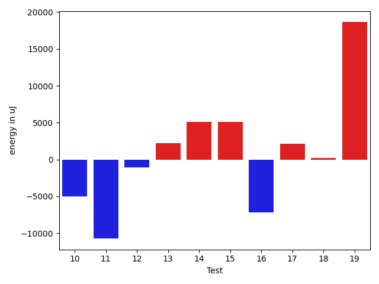

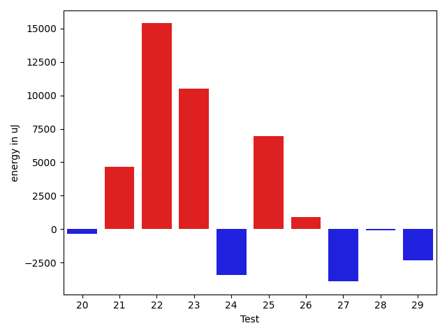

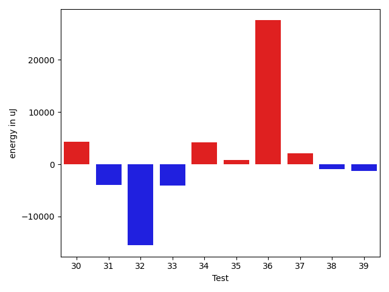

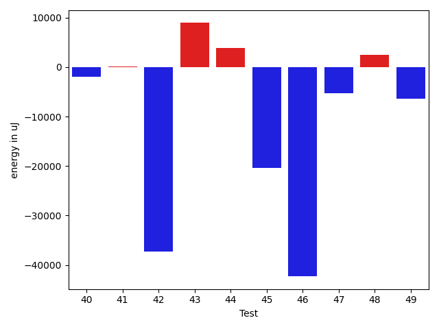

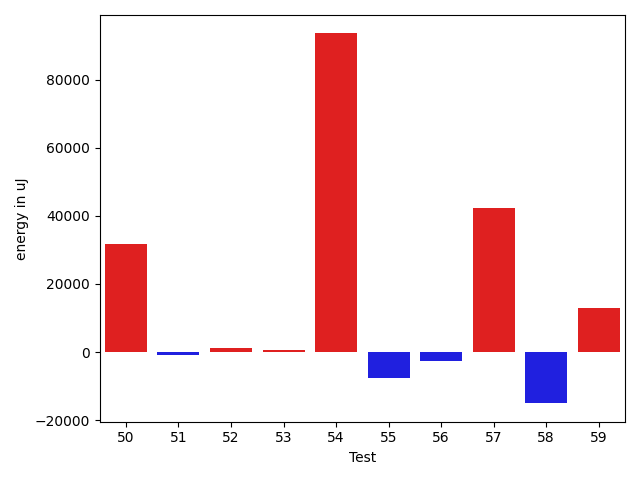

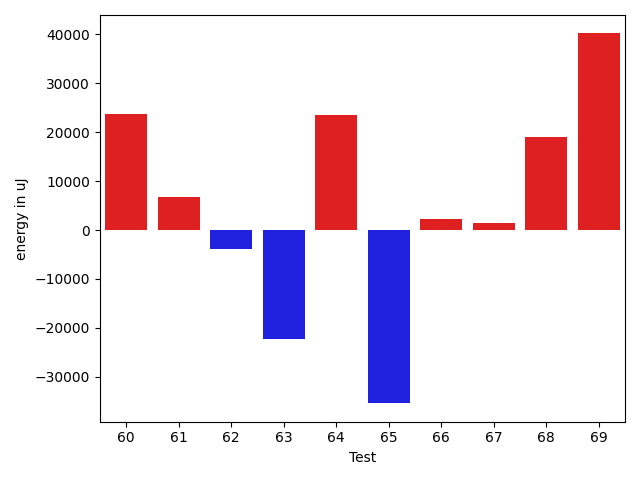

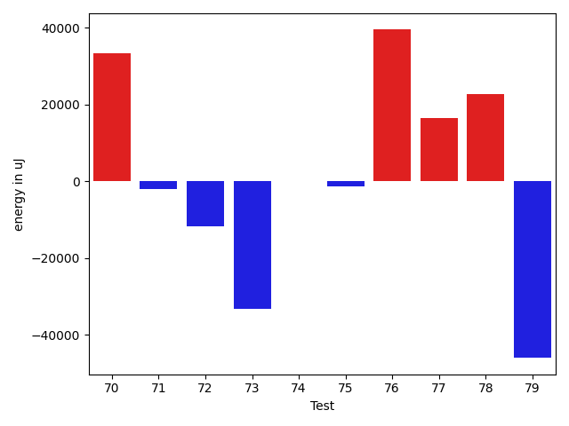

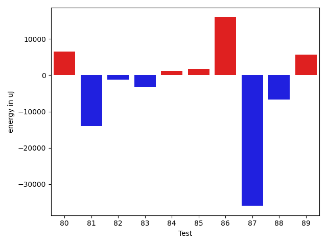

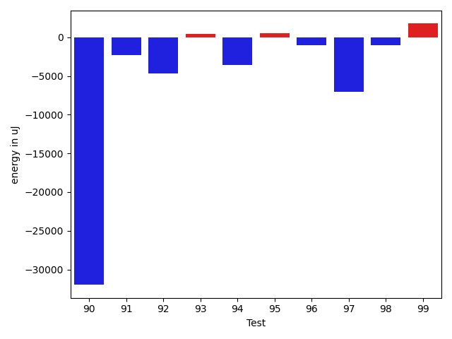

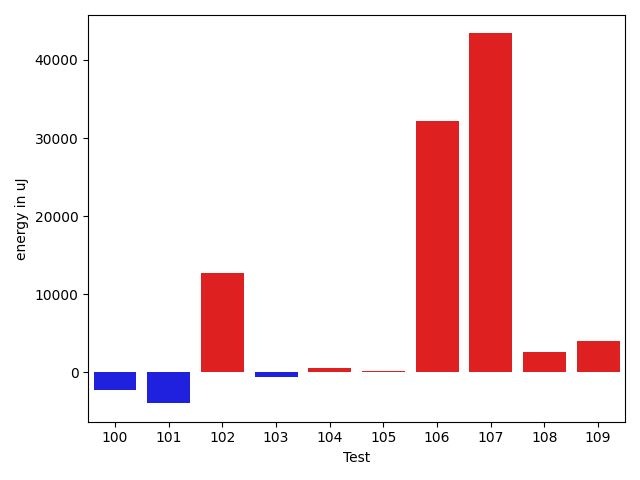

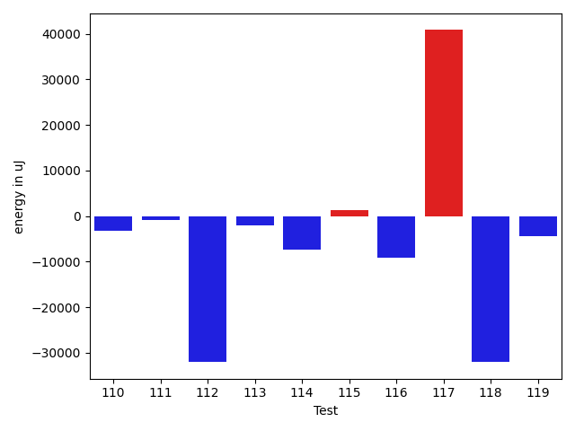

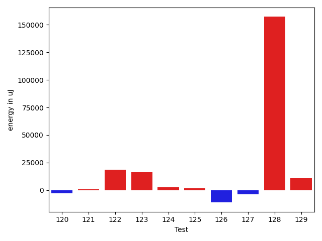

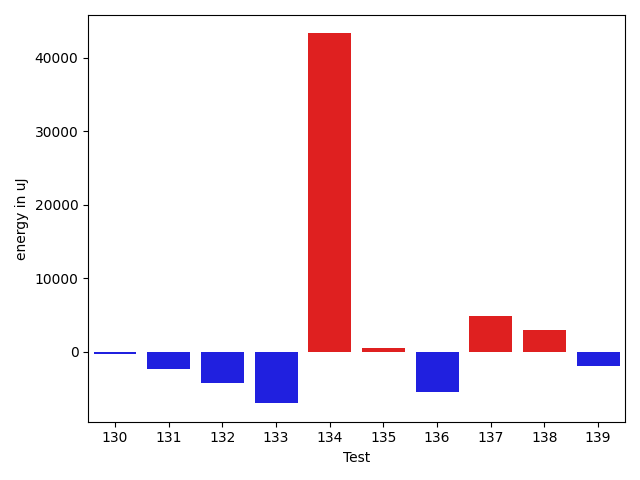

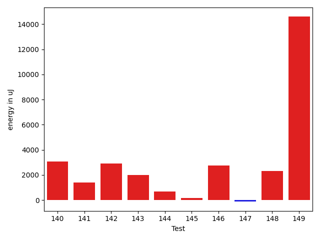

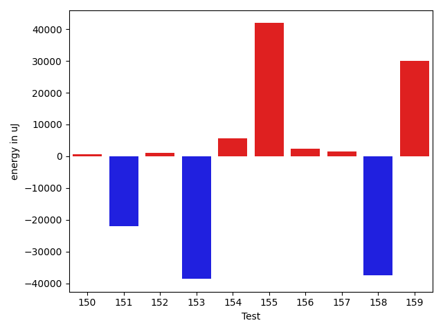

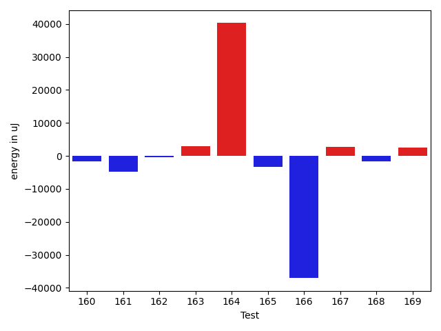

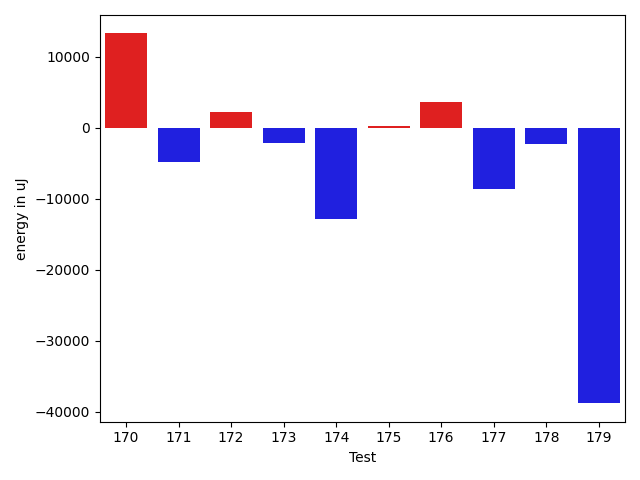

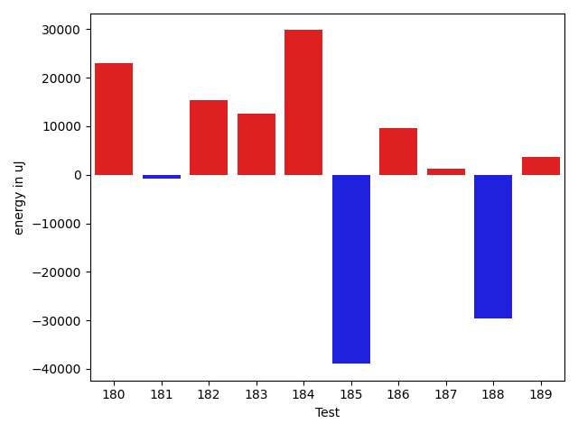

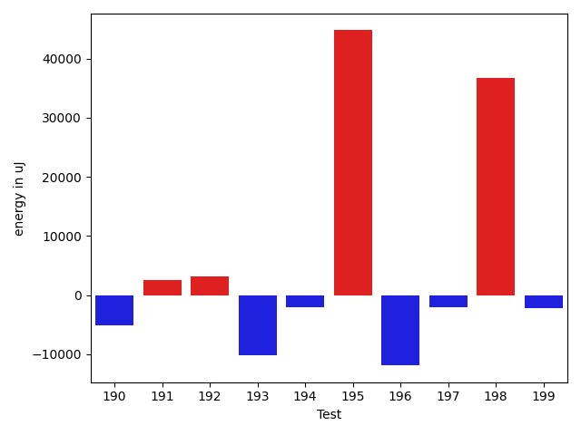

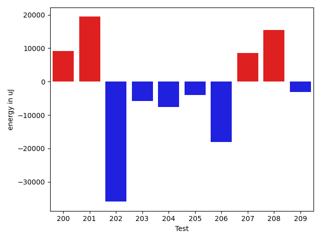

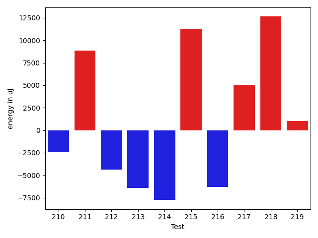

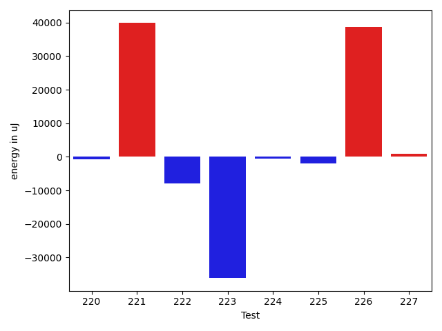

| ID | EnergyV1 | EnergyV2 | DeltaEnergy | σV1 | %σV1 | σV2 | %σV2 |
| --- | --- | --- | --- | --- | --- | --- | --- |
| 0 | 83496 | 83251 | -245 | 25923.00 | 31.05 | 20913.29 | 25.12 |
| 1 | 79590 | 44678 | -34912 | 21992.08 | 27.63 | 20229.43 | 45.28 |
| 2 | 45166 | 84167 | 39001 | 21699.99 | 48.04 | 20839.67 | 24.76 |
| 3 | 45227 | 45532 | 305 | 18532.80 | 40.98 | 17744.38 | 38.97 |
| 4 | 80505 | 81848 | 1343 | 23515.31 | 29.21 | 17868.57 | 21.83 |
| 5 | 45532 | 83191 | 37659 | 20646.48 | 45.34 | 22746.43 | 27.34 |
| 6 | 45288 | 44006 | -1282 | 4284.65 | 9.46 | 12677.34 | 28.81 |
| 7 | 45471 | 87952 | 42481 | 25872.26 | 56.90 | 18200.12 | 20.69 |
| 8 | 167907 | 167908 | 1 | 24042.69 | 14.32 | 17463.17 | 10.40 |
| 9 | 118835 | 113830 | -5005 | 28209.23 | 23.74 | 8121.69 | 7.13 |
| 10 | 161072 | 156067 | -5005 | 22479.22 | 13.96 | 43946.17 | 28.16 |
| 11 | 163269 | 152526 | -10743 | 31960.09 | 19.58 | 25369.08 | 16.63 |
| 12 | 139343 | 138306 | -1037 | 20711.01 | 14.86 | 3184.39 | 2.30 |
| 13 | 72205 | 74402 | 2197 | 12362.94 | 17.12 | 14026.80 | 18.85 |
| 14 | 94177 | 99243 | 5066 | 7977.10 | 8.47 | 4476.10 | 4.51 |
| 15 | 94483 | 99610 | 5127 | 21597.74 | 22.86 | 21230.45 | 21.31 |
| 16 | 131592 | 124389 | -7203 | 20461.22 | 15.55 | 23163.70 | 18.62 |
| 17 | 90027 | 92163 | 2136 | 22263.33 | 24.73 | 19551.07 | 21.21 |
| 18 | 45593 | 45838 | 245 | 2222.28 | 4.87 | 13778.62 | 30.06 |
| 19 | 179809 | 198485 | 18676 | 16897.91 | 9.40 | 13323.34 | 6.71 |
| 20 | 116760 | 116393 | -367 | 20690.99 | 17.72 | 15894.96 | 13.66 |
| 21 | 123535 | 128173 | 4638 | 15881.65 | 12.86 | 18835.18 | 14.70 |
| 22 | 113037 | 128418 | 15381 | 20867.27 | 18.46 | 8484.48 | 6.61 |
| 23 | 75378 | 85876 | 10498 | 61955.50 | 82.19 | 14556.21 | 16.95 |
| 24 | 80139 | 76721 | -3418 | 20163.69 | 25.16 | 13292.51 | 17.33 |
| 25 | 98144 | 105102 | 6958 | 7574.28 | 7.72 | 18423.59 | 17.53 |
| 26 | 126159 | 127075 | 916 | 5316.51 | 4.21 | 23646.45 | 18.61 |
| 27 | 215393 | 211486 | -3907 | 24504.65 | 11.38 | 22662.82 | 10.72 |
| 28 | 90271 | 90210 | -61 | 15250.39 | 16.89 | 16518.80 | 18.31 |
| 29 | 111572 | 109252 | -2320 | 22037.90 | 19.75 | 20239.42 | 18.53 |
| 30 | 121643 | 125976 | 4333 | 13861.13 | 11.39 | 20979.68 | 16.65 |
| 31 | 117981 | 114013 | -3968 | 20794.42 | 17.63 | 14794.50 | 12.98 |
| 32 | 175720 | 160217 | -15503 | 28359.06 | 16.14 | 21144.50 | 13.20 |
| 33 | 131896 | 127807 | -4089 | 17761.52 | 13.47 | 16807.73 | 13.15 |
| 34 | 61218 | 65369 | 4151 | 16269.86 | 26.58 | 11614.53 | 17.77 |
| 35 | 44189 | 45044 | 855 | 19417.12 | 43.94 | 15446.27 | 34.29 |
| 36 | 43030 | 70557 | 27527 | 32221.04 | 74.88 | 16812.50 | 23.83 |
| 37 | 45105 | 47241 | 2136 | 18118.73 | 40.17 | 25051.43 | 53.03 |
| 38 | 117310 | 116333 | -977 | 21551.93 | 18.37 | 24422.63 | 20.99 |
| 39 | 238830 | 237548 | -1282 | 25533.25 | 10.69 | 17920.36 | 7.54 |
| 40 | 40833 | 38818 | -2015 | 17657.82 | 43.24 | 12495.42 | 32.19 |
| 41 | 39856 | 39916 | 60 | 4408.21 | 11.06 | 11789.75 | 29.54 |
| 42 | 130432 | 93200 | -37232 | 22620.73 | 17.34 | 23907.34 | 25.65 |
| 43 | 130065 | 138977 | 8912 | 21705.73 | 16.69 | 27460.85 | 19.76 |
| 44 | 128722 | 132568 | 3846 | 22286.44 | 17.31 | 22827.32 | 17.22 |
| 45 | 128906 | 108459 | -20447 | 22664.42 | 17.58 | 14448.19 | 13.32 |
| 46 | 118713 | 76415 | -42298 | 27446.89 | 23.12 | 15229.82 | 19.93 |
| 47 | 126037 | 120727 | -5310 | 5873.30 | 4.66 | 16823.41 | 13.94 |
| 48 | 43335 | 45777 | 2442 | 2472.59 | 5.71 | 3529.56 | 7.71 |
| 49 | 133789 | 127380 | -6409 | 24536.51 | 18.34 | 29642.53 | 23.27 |
| 50 | 89600 | 121398 | 31798 | 37045.18 | 41.35 | 69472.91 | 57.23 |
| 51 | 45287 | 44556 | -731 | 15127.64 | 33.40 | 3144.12 | 7.06 |
| 52 | 132385 | 133667 | 1282 | 9622.47 | 7.27 | 4936.17 | 3.69 |
| 53 | 44128 | 44861 | 733 | 3550.64 | 8.05 | 3242.07 | 7.23 |
| 54 | 1505367 | 1598873 | 93506 | 48856.55 | 3.25 | 87430.44 | 5.47 |
| 55 | 127929 | 120177 | -7752 | 23308.01 | 18.22 | 18429.31 | 15.34 |
| 56 | 85815 | 83252 | -2563 | 24658.16 | 28.73 | 42025.65 | 50.48 |
| 57 | 134887 | 177185 | 42298 | 25820.29 | 19.14 | 25331.62 | 14.30 |
| 58 | 129455 | 114441 | -15014 | 22516.48 | 17.39 | 20230.17 | 17.68 |
| 59 | 379943 | 392760 | 12817 | 30091.70 | 7.92 | 56192.48 | 14.31 |
| 60 | 235167 | 258910 | 23743 | 20824.87 | 8.86 | 34076.10 | 13.16 |
| 61 | 142150 | 148864 | 6714 | 17076.18 | 12.01 | 28908.58 | 19.42 |
| 62 | 114318 | 110413 | -3905 | 22622.40 | 19.79 | 15855.14 | 14.36 |
| 63 | 345214 | 322997 | -22217 | 24233.07 | 7.02 | 93952.96 | 29.09 |
| 64 | 431273 | 454771 | 23498 | 36799.03 | 8.53 | 31009.78 | 6.82 |
| 65 | 114624 | 79224 | -35400 | 24268.93 | 21.17 | 19859.05 | 25.07 |
| 66 | 73486 | 75806 | 2320 | 10794.47 | 14.69 | 18977.50 | 25.03 |
| 67 | 87341 | 88806 | 1465 | 13930.00 | 15.95 | 17578.14 | 19.79 |
| 68 | 1188413 | 1207517 | 19104 | 68674.40 | 5.78 | 80591.97 | 6.67 |
| 69 | 92834 | 132995 | 40161 | 18474.82 | 19.90 | 26542.31 | 19.96 |
| 70 | 44311 | 77636 | 33325 | 11306.45 | 25.52 | 31641.45 | 40.76 |
| 71 | 138061 | 135986 | -2075 | 88837.02 | 64.35 | 28943.12 | 21.28 |
| 72 | 670653 | 658933 | -11720 | 250365.71 | 37.33 | 44184.07 | 6.71 |
| 73 | 77697 | 44556 | -33141 | 20942.10 | 26.95 | 21450.33 | 48.14 |
| 74 | 133179 | 133239 | 60 | 20211.01 | 15.18 | 12911.68 | 9.69 |
| 75 | 47607 | 46387 | -1220 | 22675.60 | 47.63 | 31480.49 | 67.86 |
| 76 | 45776 | 85266 | 39490 | 19746.51 | 43.14 | 20331.26 | 23.84 |
| 77 | 202575 | 218994 | 16419 | 17866.55 | 8.82 | 38570.36 | 17.61 |
| 78 | 239501 | 262328 | 22827 | 28957.21 | 12.09 | 18924.33 | 7.21 |
| 79 | 87769 | 41748 | -46021 | 15121.48 | 17.23 | 19942.66 | 47.77 |
| 80 | 42725 | 49316 | 6591 | 1526.72 | 3.57 | 20618.18 | 41.81 |
| 81 | 559691 | 545653 | -14038 | 92343.82 | 16.50 | 60768.38 | 11.14 |
| 82 | 42785 | 41626 | -1159 | 4624.26 | 10.81 | 11658.02 | 28.01 |
| 83 | 46753 | 43579 | -3174 | 3196.40 | 6.84 | 3442.79 | 7.90 |
| 84 | 44800 | 45959 | 1159 | 2217.98 | 4.95 | 1845.38 | 4.02 |
| 85 | 130615 | 132385 | 1770 | 25737.28 | 19.70 | 36073.74 | 27.25 |
| 86 | 127197 | 143250 | 16053 | 24537.19 | 19.29 | 23798.04 | 16.61 |
| 87 | 118469 | 82458 | -36011 | 20186.02 | 17.04 | 23363.52 | 28.33 |
| 88 | 92041 | 85326 | -6715 | 16899.14 | 18.36 | 23031.86 | 26.99 |
| 89 | 100280 | 105957 | 5677 | 14989.60 | 14.95 | 17154.44 | 16.19 |
| 90 | 81055 | 49072 | -31983 | 20380.43 | 25.14 | 20610.52 | 42.00 |
| 91 | 88012 | 85693 | -2319 | 22678.60 | 25.77 | 23420.70 | 27.33 |
| 92 | 127991 | 123352 | -4639 | 19004.98 | 14.85 | 26691.33 | 21.64 |
| 93 | 45959 | 46448 | 489 | 2299.69 | 5.00 | 1327.04 | 2.86 |
| 94 | 86975 | 83374 | -3601 | 29643.32 | 34.08 | 1648.77 | 1.98 |
| 95 | 45044 | 45593 | 549 | 13783.91 | 30.60 | 1579.97 | 3.47 |
| 96 | 46570 | 45593 | -977 | 19110.03 | 41.04 | 20355.14 | 44.65 |
| 97 | 168762 | 161682 | -7080 | 14129.86 | 8.37 | 56489.44 | 34.94 |
| 98 | 44982 | 43945 | -1037 | 22265.93 | 49.50 | 2311.10 | 5.26 |
| 99 | 37048 | 38818 | 1770 | 15465.96 | 41.75 | 20566.46 | 52.98 |
| 100 | 42114 | 39856 | -2258 | 5362.79 | 12.73 | 12343.59 | 30.97 |
| 101 | 81604 | 77636 | -3968 | 18169.15 | 22.27 | 26080.40 | 33.59 |
| 102 | 72449 | 85144 | 12695 | 17468.32 | 24.11 | 18693.83 | 21.96 |
| 103 | 44251 | 43640 | -611 | 2891.02 | 6.53 | 1792.14 | 4.11 |
| 104 | 44861 | 45410 | 549 | 2706.83 | 6.03 | 22459.37 | 49.46 |
| 105 | 39429 | 39551 | 122 | 18301.72 | 46.42 | 11197.23 | 28.31 |
| 106 | 46997 | 79224 | 32227 | 19388.86 | 41.26 | 21109.91 | 26.65 |
| 107 | 47119 | 90515 | 43396 | 18094.49 | 38.40 | 21760.42 | 24.04 |
| 108 | 76355 | 78919 | 2564 | 14418.85 | 18.88 | 6658.38 | 8.44 |
| 109 | 44006 | 48034 | 4028 | 16416.85 | 37.31 | 21667.68 | 45.11 |
| 110 | 82580 | 79346 | -3234 | 23936.67 | 28.99 | 27093.44 | 34.15 |
| 111 | 41442 | 40649 | -793 | 20563.66 | 49.62 | 17614.29 | 43.33 |
| 112 | 76293 | 44250 | -32043 | 20562.60 | 26.95 | 21309.44 | 48.16 |
| 113 | 79651 | 77698 | -1953 | 13440.47 | 16.87 | 20819.04 | 26.79 |
| 114 | 151855 | 144408 | -7447 | 23570.35 | 15.52 | 29679.28 | 20.55 |
| 115 | 76721 | 78003 | 1282 | 19563.04 | 25.50 | 17081.66 | 21.90 |
| 116 | 81909 | 72815 | -9094 | 20990.52 | 25.63 | 13669.31 | 18.77 |
| 117 | 46814 | 87646 | 40832 | 19281.69 | 41.19 | 22083.68 | 25.20 |
| 118 | 77759 | 45715 | -32044 | 19912.16 | 25.61 | 21503.64 | 47.04 |
| 119 | 130920 | 126587 | -4333 | 24681.28 | 18.85 | 13040.74 | 10.30 |
| 120 | 130004 | 127136 | -2868 | 63247.09 | 48.65 | 14799.48 | 11.64 |
| 121 | 129211 | 129882 | 671 | 18062.14 | 13.98 | 27477.30 | 21.16 |
| 122 | 325377 | 343749 | 18372 | 32334.31 | 9.94 | 27286.37 | 7.94 |
| 123 | 144348 | 160400 | 16052 | 13362.74 | 9.26 | 24227.60 | 15.10 |
| 124 | 131958 | 134582 | 2624 | 19105.87 | 14.48 | 38941.18 | 28.93 |
| 125 | 153441 | 155273 | 1832 | 20156.05 | 13.14 | 22478.64 | 14.48 |
| 126 | 241882 | 230712 | -11170 | 27450.99 | 11.35 | 25454.98 | 11.03 |
| 127 | 130798 | 127136 | -3662 | 14741.76 | 11.27 | 6687.40 | 5.26 |
| 128 | 718565 | 875852 | 157287 | 212795.36 | 29.61 | 199910.92 | 22.82 |
| 129 | 118286 | 129150 | 10864 | 18359.72 | 15.52 | 20879.06 | 16.17 |
| 130 | 40527 | 40161 | -366 | 3650.33 | 9.01 | 2954.54 | 7.36 |
| 131 | 45959 | 43640 | -2319 | 19349.86 | 42.10 | 15757.39 | 36.11 |
| 132 | 38391 | 34119 | -4272 | 4087.07 | 10.65 | 3829.56 | 11.22 |
| 133 | 79895 | 72876 | -7019 | 18964.31 | 23.74 | 17492.21 | 24.00 |
| 134 | 83008 | 126281 | 43273 | 21581.75 | 26.00 | 496500.73 | 393.17 |
| 135 | 45105 | 45594 | 489 | 2568.87 | 5.70 | 19771.61 | 43.36 |
| 136 | 129455 | 123963 | -5492 | 22482.75 | 17.37 | 5629.34 | 4.54 |
| 137 | 71533 | 76415 | 4882 | 21781.85 | 30.45 | 24620.70 | 32.22 |
| 138 | 171508 | 174499 | 2991 | 23676.04 | 13.80 | 19317.35 | 11.07 |
| 139 | 43030 | 41015 | -2015 | 3719.37 | 8.64 | 3250.20 | 7.92 |
| 140 | 42297 | 45349 | 3052 | 2225.76 | 5.26 | 1929.89 | 4.26 |
| 141 | 35034 | 36438 | 1404 | 2334.69 | 6.66 | 6245.06 | 17.14 |
| 142 | 41076 | 44006 | 2930 | 2731.11 | 6.65 | 2463.53 | 5.60 |
| 143 | 45044 | 47058 | 2014 | 1741.86 | 3.87 | 2368.94 | 5.03 |
| 144 | 44251 | 44922 | 671 | 2816.05 | 6.36 | 3193.26 | 7.11 |
| 145 | 43518 | 43701 | 183 | 2582.68 | 5.93 | 3631.18 | 8.31 |
| 146 | 43518 | 46265 | 2747 | 3572.12 | 8.21 | 2811.44 | 6.08 |
| 147 | 40162 | 40039 | -123 | 3326.70 | 8.28 | 4096.68 | 10.23 |
| 148 | 43334 | 45655 | 2321 | 2974.46 | 6.86 | 16833.62 | 36.87 |
| 149 | 176269 | 190857 | 14588 | 26622.97 | 15.10 | 22389.68 | 11.73 |
| 150 | 161926 | 162598 | 672 | 28009.98 | 17.30 | 18414.18 | 11.32 |
| 151 | 240966 | 218994 | -21972 | 30437.88 | 12.63 | 9621.86 | 4.39 |
| 152 | 124695 | 125732 | 1037 | 20999.93 | 16.84 | 39621.19 | 31.51 |
| 153 | 197387 | 158813 | -38574 | 29921.75 | 15.16 | 24484.95 | 15.42 |
| 154 | 483153 | 488708 | 5555 | 44821.49 | 9.28 | 34257.22 | 7.01 |
| 155 | 91675 | 133544 | 41869 | 23422.59 | 25.55 | 20379.24 | 15.26 |
| 156 | 67139 | 69458 | 2319 | 15055.71 | 22.42 | 12529.11 | 18.04 |
| 157 | 43945 | 45349 | 1404 | 25182.92 | 57.31 | 22380.34 | 49.35 |
| 158 | 83313 | 45776 | -37537 | 18890.69 | 22.67 | 22341.30 | 48.81 |
| 159 | 41809 | 71838 | 30029 | 23150.24 | 55.37 | 19455.91 | 27.08 |
| 160 | 181274 | 179565 | -1709 | 21300.33 | 11.75 | 12673.20 | 7.06 |
| 161 | 212585 | 207763 | -4822 | 22337.12 | 10.51 | 21779.64 | 10.48 |
| 162 | 137878 | 137573 | -305 | 20642.80 | 14.97 | 22126.06 | 16.08 |
| 163 | 41138 | 44189 | 3051 | 3060.19 | 7.44 | 2736.86 | 6.19 |
| 164 | 93200 | 133484 | 40284 | 18503.95 | 19.85 | 35579.32 | 26.65 |
| 165 | 87524 | 84229 | -3295 | 23192.24 | 26.50 | 21350.60 | 25.35 |
| 166 | 80322 | 43274 | -37048 | 22926.72 | 28.54 | 20351.12 | 47.03 |
| 167 | 83496 | 86304 | 2808 | 5181.49 | 6.21 | 14091.14 | 16.33 |
| 168 | 39368 | 37720 | -1648 | 16839.76 | 42.78 | 12602.66 | 33.41 |
| 169 | 64880 | 67505 | 2625 | 11467.37 | 17.67 | 18699.28 | 27.70 |
| 170 | 278502 | 291809 | 13307 | 22096.88 | 7.93 | 18741.04 | 6.42 |
| 171 | 46081 | 41321 | -4760 | 13984.63 | 30.35 | 20974.13 | 50.76 |
| 172 | 80872 | 83069 | 2197 | 24089.94 | 29.79 | 27105.37 | 32.63 |
| 173 | 40467 | 38269 | -2198 | 4547.80 | 11.24 | 21109.55 | 55.16 |
| 174 | 116577 | 103699 | -12878 | 18791.37 | 16.12 | 24700.36 | 23.82 |
| 175 | 114685 | 114990 | 305 | 18827.87 | 16.42 | 13767.77 | 11.97 |
| 176 | 88562 | 92223 | 3661 | 19432.16 | 21.94 | 20298.10 | 22.01 |
| 177 | 95825 | 87158 | -8667 | 15837.49 | 16.53 | 19785.56 | 22.70 |
| 178 | 185791 | 183532 | -2259 | 27254.02 | 14.67 | 24286.59 | 13.23 |
| 179 | 124084 | 85265 | -38819 | 23564.76 | 18.99 | 20239.30 | 23.74 |
| 180 | 85327 | 108337 | 23010 | 23346.18 | 27.36 | 20263.20 | 18.70 |
| 181 | 87585 | 86731 | -854 | 17342.93 | 19.80 | 16634.47 | 19.18 |
| 182 | 87341 | 102783 | 15442 | 18392.82 | 21.06 | 18362.19 | 17.87 |
| 183 | 159302 | 171814 | 12512 | 22211.12 | 13.94 | 50583.00 | 29.44 |
| 184 | 46814 | 76599 | 29785 | 20412.94 | 43.60 | 20779.39 | 27.13 |
| 185 | 85205 | 46264 | -38941 | 22400.79 | 26.29 | 21713.82 | 46.93 |
| 186 | 364073 | 373656 | 9583 | 33086.95 | 9.09 | 99468.28 | 26.62 |
| 187 | 78857 | 80200 | 1343 | 19590.79 | 24.84 | 18410.95 | 22.96 |
| 188 | 209472 | 179870 | -29602 | 19254.98 | 9.19 | 31308.24 | 17.41 |
| 189 | 259704 | 263427 | 3723 | 29932.66 | 11.53 | 28762.45 | 10.92 |
| 190 | 43640 | 38575 | -5065 | 3879.79 | 8.89 | 2568.14 | 6.66 |
| 191 | 43701 | 46264 | 2563 | 1988.92 | 4.55 | 20863.10 | 45.10 |
| 192 | 35950 | 39124 | 3174 | 11253.35 | 31.30 | 12650.60 | 32.33 |
| 193 | 77759 | 67505 | -10254 | 12174.04 | 15.66 | 15272.32 | 22.62 |
| 194 | 43701 | 41626 | -2075 | 20209.73 | 46.25 | 18074.46 | 43.42 |
| 195 | 266235 | 311035 | 44800 | 22441.65 | 8.43 | 18615.35 | 5.98 |
| 196 | 216674 | 204773 | -11901 | 68603.35 | 31.66 | 22795.55 | 11.13 |
| 197 | 184631 | 182555 | -2076 | 18749.82 | 10.16 | 22847.71 | 12.52 |
| 198 | 414549 | 451232 | 36683 | 24572.85 | 5.93 | 26740.27 | 5.93 |
| 199 | 152954 | 150757 | -2197 | 175769.27 | 114.92 | 11654.21 | 7.73 |
| 200 | 169128 | 178222 | 9094 | 27622.36 | 16.33 | 24126.81 | 13.54 |
| 201 | 229186 | 248595 | 19409 | 19964.14 | 8.71 | 23851.67 | 9.59 |
| 202 | 74890 | 39001 | -35889 | 11018.82 | 14.71 | 16992.78 | 43.57 |
| 203 | 88867 | 83130 | -5737 | 31625.95 | 35.59 | 17164.08 | 20.65 |
| 204 | 203063 | 195495 | -7568 | 23039.74 | 11.35 | 26807.29 | 13.71 |
| 205 | 213012 | 209045 | -3967 | 19391.77 | 9.10 | 21238.75 | 10.16 |
| 206 | 251037 | 232909 | -18128 | 36855.38 | 14.68 | 16235.84 | 6.97 |
| 207 | 217163 | 225707 | 8544 | 13727.00 | 6.32 | 25874.90 | 11.46 |
| 208 | 75317 | 90760 | 15443 | 20822.42 | 27.65 | 21862.29 | 24.09 |
| 209 | 92590 | 89539 | -3051 | 14397.35 | 15.55 | 27940.65 | 31.21 |
| 210 | 85632 | 83191 | -2441 | 23868.89 | 27.87 | 18457.65 | 22.19 |
| 211 | 81543 | 90393 | 8850 | 26267.36 | 32.21 | 16820.76 | 18.61 |
| 212 | 83740 | 79345 | -4395 | 6753.15 | 8.06 | 6245.37 | 7.87 |
| 213 | 274841 | 268432 | -6409 | 20993.67 | 7.64 | 28261.52 | 10.53 |
| 214 | 84289 | 76538 | -7751 | 4748.53 | 5.63 | 20818.79 | 27.20 |
| 215 | 195922 | 207214 | 11292 | 16510.17 | 8.43 | 23738.85 | 11.46 |
| 216 | 87463 | 81176 | -6287 | 16113.82 | 18.42 | 25928.60 | 31.94 |
| 217 | 84839 | 89904 | 5065 | 14195.24 | 16.73 | 37391.45 | 41.59 |
| 218 | 232849 | 245483 | 12634 | 23030.80 | 9.89 | 29491.49 | 12.01 |
| 219 | 89355 | 90393 | 1038 | 37174.11 | 41.60 | 12267.80 | 13.57 |
| 220 | 45776 | 45105 | -671 | 1848.57 | 4.04 | 3830.90 | 8.49 |
| 221 | 500914 | 540770 | 39856 | 55553.12 | 11.09 | 41971.12 | 7.76 |
| 222 | 167358 | 159423 | -7935 | 19018.58 | 11.36 | 26032.60 | 16.33 |
| 223 | 663329 | 627196 | -36133 | 51786.49 | 7.81 | 38069.54 | 6.07 |
| 224 | 43884 | 43396 | -488 | 2819.90 | 6.43 | 16010.34 | 36.89 |
| 225 | 42847 | 40955 | -1892 | 3235.82 | 7.55 | 13429.01 | 32.79 |
| 226 | 1428341 | 1467159 | 38818 | 83913.55 | 5.87 | 68054.54 | 4.64 |
| 227 | 45776 | 46691 | 915 | 2670.59 | 5.83 | 16220.98 | 34.74 |

## Misc.

| ID | Test Class | Test Method |
| --- | --- | --- |
| 0 | com.google.gson.functional.TypeAdapterPrecedenceTest | testStreamingFollowedByNonstreaming |
| 1 | com.google.gson.functional.TypeAdapterPrecedenceTest | testStreamingHierarchicalFollowedByNonstreaming |
| 2 | com.google.gson.functional.TypeAdapterPrecedenceTest | testSerializeNonstreamingTypeAdapterFollowedByStreamingTypeAdapter |
| 3 | com.google.gson.functional.TypeAdapterPrecedenceTest | testNonstreamingHierarchicalFollowedByNonstreaming |
| 4 | com.google.gson.functional.TypeAdapterPrecedenceTest | testStreamingHierarchicalFollowedByNonstreamingHierarchical |
| 5 | com.google.gson.functional.TypeAdapterPrecedenceTest | testNonstreamingFollowedByNonstreaming |
| 6 | com.google.gson.functional.TypeAdapterPrecedenceTest | testStreamingFollowedByStreaming |
| 7 | com.google.gson.functional.TypeAdapterPrecedenceTest | testStreamingFollowedByNonstreamingHierarchical |
| 8 | com.google.gson.functional.CustomTypeAdaptersTest | testCustomAdapterInvokedForCollectionElementDeserialization |
| 9 | com.google.gson.functional.CustomTypeAdaptersTest | testCustomTypeAdapterAppliesToSubClassesSerializedAsBaseClass |
| 10 | com.google.gson.functional.CustomTypeAdaptersTest | testCustomAdapterInvokedForMapElementDeserialization |
| 11 | com.google.gson.functional.CustomTypeAdaptersTest | testCustomAdapterInvokedForMapElementSerializationWithType |
| 12 | com.google.gson.functional.CustomTypeAdaptersTest | testCustomNestedSerializers |
| 13 | com.google.gson.functional.CustomTypeAdaptersTest | testCustomAdapterInvokedForMapElementSerialization |
| 14 | com.google.gson.functional.CustomTypeAdaptersTest | testCustomSerializers |
| 15 | com.google.gson.functional.CustomTypeAdaptersTest | testCustomNestedDeserializers |
| 16 | com.google.gson.functional.CustomTypeAdaptersTest | testCustomTypeAdapterDoesNotAppliesToSubClasses |
| 17 | com.google.gson.functional.CustomTypeAdaptersTest | testCustomAdapterInvokedForCollectionElementSerialization |
| 18 | com.google.gson.functional.CustomTypeAdaptersTest | testRegisterHierarchyAdapterForDate |
| 19 | com.google.gson.functional.CustomTypeAdaptersTest | testCustomAdapterInvokedForCollectionElementSerializationWithType |
| 20 | com.google.gson.functional.CustomTypeAdaptersTest | testCustomDeserializers |
| 21 | com.google.gson.functional.CustomTypeAdaptersTest | testCustomByteArrayDeserializerAndInstanceCreator |
| 22 | com.google.gson.functional.CustomTypeAdaptersTest | testCustomByteArraySerializer |
| 23 | com.google.gson.functional.CustomTypeAdaptersTest | testEnsureCustomSerializerNotInvokedForNullValues |
| 24 | com.google.gson.functional.CustomTypeAdaptersTest | testEnsureCustomDeserializerNotInvokedForNullValues |
| 25 | com.google.gson.functional.CustomTypeAdaptersTest | testCustomDeserializerInvokedForPrimitives |
| 26 | com.google.gson.functional.CustomTypeAdaptersTest | testCustomSerializerInvokedForPrimitives |
| 27 | com.google.gson.functional.StreamingTypeAdaptersTest | testNullSafe |
| 28 | com.google.gson.functional.StreamingTypeAdaptersTest | testSerializeWithCustomTypeAdapter |
| 29 | com.google.gson.functional.StreamingTypeAdaptersTest | testDeserializeWithCustomTypeAdapter |
| 30 | com.google.gson.functional.JsonAdapterAnnotationOnClassesTest | testJsonAdapterInvoked |
| 31 | com.google.gson.functional.JsonAdapterAnnotationOnClassesTest | testRegisteredAdapterOverridesJsonAdapter |
| 32 | com.google.gson.functional.JsonAdapterAnnotationOnClassesTest | testRegisteredDeserializerOverridesJsonAdapter |
| 33 | com.google.gson.functional.JsonAdapterAnnotationOnClassesTest | testRegisteredSerializerOverridesJsonAdapter |
| 34 | com.google.gson.functional.JsonAdapterAnnotationOnClassesTest | testSuperclassTypeAdapterNotInvoked |
| 35 | com.google.gson.functional.JsonAdapterAnnotationOnClassesTest | testNullSafeObjectFromJson |
| 36 | com.google.gson.functional.JsonAdapterAnnotationOnClassesTest | testIncorrectTypeAdapterFails |
| 37 | com.google.gson.functional.JsonAdapterAnnotationOnClassesTest | testJsonAdapterFactoryInvoked |
| 38 | com.google.gson.functional.ExclusionStrategyFunctionalTest | testExclusionStrategySerializationDoesNotImpactSerialization |
| 39 | com.google.gson.functional.ExclusionStrategyFunctionalTest | testExclusionStrategyWithMode |
| 40 | com.google.gson.functional.ExclusionStrategyFunctionalTest | testExcludeTopLevelClassDeserialization |
| 41 | com.google.gson.functional.ExclusionStrategyFunctionalTest | testExcludeTopLevelClassSerialization |
| 42 | com.google.gson.functional.ExclusionStrategyFunctionalTest | testExclusionStrategySerializationDoesNotImpactDeserialization |
| 43 | com.google.gson.functional.ExclusionStrategyFunctionalTest | testExcludeTopLevelClassDeserializationDoesNotImpactSerialization |
| 44 | com.google.gson.functional.ExclusionStrategyFunctionalTest | testExcludeTopLevelClassSerializationDoesNotImpactDeserialization |
| 45 | com.google.gson.functional.ExclusionStrategyFunctionalTest | testExclusionStrategyDeserialization |
| 46 | com.google.gson.functional.ExclusionStrategyFunctionalTest | testExclusionStrategySerialization |
| 47 | com.google.gson.MixedStreamTest | testReaderDoesNotMutateState |
| 48 | com.google.gson.MixedStreamTest | testReadInvalidState |
| 49 | com.google.gson.MixedStreamTest | testWriteClosed |
| 50 | com.google.gson.MixedStreamTest | testWriteInvalidState |
| 51 | com.google.gson.MixedStreamTest | testWriteDoesNotMutateState |
| 52 | com.google.gson.MixedStreamTest | testWriteHtmlSafe |
| 53 | com.google.gson.MixedStreamTest | testReadNulls |
| 54 | com.google.gson.MixedStreamTest | testWriteLenient |
| 55 | com.google.gson.MixedStreamTest | testWriteMixedStreamed |
| 56 | com.google.gson.MixedStreamTest | testWriteNulls |
| 57 | com.google.gson.MixedStreamTest | testReadMixedStreamed |
| 58 | com.google.gson.MixedStreamTest | testReadClosed |
| 59 | com.google.gson.functional.InstanceCreatorTest | testInstanceCreatorForParametrizedType |
| 60 | com.google.gson.functional.InstanceCreatorTest | testInstanceCreatorReturnsBaseType |
| 61 | com.google.gson.functional.InstanceCreatorTest | testInstanceCreatorReturnsSubTypeForField |
| 62 | com.google.gson.functional.InstanceCreatorTest | testInstanceCreatorReturnsSubTypeForTopLevelObject |
| 63 | com.google.gson.functional.InstanceCreatorTest | testInstanceCreatorForCollectionType |
| 64 | com.google.gson.functional.DefaultTypeAdaptersTest | testDateSerializationWithPatternNotOverridenByTypeAdapter |
| 65 | com.google.gson.functional.DefaultTypeAdaptersTest | testDateSerializationWithPattern |
| 66 | com.google.gson.functional.DefaultTypeAdaptersTest | testBitSetDeserialization |
| 67 | com.google.gson.functional.DefaultTypeAdaptersTest | testOverrideBigIntegerTypeAdapter |
| 68 | com.google.gson.functional.DefaultTypeAdaptersTest | testDefaultGregorianCalendarDeserialization |
| 69 | com.google.gson.functional.DefaultTypeAdaptersTest | testSqlDateSerialization |
| 70 | com.google.gson.functional.DefaultTypeAdaptersTest | testClassSerialization |
| 71 | com.google.gson.functional.DefaultTypeAdaptersTest | testTimestampSerialization |
| 72 | com.google.gson.functional.DefaultTypeAdaptersTest | testDefaultDateDeserializationUsingBuilder |
| 73 | com.google.gson.functional.DefaultTypeAdaptersTest | testDefaultCalendarSerialization |
| 74 | com.google.gson.functional.DefaultTypeAdaptersTest | testOverrideBigDecimalTypeAdapter |
| 75 | com.google.gson.functional.DefaultTypeAdaptersTest | testDefaultCalendarDeserialization |
| 76 | com.google.gson.functional.DefaultTypeAdaptersTest | testClassDeserialization |
| 77 | com.google.gson.functional.DefaultTypeAdaptersTest | testDateDeserializationWithPattern |
| 78 | com.google.gson.functional.DefaultTypeAdaptersTest | testDateSerializationInCollection |
| 79 | com.google.gson.functional.DefaultTypeAdaptersTest | testSetSerialization |
| 80 | com.google.gson.functional.DefaultTypeAdaptersTest | testDefaultGregorianCalendarSerialization |
| 81 | com.google.gson.functional.DefaultTypeAdaptersTest | testDefaultDateSerializationUsingBuilder |
| 82 | com.google.gson.functional.DefaultTypeAdaptersTest | testBitSetSerialization |
| 83 | com.google.gson.OverrideCoreTypeAdaptersTest | testOverrideStringAdapter |
| 84 | com.google.gson.OverrideCoreTypeAdaptersTest | testOverridePrimitiveBooleanAdapter |
| 85 | com.google.gson.OverrideCoreTypeAdaptersTest | testOverrideWrapperBooleanAdapter |
| 86 | com.google.gson.functional.JsonAdapterSerializerDeserializerTest | testJsonSerializerDeserializerBasedJsonAdapterOnFields |
| 87 | com.google.gson.functional.JsonAdapterSerializerDeserializerTest | testDifferentJsonAdaptersForGenericFieldsOfSameRawType |
| 88 | com.google.gson.functional.JsonAdapterSerializerDeserializerTest | testJsonSerializerDeserializerBasedJsonAdapterOnClass |
| 89 | com.google.gson.functional.NullObjectAndFieldTest | testCustomTypeAdapterPassesNullSerialization |
| 90 | com.google.gson.functional.NullObjectAndFieldTest | testExplicitDeserializationOfNulls |
| 91 | com.google.gson.functional.NullObjectAndFieldTest | testExplicitSerializationOfNullStringMembers |
| 92 | com.google.gson.functional.NullObjectAndFieldTest | testCustomTypeAdapterPassesNullDesrialization |
| 93 | com.google.gson.functional.NullObjectAndFieldTest | testTopLevelNullObjectDeserialization |
| 94 | com.google.gson.functional.NullObjectAndFieldTest | testExplicitSerializationOfNullCollectionMembers |
| 95 | com.google.gson.functional.NullObjectAndFieldTest | testCustomSerializationOfNulls |
| 96 | com.google.gson.functional.NullObjectAndFieldTest | testAbsentJsonElementsAreSetToNull |
| 97 | com.google.gson.functional.NullObjectAndFieldTest | testPrintPrintingObjectWithNulls |
| 98 | com.google.gson.functional.NullObjectAndFieldTest | testPrintPrintingArraysWithNulls |
| 99 | com.google.gson.functional.NullObjectAndFieldTest | testTopLevelNullObjectSerialization |
| 100 | com.google.gson.functional.NullObjectAndFieldTest | testNullWrappedPrimitiveMemberSerialization |
| 101 | com.google.gson.functional.NullObjectAndFieldTest | testExplicitNullSetsFieldToNullDuringDeserialization |
| 102 | com.google.gson.functional.NullObjectAndFieldTest | testExplicitSerializationOfNullArrayMembers |
| 103 | com.google.gson.functional.NullObjectAndFieldTest | testExplicitSerializationOfNulls |
| 104 | com.google.gson.functional.NullObjectAndFieldTest | testNullWrappedPrimitiveMemberDeserialization |
| 105 | com.google.gson.functional.NamingPolicyTest | testAtSignInSerializedName |
| 106 | com.google.gson.functional.NamingPolicyTest | testGsonWithNonDefaultFieldNamingPolicySerialization |
| 107 | com.google.gson.functional.NamingPolicyTest | testGsonWithLowerCaseDashPolicyDeserialiation |
| 108 | com.google.gson.functional.NamingPolicyTest | testGsonDuplicateNameUsingSerializedNameFieldNamingPolicySerialization |
| 109 | com.google.gson.functional.NamingPolicyTest | testGsonWithSerializedNameFieldNamingPolicyDeserialization |
| 110 | com.google.gson.functional.NamingPolicyTest | testGsonWithUpperCamelCaseSpacesPolicyDeserialiation |
| 111 | com.google.gson.functional.NamingPolicyTest | testGsonWithSerializedNameFieldNamingPolicySerialization |
| 112 | com.google.gson.functional.NamingPolicyTest | testGsonWithNonDefaultFieldNamingPolicyDeserialiation |
| 113 | com.google.gson.functional.NamingPolicyTest | testGsonWithLowerCaseUnderscorePolicySerialization |
| 114 | com.google.gson.functional.NamingPolicyTest | testComplexFieldNameStrategy |
| 115 | com.google.gson.functional.NamingPolicyTest | testDeprecatedNamingStrategy |
| 116 | com.google.gson.functional.NamingPolicyTest | testGsonWithUpperCamelCaseSpacesPolicySerialiation |
| 117 | com.google.gson.functional.NamingPolicyTest | testGsonWithLowerCaseDashPolicySerialization |
| 118 | com.google.gson.functional.NamingPolicyTest | testGsonWithLowerCaseUnderscorePolicyDeserialiation |
| 119 | com.google.gson.LongSerializationPolicyTest | testDefaultLongSerializationIntegration |
| 120 | com.google.gson.LongSerializationPolicyTest | testStringLongSerializationIntegration |
| 121 | com.google.gson.functional.MapTest | testSerializeMaps |
| 122 | com.google.gson.functional.MapTest | testInterfaceTypeMapWithSerializer |
| 123 | com.google.gson.functional.MapTest | testMapSerializationWithNullValuesSerialized |
| 124 | com.google.gson.functional.MapTest | testMapSubclassDeserialization |
| 125 | com.google.gson.functional.MapTest | testCustomSerializerForSpecificMapType |
| 126 | com.google.gson.functional.MapTest | testGeneralMapField |
| 127 | com.google.gson.functional.MapTest | testMapSerializationWithNullValueButSerializeNulls |
| 128 | com.google.gson.functional.MapTest | testInterfaceTypeMap |
| 129 | com.google.gson.functional.ReadersWritersTest | testReadWriteTwoObjects |
| 130 | com.google.gson.functional.ReadersWritersTest | testTopLevelNullObjectDeserializationWithReaderAndSerializeNulls |
| 131 | com.google.gson.functional.ReadersWritersTest | testReadWriteTwoStrings |
| 132 | com.google.gson.functional.ReadersWritersTest | testTopLevelNullObjectSerializationWithWriterAndSerializeNulls |
| 133 | com.google.gson.functional.FieldExclusionTest | testDefaultNestedStaticClassIncluded |
| 134 | com.google.gson.functional.FieldExclusionTest | testDefaultInnerClassExclusion |
| 135 | com.google.gson.functional.FieldExclusionTest | testInnerClassExclusion |
| 136 | com.google.gson.GsonBuilderTest | testExcludeFieldsWithModifiers |
| 137 | com.google.gson.GsonBuilderTest | testCreatingMoreThanOnce |
| 138 | com.google.gson.GsonBuilderTest | testTransientFieldExclusion |
| 139 | com.google.gson.functional.PrimitiveTest | testMoreSpecificSerialization |
| 140 | com.google.gson.functional.PrimitiveTest | testDoubleInfinitySerialization |
| 141 | com.google.gson.functional.PrimitiveTest | testHtmlCharacterSerialization |
| 142 | com.google.gson.functional.PrimitiveTest | testNegativeInfinitySerialization |
| 143 | com.google.gson.functional.PrimitiveTest | testLongAsStringSerialization |
| 144 | com.google.gson.functional.PrimitiveTest | testFloatInfinitySerialization |
| 145 | com.google.gson.functional.PrimitiveTest | testFloatNaNSerialization |
| 146 | com.google.gson.functional.PrimitiveTest | testNegativeInfinityFloatSerialization |
| 147 | com.google.gson.functional.PrimitiveTest | testLongAsStringDeserialization |
| 148 | com.google.gson.functional.PrimitiveTest | testDoubleNaNSerialization |
| 149 | com.google.gson.functional.CustomDeserializerTest | testCustomDeserializerReturnsNullForArrayElementsForArrayField |
| 150 | com.google.gson.functional.CustomDeserializerTest | testCustomDeserializerReturnsNull |
| 151 | com.google.gson.functional.CustomDeserializerTest | testJsonTypeFieldBasedDeserialization |
| 152 | com.google.gson.functional.CustomDeserializerTest | testCustomDeserializerReturnsNullForArrayElements |
| 153 | com.google.gson.functional.CustomDeserializerTest | testCustomDeserializerReturnsNullForTopLevelObject |
| 154 | com.google.gson.JsonParserTest | testReadWriteTwoObjects |
| 155 | com.google.gson.functional.CustomSerializerTest | testSerializerReturnsNull |
| 156 | com.google.gson.functional.CustomSerializerTest | testSubClassSerializerInvokedForBaseClassFieldsHoldingSubClassInstances |
| 157 | com.google.gson.functional.CustomSerializerTest | testBaseClassSerializerInvokedForBaseClassFieldsHoldingSubClassInstances |
| 158 | com.google.gson.functional.CustomSerializerTest | testBaseClassSerializerInvokedForBaseClassFields |
| 159 | com.google.gson.functional.CustomSerializerTest | testSubClassSerializerInvokedForBaseClassFieldsHoldingArrayOfSubClassInstances |
| 160 | com.google.gson.functional.ObjectTest | testSingletonLists |
| 161 | com.google.gson.functional.ObjectTest | testAnonymousLocalClassesCustomSerialization |
| 162 | com.google.gson.functional.ObjectTest | testInnerClassDeserialization |
| 163 | com.google.gson.functional.ObjectTest | testJsonObjectSerialization |
| 164 | com.google.gson.functional.VersioningTest | testVersionedGsonMixingSinceAndUntilDeserialization |
| 165 | com.google.gson.functional.VersioningTest | testVersionedUntilSerialization |
| 166 | com.google.gson.functional.VersioningTest | testIgnoreLaterVersionClassSerialization |
| 167 | com.google.gson.functional.VersioningTest | testVersionedClassesDeserialization |
| 168 | com.google.gson.functional.VersioningTest | testVersionedGsonWithUnversionedClassesSerialization |
| 169 | com.google.gson.functional.VersioningTest | testVersionedClassesSerialization |
| 170 | com.google.gson.functional.VersioningTest | testVersionedGsonMixingSinceAndUntilSerialization |
| 171 | com.google.gson.functional.VersioningTest | testIgnoreLaterVersionClassDeserialization |
| 172 | com.google.gson.functional.VersioningTest | testVersionedUntilDeserialization |
| 173 | com.google.gson.functional.VersioningTest | testVersionedGsonWithUnversionedClassesDeserialization |
| 174 | com.google.gson.functional.JsonAdapterAnnotationOnFieldsTest | testPrimitiveFieldAnnotationTakesPrecedenceOverDefault |
| 175 | com.google.gson.functional.JsonAdapterAnnotationOnFieldsTest | testClassAnnotationAdapterFactoryTakesPrecedenceOverDefault |
| 176 | com.google.gson.functional.JsonAdapterAnnotationOnFieldsTest | testJsonAdapterWrappedInNullSafeAsRequested |
| 177 | com.google.gson.functional.JsonAdapterAnnotationOnFieldsTest | testClassAnnotationAdapterTakesPrecedenceOverDefault |
| 178 | com.google.gson.functional.JsonAdapterAnnotationOnFieldsTest | testFieldAnnotationWorksForParameterizedType |
| 179 | com.google.gson.functional.JsonAdapterAnnotationOnFieldsTest | testRegisteredTypeAdapterTakesPrecedenceOverClassAnnotationAdapter |
| 180 | com.google.gson.functional.JsonAdapterAnnotationOnFieldsTest | testFieldAnnotationTakesPrecedenceOverClassAnnotation |
| 181 | com.google.gson.functional.JsonAdapterAnnotationOnFieldsTest | testNonPrimitiveFieldAnnotationTakesPrecedenceOverDefault |
| 182 | com.google.gson.functional.JsonAdapterAnnotationOnFieldsTest | testJsonAdapterInvokedOnlyForAnnotatedFields |
| 183 | com.google.gson.functional.JsonAdapterAnnotationOnFieldsTest | testFieldAnnotationTakesPrecedenceOverRegisteredTypeAdapter |
| 184 | com.google.gson.functional.TypeHierarchyAdapterTest | testRegisterSuperTypeFirst |
| 185 | com.google.gson.functional.TypeHierarchyAdapterTest | testRegisterSubTypeFirstAllowed |
| 186 | com.google.gson.functional.TypeHierarchyAdapterTest | testTypeHierarchy |
| 187 | com.google.gson.functional.TypeVariableTest | testBasicTypeVariables |
| 188 | com.google.gson.functional.TypeVariableTest | testAdvancedTypeVariables |
| 189 | com.google.gson.functional.TypeVariableTest | testTypeVariablesViaTypeParameter |
| 190 | com.google.gson.functional.SecurityTest | testJsonWithNonExectuableTokenSerialization |
| 191 | com.google.gson.functional.SecurityTest | testNonExecutableJsonSerialization |
| 192 | com.google.gson.functional.SecurityTest | testNonExecutableJsonDeserialization |
| 193 | com.google.gson.functional.SecurityTest | testJsonWithNonExectuableTokenWithConfiguredGsonDeserialization |
| 194 | com.google.gson.functional.SecurityTest | testJsonWithNonExectuableTokenWithRegularGsonDeserialization |
| 195 | com.google.gson.functional.EnumTest | testEnumSubclassWithRegisteredTypeAdapter |
| 196 | com.google.gson.functional.MapAsArrayTypeAdapterTest | testMultipleEnableComplexKeyRegistrationHasNoEffect |
| 197 | com.google.gson.functional.MapAsArrayTypeAdapterTest | testMapWithTypeVariableDeserialization |
| 198 | com.google.gson.functional.MapAsArrayTypeAdapterTest | testSerializeComplexMapWithTypeAdapter |
| 199 | com.google.gson.functional.MapAsArrayTypeAdapterTest | testTwoTypesCollapseToOneDeserialize |
| 200 | com.google.gson.functional.MapAsArrayTypeAdapterTest | testMapWithTypeVariableSerialization |
| 201 | com.google.gson.functional.RuntimeTypeAdapterFactoryFunctionalTest | testSubclassesAutomaticallySerialized |
| 202 | com.google.gson.functional.JavaUtilConcurrentAtomicTest | testAtomicLongWithStringSerializationPolicy |
| 203 | com.google.gson.functional.JavaUtilConcurrentAtomicTest | testAtomicLongArrayWithStringSerializationPolicy |
| 204 | com.google.gson.functional.ParameterizedTypesTest | testParameterizedTypeWithReaderDeserialization |
| 205 | com.google.gson.functional.ParameterizedTypesTest | testParameterizedTypeWithCustomSerializer |
| 206 | com.google.gson.functional.ParameterizedTypesTest | testParameterizedTypeDeserialization |
| 207 | com.google.gson.functional.ParameterizedTypesTest | testParameterizedTypesWithCustomDeserializer |
| 208 | com.google.gson.functional.FieldNamingTest | testIdentity |
| 209 | com.google.gson.functional.FieldNamingTest | testLowerCaseWithDashes |
| 210 | com.google.gson.functional.FieldNamingTest | testLowerCaseWithUnderscores |
| 211 | com.google.gson.functional.FieldNamingTest | testUpperCamelCase |
| 212 | com.google.gson.functional.FieldNamingTest | testUpperCamelCaseWithSpaces |
| 213 | com.google.gson.CommentsTest | testParseComments |
| 214 | com.google.gson.functional.EscapingTest | testGsonAcceptsEscapedAndNonEscapedJsonDeserialization |
| 215 | com.google.gson.functional.CollectionTest | testUserCollectionTypeAdapter |
| 216 | com.google.gson.functional.UncategorizedTest | testReturningDerivedClassesDuringDeserialization |
| 217 | com.google.gson.GsonTest | testOverridesDefaultExcluder |
| 218 | com.google.gson.DefaultMapJsonSerializerTest | testNonEmptyMapSerialization |
| 219 | com.google.gson.JsonObjectTest | testPropertyWithQuotes |
| 220 | com.google.gson.JsonObjectTest | testWritePropertyWithEmptyStringName |
| 221 | com.google.gson.regression.JsonAdapterNullSafeTest | testNullSafeBugDeserialize |
| 222 | com.google.gson.regression.JsonAdapterNullSafeTest | testNullSafeBugSerialize |
| 223 | com.google.gson.GsonTypeAdapterTest | testDeserializerForAbstractClass |
| 224 | com.google.gson.functional.ArrayTest | testNullsInArrayWithSerializeNullPropertySetSerialization |
| 225 | com.google.gson.functional.ArrayTest | testArrayElementsAreArrays |
| 226 | com.google.gson.functional.CircularReferenceTest | testSelfReferenceCustomHandlerSerialization |
| 227 | com.google.gson.functional.PrintFormattingTest | testJsonObjectWithNullValuesSerialized |

## Classifications

### Tests
| ID | Class | Delta | Share |
| --- | --- | --- | --- |
| G | NEUTRAL | 509340.0 | - |
| N | NEGATIVE | -1114809.0 | 0.92 |
| P | POSITIVE | 1624149.0 | 0.84 |
| 1 | NEGATIVE | -34912.0 | 3.13 |
| 2 | POSITIVE | 39001.0 | 2.40 |
| 5 | POSITIVE | 37659.0 | 2.32 |
| 7 | POSITIVE | 42481.0 | 2.62 |
| 32 | NEGATIVE | -15503.0 | 1.39 |
| 36 | POSITIVE | 27527.0 | 1.69 |
| 42 | NEGATIVE | -37232.0 | 3.34 |
| 45 | NEGATIVE | -20447.0 | 1.83 |
| 46 | NEGATIVE | -42298.0 | 3.79 |
| 50 | POSITIVE | 31798.0 | 1.96 |
| 54 | POSITIVE | 93506.0 | 5.76 |
| 57 | POSITIVE | 42298.0 | 2.60 |
| 60 | POSITIVE | 23743.0 | 1.46 |
| 63 | NEGATIVE | -22217.0 | 1.99 |
| 64 | POSITIVE | 23498.0 | 1.45 |
| 65 | NEGATIVE | -35400.0 | 3.18 |
| 69 | POSITIVE | 40161.0 | 2.47 |
| 70 | POSITIVE | 33325.0 | 2.05 |
| 73 | NEGATIVE | -33141.0 | 2.97 |
| 76 | POSITIVE | 39490.0 | 2.43 |
| 78 | POSITIVE | 22827.0 | 1.41 |
| 79 | NEGATIVE | -46021.0 | 4.13 |
| 87 | NEGATIVE | -36011.0 | 3.23 |
| 90 | NEGATIVE | -31983.0 | 2.87 |
| 106 | POSITIVE | 32227.0 | 1.98 |
| 107 | POSITIVE | 43396.0 | 2.67 |
| 112 | NEGATIVE | -32043.0 | 2.87 |
| 117 | POSITIVE | 40832.0 | 2.51 |
| 118 | NEGATIVE | -32044.0 | 2.87 |
| 128 | POSITIVE | 157287.0 | 9.68 |
| 134 | POSITIVE | 43273.0 | 2.66 |
| 151 | NEGATIVE | -21972.0 | 1.97 |
| 153 | NEGATIVE | -38574.0 | 3.46 |
| 155 | POSITIVE | 41869.0 | 2.58 |
| 158 | NEGATIVE | -37537.0 | 3.37 |
| 159 | POSITIVE | 30029.0 | 1.85 |
| 164 | POSITIVE | 40284.0 | 2.48 |
| 166 | NEGATIVE | -37048.0 | 3.32 |
| 179 | NEGATIVE | -38819.0 | 3.48 |
| 180 | POSITIVE | 23010.0 | 1.42 |
| 184 | POSITIVE | 29785.0 | 1.83 |
| 185 | NEGATIVE | -38941.0 | 3.49 |
| 188 | NEGATIVE | -29602.0 | 2.66 |
| 195 | POSITIVE | 44800.0 | 2.76 |
| 198 | POSITIVE | 36683.0 | 2.26 |
| 202 | NEGATIVE | -35889.0 | 3.22 |
| 206 | NEGATIVE | -18128.0 | 1.63 |
| 221 | POSITIVE | 39856.0 | 2.45 |
| 223 | NEGATIVE | -36133.0 | 3.24 |
| 226 | POSITIVE | 38818.0 | 2.39 |

### Lines
| Class | Java Class | Line |
| --- | --- | --- |
| negative | com.google.gson.internal.bind.JsonAdapterAnnotationTypeAdapterFactory | 96 |
| negative | com.google.gson.internal.bind.JsonAdapterAnnotationTypeAdapterFactory | 97 |
| negative | com.google.gson.internal.bind.JsonAdapterAnnotationTypeAdapterFactory | 50 |
| negative | com.google.gson.internal.bind.JsonAdapterAnnotationTypeAdapterFactory | 98 |
| negative | com.google.gson.internal.bind.JsonAdapterAnnotationTypeAdapterFactory | 115 |
| negative | com.google.gson.internal.bind.JsonAdapterAnnotationTypeAdapterFactory | 104 |
| negative | com.google.gson.internal.bind.JsonAdapterAnnotationTypeAdapterFactory | 105 |
| negative | com.google.gson.internal.bind.JsonAdapterAnnotationTypeAdapterFactory | 95 |
| positive | com.google.gson.internal.bind.JsonAdapterAnnotationTypeAdapterFactory | 96 |
| positive | com.google.gson.internal.bind.JsonAdapterAnnotationTypeAdapterFactory | 97 |
| positive | com.google.gson.internal.bind.JsonAdapterAnnotationTypeAdapterFactory | 98 |
| positive | com.google.gson.internal.bind.JsonAdapterAnnotationTypeAdapterFactory | 50 |
| positive | com.google.gson.internal.bind.JsonAdapterAnnotationTypeAdapterFactory | 115 |
| positive | com.google.gson.internal.bind.JsonAdapterAnnotationTypeAdapterFactory | 95 |
| unknown | com.google.gson.internal.bind.JsonAdapterAnnotationTypeAdapterFactory | 96 |
| unknown | com.google.gson.internal.bind.JsonAdapterAnnotationTypeAdapterFactory | 97 |
| unknown | com.google.gson.internal.bind.JsonAdapterAnnotationTypeAdapterFactory | 50 |
| unknown | com.google.gson.internal.bind.JsonAdapterAnnotationTypeAdapterFactory | 98 |
| unknown | com.google.gson.internal.bind.JsonAdapterAnnotationTypeAdapterFactory | 115 |
| unknown | com.google.gson.internal.bind.JsonAdapterAnnotationTypeAdapterFactory | 104 |
| unknown | com.google.gson.internal.bind.JsonAdapterAnnotationTypeAdapterFactory | 105 |
| unknown | com.google.gson.internal.bind.JsonAdapterAnnotationTypeAdapterFactory | 95 |

## Localization of Green Regression
### Selected Tests
| Test class | test method |
| --- | --- |

### Suspected lines
| Class | line |
| --- | --- |
| com.google.gson.internal.bind.JsonAdapterAnnotationTypeAdapterFactory | [50](https://github.com/google/gson/tree/943c67/gson/src/main/java/com/google/gson/internal/bind/JsonAdapterAnnotationTypeAdapterFactory.java#L50) |
| com.google.gson.internal.bind.JsonAdapterAnnotationTypeAdapterFactory | [115](https://github.com/google/gson/tree/943c67/gson/src/main/java/com/google/gson/internal/bind/JsonAdapterAnnotationTypeAdapterFactory.java#L50#L115) |
| com.google.gson.internal.bind.JsonAdapterAnnotationTypeAdapterFactory | [95](https://github.com/google/gson/tree/943c67/gson/src/main/java/com/google/gson/internal/bind/JsonAdapterAnnotationTypeAdapterFactory.java#L50#L115#L95) |
| com.google.gson.internal.bind.JsonAdapterAnnotationTypeAdapterFactory | [96](https://github.com/google/gson/tree/943c67/gson/src/main/java/com/google/gson/internal/bind/JsonAdapterAnnotationTypeAdapterFactory.java#L50#L115#L95#L96) |
| com.google.gson.internal.bind.JsonAdapterAnnotationTypeAdapterFactory | [98](https://github.com/google/gson/tree/943c67/gson/src/main/java/com/google/gson/internal/bind/JsonAdapterAnnotationTypeAdapterFactory.java#L50#L115#L95#L96#L98) |
| com.google.gson.internal.bind.JsonAdapterAnnotationTypeAdapterFactory | [97](https://github.com/google/gson/tree/943c67/gson/src/main/java/com/google/gson/internal/bind/JsonAdapterAnnotationTypeAdapterFactory.java#L50#L115#L95#L96#L98#L97) |
| com.google.gson.internal.bind.JsonAdapterAnnotationTypeAdapterFactory | [104](https://github.com/google/gson/tree/943c67/gson/src/main/java/com/google/gson/internal/bind/JsonAdapterAnnotationTypeAdapterFactory.java#L50#L115#L95#L96#L98#L97#L104) |
| com.google.gson.internal.bind.JsonAdapterAnnotationTypeAdapterFactory | [105](https://github.com/google/gson/tree/943c67/gson/src/main/java/com/google/gson/internal/bind/JsonAdapterAnnotationTypeAdapterFactory.java#L50#L115#L95#L96#L98#L97#L104#L105) |

| Time Label | Time (s) |
| --- | --- |
| Selection | 33.582563638687134 |
| Injection | 97.46247148513794 |
| Total | 382.90995049476624 |

