# gson 45511f

https://github.com/google/gson/commit/45511f

## Delta Energy per test method

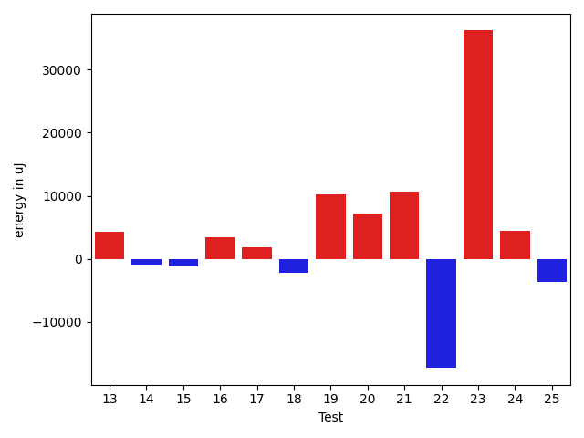

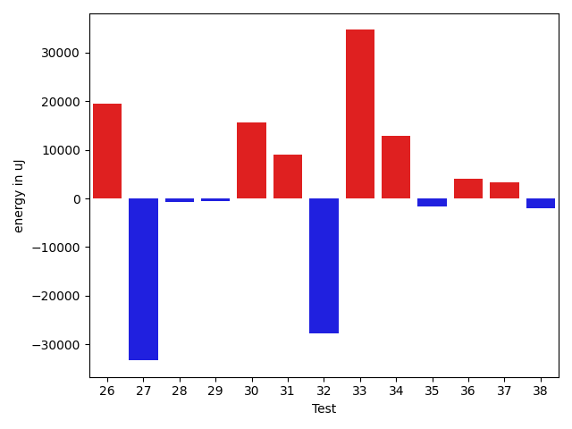

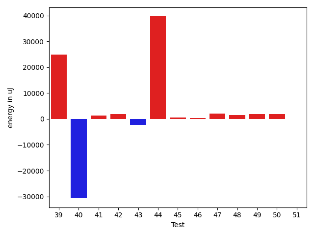

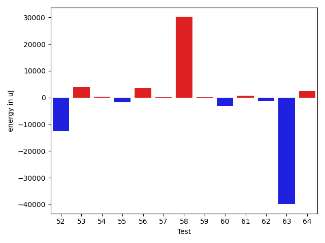

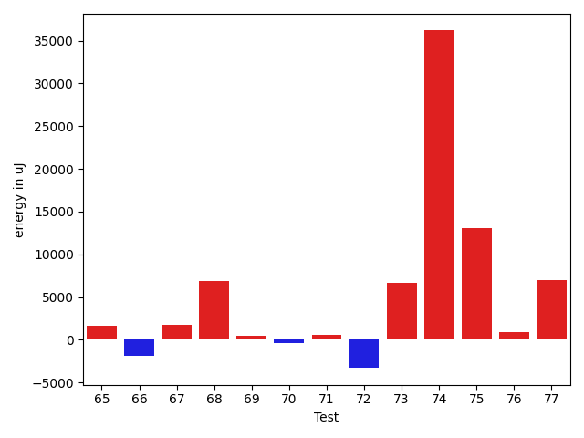

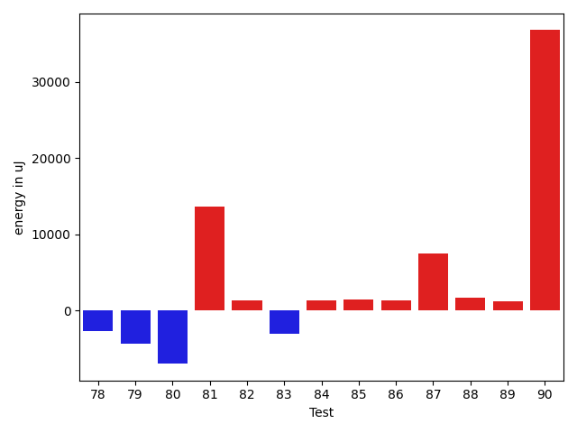

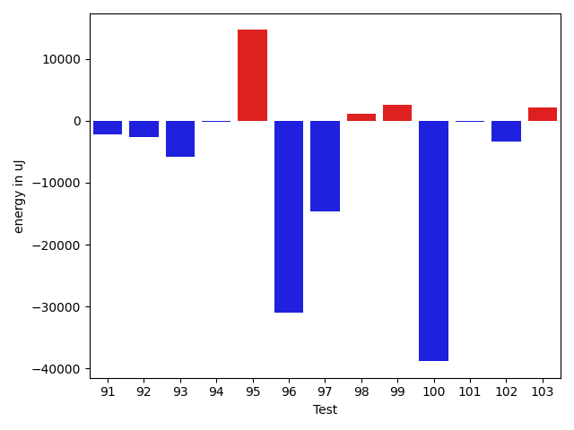

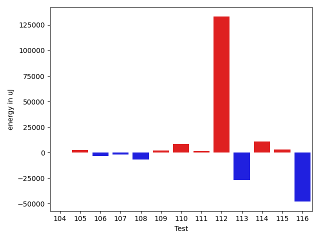

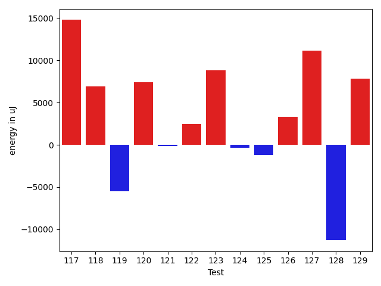

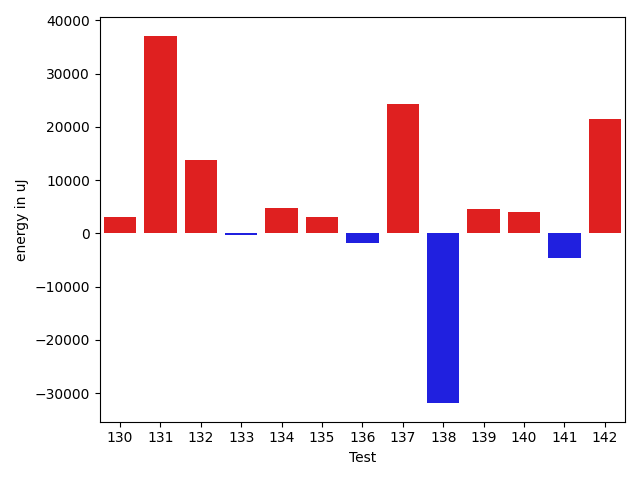

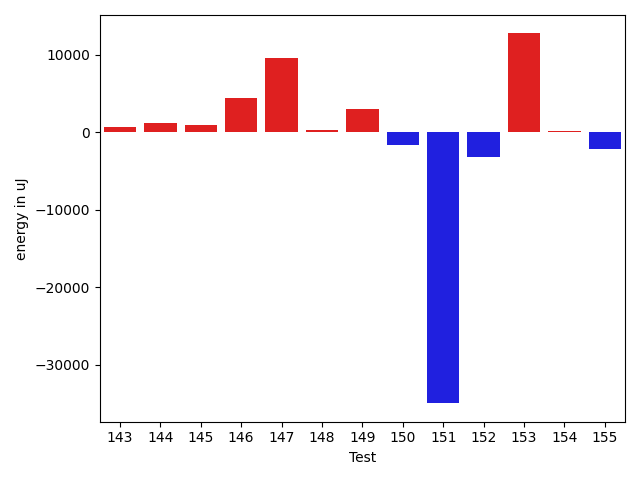

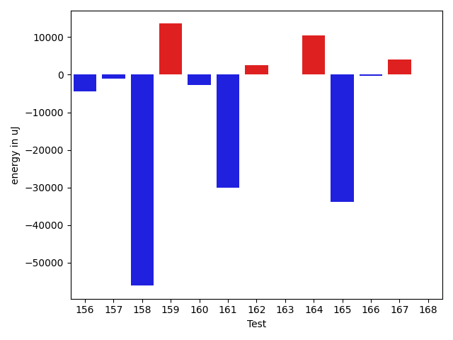

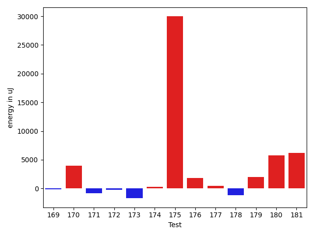

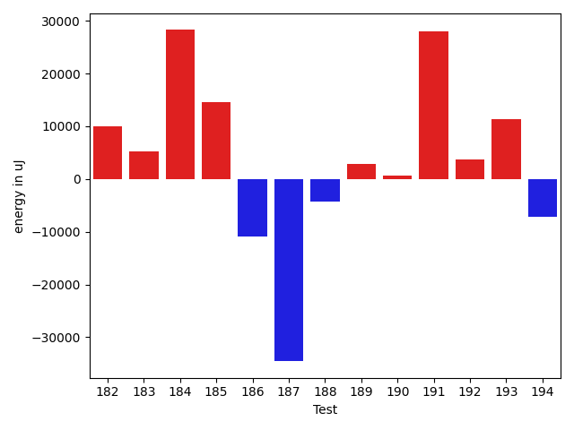

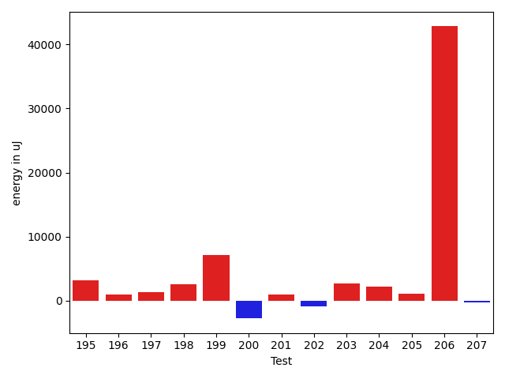

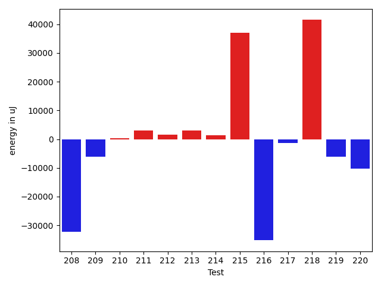

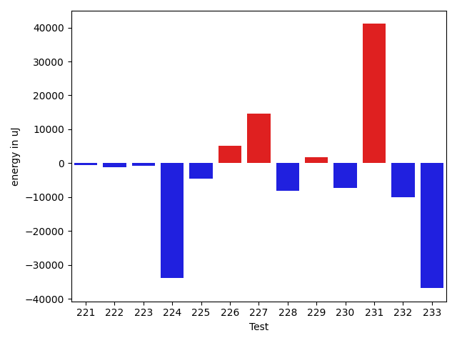

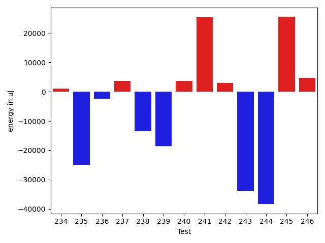

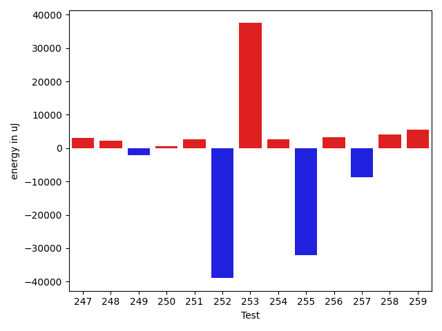

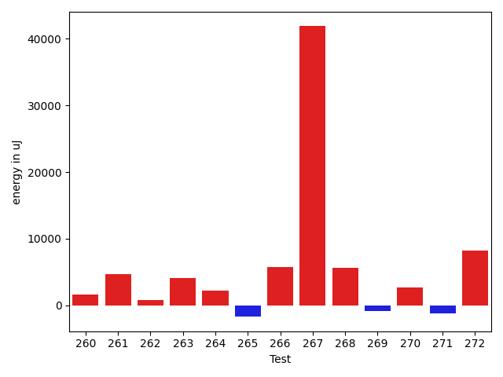

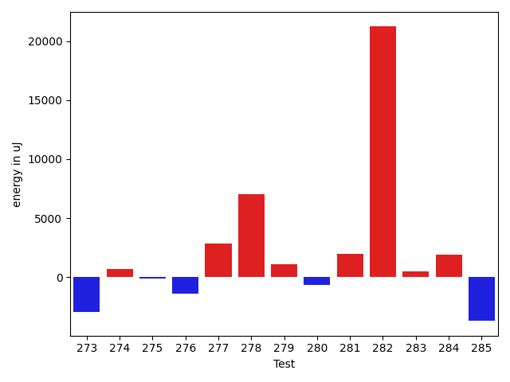

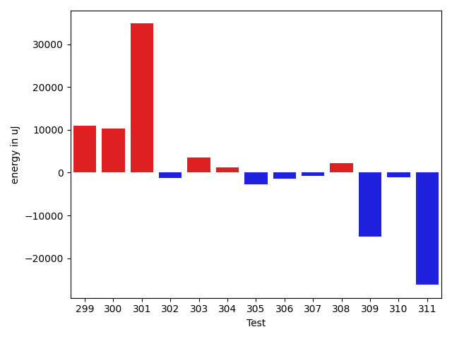

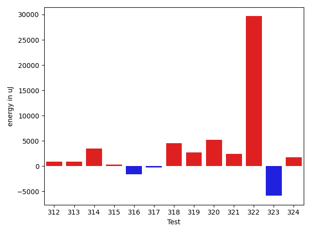

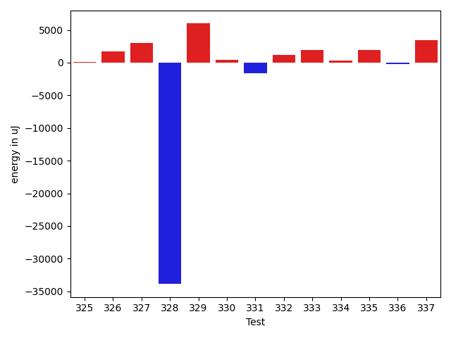

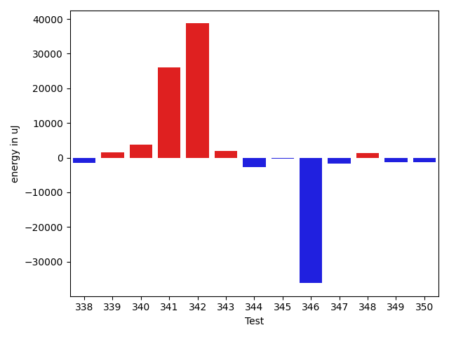

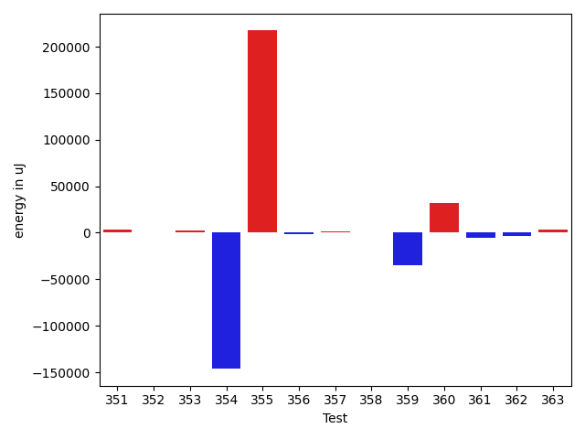

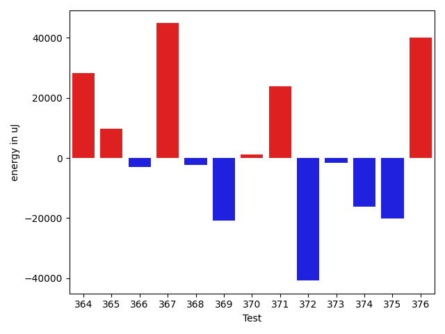

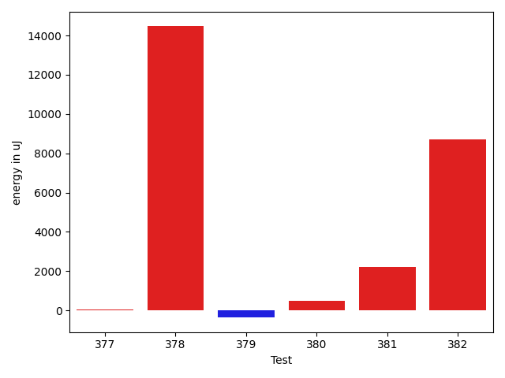

| ID | EnergyV1 | EnergyV2 | DeltaEnergy | σV1 | %σV1 | σV2 | %σV2 |
| --- | --- | --- | --- | --- | --- | --- | --- |
| 0 | 45776 | 86365 | 40589 | 21261.16 | 46.45 | 30640.00 | 35.48 |
| 1 | 88135 | 46814 | -41321 | 18673.24 | 21.19 | 23103.01 | 49.35 |
| 2 | 41016 | 75317 | 34301 | 16155.35 | 39.39 | 22304.12 | 29.61 |
| 3 | 45959 | 89111 | 43152 | 22845.75 | 49.71 | 22363.54 | 25.10 |
| 4 | 83007 | 48645 | -34362 | 15873.64 | 19.12 | 22585.68 | 46.43 |
| 5 | 38514 | 41626 | 3112 | 16191.74 | 42.04 | 21169.02 | 50.86 |
| 6 | 43884 | 47119 | 3235 | 12691.08 | 28.92 | 14818.64 | 31.45 |
| 7 | 43091 | 44555 | 1464 | 21139.43 | 49.06 | 19923.23 | 44.72 |
| 8 | 46692 | 44861 | -1831 | 21664.97 | 46.40 | 15859.85 | 35.35 |
| 9 | 41320 | 39489 | -1831 | 2151.26 | 5.21 | 3338.70 | 8.45 |
| 10 | 46142 | 46325 | 183 | 3312.03 | 7.18 | 2039.51 | 4.40 |
| 11 | 45776 | 47425 | 1649 | 1617.10 | 3.53 | 1566.80 | 3.30 |
| 12 | 46570 | 45776 | -794 | 16899.17 | 36.29 | 16439.96 | 35.91 |
| 13 | 39795 | 44068 | 4273 | 2061.32 | 5.18 | 3441.25 | 7.81 |
| 14 | 39551 | 38635 | -916 | 1858.67 | 4.70 | 1417.53 | 3.67 |
| 15 | 42053 | 40894 | -1159 | 3065.86 | 7.29 | 2153.86 | 5.27 |
| 16 | 40527 | 44006 | 3479 | 2387.39 | 5.89 | 1733.43 | 3.94 |
| 17 | 37353 | 39246 | 1893 | 3288.46 | 8.80 | 3573.96 | 9.11 |
| 18 | 45960 | 43701 | -2259 | 1175.23 | 2.56 | 770.12 | 1.76 |
| 19 | 165527 | 175781 | 10254 | 19876.46 | 12.01 | 7415.65 | 4.22 |
| 20 | 136902 | 144103 | 7201 | 17384.29 | 12.70 | 24179.19 | 16.78 |
| 21 | 155456 | 166137 | 10681 | 143265.73 | 92.16 | 26366.21 | 15.87 |
| 22 | 139953 | 122681 | -17272 | 22148.17 | 15.83 | 21176.71 | 17.26 |
| 23 | 91980 | 128173 | 36193 | 22705.90 | 24.69 | 14228.14 | 11.10 |
| 24 | 86303 | 90820 | 4517 | 22219.04 | 25.75 | 4473.87 | 4.93 |
| 25 | 139160 | 135559 | -3601 | 31721.62 | 22.80 | 19635.21 | 14.48 |
| 26 | 136597 | 156128 | 19531 | 30536.15 | 22.35 | 34289.57 | 21.96 |
| 27 | 157043 | 123718 | -33325 | 19977.65 | 12.72 | 14922.80 | 12.06 |
| 28 | 39795 | 39001 | -794 | 16174.86 | 40.65 | 18762.76 | 48.11 |
| 29 | 44617 | 44068 | -549 | 83993.41 | 188.25 | 1113.37 | 2.53 |
| 30 | 164611 | 180175 | 15564 | 26139.23 | 15.88 | 20356.68 | 11.30 |
| 31 | 128296 | 137268 | 8972 | 18760.43 | 14.62 | 22507.68 | 16.40 |
| 32 | 166382 | 138549 | -27833 | 23122.24 | 13.90 | 23992.70 | 17.32 |
| 33 | 89477 | 124145 | 34668 | 19179.10 | 21.43 | 17602.28 | 14.18 |
| 34 | 82580 | 95520 | 12940 | 157695.84 | 190.96 | 395476.84 | 414.03 |
| 35 | 90942 | 89295 | -1647 | 21595.26 | 23.75 | 14113.65 | 15.81 |
| 36 | 131897 | 135925 | 4028 | 34109.24 | 25.86 | 31279.13 | 23.01 |
| 37 | 134704 | 138000 | 3296 | 20711.64 | 15.38 | 23160.34 | 16.78 |
| 38 | 42724 | 40772 | -1952 | 12188.39 | 28.53 | 15151.31 | 37.16 |
| 39 | 87952 | 112915 | 24963 | 20701.33 | 23.54 | 24724.24 | 21.90 |
| 40 | 76049 | 45349 | -30700 | 19394.27 | 25.50 | 19633.99 | 43.30 |
| 41 | 45166 | 46570 | 1404 | 17174.02 | 38.02 | 23981.79 | 51.50 |
| 42 | 128906 | 130737 | 1831 | 18567.79 | 14.40 | 19099.37 | 14.61 |
| 43 | 119201 | 116943 | -2258 | 16676.31 | 13.99 | 19437.33 | 16.62 |
| 44 | 44434 | 84106 | 39672 | 21258.06 | 47.84 | 22379.65 | 26.61 |
| 45 | 46020 | 46508 | 488 | 2564.66 | 5.57 | 17751.57 | 38.17 |
| 46 | 88622 | 88928 | 306 | 22453.17 | 25.34 | 22245.18 | 25.01 |
| 47 | 45898 | 47974 | 2076 | 2638.14 | 5.75 | 18455.93 | 38.47 |
| 48 | 45777 | 47241 | 1464 | 18339.91 | 40.06 | 14734.45 | 31.19 |
| 49 | 112610 | 114502 | 1892 | 19557.34 | 17.37 | 21200.43 | 18.52 |
| 50 | 42602 | 44494 | 1892 | 17854.20 | 41.91 | 20716.38 | 46.56 |
| 51 | 221008 | 221069 | 61 | 23424.83 | 10.60 | 13650.40 | 6.17 |
| 52 | 655943 | 643431 | -12512 | 31656.51 | 4.83 | 141690.39 | 22.02 |
| 53 | 39795 | 43762 | 3967 | 20573.34 | 51.70 | 20530.81 | 46.91 |
| 54 | 46814 | 47058 | 244 | 11614.14 | 24.81 | 13222.70 | 28.10 |
| 55 | 43946 | 42115 | -1831 | 17623.61 | 40.10 | 15560.58 | 36.95 |
| 56 | 43030 | 46631 | 3601 | 11010.85 | 25.59 | 20565.17 | 44.10 |
| 57 | 43335 | 43457 | 122 | 2282.60 | 5.27 | 2281.94 | 5.25 |
| 58 | 47973 | 78124 | 30151 | 20273.00 | 42.26 | 21150.71 | 27.07 |
| 59 | 80933 | 80994 | 61 | 19741.59 | 24.39 | 16990.36 | 20.98 |
| 60 | 41442 | 38269 | -3173 | 2554.95 | 6.17 | 1346.36 | 3.52 |
| 61 | 46082 | 46875 | 793 | 22433.35 | 48.68 | 21761.70 | 46.42 |
| 62 | 44800 | 43701 | -1099 | 19299.44 | 43.08 | 2533.92 | 5.80 |
| 63 | 88440 | 48584 | -39856 | 21983.59 | 24.86 | 23572.93 | 48.52 |
| 64 | 89966 | 92346 | 2380 | 21017.48 | 23.36 | 38934.97 | 42.16 |
| 65 | 39551 | 41198 | 1647 | 1945.51 | 4.92 | 12777.81 | 31.02 |
| 66 | 39978 | 38147 | -1831 | 17091.61 | 42.75 | 17171.34 | 45.01 |
| 67 | 45654 | 47425 | 1771 | 15645.71 | 34.27 | 19389.74 | 40.89 |
| 68 | 85815 | 92712 | 6897 | 22299.72 | 25.99 | 20449.03 | 22.06 |
| 69 | 46020 | 46509 | 489 | 18413.33 | 40.01 | 14355.72 | 30.87 |
| 70 | 40832 | 40467 | -365 | 13070.44 | 32.01 | 15503.81 | 38.31 |
| 71 | 44556 | 45165 | 609 | 3301.29 | 7.41 | 22711.88 | 50.29 |
| 72 | 47058 | 43762 | -3296 | 1529.71 | 3.25 | 2024.50 | 4.63 |
| 73 | 40711 | 47424 | 6713 | 15275.65 | 37.52 | 23004.49 | 48.51 |
| 74 | 40527 | 76721 | 36194 | 16653.16 | 41.09 | 20438.46 | 26.64 |
| 75 | 125183 | 138245 | 13062 | 14306.02 | 11.43 | 36807.83 | 26.63 |
| 76 | 44067 | 44922 | 855 | 2869.72 | 6.51 | 1847.14 | 4.11 |
| 77 | 219482 | 226501 | 7019 | 11352.97 | 5.17 | 18104.45 | 7.99 |
| 78 | 79102 | 76416 | -2686 | 2602.60 | 3.29 | 19243.90 | 25.18 |
| 79 | 123535 | 119140 | -4395 | 24549.25 | 19.87 | 19465.04 | 16.34 |
| 80 | 42542 | 35522 | -7020 | 12431.00 | 29.22 | 14281.74 | 40.21 |
| 81 | 116577 | 130188 | 13611 | 19795.74 | 16.98 | 21176.50 | 16.27 |
| 82 | 135437 | 136780 | 1343 | 15213.50 | 11.23 | 22606.11 | 16.53 |
| 83 | 133849 | 130798 | -3051 | 15024.59 | 11.23 | 102597.79 | 78.44 |
| 84 | 162536 | 163879 | 1343 | 7929.16 | 4.88 | 25247.34 | 15.41 |
| 85 | 83373 | 84839 | 1466 | 16676.02 | 20.00 | 18529.90 | 21.84 |
| 86 | 44860 | 46204 | 1344 | 1709.75 | 3.81 | 14652.97 | 31.71 |
| 87 | 84533 | 92040 | 7507 | 21759.35 | 25.74 | 24532.52 | 26.65 |
| 88 | 38696 | 40345 | 1649 | 11015.41 | 28.47 | 14748.65 | 36.56 |
| 89 | 89660 | 90881 | 1221 | 42465.94 | 47.36 | 21837.64 | 24.03 |
| 90 | 43640 | 80444 | 36804 | 20210.19 | 46.31 | 17599.99 | 21.88 |
| 91 | 181030 | 178772 | -2258 | 20370.45 | 11.25 | 27713.21 | 15.50 |
| 92 | 192321 | 189697 | -2624 | 23635.20 | 12.29 | 35973.62 | 18.96 |
| 93 | 246337 | 240478 | -5859 | 24441.25 | 9.92 | 18608.89 | 7.74 |
| 94 | 136535 | 136291 | -244 | 20426.24 | 14.96 | 22142.57 | 16.25 |
| 95 | 156616 | 171264 | 14648 | 24155.96 | 15.42 | 17038.36 | 9.95 |
| 96 | 113953 | 82947 | -31006 | 18005.98 | 15.80 | 19830.74 | 23.91 |
| 97 | 207397 | 192749 | -14648 | 31940.75 | 15.40 | 27352.96 | 14.19 |
| 98 | 46814 | 47974 | 1160 | 14243.89 | 30.43 | 15238.64 | 31.76 |
| 99 | 44250 | 46752 | 2502 | 2644.75 | 5.98 | 15531.63 | 33.22 |
| 100 | 121094 | 82275 | -38819 | 24942.47 | 20.60 | 20332.48 | 24.71 |
| 101 | 113586 | 113342 | -244 | 19286.74 | 16.98 | 18479.30 | 16.30 |
| 102 | 116882 | 113586 | -3296 | 19854.52 | 16.99 | 19251.05 | 16.95 |
| 103 | 132934 | 135132 | 2198 | 15625.92 | 11.75 | 21338.79 | 15.79 |
| 104 | 137512 | 137451 | -61 | 29729.95 | 21.62 | 19211.67 | 13.98 |
| 105 | 123290 | 125671 | 2381 | 18691.03 | 15.16 | 22989.73 | 18.29 |
| 106 | 43335 | 40161 | -3174 | 1677.76 | 3.87 | 1054.58 | 2.63 |
| 107 | 86609 | 84778 | -1831 | 21651.94 | 25.00 | 22872.37 | 26.98 |
| 108 | 84899 | 78125 | -6774 | 17046.74 | 20.08 | 17222.26 | 22.04 |
| 109 | 40100 | 42175 | 2075 | 34074.19 | 84.97 | 2114.51 | 5.01 |
| 110 | 115967 | 124450 | 8483 | 21420.25 | 18.47 | 19529.23 | 15.69 |
| 111 | 40771 | 42420 | 1649 | 1992.49 | 4.89 | 1325.65 | 3.13 |
| 112 | 1521054 | 1654110 | 133056 | 121456.92 | 7.99 | 121295.50 | 7.33 |
| 113 | 110717 | 84045 | -26672 | 21920.54 | 19.80 | 38993.33 | 46.40 |
| 114 | 78125 | 88867 | 10742 | 39364.28 | 50.39 | 26861.57 | 30.23 |
| 115 | 126892 | 129761 | 2869 | 20637.46 | 16.26 | 40121.15 | 30.92 |
| 116 | 132934 | 84900 | -48034 | 21837.99 | 16.43 | 19004.26 | 22.38 |
| 117 | 369079 | 383849 | 14770 | 28423.54 | 7.70 | 29991.97 | 7.81 |
| 118 | 238463 | 245360 | 6897 | 20680.48 | 8.67 | 19166.28 | 7.81 |
| 119 | 173644 | 168152 | -5492 | 25818.70 | 14.87 | 18060.52 | 10.74 |
| 120 | 129699 | 137084 | 7385 | 17914.10 | 13.81 | 19550.46 | 14.26 |
| 121 | 267822 | 267699 | -123 | 17874.50 | 6.67 | 15599.79 | 5.83 |
| 122 | 40710 | 43213 | 2503 | 10903.49 | 26.78 | 23518.49 | 54.42 |
| 123 | 83068 | 91857 | 8789 | 22367.07 | 26.93 | 14103.65 | 15.35 |
| 124 | 45410 | 45044 | -366 | 22099.67 | 48.67 | 21938.11 | 48.70 |
| 125 | 94543 | 93323 | -1220 | 21908.52 | 23.17 | 2202.26 | 2.36 |
| 126 | 42114 | 45410 | 3296 | 3546.11 | 8.42 | 11577.16 | 25.49 |
| 127 | 493041 | 504149 | 11108 | 36985.25 | 7.50 | 58489.19 | 11.60 |
| 128 | 87708 | 76416 | -11292 | 17675.92 | 20.15 | 12463.11 | 16.31 |
| 129 | 84777 | 92590 | 7813 | 22252.23 | 26.25 | 48482.62 | 52.36 |
| 130 | 78735 | 81787 | 3052 | 14528.01 | 18.45 | 16285.52 | 19.91 |
| 131 | 41870 | 79040 | 37170 | 18715.43 | 44.70 | 21530.25 | 27.24 |
| 132 | 1039487 | 1053342 | 13855 | 184996.78 | 17.80 | 76458.66 | 7.26 |
| 133 | 81420 | 81115 | -305 | 5849.39 | 7.18 | 17614.97 | 21.72 |
| 134 | 45288 | 50048 | 4760 | 19983.01 | 44.12 | 20110.21 | 40.18 |
| 135 | 88928 | 92041 | 3113 | 5522.45 | 6.21 | 4425.50 | 4.81 |
| 136 | 43273 | 41443 | -1830 | 17004.00 | 39.29 | 2672.96 | 6.45 |
| 137 | 90332 | 114685 | 24353 | 21190.83 | 23.46 | 19107.74 | 16.66 |
| 138 | 545042 | 513121 | -31921 | 20033.03 | 3.68 | 42768.60 | 8.33 |
| 139 | 45105 | 49621 | 4516 | 28886.39 | 64.04 | 31637.06 | 63.76 |
| 140 | 40161 | 44250 | 4089 | 12278.07 | 30.57 | 18621.97 | 42.08 |
| 141 | 43335 | 38635 | -4700 | 18377.08 | 42.41 | 16140.03 | 41.78 |
| 142 | 537780 | 559325 | 21545 | 33842.14 | 6.29 | 43562.02 | 7.79 |
| 143 | 41504 | 42175 | 671 | 2924.01 | 7.05 | 18192.91 | 43.14 |
| 144 | 39916 | 41138 | 1222 | 23742.26 | 59.48 | 15925.34 | 38.71 |
| 145 | 184448 | 185425 | 977 | 22374.18 | 12.13 | 14595.69 | 7.87 |
| 146 | 263610 | 268004 | 4394 | 27592.38 | 10.47 | 105137.93 | 39.23 |
| 147 | 170409 | 179992 | 9583 | 25311.58 | 14.85 | 17261.44 | 9.59 |
| 148 | 46081 | 46326 | 245 | 11982.54 | 26.00 | 14427.69 | 31.14 |
| 149 | 43579 | 46631 | 3052 | 17437.70 | 40.01 | 2918.16 | 6.26 |
| 150 | 40466 | 38880 | -1586 | 14611.16 | 36.11 | 3834.01 | 9.86 |
| 151 | 126098 | 91126 | -34972 | 20317.01 | 16.11 | 24115.22 | 26.46 |
| 152 | 81298 | 78125 | -3173 | 12365.03 | 15.21 | 18512.78 | 23.70 |
| 153 | 408629 | 421386 | 12757 | 52853.53 | 12.93 | 72399.62 | 17.18 |
| 154 | 42053 | 42236 | 183 | 2387.71 | 5.68 | 2923.89 | 6.92 |
| 155 | 44006 | 41809 | -2197 | 2026.24 | 4.60 | 820.39 | 1.96 |
| 156 | 127807 | 123290 | -4517 | 14197.20 | 11.11 | 22138.45 | 17.96 |
| 157 | 94238 | 93140 | -1098 | 23229.14 | 24.65 | 23129.13 | 24.83 |
| 158 | 192016 | 135925 | -56091 | 20090.59 | 10.46 | 20294.47 | 14.93 |
| 159 | 121642 | 135193 | 13551 | 29674.40 | 24.39 | 16677.68 | 12.34 |
| 160 | 125854 | 123046 | -2808 | 15481.65 | 12.30 | 26170.34 | 21.27 |
| 161 | 274170 | 244201 | -29969 | 28550.97 | 10.41 | 21635.86 | 8.86 |
| 162 | 38879 | 41443 | 2564 | 2041.17 | 5.25 | 19765.64 | 47.69 |
| 163 | 82703 | 82764 | 61 | 19837.35 | 23.99 | 11763.10 | 14.21 |
| 164 | 126221 | 136718 | 10497 | 20332.60 | 16.11 | 33524.26 | 24.52 |
| 165 | 81543 | 47668 | -33875 | 19247.74 | 23.60 | 18644.94 | 39.11 |
| 166 | 42846 | 42542 | -304 | 20163.31 | 47.06 | 20207.87 | 47.50 |
| 167 | 121094 | 125183 | 4089 | 4628.04 | 3.82 | 21454.81 | 17.14 |
| 168 | 88256 | 88257 | 1 | 26146.06 | 29.63 | 22242.86 | 25.20 |
| 169 | 44251 | 44128 | -123 | 3517.45 | 7.95 | 2342.67 | 5.31 |
| 170 | 82336 | 86304 | 3968 | 19604.02 | 23.81 | 20057.71 | 23.24 |
| 171 | 118957 | 118163 | -794 | 23891.45 | 20.08 | 4885.36 | 4.13 |
| 172 | 45043 | 44800 | -243 | 2684.72 | 5.96 | 3191.37 | 7.12 |
| 173 | 40344 | 38635 | -1709 | 14610.69 | 36.22 | 3634.71 | 9.41 |
| 174 | 45959 | 46203 | 244 | 2230.33 | 4.85 | 1786.11 | 3.87 |
| 175 | 44922 | 74890 | 29968 | 19630.91 | 43.70 | 18876.96 | 25.21 |
| 176 | 91857 | 93689 | 1832 | 19550.01 | 21.28 | 23660.30 | 25.25 |
| 177 | 39124 | 39551 | 427 | 4161.07 | 10.64 | 3817.36 | 9.65 |
| 178 | 39307 | 38147 | -1160 | 11818.99 | 30.07 | 2297.89 | 6.02 |
| 179 | 43030 | 44983 | 1953 | 3206.11 | 7.45 | 153.00 | 0.34 |
| 180 | 477721 | 483458 | 5737 | 24357.34 | 5.10 | 23358.81 | 4.83 |
| 181 | 228210 | 234375 | 6165 | 25807.74 | 11.31 | 25328.61 | 10.81 |
| 182 | 264708 | 274779 | 10071 | 20557.60 | 7.77 | 32450.56 | 11.81 |
| 183 | 216918 | 222167 | 5249 | 19816.00 | 9.14 | 35717.10 | 16.08 |
| 184 | 125854 | 154113 | 28259 | 28483.09 | 22.63 | 26257.84 | 17.04 |
| 185 | 189147 | 203796 | 14649 | 36547.50 | 19.32 | 26219.70 | 12.87 |
| 186 | 122985 | 112121 | -10864 | 20400.01 | 16.59 | 9452.32 | 8.43 |
| 187 | 75134 | 40588 | -34546 | 14775.89 | 19.67 | 19116.96 | 47.10 |
| 188 | 216735 | 212524 | -4211 | 16260.34 | 7.50 | 16903.50 | 7.95 |
| 189 | 268310 | 271178 | 2868 | 22704.30 | 8.46 | 40005.27 | 14.75 |
| 190 | 266296 | 266967 | 671 | 20753.59 | 7.79 | 23500.82 | 8.80 |
| 191 | 183776 | 211853 | 28077 | 13261.78 | 7.22 | 32958.27 | 15.56 |
| 192 | 268127 | 271789 | 3662 | 24250.28 | 9.04 | 43269.34 | 15.92 |
| 193 | 219543 | 230895 | 11352 | 18848.54 | 8.59 | 46968.62 | 20.34 |
| 194 | 197632 | 190429 | -7203 | 39529.76 | 20.00 | 15938.59 | 8.37 |
| 195 | 309875 | 313049 | 3174 | 30647.46 | 9.89 | 18675.87 | 5.97 |
| 196 | 187988 | 189025 | 1037 | 21433.32 | 11.40 | 21716.21 | 11.49 |
| 197 | 40222 | 41565 | 1343 | 15026.45 | 37.36 | 2125.97 | 5.11 |
| 198 | 43274 | 45898 | 2624 | 1918.69 | 4.43 | 2960.60 | 6.45 |
| 199 | 235717 | 242858 | 7141 | 20024.13 | 8.49 | 32912.78 | 13.55 |
| 200 | 43151 | 40406 | -2745 | 14630.38 | 33.91 | 12772.53 | 31.61 |
| 201 | 43579 | 44556 | 977 | 3104.91 | 7.12 | 23741.54 | 53.28 |
| 202 | 91248 | 90332 | -916 | 24635.81 | 27.00 | 23415.41 | 25.92 |
| 203 | 38269 | 41016 | 2747 | 2181.76 | 5.70 | 2143.32 | 5.23 |
| 204 | 90820 | 93079 | 2259 | 15138.75 | 16.67 | 19875.72 | 21.35 |
| 205 | 40527 | 41687 | 1160 | 1693.09 | 4.18 | 1796.07 | 4.31 |
| 206 | 141723 | 184509 | 42786 | 19254.98 | 13.59 | 16182.16 | 8.77 |
| 207 | 79406 | 79163 | -243 | 2611.61 | 3.29 | 15701.00 | 19.83 |
| 208 | 73364 | 41077 | -32287 | 19330.06 | 26.35 | 21315.39 | 51.89 |
| 209 | 90209 | 84045 | -6164 | 18707.32 | 20.74 | 22044.14 | 26.23 |
| 210 | 46874 | 47119 | 245 | 14965.96 | 31.93 | 22258.27 | 47.24 |
| 211 | 37781 | 40711 | 2930 | 13501.23 | 35.74 | 12487.49 | 30.67 |
| 212 | 43396 | 45043 | 1647 | 2372.58 | 5.47 | 2098.16 | 4.66 |
| 213 | 86059 | 89111 | 3052 | 14281.73 | 16.60 | 13301.21 | 14.93 |
| 214 | 41076 | 42420 | 1344 | 2470.79 | 6.02 | 17133.20 | 40.39 |
| 215 | 46143 | 83130 | 36987 | 19475.37 | 42.21 | 22067.55 | 26.55 |
| 216 | 81420 | 46204 | -35216 | 21351.95 | 26.22 | 20859.32 | 45.15 |
| 217 | 46326 | 45044 | -1282 | 26591.13 | 57.40 | 21496.32 | 47.72 |
| 218 | 46082 | 87585 | 41503 | 21202.40 | 46.01 | 19446.63 | 22.20 |
| 219 | 128478 | 122436 | -6042 | 23883.63 | 18.59 | 16572.27 | 13.54 |
| 220 | 89600 | 79406 | -10194 | 16433.38 | 18.34 | 22540.49 | 28.39 |
| 221 | 83252 | 82764 | -488 | 19556.61 | 23.49 | 13424.76 | 16.22 |
| 222 | 39490 | 38330 | -1160 | 15001.65 | 37.99 | 10953.46 | 28.58 |
| 223 | 46752 | 46081 | -671 | 27341.28 | 58.48 | 17868.50 | 38.78 |
| 224 | 1654049 | 1620174 | -33875 | 171720.17 | 10.38 | 256328.71 | 15.82 |
| 225 | 1652339 | 1647822 | -4517 | 348738.34 | 21.11 | 630179.40 | 38.24 |
| 226 | 82031 | 87220 | 5189 | 19525.77 | 23.80 | 20911.96 | 23.98 |
| 227 | 118957 | 133667 | 14710 | 15832.26 | 13.31 | 52158.24 | 39.02 |
| 228 | 1523678 | 1515499 | -8179 | 88175.96 | 5.79 | 53786.16 | 3.55 |
| 229 | 45898 | 47607 | 1709 | 1655.74 | 3.61 | 2727.78 | 5.73 |
| 230 | 135010 | 127624 | -7386 | 15837.86 | 11.73 | 19132.44 | 14.99 |
| 231 | 94788 | 135864 | 41076 | 44552.84 | 47.00 | 24812.94 | 18.26 |
| 232 | 126526 | 116516 | -10010 | 24545.64 | 19.40 | 23091.14 | 19.82 |
| 233 | 84594 | 47730 | -36864 | 22379.59 | 26.46 | 17992.03 | 37.70 |
| 234 | 317687 | 318725 | 1038 | 15056.45 | 4.74 | 16709.66 | 5.24 |
| 235 | 179321 | 154358 | -24963 | 27459.47 | 15.31 | 35373.66 | 22.92 |
| 236 | 153381 | 151001 | -2380 | 23578.17 | 15.37 | 33708.69 | 22.32 |
| 237 | 118652 | 122314 | 3662 | 20347.65 | 17.15 | 15378.90 | 12.57 |
| 238 | 171387 | 158020 | -13367 | 21318.01 | 12.44 | 32843.02 | 20.78 |
| 239 | 232604 | 214049 | -18555 | 15942.12 | 6.85 | 36916.42 | 17.25 |
| 240 | 114501 | 118103 | 3602 | 18033.83 | 15.75 | 16684.31 | 14.13 |
| 241 | 296508 | 321899 | 25391 | 37398.96 | 12.61 | 46738.53 | 14.52 |
| 242 | 179382 | 182373 | 2991 | 6850.47 | 3.82 | 18694.42 | 10.25 |
| 243 | 77210 | 43396 | -33814 | 16128.52 | 20.89 | 3173.67 | 7.31 |
| 244 | 80322 | 41993 | -38329 | 20945.60 | 26.08 | 19489.02 | 46.41 |
| 245 | 329650 | 355101 | 25451 | 29665.47 | 9.00 | 33174.05 | 9.34 |
| 246 | 86243 | 90820 | 4577 | 13981.18 | 16.21 | 17277.61 | 19.02 |
| 247 | 44739 | 47791 | 3052 | 3713.56 | 8.30 | 2123.13 | 4.44 |
| 248 | 37536 | 39673 | 2137 | 2477.22 | 6.60 | 11529.99 | 29.06 |
| 249 | 45959 | 43823 | -2136 | 20043.86 | 43.61 | 15419.14 | 35.19 |
| 250 | 41443 | 41931 | 488 | 1905.48 | 4.60 | 2442.16 | 5.82 |
| 251 | 43457 | 46203 | 2746 | 2768.49 | 6.37 | 2515.07 | 5.44 |
| 252 | 133117 | 94177 | -38940 | 21857.29 | 16.42 | 21904.51 | 23.26 |
| 253 | 49194 | 86670 | 37476 | 23524.42 | 47.82 | 22326.93 | 25.76 |
| 254 | 43212 | 45960 | 2748 | 2513.06 | 5.82 | 19322.42 | 42.04 |
| 255 | 110779 | 78735 | -32044 | 21836.45 | 19.71 | 23332.12 | 29.63 |
| 256 | 87769 | 91064 | 3295 | 16362.45 | 18.64 | 20131.48 | 22.11 |
| 257 | 140503 | 131775 | -8728 | 26257.18 | 18.69 | 13959.98 | 10.59 |
| 258 | 198119 | 202270 | 4151 | 24801.20 | 12.52 | 37790.83 | 18.68 |
| 259 | 87890 | 93505 | 5615 | 33230.93 | 37.81 | 3398.88 | 3.63 |
| 260 | 91796 | 93445 | 1649 | 13880.10 | 15.12 | 14573.92 | 15.60 |
| 261 | 86852 | 91492 | 4640 | 12286.05 | 14.15 | 4773.03 | 5.22 |
| 262 | 37658 | 38452 | 794 | 15834.46 | 42.05 | 11603.40 | 30.18 |
| 263 | 41504 | 45593 | 4089 | 18442.03 | 44.43 | 19405.08 | 42.56 |
| 264 | 89660 | 91919 | 2259 | 28622.96 | 31.92 | 20573.94 | 22.38 |
| 265 | 43640 | 41931 | -1709 | 19744.52 | 45.24 | 13782.32 | 32.87 |
| 266 | 203613 | 209411 | 5798 | 19257.31 | 9.46 | 20240.31 | 9.67 |
| 267 | 139526 | 181396 | 41870 | 20897.50 | 14.98 | 22027.79 | 12.14 |
| 268 | 189391 | 195068 | 5677 | 24034.28 | 12.69 | 19441.89 | 9.97 |
| 269 | 42541 | 41626 | -915 | 10893.86 | 25.61 | 19150.32 | 46.01 |
| 270 | 130004 | 132629 | 2625 | 18850.59 | 14.50 | 39023.18 | 29.42 |
| 271 | 72754 | 71533 | -1221 | 5071.54 | 6.97 | 22330.70 | 31.22 |
| 272 | 169250 | 177490 | 8240 | 22026.11 | 13.01 | 23064.71 | 12.99 |
| 273 | 200866 | 197876 | -2990 | 47393.48 | 23.59 | 14482.68 | 7.32 |
| 274 | 84778 | 85449 | 671 | 14409.87 | 17.00 | 15726.00 | 18.40 |
| 275 | 91248 | 91125 | -123 | 14531.23 | 15.92 | 18115.86 | 19.88 |
| 276 | 137512 | 136108 | -1404 | 14999.84 | 10.91 | 19392.15 | 14.25 |
| 277 | 177734 | 180602 | 2868 | 22477.66 | 12.65 | 22037.25 | 12.20 |
| 278 | 168762 | 175781 | 7019 | 21579.03 | 12.79 | 35656.09 | 20.28 |
| 279 | 136230 | 137329 | 1099 | 19028.07 | 13.97 | 22761.39 | 16.57 |
| 280 | 156310 | 155639 | -671 | 2929.54 | 1.87 | 5694.68 | 3.66 |
| 281 | 44799 | 46753 | 1954 | 2849.25 | 6.36 | 21347.92 | 45.66 |
| 282 | 275390 | 296630 | 21240 | 23161.90 | 8.41 | 22124.78 | 7.46 |
| 283 | 188293 | 188781 | 488 | 27015.41 | 14.35 | 15702.20 | 8.32 |
| 284 | 81298 | 83191 | 1893 | 20215.94 | 24.87 | 23310.38 | 28.02 |
| 285 | 46021 | 42298 | -3723 | 14640.88 | 31.81 | 15362.76 | 36.32 |
| 286 | 208496 | 188903 | -19593 | 142205.69 | 68.21 | 21694.52 | 11.48 |
| 287 | 41748 | 39856 | -1892 | 17542.84 | 42.02 | 23922.61 | 60.02 |
| 288 | 184570 | 225647 | 41077 | 18418.97 | 9.98 | 21144.32 | 9.37 |
| 289 | 40650 | 38635 | -2015 | 3634.19 | 8.94 | 15470.66 | 40.04 |
| 290 | 138305 | 139770 | 1465 | 23414.82 | 16.93 | 18177.42 | 13.01 |
| 291 | 45349 | 89050 | 43701 | 15333.52 | 33.81 | 18773.67 | 21.08 |
| 292 | 283691 | 273193 | -10498 | 41775.97 | 14.73 | 87600.64 | 32.07 |
| 293 | 501036 | 528441 | 27405 | 28360.31 | 5.66 | 51929.33 | 9.83 |
| 294 | 80750 | 111083 | 30333 | 18514.67 | 22.93 | 18384.41 | 16.55 |
| 295 | 82581 | 86548 | 3967 | 21868.77 | 26.48 | 28172.41 | 32.55 |
| 296 | 42785 | 44006 | 1221 | 18232.36 | 42.61 | 16242.85 | 36.91 |
| 297 | 47485 | 44128 | -3357 | 19662.79 | 41.41 | 22536.40 | 51.07 |
| 298 | 47241 | 48157 | 916 | 22483.12 | 47.59 | 23229.69 | 48.24 |
| 299 | 80078 | 91064 | 10986 | 19423.53 | 24.26 | 30569.39 | 33.57 |
| 300 | 119323 | 129578 | 10255 | 14931.84 | 12.51 | 23270.64 | 17.96 |
| 301 | 41382 | 76171 | 34789 | 19951.12 | 48.21 | 20952.76 | 27.51 |
| 302 | 72388 | 71166 | -1222 | 21491.01 | 29.69 | 21075.90 | 29.62 |
| 303 | 80566 | 84167 | 3601 | 28915.52 | 35.89 | 21523.36 | 25.57 |
| 304 | 40528 | 41748 | 1220 | 16077.77 | 39.67 | 11723.90 | 28.08 |
| 305 | 44433 | 41748 | -2685 | 16768.71 | 37.74 | 18840.43 | 45.13 |
| 306 | 79284 | 77820 | -1464 | 4455.96 | 5.62 | 20809.10 | 26.74 |
| 307 | 47852 | 47058 | -794 | 14391.70 | 30.08 | 15315.88 | 32.55 |
| 308 | 87463 | 89661 | 2198 | 15179.94 | 17.36 | 22519.18 | 25.12 |
| 309 | 246887 | 231933 | -14954 | 24726.20 | 10.02 | 37172.48 | 16.03 |
| 310 | 40955 | 39917 | -1038 | 10525.21 | 25.70 | 2847.41 | 7.13 |
| 311 | 71533 | 45349 | -26184 | 20137.53 | 28.15 | 22653.64 | 49.95 |
| 312 | 47058 | 47912 | 854 | 22758.63 | 48.36 | 22690.90 | 47.36 |
| 313 | 90453 | 91309 | 856 | 20766.17 | 22.96 | 13704.70 | 15.01 |
| 314 | 116272 | 119751 | 3479 | 26118.73 | 22.46 | 14072.77 | 11.75 |
| 315 | 76355 | 76660 | 305 | 12956.06 | 16.97 | 11305.26 | 14.75 |
| 316 | 77393 | 75805 | -1588 | 12633.72 | 16.32 | 1009.92 | 1.33 |
| 317 | 88135 | 87830 | -305 | 12313.75 | 13.97 | 4043.48 | 4.60 |
| 318 | 81726 | 86304 | 4578 | 17675.42 | 21.63 | 20051.91 | 23.23 |
| 319 | 81970 | 84717 | 2747 | 23938.10 | 29.20 | 4580.92 | 5.41 |
| 320 | 92834 | 98083 | 5249 | 31043.17 | 33.44 | 40045.78 | 40.83 |
| 321 | 161071 | 163452 | 2381 | 9236.70 | 5.73 | 9150.40 | 5.60 |
| 322 | 47180 | 76843 | 29663 | 23578.96 | 49.98 | 21290.48 | 27.71 |
| 323 | 80322 | 74463 | -5859 | 36001.58 | 44.82 | 16626.71 | 22.33 |
| 324 | 88806 | 90576 | 1770 | 22204.56 | 25.00 | 20633.75 | 22.78 |
| 325 | 45349 | 45471 | 122 | 19732.06 | 43.51 | 19031.90 | 41.86 |
| 326 | 39307 | 41016 | 1709 | 19980.47 | 50.83 | 17765.62 | 43.31 |
| 327 | 224853 | 227904 | 3051 | 18521.12 | 8.24 | 18356.20 | 8.05 |
| 328 | 75744 | 41870 | -33874 | 19323.45 | 25.51 | 17480.94 | 41.75 |
| 329 | 157226 | 163207 | 5981 | 6195.47 | 3.94 | 25724.70 | 15.76 |
| 330 | 186035 | 186462 | 427 | 16589.75 | 8.92 | 16575.66 | 8.89 |
| 331 | 40222 | 38635 | -1587 | 3023.72 | 7.52 | 2663.36 | 6.89 |
| 332 | 40344 | 41504 | 1160 | 15904.98 | 39.42 | 13630.82 | 32.84 |
| 333 | 45593 | 47546 | 1953 | 21431.86 | 47.01 | 18016.20 | 37.89 |
| 334 | 46081 | 46387 | 306 | 21560.97 | 46.79 | 17464.48 | 37.65 |
| 335 | 41992 | 43945 | 1953 | 14825.75 | 35.31 | 3607.16 | 8.21 |
| 336 | 42297 | 42053 | -244 | 1585.88 | 3.75 | 2906.40 | 6.91 |
| 337 | 78491 | 81970 | 3479 | 18883.73 | 24.06 | 22620.27 | 27.60 |
| 338 | 43762 | 42297 | -1465 | 1579.95 | 3.61 | 1217.54 | 2.88 |
| 339 | 42358 | 43945 | 1587 | 1390.44 | 3.28 | 1821.45 | 4.14 |
| 340 | 44617 | 48400 | 3783 | 546.82 | 1.23 | 3290.66 | 6.80 |
| 341 | 156982 | 182983 | 26001 | 20573.77 | 13.11 | 19414.33 | 10.61 |
| 342 | 175842 | 214538 | 38696 | 25619.16 | 14.57 | 26075.80 | 12.15 |
| 343 | 377257 | 379210 | 1953 | 38914.26 | 10.32 | 47801.39 | 12.61 |
| 344 | 140503 | 137817 | -2686 | 20795.15 | 14.80 | 21997.83 | 15.96 |
| 345 | 155029 | 154663 | -366 | 16437.20 | 10.60 | 26918.99 | 17.40 |
| 346 | 81177 | 44983 | -36194 | 21997.03 | 27.10 | 19628.94 | 43.64 |
| 347 | 80078 | 78430 | -1648 | 3853.97 | 4.81 | 17538.82 | 22.36 |
| 348 | 38819 | 40100 | 1281 | 12467.53 | 32.12 | 1520.10 | 3.79 |
| 349 | 42725 | 41503 | -1222 | 21030.75 | 49.22 | 17761.34 | 42.80 |
| 350 | 80933 | 79590 | -1343 | 19574.92 | 24.19 | 20457.79 | 25.70 |
| 351 | 88135 | 91980 | 3845 | 2723.11 | 3.09 | 14563.73 | 15.83 |
| 352 | 40344 | 40954 | 610 | 2825.10 | 7.00 | 3001.14 | 7.33 |
| 353 | 74584 | 76965 | 2381 | 29956.71 | 40.17 | 16026.92 | 20.82 |
| 354 | 4437123 | 4290883 | -146240 | 786506.35 | 17.73 | 498611.76 | 11.62 |
| 355 | 3444755 | 3662039 | 217284 | 579003.28 | 16.81 | 308919.73 | 8.44 |
| 356 | 126037 | 124633 | -1404 | 30396.78 | 24.12 | 18422.65 | 14.78 |
| 357 | 46631 | 47607 | 976 | 22749.04 | 48.79 | 22356.42 | 46.96 |
| 358 | 78186 | 78735 | 549 | 20029.02 | 25.62 | 20179.63 | 25.63 |
| 359 | 75561 | 40283 | -35278 | 19396.88 | 25.67 | 13243.89 | 32.88 |
| 360 | 42541 | 74157 | 31616 | 19224.22 | 45.19 | 20419.20 | 27.54 |
| 361 | 82703 | 77454 | -5249 | 12708.21 | 15.37 | 17966.07 | 23.20 |
| 362 | 44861 | 41565 | -3296 | 21568.23 | 48.08 | 16545.95 | 39.81 |
| 363 | 80932 | 84046 | 3114 | 21089.70 | 26.06 | 14063.21 | 16.73 |
| 364 | 45593 | 73914 | 28321 | 20046.36 | 43.97 | 19616.01 | 26.54 |
| 365 | 294677 | 304442 | 9765 | 35516.62 | 12.05 | 28087.15 | 9.23 |
| 366 | 156250 | 153198 | -3052 | 12788.17 | 8.18 | 22642.30 | 14.78 |
| 367 | 48828 | 93628 | 44800 | 22994.19 | 47.09 | 20199.29 | 21.57 |
| 368 | 184997 | 182800 | -2197 | 18450.40 | 9.97 | 15992.34 | 8.75 |
| 369 | 338134 | 317382 | -20752 | 47775.34 | 14.13 | 30024.79 | 9.46 |
| 370 | 88134 | 89356 | 1222 | 20866.87 | 23.68 | 45962.96 | 51.44 |
| 371 | 202209 | 226074 | 23865 | 35575.69 | 17.59 | 44816.61 | 19.82 |
| 372 | 88073 | 47303 | -40770 | 22214.69 | 25.22 | 22678.33 | 47.94 |
| 373 | 41992 | 40283 | -1709 | 1876.22 | 4.47 | 2703.24 | 6.71 |
| 374 | 509703 | 493407 | -16296 | 55460.69 | 10.88 | 42049.48 | 8.52 |
| 375 | 186462 | 166320 | -20142 | 53657.75 | 28.78 | 26489.20 | 15.93 |
| 376 | 139709 | 179870 | 40161 | 16094.48 | 11.52 | 32736.80 | 18.20 |
| 377 | 135193 | 135253 | 60 | 14789.08 | 10.94 | 22204.67 | 16.42 |
| 378 | 625364 | 639830 | 14466 | 50313.86 | 8.05 | 69922.48 | 10.93 |
| 379 | 37354 | 36987 | -367 | 1092.47 | 2.92 | 2708.77 | 7.32 |
| 380 | 81970 | 82458 | 488 | 18920.53 | 23.08 | 25409.05 | 30.81 |
| 381 | 160400 | 162598 | 2198 | 26669.03 | 16.63 | 12164.58 | 7.48 |
| 382 | 295348 | 304076 | 8728 | 26975.66 | 9.13 | 15507.31 | 5.10 |

## Misc.

| ID | Test Class | Test Method |
| --- | --- | --- |
| 0 | com.google.gson.functional.TypeAdapterPrecedenceTest | testStreamingFollowedByNonstreaming |
| 1 | com.google.gson.functional.TypeAdapterPrecedenceTest | testStreamingHierarchicalFollowedByNonstreaming |
| 2 | com.google.gson.functional.TypeAdapterPrecedenceTest | testSerializeNonstreamingTypeAdapterFollowedByStreamingTypeAdapter |
| 3 | com.google.gson.functional.TypeAdapterPrecedenceTest | testNonstreamingHierarchicalFollowedByNonstreaming |
| 4 | com.google.gson.functional.TypeAdapterPrecedenceTest | testStreamingHierarchicalFollowedByNonstreamingHierarchical |
| 5 | com.google.gson.functional.TypeAdapterPrecedenceTest | testNonstreamingFollowedByNonstreaming |
| 6 | com.google.gson.functional.TypeAdapterPrecedenceTest | testStreamingFollowedByStreaming |
| 7 | com.google.gson.functional.TypeAdapterPrecedenceTest | testStreamingFollowedByNonstreamingHierarchical |
| 8 | com.google.gson.functional.PrimitiveTest | testDeserializePrimitiveWrapperAsObjectField |
| 9 | com.google.gson.functional.PrimitiveTest | testMoreSpecificSerialization |
| 10 | com.google.gson.functional.PrimitiveTest | testDoubleInfinitySerialization |
| 11 | com.google.gson.functional.PrimitiveTest | testLongAsStringDeserialization |
| 12 | com.google.gson.functional.PrimitiveTest | testHtmlCharacterSerialization |
| 13 | com.google.gson.functional.PrimitiveTest | testNegativeInfinitySerialization |
| 14 | com.google.gson.functional.PrimitiveTest | testLongAsStringSerialization |
| 15 | com.google.gson.functional.PrimitiveTest | testFloatNaNSerialization |
| 16 | com.google.gson.functional.PrimitiveTest | testNegativeInfinityFloatSerialization |
| 17 | com.google.gson.functional.PrimitiveTest | testFloatInfinitySerialization |
| 18 | com.google.gson.functional.PrimitiveTest | testDoubleNaNSerialization |
| 19 | com.google.gson.functional.CustomTypeAdaptersTest | testCustomAdapterInvokedForCollectionElementDeserialization |
| 20 | com.google.gson.functional.CustomTypeAdaptersTest | testCustomTypeAdapterAppliesToSubClassesSerializedAsBaseClass |
| 21 | com.google.gson.functional.CustomTypeAdaptersTest | testCustomAdapterInvokedForMapElementDeserialization |
| 22 | com.google.gson.functional.CustomTypeAdaptersTest | testCustomAdapterInvokedForMapElementSerializationWithType |
| 23 | com.google.gson.functional.CustomTypeAdaptersTest | testCustomNestedSerializers |
| 24 | com.google.gson.functional.CustomTypeAdaptersTest | testCustomAdapterInvokedForMapElementSerialization |
| 25 | com.google.gson.functional.CustomTypeAdaptersTest | testCustomSerializers |
| 26 | com.google.gson.functional.CustomTypeAdaptersTest | testCustomNestedDeserializers |
| 27 | com.google.gson.functional.CustomTypeAdaptersTest | testCustomTypeAdapterDoesNotAppliesToSubClasses |
| 28 | com.google.gson.functional.CustomTypeAdaptersTest | testCustomAdapterInvokedForCollectionElementSerialization |
| 29 | com.google.gson.functional.CustomTypeAdaptersTest | testRegisterHierarchyAdapterForDate |
| 30 | com.google.gson.functional.CustomTypeAdaptersTest | testCustomAdapterInvokedForCollectionElementSerializationWithType |
| 31 | com.google.gson.functional.CustomTypeAdaptersTest | testCustomDeserializers |
| 32 | com.google.gson.functional.CustomTypeAdaptersTest | testCustomByteArrayDeserializerAndInstanceCreator |
| 33 | com.google.gson.functional.CustomTypeAdaptersTest | testCustomByteArraySerializer |
| 34 | com.google.gson.functional.CustomTypeAdaptersTest | testEnsureCustomSerializerNotInvokedForNullValues |
| 35 | com.google.gson.functional.CustomTypeAdaptersTest | testEnsureCustomDeserializerNotInvokedForNullValues |
| 36 | com.google.gson.functional.CustomTypeAdaptersTest | testCustomDeserializerInvokedForPrimitives |
| 37 | com.google.gson.functional.CustomTypeAdaptersTest | testCustomSerializerInvokedForPrimitives |
| 38 | com.google.gson.functional.ObjectTest | testStringFieldWithEmptyValueDeserialization |
| 39 | com.google.gson.functional.ObjectTest | testNullObjectFieldsDeserialization |
| 40 | com.google.gson.functional.ObjectTest | testEmptyCollectionInAnObjectDeserialization |
| 41 | com.google.gson.functional.ObjectTest | testNestedSerialization |
| 42 | com.google.gson.functional.ObjectTest | testArrayOfArraysDeserialization |
| 43 | com.google.gson.functional.ObjectTest | testSingletonLists |
| 44 | com.google.gson.functional.ObjectTest | testNullFieldsSerialization |
| 45 | com.google.gson.functional.ObjectTest | testClassWithNoFieldsDeserialization |
| 46 | com.google.gson.functional.ObjectTest | testClassWithTransientFieldsDeserialization |
| 47 | com.google.gson.functional.ObjectTest | testStringFieldWithNumberValueDeserialization |
| 48 | com.google.gson.functional.ObjectTest | testPrivateNoArgConstructorDeserialization |
| 49 | com.google.gson.functional.ObjectTest | testArrayOfObjectsAsFields |
| 50 | com.google.gson.functional.ObjectTest | testClassWithTransientFieldsDeserializationTransientFieldsPassedInJsonAreIgnored |
| 51 | com.google.gson.functional.ObjectTest | testAnonymousLocalClassesCustomSerialization |
| 52 | com.google.gson.functional.ObjectTest | testDateAsMapObjectField |
| 53 | com.google.gson.functional.ObjectTest | testPrimitiveArrayFieldSerialization |
| 54 | com.google.gson.functional.ObjectTest | testPrimitiveArrayInAnObjectDeserialization |
| 55 | com.google.gson.functional.ObjectTest | testClassWithNoFieldsSerialization |
| 56 | com.google.gson.functional.ObjectTest | testStringFieldWithEmptyValueSerialization |
| 57 | com.google.gson.functional.ObjectTest | testNullArraysDeserialization |
| 58 | com.google.gson.functional.ObjectTest | testInnerClassSerialization |
| 59 | com.google.gson.functional.ObjectTest | testEmptyCollectionInAnObjectSerialization |
| 60 | com.google.gson.functional.ObjectTest | testClassWithObjectFieldSerialization |
| 61 | com.google.gson.functional.ObjectTest | testBagOfPrimitiveWrappersSerialization |
| 62 | com.google.gson.functional.ObjectTest | testObjectFieldNamesWithoutQuotesDeserialization |
| 63 | com.google.gson.functional.ObjectTest | testArrayOfObjectsDeserialization |
| 64 | com.google.gson.functional.ObjectTest | testArrayOfArraysSerialization |
| 65 | com.google.gson.functional.ObjectTest | testJsonInSingleQuotesDeserialization |
| 66 | com.google.gson.functional.ObjectTest | testBagOfPrimitivesSerialization |
| 67 | com.google.gson.functional.ObjectTest | testNestedDeserialization |
| 68 | com.google.gson.functional.ObjectTest | testBagOfPrimitiveWrappersDeserialization |
| 69 | com.google.gson.functional.ObjectTest | testJsonInMixedQuotesDeserialization |
| 70 | com.google.gson.functional.ObjectTest | testNullFieldsDeserialization |
| 71 | com.google.gson.functional.ObjectTest | testArrayOfObjectsSerialization |
| 72 | com.google.gson.functional.ObjectTest | testClassWithTransientFieldsSerialization |
| 73 | com.google.gson.functional.ObjectTest | testNullPrimitiveFieldsDeserialization |
| 74 | com.google.gson.functional.ObjectTest | testBagOfPrimitivesDeserialization |
| 75 | com.google.gson.functional.ObjectTest | testInnerClassDeserialization |
| 76 | com.google.gson.functional.ObjectTest | testJsonObjectSerialization |
| 77 | com.google.gson.functional.StreamingTypeAdaptersTest | testNullSafe |
| 78 | com.google.gson.functional.StreamingTypeAdaptersTest | testSerializeWithCustomTypeAdapter |
| 79 | com.google.gson.functional.StreamingTypeAdaptersTest | testDeserializeWithCustomTypeAdapter |
| 80 | com.google.gson.functional.StreamingTypeAdaptersTest | testSerializeRecursive |
| 81 | com.google.gson.functional.JsonAdapterAnnotationOnClassesTest | testJsonAdapterInvoked |
| 82 | com.google.gson.functional.JsonAdapterAnnotationOnClassesTest | testRegisteredAdapterOverridesJsonAdapter |
| 83 | com.google.gson.functional.JsonAdapterAnnotationOnClassesTest | testRegisteredDeserializerOverridesJsonAdapter |
| 84 | com.google.gson.functional.JsonAdapterAnnotationOnClassesTest | testRegisteredSerializerOverridesJsonAdapter |
| 85 | com.google.gson.functional.JsonAdapterAnnotationOnClassesTest | testSuperclassTypeAdapterNotInvoked |
| 86 | com.google.gson.functional.JsonAdapterAnnotationOnClassesTest | testNullSafeObjectFromJson |
| 87 | com.google.gson.functional.JsonAdapterAnnotationOnClassesTest | testIncorrectTypeAdapterFails |
| 88 | com.google.gson.functional.JsonAdapterAnnotationOnClassesTest | testJsonAdapterFactoryInvoked |
| 89 | com.google.gson.functional.CustomDeserializerTest | testDefaultConstructorNotCalledOnField |
| 90 | com.google.gson.functional.CustomDeserializerTest | testDefaultConstructorNotCalledOnObject |
| 91 | com.google.gson.functional.CustomDeserializerTest | testCustomDeserializerReturnsNullForArrayElementsForArrayField |
| 92 | com.google.gson.functional.CustomDeserializerTest | testCustomDeserializerReturnsNull |
| 93 | com.google.gson.functional.CustomDeserializerTest | testJsonTypeFieldBasedDeserialization |
| 94 | com.google.gson.functional.CustomDeserializerTest | testCustomDeserializerReturnsNullForArrayElements |
| 95 | com.google.gson.functional.CustomDeserializerTest | testCustomDeserializerReturnsNullForTopLevelObject |
| 96 | com.google.gson.functional.ExclusionStrategyFunctionalTest | testExclusionStrategySerializationDoesNotImpactSerialization |
| 97 | com.google.gson.functional.ExclusionStrategyFunctionalTest | testExclusionStrategyWithMode |
| 98 | com.google.gson.functional.ExclusionStrategyFunctionalTest | testExcludeTopLevelClassDeserialization |
| 99 | com.google.gson.functional.ExclusionStrategyFunctionalTest | testExcludeTopLevelClassSerialization |
| 100 | com.google.gson.functional.ExclusionStrategyFunctionalTest | testExclusionStrategySerializationDoesNotImpactDeserialization |
| 101 | com.google.gson.functional.ExclusionStrategyFunctionalTest | testExcludeTopLevelClassDeserializationDoesNotImpactSerialization |
| 102 | com.google.gson.functional.ExclusionStrategyFunctionalTest | testExcludeTopLevelClassSerializationDoesNotImpactDeserialization |
| 103 | com.google.gson.functional.ExclusionStrategyFunctionalTest | testExclusionStrategyDeserialization |
| 104 | com.google.gson.functional.ExclusionStrategyFunctionalTest | testExclusionStrategySerialization |
| 105 | com.google.gson.MixedStreamTest | testReaderDoesNotMutateState |
| 106 | com.google.gson.MixedStreamTest | testReadInvalidState |
| 107 | com.google.gson.MixedStreamTest | testWriteClosed |
| 108 | com.google.gson.MixedStreamTest | testWriteInvalidState |
| 109 | com.google.gson.MixedStreamTest | testWriteDoesNotMutateState |
| 110 | com.google.gson.MixedStreamTest | testWriteHtmlSafe |
| 111 | com.google.gson.MixedStreamTest | testReadNulls |
| 112 | com.google.gson.MixedStreamTest | testWriteLenient |
| 113 | com.google.gson.MixedStreamTest | testWriteMixedStreamed |
| 114 | com.google.gson.MixedStreamTest | testWriteNulls |
| 115 | com.google.gson.MixedStreamTest | testReadMixedStreamed |
| 116 | com.google.gson.MixedStreamTest | testReadClosed |
| 117 | com.google.gson.functional.InstanceCreatorTest | testInstanceCreatorForParametrizedType |
| 118 | com.google.gson.functional.InstanceCreatorTest | testInstanceCreatorReturnsBaseType |
| 119 | com.google.gson.functional.InstanceCreatorTest | testInstanceCreatorReturnsSubTypeForField |
| 120 | com.google.gson.functional.InstanceCreatorTest | testInstanceCreatorReturnsSubTypeForTopLevelObject |
| 121 | com.google.gson.functional.InstanceCreatorTest | testInstanceCreatorForCollectionType |
| 122 | com.google.gson.functional.JsonParserTest | testBadTypeForDeserializingCustomTree |
| 123 | com.google.gson.functional.JsonParserTest | testBadFieldTypeForCustomDeserializerCustomTree |
| 124 | com.google.gson.functional.JsonParserTest | testChangingCustomTreeAndDeserializing |
| 125 | com.google.gson.functional.JsonParserTest | testBadFieldTypeForDeserializingCustomTree |
| 126 | com.google.gson.functional.JsonParserTest | testDeserializingCustomTree |
| 127 | com.google.gson.functional.DefaultTypeAdaptersTest | testDateSerializationWithPatternNotOverridenByTypeAdapter |
| 128 | com.google.gson.functional.DefaultTypeAdaptersTest | testBadValueForBigDecimalDeserialization |
| 129 | com.google.gson.functional.DefaultTypeAdaptersTest | testDateSerializationWithPattern |
| 130 | com.google.gson.functional.DefaultTypeAdaptersTest | testBitSetDeserialization |
| 131 | com.google.gson.functional.DefaultTypeAdaptersTest | testOverrideBigIntegerTypeAdapter |
| 132 | com.google.gson.functional.DefaultTypeAdaptersTest | testDefaultGregorianCalendarDeserialization |
| 133 | com.google.gson.functional.DefaultTypeAdaptersTest | testSqlDateSerialization |
| 134 | com.google.gson.functional.DefaultTypeAdaptersTest | testClassSerialization |
| 135 | com.google.gson.functional.DefaultTypeAdaptersTest | testBigIntegerFieldDeserialization |
| 136 | com.google.gson.functional.DefaultTypeAdaptersTest | testUrlNullDeserialization |
| 137 | com.google.gson.functional.DefaultTypeAdaptersTest | testTimestampSerialization |
| 138 | com.google.gson.functional.DefaultTypeAdaptersTest | testDefaultDateDeserializationUsingBuilder |
| 139 | com.google.gson.functional.DefaultTypeAdaptersTest | testDefaultCalendarSerialization |
| 140 | com.google.gson.functional.DefaultTypeAdaptersTest | testUrlNullSerialization |
| 141 | com.google.gson.functional.DefaultTypeAdaptersTest | testOverrideBigDecimalTypeAdapter |
| 142 | com.google.gson.functional.DefaultTypeAdaptersTest | testNullSerialization |
| 143 | com.google.gson.functional.DefaultTypeAdaptersTest | testDefaultCalendarDeserialization |
| 144 | com.google.gson.functional.DefaultTypeAdaptersTest | testClassDeserialization |
| 145 | com.google.gson.functional.DefaultTypeAdaptersTest | testDateDeserializationWithPattern |
| 146 | com.google.gson.functional.DefaultTypeAdaptersTest | testDateSerializationInCollection |
| 147 | com.google.gson.functional.DefaultTypeAdaptersTest | testBigIntegerFieldSerialization |
| 148 | com.google.gson.functional.DefaultTypeAdaptersTest | testSetSerialization |
| 149 | com.google.gson.functional.DefaultTypeAdaptersTest | testBitSetSerialization |
| 150 | com.google.gson.functional.DefaultTypeAdaptersTest | testDefaultGregorianCalendarSerialization |
| 151 | com.google.gson.functional.DefaultTypeAdaptersTest | testBigDecimalFieldDeserialization |
| 152 | com.google.gson.functional.DefaultTypeAdaptersTest | testBigDecimalFieldSerialization |
| 153 | com.google.gson.functional.DefaultTypeAdaptersTest | testDefaultDateSerializationUsingBuilder |
| 154 | com.google.gson.OverrideCoreTypeAdaptersTest | testOverrideStringAdapter |
| 155 | com.google.gson.OverrideCoreTypeAdaptersTest | testOverridePrimitiveBooleanAdapter |
| 156 | com.google.gson.OverrideCoreTypeAdaptersTest | testOverrideWrapperBooleanAdapter |
| 157 | com.google.gson.functional.ThrowableFunctionalTest | testExceptionWithoutCause |
| 158 | com.google.gson.functional.ThrowableFunctionalTest | testErrornWithCause |
| 159 | com.google.gson.functional.ThrowableFunctionalTest | testSerializedNameOnExceptionFields |
| 160 | com.google.gson.functional.ThrowableFunctionalTest | testErrorWithoutCause |
| 161 | com.google.gson.functional.ThrowableFunctionalTest | testExceptionWithCause |
| 162 | com.google.gson.functional.InterfaceTest | testSerializingObjectImplementingInterface |
| 163 | com.google.gson.functional.InterfaceTest | testSerializingInterfaceObjectField |
| 164 | com.google.gson.functional.NullObjectAndFieldTest | testCustomTypeAdapterPassesNullSerialization |
| 165 | com.google.gson.functional.NullObjectAndFieldTest | testExplicitDeserializationOfNulls |
| 166 | com.google.gson.functional.NullObjectAndFieldTest | testExplicitSerializationOfNullStringMembers |
| 167 | com.google.gson.functional.NullObjectAndFieldTest | testCustomTypeAdapterPassesNullDesrialization |
| 168 | com.google.gson.functional.NullObjectAndFieldTest | testExplicitSerializationOfNullCollectionMembers |
| 169 | com.google.gson.functional.NullObjectAndFieldTest | testCustomSerializationOfNulls |
| 170 | com.google.gson.functional.NullObjectAndFieldTest | testAbsentJsonElementsAreSetToNull |
| 171 | com.google.gson.functional.NullObjectAndFieldTest | testPrintPrintingObjectWithNulls |
| 172 | com.google.gson.functional.NullObjectAndFieldTest | testPrintPrintingArraysWithNulls |
| 173 | com.google.gson.functional.NullObjectAndFieldTest | testTopLevelNullObjectSerialization |
| 174 | com.google.gson.functional.NullObjectAndFieldTest | testNullWrappedPrimitiveMemberSerialization |
| 175 | com.google.gson.functional.NullObjectAndFieldTest | testExplicitNullSetsFieldToNullDuringDeserialization |
| 176 | com.google.gson.functional.NullObjectAndFieldTest | testExplicitSerializationOfNullArrayMembers |
| 177 | com.google.gson.functional.NullObjectAndFieldTest | testExplicitSerializationOfNulls |
| 178 | com.google.gson.functional.NullObjectAndFieldTest | testNullWrappedPrimitiveMemberDeserialization |
| 179 | com.google.gson.functional.NullObjectAndFieldTest | testTopLevelNullObjectDeserialization |
| 180 | com.google.gson.functional.ParameterizedTypesTest | testParameterizedTypeGenericArraysSerialization |
| 181 | com.google.gson.functional.ParameterizedTypesTest | testParameterizedTypesWithWriterSerialization |
| 182 | com.google.gson.functional.ParameterizedTypesTest | testVariableTypeArrayDeserialization |
| 183 | com.google.gson.functional.ParameterizedTypesTest | testParameterizedTypeWithReaderDeserialization |
| 184 | com.google.gson.functional.ParameterizedTypesTest | testDeepParameterizedTypeDeserialization |
| 185 | com.google.gson.functional.ParameterizedTypesTest | testParameterizedTypeWithCustomSerializer |
| 186 | com.google.gson.functional.ParameterizedTypesTest | testParameterizedTypesSerialization |
| 187 | com.google.gson.functional.ParameterizedTypesTest | testDeepParameterizedTypeSerialization |
| 188 | com.google.gson.functional.ParameterizedTypesTest | testVariableTypeDeserialization |
| 189 | com.google.gson.functional.ParameterizedTypesTest | testVariableTypeFieldsAndGenericArraysSerialization |
| 190 | com.google.gson.functional.ParameterizedTypesTest | testParameterizedTypeGenericArraysDeserialization |
| 191 | com.google.gson.functional.ParameterizedTypesTest | testParameterizedTypeDeserialization |
| 192 | com.google.gson.functional.ParameterizedTypesTest | testVariableTypeFieldsAndGenericArraysDeserialization |
| 193 | com.google.gson.functional.ParameterizedTypesTest | testTypesWithMultipleParametersDeserialization |
| 194 | com.google.gson.functional.ParameterizedTypesTest | testTypesWithMultipleParametersSerialization |
| 195 | com.google.gson.functional.ParameterizedTypesTest | testParameterizedTypeWithVariableTypeDeserialization |
| 196 | com.google.gson.functional.ParameterizedTypesTest | testParameterizedTypesWithCustomDeserializer |
| 197 | com.google.gson.functional.InheritanceTest | testBaseSerializedAsBaseWhenSpecifiedWithExplicitType |
| 198 | com.google.gson.functional.InheritanceTest | testBaseSerializedAsSubWhenSpecifiedWithExplicitType |
| 199 | com.google.gson.functional.InheritanceTest | testSubInterfacesOfCollectionSerialization |
| 200 | com.google.gson.functional.InheritanceTest | testBaseSerializedAsBaseWhenSpecifiedWithExplicitTypeForToJsonMethod |
| 201 | com.google.gson.functional.InheritanceTest | testBaseSerializedAsSubForToJsonMethod |
| 202 | com.google.gson.functional.InheritanceTest | testClassWithBaseArrayFieldSerialization |
| 203 | com.google.gson.functional.InheritanceTest | testBaseSerializedAsSub |
| 204 | com.google.gson.functional.InheritanceTest | testSubClassDeserialization |
| 205 | com.google.gson.functional.InheritanceTest | testBaseSerializedAsSubWhenSpecifiedWithExplicitTypeForToJsonMethod |
| 206 | com.google.gson.functional.InheritanceTest | testSubInterfacesOfCollectionDeserialization |
| 207 | com.google.gson.functional.InheritanceTest | testClassWithBaseCollectionFieldSerialization |
| 208 | com.google.gson.functional.InheritanceTest | testClassWithBaseFieldSerialization |
| 209 | com.google.gson.functional.InheritanceTest | testSubClassSerialization |
| 210 | com.google.gson.functional.NamingPolicyTest | testAtSignInSerializedName |
| 211 | com.google.gson.functional.NamingPolicyTest | testGsonWithNonDefaultFieldNamingPolicySerialization |
| 212 | com.google.gson.functional.NamingPolicyTest | testGsonWithLowerCaseDashPolicyDeserialiation |
| 213 | com.google.gson.functional.NamingPolicyTest | testGsonDuplicateNameUsingSerializedNameFieldNamingPolicySerialization |
| 214 | com.google.gson.functional.NamingPolicyTest | testGsonWithSerializedNameFieldNamingPolicyDeserialization |
| 215 | com.google.gson.functional.NamingPolicyTest | testGsonWithUpperCamelCaseSpacesPolicyDeserialiation |
| 216 | com.google.gson.functional.NamingPolicyTest | testGsonWithSerializedNameFieldNamingPolicySerialization |
| 217 | com.google.gson.functional.NamingPolicyTest | testGsonWithNonDefaultFieldNamingPolicyDeserialiation |
| 218 | com.google.gson.functional.NamingPolicyTest | testGsonWithLowerCaseUnderscorePolicySerialization |
| 219 | com.google.gson.functional.NamingPolicyTest | testComplexFieldNameStrategy |
| 220 | com.google.gson.functional.NamingPolicyTest | testDeprecatedNamingStrategy |
| 221 | com.google.gson.functional.NamingPolicyTest | testGsonWithUpperCamelCaseSpacesPolicySerialiation |
| 222 | com.google.gson.functional.NamingPolicyTest | testGsonWithLowerCaseDashPolicySerialization |
| 223 | com.google.gson.functional.NamingPolicyTest | testGsonWithLowerCaseUnderscorePolicyDeserialiation |
| 224 | com.google.gson.functional.CircularReferenceTest | testCircularSerialization |
| 225 | com.google.gson.functional.CircularReferenceTest | testSelfReferenceArrayFieldSerialization |
| 226 | com.google.gson.functional.CircularReferenceTest | testDirectedAcyclicGraphSerialization |
| 227 | com.google.gson.functional.CircularReferenceTest | testDirectedAcyclicGraphDeserialization |
| 228 | com.google.gson.functional.CircularReferenceTest | testSelfReferenceCustomHandlerSerialization |
| 229 | com.google.gson.functional.CircularReferenceTest | testSelfReferenceIgnoredInSerialization |
| 230 | com.google.gson.LongSerializationPolicyTest | testDefaultLongSerializationIntegration |
| 231 | com.google.gson.LongSerializationPolicyTest | testStringLongSerializationIntegration |
| 232 | com.google.gson.functional.MapTest | testSerializeMaps |
| 233 | com.google.gson.functional.MapTest | testMapSerializationWithNullValues |
| 234 | com.google.gson.functional.MapTest | testInterfaceTypeMapWithSerializer |
| 235 | com.google.gson.functional.MapTest | testComplexKeysSerialization |
| 236 | com.google.gson.functional.MapTest | testMapSerializationWithNullValuesSerialized |
| 237 | com.google.gson.functional.MapTest | testMapSubclassDeserialization |
| 238 | com.google.gson.functional.MapTest | testCustomSerializerForSpecificMapType |
| 239 | com.google.gson.functional.MapTest | testGeneralMapField |
| 240 | com.google.gson.functional.MapTest | testMapSerializationWithNullValueButSerializeNulls |
| 241 | com.google.gson.functional.MapTest | testInterfaceTypeMap |
| 242 | com.google.gson.functional.MapTest | testComplexKeysDeserialization |
| 243 | com.google.gson.functional.PrettyPrintingTest | testEmptyMapField |
| 244 | com.google.gson.functional.PrettyPrintingTest | testPrettyPrintArrayOfObjects |
| 245 | com.google.gson.functional.PrettyPrintingTest | testPrettyPrintList |
| 246 | com.google.gson.functional.ReadersWritersTest | testReadWriteTwoObjects |
| 247 | com.google.gson.functional.ReadersWritersTest | testTopLevelNullObjectDeserializationWithReaderAndSerializeNulls |
| 248 | com.google.gson.functional.ReadersWritersTest | testReaderForDeserialization |
| 249 | com.google.gson.functional.ReadersWritersTest | testReadWriteTwoStrings |
| 250 | com.google.gson.functional.ReadersWritersTest | testWriterForSerialization |
| 251 | com.google.gson.functional.ReadersWritersTest | testTopLevelNullObjectSerializationWithWriterAndSerializeNulls |
| 252 | com.google.gson.functional.ExposeFieldsTest | testNullExposeFieldSerialization |
| 253 | com.google.gson.functional.ExposeFieldsTest | testNoExposedFieldDeserialization |
| 254 | com.google.gson.functional.ExposeFieldsTest | testNoExposedFieldSerialization |
| 255 | com.google.gson.functional.ExposeFieldsTest | testExposeAnnotationSerialization |
| 256 | com.google.gson.functional.ExposeFieldsTest | testExposedInterfaceFieldDeserialization |
| 257 | com.google.gson.functional.ExposeFieldsTest | testArrayWithOneNullExposeFieldObjectSerialization |
| 258 | com.google.gson.functional.ExposeFieldsTest | testExposeAnnotationDeserialization |
| 259 | com.google.gson.functional.ExposeFieldsTest | testExposedInterfaceFieldSerialization |
| 260 | com.google.gson.functional.FieldExclusionTest | testDefaultNestedStaticClassIncluded |
| 261 | com.google.gson.functional.FieldExclusionTest | testDefaultInnerClassExclusion |
| 262 | com.google.gson.functional.FieldExclusionTest | testInnerClassExclusion |
| 263 | com.google.gson.functional.CollectionTest | testRawCollectionSerialization |
| 264 | com.google.gson.functional.CollectionTest | testFieldIsArrayList |
| 265 | com.google.gson.functional.CollectionTest | testCollectionOfBagOfPrimitivesSerialization |
| 266 | com.google.gson.functional.CollectionTest | testUserCollectionTypeAdapter |
| 267 | com.google.gson.functional.CollectionTest | testSetDeserialization |
| 268 | com.google.gson.functional.CollectionTest | testWildcardCollectionField |
| 269 | com.google.gson.functional.CollectionTest | testSetSerialization |
| 270 | com.google.gson.GsonBuilderTest | testExcludeFieldsWithModifiers |
| 271 | com.google.gson.GsonBuilderTest | testCreatingMoreThanOnce |
| 272 | com.google.gson.GsonBuilderTest | testTransientFieldExclusion |
| 273 | com.google.gson.functional.RuntimeTypeAdapterFactoryFunctionalTest | testSubclassesAutomaticallySerialzed |
| 274 | com.google.gson.functional.MoreSpecificTypeSerializationTest | testSubclassFields |
| 275 | com.google.gson.functional.MoreSpecificTypeSerializationTest | testParameterizedSubclassFields |
| 276 | com.google.gson.functional.MoreSpecificTypeSerializationTest | testListOfParameterizedSubclassFields |
| 277 | com.google.gson.functional.MoreSpecificTypeSerializationTest | testMapOfParameterizedSubclassFields |
| 278 | com.google.gson.functional.MoreSpecificTypeSerializationTest | testListOfSubclassFields |
| 279 | com.google.gson.functional.MoreSpecificTypeSerializationTest | testMapOfSubclassFields |
| 280 | com.google.gson.functional.EnumTest | testEnumSubclassAsParameterizedType |
| 281 | com.google.gson.functional.EnumTest | testEnumCaseMapping |
| 282 | com.google.gson.functional.EnumTest | testEnumSubclass |
| 283 | com.google.gson.functional.EnumTest | testEnumSubclassWithRegisteredTypeAdapter |
| 284 | com.google.gson.functional.EnumTest | testClassWithEnumFieldSerialization |
| 285 | com.google.gson.functional.EnumTest | testTopLevelEnumDeserialization |
| 286 | com.google.gson.functional.EnumTest | testCollectionOfEnumsDeserialization |
| 287 | com.google.gson.functional.EnumTest | testClassWithEnumFieldDeserialization |
| 288 | com.google.gson.functional.EnumTest | testEnumSet |
| 289 | com.google.gson.functional.EnumTest | testTopLevelEnumSerialization |
| 290 | com.google.gson.functional.EnumTest | testCollectionOfEnumsSerialization |
| 291 | com.google.gson.functional.DelegateTypeAdapterTest | testDelegateInvokedOnStrings |
| 292 | com.google.gson.functional.DelegateTypeAdapterTest | testDelegateInvoked |
| 293 | com.google.gson.JsonParserTest | testReadWriteTwoObjects |
| 294 | com.google.gson.functional.CustomSerializerTest | testSerializerReturnsNull |
| 295 | com.google.gson.functional.CustomSerializerTest | testSubClassSerializerInvokedForBaseClassFieldsHoldingSubClassInstances |
| 296 | com.google.gson.functional.CustomSerializerTest | testBaseClassSerializerInvokedForBaseClassFieldsHoldingSubClassInstances |
| 297 | com.google.gson.functional.CustomSerializerTest | testBaseClassSerializerInvokedForBaseClassFields |
| 298 | com.google.gson.functional.CustomSerializerTest | testSubClassSerializerInvokedForBaseClassFieldsHoldingArrayOfSubClassInstances |
| 299 | com.google.gson.functional.JsonTreeTest | testJsonTreeNull |
| 300 | com.google.gson.functional.JsonTreeTest | testJsonTreeToString |
| 301 | com.google.gson.functional.JsonTreeTest | testToJsonTreeObjectType |
| 302 | com.google.gson.functional.JsonTreeTest | testToJsonTree |
| 303 | com.google.gson.functional.VersioningTest | testVersionedGsonMixingSinceAndUntilDeserialization |
| 304 | com.google.gson.functional.VersioningTest | testVersionedUntilSerialization |
| 305 | com.google.gson.functional.VersioningTest | testIgnoreLaterVersionClassSerialization |
| 306 | com.google.gson.functional.VersioningTest | testVersionedClassesDeserialization |
| 307 | com.google.gson.functional.VersioningTest | testVersionedGsonWithUnversionedClassesSerialization |
| 308 | com.google.gson.functional.VersioningTest | testVersionedClassesSerialization |
| 309 | com.google.gson.functional.VersioningTest | testVersionedGsonMixingSinceAndUntilSerialization |
| 310 | com.google.gson.functional.VersioningTest | testIgnoreLaterVersionClassDeserialization |
| 311 | com.google.gson.functional.VersioningTest | testVersionedUntilDeserialization |
| 312 | com.google.gson.functional.VersioningTest | testVersionedGsonWithUnversionedClassesDeserialization |
| 313 | com.google.gson.functional.JsonAdapterAnnotationOnFieldsTest | testPrimitiveFieldAnnotationTakesPrecedenceOverDefault |
| 314 | com.google.gson.functional.JsonAdapterAnnotationOnFieldsTest | testClassAnnotationAdapterFactoryTakesPrecedenceOverDefault |
| 315 | com.google.gson.functional.JsonAdapterAnnotationOnFieldsTest | testJsonAdapterWrappedInNullSafeAsRequested |
| 316 | com.google.gson.functional.JsonAdapterAnnotationOnFieldsTest | testClassAnnotationAdapterTakesPrecedenceOverDefault |
| 317 | com.google.gson.functional.JsonAdapterAnnotationOnFieldsTest | testRegisteredTypeAdapterTakesPrecedenceOverClassAnnotationAdapter |
| 318 | com.google.gson.functional.JsonAdapterAnnotationOnFieldsTest | testFieldAnnotationTakesPrecedenceOverClassAnnotation |
| 319 | com.google.gson.functional.JsonAdapterAnnotationOnFieldsTest | testNonPrimitiveFieldAnnotationTakesPrecedenceOverDefault |
| 320 | com.google.gson.functional.JsonAdapterAnnotationOnFieldsTest | testJsonAdapterInvokedOnlyForAnnotatedFields |
| 321 | com.google.gson.functional.JsonAdapterAnnotationOnFieldsTest | testFieldAnnotationTakesPrecedenceOverRegisteredTypeAdapter |
| 322 | com.google.gson.functional.SerializedNameTest | testFirstNameIsChosenForSerialization |
| 323 | com.google.gson.functional.SerializedNameTest | testMultipleNamesDeserializedCorrectly |
| 324 | com.google.gson.functional.SerializedNameTest | testMultipleNamesInTheSameString |
| 325 | com.google.gson.functional.TypeHierarchyAdapterTest | testRegisterSuperTypeFirst |
| 326 | com.google.gson.functional.TypeHierarchyAdapterTest | testRegisterSubTypeFirstAllowed |
| 327 | com.google.gson.functional.TypeHierarchyAdapterTest | testTypeHierarchy |
| 328 | com.google.gson.functional.TypeVariableTest | testBasicTypeVariables |
| 329 | com.google.gson.functional.TypeVariableTest | testAdvancedTypeVariables |
| 330 | com.google.gson.functional.TypeVariableTest | testTypeVariablesViaTypeParameter |
| 331 | com.google.gson.functional.SecurityTest | testJsonWithNonExectuableTokenSerialization |
| 332 | com.google.gson.functional.SecurityTest | testNonExecutableJsonSerialization |
| 333 | com.google.gson.functional.SecurityTest | testNonExecutableJsonDeserialization |
| 334 | com.google.gson.functional.SecurityTest | testJsonWithNonExectuableTokenWithConfiguredGsonDeserialization |
| 335 | com.google.gson.functional.SecurityTest | testJsonWithNonExectuableTokenWithRegularGsonDeserialization |
| 336 | com.google.gson.functional.ArrayTest | testSingleNullInArraySerialization |
| 337 | com.google.gson.functional.ArrayTest | testObjectArrayWithNonPrimitivesSerialization |
| 338 | com.google.gson.functional.ArrayTest | testSingleNullInArrayDeserialization |
| 339 | com.google.gson.functional.ArrayTest | testNullsInArrayWithSerializeNullPropertySetSerialization |
| 340 | com.google.gson.functional.ArrayTest | testArrayElementsAreArrays |
| 341 | com.google.gson.functional.MapAsArrayTypeAdapterTest | testMultipleEnableComplexKeyRegistrationHasNoEffect |
| 342 | com.google.gson.functional.MapAsArrayTypeAdapterTest | testMapWithTypeVariableDeserialization |
| 343 | com.google.gson.functional.MapAsArrayTypeAdapterTest | testSerializeComplexMapWithTypeAdapter |
| 344 | com.google.gson.functional.MapAsArrayTypeAdapterTest | testTwoTypesCollapseToOneDeserialize |
| 345 | com.google.gson.functional.MapAsArrayTypeAdapterTest | testMapWithTypeVariableSerialization |
| 346 | com.google.gson.functional.JavaUtilConcurrentAtomicTest | testAtomicLongWithStringSerializationPolicy |
| 347 | com.google.gson.functional.JavaUtilConcurrentAtomicTest | testAtomicLongArrayWithStringSerializationPolicy |
| 348 | com.google.gson.functional.UncategorizedTest | testGsonInstanceReusableForSerializationAndDeserialization |
| 349 | com.google.gson.functional.UncategorizedTest | testStaticFieldsAreNotSerialized |
| 350 | com.google.gson.functional.UncategorizedTest | testInvalidJsonDeserializationFails |
| 351 | com.google.gson.functional.UncategorizedTest | testReturningDerivedClassesDuringDeserialization |
| 352 | com.google.gson.functional.UncategorizedTest | testObjectEqualButNotSameSerialization |
| 353 | com.google.gson.functional.ConcurrencyTest | testSingleThreadSerialization |
| 354 | com.google.gson.functional.ConcurrencyTest | testMultiThreadSerialization |
| 355 | com.google.gson.functional.ConcurrencyTest | testMultiThreadDeserialization |
| 356 | com.google.gson.functional.ConcurrencyTest | testSingleThreadDeserialization |
| 357 | com.google.gson.functional.EscapingTest | testGsonDoubleDeserialization |
| 358 | com.google.gson.functional.EscapingTest | testGsonAcceptsEscapedAndNonEscapedJsonDeserialization |
| 359 | com.google.gson.functional.EscapingTest | testEscapingObjectFields |
| 360 | com.google.gson.functional.FieldNamingTest | testIdentity |
| 361 | com.google.gson.functional.FieldNamingTest | testLowerCaseWithDashes |
| 362 | com.google.gson.functional.FieldNamingTest | testLowerCaseWithUnderscores |
| 363 | com.google.gson.functional.FieldNamingTest | testUpperCamelCase |
| 364 | com.google.gson.functional.FieldNamingTest | testUpperCamelCaseWithSpaces |
| 365 | com.google.gson.functional.RawSerializationTest | testThreeLevelParameterizedObject |
| 366 | com.google.gson.functional.RawSerializationTest | testParameterizedObject |
| 367 | com.google.gson.functional.RawSerializationTest | testCollectionOfObjects |
| 368 | com.google.gson.functional.RawSerializationTest | testTwoLevelParameterizedObject |
| 369 | com.google.gson.CommentsTest | testParseComments |
| 370 | com.google.gson.GsonTest | testOverridesDefaultExcluder |
| 371 | com.google.gson.DefaultMapJsonSerializerTest | testNonEmptyMapSerialization |
| 372 | com.google.gson.JsonObjectTest | testPropertyWithQuotes |
| 373 | com.google.gson.JsonObjectTest | testWritePropertyWithEmptyStringName |
| 374 | com.google.gson.regression.JsonAdapterNullSafeTest | testNullSafeBugDeserialize |
| 375 | com.google.gson.regression.JsonAdapterNullSafeTest | testNullSafeBugSerialize |
| 376 | com.google.gson.functional.TreeTypeAdaptersTest | testDeserializeId |
| 377 | com.google.gson.functional.TreeTypeAdaptersTest | testSerializeId |
| 378 | com.google.gson.GsonTypeAdapterTest | testDeserializerForAbstractClass |
| 379 | com.google.gson.functional.PrintFormattingTest | testJsonObjectWithNullValuesSerialized |
| 380 | com.google.gson.functional.PrintFormattingTest | testCompactFormattingLeavesNoWhiteSpace |
| 381 | com.google.gson.functional.JavaUtilTest | testCurrency |
| 382 | com.google.gson.ObjectTypeAdapterTest | testSerialize |

## Classifications

### Tests
| ID | Class | Delta | Share |
| --- | --- | --- | --- |
| G | NEUTRAL | 740868.0 | - |
| N | NEGATIVE | -1654835.0 | 0.68 |
| P | POSITIVE | 2395703.0 | 0.43 |
| 0 | POSITIVE | 40589.0 | 1.69 |
| 1 | NEGATIVE | -41321.0 | 2.50 |
| 2 | POSITIVE | 34301.0 | 1.43 |
| 3 | POSITIVE | 43152.0 | 1.80 |
| 4 | NEGATIVE | -34362.0 | 2.08 |
| 22 | NEGATIVE | -17272.0 | 1.04 |
| 23 | POSITIVE | 36193.0 | 1.51 |
| 26 | POSITIVE | 19531.0 | 0.82 |
| 27 | NEGATIVE | -33325.0 | 2.01 |
| 30 | POSITIVE | 15564.0 | 0.65 |
| 32 | NEGATIVE | -27833.0 | 1.68 |
| 33 | POSITIVE | 34668.0 | 1.45 |
| 39 | POSITIVE | 24963.0 | 1.04 |
| 40 | NEGATIVE | -30700.0 | 1.86 |
| 44 | POSITIVE | 39672.0 | 1.66 |
| 58 | POSITIVE | 30151.0 | 1.26 |
| 63 | NEGATIVE | -39856.0 | 2.41 |
| 74 | POSITIVE | 36194.0 | 1.51 |
| 90 | POSITIVE | 36804.0 | 1.54 |
| 96 | NEGATIVE | -31006.0 | 1.87 |
| 100 | NEGATIVE | -38819.0 | 2.35 |
| 112 | POSITIVE | 133056.0 | 5.55 |
| 113 | NEGATIVE | -26672.0 | 1.61 |
| 116 | NEGATIVE | -48034.0 | 2.90 |
| 131 | POSITIVE | 37170.0 | 1.55 |
| 137 | POSITIVE | 24353.0 | 1.02 |
| 138 | NEGATIVE | -31921.0 | 1.93 |
| 142 | POSITIVE | 21545.0 | 0.90 |
| 151 | NEGATIVE | -34972.0 | 2.11 |
| 158 | NEGATIVE | -56091.0 | 3.39 |
| 161 | NEGATIVE | -29969.0 | 1.81 |
| 165 | NEGATIVE | -33875.0 | 2.05 |
| 175 | POSITIVE | 29968.0 | 1.25 |
| 184 | POSITIVE | 28259.0 | 1.18 |
| 187 | NEGATIVE | -34546.0 | 2.09 |
| 191 | POSITIVE | 28077.0 | 1.17 |
| 206 | POSITIVE | 42786.0 | 1.79 |
| 208 | NEGATIVE | -32287.0 | 1.95 |
| 215 | POSITIVE | 36987.0 | 1.54 |
| 216 | NEGATIVE | -35216.0 | 2.13 |
| 218 | POSITIVE | 41503.0 | 1.73 |
| 224 | NEGATIVE | -33875.0 | 2.05 |
| 231 | POSITIVE | 41076.0 | 1.71 |
| 233 | NEGATIVE | -36864.0 | 2.23 |
| 235 | NEGATIVE | -24963.0 | 1.51 |
| 239 | NEGATIVE | -18555.0 | 1.12 |
| 241 | POSITIVE | 25391.0 | 1.06 |
| 243 | NEGATIVE | -33814.0 | 2.04 |
| 244 | NEGATIVE | -38329.0 | 2.32 |
| 245 | POSITIVE | 25451.0 | 1.06 |
| 252 | NEGATIVE | -38940.0 | 2.35 |
| 253 | POSITIVE | 37476.0 | 1.56 |
| 255 | NEGATIVE | -32044.0 | 1.94 |
| 267 | POSITIVE | 41870.0 | 1.75 |
| 282 | POSITIVE | 21240.0 | 0.89 |
| 286 | NEGATIVE | -19593.0 | 1.18 |
| 288 | POSITIVE | 41077.0 | 1.71 |
| 291 | POSITIVE | 43701.0 | 1.82 |
| 293 | POSITIVE | 27405.0 | 1.14 |
| 294 | POSITIVE | 30333.0 | 1.27 |
| 301 | POSITIVE | 34789.0 | 1.45 |
| 311 | NEGATIVE | -26184.0 | 1.58 |
| 322 | POSITIVE | 29663.0 | 1.24 |
| 328 | NEGATIVE | -33874.0 | 2.05 |
| 341 | POSITIVE | 26001.0 | 1.09 |
| 342 | POSITIVE | 38696.0 | 1.62 |
| 346 | NEGATIVE | -36194.0 | 2.19 |
| 354 | NEGATIVE | -146240.0 | 8.84 |
| 355 | POSITIVE | 217284.0 | 9.07 |
| 359 | NEGATIVE | -35278.0 | 2.13 |
| 360 | POSITIVE | 31616.0 | 1.32 |
| 364 | POSITIVE | 28321.0 | 1.18 |
| 367 | POSITIVE | 44800.0 | 1.87 |
| 369 | NEGATIVE | -20752.0 | 1.25 |
| 371 | POSITIVE | 23865.0 | 1.00 |
| 372 | NEGATIVE | -40770.0 | 2.46 |
| 375 | NEGATIVE | -20142.0 | 1.22 |
| 376 | POSITIVE | 40161.0 | 1.68 |

### Lines
| Class | Java Class | Line |
| --- | --- | --- |
| negative | com.google.gson.internal.bind.JsonAdapterAnnotationTypeAdapterFactory | 64 |
| negative | com.google.gson.internal.bind.JsonAdapterAnnotationTypeAdapterFactory | 133 |
| negative | com.google.gson.internal.bind.JsonAdapterAnnotationTypeAdapterFactory | 134 |
| negative | com.google.gson.internal.bind.JsonAdapterAnnotationTypeAdapterFactory | 135 |
| negative | com.google.gson.internal.bind.JsonAdapterAnnotationTypeAdapterFactory | 136 |
| negative | com.google.gson.internal.bind.JsonAdapterAnnotationTypeAdapterFactory | 137 |
| negative | com.google.gson.internal.bind.JsonAdapterAnnotationTypeAdapterFactory | 138 |
| negative | com.google.gson.internal.bind.JsonAdapterAnnotationTypeAdapterFactory | 139 |
| negative | com.google.gson.internal.bind.JsonAdapterAnnotationTypeAdapterFactory | 141 |
| negative | com.google.gson.internal.bind.JsonAdapterAnnotationTypeAdapterFactory | 78 |
| negative | com.google.gson.internal.bind.JsonAdapterAnnotationTypeAdapterFactory | 79 |
| negative | com.google.gson.internal.bind.JsonAdapterAnnotationTypeAdapterFactory | 143 |
| negative | com.google.gson.internal.bind.JsonAdapterAnnotationTypeAdapterFactory | 80 |
| negative | com.google.gson.internal.bind.JsonAdapterAnnotationTypeAdapterFactory | 83 |
| negative | com.google.gson.internal.bind.JsonAdapterAnnotationTypeAdapterFactory | 90 |
| negative | com.google.gson.internal.bind.JsonAdapterAnnotationTypeAdapterFactory | 91 |
| negative | com.google.gson.internal.bind.JsonAdapterAnnotationTypeAdapterFactory | 92 |
| negative | com.google.gson.internal.bind.JsonAdapterAnnotationTypeAdapterFactory | 95 |
| negative | com.google.gson.internal.bind.JsonAdapterAnnotationTypeAdapterFactory | 43 |
| negative | com.google.gson.internal.bind.JsonAdapterAnnotationTypeAdapterFactory | 47 |
| negative | com.google.gson.internal.bind.JsonAdapterAnnotationTypeAdapterFactory | 50 |
| negative | com.google.gson.internal.bind.JsonAdapterAnnotationTypeAdapterFactory | 117 |
| negative | com.google.gson.internal.bind.JsonAdapterAnnotationTypeAdapterFactory | 118 |
| negative | com.google.gson.internal.bind.JsonAdapterAnnotationTypeAdapterFactory | 119 |
| negative | com.google.gson.internal.bind.JsonAdapterAnnotationTypeAdapterFactory | 55 |
| negative | com.google.gson.internal.bind.JsonAdapterAnnotationTypeAdapterFactory | 58 |
| negative | com.google.gson.internal.bind.JsonAdapterAnnotationTypeAdapterFactory | 60 |
| negative | com.google.gson.internal.bind.JsonAdapterAnnotationTypeAdapterFactory | 63 |
| negative | com.google.gson.internal.bind.ReflectiveTypeAdapterFactory | 60 |
| negative | com.google.gson.Gson | 497 |
| negative | com.google.gson.Gson | 498 |
| negative | com.google.gson.Gson | 500 |
| negative | com.google.gson.Gson | 249 |
| negative | com.google.gson.Gson | 489 |
| negative | com.google.gson.Gson | 250 |
| negative | com.google.gson.Gson | 492 |
| negative | com.google.gson.Gson | 253 |
| negative | com.google.gson.Gson | 493 |
| positive | com.google.gson.internal.bind.JsonAdapterAnnotationTypeAdapterFactory | 64 |
| positive | com.google.gson.internal.bind.JsonAdapterAnnotationTypeAdapterFactory | 43 |
| positive | com.google.gson.internal.bind.JsonAdapterAnnotationTypeAdapterFactory | 63 |
| positive | com.google.gson.internal.bind.ReflectiveTypeAdapterFactory | 60 |
| positive | com.google.gson.Gson | 497 |
| positive | com.google.gson.Gson | 498 |
| positive | com.google.gson.Gson | 500 |
| positive | com.google.gson.Gson | 249 |
| positive | com.google.gson.Gson | 489 |
| positive | com.google.gson.Gson | 250 |
| positive | com.google.gson.Gson | 492 |
| positive | com.google.gson.Gson | 253 |
| positive | com.google.gson.Gson | 493 |
| unknown | com.google.gson.internal.bind.JsonAdapterAnnotationTypeAdapterFactory | 64 |
| unknown | com.google.gson.internal.bind.JsonAdapterAnnotationTypeAdapterFactory | 133 |
| unknown | com.google.gson.internal.bind.JsonAdapterAnnotationTypeAdapterFactory | 134 |
| unknown | com.google.gson.internal.bind.JsonAdapterAnnotationTypeAdapterFactory | 135 |
| unknown | com.google.gson.internal.bind.JsonAdapterAnnotationTypeAdapterFactory | 136 |
| unknown | com.google.gson.internal.bind.JsonAdapterAnnotationTypeAdapterFactory | 137 |
| unknown | com.google.gson.internal.bind.JsonAdapterAnnotationTypeAdapterFactory | 138 |
| unknown | com.google.gson.internal.bind.JsonAdapterAnnotationTypeAdapterFactory | 139 |
| unknown | com.google.gson.internal.bind.JsonAdapterAnnotationTypeAdapterFactory | 141 |
| unknown | com.google.gson.internal.bind.JsonAdapterAnnotationTypeAdapterFactory | 78 |
| unknown | com.google.gson.internal.bind.JsonAdapterAnnotationTypeAdapterFactory | 143 |
| unknown | com.google.gson.internal.bind.JsonAdapterAnnotationTypeAdapterFactory | 79 |
| unknown | com.google.gson.internal.bind.JsonAdapterAnnotationTypeAdapterFactory | 80 |
| unknown | com.google.gson.internal.bind.JsonAdapterAnnotationTypeAdapterFactory | 81 |
| unknown | com.google.gson.internal.bind.JsonAdapterAnnotationTypeAdapterFactory | 90 |
| unknown | com.google.gson.internal.bind.JsonAdapterAnnotationTypeAdapterFactory | 91 |
| unknown | com.google.gson.internal.bind.JsonAdapterAnnotationTypeAdapterFactory | 92 |
| unknown | com.google.gson.internal.bind.JsonAdapterAnnotationTypeAdapterFactory | 95 |
| unknown | com.google.gson.internal.bind.JsonAdapterAnnotationTypeAdapterFactory | 96 |
| unknown | com.google.gson.internal.bind.JsonAdapterAnnotationTypeAdapterFactory | 97 |
| unknown | com.google.gson.internal.bind.JsonAdapterAnnotationTypeAdapterFactory | 98 |
| unknown | com.google.gson.internal.bind.JsonAdapterAnnotationTypeAdapterFactory | 99 |
| unknown | com.google.gson.internal.bind.JsonAdapterAnnotationTypeAdapterFactory | 102 |
| unknown | com.google.gson.internal.bind.JsonAdapterAnnotationTypeAdapterFactory | 103 |
| unknown | com.google.gson.internal.bind.JsonAdapterAnnotationTypeAdapterFactory | 104 |
| unknown | com.google.gson.internal.bind.JsonAdapterAnnotationTypeAdapterFactory | 106 |
| unknown | com.google.gson.internal.bind.JsonAdapterAnnotationTypeAdapterFactory | 43 |
| unknown | com.google.gson.internal.bind.JsonAdapterAnnotationTypeAdapterFactory | 108 |
| unknown | com.google.gson.internal.bind.JsonAdapterAnnotationTypeAdapterFactory | 109 |
| unknown | com.google.gson.internal.bind.JsonAdapterAnnotationTypeAdapterFactory | 110 |
| unknown | com.google.gson.internal.bind.JsonAdapterAnnotationTypeAdapterFactory | 47 |
| unknown | com.google.gson.internal.bind.JsonAdapterAnnotationTypeAdapterFactory | 111 |
| unknown | com.google.gson.internal.bind.JsonAdapterAnnotationTypeAdapterFactory | 113 |
| unknown | com.google.gson.internal.bind.JsonAdapterAnnotationTypeAdapterFactory | 50 |
| unknown | com.google.gson.internal.bind.JsonAdapterAnnotationTypeAdapterFactory | 115 |
| unknown | com.google.gson.internal.bind.JsonAdapterAnnotationTypeAdapterFactory | 117 |
| unknown | com.google.gson.internal.bind.JsonAdapterAnnotationTypeAdapterFactory | 118 |
| unknown | com.google.gson.internal.bind.JsonAdapterAnnotationTypeAdapterFactory | 119 |
| unknown | com.google.gson.internal.bind.JsonAdapterAnnotationTypeAdapterFactory | 55 |
| unknown | com.google.gson.internal.bind.JsonAdapterAnnotationTypeAdapterFactory | 58 |
| unknown | com.google.gson.internal.bind.JsonAdapterAnnotationTypeAdapterFactory | 60 |
| unknown | com.google.gson.internal.bind.JsonAdapterAnnotationTypeAdapterFactory | 63 |
| unknown | com.google.gson.internal.bind.ReflectiveTypeAdapterFactory | 112 |
| unknown | com.google.gson.internal.bind.ReflectiveTypeAdapterFactory | 60 |
| unknown | com.google.gson.Gson | 497 |
| unknown | com.google.gson.Gson | 498 |
| unknown | com.google.gson.Gson | 500 |
| unknown | com.google.gson.Gson | 249 |
| unknown | com.google.gson.Gson | 489 |
| unknown | com.google.gson.Gson | 250 |
| unknown | com.google.gson.Gson | 492 |
| unknown | com.google.gson.Gson | 253 |
| unknown | com.google.gson.Gson | 493 |

## Localization of Green Regression
### Selected Tests
| Test class | test method |
| --- | --- |

### Suspected lines
| Class | line |
| --- | --- |
| com.google.gson.Gson | [249](https://github.com/google/gson/tree/45511f/gson/src/main/java/com/google/gson/Gson.java#L249) |
| com.google.gson.Gson | [250](https://github.com/google/gson/tree/45511f/gson/src/main/java/com/google/gson/Gson.java#L249#L250) |
| com.google.gson.Gson | [253](https://github.com/google/gson/tree/45511f/gson/src/main/java/com/google/gson/Gson.java#L249#L250#L253) |
| com.google.gson.Gson | [493](https://github.com/google/gson/tree/45511f/gson/src/main/java/com/google/gson/Gson.java#L249#L250#L253#L493) |
| com.google.gson.Gson | [497](https://github.com/google/gson/tree/45511f/gson/src/main/java/com/google/gson/Gson.java#L249#L250#L253#L493#L497) |
| com.google.gson.Gson | [498](https://github.com/google/gson/tree/45511f/gson/src/main/java/com/google/gson/Gson.java#L249#L250#L253#L493#L497#L498) |
| com.google.gson.Gson | [489](https://github.com/google/gson/tree/45511f/gson/src/main/java/com/google/gson/Gson.java#L249#L250#L253#L493#L497#L498#L489) |
| com.google.gson.Gson | [492](https://github.com/google/gson/tree/45511f/gson/src/main/java/com/google/gson/Gson.java#L249#L250#L253#L493#L497#L498#L489#L492) |
| com.google.gson.Gson | [500](https://github.com/google/gson/tree/45511f/gson/src/main/java/com/google/gson/Gson.java#L249#L250#L253#L493#L497#L498#L489#L492#L500) |
| com.google.gson.internal.bind.JsonAdapterAnnotationTypeAdapterFactory | [43](https://github.com/google/gson/tree/45511f/gson/src/main/java/com/google/gson/internal/bind/JsonAdapterAnnotationTypeAdapterFactory.java#L43) |
| com.google.gson.internal.bind.JsonAdapterAnnotationTypeAdapterFactory | [63](https://github.com/google/gson/tree/45511f/gson/src/main/java/com/google/gson/internal/bind/JsonAdapterAnnotationTypeAdapterFactory.java#L43#L63) |
| com.google.gson.internal.bind.JsonAdapterAnnotationTypeAdapterFactory | [64](https://github.com/google/gson/tree/45511f/gson/src/main/java/com/google/gson/internal/bind/JsonAdapterAnnotationTypeAdapterFactory.java#L43#L63#L64) |
| com.google.gson.internal.bind.JsonAdapterAnnotationTypeAdapterFactory | [90](https://github.com/google/gson/tree/45511f/gson/src/main/java/com/google/gson/internal/bind/JsonAdapterAnnotationTypeAdapterFactory.java#L43#L63#L64#L90) |
| com.google.gson.internal.bind.JsonAdapterAnnotationTypeAdapterFactory | [91](https://github.com/google/gson/tree/45511f/gson/src/main/java/com/google/gson/internal/bind/JsonAdapterAnnotationTypeAdapterFactory.java#L43#L63#L64#L90#L91) |
| com.google.gson.internal.bind.JsonAdapterAnnotationTypeAdapterFactory | [92](https://github.com/google/gson/tree/45511f/gson/src/main/java/com/google/gson/internal/bind/JsonAdapterAnnotationTypeAdapterFactory.java#L43#L63#L64#L90#L91#L92) |
| com.google.gson.internal.bind.JsonAdapterAnnotationTypeAdapterFactory | [95](https://github.com/google/gson/tree/45511f/gson/src/main/java/com/google/gson/internal/bind/JsonAdapterAnnotationTypeAdapterFactory.java#L43#L63#L64#L90#L91#L92#L95) |
| com.google.gson.internal.bind.JsonAdapterAnnotationTypeAdapterFactory | [55](https://github.com/google/gson/tree/45511f/gson/src/main/java/com/google/gson/internal/bind/JsonAdapterAnnotationTypeAdapterFactory.java#L43#L63#L64#L90#L91#L92#L95#L55) |
| com.google.gson.internal.bind.JsonAdapterAnnotationTypeAdapterFactory | [96](https://github.com/google/gson/tree/45511f/gson/src/main/java/com/google/gson/internal/bind/JsonAdapterAnnotationTypeAdapterFactory.java#L43#L63#L64#L90#L91#L92#L95#L55#L96) |
| com.google.gson.internal.bind.JsonAdapterAnnotationTypeAdapterFactory | [97](https://github.com/google/gson/tree/45511f/gson/src/main/java/com/google/gson/internal/bind/JsonAdapterAnnotationTypeAdapterFactory.java#L43#L63#L64#L90#L91#L92#L95#L55#L96#L97) |
| com.google.gson.internal.bind.JsonAdapterAnnotationTypeAdapterFactory | [98](https://github.com/google/gson/tree/45511f/gson/src/main/java/com/google/gson/internal/bind/JsonAdapterAnnotationTypeAdapterFactory.java#L43#L63#L64#L90#L91#L92#L95#L55#L96#L97#L98) |
| com.google.gson.internal.bind.JsonAdapterAnnotationTypeAdapterFactory | [99](https://github.com/google/gson/tree/45511f/gson/src/main/java/com/google/gson/internal/bind/JsonAdapterAnnotationTypeAdapterFactory.java#L43#L63#L64#L90#L91#L92#L95#L55#L96#L97#L98#L99) |
| com.google.gson.internal.bind.JsonAdapterAnnotationTypeAdapterFactory | [115](https://github.com/google/gson/tree/45511f/gson/src/main/java/com/google/gson/internal/bind/JsonAdapterAnnotationTypeAdapterFactory.java#L43#L63#L64#L90#L91#L92#L95#L55#L96#L97#L98#L99#L115) |
| com.google.gson.internal.bind.JsonAdapterAnnotationTypeAdapterFactory | [47](https://github.com/google/gson/tree/45511f/gson/src/main/java/com/google/gson/internal/bind/JsonAdapterAnnotationTypeAdapterFactory.java#L43#L63#L64#L90#L91#L92#L95#L55#L96#L97#L98#L99#L115#L47) |
| com.google.gson.internal.bind.JsonAdapterAnnotationTypeAdapterFactory | [50](https://github.com/google/gson/tree/45511f/gson/src/main/java/com/google/gson/internal/bind/JsonAdapterAnnotationTypeAdapterFactory.java#L43#L63#L64#L90#L91#L92#L95#L55#L96#L97#L98#L99#L115#L47#L50) |
| com.google.gson.internal.bind.JsonAdapterAnnotationTypeAdapterFactory | [117](https://github.com/google/gson/tree/45511f/gson/src/main/java/com/google/gson/internal/bind/JsonAdapterAnnotationTypeAdapterFactory.java#L43#L63#L64#L90#L91#L92#L95#L55#L96#L97#L98#L99#L115#L47#L50#L117) |
| com.google.gson.internal.bind.JsonAdapterAnnotationTypeAdapterFactory | [118](https://github.com/google/gson/tree/45511f/gson/src/main/java/com/google/gson/internal/bind/JsonAdapterAnnotationTypeAdapterFactory.java#L43#L63#L64#L90#L91#L92#L95#L55#L96#L97#L98#L99#L115#L47#L50#L117#L118) |
| com.google.gson.internal.bind.JsonAdapterAnnotationTypeAdapterFactory | [119](https://github.com/google/gson/tree/45511f/gson/src/main/java/com/google/gson/internal/bind/JsonAdapterAnnotationTypeAdapterFactory.java#L43#L63#L64#L90#L91#L92#L95#L55#L96#L97#L98#L99#L115#L47#L50#L117#L118#L119) |
| com.google.gson.internal.bind.JsonAdapterAnnotationTypeAdapterFactory | [133](https://github.com/google/gson/tree/45511f/gson/src/main/java/com/google/gson/internal/bind/JsonAdapterAnnotationTypeAdapterFactory.java#L43#L63#L64#L90#L91#L92#L95#L55#L96#L97#L98#L99#L115#L47#L50#L117#L118#L119#L133) |
| com.google.gson.internal.bind.JsonAdapterAnnotationTypeAdapterFactory | [134](https://github.com/google/gson/tree/45511f/gson/src/main/java/com/google/gson/internal/bind/JsonAdapterAnnotationTypeAdapterFactory.java#L43#L63#L64#L90#L91#L92#L95#L55#L96#L97#L98#L99#L115#L47#L50#L117#L118#L119#L133#L134) |
| com.google.gson.internal.bind.JsonAdapterAnnotationTypeAdapterFactory | [135](https://github.com/google/gson/tree/45511f/gson/src/main/java/com/google/gson/internal/bind/JsonAdapterAnnotationTypeAdapterFactory.java#L43#L63#L64#L90#L91#L92#L95#L55#L96#L97#L98#L99#L115#L47#L50#L117#L118#L119#L133#L134#L135) |
| com.google.gson.internal.bind.JsonAdapterAnnotationTypeAdapterFactory | [136](https://github.com/google/gson/tree/45511f/gson/src/main/java/com/google/gson/internal/bind/JsonAdapterAnnotationTypeAdapterFactory.java#L43#L63#L64#L90#L91#L92#L95#L55#L96#L97#L98#L99#L115#L47#L50#L117#L118#L119#L133#L134#L135#L136) |
| com.google.gson.internal.bind.JsonAdapterAnnotationTypeAdapterFactory | [137](https://github.com/google/gson/tree/45511f/gson/src/main/java/com/google/gson/internal/bind/JsonAdapterAnnotationTypeAdapterFactory.java#L43#L63#L64#L90#L91#L92#L95#L55#L96#L97#L98#L99#L115#L47#L50#L117#L118#L119#L133#L134#L135#L136#L137) |
| com.google.gson.internal.bind.JsonAdapterAnnotationTypeAdapterFactory | [138](https://github.com/google/gson/tree/45511f/gson/src/main/java/com/google/gson/internal/bind/JsonAdapterAnnotationTypeAdapterFactory.java#L43#L63#L64#L90#L91#L92#L95#L55#L96#L97#L98#L99#L115#L47#L50#L117#L118#L119#L133#L134#L135#L136#L137#L138) |
| com.google.gson.internal.bind.JsonAdapterAnnotationTypeAdapterFactory | [139](https://github.com/google/gson/tree/45511f/gson/src/main/java/com/google/gson/internal/bind/JsonAdapterAnnotationTypeAdapterFactory.java#L43#L63#L64#L90#L91#L92#L95#L55#L96#L97#L98#L99#L115#L47#L50#L117#L118#L119#L133#L134#L135#L136#L137#L138#L139) |
| com.google.gson.internal.bind.JsonAdapterAnnotationTypeAdapterFactory | [141](https://github.com/google/gson/tree/45511f/gson/src/main/java/com/google/gson/internal/bind/JsonAdapterAnnotationTypeAdapterFactory.java#L43#L63#L64#L90#L91#L92#L95#L55#L96#L97#L98#L99#L115#L47#L50#L117#L118#L119#L133#L134#L135#L136#L137#L138#L139#L141) |
| com.google.gson.internal.bind.JsonAdapterAnnotationTypeAdapterFactory | [143](https://github.com/google/gson/tree/45511f/gson/src/main/java/com/google/gson/internal/bind/JsonAdapterAnnotationTypeAdapterFactory.java#L43#L63#L64#L90#L91#L92#L95#L55#L96#L97#L98#L99#L115#L47#L50#L117#L118#L119#L133#L134#L135#L136#L137#L138#L139#L141#L143) |
| com.google.gson.internal.bind.JsonAdapterAnnotationTypeAdapterFactory | [58](https://github.com/google/gson/tree/45511f/gson/src/main/java/com/google/gson/internal/bind/JsonAdapterAnnotationTypeAdapterFactory.java#L43#L63#L64#L90#L91#L92#L95#L55#L96#L97#L98#L99#L115#L47#L50#L117#L118#L119#L133#L134#L135#L136#L137#L138#L139#L141#L143#L58) |
| com.google.gson.internal.bind.JsonAdapterAnnotationTypeAdapterFactory | [60](https://github.com/google/gson/tree/45511f/gson/src/main/java/com/google/gson/internal/bind/JsonAdapterAnnotationTypeAdapterFactory.java#L43#L63#L64#L90#L91#L92#L95#L55#L96#L97#L98#L99#L115#L47#L50#L117#L118#L119#L133#L134#L135#L136#L137#L138#L139#L141#L143#L58#L60) |
| com.google.gson.internal.bind.JsonAdapterAnnotationTypeAdapterFactory | [102](https://github.com/google/gson/tree/45511f/gson/src/main/java/com/google/gson/internal/bind/JsonAdapterAnnotationTypeAdapterFactory.java#L43#L63#L64#L90#L91#L92#L95#L55#L96#L97#L98#L99#L115#L47#L50#L117#L118#L119#L133#L134#L135#L136#L137#L138#L139#L141#L143#L58#L60#L102) |
| com.google.gson.internal.bind.JsonAdapterAnnotationTypeAdapterFactory | [103](https://github.com/google/gson/tree/45511f/gson/src/main/java/com/google/gson/internal/bind/JsonAdapterAnnotationTypeAdapterFactory.java#L43#L63#L64#L90#L91#L92#L95#L55#L96#L97#L98#L99#L115#L47#L50#L117#L118#L119#L133#L134#L135#L136#L137#L138#L139#L141#L143#L58#L60#L102#L103) |
| com.google.gson.internal.bind.JsonAdapterAnnotationTypeAdapterFactory | [104](https://github.com/google/gson/tree/45511f/gson/src/main/java/com/google/gson/internal/bind/JsonAdapterAnnotationTypeAdapterFactory.java#L43#L63#L64#L90#L91#L92#L95#L55#L96#L97#L98#L99#L115#L47#L50#L117#L118#L119#L133#L134#L135#L136#L137#L138#L139#L141#L143#L58#L60#L102#L103#L104) |
| com.google.gson.internal.bind.JsonAdapterAnnotationTypeAdapterFactory | [106](https://github.com/google/gson/tree/45511f/gson/src/main/java/com/google/gson/internal/bind/JsonAdapterAnnotationTypeAdapterFactory.java#L43#L63#L64#L90#L91#L92#L95#L55#L96#L97#L98#L99#L115#L47#L50#L117#L118#L119#L133#L134#L135#L136#L137#L138#L139#L141#L143#L58#L60#L102#L103#L104#L106) |
| com.google.gson.internal.bind.JsonAdapterAnnotationTypeAdapterFactory | [108](https://github.com/google/gson/tree/45511f/gson/src/main/java/com/google/gson/internal/bind/JsonAdapterAnnotationTypeAdapterFactory.java#L43#L63#L64#L90#L91#L92#L95#L55#L96#L97#L98#L99#L115#L47#L50#L117#L118#L119#L133#L134#L135#L136#L137#L138#L139#L141#L143#L58#L60#L102#L103#L104#L106#L108) |
| com.google.gson.internal.bind.JsonAdapterAnnotationTypeAdapterFactory | [109](https://github.com/google/gson/tree/45511f/gson/src/main/java/com/google/gson/internal/bind/JsonAdapterAnnotationTypeAdapterFactory.java#L43#L63#L64#L90#L91#L92#L95#L55#L96#L97#L98#L99#L115#L47#L50#L117#L118#L119#L133#L134#L135#L136#L137#L138#L139#L141#L143#L58#L60#L102#L103#L104#L106#L108#L109) |
| com.google.gson.internal.bind.JsonAdapterAnnotationTypeAdapterFactory | [113](https://github.com/google/gson/tree/45511f/gson/src/main/java/com/google/gson/internal/bind/JsonAdapterAnnotationTypeAdapterFactory.java#L43#L63#L64#L90#L91#L92#L95#L55#L96#L97#L98#L99#L115#L47#L50#L117#L118#L119#L133#L134#L135#L136#L137#L138#L139#L141#L143#L58#L60#L102#L103#L104#L106#L108#L109#L113) |
| com.google.gson.internal.bind.JsonAdapterAnnotationTypeAdapterFactory | [78](https://github.com/google/gson/tree/45511f/gson/src/main/java/com/google/gson/internal/bind/JsonAdapterAnnotationTypeAdapterFactory.java#L43#L63#L64#L90#L91#L92#L95#L55#L96#L97#L98#L99#L115#L47#L50#L117#L118#L119#L133#L134#L135#L136#L137#L138#L139#L141#L143#L58#L60#L102#L103#L104#L106#L108#L109#L113#L78) |
| com.google.gson.internal.bind.JsonAdapterAnnotationTypeAdapterFactory | [79](https://github.com/google/gson/tree/45511f/gson/src/main/java/com/google/gson/internal/bind/JsonAdapterAnnotationTypeAdapterFactory.java#L43#L63#L64#L90#L91#L92#L95#L55#L96#L97#L98#L99#L115#L47#L50#L117#L118#L119#L133#L134#L135#L136#L137#L138#L139#L141#L143#L58#L60#L102#L103#L104#L106#L108#L109#L113#L78#L79) |
| com.google.gson.internal.bind.JsonAdapterAnnotationTypeAdapterFactory | [80](https://github.com/google/gson/tree/45511f/gson/src/main/java/com/google/gson/internal/bind/JsonAdapterAnnotationTypeAdapterFactory.java#L43#L63#L64#L90#L91#L92#L95#L55#L96#L97#L98#L99#L115#L47#L50#L117#L118#L119#L133#L134#L135#L136#L137#L138#L139#L141#L143#L58#L60#L102#L103#L104#L106#L108#L109#L113#L78#L79#L80) |
| com.google.gson.internal.bind.JsonAdapterAnnotationTypeAdapterFactory | [110](https://github.com/google/gson/tree/45511f/gson/src/main/java/com/google/gson/internal/bind/JsonAdapterAnnotationTypeAdapterFactory.java#L43#L63#L64#L90#L91#L92#L95#L55#L96#L97#L98#L99#L115#L47#L50#L117#L118#L119#L133#L134#L135#L136#L137#L138#L139#L141#L143#L58#L60#L102#L103#L104#L106#L108#L109#L113#L78#L79#L80#L110) |
| com.google.gson.internal.bind.JsonAdapterAnnotationTypeAdapterFactory | [111](https://github.com/google/gson/tree/45511f/gson/src/main/java/com/google/gson/internal/bind/JsonAdapterAnnotationTypeAdapterFactory.java#L43#L63#L64#L90#L91#L92#L95#L55#L96#L97#L98#L99#L115#L47#L50#L117#L118#L119#L133#L134#L135#L136#L137#L138#L139#L141#L143#L58#L60#L102#L103#L104#L106#L108#L109#L113#L78#L79#L80#L110#L111) |
| com.google.gson.internal.bind.JsonAdapterAnnotationTypeAdapterFactory | [81](https://github.com/google/gson/tree/45511f/gson/src/main/java/com/google/gson/internal/bind/JsonAdapterAnnotationTypeAdapterFactory.java#L43#L63#L64#L90#L91#L92#L95#L55#L96#L97#L98#L99#L115#L47#L50#L117#L118#L119#L133#L134#L135#L136#L137#L138#L139#L141#L143#L58#L60#L102#L103#L104#L106#L108#L109#L113#L78#L79#L80#L110#L111#L81) |
| com.google.gson.internal.bind.JsonAdapterAnnotationTypeAdapterFactory | [83](https://github.com/google/gson/tree/45511f/gson/src/main/java/com/google/gson/internal/bind/JsonAdapterAnnotationTypeAdapterFactory.java#L43#L63#L64#L90#L91#L92#L95#L55#L96#L97#L98#L99#L115#L47#L50#L117#L118#L119#L133#L134#L135#L136#L137#L138#L139#L141#L143#L58#L60#L102#L103#L104#L106#L108#L109#L113#L78#L79#L80#L110#L111#L81#L83) |
| com.google.gson.internal.bind.ReflectiveTypeAdapterFactory | [60](https://github.com/google/gson/tree/45511f/gson/src/main/java/com/google/gson/internal/bind/ReflectiveTypeAdapterFactory.java#L60) |
| com.google.gson.internal.bind.ReflectiveTypeAdapterFactory | [112](https://github.com/google/gson/tree/45511f/gson/src/main/java/com/google/gson/internal/bind/ReflectiveTypeAdapterFactory.java#L60#L112) |

| Time Label | Time (s) |
| --- | --- |
| Selection | 35.39700436592102 |
| Injection | 154.59945726394653 |
| Total | 502.72125792503357 |

