# gson 3ff16c

https://github.com/google/gson/commit/3ff16c

## Delta Energy per test method

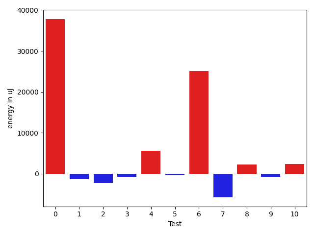

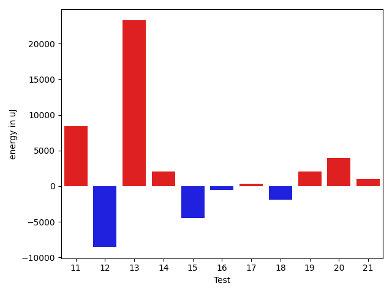

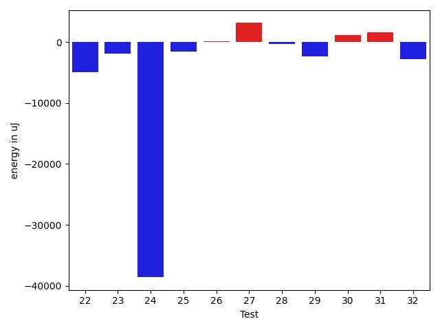

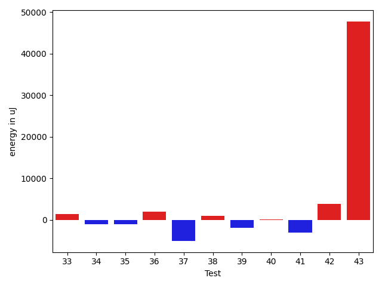

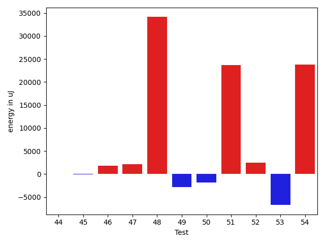

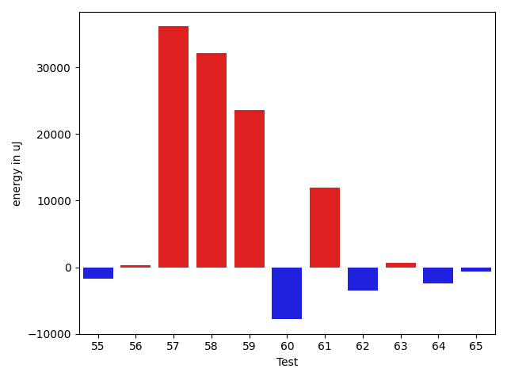

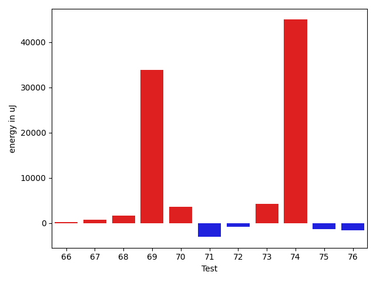

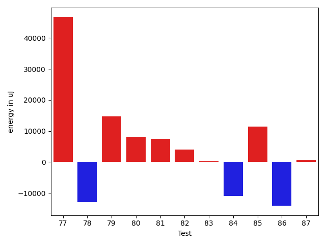

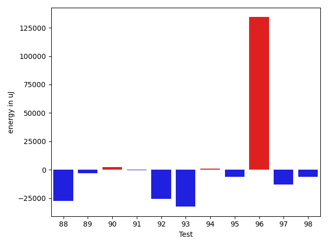

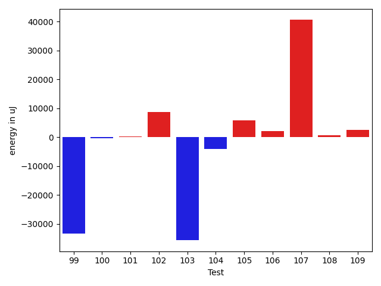

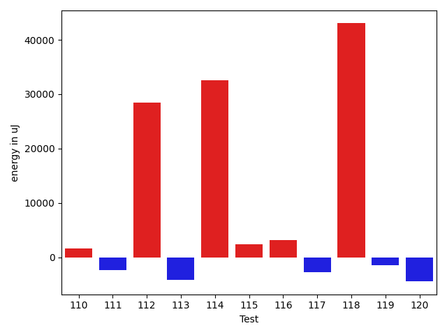

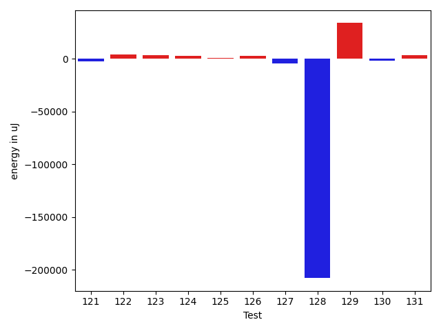

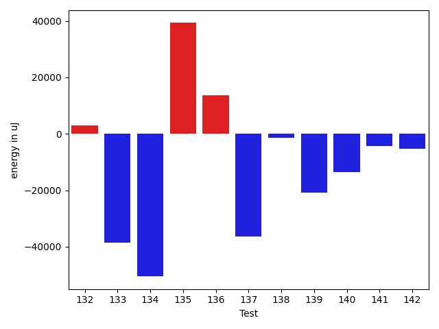

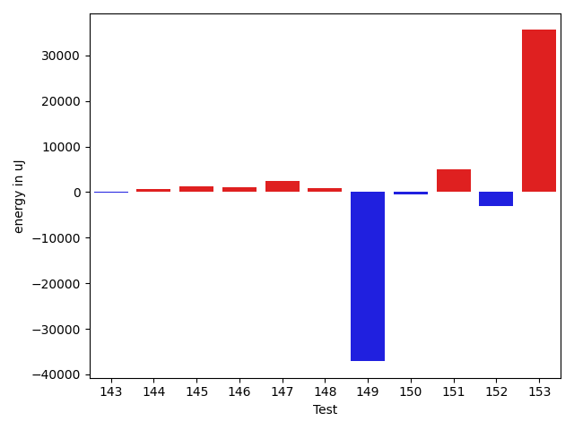

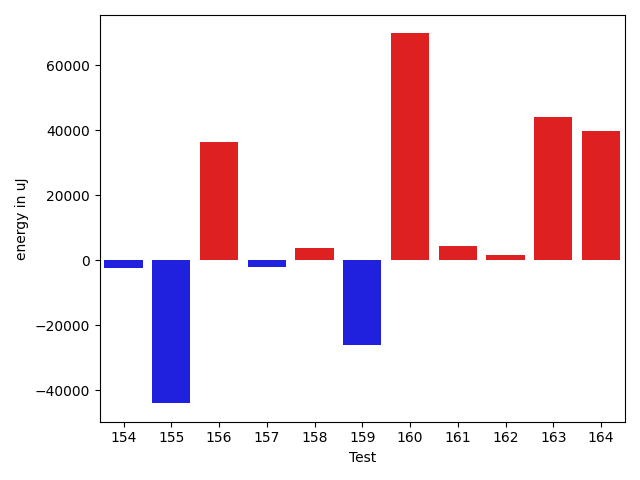

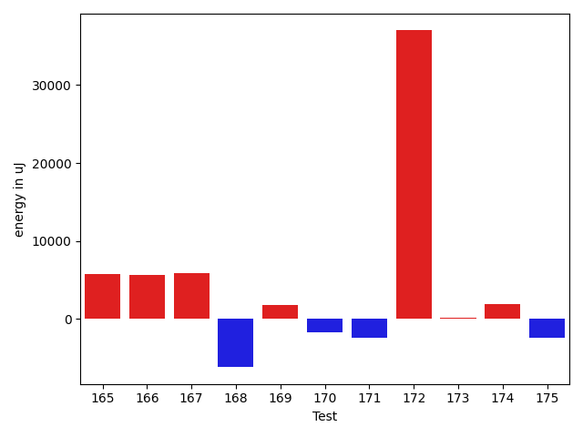

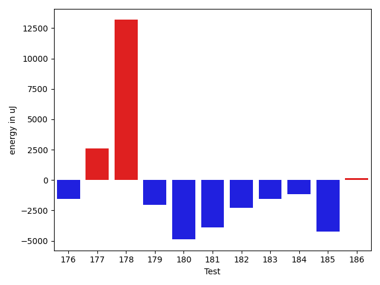

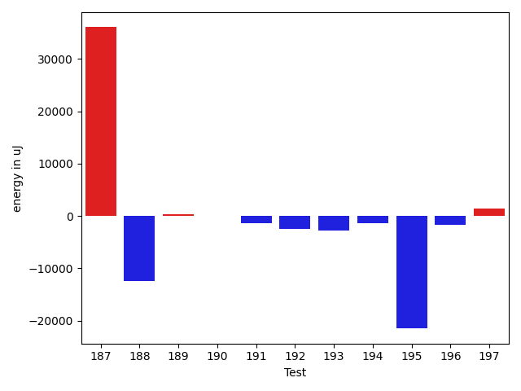

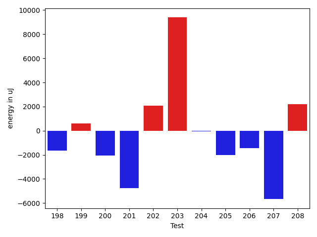

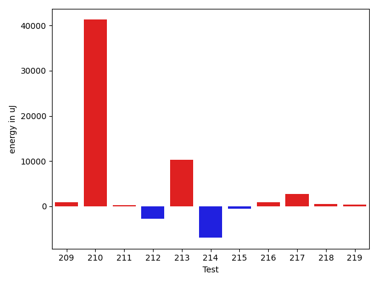

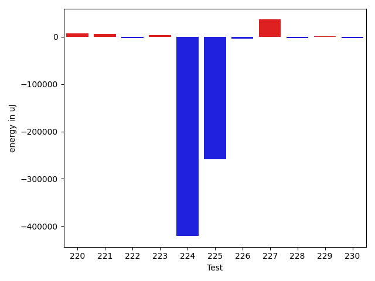

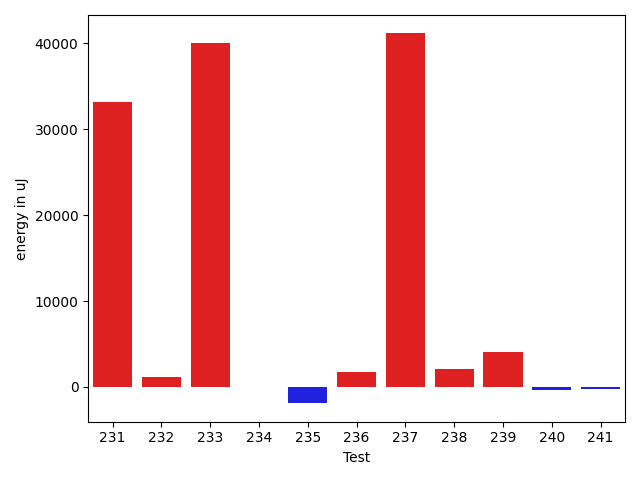

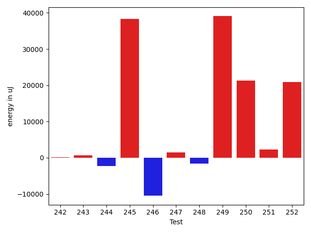

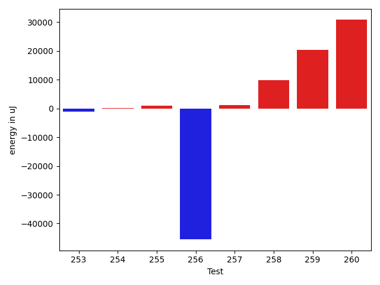

| ID | EnergyV1 | EnergyV2 | DeltaEnergy | σV1 | %σV1 | σV2 | %σV2 |
| --- | --- | --- | --- | --- | --- | --- | --- |
| 0 | 45837 | 83678 | 37841 | 17392.84 | 37.94 | 25354.19 | 30.30 |
| 1 | 43396 | 42114 | -1282 | 18727.07 | 43.15 | 14051.17 | 33.36 |
| 2 | 121704 | 119384 | -2320 | 22549.23 | 18.53 | 20377.32 | 17.07 |
| 3 | 75439 | 74767 | -672 | 14922.78 | 19.78 | 17965.18 | 24.03 |
| 4 | 80383 | 85998 | 5615 | 20476.17 | 25.47 | 21606.37 | 25.12 |
| 5 | 130981 | 130676 | -305 | 7890.15 | 6.02 | 18534.68 | 14.18 |
| 6 | 122009 | 147094 | 25085 | 26296.68 | 21.55 | 52101.42 | 35.42 |
| 7 | 86059 | 80261 | -5798 | 21471.54 | 24.95 | 21646.68 | 26.97 |
| 8 | 79712 | 82031 | 2319 | 18905.57 | 23.72 | 18574.36 | 22.64 |
| 9 | 45777 | 45105 | -672 | 14245.04 | 31.12 | 12414.59 | 27.52 |
| 10 | 43945 | 46386 | 2441 | 2213.30 | 5.04 | 19182.44 | 41.35 |
| 11 | 131042 | 139465 | 8423 | 21130.12 | 16.12 | 21179.88 | 15.19 |
| 12 | 49744 | 41199 | -8545 | 20447.51 | 41.11 | 13029.39 | 31.63 |
| 13 | 574095 | 597350 | 23255 | 38092.30 | 6.64 | 34820.99 | 5.83 |
| 14 | 87097 | 89111 | 2014 | 21915.97 | 25.16 | 22493.82 | 25.24 |
| 15 | 86120 | 81604 | -4516 | 22332.27 | 25.93 | 21997.30 | 26.96 |
| 16 | 89538 | 89050 | -488 | 21308.77 | 23.80 | 22138.17 | 24.86 |
| 17 | 46997 | 47302 | 305 | 13889.54 | 29.55 | 19232.27 | 40.66 |
| 18 | 48462 | 46569 | -1893 | 20943.43 | 43.22 | 18946.66 | 40.69 |
| 19 | 86547 | 88562 | 2015 | 29503.81 | 34.09 | 18959.66 | 21.41 |
| 20 | 39245 | 43151 | 3906 | 1081.97 | 2.76 | 3232.32 | 7.49 |
| 21 | 79528 | 80566 | 1038 | 22801.76 | 28.67 | 20126.63 | 24.98 |
| 22 | 89233 | 84228 | -5005 | 22709.96 | 25.45 | 19374.76 | 23.00 |
| 23 | 84350 | 82458 | -1892 | 30134.94 | 35.73 | 29477.86 | 35.75 |
| 24 | 124877 | 86304 | -38573 | 48733.59 | 39.03 | 64458.37 | 74.69 |
| 25 | 38146 | 36560 | -1586 | 11412.31 | 29.92 | 1620.11 | 4.43 |
| 26 | 40100 | 40222 | 122 | 2362.37 | 5.89 | 11287.33 | 28.06 |
| 27 | 43823 | 46936 | 3113 | 2248.21 | 5.13 | 18590.55 | 39.61 |
| 28 | 45105 | 44800 | -305 | 13350.34 | 29.60 | 21089.77 | 47.08 |
| 29 | 45899 | 43579 | -2320 | 19359.02 | 42.18 | 14352.28 | 32.93 |
| 30 | 39124 | 40283 | 1159 | 11953.57 | 30.55 | 1513.05 | 3.76 |
| 31 | 41992 | 43579 | 1587 | 14864.69 | 35.40 | 16029.72 | 36.78 |
| 32 | 41504 | 38697 | -2807 | 16495.78 | 39.75 | 14558.44 | 37.62 |
| 33 | 37475 | 38879 | 1404 | 12442.35 | 33.20 | 11939.98 | 30.71 |
| 34 | 118041 | 116943 | -1098 | 12716.69 | 10.77 | 8982.39 | 7.68 |
| 35 | 46814 | 45777 | -1037 | 4604.26 | 9.84 | 13000.34 | 28.40 |
| 36 | 213073 | 215026 | 1953 | 46844.77 | 21.99 | 38742.83 | 18.02 |
| 37 | 85327 | 80200 | -5127 | 21988.11 | 25.77 | 17728.29 | 22.11 |
| 38 | 36193 | 37232 | 1039 | 2693.67 | 7.44 | 2747.32 | 7.38 |
| 39 | 78491 | 76599 | -1892 | 15136.88 | 19.28 | 6491.95 | 8.48 |
| 40 | 37964 | 38085 | 121 | 16321.49 | 42.99 | 1939.68 | 5.09 |
| 41 | 47486 | 44434 | -3052 | 15761.50 | 33.19 | 16586.64 | 37.33 |
| 42 | 41748 | 45593 | 3845 | 2545.26 | 6.10 | 2384.52 | 5.23 |
| 43 | 151061 | 198852 | 47791 | 26000.29 | 17.21 | 30884.31 | 15.53 |
| 44 | 37232 | 37292 | 60 | 2174.44 | 5.84 | 14894.63 | 39.94 |
| 45 | 41870 | 41809 | -61 | 15589.65 | 37.23 | 14497.64 | 34.68 |
| 46 | 36560 | 38391 | 1831 | 3791.92 | 10.37 | 17659.65 | 46.00 |
| 47 | 83923 | 86059 | 2136 | 19415.00 | 23.13 | 19762.20 | 22.96 |
| 48 | 44799 | 78918 | 34119 | 22205.07 | 49.57 | 22703.56 | 28.77 |
| 49 | 180053 | 177184 | -2869 | 22325.77 | 12.40 | 29366.67 | 16.57 |
| 50 | 180603 | 178772 | -1831 | 22780.98 | 12.61 | 22838.69 | 12.78 |
| 51 | 227234 | 250915 | 23681 | 35067.67 | 15.43 | 31479.32 | 12.55 |
| 52 | 113769 | 116272 | 2503 | 13525.97 | 11.89 | 36197.35 | 31.13 |
| 53 | 288512 | 281798 | -6714 | 38561.97 | 13.37 | 26485.28 | 9.40 |
| 54 | 83862 | 107666 | 23804 | 18737.48 | 22.34 | 21362.56 | 19.84 |
| 55 | 112549 | 110840 | -1709 | 7012.73 | 6.23 | 19830.08 | 17.89 |
| 56 | 131653 | 131958 | 305 | 27212.25 | 20.67 | 22400.76 | 16.98 |
| 57 | 125182 | 161315 | 36133 | 16367.38 | 13.07 | 18848.20 | 11.68 |
| 58 | 92346 | 124450 | 32104 | 17491.35 | 18.94 | 18702.66 | 15.03 |
| 59 | 138244 | 161804 | 23560 | 19368.91 | 14.01 | 21356.39 | 13.20 |
| 60 | 130066 | 122254 | -7812 | 17265.11 | 13.27 | 16390.93 | 13.41 |
| 61 | 112976 | 124878 | 11902 | 60872.65 | 53.88 | 50285.01 | 40.27 |
| 62 | 136596 | 133057 | -3539 | 21345.14 | 15.63 | 9901.07 | 7.44 |
| 63 | 180847 | 181519 | 672 | 30270.07 | 16.74 | 88126.28 | 48.55 |
| 64 | 41626 | 39185 | -2441 | 1845.95 | 4.43 | 3049.46 | 7.78 |
| 65 | 45349 | 44739 | -610 | 21884.01 | 48.26 | 20106.45 | 44.94 |
| 66 | 90393 | 90637 | 244 | 3426.97 | 3.79 | 20695.74 | 22.83 |
| 67 | 44128 | 44860 | 732 | 14028.83 | 31.79 | 18107.22 | 40.36 |
| 68 | 86853 | 88500 | 1647 | 13548.76 | 15.60 | 12039.02 | 13.60 |
| 69 | 49439 | 83374 | 33935 | 22111.36 | 44.72 | 21700.14 | 26.03 |
| 70 | 89111 | 92651 | 3540 | 3346.26 | 3.76 | 19189.96 | 20.71 |
| 71 | 184265 | 181213 | -3052 | 17533.47 | 9.52 | 27184.36 | 15.00 |
| 72 | 134765 | 133972 | -793 | 25345.46 | 18.81 | 23294.85 | 17.39 |
| 73 | 174316 | 178527 | 4211 | 35736.88 | 20.50 | 8239.98 | 4.62 |
| 74 | 274902 | 319884 | 44982 | 18655.42 | 6.79 | 33568.29 | 10.49 |
| 75 | 42663 | 41320 | -1343 | 10775.04 | 25.26 | 19626.98 | 47.50 |
| 76 | 79162 | 77515 | -1647 | 3779.52 | 4.77 | 12835.46 | 16.56 |
| 77 | 613463 | 660155 | 46692 | 39729.71 | 6.48 | 129387.30 | 19.60 |
| 78 | 248534 | 235656 | -12878 | 23616.17 | 9.50 | 24329.42 | 10.32 |
| 79 | 300354 | 315002 | 14648 | 32123.91 | 10.70 | 33651.50 | 10.68 |
| 80 | 173462 | 181518 | 8056 | 23613.57 | 13.61 | 21438.43 | 11.81 |
| 81 | 132019 | 139526 | 7507 | 18659.40 | 14.13 | 18891.77 | 13.54 |
| 82 | 117065 | 121094 | 4029 | 20086.08 | 17.16 | 15989.70 | 13.20 |
| 83 | 46326 | 46631 | 305 | 19859.98 | 42.87 | 23450.21 | 50.29 |
| 84 | 228027 | 217041 | -10986 | 15285.75 | 6.70 | 36248.27 | 16.70 |
| 85 | 258544 | 270019 | 11475 | 29961.87 | 11.59 | 43674.21 | 16.17 |
| 86 | 264770 | 250670 | -14100 | 20796.29 | 7.85 | 35609.98 | 14.21 |
| 87 | 224975 | 225646 | 671 | 16684.22 | 7.42 | 33819.12 | 14.99 |
| 88 | 300415 | 272949 | -27466 | 37884.93 | 12.61 | 56687.80 | 20.77 |
| 89 | 227843 | 224975 | -2868 | 21524.89 | 9.45 | 336765.34 | 149.69 |
| 90 | 182373 | 184692 | 2319 | 17649.44 | 9.68 | 22379.55 | 12.12 |
| 91 | 334167 | 334044 | -123 | 29637.46 | 8.87 | 28409.28 | 8.50 |
| 92 | 98450 | 72998 | -25452 | 23478.68 | 23.85 | 18720.19 | 25.64 |
| 93 | 125366 | 92956 | -32410 | 43307.17 | 34.54 | 55623.59 | 59.84 |
| 94 | 43945 | 44860 | 915 | 11670.05 | 26.56 | 22608.21 | 50.40 |
| 95 | 45593 | 39246 | -6347 | 20821.98 | 45.67 | 16234.67 | 41.37 |
| 96 | 1605465 | 1739742 | 134277 | 78804.22 | 4.91 | 77972.22 | 4.48 |
| 97 | 152893 | 140198 | -12695 | 21575.88 | 14.11 | 22402.90 | 15.98 |
| 98 | 128479 | 122192 | -6287 | 26211.21 | 20.40 | 26712.64 | 21.86 |
| 99 | 72631 | 39185 | -33446 | 18312.93 | 25.21 | 18844.84 | 48.09 |
| 100 | 45166 | 44739 | -427 | 18936.34 | 41.93 | 15619.73 | 34.91 |
| 101 | 44617 | 44922 | 305 | 3074.16 | 6.89 | 15288.44 | 34.03 |
| 102 | 338927 | 347594 | 8667 | 13292.56 | 3.92 | 42851.34 | 12.33 |
| 103 | 83373 | 47668 | -35705 | 21047.40 | 25.24 | 21947.78 | 46.04 |
| 104 | 45044 | 40894 | -4150 | 19277.33 | 42.80 | 1770.44 | 4.33 |
| 105 | 85571 | 91431 | 5860 | 12536.61 | 14.65 | 19318.61 | 21.13 |
| 106 | 37109 | 39306 | 2197 | 1586.41 | 4.28 | 1045.41 | 2.66 |
| 107 | 45532 | 86121 | 40589 | 18587.61 | 40.82 | 24611.04 | 28.58 |
| 108 | 38574 | 39306 | 732 | 1680.37 | 4.36 | 1352.10 | 3.44 |
| 109 | 167358 | 169799 | 2441 | 27076.97 | 16.18 | 36543.58 | 21.52 |
| 110 | 78308 | 79895 | 1587 | 28910.56 | 36.92 | 17429.91 | 21.82 |
| 111 | 84533 | 82214 | -2319 | 23341.67 | 27.61 | 22597.97 | 27.49 |
| 112 | 46570 | 75012 | 28442 | 21126.00 | 45.36 | 20384.11 | 27.17 |
| 113 | 44495 | 40283 | -4212 | 18755.30 | 42.15 | 17116.47 | 42.49 |
| 114 | 45349 | 77941 | 32592 | 19352.59 | 42.67 | 22237.84 | 28.53 |
| 115 | 43945 | 46264 | 2319 | 12890.46 | 29.33 | 19136.20 | 41.36 |
| 116 | 79407 | 82580 | 3173 | 20161.90 | 25.39 | 17199.12 | 20.83 |
| 117 | 44311 | 41565 | -2746 | 2333.37 | 5.27 | 2858.19 | 6.88 |
| 118 | 46753 | 89782 | 43029 | 22403.02 | 47.92 | 18498.21 | 20.60 |
| 119 | 81420 | 79956 | -1464 | 19179.87 | 23.56 | 20257.97 | 25.34 |
| 120 | 88867 | 84411 | -4456 | 22212.38 | 25.00 | 21756.59 | 25.77 |
| 121 | 82336 | 79834 | -2502 | 21778.08 | 26.45 | 18170.03 | 22.76 |
| 122 | 160583 | 164428 | 3845 | 21917.36 | 13.65 | 23519.40 | 14.30 |
| 123 | 84655 | 88135 | 3480 | 20007.49 | 23.63 | 18720.21 | 21.24 |
| 124 | 88623 | 91186 | 2563 | 10313.60 | 11.64 | 15582.90 | 17.09 |
| 125 | 38452 | 39062 | 610 | 16884.95 | 43.91 | 14427.14 | 36.93 |
| 126 | 87890 | 90332 | 2442 | 19551.94 | 22.25 | 27945.93 | 30.94 |
| 127 | 1632747 | 1628413 | -4334 | 153513.49 | 9.40 | 114987.28 | 7.06 |
| 128 | 1906245 | 1698421 | -207824 | 258681.44 | 13.57 | 258024.78 | 15.19 |
| 129 | 43884 | 77636 | 33752 | 18969.64 | 43.23 | 29530.25 | 38.04 |
| 130 | 156127 | 154114 | -2013 | 23859.34 | 15.28 | 38409.24 | 24.92 |
| 131 | 41931 | 45594 | 3663 | 887.42 | 2.12 | 2703.49 | 5.93 |
| 132 | 86609 | 89661 | 3052 | 21962.12 | 25.36 | 27926.84 | 31.15 |
| 133 | 82824 | 44189 | -38635 | 18899.01 | 22.82 | 19425.76 | 43.96 |
| 134 | 402343 | 351806 | -50537 | 79303.61 | 19.71 | 24834.90 | 7.06 |
| 135 | 46142 | 85449 | 39307 | 19438.12 | 42.13 | 22046.51 | 25.80 |
| 136 | 343994 | 357543 | 13549 | 30346.95 | 8.82 | 35533.57 | 9.94 |
| 137 | 174377 | 137939 | -36438 | 20604.39 | 11.82 | 26728.71 | 19.38 |
| 138 | 147887 | 146423 | -1464 | 16740.65 | 11.32 | 17707.57 | 12.09 |
| 139 | 315978 | 295227 | -20751 | 33801.03 | 10.70 | 47361.78 | 16.04 |
| 140 | 403136 | 389586 | -13550 | 38500.19 | 9.55 | 18879.10 | 4.85 |
| 141 | 173950 | 169555 | -4395 | 20658.03 | 11.88 | 12000.95 | 7.08 |
| 142 | 139892 | 134704 | -5188 | 42806.60 | 30.60 | 29787.17 | 22.11 |
| 143 | 39185 | 39062 | -123 | 1131.84 | 2.89 | 2109.84 | 5.40 |
| 144 | 38452 | 39123 | 671 | 11830.63 | 30.77 | 3623.48 | 9.26 |
| 145 | 120788 | 122070 | 1282 | 13006.87 | 10.77 | 22176.54 | 18.17 |
| 146 | 132507 | 133605 | 1098 | 62461.93 | 47.14 | 14703.80 | 11.01 |
| 147 | 83679 | 86059 | 2380 | 13527.49 | 16.17 | 18037.64 | 20.96 |
| 148 | 131591 | 132385 | 794 | 20660.10 | 15.70 | 17228.38 | 13.01 |
| 149 | 238585 | 201476 | -37109 | 9072.75 | 3.80 | 20135.96 | 9.99 |
| 150 | 89111 | 88683 | -428 | 2772.95 | 3.11 | 23231.57 | 26.20 |
| 151 | 84777 | 89782 | 5005 | 23217.89 | 27.39 | 21105.32 | 23.51 |
| 152 | 90210 | 87158 | -3052 | 5306.05 | 5.88 | 21031.89 | 24.13 |
| 153 | 41382 | 76965 | 35583 | 19790.19 | 47.82 | 19058.06 | 24.76 |
| 154 | 76721 | 74523 | -2198 | 11226.85 | 14.63 | 12467.32 | 16.73 |
| 155 | 91369 | 47424 | -43945 | 38931.69 | 42.61 | 23694.55 | 49.96 |
| 156 | 173339 | 209899 | 36560 | 53269.55 | 30.73 | 22557.79 | 10.75 |
| 157 | 207763 | 205688 | -2075 | 21909.53 | 10.55 | 16836.37 | 8.19 |
| 158 | 41687 | 45471 | 3784 | 15710.11 | 37.69 | 17120.79 | 37.65 |
| 159 | 151916 | 125794 | -26122 | 33691.36 | 22.18 | 20517.32 | 16.31 |
| 160 | 1222653 | 1292477 | 69824 | 104536.95 | 8.55 | 131515.38 | 10.18 |
| 161 | 220947 | 225524 | 4577 | 48828.36 | 22.10 | 57285.82 | 25.40 |
| 162 | 89721 | 91431 | 1710 | 22173.99 | 24.71 | 33529.55 | 36.67 |
| 163 | 46936 | 91064 | 44128 | 21546.30 | 45.91 | 23261.35 | 25.54 |
| 164 | 137756 | 177429 | 39673 | 26338.93 | 19.12 | 26411.98 | 14.89 |
| 165 | 171081 | 176818 | 5737 | 16411.19 | 9.59 | 35127.15 | 19.87 |
| 166 | 159301 | 164977 | 5676 | 25947.48 | 16.29 | 32785.81 | 19.87 |
| 167 | 124634 | 130493 | 5859 | 21076.27 | 16.91 | 22163.55 | 16.98 |
| 168 | 88195 | 82031 | -6164 | 22135.07 | 25.10 | 23402.52 | 28.53 |
| 169 | 44311 | 46081 | 1770 | 20715.94 | 46.75 | 22481.45 | 48.79 |
| 170 | 89172 | 87463 | -1709 | 31963.69 | 35.84 | 8709.20 | 9.96 |
| 171 | 78796 | 76415 | -2381 | 23317.64 | 29.59 | 19555.73 | 25.59 |
| 172 | 142517 | 179504 | 36987 | 23520.67 | 16.50 | 22081.94 | 12.30 |
| 173 | 44556 | 44738 | 182 | 3006.34 | 6.75 | 20483.50 | 45.79 |
| 174 | 79223 | 81176 | 1953 | 20541.98 | 25.93 | 20260.11 | 24.96 |
| 175 | 83618 | 81177 | -2441 | 20373.76 | 24.37 | 22280.39 | 27.45 |
| 176 | 46387 | 44861 | -1526 | 15571.84 | 33.57 | 19019.50 | 42.40 |
| 177 | 43029 | 45655 | 2626 | 13809.01 | 32.09 | 18755.69 | 41.08 |
| 178 | 525694 | 538878 | 13184 | 57521.51 | 10.94 | 74240.49 | 13.78 |
| 179 | 130249 | 128235 | -2014 | 27491.01 | 21.11 | 23028.20 | 17.96 |
| 180 | 134948 | 130066 | -4882 | 33517.71 | 24.84 | 27146.71 | 20.87 |
| 181 | 90637 | 86730 | -3907 | 33121.07 | 36.54 | 40683.37 | 46.91 |
| 182 | 69152 | 66894 | -2258 | 19700.82 | 28.49 | 21959.45 | 32.83 |
| 183 | 90759 | 89233 | -1526 | 19217.78 | 21.17 | 21240.18 | 23.80 |
| 184 | 42175 | 41015 | -1160 | 13312.12 | 31.56 | 3270.35 | 7.97 |
| 185 | 92041 | 87830 | -4211 | 143276.36 | 155.67 | 3167.46 | 3.61 |
| 186 | 46569 | 46753 | 184 | 16204.26 | 34.80 | 17796.38 | 38.06 |
| 187 | 83801 | 119873 | 36072 | 4061.83 | 4.85 | 21748.57 | 18.14 |
| 188 | 309325 | 296936 | -12389 | 47816.72 | 15.46 | 35194.44 | 11.85 |
| 189 | 70130 | 70434 | 304 | 18800.63 | 26.81 | 18859.23 | 26.78 |
| 190 | 45349 | 45349 | 0 | 43745.55 | 96.46 | 26878.71 | 59.27 |
| 191 | 46204 | 44861 | -1343 | 21097.90 | 45.66 | 21705.65 | 48.38 |
| 192 | 94604 | 92163 | -2441 | 27012.78 | 28.55 | 15708.33 | 17.04 |
| 193 | 90637 | 87830 | -2807 | 24793.30 | 27.35 | 5911.78 | 6.73 |
| 194 | 132324 | 130920 | -1404 | 5698.20 | 4.31 | 8829.05 | 6.74 |
| 195 | 153076 | 131592 | -21484 | 14353.52 | 9.38 | 16623.54 | 12.63 |
| 196 | 150756 | 149109 | -1647 | 18104.26 | 12.01 | 18356.11 | 12.31 |
| 197 | 75073 | 76477 | 1404 | 17636.09 | 23.49 | 15614.84 | 20.42 |
| 198 | 87341 | 85694 | -1647 | 21635.01 | 24.77 | 20999.70 | 24.51 |
| 199 | 114868 | 115478 | 610 | 55235.23 | 48.09 | 25602.83 | 22.17 |
| 200 | 87585 | 85510 | -2075 | 16763.58 | 19.14 | 17695.92 | 20.69 |
| 201 | 81421 | 76660 | -4761 | 14853.64 | 18.24 | 6867.22 | 8.96 |
| 202 | 90209 | 92285 | 2076 | 14822.53 | 16.43 | 22502.47 | 24.38 |
| 203 | 74158 | 83557 | 9399 | 20878.72 | 28.15 | 15465.60 | 18.51 |
| 204 | 88013 | 87951 | -62 | 22480.69 | 25.54 | 18295.92 | 20.80 |
| 205 | 181457 | 179442 | -2015 | 23210.64 | 12.79 | 21363.72 | 11.91 |
| 206 | 39490 | 38025 | -1465 | 19019.06 | 48.16 | 19052.36 | 50.10 |
| 207 | 215637 | 209961 | -5676 | 30664.23 | 14.22 | 22840.66 | 10.88 |
| 208 | 216491 | 218689 | 2198 | 17945.34 | 8.29 | 2957.37 | 1.35 |
| 209 | 39368 | 40283 | 915 | 1197.10 | 3.04 | 1347.17 | 3.34 |
| 210 | 48889 | 90149 | 41260 | 22711.92 | 46.46 | 23846.53 | 26.45 |
| 211 | 40222 | 40466 | 244 | 2182.01 | 5.42 | 2523.75 | 6.24 |
| 212 | 156371 | 153564 | -2807 | 14396.34 | 9.21 | 11898.72 | 7.75 |
| 213 | 166077 | 176391 | 10314 | 20243.94 | 12.19 | 20691.43 | 11.73 |
| 214 | 445860 | 438903 | -6957 | 95955.53 | 21.52 | 28974.23 | 6.60 |
| 215 | 149719 | 149231 | -488 | 2562.63 | 1.71 | 12017.39 | 8.05 |
| 216 | 85266 | 86121 | 855 | 13697.39 | 16.06 | 28061.66 | 32.58 |
| 217 | 72021 | 74767 | 2746 | 20665.80 | 28.69 | 20956.31 | 28.03 |
| 218 | 81909 | 82397 | 488 | 13600.40 | 16.60 | 15915.52 | 19.32 |
| 219 | 39184 | 39612 | 428 | 12187.06 | 31.10 | 15626.28 | 39.45 |
| 220 | 83618 | 90332 | 6714 | 17669.13 | 21.13 | 31031.75 | 34.35 |
| 221 | 82642 | 88318 | 5676 | 17718.97 | 21.44 | 5898.62 | 6.68 |
| 222 | 48889 | 45776 | -3113 | 14873.41 | 30.42 | 15495.09 | 33.85 |
| 223 | 88561 | 92041 | 3480 | 18838.57 | 21.27 | 21790.49 | 23.67 |
| 224 | 4078969 | 3657828 | -421141 | 748517.51 | 18.35 | 988920.06 | 27.04 |
| 225 | 3934743 | 3676382 | -258361 | 700279.69 | 17.80 | 659232.79 | 17.93 |
| 226 | 129211 | 124938 | -4273 | 29493.90 | 22.83 | 5172.94 | 4.14 |
| 227 | 48645 | 85022 | 36377 | 21122.08 | 43.42 | 19824.45 | 23.32 |
| 228 | 41442 | 38818 | -2624 | 18589.36 | 44.86 | 18911.46 | 48.72 |
| 229 | 82642 | 83984 | 1342 | 20537.98 | 24.85 | 21983.50 | 26.18 |
| 230 | 51453 | 48767 | -2686 | 154579.40 | 300.43 | 21166.51 | 43.40 |
| 231 | 43213 | 76416 | 33203 | 18898.66 | 43.73 | 17003.06 | 22.25 |
| 232 | 44311 | 45471 | 1160 | 17400.90 | 39.27 | 19189.75 | 42.20 |
| 233 | 44006 | 84045 | 40039 | 19523.08 | 44.36 | 27043.98 | 32.18 |
| 234 | 76904 | 76904 | 0 | 15813.19 | 20.56 | 21629.85 | 28.13 |
| 235 | 365721 | 363830 | -1891 | 18815.85 | 5.14 | 34367.09 | 9.45 |
| 236 | 147216 | 148986 | 1770 | 9846.18 | 6.69 | 11429.30 | 7.67 |
| 237 | 45532 | 86670 | 41138 | 18905.66 | 41.52 | 20421.26 | 23.56 |
| 238 | 180175 | 182250 | 2075 | 20633.61 | 11.45 | 67316.74 | 36.94 |
| 239 | 271972 | 276061 | 4089 | 32009.82 | 11.77 | 42904.25 | 15.54 |
| 240 | 162231 | 161865 | -366 | 24470.27 | 15.08 | 25844.43 | 15.97 |
| 241 | 128906 | 128722 | -184 | 19704.95 | 15.29 | 21816.11 | 16.95 |
| 242 | 45959 | 46020 | 61 | 1767.41 | 3.85 | 3080.88 | 6.69 |
| 243 | 42969 | 43640 | 671 | 14419.80 | 33.56 | 17677.44 | 40.51 |
| 244 | 80994 | 78735 | -2259 | 18817.09 | 23.23 | 22172.52 | 28.16 |
| 245 | 45288 | 83679 | 38391 | 23508.90 | 51.91 | 23151.43 | 27.67 |
| 246 | 87707 | 77209 | -10498 | 17563.48 | 20.03 | 13513.83 | 17.50 |
| 247 | 39856 | 41260 | 1404 | 17598.99 | 44.16 | 18310.75 | 44.38 |
| 248 | 92529 | 90942 | -1587 | 21582.00 | 23.32 | 4538.00 | 4.99 |
| 249 | 46447 | 85510 | 39063 | 12396.05 | 26.69 | 19096.78 | 22.33 |
| 250 | 241150 | 262512 | 21362 | 65431.72 | 27.13 | 31542.43 | 12.02 |
| 251 | 475707 | 477965 | 2258 | 40560.11 | 8.53 | 46043.12 | 9.63 |
| 252 | 170471 | 191406 | 20935 | 41675.51 | 24.45 | 33350.03 | 17.42 |
| 253 | 137390 | 136231 | -1159 | 15969.85 | 11.62 | 24239.23 | 17.79 |
| 254 | 132752 | 132995 | 243 | 21080.79 | 15.88 | 23346.65 | 17.55 |
| 255 | 79406 | 80322 | 916 | 4436.13 | 5.59 | 25251.92 | 31.44 |
| 256 | 639219 | 593688 | -45531 | 62980.06 | 9.85 | 47160.09 | 7.94 |
| 257 | 89111 | 90332 | 1221 | 15174.45 | 17.03 | 22767.49 | 25.20 |
| 258 | 164855 | 174683 | 9828 | 35111.41 | 21.30 | 17386.76 | 9.95 |
| 259 | 300964 | 321288 | 20324 | 25135.16 | 8.35 | 17783.44 | 5.54 |
| 260 | 309569 | 340392 | 30823 | 23785.95 | 7.68 | 39932.98 | 11.73 |

## Misc.

| ID | Test Class | Test Method |
| --- | --- | --- |
| 0 | com.google.gson.functional.PrimitiveTest | testDeserializePrimitiveWrapperAsObjectField |
| 1 | com.google.gson.functional.ObjectTest | testStringFieldWithEmptyValueDeserialization |
| 2 | com.google.gson.functional.ObjectTest | testNullObjectFieldsDeserialization |
| 3 | com.google.gson.functional.ObjectTest | testEmptyCollectionInAnObjectDeserialization |
| 4 | com.google.gson.functional.ObjectTest | testNestedSerialization |
| 5 | com.google.gson.functional.ObjectTest | testArrayOfArraysDeserialization |
| 6 | com.google.gson.functional.ObjectTest | testSingletonLists |
| 7 | com.google.gson.functional.ObjectTest | testNullFieldsSerialization |
| 8 | com.google.gson.functional.ObjectTest | testClassWithTransientFieldsDeserialization |
| 9 | com.google.gson.functional.ObjectTest | testStringFieldWithNumberValueDeserialization |
| 10 | com.google.gson.functional.ObjectTest | testPrivateNoArgConstructorDeserialization |
| 11 | com.google.gson.functional.ObjectTest | testArrayOfObjectsAsFields |
| 12 | com.google.gson.functional.ObjectTest | testClassWithTransientFieldsDeserializationTransientFieldsPassedInJsonAreIgnored |
| 13 | com.google.gson.functional.ObjectTest | testDateAsMapObjectField |
| 14 | com.google.gson.functional.ObjectTest | testPrimitiveArrayFieldSerialization |
| 15 | com.google.gson.functional.ObjectTest | testPrimitiveArrayInAnObjectDeserialization |
| 16 | com.google.gson.functional.ObjectTest | testStringFieldWithEmptyValueSerialization |
| 17 | com.google.gson.functional.ObjectTest | testNullArraysDeserialization |
| 18 | com.google.gson.functional.ObjectTest | testInnerClassSerialization |
| 19 | com.google.gson.functional.ObjectTest | testEmptyCollectionInAnObjectSerialization |
| 20 | com.google.gson.functional.ObjectTest | testClassWithObjectFieldSerialization |
| 21 | com.google.gson.functional.ObjectTest | testBagOfPrimitiveWrappersSerialization |
| 22 | com.google.gson.functional.ObjectTest | testObjectFieldNamesWithoutQuotesDeserialization |
| 23 | com.google.gson.functional.ObjectTest | testArrayOfObjectsDeserialization |
| 24 | com.google.gson.functional.ObjectTest | testArrayOfArraysSerialization |
| 25 | com.google.gson.functional.ObjectTest | testJsonInSingleQuotesDeserialization |
| 26 | com.google.gson.functional.ObjectTest | testBagOfPrimitivesSerialization |
| 27 | com.google.gson.functional.ObjectTest | testNestedDeserialization |
| 28 | com.google.gson.functional.ObjectTest | testBagOfPrimitiveWrappersDeserialization |
| 29 | com.google.gson.functional.ObjectTest | testJsonInMixedQuotesDeserialization |
| 30 | com.google.gson.functional.ObjectTest | testNullFieldsDeserialization |
| 31 | com.google.gson.functional.ObjectTest | testArrayOfObjectsSerialization |
| 32 | com.google.gson.functional.ObjectTest | testNullPrimitiveFieldsDeserialization |
| 33 | com.google.gson.functional.ObjectTest | testBagOfPrimitivesDeserialization |
| 34 | com.google.gson.functional.ObjectTest | testInnerClassDeserialization |
| 35 | com.google.gson.functional.ObjectTest | testClassWithTransientFieldsSerialization |
| 36 | com.google.gson.functional.StreamingTypeAdaptersTest | testNullSafe |
| 37 | com.google.gson.functional.StreamingTypeAdaptersTest | testFromJsonTree |
| 38 | com.google.gson.functional.StreamingTypeAdaptersTest | testSerializeNullObject |
| 39 | com.google.gson.functional.StreamingTypeAdaptersTest | testSerializeWithCustomTypeAdapter |
| 40 | com.google.gson.functional.StreamingTypeAdaptersTest | testDeserialize |
| 41 | com.google.gson.functional.StreamingTypeAdaptersTest | testDeserializeNullField |
| 42 | com.google.gson.functional.StreamingTypeAdaptersTest | testSerializeNullField |
| 43 | com.google.gson.functional.StreamingTypeAdaptersTest | testDeserializeWithCustomTypeAdapter |
| 44 | com.google.gson.functional.StreamingTypeAdaptersTest | testSerializeRecursive |
| 45 | com.google.gson.functional.StreamingTypeAdaptersTest | testSerialize |
| 46 | com.google.gson.functional.StreamingTypeAdaptersTest | testDeserializeNullObject |
| 47 | com.google.gson.functional.CustomDeserializerTest | testDefaultConstructorNotCalledOnField |
| 48 | com.google.gson.functional.CustomDeserializerTest | testDefaultConstructorNotCalledOnObject |
| 49 | com.google.gson.functional.CustomDeserializerTest | testCustomDeserializerReturnsNullForArrayElementsForArrayField |
| 50 | com.google.gson.functional.CustomDeserializerTest | testCustomDeserializerReturnsNull |
| 51 | com.google.gson.functional.CustomDeserializerTest | testJsonTypeFieldBasedDeserialization |
| 52 | com.google.gson.functional.ExclusionStrategyFunctionalTest | testExclusionStrategySerializationDoesNotImpactSerialization |
| 53 | com.google.gson.functional.ExclusionStrategyFunctionalTest | testExclusionStrategyWithMode |
| 54 | com.google.gson.functional.ExclusionStrategyFunctionalTest | testExclusionStrategySerializationDoesNotImpactDeserialization |
| 55 | com.google.gson.functional.ExclusionStrategyFunctionalTest | testExcludeTopLevelClassDeserializationDoesNotImpactSerialization |
| 56 | com.google.gson.functional.ExclusionStrategyFunctionalTest | testExcludeTopLevelClassSerializationDoesNotImpactDeserialization |
| 57 | com.google.gson.functional.ExclusionStrategyFunctionalTest | testExclusionStrategyDeserialization |
| 58 | com.google.gson.functional.ExclusionStrategyFunctionalTest | testExclusionStrategySerialization |
| 59 | com.google.gson.MixedStreamTest | testReaderDoesNotMutateState |
| 60 | com.google.gson.MixedStreamTest | testWriteClosed |
| 61 | com.google.gson.MixedStreamTest | testWriteInvalidState |
| 62 | com.google.gson.MixedStreamTest | testWriteMixedStreamed |
| 63 | com.google.gson.MixedStreamTest | testReadMixedStreamed |
| 64 | com.google.gson.MixedStreamTest | testWriteDoesNotMutateState |
| 65 | com.google.gson.functional.JsonParserTest | testBadTypeForDeserializingCustomTree |
| 66 | com.google.gson.functional.JsonParserTest | testBadFieldTypeForCustomDeserializerCustomTree |
| 67 | com.google.gson.functional.JsonParserTest | testChangingCustomTreeAndDeserializing |
| 68 | com.google.gson.functional.JsonParserTest | testBadFieldTypeForDeserializingCustomTree |
| 69 | com.google.gson.functional.JsonParserTest | testDeserializingCustomTree |
| 70 | com.google.gson.functional.ThrowableFunctionalTest | testExceptionWithoutCause |
| 71 | com.google.gson.functional.ThrowableFunctionalTest | testErrornWithCause |
| 72 | com.google.gson.functional.ThrowableFunctionalTest | testSerializedNameOnExceptionFields |
| 73 | com.google.gson.functional.ThrowableFunctionalTest | testErrorWithoutCause |
| 74 | com.google.gson.functional.ThrowableFunctionalTest | testExceptionWithCause |
| 75 | com.google.gson.functional.InterfaceTest | testSerializingObjectImplementingInterface |
| 76 | com.google.gson.functional.InterfaceTest | testSerializingInterfaceObjectField |
| 77 | com.google.gson.functional.ParameterizedTypesTest | testParameterizedTypeGenericArraysSerialization |
| 78 | com.google.gson.functional.ParameterizedTypesTest | testParameterizedTypesWithWriterSerialization |
| 79 | com.google.gson.functional.ParameterizedTypesTest | testVariableTypeArrayDeserialization |
| 80 | com.google.gson.functional.ParameterizedTypesTest | testParameterizedTypeWithReaderDeserialization |
| 81 | com.google.gson.functional.ParameterizedTypesTest | testDeepParameterizedTypeDeserialization |
| 82 | com.google.gson.functional.ParameterizedTypesTest | testParameterizedTypesSerialization |
| 83 | com.google.gson.functional.ParameterizedTypesTest | testDeepParameterizedTypeSerialization |
| 84 | com.google.gson.functional.ParameterizedTypesTest | testVariableTypeDeserialization |
| 85 | com.google.gson.functional.ParameterizedTypesTest | testVariableTypeFieldsAndGenericArraysSerialization |
| 86 | com.google.gson.functional.ParameterizedTypesTest | testParameterizedTypeGenericArraysDeserialization |
| 87 | com.google.gson.functional.ParameterizedTypesTest | testParameterizedTypeDeserialization |
| 88 | com.google.gson.functional.ParameterizedTypesTest | testVariableTypeFieldsAndGenericArraysDeserialization |
| 89 | com.google.gson.functional.ParameterizedTypesTest | testTypesWithMultipleParametersDeserialization |
| 90 | com.google.gson.functional.ParameterizedTypesTest | testTypesWithMultipleParametersSerialization |
| 91 | com.google.gson.functional.ParameterizedTypesTest | testParameterizedTypeWithVariableTypeDeserialization |
| 92 | com.google.gson.functional.DefaultTypeAdaptersTest | testBadValueForBigDecimalDeserialization |
| 93 | com.google.gson.functional.DefaultTypeAdaptersTest | testBigIntegerFieldDeserialization |
| 94 | com.google.gson.functional.DefaultTypeAdaptersTest | testUrlNullDeserialization |
| 95 | com.google.gson.functional.DefaultTypeAdaptersTest | testUrlNullSerialization |
| 96 | com.google.gson.functional.DefaultTypeAdaptersTest | testNullSerialization |
| 97 | com.google.gson.functional.DefaultTypeAdaptersTest | testBigIntegerFieldSerialization |
| 98 | com.google.gson.functional.DefaultTypeAdaptersTest | testBigDecimalFieldDeserialization |
| 99 | com.google.gson.functional.DefaultTypeAdaptersTest | testBigDecimalFieldSerialization |
| 100 | com.google.gson.functional.InheritanceTest | testBaseSerializedAsBaseWhenSpecifiedWithExplicitType |
| 101 | com.google.gson.functional.InheritanceTest | testBaseSerializedAsSubWhenSpecifiedWithExplicitType |
| 102 | com.google.gson.functional.InheritanceTest | testSubInterfacesOfCollectionSerialization |
| 103 | com.google.gson.functional.InheritanceTest | testBaseSerializedAsBaseWhenSpecifiedWithExplicitTypeForToJsonMethod |
| 104 | com.google.gson.functional.InheritanceTest | testBaseSerializedAsSubForToJsonMethod |
| 105 | com.google.gson.functional.InheritanceTest | testClassWithBaseArrayFieldSerialization |
| 106 | com.google.gson.functional.InheritanceTest | testBaseSerializedAsSub |
| 107 | com.google.gson.functional.InheritanceTest | testSubClassDeserialization |
| 108 | com.google.gson.functional.InheritanceTest | testBaseSerializedAsSubWhenSpecifiedWithExplicitTypeForToJsonMethod |
| 109 | com.google.gson.functional.InheritanceTest | testSubInterfacesOfCollectionDeserialization |
| 110 | com.google.gson.functional.InheritanceTest | testClassWithBaseCollectionFieldSerialization |
| 111 | com.google.gson.functional.InheritanceTest | testClassWithBaseFieldSerialization |
| 112 | com.google.gson.functional.InheritanceTest | testSubClassSerialization |
| 113 | com.google.gson.functional.NamingPolicyTest | testAtSignInSerializedName |
| 114 | com.google.gson.functional.NamingPolicyTest | testGsonWithNonDefaultFieldNamingPolicySerialization |
| 115 | com.google.gson.functional.NamingPolicyTest | testGsonWithLowerCaseDashPolicyDeserialiation |
| 116 | com.google.gson.functional.NamingPolicyTest | testGsonDuplicateNameUsingSerializedNameFieldNamingPolicySerialization |
| 117 | com.google.gson.functional.NamingPolicyTest | testGsonWithSerializedNameFieldNamingPolicyDeserialization |
| 118 | com.google.gson.functional.NamingPolicyTest | testGsonWithUpperCamelCaseSpacesPolicyDeserialiation |
| 119 | com.google.gson.functional.NamingPolicyTest | testGsonWithSerializedNameFieldNamingPolicySerialization |
| 120 | com.google.gson.functional.NamingPolicyTest | testGsonWithNonDefaultFieldNamingPolicyDeserialiation |
| 121 | com.google.gson.functional.NamingPolicyTest | testGsonWithLowerCaseUnderscorePolicySerialization |
| 122 | com.google.gson.functional.NamingPolicyTest | testComplexFieldNameStrategy |
| 123 | com.google.gson.functional.NamingPolicyTest | testDeprecatedNamingStrategy |
| 124 | com.google.gson.functional.NamingPolicyTest | testGsonWithUpperCamelCaseSpacesPolicySerialiation |
| 125 | com.google.gson.functional.NamingPolicyTest | testGsonWithLowerCaseDashPolicySerialization |
| 126 | com.google.gson.functional.NamingPolicyTest | testGsonWithLowerCaseUnderscorePolicyDeserialiation |
| 127 | com.google.gson.functional.CircularReferenceTest | testCircularSerialization |
| 128 | com.google.gson.functional.CircularReferenceTest | testSelfReferenceArrayFieldSerialization |
| 129 | com.google.gson.functional.CircularReferenceTest | testDirectedAcyclicGraphSerialization |
| 130 | com.google.gson.functional.CircularReferenceTest | testDirectedAcyclicGraphDeserialization |
| 131 | com.google.gson.functional.CircularReferenceTest | testSelfReferenceIgnoredInSerialization |
| 132 | com.google.gson.functional.PrettyPrintingTest | testEmptyMapField |
| 133 | com.google.gson.functional.PrettyPrintingTest | testPrettyPrintArrayOfObjects |
| 134 | com.google.gson.functional.PrettyPrintingTest | testPrettyPrintList |
| 135 | com.google.gson.functional.MapTest | testMapSerializationWithNullValues |
| 136 | com.google.gson.functional.MapTest | testInterfaceTypeMapWithSerializer |
| 137 | com.google.gson.functional.MapTest | testComplexKeysSerialization |
| 138 | com.google.gson.functional.MapTest | testMapSerializationWithNullValuesSerialized |
| 139 | com.google.gson.functional.MapTest | testGeneralMapField |
| 140 | com.google.gson.functional.MapTest | testInterfaceTypeMap |
| 141 | com.google.gson.functional.MapTest | testComplexKeysDeserialization |
| 142 | com.google.gson.functional.ReadersWritersTest | testReadWriteTwoObjects |
| 143 | com.google.gson.functional.ReadersWritersTest | testReaderForDeserialization |
| 144 | com.google.gson.functional.ReadersWritersTest | testWriterForSerialization |
| 145 | com.google.gson.functional.ExposeFieldsTest | testNullExposeFieldSerialization |
| 146 | com.google.gson.functional.ExposeFieldsTest | testExposeAnnotationSerialization |
| 147 | com.google.gson.functional.ExposeFieldsTest | testExposedInterfaceFieldDeserialization |
| 148 | com.google.gson.functional.ExposeFieldsTest | testArrayWithOneNullExposeFieldObjectSerialization |
| 149 | com.google.gson.functional.ExposeFieldsTest | testExposeAnnotationDeserialization |
| 150 | com.google.gson.functional.ExposeFieldsTest | testExposedInterfaceFieldSerialization |
| 151 | com.google.gson.functional.FieldExclusionTest | testDefaultNestedStaticClassIncluded |
| 152 | com.google.gson.functional.FieldExclusionTest | testDefaultInnerClassExclusion |
| 153 | com.google.gson.functional.CollectionTest | testRawCollectionSerialization |
| 154 | com.google.gson.functional.CollectionTest | testFieldIsArrayList |
| 155 | com.google.gson.functional.CollectionTest | testCollectionOfBagOfPrimitivesSerialization |
| 156 | com.google.gson.functional.CollectionTest | testSetDeserialization |
| 157 | com.google.gson.functional.CollectionTest | testWildcardCollectionField |
| 158 | com.google.gson.functional.CollectionTest | testSetSerialization |
| 159 | com.google.gson.GsonBuilderTest | testExcludeFieldsWithModifiers |
| 160 | com.google.gson.GsonBuilderTest | testTransientFieldExclusion |
| 161 | com.google.gson.functional.RuntimeTypeAdapterFactoryFunctionalTest | testSubclassesAutomaticallySerialzed |
| 162 | com.google.gson.functional.MoreSpecificTypeSerializationTest | testSubclassFields |
| 163 | com.google.gson.functional.MoreSpecificTypeSerializationTest | testParameterizedSubclassFields |
| 164 | com.google.gson.functional.MoreSpecificTypeSerializationTest | testListOfParameterizedSubclassFields |
| 165 | com.google.gson.functional.MoreSpecificTypeSerializationTest | testMapOfParameterizedSubclassFields |
| 166 | com.google.gson.functional.MoreSpecificTypeSerializationTest | testListOfSubclassFields |
| 167 | com.google.gson.functional.MoreSpecificTypeSerializationTest | testMapOfSubclassFields |
| 168 | com.google.gson.functional.NullObjectAndFieldTest | testExplicitDeserializationOfNulls |
| 169 | com.google.gson.functional.NullObjectAndFieldTest | testExplicitSerializationOfNullStringMembers |
| 170 | com.google.gson.functional.NullObjectAndFieldTest | testExplicitSerializationOfNullCollectionMembers |
| 171 | com.google.gson.functional.NullObjectAndFieldTest | testAbsentJsonElementsAreSetToNull |
| 172 | com.google.gson.functional.NullObjectAndFieldTest | testPrintPrintingObjectWithNulls |
| 173 | com.google.gson.functional.NullObjectAndFieldTest | testNullWrappedPrimitiveMemberSerialization |
| 174 | com.google.gson.functional.NullObjectAndFieldTest | testExplicitNullSetsFieldToNullDuringDeserialization |
| 175 | com.google.gson.functional.NullObjectAndFieldTest | testExplicitSerializationOfNullArrayMembers |
| 176 | com.google.gson.functional.NullObjectAndFieldTest | testExplicitSerializationOfNulls |
| 177 | com.google.gson.functional.NullObjectAndFieldTest | testNullWrappedPrimitiveMemberDeserialization |
| 178 | com.google.gson.JsonParserTest | testReadWriteTwoObjects |
| 179 | com.google.gson.functional.JsonTreeTest | testJsonTreeNull |
| 180 | com.google.gson.functional.JsonTreeTest | testJsonTreeToString |
| 181 | com.google.gson.functional.JsonTreeTest | testToJsonTreeObjectType |
| 182 | com.google.gson.functional.JsonTreeTest | testToJsonTree |
| 183 | com.google.gson.functional.VersioningTest | testVersionedGsonMixingSinceAndUntilDeserialization |
| 184 | com.google.gson.functional.VersioningTest | testVersionedUntilSerialization |
| 185 | com.google.gson.functional.VersioningTest | testVersionedClassesDeserialization |
| 186 | com.google.gson.functional.VersioningTest | testVersionedGsonWithUnversionedClassesSerialization |
| 187 | com.google.gson.functional.VersioningTest | testVersionedClassesSerialization |
| 188 | com.google.gson.functional.VersioningTest | testVersionedGsonMixingSinceAndUntilSerialization |
| 189 | com.google.gson.functional.VersioningTest | testVersionedUntilDeserialization |
| 190 | com.google.gson.functional.VersioningTest | testVersionedGsonWithUnversionedClassesDeserialization |
| 191 | com.google.gson.functional.SerializedNameTest | testFirstNameIsChosenForSerialization |
| 192 | com.google.gson.functional.SerializedNameTest | testMultipleNamesDeserializedCorrectly |
| 193 | com.google.gson.functional.SerializedNameTest | testMultipleNamesInTheSameString |
| 194 | com.google.gson.functional.CustomTypeAdaptersTest | testCustomNestedSerializers |
| 195 | com.google.gson.functional.CustomTypeAdaptersTest | testCustomNestedDeserializers |
| 196 | com.google.gson.functional.CustomTypeAdaptersTest | testCustomTypeAdapterDoesNotAppliesToSubClasses |
| 197 | com.google.gson.functional.CustomTypeAdaptersTest | testEnsureCustomSerializerNotInvokedForNullValues |
| 198 | com.google.gson.functional.CustomTypeAdaptersTest | testEnsureCustomDeserializerNotInvokedForNullValues |
| 199 | com.google.gson.functional.JsonAdapterAnnotationOnFieldsTest | testClassAnnotationAdapterFactoryTakesPrecedenceOverDefault |
| 200 | com.google.gson.functional.JsonAdapterAnnotationOnFieldsTest | testJsonAdapterWrappedInNullSafeAsRequested |
| 201 | com.google.gson.functional.JsonAdapterAnnotationOnFieldsTest | testClassAnnotationAdapterTakesPrecedenceOverDefault |
| 202 | com.google.gson.functional.JsonAdapterAnnotationOnFieldsTest | testRegisteredTypeAdapterTakesPrecedenceOverClassAnnotationAdapter |
| 203 | com.google.gson.functional.JsonAdapterAnnotationOnFieldsTest | testFieldAnnotationTakesPrecedenceOverClassAnnotation |
| 204 | com.google.gson.functional.JsonAdapterAnnotationOnFieldsTest | testJsonAdapterInvokedOnlyForAnnotatedFields |
| 205 | com.google.gson.functional.JsonAdapterAnnotationOnFieldsTest | testFieldAnnotationTakesPrecedenceOverRegisteredTypeAdapter |
| 206 | com.google.gson.functional.TypeVariableTest | testBasicTypeVariables |
| 207 | com.google.gson.functional.TypeVariableTest | testAdvancedTypeVariables |
| 208 | com.google.gson.functional.TypeVariableTest | testTypeVariablesViaTypeParameter |
| 209 | com.google.gson.functional.ArrayTest | testSingleNullInArraySerialization |
| 210 | com.google.gson.functional.ArrayTest | testObjectArrayWithNonPrimitivesSerialization |
| 211 | com.google.gson.functional.ArrayTest | testSingleNullInArrayDeserialization |
| 212 | com.google.gson.functional.MapAsArrayTypeAdapterTest | testMultipleEnableComplexKeyRegistrationHasNoEffect |
| 213 | com.google.gson.functional.MapAsArrayTypeAdapterTest | testMapWithTypeVariableDeserialization |
| 214 | com.google.gson.functional.MapAsArrayTypeAdapterTest | testSerializeComplexMapWithTypeAdapter |
| 215 | com.google.gson.functional.MapAsArrayTypeAdapterTest | testMapWithTypeVariableSerialization |
| 216 | com.google.gson.functional.EnumTest | testClassWithEnumFieldSerialization |
| 217 | com.google.gson.functional.EnumTest | testClassWithEnumFieldDeserialization |
| 218 | com.google.gson.functional.JavaUtilConcurrentAtomicTest | testAtomicLongWithStringSerializationPolicy |
| 219 | com.google.gson.functional.UncategorizedTest | testGsonInstanceReusableForSerializationAndDeserialization |
| 220 | com.google.gson.functional.UncategorizedTest | testStaticFieldsAreNotSerialized |
| 221 | com.google.gson.functional.UncategorizedTest | testInvalidJsonDeserializationFails |
| 222 | com.google.gson.functional.UncategorizedTest | testObjectEqualButNotSameSerialization |
| 223 | com.google.gson.functional.ConcurrencyTest | testSingleThreadSerialization |
| 224 | com.google.gson.functional.ConcurrencyTest | testMultiThreadSerialization |
| 225 | com.google.gson.functional.ConcurrencyTest | testMultiThreadDeserialization |
| 226 | com.google.gson.functional.ConcurrencyTest | testSingleThreadDeserialization |
| 227 | com.google.gson.functional.EscapingTest | testGsonDoubleDeserialization |
| 228 | com.google.gson.functional.EscapingTest | testGsonAcceptsEscapedAndNonEscapedJsonDeserialization |
| 229 | com.google.gson.functional.EscapingTest | testEscapingObjectFields |
| 230 | com.google.gson.functional.FieldNamingTest | testIdentity |
| 231 | com.google.gson.functional.FieldNamingTest | testLowerCaseWithDashes |
| 232 | com.google.gson.functional.FieldNamingTest | testLowerCaseWithUnderscores |
| 233 | com.google.gson.functional.FieldNamingTest | testUpperCamelCase |
| 234 | com.google.gson.functional.FieldNamingTest | testUpperCamelCaseWithSpaces |
| 235 | com.google.gson.functional.RawSerializationTest | testThreeLevelParameterizedObject |
| 236 | com.google.gson.functional.RawSerializationTest | testParameterizedObject |
| 237 | com.google.gson.functional.RawSerializationTest | testCollectionOfObjects |
| 238 | com.google.gson.functional.RawSerializationTest | testTwoLevelParameterizedObject |
| 239 | com.google.gson.functional.InstanceCreatorTest | testInstanceCreatorReturnsBaseType |
| 240 | com.google.gson.functional.InstanceCreatorTest | testInstanceCreatorReturnsSubTypeForField |
| 241 | com.google.gson.functional.InstanceCreatorTest | testInstanceCreatorReturnsSubTypeForTopLevelObject |
| 242 | com.google.gson.functional.SecurityTest | testNonExecutableJsonSerialization |
| 243 | com.google.gson.functional.SecurityTest | testNonExecutableJsonDeserialization |
| 244 | com.google.gson.functional.SecurityTest | testJsonWithNonExectuableTokenWithConfiguredGsonDeserialization |
| 245 | com.google.gson.functional.SecurityTest | testJsonWithNonExectuableTokenWithRegularGsonDeserialization |
| 246 | com.google.gson.functional.CustomSerializerTest | testSubClassSerializerInvokedForBaseClassFieldsHoldingSubClassInstances |
| 247 | com.google.gson.functional.CustomSerializerTest | testBaseClassSerializerInvokedForBaseClassFieldsHoldingSubClassInstances |
| 248 | com.google.gson.functional.CustomSerializerTest | testBaseClassSerializerInvokedForBaseClassFields |
| 249 | com.google.gson.functional.CustomSerializerTest | testSubClassSerializerInvokedForBaseClassFieldsHoldingArrayOfSubClassInstances |
| 250 | com.google.gson.functional.TypeHierarchyAdapterTest | testTypeHierarchy |
| 251 | com.google.gson.regression.JsonAdapterNullSafeTest | testNullSafeBugDeserialize |
| 252 | com.google.gson.regression.JsonAdapterNullSafeTest | testNullSafeBugSerialize |
| 253 | com.google.gson.functional.TreeTypeAdaptersTest | testDeserializeId |
| 254 | com.google.gson.functional.TreeTypeAdaptersTest | testSerializeId |
| 255 | com.google.gson.functional.JsonAdapterAnnotationOnClassesTest | testSuperclassTypeAdapterNotInvoked |
| 256 | com.google.gson.GsonTypeAdapterTest | testDeserializerForAbstractClass |
| 257 | com.google.gson.functional.PrintFormattingTest | testCompactFormattingLeavesNoWhiteSpace |
| 258 | com.google.gson.functional.JavaUtilTest | testCurrency |
| 259 | com.google.gson.functional.DelegateTypeAdapterTest | testDelegateInvoked |
| 260 | com.google.gson.ObjectTypeAdapterTest | testSerialize |

## Classifications

### Tests
| ID | Class | Delta | Share |
| --- | --- | --- | --- |
| G | NEUTRAL | 32539.0 | - |
| N | NEGATIVE | -1730146.0 | 0.85 |
| P | POSITIVE | 1762685.0 | 0.71 |
| 0 | POSITIVE | 37841.0 | 2.15 |
| 6 | POSITIVE | 25085.0 | 1.42 |
| 13 | POSITIVE | 23255.0 | 1.32 |
| 24 | NEGATIVE | -38573.0 | 2.23 |
| 43 | POSITIVE | 47791.0 | 2.71 |
| 48 | POSITIVE | 34119.0 | 1.94 |
| 51 | POSITIVE | 23681.0 | 1.34 |
| 54 | POSITIVE | 23804.0 | 1.35 |
| 57 | POSITIVE | 36133.0 | 2.05 |
| 58 | POSITIVE | 32104.0 | 1.82 |
| 59 | POSITIVE | 23560.0 | 1.34 |
| 69 | POSITIVE | 33935.0 | 1.93 |
| 74 | POSITIVE | 44982.0 | 2.55 |
| 77 | POSITIVE | 46692.0 | 2.65 |
| 88 | NEGATIVE | -27466.0 | 1.59 |
| 92 | NEGATIVE | -25452.0 | 1.47 |
| 93 | NEGATIVE | -32410.0 | 1.87 |
| 96 | POSITIVE | 134277.0 | 7.62 |
| 99 | NEGATIVE | -33446.0 | 1.93 |
| 103 | NEGATIVE | -35705.0 | 2.06 |
| 107 | POSITIVE | 40589.0 | 2.30 |
| 112 | POSITIVE | 28442.0 | 1.61 |
| 114 | POSITIVE | 32592.0 | 1.85 |
| 118 | POSITIVE | 43029.0 | 2.44 |
| 128 | NEGATIVE | -207824.0 | 12.01 |
| 129 | POSITIVE | 33752.0 | 1.91 |
| 133 | NEGATIVE | -38635.0 | 2.23 |
| 134 | NEGATIVE | -50537.0 | 2.92 |
| 135 | POSITIVE | 39307.0 | 2.23 |
| 137 | NEGATIVE | -36438.0 | 2.11 |
| 149 | NEGATIVE | -37109.0 | 2.14 |
| 153 | POSITIVE | 35583.0 | 2.02 |
| 155 | NEGATIVE | -43945.0 | 2.54 |
| 156 | POSITIVE | 36560.0 | 2.07 |
| 159 | NEGATIVE | -26122.0 | 1.51 |
| 160 | POSITIVE | 69824.0 | 3.96 |
| 163 | POSITIVE | 44128.0 | 2.50 |
| 164 | POSITIVE | 39673.0 | 2.25 |
| 172 | POSITIVE | 36987.0 | 2.10 |
| 187 | POSITIVE | 36072.0 | 2.05 |
| 210 | POSITIVE | 41260.0 | 2.34 |
| 224 | NEGATIVE | -421141.0 | 24.34 |
| 225 | NEGATIVE | -258361.0 | 14.93 |
| 227 | POSITIVE | 36377.0 | 2.06 |
| 231 | POSITIVE | 33203.0 | 1.88 |
| 233 | POSITIVE | 40039.0 | 2.27 |
| 237 | POSITIVE | 41138.0 | 2.33 |
| 245 | POSITIVE | 38391.0 | 2.18 |
| 249 | POSITIVE | 39063.0 | 2.22 |
| 250 | POSITIVE | 21362.0 | 1.21 |
| 252 | POSITIVE | 20935.0 | 1.19 |
| 256 | NEGATIVE | -45531.0 | 2.63 |
| 259 | POSITIVE | 20324.0 | 1.15 |
| 260 | POSITIVE | 30823.0 | 1.75 |

### Lines
| Class | Java Class | Line |
| --- | --- | --- |
| negative | com.google.gson.internal.bind.ReflectiveTypeAdapterFactory | 128 |
| negative | com.google.gson.internal.bind.ReflectiveTypeAdapterFactory | 134 |
| negative | com.google.gson.internal.bind.ReflectiveTypeAdapterFactory | 135 |
| negative | com.google.gson.internal.bind.ReflectiveTypeAdapterFactory | 136 |
| negative | com.google.gson.internal.bind.ReflectiveTypeAdapterFactory | 138 |
| negative | com.google.gson.internal.bind.ReflectiveTypeAdapterFactory | 108 |
| negative | com.google.gson.internal.bind.ReflectiveTypeAdapterFactory | 109 |
| negative | com.google.gson.internal.bind.ReflectiveTypeAdapterFactory | 110 |
| negative | com.google.gson.internal.bind.ReflectiveTypeAdapterFactory | 113 |
| negative | com.google.gson.internal.bind.ReflectiveTypeAdapterFactory | 114 |
| negative | com.google.gson.internal.bind.ReflectiveTypeAdapterFactory | 116 |
| negative | com.google.gson.internal.bind.ReflectiveTypeAdapterFactory | 119 |
| negative | com.google.gson.internal.bind.ReflectiveTypeAdapterFactory | 122 |
| positive | com.google.gson.internal.bind.ReflectiveTypeAdapterFactory | 128 |
| positive | com.google.gson.internal.bind.ReflectiveTypeAdapterFactory | 134 |
| positive | com.google.gson.internal.bind.ReflectiveTypeAdapterFactory | 135 |
| positive | com.google.gson.internal.bind.ReflectiveTypeAdapterFactory | 136 |
| positive | com.google.gson.internal.bind.ReflectiveTypeAdapterFactory | 138 |
| positive | com.google.gson.internal.bind.ReflectiveTypeAdapterFactory | 108 |
| positive | com.google.gson.internal.bind.ReflectiveTypeAdapterFactory | 109 |
| positive | com.google.gson.internal.bind.ReflectiveTypeAdapterFactory | 110 |
| positive | com.google.gson.internal.bind.ReflectiveTypeAdapterFactory | 113 |
| positive | com.google.gson.internal.bind.ReflectiveTypeAdapterFactory | 114 |
| positive | com.google.gson.internal.bind.ReflectiveTypeAdapterFactory | 116 |
| positive | com.google.gson.internal.bind.ReflectiveTypeAdapterFactory | 119 |
| positive | com.google.gson.internal.bind.ReflectiveTypeAdapterFactory | 122 |
| unknown | com.google.gson.internal.bind.ReflectiveTypeAdapterFactory | 128 |
| unknown | com.google.gson.internal.bind.ReflectiveTypeAdapterFactory | 134 |
| unknown | com.google.gson.internal.bind.ReflectiveTypeAdapterFactory | 135 |
| unknown | com.google.gson.internal.bind.ReflectiveTypeAdapterFactory | 136 |
| unknown | com.google.gson.internal.bind.ReflectiveTypeAdapterFactory | 138 |
| unknown | com.google.gson.internal.bind.ReflectiveTypeAdapterFactory | 108 |
| unknown | com.google.gson.internal.bind.ReflectiveTypeAdapterFactory | 109 |
| unknown | com.google.gson.internal.bind.ReflectiveTypeAdapterFactory | 110 |
| unknown | com.google.gson.internal.bind.ReflectiveTypeAdapterFactory | 111 |
| unknown | com.google.gson.internal.bind.ReflectiveTypeAdapterFactory | 113 |
| unknown | com.google.gson.internal.bind.ReflectiveTypeAdapterFactory | 114 |
| unknown | com.google.gson.internal.bind.ReflectiveTypeAdapterFactory | 116 |
| unknown | com.google.gson.internal.bind.ReflectiveTypeAdapterFactory | 119 |
| unknown | com.google.gson.internal.bind.ReflectiveTypeAdapterFactory | 122 |

## Localization of Green Regression
### Selected Tests
| Test class | test method |
| --- | --- |

### Suspected lines
| Class | line |
| --- | --- |
| com.google.gson.internal.bind.ReflectiveTypeAdapterFactory | [114](https://github.com/google/gson/tree/3ff16c/gson/src/main/java/com/google/gson/internal/bind/ReflectiveTypeAdapterFactory.java#L114) |
| com.google.gson.internal.bind.ReflectiveTypeAdapterFactory | [134](https://github.com/google/gson/tree/3ff16c/gson/src/main/java/com/google/gson/internal/bind/ReflectiveTypeAdapterFactory.java#L114#L134) |
| com.google.gson.internal.bind.ReflectiveTypeAdapterFactory | [113](https://github.com/google/gson/tree/3ff16c/gson/src/main/java/com/google/gson/internal/bind/ReflectiveTypeAdapterFactory.java#L114#L134#L113) |
| com.google.gson.internal.bind.ReflectiveTypeAdapterFactory | [109](https://github.com/google/gson/tree/3ff16c/gson/src/main/java/com/google/gson/internal/bind/ReflectiveTypeAdapterFactory.java#L114#L134#L113#L109) |
| com.google.gson.internal.bind.ReflectiveTypeAdapterFactory | [110](https://github.com/google/gson/tree/3ff16c/gson/src/main/java/com/google/gson/internal/bind/ReflectiveTypeAdapterFactory.java#L114#L134#L113#L109#L110) |
| com.google.gson.internal.bind.ReflectiveTypeAdapterFactory | [116](https://github.com/google/gson/tree/3ff16c/gson/src/main/java/com/google/gson/internal/bind/ReflectiveTypeAdapterFactory.java#L114#L134#L113#L109#L110#L116) |
| com.google.gson.internal.bind.ReflectiveTypeAdapterFactory | [108](https://github.com/google/gson/tree/3ff16c/gson/src/main/java/com/google/gson/internal/bind/ReflectiveTypeAdapterFactory.java#L114#L134#L113#L109#L110#L116#L108) |
| com.google.gson.internal.bind.ReflectiveTypeAdapterFactory | [138](https://github.com/google/gson/tree/3ff16c/gson/src/main/java/com/google/gson/internal/bind/ReflectiveTypeAdapterFactory.java#L114#L134#L113#L109#L110#L116#L108#L138) |
| com.google.gson.internal.bind.ReflectiveTypeAdapterFactory | [135](https://github.com/google/gson/tree/3ff16c/gson/src/main/java/com/google/gson/internal/bind/ReflectiveTypeAdapterFactory.java#L114#L134#L113#L109#L110#L116#L108#L138#L135) |
| com.google.gson.internal.bind.ReflectiveTypeAdapterFactory | [136](https://github.com/google/gson/tree/3ff16c/gson/src/main/java/com/google/gson/internal/bind/ReflectiveTypeAdapterFactory.java#L114#L134#L113#L109#L110#L116#L108#L138#L135#L136) |
| com.google.gson.internal.bind.ReflectiveTypeAdapterFactory | [122](https://github.com/google/gson/tree/3ff16c/gson/src/main/java/com/google/gson/internal/bind/ReflectiveTypeAdapterFactory.java#L114#L134#L113#L109#L110#L116#L108#L138#L135#L136#L122) |
| com.google.gson.internal.bind.ReflectiveTypeAdapterFactory | [128](https://github.com/google/gson/tree/3ff16c/gson/src/main/java/com/google/gson/internal/bind/ReflectiveTypeAdapterFactory.java#L114#L134#L113#L109#L110#L116#L108#L138#L135#L136#L122#L128) |
| com.google.gson.internal.bind.ReflectiveTypeAdapterFactory | [119](https://github.com/google/gson/tree/3ff16c/gson/src/main/java/com/google/gson/internal/bind/ReflectiveTypeAdapterFactory.java#L114#L134#L113#L109#L110#L116#L108#L138#L135#L136#L122#L128#L119) |
| com.google.gson.internal.bind.ReflectiveTypeAdapterFactory | [111](https://github.com/google/gson/tree/3ff16c/gson/src/main/java/com/google/gson/internal/bind/ReflectiveTypeAdapterFactory.java#L114#L134#L113#L109#L110#L116#L108#L138#L135#L136#L122#L128#L119#L111) |

| Time Label | Time (s) |
| --- | --- |
| Selection | 34.419296741485596 |
| Injection | 109.3074095249176 |
| Total | 404.46268105506897 |

