# gson 8537c8

https://github.com/google/gson/commit/8537c8

## Delta Energy per test method

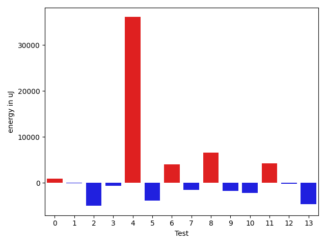

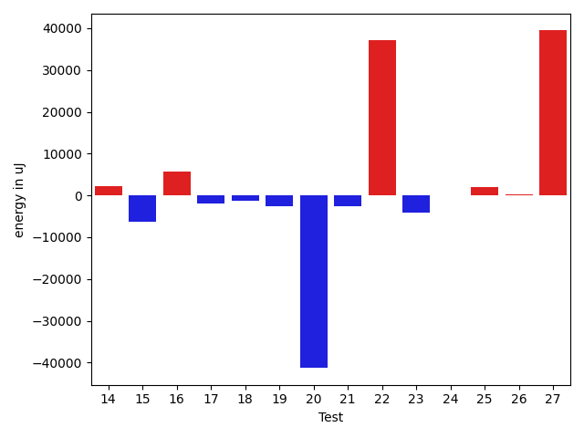

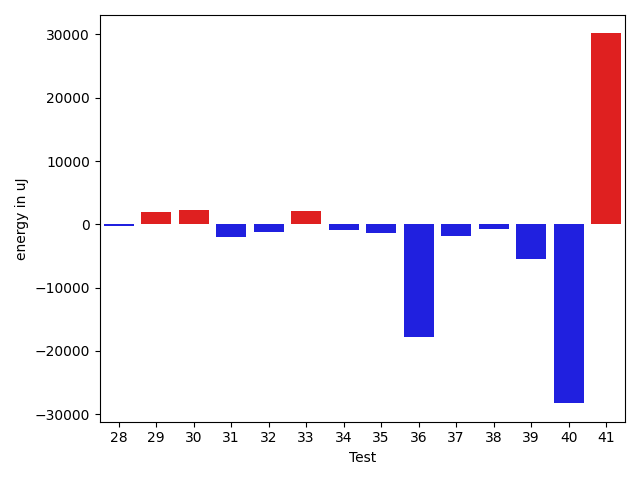

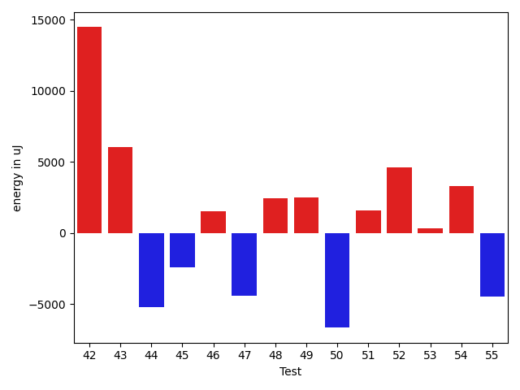

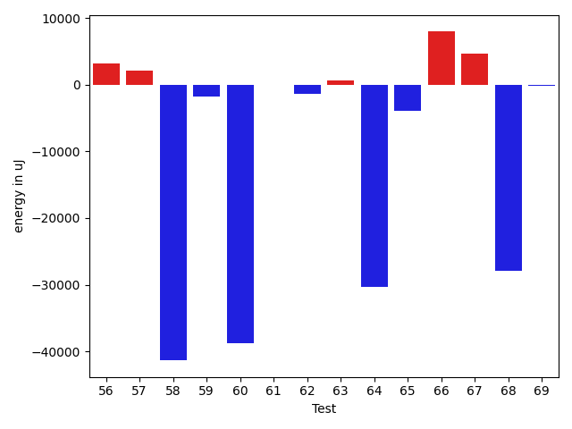

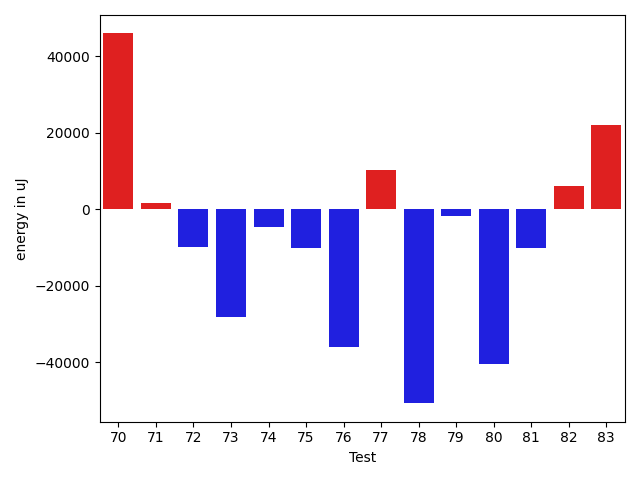

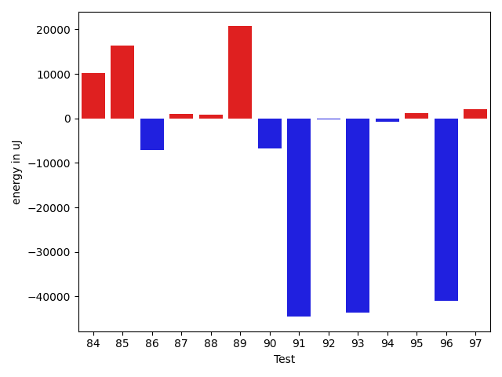

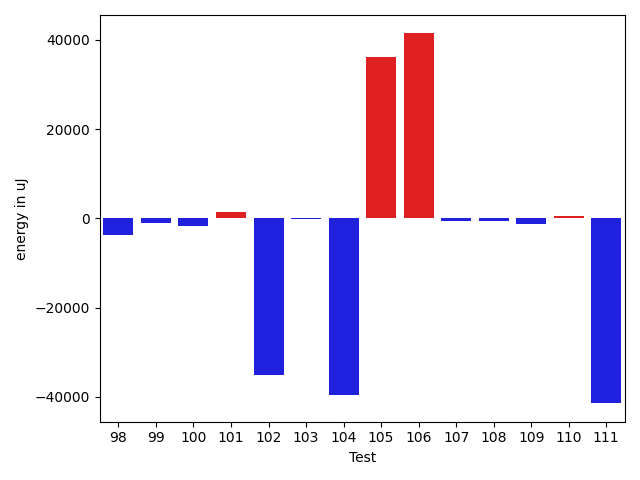

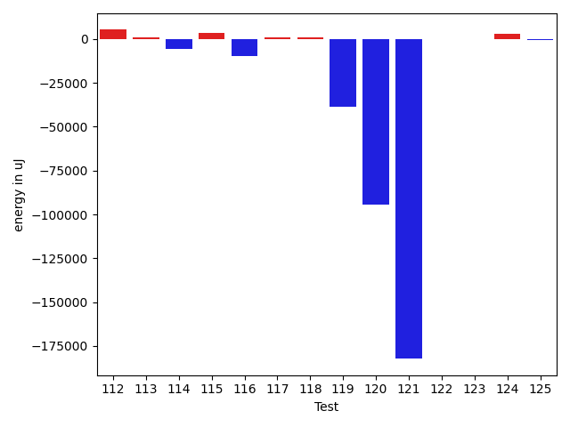

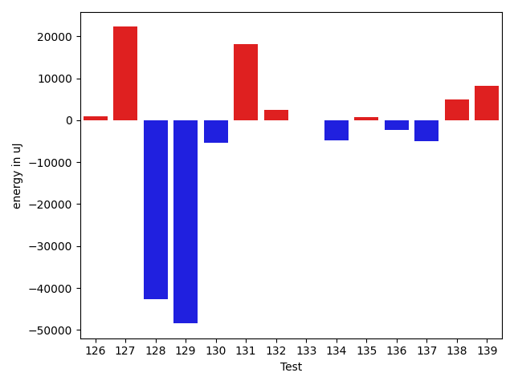

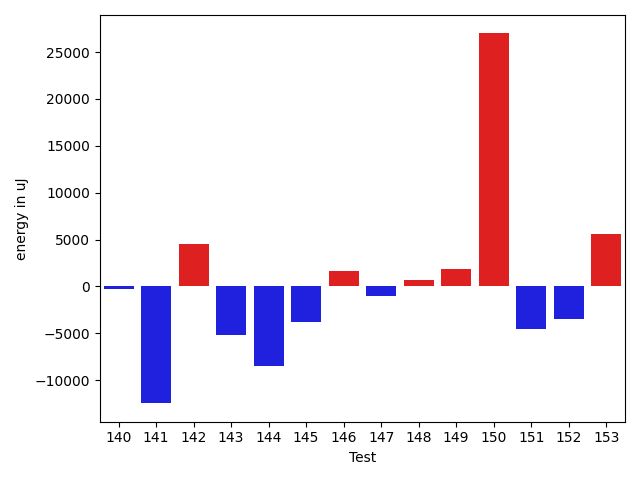

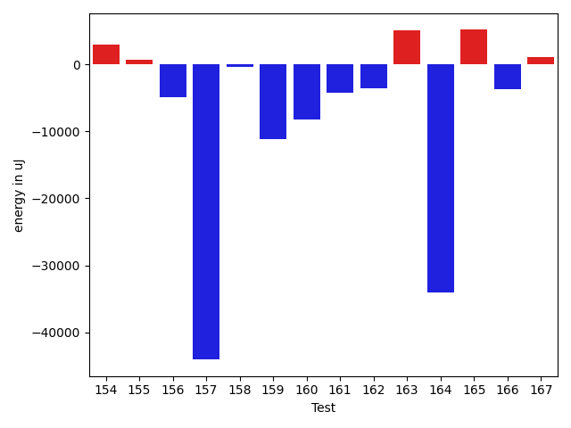

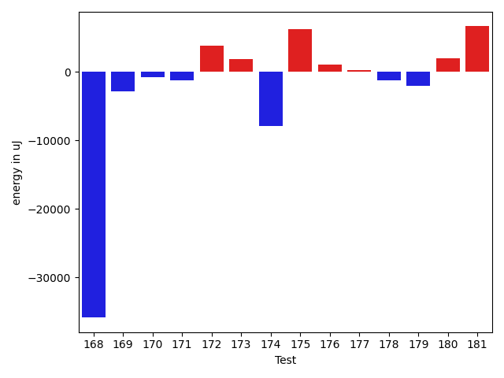

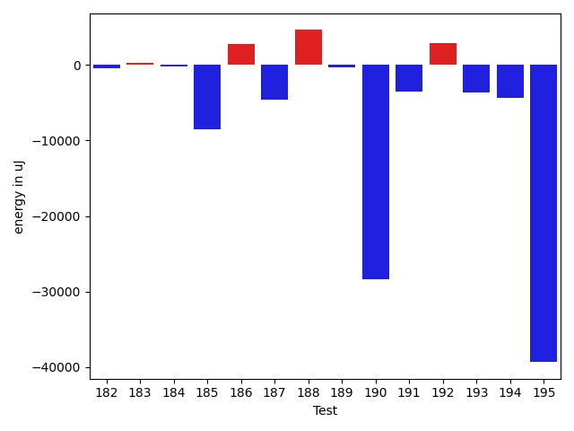

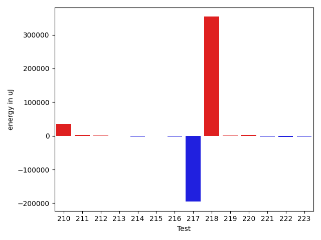

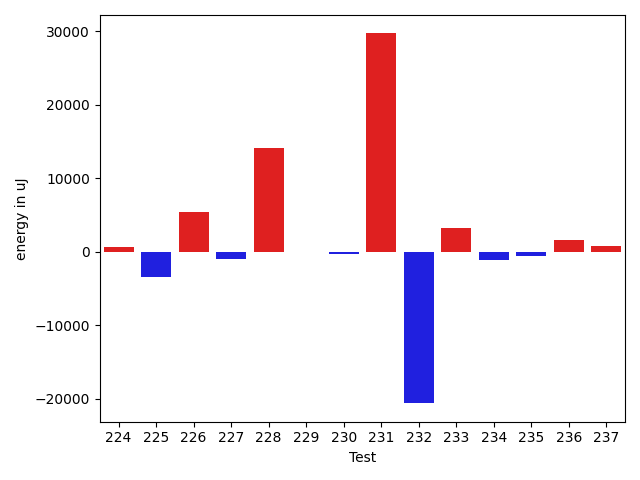

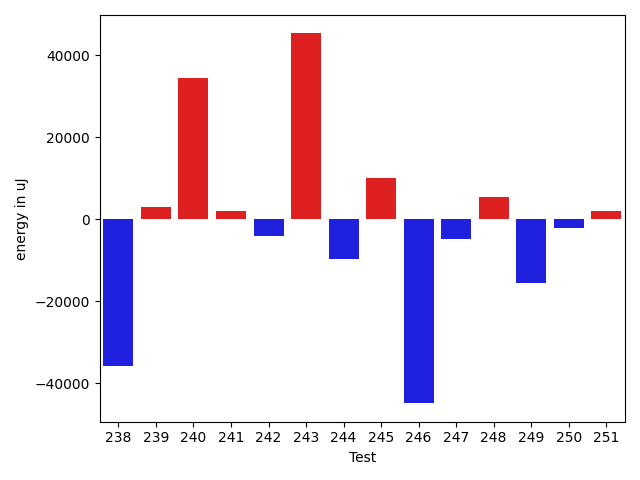

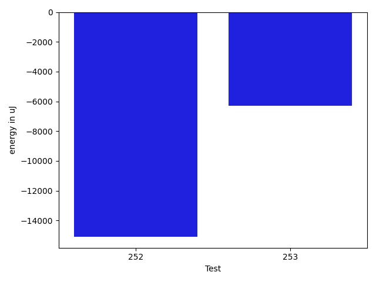

| ID | EnergyV1 | EnergyV2 | DeltaEnergy | σV1 | %σV1 | σV2 | %σV2 |
| --- | --- | --- | --- | --- | --- | --- | --- |
| 0 | 44617 | 45471 | 854 | 18831.83 | 42.21 | 2077.30 | 4.57 |
| 1 | 41931 | 41870 | -61 | 15353.59 | 36.62 | 142144.33 | 339.49 |
| 2 | 123535 | 118530 | -5005 | 17302.87 | 14.01 | 25682.63 | 21.67 |
| 3 | 38879 | 38208 | -671 | 15335.66 | 39.44 | 17803.78 | 46.60 |
| 4 | 44738 | 80811 | 36073 | 18949.04 | 42.36 | 21006.82 | 25.99 |
| 5 | 129333 | 125427 | -3906 | 27209.35 | 21.04 | 26544.92 | 21.16 |
| 6 | 144531 | 148559 | 4028 | 21065.27 | 14.57 | 25637.80 | 17.26 |
| 7 | 80871 | 79345 | -1526 | 21917.50 | 27.10 | 19551.69 | 24.64 |
| 8 | 80139 | 86731 | 6592 | 17147.41 | 21.40 | 29777.78 | 34.33 |
| 9 | 44861 | 43152 | -1709 | 12456.61 | 27.77 | 2553.66 | 5.92 |
| 10 | 44128 | 41931 | -2197 | 17789.02 | 40.31 | 12537.93 | 29.90 |
| 11 | 136047 | 140259 | 4212 | 48533.26 | 35.67 | 20602.69 | 14.69 |
| 12 | 46448 | 46203 | -245 | 20598.56 | 44.35 | 18078.46 | 39.13 |
| 13 | 600890 | 596250 | -4640 | 38056.55 | 6.33 | 26754.67 | 4.49 |
| 14 | 85937 | 88134 | 2197 | 17330.27 | 20.17 | 19877.25 | 22.55 |
| 15 | 91247 | 84961 | -6286 | 31295.95 | 34.30 | 18025.78 | 21.22 |
| 16 | 84167 | 89966 | 5799 | 21381.34 | 25.40 | 20903.79 | 23.24 |
| 17 | 46936 | 44922 | -2014 | 18270.32 | 38.93 | 2823.33 | 6.28 |
| 18 | 44678 | 43396 | -1282 | 19501.32 | 43.65 | 22501.96 | 51.85 |
| 19 | 91919 | 89294 | -2625 | 20367.33 | 22.16 | 24726.62 | 27.69 |
| 20 | 88379 | 47120 | -41259 | 23586.88 | 26.69 | 20548.72 | 43.61 |
| 21 | 49438 | 46875 | -2563 | 22055.73 | 44.61 | 29782.65 | 63.54 |
| 22 | 43945 | 81177 | 37232 | 22112.29 | 50.32 | 18641.38 | 22.96 |
| 23 | 86486 | 82336 | -4150 | 149226.57 | 172.54 | 3347.08 | 4.07 |
| 24 | 38574 | 38513 | -61 | 1000.46 | 2.59 | 12026.71 | 31.23 |
| 25 | 44250 | 46143 | 1893 | 18361.22 | 41.49 | 19677.58 | 42.64 |
| 26 | 44250 | 44556 | 306 | 18487.71 | 41.78 | 11465.49 | 25.73 |
| 27 | 45654 | 85083 | 39429 | 20557.75 | 45.03 | 20096.52 | 23.62 |
| 28 | 44739 | 44434 | -305 | 12147.14 | 27.15 | 3045.80 | 6.85 |
| 29 | 37476 | 39368 | 1892 | 2326.26 | 6.21 | 16108.68 | 40.92 |
| 30 | 41564 | 43884 | 2320 | 2417.91 | 5.82 | 16961.39 | 38.65 |
| 31 | 43152 | 41077 | -2075 | 2283.74 | 5.29 | 2571.66 | 6.26 |
| 32 | 74341 | 73181 | -1160 | 20037.78 | 26.95 | 19966.62 | 27.28 |
| 33 | 38025 | 40161 | 2136 | 1153.41 | 3.03 | 16996.77 | 42.32 |
| 34 | 121094 | 120178 | -916 | 12262.48 | 10.13 | 12891.96 | 10.73 |
| 35 | 42602 | 41260 | -1342 | 2209.64 | 5.19 | 2470.60 | 5.99 |
| 36 | 228088 | 210266 | -17822 | 22386.19 | 9.81 | 23031.36 | 10.95 |
| 37 | 78613 | 76721 | -1892 | 14169.35 | 18.02 | 14603.36 | 19.03 |
| 38 | 153259 | 152465 | -794 | 28417.69 | 18.54 | 19368.32 | 12.70 |
| 39 | 41382 | 35949 | -5433 | 13886.04 | 33.56 | 14657.91 | 40.77 |
| 40 | 119385 | 91125 | -28260 | 22391.56 | 18.76 | 18689.78 | 20.51 |
| 41 | 47485 | 77637 | 30152 | 21789.27 | 45.89 | 21585.92 | 27.80 |
| 42 | 179077 | 193542 | 14465 | 25999.59 | 14.52 | 23583.73 | 12.19 |
| 43 | 166504 | 172546 | 6042 | 22090.82 | 13.27 | 15726.63 | 9.11 |
| 44 | 237975 | 232788 | -5187 | 17934.73 | 7.54 | 24316.62 | 10.45 |
| 45 | 113281 | 110840 | -2441 | 19601.82 | 17.30 | 16696.80 | 15.06 |
| 46 | 268798 | 270324 | 1526 | 40312.13 | 15.00 | 73643.03 | 27.24 |
| 47 | 88745 | 84351 | -4394 | 19025.49 | 21.44 | 13931.49 | 16.52 |
| 48 | 122925 | 125366 | 2441 | 17388.05 | 14.15 | 22273.17 | 17.77 |
| 49 | 130065 | 132568 | 2503 | 33916.29 | 26.08 | 19985.17 | 15.08 |
| 50 | 171814 | 165161 | -6653 | 23887.84 | 13.90 | 38588.22 | 23.36 |
| 51 | 119324 | 120911 | 1587 | 22818.07 | 19.12 | 20971.22 | 17.34 |
| 52 | 166687 | 171325 | 4638 | 55306.10 | 33.18 | 31836.93 | 18.58 |
| 53 | 117065 | 117371 | 306 | 25827.21 | 22.06 | 20554.44 | 17.51 |
| 54 | 126159 | 129455 | 3296 | 24881.77 | 19.72 | 37059.19 | 28.63 |
| 55 | 44983 | 40528 | -4455 | 3208.38 | 7.13 | 2635.80 | 6.50 |
| 56 | 129822 | 133056 | 3234 | 15244.40 | 11.74 | 41216.28 | 30.98 |
| 57 | 170165 | 172302 | 2137 | 35248.03 | 20.71 | 23299.27 | 13.52 |
| 58 | 86426 | 45044 | -41382 | 21928.04 | 25.37 | 19141.06 | 42.49 |
| 59 | 92163 | 90453 | -1710 | 21015.34 | 22.80 | 15469.50 | 17.10 |
| 60 | 82092 | 43274 | -38818 | 24444.77 | 29.78 | 19683.80 | 45.49 |
| 61 | 87646 | 87647 | 1 | 20313.78 | 23.18 | 13847.52 | 15.80 |
| 62 | 46631 | 45349 | -1282 | 21322.19 | 45.73 | 13210.36 | 29.13 |
| 63 | 88684 | 89416 | 732 | 16962.67 | 19.13 | 21429.16 | 23.97 |
| 64 | 169250 | 138977 | -30273 | 18752.68 | 11.08 | 19921.23 | 14.33 |
| 65 | 135497 | 131652 | -3845 | 16226.98 | 11.98 | 31229.20 | 23.72 |
| 66 | 171325 | 179382 | 8057 | 55995.83 | 32.68 | 34087.11 | 19.00 |
| 67 | 282897 | 287657 | 4760 | 27031.71 | 9.56 | 15938.98 | 5.54 |
| 68 | 74951 | 46997 | -27954 | 20373.31 | 27.18 | 19369.89 | 41.22 |
| 69 | 74035 | 73853 | -182 | 16567.34 | 22.38 | 15213.00 | 20.60 |
| 70 | 579284 | 625182 | 45898 | 74183.44 | 12.81 | 90947.80 | 14.55 |
| 71 | 247008 | 248534 | 1526 | 23179.90 | 9.38 | 13067.46 | 5.26 |
| 72 | 278502 | 268738 | -9764 | 35260.22 | 12.66 | 29096.71 | 10.83 |
| 73 | 208068 | 179992 | -28076 | 20810.69 | 10.00 | 20596.71 | 11.44 |
| 74 | 154724 | 150207 | -4517 | 20063.56 | 12.97 | 23580.86 | 15.70 |
| 75 | 135376 | 125305 | -10071 | 45648.08 | 33.72 | 15475.33 | 12.35 |
| 76 | 82337 | 46448 | -35889 | 21677.37 | 26.33 | 23436.40 | 50.46 |
| 77 | 239257 | 249572 | 10315 | 16193.44 | 6.77 | 26767.15 | 10.73 |
| 78 | 297912 | 247253 | -50659 | 36768.71 | 12.34 | 17205.51 | 6.96 |
| 79 | 247497 | 245788 | -1709 | 10801.88 | 4.36 | 18804.61 | 7.65 |
| 80 | 218567 | 178222 | -40345 | 14207.45 | 6.50 | 34189.77 | 19.18 |
| 81 | 265991 | 255858 | -10133 | 18724.99 | 7.04 | 25128.99 | 9.82 |
| 82 | 215942 | 221984 | 6042 | 28310.21 | 13.11 | 20453.74 | 9.21 |
| 83 | 192382 | 214355 | 21973 | 33204.86 | 17.26 | 20418.08 | 9.53 |
| 84 | 319884 | 330078 | 10194 | 25626.36 | 8.01 | 22664.39 | 6.87 |
| 85 | 84839 | 101135 | 16296 | 23611.25 | 27.83 | 40080.23 | 39.63 |
| 86 | 88257 | 81177 | -7080 | 20232.11 | 22.92 | 5457.44 | 6.72 |
| 87 | 43824 | 44921 | 1097 | 18299.87 | 41.76 | 16028.47 | 35.68 |
| 88 | 42175 | 42969 | 794 | 18672.91 | 44.27 | 18402.56 | 42.83 |
| 89 | 1611446 | 1632137 | 20691 | 67745.26 | 4.20 | 79905.66 | 4.90 |
| 90 | 149352 | 142578 | -6774 | 17710.37 | 11.86 | 18995.17 | 13.32 |
| 91 | 130737 | 86181 | -44556 | 16159.29 | 12.36 | 16976.12 | 19.70 |
| 92 | 73181 | 72998 | -183 | 18581.66 | 25.39 | 18768.64 | 25.71 |
| 93 | 88684 | 45044 | -43640 | 132377.17 | 149.27 | 14466.89 | 32.12 |
| 94 | 44617 | 43884 | -733 | 2652.47 | 5.94 | 211691.03 | 482.39 |
| 95 | 331969 | 333190 | 1221 | 20481.01 | 6.17 | 29098.34 | 8.73 |
| 96 | 86364 | 45410 | -40954 | 21915.18 | 25.38 | 20474.32 | 45.09 |
| 97 | 42053 | 44189 | 2136 | 19227.80 | 45.72 | 22113.79 | 50.04 |
| 98 | 88684 | 84899 | -3785 | 29071.19 | 32.78 | 30052.06 | 35.40 |
| 99 | 38818 | 37781 | -1037 | 1924.32 | 4.96 | 2081.11 | 5.51 |
| 100 | 85205 | 83496 | -1709 | 14176.76 | 16.64 | 15433.13 | 18.48 |
| 101 | 37110 | 38574 | 1464 | 1946.88 | 5.25 | 1301.42 | 3.37 |
| 102 | 168456 | 133422 | -35034 | 20234.16 | 12.01 | 22926.88 | 17.18 |
| 103 | 78552 | 78369 | -183 | 5453.66 | 6.94 | 10454.20 | 13.34 |
| 104 | 85876 | 46325 | -39551 | 24237.11 | 28.22 | 23942.06 | 51.68 |
| 105 | 46570 | 82763 | 36193 | 22261.68 | 47.80 | 20920.26 | 25.28 |
| 106 | 40344 | 81787 | 41443 | 23151.97 | 57.39 | 20776.19 | 25.40 |
| 107 | 47058 | 46570 | -488 | 21242.05 | 45.14 | 18845.36 | 40.47 |
| 108 | 44922 | 44372 | -550 | 16212.41 | 36.09 | 10155.34 | 22.89 |
| 109 | 79773 | 78613 | -1160 | 19173.84 | 24.04 | 19899.97 | 25.31 |
| 110 | 39856 | 40405 | 549 | 3879.72 | 9.73 | 17258.38 | 42.71 |
| 111 | 87951 | 46508 | -41443 | 20644.11 | 23.47 | 21484.31 | 46.19 |
| 112 | 77453 | 82702 | 5249 | 19057.33 | 24.61 | 20976.87 | 25.36 |
| 113 | 88867 | 89599 | 732 | 21758.26 | 24.48 | 16926.76 | 18.89 |
| 114 | 87768 | 82093 | -5675 | 14324.40 | 16.32 | 22158.23 | 26.99 |
| 115 | 162720 | 166076 | 3356 | 24109.04 | 14.82 | 17738.69 | 10.68 |
| 116 | 80993 | 71411 | -9582 | 21786.14 | 26.90 | 19741.13 | 27.64 |
| 117 | 80078 | 81176 | 1098 | 22741.31 | 28.40 | 17569.52 | 21.64 |
| 118 | 44190 | 45105 | 915 | 17908.20 | 40.53 | 20331.09 | 45.08 |
| 119 | 85327 | 46814 | -38513 | 21093.82 | 24.72 | 21570.45 | 46.08 |
| 120 | 1763850 | 1669612 | -94238 | 203218.89 | 11.52 | 175971.71 | 10.54 |
| 121 | 2054926 | 1872676 | -182250 | 281887.85 | 13.72 | 254630.21 | 13.60 |
| 122 | 42846 | 42541 | -305 | 2503.77 | 5.84 | 3061.61 | 7.20 |
| 123 | 47425 | 47180 | -245 | 26755.27 | 56.42 | 21068.45 | 44.66 |
| 124 | 154113 | 156982 | 2869 | 19097.47 | 12.39 | 19694.73 | 12.55 |
| 125 | 88806 | 88196 | -610 | 24471.03 | 27.56 | 2548.07 | 2.89 |
| 126 | 78857 | 79712 | 855 | 20067.90 | 25.45 | 20507.66 | 25.73 |
| 127 | 374694 | 396972 | 22278 | 36265.18 | 9.68 | 23186.20 | 5.84 |
| 128 | 83191 | 40527 | -42664 | 23007.79 | 27.66 | 19739.41 | 48.71 |
| 129 | 354674 | 306212 | -48462 | 39229.94 | 11.06 | 41311.67 | 13.49 |
| 130 | 171630 | 166198 | -5432 | 26493.20 | 15.44 | 37291.33 | 22.44 |
| 131 | 145386 | 163574 | 18188 | 22056.48 | 15.17 | 26555.25 | 16.23 |
| 132 | 305419 | 307799 | 2380 | 39107.10 | 12.80 | 32059.52 | 10.42 |
| 133 | 379332 | 379272 | -60 | 25235.62 | 6.65 | 39495.98 | 10.41 |
| 134 | 176269 | 171448 | -4821 | 19678.61 | 11.16 | 11973.75 | 6.98 |
| 135 | 135253 | 135925 | 672 | 19638.94 | 14.52 | 67383.16 | 49.57 |
| 136 | 40100 | 37781 | -2319 | 14059.74 | 35.06 | 1516.09 | 4.01 |
| 137 | 45532 | 40466 | -5066 | 7325.59 | 16.09 | 3213.86 | 7.94 |
| 138 | 120117 | 125061 | 4944 | 19950.88 | 16.61 | 13459.85 | 10.76 |
| 139 | 127502 | 135803 | 8301 | 22944.64 | 18.00 | 22743.78 | 16.75 |
| 140 | 83374 | 83069 | -305 | 16884.73 | 20.25 | 2828.39 | 3.40 |
| 141 | 143676 | 131226 | -12450 | 22785.67 | 15.86 | 17697.39 | 13.49 |
| 142 | 235656 | 240173 | 4517 | 29364.74 | 12.46 | 18379.26 | 7.65 |
| 143 | 89783 | 84656 | -5127 | 22278.90 | 24.81 | 20963.96 | 24.76 |
| 144 | 89966 | 81482 | -8484 | 19752.87 | 21.96 | 20124.29 | 24.70 |
| 145 | 91919 | 88134 | -3785 | 14526.09 | 15.80 | 13727.41 | 15.58 |
| 146 | 39551 | 41199 | 1648 | 17897.70 | 45.25 | 19135.76 | 46.45 |
| 147 | 74768 | 73792 | -976 | 12862.12 | 17.20 | 1939.87 | 2.63 |
| 148 | 45533 | 46204 | 671 | 14425.18 | 31.68 | 19826.73 | 42.91 |
| 149 | 211791 | 213683 | 1892 | 46768.42 | 22.08 | 20339.17 | 9.52 |
| 150 | 188537 | 215515 | 26978 | 10587.11 | 5.62 | 25516.72 | 11.84 |
| 151 | 43030 | 38513 | -4517 | 13358.50 | 31.04 | 18740.21 | 48.66 |
| 152 | 122376 | 118957 | -3419 | 20760.62 | 16.96 | 19896.00 | 16.73 |
| 153 | 1257931 | 1263547 | 5616 | 98030.21 | 7.79 | 92287.47 | 7.30 |
| 154 | 215026 | 217956 | 2930 | 55394.70 | 25.76 | 14231.09 | 6.53 |
| 155 | 87464 | 88073 | 609 | 15079.55 | 17.24 | 19685.50 | 22.35 |
| 156 | 80078 | 75134 | -4944 | 17052.47 | 21.29 | 15029.51 | 20.00 |
| 157 | 177734 | 133666 | -44068 | 26370.14 | 14.84 | 21928.83 | 16.41 |
| 158 | 176086 | 175720 | -366 | 25597.30 | 14.54 | 28253.98 | 16.08 |
| 159 | 172729 | 161560 | -11169 | 36461.98 | 21.11 | 30009.76 | 18.57 |
| 160 | 124694 | 116394 | -8300 | 22750.66 | 18.25 | 14163.32 | 12.17 |
| 161 | 87768 | 83496 | -4272 | 18782.36 | 21.40 | 22882.14 | 27.41 |
| 162 | 45349 | 41748 | -3601 | 21784.47 | 48.04 | 16998.65 | 40.72 |
| 163 | 80932 | 85999 | 5067 | 33117.91 | 40.92 | 27893.03 | 32.43 |
| 164 | 78613 | 44556 | -34057 | 24893.21 | 31.67 | 22041.77 | 49.47 |
| 165 | 168578 | 173706 | 5128 | 42684.00 | 25.32 | 24680.97 | 14.21 |
| 166 | 43640 | 39856 | -3784 | 13356.04 | 30.61 | 3448.06 | 8.65 |
| 167 | 42053 | 43091 | 1038 | 19447.21 | 46.24 | 19171.86 | 44.49 |
| 168 | 78308 | 42419 | -35889 | 22106.00 | 28.23 | 19886.57 | 46.88 |
| 169 | 48340 | 45533 | -2807 | 20358.23 | 42.11 | 12885.53 | 28.30 |
| 170 | 46997 | 46264 | -733 | 19435.95 | 41.36 | 2814.78 | 6.08 |
| 171 | 520507 | 519285 | -1222 | 41526.18 | 7.98 | 28139.12 | 5.42 |
| 172 | 117859 | 121704 | 3845 | 20190.96 | 17.13 | 20497.15 | 16.84 |
| 173 | 133117 | 135010 | 1893 | 53358.74 | 40.08 | 20098.07 | 14.89 |
| 174 | 92407 | 84473 | -7934 | 63864.25 | 69.11 | 22139.54 | 26.21 |
| 175 | 69580 | 75867 | 6287 | 19035.00 | 27.36 | 25482.80 | 33.59 |
| 176 | 91675 | 92774 | 1099 | 37975.49 | 41.42 | 11758.74 | 12.67 |
| 177 | 42358 | 42664 | 306 | 14836.55 | 35.03 | 16068.93 | 37.66 |
| 178 | 92346 | 91064 | -1282 | 27729.00 | 30.03 | 19564.13 | 21.48 |
| 179 | 44739 | 42664 | -2075 | 2230.20 | 4.98 | 15728.85 | 36.87 |
| 180 | 83984 | 85937 | 1953 | 2150.09 | 2.56 | 17482.13 | 20.34 |
| 181 | 306517 | 313171 | 6654 | 29414.49 | 9.60 | 16195.38 | 5.17 |
| 182 | 76476 | 76050 | -426 | 16392.52 | 21.43 | 20148.49 | 26.49 |
| 183 | 44861 | 45166 | 305 | 19901.45 | 44.36 | 13712.21 | 30.36 |
| 184 | 44006 | 43823 | -183 | 20069.67 | 45.61 | 20238.68 | 46.18 |
| 185 | 105896 | 97412 | -8484 | 16476.35 | 15.56 | 17247.22 | 17.71 |
| 186 | 83496 | 86303 | 2807 | 14503.78 | 17.37 | 24267.66 | 28.12 |
| 187 | 122985 | 118346 | -4639 | 15099.61 | 12.28 | 15913.69 | 13.45 |
| 188 | 151489 | 156128 | 4639 | 20957.90 | 13.83 | 21690.36 | 13.89 |
| 189 | 118897 | 118591 | -306 | 17456.55 | 14.68 | 17822.15 | 15.03 |
| 190 | 73364 | 44922 | -28442 | 18549.51 | 25.28 | 17656.98 | 39.31 |
| 191 | 86975 | 83435 | -3540 | 4957.40 | 5.70 | 14421.00 | 17.28 |
| 192 | 145020 | 147949 | 2929 | 51149.39 | 35.27 | 26234.68 | 17.73 |
| 193 | 90637 | 86975 | -3662 | 16230.06 | 17.91 | 18621.10 | 21.41 |
| 194 | 80139 | 75744 | -4395 | 6171.12 | 7.70 | 14242.20 | 18.80 |
| 195 | 130920 | 91552 | -39368 | 23611.92 | 18.04 | 20028.05 | 21.88 |
| 196 | 84167 | 86547 | 2380 | 19802.20 | 23.53 | 13410.14 | 15.49 |
| 197 | 87646 | 84289 | -3357 | 18124.45 | 20.68 | 23227.42 | 27.56 |
| 198 | 217651 | 177856 | -39795 | 26497.60 | 12.17 | 52055.64 | 29.27 |
| 199 | 73242 | 37842 | -35400 | 16782.28 | 22.91 | 17060.80 | 45.08 |
| 200 | 210205 | 216369 | 6164 | 53403.93 | 25.41 | 25261.07 | 11.67 |
| 201 | 181885 | 182799 | 914 | 3019.74 | 1.66 | 12773.00 | 6.99 |
| 202 | 38025 | 37354 | -671 | 2222.84 | 5.85 | 1865.34 | 4.99 |
| 203 | 87951 | 86608 | -1343 | 19920.03 | 22.65 | 20320.58 | 23.46 |
| 204 | 38086 | 38208 | 122 | 13440.99 | 35.29 | 2096.57 | 5.49 |
| 205 | 151977 | 154296 | 2319 | 9589.19 | 6.31 | 18459.31 | 11.96 |
| 206 | 164246 | 159179 | -5067 | 22625.73 | 13.78 | 19940.56 | 12.53 |
| 207 | 445129 | 408325 | -36804 | 61400.82 | 13.79 | 24483.42 | 6.00 |
| 208 | 185546 | 185363 | -183 | 16607.34 | 8.95 | 11823.07 | 6.38 |
| 209 | 72692 | 83068 | 10376 | 28048.32 | 38.59 | 23263.28 | 28.01 |
| 210 | 41199 | 76232 | 35033 | 19096.36 | 46.35 | 19095.94 | 25.05 |
| 211 | 78979 | 81237 | 2258 | 18027.31 | 22.83 | 12952.47 | 15.94 |
| 212 | 38574 | 39612 | 1038 | 11802.62 | 30.60 | 10518.76 | 26.55 |
| 213 | 90149 | 89904 | -245 | 20570.58 | 22.82 | 16434.08 | 18.28 |
| 214 | 89600 | 88318 | -1282 | 20942.89 | 23.37 | 19702.45 | 22.31 |
| 215 | 46203 | 45410 | -793 | 13573.51 | 29.38 | 15343.14 | 33.79 |
| 216 | 92468 | 90332 | -2136 | 30032.83 | 32.48 | 31864.33 | 35.27 |
| 217 | 4813098 | 4617725 | -195373 | 596078.95 | 12.38 | 681435.69 | 14.76 |
| 218 | 3858206 | 4211903 | 353697 | 633791.98 | 16.43 | 829008.27 | 19.68 |
| 219 | 121094 | 121887 | 793 | 13955.97 | 11.52 | 27608.15 | 22.65 |
| 220 | 46143 | 48950 | 2807 | 20988.96 | 45.49 | 21866.62 | 44.67 |
| 221 | 76416 | 73913 | -2503 | 13367.25 | 17.49 | 17360.64 | 23.49 |
| 222 | 89355 | 85815 | -3540 | 22124.19 | 24.76 | 22411.28 | 26.12 |
| 223 | 47607 | 46021 | -1586 | 21646.50 | 45.47 | 18617.33 | 40.45 |
| 224 | 78308 | 78918 | 610 | 19218.74 | 24.54 | 14628.56 | 18.54 |
| 225 | 43457 | 40039 | -3418 | 16805.49 | 38.67 | 17151.39 | 42.84 |
| 226 | 80322 | 85693 | 5371 | 19303.72 | 24.03 | 20312.11 | 23.70 |
| 227 | 42968 | 41931 | -1037 | 22226.43 | 51.73 | 18859.03 | 44.98 |
| 228 | 361449 | 375548 | 14099 | 27287.39 | 7.55 | 26270.39 | 7.00 |
| 229 | 148742 | 148681 | -61 | 48968.24 | 32.92 | 2995.52 | 2.01 |
| 230 | 43457 | 43152 | -305 | 14641.82 | 33.69 | 19132.17 | 44.34 |
| 231 | 167724 | 197448 | 29724 | 330329.37 | 196.95 | 19558.46 | 9.91 |
| 232 | 278869 | 258239 | -20630 | 34025.31 | 12.20 | 39700.16 | 15.37 |
| 233 | 157471 | 160705 | 3234 | 24019.00 | 15.25 | 17631.86 | 10.97 |
| 234 | 122193 | 121032 | -1161 | 18440.14 | 15.09 | 10894.22 | 9.00 |
| 235 | 80323 | 79711 | -612 | 12626.83 | 15.72 | 17519.28 | 21.98 |
| 236 | 41015 | 42664 | 1649 | 16758.44 | 40.86 | 13278.07 | 31.12 |
| 237 | 90454 | 91186 | 732 | 21816.36 | 24.12 | 23495.82 | 25.77 |
| 238 | 79528 | 43823 | -35705 | 20829.54 | 26.19 | 21408.41 | 48.85 |
| 239 | 43091 | 46143 | 3052 | 18975.31 | 44.04 | 21672.32 | 46.97 |
| 240 | 44922 | 79468 | 34546 | 22568.27 | 50.24 | 13641.04 | 17.17 |
| 241 | 46326 | 48278 | 1952 | 20977.43 | 45.28 | 20302.61 | 42.05 |
| 242 | 48400 | 44433 | -3967 | 20486.37 | 42.33 | 3092.24 | 6.96 |
| 243 | 254577 | 299865 | 45288 | 38783.83 | 15.23 | 31259.91 | 10.42 |
| 244 | 463988 | 454283 | -9705 | 50598.05 | 10.91 | 28282.37 | 6.23 |
| 245 | 185974 | 195922 | 9948 | 78411.90 | 42.16 | 26131.53 | 13.34 |
| 246 | 171448 | 126586 | -44862 | 24412.27 | 14.24 | 21022.97 | 16.61 |
| 247 | 131775 | 127014 | -4761 | 21973.81 | 16.68 | 13657.36 | 10.75 |
| 248 | 78796 | 84290 | 5494 | 24684.51 | 31.33 | 27376.37 | 32.48 |
| 249 | 636839 | 621214 | -15625 | 30684.66 | 4.82 | 118194.19 | 19.03 |
| 250 | 91797 | 89660 | -2137 | 20972.09 | 22.85 | 18483.45 | 20.62 |
| 251 | 156799 | 158874 | 2075 | 22584.16 | 14.40 | 23409.95 | 14.73 |
| 252 | 318114 | 303039 | -15075 | 47514.47 | 14.94 | 44352.65 | 14.64 |
| 253 | 342528 | 336241 | -6287 | 34420.15 | 10.05 | 30278.62 | 9.01 |

## Misc.

| ID | Test Class | Test Method |
| --- | --- | --- |
| 0 | com.google.gson.functional.PrimitiveTest | testDeserializePrimitiveWrapperAsObjectField |
| 1 | com.google.gson.functional.ObjectTest | testStringFieldWithEmptyValueDeserialization |
| 2 | com.google.gson.functional.ObjectTest | testNullObjectFieldsDeserialization |
| 3 | com.google.gson.functional.ObjectTest | testEmptyCollectionInAnObjectDeserialization |
| 4 | com.google.gson.functional.ObjectTest | testNestedSerialization |
| 5 | com.google.gson.functional.ObjectTest | testArrayOfArraysDeserialization |
| 6 | com.google.gson.functional.ObjectTest | testSingletonLists |
| 7 | com.google.gson.functional.ObjectTest | testNullFieldsSerialization |
| 8 | com.google.gson.functional.ObjectTest | testClassWithTransientFieldsDeserialization |
| 9 | com.google.gson.functional.ObjectTest | testStringFieldWithNumberValueDeserialization |
| 10 | com.google.gson.functional.ObjectTest | testPrivateNoArgConstructorDeserialization |
| 11 | com.google.gson.functional.ObjectTest | testArrayOfObjectsAsFields |
| 12 | com.google.gson.functional.ObjectTest | testClassWithTransientFieldsDeserializationTransientFieldsPassedInJsonAreIgnored |
| 13 | com.google.gson.functional.ObjectTest | testDateAsMapObjectField |
| 14 | com.google.gson.functional.ObjectTest | testPrimitiveArrayFieldSerialization |
| 15 | com.google.gson.functional.ObjectTest | testPrimitiveArrayInAnObjectDeserialization |
| 16 | com.google.gson.functional.ObjectTest | testStringFieldWithEmptyValueSerialization |
| 17 | com.google.gson.functional.ObjectTest | testNullArraysDeserialization |
| 18 | com.google.gson.functional.ObjectTest | testInnerClassSerialization |
| 19 | com.google.gson.functional.ObjectTest | testEmptyCollectionInAnObjectSerialization |
| 20 | com.google.gson.functional.ObjectTest | testBagOfPrimitiveWrappersSerialization |
| 21 | com.google.gson.functional.ObjectTest | testObjectFieldNamesWithoutQuotesDeserialization |
| 22 | com.google.gson.functional.ObjectTest | testArrayOfObjectsDeserialization |
| 23 | com.google.gson.functional.ObjectTest | testArrayOfArraysSerialization |
| 24 | com.google.gson.functional.ObjectTest | testJsonInSingleQuotesDeserialization |
| 25 | com.google.gson.functional.ObjectTest | testBagOfPrimitivesSerialization |
| 26 | com.google.gson.functional.ObjectTest | testNestedDeserialization |
| 27 | com.google.gson.functional.ObjectTest | testBagOfPrimitiveWrappersDeserialization |
| 28 | com.google.gson.functional.ObjectTest | testJsonInMixedQuotesDeserialization |
| 29 | com.google.gson.functional.ObjectTest | testNullFieldsDeserialization |
| 30 | com.google.gson.functional.ObjectTest | testArrayOfObjectsSerialization |
| 31 | com.google.gson.functional.ObjectTest | testClassWithTransientFieldsSerialization |
| 32 | com.google.gson.functional.ObjectTest | testNullPrimitiveFieldsDeserialization |
| 33 | com.google.gson.functional.ObjectTest | testBagOfPrimitivesDeserialization |
| 34 | com.google.gson.functional.ObjectTest | testInnerClassDeserialization |
| 35 | com.google.gson.functional.ObjectTest | testClassWithObjectFieldSerialization |
| 36 | com.google.gson.functional.StreamingTypeAdaptersTest | testNullSafe |
| 37 | com.google.gson.functional.StreamingTypeAdaptersTest | testSerializeWithCustomTypeAdapter |
| 38 | com.google.gson.functional.StreamingTypeAdaptersTest | testDeserializeWithCustomTypeAdapter |
| 39 | com.google.gson.functional.StreamingTypeAdaptersTest | testSerializeRecursive |
| 40 | com.google.gson.functional.CustomDeserializerTest | testDefaultConstructorNotCalledOnField |
| 41 | com.google.gson.functional.CustomDeserializerTest | testDefaultConstructorNotCalledOnObject |
| 42 | com.google.gson.functional.CustomDeserializerTest | testCustomDeserializerReturnsNullForArrayElementsForArrayField |
| 43 | com.google.gson.functional.CustomDeserializerTest | testCustomDeserializerReturnsNull |
| 44 | com.google.gson.functional.CustomDeserializerTest | testJsonTypeFieldBasedDeserialization |
| 45 | com.google.gson.functional.ExclusionStrategyFunctionalTest | testExclusionStrategySerializationDoesNotImpactSerialization |
| 46 | com.google.gson.functional.ExclusionStrategyFunctionalTest | testExclusionStrategyWithMode |
| 47 | com.google.gson.functional.ExclusionStrategyFunctionalTest | testExclusionStrategySerializationDoesNotImpactDeserialization |
| 48 | com.google.gson.functional.ExclusionStrategyFunctionalTest | testExcludeTopLevelClassDeserializationDoesNotImpactSerialization |
| 49 | com.google.gson.functional.ExclusionStrategyFunctionalTest | testExcludeTopLevelClassSerializationDoesNotImpactDeserialization |
| 50 | com.google.gson.functional.ExclusionStrategyFunctionalTest | testExclusionStrategyDeserialization |
| 51 | com.google.gson.functional.ExclusionStrategyFunctionalTest | testExclusionStrategySerialization |
| 52 | com.google.gson.MixedStreamTest | testReaderDoesNotMutateState |
| 53 | com.google.gson.MixedStreamTest | testWriteClosed |
| 54 | com.google.gson.MixedStreamTest | testWriteInvalidState |
| 55 | com.google.gson.MixedStreamTest | testWriteDoesNotMutateState |
| 56 | com.google.gson.MixedStreamTest | testWriteMixedStreamed |
| 57 | com.google.gson.MixedStreamTest | testReadMixedStreamed |
| 58 | com.google.gson.functional.JsonParserTest | testBadTypeForDeserializingCustomTree |
| 59 | com.google.gson.functional.JsonParserTest | testBadFieldTypeForCustomDeserializerCustomTree |
| 60 | com.google.gson.functional.JsonParserTest | testChangingCustomTreeAndDeserializing |
| 61 | com.google.gson.functional.JsonParserTest | testBadFieldTypeForDeserializingCustomTree |
| 62 | com.google.gson.functional.JsonParserTest | testDeserializingCustomTree |
| 63 | com.google.gson.functional.ThrowableFunctionalTest | testExceptionWithoutCause |
| 64 | com.google.gson.functional.ThrowableFunctionalTest | testErrornWithCause |
| 65 | com.google.gson.functional.ThrowableFunctionalTest | testSerializedNameOnExceptionFields |
| 66 | com.google.gson.functional.ThrowableFunctionalTest | testErrorWithoutCause |
| 67 | com.google.gson.functional.ThrowableFunctionalTest | testExceptionWithCause |
| 68 | com.google.gson.functional.InterfaceTest | testSerializingObjectImplementingInterface |
| 69 | com.google.gson.functional.InterfaceTest | testSerializingInterfaceObjectField |
| 70 | com.google.gson.functional.ParameterizedTypesTest | testParameterizedTypeGenericArraysSerialization |
| 71 | com.google.gson.functional.ParameterizedTypesTest | testParameterizedTypesWithWriterSerialization |
| 72 | com.google.gson.functional.ParameterizedTypesTest | testVariableTypeArrayDeserialization |
| 73 | com.google.gson.functional.ParameterizedTypesTest | testParameterizedTypeWithReaderDeserialization |
| 74 | com.google.gson.functional.ParameterizedTypesTest | testDeepParameterizedTypeDeserialization |
| 75 | com.google.gson.functional.ParameterizedTypesTest | testParameterizedTypesSerialization |
| 76 | com.google.gson.functional.ParameterizedTypesTest | testDeepParameterizedTypeSerialization |
| 77 | com.google.gson.functional.ParameterizedTypesTest | testVariableTypeDeserialization |
| 78 | com.google.gson.functional.ParameterizedTypesTest | testVariableTypeFieldsAndGenericArraysSerialization |
| 79 | com.google.gson.functional.ParameterizedTypesTest | testParameterizedTypeGenericArraysDeserialization |
| 80 | com.google.gson.functional.ParameterizedTypesTest | testParameterizedTypeDeserialization |
| 81 | com.google.gson.functional.ParameterizedTypesTest | testVariableTypeFieldsAndGenericArraysDeserialization |
| 82 | com.google.gson.functional.ParameterizedTypesTest | testTypesWithMultipleParametersDeserialization |
| 83 | com.google.gson.functional.ParameterizedTypesTest | testTypesWithMultipleParametersSerialization |
| 84 | com.google.gson.functional.ParameterizedTypesTest | testParameterizedTypeWithVariableTypeDeserialization |
| 85 | com.google.gson.functional.DefaultTypeAdaptersTest | testBadValueForBigDecimalDeserialization |
| 86 | com.google.gson.functional.DefaultTypeAdaptersTest | testBigIntegerFieldDeserialization |
| 87 | com.google.gson.functional.DefaultTypeAdaptersTest | testUrlNullDeserialization |
| 88 | com.google.gson.functional.DefaultTypeAdaptersTest | testUrlNullSerialization |
| 89 | com.google.gson.functional.DefaultTypeAdaptersTest | testNullSerialization |
| 90 | com.google.gson.functional.DefaultTypeAdaptersTest | testBigIntegerFieldSerialization |
| 91 | com.google.gson.functional.DefaultTypeAdaptersTest | testBigDecimalFieldDeserialization |
| 92 | com.google.gson.functional.DefaultTypeAdaptersTest | testBigDecimalFieldSerialization |
| 93 | com.google.gson.functional.InheritanceTest | testBaseSerializedAsBaseWhenSpecifiedWithExplicitType |
| 94 | com.google.gson.functional.InheritanceTest | testBaseSerializedAsSubWhenSpecifiedWithExplicitType |
| 95 | com.google.gson.functional.InheritanceTest | testSubInterfacesOfCollectionSerialization |
| 96 | com.google.gson.functional.InheritanceTest | testBaseSerializedAsBaseWhenSpecifiedWithExplicitTypeForToJsonMethod |
| 97 | com.google.gson.functional.InheritanceTest | testBaseSerializedAsSubForToJsonMethod |
| 98 | com.google.gson.functional.InheritanceTest | testClassWithBaseArrayFieldSerialization |
| 99 | com.google.gson.functional.InheritanceTest | testBaseSerializedAsSub |
| 100 | com.google.gson.functional.InheritanceTest | testSubClassDeserialization |
| 101 | com.google.gson.functional.InheritanceTest | testBaseSerializedAsSubWhenSpecifiedWithExplicitTypeForToJsonMethod |
| 102 | com.google.gson.functional.InheritanceTest | testSubInterfacesOfCollectionDeserialization |
| 103 | com.google.gson.functional.InheritanceTest | testClassWithBaseCollectionFieldSerialization |
| 104 | com.google.gson.functional.InheritanceTest | testClassWithBaseFieldSerialization |
| 105 | com.google.gson.functional.InheritanceTest | testSubClassSerialization |
| 106 | com.google.gson.functional.NamingPolicyTest | testAtSignInSerializedName |
| 107 | com.google.gson.functional.NamingPolicyTest | testGsonWithNonDefaultFieldNamingPolicySerialization |
| 108 | com.google.gson.functional.NamingPolicyTest | testGsonWithLowerCaseDashPolicyDeserialiation |
| 109 | com.google.gson.functional.NamingPolicyTest | testGsonDuplicateNameUsingSerializedNameFieldNamingPolicySerialization |
| 110 | com.google.gson.functional.NamingPolicyTest | testGsonWithSerializedNameFieldNamingPolicyDeserialization |
| 111 | com.google.gson.functional.NamingPolicyTest | testGsonWithUpperCamelCaseSpacesPolicyDeserialiation |
| 112 | com.google.gson.functional.NamingPolicyTest | testGsonWithSerializedNameFieldNamingPolicySerialization |
| 113 | com.google.gson.functional.NamingPolicyTest | testGsonWithNonDefaultFieldNamingPolicyDeserialiation |
| 114 | com.google.gson.functional.NamingPolicyTest | testGsonWithLowerCaseUnderscorePolicySerialization |
| 115 | com.google.gson.functional.NamingPolicyTest | testComplexFieldNameStrategy |
| 116 | com.google.gson.functional.NamingPolicyTest | testDeprecatedNamingStrategy |
| 117 | com.google.gson.functional.NamingPolicyTest | testGsonWithUpperCamelCaseSpacesPolicySerialiation |
| 118 | com.google.gson.functional.NamingPolicyTest | testGsonWithLowerCaseDashPolicySerialization |
| 119 | com.google.gson.functional.NamingPolicyTest | testGsonWithLowerCaseUnderscorePolicyDeserialiation |
| 120 | com.google.gson.functional.CircularReferenceTest | testCircularSerialization |
| 121 | com.google.gson.functional.CircularReferenceTest | testSelfReferenceArrayFieldSerialization |
| 122 | com.google.gson.functional.CircularReferenceTest | testSelfReferenceIgnoredInSerialization |
| 123 | com.google.gson.functional.CircularReferenceTest | testDirectedAcyclicGraphSerialization |
| 124 | com.google.gson.functional.CircularReferenceTest | testDirectedAcyclicGraphDeserialization |
| 125 | com.google.gson.functional.PrettyPrintingTest | testEmptyMapField |
| 126 | com.google.gson.functional.PrettyPrintingTest | testPrettyPrintArrayOfObjects |
| 127 | com.google.gson.functional.PrettyPrintingTest | testPrettyPrintList |
| 128 | com.google.gson.functional.MapTest | testMapSerializationWithNullValues |
| 129 | com.google.gson.functional.MapTest | testInterfaceTypeMapWithSerializer |
| 130 | com.google.gson.functional.MapTest | testComplexKeysSerialization |
| 131 | com.google.gson.functional.MapTest | testMapSerializationWithNullValuesSerialized |
| 132 | com.google.gson.functional.MapTest | testGeneralMapField |
| 133 | com.google.gson.functional.MapTest | testInterfaceTypeMap |
| 134 | com.google.gson.functional.MapTest | testComplexKeysDeserialization |
| 135 | com.google.gson.functional.ReadersWritersTest | testReadWriteTwoObjects |
| 136 | com.google.gson.functional.ReadersWritersTest | testReaderForDeserialization |
| 137 | com.google.gson.functional.ReadersWritersTest | testWriterForSerialization |
| 138 | com.google.gson.functional.ExposeFieldsTest | testNullExposeFieldSerialization |
| 139 | com.google.gson.functional.ExposeFieldsTest | testExposeAnnotationSerialization |
| 140 | com.google.gson.functional.ExposeFieldsTest | testExposedInterfaceFieldDeserialization |
| 141 | com.google.gson.functional.ExposeFieldsTest | testArrayWithOneNullExposeFieldObjectSerialization |
| 142 | com.google.gson.functional.ExposeFieldsTest | testExposeAnnotationDeserialization |
| 143 | com.google.gson.functional.ExposeFieldsTest | testExposedInterfaceFieldSerialization |
| 144 | com.google.gson.functional.FieldExclusionTest | testDefaultNestedStaticClassIncluded |
| 145 | com.google.gson.functional.FieldExclusionTest | testDefaultInnerClassExclusion |
| 146 | com.google.gson.functional.CollectionTest | testRawCollectionSerialization |
| 147 | com.google.gson.functional.CollectionTest | testFieldIsArrayList |
| 148 | com.google.gson.functional.CollectionTest | testCollectionOfBagOfPrimitivesSerialization |
| 149 | com.google.gson.functional.CollectionTest | testSetDeserialization |
| 150 | com.google.gson.functional.CollectionTest | testWildcardCollectionField |
| 151 | com.google.gson.functional.CollectionTest | testSetSerialization |
| 152 | com.google.gson.GsonBuilderTest | testExcludeFieldsWithModifiers |
| 153 | com.google.gson.GsonBuilderTest | testTransientFieldExclusion |
| 154 | com.google.gson.functional.RuntimeTypeAdapterFactoryFunctionalTest | testSubclassesAutomaticallySerialzed |
| 155 | com.google.gson.functional.MoreSpecificTypeSerializationTest | testSubclassFields |
| 156 | com.google.gson.functional.MoreSpecificTypeSerializationTest | testParameterizedSubclassFields |
| 157 | com.google.gson.functional.MoreSpecificTypeSerializationTest | testListOfParameterizedSubclassFields |
| 158 | com.google.gson.functional.MoreSpecificTypeSerializationTest | testMapOfParameterizedSubclassFields |
| 159 | com.google.gson.functional.MoreSpecificTypeSerializationTest | testListOfSubclassFields |
| 160 | com.google.gson.functional.MoreSpecificTypeSerializationTest | testMapOfSubclassFields |
| 161 | com.google.gson.functional.NullObjectAndFieldTest | testExplicitDeserializationOfNulls |
| 162 | com.google.gson.functional.NullObjectAndFieldTest | testExplicitSerializationOfNullStringMembers |
| 163 | com.google.gson.functional.NullObjectAndFieldTest | testExplicitSerializationOfNullCollectionMembers |
| 164 | com.google.gson.functional.NullObjectAndFieldTest | testAbsentJsonElementsAreSetToNull |
| 165 | com.google.gson.functional.NullObjectAndFieldTest | testPrintPrintingObjectWithNulls |
| 166 | com.google.gson.functional.NullObjectAndFieldTest | testNullWrappedPrimitiveMemberSerialization |
| 167 | com.google.gson.functional.NullObjectAndFieldTest | testExplicitNullSetsFieldToNullDuringDeserialization |
| 168 | com.google.gson.functional.NullObjectAndFieldTest | testExplicitSerializationOfNullArrayMembers |
| 169 | com.google.gson.functional.NullObjectAndFieldTest | testExplicitSerializationOfNulls |
| 170 | com.google.gson.functional.NullObjectAndFieldTest | testNullWrappedPrimitiveMemberDeserialization |
| 171 | com.google.gson.JsonParserTest | testReadWriteTwoObjects |
| 172 | com.google.gson.functional.JsonTreeTest | testJsonTreeNull |
| 173 | com.google.gson.functional.JsonTreeTest | testJsonTreeToString |
| 174 | com.google.gson.functional.JsonTreeTest | testToJsonTreeObjectType |
| 175 | com.google.gson.functional.JsonTreeTest | testToJsonTree |
| 176 | com.google.gson.functional.VersioningTest | testVersionedGsonMixingSinceAndUntilDeserialization |
| 177 | com.google.gson.functional.VersioningTest | testVersionedUntilSerialization |
| 178 | com.google.gson.functional.VersioningTest | testVersionedClassesDeserialization |
| 179 | com.google.gson.functional.VersioningTest | testVersionedGsonWithUnversionedClassesSerialization |
| 180 | com.google.gson.functional.VersioningTest | testVersionedClassesSerialization |
| 181 | com.google.gson.functional.VersioningTest | testVersionedGsonMixingSinceAndUntilSerialization |
| 182 | com.google.gson.functional.VersioningTest | testVersionedUntilDeserialization |
| 183 | com.google.gson.functional.VersioningTest | testVersionedGsonWithUnversionedClassesDeserialization |
| 184 | com.google.gson.functional.SerializedNameTest | testFirstNameIsChosenForSerialization |
| 185 | com.google.gson.functional.SerializedNameTest | testMultipleNamesDeserializedCorrectly |
| 186 | com.google.gson.functional.SerializedNameTest | testMultipleNamesInTheSameString |
| 187 | com.google.gson.functional.CustomTypeAdaptersTest | testCustomNestedSerializers |
| 188 | com.google.gson.functional.CustomTypeAdaptersTest | testCustomNestedDeserializers |
| 189 | com.google.gson.functional.CustomTypeAdaptersTest | testCustomTypeAdapterDoesNotAppliesToSubClasses |
| 190 | com.google.gson.functional.CustomTypeAdaptersTest | testEnsureCustomSerializerNotInvokedForNullValues |
| 191 | com.google.gson.functional.CustomTypeAdaptersTest | testEnsureCustomDeserializerNotInvokedForNullValues |
| 192 | com.google.gson.functional.JsonAdapterAnnotationOnFieldsTest | testClassAnnotationAdapterFactoryTakesPrecedenceOverDefault |
| 193 | com.google.gson.functional.JsonAdapterAnnotationOnFieldsTest | testJsonAdapterWrappedInNullSafeAsRequested |
| 194 | com.google.gson.functional.JsonAdapterAnnotationOnFieldsTest | testClassAnnotationAdapterTakesPrecedenceOverDefault |
| 195 | com.google.gson.functional.JsonAdapterAnnotationOnFieldsTest | testRegisteredTypeAdapterTakesPrecedenceOverClassAnnotationAdapter |
| 196 | com.google.gson.functional.JsonAdapterAnnotationOnFieldsTest | testFieldAnnotationTakesPrecedenceOverClassAnnotation |
| 197 | com.google.gson.functional.JsonAdapterAnnotationOnFieldsTest | testJsonAdapterInvokedOnlyForAnnotatedFields |
| 198 | com.google.gson.functional.JsonAdapterAnnotationOnFieldsTest | testFieldAnnotationTakesPrecedenceOverRegisteredTypeAdapter |
| 199 | com.google.gson.functional.TypeVariableTest | testBasicTypeVariables |
| 200 | com.google.gson.functional.TypeVariableTest | testAdvancedTypeVariables |
| 201 | com.google.gson.functional.TypeVariableTest | testTypeVariablesViaTypeParameter |
| 202 | com.google.gson.functional.ArrayTest | testSingleNullInArraySerialization |
| 203 | com.google.gson.functional.ArrayTest | testObjectArrayWithNonPrimitivesSerialization |
| 204 | com.google.gson.functional.ArrayTest | testSingleNullInArrayDeserialization |
| 205 | com.google.gson.functional.MapAsArrayTypeAdapterTest | testMultipleEnableComplexKeyRegistrationHasNoEffect |
| 206 | com.google.gson.functional.MapAsArrayTypeAdapterTest | testMapWithTypeVariableDeserialization |
| 207 | com.google.gson.functional.MapAsArrayTypeAdapterTest | testSerializeComplexMapWithTypeAdapter |
| 208 | com.google.gson.functional.MapAsArrayTypeAdapterTest | testMapWithTypeVariableSerialization |
| 209 | com.google.gson.functional.EnumTest | testClassWithEnumFieldSerialization |
| 210 | com.google.gson.functional.EnumTest | testClassWithEnumFieldDeserialization |
| 211 | com.google.gson.functional.JavaUtilConcurrentAtomicTest | testAtomicLongWithStringSerializationPolicy |
| 212 | com.google.gson.functional.UncategorizedTest | testGsonInstanceReusableForSerializationAndDeserialization |
| 213 | com.google.gson.functional.UncategorizedTest | testStaticFieldsAreNotSerialized |
| 214 | com.google.gson.functional.UncategorizedTest | testInvalidJsonDeserializationFails |
| 215 | com.google.gson.functional.UncategorizedTest | testObjectEqualButNotSameSerialization |
| 216 | com.google.gson.functional.ConcurrencyTest | testSingleThreadSerialization |
| 217 | com.google.gson.functional.ConcurrencyTest | testMultiThreadSerialization |
| 218 | com.google.gson.functional.ConcurrencyTest | testMultiThreadDeserialization |
| 219 | com.google.gson.functional.ConcurrencyTest | testSingleThreadDeserialization |
| 220 | com.google.gson.functional.EscapingTest | testGsonDoubleDeserialization |
| 221 | com.google.gson.functional.EscapingTest | testGsonAcceptsEscapedAndNonEscapedJsonDeserialization |
| 222 | com.google.gson.functional.EscapingTest | testEscapingObjectFields |
| 223 | com.google.gson.functional.FieldNamingTest | testIdentity |
| 224 | com.google.gson.functional.FieldNamingTest | testLowerCaseWithDashes |
| 225 | com.google.gson.functional.FieldNamingTest | testLowerCaseWithUnderscores |
| 226 | com.google.gson.functional.FieldNamingTest | testUpperCamelCase |
| 227 | com.google.gson.functional.FieldNamingTest | testUpperCamelCaseWithSpaces |
| 228 | com.google.gson.functional.RawSerializationTest | testThreeLevelParameterizedObject |
| 229 | com.google.gson.functional.RawSerializationTest | testParameterizedObject |
| 230 | com.google.gson.functional.RawSerializationTest | testCollectionOfObjects |
| 231 | com.google.gson.functional.RawSerializationTest | testTwoLevelParameterizedObject |
| 232 | com.google.gson.functional.InstanceCreatorTest | testInstanceCreatorReturnsBaseType |
| 233 | com.google.gson.functional.InstanceCreatorTest | testInstanceCreatorReturnsSubTypeForField |
| 234 | com.google.gson.functional.InstanceCreatorTest | testInstanceCreatorReturnsSubTypeForTopLevelObject |
| 235 | com.google.gson.functional.CustomSerializerTest | testSubClassSerializerInvokedForBaseClassFieldsHoldingSubClassInstances |
| 236 | com.google.gson.functional.CustomSerializerTest | testBaseClassSerializerInvokedForBaseClassFieldsHoldingSubClassInstances |
| 237 | com.google.gson.functional.CustomSerializerTest | testBaseClassSerializerInvokedForBaseClassFields |
| 238 | com.google.gson.functional.CustomSerializerTest | testSubClassSerializerInvokedForBaseClassFieldsHoldingArrayOfSubClassInstances |
| 239 | com.google.gson.functional.SecurityTest | testNonExecutableJsonDeserialization |
| 240 | com.google.gson.functional.SecurityTest | testJsonWithNonExectuableTokenWithConfiguredGsonDeserialization |
| 241 | com.google.gson.functional.SecurityTest | testJsonWithNonExectuableTokenWithRegularGsonDeserialization |
| 242 | com.google.gson.functional.SecurityTest | testNonExecutableJsonSerialization |
| 243 | com.google.gson.functional.TypeHierarchyAdapterTest | testTypeHierarchy |
| 244 | com.google.gson.regression.JsonAdapterNullSafeTest | testNullSafeBugDeserialize |
| 245 | com.google.gson.regression.JsonAdapterNullSafeTest | testNullSafeBugSerialize |
| 246 | com.google.gson.functional.TreeTypeAdaptersTest | testDeserializeId |
| 247 | com.google.gson.functional.TreeTypeAdaptersTest | testSerializeId |
| 248 | com.google.gson.functional.JsonAdapterAnnotationOnClassesTest | testSuperclassTypeAdapterNotInvoked |
| 249 | com.google.gson.GsonTypeAdapterTest | testDeserializerForAbstractClass |
| 250 | com.google.gson.functional.PrintFormattingTest | testCompactFormattingLeavesNoWhiteSpace |
| 251 | com.google.gson.functional.JavaUtilTest | testCurrency |
| 252 | com.google.gson.functional.DelegateTypeAdapterTest | testDelegateInvoked |
| 253 | com.google.gson.ObjectTypeAdapterTest | testSerialize |

## Classifications

### Tests
| ID | Class | Delta | Share |
| --- | --- | --- | --- |
| G | NEUTRAL | -818482.0 | - |
| N | NEGATIVE | -2003477.0 | 0.68 |
| P | POSITIVE | 1184995.0 | 0.93 |
| 4 | POSITIVE | 36073.0 | 3.04 |
| 20 | NEGATIVE | -41259.0 | 2.06 |
| 22 | POSITIVE | 37232.0 | 3.14 |
| 27 | POSITIVE | 39429.0 | 3.33 |
| 40 | NEGATIVE | -28260.0 | 1.41 |
| 41 | POSITIVE | 30152.0 | 2.54 |
| 58 | NEGATIVE | -41382.0 | 2.07 |
| 60 | NEGATIVE | -38818.0 | 1.94 |
| 64 | NEGATIVE | -30273.0 | 1.51 |
| 68 | NEGATIVE | -27954.0 | 1.40 |
| 70 | POSITIVE | 45898.0 | 3.87 |
| 73 | NEGATIVE | -28076.0 | 1.40 |
| 76 | NEGATIVE | -35889.0 | 1.79 |
| 78 | NEGATIVE | -50659.0 | 2.53 |
| 80 | NEGATIVE | -40345.0 | 2.01 |
| 83 | POSITIVE | 21973.0 | 1.85 |
| 89 | POSITIVE | 20691.0 | 1.75 |
| 91 | NEGATIVE | -44556.0 | 2.22 |
| 93 | NEGATIVE | -43640.0 | 2.18 |
| 96 | NEGATIVE | -40954.0 | 2.04 |
| 102 | NEGATIVE | -35034.0 | 1.75 |
| 104 | NEGATIVE | -39551.0 | 1.97 |
| 105 | POSITIVE | 36193.0 | 3.05 |
| 106 | POSITIVE | 41443.0 | 3.50 |
| 111 | NEGATIVE | -41443.0 | 2.07 |
| 119 | NEGATIVE | -38513.0 | 1.92 |
| 120 | NEGATIVE | -94238.0 | 4.70 |
| 121 | NEGATIVE | -182250.0 | 9.10 |
| 127 | POSITIVE | 22278.0 | 1.88 |
| 128 | NEGATIVE | -42664.0 | 2.13 |
| 129 | NEGATIVE | -48462.0 | 2.42 |
| 131 | POSITIVE | 18188.0 | 1.53 |
| 150 | POSITIVE | 26978.0 | 2.28 |
| 157 | NEGATIVE | -44068.0 | 2.20 |
| 164 | NEGATIVE | -34057.0 | 1.70 |
| 168 | NEGATIVE | -35889.0 | 1.79 |
| 190 | NEGATIVE | -28442.0 | 1.42 |
| 195 | NEGATIVE | -39368.0 | 1.96 |
| 198 | NEGATIVE | -39795.0 | 1.99 |
| 199 | NEGATIVE | -35400.0 | 1.77 |
| 207 | NEGATIVE | -36804.0 | 1.84 |
| 210 | POSITIVE | 35033.0 | 2.96 |
| 217 | NEGATIVE | -195373.0 | 9.75 |
| 218 | POSITIVE | 353697.0 | 29.85 |
| 231 | POSITIVE | 29724.0 | 2.51 |
| 232 | NEGATIVE | -20630.0 | 1.03 |
| 238 | NEGATIVE | -35705.0 | 1.78 |
| 240 | POSITIVE | 34546.0 | 2.92 |
| 243 | POSITIVE | 45288.0 | 3.82 |
| 246 | NEGATIVE | -44862.0 | 2.24 |

### Lines
| Class | Java Class | Line |
| --- | --- | --- |
| negative | com.google.gson.internal.bind.ReflectiveTypeAdapterFactory | 85 |
| negative | com.google.gson.internal.bind.ReflectiveTypeAdapterFactory | 70 |
| negative | com.google.gson.internal.bind.ReflectiveTypeAdapterFactory | 71 |
| negative | com.google.gson.internal.bind.ReflectiveTypeAdapterFactory | 72 |
| negative | com.google.gson.internal.bind.ReflectiveTypeAdapterFactory | 73 |
| negative | com.google.gson.internal.bind.ReflectiveTypeAdapterFactory | 74 |
| negative | com.google.gson.internal.bind.ReflectiveTypeAdapterFactory | 76 |
| negative | com.google.gson.internal.bind.ReflectiveTypeAdapterFactory | 77 |
| negative | com.google.gson.internal.bind.ReflectiveTypeAdapterFactory | 78 |
| positive | com.google.gson.internal.bind.ReflectiveTypeAdapterFactory | 80 |
| positive | com.google.gson.internal.bind.ReflectiveTypeAdapterFactory | 81 |
| positive | com.google.gson.internal.bind.ReflectiveTypeAdapterFactory | 85 |
| positive | com.google.gson.internal.bind.ReflectiveTypeAdapterFactory | 70 |
| positive | com.google.gson.internal.bind.ReflectiveTypeAdapterFactory | 71 |
| positive | com.google.gson.internal.bind.ReflectiveTypeAdapterFactory | 72 |
| positive | com.google.gson.internal.bind.ReflectiveTypeAdapterFactory | 73 |
| positive | com.google.gson.internal.bind.ReflectiveTypeAdapterFactory | 74 |
| positive | com.google.gson.internal.bind.ReflectiveTypeAdapterFactory | 76 |
| positive | com.google.gson.internal.bind.ReflectiveTypeAdapterFactory | 77 |
| positive | com.google.gson.internal.bind.ReflectiveTypeAdapterFactory | 78 |
| positive | com.google.gson.internal.bind.ReflectiveTypeAdapterFactory | 79 |
| unknown | com.google.gson.internal.bind.ReflectiveTypeAdapterFactory | 70 |
| unknown | com.google.gson.internal.bind.ReflectiveTypeAdapterFactory | 71 |
| unknown | com.google.gson.internal.bind.ReflectiveTypeAdapterFactory | 72 |
| unknown | com.google.gson.internal.bind.ReflectiveTypeAdapterFactory | 73 |
| unknown | com.google.gson.internal.bind.ReflectiveTypeAdapterFactory | 74 |
| unknown | com.google.gson.internal.bind.ReflectiveTypeAdapterFactory | 76 |
| unknown | com.google.gson.internal.bind.ReflectiveTypeAdapterFactory | 77 |
| unknown | com.google.gson.internal.bind.ReflectiveTypeAdapterFactory | 78 |
| unknown | com.google.gson.internal.bind.ReflectiveTypeAdapterFactory | 79 |
| unknown | com.google.gson.internal.bind.ReflectiveTypeAdapterFactory | 80 |
| unknown | com.google.gson.internal.bind.ReflectiveTypeAdapterFactory | 81 |
| unknown | com.google.gson.internal.bind.ReflectiveTypeAdapterFactory | 83 |
| unknown | com.google.gson.internal.bind.ReflectiveTypeAdapterFactory | 85 |

## Localization of Green Regression
### Selected Tests
| Test class | test method |
| --- | --- |
| com.google.gson.functional.ConcurrencyTest | testMultiThreadDeserialization |

### Suspected lines
| Class | line |
| --- | --- |
| com.google.gson.internal.bind.ReflectiveTypeAdapterFactory | [70](https://github.com/google/gson/tree/8537c8/gson/src/main/java/com/google/gson/internal/bind/ReflectiveTypeAdapterFactory.java#L70) |
| com.google.gson.internal.bind.ReflectiveTypeAdapterFactory | [77](https://github.com/google/gson/tree/8537c8/gson/src/main/java/com/google/gson/internal/bind/ReflectiveTypeAdapterFactory.java#L70#L77) |
| com.google.gson.internal.bind.ReflectiveTypeAdapterFactory | [78](https://github.com/google/gson/tree/8537c8/gson/src/main/java/com/google/gson/internal/bind/ReflectiveTypeAdapterFactory.java#L70#L77#L78) |
| com.google.gson.internal.bind.ReflectiveTypeAdapterFactory | [85](https://github.com/google/gson/tree/8537c8/gson/src/main/java/com/google/gson/internal/bind/ReflectiveTypeAdapterFactory.java#L70#L77#L78#L85) |
| com.google.gson.internal.bind.ReflectiveTypeAdapterFactory | [71](https://github.com/google/gson/tree/8537c8/gson/src/main/java/com/google/gson/internal/bind/ReflectiveTypeAdapterFactory.java#L70#L77#L78#L85#L71) |
| com.google.gson.internal.bind.ReflectiveTypeAdapterFactory | [72](https://github.com/google/gson/tree/8537c8/gson/src/main/java/com/google/gson/internal/bind/ReflectiveTypeAdapterFactory.java#L70#L77#L78#L85#L71#L72) |
| com.google.gson.internal.bind.ReflectiveTypeAdapterFactory | [73](https://github.com/google/gson/tree/8537c8/gson/src/main/java/com/google/gson/internal/bind/ReflectiveTypeAdapterFactory.java#L70#L77#L78#L85#L71#L72#L73) |
| com.google.gson.internal.bind.ReflectiveTypeAdapterFactory | [74](https://github.com/google/gson/tree/8537c8/gson/src/main/java/com/google/gson/internal/bind/ReflectiveTypeAdapterFactory.java#L70#L77#L78#L85#L71#L72#L73#L74) |
| com.google.gson.internal.bind.ReflectiveTypeAdapterFactory | [76](https://github.com/google/gson/tree/8537c8/gson/src/main/java/com/google/gson/internal/bind/ReflectiveTypeAdapterFactory.java#L70#L77#L78#L85#L71#L72#L73#L74#L76) |

| Time Label | Time (s) |
| --- | --- |
| Selection | 33.958057165145874 |
| Injection | 107.22138404846191 |
| Total | 398.5423834323883 |

