# gson a85156

https://github.com/google/gson/commit/a85156

## Delta Energy per test method

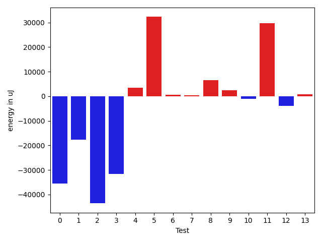

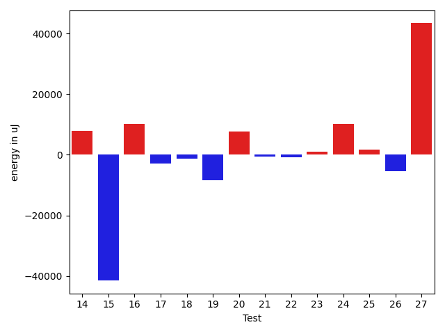

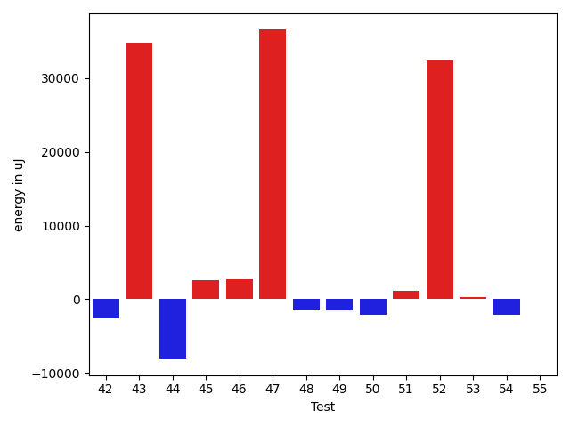

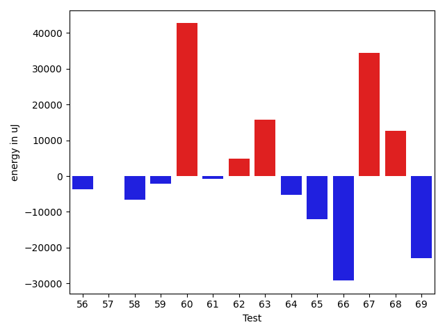

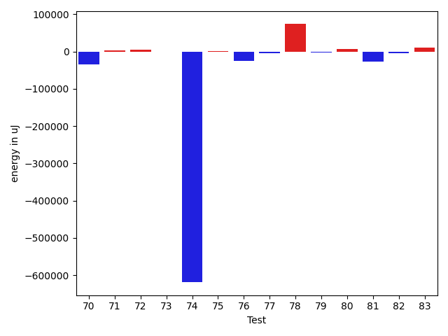

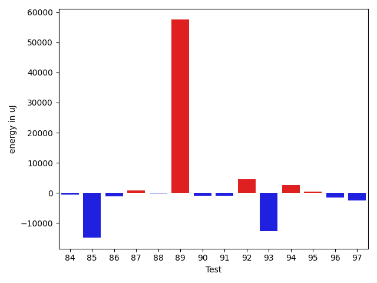

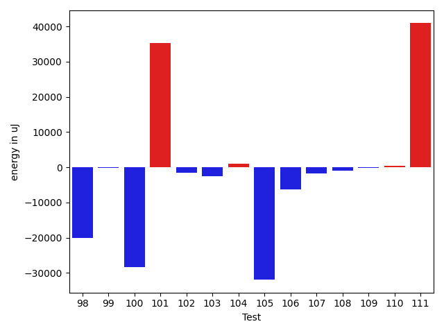

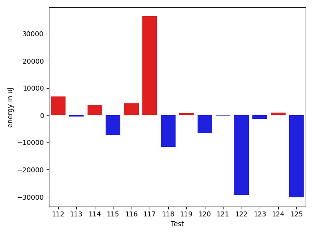

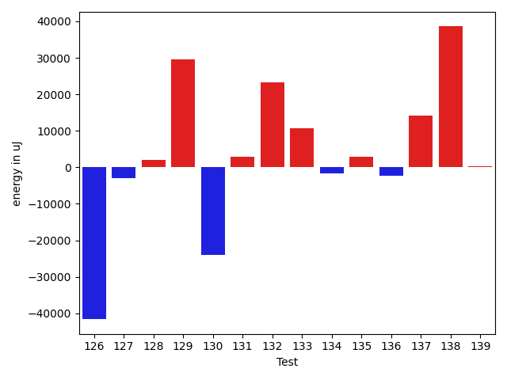

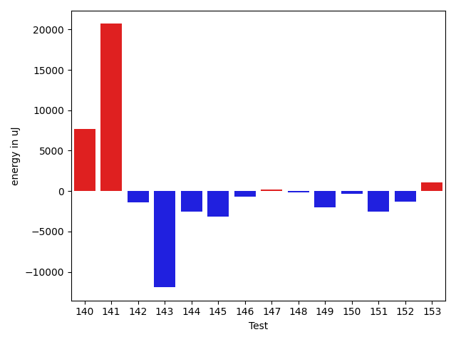

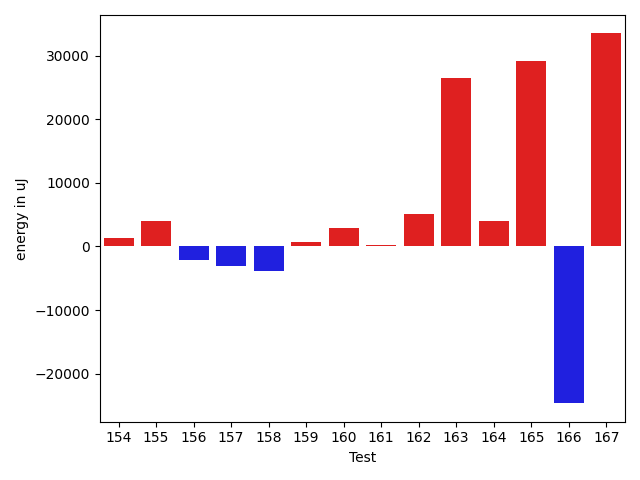

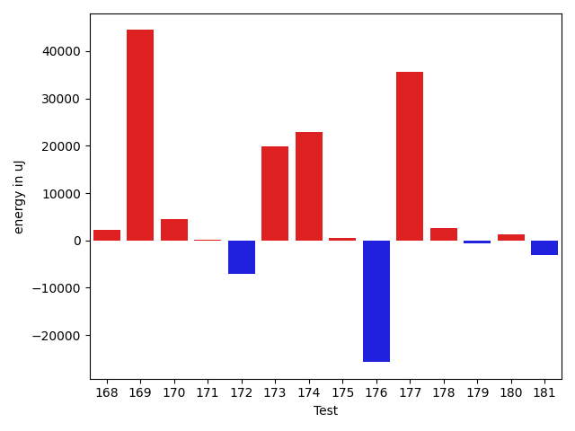

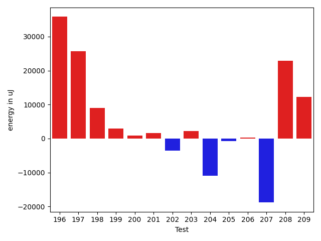

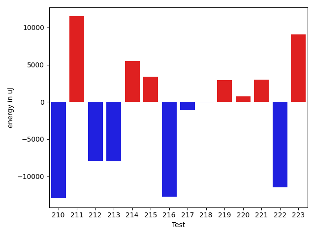

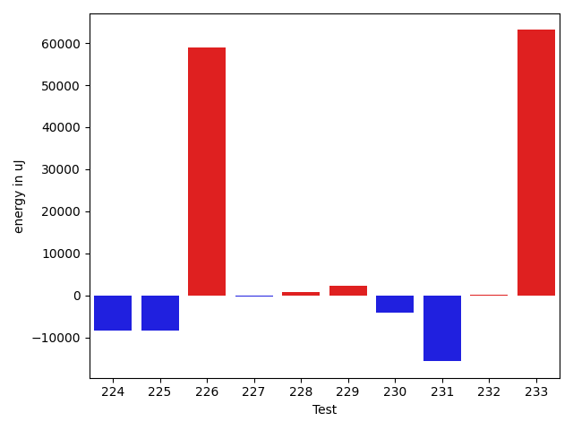

| ID | EnergyV1 | EnergyV2 | DeltaEnergy | σV1 | %σV1 | σV2 | %σV2 |
| --- | --- | --- | --- | --- | --- | --- | --- |
| 0 | 79468 | 43945 | -35523 | 19617.63 | 24.69 | 18571.50 | 42.26 |
| 1 | 86547 | 68970 | -17577 | 16033.14 | 18.53 | 21029.23 | 30.49 |
| 2 | 88684 | 45105 | -43579 | 16370.03 | 18.46 | 21179.81 | 46.96 |
| 3 | 76233 | 44556 | -31677 | 22956.84 | 30.11 | 20124.00 | 45.17 |
| 4 | 80138 | 83496 | 3358 | 23394.49 | 29.19 | 27340.34 | 32.74 |
| 5 | 47913 | 80200 | 32287 | 18011.10 | 37.59 | 23896.71 | 29.80 |
| 6 | 41748 | 42419 | 671 | 20573.83 | 49.28 | 16381.92 | 38.62 |
| 7 | 77941 | 78369 | 428 | 21406.14 | 27.46 | 19329.86 | 24.67 |
| 8 | 166381 | 172912 | 6531 | 27434.57 | 16.49 | 19835.26 | 11.47 |
| 9 | 112671 | 115173 | 2502 | 26498.31 | 23.52 | 10170.56 | 8.83 |
| 10 | 157349 | 156372 | -977 | 25114.09 | 15.96 | 22866.57 | 14.62 |
| 11 | 129944 | 159667 | 29723 | 17866.68 | 13.75 | 22794.81 | 14.28 |
| 12 | 137817 | 133911 | -3906 | 13977.11 | 10.14 | 13596.20 | 10.15 |
| 13 | 70129 | 70862 | 733 | 16274.29 | 23.21 | 16438.96 | 23.20 |
| 14 | 100708 | 108643 | 7935 | 15022.27 | 14.92 | 19504.70 | 17.95 |
| 15 | 136230 | 94787 | -41443 | 20193.59 | 14.82 | 16288.93 | 17.18 |
| 16 | 134155 | 144409 | 10254 | 20410.83 | 15.21 | 21663.66 | 15.00 |
| 17 | 46753 | 43823 | -2930 | 18621.59 | 39.83 | 20089.95 | 45.84 |
| 18 | 45654 | 44311 | -1343 | 30949.29 | 67.79 | 16305.91 | 36.80 |
| 19 | 179626 | 171204 | -8422 | 24469.37 | 13.62 | 22864.91 | 13.36 |
| 20 | 111572 | 119324 | 7752 | 35164.77 | 31.52 | 9334.92 | 7.82 |
| 21 | 122924 | 122436 | -488 | 13705.21 | 11.15 | 21902.05 | 17.89 |
| 22 | 133361 | 132568 | -793 | 17784.91 | 13.34 | 14898.21 | 11.24 |
| 23 | 86609 | 87524 | 915 | 18122.76 | 20.92 | 3270.04 | 3.74 |
| 24 | 68420 | 78552 | 10132 | 18640.50 | 27.24 | 22429.16 | 28.55 |
| 25 | 114074 | 115723 | 1649 | 33555.18 | 29.42 | 16787.63 | 14.51 |
| 26 | 129638 | 124329 | -5309 | 19469.54 | 15.02 | 15351.04 | 12.35 |
| 27 | 210448 | 253783 | 43335 | 20896.01 | 9.93 | 22403.01 | 8.83 |
| 28 | 126586 | 87097 | -39489 | 17808.17 | 14.07 | 41370.31 | 47.50 |
| 29 | 35827 | 38085 | 2258 | 2894.80 | 8.08 | 3135.89 | 8.23 |
| 30 | 87158 | 85266 | -1892 | 15308.30 | 17.56 | 18202.62 | 21.35 |
| 31 | 36194 | 38269 | 2075 | 16120.68 | 44.54 | 15550.79 | 40.64 |
| 32 | 43091 | 47729 | 4638 | 28464.08 | 66.06 | 21114.51 | 44.24 |
| 33 | 32349 | 38757 | 6408 | 3487.28 | 10.78 | 2972.71 | 7.67 |
| 34 | 107970 | 115905 | 7935 | 17810.03 | 16.50 | 25439.04 | 21.95 |
| 35 | 43030 | 42114 | -916 | 3396.30 | 7.89 | 2805.20 | 6.66 |
| 36 | 126159 | 122070 | -4089 | 22398.92 | 17.75 | 21016.32 | 17.22 |
| 37 | 110351 | 111267 | 916 | 18114.93 | 16.42 | 18298.91 | 16.45 |
| 38 | 174011 | 171569 | -2442 | 23680.32 | 13.61 | 55631.41 | 32.43 |
| 39 | 97045 | 101501 | 4456 | 13642.43 | 14.06 | 14812.19 | 14.59 |
| 40 | 38024 | 65185 | 27161 | 16277.79 | 42.81 | 12294.60 | 18.86 |
| 41 | 47363 | 41870 | -5493 | 21908.25 | 46.26 | 16165.99 | 38.61 |
| 42 | 76599 | 74036 | -2563 | 14725.94 | 19.22 | 15744.24 | 21.27 |
| 43 | 43335 | 78124 | 34789 | 20192.68 | 46.60 | 21065.73 | 26.96 |
| 44 | 131164 | 123107 | -8057 | 16839.52 | 12.84 | 14541.32 | 11.81 |
| 45 | 331603 | 334167 | 2564 | 27182.47 | 8.20 | 29761.64 | 8.91 |
| 46 | 40039 | 42725 | 2686 | 1644.86 | 4.11 | 4728.77 | 11.07 |
| 47 | 39490 | 76049 | 36559 | 2585.02 | 6.55 | 21433.03 | 28.18 |
| 48 | 135192 | 133850 | -1342 | 20954.50 | 15.50 | 15319.30 | 11.45 |
| 49 | 123840 | 122314 | -1526 | 17175.70 | 13.87 | 19206.05 | 15.70 |
| 50 | 134277 | 132201 | -2076 | 17342.20 | 12.92 | 37402.87 | 28.29 |
| 51 | 108704 | 109863 | 1159 | 17680.78 | 16.27 | 16394.22 | 14.92 |
| 52 | 80261 | 112610 | 32349 | 18665.68 | 23.26 | 21954.71 | 19.50 |
| 53 | 130859 | 131104 | 245 | 12713.74 | 9.72 | 28399.91 | 21.66 |
| 54 | 46264 | 44189 | -2075 | 2747.06 | 5.94 | 2132.61 | 4.83 |
| 55 | 131713 | 131774 | 61 | 46938.74 | 35.64 | 22669.41 | 17.20 |
| 56 | 134033 | 130432 | -3601 | 54616.37 | 40.75 | 26934.10 | 20.65 |
| 57 | 46142 | 46204 | 62 | 2603.09 | 5.64 | 14074.63 | 30.46 |
| 58 | 140625 | 134094 | -6531 | 48346.34 | 34.38 | 23894.43 | 17.82 |
| 59 | 46142 | 43946 | -2196 | 14623.40 | 31.69 | 2531.37 | 5.76 |
| 60 | 1510616 | 1553340 | 42724 | 101824.58 | 6.74 | 64875.79 | 4.18 |
| 61 | 134216 | 133361 | -855 | 27078.95 | 20.18 | 14910.97 | 11.18 |
| 62 | 83251 | 88074 | 4823 | 22336.56 | 26.83 | 21796.58 | 24.75 |
| 63 | 166748 | 182495 | 15747 | 31272.96 | 18.75 | 24439.63 | 13.39 |
| 64 | 133056 | 127868 | -5188 | 14248.93 | 10.71 | 52997.98 | 41.45 |
| 65 | 419371 | 407287 | -12084 | 36227.14 | 8.64 | 23135.73 | 5.68 |
| 66 | 271972 | 242736 | -29236 | 38506.08 | 14.16 | 29397.89 | 12.11 |
| 67 | 117065 | 151549 | 34484 | 22881.39 | 19.55 | 23822.35 | 15.72 |
| 68 | 102356 | 115051 | 12695 | 15032.29 | 14.69 | 41345.04 | 35.94 |
| 69 | 317566 | 294677 | -22889 | 36088.13 | 11.36 | 24990.45 | 8.48 |
| 70 | 468261 | 433410 | -34851 | 39943.08 | 8.53 | 47136.32 | 10.88 |
| 71 | 75561 | 79711 | 4150 | 6380.39 | 8.44 | 15611.57 | 19.59 |
| 72 | 78064 | 82459 | 4395 | 14769.15 | 18.92 | 28248.95 | 34.26 |
| 73 | 83862 | 82458 | -1404 | 19654.54 | 23.44 | 15963.17 | 19.36 |
| 74 | 1790401 | 1171506 | -618895 | 186180.62 | 10.40 | 70425.14 | 6.01 |
| 75 | 89782 | 91858 | 2076 | 21353.51 | 23.78 | 23486.90 | 25.57 |
| 76 | 65551 | 40466 | -25085 | 17715.62 | 27.03 | 14231.56 | 35.17 |
| 77 | 135803 | 131591 | -4212 | 90148.11 | 66.38 | 15801.69 | 12.01 |
| 78 | 625121 | 699645 | 74524 | 27724.61 | 4.44 | 47293.66 | 6.76 |
| 79 | 45960 | 44067 | -1893 | 21411.97 | 46.59 | 14268.66 | 32.38 |
| 80 | 120545 | 127685 | 7140 | 21842.70 | 18.12 | 17923.65 | 14.04 |
| 81 | 575377 | 549437 | -25940 | 44771.52 | 7.78 | 38854.69 | 7.07 |
| 82 | 48339 | 44678 | -3661 | 19419.65 | 40.17 | 18163.24 | 40.65 |
| 83 | 75805 | 85815 | 10010 | 19296.01 | 25.45 | 20078.04 | 23.40 |
| 84 | 183227 | 182616 | -611 | 22650.76 | 12.36 | 24327.76 | 13.32 |
| 85 | 242614 | 227721 | -14893 | 18503.43 | 7.63 | 24034.72 | 10.55 |
| 86 | 40771 | 39551 | -1220 | 14963.31 | 36.70 | 20862.04 | 52.75 |
| 87 | 38330 | 39123 | 793 | 4348.45 | 11.34 | 3717.44 | 9.50 |
| 88 | 45777 | 45654 | -123 | 19568.65 | 42.75 | 13098.60 | 28.69 |
| 89 | 458556 | 516051 | 57495 | 36940.77 | 8.06 | 27911.66 | 5.41 |
| 90 | 45959 | 45044 | -915 | 1943.58 | 4.23 | 2607.83 | 5.79 |
| 91 | 46508 | 45471 | -1037 | 1728.70 | 3.72 | 2677.50 | 5.89 |
| 92 | 125915 | 130493 | 4578 | 19082.84 | 15.16 | 15307.71 | 11.73 |
| 93 | 102050 | 89417 | -12633 | 14302.22 | 14.01 | 17759.95 | 19.86 |
| 94 | 40527 | 43152 | 2625 | 3994.69 | 9.86 | 12821.60 | 29.71 |
| 95 | 85876 | 86243 | 367 | 15896.50 | 18.51 | 20026.37 | 23.22 |
| 96 | 132690 | 131104 | -1586 | 16918.02 | 12.75 | 19567.80 | 14.93 |
| 97 | 45593 | 43030 | -2563 | 1131.89 | 2.48 | 1733.12 | 4.03 |
| 98 | 107178 | 87097 | -20081 | 20055.42 | 18.71 | 20952.17 | 24.06 |
| 99 | 43884 | 43701 | -183 | 15148.32 | 34.52 | 2208.11 | 5.05 |
| 100 | 72266 | 43946 | -28320 | 20717.10 | 28.67 | 17300.75 | 39.37 |
| 101 | 115417 | 150635 | 35218 | 15530.07 | 13.46 | 19746.97 | 13.11 |
| 102 | 44311 | 42786 | -1525 | 12484.64 | 28.18 | 2680.57 | 6.27 |
| 103 | 43640 | 41138 | -2502 | 21189.72 | 48.56 | 19065.76 | 46.35 |
| 104 | 38330 | 39368 | 1038 | 3357.51 | 8.76 | 3399.43 | 8.63 |
| 105 | 75745 | 43823 | -31922 | 22400.71 | 29.57 | 19875.54 | 45.35 |
| 106 | 75378 | 69092 | -6286 | 19896.75 | 26.40 | 19243.35 | 27.85 |
| 107 | 45715 | 43884 | -1831 | 40682.71 | 88.99 | 19241.70 | 43.85 |
| 108 | 46570 | 45532 | -1038 | 2450.81 | 5.26 | 2751.20 | 6.04 |
| 109 | 39184 | 39062 | -122 | 17264.02 | 44.06 | 16960.36 | 43.42 |
| 110 | 45471 | 45959 | 488 | 16164.53 | 35.55 | 21920.88 | 47.70 |
| 111 | 47547 | 88440 | 40893 | 20820.37 | 43.79 | 23346.79 | 26.40 |
| 112 | 68359 | 75195 | 6836 | 29139.44 | 42.63 | 16278.70 | 21.65 |
| 113 | 42908 | 42419 | -489 | 16016.36 | 37.33 | 2243.46 | 5.29 |
| 114 | 42358 | 46143 | 3785 | 20487.65 | 48.37 | 20610.93 | 44.67 |
| 115 | 47180 | 39856 | -7324 | 17354.24 | 36.78 | 14906.25 | 37.40 |
| 116 | 79834 | 84168 | 4334 | 72459.36 | 90.76 | 3530.24 | 4.19 |
| 117 | 44739 | 81055 | 36316 | 37467.18 | 83.75 | 19807.69 | 24.44 |
| 118 | 149963 | 138245 | -11718 | 15926.37 | 10.62 | 21212.87 | 15.34 |
| 119 | 75989 | 76721 | 732 | 28624.94 | 37.67 | 28081.18 | 36.60 |
| 120 | 86914 | 80323 | -6591 | 11338.28 | 13.05 | 18331.56 | 22.82 |
| 121 | 45227 | 45105 | -122 | 29910.88 | 66.14 | 14451.23 | 32.04 |
| 122 | 75256 | 46021 | -29235 | 28165.14 | 37.43 | 20519.80 | 44.59 |
| 123 | 132568 | 131103 | -1465 | 25164.96 | 18.98 | 21222.37 | 16.19 |
| 124 | 124755 | 125732 | 977 | 21410.85 | 17.16 | 28816.15 | 22.92 |
| 125 | 120056 | 89843 | -30213 | 31494.58 | 26.23 | 29929.24 | 33.31 |
| 126 | 343566 | 301941 | -41625 | 17067.95 | 4.97 | 22483.20 | 7.45 |
| 127 | 147155 | 144165 | -2990 | 26180.88 | 17.79 | 20194.02 | 14.01 |
| 128 | 114501 | 116516 | 2015 | 21850.53 | 19.08 | 22905.47 | 19.66 |
| 129 | 128235 | 157775 | 29540 | 28693.95 | 22.38 | 24714.64 | 15.66 |
| 130 | 271728 | 247741 | -23987 | 25499.94 | 9.38 | 30198.95 | 12.19 |
| 131 | 132080 | 135071 | 2991 | 20272.55 | 15.35 | 26034.00 | 19.27 |
| 132 | 360106 | 383483 | 23377 | 19604.42 | 5.44 | 30400.77 | 7.93 |
| 133 | 103272 | 113892 | 10620 | 23715.07 | 22.96 | 23980.05 | 21.06 |
| 134 | 43518 | 41809 | -1709 | 18261.19 | 41.96 | 18066.16 | 43.21 |
| 135 | 40893 | 43823 | 2930 | 1700.02 | 4.16 | 3519.45 | 8.03 |
| 136 | 40466 | 38085 | -2381 | 3427.09 | 8.47 | 4332.63 | 11.38 |
| 137 | 158874 | 173034 | 14160 | 18440.97 | 11.61 | 17473.16 | 10.10 |
| 138 | 89660 | 128234 | 38574 | 19194.92 | 21.41 | 33844.39 | 26.39 |
| 139 | 127868 | 128112 | 244 | 45437.01 | 35.53 | 17543.37 | 13.69 |
| 140 | 81055 | 88745 | 7690 | 6178.60 | 7.62 | 23687.35 | 26.69 |
| 141 | 85144 | 105834 | 20690 | 21813.94 | 25.62 | 18616.63 | 17.59 |
| 142 | 45166 | 43762 | -1404 | 2808.59 | 6.22 | 2658.09 | 6.07 |
| 143 | 135986 | 124085 | -11901 | 19981.54 | 14.69 | 36890.73 | 29.73 |
| 144 | 71472 | 68970 | -2502 | 12428.07 | 17.39 | 18183.32 | 26.36 |
| 145 | 181457 | 178283 | -3174 | 28441.00 | 15.67 | 22159.97 | 12.43 |
| 146 | 42724 | 42053 | -671 | 16711.25 | 39.11 | 14249.79 | 33.89 |
| 147 | 43824 | 44006 | 182 | 4181.56 | 9.54 | 2766.20 | 6.29 |
| 148 | 41381 | 41198 | -183 | 2179.43 | 5.27 | 13025.50 | 31.62 |
| 149 | 75927 | 73913 | -2014 | 12921.34 | 17.02 | 13340.75 | 18.05 |
| 150 | 33203 | 32837 | -366 | 1893.63 | 5.70 | 1652.74 | 5.03 |
| 151 | 45288 | 42785 | -2503 | 2156.01 | 4.76 | 1527.62 | 3.57 |
| 152 | 43640 | 42358 | -1282 | 2805.71 | 6.43 | 1443.43 | 3.41 |
| 153 | 43335 | 44373 | 1038 | 2638.63 | 6.09 | 2464.87 | 5.55 |
| 154 | 35034 | 36377 | 1343 | 2838.80 | 8.10 | 2339.66 | 6.43 |
| 155 | 37963 | 41931 | 3968 | 3897.19 | 10.27 | 3880.69 | 9.25 |
| 156 | 44373 | 42176 | -2197 | 11249.58 | 25.35 | 2448.19 | 5.80 |
| 157 | 46021 | 43030 | -2991 | 15000.13 | 32.59 | 2065.02 | 4.80 |
| 158 | 42175 | 38391 | -3784 | 15276.96 | 36.22 | 22021.24 | 57.36 |
| 159 | 41748 | 42419 | 671 | 2827.37 | 6.77 | 3637.26 | 8.57 |
| 160 | 42114 | 45044 | 2930 | 2406.21 | 5.71 | 3746.17 | 8.32 |
| 161 | 163635 | 163879 | 244 | 15121.92 | 9.24 | 23959.41 | 14.62 |
| 162 | 160461 | 165588 | 5127 | 19580.41 | 12.20 | 21075.16 | 12.73 |
| 163 | 197570 | 224060 | 26490 | 22493.85 | 11.39 | 24690.51 | 11.02 |
| 164 | 110778 | 114807 | 4029 | 4574.46 | 4.13 | 6940.36 | 6.05 |
| 165 | 121277 | 150512 | 29235 | 16499.20 | 13.60 | 21198.97 | 14.08 |
| 166 | 536986 | 512327 | -24659 | 35702.06 | 6.65 | 22499.87 | 4.39 |
| 167 | 96130 | 129639 | 33509 | 21405.90 | 22.27 | 17331.20 | 13.37 |
| 168 | 62256 | 64392 | 2136 | 16187.96 | 26.00 | 3646.69 | 5.66 |
| 169 | 41077 | 85510 | 44433 | 13295.99 | 32.37 | 22492.76 | 26.30 |
| 170 | 72814 | 77332 | 4518 | 20415.91 | 28.04 | 18819.58 | 24.34 |
| 171 | 45105 | 45165 | 60 | 17507.34 | 38.81 | 22282.61 | 49.34 |
| 172 | 182738 | 175598 | -7140 | 45459.37 | 24.88 | 23512.41 | 13.39 |
| 173 | 156128 | 176025 | 19897 | 27494.10 | 17.61 | 22570.69 | 12.82 |
| 174 | 139648 | 162537 | 22889 | 27858.68 | 19.95 | 21545.79 | 13.26 |
| 175 | 44372 | 44922 | 550 | 2967.67 | 6.69 | 2659.23 | 5.92 |
| 176 | 117187 | 91492 | -25695 | 43484.11 | 37.11 | 19024.29 | 20.79 |
| 177 | 48523 | 84106 | 35583 | 43915.16 | 90.50 | 37559.42 | 44.66 |
| 178 | 35217 | 37842 | 2625 | 2755.26 | 7.82 | 3796.57 | 10.03 |
| 179 | 89721 | 89050 | -671 | 16986.07 | 18.93 | 2040.02 | 2.29 |
| 180 | 40039 | 41321 | 1282 | 17237.46 | 43.05 | 3376.87 | 8.17 |
| 181 | 68603 | 65429 | -3174 | 5072.24 | 7.39 | 5533.13 | 8.46 |
| 182 | 310790 | 273986 | -36804 | 32417.80 | 10.43 | 17921.60 | 6.54 |
| 183 | 45838 | 45349 | -489 | 14190.42 | 30.96 | 16978.14 | 37.44 |
| 184 | 73425 | 74097 | 672 | 19543.13 | 26.62 | 16045.99 | 21.66 |
| 185 | 45837 | 47546 | 1709 | 17933.30 | 39.12 | 18464.84 | 38.84 |
| 186 | 47486 | 42297 | -5189 | 24676.98 | 51.97 | 19181.72 | 45.35 |
| 187 | 85144 | 47180 | -37964 | 22262.43 | 26.15 | 20415.78 | 43.27 |
| 188 | 326843 | 320739 | -6104 | 48521.53 | 14.85 | 23875.51 | 7.44 |
| 189 | 356994 | 360045 | 3051 | 41271.09 | 11.56 | 39727.14 | 11.03 |
| 190 | 89111 | 84961 | -4150 | 14175.36 | 15.91 | 18811.72 | 22.14 |
| 191 | 89233 | 87280 | -1953 | 15907.04 | 17.83 | 16257.54 | 18.63 |
| 192 | 88379 | 82275 | -6104 | 49380.02 | 55.87 | 20008.04 | 24.32 |
| 193 | 92285 | 86426 | -5859 | 18701.96 | 20.27 | 15920.05 | 18.42 |
| 194 | 79162 | 77637 | -1525 | 4004.63 | 5.06 | 107583.16 | 138.57 |
| 195 | 156677 | 176331 | 19654 | 16812.77 | 10.73 | 12385.81 | 7.02 |
| 196 | 44617 | 80444 | 35827 | 24210.11 | 54.26 | 22064.20 | 27.43 |
| 197 | 188537 | 214293 | 25756 | 10930.67 | 5.80 | 41537.72 | 19.38 |
| 198 | 213683 | 222716 | 9033 | 21637.04 | 10.13 | 24506.48 | 11.00 |
| 199 | 37964 | 40954 | 2990 | 14085.99 | 37.10 | 2372.10 | 5.79 |
| 200 | 42358 | 43212 | 854 | 3862.33 | 9.12 | 2460.89 | 5.69 |
| 201 | 37414 | 39002 | 1588 | 7646.88 | 20.44 | 14606.27 | 37.45 |
| 202 | 78308 | 74767 | -3541 | 21751.61 | 27.78 | 17865.34 | 23.89 |
| 203 | 40588 | 42785 | 2197 | 3146.97 | 7.75 | 15528.79 | 36.29 |
| 204 | 299926 | 289000 | -10926 | 20314.86 | 6.77 | 22916.58 | 7.93 |
| 205 | 207031 | 206299 | -732 | 31623.07 | 15.27 | 31877.98 | 15.45 |
| 206 | 183105 | 183471 | 366 | 29199.66 | 15.95 | 17330.98 | 9.45 |
| 207 | 468016 | 449218 | -18798 | 23656.41 | 5.05 | 43906.48 | 9.77 |
| 208 | 132507 | 155396 | 22889 | 16237.26 | 12.25 | 32501.30 | 20.92 |
| 209 | 162842 | 175048 | 12206 | 28410.49 | 17.45 | 18423.94 | 10.53 |
| 210 | 76904 | 63964 | -12940 | 18721.43 | 24.34 | 16992.04 | 26.57 |
| 211 | 76660 | 88135 | 11475 | 15969.41 | 20.83 | 54599.37 | 61.95 |
| 212 | 192688 | 184814 | -7874 | 23029.90 | 11.95 | 24400.15 | 13.20 |
| 213 | 229003 | 221008 | -7995 | 25857.26 | 11.29 | 18053.81 | 8.17 |
| 214 | 219116 | 224609 | 5493 | 26192.49 | 11.95 | 15756.25 | 7.01 |
| 215 | 221313 | 224731 | 3418 | 41639.02 | 18.81 | 29353.14 | 13.06 |
| 216 | 223144 | 210388 | -12756 | 57286.66 | 25.67 | 35915.23 | 17.07 |
| 217 | 46448 | 45349 | -1099 | 20495.49 | 44.13 | 15436.80 | 34.04 |
| 218 | 84289 | 84228 | -61 | 19415.30 | 23.03 | 21480.14 | 25.50 |
| 219 | 83434 | 86365 | 2931 | 21984.80 | 26.35 | 20011.87 | 23.17 |
| 220 | 86609 | 87342 | 733 | 12559.28 | 14.50 | 24162.62 | 27.66 |
| 221 | 82398 | 85387 | 2989 | 18364.17 | 22.29 | 17541.40 | 20.54 |
| 222 | 305236 | 293762 | -11474 | 35141.33 | 11.51 | 20887.80 | 7.11 |
| 223 | 83557 | 92651 | 9094 | 15635.33 | 18.71 | 24510.64 | 26.45 |
| 224 | 209960 | 201538 | -8422 | 14145.60 | 6.74 | 59155.35 | 29.35 |
| 225 | 84290 | 75805 | -8485 | 13688.39 | 16.24 | 13720.23 | 18.10 |
| 226 | 238403 | 297302 | 58899 | 39761.38 | 16.68 | 69995.27 | 23.54 |
| 227 | 84412 | 84045 | -367 | 47652.09 | 56.45 | 28264.49 | 33.63 |
| 228 | 46204 | 46936 | 732 | 1089.04 | 2.36 | 1380.38 | 2.94 |
| 229 | 38330 | 40588 | 2258 | 2263.27 | 5.90 | 3035.85 | 7.48 |
| 230 | 44983 | 40832 | -4151 | 13586.61 | 30.20 | 4040.67 | 9.90 |
| 231 | 649657 | 633971 | -15686 | 37581.19 | 5.78 | 53596.22 | 8.45 |
| 232 | 45105 | 45166 | 61 | 2262.64 | 5.02 | 839.49 | 1.86 |
| 233 | 1466305 | 1529415 | 63110 | 152601.20 | 10.41 | 70937.45 | 4.64 |

## Misc.

| ID | Test Class | Test Method |
| --- | --- | --- |
| 0 | com.google.gson.functional.TypeAdapterPrecedenceTest | testStreamingFollowedByNonstreaming |
| 1 | com.google.gson.functional.TypeAdapterPrecedenceTest | testStreamingHierarchicalFollowedByNonstreaming |
| 2 | com.google.gson.functional.TypeAdapterPrecedenceTest | testSerializeNonstreamingTypeAdapterFollowedByStreamingTypeAdapter |
| 3 | com.google.gson.functional.TypeAdapterPrecedenceTest | testNonstreamingHierarchicalFollowedByNonstreaming |
| 4 | com.google.gson.functional.TypeAdapterPrecedenceTest | testStreamingHierarchicalFollowedByNonstreamingHierarchical |
| 5 | com.google.gson.functional.TypeAdapterPrecedenceTest | testNonstreamingFollowedByNonstreaming |
| 6 | com.google.gson.functional.TypeAdapterPrecedenceTest | testStreamingFollowedByStreaming |
| 7 | com.google.gson.functional.TypeAdapterPrecedenceTest | testStreamingFollowedByNonstreamingHierarchical |
| 8 | com.google.gson.functional.CustomTypeAdaptersTest | testCustomAdapterInvokedForCollectionElementDeserialization |
| 9 | com.google.gson.functional.CustomTypeAdaptersTest | testCustomTypeAdapterAppliesToSubClassesSerializedAsBaseClass |
| 10 | com.google.gson.functional.CustomTypeAdaptersTest | testCustomAdapterInvokedForMapElementDeserialization |
| 11 | com.google.gson.functional.CustomTypeAdaptersTest | testCustomAdapterInvokedForMapElementSerializationWithType |
| 12 | com.google.gson.functional.CustomTypeAdaptersTest | testCustomNestedSerializers |
| 13 | com.google.gson.functional.CustomTypeAdaptersTest | testCustomAdapterInvokedForMapElementSerialization |
| 14 | com.google.gson.functional.CustomTypeAdaptersTest | testCustomSerializers |
| 15 | com.google.gson.functional.CustomTypeAdaptersTest | testCustomNestedDeserializers |
| 16 | com.google.gson.functional.CustomTypeAdaptersTest | testCustomTypeAdapterDoesNotAppliesToSubClasses |
| 17 | com.google.gson.functional.CustomTypeAdaptersTest | testCustomAdapterInvokedForCollectionElementSerialization |
| 18 | com.google.gson.functional.CustomTypeAdaptersTest | testRegisterHierarchyAdapterForDate |
| 19 | com.google.gson.functional.CustomTypeAdaptersTest | testCustomAdapterInvokedForCollectionElementSerializationWithType |
| 20 | com.google.gson.functional.CustomTypeAdaptersTest | testCustomDeserializers |
| 21 | com.google.gson.functional.CustomTypeAdaptersTest | testCustomByteArrayDeserializerAndInstanceCreator |
| 22 | com.google.gson.functional.CustomTypeAdaptersTest | testCustomByteArraySerializer |
| 23 | com.google.gson.functional.CustomTypeAdaptersTest | testEnsureCustomSerializerNotInvokedForNullValues |
| 24 | com.google.gson.functional.CustomTypeAdaptersTest | testEnsureCustomDeserializerNotInvokedForNullValues |
| 25 | com.google.gson.functional.CustomTypeAdaptersTest | testCustomDeserializerInvokedForPrimitives |
| 26 | com.google.gson.functional.CustomTypeAdaptersTest | testCustomSerializerInvokedForPrimitives |
| 27 | com.google.gson.functional.StreamingTypeAdaptersTest | testNullSafe |
| 28 | com.google.gson.functional.StreamingTypeAdaptersTest | testSerialize2dArray |
| 29 | com.google.gson.functional.StreamingTypeAdaptersTest | testSerializeMap |
| 30 | com.google.gson.functional.StreamingTypeAdaptersTest | testSerializeWithCustomTypeAdapter |
| 31 | com.google.gson.functional.StreamingTypeAdaptersTest | testSerialize |
| 32 | com.google.gson.functional.StreamingTypeAdaptersTest | testSerialize1dArray |
| 33 | com.google.gson.functional.StreamingTypeAdaptersTest | testSerializeNullField |
| 34 | com.google.gson.functional.StreamingTypeAdaptersTest | testDeserializeWithCustomTypeAdapter |
| 35 | com.google.gson.functional.StreamingTypeAdaptersTest | testSerializeNullObject |
| 36 | com.google.gson.functional.JsonAdapterAnnotationOnClassesTest | testJsonAdapterInvoked |
| 37 | com.google.gson.functional.JsonAdapterAnnotationOnClassesTest | testRegisteredAdapterOverridesJsonAdapter |
| 38 | com.google.gson.functional.JsonAdapterAnnotationOnClassesTest | testRegisteredDeserializerOverridesJsonAdapter |
| 39 | com.google.gson.functional.JsonAdapterAnnotationOnClassesTest | testRegisteredSerializerOverridesJsonAdapter |
| 40 | com.google.gson.functional.JsonAdapterAnnotationOnClassesTest | testSuperclassTypeAdapterNotInvoked |
| 41 | com.google.gson.functional.JsonAdapterAnnotationOnClassesTest | testNullSafeObjectFromJson |
| 42 | com.google.gson.functional.JsonAdapterAnnotationOnClassesTest | testIncorrectTypeAdapterFails |
| 43 | com.google.gson.functional.JsonAdapterAnnotationOnClassesTest | testJsonAdapterFactoryInvoked |
| 44 | com.google.gson.functional.ExclusionStrategyFunctionalTest | testExclusionStrategySerializationDoesNotImpactSerialization |
| 45 | com.google.gson.functional.ExclusionStrategyFunctionalTest | testExclusionStrategyWithMode |
| 46 | com.google.gson.functional.ExclusionStrategyFunctionalTest | testExcludeTopLevelClassDeserialization |
| 47 | com.google.gson.functional.ExclusionStrategyFunctionalTest | testExcludeTopLevelClassSerialization |
| 48 | com.google.gson.functional.ExclusionStrategyFunctionalTest | testExclusionStrategySerializationDoesNotImpactDeserialization |
| 49 | com.google.gson.functional.ExclusionStrategyFunctionalTest | testExcludeTopLevelClassDeserializationDoesNotImpactSerialization |
| 50 | com.google.gson.functional.ExclusionStrategyFunctionalTest | testExcludeTopLevelClassSerializationDoesNotImpactDeserialization |
| 51 | com.google.gson.functional.ExclusionStrategyFunctionalTest | testExclusionStrategyDeserialization |
| 52 | com.google.gson.functional.ExclusionStrategyFunctionalTest | testExclusionStrategySerialization |
| 53 | com.google.gson.MixedStreamTest | testReaderDoesNotMutateState |
| 54 | com.google.gson.MixedStreamTest | testReadInvalidState |
| 55 | com.google.gson.MixedStreamTest | testWriteClosed |
| 56 | com.google.gson.MixedStreamTest | testWriteInvalidState |
| 57 | com.google.gson.MixedStreamTest | testWriteDoesNotMutateState |
| 58 | com.google.gson.MixedStreamTest | testWriteHtmlSafe |
| 59 | com.google.gson.MixedStreamTest | testReadNulls |
| 60 | com.google.gson.MixedStreamTest | testWriteLenient |
| 61 | com.google.gson.MixedStreamTest | testWriteMixedStreamed |
| 62 | com.google.gson.MixedStreamTest | testWriteNulls |
| 63 | com.google.gson.MixedStreamTest | testReadMixedStreamed |
| 64 | com.google.gson.MixedStreamTest | testReadClosed |
| 65 | com.google.gson.functional.InstanceCreatorTest | testInstanceCreatorForParametrizedType |
| 66 | com.google.gson.functional.InstanceCreatorTest | testInstanceCreatorReturnsBaseType |
| 67 | com.google.gson.functional.InstanceCreatorTest | testInstanceCreatorReturnsSubTypeForField |
| 68 | com.google.gson.functional.InstanceCreatorTest | testInstanceCreatorReturnsSubTypeForTopLevelObject |
| 69 | com.google.gson.functional.InstanceCreatorTest | testInstanceCreatorForCollectionType |
| 70 | com.google.gson.functional.DefaultTypeAdaptersTest | testDateSerializationWithPatternNotOverridenByTypeAdapter |
| 71 | com.google.gson.functional.DefaultTypeAdaptersTest | testDateSerializationWithPattern |
| 72 | com.google.gson.functional.DefaultTypeAdaptersTest | testBitSetDeserialization |
| 73 | com.google.gson.functional.DefaultTypeAdaptersTest | testOverrideBigIntegerTypeAdapter |
| 74 | com.google.gson.functional.DefaultTypeAdaptersTest | testDefaultGregorianCalendarDeserialization |
| 75 | com.google.gson.functional.DefaultTypeAdaptersTest | testSqlDateSerialization |
| 76 | com.google.gson.functional.DefaultTypeAdaptersTest | testClassSerialization |
| 77 | com.google.gson.functional.DefaultTypeAdaptersTest | testTimestampSerialization |
| 78 | com.google.gson.functional.DefaultTypeAdaptersTest | testDefaultDateDeserializationUsingBuilder |
| 79 | com.google.gson.functional.DefaultTypeAdaptersTest | testDefaultCalendarSerialization |
| 80 | com.google.gson.functional.DefaultTypeAdaptersTest | testOverrideBigDecimalTypeAdapter |
| 81 | com.google.gson.functional.DefaultTypeAdaptersTest | testNullSerialization |
| 82 | com.google.gson.functional.DefaultTypeAdaptersTest | testDefaultCalendarDeserialization |
| 83 | com.google.gson.functional.DefaultTypeAdaptersTest | testClassDeserialization |
| 84 | com.google.gson.functional.DefaultTypeAdaptersTest | testDateDeserializationWithPattern |
| 85 | com.google.gson.functional.DefaultTypeAdaptersTest | testDateSerializationInCollection |
| 86 | com.google.gson.functional.DefaultTypeAdaptersTest | testSetSerialization |
| 87 | com.google.gson.functional.DefaultTypeAdaptersTest | testBitSetSerialization |
| 88 | com.google.gson.functional.DefaultTypeAdaptersTest | testDefaultGregorianCalendarSerialization |
| 89 | com.google.gson.functional.DefaultTypeAdaptersTest | testDefaultDateSerializationUsingBuilder |
| 90 | com.google.gson.OverrideCoreTypeAdaptersTest | testOverrideStringAdapter |
| 91 | com.google.gson.OverrideCoreTypeAdaptersTest | testOverridePrimitiveBooleanAdapter |
| 92 | com.google.gson.OverrideCoreTypeAdaptersTest | testOverrideWrapperBooleanAdapter |
| 93 | com.google.gson.functional.NullObjectAndFieldTest | testCustomTypeAdapterPassesNullSerialization |
| 94 | com.google.gson.functional.NullObjectAndFieldTest | testExplicitDeserializationOfNulls |
| 95 | com.google.gson.functional.NullObjectAndFieldTest | testExplicitSerializationOfNullStringMembers |
| 96 | com.google.gson.functional.NullObjectAndFieldTest | testCustomTypeAdapterPassesNullDesrialization |
| 97 | com.google.gson.functional.NullObjectAndFieldTest | testTopLevelNullObjectDeserialization |
| 98 | com.google.gson.functional.NullObjectAndFieldTest | testExplicitSerializationOfNullCollectionMembers |
| 99 | com.google.gson.functional.NullObjectAndFieldTest | testCustomSerializationOfNulls |
| 100 | com.google.gson.functional.NullObjectAndFieldTest | testAbsentJsonElementsAreSetToNull |
| 101 | com.google.gson.functional.NullObjectAndFieldTest | testPrintPrintingObjectWithNulls |
| 102 | com.google.gson.functional.NullObjectAndFieldTest | testPrintPrintingArraysWithNulls |
| 103 | com.google.gson.functional.NullObjectAndFieldTest | testTopLevelNullObjectSerialization |
| 104 | com.google.gson.functional.NullObjectAndFieldTest | testNullWrappedPrimitiveMemberSerialization |
| 105 | com.google.gson.functional.NullObjectAndFieldTest | testExplicitNullSetsFieldToNullDuringDeserialization |
| 106 | com.google.gson.functional.NullObjectAndFieldTest | testExplicitSerializationOfNullArrayMembers |
| 107 | com.google.gson.functional.NullObjectAndFieldTest | testNullWrappedPrimitiveMemberDeserialization |
| 108 | com.google.gson.functional.NullObjectAndFieldTest | testExplicitSerializationOfNulls |
| 109 | com.google.gson.functional.NamingPolicyTest | testAtSignInSerializedName |
| 110 | com.google.gson.functional.NamingPolicyTest | testGsonWithNonDefaultFieldNamingPolicySerialization |
| 111 | com.google.gson.functional.NamingPolicyTest | testGsonWithLowerCaseDashPolicyDeserialiation |
| 112 | com.google.gson.functional.NamingPolicyTest | testGsonDuplicateNameUsingSerializedNameFieldNamingPolicySerialization |
| 113 | com.google.gson.functional.NamingPolicyTest | testGsonWithSerializedNameFieldNamingPolicyDeserialization |
| 114 | com.google.gson.functional.NamingPolicyTest | testGsonWithUpperCamelCaseSpacesPolicyDeserialiation |
| 115 | com.google.gson.functional.NamingPolicyTest | testGsonWithSerializedNameFieldNamingPolicySerialization |
| 116 | com.google.gson.functional.NamingPolicyTest | testGsonWithNonDefaultFieldNamingPolicyDeserialiation |
| 117 | com.google.gson.functional.NamingPolicyTest | testGsonWithLowerCaseUnderscorePolicySerialization |
| 118 | com.google.gson.functional.NamingPolicyTest | testComplexFieldNameStrategy |
| 119 | com.google.gson.functional.NamingPolicyTest | testDeprecatedNamingStrategy |
| 120 | com.google.gson.functional.NamingPolicyTest | testGsonWithUpperCamelCaseSpacesPolicySerialiation |
| 121 | com.google.gson.functional.NamingPolicyTest | testGsonWithLowerCaseDashPolicySerialization |
| 122 | com.google.gson.functional.NamingPolicyTest | testGsonWithLowerCaseUnderscorePolicyDeserialiation |
| 123 | com.google.gson.LongSerializationPolicyTest | testDefaultLongSerializationIntegration |
| 124 | com.google.gson.LongSerializationPolicyTest | testStringLongSerializationIntegration |
| 125 | com.google.gson.functional.MapTest | testSerializeMaps |
| 126 | com.google.gson.functional.MapTest | testInterfaceTypeMapWithSerializer |
| 127 | com.google.gson.functional.MapTest | testMapSerializationWithNullValuesSerialized |
| 128 | com.google.gson.functional.MapTest | testMapSubclassDeserialization |
| 129 | com.google.gson.functional.MapTest | testCustomSerializerForSpecificMapType |
| 130 | com.google.gson.functional.MapTest | testGeneralMapField |
| 131 | com.google.gson.functional.MapTest | testMapSerializationWithNullValueButSerializeNulls |
| 132 | com.google.gson.functional.MapTest | testInterfaceTypeMap |
| 133 | com.google.gson.functional.ReadersWritersTest | testReadWriteTwoObjects |
| 134 | com.google.gson.functional.ReadersWritersTest | testReadWriteTwoStrings |
| 135 | com.google.gson.functional.ReadersWritersTest | testTopLevelNullObjectDeserializationWithReaderAndSerializeNulls |
| 136 | com.google.gson.functional.ReadersWritersTest | testTopLevelNullObjectSerializationWithWriterAndSerializeNulls |
| 137 | com.google.gson.functional.ExposeFieldsTest | testNullExposeFieldSerialization |
| 138 | com.google.gson.functional.ExposeFieldsTest | testExposeAnnotationSerialization |
| 139 | com.google.gson.functional.ExposeFieldsTest | testArrayWithOneNullExposeFieldObjectSerialization |
| 140 | com.google.gson.functional.FieldExclusionTest | testDefaultNestedStaticClassIncluded |
| 141 | com.google.gson.functional.FieldExclusionTest | testDefaultInnerClassExclusion |
| 142 | com.google.gson.functional.FieldExclusionTest | testInnerClassExclusion |
| 143 | com.google.gson.GsonBuilderTest | testExcludeFieldsWithModifiers |
| 144 | com.google.gson.GsonBuilderTest | testCreatingMoreThanOnce |
| 145 | com.google.gson.GsonBuilderTest | testTransientFieldExclusion |
| 146 | com.google.gson.functional.PrimitiveTest | testMoreSpecificSerialization |
| 147 | com.google.gson.functional.PrimitiveTest | testDoubleInfinitySerialization |
| 148 | com.google.gson.functional.PrimitiveTest | testLongAsStringDeserialization |
| 149 | com.google.gson.functional.PrimitiveTest | testPrimitiveDoubleAutoboxedInASingleElementArraySerialization |
| 150 | com.google.gson.functional.PrimitiveTest | testHtmlCharacterSerialization |
| 151 | com.google.gson.functional.PrimitiveTest | testNegativeInfinitySerialization |
| 152 | com.google.gson.functional.PrimitiveTest | testDoubleNaNSerializationNotSupportedByDefault |
| 153 | com.google.gson.functional.PrimitiveTest | testLongAsStringSerialization |
| 154 | com.google.gson.functional.PrimitiveTest | testDoubleInfinitySerializationNotSupportedByDefault |
| 155 | com.google.gson.functional.PrimitiveTest | testFloatNaNSerialization |
| 156 | com.google.gson.functional.PrimitiveTest | testNegativeInfinitySerializationNotSupportedByDefault |
| 157 | com.google.gson.functional.PrimitiveTest | testDoubleNaNSerialization |
| 158 | com.google.gson.functional.PrimitiveTest | testPrimitiveDoubleAutoboxedSerialization |
| 159 | com.google.gson.functional.PrimitiveTest | testNegativeInfinityFloatSerialization |
| 160 | com.google.gson.functional.PrimitiveTest | testFloatInfinitySerialization |
| 161 | com.google.gson.functional.CustomDeserializerTest | testCustomDeserializerReturnsNullForArrayElementsForArrayField |
| 162 | com.google.gson.functional.CustomDeserializerTest | testCustomDeserializerReturnsNull |
| 163 | com.google.gson.functional.CustomDeserializerTest | testJsonTypeFieldBasedDeserialization |
| 164 | com.google.gson.functional.CustomDeserializerTest | testCustomDeserializerReturnsNullForArrayElements |
| 165 | com.google.gson.functional.CustomDeserializerTest | testCustomDeserializerReturnsNullForTopLevelObject |
| 166 | com.google.gson.JsonParserTest | testReadWriteTwoObjects |
| 167 | com.google.gson.functional.CustomSerializerTest | testSerializerReturnsNull |
| 168 | com.google.gson.functional.CustomSerializerTest | testSubClassSerializerInvokedForBaseClassFieldsHoldingSubClassInstances |
| 169 | com.google.gson.functional.CustomSerializerTest | testBaseClassSerializerInvokedForBaseClassFieldsHoldingSubClassInstances |
| 170 | com.google.gson.functional.CustomSerializerTest | testBaseClassSerializerInvokedForBaseClassFields |
| 171 | com.google.gson.functional.CustomSerializerTest | testSubClassSerializerInvokedForBaseClassFieldsHoldingArrayOfSubClassInstances |
| 172 | com.google.gson.functional.ObjectTest | testSingletonLists |
| 173 | com.google.gson.functional.ObjectTest | testAnonymousLocalClassesCustomSerialization |
| 174 | com.google.gson.functional.ObjectTest | testInnerClassDeserialization |
| 175 | com.google.gson.functional.ObjectTest | testJsonObjectSerialization |
| 176 | com.google.gson.functional.VersioningTest | testVersionedGsonMixingSinceAndUntilDeserialization |
| 177 | com.google.gson.functional.VersioningTest | testVersionedUntilSerialization |
| 178 | com.google.gson.functional.VersioningTest | testIgnoreLaterVersionClassSerialization |
| 179 | com.google.gson.functional.VersioningTest | testVersionedClassesDeserialization |
| 180 | com.google.gson.functional.VersioningTest | testVersionedGsonWithUnversionedClassesSerialization |
| 181 | com.google.gson.functional.VersioningTest | testVersionedClassesSerialization |
| 182 | com.google.gson.functional.VersioningTest | testVersionedGsonMixingSinceAndUntilSerialization |
| 183 | com.google.gson.functional.VersioningTest | testIgnoreLaterVersionClassDeserialization |
| 184 | com.google.gson.functional.VersioningTest | testVersionedUntilDeserialization |
| 185 | com.google.gson.functional.VersioningTest | testVersionedGsonWithUnversionedClassesDeserialization |
| 186 | com.google.gson.functional.TypeHierarchyAdapterTest | testRegisterSuperTypeFirst |
| 187 | com.google.gson.functional.TypeHierarchyAdapterTest | testRegisterSubTypeFirstAllowed |
| 188 | com.google.gson.functional.TypeHierarchyAdapterTest | testTypeHierarchy |
| 189 | com.google.gson.functional.JsonAdapterAnnotationOnFieldsTest | testClassAnnotationAdapterFactoryTakesPrecedenceOverDefault |
| 190 | com.google.gson.functional.JsonAdapterAnnotationOnFieldsTest | testJsonAdapterWrappedInNullSafeAsRequested |
| 191 | com.google.gson.functional.JsonAdapterAnnotationOnFieldsTest | testClassAnnotationAdapterTakesPrecedenceOverDefault |
| 192 | com.google.gson.functional.JsonAdapterAnnotationOnFieldsTest | testRegisteredTypeAdapterTakesPrecedenceOverClassAnnotationAdapter |
| 193 | com.google.gson.functional.JsonAdapterAnnotationOnFieldsTest | testFieldAnnotationTakesPrecedenceOverClassAnnotation |
| 194 | com.google.gson.functional.JsonAdapterAnnotationOnFieldsTest | testJsonAdapterInvokedOnlyForAnnotatedFields |
| 195 | com.google.gson.functional.JsonAdapterAnnotationOnFieldsTest | testFieldAnnotationTakesPrecedenceOverRegisteredTypeAdapter |
| 196 | com.google.gson.functional.TypeVariableTest | testBasicTypeVariables |
| 197 | com.google.gson.functional.TypeVariableTest | testAdvancedTypeVariables |
| 198 | com.google.gson.functional.TypeVariableTest | testTypeVariablesViaTypeParameter |
| 199 | com.google.gson.functional.SecurityTest | testJsonWithNonExectuableTokenSerialization |
| 200 | com.google.gson.functional.SecurityTest | testNonExecutableJsonSerialization |
| 201 | com.google.gson.functional.SecurityTest | testNonExecutableJsonDeserialization |
| 202 | com.google.gson.functional.SecurityTest | testJsonWithNonExectuableTokenWithConfiguredGsonDeserialization |
| 203 | com.google.gson.functional.SecurityTest | testJsonWithNonExectuableTokenWithRegularGsonDeserialization |
| 204 | com.google.gson.functional.EnumTest | testEnumSubclassWithRegisteredTypeAdapter |
| 205 | com.google.gson.functional.MapAsArrayTypeAdapterTest | testMultipleEnableComplexKeyRegistrationHasNoEffect |
| 206 | com.google.gson.functional.MapAsArrayTypeAdapterTest | testMapWithTypeVariableDeserialization |
| 207 | com.google.gson.functional.MapAsArrayTypeAdapterTest | testSerializeComplexMapWithTypeAdapter |
| 208 | com.google.gson.functional.MapAsArrayTypeAdapterTest | testTwoTypesCollapseToOneDeserialize |
| 209 | com.google.gson.functional.MapAsArrayTypeAdapterTest | testMapWithTypeVariableSerialization |
| 210 | com.google.gson.functional.JavaUtilConcurrentAtomicTest | testAtomicLongWithStringSerializationPolicy |
| 211 | com.google.gson.functional.JavaUtilConcurrentAtomicTest | testAtomicLongArrayWithStringSerializationPolicy |
| 212 | com.google.gson.functional.ParameterizedTypesTest | testParameterizedTypeWithReaderDeserialization |
| 213 | com.google.gson.functional.ParameterizedTypesTest | testParameterizedTypeWithCustomSerializer |
| 214 | com.google.gson.functional.ParameterizedTypesTest | testParameterizedTypeDeserialization |
| 215 | com.google.gson.functional.ParameterizedTypesTest | testTypesWithMultipleParametersSerialization |
| 216 | com.google.gson.functional.ParameterizedTypesTest | testParameterizedTypesWithCustomDeserializer |
| 217 | com.google.gson.functional.FieldNamingTest | testIdentity |
| 218 | com.google.gson.functional.FieldNamingTest | testLowerCaseWithDashes |
| 219 | com.google.gson.functional.FieldNamingTest | testLowerCaseWithUnderscores |
| 220 | com.google.gson.functional.FieldNamingTest | testUpperCamelCase |
| 221 | com.google.gson.functional.FieldNamingTest | testUpperCamelCaseWithSpaces |
| 222 | com.google.gson.CommentsTest | testParseComments |
| 223 | com.google.gson.functional.EscapingTest | testGsonAcceptsEscapedAndNonEscapedJsonDeserialization |
| 224 | com.google.gson.functional.CollectionTest | testUserCollectionTypeAdapter |
| 225 | com.google.gson.functional.UncategorizedTest | testReturningDerivedClassesDuringDeserialization |
| 226 | com.google.gson.DefaultMapJsonSerializerTest | testNonEmptyMapSerialization |
| 227 | com.google.gson.JsonObjectTest | testPropertyWithQuotes |
| 228 | com.google.gson.JsonObjectTest | testWritePropertyWithEmptyStringName |
| 229 | com.google.gson.functional.ArrayTest | testArrayElementsAreArrays |
| 230 | com.google.gson.functional.ArrayTest | testNullsInArrayWithSerializeNullPropertySetSerialization |
| 231 | com.google.gson.GsonTypeAdapterTest | testDeserializerForAbstractClass |
| 232 | com.google.gson.functional.PrintFormattingTest | testJsonObjectWithNullValuesSerialized |
| 233 | com.google.gson.functional.CircularReferenceTest | testSelfReferenceCustomHandlerSerialization |

## Classifications

### Tests
| ID | Class | Delta | Share |
| --- | --- | --- | --- |
| G | NEUTRAL | -252123.0 | - |
| N | NEGATIVE | -1681447.0 | 0.85 |
| P | POSITIVE | 1429324.0 | 0.85 |
| 0 | NEGATIVE | -35523.0 | 2.11 |
| 2 | NEGATIVE | -43579.0 | 2.59 |
| 3 | NEGATIVE | -31677.0 | 1.88 |
| 5 | POSITIVE | 32287.0 | 2.26 |
| 11 | POSITIVE | 29723.0 | 2.08 |
| 15 | NEGATIVE | -41443.0 | 2.46 |
| 27 | POSITIVE | 43335.0 | 3.03 |
| 28 | NEGATIVE | -39489.0 | 2.35 |
| 40 | POSITIVE | 27161.0 | 1.90 |
| 43 | POSITIVE | 34789.0 | 2.43 |
| 47 | POSITIVE | 36559.0 | 2.56 |
| 52 | POSITIVE | 32349.0 | 2.26 |
| 60 | POSITIVE | 42724.0 | 2.99 |
| 66 | NEGATIVE | -29236.0 | 1.74 |
| 67 | POSITIVE | 34484.0 | 2.41 |
| 69 | NEGATIVE | -22889.0 | 1.36 |
| 70 | NEGATIVE | -34851.0 | 2.07 |
| 74 | NEGATIVE | -618895.0 | 36.81 |
| 76 | NEGATIVE | -25085.0 | 1.49 |
| 78 | POSITIVE | 74524.0 | 5.21 |
| 81 | NEGATIVE | -25940.0 | 1.54 |
| 89 | POSITIVE | 57495.0 | 4.02 |
| 100 | NEGATIVE | -28320.0 | 1.68 |
| 101 | POSITIVE | 35218.0 | 2.46 |
| 105 | NEGATIVE | -31922.0 | 1.90 |
| 111 | POSITIVE | 40893.0 | 2.86 |
| 117 | POSITIVE | 36316.0 | 2.54 |
| 122 | NEGATIVE | -29235.0 | 1.74 |
| 125 | NEGATIVE | -30213.0 | 1.80 |
| 126 | NEGATIVE | -41625.0 | 2.48 |
| 129 | POSITIVE | 29540.0 | 2.07 |
| 130 | NEGATIVE | -23987.0 | 1.43 |
| 132 | POSITIVE | 23377.0 | 1.64 |
| 138 | POSITIVE | 38574.0 | 2.70 |
| 141 | POSITIVE | 20690.0 | 1.45 |
| 163 | POSITIVE | 26490.0 | 1.85 |
| 165 | POSITIVE | 29235.0 | 2.05 |
| 166 | NEGATIVE | -24659.0 | 1.47 |
| 167 | POSITIVE | 33509.0 | 2.34 |
| 169 | POSITIVE | 44433.0 | 3.11 |
| 173 | POSITIVE | 19897.0 | 1.39 |
| 174 | POSITIVE | 22889.0 | 1.60 |
| 176 | NEGATIVE | -25695.0 | 1.53 |
| 177 | POSITIVE | 35583.0 | 2.49 |
| 182 | NEGATIVE | -36804.0 | 2.19 |
| 187 | NEGATIVE | -37964.0 | 2.26 |
| 195 | POSITIVE | 19654.0 | 1.38 |
| 196 | POSITIVE | 35827.0 | 2.51 |
| 197 | POSITIVE | 25756.0 | 1.80 |
| 208 | POSITIVE | 22889.0 | 1.60 |
| 226 | POSITIVE | 58899.0 | 4.12 |
| 233 | POSITIVE | 63110.0 | 4.42 |

### Lines
| Class | Java Class | Line |
| --- | --- | --- |
| negative | com.google.gson.Gson | 265 |
| negative | com.google.gson.Gson | 187 |
| negative | com.google.gson.Gson | 188 |
| negative | com.google.gson.Gson | 269 |
| positive | com.google.gson.Gson | 265 |
| positive | com.google.gson.Gson | 187 |
| positive | com.google.gson.Gson | 188 |
| positive | com.google.gson.Gson | 269 |
| unknown | com.google.gson.Gson | 257 |
| unknown | com.google.gson.Gson | 261 |
| unknown | com.google.gson.Gson | 265 |
| unknown | com.google.gson.Gson | 187 |
| unknown | com.google.gson.Gson | 188 |
| unknown | com.google.gson.Gson | 269 |

## Localization of Green Regression
### Selected Tests
| Test class | test method |
| --- | --- |

### Suspected lines
| Class | line |
| --- | --- |
| com.google.gson.Gson | [187](https://github.com/google/gson/tree/a85156/gson/src/main/java/com/google/gson/Gson.java#L187) |
| com.google.gson.Gson | [188](https://github.com/google/gson/tree/a85156/gson/src/main/java/com/google/gson/Gson.java#L187#L188) |
| com.google.gson.Gson | [265](https://github.com/google/gson/tree/a85156/gson/src/main/java/com/google/gson/Gson.java#L187#L188#L265) |
| com.google.gson.Gson | [269](https://github.com/google/gson/tree/a85156/gson/src/main/java/com/google/gson/Gson.java#L187#L188#L265#L269) |
| com.google.gson.Gson | [257](https://github.com/google/gson/tree/a85156/gson/src/main/java/com/google/gson/Gson.java#L187#L188#L265#L269#L257) |
| com.google.gson.Gson | [261](https://github.com/google/gson/tree/a85156/gson/src/main/java/com/google/gson/Gson.java#L187#L188#L265#L269#L257#L261) |

| Time Label | Time (s) |
| --- | --- |
| Selection | 34.402870893478394 |
| Injection | 98.59855198860168 |
| Total | 383.54869198799133 |

