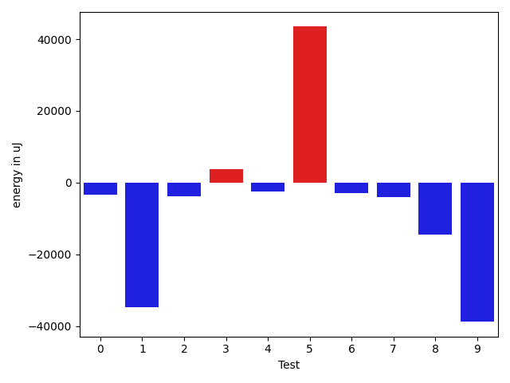
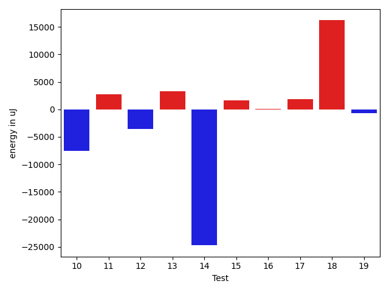
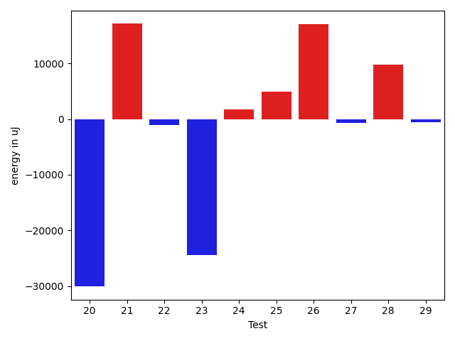
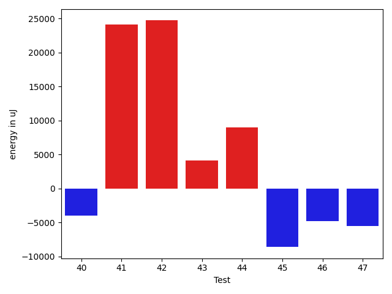

# gson 59edfc

https://github.com/google/gson/commit/59edfc

## Delta Energy per test method

| ID | EnergyV1 | EnergyV2 | DeltaEnergy | σV1 | %σV1 | σV2 | %σV2 |
| --- | --- | --- | --- | --- | --- | --- | --- |
| 0 | 44372 | 41077 | -3295 | 20012.13 | 45.10 | 2445.92 | 5.95 |
| 1 | 204833 | 169983 | -34850 | 25143.81 | 12.28 | 15960.86 | 9.39 |
| 2 | 85144 | 81421 | -3723 | 20441.06 | 24.01 | 38302.85 | 47.04 |
| 3 | 88440 | 92224 | 3784 | 25892.54 | 29.28 | 17718.63 | 19.21 |
| 4 | 114685 | 112182 | -2503 | 20332.92 | 17.73 | 24029.27 | 21.42 |
| 5 | 657347 | 700804 | 43457 | 53722.70 | 8.17 | 42805.70 | 6.11 |
| 6 | 88013 | 85082 | -2931 | 20750.92 | 23.58 | 15293.20 | 17.97 |
| 7 | 162170 | 158081 | -4089 | 19702.32 | 12.15 | 19457.53 | 12.31 |
| 8 | 296875 | 282287 | -14588 | 25080.25 | 8.45 | 27335.41 | 9.68 |
| 9 | 164489 | 125671 | -38818 | 23739.56 | 14.43 | 18391.48 | 14.63 |
| 10 | 168517 | 161010 | -7507 | 21596.17 | 12.82 | 17305.21 | 10.75 |
| 11 | 73609 | 76294 | 2685 | 21195.26 | 28.79 | 19820.94 | 25.98 |
| 12 | 84533 | 80933 | -3600 | 15478.87 | 18.31 | 20005.82 | 24.72 |
| 13 | 605345 | 608641 | 3296 | 62975.79 | 10.40 | 18318.28 | 3.01 |
| 14 | 140808 | 116088 | -24720 | 44783.88 | 31.80 | 24125.48 | 20.78 |
| 15 | 76294 | 77942 | 1648 | 13241.86 | 17.36 | 21740.06 | 27.89 |
| 16 | 145569 | 145691 | 122 | 31099.42 | 21.36 | 14941.91 | 10.26 |
| 17 | 72876 | 74707 | 1831 | 16622.91 | 22.81 | 17039.72 | 22.81 |
| 18 | 164184 | 180358 | 16174 | 22977.08 | 13.99 | 18661.13 | 10.35 |
| 19 | 164733 | 164062 | -671 | 30644.96 | 18.60 | 36124.47 | 22.02 |
| 20 | 109313 | 79224 | -30089 | 19959.69 | 18.26 | 30212.33 | 38.14 |
| 21 | 82276 | 99426 | 17150 | 22543.01 | 27.40 | 20816.44 | 20.94 |
| 22 | 72021 | 70984 | -1037 | 16901.22 | 23.47 | 17895.02 | 25.21 |
| 23 | 584715 | 560240 | -24475 | 54361.08 | 9.30 | 62765.09 | 11.20 |
| 24 | 89538 | 91308 | 1770 | 22517.17 | 25.15 | 13271.17 | 14.53 |
| 25 | 323791 | 328735 | 4944 | 22612.16 | 6.98 | 8407.23 | 2.56 |
| 26 | 328124 | 345153 | 17029 | 54643.34 | 16.65 | 36075.44 | 10.45 |
| 27 | 46875 | 46203 | -672 | 22383.00 | 47.75 | 17158.10 | 37.14 |
| 28 | 137878 | 147704 | 9826 | 21279.83 | 15.43 | 19004.12 | 12.87 |
| 29 | 131652 | 131042 | -610 | 24053.07 | 18.27 | 27959.97 | 21.34 |
| 30 | 45227 | 41504 | -3723 | 14524.05 | 32.11 | 19529.68 | 47.05 |
| 31 | 71960 | 83068 | 11108 | 21668.40 | 30.11 | 27955.94 | 33.65 |
| 32 | 82458 | 86060 | 3602 | 20345.54 | 24.67 | 24661.03 | 28.66 |
| 33 | 159606 | 159973 | 367 | 20362.31 | 12.76 | 11356.76 | 7.10 |
| 34 | 131653 | 130737 | -916 | 17580.29 | 13.35 | 58242.83 | 44.55 |
| 35 | 93749 | 94299 | 550 | 20671.97 | 22.05 | 21037.02 | 22.31 |
| 36 | 107605 | 110108 | 2503 | 21179.88 | 19.68 | 26431.93 | 24.01 |
| 37 | 74035 | 75805 | 1770 | 20703.46 | 27.96 | 21125.49 | 27.87 |
| 38 | 89172 | 93384 | 4212 | 30450.25 | 34.15 | 31540.54 | 33.78 |
| 39 | 525817 | 499694 | -26123 | 32086.93 | 6.10 | 68664.23 | 13.74 |
| 40 | 87341 | 83373 | -3968 | 17741.44 | 20.31 | 16408.78 | 19.68 |
| 41 | 520323 | 544493 | 24170 | 46895.73 | 9.01 | 49179.44 | 9.03 |
| 42 | 1807246 | 1831965 | 24719 | 138172.72 | 7.65 | 122669.89 | 6.70 |
| 43 | 152892 | 156982 | 4090 | 23649.75 | 15.47 | 34688.79 | 22.10 |
| 44 | 255981 | 265014 | 9033 | 31826.03 | 12.43 | 23134.50 | 8.73 |
| 45 | 127075 | 118469 | -8606 | 19089.38 | 15.02 | 19065.16 | 16.09 |
| 46 | 475158 | 470397 | -4761 | 22156.67 | 4.66 | 26568.74 | 5.65 |
| 47 | 263976 | 258422 | -5554 | 21181.81 | 8.02 | 22383.10 | 8.66 |

## Misc.

| ID | Test Class | Test Method |
| --- | --- | --- |
| 0 | com.google.gson.functional.MapTest | testWriteMapsWithEmptyStringKey |
| 1 | com.google.gson.functional.ReadersWritersTest | testReadWriteTwoObjects |
| 2 | com.google.gson.functional.ReadersWritersTest | testWriterForSerialization |
| 3 | com.google.gson.functional.CollectionTest | testRawCollectionSerialization |
| 4 | com.google.gson.functional.CollectionTest | testCollectionOfBagOfPrimitivesSerialization |
| 5 | com.google.gson.functional.CollectionTest | testWildcardCollectionField |
| 6 | com.google.gson.functional.ObjectTest | testNestedSerialization |
| 7 | com.google.gson.functional.ObjectTest | testNullFieldsSerialization |
| 8 | com.google.gson.functional.ObjectTest | testArrayOfObjectsAsFields |
| 9 | com.google.gson.functional.ObjectTest | testBagOfPrimitiveWrappersSerialization |
| 10 | com.google.gson.functional.ObjectTest | testArrayOfArraysSerialization |
| 11 | com.google.gson.functional.ObjectTest | testBagOfPrimitivesSerialization |
| 12 | com.google.gson.functional.ObjectTest | testArrayOfObjectsSerialization |
| 13 | com.google.gson.JsonParserTest | testReadWriteTwoObjects |
| 14 | com.google.gson.stream.JsonWriterTest | testPrettyPrintArray |
| 15 | com.google.gson.stream.JsonWriterTest | testPrettyPrintObject |
| 16 | com.google.gson.stream.JsonWriterTest | testDoubles |
| 17 | com.google.gson.stream.JsonWriterTest | testTopLevelValueTypes |
| 18 | com.google.gson.functional.JsonTreeTest | testJsonTreeNull |
| 19 | com.google.gson.functional.JsonTreeTest | testJsonTreeToString |
| 20 | com.google.gson.functional.JsonTreeTest | testToJsonTreeObjectType |
| 21 | com.google.gson.functional.JsonTreeTest | testToJsonTree |
| 22 | com.google.gson.internal.bind.JsonTreeWriterTest | testLenientNansAndInfinities |
| 23 | com.google.gson.internal.bind.JsonTreeWriterTest | testStrictNansAndInfinities |
| 24 | com.google.gson.functional.TypeVariableTest | testBasicTypeVariables |
| 25 | com.google.gson.functional.TypeVariableTest | testAdvancedTypeVariables |
| 26 | com.google.gson.functional.TypeVariableTest | testTypeVariablesViaTypeParameter |
| 27 | com.google.gson.OverrideCoreTypeAdaptersTest | testOverridePrimitiveBooleanAdapter |
| 28 | com.google.gson.OverrideCoreTypeAdaptersTest | testOverrideWrapperBooleanAdapter |
| 29 | com.google.gson.functional.ArrayTest | testObjectArrayWithNonPrimitivesSerialization |
| 30 | com.google.gson.functional.PrimitiveTest | testPrimitiveBooleanAutoboxedSerialization |
| 31 | com.google.gson.functional.PrimitiveTest | testPrimitiveBooleanAutoboxedInASingleElementArraySerialization |
| 32 | com.google.gson.functional.UncategorizedTest | testGsonInstanceReusableForSerializationAndDeserialization |
| 33 | com.google.gson.functional.UncategorizedTest | testStaticFieldsAreNotSerialized |
| 34 | com.google.gson.functional.EscapingTest | testGsonDoubleDeserialization |
| 35 | com.google.gson.functional.EscapingTest | testGsonAcceptsEscapedAndNonEscapedJsonDeserialization |
| 36 | com.google.gson.functional.EscapingTest | testEscapingObjectFields |
| 37 | com.google.gson.functional.SecurityTest | testNonExecutableJsonSerialization |
| 38 | com.google.gson.functional.VersioningTest | testVersionedGsonWithUnversionedClassesSerialization |
| 39 | com.google.gson.functional.MapAsArrayTypeAdapterTest | testSerializeComplexMapWithTypeAdapter |
| 40 | com.google.gson.functional.PrettyPrintingTest | testPrettyPrintArrayOfObjects |
| 41 | com.google.gson.functional.PrettyPrintingTest | testPrettyPrintList |
| 42 | com.google.gson.functional.DefaultTypeAdaptersTest | testNullSerialization |
| 43 | com.google.gson.functional.PrintFormattingTest | testCompactFormattingLeavesNoWhiteSpace |
| 44 | com.google.gson.functional.ParameterizedTypesTest | testTypesWithMultipleParametersSerialization |
| 45 | com.google.gson.functional.InheritanceTest | testSubClassSerialization |
| 46 | com.google.gson.functional.DelegateTypeAdapterTest | testDelegateInvoked |
| 47 | com.google.gson.functional.CustomTypeAdaptersTest | testCustomSerializerInvokedForPrimitives |

## Classifications

### Tests
| ID | Class | Delta | Share |
| --- | --- | --- | --- |
| G | NEUTRAL | -41989.0 | - |
| N | NEGATIVE | -251829.0 | 4.17 |
| P | POSITIVE | 209840.0 | 4.17 |
| 1 | NEGATIVE | -34850.0 | 13.84 |
| 5 | POSITIVE | 43457.0 | 20.71 |
| 9 | NEGATIVE | -38818.0 | 15.41 |
| 14 | NEGATIVE | -24720.0 | 9.82 |
| 18 | POSITIVE | 16174.0 | 7.71 |
| 20 | NEGATIVE | -30089.0 | 11.95 |
| 21 | POSITIVE | 17150.0 | 8.17 |
| 23 | NEGATIVE | -24475.0 | 9.72 |
| 26 | POSITIVE | 17029.0 | 8.12 |
| 39 | NEGATIVE | -26123.0 | 10.37 |
| 41 | POSITIVE | 24170.0 | 11.52 |
| 42 | POSITIVE | 24719.0 | 11.78 |

### Lines
| Class | Java Class | Line |
| --- | --- | --- |
| negative | com.google.gson.internal.bind.TypeAdapters | 165 |
| negative | com.google.gson.stream.JsonWriter | 482 |
| negative | com.google.gson.stream.JsonWriter | 483 |
| negative | com.google.gson.stream.JsonWriter | 477 |
| negative | com.google.gson.internal.bind.JsonTreeWriter | 163 |
| negative | com.google.gson.internal.bind.JsonTreeWriter | 164 |
| negative | com.google.gson.internal.bind.JsonTreeWriter | 166 |
| negative | com.google.gson.internal.bind.JsonTreeWriter | 167 |
| positive | com.google.gson.internal.bind.TypeAdapters | 165 |
| positive | com.google.gson.internal.bind.TypeAdapters | 166 |
| positive | com.google.gson.stream.JsonWriter | 482 |
| positive | com.google.gson.stream.JsonWriter | 483 |
| positive | com.google.gson.stream.JsonWriter | 477 |
| positive | com.google.gson.stream.JsonWriter | 478 |
| positive | com.google.gson.internal.bind.JsonTreeWriter | 163 |
| positive | com.google.gson.internal.bind.JsonTreeWriter | 166 |
| positive | com.google.gson.internal.bind.JsonTreeWriter | 167 |
| unknown | com.google.gson.internal.bind.TypeAdapters | 165 |
| unknown | com.google.gson.stream.JsonWriter | 482 |
| unknown | com.google.gson.stream.JsonWriter | 483 |
| unknown | com.google.gson.stream.JsonWriter | 477 |
| unknown | com.google.gson.stream.JsonWriter | 478 |
| unknown | com.google.gson.internal.bind.JsonTreeWriter | 163 |
| unknown | com.google.gson.internal.bind.JsonTreeWriter | 166 |
| unknown | com.google.gson.internal.bind.JsonTreeWriter | 167 |

## Localization of Green Regression
### Selected Tests
| Test class | test method |
| --- | --- |

### Suspected lines
| Class | line |
| --- | --- |
| com.google.gson.stream.JsonWriter | [482](https://github.com/google/gson/tree/59edfc/gson/src/main/java/com/google/gson/stream/JsonWriter.java#L482) |
| com.google.gson.stream.JsonWriter | [483](https://github.com/google/gson/tree/59edfc/gson/src/main/java/com/google/gson/stream/JsonWriter.java#L482#L483) |
| com.google.gson.stream.JsonWriter | [477](https://github.com/google/gson/tree/59edfc/gson/src/main/java/com/google/gson/stream/JsonWriter.java#L482#L483#L477) |
| com.google.gson.stream.JsonWriter | [478](https://github.com/google/gson/tree/59edfc/gson/src/main/java/com/google/gson/stream/JsonWriter.java#L482#L483#L477#L478) |
| com.google.gson.internal.bind.JsonTreeWriter | [163](https://github.com/google/gson/tree/59edfc/gson/src/main/java/com/google/gson/internal/bind/JsonTreeWriter.java#L163) |
| com.google.gson.internal.bind.JsonTreeWriter | [166](https://github.com/google/gson/tree/59edfc/gson/src/main/java/com/google/gson/internal/bind/JsonTreeWriter.java#L163#L166) |
| com.google.gson.internal.bind.JsonTreeWriter | [167](https://github.com/google/gson/tree/59edfc/gson/src/main/java/com/google/gson/internal/bind/JsonTreeWriter.java#L163#L166#L167) |
| com.google.gson.internal.bind.JsonTreeWriter | [164](https://github.com/google/gson/tree/59edfc/gson/src/main/java/com/google/gson/internal/bind/JsonTreeWriter.java#L163#L166#L167#L164) |
| com.google.gson.internal.bind.TypeAdapters | [165](https://github.com/google/gson/tree/59edfc/gson/src/main/java/com/google/gson/internal/bind/TypeAdapters.java#L165) |
| com.google.gson.internal.bind.TypeAdapters | [166](https://github.com/google/gson/tree/59edfc/gson/src/main/java/com/google/gson/internal/bind/TypeAdapters.java#L165#L166) |

| Time Label | Time (s) |
| --- | --- |
| Selection | 34.513070583343506 |
| Injection | 25.220269203186035 |
| Total | 227.9159758090973 |

