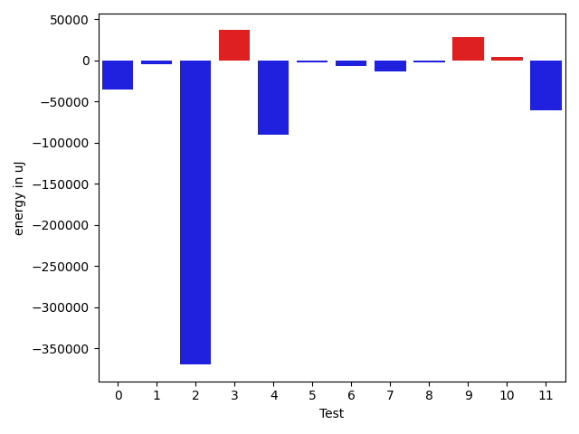
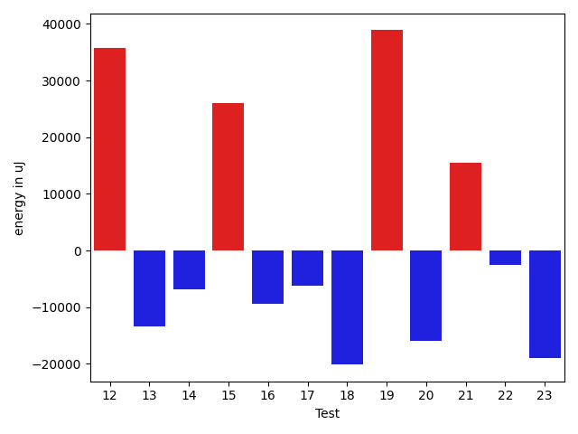
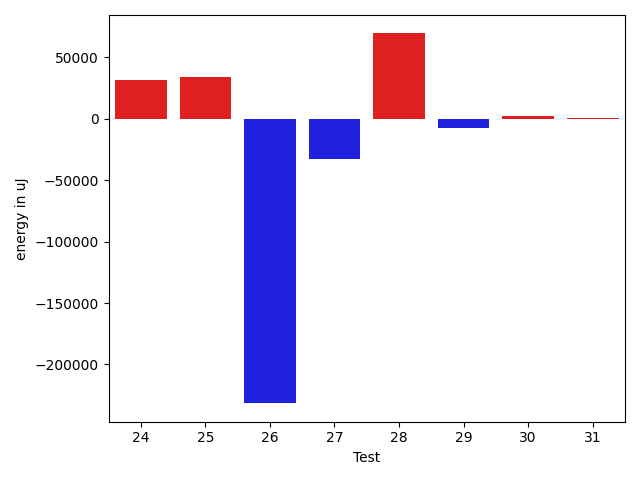

# gson ab4046

https://github.com/google/gson/commit/ab4046

## Delta Energy per test method

| ID | EnergyV1 | EnergyV2 | DeltaEnergy | σV1 | %σV1 | σV2 | %σV2 |
| --- | --- | --- | --- | --- | --- | --- | --- |
| 0 | 250610 | 215392 | -35218 | 27610.76 | 11.02 | 28224.09 | 13.10 |
| 1 | 114379 | 109985 | -4394 | 14988.74 | 13.10 | 12022.68 | 10.93 |
| 2 | 445434 | 75866 | -369568 | 90676.05 | 20.36 | 11345.67 | 14.95 |
| 3 | 113220 | 149780 | 36560 | 18579.18 | 16.41 | 15848.26 | 10.58 |
| 4 | 488463 | 397704 | -90759 | 48913.99 | 10.01 | 28065.87 | 7.06 |
| 5 | 402160 | 400084 | -2076 | 51807.02 | 12.88 | 27196.71 | 6.80 |
| 6 | 78857 | 71961 | -6896 | 11720.99 | 14.86 | 16899.81 | 23.48 |
| 7 | 125061 | 111694 | -13367 | 28514.72 | 22.80 | 18120.63 | 16.22 |
| 8 | 176880 | 174438 | -2442 | 16020.87 | 9.06 | 28258.15 | 16.20 |
| 9 | 221557 | 249755 | 28198 | 28165.72 | 12.71 | 27272.76 | 10.92 |
| 10 | 168335 | 172058 | 3723 | 14000.43 | 8.32 | 30991.42 | 18.01 |
| 11 | 324645 | 264465 | -60180 | 32667.45 | 10.06 | 37913.00 | 14.34 |
| 12 | 179137 | 214904 | 35767 | 17277.48 | 9.64 | 20232.30 | 9.41 |
| 13 | 161560 | 148193 | -13367 | 21666.18 | 13.41 | 28869.59 | 19.48 |
| 14 | 146362 | 139465 | -6897 | 15753.50 | 10.76 | 19953.95 | 14.31 |
| 15 | 201050 | 227050 | 26000 | 20294.04 | 10.09 | 50531.94 | 22.26 |
| 16 | 152466 | 143066 | -9400 | 28110.73 | 18.44 | 24989.44 | 17.47 |
| 17 | 159606 | 153320 | -6286 | 33866.53 | 21.22 | 19810.38 | 12.92 |
| 18 | 282226 | 262084 | -20142 | 30855.46 | 10.93 | 26620.46 | 10.16 |
| 19 | 110962 | 149841 | 38879 | 15331.19 | 13.82 | 19089.08 | 12.74 |
| 20 | 327208 | 311278 | -15930 | 31172.93 | 9.53 | 26075.35 | 8.38 |
| 21 | 90759 | 106262 | 15503 | 18193.53 | 20.05 | 19390.98 | 18.25 |
| 22 | 164428 | 161925 | -2503 | 27105.31 | 16.48 | 39369.90 | 24.31 |
| 23 | 404235 | 385314 | -18921 | 51243.87 | 12.68 | 20628.10 | 5.35 |
| 24 | 114990 | 146545 | 31555 | 22397.88 | 19.48 | 19584.81 | 13.36 |
| 25 | 290893 | 324706 | 33813 | 27904.34 | 9.59 | 28255.49 | 8.70 |
| 26 | 690794 | 459228 | -231566 | 51651.07 | 7.48 | 37587.37 | 8.18 |
| 27 | 254089 | 221191 | -32898 | 17862.06 | 7.03 | 23277.21 | 10.52 |
| 28 | 434508 | 503844 | 69336 | 22330.88 | 5.14 | 14541.36 | 2.89 |
| 29 | 219360 | 211853 | -7507 | 4424.39 | 2.02 | 19745.49 | 9.32 |
| 30 | 107116 | 109619 | 2503 | 10450.13 | 9.76 | 17175.68 | 15.67 |
| 31 | 117736 | 117920 | 184 | 36478.32 | 30.98 | 5348.39 | 4.54 |

## Misc.

| ID | Test Class | Test Method |
| --- | --- | --- |
| 0 | com.google.gson.functional.StreamingTypeAdaptersTest | testFromJsonTree |
| 1 | com.google.gson.functional.StreamingTypeAdaptersTest | testDeserialize |
| 2 | com.google.gson.functional.DefaultTypeAdaptersTest | testBadValueForBigDecimalDeserialization |
| 3 | com.google.gson.functional.DefaultTypeAdaptersTest | testBigIntegerFieldDeserialization |
| 4 | com.google.gson.functional.DefaultTypeAdaptersTest | testBigDecimalFieldDeserialization |
| 5 | com.google.gson.functional.RuntimeTypeAdapterFactoryFunctionalTest | testSubclassesAutomaticallySerialzed |
| 6 | com.google.gson.functional.NamingPolicyTest | testGsonWithLowerCaseDashPolicyDeserialiation |
| 7 | com.google.gson.functional.NamingPolicyTest | testGsonWithUpperCamelCaseSpacesPolicyDeserialiation |
| 8 | com.google.gson.functional.NamingPolicyTest | testGsonWithNonDefaultFieldNamingPolicyDeserialiation |
| 9 | com.google.gson.functional.NamingPolicyTest | testComplexFieldNameStrategy |
| 10 | com.google.gson.functional.NamingPolicyTest | testGsonWithLowerCaseUnderscorePolicyDeserialiation |
| 11 | com.google.gson.functional.CustomDeserializerTest | testCustomDeserializerReturnsNull |
| 12 | com.google.gson.functional.JsonAdapterAnnotationOnFieldsTest | testClassAnnotationAdapterFactoryTakesPrecedenceOverDefault |
| 13 | com.google.gson.functional.JsonAdapterAnnotationOnFieldsTest | testJsonAdapterWrappedInNullSafeAsRequested |
| 14 | com.google.gson.functional.JsonAdapterAnnotationOnFieldsTest | testClassAnnotationAdapterTakesPrecedenceOverDefault |
| 15 | com.google.gson.functional.JsonAdapterAnnotationOnFieldsTest | testRegisteredTypeAdapterTakesPrecedenceOverClassAnnotationAdapter |
| 16 | com.google.gson.functional.JsonAdapterAnnotationOnFieldsTest | testFieldAnnotationTakesPrecedenceOverClassAnnotation |
| 17 | com.google.gson.functional.JsonAdapterAnnotationOnFieldsTest | testJsonAdapterInvokedOnlyForAnnotatedFields |
| 18 | com.google.gson.functional.JsonAdapterAnnotationOnFieldsTest | testFieldAnnotationTakesPrecedenceOverRegisteredTypeAdapter |
| 19 | com.google.gson.functional.InheritanceTest | testSubClassDeserialization |
| 20 | com.google.gson.functional.InheritanceTest | testSubInterfacesOfCollectionDeserialization |
| 21 | com.google.gson.functional.SerializedNameTest | testMultipleNamesDeserializedCorrectly |
| 22 | com.google.gson.functional.SerializedNameTest | testMultipleNamesInTheSameString |
| 23 | com.google.gson.functional.InstanceCreatorTest | testInstanceCreatorReturnsSubTypeForField |
| 24 | com.google.gson.functional.ExposeFieldsTest | testExposedInterfaceFieldDeserialization |
| 25 | com.google.gson.functional.ExposeFieldsTest | testExposeAnnotationDeserialization |
| 26 | com.google.gson.regression.JsonAdapterNullSafeTest | testNullSafeBugDeserialize |
| 27 | com.google.gson.functional.CollectionTest | testSetDeserialization |
| 28 | com.google.gson.functional.CollectionTest | testWildcardCollectionField |
| 29 | com.google.gson.functional.MapTest | testComplexKeysDeserialization |
| 30 | com.google.gson.functional.CustomTypeAdaptersTest | testEnsureCustomDeserializerNotInvokedForNullValues |
| 31 | com.google.gson.functional.ObjectTest | testBagOfPrimitiveWrappersDeserialization |

## Classifications

### Tests
| ID | Class | Delta | Share |
| --- | --- | --- | --- |
| G | NEUTRAL | -628296.0 | - |
| N | NEGATIVE | -950317.0 | 5.00 |
| P | POSITIVE | 322021.0 | 8.33 |
| 2 | NEGATIVE | -369568.0 | 38.89 |
| 4 | NEGATIVE | -90759.0 | 9.55 |
| 26 | NEGATIVE | -231566.0 | 24.37 |
| 28 | POSITIVE | 69336.0 | 21.53 |

### Lines
| Class | Java Class | Line |
| --- | --- | --- |
| negative | com.google.gson.internal.UnsafeAllocator | 49 |
| negative | com.google.gson.internal.UnsafeAllocator | 115 |
| negative | com.google.gson.internal.UnsafeAllocator | 116 |
| negative | com.google.gson.internal.UnsafeAllocator | 119 |
| positive | com.google.gson.internal.UnsafeAllocator | 49 |
| positive | com.google.gson.internal.UnsafeAllocator | 115 |
| positive | com.google.gson.internal.UnsafeAllocator | 116 |
| positive | com.google.gson.internal.UnsafeAllocator | 119 |
| unknown | com.google.gson.internal.UnsafeAllocator | 49 |
| unknown | com.google.gson.internal.UnsafeAllocator | 115 |
| unknown | com.google.gson.internal.UnsafeAllocator | 116 |
| unknown | com.google.gson.internal.UnsafeAllocator | 117 |
| unknown | com.google.gson.internal.UnsafeAllocator | 119 |
| unknown | com.google.gson.internal.UnsafeAllocator | 120 |

## Localization of Green Regression
### Selected Tests
| Test class | test method |
| --- | --- |

### Suspected lines
| Class | line |
| --- | --- |
| com.google.gson.internal.UnsafeAllocator | [49](https://github.com/google/gson/tree/ab4046/gson/src/main/java/com/google/gson/internal/UnsafeAllocator.java#L49) |
| com.google.gson.internal.UnsafeAllocator | [115](https://github.com/google/gson/tree/ab4046/gson/src/main/java/com/google/gson/internal/UnsafeAllocator.java#L49#L115) |
| com.google.gson.internal.UnsafeAllocator | [116](https://github.com/google/gson/tree/ab4046/gson/src/main/java/com/google/gson/internal/UnsafeAllocator.java#L49#L115#L116) |
| com.google.gson.internal.UnsafeAllocator | [119](https://github.com/google/gson/tree/ab4046/gson/src/main/java/com/google/gson/internal/UnsafeAllocator.java#L49#L115#L116#L119) |
| com.google.gson.internal.UnsafeAllocator | [117](https://github.com/google/gson/tree/ab4046/gson/src/main/java/com/google/gson/internal/UnsafeAllocator.java#L49#L115#L116#L119#L117) |
| com.google.gson.internal.UnsafeAllocator | [120](https://github.com/google/gson/tree/ab4046/gson/src/main/java/com/google/gson/internal/UnsafeAllocator.java#L49#L115#L116#L119#L117#L120) |

| Time Label | Time (s) |
| --- | --- |
| Selection | 34.10765528678894 |
| Injection | 30.13073706626892 |
| Total | 228.6981019973755 |

