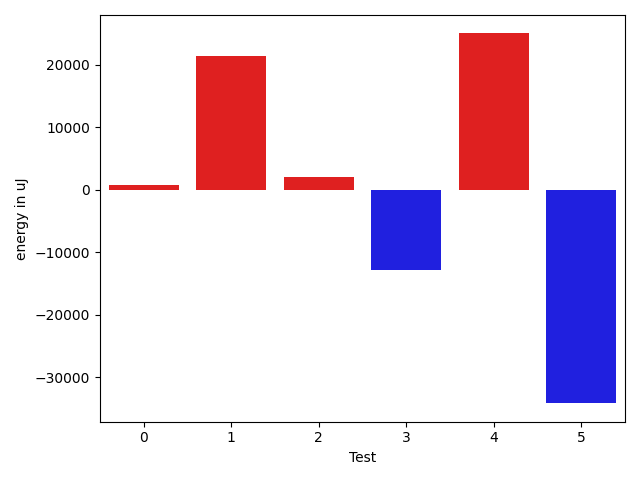

# gson 34d752

https://github.com/google/gson/commit/34d752

## Delta Energy per test method

| ID | EnergyV1 | EnergyV2 | DeltaEnergy | σV1 | %σV1 | σV2 | %σV2 |
| --- | --- | --- | --- | --- | --- | --- | --- |
| 0 | 192871 | 193603 | 732 | 12559.35 | 6.51 | 18874.41 | 9.75 |
| 1 | 225036 | 246459 | 21423 | 84873.55 | 37.72 | 19398.57 | 7.87 |
| 2 | 452147 | 454162 | 2015 | 30763.38 | 6.80 | 20651.00 | 4.55 |
| 3 | 1793941 | 1781185 | -12756 | 146107.70 | 8.14 | 103641.51 | 5.82 |
| 4 | 817320 | 842283 | 24963 | 47311.76 | 5.79 | 36561.58 | 4.34 |
| 5 | 1531552 | 1497432 | -34120 | 69144.24 | 4.51 | 35721.59 | 2.39 |

## Misc.

| ID | Test Class | Test Method |
| --- | --- | --- |
| 0 | com.google.gson.functional.NullObjectAndFieldTest | testCustomTypeAdapterPassesNullSerialization |
| 1 | com.google.gson.functional.NullObjectAndFieldTest | testCustomTypeAdapterPassesNullDesrialization |
| 2 | com.google.gson.functional.ParameterizedTypesTest | testParameterizedTypeWithCustomSerializer |
| 3 | com.google.gson.functional.CustomDeserializerTest | testJsonTypeFieldBasedDeserialization |
| 4 | com.google.gson.functional.TypeHierarchyAdapterTest | testTypeHierarchy |
| 5 | com.google.gson.functional.CircularReferenceTest | testSelfReferenceCustomHandlerSerialization |

## Classifications

### Tests
| ID | Class | Delta | Share |
| --- | --- | --- | --- |
| G | NEUTRAL | 2257.0 | - |
| N | NEGATIVE | -46876.0 | 50.00 |
| P | POSITIVE | 49133.0 | 25.00 |
| 1 | POSITIVE | 21423.0 | 43.60 |
| 4 | POSITIVE | 24963.0 | 50.81 |

### Lines
| Class | Java Class | Line |
| --- | --- | --- |
| positive | com.google.gson.Gson | 148 |
| positive | com.google.gson.Gson | 139 |
| unknown | com.google.gson.Gson | 145 |
| unknown | com.google.gson.Gson | 139 |

## Localization of Green Regression
### Selected Tests
| Test class | test method |
| --- | --- |
| com.google.gson.functional.NullObjectAndFieldTest | testCustomTypeAdapterPassesNullDesrialization |
| com.google.gson.functional.TypeHierarchyAdapterTest | testTypeHierarchy |

### Suspected lines
| Class | line |
| --- | --- |
| com.google.gson.Gson | [139](https://github.com/google/gson/tree/34d752/gson/src/main/java/com/google/gson/Gson.java#L139) |
| com.google.gson.Gson | [145](https://github.com/google/gson/tree/34d752/gson/src/main/java/com/google/gson/Gson.java#L139#L145) |
| com.google.gson.Gson | [148](https://github.com/google/gson/tree/34d752/gson/src/main/java/com/google/gson/Gson.java#L139#L145#L148) |

| Time Label | Time (s) |
| --- | --- |
| Selection | 34.72010850906372 |
| Injection | 24.214749097824097 |
| Total | 208.02541661262512 |

