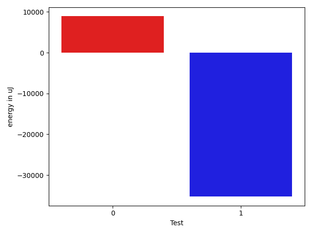

# gson 0669ff

https://github.com/google/gson/commit/0669ff

## Delta Energy per test method

| ID | EnergyV1 | EnergyV2 | DeltaEnergy | σV1 | %σV1 | σV2 | %σV2 |
| --- | --- | --- | --- | --- | --- | --- | --- |
| 0 | 204346 | 213256 | 8910 | 30166.25 | 14.76 | 12995.34 | 6.09 |
| 1 | 1758602 | 1723323 | -35279 | 102788.68 | 5.84 | 190331.06 | 11.04 |

## Misc.

| ID | Test Class | Test Method |
| --- | --- | --- |
| 0 | com.google.gson.functional.JavaUtilConcurrentAtomicTest | testAtomicLongWithStringSerializationPolicy |
| 1 | com.google.gson.functional.JavaUtilConcurrentAtomicTest | testAtomicLongArrayWithStringSerializationPolicy |

## Classifications

### Tests
| ID | Class | Delta | Share |
| --- | --- | --- | --- |
| G | NEUTRAL | -26369.0 | - |
| N | NEGATIVE | -35279.0 | 100.00 |
| P | POSITIVE | 8910.0 | 100.00 |

### Lines
| Class | Java Class | Line |
| --- | --- | --- |
| unknown | com.google.gson.stream.JsonReader | 954 |
| unknown | com.google.gson.stream.JsonReader | 955 |
| unknown | com.google.gson.stream.JsonReader | 956 |

## Localization of Green Regression
### Selected Tests
| Test class | test method |
| --- | --- |
| com.google.gson.functional.JavaUtilConcurrentAtomicTest | testAtomicLongWithStringSerializationPolicy |

### Suspected lines
| Class | line |
| --- | --- |
| com.google.gson.stream.JsonReader | [954](https://github.com/google/gson/tree/0669ff/gson/src/main/java/com/google/gson/stream/JsonReader.java#L954) |
| com.google.gson.stream.JsonReader | [955](https://github.com/google/gson/tree/0669ff/gson/src/main/java/com/google/gson/stream/JsonReader.java#L954#L955) |
| com.google.gson.stream.JsonReader | [956](https://github.com/google/gson/tree/0669ff/gson/src/main/java/com/google/gson/stream/JsonReader.java#L954#L955#L956) |

| Time Label | Time (s) |
| --- | --- |
| Selection | 35.09377717971802 |
| Injection | 13.321233987808228 |
| Total | 191.61636185646057 |

