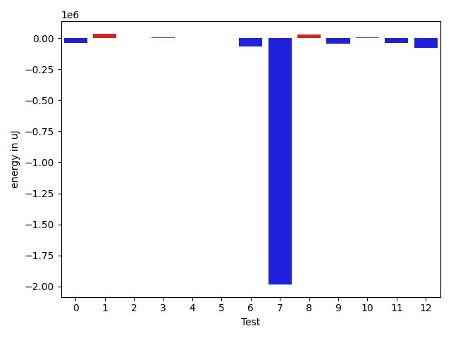

# gson c731ab

https://github.com/google/gson/commit/c731ab

## Delta Energy per test method

| ID | EnergyV1 | EnergyV2 | DeltaEnergy | σV1 | %σV1 | σV2 | %σV2 |
| --- | --- | --- | --- | --- | --- | --- | --- |
| 0 | 258056 | 215820 | -42236 | 28263.01 | 10.95 | 22594.04 | 10.47 |
| 1 | 219116 | 253600 | 34484 | 30550.02 | 13.94 | 36924.57 | 14.56 |
| 2 | 279601 | 280395 | 794 | 22803.76 | 8.16 | 24893.33 | 8.88 |
| 3 | 115418 | 123351 | 7933 | 19678.45 | 17.05 | 19212.29 | 15.58 |
| 4 | 133178 | 133544 | 366 | 26819.57 | 20.14 | 18669.56 | 13.98 |
| 5 | 130249 | 130920 | 671 | 15628.19 | 12.00 | 26124.03 | 19.95 |
| 6 | 582335 | 515929 | -66406 | 41184.40 | 7.07 | 37347.68 | 7.24 |
| 7 | 2185908 | 202636 | -1983272 | 180826.53 | 8.27 | 18089.24 | 8.93 |
| 8 | 184326 | 211669 | 27343 | 20918.30 | 11.35 | 16556.18 | 7.82 |
| 9 | 215575 | 171997 | -43578 | 31197.70 | 14.47 | 20668.82 | 12.02 |
| 10 | 203979 | 208862 | 4883 | 18955.07 | 9.29 | 7904.79 | 3.78 |
| 11 | 257628 | 221008 | -36620 | 27604.58 | 10.71 | 23106.18 | 10.45 |
| 12 | 371581 | 293762 | -77819 | 36375.28 | 9.79 | 11145.65 | 3.79 |

## Misc.

| ID | Test Class | Test Method |
| --- | --- | --- |
| 0 | com.google.gson.functional.JsonAdapterAnnotationOnClassesTest | testJsonAdapterInvoked |
| 1 | com.google.gson.functional.JsonAdapterAnnotationOnClassesTest | testRegisteredDeserializerOverridesJsonAdapter |
| 2 | com.google.gson.functional.JsonAdapterAnnotationOnClassesTest | testRegisteredSerializerOverridesJsonAdapter |
| 3 | com.google.gson.functional.JsonAdapterAnnotationOnClassesTest | testNullSafeObjectFromJson |
| 4 | com.google.gson.functional.JsonAdapterAnnotationOnClassesTest | testIncorrectTypeAdapterFails |
| 5 | com.google.gson.functional.JsonAdapterAnnotationOnClassesTest | testJsonAdapterFactoryInvoked |
| 6 | com.google.gson.functional.RuntimeTypeAdapterFactoryFunctionalTest | testSubclassesAutomaticallySerialzed |
| 7 | com.google.gson.functional.JsonAdapterAnnotationOnFieldsTest | testClassAnnotationAdapterFactoryTakesPrecedenceOverDefault |
| 8 | com.google.gson.functional.JsonAdapterAnnotationOnFieldsTest | testJsonAdapterWrappedInNullSafeAsRequested |
| 9 | com.google.gson.functional.JsonAdapterAnnotationOnFieldsTest | testClassAnnotationAdapterTakesPrecedenceOverDefault |
| 10 | com.google.gson.functional.JsonAdapterAnnotationOnFieldsTest | testFieldAnnotationTakesPrecedenceOverClassAnnotation |
| 11 | com.google.gson.functional.JsonAdapterAnnotationOnFieldsTest | testJsonAdapterInvokedOnlyForAnnotatedFields |
| 12 | com.google.gson.functional.JsonAdapterAnnotationOnFieldsTest | testFieldAnnotationTakesPrecedenceOverRegisteredTypeAdapter |

## Classifications

### Tests
| ID | Class | Delta | Share |
| --- | --- | --- | --- |
| G | NEUTRAL | -2173457.0 | - |
| N | NEGATIVE | -2249931.0 | 16.67 |
| P | POSITIVE | 76474.0 | 14.29 |
| 1 | POSITIVE | 34484.0 | 45.09 |
| 7 | NEGATIVE | -1983272.0 | 88.15 |
| 8 | POSITIVE | 27343.0 | 35.75 |

### Lines
| Class | Java Class | Line |
| --- | --- | --- |
| negative | com.google.gson.internal.bind.JsonAdapterAnnotationTypeAdapterFactory | 67 |
| negative | com.google.gson.internal.bind.JsonAdapterAnnotationTypeAdapterFactory | 68 |
| negative | com.google.gson.internal.bind.JsonAdapterAnnotationTypeAdapterFactory | 70 |
| negative | com.google.gson.internal.bind.JsonAdapterAnnotationTypeAdapterFactory | 54 |
| positive | com.google.gson.internal.bind.JsonAdapterAnnotationTypeAdapterFactory | 67 |
| positive | com.google.gson.internal.bind.JsonAdapterAnnotationTypeAdapterFactory | 68 |
| positive | com.google.gson.internal.bind.JsonAdapterAnnotationTypeAdapterFactory | 70 |
| positive | com.google.gson.internal.bind.JsonAdapterAnnotationTypeAdapterFactory | 54 |
| unknown | com.google.gson.internal.bind.JsonAdapterAnnotationTypeAdapterFactory | 67 |
| unknown | com.google.gson.internal.bind.JsonAdapterAnnotationTypeAdapterFactory | 68 |
| unknown | com.google.gson.internal.bind.JsonAdapterAnnotationTypeAdapterFactory | 70 |
| unknown | com.google.gson.internal.bind.JsonAdapterAnnotationTypeAdapterFactory | 54 |

## Localization of Green Regression
### Selected Tests
| Test class | test method |
| --- | --- |
| com.google.gson.functional.JsonAdapterAnnotationOnFieldsTest | testJsonAdapterWrappedInNullSafeAsRequested |
| com.google.gson.functional.JsonAdapterAnnotationOnClassesTest | testRegisteredDeserializerOverridesJsonAdapter |

### Suspected lines
| Class | line |
| --- | --- |
| com.google.gson.internal.bind.JsonAdapterAnnotationTypeAdapterFactory | [68](https://github.com/google/gson/tree/c731ab/gson/src/main/java/com/google/gson/internal/bind/JsonAdapterAnnotationTypeAdapterFactory.java#L68) |
| com.google.gson.internal.bind.JsonAdapterAnnotationTypeAdapterFactory | [54](https://github.com/google/gson/tree/c731ab/gson/src/main/java/com/google/gson/internal/bind/JsonAdapterAnnotationTypeAdapterFactory.java#L68#L54) |
| com.google.gson.internal.bind.JsonAdapterAnnotationTypeAdapterFactory | [67](https://github.com/google/gson/tree/c731ab/gson/src/main/java/com/google/gson/internal/bind/JsonAdapterAnnotationTypeAdapterFactory.java#L68#L54#L67) |
| com.google.gson.internal.bind.JsonAdapterAnnotationTypeAdapterFactory | [70](https://github.com/google/gson/tree/c731ab/gson/src/main/java/com/google/gson/internal/bind/JsonAdapterAnnotationTypeAdapterFactory.java#L68#L54#L67#L70) |

| Time Label | Time (s) |
| --- | --- |
| Selection | 32.95715093612671 |
| Injection | 23.0654354095459 |
| Total | 209.80893802642822 |

