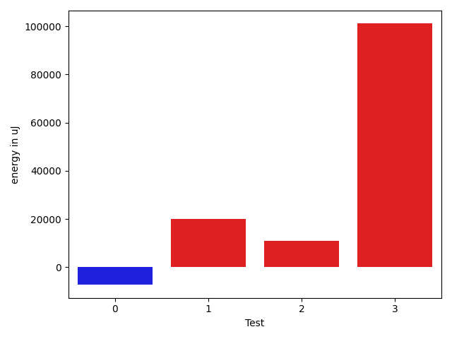

# gson 63ee47

https://github.com/google/gson/commit/63ee47

## Delta Energy per test method

| ID | EnergyV1 | EnergyV2 | DeltaEnergy | σV1 | %σV1 | σV2 | %σV2 |
| --- | --- | --- | --- | --- | --- | --- | --- |
| 0 | 262206 | 254943 | -7263 | 69583.07 | 26.54 | 49730.51 | 19.51 |
| 1 | 305053 | 325072 | 20019 | 32231.32 | 10.57 | 18440.04 | 5.67 |
| 2 | 402343 | 413207 | 10864 | 38037.89 | 9.45 | 44427.95 | 10.75 |
| 3 | 1999995 | 2101068 | 101073 | 295387.67 | 14.77 | 299246.33 | 14.24 |

## Misc.

| ID | Test Class | Test Method |
| --- | --- | --- |
| 0 | com.google.gson.functional.NamingPolicyTest | testGsonWithNonDefaultFieldNamingPolicySerialization |
| 1 | com.google.gson.functional.NamingPolicyTest | testGsonWithUpperCamelCaseSpacesPolicyDeserialiation |
| 2 | com.google.gson.functional.NamingPolicyTest | testGsonWithNonDefaultFieldNamingPolicyDeserialiation |
| 3 | com.google.gson.functional.NamingPolicyTest | testGsonWithUpperCamelCaseSpacesPolicySerialiation |

## Classifications

### Tests
| ID | Class | Delta | Share |
| --- | --- | --- | --- |
| G | NEUTRAL | 124693.0 | - |
| N | NEGATIVE | -7263.0 | 100.00 |
| P | POSITIVE | 131956.0 | 33.33 |
| 3 | POSITIVE | 101073.0 | 76.60 |

### Lines
| Class | Java Class | Line |
| --- | --- | --- |
| positive | com.google.gson.FieldNamingPolicy | 162 |
| positive | com.google.gson.FieldNamingPolicy | 163 |
| positive | com.google.gson.FieldNamingPolicy | 164 |
| positive | com.google.gson.FieldNamingPolicy | 166 |
| positive | com.google.gson.FieldNamingPolicy | 167 |
| positive | com.google.gson.FieldNamingPolicy | 168 |
| positive | com.google.gson.FieldNamingPolicy | 169 |
| positive | com.google.gson.FieldNamingPolicy | 171 |
| positive | com.google.gson.FieldNamingPolicy | 172 |
| positive | com.google.gson.FieldNamingPolicy | 173 |
| positive | com.google.gson.FieldNamingPolicy | 176 |
| positive | com.google.gson.FieldNamingPolicy | 177 |
| positive | com.google.gson.FieldNamingPolicy | 178 |
| positive | com.google.gson.FieldNamingPolicy | 185 |
| unknown | com.google.gson.FieldNamingPolicy | 162 |
| unknown | com.google.gson.FieldNamingPolicy | 163 |
| unknown | com.google.gson.FieldNamingPolicy | 164 |
| unknown | com.google.gson.FieldNamingPolicy | 166 |
| unknown | com.google.gson.FieldNamingPolicy | 167 |
| unknown | com.google.gson.FieldNamingPolicy | 168 |
| unknown | com.google.gson.FieldNamingPolicy | 169 |
| unknown | com.google.gson.FieldNamingPolicy | 171 |
| unknown | com.google.gson.FieldNamingPolicy | 172 |
| unknown | com.google.gson.FieldNamingPolicy | 173 |
| unknown | com.google.gson.FieldNamingPolicy | 176 |
| unknown | com.google.gson.FieldNamingPolicy | 177 |
| unknown | com.google.gson.FieldNamingPolicy | 178 |
| unknown | com.google.gson.FieldNamingPolicy | 185 |

## Localization of Green Regression
### Selected Tests
| Test class | test method |
| --- | --- |
| com.google.gson.functional.NamingPolicyTest | testGsonWithUpperCamelCaseSpacesPolicySerialiation |

### Suspected lines
| Class | line |
| --- | --- |
| com.google.gson.FieldNamingPolicy | [164](https://github.com/google/gson/tree/63ee47/gson/src/main/java/com/google/gson/FieldNamingPolicy.java#L164) |
| com.google.gson.FieldNamingPolicy | [167](https://github.com/google/gson/tree/63ee47/gson/src/main/java/com/google/gson/FieldNamingPolicy.java#L164#L167) |
| com.google.gson.FieldNamingPolicy | [163](https://github.com/google/gson/tree/63ee47/gson/src/main/java/com/google/gson/FieldNamingPolicy.java#L164#L167#L163) |
| com.google.gson.FieldNamingPolicy | [176](https://github.com/google/gson/tree/63ee47/gson/src/main/java/com/google/gson/FieldNamingPolicy.java#L164#L167#L163#L176) |
| com.google.gson.FieldNamingPolicy | [172](https://github.com/google/gson/tree/63ee47/gson/src/main/java/com/google/gson/FieldNamingPolicy.java#L164#L167#L163#L176#L172) |
| com.google.gson.FieldNamingPolicy | [173](https://github.com/google/gson/tree/63ee47/gson/src/main/java/com/google/gson/FieldNamingPolicy.java#L164#L167#L163#L176#L172#L173) |
| com.google.gson.FieldNamingPolicy | [162](https://github.com/google/gson/tree/63ee47/gson/src/main/java/com/google/gson/FieldNamingPolicy.java#L164#L167#L163#L176#L172#L173#L162) |
| com.google.gson.FieldNamingPolicy | [166](https://github.com/google/gson/tree/63ee47/gson/src/main/java/com/google/gson/FieldNamingPolicy.java#L164#L167#L163#L176#L172#L173#L162#L166) |
| com.google.gson.FieldNamingPolicy | [171](https://github.com/google/gson/tree/63ee47/gson/src/main/java/com/google/gson/FieldNamingPolicy.java#L164#L167#L163#L176#L172#L173#L162#L166#L171) |
| com.google.gson.FieldNamingPolicy | [168](https://github.com/google/gson/tree/63ee47/gson/src/main/java/com/google/gson/FieldNamingPolicy.java#L164#L167#L163#L176#L172#L173#L162#L166#L171#L168) |
| com.google.gson.FieldNamingPolicy | [169](https://github.com/google/gson/tree/63ee47/gson/src/main/java/com/google/gson/FieldNamingPolicy.java#L164#L167#L163#L176#L172#L173#L162#L166#L171#L168#L169) |
| com.google.gson.FieldNamingPolicy | [177](https://github.com/google/gson/tree/63ee47/gson/src/main/java/com/google/gson/FieldNamingPolicy.java#L164#L167#L163#L176#L172#L173#L162#L166#L171#L168#L169#L177) |
| com.google.gson.FieldNamingPolicy | [178](https://github.com/google/gson/tree/63ee47/gson/src/main/java/com/google/gson/FieldNamingPolicy.java#L164#L167#L163#L176#L172#L173#L162#L166#L171#L168#L169#L177#L178) |
| com.google.gson.FieldNamingPolicy | [185](https://github.com/google/gson/tree/63ee47/gson/src/main/java/com/google/gson/FieldNamingPolicy.java#L164#L167#L163#L176#L172#L173#L162#L166#L171#L168#L169#L177#L178#L185) |

| Time Label | Time (s) |
| --- | --- |
| Selection | 36.77386260032654 |
| Injection | 14.748291969299316 |
| Total | 212.94515681266785 |

